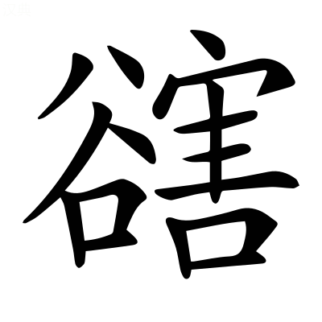
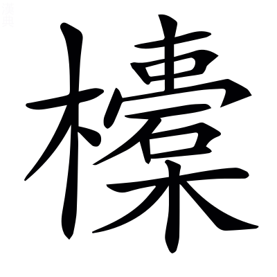
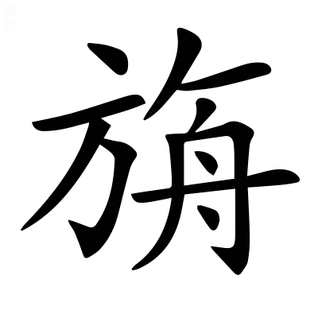
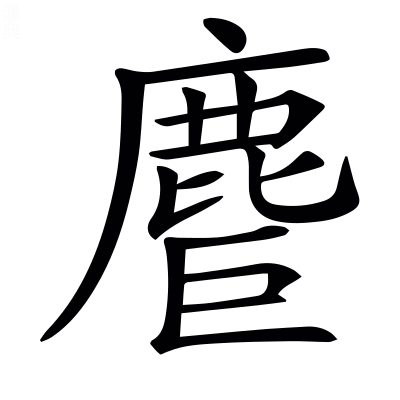
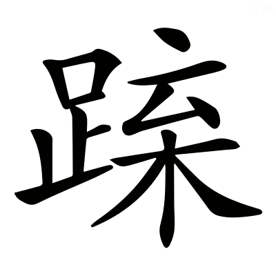
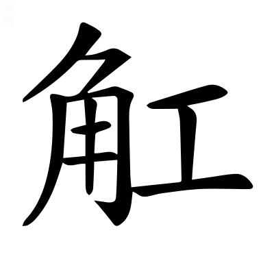
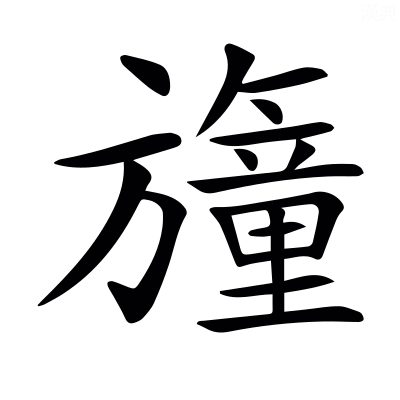
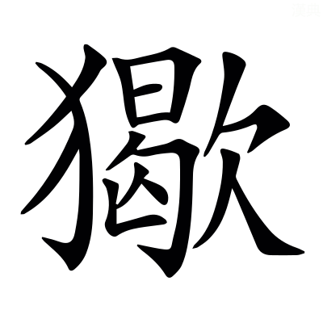
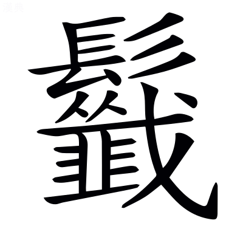
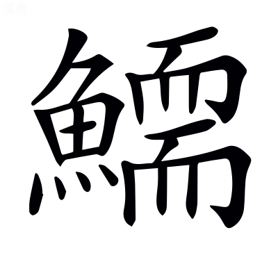

# <!-- page36 -->文選卷第二

> 梁昭明太子撰
> 
> 文林郎守太子右內率府錄事參軍事崇賢館直學士臣李善注上

京都上

## 西京賦一首

> 張平子〔善曰〕范曄後漢書曰：張衡，字平子，南陽西鄂人也，少善属文。時天下太平日久，自王侯以下，莫不踰侈，衡乃擬班固兩都，作二京賦，因以諷諫，十年乃成。安帝雅聞衡善術學，公車徵拜郎中，出爲河間相，乞骸骨，徵拜尙書，卒。楊泉物理論曰：平子二京，文章卓然。

> 薛綜注〔善曰〕舊注是者，因而留之，並於篇首題其姓名。其有乖繆，臣乃具釋，並稱「臣善」以別之。他皆類此。

有憑虛公子者，憑，依託也。虛，無也。言無有此公子也。〔善曰〕博物志曰：王孫公子，皆古人相推敬之辭。憑，皮兵切。

心奓體泰[^2.1]，奓、泰，言公子生於貴戚，心志奓溢，體安驕泰也。泰或謂忲習之忲，言習於麗好也。〔善曰〕聲類曰：奓，侈字也；昌氏切。小雅曰：狃，忲也。

雅好博古，學乎舊史氏，言公子雅性好博知古事，故學於舊史。舊史，太史掌圖典者也。

是以多識前代之載。〔善曰〕劉向七言曰：博學多識與凡殊。小雅曰：載，事也。

言於安處先生公子爲先生言也。安處猶烏處，若言何處，亦謂無此先生也。鄭玄禮記注曰：先生，老人教學者。

曰「夫人在陽時則舒，在陰時則慘，此牽乎天者也。陽謂春夏，陰謂秋冬。牽猶繫也。〔善曰〕春秋繁露曰：春之言猶偆也，偆者，喜樂之貌也。秋之言猶湫也，湫者，憂悲之狀也。偆，充尹切。湫，子由切。

處沃土則逸，處瘠土則勞，此繫乎地者也。〔善曰〕國語：公甫文伯之母曰「沃土之人不材，滛也，瘠<!-- page37 -->土之人莫不向義，勞也」。*韋昭曰：磽埆爲瘠。沃，肥美也。*

慘則尠於驩，勞則褊於惠，能違之者寡矣。違猶易也。言人慘戚則不能以驩逸，勞苦則不能以施惠，少有能易此者。〔善曰〕尠，少也，與鮮通也。廣雅曰：褊，狹也；卑緬切。

小必有之，大亦宜然。小謂庶人，大謂王者。〔善曰〕庶人因沃瘠而勞逸殊，王者亦因險易而彊弱異也。

故帝者因天地以致化，兆人承上教以成俗。言帝王必欲順~~陽~~時[^2.2]，居沃土，歡逸其人，使下承而化之，以成奢泰之俗。〔善曰〕管子曰：君據法而出令，百姓順上而成俗。

化俗之本，有與推移。言化之本，還與沃瘠相隨逐推移也。〔善曰〕淮南子曰：法其所以爲法，與化推移也。

何以覈諸。~~覈，驗也，胡革切。~~[^2.3]

秦據雍而彊，周即豫而弱，高祖都西而泰，光武處東而約，政之興衰，恒由此作。~~作，起也。~~[^2.4]〔善曰〕過秦論曰：秦孝公據雍州之地。呂氏春秋曰：河漢之閒爲豫州也。按雍州厥土惟黃壤，厥田惟上上，是沃土也，故云秦據雍而彊，高祖都西而泰。荊河惟豫州，厥土惟墳壚，厥田惟中上，是瘠土也，故云周即豫而弱，光武處東而約。左傳：晉叔向曰「存亡之道，恒由此興」。周禮曰：夫筋~~之所由憺~~，恒由此作[^2.5]。

先生獨不見西京之事歟？請爲吾子陳之。〔善曰〕鄭玄禮記注曰：吾子，相親之辭也。

---

漢氏初都，在渭之涘，涘，涯也。〔善曰〕漢書：東方朔曰「漢都涇渭之南」。毛詩曰：在渭之涘。

秦里其朔，寔爲咸陽。里，居也。朔，北也。寔，是也。秦地居其北，是曰咸陽。〔善曰〕史記曰：秦孝公作咸陽，徙都之。

左有崤函重險，桃林之塞。崤及函谷關、桃林皆在長安東，故言左。〔善曰〕殽函，已見西都賦。左氏傳曰：以守桃林之塞。按桃林，弘農，在閿鄉南谷中[^2.m1]。

綴以二華，巨靈贔屓，高掌遠蹠，以流河曲，厥跡猶存。華，山名也。巨靈，河神也。巨，大也。古語云「此本一山，當河水過之而曲行，河之神以手擘開其上，足蹋離其下，中分爲二，以通河流。手足之跡，于今尚在」。贔屓，作力之貌也。〔善曰〕賈逵國語注曰：綴，連也。山海經曰：太華之西，少華之山。遁甲開山圖曰：有巨靈胡者，徧得坤元之道，能造山川，出江河。楊雄河東賦曰：河靈矍踢，掌華蹈襄。贔，扶祕切。屓，許備切。蹠，之石切。矍，居縛切。踢，丑略切。

右有隴坻之隘，隔閡華戎，〔善曰〕漢書音義·應劭曰：天水有大阪曰隴。坻，丁禮切。廣雅曰：隘，狹也。說文曰：隔，塞也。小雅曰：閡，限也；五代切。

岐梁汧雍，說文曰：岐山在長安西美陽縣界，山有兩岐，因以名焉。〔善曰〕漢書：右扶風好畤縣有梁山。又汧山在扶風汧縣西；汧音牽。

陳寶鳴雞在焉。〔善曰〕漢書曰：秦文公獲若石，于陳倉~~北~~坂城祠之[^2.6]，其神光輝若流星，從東方來，集于祠城，則若雄雉，其聲殷殷，~~云~~野雞夜鳴[^2.7]，以一太牢祠之，名曰陳寶；*應劭曰：時以寶瑞作陳寶祠，在陳倉，故曰陳寶。*

於前則終南太一，終南太一，二名也[^2.8]。〔善曰〕尙書曰：終南惇物~~，至于鳥鼠~~[^2.9]。漢書曰：太一山，古文以爲終南。五經要義曰：太一，一名終南山，在扶風武功縣。此云終南太一，不得爲一山明矣[^2.10]。蓋終南，南山之總名；太一，一山之別號耳。

隆崛崔崒，隱轔鬱律。隆崛之類，皆山形容也[^2.11]。〔善曰〕埤蒼曰：崛，特起也；魚勿切。崔，徂回切。崒，情律切。轔，怜軫切。

連岡乎嶓冢，〔善曰〕爾雅曰：山脊曰岡。尙書曰：導嶓冢，至于荊山。嶓音波。

抱杜含鄠`音戶`，杜陵鄠縣，言終南太一含裹之[^2.12]。

欱灃吐鎬，〔善曰〕灃鎬，二水名也，已見西都賦。說文曰：欱，歠也；呼合切。歠，昌悅切。

爰有藍田珍玉，是之自出。藍田，弘農縣也。〔善曰〕爾雅曰：爰有寒泉[^2.13]。范子計然曰：玉英出藍田。是之自出，謂玉出自藍田之中也。

於後則高陵平原，據渭踞涇，〔善曰〕爾雅曰：大阜曰陵。又曰：高平曰原。毛萇詩傳曰：據，依也。大戴禮曰：獨坐不踞然。踞，却倚也，音據。

澶漫靡迤，作鎮於近。澶漫靡迤，陵原之形，爲作近鎮也。〔善曰〕子虛賦曰：登降迤靡，案衍澶漫。澶，徒旦切。漫，莫半切。

其遠則九嵕甘泉[^2.14]，涸陰沍寒，日北至而含凍，此焉清暑。九嵕甘泉，其處常陰寒。日北至，謂夏至時，猶沍寒而有凍。帝或避暑於甘泉宮，故云清暑。〔善曰〕左氏傳：申豐曰「涸陰沍寒」。沍，胡故切。漢書曰：夏至于東井，北近極，故晷短，爲温暑。上林賦曰：盛夏含凍裂地。

爾乃廣衍沃野，厥田上上，〔善曰〕鄭玄周禮注：下平曰衍。漢書曰：秦地沃野千里。尙書：雍州曰厥田惟上上。

寔惟地之奧區神皐[^2.15]。神皐，接神之聲。〔善曰〕漢書曰：自古以雍州積高，神明之隩，故立畤，郊上帝，諸神祠皆聚之。廣雅曰：皐，局也，謂神<!-- page38 -->明之界局也。

昔者大帝說秦繆公而覲之，饗以鈞天廣樂。帝有醉焉，乃爲金策。錫用此土，而翦諸鶉首。大帝，天也。翦，盡也。〔善曰〕山海經曰：浪風之山，或上倍之，是謂玄圃；或上倍之，是謂大帝之居。史記曰：趙簡子疾，扁鵲視之，曰「昔繆公常如此，七日而寤。寤之日，告公孫支曰『我之帝所，甚樂。帝告我，晉國且大亂』。今主君之疾與之同」。二日，簡子寤，曰「我之帝所甚樂，與百神遊于鈞天，廣樂九奏萬舞，不類三代之樂，其聲動心」。虞喜志林曰：喭曰「天帝醉，秦暴金誤隕石墜」，謂秦繆公夢天帝奏鈞天樂，已有此喭。列仙傳讚曰：秦繆公受金策祚世之業。漢書曰：自井至柳，謂之鶉首之次，秦之分也，盡取鶉首之分，爲秦之境也。

是時也，並爲彊國者有六，韓魏燕趙齊楚。

然而四海同宅西秦，豈不詭哉？宅，居也。詭，異也。初繆公夢，然後六國竟滅，秦果并而居之，豈不異哉？

---

自我高祖之始入也，五緯相汁，以旅于東井。五緯，五星也[^2.16]。〔善曰〕漢書曰：漢元年十月[^2.17]，五星聚于東井，沛公至灞上。又曰：此高祖受命之符。已見西都賦。方言曰：汁，叶也；之十切。*郭璞曰：叶，和也。*

婁敬委輅，幹非其議，〔善曰〕漢書：婁敬脫輓委輅曰「臣願見上言便宜」，又說上曰「陛下都洛陽，不如入關中」。言婁敬貧乏人，不合干上妄議，其說允合帝心。漢書音義·應劭曰：輅，謂以木當胷，以輓輦也。輅，胡格切。幹音干。薛君韓詩章句曰：幹，正也。謂以其議非而正之。

天啓其心，謂五星聚也。

人惎之謀。惎，教也，謂婁敬之謀。〔善曰〕惎音忌。

及帝圖時，意亦有慮乎神祇。宜其可定以爲天邑。言高帝圖此居之時，意亦以慮於天地陰陽，而思可宜，定以爲天邑。〔善曰〕爾雅曰：圖，謀也。尙書：王曰「敢求尔于天邑商」[^2.18]。

豈伊不虔思于天衢？伊，惟也。虔，敬也。言此時豈惟不敬思居天氣四交之處邪？謂東京也。

豈伊不懷歸于枌榆？懷，思也。枌榆，豐社，高祖所起也。豈惟不思歸處枌榆社之域，都於洛邑也？〔善曰〕漢書曰：高祖禱豐枌榆社。*張晏曰：枌，白榆也。社在豐東北一十五里是也。*

天命不滔，疇敢以渝。渝，易也。天使都長安，謂五星聚于東井也。〔善曰〕左氏傳：子高曰「天命不謟」[^2.19]。滔與謟音義同。

於是量徑輪，考廣袤，南北爲徑，東西爲廣。〔善曰〕周禮：大司徒掌九州之地、廣輪之數。*鄭玄曰：輪，縱也。*說文曰：南北曰袤；莫又切。

經城洫，營郭郛；洫，城池也[^2.20]。〔善曰〕周禮曰：廣八尺深八尺謂之洫；呼域切。公羊傳曰：郛者何？域外大郭也；芳俱切。

取殊裁於八都，豈啓度於往舊。裁，制也。八都猶八方也。啓，開也。言采取八方異制，以爲宮室之巧，非復遵往日之故法也。

乃覽秦制[^2.21]，跨周法。跨，越也。因秦制，故曰覽。比周勝，故曰跨之也。

狹百堵之側陋，增九筵之迫脅。詩曰築室百堵，今以爲陋。周禮明堂九筵，今又增之也。〔善曰〕以九筵爲迫脅，故增廣之。周禮曰：明堂度九筵，東西九筵各九尺。

正紫宮於未央，表嶢闕於閶闔。天有紫微宮，王者象之。紫微宮門名曰閶闔。宮門立闕以爲表。嶢者，言高遠也。〔善曰〕辛氏三秦記曰：未央宮一名紫微宮。然未央爲總稱，紫宮其中別名。

䟽龍首以抗殿，狀巍峩以岌嶪。抗，舉也。〔善曰〕三輔黃圖曰：日營未央，因龍首以制前殿。上林賦曰：嵯峨㠎嶫。此之謂也。

亘雄虹之長梁，亘，徑度也。虹，蝃蝀也。謂殿梁皆徑度，朱畫五色如蝃蝀。蝃蝀有雌雄，雄者色鮮好也。〔善曰〕楚辭曰：建雄虹之采旄。亘，古鄧切。

結棼橑以相接。〔善曰〕棼橑，已見西都賦[^2.22]。

蔕倒茄於藻井，披紅葩之狎獵。茄，藕莖也。以其莖倒殖於藻井，其華下向反披。狎獵，重接貌。藻井，當棟中交木方爲之，如井幹也。〔善曰〕聲類曰：蔕，果鼻也；蔕音帝。孔安國尙書傳曰：藻，水草之有文者也。風俗通曰：今殿作天井，井者，東井之像也。菱，水中之物，皆所以厭火也。說文曰：葩，華也；普華切。

飾華榱與璧璫，華榱，畫其榱也。〔善曰〕璧璫，已見西都賦也。

流景曜之韡曄。曜，光也。韡曄，言明盛也。〔善曰〕景，光景也。

雕楹玉舄[^2.23]，〔善曰〕西都賦曰：彫玉瑱以居楹。說文曰：楹，柱也。廣雅曰：磶，礩也。磶與舄古字通。

繡栭雲楣。栭，斗也。楣，梁也。皆雲氣畫如繡也。〔善曰〕王襃甘泉頌曰：采雲氣以爲楣。

三階重軒，鏤檻文㮰。檻，蘭也。皆刻畫。又以大板廣四五尺加漆澤焉，重置中閒蘭上，名曰軒。〔善曰〕西都賦曰：重軒三階。王襃甘泉頌曰：編瑇瑁之文㮰。聲類曰：㮰，屋連緜也；婢祗切。

右平左墄，墄，限也。謂階齒也。天子殿<!-- page39 -->高九尺，階九齒，各有九級。其側階各中分左右，左有齒，右則滂沲平之，令輦車得上。〔善曰〕西都賦曰：左墄右平也。

青瑣丹墀。〔善曰〕漢書曰：赤壁青瑣。*音義曰：以青畫戶邊鏤中。*王逸楚辭注曰：文如連瑣。漢官典職曰：丹漆地，故稱丹墀。

刊層平堂，設切厓隒。刊，削也。〔善曰〕郭璞山海經注曰：層，重也。宋衷太玄經注曰：堂，高也。切與砌古字通。說文曰：隒，厓也；和檢切。

坻崿鱗眴，棧齴巉嶮。殿基之形勢也。〔善曰〕廣雅曰：坻，除也[^2.24]。文字集略曰：崿，崖也。埤蒼曰：眴音荀。棧，士眼切。齴音眼。巉，助奄切。嶮，魚檢切。鱗眴，無涯也。棧、嶮，皆高峻貌。

襄岸夷塗，脩路陖險。襄，謂高也。夷，平也。陖，斗也[^2.25]。險，危也。

重門襲固，姦宄是防。姦，邪也。竊寶曰宄。〔善曰〕周易曰：重門擊柝，以待暴客。淮南子曰：閨門重襲，以避姦賊。郭璞爾雅注曰：襲，重也。孔安國尙書傳曰：寇賊在外曰姦，在內曰宄。

仰褔帝居[^2.26]，陽曜陰藏。帝居，謂太微宮，五帝所居。褔猶同也。太微宮陽時則見，陰時則藏，言今長安宮，上與之同法矣。

洪鐘萬鈞，猛虡趪趪。洪，大也。猛，怒也。三十斤曰鈞。縣鐘格曰筍，植曰虡。趪趪，張設貌。言大鐘乃重三十萬斤，虡力猛怒，故能勝之焉。〔善曰〕周禮曰：鳧氏寫獸之形，大聲有力者，以爲鐘虡。虡音巨。趪音黃。

負筍業而餘怒，乃奮翅而騰驤。當筍下，爲兩飛獸以背負，又以板置上，名爲業。騰，超也。驤，馳也。言獸負此筍業已重，乃有餘力奮其兩翼，如將超馳者矣。

朝堂承東，温調延北，西有玉臺，聯以昆德。皆殿與臺名也。〔善曰〕爾雅曰：延，陳也。說文曰[^2.27]：聯，連也。

嵳峩崨嶫，形勢也。

罔識所則。不能名其所法則也。

若夫長年神僊，宣室玉堂，四殿之名。〔善曰〕並見西都賦。

麒麟朱鳥，龍興含章，〔善曰〕龍興含章，皆殿名也。漢宮闕名有麒麟殿、朱鳥殿。

譬衆星之環極，極，北極也。環猶繞也。言宮觀臺榭樓閣之周於正殿，如衆星之繞北極也。〔善曰〕中宮天極星，環之筐十二星，藩臣。西都賦曰：奐若列宿，紫宮是環。

叛赫戲以煇煌。叛猶煥也。赫戲，炎盛也。煇煌，光耀也。〔善曰〕淮南子曰：焜昱錯眩，照耀煇煌。叛音判。戲音羲。煇音輝。煌音皇。

正殿路寢，用朝羣辟。周曰路寢，漢曰正殿。羣辟，謂王侯公卿大夫士也。

大夏耽耽[^2.28]，九戶開闢。屋之四下者爲夏。耽耽，深邃之貌也；都南切。〔善曰〕三輔三代故事曰：大夏殿，始皇造銅人十枚，在殿前。大戴禮曰：明堂者，古有之，凡九室。鄭玄禮記注曰：天子路寢，制如明堂。然~~則既有~~九室[^2.29]，室有一戶也。說文曰：闢，開也。

嘉木樹庭，芳草如積。〔善曰〕韓詩曰：綠䓯如蔶。*薛君曰：蔶，積也[^2.30]，綠䓯盛如積也。*䓯音竹。

高門有閌，列坐金狄。〔善曰〕毛詩曰：皐門有伉；與閌同；鄭玄禮記注曰：皐之言高也。金狄，金人也；史記曰：始皇收天下兵，銷以爲金人十二，各重千斤，致於宮中。

內有常侍謁者，常侍，閹官。謁者，寺人也。

奉命當御，〔善曰〕奉傳詔命，而遞當進也。左氏傳曰[^2.31]：朱也當御。蔡邕獨斷曰：御，進也，凡進皆曰御也。

蘭臺金馬[^2.32]，遞宿迭居。蘭臺，臺名。〔善曰〕金馬，已見西都賦序。爾雅曰：遞，迭也。小雅曰：迭，更也；徒結切。

次有天祿石渠，校文之處。〔善曰〕天祿、石渠，已見上文。

重以虎威章溝，嚴更之署。虎威、章溝，未聞其意。嚴更，督行夜鼓。署，位也。

徼道外周，千廬內附。衛尉八屯，警夜巡晝。衛尉帥吏士周宮外，於四方四角，立八屯士，士則傅宮外向爲廬舍，晝則巡行非常，夜則警備不虞也。徼音叫。〔善曰〕西都賦曰：徼道綺錯。漢書曰：衛尉掌門衛屯兵。孔安國尙書傳曰：警，戒也。

植鎩懸，用戒不虞。植，柱也。〔善曰〕說文曰：鎩，鈹有鐔也；一曰鋋，似兩刃刀。方言曰：盾或謂之。周易曰：君子以治戎器，戒不虞。鈹，芳皮切。鎩，山例切。音伐。

---

後宮則昭陽飛翔，增成合驩，蘭林披香，鳳皇鴛鸞。皆後宮別名。〔善曰〕皆殿名，已見西都賦。漢宮闕名有鳳皇殿。

羣窈窕之華麗，羌內顧之所觀[^2.33]。觀，覩也。謂內顧所覩，皆盛好也。〔善曰〕窈窕，已見西都賦。小雅曰：羌，發聲也。三略曰：將內顧則士卒慕之也。

故其館室次舍，〔善曰〕周禮曰：宮正掌宮中次舍。鄭玄禮記注曰：次，自循止之處。

采飾纖縟，采，五色也。纖，細也。〔善曰〕說文曰：縟，繁采飾也；音辱。

裛以藻繡，文以朱綠，〔善曰〕西都賦曰：裛以藻繡。傅毅七激曰：楹桷雕藻，文以朱綠也。

翡翠火齊，絡以美玉，〔善曰〕翡翠，鳥名也。火齊，玫瑰珠也。六韜曰：紂作瓊室<!-- page40 -->鹿臺，飾以美玉。列子曰：穆王爲中天之臺，絡以珠玉。齊，才計切。

流懸黎之夜光，綴隨珠以爲燭。明月，大珠，夜則有光如燭也。〔善曰〕懸黎、夜光、隨珠，已見西都賦。

金戺玉階，彤庭煇`音渾`煇，彤，赤也。煇煇，赤色貌。〔善曰〕廣雅曰：戺，砌也；音俟。西都賦曰：玉階彤庭。

珊瑚琳碧，瓀珉璘彬，璘彬，玉光色雜也。〔善曰〕珊瑚、瓀珉，已見西都賦。璘，力神切。彬，方珉切。

珍物羅生，煥若崐崘，珍美之物，羅列布見，煥焉如崐崘之所生者。〔善曰〕山海經云：崐崘之墟，有珠樹文玉樹。

雖厥裁之不廣，侈靡踰乎至尊。謂其裁制，雖事事狹小於至尊，然其靡麗之好，乃過之也。〔善曰〕喪服傳曰：天子至尊。裁，才再切。

於是鉤陳之外，閣道穹隆，〔善曰〕鉤陳，已見西都賦。穹隆，長曲貌。

屬長樂與明光，徑北通乎桂宮。長樂、桂宮，皆宮名。明光，殿名也。〔善曰〕漢武帝故事[^2.34]：上起明光宮、桂宮、長樂宮，皆輦道相屬，懸棟飛閣，北度，從宮中西上城，至神明臺。

命般爾之巧匠，般，魯般，一云公輸之子，魯哀公時巧人。爾，王爾，皆古之巧者也。〔善曰〕淮南子曰：魯般以木爲鳶而飛之；般音班。又曰：王爾無所錯其剞劂。

盡變態乎其中。變，奇也。態，巧也。

後宮不移[^2.35]，樂不徙懸。〔善曰〕上林賦曰：庖廚不徙，後宮不移。劉向新序曰：孟獻子聘於晉，韓宣子止而觴之，飲三徙，鐘石之懸，不移而具也。

門衛供帳，官以物辦[^2.36]。〔善曰〕供帳，已見東都賦。門衛，已見上。

恣意所幸，下輦成燕。窮年忘歸，猶弗能徧。〔善曰〕孫卿子曰：知物之理，沒世窮年，不能徧也。

瑰異日新，殫所未見。瑰，奇也[^2.37]。殫，盡也。言奇異之好，日日變易，皆所未嘗目見之物也。

---

惟帝王之神麗，懼尊卑之不殊。雖斯宇之既坦，心猶憑而未攄。坦，大也。憑，滿也。攄，舒也。

思比象於紫微，恨阿房之不可廬。廬，居也。時阿房已壞，故不得居也。

覛往昔之遺館，獲林光於秦餘。覛，視也。〔善曰〕漢書音義·瓚曰：林光，秦離宮名也。覛，亡狄切。

處甘泉之爽塏，乃隆崇而弘敷。甘泉，山名。應劭曰：甘泉在馮翊雲陽縣。爽，明也。隆崇，高也。弘敷猶延蔓也。〔善曰〕左氏傳曰：齊景公欲更晏子之宅，曰「請更諸爽塏者」。*杜預曰：就高燥也。*

既新作於迎風，增露寒與儲胥。〔善曰〕漢書曰：武帝因秦林光宮，元封二年，增通天、迎風、儲胥、露寒。

託喬基於山岡，直墆霓以高居。墆霓，高貌也。〔善曰〕墆，徒結切。霓，五結切。

通天訬以竦峙，通天，臺名。武帝元封二年作。漢~~書~~舊儀云[^2.38]：高三十丈，望見長安城。訬，高也。竦，立也。峙，住也。〔善曰〕訬音眇。

徑百常而莖擢。徑，度也。倍尋曰常。莖，特也。擢，獨出貌也。

上辬華以交紛，下刻陗其若削。辬華，敷大也。刻陗，斗高也[^2.39]。〔善曰〕辬音斑，又音葩。陗，七笑切。

翔鶤仰而不逮，況青鳥與黃雀。鶤，大鳥。青鳥黃雀，皆小鳥。翔。高飛也。〔善曰〕穆天子傳曰：鶤雞飛八百里。*郭璞曰：鶤即鵾鷄也。*鵾與鶤同音昆。左氏傳曰：青鳥氏，司啓者也。*杜預曰：青鳥，鶬鶊也。*戰國策：莊辛曰「黃雀俯啄百粒」。

伏櫺檻而頫聽，聞雷霆之相激。伏猶憑也。櫺，臺上蘭也。頫，低頭也。蒼頡篇曰：霆，霹靂也。言臺之高，於上低頭聽，雷聲乃在下。〔善曰〕頫，古俯字[^2.40]，音府。

柏梁既災，越巫陳方。建章是經，用厭火祥。〔善曰〕漢書曰：柏梁災。越俗有火災，復起屋，必以大，用勝服之。於是作建章宮。漢武故事曰：以香柏爲之，香聞數十里。厭，於冉切。

營宇之制，事兼未央。兼猶倍也。所以順巫言也。〔善曰〕漢書曰：劉向上疏曰「項籍燔其宮室營宇」。

圜闕竦以造天，若雙碣之相望。〔善曰〕字書曰：圜，亦圓字也。甘泉賦曰：直嶤嶤以造天；音操。孔安國尙書傳曰：造，至也。又曰：碣石，海畔山也。又曰：三山，言相望也。

鳳騫翥於甍標，咸遡風而欲翔。甍，棟也。標，末也。遡，向也。謂作鐵鳳凰，令張兩翼，舉頭敷尾，以臿屋上[^2.41]，當棟中央，下有轉樞，常向風，如將飛者焉。〔善曰〕楚辭曰：鳳騫翥而飛翔。說文曰：騫，飛貌也；騫，許言切。翥，之庶切。

閶闔之內，別風嶕嶢。〔善曰〕閶闔，已見上文。別風，已見西都賦。

何工巧之瑰瑋，交綺豁以疏寮。瑰瑋，奇好也。疏，刻穿之也。〔善曰〕交結綺文，豁然穿以爲寮也。說文曰：綺，文繒也。廣雅曰：豁，空也。然此刻鏤爲之。蒼頡篇曰：寮，小窗也。古詩曰：交疏結綺窗。

干雲霧而上達，狀亭亭以<!-- page41 -->苕苕。亭亭苕苕，高貌也。干，犯也。

神明崛其特起，井幹疊而百增。崛，高貌。〔善曰〕廣雅曰：增，重也。神明、井幹，已見西都賦。

跱遊極於浮柱，結重欒以相承。跱猶置也。三輔名梁爲極，作遊梁，置浮柱上。欒，柱上曲木，兩頭受櫨者。〔善曰〕廣雅曰：曲枅曰欒[^2.42]。釋名曰：欒，躰上曲拳也。

累層構而遂隮，望北辰而高興。隮，升也，子奚切。北辰，北極也。〔善曰〕山海經注曰[^2.43]：層，重也。

消雰埃於中宸，集重陽之清瀓。消，散也。雰埃，塵穢也。宸，天地之交宇也。言神明臺高，既除去下地之埃穢，乃上止於天陽之宇，清瀓之中。上爲陽，清又爲陽[^2.44]，故曰重陽。〔善曰〕楚辭曰：集重陽而入帝宮兮，造旬始而觀清都。雰音氛。宸音辰。

瞰宛虹之長鬐，察雲師之所憑。鬐，脊也。雲師，畢星也。臺高悉得視之。〔善曰〕鬐，渠祗切。廣雅曰：瞰，視也。如淳漢書注曰：宛，虹也。小雅曰：憑，依也。廣雅曰：雲師謂之豐隆。

上飛闥而仰眺，正睹瑤光與玉繩。飛闥，突出方木也。〔善曰〕春秋運斗樞曰：北斗七星，第七曰瑤光。春秋元命苞曰：玉衡北兩星爲玉繩。

將乍往而未半，怵悼慄而慫兢。怵，恐也。悼，傷也。慄，憂戚也。言恐墮也。〔善曰〕廣雅曰：乍，暫也。方言曰，慫，慄也；先拱切。怵音黜。慄音栗。

非都盧之輕趫，孰能超而究升。〔善曰〕漢書曰：自合浦南有都盧國。太康地志曰：都盧國，其人善緣高。說文曰：趫，善緣木之士也；綺驕切。

馺娑駘盪，燾奡桔桀。枍詣承光，睽罛庨。馺娑、駘盪、枍詣、承光，皆臺名。燾奡、桔桀、睽罛、庨，皆形皃。〔善曰〕燾，徒到切。奡，五告切。桔音吉。睽，呼圭切。罛，計狐切。庨，呼交切。

增桴重棼[^2.45]，鍔鍔列列。〔善曰〕鍔鍔、列列，皆高貌。

反宇業業，飛檐䡾䡾。凡屋宇皆垂下向而好，大屋飛邊頭瓦皆更微使反上，其形業業然。檐，板承落也。䡾䡾，高皃。〔善曰〕西都賦曰：上反宇以蓋戴。䡾，魚桀切。

流景內照，引曜日月。言皆朱畫華采，流引日月之光，曜於宇內。

天梁之宮，寔開高闈。天梁，宮名。宮中之門謂之闈。此言特高大。

旗不脫扃，結駟方蘄。爾雅曰：熊虎爲旗。扃，關也，謂建旗車上，有關制之，令不動搖曰扃。每門解下之，今此門高，不復脫扃。結駕駟馬，方行而入也。蘄，馬銜也。〔善曰〕左氏傳曰：楚人惎之脫扃；古熒切。蘄，巨衣切。楚辭曰：青驪結駟齊千乘。

櫟輻輕騖[^2.46]，容於一扉。馭車欲馬疾，以箠櫟於輻，使有聲也。

長廊廣廡，途閣雲蔓。謂閣道如雲氣相延蔓也。〔善曰〕許慎淮南子注曰：廊，屋也。說文曰：廡，堂下周屋也；無宇切。

閈`汗`庭詭異，門千戶萬。〔善曰〕蒼頡篇曰：閈，垣也；胡旦切。說文曰：詭，違也。西都賦曰：張千門而立萬戶。

重閨幽闥，轉相踰延`移賤切`。宮中之門，小者曰闥。言互相周通。

望䆗窱以徑廷，眇不知其所返。䆗窱徑廷，過度之意也。言入其中皆迷惑不識還道也。〔善曰〕窱，他弔切。廷，他定切。返，方萬切。

既乃珍臺蹇產以極壯，墱道邐倚以正東。蹇產，形貌也。墱，閣道也。邐倚，一高一下，一屈一直也。乃從建章館踰西城，東入於正宮中也。〔善曰〕甘泉賦曰：珍臺閑館。西都賦曰：凌墱道而超西墉。墱，都亘切。邐，力氏切。倚，其綺切。

似閬風之遐坂，橫西洫而絕金墉。閬風，崐崘山名也。洫，城池也。墉，謂城也。絕，度也。言閣道似此山之長遠，橫越西池，而度金城也。西方稱之曰金。〔善曰〕東方朔十洲記：崐崘，其北角曰閬風之巔。洫，已見上文。

城尉不㢮柝，而內外潛通。㢮，廢也。潛，嘿也。言城門校尉不廢擊柝之備，內外已自嘿通也。〔善曰〕㢮，詩紙切。鄭玄周禮注曰：，戒夜者所擊也。柝與同音。

---

前開唐中，彌望廣潒。彌，遠也。〔善曰〕唐中，已見西都賦。漢書曰：五侯大治第室，連屬彌望。~~彌，竟也，言望之極目。~~[^2.47]字林曰：潒，水潒潒也[^2.48]，大朗切。

顧臨太液，滄池漭沆。漭沆猶洸潒，亦寬大也。〔善曰〕太液，已見西都賦。漭，莫朗切。沆，胡朗切。

漸臺立於中央，赫昈昈以弘敞。〔善曰〕漸臺，高二十餘丈，已見西都賦。埤蒼曰：昈，赤文也；音戶。

清淵洋洋，神山峩峩。列瀛洲與方丈，夾蓬萊而駢羅。上林岑以壘㠑，下嶄巖以嵒齬。三山形貌也。峩峩，高大也。〔善曰〕三輔三代舊事曰：建章宮北作清淵海。毛詩曰：河水洋洋。三山，已見西都賦。駢<!-- page42 -->猶並也。壘，魯罪切。㠑音罪。嶄，士咸切。齬音吾。

長風激於別隯，起洪濤而揚波。水中之洲曰隯音島。〔善曰〕高唐賦曰：長風至而波起。

浸石菌於重涯，濯靈芝以朱柯。石菌靈芝，皆海中神山所有神草名，仙之所食者。浸，濯也。重涯，池邊也。朱柯，芝草莖赤色也。〔善曰〕菌，芝屬也，抱朴子曰：芝有石芝；菌，求隕切。

海若游於玄渚，鯨魚失流而蹉。海若，海神。鯨，大魚。〔善曰〕楚辭曰：令海若舞馮夷。又曰：臨沅湘之玄淵。薛君韓詩章句曰：水一溢而爲渚。三輔三代舊事曰：清淵北有鯨魚[^2.49]，刻石爲之，長三丈。楚辭曰：驥垂兩耳，中坂蹉。廣雅曰：蹉，失足也。

於是采少君之端信，庶欒大之貞固。〔善曰〕史記曰：李少君亦以祠竈穀道却老方見上，上尊之，少君者，故深澤侯舍人主方。欒大，見西都賦。**凡人姓名及事易知而別卷重見者，云見某篇，亦從省也，他皆類此。**

立脩莖之仙掌，承雲表之清露。屑瓊蘂以朝飱，必性命之可度。〔善曰〕漢書曰：孝武作柏梁、銅柱、承露仙人掌之屬。三輔故事曰：武帝作銅露盤，承天露，和玉屑飲之，欲以求仙。楚辭曰：屑瓊蘂以爲糧。*王逸曰：糜，屑也。*

美往昔之松喬，要羨門乎天路。〔善曰〕松喬，已見西都賦。史記曰：始皇之碣石，使燕人盧生求羨門。*韋昭曰：羨門，古仙人也。*枚乘樂府詩曰：美人在雲端，天路隔無期。要，烏堯切。

想升龍於鼎湖，豈時俗之足慕。〔善曰〕史記曰：齊人公孫卿曰「黃帝采首山銅，鑄鼎於荊山下，鼎既成，龍垂胡髯下迎黃帝，黃帝騎龍，乃上去。名其處鼎湖」，天子曰「嗟乎，誠得如黃帝，吾視去妻子如脫屣耳」。

若歷世而長存，何遽營乎陵墓。〔善曰〕言若歷代而不死，何急營於陵墓乎？

---

徒觀其城郭之制，則旁開三門，參塗夷庭，方軌十二，街衢相經。街，大道也。經，歷也。一面三門，門三道，故云參塗，塗容四軌，故方十二軌。軌，車轍也。夷，平也。庭猶正也。〔善曰〕方，言九軌之塗，凡有十二也。周禮曰：營國方三門。鄭玄儀禮注曰：方，併也。周禮曰：國中營途九軌。西都賦曰：立十二之通門。

廛里端直，甍宇齊平。都邑之空地曰廛。甍，棟也。〔善曰〕周禮曰：以廛里任國中之地[^2.50]。

北闕甲第，當道直啓。第，館也。甲，言第一也。〔善曰〕漢書曰：贈霍光甲第一區。*音義曰：有甲乙次第，故曰第也。*北闕，當帝城之北也。

程巧致功，期不陁陊。言皆程擇好匠，令盡致其功夫，既牢又固，不傾陊也。〔善曰〕方言曰：陁，壞也。陁，式氏切。說文曰：陊，落也[^2.51]；直氏切。

木衣綈錦，土被朱紫。言皆采畫如錦繡之文章也。〔善曰〕說文云：綈，厚繒也。朱紫，二色也。

武庫禁兵，設在蘭錡。錡，架也。武庫，天子主兵器之官也。〔善曰〕劉逵魏都賦注曰[^2.52]：受他兵曰蘭；受弩曰錡，音蟻。

匪石匪董，疇能宅此。〔善曰〕漢書曰：石顯，字君房，少坐法腐刑，爲黃門中尙書。元帝被疾，不親政事，事無大小，因顯口決。又曰：董賢，字聖卿。哀帝悅其儀貌，拜爲黃門郎，詔將作監爲賢起大第北闕下，土木之功，窮極技巧，柱檻衣以綈錦，武庫禁兵，盡在董氏。

爾乃廓開九市，通闤帶闠。廓，大也。闤，市營也。闠，中隔門也。崔豹古今注曰：市牆曰闤，市門曰闠。〔善曰〕九市，已見西都賦。蒼頡篇曰：闤，市門；胡關切。

旗亭五重，俯察百隧。旗亭，市樓也。〔善曰〕史記：褚先生曰「臣爲郎，與方士會旗亭下」。隧，已見西都賦。

周制大胥，今也惟尉。〔善曰〕周禮曰：司市，胥師二十肆則一人[^2.53]。然尊其職，故曰大。漢書曰：京兆尹，長安四市皆屬焉，與左馮翊右扶風爲三輔。然市有長丞而無尉，蓋通呼長丞爲尉耳。

瓌貨方至，鳥集鱗萃。瑰，奇貨也。方，四方也。奇寶有如鳥之集、鱗之萃也。

鬻者兼贏，求者不匱。鬻，賣也。兼，倍也。贏，利也。匱，乏也。

爾乃商賈百族，裨販夫婦。坐者爲商，行者爲賈。裨販，買賤賣貴以自裨益。裨，必彌切。〔善曰〕周禮曰：大市，日仄而市，百族爲主；朝市，朝時而市，商賈爲主；夕市，夕時爲市，販夫販婦爲主[^2.54]。

鬻良雜苦，蚩眩邊鄙。良，善也。先見良物，價定，而雜與惡物，以欺惑下土之人。〔善曰〕周禮曰：辨其苦良而買之。*鄭玄曰：苦讀爲盬。*蒼頡篇曰：蚩，侮也。廣雅曰：眩，亂也。杜預左氏傳注曰：鄙，邊邑也。

何必昬於作勞，邪贏優而足恃。昬，勉也。邪，偽也。優，饒也。言何必當勉力作勤勞之事乎，欺偽之利，自饒足恃也。〔善曰〕尙書曰：不昬作勞。

彼肆人之男女，麗美奢乎許史。言長安市井之人，被服皆過此二家。〔善曰〕漢書曰：孝宣許皇后，元帝母，帝封外祖父廣漢爲平恩侯。又曰：衛太<!-- page43 -->子史良娣，宣帝祖母也，兄恭，宣帝立，恭已死，封恭長子高爲樂陵侯。

若夫翁伯濁質，張里之家，擊鍾鼎食，連騎相過，東京公侯，壯何能加。〔善曰〕漢書食貨志曰：翁伯以販脂而傾縣邑，濁氏以胃脯而連騎，質氏以洗削而鼎食，張里以馬醫而擊鍾。*晉灼曰：胃脯，今大官以十月作沸湯[^2.55]，燖羊胃，以末椒薑坋之訖，曝使燥者也；燖，在鹽切，坋，步寸切。如淳曰：洗削，謂作刀劒削也[^2.56]。晉灼曰：張里，里名也。*

都邑游俠，張趙之倫，齊志無忌，擬跡田文。〔善曰〕漢書曰：長安宿豪大猾，箭張回、酒市趙放，皆通邪結黨。一云，張子羅、趙君都，其長安大俠，具游俠傳。

輕死重氣，結黨連羣。寔蕃有徒，其從如雲。寔，實也。蕃，多也。徒，衆也。〔善曰〕尙書曰：寔繁有徒。毛詩曰：齊子歸止，其從如雲。

茂陵之原，陽陵之朱。趫悍虓豁，如虎如。〔善曰〕原，原涉也。朱，朱安世也。史記曰：誅獟猂。獟與趫同，欺譙切。說文曰：悍，勇也；戶旦切。毛詩曰：闞如虓虎；呼交切。爾雅曰：獌，似貍。，勑珠切。

睚眦蠆芥，屍僵路隅。僵，仆也。〔善曰〕漢書曰：原涉，字巨先，自陽翟徙茂陵，涉外温仁，內隱忍好殺，睚眦於塵中，觸死者甚衆。廣雅曰：睚，裂也。說文曰：眥，目匡也。淮南子曰：瞋目裂眥。睚，五解切。眥，在賣切。張揖子虛賦注曰：蔕介，刺鯁也。蠆與蔕同，並丑介切。

丞相欲以贖子罪，陽石汙而公孫誅。〔善曰〕漢書曰：公孫賀爲丞相，子敬聲爲太僕，擅用北軍錢千九百萬，下獄。是時詔捕陽陵朱安世，賀請逐捕以贖敬聲罪，後果得安世，安世遂從獄中上書曰「敬聲與陽石公主私通」，遂父子俱死獄中也。陽石，北海縣名也。

若其五縣遊麗，辯論之士，街談巷議，彈射臧否，剖析毫釐，擘肌分理。〔善曰〕五縣，謂五陵也，長陵、安陵、陽陵、茂陵[^2.57]、平陵，五陵也，已見西都賦。毛詩曰：未知臧否。聲類曰：毫，長毛也。漢書音義曰：十毫爲釐；力之切。鄭玄周禮注曰：擘，破裂也；補革切。說文曰：肌，肉也。

所好生毛羽，所惡成創痏。毛羽，言飛揚。創痏，謂瘢痕也。〔善曰〕蒼頡篇曰[^2.58]：痏，毆傷也；胡軌切。

郊甸之內，鄉邑殷賑。五十里爲近郊[^2.59]，百里爲甸師。殷賑，謂富饒也。〔善曰〕尙書曰：五百里甸服。爾雅曰：賑，富也；之忍切。

五都貨殖，既遷既引。遷，易也。引，致也。〔善曰〕五都，已見西都賦。遷謂徙之於彼，引謂納之於此。

商旅聯槅，隱隱展展。言賈人多，車枙相連属。隱隱展展，重聲也[^2.60]；丁謹切。〔善曰〕說文曰：槅，大車枙也；居責切。

冠帶交錯，方轅接軫。冠帶猶搢紳，謂吏人也。〔善曰〕楊雄蜀都賦曰：方轅齊轂，隱隱軫軫。枚乘兔園賦曰：車馬接軫相属，方輪錯轂。說文曰：軫，車後橫木也。

封畿千里，統以京尹，〔善曰〕毛詩曰：封畿千里，惟民所止。漢書曰：內史，周官，武帝更名京兆尹。*張晏曰：地絕高曰京，十億曰兆，尹，正也。*

郡國宮館，百四十五，離宮別館在諸郡國者。〔善曰〕三輔故事曰：秦時殿觀百四十五所。

右極盩厔，并卷酆鄠，盩厔，山名，因名縣。〔善曰〕漢書曰：右扶風有盩厔縣。盩，張流切。厔，張栗切。

左暨河華，遂至虢土。暨言及也。華陰縣故属京兆。〔善曰〕漢書：右扶風有虢縣。

---

上林禁苑，跨谷彌阜。跨，越也。弥猶掩也。大陵曰阜。上林，苑名。禁，禁人妄入也。

東至鼎湖，邪界細柳。鼎湖、細柳，皆地名也。鼎湖在華陰東，細柳在長安西北。

掩長楊而聯五柞，長楊宮在盩厔。五柞亦館名，云有五株柞樹。〔善曰〕鄭玄毛詩箋曰：掩，覆也。

繞黃山而款牛首。繞，裹也。款，至也。〔善曰〕漢書：右扶風槐里縣有黃山宮。三輔黃圖曰：甘泉宮中有牛首山。

繚垣緜聯[^2.61]，四百餘里。繚垣猶繞了也。緜聯猶連蔓也。四百餘里，苑之周圍也。〔善曰〕今並以亘爲垣。西都賦曰：繚以周牆。三輔故事曰：北有甘泉九嵕，南至長楊五柞，連緜四百餘里也。

植物斯生，動物斯止。植物，草木。動物，禽獸[^2.62]。〔善曰〕周禮曰：動物宜毛物也，植物宜皁物也。

衆鳥翩翻，羣獸騃。皆鳥獸之形皃也。〔善曰〕薛君韓詩章句曰：趨曰，行曰騃。音鄙。騃音俟。

散似驚波，聚以京峙。京，高也。水中有土曰峙。言禽獸散走之時，如水驚風而揚波；聚時如水中之高土也。〔善曰〕峙，直里切。

伯益不能名，隸首不能紀。〔善曰〕列子曰：北海有魚名鯤，有鳥名鵬，大禹行而見之，伯益知而名之~~，夷堅聞而志之~~[^2.63]。世本曰：隸首作數。*宋衷曰：隸首，黃帝史也。*

林麓之饒，于何不有？木叢生曰林。〔善曰〕穀梁傳曰：林属於山曰麓。*~~注曰：麓，山足也。~~*[^2.64]

木則樅栝<!-- page44 -->椶柟，梓棫楩楓，樅，松葉柏身也。栝，柏葉松身。梓，如栗而小。棫，白蕤也。楓，香木也。〔善曰〕郭璞山海經注曰：椶，一名并閭。爾雅曰：梅，柟[^2.65]。*郭璞曰：柟，木似水楊。*又曰：棫，白桵。樅，七容切。栝，古活切。椶，子公切。柟音南。梓音姊。棫音域。郭璞上林賦注曰：楩，杞也，似梓。楩，鼻緜切。楓音風。

嘉卉灌叢，蔚若鄧林，嘉猶美也。灌叢、蔚若，皆盛貌也。〔善曰〕山海經曰：夸父與日競走，渴飲河渭，不足，北飲大澤，未至，道渴死，棄其杖，化爲鄧林。

鬱蓊薆薱，橚爽櫹槮，皆草木盛貌也。〔善曰〕薱，徒對切。橚音肅。櫹音簫。槮音森。

吐葩颺榮，布葉垂陰。葩，華也。

草則葴莎菅蒯，薇蕨荔苀。〔善曰〕爾雅曰：葴，馬藍。*郭璞曰：今大葉冬藍；*音針。爾雅曰：薃，侯莎。又曰：白華，野菅。*郭璞曰：菅，茅屬；*古顏切。聲類曰：蒯，草中爲索；苦怪切。毛萇詩傳曰：薇，菜也。爾雅曰：蕨，鼈也。說文曰：荔，草似蒲；音隸。爾雅曰：苀，東蠡。*郭璞曰：未詳。*苀，胡郎切。

王芻莔臺，戎葵懷羊。〔善曰〕爾雅曰：菉，王芻。*郭璞曰：今菉蓐也。*爾雅曰：莔，貝母。*郭璞曰：似韭；*武行切。爾雅曰：臺，夫須。又曰：葿，茙葵。*郭璞曰：今蜀葵。*葿音眉。茙音戎。爾雅曰：瘣，懷羊。*郭璞曰：未詳。*

苯䔿蓬茸，彌皐被岡。彌猶覆也，言草木熾盛，覆被於高澤及山岡之上也。〔善曰〕苯音本。䔿，子本切。

篠簜敷衍，編町成篁。篠，竹箭也。蕩，大竹也。敷，布也。衍，蔓也。編，連也。町謂畎畝。篁，竹墟名也。〔善曰〕尙書曰：瑤琨篠簜既敷。町音挺。

山谷原隰，泱漭`馬黨切`無疆。泱漭，無限域之貌。言其多無境限也。〔善曰〕泱，烏朗切。

廼有昆明靈沼，黑水玄阯。小渚曰阯。〔善曰〕漢書曰：武帝穿昆明池。黑水玄阯，謂昆明靈沼之水阯也[^2.66]，水色黑，故曰玄阯也。

周以金堤，樹以柳杞。金堤，謂以石爲邊隒，而多種杞柳之木。〔善曰〕金堤，言堅也，子虛賦曰：上金堤。杞，即楩木也。山海經曰：杞如楊，赤理。

豫章珍館，揭焉中峙。皆豫章木爲臺館也。〔善曰〕三輔黃圖曰：上林有豫章觀。說文曰：揭，高舉也；渠列切。

牽牛立其左，織女處其右。〔善曰〕已見西都賦。

日月於是乎出入，象扶桑與濛汜。〔善曰〕言池廣大，日月出入其中也。淮南子曰：日出湯谷[^2.67]，拂于扶桑。楚辭曰：出自湯谷，入于濛汜。汜音似。

其中則有黿鼉巨鼈，鱣鯉鱮鮦，鮪鯢鱨魦[^2.68]，脩額短項，大口折鼻，詭類殊種。自鱨魦以上，皆魚名也。脩額至折鼻，皆魚形也。詭類殊種，多雜物也。〔善曰〕郭璞山海經注曰[^2.69]：鼉，似蜥蜴；徒多切。郭璞爾雅注曰：鱣，似鱏；知連切。鄭玄詩箋曰：鱮，似魴；翔與切。爾雅曰：鱧。*郭璞曰：鮦也[^2.70]；*音童。又曰[^2.71]：鮪，鱣屬；鯢，似鮎[^2.72]。鮪，乎軌切。鮎，奴謙切。毛萇詩傳曰[^2.73]：鱨，揚也。魦，䰿也。鱨音嘗。

鳥則鷫鷞鴰鴇，鴐鵞鴻鶤，〔善曰〕高誘淮南子注曰：鷫鸘，長脛綠色，其形似鴈。張揖上林賦注曰：鴐鵝，野鵝。又曰：鶤雞，黃白色，長頷赤喙。鴰鴇，已見西都賦。**凡魚鳥草木，皆不重見。他皆類此。**鷫音肅。鴐音加。鶤音昆。

上春候來，季秋就温，〔善曰〕周禮曰：上春生穜稑之種。禮記曰：孟春鴻鴈來[^2.74]。*鄭玄曰：鴈自南方來，將北反其居也。*又曰：季秋之月，鴻鴈來賓。*鄭玄曰：來賓，止而未去也。*列子曰：禽獸之智，違寒就温。

南翔衡陽，北棲鴈門。〔善曰〕尙書曰：荊及衡陽惟荊州。*孔安國曰：衡山之陽。漢書有鴈門郡。*

集隼歸鳧[^2.75]，沸卉軿訇。~~奮，迅聲也。~~[^2.76]隼，小鷹也。〔善曰〕周易曰：射隼高墉之上。軿，芳耕切。訇，火宏切。

衆形殊聲，不可勝論。論，說也。〔善曰〕廣雅曰：勝，舉也。

---

於是孟冬作陰，寒風肅殺，寒氣急殺於萬物。孟冬十月，陰氣始盛，萬物彫落。〔善曰〕禮記曰：孟秋天氣始肅，仲秋殺氣浸盛。

雨雪飄飄，冰霜慘烈。飄飄，雨雪貌。慘烈，寒也。〔善曰〕李陵書曰：邊土慘烈[^2.m2]。

百卉具零，剛蟲搏摯。草木零落，陰氣盛殺，鷹犬之屬，可摯擊也。〔善曰〕毛詩曰：百卉具腓。禮記曰：季秋，豺祭獸戮禽也。

爾乃振天維，衍地絡，維，綱也。絡，網也。謂其大如天地矣。振，整理也。衍，申布也。〔善曰〕衍，以善切。

蕩川瀆，簸林薄，林薄，草木叢生也。蕩，動也。簸，揚也。謂驅獸也。

鳥畢駭，獸咸作。草伏木棲，寓居穴託，謂禽獸驚走，得草則伏，遇木則棲，非其常處，苟寄而居，值穴而託，爲人窮迫之意。

起彼集此，霍繹紛泊。謂爲彼人所驚，而來集此人之前。霍繹紛泊，飛走之貌。

在彼靈囿之中，前後無有垠鍔。言禽獸之多，前却顧視，無復齊限也。〔善曰〕靈囿，已見東都賦。淮南子曰：出於無垠鄂之門。*許慎曰：垠鍔，端崖也。*

虞人掌焉，爲之營域。虞人，掌禽獸之<!-- page45 -->官。〔善曰〕周禮曰：山虞，若大田獵，則萊山之野。

焚萊平場，柞木翦棘。〔善曰〕周禮曰：牧師贊焚萊。毛萇詩傳曰：萊，草也。賈逵國語注曰[^2.77]：槎，邪斫也；柞與槎同，仕雅切。左氏傳曰：翦其荊棘。

結罝`音嗟`百里，迒杜蹊塞。罝，網也。迒，道也。蹊，徑也。皆以網杜塞之也。〔善曰〕迒，公郎切。小雅曰：杜，塞也。

麀鹿麌麌，駢田偪仄。鹿牝曰麀。麌麌，形貌。駢田偪仄，聚會之意。〔善曰〕毛詩曰：麀鹿攸伏。麀，於牛切。麌，魚矩切。

天子乃駕彫軫，六駿駮。彫，畫也。天子駕六馬。駮，白馬而黑，畫爲文如虎者。

戴翠帽，倚金較。翠羽爲車蓋，黃金以飾較也。古今注曰：車耳重較，文官青，武官赤。或曰：車蕃上重起如牛角也。〔善曰〕毛詩曰：倚重較兮[^2.78]；音角；說文曰：較，車輢上曲鉤也。較，工卓切。輢，一伎切。

璿弁玉纓，遺光儵`音叔`爚。弁，馬冠也，叉髦[^2.79]以璿玉作之。纓，馬鞅也。以玉飾之。遺，餘也。儵爚，有餘光也。爚音藥。

建玄弋，樹招搖。玄弋，北斗第八星名，爲矛頭，主胡兵。招搖，第九星名，爲盾。今鹵簿中畫之於旗，建樹之以前驅。〔善曰〕禮記曰：招搖在上，急繕其怒。*鄭玄曰：繕讀曰勁，畫招搖星於其上，以起軍堅勁，軍之威怒，象天帝也。*

棲鳴鳶，曳雲梢。禮記曰：前有塵埃，則載鳴鳶。棲，謂畫其形於旗上。雲梢，謂旌旗之流，飛如雲也。〔善曰〕高唐賦曰：建雲旆。

弧旌枉矢，虹蜺旄。弧，星名。通帛爲。雄曰虹，雌曰蜺。〔善曰〕周禮曰：弧旌枉矢，以象弧也[^2.80]。楚辭曰：建雄虹之采旄。上林賦曰：拖蜺旌也。

華蓋承辰，天畢前驅。華蓋星覆北斗，王者法而作之。畢，網也，象畢星也，前驅載之。〔善曰〕劉歆遂初賦曰：奉華蓋於帝側。韓詩曰：伯也執殳，爲王前驅。

千乘雷動，萬騎龍趨。〔善曰〕東都賦曰：千乘雷起，万騎紛紜。

屬車之簉，載獫猲獢[^2.81]。大駕最後一乘，懸豹尾，以前爲省中侍御史載之。簉，副也。〔善曰〕古今注曰：豹尾車，周制也[^2.82]，所以象君豹變。言尾者，謹也。屬車，已見東都賦。毛詩曰：輶車鸞鑣，載獫猲獢。*毛萇曰：獫、猲獢，皆田犬也。長喙曰獫，短喙曰猲獢。*簉，初遘切。獫，呂驗切。獢，許喬切。

匪唯翫好，乃有祕書。小說九百，本自虞初。小說，醫巫厭祝之術，凡有九百四十三篇，言九百，舉大數也。〔善曰〕漢書曰：~~虞初周說九百四十三篇，初，河南人也~~虞初者，洛陽人，明此醫術[^2.83]，武帝時~~以方士侍郎~~[^2.84]，乘馬，衣黃衣，號黃車使者。周說九百四十三篇小說家者~~流~~，蓋出~~於~~稗官[^2.85]。*應劭曰：其說以周書爲本。*

從容之求，寔俟寔儲。持此祕術，儲以自隨，待上所求問，皆常具也。〔善曰〕尙書曰：從容以和。爾雅曰：俟，待也。說文曰：儲，具也。

於是蚩尤秉鉞，奮鬣被般。〔善曰〕山海經曰：蚩尤作兵，伐黃帝。史記曰：黃帝與蚩尤戰於涿鹿之野。蒼頡篇曰：鉞，斧也。毛長曰鬣[^2.86]。般，虎皮也。上林賦曰：被班文。般與班古字通。

禁禦不若，以知神姦。螭魅魍魎，莫能逢旃。〔善曰〕左氏傳曰：王孫滿謂楚子曰「昔夏鑄鼎象物，使人知神姦，故人入川澤，不逢不若，螭魅魍魎，莫能逢旃」。*杜預曰：若，順也。*說文曰：螭，山神，獸形。魅，怪物。蝄蜽，水神。毛萇詩傳曰：旃，之也。

陳虎旅於飛廉，正壘壁乎上蘭。陳，列也。〔善曰〕周禮：虎賁，下大夫；旅賁氏，中士也。飛廉、上蘭，已見西都賦。

結部曲，整行伍。〔善曰〕司馬彪續漢書曰：大將軍營五部，部有校尉一人，部下有曲，曲有軍候一人。左傳曰：行出犬雞。*杜預云：二十五人爲行，行亦卒之行列也。*周禮曰：五人爲伍。

燎京薪，駴雷鼓。積高爲京。燎謂燒之。〔善曰〕周禮曰：鼓皆駭。*鄭玄曰：雷擊鼓曰駭。*駭與駴同。

縱獵徒，赴長莽。莽，草。長，謂深且遠也。方言曰：草，南楚之間謂之莽。

迾卒清候，武士赫怒。〔善曰〕鄭玄禮記注曰：迾，遮也。迾，旅結切。清候，清道候望也。鄭玄毛詩箋曰：赫，怒意也。

緹衣韎韐，睢盱拔扈。〔善曰〕緹衣韎韐，武士之服。字林曰：緹，帛丹黃色；他迷切。毛詩曰：韎韐有奭。*毛萇曰：韎者，茅蒐染也。*字林曰：睢，仰目也；盱，張目也。睢，火隹切。盱，火于切。毛詩曰：無然畔援。*鄭玄曰：畔換猶跋扈也[^2.87]；*拔與跋古字通。

光炎燭天庭，囂聲震海浦。燭，照也。海浦，四瀆之口。〔善曰〕解嘲曰：未仰天庭。鄭玄周禮注曰：囂，讙也；許朝切。

河渭爲之波盪，吳嶽爲之陁`雉`堵。波盪，搖動也。陁，落也。〔善曰〕漢書曰：自華西名山七，一曰吳山。*郭璞云：吳岳別名。*

百禽㥄遽，騤瞿奔觸。㥄猶怖也。遽，促也。騤瞿，走貌。奔觸，唐突也。〔善曰〕羽獵賦曰：虎豹之陵遽。白虎通曰：禽，鳥獸之揔名，爲人禽制。㥄音陵。遽，渠庶切。騤音逵。瞿，巨駒切。

喪精亡魂，失歸忘趨。投輪關輻，不邀自遇。言禽獸亡失精魂，不知所當歸趍也。反關入輪輻之閒，不須邀逐，往自得之。趨，向也[^2.88]。邀，遮也。

飛罕潚箾，流<!-- page46 -->鏑㩧。潚萷，罕形也。㩧，中聲也。〔善曰〕說文曰：罕，綱也。潚音肅。萷音朔。，普麥切。㩧，芳邈切。

矢不虛舍，鋋不苟躍。舍，放也。躍，跳也。矢鋋跳躍，必有獲矣。〔善曰〕說文曰：鋋，小戈也。

當足見蹍，值輪被轢`音歷`。足所蹈爲碾，車所加爲轢。〔善曰〕蹍，女展切。

僵禽斃獸，爛若磧`七亦切`礫。僵，仆也。石細者曰礫，謂所獲禽鳥，爛然如聚細石也。

但觀罝羅之所羂結，竿殳之所揘畢。羂，縊也。結，縛也。竿，竹也。殳，杖也，八稜，長丈二無刃，或以木爲之，或以竹爲之。揘畢，謂撞㧙也。〔善曰〕羂，古犬切。揘音橫。畢，于筆切，又音筆。

叉蔟之所攙捔，徒搏之所撞㧙。攙捔，貫刺之。撞㧙猶揘畢也。〔善曰〕蔟，楚角切。攙，士銜切。捔，助角切。撞，直江切。㧙，房結切。

白日未及移晷[^2.89]，已獮`思衍切`其什七八。晷，景也。獮，殺也。言日景未移，禽獸什已殺七八矣。〔善曰〕漢書：張竦曰「日不移晷，霍然四除」。

---

若夫游鷮高翬，絕阬踰斥。雉之健者爲鷮，尾長六尺。詩云：有集唯鷮。翬，翬飛也[^2.90]。斥，澤崖也。〔善曰〕鷮，舉喬切。阬音剛。斥音尺。

毚兔聯猭，陵巒超壑。毚，狡兔也。聯猭，走也。巒，山也。壑，阬谷也。自游鷮至此，皆說禽獸輕狡難得也。〔善曰〕毛詩曰：趯趯毚兔；音讒。猭，勑緣切。

比諸東郭，莫之能獲。〔善曰〕戰國策：淳于髡曰「夫韓國盧，天下之駿狗也；東郭㕙，海內之狡兔也。環山三，騰岡五，韓盧不能及之」。鄭玄禮記注曰：比猶比方也。孔安國尙書傳曰：諸，之也。

乃有迅羽輕足，尋景追括。迅羽，鷹也。輕足，好犬也。括，箭括銜弦者[^2.91]。

鳥不暇舉，獸不得發。舉，飛也。發，駭走也。〔善曰〕高唐賦曰：飛鳥未及起，走獸未及發。

青骹摯於韝`溝`下，韓盧噬於末。青骹，鷹青脛者善[^2.92]。韓盧犬，謂黑色毛也。摯，擊也。噬，齧也。，攣也。韝，臂衣。鷹下韝而擊，犬攣末而齧，皆謂急搏不遠而獲。〔善曰〕說文曰：骹，脛也。戰國策：淳于髡曰「韓國盧者，天下之駿狗也」[^2.93]。骹，苦交切。音薛。~~礼記曰：犬則執緤。*鄭玄注曰：緤、紖、靮，皆所以繫制之者。守犬、田犬問名，畜養者當呼之名，謂若韓盧、宋鵲之属。*~~[^2.94]

及其猛毅髬髵，隅目高匡。髬髵，作毛鬣也。隅目，角眼視也。高匡，深瞳子也。皆謂猛獸作怒可畏者。〔善曰〕髬，普悲切。髵音而。

威懾兕虎，莫之敢伉。兕，水牛類也。伉，當也。謂獸猛，兕虎且猶畏之，人無敢當之者。〔善曰〕鄭玄毛詩箋曰：懾，恐懼也。伉，古郎切。

廼使中黃之士，育獲之儔，朱鬕䰏髽[^2.95]，植髮如竿。絳帕額，露頭髻，植髮如竿，以擊猛獸，能服之也。〔善曰〕尸子曰：中黃伯曰「余左執泰行之獶，而右搏雕虎」。戰國策：范雎說秦王曰「烏獲之力焉而死，夏育之勇焉而死」。說文曰：鬕，帶髻頭飾也。通俗文曰：露髻曰䰏，以麻雜爲髻，如今撮也。鬕，莫亞切。髽，士瓜切。䰏，作計切。

袒裼戟手，奎踽盤桓。奎踽，開足也。盤桓，便旋也。〔善曰〕毛詩曰：袒裼暴虎。左傳曰：戟其手。廣雅曰：盤桓，不進也。奎，欺棰切。踽，去禹切。

鼻赤象，圈巨狿。象鼻赤者怒。巨狿，也。怒走者爲狿。謂能戾象鼻，又穿以著圈。〔善曰〕說文曰：圈，畜閑也；其兗切。狿音延。

摣狒猬，㧗窳狻。，獸身人面，身有毛，被髮，迅走，食人。猬，其毛如刺。窳，窫窳也，類貙虎，爪食人[^2.96]。狻，狻猊也，一曰師子。摣㧗，皆謂戟撮之。〔善曰〕摣，子加切。狒，房沸切。猬音謂。㧗，側倚切。窳音庾。狻音酸。猊，五奚切。

揩枳落，突棘藩。〔善曰〕字林曰：揩，摩也，口階切。說文曰：枳，木似橘；居紙切。杜預左氏傳注曰：藩，籬也。落亦籬也。

梗林爲之靡拉，樸叢爲之摧殘。靡拉、摧殘，言揩突之，皆擗碎毀拆也。拉，郎答切。〔善曰〕方言曰：凡草木刺人爲梗；古杏切。毛萇詩傳曰：樸，包木也；補木切。

輕銳僄狡趫捷之徒，輕銳，謂便利捷疾也。言如此者多也。

赴洞穴，探封狐。陵重巘，獵昆駼。洞穴，深且通也。探，取也。封，大也。陵猶升也。山之上大下小者曰巘。昆駼，如馬，跂蹄，善登高。言能升重巘之嶺，而獵取昆駼之獸。〔善曰〕巘，言免切。駼音途。

杪木末，擭獑猢。杪猶表也。獑猢，猨類而白，腰以前黑，在木表。擭，謂掘取之也。〔善曰〕杪音眇。擭，於白切。獑，在銜切。猢音胡。

超殊榛，摕飛鼯。殊猶大也。榛，木也。摕，捎取之也。〔善曰〕爾雅曰：鼯鼠，夷由。*郭璞曰：狀如小狐，肉翅，飛且乳。*摕，大結切。鼯音吾。

---

是時後宮嬖人昭儀之倫，嬖，幸也。昭儀，後宮官也。

常亞於乘輿。亞，次也。乘輿，天子所乘車。

慕賈氏之如皐，樂北風之同車。〔善曰〕左氏傳曰：賈大夫惡，取妻三年，不言不笑。御以如皐，射雉獲之，其妻始笑而言。*杜預曰：賈國之大夫。*詩北風曰：惠而好我，攜手同車。

盤于游畋，其樂只且。盤，樂也。〔善曰〕尙書曰：不敢盤于游畋。毛詩<!-- page47 -->曰：其樂只且；且，辭也[^2.97]，子余切。

於是鳥獸殫，目觀窮。殫，盡也。窮，極也。所觀畢也。〔善曰〕國語：伍舉曰「若周於目觀」。

遷延邪睨，集乎長楊之宮。遷延，退旋也。〔善曰〕高唐賦曰：遷延引身也。說文曰：睨，斜視也；魚計切。

息行夫，展車馬。息，休也。〔善曰〕左氏傳曰：子反令軍吏繕甲兵，展車馬。鄭玄礼記注曰：展，整也；張輦切。

收禽舉胔，數課衆寡。胔，死禽獸將腐之名也。數，計。課，錄。校所得多少。〔善曰〕胔取肉名，不論腐敗也。

置互擺牲，頒賜獲鹵。互，所以挂肉。擺，謂破礫懸之。頒，謂以所鹵獲之禽獸賜士衆也。〔善曰〕擺，芳皮切。漢書音義曰：鹵與虜同。

割鮮野饗，犒勤賞功。謂饗食士衆於廣野中，勞勤苦，賞有功。〔善曰〕子虛賦曰：割鮮染輪。杜預左氏傳注曰[^2.98]：犒，勞也；犒，苦到切。

五軍六師，千列百重。〔善曰〕漢官儀：漢有五營。五軍即五營也。周礼：天子六軍。六師即六軍也。尙書曰：張皇六師。千列，列千人也。

酒車酌醴，方駕授饔。酒肴皆以車布之。〔善曰〕鄭玄儀礼注曰：方，併也。杜預左氏傳注曰：熟曰饔。

升觴舉燧，既釂鳴鐘。燧，火也，謂行酒，舉烽火以告衆也。以釂，鳴鍾鼓也。〔善曰〕升，進也。說文曰：釂，飲酒盡也；焦曜切。

膳夫馳騎，察貳廉空。膳夫，宰夫也。察、廉，皆視也。貳爲兼重也。空，滅無也[^2.99]。言宰人騎馬行視，肴有兼重及減無者。〔善曰〕礼記曰：御同於長者，雖貳不辭。*鄭玄曰：貳，重也。*肴，膳也。

炙炰夥，清酤㩼。皇恩溥，洪德施[^2.100]。詩有炰鼈。清酤，美酒也。〔善曰〕史記曰：楚人謂多爲夥；音禍。毛詩曰：既載清酤；音戶。廣雅曰：㩼，多也[^2.101]；音支。皇，皇帝。普，博施也[^2.100]。

徒御悅，士忘罷。〔善曰〕毛詩曰：徒御不驚。*毛萇曰：徒，輦者也；御，御馬也。*罷音皮。

巾車命駕，迴斾右移。巾車，主車官也。回車右轉，將旋也。〔善曰〕孔叢子：歌曰「巾車命駕，將適唐都」。鄭玄周礼注曰：巾猶衣也。

相羊乎五柞之館，旋憩乎昆明之池。相羊，仿羊也。池，即所謂靈沼也。〔善曰〕楚辭曰：聊逍遙以相羊。憩，息也。

登豫章，簡矰紅。豫章，池中臺也。簡，省也。繳，射矢，長八寸，其絲名矰，音曾。

蒲且發，弋高鴻。〔善曰〕列子：蒲且子之弋，弱矢纖繳，射乘風而振之，連雙鶬於青雲也。且，子余切。

挂白鵠，聯飛龍。挂，矢絲挂鳥上也。飛龍，鳥名也。

磻不特絓，往必加雙。沙石膠絲爲磻。非徒獲一而已，必雙得之。〔善曰〕說文曰：磻，以石著繳也[^2.102]。磻音波。絓音卦。

---

於是命舟牧，爲水嬉。舟牧，主舟官。嬉，戲也。〔善曰〕禮記曰：舟牧覆舟。琴道：雍門周曰「水嬉則艕龍舟」。

浮鷁首，翳雲芝。船頭象鷁鳥，厭水神，故天子乘之。翳，覆也。爲畫芝草及雲氣，以爲船覆飾也。〔善曰〕淮南子曰：龍舟鷁首。甘泉賦曰：登夫鳳皇而翳華芝。

垂翟葆，建羽旗。謂垂羽翟爲葆蓋飾，建隼羽爲旌旗也。〔善曰〕琴道：雍門周曰「水嬉則建羽旗」。

齊栧女，縱櫂歌。〔善曰〕栧女，鼓栧之女。漢書音義·韋昭曰：栧，楫也；楊至切。櫂歌，引櫂而歌也。西都賦曰：櫂女謳。漢武帝秋風辭曰：發櫂歌。方言曰：楫或謂之櫂。*郭璞曰：今云櫂歌也；*直教切。

發引和，校鳴葭。奏淮南，度陽阿。發引和，言一人唱，餘人和也。葭，更校急之乃鳴。和，胡臥切。杜摯葭賦曰：李伯陽入西戎所造。漢書：有淮南鼓員四人[^2.103]，謂舞人也。淮南子曰：足陽阿之舞。

感河馮，懷湘娥。〔善曰〕感，動也。莊子曰：馮夷得道，以潛大川。說文曰：懷，念思也。楚辭曰：帝子降兮北渚。*王逸曰：言堯二女娥皇女英，隨舜不及，墮湘水中，因爲湘夫人。*

驚蝄蜽，憚蛟蛇。蝄蜽，水神。蛟，龍類。驚憚，謂皆使駭怖也。〔善曰〕楊雄蜀都賦曰：其深則有水豹蛟虵也。

然後釣魴鱧，纚鰋鮋。纚，網如箕形，狹後廣前。魴鱧鰋鮋，皆魚名。〔善曰〕纚，所買切。鮋，長由切。

摭紫貝，搏耆龜。搏摭；皆拾取之名。耆，老也。龜之老者神。〔善曰〕相貝經曰：赤電黑雲，謂之紫貝。楚辭曰：耆蔡兮踊躍。*王逸曰：蔡，龜也。*摭，之石切。

搤水豹，馽潛牛。水豹、潛牛，皆謂水處也。〔善曰〕說文曰：搤，捉也。楊雄蜀都賦曰：水豹蛟蛇。說文曰：馽，絆馬也。上林賦曰：沈牛鹿麋。南越誌：潛牛，形角似水牛。搤音厄。馽，中立切。

澤虞是濫，何有春秋。澤虞，主水澤官。濫，施𦋆罔也。言不順時節，常設之也。〔善曰〕周禮曰：澤虞掌國澤之政。國語曰：魯宣公濫於泗流。

擿漻澥，搜川瀆。布九緎[^2.104]，設罜䍡。漻澥，小水別名。擿、搜，謂一一周索也。〔善曰〕毛詩曰：九罭之魚，鱒魴。爾雅曰：九罭，魚網。國語：里革曰「禁罜䍡」[^2.105]。*韋昭曰：罜䍡，小網也。*摘，土狄切。漻音了。澥音蟹。罭與緎古字通。罭音域。罜音獨。䍡音鹿。

摷昆鮞，殄水族。昆，魚子。鮞，細魚[^2.106]。族，類也。摷、殄，言盡取之。摷，責交切。〔善曰〕國語：里革曰「魚禁鯤鮞」。鯤音昆。鮞<!-- page48 -->音而。

蘧藕拔，蜃蛤剝。蘧，芙蕖。蜃蛤，蚌也。〔善曰〕蜃音腎。

逞欲畋䰻，效獲麑䴠。逞，極也。鹿子曰麑。麋子曰䴠。〔善曰〕左氏傳：季良曰「今民餒而君逞欲」。廣雅曰：逞，快也。孔安國尙書傳曰：田，獵也；田與畋同。說文曰：䰻，捕魚也；音魚。國語曰：獸長麑䴠。麑音迷。䴠，烏老切。

摎蓼浶浪，所求徧也。〔善曰〕摎，古巧切。蓼音老、浶音勞、浪音郎也。

乾池滌藪。〔善曰〕孔安國尙書傳曰：滌，除也。鄭玄禮記注曰：藪，大澤。

上無逸飛，下無遺走。擭胎拾卵，蚳蝝盡取。〔善曰〕國語曰：鳥翼鷇卵，蟲舍蚳蝝。*韋昭曰：蚳，蟻子也，可以爲醢。蝝，復陶也，可食。未乳曰卵。*蚳，直尸切。蝝音緣。取，蒼苟切。

取樂今日，遑恤我後。皇，暇也。言且快今日之苟樂，焉能復顧後日之長久也。〔善曰〕毛詩曰：我躬不閱，遑恤我後。

既定且寧，焉知傾陁。天下已定，貴在安樂，極意恣心，何能復顧後日傾壞也。陁音雉。

---

大駕幸乎平樂，張甲乙而襲翠被。平樂館，大作樂處也。襲，服也。李尤樂觀賦曰[^2.107]：設平樂之顯觀，處金商之維限。〔善曰〕班固漢書贊曰：孝武造甲乙之帳，襲翠被，馮玉几。*音義曰：甲乙，帳名也。*左氏傳曰：楚子翠被。*杜預曰：翠羽飾被。*披義切。

攢珍寶之玩好，紛瑰麗以奓靡。攢，聚也。紛猶雜也。瑰，奇也。麗，美也。奓靡，奢放也。

臨迥望之廣場，程角觝之妙戲。程，謂課其技能也。〔善曰〕漢書曰：武帝作角觝戲。*文穎曰：秦名此樂爲角觝，兩兩相當，角力技藝射御，故名角觝也。*

烏獲鼎[^2.108]，都盧尋橦。〔善曰〕史記曰：秦武王有力士烏獲、孟說，皆大官，王與孟說舉鼎。說文曰：扛，橫關對舉也[^2.109]。扛與䚗同[^2.110]，古尨切。漢書曰：武帝享四夷之客，作巴俞都盧。*音義曰：體輕善緣。*橦，直江切。

衝狹鷰濯，胷突銛鋒。卷簟席，以矛插其中，伎兒以身投，從中過。鷰濯，以盤水置前，坐其後，踊身張手跳前，以足偶節，踰水，復却坐，如鷰之浴也。〔善曰〕漢書音義曰：銛，利也；息廉切。

跳丸劍之揮霍，走索上而相逢。揮霍，謂丸劒之形也。索上，長繩繫兩頭於梁，舉其中央，兩人各從壹頭上，交相度，所謂儛絙者也。跳，都彫切。

華嶽峩峩，岡巒參差。神木靈草，朱實離離。華山爲西嶽。峩峩，高大貌。參差，低仰貌。神木，松栢靈壽之屬。靈草，芝英。朱，赤也。離離，實垂之貌。〔善曰〕西都賦曰：靈草冬榮，神木叢生。毛詩曰：其桐其椅，其實離離。*毛萇曰：離離，垂也。*

緫會僊倡，戲豹舞羆。白虎鼓瑟，蒼龍吹篪。仙倡，偽作假形，謂如神也。羆豹龍虎[^2.111]，皆爲假頭也。

女娥坐而長歌，聲清暢而蜲蛇。蜲蛇，聲餘詰曲也。〔善曰〕女娥，娥皇女英也。

洪涯立而指麾，被毛羽之襳襹。洪涯，三皇時伎人。倡家託作之，衣毛羽之衣。襳襹，毛形也[^2.112]。〔善曰〕襳，所炎切。襹，史宜切。

度曲未終，雲起雪飛。初若飄飄，後遂霏霏。飄飄霏霏，雪下貌，皆巧偽作之。〔善曰〕班固漢書曰：元帝自度曲。*瓚曰：度曲，歌終，更授其次，謂之度曲。*毛詩曰：雨雪霏霏。

複陸重閣，轉石成雷。複陸，複道閣也。於上轉石，以象雷聲。

礔礰激而增響，磅礚象乎天威。增響，重聲也[^2.113]。磅礚，雷霆之音，如天之威怒。〔善曰〕礔，敷赤切。磅，怖萌切。礚，古蓋切。

巨獸百尋，是爲曼延去聲。作大獸，長八十丈，所謂蛇龍曼延也。〔善曰〕漢書曰：武帝作漫衍之戲也。

神山崔巍，欻從背見。欻之言忽也，偽所作也。獸從東來，當觀樓前，背上忽然出神山崔巍也。欻，許律切。

熊虎升而挐攫，猨狖超而高援。皆偽所作也。〔善曰〕挐攫，相搏持也。挐，奴加切。攫，居縛切。

怪獸陸梁，大雀踆踆。皆偽所作也。陸梁，東西倡佯也。踆踆，大雀容也，七輪切。〔善曰〕尸子曰：先王豈無大鳥怪獸之物哉，然而不私也。

白象行孕，垂鼻轔囷。偽作大白象，從東來，當觀前，行且乳，鼻正轔囷也。〔善曰〕轔音鄰。囷，巨貧切。

海鱗變而成龍，狀蜿蜿以蝹蝹。海鱗，大魚也。初作大魚，從東方來，當觀前，而變作龍。蜿蜿蝹蝹，龍形貌也。〔善曰〕蜿，於袁切。蝹，於君切。

含利颬颬，化爲仙車。麗駕四鹿[^2.114]，芝蓋九葩。含利，獸名。性吐金，故曰含利。颬颬，容也。麗猶羅列駢駕之也。以芝爲蓋，蓋有九葩之采也。〔善曰〕颬，呼加切。

蟾蜍與龜，水人弄蛇。作千歲蟾蜍及千歲龜，行舞於前也。水人，俚兒，能禁固弄蛇也。〔善曰〕蟾，昌詹切。蜍，市余切。

奇幻儵忽，易貌分形。儵忽，疾也。易貌分形，變化異也。〔善曰〕幻，下辦切。

吞刀吐火，雲霧杳冥。<!-- page49 -->〔善曰〕西京雜記曰：東海黃公，立興雲霧。漢官典職曰：正旦作樂，漱水成霧。楚辭曰：杳冥兮晝晦。

畫地成川，流渭通涇。〔善曰〕西京雜記曰：東海黃公，坐成山河。又曰：淮南王好方士，方士畫地成河。

東海黃公，赤刀粵祝`音呪`。東海有能赤刀禹步，以越人祝法厭虎者，號黃公。又於觀前爲之。

冀厭白虎，卒不能救。〔善曰〕西京雜記曰：東海人黃公，少時能幻，制蛇御虎，常佩赤金刀。及衰老，飲酒過度，有白虎見於東海，黃公以赤刀往厭之，術不行，遂爲虎所食。故云不能救也。皆偽作之也。

挾邪作蠱，於是不售。蠱，惑也。售猶行也。謂懷挾不正道者，於是時不得行也。

爾乃建戲車，樹脩旃。樹，植也。旃，謂也。建之於戲車上也。

侲僮程材，上下翩翻。侲之言善。善童，幼子也。程猶見也。材，伎能也。翩翻，戲橦形也。〔善曰〕史記：徐福曰「海神云，若侲女即得之矣」。侲，之刃切。

突倒投而跟絓，譬隕絕而復聯。突然倒投，身如將墜，足跟反絓橦上，若已絕而復連也。〔善曰〕投，他豆切。說文曰：跟，足踵也；音根。

百馬同轡，騁足並馳。於橦子作其形狀。〔善曰〕陸賈新語曰：楚平王增駕，百馬同行也。

橦末之伎，態不可彌。彌猶極也。言變巧之多，不可極也。

彎弓射乎西羌，又顧發乎鮮卑。彎，挽弓也。鮮卑，在羌之東，皆於橦上作之。〔善曰〕魏書曰：鮮卑者，東胡之餘也，別保鮮卑山，因號焉。

---

於是衆變盡，心酲醉。盤樂極，悵懷萃。酲，飽也。萃猶至也。於是游戲畢，心飽於悅樂，悵然思念，所當復至也。〔善曰〕孟子曰：盤游飲酒，馳騁田獵。

陰戒期門，微行要屈。要或爲徼。〔善曰〕期門，已見西都賦。漢書曰：武帝微行所出。*張晏曰：騎出入市里，不復警蹕，若微賤之所爲，故曰微行。要屈至尊，同乎卑賤也。*

降尊就卑，懷璽藏紱。天子印曰璽。紱，綬也。懷藏之，自同卑者也。

便旋閭閻，周觀郊遂。〔善曰〕閭，里門也。閻，里中門也。郊，已見西都賦。周禮有六遂也。

若神龍之變化，章后皇之爲貴。龍出則昇天，潛則泥蟠，故云變化。章，明也。天子稱元后。皇，漢帝稱也。〔善曰〕管子曰：龍被五色，欲小則如蠶蝎，欲大函天地也。

然後歷掖庭，適驩館。掖庭，令官[^2.115]，主後宮，擇所驩者乃幸之。

捐衰色，從嬿婉。嬿婉，美好之貌。〔善曰〕毛詩序曰：華落色衰。韓詩曰：嬿婉之求。嬿婉，好貌。嬿，於見切。婉，於萬切。捐，棄也。

促中堂之陿坐，羽觴行而無筭。中堂，中央也。〔善曰〕楚辭曰：瑤漿蜜勺實羽觴。漢書音義曰：羽觴，作生爵形。儀禮曰：無筭爵。*鄭玄曰：筭，數也。*

祕舞更奏，妙材騁伎。祕，言希見爲奇也。更，遞也。奏，進也。

妖蠱豔夫夏姬，美聲暢於虞氏。〔善曰〕左氏傳：子產曰「在周易，女惑男謂之蠱」；音古。又左氏傳曰：楚莊王欲納夏姬。*杜預曰：夏姬，鄭穆公女，陳大夫御叔妻。*七略曰：漢興，善歌者魯人虞公，發聲動梁上塵。暢，條暢也；勑亮切。蠱，媚也。

始徐進而羸形，似不任乎羅綺。嚼清商而却轉，增嬋蜎以此豸。音雉。清商，鄭音。蟬蜎、此豸，恣態妖蠱也。〔善曰〕宋玉笛賦曰：吟清商，追流徵。嬋音蟬。蜎，於緣切。

紛縱體而迅赴，若驚鶴之羣罷[^2.116]。縱體，舞容也。迅疾赴節相越也。相鶴經曰：後七年學舞，又七年舞應節。

振朱屣於盤樽，振猶掉也。朱屣，赤絲履也。

奮長袖之䬃纚。舞人特作長袖。䬃纚，長貌也。〔善曰〕韓子曰：長袖善舞。䬃，素合切。纚，所倚切。

要紹修態，麗服颺菁。要紹，謂娟嬋作姿容也。修，爲也。態，嬌媚意也。菁，華英也。〔善曰〕楚辭曰：夸容脩態。要，於妙切。菁音精。

眳藐流眄，一顧傾城。眳，眉睫之閒。藐，好視容也。流眄，轉眼貌也。眳，亡井切。〔善曰〕漢書：李延年歌曰「北方有佳人，絕世而獨立。一顧傾人城，再顧傾人國」。

展季桑門，誰能不營。〔善曰〕國語曰：臧文仲聞柳下惠之言。*韋昭曰：柳下，展禽之邑，季，字也。*家語曰：昔有婦人，召魯男子，不往，婦人曰「子何不若柳下惠」，然嫗不逮門之女也，國人不稱其亂焉。桑門，沙門也。東觀漢記：制楚王曰「以助伊蒲塞桑門之盛饌」。說文曰：營，惑也。

列爵十四，競媚取榮。後宮官，從皇后以下凡十四等，競爭邪媚，求榮愛也。〔善曰〕列爵十四，見西都賦也。

盛衰無常，唯愛所丁。〔善曰〕爾雅曰：丁，當也。

衛后興於鬒髮，飛燕寵於體輕。〔善曰〕漢書曰：孝武衛皇后，字子夫。漢武故事曰：子夫得幸，頭解，上見其美髮，悅之。毛詩云：鬒髮如雲；之忍切。荀悅漢紀曰：趙氏善舞，號曰<!-- page50 -->飛燕，上說之。事由躰輕，而封皇后也。

爾乃逞志究欲，窮身極娛。逞，娛也。娛，樂也。〔善曰〕楚辭曰：逞志究欲，心意安之也。

鑒戒唐詩，他人是媮。唐詩，刺晉僖公不能及時以自娛樂，曰「子有衣裳，弗曳弗婁，宛其死矣，他人是媮」，言今日之不極意恣嬌，亦如此也。〔善曰〕國語曰：鑒戒而謀。*賈逵曰：鑒，察也。*

自君作故，何禮之拘？〔善曰〕國語：魯侯曰「君作故」[^2.117]。*韋昭曰：君所作，則爲故事也。*商君書曰：賢者更禮，不肖者拘焉。

增昭儀於婕妤，賢既公而又侯。〔善曰〕漢書曰：孝成帝趙皇后有女弟，爲婕妤，絕幸，爲昭儀。又曰：孝元帝傅婕妤有寵，乃更號曰婕妤，在昭儀上，尊之也。又曰：封董賢爲高安侯，後代丁明爲大司馬，即三公之職也。

許趙氏以無上，思致董於有虞。〔善曰〕漢書曰：成帝謂趙昭儀曰「趙氏故不立許氏，使天下無出趙氏上者」。

王閎爭於坐側，漢載安而不渝。渝，易也。〔善曰〕漢書曰：上置酒麒麟殿，視董賢而笑曰「吾欲法堯禪舜，何如」，王閎曰「天下乃高帝天下，非陛下有之。統業至重，天子無戲言」。

---

高祖創業，繼體承基。暫勞永逸，無爲而治。〔善曰〕劇秦美新曰：漢祖創業蜀漢。漢書：平當曰「今漢繼體承基三百餘年」。又楊雄曰：不一勞者不久佚。論語曰：無爲而治，其舜也歟。

耽樂是從，何慮何思。〔善曰〕尙書曰：惟耽樂之從。周易曰：天下何思何慮。

多歷年所，二百餘朞。朞，一帀也。從高祖至于王莽，二百餘年。〔善曰〕尙書曰：殷禮配天，多歷年所。

徒以地沃野豐，百物殷阜。沃，肥也。豐，饒也。殷，盛也。阜，大也。

巖險周固，衿帶易守。謂左崤函，右隴坻，前終南，後高陵。〔善曰〕左氏傳曰：制，巖邑也。李尤函谷關銘曰：衿帶咽喉。管子曰：地形險阻，易守難攻。

得之者強，據之者久。流長則難竭，柢深則難朽。故奢泰肆情，馨烈彌茂。言土地險固，故得放心極意，而夸泰之，馨烈益以茂盛。

鄙生生乎三百之外，傳聞於未聞之者。鄙生，公子自稱，謙辭也。三百，自高祖以下至作賦時也。〔善曰〕孔叢子：子高謂魏王曰「君聞之於耳邪，聞之於傳邪」。者，之與切。

曾髣髴其若夢，未一隅之能睹。〔善曰〕甘泉賦曰：猶髣髴其若夢。說文曰：彷彿，相似，見不諦也。論語曰：子曰「舉一隅而示之」。

此何與於殷人屢遷，前八而後五？居相圮耿，不常厥土。盤庚作誥，帥人以苦。〔善曰〕廣雅曰：與，如也。言欲遷都洛陽，何如殷之屢遷乎？言似之也。尙書序曰：自契至成湯八遷[^2.118]，~~尙書序曰：~~[^2.119]盤庚五遷。又曰：河亶甲居相，祖乙圮于耿。*孔安國曰：河水所毀曰圮。*尙書曰：盤庚遷于殷[^2.120]，殷人弗適有居，率籲衆慼，出矢言。圮，平鄙切。

方今聖上，同天號於帝皇，天稱皇天。帝，今漢天子號皇帝，兼同之。〔善曰〕方今猶正今也。尙書刑德放曰：帝者，天號也，天有五帝。春秋元命苞曰：皇者，煌煌也。

掩四海而爲家，掩，覆也。〔善曰〕禮記：孔子曰「大道既隱，天下爲家」。又曰：聖人能以天下爲一家也。

富有之業，莫我大也。三皇以來，無大於漢者。〔善曰〕周易曰：富有之謂大業也。

徒恨不能以靡麗爲國華，〔善曰〕國語：季文子曰「吾聞以德爲國華」。*韋昭曰：爲國光華也。*

獨儉嗇以齷齪，忘蟋蟀之謂何。儉嗇，節愛也。蟋蟀，唐詩，刺儉也。言獨爲節愛，不念唐詩所刺邪。〔善曰〕漢書注曰：齷齪[^2.121]，小節也。王逸楚辭注曰：謂，說也。何休公羊傳注曰：諸據疑問所不知者曰何也[^2.122]。

豈欲之而不能，將能之而不欲歟？蒙竊惑焉，言我不解何故，反去西都從東京，置奢逸即儉嗇也。〔善曰〕蒙，謙稱也，周易曰：匪我求童蒙也。

願聞所以辯之之說也。」說猶分別解說。

---

文選卷第二

賜進士出身通奉大夫江南蘇松常鎮太等處承宣布政使司布政使胡克家重校刊

[^2.1]: 考異：心奓體忲　案:「忲」當作「泰」。注「奓忲」同。薛注云「體安驕泰」者，其本作「泰」，而如字解之也。又云「泰或謂忲習之忲」者，讀「泰」為「忲」，又一解也。善引小雅曰「狃，忲也」者，爲薛後解申說也。然則善本必同薛作「泰」，今各本作「忲」，蓋不知者誤改之。
[^2.2]: 考異：注「言帝王必欲順陽時」　袁本、茶陵本無「陽」一字。案：此尤校添也。
[^2.3]: 考異：注「覈驗也胡革切」　袁本、茶陵本無此六字，何校去。
[^2.4]: 考異：注「作起也」　袁本、茶陵本無此三字，何校去。
[^2.5]: 考異：注「夫筋之所由憺恒由此作」　袁本、茶陵本無「之所由憺」四字。案：此尤校添也。
[^2.6]: 考異：注「于陳倉北坂城祠之」　袁本、茶陵本無「北」字。案：此尤校添也。
[^2.7]: 考異：注「云野雞夜鳴」　袁本、茶陵本無「云」字。案：此尤校添也。
[^2.8]: 考異：注「二山名也」　袁本、茶陵本此四字作「終南太一二名也」七字。案：二本是也。「二名也」者，謂一山有二名，觀下注可見，尤校改非。
[^2.9]: 考異：注「至于鳥鼠」　袁本、茶陵本無此四字。案：無者是也。
[^2.10]: 考異：注「此云終南太一不得爲一山明矣」　袁本、茶陵本無「不得爲一」四字。案：二本有脫文，今無以補之。尤所校添，未必闇同善舊也。
[^2.11]: 考異：注「山形容也」　袁本、茶陵本「山」上有「隆崛之類皆」五字。案：尤校删，非。
[^2.12]: 考異：注「音戶杜陵鄠縣言終南太一含裹之」　袁本、茶陵本無此十四字。
[^2.13]: 考異：注「善曰爾雅曰爰有寒泉」　袁本、茶陵本無「善曰」二字。案：各本皆有，誤也。「爾雅曰」與「爰有寒泉」，不相承接，今無以訂之。尤校添「善曰」，仍未爲得善舊也。
[^2.14]: 考異：其遠則九嵕甘泉　袁本、茶陵本「則」下有「有」字。案：此無以考也。
[^2.15]: 考異：實惟地之奧區神皐　袁本、茶陵本「惟」作「爲」。案：此無以考也。
[^2.16]: 考異：注「善曰五緯五星也」　茶陵本「善曰」在「也」字下，袁本與此同。案：似茶陵是也。
[^2.17]: 考異：注「漢書曰漢元年」　袁本、茶陵本「曰」作「高紀」二字。
[^2.18]: 考異：注「尙書曰肆予敢求爾于天邑商」　袁本、茶陵本「曰」上有「王」字，無「肆予」二字。
[^2.19]: 考異：注「天命不滔」　案：「滔」當作「謟」，觀下注可見。各本皆譌。
[^2.20]: 考異：注「洫域池也」　案：「域」當作「城」，後「横西洫而絕金墉」句注可證。下「郛者何域外大郭也」，何校「域」改「坡」，是也。各本皆譌。
[^2.21]: 考異：乃覽秦制　袁本、茶陵本「乃」上有「爾」字。案：此無以考也。
[^2.22]: 考異：注「棼橑已見西京賦」　何校「京」改「都」，陳同，是也。袁本亦誤，茶陵本複出前注，更非。凡茶陵例改已見爲複出，故其首題增補二字，以後悉放此。
[^2.23]: 考異：雕楹玉磶　案：「磶」當作「舄」。善引廣雅「磶」而云「磶」與「舄」古字通，謂賦文之「舄」與廣雅之「磶」通也，其作「舄」甚明。各本所見，蓋皆誤。
[^2.24]: 考異：注「山坻除也」　袁本、茶陵本無「山」字。案：此初亦無，後脩添之而誤耳。
[^2.25]: 考異：注「陖陡也」　袁本「陡」作「斗」是也，茶陵本作「升」，卽「斗」字之譌。
[^2.26]: 考異：仰福帝居　何校「福」改「褔」，云顏氏匡謬正俗云：副貳之字本爲「褔」從衣，畗聲。西京賦「仰稫帝居」傳寫譌舛，轉「衣」爲「示」，讀者便呼爲「福祿之福」，失之遠矣。今案：所校是也，凡從「衣」之字，每與從「示」混，各本傳寫之誤，與顏云云正同，善自作「褔」，不作「福」也。
[^2.27]: 考異：注「說文注曰」　案：「注」字不當有，各本皆衍。
[^2.28]: 考異：大夏耽耽　袁本、茶陵本「夏」作「厦」。案：此疑善「夏」、五臣「厦」而失著校語。又二本注中字盡作「厦」，亦涉五臣亂之。
[^2.29]: 考異：注「然則既有九室」　袁本、茶陵本無「旣有」二字。案：「則」字亦衍。
[^2.30]: 考異：注「蔶積也薛君曰蔶」　案：當作「薛君曰蔶積也」六字。各本皆誤。
[^2.31]: 考異：注「左傳子朱曰」　袁本、茶陵本「左」下有「氏」字，無「子朱」二字，是也。
[^2.32]: 考異：蘭臺金馬　袁本、茶陵本「蘭」上有「外有」二字。案：此無以考也。疑善、五臣之異，二本失著校語，尤所見獨未誤耳。
[^2.33]: 考異：嗟內顧之所觀　案：「嗟」當作「羌」，注同。善引小雅廣言「羌，發聲」爲注，是其本作「羌」甚明。袁、茶陵二本所載五臣良注云「嗟，歎聲」，是其本改作「嗟」亦甚明。各本所見，以五臣亂善，又幷注中字改爲「嗟」，益不可通。特訂正之。
[^2.34]: 考異：注「漢書武帝故事」　案：「漢」當有「善曰」二字，茶陵本此作善注，其薛注「長樂桂宮」至「殿名也」十二字在上，別以「綜曰」冠之，最是。尤本自此至末三十七字錯入薛注，袁本「長樂」云云十二字錯入善注，皆大誤也。又何校去「書」字，陳同，各本皆衍。
[^2.35]: 考異：後宮不移　袁本、茶陵本「後」上有「於是」二字。案：此無以考也。
[^2.36]: 考異：官以物辨　袁本、茶陵本「辨」作「辦」。案：此疑善、五臣之異也。
[^2.37]: 考異：注「瑰奇也」　袁本自此至末二十四字作善注，茶陵本與此同。案：似茶陵是也。
[^2.38]: 考異：注「漢書舊儀云」　陳云「書」字衍，是也。各本皆衍。
[^2.39]: 考異：注「刻陗升高也」　袁本「升」作「斗」，是也。茶陵本亦誤「升」。
[^2.40]: 考異：注「頫古字」　陳云「古」下疑當有「俯」字，是也。各本皆脫。
[^2.41]: 考異：注「以函屋上」　袁本、茶陵本「函」作「臿」，是也。
[^2.42]: 考異：注「廣雅曰曲枅曰欒」　案：「廣」上當有「善曰」二字，茶陵本此作善注，最是。袁本與此同，皆非。
[^2.43]: 考異：注「山海經曰」　陳云「經」下脫「注」字，是也。各本皆脫。
[^2.44]: 考異：注「上爲清陽又爲陽」　袁本、茶陵本「清陽」作「陽清」，是也。
[^2.45]: 考異：橧桴重棼　袁本、茶陵本「橧」作「增」。案：此尤誤。
[^2.46]: 考異：轢輻輕騖　袁本、茶陵本「轢」作「櫟」。案：此尤誤，注作「櫟」，未改也。
[^2.47]: 考異：注「彌竟也言望之極目」　袁本、茶陵本無此八字。案：無者是也。袁本複衍「唐中已見西都賦」七字，亦非。
[^2.48]: 考異：注「水潒瀁也」　袁本、茶陵本「瀁」作「潒」，是也。
[^2.49]: 考異：注「三輔舊事曰清淵北」　袁本、茶陵本「輔」作「代」。案：此當「三輔」「三代」重有。三輔三代舊事屢引，尤校添而又脫「三代」耳。
[^2.50]: 考異：注「以廛任國中之地」　案：「廛」下當有「里」字。各本皆脫。此載師職文也。
[^2.51]: 考異：注「說文曰陁落也」　案：「陁」當作「陊」。各本皆誤。
[^2.52]: 考異：注「劉逵魏都賦注曰」　案：此有誤也。吳都有「蘭錡內設」，魏都有「附以蘭錡」，今善於兩舊注中，皆不更見。此所引語，無以決其當爲「劉逵吳都賦注曰」，或當爲「張載魏都賦注曰」也。凡善各篇所留舊注，均非全文。
[^2.53]: 考異：注「司市胥師二十人」　案：「十」下當有「肆則一」三字。各本皆脫。此地官序官文也。
[^2.54]: 考異：注「裨販夫婦爲主」　袁本、茶陵本無「裨」字，「夫」下有「販」字。
[^2.55]: 考異：注「今大官以十日作」　案：「日」一當作「月」。各本皆譌。
[^2.56]: 考異：注「謂作刀劍削也」　袁本、茶陵本無「謂削也」三字，下有「晉灼曰」三字。案：漢書顏注引如淳曰「作刀劍削」者，尤依之校改也。「晉灼曰」三字誤去。
[^2.57]: 考異：注「武陵」　何校「武」改「茂」，袁本亦作「武」，茶陵本所複出作「茂」。「茂」字是也。
[^2.58]: 考異：注「蒼頡曰」　何校「頡」下添「篇」字，陳同，是也。各本皆脫。
[^2.59]: 考異：注「五十里爲之郊」　袁本、茶陵本「之」作「近」，是也。
[^2.60]: 考異：注「重車聲也」　袁本、茶陵本無「車」字，是也。
[^2.61]: 考異：繚垣緜聯　陳云，〔善曰〕今並以「亘」爲「垣」。案：據此則正文及薛注中「垣」皆當作「亘」。案：所說是也。善但出「垣」字於注，其正文必同。薛作「亘」，至五臣銑注直云「垣墻」，是其本乃作「垣」，各本所見非。
[^2.62]: 考異：注「植物草木動物禽獸」　袁本、茶陵本此八字在上文薛注之下。案：依尤本當以正文「植物斯生」二句別爲節，而係以此注及下「善曰云云」也。
[^2.63]: 考異：注「夷堅聞而志之」　袁本、茶陵本無此六字。
[^2.64]: 考異：注「注曰麓山足也」　袁本、茶陵本無此六字。
[^2.65]: 考異：注「爾雅曰梅柟」　袁本、茶陵本「爾」上有「楠亦作柟」四字。案：此校語錯入注也。二本正文作「楠」，蓋善「柟」、五臣「楠」而著此耳。
[^2.66]: 考異：注「謂昆明靈沼之水沚也」　案：「沚」當作「阯」。各本皆譌。
[^2.67]: 考異：注「日出暘谷」　案：「暘」當作「湯」。下「出自陽谷」，「陽」亦當作「湯」。各本皆誤。
[^2.68]: 考異：鮪鯢鱨鯋　袁本、茶陵本「鯋」作「魦」。案：此尤誤。
[^2.69]: 考異：注「郭璞山海經曰」　何校「經」下添「注」字，陳同，是也。各本皆脫。
[^2.70]: 考異：注「鮦也」　案：「鮦」上當有「郭璞曰」三字。各本皆脫。說見下。
[^2.71]: 考異：注「毛萇詩傳曰」　案：此五字當作「又曰」二字。各本與下互誤。說見下。
[^2.72]: 考異：注「鮪似鮎」　案：「鮪」下當有「鱣屬鯢」三字。各本皆脫。說見下。
[^2.73]: 考異：注「又曰」　案：此二字當作「毛萇詩傳曰」五字。各本與上互誤。此節注所引「郭璞曰鮦也」在釋魚，所引「又曰鮪鱣屬鯢似鮎」亦在釋魚；所引「毛萇詩傳曰」云云在魚麗首章。今脫落顚倒，絕不可通，爲之訂正如此。
[^2.74]: 考異：注「孟春鴻來」　袁本、茶陵本「鴻」下有「鴈」字，是也。
[^2.75]: 考異：奮隼歸鳧　袁本「奮」作「集」，校語云善作「奮」。茶陵本校語云五臣作「集」。案：各本所見，皆非也。薛自作「集」，「集隼」與「歸鳧」對文，承上四句而言，猶楊子雲以「鴈集」與「鳧飛」對文也。善必與薛同，則與五臣亦無異，傳寫譌「奮」耳。二本校語，但據所見而爲之。凡如此例者，全書不少，詳見每條下。
[^2.76]: 考異：注「奮迅聲也」　袁本、茶陵本無此四字。案：無者最是。詳袁、茶陵所載五臣濟注有「沸卉砰訇，鳥奮迅聲」之語，旣不得於「奮」字讀斷，亦不得移作上句之解。尤不察所見正文「奮」爲「集」之誤，乃割取五臣增多薛注以實之，斯誤甚矣。
[^2.77]: 考異：注「賈逵國語曰」　何校「語」下添「注」字，陳同，是也。各本皆脫。
[^2.78]: 考異：注「猗重較兮」　袁本、茶陵本「猗」作「倚」，是也。
[^2.79]: 考異：注「馬冠也又髦」　案：「又」當作「叉」。各本皆譌。
[^2.80]: 考異：注「弧旌枉矢以象牙飾」　案：「牙飾」當作「弧也」。各本皆誤。
[^2.81]: 考異：載獫獢　案：「」當作「猲」。茶陵本作「猲」，校語云五臣作「」。袁本作「」，用五臣也。二本注中字，善「猲」，五臣「」皆不誤。袁但正文失著校語。尤注中上二字「猲」末一字幷改爲「」，歧出，非也。「猲」、「」同字。凡善、五臣之異，不必其字不可通也。各還所本來，而同字亦較然分別矣。
[^2.82]: 考異：注「同制也」　何校「同」改「周」，陳同，是也。各本皆譌。
[^2.83]: 考異：注「虞初周說九百四十三篇初河南人也」　袁本、茶陵本此十五字作「虞初者洛陽人明此醫術」十字。
[^2.84]: 考異：注「以方士侍郎」　袁本、茶陵本無此五字。
[^2.85]: 考異：注「小說家者流蓋出於稗官」　袁本、茶陵本「小」上有「周說九百四十三篇」八字，無「流」字、「於」字。案：此節注，初同二本，後尤脩改也。
[^2.86]: 考異：注「毛萇曰鬣」　案：「萇」當作「長」。各本皆譌。以四字爲一句也。
[^2.87]: 考異：注「猶拔扈」　袁本、茶陵本「扈」下有「也」字，是也。「拔」疑「跋」之誤，正文作「拔」下云「拔」與「跋」古字通，似善引箋作「跋」也。否則正文作「跋」，爲與五臣無異。乃與此注相應耳。
[^2.88]: 考異：注「趣向也」　案：「趣」當作「趨」。各本皆誤。
[^2.89]: 考異：白日未及移其晷　袁本、茶陵本無「其」字。案：此尤衍。
[^2.90]: 考異：注「翬翬飛也」　茶陵本不重「翬」字，袁本與此同。案：似重者是。
[^2.91]: 考異：注「括箭括之御弦者」　陳云「御」當作「銜」。案：「之」字不當有。各本皆誤。
[^2.92]: 考異：注「鷹青脛者善曰」　袁本無「曰」字，茶陵本與此同。案：袁本最是。「善」字屬上讀，以五字爲一句，下文注「象鼻赤者怒」句例正同。自此下盡「不遠而獲」，皆薛注也。尤、茶陵甚誤。
[^2.93]: 考異：注「戰國策」下至「天下之駿狗也」　案：依善例，當作「韓盧已見上文」，此十七字不當有。各本皆誤。此類不盡出。
[^2.94]: 考異：注「禮記曰犬」下至「謂若韓盧宋鵲之屬」　袁本、茶陵本無此四十二字。
[^2.95]: 考異：朱鬕髽　案：「」當作「䰏」。廣韻十三祭「䰏，露髻」，卽出此。善注引通俗文「露髻曰䰏」及善音「作計切」也。各本所見，皆傳寫誤。
[^2.96]: 考異：注「虎亦食人」　案：「亦」當作「爪」。各本皆誤。
[^2.97]: 考異：注「其樂只且辭也」　袁本、茶陵本重「且」字，是也。
[^2.98]: 考異：注「杜預左氏傳曰」　何校「傳」下添「注」字，是也。各本皆脫。
[^2.99]: 考異：注「空減無也」　袁本、茶陵本「減」作「滅」，下同。案：此尤改之也。
[^2.100]: 考異：皇恩溥洪德施又注「皇皇帝普博施也」　茶陵本正文下校語云善無此二句。袁本有，無校語。尤初亦無，後脩改添入注七字。袁、茶陵皆無。案：善魏都賦注引西京賦曰「皇恩溥」似無者，但傳寫脫其注七字，未審何出也。
[^2.101]: 考異：注「㩼日多也」　案：「日」字不當有。各本皆衍。
[^2.102]: 考異：注「似石著繳也」　何校「似」改「以」，陳同，是也。各本皆譌。
[^2.103]: 考異：注「漢書曰有淮南鼓員」　案：「曰」字不當有。各本皆衍。
[^2.104]: 考異：布九罭　案：「罭」當作「緎」。善注「罭」與「緎」古字通，謂引毛詩、爾雅之「罭」與正文之「緎」通也。蓋善「緎」、五臣「罭」，而各本亂之。
[^2.105]: 考異：注「罝禁罜䍡」　案：「罝」字不當有。各本皆衍。此蓋有依國語記「罝」字於「罜」旁者，而誤在「禁」上也。
[^2.106]: 考異：注「鮞細魚」　袁本「鮞」作「」，茶陵本亦作「鮞」，下同。案：「」卽「鮞」別體字，蓋所見正文是「」也。
[^2.107]: 考異：注「李尤樂觀賦曰」　案：「樂」上當有「平」字。各本皆衍。陳云別本有，今未見。
[^2.108]: 考異：烏獲扛鼎　「扛」當作「」。善注云「扛」與「」同，謂引說文之「扛」與正文之「」同也。蓋善「」、五臣「扛」，而各本亂之。
[^2.109]: 考異：注「橫開對舉也」　案：「開」當作「關」。各本皆譌。
[^2.110]: 考異：注「扛與䚗同」　袁本、茶陵本「䚗」作「」。案：此尤改之也。
[^2.111]: 考異：注「羆豹熊虎」　案：「熊」當作「龍」。各本皆誤。
[^2.112]: 考異：注「襳衣毛形也」　案：「衣」當作「襹」。各本皆誤。
[^2.113]: 考異：注「委聲也」　袁本、茶陵本「委」作「重」，是也。案：此與上注「重聲也」可互證，皆尤改之而誤。
[^2.114]: 考異：驪駕四鹿　案：「驪」當作「麗」，薛注云「驪猶羅列駢駕之也。」「驪」亦當作「麗」。唯薛正文作「麗」，乃作「驪」。各本以之亂善而失著校語，又幷薛注中改爲「驪」，甚非。
[^2.115]: 考異：注「掖庭今官」　陳云「今」當作「令」，是也。各本皆譌。
[^2.116]: 考異：若驚鶴之羣罷　袁本、茶陵本「罷」作「羆」，下「音媿美切」。案：此疑善「罷」、五臣「羆」也。「媿美切」，蓋「罷」字之音。凡善音，合幷六家，多所割裂失舊，尤又删削不全。俱詳在後。
[^2.117]: 考異：注「君作故事」　案：「事」字不當有，各本皆衍。
[^2.118]: 考異：注「尙書曰自契至成湯」　案：「書」下當有「序」一字。各本皆脫。
[^2.119]: 考異：注「尙書序曰」　案：此四字不當有。各本皆衍。
[^2.120]: 考異：注「盤庚遷于殷」　陳云「盤」上脫「尙書曰」三字，是也。各本皆脫。
[^2.121]: 考異：注「漢書注曰齷齪」　茶陵本「漢」上有「善曰」二字。案：有者最是。袁本連上作薛注，誤與此同。
[^2.122]: 考異：注「謂據疑」　袁本、茶陵本「謂」作「諸」，是也。

[^2.m1]: 愚案：此句「弘農」二字似在「在」字下。
[^2.m2]: 愚案：「土」，胡克家本作「上」，依上海古籍本改。
