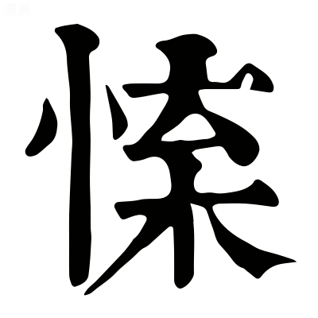
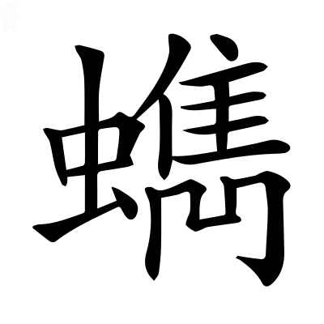
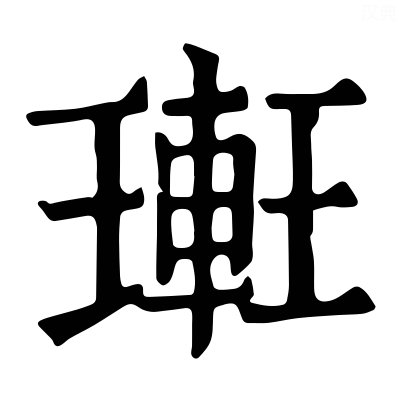

# <!-- page51 -->文選卷第三

> 梁昭明太子撰
> 
> 文林郎守太子右內率府錄事參軍事崇賢館直學士臣李善注上

京都中京都有三卷，此卷居中，故曰京都中[^3.1]。

## 東京賦一首

東京謂洛陽，其賦意與班固東都賦同[^3.1]。

> 張平子　　薛綜注

安處先生於是似不能言，憮~~`亡禹`~~然有閒[^3.2]，有閒，謂有頃之閒也。先生聞公子稱西京奢泰之事，心怪其所貴者，謂違禮失道，故愕然有頃乃能言也。〔善曰〕安猶烏也。處，處也。言何處有此先生，蓋虛假之也。論語曰：孔子似不能言者。孟子曰：夷子憮然爲閒也。*趙岐曰：憮然猶悵然也。*憮，亡禹切。

乃莞爾而笑曰「若客所謂末學膚受，貴耳而賤目者也。莞爾，舒張面目之貌也。末學，謂不經根本。膚受，謂皮膚之不經於心胷。貴耳謂西京，賤目謂東京[^3.3]，先生笑公子以西京爲貴，以東爲賤也。〔善曰〕論語曰：莞爾而笑。又曰：膚受之愬。桓子新論曰：世咸尊古卑今，貴所聞，賤所見。

苟有胷而無心，不能節之以禮，苟猶誠也。言賓誠信胷臆之所聞，而心不能以禮節度其可否也。〔善曰〕韓詩曰：鄙野之人，僻陋無心也。論語曰：不以禮節之。賈逵國語注曰：節，制也。

宜其陋今而榮古矣。言人不能以禮節度其事情者，固宜薄陋今日之事，而以此所聞古事爲榮貴也。〔善曰〕夫尊古而卑今，學者之流也。

由余以西戎孤臣，而悝~~`苦灰`~~繆`穆`公於宮室[^3.4]，孤臣，謂孤陋之臣也。〔善曰〕史記曰：由余本晉人，亡入西戎，相戎王，使來聘秦，觀秦之強弱。穆公示以宮室，引之登三休之臺。由余曰「臣國土階三尺，茅茨不翦，寡君猶謂作之者勞，居之者滛。此臺若鬼爲之，則神勞矣；使人爲之，則人亦勞矣」，於是穆公大慙。鄭玄禮記注曰：凡穆或作繆。悝猶嘲也，枯灰切。

如之何其以温故知新，研覈是非，近於此惑。如，奈也。覈，實也。研，審也。先生言由余但西戎孤陋之臣耳，尚知非秦宮室之大，如何公子雅好博古，温故知新之德，當審實事理之是非，而返惑於此事。論語曰：温故知新，可以爲師矣。王褒責髯奴曰：研覈否臧。

---

周姬之末，不能厥政，政用多僻。姬，周姓也。末，謂幽厲二主。周末世之王多邪僻之政也。〔善曰〕毛詩曰：民之多僻也。

始於宮鄰，卒於金虎。鄰，近也。謂幽王近於宮室，惑於襃姒，卒有禍敗也。金虎，西方白虎神王金。金，白也。〔善曰〕應劭漢官儀曰：不制之臣，相與比周。比周者，宮鄰金虎。宮鄰金虎，言小人在位，比周相進，與君爲隣，貪求之德堅若金，讒謗之言惡若虎也。

嬴氏搏`音附`翼，擇肉西邑。嬴，秦姓也。周書曰：無爲虎搏翼，將飛入邑，擇人而食也。搏翼，謂著翼也[^3.5]，搏與附同。

是時也，七雄並爭，競相高以奢麗。七雄，謂韓魏燕趙齊楚秦也。爭，謂各強盛而競相高以奢溢，將爲國好，不復顧於禮法也。〔善曰〕答賓戲曰：七雄虓闞。史記：張釋之曰「秦以苛察相高」。尚書曰：弊俗奢麗也。

楚築章華於前，趙建叢臺於後。左氏傳曰：楚子成章華之臺於乾谿，一朝叛之。於前，在春秋之時。史記曰：趙武靈王起叢臺，太子圍之三月。於後，在六國之時。〔善曰〕鄒陽上書曰：全趙之時，武力鼎士，袨服叢臺之下。*臣瓚曰：在邯鄲城內也。*

秦政利觜長距，終得擅場，言秦以天下爲大場，喻七雄爲鬭雞。利喙長距者，終擅一場也。史記曰：秦始皇，秦莊襄王子[^3.6]，名政。說文曰：擅，專也。

思專其侈，以莫己若。莫，無也。若，如也。言始皇所以思專擅其奢侈者，以天下之君無如於我也。

迺構阿房`傍`，起甘泉，三輔故事：秦始皇上林苑中作離宮別觀一百四十六所，不足以爲大會羣臣。二世胡亥起阿房殿，東西三里，南北三百步，下可建五丈旗。在山之阿，故號阿房也。甘泉，山名也。戰國策：范雎曰「秦北有甘泉宮」，謂其下有甘泉水，因以名之。〔善曰〕阿房、甘泉，已見上文。

結雲閣，冠南山。結，連也。雲閣，閣名也，高如雲，故言雲。三輔故事曰：秦二世胡亥起雲閣，欲與山齊。冠，覆也。終南山在長安南。

征稅盡，人力殫。言征稅之賦，盡於奢泰之用；天下之力，盡於長城與宮室也。殫，盡也。〔善曰〕鄭玄禮記注曰：征，稅也。毛萇詩傳曰：稅，斂也。

然後收以太半之賦，威以參夷之刑。漢書：伍被曰「秦作阿房宮，收太半之賦」。*韋昭曰：凡數，三分有二爲太<!-- page52 -->半。*言秦造宮室奢麗，費用不足，乃復收其太半之賦，百姓賦稅不得者，誅其三族。漢書曰：秦用商鞅之法，造參夷之誅。參，三也。謂滅三族也。

其遇民也，若薙氏之芟`所銜`草，遇，逢遇也。周禮有薙氏，掌山澤，芟除草菅。毛詩：載芟載柞也。

旣蘊崇之，又行火焉。左氏傳曰：周任有言曰「若農夫之務去草，芟夷蘊崇之」。*杜預曰：芟，殺。蘊，積也。崇，聚也。*言秦始皇酷虐百姓，如芟草積而放火焉。

`徒頰切`黔首，豈徒跼`局`高天、蹐`籍`厚地而已哉，乃救死於其頸。史記曰：秦皇更名民曰黔首，謂黑頭無知也。跼蹐，恐懼之貌也。毛詩曰：謂天蓋高，不敢不跼。*跼，傴僂也。*謂地蓋厚，不敢不蹐。*蹐，累足也。*謂此時之民，非徒跼高天蹐厚地而已，乃晝夜畏死其頸。〔善曰〕豈，非也。老子曰：聖人在，天下焉。國語：單襄公曰「兵在其頸，不可久也」。

敺以就役，唯力是視，謂不復知民有緩急與飢寒，唯趍敺令作力而已。〔善曰〕左氏傳曰：除君之惡，唯力是視。言所觀者，唯力是求，餘無所顧也。

百姓弗能忍，是用息肩於大漢，而欣戴高祖。忍，堪也。言秦天下之民，若檐重物，不得休息，今來歸漢，得息肩膊。〔善曰〕左氏傳曰：鄭成公疾，子駟請息肩於晉。*杜預曰：以負檐喻也。*國語曰：祭公謀父曰「商王大惡，庶民不忍，欣戴武王」。*賈逵曰：戴，奉也。*

---

高祖膺籙受圖，順天行誅，杖朱旗而建大號。膺籙，謂當五勝之籙。受圖，卯金刀之語。順天，謂順天命而起。又悟神姥之言，舉朱旗而大呼，天下之英雄，與其定事也。〔善曰〕春秋命歷引曰：五德之運，徵符合應[^3.7]，籙次相代。周易曰：順乎天。漢書：高祖立爲沛公，旗幟皆赤。故曰朱也。周易曰：渙汗，其大號。*鄭玄曰：號，令也。*

所推必亡，所存必固。言高祖所推擊者使之亡，所存者使之堅固。〔善曰〕尚書曰：推亡固存，邦乃其昌。

掃項軍於垓下，紲子嬰於軹~~`紙`~~塗[^3.8]。掃，除也。項，項羽也。垓，地名。漢王圍項羽於垓下。羽聞四面有楚歌，乃與數百騎走。高祖使灌嬰追之，斬羽東城。紲猶繫也。子嬰，秦子嬰也。〔善曰〕史記：秦王子嬰乘素車白馬，繫頸以組，降於軹道旁也。*蘇林曰：軹，亭名，在長安城東十三里。*軹音紙。

因秦宮室，據其府庫。因，仍也。據，就也。府庫，謂官吏所止爲府，車馬器械所居曰庫也。

作洛之制，我則未暇。作洛，謂造洛邑也。我，我高祖也。謂天下新造草創，不暇改作禮制也[^3.9]。

是以西匠營宮，目翫阿房。西匠，謂秦之舊匠也。目，視也。翫，習也。阿房，宮名也。漢書曰：梧齊侯陽成延[^3.10]，爲少府，作長樂未央宮也。

規摹踰溢，不度`入`不臧。規，圖也。踰，越也。溢，過也。度，法也。臧，善也。謂西匠所圖越過，不得禮法，皆言不善也。〔善曰〕聲類曰：摹，法也。

損之又損[^3.11]，然尚過於周堂。損，減也。言高祖雖數損減其制度，猶過於周家之堂。〔善曰〕老子曰：損之又損之，以至於無爲也。

觀者狹而謂之陋，帝已譏其泰而弗康。觀，視也。陋，小也。康，安也。言觀者習見秦之夸麗，睹今日之減小，皆以爲陋，然高祖猶已譏其泰而不安也。謂七年冬，上自將擊韓王信，蕭丞相留長安，營起未央宮，立東闕、前殿、武庫、太倉，高祖見其壯麗，怒曰「何修宮室之過也」。

---

且高旣受命建家，造我區夏矣。高，高祖也。區，區域也。夏，華夏也。言高祖受上天之命，建立國家，制造區夏。〔善曰〕毛詩序曰[^3.12]：文王受命作周也。*鄭玄曰：受天命以王天下。*尚書盤庚曰：永建乃家，用肇造我區夏。

文又躬自菲薄，治致升平之德。文，文帝也。躬自菲薄，謂儉約。漢書曰：文帝欲作露臺，召匠計直百金，曰「吾奉先帝宮室，常恐太奢，何用臺爲」。故文景之際，號爲升平，升平，謂國太平也。〔善曰〕禹菲薄飲食。孝經鉤命決曰：明王用孝，升平致譽。

武有大啓土宇，紀禪肅然之功。武，武帝也。漢書·武紀曰：定越地爲南海七郡，北置朔方等五郡。故云大啓土宇，啓，開也。紀，記也。肅，敬也。謂登封太山，升禪肅然。〔善曰〕尚書曰：建邦啓土。毛詩曰：大啓爾宇。

宣重`直用`威以撫和戎狄，呼韓來享。宣，宣帝也。漢書·宣紀曰：呼韓邪單于款五原塞，願奉國珎。毛詩曰：自彼氐羌，莫敢不來享。享，獻也。撫，安也。戎狄、呼韓，並國名也。左氏傳曰：子教寡人和戎狄。言宣帝能和戎狄。

咸用紀宗存主，饗祀不輟，咸，皆也。紀，錄也。宗，太宗，文帝廟號也。主，木主，言刻木爲人主神，置廟中而祭之。輟，止也。凡天子五世則廢。今廟不遷毀其主，各四時祭祀，無止絕時。〔善曰〕漢書·景紀曰：高皇帝爲太祖廟，文皇帝爲太宗廟。言天子宜世世獻祖宗之廟也。鄭玄論語注曰：輟，止也。

銘勳彝器，歷世彌光。彝，常也。宗廟之器稱<!-- page53 -->彝。勳，功也。歷，經也。彌，益也。銘，勒也。勒銘於宗廟之器鐘鼎[^3.13]，萬祀彌益光明。〔善曰〕左氏傳：臧武仲曰「夫以大伐小，取所得彝器，銘其功烈，以示子孫也」。字林曰：銘，題勒也。

今捨純懿而論爽德，爾雅曰：純，大。懿，美也。爽，差也。今公子反舍四帝純大懿美之德，而專論說爽差之過失者也。〔善曰〕國語曰：實有爽德。*賈逵曰：爽，貳也。*

以春秋所諱而爲美談，春秋諱國之惡，今公子反以爲美談也。〔善曰〕公羊傳曰：大惡諱之，小惡書之。又云：魯人至今以爲美談也。

宜無嫌於往初，故蔽善而揚惡，祗吾子之不知言也。宜之言義也。無猶不也。祗，是也。今公子之義，不嫌於蔽國之善，揚國之惡，是公子之不知言也。〔善曰〕說苑：楚文侯曰「邑中豪好蔽善而揚惡，可親問之」。論語：子曰「不知言，無以知人也」。毛萇詩傳曰：祗，適也。

必以肆奢爲賢，則是黃帝合宮，有虞緫期，固不如夏癸之瑶臺，殷辛之瓊室也。肆，放也。賢，善也。謂黃帝明堂，以草蓋之，名曰合宮。舜之明堂，以草蓋之，名曰總章。言難公子，黃帝等造此，是守儉也。〔善曰〕尸子曰：欲觀黃帝之行於合宮，觀堯舜之行於緫章。章期一也。汲冢古文曰：夏桀作傾宮瑶臺，殫百姓之財；殷紂作瓊室，立玉門也。

湯武誰革而用師哉？湯謂殷湯。武謂武王。革，改也。言誰遣革改殷紂夏桀而用師哉？以其奢侈滛放，所以湯武順天命而行罰之。此譏西京公子也。〔善曰〕湯武革命，已見東都賦。孔叢子曰：舜禹揖讓，湯武用師，非相詭，乃時也。

盍`合`亦覽東京之事以自寤乎。盍猶何不也。覽，視也。自寤，自覺寤也。言公子何不視東京之行事，心自覺寤耶。

---

且天子有道[^3.14]，守在海外。淮南子曰：若天下無道，守在四夷。天下有道，守在海外。言四夷皆爲臣僕。〔善曰〕鄭玄禮記注曰：道，謂仁義也。

守位以人[^3.15]~~綜作人~~[^3.16]，不恃隘害。人，謂衆庶也[^3.17]。隘，險也。言要須擇任賢臣，不以隘害爲牢固。〔善曰〕周易曰：何以守位？曰人也[^3.18]。

苟民志之不諒，何云巖險與襟帶。苟，誠也。諒，信也。公子稱巖險周固，襟帶易守，故今答曰「誠使人心不信，何用周固及易守乎」[^3.19]。〔善曰〕李尤函谷關銘曰：襟帶、咽喉也。

秦負阻於二關，卒開項而受沛。負，恃也。卒，終也。言負二關以爲牢固，終受二人所入也。二人，謂高祖從武關入，項羽從函谷關入。〔善曰〕漢書曰：沛公使兵守函谷關，項羽使黥布攻破之，至戲下。又云：沛公攻武關入秦。*應劭曰：武關，秦南關。*

彼偏據而規小，豈如宅中而圖大。彼，謂秦也。據，依也。言彼秦偏據關西，所規近在二關之內，故云小也。豈如東京居天地之中，所圖者四海之外。〔善曰〕尚書曰：自服于土中。*孔安國曰：洛邑，地勢之中。*孔叢子曰：子貢謂東郭充曰「今子位卑而圖大」。

---

昔先王之經邑也，先王，謂周成王也。邑，洛邑也。〔善曰〕毛萇詩傳曰：經，度也。

掩觀九隩，靡地不營。掩猶及也。九隩，謂九州之內也。靡地不營，謂徧求之，卜瀍澗及黎水，皆不吉。〔善曰〕新序曰：營，度也。九隩，合道四海也。

土圭測景，不縮不盈。鄭玄曰：土，度也[^3.20]。縮，短也。盈，長也。謂圭長一尺五寸，夏至之日，豎八尺表，日中而度之，圭影正等，天當中也。若影長於圭，則太近北。圭長於影，則太近南。近北多寒，近南多暑，近東多風，近西多雨。

緫風雨之所交，然後以建王城。緫猶括也。王城，今河南也。周禮曰：土圭之法，測土深，正日景，以求地中，四時之所交，風雨之所會，陰陽之所和，乃建王國也。

審曲面勢，審，度也。謂審察地形曲直之勢，而建王都。〔善曰〕周禮曰：或審曲面勢，以飭五材，以辨民器。*鄭司農曰：察五材曲直方面形勢之宜也。*

泝`素`洛背河，左伊右瀍。泝，向也。洛，洛水。河，黃河。伊，伊水。瀍，瀍水。〔善曰〕尚書曰：予朝至于洛師，卜澗水東瀍水西，惟洛食。*孔安國曰：洛出上洛山，伊出陸渾山，瀍出河南北山。*

西阻九阿，東門于旋。謂東有旋門，在成皐西南十數里，阪形周屈，故曰于旋。〔善曰〕穆天子傳曰：天子西升九阿。*郭璞曰：旋，今新安縣十里有九阪。*阻，險也。阿，曲也。

盟津達其後，太谷通其前。孟津，四瀆之長，故武王爲諸侯約誓於其上。尚書曰：東至于盟津。盟津，地名，在洛北。都道所湊，古今以爲津。太谷在輔氏北、洛陽西也。洛陽記曰：太谷，洛城南五十里，舊名通谷。

迴行道乎伊闕，邪徑捷乎轘轅。伊闕，山名也。轘轅，阪名也。迴，曲也。捷，邪也。謂大道迂曲，乃當伊闕之外，邪徑趣疾，當歷轘轅。〔善曰〕賈逵國語注曰：道，由也。史記：吳起曰「桀之居伊闕」。王逸楚辭注曰：捷，疾也。左氏傳注曰：捷，邪出也。漢書曰：沛公從轘轅；~~薛綜曰：轘轅阪十二曲，道將去復還，故曰轘轅。~~[^3.21]*臣瓚曰：在緱氏東南。*

大室作<!-- page54 -->鎮，揭`竭`以熊耳。大室，嵩高別名也。揭猶表也。言以嵩高之嶽，爲國之鎮也。復表以熊耳之山。〔善曰〕郭璞山海經注曰：大室在陽城縣西。羽獵賦曰：揭以崇山。熊耳，山名也。尚書傳曰：熊耳山在宜陽之西也。

底柱輟流，鐔`徒南`以大岯。底柱，山名也，在河東縣東，南向，居河中，猶柱然也。輟，止也。〔善曰〕尚書曰：導河至於底柱，東過大岯。韻集曰：鐔，劔口也。言大岯之險，同乎劔口也。莊子曰：天子之劔，以周宋爲鐔。

温液湯泉，黑丹石緇。言泉水如湯，浴之可以除病，在河南梁縣界中也。黑丹石緇，謂黑石雜色也。言温液即湯泉之流，黑丹石緇之所出。〔善曰〕孝經援神契曰：德至于山陵，則出黑丹。張揖子虛賦注曰：玄厲黑石，可用磨也。

王鮪岫居，能`奴來`鼈三趾。山有穴曰岫也。王鮪，魚名也，居山穴中。長老言「王鮪之魚，由南方來，出此穴中，入河水，見日目眩，浮水上，流行七八十里，釣人見之，取之以獻，天子用祭」。其穴在河南小平山。〔善曰〕周禮曰：春獻鮪[^3.m9]。*鄭玄曰：王鮪，魚之大者。*山海經曰：陽狂水西南流，注于伊水中，有三足鼈。爾雅曰：鼈三足曰能。

宓妃攸館，神用挺紀。攸，所也。館，舍也。傳曰：成王遷九鼎於洛邑，卜年七百，卜世三十。後皆如其言，故云神所挺紀，謂告年紀之處也。〔善曰〕楚辭曰：迎宓妃於伊洛。*王逸曰：宓妃，神女，蓋伊洛之水精。*

龍圖授羲，龜書畀姒。尚書傳曰：伏羲氏王天下，龍馬出河，遂則其文，以畫八卦，謂之河圖。又曰：天與禹，洛出書。謂神龜負文而出，列於背。〔善曰〕爾雅曰：畀，賜也。史記：禹姓姒氏。

召伯相宅，卜惟洛食。相，視也。宅，居也。惟，有也。食，謂吉兆。〔善曰〕尚書曰：召公旣相宅，卜惟洛食。*孔安國曰：卜必先墨畫龜，然後灼之，兆順食墨，吉也。*

周公初基，其繩則直。謂初造洛邑。言召公先相宅，卜之吉，周公繩度之，合於制度。〔善曰〕尚書曰：周公初基，作新大邑于東國洛。毛詩曰：其繩則直。*毛萇曰：言不失繩直之宜也。*

萇`直良`弘魏舒，是廓是極。萇弘，周大夫也。魏舒，晉大夫獻子也。廓猶規也。極，致也。謂二人率諸侯曰「敬以致功」，規度王城，三旬而立之。〔善曰〕國語曰：敬王十年，劉文公與萇弘欲城周，爲之告晉。左氏傳曰：晉魏舒合諸侯之大夫以城周也。

經途九軌，城隅九雉。南北爲經。途，道也。軌，車轍也。〔善曰〕周禮：國中經途九軌。*鄭玄曰：塗容九軌，謂轍廣也。*又周禮曰：王城隅之制九雉。*鄭玄云：雉，度也。謂高一丈長三丈爲雉。*

度`徒洛`堂以筵，度室以几。堂，明堂也。筵，席也，長九尺。几，俎也，長七尺。〔善曰〕周禮曰：室中度以几，堂上度以筵。

京邑翼翼，四方所視。京，大也。大邑，謂洛陽也。翼翼，禮儀盛貌。言常爲四方觀，翼翼然也。〔善曰〕毛詩曰：商邑翼翼，四方之極。

漢初弗之宅[^3.22]，故宗緒中圮`痞`。緒，統也。圮，絕也。漢家不居於洛，故宗廟之統，中途廢絕也。

---

巨猾閒`去聲`舋`許覲`，竊弄神器。巨，王莽字巨君也。猾，狡也。閒，候也。舋，隙也。神器，帝位也。言王莽因成哀無嗣，元后秉政，漢祚微弱，篡處高位。〔善曰〕老子曰：天下神器，不可爲也，爲者敗之。韋昭漢書注曰：神器，天子璽也。

歷載三六，偷安天位。載，年也。三六，十八年，謂王莽篡位一十八年也。天位，帝位也。〔善曰〕尚書曰：天位艱哉。

于時蒸民，罔敢或貳。于，於也。蒸，衆也。罔，無也。言是時衆民無敢有二心於莽者。毛詩曰：于時言言。尚書，蒸民乃粒。

其取威也重矣。威，畏也。重猶多也。謂爲天下所畏己者多矣。〔善曰〕左氏傳：先軫曰「報施救患，取威定霸」。

我世祖忿之，世祖，光武也。忿，恚。疾王莽威重如此也。

乃龍飛白水，鳳翔參`所今`墟。白水，謂南陽白水縣也，世祖所起之處也。初爲更始大司馬，討王郎於河北，~~北~~爲參虛分野[^3.23]。龍飛鳳翔，以喻聖人之興也。〔善曰〕周易曰：飛龍在天，大人造也。

授鉞四七，共工是除。授，與也。鉞，斧鉞也。四七，二十八將也。共工，霸天下者，以喻王莽也。六韜曰：凡國有難，君召將以授斧鉞。漢書曰：顓頊有共工之陣，以定水災。

欃槍旬始，羣凶靡餘。欃槍，星名也，謂王莽在位，如妖氣之在天。世祖除之，凶惡無餘。爾雅曰：彗星爲欃槍也。旬始，妖氣也。史記曰：旬始，狀如雄雞也。靡，無也。今言世祖除凶賊，無有遺餘也。

區㝢乂寧[^3.24]，思和求中。天地之內稱㝢。言海內旣已乂安，思求陰陽之和、天地之中而居之。

睿哲玄覽，都茲洛宮。睿，聖也。玄，通也。言通見此洛陽宮也。〔善曰〕尚書曰：睿作聖，明作哲。老子曰：滌除玄覽。*河上公曰：心居玄冥之處，覽知萬物，故謂之玄覽。王弼曰：玄，物之極也。*廣雅曰：玄，遠也。

曰止曰時，昭明有融。曰，辭也。時，是也。融，長也。言當止居是洛邑，必有昭明之德，長久之道也。〔善曰〕毛詩曰：曰止曰時。<!-- page55 -->又曰：昭明有融[^3.25]。

旣光厥武，仁洽道豐。止戈曰武。謚法曰：功格天下曰光，尅定禍亂曰武。洽，合也。豐，盛也。世祖旣能止戈，故謚光武。言仁義之道大豐盛也。〔善曰〕洽，霑也。

登岱勒封，與黃比崇。登，上也。岱，泰山也。謂王者功成作樂，治定制禮，故封泰山，勒功於石，以紀號也。黃，黃帝也。史記曰：崇，高也。言世祖與黃帝比其尊號。〔善曰〕史記曰：黃帝封泰山，禪云亭。司馬彪續漢書曰：建武三十二年，乃封禪。孔安國尚書傳曰：崇，尊也。

---

逮至顯宗，六合殷昌。逮，及也。殷，盛也。昌，熾也。顯宗，明帝號也。六合，天地四方也。〔善曰〕呂氏春秋曰：神通乎六合。*高誘曰：四方上下爲六合也。*

乃新崇德，遂作德陽。崇德、德陽，皆殿名也。崇德在東，德陽在西，相去五十步。

啓南端之特闈，立應門之將將。啓，開也。端門，南方正門。應門，中門也。〔善曰〕爾雅曰：宮中門謂之闈。洛陽宮舍記曰：洛陽有端門。毛詩曰：應門將將。*毛萇曰：將將，嚴正之貌。*

昭仁惠於崇賢，抗義聲於金商。崇賢，東門名也。金商，西門名也。謂東方爲木，主仁，如春以生萬物，昭天子仁惠之德，故立崇賢門於東也。西爲金，主義，音爲商，若秋氣之殺萬物，抗天子德義之聲，故立金商門於西。〔善曰〕漢書曰：角爲木爲仁，商爲金爲義也。

飛雲龍於春路，屯神虎於秋方。德陽殿東門稱雲龍門，德陽殿西門稱神虎門。神虎，金獸也。秋方，西方也。飛，飛龍也。易曰：雲從龍，爲木獸[^3.26]。春路，東方道也。〔善曰〕漢書曰：東宮蒼龍。又曰：東方於時爲春。宮殿簿，北宮有雲龍門。王逸楚辭注曰：屯，陳也。漢書曰：西宮白虎。又曰：西方於時爲秋。宮殿簿：北宮有神虎門。

建象魏之兩觀，旌六典之舊章。象魏，闕也，一名觀也。旌，表也。言所以立兩觀者，欲表明六典舊章之法，謂懸書于象魏，浹日而歛之。〔善曰〕周禮曰：太宰掌建邦之六典：一曰治典，二曰教典，三曰禮典，四曰政典，五曰刑典，六曰事典。~~舊章，法令條章也。~~[^3.27]左傳曰：舊章不可忘。

其內則含德章臺，天祿宣明，温飭迎春，壽安永寧。八殿皆以休令爲名，美時君之德，在應門之內也。

飛閣神行，莫我能形。言閣道相通，不在於地，故曰飛。人不見行往，故曰神。形謂天子之形容，言我無能說其形狀也[^3.m1]。

濯龍芳林，九谷八溪。洛陽圖經曰：濯龍，池名[^3.m2]，故歌曰「濯龍望如海，河橋渡似雷」。芳林，苑名。九谷八溪，養魚池。

芙蓉覆水，秋蘭被涯`音宜`。芙蓉，荷華也。秋蘭，香草，生水邊，秋時盛也。〔善曰〕楚辭曰：秋蘭兮青青。鄭玄注周易曰：蘭，香草也。被，亦覆也。

渚戲躍魚，淵游龜`音惟`。渚，水渚也。戲，游也。躍，跳也。毛詩曰：王在靈沼，於牣魚躍。，龜類也。凡此物，謂取有時，非時則恣之游戲，不驚動也。

永安離宮，脩竹冬青。永安，宮名也。脩，長也。冬青，謂不彫落也。

陰池幽流，玄泉洌清。水稱陰。幽流，謂伏溝，從地下流通於河也。水黑色，故曰玄泉。洌，清澄貌。〔善曰〕楚辭曰：臨沅湘之玄淵。毛詩曰：冽彼下泉。

鵯鶋`居`秋捿，鶻鵃春鳴。〔善曰〕爾雅曰：鷽斯[^3.28]，鵯鶋。*郭璞曰：鵯鶋，匹鳥，腹下白也。*又曰：鶌鳩，鶻鵃。*郭璞曰：鶻鵃似山鵲，短尾青黑色[^3.29]。*秋棲、春鳴，謂各得其性也[^3.30]。鵯音匹。鶻音骨。鵃，竹交切[^3.m3]。

鴡`七余`鳩麗黃，關關嚶嚶。爾雅曰：鴡鳩，王鴡也。*郭璞曰：鴡，鳩鵰類也[^3.31]。*又曰：鶬鶊，鵹黃也。*郭璞曰：鸝，黃黑也。*關關嚶嚶，謂音聲和也[^3.32]。鵹與麗古字通，音離[^3.m3]。

於南則前殿雲臺[^3.33]，龢驩安福。前殿，露寢也。雲臺，臺名也。龢驩、安福，二殿名，並在德陽殿之南。

謻`直移`門曲榭，邪阻城洫。謻門，氷室門也。臺有木曰榭。阻，依也。洫，城下池。氷室門及榭，皆屈曲邪行，依城池爲道也。

奇樹珎果，鉤盾`垂允`所職。奇，異也。珍，貴也。鉤盾，令官[^3.34]，主小苑。〔善曰〕鉤盾，五丞也。爾雅曰：職，主也。

西登少華，亭候修勑。登，升也。並有亭有候也。修，治也。勑，整也。謂西園中有少華之山。

九龍之內，寔曰嘉德。九龍，本周時殿名也，門上有三銅柱，柱有三龍相糺繞，故曰九龍。嘉德，殿名，在九龍門內也。

西南其戶，匪彫匪刻。毛詩曰：西南其戶，不彫不刻[^3.35]。尚質也。言殿舍之多，其戶或西或南也。

我后好約，乃宴斯息。我后，謂明帝也。宴，安也。息，止也。〔善曰〕周易曰：君子以嚮晦入宴息也。

於東則洪池清蘌[^3.36]`語`，淥水澹澹`徒敢`。內阜川禽，外豐葭菼。洪，池名也，在洛陽東三十里。阜，多也。豐，饒也。內多魚鼈，外饒蘆薍也。〔善曰〕漢書音義·應劭曰：蘌，在池水上作室，可用棲鳥，鳥入則捕之[^3.37]；音圉。高唐賦曰：水澹澹而盤紆。說文曰：澹澹，水搖貌也。爾雅曰：葭，葦也。菼，薍也。薍，五患切。

獻鼈蜃與<!-- page56 -->龜魚，供蝸`古花`蠯`蒲佳`與菱芡。蝸，螺也。菱，芰也。芡，雞頭也。〔善曰〕周禮曰：春獻鼈蜃，秋獻龜魚，祭祀供蜱蠃。*鄭玄曰：蜃，大蛤也。*杜子春曰：蜃，蜯也。蜱與蠯同。禮記曰：蝸醢而苽食。周禮：加籩之實[^3.38]，有菱芡也[^3.39]；音儉。

其西則有平樂都場，示遠之觀。平樂，觀名也。都，謂聚會也。爲大場於上，以作樂，使遠觀之，謂之平樂，在城西也。

龍雀蟠`盤`蜿`紆元`，天馬半漢。龍雀，飛廉也。天馬，銅馬也。蟠蜿、半漢，皆形容也。〔善曰〕華嶠後漢書曰：明帝至長安，迎取飛廉并銅馬，置上西門平樂觀也。

瑰異譎詭，燦爛炳煥。瑰，奇也。譎詭，變化也。燦爛炳煥，絜白鮮明之貌。

奢未及奓[^3.40]，儉而不陋。言皆合於禮，故奢不至奓，儉不至陋也[^3.41]。

規遵王度，動中得趨[^3.42]。規，摹也。遵，循也。趨，意也。度，先王之法度，舉動合禮之意也。家語：孔子曰「公甫之婦，動中得趨」。

---

於是觀禮，禮舉儀具[^3.43]。具，足也。言觀王之光明禮儀，皆備具也。〔善曰〕左氏傳曰：諸侯宋魯，於是觀禮。

經始勿亟`居力`，成之不日。勿猶不也。亟，急也。成之不日，言不用一日即成之。〔善曰〕毛詩曰：經始勿亟，庶人子來[^3.m4]。*毛萇曰：經，度也。*又曰：庶民攻之，不日成之。

猶謂爲之者勞，居之者逸。勞，苦也。逸，樂也。〔善曰〕賈子曰：翟王使使者之楚，楚王饗客於章華之臺，楚王曰「翟亦有臺乎」，使者曰「翟王茅茨不剪，采椽不斵，猶以作者大勞，居者大逸也」。

慕唐虞之茅茨，思夏后之卑室。唐，唐堯也。虞，虞舜也。夏后，夏禹也。〔善曰〕墨子曰：堯舜茅茨不剪，采椽不刊。說文曰：茅茨，蓋屋也。論語云：禹卑宮室，而盡力於溝洫也。

乃營三宮，布教頒`班`常。三宮，明堂、辟雍、靈臺。頒，布也。常，舊典也。所以行教化布典禮之宮也。

複`福`廟重屋，八達九房。複廟，重覆也。重屋，重棟也。謂明堂廟屋，前後異制。〔善曰〕禮記曰：複廟重檐達鄉，謂天子廟飾也。大戴禮曰：明堂九室而有八牖，然九室則九房也，八牖，八達也。

規天矩地，授時順鄉。謂宮室之飾，圓者象天，方者則地也。鄉，方也，言頒政賦常[^3.44]，隨時月而居其方。月令曰：孟春，居蒼龍左个。〔善曰〕大戴禮曰：明堂者，上圓下方。范子曰：天者，陽也規也；地者，陰也矩也。三輔黃圖曰：明堂，方象地，圓象天。又曰：明堂，順四時行令也。

造舟清池，惟水泱泱`央`。造舟，以舟相比次爲橋也。毛詩曰：造舟爲梁。泱泱，水流貌。〔善曰〕毛詩曰：瞻彼洛矣，惟水泱泱。

左制辟雍，右立靈臺。言德陽殿東有辟雍，於西有靈臺。謂於其上班教令者曰明堂，大合樂射饗者曰辟雍[^3.45]，司歷紀候節氣者曰靈臺也。

因進距衰，表賢簡能。進，善也。衰，老也。言因其進則舉而用之，衰減者拒而退之。謂擇賢以大射，所以表明德行，簡錄其能否，謂辟雍也。〔善曰〕尸子曰：治國有四術：一忠愛，二無私，三用賢，四簡能。爾雅曰：簡猶擇也。

馮`皮氷`相`息亮`觀祲`浸`，祈禠`絲`禳災。〔善曰〕周禮曰：春官宗伯，馮相氏掌歲日月星辰之位，辨其災祥，以爲時候。*鄭玄曰：馮，乘也；相，視也。*祲，謂陰陽氣相浸，漸以成災也。祈，求福也。禳，除也。災，禍也。謂求祈福而除災害也。爾雅曰：禠，福也。鄭玄周禮注曰[^3.46]：却變異曰禳。

---

於是孟春元日，羣后旁戾。尚書曰：正月元日，舜格于文祖。孟春，正月也。元日，正日也。羣后，公卿之徒也。旁，四方也。戾，至也。言諸侯正月一日從四方而至，各來朝享天子也。

百僚師師，于斯胥洎。尚書曰：百僚師師。百僚，謂百官也。師師，謂相師法也。胥，相也。洎，及也。言元日百官於此相連及而來朝賀也。

藩國奉聘，要荒來質。~~綜曰：~~[^3.47]謂王侯藩稱國也。言要荒之外，所奉聘令者盡來朝見。〔善曰〕周禮曰：鎮服外五百里曰藩服。魏相上封事曰[^3.48]：顯明功臣，以鎮藩國。鄭司農周禮注曰：衆來曰頫，寡來曰聘。尚書曰：五百里要服，又五百里荒服。漢書曰：樓蘭王遣子質漢也。

具惟帝臣，獻琛執贄。具之言俱也。獻，貢也。琛，寶也。執，持也。贄，禮也。言藩國來貢者，謂隨土所出寶而貢之也。〔善曰〕尚書曰：萬邦黎獻[^3.49]，具惟帝臣。毛詩曰：來獻其琛。封禪書曰：百蠻執贄。周禮曰：以六禽作六贄。*鄭玄曰：贄之言至也，所執以自致也。*

當覲乎殿下者，蓋數萬以二。覲，見也。言於此之時，當入見於殿下者，可數萬人，分於闕下夾道爲二部。

爾乃九賓重`平`，臚`廬`人列。言鴻臚所主羌胡之人，皆羅列於朝廷也。〔善曰〕漢書曰：羣臣朝十月儀，大行人設九賓，臚句傳。*韋昭曰：九賓，則周禮曰九儀，謂公侯伯子男孤卿大夫士也。臚，傳也，次以傳上令也。蘇林曰：上傳語告下臚，下傳告上句，臚猶行也。*二訓雖殊，皆以行上語爲臚也。

崇牙張，鏞~~`庸`~~鼓設[^3.50]。崇牙，栒虡上板作劔鎝者。橫曰栒，植曰虡。張，謂樹之<!-- page57 -->以縣鍾鼓也。〔善曰〕毛詩曰：崇牙樹羽。又曰：鏞鼓有斁。*毛萇詩傳：大曰鏞；*音庸。

郎將司階，虎戟交鎩`殺`。言虎賁中郎將，主夾階而立。虎賁，或執戟或持鎩，而相對也。交鎩，謂交加而設兵器也。〔善曰〕漢書曰：儀兵郎中夾階。說文曰：鎩，鈹有鐔。

龍輅充庭，雲旗拂霓。馬八尺曰龍；輅，天子之車也，故曰龍輅。充，滿也。庭，朝也[^3.51]。旗，謂熊虎爲旗，爲高至雲，故曰雲旗也。楚辭曰：載雲旗之逶夷。拂，至也。霓，天邊氣也。

夏正三朝，庭燎晢晢。夏家建寅之正，漢家所用也。三朝，歲月日朝。晢晢，大光明也。〔善曰〕~~東都賦曰「春王三朝」，三朝，歲首朔日也。~~三朝，已見東都賦。[^3.52]毛詩曰：夜如何其，夜未艾，庭燎晰晰。

撞洪鍾，伐靈鼓，撞，鏗也。伐，擊也。靈鼓，六面鼓也。〔善曰〕周禮曰：靈鼓靈鼗。

旁震八鄙，軯`普耕`礚`苦代`隱訇`火宏`。旁，四方也。震，驚也。八鄙，四方與四角也。軯礚隱訇，鍾鼓之聲也。

若疾霆轉雷而激迅風也。霆，霹靂也。迅，疾也。言鍾鼓之聲，又若雷霆之相轉，亦如急風之迅疾也。

---

是時稱警蹕已，下彫輦於東廂。警，謂清道也。輦，人挽車。彫，謂有彫飾也[^3.53]。殿東西次爲廂。〔善曰〕漢書儀注曰：皇帝輦動，則左右侍帷幄者稱警。孔安國尚書傳曰：雕，刻鏤也。

冠通天，佩玉璽，通天，冠名也。佩，帶也。玉璽，天子印也。蔡雍獨斷曰：天子冠通天。

紆皇組，要干將。紆，垂也。皇，大也。組，綬也。干將，劔名也。越絕書曰：楚王令歐冶子、干將爲鐵劔三枚，一曰龍淵，二曰太阿，三曰工市也。吳越春秋曰：干將者，吳人，造劔二枚，一曰干將，二曰莫耶。

負斧扆，次席紛純，白與黑謂之斧。扆，屏風，樹之坐後也。次席，竹席也。紛純，謂以組爲緣。〔善曰〕禮記曰：天子負斧扆，南向而立。*鄭玄曰：負之言背也。*周禮曰：大朝覲，王設黼依，設莞席紛純，次席黼純，左右玉几，次席紛純。謂二席俱設，互言之。

左右玉几[^3.54]，而南面以聽矣。周禮曰：天子左右玉几。*鄭玄曰：左右有几，優至尊也。*〔善曰〕周易曰：離者明也，南方之卦也，聖人南面聽天下，嚮明而治。蓋取於此也。

然後百辟乃入，司儀辨等，百辟，諸侯也。司，主也。儀，法也。辨，別也。言百官有分別者，謂司主之次也。〔善曰〕毛詩曰：百辟其刑之[^3.55]。周禮曰：司儀主禮，掌九儀之賓客，分別五等之諸侯。左傳：臧僖伯曰「明貴賤，辯等差」。

尊卑以班，璧羔皮帛之贄旣奠，班，位次也。謂尊卑有等差也。〔善曰〕國語曰：班爵貴賤以列之。周禮曰：子執穀璧，孤執皮帛，卿執羔，大夫執鴈，士雉，各有次第。奠，置也。

天子乃以三揖之禮禮之。〔善曰〕周禮曰：王土揖庶姓，時揖異姓，天揖同姓。*鄭玄曰：庶姓，無親者也；土揖，推手小下之也；異姓，昬姻也；時揖，平推手也；天揖，推手小舉之。*又曰：諸侯，心平手禮；伯男，手在心下禮；外國君，在心上禮。

穆穆焉，皇皇焉，濟濟焉，將將焉，信天下之壯觀也。壯觀，言天下之人壯大觀覽也。[^3.m10]禮記曰：天子穆穆，諸侯皇皇，大夫濟濟，士將將。*鄭玄曰：威儀容止之貌。*史記曰：天下之壯觀也。

乃羨公侯卿士，登自東除，羨，延也。登，進也。謂命之上殿也。天子從中階，諸侯從東西階。〔善曰〕東除，堦也。

訪萬機，詢朝政，言機微之事，日有萬種。詢，謀也，謂與謀朝政，有所先後者也。〔善曰〕尚書曰：一日二日萬機[^3.56]。

勤恤民隱，而除其眚。恤，憂也。隱，痛也。眚，病也。言有隱痛不安者，令憂恤之也[^3.57]。〔善曰〕國語：祭公謀父曰「勤恤民隱，而除其害也」。

人或不得其所，若己納之於隍。隍，城下坑，無水者。〔善曰〕孟子曰：伊尹思天下之民，匹夫匹婦，不與被堯舜之澤者，若己推而納之於溝中也。鄭玄毛詩箋曰：納，內也。~~說文曰：城池無水曰隍。~~隍，已見東都賦[^3.58]。

荷天下之重任，匪怠皇以寧靜。荷，負也。怠，懈也。皇，暇也。言無有懈怠於寧靜者，謂常有所憂也。〔善曰〕孫卿子曰：國者，天下之大器也，重任也，可不善擇而後錯之。毛詩曰：不敢迨遑[^3.59]。

發京倉，散禁財。發，開也。京，大也。禁，藏也。〔善曰〕尚書曰：散鹿臺之財，發鉅橋之粟。毛詩曰：曾孫之庾，如坻如京。

賚皇寮，逮輿臺。賚，賜也。皇寮，百官也。逮，及也。言天子散發禁庫之財，無問貴賤，皆賜及之。〔善曰〕左氏傳曰：人有十等，王臣公，公臣大夫，大夫臣士，士臣皁，皁臣輿，輿臣隸，隸臣寮，寮臣僕，僕臣臺。漢書：公卿言曰「陛下出禁錢以振元元」。*應劭曰：少府掌山澤陂池之稅，名曰禁錢，以給私養。*

命膳夫以大饗，饔餼浹乎家陪。周禮曰：膳夫，主食之官。熟曰饔，腥曰餼。浹，徧也。家陪，謂公卿大夫之家。〔善曰〕毛詩序曰：牲牢饔餼[^3.60]。論語曰：陪臣執國命。

春醴惟醇，燔炙芬芬。醇，厚也。燔炙，謂炙肉也。芬芬，香氣盛也。〔善曰〕毛詩曰：爲此春酒。又曰：燔炙芬芬。呂氏春秋曰：厚酒肥肉。

君臣<!-- page58 -->歡康，具醉熏熏。康，樂也。具，俱也。熏熏，和說貌。言君臣皆歡樂而和說也。〔善曰〕毛詩曰：公尸來止熏熏。*毛萇曰：熏，和悅也。*

千品萬官，已事而踆`七旬`。已，止也。踆，退也。謂品秩官僚等，並止事而退還也。〔善曰〕國語曰：觀射父曰「百姓、千品、萬官、億醜」。管仲曰「有司已事而竣」。踆與竣同也。

勤屢省`昔井`，懋乾乾。屢，數也。省，察也。懋，勉也。乾乾，敬也。〔善曰〕尚書曰：屢省乃成。周易曰：君子終日乾乾也。

清風協於玄德，淳化通於自然。協，同也。淳，厚也。玄，天也。自然，通神明也。言帝如此清惠之風，同於天德，淳厚之化，通於神明也。〔善曰〕孔安國尚書傳曰：風，教也。老子曰：爲而不持，長而不宰[^3.61]，是謂玄德。*王弼曰：玄德者，皆有德不知其至，出于幽冥者也。*老子曰：天法道，道法自然。*王弼曰：自然者，無稱之言，窮極之辭。*

憲先靈而齊軌，必三思以顧愆。憲，法也。先靈，先聖之神靈，即謂堯舜也。愆，過也。齊，同也。軌，迹也。言有事能思，信與先聖同軌迹也。〔善曰〕論語曰：季文子三思而後行。

招有道於側陋，開敢諫之直言。招，明也。有道[^3.62]，言使郡國於側陋之中，舉有道之士而用之也。直言，謂直諫者也。〔善曰〕尚書曰：明明揚側陋。漢書曰：舉能直言極諫者。

聘丘園之耿絜，旅束帛之戔戔。耿，清也。旅，陳也。謂有清絜者也。言丘園中有隱士，貞絜清白之人，聘而用之。束帛，謂古招士必以束帛加璧於上。〔善曰〕周易曰：六五[^3.63]，賁于丘園，束帛戔戔。*王肅云：失位無應，隱處丘園。蓋蒙闇之人，道德彌明，必有束帛之聘也。戔戔，委積之貌也。*

上下通情，式宴且盤。上謂君，下謂臣。式，用也。盤，樂也。言君情通於下，臣情達於上，故能國家安而君臣歡樂也。〔善曰〕墨子曰：古者聖王惟能審以尚同，是故上下通情。毛詩曰：嘉賓式宴以樂也。

---

及將祀天郊，報地功，〔善曰〕將，欲也。白虎通曰：祭天必在郊者，天體至清，故祭必於郊，取其清絜也。周禮以正月上辛郊祀，告于上帝，祭天而郊，以報去年土地之功。京房易占曰：立秋報地功。

祈福乎上玄，思所以爲虔。祈，求也。玄，天也。玄黃天地。言天子祭天地之際，思念所以盡其忠敬。〔善曰〕禮記曰：共皇天上帝之神，以爲人祈福。周易曰：天玄而地黃也。

肅肅之儀盡，穆穆之禮殫。殫，盡也。〔善曰〕毛詩頌曰：至止肅肅。~~禮記曰：天子穆穆。~~穆穆，已見上[^3.64]。

然後以獻精誠，奉禋祀，曰允矣天子者也。獻，進也。允，信也。天子，言是天帝之子也。〔善曰〕國語曰：精意以享，謂之禋祀。周禮曰：以禋祀祀昊天上帝。毛詩曰：允矣君子。

乃整法服，正冕帶。整，理也。冕，所謂平天冠也。言天子素帶朱裏，謂三皇已來始冕，制有數種，鄭玄曰：長一尺七寸，廣八寸，前圓後方，以珠玉飾之也。法服，謂衣服並有法度。〔善曰〕孝經曰：非先王之法服不敢服。

珩`行`紞`丁敢`紘`宏`綖，玉笄綦`其`會。笄，簪也，謂以玉飾之。〔善曰〕左氏傳曰：珩紞紘綖，昭其度也。*杜預曰：珩，維持冠者、紘，纓從下上者、紞，冠之垂者也、綖，冠上覆者。*周禮曰：王之五冕，玉笄也。又曰：王之皮弁，會五采玉琪。*鄭玄曰：會，縫中。琪讀如綦[^3.65]，綦，謂結皮弁於縫中，每貫結五采玉十二以爲飾，謂之綦會。*

火龍黼黻，藻繂`律`鞶厲。〔善曰〕左氏傳曰：火龍黼黻，昭其文也，藻繂鞞鞛，鞶厲斿纓，昭其數也。*杜預曰：火，畫火也。龍，畫龍也。白與黑謂之黼。黻，兩己相戾也。藻繂，以韋爲之，所以藉玉。鞞，佩刀削上飾、鞛，下飾。鞶厲，紳帶之垂者。斿，旌旗之斿。纓，在馬膺前。*

結飛雲之袷輅，樹翠羽之高蓋。袷輅，次車也，次車樹翠羽爲蓋，如雲飛也，今世謂之羽蓋車也。〔善曰〕高唐賦曰：翠爲蓋。

建辰旒之太常，紛飇~~焱~~~~一作飆~~悠以容裔[^3.66]。辰，謂日月星也，畫之於旌旗，垂十二旒，名曰太常，上畫三辰[^3.67]，以象天明也。謂天子十二旒，諸侯九旒，大夫三旒。紛，盛也。悠，從風貌。容裔，高低之貌。焱，火花也。言風鼓動旌旗，紛紜盛亂如火花之飛起。〔善曰〕周禮曰：日月爲常。左氏傳曰：三辰旂旗，昭其明也。

六玄虬之弈弈，齊騰驤而沛艾。六，六馬也。玄，黑也。天子駕六馬。騰驤，趣走也。弈弈，光明。沛艾，作姿容貌也。〔善曰〕甘泉賦曰：六玄虬。毛詩曰：四牡弈弈。司馬相如大人賦曰：沛艾赳螑。

龍輈華轙`蟻`，金鋄`亡犯`鏤鍚。輈，車轅，轅端上刻作龍頭也。華，采畫也。〔善曰〕爾雅曰：載轡謂之轙。*郭璞曰：在軾上，環轡所貫也。*蔡雍曰：金鋄者，馬冠也。高廣各五寸，上如玉華形，在馬髦前。鏤，彫飾也。鍚，當顱刻金爲之[^3.68]。毛詩曰：鉤膺鏤鍚。

方釳`乞`左纛，鉤膺玉瓖`音襄`。方釳，謂轅旁以五寸鐵，鏤中央低[^3.69]，兩頭高，如山形，而貫中以翟尾，結著之轅兩邊，恐馬相突也。左纛，以旄牛尾大如斗，置騑馬頭上，以亂馬目，不令相見也。鉤膺，當胷也。瓖，馬帶玦，以玉飾也。〔善曰〕廣雅曰：釳，許乞切。

鑾聲噦噦<!-- page59 -->，和鈴鉠鉠`於良切`。鑾在衡，和在軾，皆以金爲鈴也。噦噦，和鳴聲。鉠鉠，小聲。〔善曰〕毛詩曰：鑾聲噦噦，和鈴鉠鉠。

重輪貳轄，〔善曰〕蔡雍獨斷曰[^3.71]：乘輿，重轂外復有一轂，副轄其外，乃復設轄，然重輪即重轂也。

䟽轂飛軨~~`零`~~[^3.70]。飛軨，以緹紬廣八寸[^3.72]，長柱地，畫左青龍，右白虎，繫軸頭，取兩邊飾。〔善曰〕蔡雍月令章句曰：䟽，鏤也。軨音零。

羽蓋威蕤，葩瑵`爪`曲莖。羽蓋，以翠羽覆車蓋也。威蕤，羽貌。葩爪，悉以金作華形，莖皆曲。〔善曰〕蔡雍獨斷曰：凡乘輿車皆羽蓋金華。爪與瑵同[^3.73]，祖狡切。

順時服而設副，咸龍旂而繁纓。五時之服，各隨其車，車各一色，以爲副貳。副車各一乘，今謂之五帝車也。龍旂者，交龍爲旂也。鞶，今之馬大帶也。纓，馬鞅也。〔善曰〕毛詩曰：龍旗陽陽。周禮曰：玉路鍚樊纓。*鄭玄曰：樊讀如鞶，謂今之馬大帶也。*繁與鞶古字通。

立戈迤戛，農輿輅木。戈，謂勾孑戟也[^3.74]。戛，長矛也。矛，置車上，邪柱之，是謂戎輅。農輿三蓋[^3.75]，所謂耕根車也。言耕稼於藉田，乘馬無飾，故稱木。〔善曰〕迤，邪也[^3.76]；弋氏切。

屬車九九，乘軒並轂。副車曰屬，言相連屬也[^3.77]。車有藩者曰軒。皆在後爲三行，故曰並轂。〔善曰〕漢雜事曰：諸侯貳車九乘，秦滅九國，兼其車服，故大駕屬車八十一乘。

~~`伏`~~弩重旃[^3.78]，朱旄青屋。通帛曰旃。朱旄，旄牛尾赤色者也。青屋，青作蓋裏也。〔善曰〕說文曰：，車蘭閒皮筐，以安其弩也。徐廣車服志曰：輕車置弩於軾上，載以屬車，然置弩於曰弩；音伏。

奉引旣畢，先輅乃發。奉引，謂引道者，言引道之次已定，前車乃發。〔善曰〕漢官儀曰：大駕則公卿奉引。尚書曰：先路在左塾之前。

鸞旗皮軒，通帛綪`蒨`斾。鸞旗，謂以象鸞鳥也。皮軒，以虎皮爲之。〔善曰〕蔡邕車服志曰：鸞旗，俗人名曰雞翹。上林賦曰：前皮軒，後道斿。通帛曰旗。國語曰：分魯公以少帛綪茷。*韋昭曰：綪茷，大赤也[^3.79]。*茷音斾。

雲罕九斿，闟戟轇輵[^3.m3]。雲罕，旌旗之別名也。九斿，亦旗名也。闟，鋋也。轇輵，雜亂貌。〔善曰〕上林賦曰：載雲罕。說文曰：斿，旍施流也。史記曰：趙良謂衛鞅曰：君之出也，操闟戟者旁車而趨。王逸楚辭注曰：轇輵，參差縱橫也[^3.80]，轇音膠。輵音葛。

髶`而利`髦被繡，虎夫戴鶡。髶髦，髦頭茸騎也。〔善曰〕漢書：羿爲髦頭。*應劭曰：繡衣，在天子乘輿之前。鶡，鷖鳥也。鬭至死乃止，令武士戴之，取猛也。*司馬彪續漢書曰：虎賁騎皆鶡冠。

駙承華之蒲梢，飛流蘇之騷殺`桑葛`。。駙，副馬也。承華，廐名也。言取華廐之蒲梢，以爲副馬也。漢官儀有承華廐。〔善曰〕漢書曰：後宮[^3.81]蒲梢汗血之馬。流蘇，五采毛雜之，以爲馬飾而垂之。續漢書曰：駙馬赤珥流蘇。摯虞決疑要注曰：凡下垂爲蘇。騷殺，垂貌。

緫輕武於後陳，奏嚴鼓之嘈囐`才達`。後陳者，謂北軍五營兵在後陳列。嘈囐，鼓聲。〔善曰〕漢書曰：隤銅丸以擿鼓[^3.82]，聲中嚴鼓之節。*晉灼曰：疾擊鼓。*

戎士介而揚揮，戴金鉦而建黃鉞。戎，兵也。士，士卒也。介，甲也。揮，爲肩上絳幟，如燕尾者也。金鉦，鐲鐃之屬也。黃鉞，以黃金飾之。〔善曰〕左氏傳：廚人濮曰「揚徽者，公徒也」。徽與揮古字通。蔡邕獨斷曰：乘輿後有金鉦黃鉞。

清道案列，天行星陳。清道，謂蹕止行者。列猶次也。言天子行，如上天之星行，羅列有次。〔善曰〕司馬相如上䟽曰：清道而後行。周易曰：天行健。尚書大傳曰：明明上天，爛然星陳。

肅肅習習，隱隱轔轔。肅肅，敬貌。習習，行貌。隱隱，衆多貌。轔轔，車聲也。

殿`坫`未出乎城闕，斾已迴乎郊畛~~`諸鄰`~~[^3.83]。殿，後軍也。斾，前軍也。郊畛，謂郊界也。言從之多，後猶未出城闕，前已迴於郊界也。〔善曰〕論語曰：孟之反不伐，奔而殿。宋衷太玄經注曰：畛，界也[^3.84]，諸鄰切。

盛夏后之致美，爰恭敬於明神[^3.85]。盛猶嘉也。夏后，禹也。言今嘉欲行禹之事，爰布恭敬於神明也。〔善曰〕論語曰：惡衣服而致美於黻冕，菲飲食而致孝於鬼神。毛詩曰：敬恭明神也[^3.86]。

---

爾乃孤竹之管，雲和之瑟。孤竹，國名，出竹。〔善曰〕周禮曰：孤竹之管，雲龢之瑟。和與龢古字通。*鄭玄曰：孤竹，特生者也，雲和，山名也。出美木，用爲瑟，其聲清亮也。*

雷鼓鼝鼝，六變旣畢。雷鼓，八面鼓也。凡樂六變爲一，成則更奏。畢，盡也。〔善曰〕周禮曰：雷鼓路鼗奏之，若樂六變，一變，川澤之神見；二變，山林之神見；三變，丘陵之神見；四變，墳衍之神見；五變，地神見；六變，天神見。毛詩曰：鼓鼝鼝[^3.87]，音淵。

冠華秉翟，列舞八佾。冠華，以鐵作之，上闊下狹，以翟雉尾飾之，舞人頭戴。一行羅列八人，八八六十四人。謂今麥策花也。穀梁傳曰：舞夏天子八佾。〔善曰〕蔡邕獨斷曰：大樂郊祀，舞者冠建華冠。毛詩曰：右手秉翟。~~馬融論語注曰：佾，列也。~~八佾，已見東都賦[^3.88]。

元祀惟稱，羣望咸秩。元，大也。祀，祭也。稱，舉也。謂大祭天地之禮旣舉，羣岳衆神，望以祭祀之，皆有秩次。〔善曰〕尚書曰：咸秩無文；王肅曰：秩，序也。左氏<!-- page60 -->傳曰：乃有事于羣望。孔安國尚書傳曰：在遠者，望而祭之。

颺槱`由`燎之炎煬`樣`，致高煙乎太一[^3.89]。颺，飛颺也。槱之言聚也，謂聚薪焚之，揚其光炎，使上達於天也。太一，天之尊神也，曜魄寶也。〔善曰〕周禮曰：以槱燎祀司中司命。郭璞方言注曰：火熾猛爲煬。說文曰：致，送也。漢書曰：中宮天極星，其一明者，太一常居也。

神歆馨而顧德，祚靈主以元吉。歆，饗也。顧，眷也。祚，報也。靈，明也。元，大也。吉，福也。言天神覩人主之明肅，顧饗其馨香之祭，故報之以大福。尚書曰：明德惟馨。周易曰：黃裳元吉。

然後宗上帝於明堂，推光武以作配。宗，尊也。上帝，太微中五帝也。配，對也。言尊祭五帝於明堂，以光武配之。漢書曰：明帝宗祀五帝於明堂，光武皇帝配之。

辯方位而正則，五精帥而來摧`徂回切`。辯，別也。方位，謂四方中央之位也。則，法也。五精，五方星也。帥，循也。摧，至也。言五帝揔集至明堂。〔善曰〕漢書曰：祀五帝於明堂，坐位各處其方。孝經鉤命決曰：宗祀文王於明堂，以配上帝五精之神。爾雅曰：摧，至也。

尊赤氏之朱光，四靈懋而允懷。赤氏，謂漢火德所統，赤帝熛怒也。河圖曰：四靈，蒼帝神名靈威仰，赤帝神名赤熛怒，黃帝神名含樞紐，白帝神名白招拒，黑帝神名協光紀。今五云四靈，謂除赤，餘有四。懋，悅也。懷，安也。〔善曰〕尚書曰：民其允懷。*孔安國曰：民信歸之。*

於是春秋改節，四時迭代。改，易也。迭，更也。代，謝也。言感四時之謝，而欲享祀也。〔善曰〕易乾鑿度：孔子曰「天地有春秋冬夏節，故生四時」。又曰：五行迭終，四時更廢。

蒸蒸之心，感物曾思。~~廣雅曰：~~蒸蒸，孝也[^3.90]。感物，謂感四時之物，即春韭卵，夏麥魚，秋黍肫，冬稻鴈。孝子感此新物，則思祭先祖也。〔善曰〕尚書曰：虞舜蒸蒸。廣雅曰：感，傷也。

躬追養於廟祧`吐堯`，奉蒸嘗與禴祠。言祭皆追感孝養之道，故躬自爲之。躬猶身也。〔善曰〕禮緯曰：祭者，所以追養繼孝也。禮記曰：遠廟爲祧。毛詩曰：禴祠蒸嘗。公羊傳曰：春曰祠，夏曰禴，秋曰嘗，冬曰蒸。

物牲辯`徧`省，設其楅衡。物牲，謂祭祀之牲物，皆徧省視之也。橫木於牲角端，以備抵觸，謂之楅衡。〔善曰〕周禮曰：牧六牲而阜蕃其物，以供祭祀。凡祭祀，飾其牛牲，設其楅衡。杜子春曰：楅衡，所以持令不得抵觸人也。

毛炰`炮`豚胉~~`博`~~，亦有和羹。〔善曰〕鄭玄周禮注曰：毛炰豚者[^3.91]，爓去其毛而炰之[^3.92]，以備八珍。毛詩曰：毛炰胾羹。周禮曰：饋食之豆[^3.93]，其實豚胉。杜子春以胉爲膊，謂脇也[^3.94]，方薄切。毛詩曰：亦有和羹。

滌濯靜嘉，禮儀孔明。滌濯，謂洗滌也。靜，絜也。嘉，善也。孔，甚也。言禮儀甚鮮明也。〔善曰〕周禮曰：大祭祀，眡滌濯。*鄭玄曰：滌，漑祭器也。*毛詩曰：籩豆靜嘉。又曰：禮儀旣備。又曰：祀事孔明。

萬舞奕奕，鍾鼓喤喤。萬舞，干也。奕奕，舞形也。喤喤，鼓聲也。〔善曰〕毛詩曰：萬舞奕奕，鍾鼓喤喤。

靈祖皇考，來顧來饗`平聲`。靈皇，神名，謂先帝也，言先帝之神顧𢚢子孫，享其食也。

神具醉止，降福穰穰。神，謂先神也。具，俱也。止，已。降，下也。穰穰，衆多也。〔善曰〕毛詩曰：神具醉止，降福穰穰。

---

及至農祥晨正，土膏脉起。農祥，天駟，即房星也。晨時，正中也，謂正月初也。〔善曰〕國語曰：虢文公曰「太史順時覛土[^3.95]，農祥晨正，土乃脉發」。太史告稷曰「土膏其動」。*韋昭曰：農祥，房星也。晨正，謂立春之日，晨中於午也。脉，理也。膏，土潤也。*

乘鑾輅而駕蒼龍，〔善曰〕禮記曰：孟春之月，乘鑾輅，駕蒼龍。*鄭玄曰：鑾輅，有虞氏之車也，有鑾和之飾，而飾之以青輪。春東方色青也。馬八尺爲龍。*

介馭間以剡~~`以冉`~~耜[^3.96]。天子車，帝在左，御在中，介處右。〔善曰〕禮記曰：天子祈穀于上帝，親載耒耜，措之于參保介之御閒。*鄭玄曰：保介，車右，置耒耜於車右與御者之閒，明以勸農。又使勇士衣甲而參乘，備非常也。保猶衣也。*毛詩曰：以我覃耜。*毛萇曰：覃，利也。*鄭玄禮記注曰：耜，耒之金也。覃與剡同，以冉切。

躬三推`土回`於天田，修帝籍之千畝。〔善曰〕東觀漢記曰：永明四年詔書曰「朕親耕于籍田，以祈農事」。禮記曰：躬耕帝籍，天子三推，爲籍千畝。楊雄上林苑箴曰：芒芒天田，芃芃作穀。

供禘郊之粢盛，必致思乎勤己。禘郊，謂祭天於南郊也。言天子籍田千畝，必須親耕者，爲敬其祖考，用充宗廟之粢盛，故云勤己。〔善曰〕禮記曰：王者禘其祖之所自出。*鄭玄曰：禘，大祭也。*又曰：天子籍田千畝。以事天地，以爲齊盛。毛萇詩傳曰：器實曰粢，在器曰盛。鄭玄禮記注曰：致之言至也。

兆民勸於疆埸`亦`，感懋力以耘耔`音子`。兆民，謂百姓也。疆，田畔也。耘，去草。耔，壅本也。〔善曰〕毛詩曰：疆埸有瓜，或耘或耔。爾雅曰：懋，勉也。

春日載陽，<!-- page61 -->合射辟雍。陽，暖也。言春三月之時，與諸侯合射辟雍，行禮教。〔善曰〕毛詩曰：春日載陽；鄭玄曰：載之言則也。合射辟雍，已見東都賦[^3.97]。

設業設虡，宮懸金鏞。設，施也。業，栒上板刻爲鴈齒，捷業然，植者爲虡，橫者爲栒，以施設懸之宮中也。鏞，大鍾也。〔善曰〕毛詩曰：設業設虡。周禮曰：正樂懸之位，王宮懸。*鄭司農曰：宮懸，四面也。*鏞，已見上文。

鼖鼓路鼗，樹羽幢幢。鼖，大鼓也。鼗，小鼓也。幢幢，羽貌。〔善曰〕周禮曰：以鼖鼓鼓軍事。又曰：路鼓路鼗[^3.98]。鼖，扶云切，鼗音逃。毛詩曰：崇牙樹羽。*毛萇曰：置羽於栒上，以爲飾也。*

於是備物，物有其容。言備具也。物，禮物也。射之禮物並有容飾也。〔善曰〕左氏傳：屠蒯曰「事有其物，物有其容」。

伯夷起而相儀，后夔坐而爲工。伯夷，唐虞時明禮儀之官也。后夔，舜臣，掌樂之官。言禮以行施，故云起；樂以靜陳，故曰坐。〔善曰〕左氏傳曰：孟僖子不能相儀。又曰：昔玄妻，樂正后夔取之。儀禮曰：大射工六人。

張大侯，制五正。〔善曰〕毛詩曰：大侯旣抗。*毛萇曰：大侯，君侯也。*周禮曰：王射三侯五正。*鄭司農曰：王張五采之侯，即五正之侯也，謂天子五正，諸侯三正，大夫士二正，以布畫取五方正色於大侯之上也。*

設三乏，厞司旌。言大射張三侯，故設三乏，乏以革爲之，護旌者之禦矢也。司旌，謂執旌司射，中當舉之。周禮曰：服不氏，射則以旌居乏而待獲。杜子春曰：乏，讀爲匱乏之乏[^3.99]。爾雅曰：厞，隱也，音翡。

并夾旣設，儲乎廣庭。并夾，鉗矢者。周禮曰：射則取矢也。言侯高，則以并夾取之也。儲，待也。廣，大也。謂張設於大庭，以待天子也。

於是皇輿夙駕，䡨於東階，䡨之言却也，謂却於東階下，天子未乘之時也。〔善曰〕毛詩曰：星言夙駕[^3.100]。䡨音柴。

以須消啓明。掃朝霞，登天光於扶桑。須，俟也。消，不見也。掃，滅也。言晨時啓明先見，尚有餘光，日出乃不見。霞，日邊赤氣也。謂天子須啓明光消霞滅，日上扶桑，乃就乘輿也。禮，天子日出乃視朝。〔善曰〕毛詩曰：東有啓明，西有長庚。淮南子曰：登于扶桑，爰始將行，是謂朏明也。

天子乃撫玉輅，時乘六龍。玉輅，謂玉飾之也。鄭玄禮記注曰：撫猶據也。東都賓曰：登玉輅，乘時龍。〔善曰〕周易曰：時乘六龍。此謂各隨其時而乘之。

發鯨魚，鏗華鍾。發，舉也。鏗猶擊也。華鐘，謂有篆刻文，故言華也。〔善曰〕東都賦曰：發鯨魚，鏗華鐘。

大丙弭節，風后陪乘。〔善曰〕淮南子曰：若夫鉗且大丙之御也，馬莫使之而自走。*高誘曰：二人，太一之御也。*楚辭曰：吾令羲和弭節兮。*王逸曰：弭，按節徐行也。*史記曰：黃帝舉風后以理人。*鄭玄曰：風后，黃帝三公也。*應劭漢官儀曰：常伯任侍中，出即陪乘也。

攝提運衡，徐至於射宮。攝提有六星。玉衡，北斗中星，主迴轉。並飾於車上，徐行至於射宮。射宮，謂辟雍也。〔善曰〕漢書曰：攝提失方。*音義曰：攝提隨斗杓所建十二月也。杓，匹遙切。*春秋保乾圖曰：斗節運衡。何休公羊傳注曰[^3.101]：運，轉也。

禮事展，樂物具。展，謂舒陳器物也。物具，謂器物皆具備也。

王夏闋，騶`側留`虞奏。王夏，樂名也，天子初出奏也。闋，終也。〔善曰〕周禮曰：出入則奏王夏。又曰：凡射，王奏騶虞之樂。

決拾旣次，彫弓斯彀`古候`。決，以象骨著右手巨指，所以鈎弦也。拾，韝捍，著左臂也。彫弓，謂有刻畫也。彀，張也。〔善曰〕毛詩曰：決拾旣次。*鄭玄曰：次，謂手指相比也。*

達餘萌於暮春，昭誠心以遠喻。昭，明也。誠心，謂天子之心也。〔善曰〕禮記曰：季春，勾者畢出，萌者盡達。白虎通曰：天子所以親射何？助陽氣達萬物也。名之爲侯者何？明諸侯不朝者，則當射之。然則射者，帝誠心遠喻於下也。文子曰：誠心可以懷也。

進明德而崇業，滌饕`叨`餮`他結`之貪慾。射義曰：射所以觀德也。崇猶興也。業，射業也。滌，蕩去也。言有貪婪嗜慾者，皆滌蕩去之也。〔善曰〕漢書：明帝詔曰「親射泰侯，蓋選士威惡，助微達陽也」。周易曰：君子進德修業。杜預左氏傳注曰：貪財曰饕，貪食曰餮。

仁風衍而外流，誼方激而遐騖。衍，布也。方，道也。激，感也。遐，遠也。騖，馳也。〔善曰〕典引曰：仁風翔乎海表。禮記曰：射者，仁道也。又曰：古諸侯之射，所以明君臣之義也。廣雅曰：方，正也。

日月會於龍[^3.102]~~`鬬`~~，恤民事之勞疚。，尾也，日月會於尾，謂十月時也。疚，病也。民勞病於歲事，到此月乃終也，故天子𢚢恤勞來之。〔善曰〕國語云：日月會於龍，國家於是乎蒸嘗也。*賈逵曰：，龍尾也。月令：孟冬日在尾。*漢書曰：東宮蒼龍。，丁遘反

因休力以息勤，致歡忻於春酒。謂田事畢，休民力，息勤勞也。〔善曰〕禮記曰：孟冬之月，勞農以休息。春酒，謂春時作，至冬始熟也。毛詩曰：春酒惟<!-- page62 -->淳[^3.103]。

執鑾刀以袒割，奉觴豆於國叟。言天子親執鑾刀，袒右膊而割牲，以示敬也。〔善曰〕東觀漢記曰：永明二年詔曰「十月元日，始尊事三老，兄事五更，朕親袒割牲」。毛詩曰：執其鑾刀。孝經援神契曰：天子親臨辟雍，袒割。禮記曰：食三老五更於太學，天子袒而割牲，執醬而饋，執爵而酳。

降至尊以訓恭，送迎拜乎三壽。降，下也。至尊，天子也。三壽，三老也。言天子尊而養此三老者，以教天下之敬，故來拜迎、去拜送焉。〔善曰〕左傳曰：享以訓恭儉。蔡邕獨斷曰：天子事三老，使者安車輭輪送迎而至家，天子獨拜。毛詩曰：三壽作朋也。

敬慎威儀，示民不偷以朱反，協韻。敬，宜也。儀，禮也。毛詩曰：敬慎威儀，視民不佻。*毛萇曰：佻，偷也。*

我有嘉賓，其樂愉愉。嘉賓，謂三老五更也。愉愉，和悅之貌也。〔善曰〕毛詩曰：我有嘉賓。

聲教布護~~護~~[^3.104]，盈溢天區。布護猶散被也。天區，謂四方上下也。言天子教愛及之。~~尚書曰：聲教訖于四海。~~聲教，已見東都賦[^3.105] [^3.m5]。

---

文德旣昭，武節是宣。旣，已也。昭，明也。宣猶發也。言文武之教，無處不臨。〔善曰〕尚書曰：誕敷文德。漢書：武帝詔曰「躬秉武節」。

三農之隙，曜威中原。隙，閒也。曜威，謂治兵也。〔善曰〕國語曰：三時務農，一時講武。*韋昭曰：三時，春夏秋。*西都賦曰：曜威而講武事也。

歲惟仲冬，大閱西園。西園，上林苑也。〔善曰〕周禮曰：仲冬，教大閱。公羊傳曰：大閱者何？簡車馬也。後漢書曰：先帝左開鴻池，右作上林苑。

虞人掌焉，先期戒事。先期日[^3.106]，敕戒羣吏脩獵具也。〔善曰〕周禮：虞人掌山澤之官，度知禽獸多少。戒猶告也。

悉率百禽，鳩諸靈囿。悉，盡也。率，歛也。鳩，聚也。囿，苑也，謂集禽獸於靈囿之中[^3.107]。〔善曰〕毛詩曰：悉率左右，以燕天子。*毛萇曰：驅禽獸於王之左右。鄭玄曰：率，循也。悉率驅禽獸，順其左右之宜，以安待王之射。~~毛詩曰：王在靈囿。~~*靈囿，已見上文[^3.108]。

獸之所同，是謂告備。同亦聚也。備，具也。言禽獸皆已合聚，田物具備也。〔善曰〕毛詩曰：獸之所同。周禮曰：告備于王[^3.109]。

乃御小戎，撫輕軒。毛詩曰：小戎俴收。謂小戎之車輕便宜田獵。*鄭玄曰：輕車，驅逆之車。*

中畋四牡，旣佶`其栗`且閑。中畋馬，謂調良馬可用獵者。佶，健也。閑，習也。毛詩曰：四牡旣佶，旣佶且閑。

戈矛若林，牙旗繽紛。若林，言多也。繽紛，風吹貌。兵書曰：牙旗者，將軍之旌。謂古者天子出，建大牙旗，竿上以象牙飾之，故云牙旗。

迄于上林，結徒為營[^3.110]。迄，至也。結，止也。徒，衆也。營，域也。上林，苑名。〔善曰〕說文曰：營，市居也。

敘~~次~~~~一作敘~~和樹表[^3.111]，司鐸授鉦。次，比也。和，軍之正門爲和也。表，門表也。司，主也。鉦鐸，所以爲軍節。〔善曰〕周禮曰：大閱，虞人爲表，以旌爲左右和門。又曰：教振旅，辨鼓鐸鐲鐃之用也。

坐作進退，節以軍聲。言聲中進退，取鍾鼓旌之節。〔善曰〕周禮曰：司馬執鐸，以教坐作進退䟽數之節。

三令五申，示戮斬牲。示，教也。言三令五申示衆人畢，有不用命者，斬之若牲也。〔善曰〕尹文子曰：將戰，有司讀誥誓，三令五申之，旣畢，然後即敵。史記曰：孫子約束旣布，三令五申之。周禮曰：大閱，斬牲以徇陣，曰「不用令者斬之」。

陳師鞠旅，教達禁成。陳師猶列師衆也。鞠之言告也。教達，謂三令五申，禁令已行，軍法成也。〔善曰〕毛詩曰：陳師鞠旅。

火列具舉，武士星敷。具，俱也。敷，布也。言武士獵徒如星之布也。〔善曰〕毛詩曰：火列具舉。*毛萇曰：列，人持火也。*

鵝鸛`灌`魚麗`离`，箕張翼舒。鵝鸛魚麗，並陣名也。謂武士發於此而列行，如箕之張，如翼之舒也。〔善曰〕左氏傳曰：晉荀吳與華氏戰于赭丘，鄭翩願爲鸛，其御願爲鵝。左氏傳曰：王伐鄭，鄭原繁爲魚麗之陣[^3.m6]。

軌塵掩迒`岡`，匪疾匪徐。掩，覆也。迒，迹也。謂車軌之塵，適自覆跡，言得遲疾之中也。〔善曰〕穀梁傳曰：蒐于紅，車軌塵，馬候蹄也。

馭不詭遇，射不翦毛。~~孟子曰：爲之詭遇，一朝而獲十。劉熙曰橫而射之曰詭遇。~~詭遇，已見東都賦[^3.112] [^3.m5]。毛萇詩傳曰：面傷不獻，翦毛不獻。

升獻六禽，時膳四膏。升，進也。四膏者，禮記曰：牛膏香，犬膏臊，雞膏腥，羊膏羶。〔善曰〕周禮曰：庖人掌供六禽。*鄭司農曰：六禽，鴈鶉鵠雉鳩鴿也。*

馬足未極，輿徒不勞。極，盡也。輿，衆也。勞，罷勞也。〔善曰〕韋昭漢書注曰：輿，車士也。

成禮三毆一作驅，解罘`伏侯`放麟。大鹿曰麟。解，散也。罘，罔也。周易曰：王用三毆，失前禽也。毆與驅同。〔善曰〕穀梁傳曰：四時之田用三焉，一曰乾豆，二曰賓客，三曰充君之庖。

不窮樂以訓儉，不殫物以昭仁。窮，極也。訓，教也。殫，盡也。物，謂禽獸也。言殺禽獸不盡，即昭明人君行仁之道，謂崇儉故也。〔善曰〕列女傳曰：周宣王姜后曰「好奢必樂，窮樂者亂之所興」。~~左傳曰：享以訓躬儉。~~訓儉，已見上文也[^3.113]。

慕天乙之弛罟，因教祝以懷<!-- page63 -->民。天乙，殷湯名也。弛，廢也。〔善曰〕呂氏春秋曰：湯見罔置四面，湯拔其三面，置其一面，祝曰「昔蛛蝥作罔，今之人學紓，欲高者高，欲下者下，吾取其犯命者」，漢南之國聞之曰「湯德至禽獸」，三十國歸之。*高誘曰：紓，緩也。*毛萇詩傳曰：懷，來也。

儀姬伯之渭陽，失熊羆而獲人。儀，則也。姬伯，文王爲西伯也。〔善曰〕史記曰：太公望呂尚，東海人，以漁釣干周西伯。西伯將出獵，卜曰「所獲非龍非彲、非虎非羆，所獲霸王之輔」。西伯獵，果遇太公渭之陽，與語，大說。文王勞之，太公曰「臣聞君子樂其志，小人樂其事」。遂載與俱歸。

澤浸昆蟲，威振八㝢。浸，潤也。八㝢，八方區宇也。〔善曰〕毛詩序曰：文王德及鳥獸昆蟲焉。鄭玄禮記注曰：昆，明也。明蟲者，陽而生，陰而藏也。蒼頡篇曰：宇，邊也。說文曰：㝢，籀文宇字。

好樂無荒，允文允武。允，信也。無荒，言不好荒滛之樂。信與文王武王等其功德也。〔善曰〕毛詩曰：好樂無荒，允文允武，昭假烈祖。

薄狩于敖，旣璅璅~~一作瑣~~[^3.114]焉。敖，鄭地，今之河南滎陽也。謂周王狩也。璅璅，小也。言鄙不足說也[^3.115]。〔善曰〕詩曰[^3.116]：建旐設旄，薄獸于敖。

岐陽之蒐，又何足數。岐陽，岐山之陽，謂成王所狩之地，亦以小不足可數也。〔善曰〕左氏傳曰：成有岐陽之蒐[^3.117]。

---

爾乃卒歲大儺`奴何`，毆除羣厲。卒，終，謂一歲之終。儺，逐疫鬼。〔善曰〕漢舊儀曰：昔顓頊氏之有三子，已而爲疫鬼，一居江水，爲瘧鬼；一居若水，爲罔兩鬼；一居人宮室區隅，善驚人，爲小鬼。於是以歲十二月，使方相氏蒙虎皮，黃金四目，玄衣丹裳，執戈持盾，帥百隸及童子而時儺，以索室中，而毆疫鬼也。

方相秉鉞，巫覡`胡激`操茢`音例`。〔善曰〕周禮曰：方相氏，黃金四目，玄衣朱裳，執戈揚盾也。國語曰：在男謂之覡，在女謂之巫也。說文曰：操，把持也。左傳曰：襄公乃使巫以桃茢先祓殯。*杜預曰：茢乃黍穰也。*

侲`震`子萬童，丹首玄製。侲子，童男童女也。朱，丹也。玄製，皁衣也。〔善曰〕續漢書曰：大儺，謂逐疫。選中黃門子弟，十歲以上，十二以下，百二十人，爲侲子，皆赤幘皁製，以逐惡鬼于禁中。

桃弧棘矢，所發無臬~~`牛列切`~~。飛礫雨散，剛癉`亶`必斃。桃弧，謂弓也。棘矢，箭也。癉，難也。言鬼之剛而難者，皆盡死也。〔善曰〕漢舊儀：常以正歲十二月，命時儺，以桃弧葦矢且射之，赤丸五穀播洒之[^3.m7]，以除疾殃。左氏傳曰：桃弧棘矢，以除其災。說文曰：臬，射埻的也[^3.118]，臬，牛列切。埻，之尹切。

煌火馳而星流，逐赤疫於四裔。煌，火光也。馳，競也。赤疫，疫鬼惡者也。四裔，謂四海也。星流，謂群鬼競走，煌煌然如火光之與星流也。〔善曰〕續漢書曰：儺持火炬，送疫出端門外，騶騎傳炬出宮[^3.119]。五營騎士傳火，棄洛水中。星流，言疾也。左氏傳曰：投諸四裔，以禦魑魅。

然後凌天池，絕飛梁。凌，升也。〔善曰〕莊子曰：北溟者，天池也。如淳漢書注曰：直渡曰絕。甘泉賦曰：歷倒景而絕飛梁。

捎`所交切`魑魅，斮~~`側角`~~獝~~`其筆`~~狂[^3.120]。魑魅，山澤之神。獝狂，惡戾之鬼名。捎，殺也。斮，擊也。〔善曰〕諸鬼之說者各異，今隨所釋而載之，不改易也。斮，側略切。獝，其田切。

斬蜲~~`紆危`~~蛇~~`移`~~[^3.121]，腦方良。方良，草澤之神也。腦，陷其頭也。〔善曰〕莊子：蜲蛇之狀，其大若轂，其長若轅，紫衣而朱冠也。蜲，紆危切。蛇音移。

囚耕父於清泠`零`，溺女魃~~`蒲葛`~~[^3.122]於神潢`黃`。清泠，水名，在南陽西鄂山上。神潢，亦水名，未知所在。〔善曰〕山海經曰：有神耕父處豐山，常游清泠之淵，出入有光。又曰：大荒之中，有山名不勾，有人衣青衣，名曰黃帝女魃，所居不雨。魃，蒲葛切。

殘夔魖`虛`與罔象[^3.123]，殪`煙計`野仲而殲`子廉`游光。殘猶殺也。夔，木石之恠，如龍有角，鱗甲光如日月，見則其邑大旱。說文曰：魖，耗鬼也。罔象，木石之恠。殪，殺也。殲，滅也。野仲游光，惡鬼也，兄弟八人，常在人閒作恠害。

八靈爲之震慴`之涉`，況鬾~~`巨宜`~~[^3.124]~~`域`~~[^3.125]與畢方。鬾，小兒鬼。畢方，老父神，如鳥，兩足一翼者，常銜火在人家作恠災也。〔善曰〕楚辭曰：合五嶽與八靈。*王逸曰：八靈，八方之神也。*爾雅曰：震慴，懼也。漢舊儀曰：魊，鬼也。鬾，巨宜切。魊與蜮古字通，音域。

度朔作梗`哽`，守以鬱壘。神荼副焉，對操`七刀`索葦。東海中度朔山，有二神，一曰神荼，二曰鬱壘，領衆鬼之惡害者，執以葦索，而用食虎。〔善曰〕風俗通曰：黃帝書，上古時有神荼鬱壘昆弟二人，性能執鬼。度朔山上有桃樹，二人於樹下常簡閱百鬼[^3.126]，鬼無道理者，神荼與鬱壘，持以葦索，執以飼虎。是故縣官常以臘祭夕，飾桃人垂葦索，畫虎於門，以禦凶也。毛詩傳曰：梗，病也。謂爲人作梗病者。

目察區陬~~`子侯`~~[^3.127]，司執遺鬼。察，觀也。區陬，隅隟之閒也。司，主也。謂於度朔山，主執遺餘之鬼也。〔善曰〕陬，子侯切。

京室密清，罔有不韙。密，靜也。清，潔也。罔，無也。韙，善也。謂無復疫癘，皆得安善也。

---

於是陰陽交和，庶物時<!-- page64 -->育。庶，衆也。漢書曰：陰陽和，風雨時，言疫癘旣無，陰陽乃和，衆物育養也。

卜征考祥，終然允淑。征，巡行也。考，問也。祥，吉也。允，信也。淑，善也。〔善曰〕左氏傳，石㚟曰「先王卜征五年，而歲卜其祥，祥習則行」。周易曰：視履考祥。毛詩曰：終然允臧也。

乘輿巡乎岱嶽，勸稼穡於原陸。乘輿，天子也。岱，泰山也。種曰稼，收曰穡，謂春勑東方諸侯，課民以耕種，故尚書云：二月東巡狩，至於岱宗~~柴~~[^3.128]。

同衡律而壹軌量，齊急舒於寒燠`於六`。衡，稱也。軌，法也。寒燠猶苦樂。同壹齊，皆使中不參差也。〔善曰〕尚書曰：同律度量衡。又曰：急恒寒若[^3.129]，豫恒燠若。

省幽明以黜陟，乃反斾而迴復。省，察也。幽，闇也。黜，退也。陟，昇也。謂有功者進，無功者退也。故尚書曰：三載考績，黜陟幽明也。反斾，謂迴還也。

望先帝之舊墟，慨長思而懷古。先帝，先神也。舊墟，長安也。慨，歎息也。古，往也。謂前漢初也。

俟閶風而西遐，致恭祀乎高祖。俟，待也。閶風，秋風也。祠，謂祭祀高祖廟也。遐，逝也。〔善曰〕東觀漢記曰：永明二年十月，幸長安，祠高廟。周書曰：恭明祠，專明刑。易說曰：秋，閶闔風至。

旣春游以發生，啓諸蟄於潜戶。春游，謂仲春巡行岱嶽，是時蟄蟲皆開戶，帝乃東巡，助宣氣也。〔善曰〕爾雅曰：春爲發生。禮記曰：仲春之月，蟄蟲咸動，啓戶始出。

度秋豫以收成，觀豐年之多稌~~`他杜`~~[^3.130]。秋行曰豫。謂秋行禮高祖廟，此時萬物始成。〔善曰〕晏子曰「吾王不游，吾曷以休？吾王不豫，吾曷以助？一游一豫，爲諸侯度」。爾雅曰：秋爲收成。毛詩曰：豐年多黍多稌[^3.131]。*毛萇曰：稌，稻也；*他杜切。

嘉田畯之匪懈，行致賚于九扈。嘉，善也。畯，主田官也。九扈，農正，知田事，扈，正也。言天子行慶福，致賚於九扈，使民不滛放。〔善曰〕毛詩曰：田畯至喜。又曰：夙夜匪懈。左氏傳曰：郯子曰「九扈爲九農正」。*杜預曰：扈有九種也，春扈鳻鶞[^3.132]，夏扈竊玄，秋扈竊藍，冬扈竊黃，棘扈竊丹，行扈唶唶，宵扈嘖嘖，桑扈竊脂，老扈鷃鷃，以九扈爲九農之號，各隨其宜，以教人事也。*

左瞰`勘`湯谷[^3.133]，右睨玄圃。湯谷，日出之處。玄圃，在崑崙山上。瞰，望也。睨，視也。〔善曰〕淮南子曰：日出于暘谷，浴于咸池也。又曰：懸圃在崑崙閶闔之中。玄與懸古字通。

眇天末以遠期，規萬世而大摹`莫補，叶韻`。眇，視也。摹，法也。言帝之巡狩，眇然以天末爲遠期，規欲以爲萬代之大法也。〔善曰〕劇秦美新曰：創億兆，規萬世。

且歸來以釋勞，膺多福以安悆`羊主`。悆，寧也。歸，謂西征旋，乃釋吏士之劬勞，祭祀受多福，以安寧也。〔善曰〕~~尚書曰：永膺多福。~~多福，已見東都賦[^3.134]。

緫集瑞命，備致嘉祥。緫，會也。集，聚也。祥，神也，即騶虞澤馬之屬也。瑞，應也，即鸞鳳之屬也。〔善曰〕墨子曰：禹親抱天之瑞命也。孝經鉤命決曰：帝王起緯合宿，嘉瑞貞祥。

圉`語`林氏之騶`鄒`虞，擾澤馬與騰黃。圉，牢養也。林氏，山名也。騶虞，義獸也。〔善曰〕山海經曰：林氏有珎獸，大若虎，五采畢具，尾長於身，其名騶吾，乘之，日行千里。劉芳詩義䟽曰：騶虞或作吾。應劭漢書注曰：擾音柔。擾，馴也。陰嬉讖曰：聖人爲政，澤出馬。山海經曰：大封國有文馬，縞身朱鬣，名曰吉良，乘之，壽千歲。瑞應圖曰：騰黃，神馬，一名吉光。然吉良騰黃，一馬而異名也。

鳴女牀之鸞鳥，舞丹穴之鳳皇。女牀，山名，在華陰西六百里。山海經曰：女牀之山有鳥焉，其狀如鶴，五色文，名曰鸞鳥，見即天下安寧。又曰：丹穴之山有鳥焉，其狀如鵠，五采，名曰鳳皇。是鳥也，飲食自歌自舞，見則天下安寧。

植華平於春圃，豐朱草於中唐。植猶種也。華平，瑞木也。天下平其華則平；有不平處，其華則向其方傾。中唐，堂塗也。〔善曰〕孝經援神契曰：德至於地，則華平盛也。瑞應圖曰：木名也。宮閣記有春王圃。鶡冠子曰：聖王之德，下及萬靈，則朱草生。抱扑子曰：朱草長三尺，枝葉皆赤，莖似珊瑚也。如淳漢書注曰：唐，庭也。毛詩曰：中唐有甓。

惠風廣被，澤洎幽荒。惠，恩也。洎，及也。幽荒，九州外，謂四夷也。

北爕`素頰`丁令，南諧越裳。爕諧，皆和也。越裳，南蠻，今九真是也。丁令，國名。〔善曰〕漢書曰：匈奴北服丁令也。~~韓詩外傳曰：成王之時，越裳氏重九譯而至，獻白雉於周公。~~越裳，見下句。[^3.135]

西包大秦，東過樂浪~~`音郎`~~[^3.136]。〔善曰〕司馬彪續漢書曰：大秦國，名犁鞮鞬，在西海之西。漢書有樂浪郡。浪音郎。

重舌之人九譯，僉稽首而來王。重舌，謂曉夷狄語者。九譯，九度譯言始至中國者也。〔善曰〕國語曰：夫戎狄坐諸門外，而使舌人體委與之。*韋昭曰：舌人能達異方之志，象胥之官也。*韓詩外傳曰：成王之時，越裳氏重九譯而至，獻白雉於周公。晉灼漢書注曰：遠國使來，因九譯言語乃通也。說文曰：譯，傳四夷之語者。尚書<!-- page65 -->曰：禹拜稽首，四夷來王。

---

是以論其遷邑易京，則同規乎殷盤。京，京師也。規，法也。盤庚，殷王之名也。

改奢即儉，則合美乎斯干。斯干，謂周宣王儉宮室之詩也。今漢光武改西京奢華，而就儉約，合斯干之美。〔善曰〕韓詩曰：宋襄公去奢即儉。

登封降禪，則齊德乎黃軒。登，謂上泰山封土。降，謂下禪梁父也。言光武登上泰山，下禪梁父，則與黃帝軒轅齊其功德。〔善曰〕黃帝封泰山[^3.137]，已見上文。

爲無爲，事無事，永有民，以孔安。爲，作也。事，業也。永，長也。孔，甚也。以無爲爲功，以無事爲業，澹然不煩瀆也。〔善曰〕老子曰：爲無爲，事無事，我無爲而民自化，我無事而民自富。

遵節儉，尚素樸。遵，循也。樸，質也。言遵循節儉，尚其樸素也。〔善曰〕漢書曰：文帝躬節儉。莊子曰：同乎無欲，是謂素樸。

思仲尼之克己，履老氏之常足。孔子曰：克己復禮。*馬融曰：克己，約身。*〔善曰〕老子曰：知足常足也。

將使心不亂其所在，目不見其可欲。〔善曰〕老子曰：不見可欲，使心不亂。*河上公曰：放鄭聲，遠美人，使心不亂，不邪滛也。*

賤犀象，簡珠玉。簡猶略也。〔善曰〕長楊賦曰：賤瑇瑁而䟽珠璣。

藏金於山，扺`紙`璧於谷。藏扺，皆謂不取之，謂儉故也。〔善曰〕莊子曰：藏金於山，藏珠於淵。說文曰：扺，側擊也[^3.138]；征氏切。

翡翠不裂，瑇瑁不蔟`音族`。翡翠，鳥名也。瑇瑁，珎名。不裂，不折其羽以爲玩飾也。不蔟，不叉蔟取之爲器也。

所貴惟賢，所寶惟穀。〔善曰〕尚書曰：所寶惟賢，則邇人安。范子計然曰：五穀者，萬人之命，國之重寶。

民去末而反本，咸懷忠而抱慤`苦角切`。詐偽爲末，忠信爲本。〔善曰〕淮南子云：守道順理者，不免於飢寒之患，而欲人之去末反本，是猶發其原而壅其流也。說文曰：慤，謹也。

于斯之時，海內同悅，曰吁漢帝之德，侯其褘`於離`而。言於此之時，皆同歡樂也。于，於也。悅，樂也。吁，驚也。褘，美也。

蓋蓂莢爲難蒔`神志`也，故曠世而不覿。覿，見也。蓂莢，瑞應之草。王者賢聖，太平和氣之所生。生於階下，始一日生一莢，至月半生十五莢；十六日落一莢，至晦日而盡，小月則一莢厭不落。王者以證知月之小大。堯時夾階生之，謂不世見，故云難蒔也。〔善曰〕田俅子曰「堯爲天子，蓂莢生於庭，爲帝成歷」。范曄後漢書：班固議曰「漢興以來，曠世歷年」。

惟我后能殖之，以至和平，方將數`所主`諸朝階。后，帝也。惟我帝有至和之德，故必能殖之，方當生於朝陛，得以數知月之大小也。謂上文蓂莢也。〔善曰〕鄭玄毛詩箋曰：方，且也[^3.139]。

然則道胡不懷，化胡不柔。胡，何也。懷，來也。柔，安也。言皆安之也。

聲與風翔，澤從雲游。翔游，皆行也。風者，天之號令；雲雨者，天之膏潤，故聲教與風皆翔，恩澤與雲俱行也。

萬物我賴，亦又何求。我賴，賴我也。言万物皆賴帝之恩惠以得所，無復他求也。

德㝢天覆`赴`，輝烈光燭。㝢猶蓋也。帝之德蓋如天之覆，日月之光煇照於遠近也。〔善曰〕國語：勃鞮曰「君之德宇何不寬裕也」。㝢與宇同。禮記：孔子曰「天無私覆」。

狹三王之趢`祿`趗`七木`，軼五帝之長驅。狹，謂陋也。趢趗，局小貌也。軼，過也。驅，馳也。言以三王禮法爲局小狹陋，過五帝而遠馳，則繼三皇之跡也。〔善曰〕戰國策曰：樂毅長驅至齊。

踵二皇之遐武，誰謂駕遲而不能屬。踵，繼也。二皇，伏羲神農也。遐，遠也。武，迹也。属，逮也。誰敢謂今所駕者遲而不能逮，言必能逮也。

東京之懿未罄，值余有犬馬之疾，不能究其精詳。懿，美也。罄，盡也。先生言東京之美未盡，遇我有疾，故不能究其美事也。〔善曰〕孔叢子謂魏王曰「臣有犬馬之疾，不任國事」。毛萇詩傳曰：詳，審也。

故粗爲賓言其梗槩如此。粗猶略也。賓，西京也。梗槩，不纖密，言粗舉大綱如此之言也。

---

若乃流遁忘反，放心不覺，樂而無節，後離其戚，言若流情放心，不自反寤，恣意所爲，滛樂無禮以無節，終後卒當罹其憂禍，即秦皇王莽是也。〔善曰〕淮南子曰：凡亂之所由生，皆在流遁。廣雅曰：遁，去也。孟子曰：人有放心不知求，學問之道也。

一言幾`渠衣`於喪國，我未之學也。幾，近也。先生責公子云「取樂今日，皇恤我後」，言今非之也。〔善曰〕論語曰：一言可以喪邦乎。

且夫挈`苦結`缾之智，守不假器。言挈缾之小智耳，尚不妄以假人也。〔善曰〕左氏傳曰：人有言曰「雖有挈缾之智，守不假器，禮也」。

況纂`祖管`帝業而輕<!-- page66 -->天位。纂，繼也。今如公子言，皆滛心放意之事，此乃輕居天王之尊位，而禪於董賢。〔善曰〕長楊賦曰：恢帝業。~~尚書曰：天位艱哉。~~天位，已見上文。[^3.140]

瞻仰二祖，厥庸孔肆。庸，功也。孔，甚也。肆，勤也。言瞻望高祖功庸，甚勤苦而得之也。

常翹翹以危懼，若乘奔而無轡。言居天子之位，常若奔馬而無轡，履氷而負重也。〔善曰〕毛詩曰：予室翹翹。*毛萇曰：翹翹，危也。*鄧析曰：明君之御民，若乘奔而無轡。

白龍魚服，見困豫且`子余切`。說苑曰：吳王欲從民飲，伍子胥曰[^3.m8]「昔白龍下清泠之淵，化爲魚，豫且射中目。白龍不化，豫且不射。君今棄萬乘之位，而從於臣，恐有豫且之患」。此言先生責公子陰戒期門，微行要屈。

雖萬乘之無懼，猶惕戒於一夫[^3.141]。萬乘，天子也，即秦始皇也，高祖也。昔秦始皇東游，爲張良所擊，中其副車。漢高祖於栢人亭，殆爲貫高所中。惕，驚也[^3.142]。〔善曰〕尚書曰：怵惕惟厲。*孔安國曰：怵惕，悚懼也。*方言曰：戒，備也。過秦論曰：一夫作難。

終日不離其輜重[^3.143]，獨微行其焉如？輜重，車也。焉，言安也。如，往也。公子說微行要屈，故先生問之，言欲何往也。〔善曰〕老子曰：終日行，不離輜重。張揖曰：輜重，有衣車也。漢書曰：武帝微行始出也。

夫君人者，黈纊塞耳，車中內顧[^3.144]。黈纊，言以黃綿大如丸，懸冠兩邊當耳，不欲妄聞不急之言也。內顧，謂不外視臣下之私也。〔善曰〕大戴禮：孔子曰「黈纊塞耳，所以塞聦也」。魯論語曰：車中內顧。崔駰車左銘曰：正位授綏，車中內顧[^3.145]，塵不出軌，鸞以節步。

珮以制容，鑾以節塗。珮爲行容，鑾爲車節。〔善曰〕禮記曰：君子在車則聞鑾和之聲，行則鳴珮玉也。

行不變玉，駕不亂步。行合容則玉聲應，馬步齊則鑾和響。並謂君之禮法。

却走馬以糞車，何惜騕`烏皎`褭`寧少`與飛兔。却，退也。老子曰：天下無道，戎馬生於郊，天下有道，却走馬以糞。*河上公曰：糞者，糞田也。兵甲不用，却走馬以務農田。*然今言糞車者，言馬不用，而車不敗，故曰糞車也。何惜，言不愛之也。〔善曰〕呂氏春秋曰：飛兔騕褭，古之駿馬。

方其用財取物，常畏生類之殄也。方，將也。生類，謂天下万物之類也。殄，盡也。

賦政任役，常畏人力之盡也。謂任役使人，常畏人力盡也。

取之以道，用之以時。論語曰：敬事而信，節用而愛人，使民以時，此之謂也。〔善曰〕毛萇詩傳曰：太平而微物衆多，取之有時，用之有道。

山無槎`仕假`枿`五葛`，畋不䴠`烏夭`胎。斜斫曰槎。斬而復生曰枿。不䴠胎者，言不如公子所道擭胎拾卵，校獲麑䴠也。漢書曰：昔先王山不槎蘗，畋不殺胎。

草木蕃廡`武`，鳥獸阜滋。蕃，滋也。廡，盛也。阜，大也。滋，益也。〔善曰〕尚書曰：庶草蕃廡。班固漢書序曰：蕃阜庶物。

人忘其勞[^3.146]，樂輸其財。人，謂百姓也[^3.147]。言民不以力役爲勞苦，不以財賦爲損費，故文王有子來之人。武帝時卜式入錢以助官也。〔善曰〕周易曰：悅以使人，人忘其勞也。

百姓同於饒衍，上下共其雍熙。言富饒是同，上下咸悅，故能雍和而廣也。論語曰：百姓足，君孰與不足。〔善曰〕尚書曰：黎民於變時雍。又曰：庶績咸熙。

洪恩素蓄，人心固結。洪，大也。蓄，積也。固，牢固也。謂高祖已下，積恩施惠，人心固結。故王莽之時，皆謳吟而思漢也。〔善曰〕四子講德論曰：洪恩所潤，不可究陳。國語：甯莊子曰「民無結，不可以固」，孫子曰「吾將固其結也」。

執誼顧主，夫懷貞節。夫猶人人也。言執禮義之心，顧思漢德，人懷貞正之志分也。楚辭曰：原生受命于貞節。

忿姦慝之干命，怨皇統之見替`音鐵，叶韻`。慝，惡也。統，嗣也。替，廢也。謂忿王莽之逆命，怨漢統之替廢也。

玄謀設而陰行，合二九而成譎。玄，神也。譎，變也。謂王莽之謀，陰行十八年，而成變計也。

登聖皇於天階，章漢祚之有秩。聖皇，光武也。章，明也。秩，常也。言明漢家之常秩也。〔善曰〕甘泉賦曰：聖皇穆穆。東都賦曰：漢祚中缺。

若此故王業可樂焉。若，如此也。言如此即王業之可樂也。〔善曰〕毛詩序曰：致王業之艱難[^3.148]。

---

今公子苟好勦~~`子小`~~民以媮`逾`樂[^3.149]，忘民怨之爲仇也；勦，盡也。媮猶僥倖也。仇，讎也。今公子所言，苟好盡人以僥倖須臾之樂，不知人共怨己[^3.150]，當成大讎也。〔善曰〕左氏傳：晉桓子曰「無及於鄭而勦民」。*杜預曰：勦，勞也；*子小切。左氏傳：師服曰「怨耦曰仇」。

好殫物以窮寵，忽下叛而生憂也。殫，盡也。寵，驕也。忽，忘也。生憂，謂生己之憂患也。言好盡人之財，以寵極驕逸之樂，忘人叛己之爲大患也。漢書：谷永曰「財竭則下叛，下叛則上亡」。

夫水所以載舟，亦所以覆舟。覆，敗也。〔善曰〕孫卿子曰：君者，舟也。人者，水也。所<!-- page67 -->以載舟，所以覆舟。

堅氷作於履霜，尋木起於蘖`魚竭`栽。言事皆從微至著，不可不慎之於初。所以尋木起於牙蘖，洪波出於涓泉。〔善曰〕周易曰：履霜，堅氷至。說文曰：尋，八尺也。山海經曰：尋木長千里。枚乘上書曰：十圍之木，始生而蘖。孔安國尚書傳曰：用生枿栽。韋昭曰：株生曰蘖。鄭玄禮記注曰：栽，植也。蘖與枿古字同。

昧旦丕顯，後世猶怠。昧，早也。丕，大也。顯，明也。怠，懈也。謂起行大明之道，後世子孫猶尚懈怠。〔善曰〕左氏傳：讒鼎之銘曰「昧旦丕顯，後世猶怠」。

況初制於甚泰，服者焉能改裁`去聲，叶韻`。譬如爲人裁衣，始制之洪大，服者得而衣之，何能更小之乎。〔善曰〕賈逵國語注曰：裁，制也。

故相如壯上林之觀，楊雄騁羽獵之辭。雖系`計`以隤牆填壍`七念`，亂以收罝`嗟`解罘`浮`。系，繼也。亂，理也。司馬相如上林賦，其卒曰「乃命有司，隤牆填壍，使山澤之人得至焉」。楊雄羽獵賦，其末曰「放雉兔，收罝罘」也。

卒無補於風規，祇以昭其愆尤。規猶諫也。祇，適也。愆，短也。尤，過也。言不能補其愆過。

臣濟奓以陵君，濟，謂度也，度於奢侈，謂僭也。陵踰君法，若季氏八佾舞於庭。左氏傳：萇弘曰「毛得以濟侈於王都」。

忘經國之長基。言尊卑所以爲國，今反陵之，故非所以經國。

故函谷擊柝`託`於東，西朝顛覆而莫持。柝，守夜所擊木也。顛，隕也。持，扶也。謂王莽之兵，猶擊柝守函谷關，而三輔兵已自入長安宮，朝廷顛隕，無復扶持也。東，謂函谷，在京之東。西朝則京師也。〔善曰〕周易曰：重門擊柝。

凡人心是所學，體安所習。所習，爲心所好愛者即學。〔善曰〕商君書曰[^3.151]：夫常人安於俗學，溺於所聞。

鮑肆不知其臭~~臰~~~~一作臭~~[^3.152]，翫其所以先入。翫，習也。先入，言久處其俗也。〔善曰〕家語：孔子曰「入善人之室，如入芝蘭之室，久而不知其香；入不善之室，如入鮑魚之肆，久而不知其臰」。皆猶躰所習，故今言公子以長安爲好，亦然也。

咸池不齊度於䵷~~`烏瓜`~~咬~~`烏交`~~[^3.153] [^3.154]，而衆聽或疑[^3.155]。齊，同也。咸池，堯樂也。䵷咬，滛聲也。言咸池之音，本不與䵷咬同，而衆聽者乃有疑惑。〔善曰〕樂動聲儀曰：黃帝樂曰咸池。答賓戲曰[^3.156]：滛䵷不可聽者，非寵宴之樂也。李奇曰：滛䵷，不正也；烏佳切。傅毅琴賦曰：絕激哇之滛。法言曰：哇則鄭。李軌曰：哇，邪也。舞賦曰：吐哇咬則發皓齒。然哇與䵷同。咬亦不正之聲也。咬，烏交切；或作蛟，非也。

能不惑者，其唯子野乎？」子野，師曠字，曉音曲者，以喻安處先生也。言西京奢泰肆情，不依禮度，東京儉約，依禮行事。衆人觀之，謂是其一，唯安處先生得知其指也。〔善曰〕左氏傳：叔向曰「子野之言，君子哉」。

客旣醉於大道，飽於文義。客斥公子，謂聞東京文義之道，若醉飽焉。

勸德畏戒，喜懼交爭。勸德，謂公子見先生說東京禮法，自勸勉行其道德，又畏懼先生之戒也。

罔然若酲，朝罷夕倦，奪氣褫`雉`魄之爲者，罔然猶惘惘然也。酲，病酒也。朝罷夕倦，曉夜不卧，惘然如神奪其精氣。又若魂魄亡離其身，今公子亦如之也。〔善曰〕說文曰：褫，奪也[^3.157]；直氏切。

忘其所以爲談，失其所以爲夸。公子本以奢侈爲美談，今見先生述東京之德，所以忘美失夸也。

良久乃言曰「鄙哉予乎！習非而遂迷也，良久，頃乃復能言也。自鄙其迷惑所學者非正也。〔善曰〕論語曰：荷蕢曰「鄙哉硜硜乎」。廣雅曰：鄙，固陋不惠。楊子法言曰：習非之勝是，況習是之勝非乎。

幸見指南於吾子。言己之惑，不知南北，今先生指以示我，我則足以三隅反也。〔善曰〕桓譚上便宜曰：管仲，桓公之指南。

若僕所聞，華而不實；若，如也。公子言：如僕所聞西京之事，蓋是虛華而無實錄。〔善曰〕左氏傳：甯贏曰[^3.158]「晉陽處父華而不實，怨之所聚」。

先生之言，信而有徵。先生，安處先生也。徵，驗也。言先生之言，信有徵驗也。〔善曰〕左氏傳，叔向曰「君子之言，信而有徵」。

鄙夫寡識，而今而後，乃知大漢之德馨，咸在於此。公子重自鄙曰：如今日後日，乃知大漢之德在於此耳。〔善曰〕論語曰：鄙夫不可以事君。尚書曰：明德惟馨。

昔常恨三墳五典旣泯。三墳，三皇之書也。五典，五帝之書也。泯，滅也。〔善曰〕左氏傳：楚子曰「左史倚相能讀三墳五典八索九丘也」。

仰不睹炎帝帝魁之美，睹，見也。炎帝，神農後也。帝魁，神農名，並古之君號也。〔善曰〕管子曰：管仲對桓公曰「神農封泰山，炎帝封泰山」。孝經鉤命訣曰：佳已感龍生帝魁。*鄭玄曰：佳已，帝魁之母也；魁，神名。*宋衷春秋傳曰：帝魁，黃帝子孫也。

得聞先<!-- page68 -->生之餘論，則大庭氏何以尚茲？先生，安處先生也。大庭，古國名也。尚，高也。〔善曰〕子虛賦曰：願聞先生之餘論。莊子曰：昔容成氏大庭氏結繩而用之，若此時則至治也。~~茲，此也。~~[^3.159]

走雖不敏，庶斯達矣。」走，公子自稱走使之人，如今言僕矣。不敏猶不達也。公子言我雖不敏於大道，庶幾先生之說遂達矣。〔善曰〕司馬遷書曰：太史公牛馬走。孝經：曾子曰「參不敏」。

---

文選卷第三

賜進士出身通奉大夫江南蘇松常鎮太等處承宣布政使司布政使胡克家重校刊

[^3.1]: 考異：京都中注「京都」下至「故曰京都中」又東京賦注「東京」下至「與班固東都賦同」　案：此二節，非善注也。袁、茶陵二本不冠注家名於首，恐并非五臣注，但後來竄入耳。
[^3.2]: 考異：注「亡禹」　袁本作「憮亡禹切」。在注末，是也。茶陵本無，非也。
[^3.3]: 考異：注「貴耳謂東京」　陳云「耳」下脫「謂西京賤目」五字，是也。各本皆脫。
[^3.4]: 考異：注「苦灰」　袁本作「枯灰切」三字，在注末，是也。茶陵本無，非也。
[^3.5]: 考異：注「謂著翼也」　袁本、茶陵本此下有「搏與附同」四字，是也。
[^3.6]: 考異：注「秦襄王子」　案「秦」下當有「莊」字，各本皆脫。
[^3.7]: 考異：注「徵符合膺」　袁本、茶陵本「膺」作「應」，是也。
[^3.8]: 考異：注「紙」　袁本、茶陵本作「軹音紙」三字，在注末，是也。
[^3.9]: 考異：注「如制禮也」　袁本、茶陵本「制禮」作「禮制」，是也。
[^3.10]: 考異：注「陽城人名延」　何校「城」改「成」，去「人名」二字，是也。各本皆誤。案：所引功臣表文「人名」二字，乃或記於旁而竄入者，善注失舊，於此等可見矣。
[^3.11]: 考異：損之又損之　袁本、茶陵本無下「之」字。案：無者是也。此初亦無，與二本同，脩改誤添之。
[^3.12]: 考異：注「善曰毛詩曰」　陳云「詩」下脫「序」字，是也。各本皆脫。
[^3.13]: 考異：注「勒銘於宗廟之器于鐘鼎」　茶陵本無「于」字，袁本有，何校去，陳同。
[^3.14]: 考異：且天子有道　袁本、茶陵本「且」下有「夫」字。案：此善有以否，無可考也。
[^3.15]: 考異：守位以仁　案「仁」當作「人」。薛注作「人」。善必與薛同，其注亦自可證，見下。蓋五臣「仁」各本所見亂之。
[^3.16]: 考異：注「綜作人」　袁本無此三字，茶陵本有。案：於茶陵爲校語，此誤存之也。
[^3.17]: 考異：注「仁謂衆庶也」　袁本、茶陵本「仁」作「人」，是也。此所改甚非。
[^3.18]: 考異：注「何以守位曰仁也」　案「仁」當作「人」，各本皆誤。考經典釋文云「曰人」。王蕭、卞伯玉、桓元明、僧紹作「仁」。然則王弼本周易自作「人」，今本作「仁」者非。善亦必作「人」，乃與薛注相應，不知者妄改之，絕不可通，所當訂正。
[^3.19]: 考異：注「何用周固反易守乎」　案「反」當作「及」，各本皆譌。
[^3.20]: 考異：注「土度也」　何校「土」改「測」。今案：此疑「土」下有脫，各本皆同，無以補也。
[^3.21]: 考異：注「薛綜曰轘轅阪」下至「故曰轘轅」　袁本、茶陵本無此十八字。案：無者最是。
[^3.22]: 考異：漢初弗之宅　袁本、茶陵本「宅」下有「也」字。案：此善有以否，無可考也。
[^3.23]: 考異：注「北爲參虛分野」　何校「北」上添「河」字。今案：此疑衍「北」字也。
[^3.24]: 考異：區宇乂寧　何校「宇」改「㝢」。案：所改是也。此薛注字作「㝢」。下文「威振八㝢」、「德㝢天覆」，正文皆作「㝢」。善此無注者，詳在彼也。各本所見皆非。
[^3.25]: 考異：注「昭明有融」　案「昭」上當有「又曰」二字。各本皆脫。善例如此，餘不具出。
[^3.26]: 考異：注「爲水獸」　袁本、茶陵本「水」作「木」，是也。
[^3.27]: 考異：注「舊章法令條章也」　袁本、茶陵本無此七字。案：無者最是。
[^3.28]: 考異：注「爾雅曰鷽斯」　何校「爾」上添「善曰」二字，陳同。下節首「爾雅曰鴡鳩」上亦然。今案：所校是也。袁本、茶陵本此二節亦作薛注，皆誤。凡賦多誤善注爲薛，其引書爲薛注所不及見，如此爾雅郭璞注之類，較然易辨。又有疑無以明者，難於輒定，當俟再詳。
[^3.29]: 考異：注「頭尾青黑色」　袁本、茶陵本「頭」作「短」，是也。
[^3.30]: 考異：注「謂各得其性也」　袁本「也」下有「鵯音匹鶻音骨鵃竹交切」十字。茶陵本與此同。案：袁本乃真善音之舊，尤所見與茶陵皆誤。
[^3.31]: 考異：注「鴡鶻鵃類也」　袁本、茶陵本「鶻鵃」作「鳩鵰」，是也。
[^3.32]: 考異：注「謂音聲和也」　袁本「也」下有「鵹麗古字通音離」七字。茶陵本有「鵹麗古字通」五字。案：袁是也。鵹下仍當有「與」字，蓋脫。
[^3.33]: 考異：於南則前殿靈臺　茶陵本「靈」下校語云五臣「雲」，袁本作「雲」。案：此南宮雲臺也。德陽殿西有靈臺，別在下文，「靈」但傳寫誤耳。薛注「靈」亦「雲」字誤。下文靈臺，薛亦別有注，可見此薛與善並非「靈」字。
[^3.34]: 考異：注「鉤盾今官」　陳云「今」當作「令」，是也。各本皆誤。
[^3.35]: 考異：注「不雕不刻」　袁本「雕」作「彫」，是也。茶陵本亦誤「雕」。案：此正文及下「雕輦」，皆「彫」之誤也。
[^3.36]: 考異：則洪池清蘌　茶陵本「蘌」作「籞」，注同。袁本皆作「蘌」。何校改「籞」。案「蘌」即「籞」別體字耳。
[^3.37]: 考異：注「則捕之」　袁本、茶陵本「之」下有「音圉」二字，是也。
[^3.38]: 考異：注「周禮曰加籩豆之實」　何校去「豆」字，是也。案「曰」字亦不當有。各本皆衍。
[^3.39]: 考異：注「有菱芡也」　袁本、茶陵本「也」下有「音儉」二字，是也。
[^3.40]: 考異：奢未及侈　袁本「侈」作「奓」，茶陵本與此同。案「奓」字是也。二本薛注作「奓」可證。尤并改作「侈」，甚非。
[^3.41]: 考異：注「故儉不至陋也」　茶陵本無「故」字，是也。袁本亦衍。
[^3.42]: 考異：動中得趣　案「趣」當作「趨」。注中此字兩見，袁、茶陵二本皆作「趨」，是薛與善自是「趨」字，蓋五臣作「趣」而亂之。尤并改注中盡作「趣」，甚非。
[^3.43]: 考異：禮舉儀具　袁本、茶陵本「儀」作「義」，注同。案：此無以考也。
[^3.44]: 考異：注「言頒政賦教常」　袁本、茶陵本無「教」字，是也。
[^3.45]: 考異：注「大合樂射鄉者曰辟雍」　陳云「鄉」當作「饗」，是也。各本皆誤。
[^3.46]: 考異：注「鄭玄周禮曰」　何校「禮」下添「注」字，陳同，是也。各本皆脫。
[^3.47]: 考異：注「綜曰」　案：此二字不當有。此初無，後脩改誤添。袁、茶陵二本每節有之，不可相證。
[^3.48]: 考異：注「魏相上封曰」　何校「封」下添「事」字，是也。各本皆脫。
[^3.49]: 考異：注「善曰萬邦黎獻」　何校「曰」下添「尚書曰」三字，陳同。各本皆脫。
[^3.50]: 考異：注「庸」　袁本作「音庸」二字，在注末，是也。茶陵本與此同，非。
[^3.51]: 考異：注「庭朝廷」　袁本、茶陵本「廷」作「也」，是也。
[^3.52]: 考異：注「東都賦曰」下至「歲首朔日也」　袁本此十五字作「三朝已見東都賦」，是也，茶陵本複出，非。
[^3.53]: 考異：注「謂有彫飭也」　茶陵本「飭」作「飾」，是也。袁本亦誤「飭」。
[^3.54]: 考異：左右玉几　袁本、茶陵本「几」下有「穆穆」二字。此初同，二本有，脩改無。案：不當有也，蓋尤校改正之。
[^3.55]: 考異：注「善曰百辟其刑之」　何校「曰」下添「毛詩曰」三字，陳同。各本皆脫。
[^3.56]: 考異：注「尚書曰一日二日萬機」　袁本、茶陵本此九字作善注，是也。當在薛注下，而首有「善曰」二字。
[^3.57]: 考異：注「今憂恤之也」　陳云「今」當作「令」，是也。各本皆譌。
[^3.58]: 考異：注「說文曰城池無水曰隍」　袁本此八字作「隍已見東都賦」，是也。茶陵本複出，非。
[^3.59]: 考異：注「不敢迨遑」　案「迨」當作「怠」。各本皆譌。陳云別本作「怠」，今未見。但陳所云別本，似即茶陵耳。其不合者，恐有誤，亦不具論。
[^3.60]: 考異：注「毛詩曰牲牢饔餼」　案「詩」下當有「序」字。各本皆脫。
[^3.61]: 考異：注「爲而不持長而不宰」　袁本、茶陵本無「而不持長」四字。
[^3.62]: 考異：注「招明也有道」　案：此「有」誤也。陳云「有」上似脫「明」，但「招」本不訓，「明」詳下注，蓋訓爲「舉」，陳所說未是，今無以訂之。
[^3.63]: 考異：注「周易曰六五」　案「周」上當有「善曰」二字。各本皆脫。何云：綜以赤烏六年卒，安得見王肅易注而引用之？指此注下文也。其說是矣。但因而疑綜注假托則非。蓋何未悟其自是善注耳。善演連珠注，亦引此王肅注也。
[^3.64]: 考異：注「禮記曰天子穆穆」　袁本此七字作「穆穆已見上」，是也。茶陵本複出，非。
[^3.65]: 考異：注「琪如綦」　案「如」上當有「讀」字。各本皆脫。
[^3.66]: 考異：注「一作飆」　袁本無此三字，正文作「飇」。茶陵本作「五臣作飇」四字。案：此校語之誤存者也。
[^3.67]: 考異：注「垂十二旒名曰太常上畫三辰」　袁本、茶陵本「名曰太」三字作「也」。案：此尤校改之耳。
[^3.68]: 考異：注「當顱刻金爲之」　陳云「當」上疑脫「鍚」字，是也。各本皆脫。
[^3.69]: 考異：注「鏤鍚中央低」　陳云「鍚」字疑衍，是也。各本皆衍。
[^3.70]: 考異：注「零」　袁本、茶陵本作「軨音零」三字，在注末，是也。
[^3.71]: 考異：注「蔡雍獨斷曰」　陳云此注及下注凡三引蔡雍說，其上疑並脫「善曰」二字，以「然重輪即重轂」語觀之，自是李氏文體，與薛注不類。今案：所說是也，當以正文「重輪貳轄」別爲節，而注「善曰」至「即重轂也」於下。
[^3.72]: 考異：注「廣八尺」　案「尺」當作「寸」。績漢書輿服志注引可證、各本皆誤。
[^3.73]: 考異：注「與瑵同」　袁本「同」下有「祖狡切」三字，是也。茶陵本無，非。
[^3.74]: 考異：注「謂木勾矛戟也」　陳云「木」字衍。「矛」當作「孑」，是也。各本皆誤。案：續漢書輿服志注引無「木」字。
[^3.75]: 考異：注「農輿無蓋」　何校「無」改「三」，依續漢志，是也。各本皆誤。案：志注引正作「三」。
[^3.76]: 考異：注「迤邪也」　袁本「也」下有音「弋氏切」三字，是也。茶陵本無，非。
[^3.77]: 考異：注「言相連也屬」　案「也屬」當作「屬也」。各本皆倒。續漢書輿服志注引可證。
[^3.78]: 考異：注「伏」　袁本作「音伏」二字。在注末，是也。茶陵本與此同，非。
[^3.79]: 考異：注「綪茷大赤也」　袁本、茶陵本「也」下有「茷音斾」三字，是也。
[^3.80]: 考異：注「參差縱橫也」　袁本「也」下有「轇音膠輵音葛」六字，是也。茶陵本無，非。
[^3.81]: 考異：注「善曰後宮」　陳云「後」上脫「漢書曰」三字，是也。各本皆脫。
[^3.82]: 考異：注「以撾鼓」　何校「撾」改「擿」，是也。各本皆譌。
[^3.83]: 考異：斾已反乎郊畛　茶陵本「反」作「迴」，云五臣「反」，袁本「反」無校語。案：此蓋以五臣亂善。
[^3.84]: 考異：注「畛界也」　袁本「也」下有「諸鄰切」三字，是也。茶陵本無，非。
[^3.85]: 考異：爰敬恭於明神　袁本、茶陵本「敬恭」作「恭敬」。案：二本是也，蓋尤誤因注而改。善注之例，但取意同，不拘語倒，如引「敬恭明神」以注此「恭敬於明神也」。不知者，凡屬此例，多所改易，俱失其意，條見於後。
[^3.86]: 考異：注「恭敬明神也」　何校乙「恭敬」二字，是也，各本皆倒。
[^3.87]: 考異：注「毛詩鼓鼝鼝」　袁本、茶陵本「詩」下有「曰」字。又袁本末有「音淵」二字，是也。茶陵本無，非也。
[^3.88]: 考異：注「馬融論語注曰佾列也」　袁本此九字作「八佾已見東都賦」，是也。茶陵本複出，非。
[^3.89]: 考異：致高煙乎太一　茶陵本「乎」下校語云善作「於」。袁本作「於」。蓋善「乎」、五臣「於」，校語有倒錯也。上文當覲乎殿下者。袁、茶陵亦作「於」，不著校語，似失之耳。
[^3.90]: 考異：注「廣雅曰蒸蒸孝也」　案「廣雅曰」三字，不當有。各本皆衍。此非薛注所得引，乃或記於旁而竄入者。
[^3.91]: 考異：注「鄭玄曰周禮注曰毛炰者豚」　案「周」上衍「曰」字。「者豚」當作「豚者」，各本皆誤。下注「杜子春曰」，各本亦衍「曰」字也。
[^3.92]: 考異：注「胉去其毛」　案「胉」當作「爓」，各本皆誤。此所引在地官封人也。
[^3.93]: 考異：注「飲食之豆」　案「飮」當作「饋」，各本皆誤。此所引天官醢人文。
[^3.94]: 考異：注「謂脇也」　袁本、茶陵本「也」下有「方薄切」三字，是也。案：凡此爲真善音，其正文下「博」字，乃五臣音耳。全書中俱依此例求之。
[^3.95]: 考異：注「太史順時視土」　案「視」當作「覛」，各本皆譌。
[^3.96]: 考異：注「以冉」　袁本作「以冉切」三字，在注末，是也。茶陵本與此同，非。
[^3.97]: 考異：注「東觀漢記」下至「行大射禮」　袁本此十九字作「合射辟雍已見東都賦」，是也。茶陵本複出，非。
[^3.98]: 考異：注「路鼓路鼗」　袁本「鼗」下有「鼖扶云切鼗音逃」七字，是也。茶陵本無，非。
[^3.99]: 考異：注「乏音爲匱乏之乏」　案「音」當作「讀」，各本皆誤。
[^3.100]: 考異：注「皇輿夙駕」　何校「皇輿」改「星言」，陳同，是也。各本皆誤。
[^3.101]: 考異：注「何休公羊傳曰」　何校「傳」下添「注」字，陳同，是也。各本皆脫。
[^3.102]: 考異：日月會於龍狵　袁本、茶陵本「狵」作「」，注同，是也。又袁本注末有「丁遘反」四字，是也。茶陵本無，非。
[^3.103]: 考異：注「毛詩曰春酒惟淳」　何校改「春酒惟淳」作「爲此春酒」。陳云，因此賦上文有「春酒惟醇」之語，傳寫錯誤。案：此當有誤，但何陳所改未見必然，蓋無以訂也。
[^3.104]: 考異：聲教布濩　案「濩」當作「護」。茶陵本作「護」，云五臣作「濩」。袁本作「濩」，用五臣也，但失著校語。尤以五臣亂善，非。其薛注中俱是「護」字，尤并改作「濩」，更非。南都賦「布濩」，善無注，各本皆作「濩」，似亦以五臣亂善而失著校語。此及彼「濩」下皆音護，即五臣音耳。凡諸家用字，互有不同，其一家之中而復歧異，即恐有誤，餘不悉出，準此例求之。
[^3.105]: 考異：注「尚書曰聲教訖于四海」　袁本此九字作「聲教已見東都賦」，是也，茶陵本複出，非。
[^3.106]: 考異：注「先期謂期日」　袁本、茶陵本無「謂期」二字，是也。
[^3.107]: 考異：注「囿謂集禽獸於靈囿之中」　案「謂」上「囿」字不當有，各本皆衍。
[^3.108]: 考異：注「毛詩曰王在靈囿」　此七字作「靈囿已見上文」，是也。茶陵本複出，非。
[^3.109]: 考異：注「禮曰告備于王」　案「禮」上當有「周」字，各本皆脫。此所引小宗伯職文也。
[^3.110]: 考異：迄上林結徒營　袁本、茶陵本「迄」下有「于」字。「徒」下有「爲」字。茶陵校語云，善無「于」字「爲」 字。袁無校語，何云匡謬正俗作「迄于上林結徒爲營」。今案：依文義，善亦當有，或但所見傅寫脫耳。
[^3.111]: 考異：注「一作敘」　袁本無此三字，正文作「敘」。茶陵本作「五臣作敘」四字。案：此校語之誤存者也。
[^3.112]: 考異：注「孟子曰」下至「曰詭遇」　袁本此二十二字，作「詭遇已見東都賦」，是也。茶陵本複出，非。
[^3.113]: 考異：注「左傳曰享以訓躬儉」　袁本此八字作「訓儉已見上文也」，是也。茶陵本複出，非。
[^3.114]: 考異：注「一作瑣」　袁本無此三字。茶陵本作「綜作璅」。正文皆作「瑣」。案：此校語之誤存者也。
[^3.115]: 考異：注「言鄙陋不足說也」　袁本、茶陵本無「陋」字，是也。
[^3.116]: 考異：注「詩曰」　袁本「詩」作「善」。茶陵本「詩」上有「善曰」二字。案：似茶陵是也。
[^3.117]: 考異：注「成王有岐陽之蒐」　何校去「王」字，是也。各本皆衍。
[^3.118]: 考異：注「臬射埻的也」　袁本、茶陵本「也」下有「臬牛列切埠之尹切」八字，是也。
[^3.119]: 考異：注「駘騎傳炬出宮」　案「駘」當作「騶」，各本皆誤。所引禮儀志文也。
[^3.120]: 考異：注「側角」又注「其筆」　袁本作「斮側略切獝其田切」八字，在注末，是也。茶陵本無，非。此去注末善音，存正文下，五臣音與茶陵同而誤。
[^3.121]: 考異：注「紆危」又注「移」　袁本作「蜲紆危切蛇音移」七字，在注末，是也。茶陵本無，非。此移善音於正文下，與茶陵正文下五臣音不同而亦誤。
[^3.122]: 考異：注「蒲葛」　袁本作「扶葛切」三字，在注末，是也。茶陵本與此同，非。
[^3.123]: 考異：殘夔魖與罔像　袁本、茶陵本「像」作「象」。案「象」是也，注正是「象」字。
[^3.124]: 考異：注「巨宜」　袁本、茶陵本作「鬾巨宜切」四字，在注中「魊鬼也」下，是也。
[^3.125]: 考異：注「域」　袁本作「音域」二字，在注末，是也。茶陵本與此同，非。
[^3.126]: 考異：注「有桃樹下」　茶陵本「樹」下有「二人於樹」四字，是也。袁本亦脫。
[^3.127]: 考異：注「子侯」　袁本作「善曰陬音子侯切」七字。茶陵本作「善曰陬子侯切」六字，在注末。案：茶陵是也。
[^3.128]: 考異：注「至於岱宗柴」　袁本、茶陵本無「柴」字。
[^3.129]: 考異：注「謀恒寒若」　袁本、茶陵本「謀」作「急」，是也。
[^3.130]: 考異：注「他杜」　袁本、茶陵本作「他杜切」三字，在注末，是也。
[^3.131]: 考異：注「豐年多稌」　案「多」下當有「黍多」二字。各本皆脫。
[^3.132]: 考異：注「春扈頒鶞」　袁本、茶陵本「頒」作「鳻」，是也。
[^3.133]: 考異：左瞰暘谷　「暘」當作「湯」。注同。蜀都賦「汩若湯谷之揚濤」，注云「湯谷已見東京賦」，即指此，可證也。吳都賦「包湯谷之滂沛」，善「湯」、五臣「暘」，此賦亦然。各本所見以五臣亂善而失著校語。
[^3.134]: 考異：注「尚書曰永膺多福」　袁本此七字作「多福已見東都賦」，是也。茶陵本複出，非。
[^3.135]: 考異：注「韓詩外傳曰」下至「獻白雉於周公」　袁本此二十三字作「越裳見下句」，是也。茶陵本誤與此同。
[^3.136]: 考異：注「音郎」　袁本、茶陵本此在注末，是也。
[^3.137]: 考異：注「黃帝封泰山」　袁本「山」下有「已見上文」四字，是也。茶陵本複出，非。
[^3.138]: 考異：注「扺側擊也」　袁本、茶陵本「也」下有「征氏切」三字，是也。
[^3.139]: 考異：注「方直也」　陳云「直」當作「且」，是也，各本皆誤。
[^3.140]: 考異：注「尚書曰天位艱哉」　袁本此七字作「天位已見上文」，是也。茶陵本複出，非。
[^3.141]: 考異：猶怵惕於一夫　案「怵惕」當作「惕戒」。善引尚書以注「惕」，引方言以注「戒」，引過秦論以注「一夫」，循其次序有「戒」字在「惕」下「一夫」上，甚明。又其下「惕驚也」三字，乃勝注。若如今本不容去「怵」注「惕」，可見正文無「怵」字，但有「惕」字，亦甚明，不知何人誤認善注中「怵惕」以爲正文如此而改之，其實與注轉不相應，非也。各本所見皆誤，今特訂正。
[^3.142]: 考異：注「惕驚也」　案：此乃薛注，當在善曰上。各本皆誤贅於善注下，甚非。凡薛注與善注舛錯失舊者，多此例也。
[^3.143]: 考異：終日不離其輜重　袁本、茶陵本「其」作「於」。案：此無可考也。
[^3.144]: 考異：車中不內顧　案「不」字不當有。薛注無「不」字，可證也。各本所見皆衍。又善注「魯論語曰車中不內顧」，亦不當有「不」字。考論語释文云「車中不內顧」，魯讀「車中內顧」，然則各本衍「不」字，甚明。近盧學士文弨鍾山札記曾舉正此條云：漢書成帝紀贊，顔注云：今論語「車中內顧」。內顧者，說者以爲「前視不過衡軛，旁視不過輢轂」云云。其說是矣。但失引證釋文耳。
[^3.145]: 考異：注「車中不顧」　案「不」當作「內」。各本皆誤。古文苑載此銘，作「車不內顧」。「不」當作「中」，皆或記「不」字於旁，此誤以改「内」，彼誤以改「中」，可互訂也。鍾山札記引彼，又載「車右銘內顧自勑車後銘望衡顧轂」爲證，而不言此銘「內」字，彼未誤，蓋據誤本古文苑也。
[^3.146]: 考異：民忘其勞　袁本「民」作「人」。茶陵本校語云善作「人」，下「民心固結」同。案：此尤以五臣亂善。
[^3.147]: 考異：注「民謂百姓也」　袁本作「人謂民也」。茶陵本與此同。案：此當作「人謂百姓也」。薛注作「民」。唐諱改「人」。袁本蓋誤。
[^3.148]: 考異：注「毛詩曰致王業之艱難」　何校，「詩」下添「序」字。陳同，是也。各本皆脫。
[^3.149]: 考異：注「子小」　袁本作「子小切」三字，在注中「勦勞也」下，是也。茶陵本與此同，非。
[^3.150]: 考異：注「不知人好共怨己」　陳云「好」字衍，是也。各本皆衍。
[^3.151]: 考異：注「尚書曰夫常人」　案「尚」當作「商君」二字。各本皆誤。此所引在更法篇也。
[^3.152]: 考異：注「一作臭」　袁本、茶陵本無此三字。案：此校語也，二本正文作「臭」，可借證。蓋尤所見有而誤存之。
[^3.153]: 考異：注「烏瓜」　袁本作「烏佳切」三字，在注中「淫䵷不正也」下，是也。茶陵本與此同，非。
[^3.154]: 考異：注「烏交」　袁本、茶陵本作「烏交切」三字，在注中「或作蛟」上，是也。
[^3.155]: 考異：而衆聽或疑　袁本、茶陵本「聽」下有「者」字。案：此無可考。
[^3.156]: 考異：注「賓戲曰」　茶陵本「賓」上有「答」字，是也。袁本亦脫。
[^3.157]: 考異：注「褫奪也」　袁本、茶陵本「也」下有「直氏切」三字，是也。
[^3.158]: 考異：注「甯羸曰」　案「羸」當作「嬴」。各本皆譌。
[^3.159]: 考異：注「茲此也」　袁本、茶陵本無此三字。

[^3.m1]: 愚案：此一節，上海古籍版斷句不同。
[^3.m2]: 愚案：「池」，上海古籍版作「地」，蓋誤。
[^3.m3]: 愚案：今既從考異附音於注下，正文下之注音從刪。
[^3.m4]: 愚案：「子」，上海古籍版作「于」，蓋誤。
[^3.m5]: 愚案：若如考異所云，則此注上當缺「善曰」二字。
[^3.m6]: 愚案：若依善例，後引左傳當作「又曰」。
[^3.m7]: 愚案：「赤丸」，胡本作「赤九」，此依上海古籍版。
[^3.m8]: 愚案：胡本「伍」作「五」，此依上海古籍版。
[^3.m9]: 愚案：「鮪」上似缺「王」字。
[^3.m10]: 愚案：此處當缺「善曰」二字。
