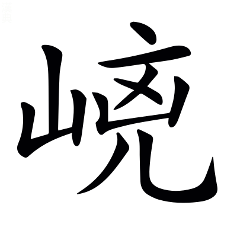
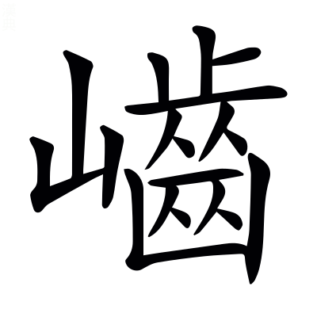
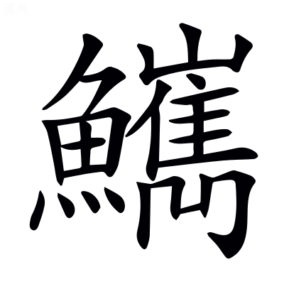
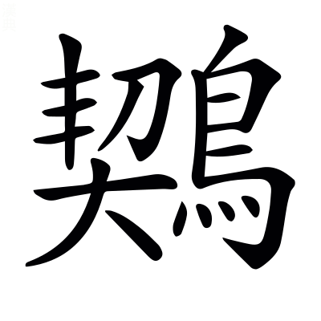
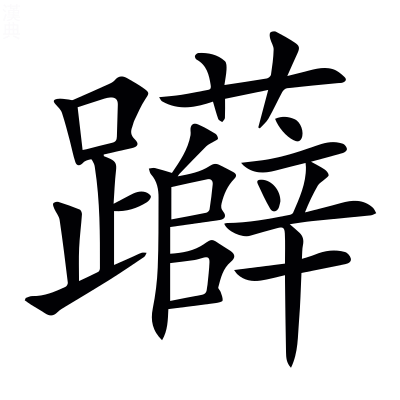
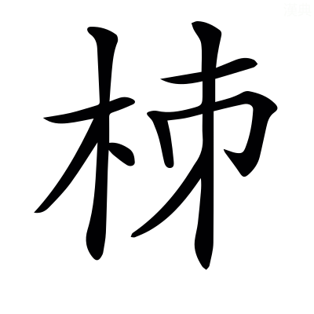
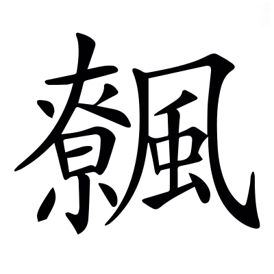

# <!-- page68 -->文選卷第四

> 梁昭明太子撰
> 
> 文林郎守太子右內率府錄事參軍事崇賢館直學士臣李善注上

京都中

張平子南都賦一首　左太沖三都賦序一首　蜀都賦一首

## 南都賦

摯虞曰：南陽郡治宛，在京之南，故曰南都。

> 張平子

於`烏`顯樂都，旣麗且康。毛萇詩傳曰：於，歎辭[^4.1.1]，於孤切。詩曰：適彼樂國。

陪京之南，居漢之陽。京，謂洛陽也。尙書曰：嶓冢導漾，東流爲漢。*鄭玄曰：漾水至武都爲漢。*

割周楚之豐壤，跨荊豫而爲疆。~~西京賦曰：周即豫而弱。呂氏春秋曰：河漢之閒爲豫州也。~~周居豫州，已見西京賦[^4.1.2]。漢書地理志注曰：南陽屬荊州。又曰：荊州，楚故都。

體爽塏以閑敞，紛郁郁其難詳。爽塏，已見西京賦。楊雄豫州箴曰「郁郁荊河[^4.1.3]，伊洛是經」也。

爾其地勢，則武闕關其西，桐栢揭`竭`其東。~~武闕山爲關在西也。~~[^4.1.4]漢書音義·文穎曰：武闕山爲關而在西，弘農界也。漢書曰：南陽之平陽縣有桐栢山。

流滄浪而爲隍，廓方城而爲墉。尙書曰：漢水又東爲滄浪之水。左氏傳：屈完曰「楚國方城以爲城，漢水以爲池。」~~說文曰：城池無水曰隍。毛萇詩傳曰：墉，城也。~~[^4.1.5]隍，已見上文。墉，已見西京賦。

湯谷涌其後，淯`育`水盪其胷。盛弘之荊州記曰：南陽郡城北有紫山，紫山東有一水，無所會通，冬夏常温，因名湯谷。山海經曰：攻離之山，淯水出焉。南流注于漢。*郭璞曰：今淯水在淯陽縣南。*盪，他浪切[^4.1.6]。

推淮引湍，三方是通。淮水自此而去，故曰推。湍水自彼而來，故曰引。說文曰：推，排也。山海經曰：翼望之山，湍水出焉。*郭璞曰：湍，鹿摶切。今湍水逕南陽穰縣而入淯也。*三方，東西及南也。

其寶利珎怪，則金彩玉璞，隨珠夜光。彩，金之彩也。璞，玉之未理者。~~淮南子曰：隨侯之珠，和氏之璧，得<!-- page69 -->之而富，失之而貧。高誘曰：隨侯，漢中國姬姓諸侯也。隨侯見大蛇傷斷，以藥傅而塗之，後蛇於夜中銜大珠以報之，因曰隨侯之珠，蓋明月珠也。鄒陽曰夜光之璧，劉琨云夜光之珠。尹文子曰：田父得寶玉徑尺，置於廡上，其夜明照一室。然則夜光爲通稱，不繫之於珠璧也。~~隨珠夜光，已見西都賦[^4.1.7]。

銅錫鉛鍇`苦駭`，赭堊~~`惡`~~流黃[^4.1.8]。鄭玄周禮注曰：錫，鑞也。說文曰：鉛，青金。又曰：九江謂鐵爲鍇。山海經曰：陸䣀之山，其下多堊；若之山，其上多赭。*郭璞曰：赭，赤土也。堊似土，白色也。*䣀音跪。堊音惡。本草經曰：石流黃，生東海牧陽山谷中。本草言其所出，此亦兼而有之。博物志曰：雄黃似石流黃。

緑碧紫英，青雘`烏郭`丹粟。廣志曰：碧有縹碧，有緑碧。本草經曰：紫石英生太山之谷。山海經曰：景山之西曰驕山，其下多青雘。*郭璞曰：雘，黝屬，音瓠。*山海經曰：荊山之首曰景山，睢水出焉。其中多丹粟。*郭璞曰：細沙如粟。*

太一餘糧，中黃瑴`角`玉。本草經曰：太一禹餘糧，一名石，生山谷。博物志曰：石中黃子黃石脂。又曰：欲得好瑴玉，用合漿，於襄鄉縣舊穴中鑿取，大者如魁斗，小者如雞子。

松子神陂，赤靈解角。習鑿齒襄陽耆舊記曰：神陂在蔡陽縣界，有松子亭，下有神陂也。赤靈，赤龍也。解角，脫角也。事未詳。

耕父揚光於清泠之淵，游女弄珠於漢皐之曲。~~山海經曰：有神耕父處豐山，常游清泠之淵，出入有光。~~耕父，已見東京賦[^4.1.9]。韓詩~~外~~傳曰[^4.1.m1]：鄭交甫將南適楚，遵波漢皐臺下，乃遇二女，佩兩珠，大如荊雞之卵。

其山則崆`口江``五江`嶱`苦葛`嵑`五葛`，嵣~~`大朗`~~㟐~~`莽`~~嶚~~`遼`~~剌`力割`。崆嶱嵑，山石高峻之貌。字書曰：崆，山貌也。嵣㟐，山石廣大之貌也[^4.1.10]；嵣音蕩，㟐音莽。嶚，山高而相戾也。廣雅曰：嶚，高也[^4.1.11]；力彫切。說文曰：剌，戾也。

岝~~`仕白`~~㟯`額`㠑~~`祚逥`~~嵬~~`五迴`~~，`香金`巇`許宜`屹`魚乞``五結`。埤蒼曰：岝㟯，山不齊也[^4.1.12]。岝，仕革切。說文曰：㠑嵬，山石崔嵬，高而不平也[^4.1.13]。㠑，昨迴切。嵬，牛迴切。廞巇，山相對而危險之貌也。屹，斷絕之貌也。

幽谷嶜~~`岑`~~岑`吟`，夏含霜雪。毛詩曰：出自幽谷。楊雄蜀都賦曰：玉石嶜岑。又曰：夏含霜雪。嶜岑，高峻之貌也[^4.1.14]。嶜，士林切。

或㟒~~`丘筠`~~嶙~~`鄰`~~而纚~~`力氏`~~連，或豁爾而中絕。㟒嶙，相連之貌[^4.1.15]。㟒，丘貧切。嶙音鄰。纚，力是切。

鞠~~`九六`~~巍巍其隱天[^4.1.16]，俯而觀乎雲霓`五結`。鞠，高貌也；九六切。~~班孟堅西都賦曰：其陽則崇山隱天。楊雄蜀都賦曰：蒼山隱天。~~[^4.1.17]隱天，已見西都賦。

若夫天封大狐，列仙之陬`子侯`。天封，未詳，或曰山名也。南郡圖經曰：大胡山，故縣縣南十里。張衡云：天封，大胡也。~~薛綜注曰：區陬，隅之間也。~~[^4.1.18]陬，已見西京賦。

上平衍而曠蕩，下蒙籠而崎~~`溪`~~嶇~~`區`~~。孫子兵法曰：草樹蒙籠。廣雅曰：崎嶇，傾側也[^4.1.19]。崎，丘宜切。嶇，丘嵎切。

坂坻`遲`嶻~~`在結`~~`五結`而成甗魚勉，谿壑錯繆`謬`而盤紆。郭璞上林賦注曰：坻，岸也。又曰：嶻，高峻也[^4.1.20]。嶻，在結切。毛萇詩傳曰：甗[^4.1.21]，小山，別大山也[^4.1.22]；魚蹇切。錯繆，雜亂貌也。

芝房菌~~`奇殞`~~蠢生其隈[^4.1.23]，玉膏滵~~`密`~~溢流其隅[^4.1.24]。芝房，芝生成房也。菌蠢，是芝貌也；其殞切。山海經曰：密山，丹水出焉，其中多白玉，是有玉膏。滵溢，流貌；滵音密。

崑崙無以奓，閬`浪`風不能踰。~~東方朔十州記曰：崑崙，其北角曰閬風之顛。~~[^4.1.25]崑崙閬風，已見西京赋。

其木則檉`勑貞`松楔~~`更黠`~~㮨~~`即`~~，槾~~`萬`~~栢杻橿~~`疆`~~。檉似栢而香。爾雅曰：楔曰荊桃。*郭璞曰：櫻桃也[^4.1.26]；*革黠切。郭璞山海經注曰：㮨似松栢有刺[^4.1.27]；子力切。槾，荊也[^4.1.28]；音萬。又曰：杻似桑而細葉。又曰：橿，中車材[^4.1.29]，音姜。

楓柙櫨櫪，帝女之桑。爾雅曰：楓，聶。楓音風。聶，之涉切。劉逵吳都賦注曰：柙，香木；~~智甲切~~音甲[^4.1.30]。郭璞上林賦注：櫨，橐。櫨，力胡切。櫪與櫟同，來的切。山海經曰：宣山有桑焉，其枝四衢，名帝女之桑。*郭璞曰：婦人主蠶，因以名桑也。*

楈~~`胥`~~枒~~`邪`~~栟~~`并`~~櫚~~`閭`~~，柍~~`於兩`~~柘檍~~`憶`~~檀。郭璞上林賦注曰：楈枒似栟櫚，皮可作索[^4.1.31]。楈音胥。枒，以奢切。張揖注上林賦曰：栟櫚，椶也，皮可以爲索[^4.1.32]。栟音并。櫚音驢。柍，未詳[^4.1.33]；於良切。爾雅曰：杻，檍。*郭璞曰：似桑[^4.1.34]。*檍音憶。蒼頡篇曰：檀，木名。

結根竦本，垂條嬋`蟬`媛`袁`。結猶同也。廣雅曰：竦，上也。嬋媛，枝相連引也。

布緑葉之萋萋，敷華蘂之蓑蓑`素回反`。毛萇詩傳曰：萋萋，茂盛貌。王逸楚辭注曰：蘂，實貌也。劉淵林蜀都賦注曰：蘂，一曰花鬚頭點也[^4.1.35]；而髓切。蓑蓑，下垂貌。

玄雲合而重陰，谷風起而增哀。淮南子曰：玄雲素朝。毛詩曰：習習谷風。

攢`在官`立叢駢，青冥䀒瞑`音眠`。言林木攢羅，衆色幽昧也。楚辭曰：遠望兮芊眠。*王逸曰：芊眠，遙視闇未明也。*芊眠與盰瞑音義同。

杳藹蓊鬱於谷底，森䔿䔿`祖本`而刺天。皆茂盛貌也。司馬相如弔二世曰：衆樹之蓊鬱兮。

虎豹黃熊游其下，豰~~`呼穀`~~玃`居縛`猱`奴刀`㹶`廷`戲其巔。六韜曰：散<!-- page70 -->宜生得黃熊而獻之紂。說文曰：豰類犬，以上黃，以下黑[^4.1.36]。豰，呼木切。爾雅曰：玃父喜顧。*郭璞曰：似獼猴而大，蒼黑色。*鄭玄禮記注曰：猱，獼猴也。劉逵吳都賦注曰[^4.1.37]：㹶，猨屬。

鸞鸑`岳`鵷鶵翔其上，騰猨飛~~`壘`~~棲其間[^4.1.38]。國語曰：周之興也，鸑鷟鳴於岐山。*賈逵曰：鸑鷟，鳳之別名也。*山海經曰：南禺之山有鵷鶵。*郭璞曰：鳳屬也。*上林賦曰：蜼玃飛蠝。*張揖曰：蠝，飛鼠也。*蠝與同，並音壘。

其竹則籦`鍾`籠`龍`䈽`謹`篾`銘決`，篠`蘇了`簳~~`幹`~~箛~~`孤`~~箠~~`追`~~。戴凱之竹譜曰：籦籠，竹名也。伶倫吹以爲律。~~竹堇~~䈽，皮白如霜[^4.1.39]，大者宜爲篙。篠，出魯郡山，堪爲笙。孔安國曰：篾，桃枝也。簳，小竹也。宋玉笛賦曰：奇簳[^4.1.40]；古罕切。箛、箠，二竹名[^4.1.41]；箛，公都切；箠，竹隨切；其形未詳。

縁延坻`遲`阪，澶`徒幹`漫陸離。~~陸離猶參差也。~~[^4.1.42]

阿`烏可`郍`奴可`蓊~~`烏孔`~~茸`如涌`，風靡雲披。阿郍，柔弱之貌。說文曰：蓊，竹貌也[^4.1.43]；於孔切。埤蒼曰：茸，竹頭有文也。風靡雲披，言隨風而靡，如雲之披也。

爾其川瀆，則滍~~`雉`~~澧`藥`濜~~`自吝`~~[^4.1.44] [^4.1.45]，發源巖穴。水經曰：滍水出南陽縣西堯山；音雉。山海經曰：澧水出雅山。*郭璞曰：今出南陽[^4.1.46]*；音禮。字書曰：水出泚陽。泚音此。酈善長水經注曰：濜水出襄鄉縣東北陽中山。濜，自吝切。

潛㕎`於臘`洞出，沒滑~~`骨`~~瀎~~`蔑`~~潏`決`[^4.1.47]。㕎，山傍穴也。~~言水洞出此穴。~~沒滑瀎潏，~~疾~~流~~之~~貌也[^4.1.48]。滑音骨。瀎音蔑。

布濩`戶`漫汗，漭`莽`沆`胡朗`洋溢。言廣大也[^4.1.49]。漭沆，已見西京賦。

揔括趨欱`呼答`，箭馳風疾。言江海欱受諸水，故揔括而趨之。~~說文曰：欱，歠也。~~欱，已見上文[^4.1.50]。慎子曰：西河下龍門，其流敵於竹箭。孫子曰：其疾如風。

流湍投濈~~`戢`~~，砏~~`普貧`~~汃~~`八`~~輣`普耕`軋`烏八`。許慎淮南子注曰：湍，水行疾也[^4.1.51]；他鸞切。埤蒼曰：濈，水行出也[^4.1.52]；俎立切。砏汃輣軋，波相激之聲也。埤蒼曰：砏，大聲也[^4.1.53]。汃，普八切。

長輸遠逝，漻`流`淚~~`力計`~~淢~~`域`~~汩`爲筆反`。廣雅曰：輸，寫也。韓詩~~外~~傳曰[^4.1.m1]：漻[^4.1.54]，清貌也。淮南子曰：水淚破舟[^4.1.55]；音戾。說文曰：淢，疾流也[^4.1.56]；音域。王逸楚辭注曰：汩，去貌。

其水蟲則有蠳龜鳴蛇，潜龍伏螭。抱朴子曰：蠳龜噉蛇。山海經曰：鮮水多鳴蛇，其狀如蛇，四翼，其音如磬，見則其邑大旱。說文曰：螭若龍而黃也。

鱏`尋`鱣`張連`鰅~~`隅`~~鱅，黿鼉鮫`以規反`。鱏、鱣，已見上文。郭璞上林賦注曰：鰅魚有文采[^4.1.57]；音禺。鱅，似鰱而黑[^4.1.58]。鰱音連。山海經注曰：鮫，䱜屬也，皮有班文而堅。鮫，已見東京賦。

巨蜯函`含`珠，駮`剝`瑕委蛇。楊雄蜀都賦曰：蜯函珠而擘裂。蜯與蚌同[^4.1.59]，步項切。函與含同。郭璞爾雅注曰：蝦大者長一二丈。委蛇，長貌。瑕與蝦古字通[^4.1.60]，胡加切。

~~於~~其陂澤[^4.1.61]，則有鉗盧玉池，赭陽東陂。杜預表曰：所領部曲，皆居南鄉界，所近鉗盧大陂，下有良田。舊說曰：玉池在宛也。

貯~~`知旅`~~水渟`亭`洿`汙`[^4.1.62]，亘望無涯`宜`。說文曰：貯，積也；知旅切。廣雅曰：渟，止也。說文曰：洿，濁水不流也。方言曰：亘，竟也。上林賦曰：察之無涯。

其草則藨`平表`苧`直呂`薠~~`煩`~~莞[^4.1.63]`桓`，蔣`將`蒲~~`孤`~~蒹葭。說文曰：藨，蒯之属[^4.1.64]。又曰：苧可以爲索。郭璞山海經注曰：薠，青薠，似莎而大[^4.1.65]；扶袁切。鄭玄毛詩箋曰：莞，小蒲也[^4.1.66]；胡官切。說文曰：蔣，菰蔣也[^4.1.67]；蔣，子詳切。菰音孤。爾雅曰：蒹，薕也。葭，蘆也。

藻茆~~`卯`~~菱芡`渠儼`，芙蓉含華。從風發榮，斐披芬葩。藻，已見西京賦。爾雅曰：茆，鳧葵[^4.1.68]。茆，亡絞切。菱芡、芙蓉，並見東京賦。

其鳥則有鴛鴦鵠鷖`烏兮`，鴻鴇`保`鴐`加`鵝。~~`苦札`~~鶂`雅札`鸊~~`步覓`~~鶙~~`吐雞`~~[^4.1.69] [^4.1.70]，鷫`肅`鷞`所良`鵾`昆`鸕`盧`。毛詩曰：鴛鴦于飛。班孟堅西都賦曰：黃鵠鵁鸛，鳧鷖鴻鴈。張平子西京賦曰：鷫鷞鵠鴇，鴐鵝鴻鶤[^4.1.71]。說文曰：鶂，鳧屬；苦札切。方言曰：野鳧，甚小而好沒水中者，南楚之外，謂之鸊鶙。鸊，步覓切。鶙，土雞切。鵾與鶤同。蒼頡篇曰：鸕鷀似鶂而黑。鸕，良都切。鷀音磁[^4.1.72]。

嚶嚶`烏耕`和鳴，澹`徒濫`淡`徒敢`隨波。言自恣也。毛詩曰：鳥鳴嚶嚶。爾雅曰：關關嚶嚶，聲之和也。上林賦曰：隨風澹淡。

其水則開竇灑~~`所蟹`~~流[^4.1.73]，浸彼稻田。鄭玄周禮注曰：竇，孔穴也，音豆。漢書音義曰：灑，分也；所蟹切。毛詩曰：浸彼稻田。

溝澮脉連，隄塍`繩`相輑`丘筠反`。爾雅曰：水注溝曰澮。韋昭國語注曰：脉，理也。隄塍，已見西都賦。輑，相連之貌。

朝雲不興，而潢潦~~`老`~~獨臻[^4.1.74]。左氏傳曰：潢汙行潦之水。說文曰：潢，積水池也。潦，雨水；音老。

決渫~~`薛`~~則暵~~`罕`~~，爲漑`古愛`爲陸。冬稌`肚`夏穱`側角`，隨時代熟。說文曰：渫，去除也[^4.1.75]；息列切。又曰：暵，乾也[^4.1.76]；呼但切。又曰：漑，灌也。稌，已見東京賦。楚辭曰：稻粢穱麥挐黃粱。

其原野則有桑漆麻苧~~`直旅`~~[^4.1.77]，菽麥稷黍。百穀蕃廡`武`，翼翼與與。說文曰：苧，麻屬；直旅切。鄭玄毛詩箋曰：菽，大豆也。百穀蕃廡，並已見東京賦。毛詩曰：我黍與與，我稷翼翼。

若其園圃，則有<!-- page71 -->蓼~~`了`~~蕺`側立`蘘`而羊`荷，藷~~`之餘`~~蔗薑䪤~~`煩`~~，菥~~`析`~~蓂~~`覓`~~芋瓜[^4.1.78]。說文曰：蓼，辛菜也[^4.1.79]；力烏切。風土記曰：䔼，香菜[^4.1.80]，根似茆根，蜀人所謂蒩香。蕊與蕺同。說文曰：蘘荷，葍蒩也。葍，普卜切。蒩，子余切。漢書音義曰：藷蔗，甘柘也。之餘切。字書曰：䪤，小蒜也。音煩。爾雅曰：菥蓂，大薺。菥音析。蓂音覓。

乃有櫻梅山柿，侯桃梨栗。漢書音義曰：櫻桃，含桃也。郭璞爾雅注曰：梅似杏，實酸。說文曰：柿，赤實果也。曹毗魏都賦注曰：侯桃，山桃。子如麻子。

梬`郢`棗若留，穰橙鄧橘。說文曰：梬棗，似㮕；如兗切。廣雅曰：石留，若榴也。漢書：南陽郡有穰縣鄧縣。說文曰：橙，橘屬也[^4.1.81]；除耕切。

其香草則有薜`萍計`荔`力計`蕙若，薇蕪蓀萇。王逸楚辭注曰：薜荔，香草也。郭璞山海經注曰：蕙，香草也；若，杜若也。本草經曰：靡蕪一名薇蕪。陶隱居~~注~~曰[^4.1.82]：蕙，葉似蛇牀而香。王逸楚辭注曰：蓀，香草也。萇，萇楚也。爾雅曰：萇楚，銚弋也[^4.1.83]。萇音長。銚音遙。

晻`於感`曖`愛`蓊`烏㧾`蔚，含芬吐芳。言草木闇暝而茂盛也。說文曰：晻，不明貌。王逸楚辭注曰：曖，闇昧貌。

若其廚膳，則有華薌重秬~~`渠舉`~~，滍`秩履`皐香秔`公行反`。華薌，鄉名也。毛萇詩傳曰：秬，黑黍，一稃二米，故曰重也。秬音巨。稃音敷[^4.1.84]。滍皐，滍水之澤也。廣雅曰：秔，秈也。秈音仙。

歸鴈鳴鵽~~`陟滑`~~[^4.1.85]，黃稻鱻~~`咠連`~~魚，以爲芍`張畧`藥`音略`。鴈能候時去來，故曰歸。史記曰：楚人有以弱弓微繳，加歸鴈之上。爾雅曰：鵽鳩，寇雉；鵽陟滑切。*郭璞曰：鵽，大如鴿，羣飛，出北方沙漠。*聲類曰：鱻，小魚也[^4.1.86]，與鮮同，胥連切。子虛賦曰：芍藥之和具而後進也。*文穎曰：五味之和。*

酸甜滋味，百種千名。說文曰：甜，美也[^4.1.87]；徒兼切。

春卵夏筍，秋韭冬菁~~`音精`~~[^4.1.88]。爾雅曰：筍，竹萌也。廣雅曰：韭，其華謂之菁。音精。

蘇蔱~~`殺`~~紫薑，拂徹羶~~`尸然`~~腥[^4.1.89]。爾雅曰：蘇，桂荏。字書曰：蔱，茱萸也；音殺。司馬彪上林賦注曰：紫薑，紫色之薑也。杜預左氏傳注曰：徹猶去也。羶，尸然切。

酒則九醖~~`於問`~~甘醴[^4.1.90]，十旬兼清。醪敷徑寸，浮蟻若蓱。魏武集，上九醖酒，奏曰：三日一釀，滿九斛米止。廣雅曰：醖，投也。於問切。韓詩傳曰：醴，甜而不泲也[^4.1.m1]。十旬，蓋清酒百日而成也。鄭玄周禮注曰：清酒，今之中山冬釀接夏而成也。漢書音義·晉灼曰：百日之末酒也。說文曰：醪，汁滓酒也。徑寸，蓋酒膏之徑寸也。釋名曰：酒有汎齊，浮蟻在上，汎汎然如蓱之多者。

其甘不爽，醉而不酲。老子曰：五味令人口爽。廣雅曰：爽，傷也。毛萇詩傳曰：病酒曰酲。

及其糺宗綏族，禴祠蒸嘗。左氏傳曰：召公思周德之不類，故糺合宗族于成周。爾雅曰：綏，安也。毛詩曰：禴祠蒸嘗，于公先王[^4.1.91]。

以速遠朋，嘉賓是將。揖讓而升，宴于蘭堂。儀禮曰：速賓。*鄭玄曰：速，召也。*論語曰：有朋自遠方來。毛詩曰：我有嘉賓，鼓瑟吹笙；吹笙鼓簧[^4.1.92]，承筐是將。儀禮曰：若四方賓燕，則揖讓而升。賈逵國語注曰：不脫履升堂曰宴[^4.1.93]。漢書曰：袚蘭堂。

珍羞琅玕，充溢圓方。爾雅曰：珍，美也。方言曰：羞，熟。以羞之美，故喻於玉也。圓方，器也。尙書曰：厥貢琅玕。又曰：惟辟玉食。

琢琱狎獵，金銀琳琅。爾雅曰：玉謂之彫[^4.1.94]。琱與彫古字通也。爾雅曰：理玉曰琢；都角切。狎獵，飾之皃；胡甲切。獵，士甲切。尙書曰：厥貢球琳琅玕。

侍者蠱媚，巾㡚鮮明。蠱，已見西京賦。毛萇詩傳曰：綦巾，女服也。字書曰：㡚，上衣。

被服雜錯，履躡華英。雜錯，非一也。華英，光耀也。被，皮義切。

儇才齊敏，受爵傳。方言曰：儇，急疾也；呼緣切。齊，在雞切。毛萇詩傳曰：敏，疾也。

獻酬旣交，率禮無違。毛詩曰：獻酬交錯。左氏傳：晉侯曰「魯侯自郊勞至于贈賄，禮無違者。」東觀漢記曰：朱浮上䟽曰「陛下率禮無違。」

彈琴擫籥，流風徘徊。言樂聲之結風也。說文曰：擪，一指按也。擪與擫同，烏牒切。鄭玄周禮注曰：籥，舞者所吹也，如篴三孔。籥音藥。篴音敵。

清角發徵，聽者增哀。言旣奏清角而又發徵聲，故增哀也。韓子：師曠曰「清徵之聲，不如清角。」許慎淮南子注曰：清角絃急，其聲清也。

客賦醉言歸，主稱露未晞。毛詩曰：鼓咽咽，醉言歸。又曰：湛湛露斯，匪陽不晞；厭厭夜飲，不醉無歸。

接歡宴於日夜，終愷樂之令儀。毛詩曰：愷樂飲酒。又曰：莫不令儀。

於是暮春之禊，元巳之辰，方軌齊軫，祓于陽瀕。毛詩曰：惟暮之春。史記曰：武帝禊霸上。續漢書曰：三月上巳，宮人皆禊於東流水上，祓除宿垢疾也。周禮曰：女巫掌歲時祓除。楊雄蜀都賦曰：相與如乎陽瀕。

朱帷連綱[^4.1.95]，曜野映雲。綱，維綱也。

男女姣服，駱驛繽紛。駱驛繽紛，往來衆多貌。

致飾程蠱，偠紹便<!-- page72 -->娟。廣雅曰：程，示也。便娟則蟬蜎也。蠱及偠紹便娟，已見西京賦。

微眺流睇，蛾眉連卷。鄭玄禮記注曰：睇，傾視也；徒計切。毛詩曰：螓首蛾眉。郭璞爾雅注曰：蠶蛾也。連卷，曲貌。卷音權。

於是齊僮唱兮列趙女。齊趙，二國名也。楊惲書曰：婦，趙女也。

坐南歌兮起鄭儛。白鶴飛兮繭曳緒。呂氏春秋曰：禹行水，見塗山之女，禹未之遇，而省南土，塗山之女乃令其妾往候禹于塗山之陽，女乃作歌曰「候人猗兮」，實始爲南音。周公召公取風焉。*高誘曰：取南音以爲樂歌也。*楚辭曰：二八齊容起鄭舞。*王逸曰：鄭國儛也。*白鶴飛兮繭曳緒，皆舞人之容。

脩袖繚繞而滿庭，羅襪躡蹀而容與。繚繞，袖長貌。躡蹀，小步貌。說文曰：躡，蹈也；徒頰切。許慎淮南子注曰：蹀，蹈也；蘇協切。

翩緜緜其若絕，眩將墜而復舉。毛萇詩傳曰：緜緜，長而不絕貌。國語曰：觀美而眩。*賈逵曰：眩，惑也。*

翹遙遷延，䠥蹁躚。翹遙，輕舉貌。遷延，却退貌。上林賦曰：便跚蹩屑。䠥，蒲結切。，素結切。蹁，步先切。躚，素田切。

結九秋之增傷，怨西荊之折盤。古樂府有歷九秋妾薄相行歌，辭曰「齊謳楚舞紛紛，歌聲上徹青雲。」西荊即楚舞也。折盤，舞貌。張衡有七盤舞賦，或以折盤爲七盤也[^4.1.96]。

彈箏吹笙，更爲新聲。毛詩曰：吹笙鼓簧。史記曰：衛靈公見晉平公曰「今者未聞新聲，請奏之。」更，古衡切。

寡婦悲吟，鵾雞哀鳴。寡婦曲未詳。古相和歌有鵾雞之曲。

坐者悽欷，蕩魂傷精。楚辭曰：憯悽增欷，傷精神也。神女賦曰：精神相依憑。

於是羣士放逐，馳乎沙場。逐，馳逐也。

騄驥齊鑣，黃閒機張。騄驥，駿馬之名也。穆天子傳：八駿有赤驥、騄耳；音録。說文曰：鑣，馬銜也；彼驕切。漢書曰：李廣以大黃射其裨將。*鄭氏曰：黃間，弩淵中黃牙。*尙書曰：若虞機張。*孔安國曰：機，弩牙。*

足逸驚飇，鏃析毫芒。言馬疾而矢利。析音錫。

俯貫魴鱮；仰落雙鶬`音倉`。魴鱮，已見西京賦。列子曰：蒲且子連雙鶬於青雲之上。鶬，已見西都賦。

魚不及竄，鳥不暇翔。言急遽也。高唐賦曰：飛鳥未及起，走獸未及發。

爾乃撫輕舟兮浮清池，亂北渚兮揭南涯。浮，已見西都賦。爾雅曰：水正絕流曰亂。說文曰：揭，高舉也[^4.1.97]；丘別切。

汰~~`太`~~瀺~~`仕減`~~灂`仕角`兮舩容裔，陽侯澆兮掩鳧鷖。楚辭曰：齊吳榜以激汰。*王逸曰：汰，水波也[^4.1.98]；*徒蓋切。上林賦曰：瀺灂隕隊[^4.1.99]。瀺，士減切。戰國策曰：塞漏舟而輕陽侯之波，則舟覆矣。淮南子曰：武王伐紂，渡于孟津，陽侯之波，逆流而擊之。*高誘曰：陽侯，陽國侯也，溺死於水，其神能爲大波。*王逸楚辭注曰：回波爲澆[^4.1.100]；公堯切。毛詩曰：鳧鷖在潨。

追水豹兮鞭蝄蜽，憚`丁達`夔龍兮怖蛟螭。水豹，已見西京賦。~~說文曰：蝄蜽，山川之精物也。蛟螭，若龍而黃。~~蝄蜽、蛟螭，已見西京赋[^4.1.101]。國語曰：木石之怪夔，水之怪龍。*韋昭曰：木石爲山也。夔一足也。*

於是日將逮昏[^4.1.102]，樂者未荒。毛詩曰：好樂無荒。

收驩命駕，分背迴塘。孔叢子曰：巾車命駕。廣雅曰：塘，堤也。

車雷震而風厲，馬鹿超而龍驤。雷震，言多也。風厲，言疾也。毛詩曰：戎車焞焞，如霆如雷。毛萇詩傳曰：雷出地奮，震驚百里。古詩曰：涼風率已厲。杜預左氏傳注曰：厲，猛也。韓子曰：馬如鹿者千金。鄒陽上書曰：蛟龍驤首。舞賦曰：龍驤橫舉，揚鑣飛沫。周禮曰：凡馬八尺已上爲龍。

夕暮言歸，其樂難忘。此乃游觀之好，耳目之娛。未睹其美者，焉足稱舉。言此游觀耳目之樂，非極美也。

夫南陽者，真所謂漢之舊都~~者~~也[^4.1.103]。遠世則劉后甘厥龍醢`海`，覛魯縣而來遷[^4.1.104]。左氏傳曰：劉累學擾龍于豢龍氏，以事孔甲。龍一雌死，潛醢以食夏后，夏后饗之，旣又使求之，懼而遷於魯縣。漢書曰：南陽郡魯陽縣即御龍氏所遷。

奉先帝而追孝，立唐祀乎堯山。先帝，謂堯也。~~皇甫謐曰：堯始封於唐，今中山唐縣是也。後徙晉陽。及爲天子，都平陽，於詩爲唐國。是堯以唐侯升爲天子也。~~堯以唐侯升爲天子，已見上文[^4.1.105]。水經曰：南陽縣西堯山。酈元曰：魯縣立堯祠於西山，謂之堯山也。

固靈根於夏葉，終三代而始蕃`音繁`。言劉氏植根於夏葉，終三代而始蕃昌也。毛萇詩傳曰：葉，世也。三代，已見班固兩都序。

非純德之宏圖，孰能揆~~`求癸`~~而處旃[^4.1.106]。孔安國尙書傳曰：揆，度也；求癸切。鄭玄毛詩箋曰：旃，之也。

近則考侯思故，匪居匪寧。穢長沙之無樂，歷江湘而北征。東觀漢記曰：舂陵節侯，長沙定王中子買。節侯<!-- page73 -->生戴侯，戴侯生考侯。考侯仁以舂陵地勢下濕，難以久處，上書願徙南陽守墳墓，元帝許之，於是北徙。考或爲孝，非也。

曜朱光於白水，會九世而飛榮。朱光，火德也。已見東京賦。東觀漢記曰：考侯仁徙封南陽白水鄉。又曰：世祖光武皇帝，高祖九世孫，承文景之統，出自長沙定王。榮，光榮也。封禪書曰：發號榮。

察茲邦之神偉[^4.1.107]，啓天心而寤靈。言考侯旣察此都之神偉，且啓上天之心，又寤先靈之意，使之而王也。說文曰：偉，奇也。

於其宮室，則有園廬舊宅，隆崇崔嵬。~~說文曰：崔，~~[^4.1.108]高大也。

御房穆以華麗，連閣煥其相徽。御房，帝舊房也。相徽，言俱美。孔安國尙書傳曰：徽，美也。

聖皇之所逍遙，靈祇之所保綏。聖皇，謂光武也。逍遙，謂潜龍之日。韓詩~~外~~傳曰：逍遙也[^4.1.109]。靈祇，天地之神也。毛詩曰：神保是饗。又曰：綏以多福也。

章陵鬱以青葱，清廟肅以微微。東觀漢記曰：建武中，更名舂陵爲章陵。光武過章陵，祠園廟。爾雅曰：青謂之葱，林木茂盛之貌。微微，幽靜貌。

皇祖歆而降福，彌萬祀而無衰。毛詩曰：獻之皇祖。說文曰：歆，神食氣也。毛詩曰：降福孔夷。爾雅曰：彌，終也。又曰：祀，年也。

帝王臧其擅美，詠南音以顧懷。帝王，光武也。顧懷，過章陵祠園廟之時也。爾雅曰：臧，善也。說文曰：擅，專也。左氏傳：楚鍾儀囚於晉，與之琴，操南音。劇秦美新曰：后土顧懷。

且其君子，弘懿明叡，允恭温良。容止可則，出言有章。進退屈伸，與時抑揚。班固說東平王蒼曰：體弘懿之姿。叡，哲也。已見東京賦。尙書曰：允恭克讓。論語：子貢曰「夫子温良恭儉讓。」孝經曰：容止可觀，進退可度。毛詩曰：其容不改，出言有章。周易曰：往者屈也，來者伸也，屈伸相感，而利害生焉。班固漢書·叔孫通述曰：叔孫奉常，與時抑揚。

方今天地之睢~~`虛惟`~~剌`力達`，帝亂其政，豺虎肆虐，真人革命之秋也。漢書音義曰：方，向也。謂高祖之時。蒼頡篇曰：今，時辭也，謂光武。天地猶天下也。睢剌，喻禍亂也，謂秦二葉也。淮南子曰：萬物盱睢。楚辭曰：獨乖剌而無當。*王逸曰：剌，邪也[^4.1.110]。*睢，許規切。帝謂高祖也。馬融論語注曰：亂，理也。豺狼貪殘，謂王莽也。真人，光武也。文子曰：得天地之道，故謂之真人。革命，已見東都賦。

爾其則有謀臣武將，皆能攫`九縛`戾執猛，破堅摧剛。排揵`件`陷扃~~`古熒`~~[^4.1.111]，蹵蹈咸陽。蒼頡篇曰：攫，搏也。說文曰：揵，距門也。又曰：扃，外閉之關也；古熒切。

高祖階其塗，光武攬其英。漢書曰：沛公圍宛城，南陽守齮降，引兵西，無不下者。爾雅曰：階，因也。齮音蟻。東觀漢記曰：鄧禹、吳漢並南陽人。三略曰：主將之體，務在攬英雄之心。

是以關門反距，漢德久長。言居西而距東，居東而距西，故言反也。杜篤論都賦曰：是時山東翕然狐疑，意聖朝之西都，懼關門之反距。

及其去危乘安，視人用遷。去危乘安，謂太平也。視人用遷，謂觀人所安而設教。

周召之儔，據鼎足焉，以庀`匹婢`王職。史記曰：周公旦者，周武王弟也，輔武王。又召公奭，姓姬氏。成王時，召公爲三公。漢書曰：夫三公，鼎足之輔也。賈逵國語注曰：庀，由理也。

縉紳之倫，經綸訓典，賦納以言。漢書音義·臣瓚曰：縉，赤白色。紳，大帶也。李奇曰[^4.1.112]：搢，插笏於大帶。周易曰：君子以經綸。國語曰：修其訓典。尙書曰：敷納以言也。

是以朝無闕政，風烈昭宣也。春秋考異郵曰：後雖殊世，風烈猶合於持方。*宋均曰：持方，受命者名。*

於是乎鯢齒眉壽，鮐背之叟，皤皤然被黃髮者，毛詩曰：以介眉壽。*毛萇曰：眉壽，毫眉也。*爾雅曰：黃髮、鯢齒、鮐背、耇老，壽也。皤皤，已見東京賦。

喟然相與歌曰：「望翠華兮葳蕤，建太常兮裶裶~~`音霏`~~。上林賦曰：建翠華之旗。葳蕤，翠華貌。太常，已見東京賦。上林賦曰：衯衯裶裶[^4.1.113]；芳非切。

駟飛龍兮騤騤`逵`，振和鑾兮京師[^4.1.114]。飛龍，言疾也。周易曰：飛龍在天。毛詩曰：四牡騤騤。~~鄭玄禮記注曰：鑾輅，有虞氏之車也。有鑾和之節。~~和鑾，已見上文[^4.1.115]。

揔萬乘兮徘徊，按平路兮來歸。萬乘，見東京賦。毛萇詩傳曰：迴，遲也。然徘徊即遲遲也。毛詩曰：行道遲遲。南陽舊居，故曰來歸。毛詩曰：來歸自鎬。

豈不思天子南巡之辭者哉。遂作頌曰：毛詩曰：豈不爾思。尙書曰：五月南巡狩。

<!-- page74 -->皇祖止焉，光武起焉。皇祖，高祖也。周易曰：庖犧氏沒，神農氏作[^4.1.116]。

據彼河洛，統四海焉。河洛，謂東都也。西都賦曰：嘗有意乎都河洛。

本枝百世，位天子焉。毛詩曰：文王孫子[^4.1.117]，本枝百世。

永世克孝，懷桑梓焉。毛詩曰：永世克孝。又曰：維桑與梓，必恭敬止。

真人南巡，覩舊里焉。東觀漢記曰：光武征秦豐，幸舊宅。酈元水經注曰：光武征秦豐，張衡以爲真人南巡，觀舊里焉。

[^4.1.1]: 注「於歎辭」　袁本、茶陵本「辭」下有「於孤切」三字，是也。其正文下「烏」字乃五臣音也。凡合併六家之本，於正文下載五臣音，於注中載善音，而善音之同於五臣者每被節去。袁、茶陵二本，又各多寡不齊，蓋合併不一，故所節去不一耳。至尤本於正文下五臣音，往往未嘗區別刊正，而注中善音，則節去彌甚，其失善舊，亦彌甚矣。今取二本善音之可考者，悉皆訂正。其二本已節去在前，則末由考之。間有可借正文下五臣音推知崖略者，然旣非明文，難以稱說，當俟再詳。全書善音之例，均準此。

[^4.1.2]: 注「西京賦曰」下至「爲豫州也」　袁本此二十二字作「周居豫州已見西京賦」，是也。茶陵本複出，非。

[^4.1.3]: 注「郁郁京河」　袁本、茶陵本「京」作「荆」，是也。

[^4.1.4]: 注「武闕山爲關在西也」　茶陵本無此八字。袁本有，何、陳校皆去。觀下注，似不當有。

[^4.1.5]: 注「說文曰」下至「墉城也」　袁本此十七字作「隍已見上文墉已見西京賦」，是也。茶陵本複出，非。

[^4.1.6]: 注「盪他浪切」　袁本、茶陵本無此四字。茶陵有「淯音育」三字，袁亦無。案：茶陵是也。

[^4.1.7]: 注「淮南子曰隨侯之珠」下至「不繫之於珠璧也」　袁本、茶陵本無此一百十七字。袁有「隨珠夜光已見西都賦」九字，茶陵有「隨珠夜光見西都注」八字，案：袁本是也。茶陵例改已見爲複出，此條其遺漏者，尙屬善舊。尤乃複出，甚非。

[^4.1.8]: 注「惡」　袁本、茶陵本作「堊音惡」三字，在注中「䣀音跪」下，是也。

[^4.1.9]: 注「山海經曰」下至「出入有光」　袁本此二十一字作「耕父已見東京賦」，是也。茶陵本複出，非。

[^4.1.10]: 注「嵣㟐山石廣大之貌也」　袁本、茶陵本此下有「嵣音蕩㟐音莽」六字，是也。

[^4.1.11]: 注「嶚高也」　袁本、茶陵本此下有「力彫切」三字，是也。

[^4.1.12]: 注「岝㟯山不齊也」　袁本、茶陵本此下有「岝仕革切」四字，是也。

[^4.1.13]: 注「高而不平也」　袁本、茶陵本此下有「㠑昨迴切嵬牛迴切」八字，是也。

[^4.1.14]: 注「高峻之貌也」　袁本、茶陵本此下有「嶜士林切」四字，是也。

[^4.1.15]: 注「相連之貌」　袁本、茶陵本此下有「㟒丘貧切嶙音鄰纚力是切」十一字，是也。

[^4.1.16]: 注「九六」　袁本、茶陵本作「九六切」三字，在注中「鞠高貌也」下，是也。

[^4.1.17]: 注「班孟堅」下至「蒼山隱天」　袁本此二十四字作「隱天已見西都賦」，是也。茶陵本複出，非。

[^4.1.18]: 注「薛綜注曰區陬隅之間也」　袁本此十一宇作「陬已見西京賦」，是也。茶陵本複出，非。

[^4.1.19]: 注「傾側也」　袁本、茶陵本此下有「崎丘宜切嶇丘嵎切」八字，是也。

[^4.1.20]: 注「嶻高峻也」　袁本、茶陵本此下有「嶻在結切」四字，是也。

[^4.1.21]: 注「毛萇詩傳曰巘」　袁本「巘」作「巚」，茶陵本亦作「巘」。案：各本皆非也。當作「甗」，乃與正文相應。茶陵本校語云善作「甗」，否則善當有「巘」、「甗」異同之注，今刪削不全。又案：西京賦「陵重巘」，正文及注皆作「巘」，而毛詩皇矣正義所引則爲「甗」字，恐彼亦善「甗」、五臣「巘」，各本亂之。如袁本之此正文作「巘」，而失著校語也。

[^4.1.22]: 注「小山別大山也」　袁本、茶陵本此下有「魚蹇切」三字，是也。

[^4.1.23]: 注「奇殞」　袁本作「其殞切」三字，在注中「是芝貌也」下，是也。茶陵本與此同，非。

[^4.1.24]: 注「密」　袁本「滵音密」三字在注末，是也。茶陵本與此同，非。

[^4.1.25]: 注「東方朔」下至「閬風之顛」　袁本此十七字作「崑崙閬風已見西京赋」，是也。茶陵本複出，非。

[^4.1.26]: 注「櫻桃也」　袁本、茶陵本此下有「革黠切」三字，是也。

[^4.1.27]: 注「有刺」　袁本、茶陵本此下有「子力切」三字，是也。

[^4.1.28]: 注「荊也」　袁本、茶陵本此下有「音萬」二字，是也。

[^4.1.29]: 注「中車材」　袁本、茶陵本此下有「音姜」二字，是也。

[^4.1.30]: 注「智甲切」　袁本作「音甲」二字，茶陵本無。案：似袁本是也。

[^4.1.31]: 注「皮可作索」　袁本此下有「楈音胥枒以奢切」七字，是也。茶陵本無「楈音胥」，非。

[^4.1.32]: 注「皮可以爲索」　袁本此下有「栟音并櫚音驢」六字，是也。茶陵本無，非。

[^4.1.33]: 注「柍未詳」　袁本、茶陵本此下有「於良切」三字，是也。

[^4.1.34]: 注「似桑」　袁本此下有「檍音憶」三字，是也。茶陵本無，非。

[^4.1.35]: 注「花頭點也」　案：「花」下當有「鬚」字。各本皆脫。又袁本、茶陵本此下有「而體切」三字，是也。 「體」當作「髓」。

[^4.1.36]: 注「以下黑」　袁本、茶陵本此下有「豰呼木切」四字，是也。

[^4.1.37]: 注「張載吳都賦注曰」　案：張載當作「劉逵」。各本皆誤。

[^4.1.38]: 騰猨飛蠝棲其間　茶陵本「蠝」作「」，袁本作「」。案：「」字是也。注云：「蠝」與「」同，謂正文 之「」，可證也。

[^4.1.39]: 注「竹堇皮白如霜」　案：「竹堇」當作「䈽」，蓋一字誤分爲二。袁本亦誤。茶陵本改「堇」爲「䈽」，非。

[^4.1.40]: 注「宋玉笛賦曰奇簳」　袁本、茶陵本此下有「古罕切」三字，是也。案：古文苑載此賦云「奇篠異幹」，此疑脫。彼「幹」即「簳」字耳。

[^4.1.41]: 注「二竹名」　袁本、茶陵本此下有「箛公都切箠竹隨切」八字，是也。

[^4.1.42]: 注「陸離猶參差也」　袁本無此六字，茶陵本有。案：此六字，袁在所載五臣向注中，無者是也。

[^4.1.43]: 注「蓊竹貌也」　袁本此下有「於孔切」三字，是也。茶陵本無，非。

[^4.1.44]: 注「雉」　袁本、茶陵本作「音雉」，二字在注中「堯山」下，是也。

[^4.1.45]: 注「自吝」　袁本、茶陵本作「濜自吝切」四字，在注末，是也。

[^4.1.46]: 注「今出南陽」　袁本此下有「音禮」二字，是也。茶陵本無，非。

[^4.1.47]: 注「骨」又注「蔑」　袁本作「滑音骨瀎音蔑」六字，在注末，是也。

[^4.1.48]: 注「言水洞出此穴沒滑瀎潏疾流之貌也」　袁本無「言水洞出此穴疾之」八字，是也。茶陵本并善入五臣，與此同誤。

[^4.1.49]: 注「言廣大也」　袁本、茶陵本無此四字，是也。案：二本在所載良注中。

[^4.1.50]: 注「說文曰欱歠也」　袁本此六字作「欱已見上文」，是也。茶陵本複出，非。

[^4.1.51]: 注「水行疾也」　袁本、茶陵本此下有「他鸞切」三字，是也。

[^4.1.52]: 注「水行出也」　袁本、茶陵本此下有「俎立切」三字，是也。

[^4.1.53]: 注「大聲也」　茶陵本此下有「汃普八切」四字。袁本無。案：茶陵是也。

[^4.1.54]: 注「韓詩外傳曰漻」　案：「外」字不當有。各本皆衍。凡本篇引韓詩外傳曰「鄭交甫」云云一條，韓詩曰「醴甜而不泲也」一條，韓詩外傳曰「逍遙也」一條，及此一條，皆當作「韓詩傳曰」，如東都賦注引「魯詩傳曰」之例。傳者蓋所謂內傳。其「逍遙也」句有脫，各本皆同，無以補之。

[^4.1.55]: 注「水淚破舟」　袁本、茶陵本此下有「音戾」二字，是也。

[^4.1.56]: 注「疾流也」　袁本此下有「音域」二字，是也。茶陵本無，非。

[^4.1.57]: 注「鰅魚有文采」　袁本、茶陵本此下有「音禺」二字，是也。

[^4.1.58]: 注「似鰱而黑」　袁本、茶陵本此下有「鰱音連」三字，是也。

[^4.1.59]: 注「蜯與蚌同」　袁本、茶陵本此下有「步項切」三字，是也。

[^4.1.60]: 注「古字通」　袁本、茶陵本此下有「胡加切」三字，是也。

[^4.1.61]: 於其陂澤　袁本無「於」字，何校去。茶陵初刻無，脩者有。案：無者是也。

[^4.1.62]: 注「知旅」　袁本、茶陵本作「知旅切」三字，在注中「積也」下，是也。

[^4.1.63]: 其草則藨苧薠莞　袁本、茶陵本「則」下有「有」字，案：有者是也。

[^4.1.64]: 注「葪之屬」　何校「葪」改「」。案：當作「蒯」，「蒯」即「」字也。

[^4.1.65]: 注「似莎而大」　袁本、茶陵本此下有「扶袁切」三字，是也。

[^4.1.66]: 注「小蒲也」　袁本、茶陵本此下有「胡官切」三字，是也。

[^4.1.67]: 注「菰蔣也」　袁本、茶陵本此下有「蔣子詳切菰音孤」七字，是也。案：「菰音孤」善自音注中字耳，正文「蒲」下「孤」乃因此竄入，誤之甚者也。

[^4.1.68]: 注「茆鳧葵」　袁本、茶陵本此下有「茆亡絞切」四字，是也。

[^4.1.69]: 注「苦札」　袁本作「苦札切」，在注中「鳧屬」下，是也。茶陵本與此同，非。

[^4.1.70]: 注「步覓」又注「吐雞」　袁本作「鸊步覓切鶙土雞切」八字，在注中「謂之鸊鶙」下，是也。茶陵本與此同，非。

[^4.1.71]: 注「班孟堅」下至「鴐鵝鴻鶤」　袁本此三十字作「餘已見上注」，是也。茶陵本複出，非。

[^4.1.72]: 注「鷀音磁」　袁本，茶陵本「鷀」上有「鸕良都切」四字，是也。

[^4.1.73]: 注「所蟹」　袁本、茶陵本作「所蟹切」三字，在注中「灑分也」下，是也。

[^4.1.74]: 注「老」　袁本、茶陵本作「音老」二字，在注末，是也。

[^4.1.75]: 注「去除也」　袁本、茶陵本此下有「息列切」三字，是也。

[^4.1.76]: 注「乾也」　袁本、茶陵本此下有「呼但切」三字，是也。

[^4.1.77]: 注「直旅」　袁本、茶陵本作「直旅切」三字，在注中「麻屬」下，是也。

[^4.1.78]: 注「之餘」又注「煩」又注「析」又注「覓」　袁本、茶陵本作「藷之餘切」四字，在注中「甘柘也」下，「音煩」二字在「小蒜也」下，「菥音析蓂音覓」六字在末，是也。

[^4.1.79]: 注「蓼辛菜也」　袁本、茶陵本此下有「力烏切」三字，是也。

[^4.1.80]: 注「蕊香菜」　案：「蕊」當作「䔼」，下同。各本皆譌。集韻廿六緝云「䔼，香菜」，即本此。

[^4.1.81]: 注「橘屬也」　袁本此下有「除耕切」三字，是也。茶陵本無，非。

[^4.1.82]: 注「陶隱居注曰」　袁本、茶陵本無「注」字，是也。

[^4.1.83]: 注「蓀楚銚戈也」　何校「蓀」改「萇」，陳同，是也。「戈」當作「弋」，各本皆誤。又袁本此下有「萇音長」三字，是也。茶陵本無，非。

[^4.1.84]: 注「稃音敷」　袁本「稃」上有「秬音巨」三字，是也。茶陵本無，非。

[^4.1.85]: 注「陟滑」　袁本、茶陵本作「鵽陟滑切」四字，在注中「寇雉」下，是也。

[^4.1.86]: 注「鱻小魚也」　袁本「也」下有「與鮮同」三字，茶陵本有「胥連切」三字。案：此當兩有「與鮮同胥連切」六字。

[^4.1.87]: 注「甜美也」　袁本、茶陵本此下有「徒兼切」三字，是也。

[^4.1.88]: 注「音精」　袁本、茶陵本此在注末，是也。

[^4.1.89]: 注「殺」又注「尸然」　袁本、茶陵本作「音殺」二字，在注中「茱萸也」下，「羶尸然切」四字在注末。是也。

[^4.1.90]: 注「於問」　袁本、茶陵本作「於問切」三字，在注中「醖投也」下，是也。

[^4.1.91]: 注「于公先王」　袁本、茶陵本「于公」作「祭于」。案：此尤所校改也。

[^4.1.92]: 注「鼓瑟吹笙；吹笙鼓簧」　袁本、茶陵本無「吹笙吹笙」四字。茶陵「簧」作「琴」，袁亦作「簧」。案：此尤所校改也。

[^4.1.93]: 注「不脫履升堂」　案：下當有「曰宴」二字，各本皆脫。

[^4.1.94]: 注「玉謂之琱」　案：「琱」當作「彫」，觀下注可見。各本皆誤。

[^4.1.95]: 朱帷連網　案：「網」當作「綱」。注「網維網也」，二「網」字亦當作「綱」。茶陵本云五臣作「綱」。袁本云善作「網」。各本所見皆非也。

[^4.1.96]: 注「咸以折盤爲七盤也」　案：「咸」當作「或」，各本皆譌。

[^4.1.97]: 注「揭高舉也」　袁本、茶陵本此下有「丘別切」三字，是也。

[^4.1.98]: 注「水波也」　袁本、茶陵本此下有「徒蓋切」三字，是也。

[^4.1.99]: 注「瀺灂隕隊」　袁本、茶陵本此下有「瀺士減切」四字，是也。

[^4.1.100]: 注「回波爲澆」　袁本、茶陵本此下有「公堯切」三字，是也。

[^4.1.101]: 注「説文曰蝄蜽」下至「若龍而黃」　袁本此十七字作「蝄蜽蛟螭已見西京赋」，是也。茶陵本複出，與此不同，皆非。

[^4.1.102]: 於是日將逮昏　袁本、茶陵本「逮」下校語云善作「遙」。案：「遙」但傳寫誤，此蓋尤校改正之也。

[^4.1.103]: 真所謂漢之舊都者也　袁本、茶陵本無「者」字，是也。

[^4.1.104]: 視魯縣而來遷　案：「視」當作「覛」。袁本云善作「視」。茶陵本云五臣作「覛」。各本所見皆非，善亦當作「覛」，但傅寫誤「視」耳。

[^4.1.105]: 注「皇甫謐曰」下至「升爲天子也」　袁本此四十二字作「堯以唐侯升爲天子已見上文」，是也。茶陵本複出，非。

[^4.1.106]: 注「求癸」　袁本、茶陵本作「求癸切」三字，在注中「揆度也」下，是也。

[^4.1.107]: 察茲邦之神偉　袁本云善作「邦」。茶陵本云五臣作「都」。案：注中仍云此「都」，似善亦作「都」也。

[^4.1.108]: 注「說文曰崔」　袁本、茶陵本無此四字，是也。

[^4.1.109]: 注「逍遙也」　何校「遙」下添「遊」字，陳同。案：各本皆無，未審其所據也。

[^4.1.110]: 注「剌邪也」　袁本、茶陵本此下有「睢許規切」四字，是也。

[^4.1.111]: 注「古熒」　袁本、茶陵本作「古熒切」三字，在注末，是也。

[^4.1.112]: 注「周奇曰」　陳云「周」當作「李」，是也。各本皆誤。

[^4.1.113]: 注「衯衯裶裶」　袁本、茶陵本此下有「芳非切」三字，是也。

[^4.1.114]: 振和鸞兮京師　袁本、茶陵本「鸞」作「鑾」，是也。

[^4.1.115]: 注「鄭玄禮記注曰」下至「有鑾和之節」　袁本此十九字作「和鑾已見上文」，是也。茶陵本複出，非。

[^4.1.116]: 注「神農氏作」　陳云下有脫文。今案：當連引注「作起也」，以注正文「起焉」，而各本脫去。乾「聖人作」，釋文載鄭云「起也」。但未審善果引何家耳。

[^4.1.117]: 注「文王子孫」　案：「子孫」當作「孫子」。各本皆倒。

[^4.1.m1]: 愚案：韓詩傳字樣，依考異刪改。

## 三都賦序

> 左太沖〔善曰〕臧榮緒晉書曰：左思，字太沖，齊國人。少博覽文史，欲作三都賦，乃詣著作郎張載，訪岷、邛之事。遂構思十稔，門庭藩溷，皆著紙筆，遇得一句，即䟽之。徵爲秘書。賦成，張華見而咨嗟，都邑豪貴，競相傳寫，徧于海內。~~三都者，劉備都益州，號蜀；孫權都建業，號吳；曹操都鄴，號魏。思作賦時，吳、蜀已平，見前賢文之是非，故作斯賦以辨衆惑。~~[^4.2.1]
> 
> 劉淵林注臧榮緒晉書曰：三都賦成[^4.2.2]，張載爲注魏都，劉逵爲注吳蜀，自是之後，漸行於俗也。

蓋詩有六義焉，其二曰賦。〔善曰〕子夏詩序文也。

楊雄曰「詩人之賦麗以則。」〔善曰〕法言文也。

班固曰「賦者，古詩之流也。」〔善曰〕兩都賦序文。

先王采焉，以觀土風。〔善曰〕禮記曰：命太師陳詩，以觀民風。鄭玄曰：陳詩，謂采其詩以觀視之。

見緑竹猗猗`於宜`，則知衛地淇澳`於六`之產；〔善曰〕毛詩衛風曰：瞻彼淇澳，緑竹猗猗。

見在其版屋，則知秦野西戎之宅。〔善曰〕毛詩秦風曰：在其版屋，亂我心曲。*毛萇曰：西戎版屋也。*

故能居然而辨八方。〔善曰〕河圖龍文曰：鎮星光明，八方歸德。難蜀父老曰：六合之內，八方之外。

然相如賦上林而引盧橘夏熟，楊雄賦甘泉而陳玉樹青葱，班固賦西都而歎以出比目，張衡賦西京而述以遊海若。凡此四者，皆非西京之所有也。

假稱珍怪，以爲潤色，若斯之類，匪啻`失至`于茲。〔善曰〕茲，此也，假稱珍怪也。若斯珍之流，不啻於此多。尙書曰：不啻如自其口出。

考之果木，則生非其壤；校之神物，則出非其所。於辭則易爲藻飾，於義則虛而無徵。蓋韓非所謂畫鬼魅易爲好，畫狗馬難爲工之類。

且夫玉巵`紙移`無當`去聲`，雖寶非用；巵，一名觶，酒器也。當，底也。〔善曰〕韓子：堂溪公謂韓昭侯曰「今有白玉之巵無當，有瓦巵有當，君寧何取？」曰「取瓦巵也。」

侈言無驗，雖麗非經。〔善曰〕劉廙答丁儀刑禮書曰：崇飾侈言，欲其往來。

而論`去聲`者莫不詆`丁禮`訐`斤謁`其研精，作者大氐音旨[^4.2.3]舉爲憲章。〔善曰〕墨子曰：雖有詆訐之人，無所依矣。說文曰：詆，訶也。訐，面相斥罪也[^4.2.4]。尙書序曰：研精覃思。司馬遷書曰：詩三百篇，大氐賢聖發憤之所爲也。禮記曰：憲章文武。

積習生常，有自來矣。傳曰：習實生常。〔善曰〕左傳：叔孫曰「叔出季處，有自來矣。」

余旣思摹`莫蒲`二京而賦三都，其山川城邑則稽之地圖，其鳥獸草木則驗之方志。〔善曰〕周禮曰：外史掌四方之志。*鄭玄曰：志，記也。*

風謠歌舞，各附其俗；魁梧~~`忤`~~長者[^4.2.5]，莫非其舊。〔善曰〕漢書音義·應劭曰：魁梧，丘墟壯大之意也；音忤。韓子曰：重厚自尊，謂之長者。

何則？發言爲詩者，詠其所志也；〔善曰〕毛詩序曰：詩者，志之所之，在心爲志，發言爲詩。

升高能賦者，頌其所見也。〔善曰〕毛萇詩傳曰：升高能賦，可以爲大夫。

美物者貴依其本，讚事者宜本其實。〔善曰〕釋名曰：稱人之美曰讚。

匪本匪實，覽者奚信？且夫任土作貢，虞書所著；辯物居方，周易所慎。虞書序曰[^4.2.6]：禹別九州，任土作貢。定其肥磽之所生也，而著九州貢賦之法也。周易曰：君子以慎辯物居方。

聊舉其一隅，攝其體統，歸諸詁訓焉。

[^4.2.1]: 注「三都者」下至「以辨衆惑」　袁本無此四十六字，有「徧于海內」四字，是也。茶陵本并五臣入善，與此同，非。

[^4.2.2]: 注「三都賦成」　袁本「三」上有「臧榮緒晉書曰」六字，是也。茶陵本與此同，非。

[^4.2.3]: 注「音旨」　袁本、茶陵本作「氐音旨」三字，在注末，是也。

[^4.2.4]: 注「面相序罪也」　案：「序」當作「斥」，各本皆譌。陳云別本作「斥」，今未見。

[^4.2.5]: 注「忤」　袁本、茶陵本作「音忤」，在注中「丘墟壯大之意也」下，是也。

[^4.2.6]: 注「虞書曰」　陳云「書」下脫「序」字，是也。各本皆脫。

## 蜀都賦一首

<!-- page75 -->有西蜀公子者，言於東吳王孫，〔善曰〕聖主得賢臣頌曰：今臣僻在西蜀。史記：武王得仲雍曾孫周章，封之東吳。漢書曰：漂母謂韓信曰「吾哀王孫而進食。」*蘇林曰：如言公子也。*博物志曰：王孫公子，皆相推敬之辝。

曰「蓋聞天以日月爲綱，地以四海爲紀。九土星分，萬國錯跱。崤`胡交`函有帝皇之宅，河洛爲王者之里。非日月無以觀天文，非四海無以著地理，故聖人仰觀俯察、窮神盡微者，必須綱紀也。崤，東西崤也。函，函谷關也。賈生過秦曰：以崤函爲宮。里，居也。言周漢皆以河洛爲都邑。〔善曰〕越絕書：范蠡曰「天貴持盈，不失日月星辰之綱紀。」毛詩曰：滔滔江漢，南國之紀。周禮曰：以星土分辨九州之地所封域。~~尙書曰：萬國咸寧。~~萬國，已見上[^4.3.1]。張衡靈憲曰：星躰生於地，列居錯峙。崔駰河南尹箴曰：唐虞商周，河洛是居。

吾子豈亦曾聞蜀都之事歟？請爲左右揚搉`古學`而陳之。韓非有揚搉篇。班固曰：揚搉古今，其義一也。〔善曰〕許慎淮南子注曰：揚搉，粗略也。

夫蜀都者，蓋兆基於上世，開國於中古。廓靈關以爲門，包玉壘而爲宇。帶二江之雙流，抗峨眉之重阻。楊雄蜀王本紀曰：蜀王之先，名蠶叢、拍濩、魚鳧、蒲澤、開明。是時人萌，椎髻左言，不曉文字，未有禮樂。從開明上到蠶叢，積三萬四千歲，故曰兆基於上代也。秦惠王討滅蜀王，封公子通爲蜀侯。惠王二十七年，使張若與張儀築成都城。其後置蜀郡，以李氷爲守。地理志曰：蜀守李氷鑿離堆，穿兩江，爲人開田，百姓饗其利。是時蜀人始通中國，言語頗與華同，故言開國於中古也。靈關，山名，在成都西南漢嘉界[^4.3.2]。在前，故曰門也。玉壘，山名也，湔水出焉，在成都西北岷山界。在後，故曰宇也。江水出岷山，分爲二江，經成都南，東流經之，故曰帶也。楊雄蜀都賦曰：兩江珥其前。峨眉，山名也，在成都南犍爲界。面之，故曰抗也。

水陸所湊，兼六合而交會焉；豐蔚所盛，茂八區而菴`烏覽`藹焉。八區，四方四隅也。地理志曰：巴蜀土地肥美，有山林菓實之饒。班固西都賦曰：郊野之富，號爲近蜀。美其豐盛。〔善曰〕六合，已見西都賦。長楊賦曰：洋溢八區。

於前則跨躡犍`乾`牂`臧`，枕`之鴆`輢交趾。經途所亘，五千餘里。山阜相屬，含谿懷谷。崗巒糺紛，觸石吐雲。阜，大山也。巒，山長而狹也。一曰山小而銳也。水注川曰谿，注壑曰谷。〔善曰〕漢書志有犍爲郡、牂牁郡，並屬益州，又有交趾郡，屬交州。輢，寄也，於蟻切。春秋元命包曰：山有含精藏雲，故觸石而出也。

鬱葐`汾`蒀`於文`以翠微，崛`魚物`巍巍以峩峩。干青霄而秀出，舒丹氣而爲霞。翠微，山氣之輕縹也。霞，赤雲也。嚴夫子哀時命曰：紅霓紛其朝霞。山澤氣通，故曰舒丹氣以爲霞也。〔善曰〕甘泉賦曰：騰青霄而軼浮景。河圖曰：崑崙山有五色水，赤水之氣，上蒸爲霞而赫然也。

龍池~~`胡角`~~瀑~~`步角`~~濆~~`扶刎`~~其隈[^4.3.3]，漏江伏流潰`胡內`其阿。汩`骨`若湯谷之揚濤，沛`普賴`若濛汜`似`之涌波。龍池在朱提南十里[^4.3.4]，地周四十七里。漏江在建寧，有水道，伏流數里復出。故曰漏江。湯谷，日所出也。濛汜，日所入也。〔善曰〕瀑，水沸之聲也。，胡角切。瀑，步角切。公羊傳曰：濆泉者何，涌泉也。濆，扶刎切。~~淮南子曰：日出于湯谷，浴于咸池。楚辭云：日出于陽谷，入于濛汜。~~湯谷，已見東京賦[^4.3.5]。濛汜，見西京賦。

於是乎邛竹緣嶺，菌桂臨崖`宜`。旁挺龍目，側生荔枝。布緑葉之萋萋，結朱實之離離。迎隆冬而不凋，常曄曄以猗猗。邛竹出興古盤江以南，竹中實而高節，可以作杖。神農本草經曰：菌桂出交阯，圓如竹，爲衆藥通使。一曰：菌，薰也，葉曰蕙，根曰薰。南裔志曰：龍眼，荔枝，生朱堤南廣縣，犍爲僰道縣。隨江東至巴郡江州縣，往往有荔枝樹，高五六丈，常以夏生，其變赤可食。龍眼似荔枝，其實亦可食。邛竹、菌桂、龍眼、荔枝，皆冬生不枯，鬱茂於山林。〔善曰〕王逸荔枝賦曰：緣葉蓁蓁。又曰：朱實叢生。孫卿子曰：松栢經隆冬而不凋，蒙霜雪而不攣。曄曄猗猗，已見西都賦。

孔翠群翔，犀象競馳。白雉朝雊，猩猩`生`夜啼。金馬騁光而絕景，碧雞儵忽而曜儀。火井沈熒於幽泉，高爓飛煽~~`扇`~~於天垂。孔，孔雀也。翠，翠鳥也。孔雀特出永昌南涪縣。翡翠常以二月九月，群翔興古十餘日[^4.3.6]。白雉出永昌。猩猩生交趾封溪，似猨，人面，能言語，夜聞其聲，如小兒啼。<!-- page76 -->春秋傳曰：豕人立而啼。*服子慎曰：啼，呼也。*淮南子曰：猩猩知往。地理志曰：金馬碧雞，在越嶲青蛉縣禺同山。漢宣帝時，方士言益州有金馬碧雞之神，可以醮祭而致也[^4.3.7]。宣帝使諫議大夫王褒持節而求之，褒道病卒，竟不能致也。蜀郡有火井，在臨邛縣西南。火井，鹽井也。欲出其火，先以家火投之，須臾許，隆隆如雷聲，爓出通天，光輝十里，以筩盛之，接其光而無炭也。煽，熾也。〔善曰〕廣雅曰：熒，光也。說文曰：爓，火爓也，音艷[^4.3.8]。煽音扇。天垂，天四垂也。

其間則有虎珀丹青，江珠瑕英。金沙銀鑠[^4.3.9]`歷`，符采彪`筆尤`炳，暉麗灼`酌`爍`舒藥切`。永昌博南縣出虎珀。牂牁有白曹山，出丹青、曾青、空青也。本草經云：皆出越嶲郡。瑕，玉屬也。楊雄蜀都賦云：瑕英江珠。永昌有水出金，如糠在沙中。興古盤町山出銀。符采，玉之橫文也。灼爍，艷色也。〔善曰〕博物志曰：虎珀一名江珠。

於後則却背華容，北指崑崙。緣以劔閣，阻以石門。華容，水名，在江由之北。崑崙，山名也。楊雄蜀都賦曰：北屬崑崙。劔閣，谷名，自蜀通漢中道，一由此，背有閣道，在梓潼郡東北。石門，在漢中之西，褒中之北。此二處，蜀之險隘於是在焉。

流漢湯湯`傷`，驚浪雷奔。望之天迴，即之雲昏。水物殊品，鱗介異族。或藏蛟螭勑知，或隱碧玉。嘉魚出於丙穴，良木攢於襃谷。有鱗曰蛟螭，蛟螭，水神也，一曰雌龍也，一曰龍子也。相如上林賦曰：蛟龍赤螭。碧玉，謂水玉也。尸子曰：龍淵生玉英。丙穴在漢中沔陽縣北，有魚穴二所，常以三月取之，丙，地名也。襃中縣南口斜谷，水源在北，南流經襃中，故北口曰斜，南口曰襃，同一谷耳，長四百七十里。襃斜出良材。漢書曰：斜谷之木，不足爲我械。〔善曰〕枚乘七發曰：波湧而濤起，橫奔似雷行。任豫益州記曰：嘉魚，鱗似鱒魚。

其樹則有木蘭梫~~`寢`~~桂[^4.3.10]，杞櫹`蕭`椅`於其`桐，椶枒`邪`楔`耕八`樅`七松`。楩`頻縣`柟`南`幽藹於谷底，松柏蓊鬱於山峯。木蘭，大樹也，葉似長生，冬夏榮。常以冬華，其實如小柿，甘美，南人以爲梅，其皮可食。楊雄蜀都賦曰：樹以木蘭。梫桂，木桂也。傳曰：杞梓之木。櫹，大木也。詩曰：其桐其椅。椶枒，出蜀，其皮可作繩履。楔，似松有刺也。樅，柏葉松身。楩、柟，二樹名，皆大木也。〔善曰〕梫音寢。

擢脩幹，竦長條。扇飛雲，拂輕霄。羲和假道於峻歧，陽烏迴翼乎高標。言山木之高也。〔善曰〕楚辭曰：吾令羲和弭節兮。廣雅曰：日御謂之羲和。左傳曰：假道於虞。春秋元命包曰：陽成於三，故日中有三足烏。烏者，陽精。

巢居栖翔，聿兼鄧林。穴宅奇獸，窠宿異禽。鄧林，林名也。窠，鳥巢也。〔善曰〕鄧林，已見西京賦。

熊羆咆~~`步交`~~其陽，鵰鶚鴪`聿`其陰。猨狖`弋狩`騰希而競捷，虎豹長嘯而永吟。鶚，其形如鵰，皆鷙鳥也。枚乘曰：鷙鳥累百，不如一鶚。鴪，疾貌也。〔善曰〕楚辭曰：虎豹鬭兮熊羆咆。說文曰：咆，噑也[^4.3.11]；步包切。毛詩曰：鴪彼晨風。春秋元命包曰：猛虎嘯，谷風起。杜篤連珠曰：長吟永嘯。

於東則左緜巴中，百濮`音卜`所充。濮，夷也。傳曰：麇人率百濮。今巴中七姓有濮也。

外負銅梁於宕`徒浪`渠，內函要害於膏腴。銅梁，山名。宕渠，縣名。銅梁在巴東，宕渠在巴西[^4.3.12]，出鐵。要害，地險隘也。膏腴，土地肥沃也。

其中則有巴菽巴戟，靈壽桃枝。樊以蒩~~`資覩`~~圃[^4.3.13]，濱以鹽池。巴菽，巴豆也。巴戟，巴戟天也。靈壽，木名也，出涪陵縣。桃枝，竹屬也，出墊江縣。二者可以爲杖。樊，蕃也。詩曰：營營青蠅，止于樊。蒩，草名也，亦名土茄，葉覆地而生，根可食，人飢則以繼糧。鹽池，出巴東北井縣，新水出地[^4.3.14]，如湧泉，可煑以爲鹽。〔善曰〕埤蒼曰：蒩，蕺也。蒩，資覩切。蕺，側及切。

`必滅`蛦`音啼`山棲，元`元`龜水處[^4.3.15]。潜龍蟠於沮`子預`澤，應鳴鼓而興雨。蛦，鳥名也，如今之所謂山雞，其雄色班，雌色黑，出巴東。元龜，大龜也[^4.3.16]。譙周異物志曰：涪陵多大龜，其甲可以卜，其緣中叉似瑇瑁[^4.3.17]，俗名曰靈叉。沮，有菜澤也。巴東有澤水，人謂有神龍，不可鳴鼓，鳴鼓其傍，即便雨也。〔善曰〕李尤七款曰[^4.3.18]：龍鼉水處。方言曰：未升天龍，謂之蟠龍。綦母邃孟子注曰：澤生草言蒩。沮與蒩同。

丹沙赩`許力`熾~~`昌志`~~出其坂[^4.3.19]，蜜房郁毓被其阜。山圖采而得道，赤斧服而不朽。涪陵丹興二縣出丹砂。丹砂出山中，有穴。尙書禹貢曰：厥土赤熾[^4.3.20]。巴西漢昌縣多野蜂蜜蠟。山圖，隴西人也。隨道士之名山採藥，身輕不食，莫知所如。赤斧，巴人也，能煉丹砂與消石，服之身體毛髮盡赤。皆古仙者也。見列仙傳。〔善曰〕毛萇詩傳<!-- page77 -->曰：赩，赤貌也。鄭玄尙書注曰：熾，赤也；昌志切。班固終南頌曰：蜜房溜其巔。郁毓，盛多也。

若乃剛悍`汗`生其方，風謠尚其武。奮之則賨~~`在宗`~~旅[^4.3.21]，翫之則渝舞。銳氣剽於中葉，蹻綺驕容世於樂府。〔善曰〕廣雅曰：悍，勇也。應劭風俗通曰：巴有賨人，剽勇，高祖爲漢王時，閬中人范目說高祖募取賨人，定三秦，封目爲閬中慈鳧鄉侯；并復除目所發賨人，盧、朴、沓、鄂、度、夕、襲七姓，不供租賦。閬中有渝水，賨人左右居，銳氣喜舞。高祖樂其猛銳，數觀其舞，後令樂府習之。楊雄荊州箴曰：風飄以悍，氣銳以剛。賨，在宗切。毛詩曰：昔在中葉。漢書曰：武帝立樂府[^4.3.22]。

於西則右挾`故蝶`岷山，涌瀆發川。陪以白狼，夷歌成章。江水出岷山也。白狼夷在漢嘉西界[^4.3.23]，漢明帝時，作詩三章以頌漢德，益州刺史朱輔譯傳其詩奏之[^4.3.24]。語在輔傳也。

坰野草昧，林麓黝`於糾`儵`式六`。交讓所植，蹲存鴟所伏。交讓，木名也。兩樹對生，一樹枯則一樹生，如是歲更，終不俱生俱枯也。出岷山，在安都縣[^4.3.25]。蹲鴟，大芋也，其形類蹲鴟，故卓王孫曰：吾聞岷山之下沃野，下有蹲鴟，至死不飢。〔善曰〕黝儵，茂盛貌。

百藥灌叢，寒卉冬馥。異類衆夥`禍`，于何不育。其中則有青珠黃環，碧砮芒消。或豐緑荑`啼`，或蕃`伐元`丹椒。麋蕪布濩`護`於中阿[^4.3.26]，風連莚`餘戰`蔓`萬`於蘭皐。紅葩紫飾，柯葉漸苞。敷蘂葳蕤，落英飄颻。青珠，出蜀郡平澤。黃鐶，出蜀郡。碧石生越嶲郡會無縣[^4.3.27]。砮可作箭鏃。禹貢：梁州厥貢砮石。芒消出蜀郡廣陽山。緑荑、辛荑、蘪蕪，皆香草也。蘪蕪出岷山蠶陵[^4.3.28]。風連出岷山，一曰出廣都[^4.3.29]。岷山特多藥草，其椒尤好，異於天下。漸苞，相苞裹而同長也。書曰：草木漸苞。蘂者，或謂之華，或謂之實。一曰花鬚頭點也。楚辭曰：採薜荔之落英。

神農是嘗，盧跗是料`聊`。芳追氣邪，味蠲癘痟`音消`。扁鵲，盧人，古良醫。楊雄法言曰：扁鵲，盧人，而醫多盧。癘氣，不和之氣也。痟，亦頭病也。周禮：四時皆有癘疾，春多痟首之疾。漢書：相如常有痟病。〔善曰〕淮南子曰：神農乃始教人播種五穀，嘗百草之滋味。史記曰：虢中庶子謂扁鵲曰：臣聞上古之時，醫有俞跗，醫病不以湯液。

其封域之內，則有原隰墳衍，通望彌博。演以潛沬~~`武蓋`~~[^4.3.30]，浸以緜雒。禹貢梁州云，沲潜旣道。有水從江陽縣南流，至梓潼晉壽縣[^4.3.31]，入穴中，通岡山下，西南潛出，今名複水。舊說云：禹貢潛水也。又有水出岷山之西，東流，過漢嘉南流[^4.3.32]，有高山上合下開，水經其中曰沬水。水潛行曰演。此二水伏流，故曰演以潛沬。緜水在緜竹縣，出紫巖山。雒水在~~上~~雒縣，出漳山，一曰在梓潼縣，出栢山[^4.3.33]。周禮曰：揚州，其浸五湖，言益州之有緜雒，猶揚州之有五湖，故曰浸以緜雒也。潛沬緜雒四水所經，本皆蜀郡，故皆謂之封域之內也。〔善曰〕沬，武蓋切。

溝洫脉散，疆里綺錯。黍稷油油，稉`古衡`稻莫莫。指渠口以爲雲門，灑滮`扶彪`池而爲陸`六`澤。雖星畢之滂`普郎`沲`度羅`[^4.3.34]，尚未齊其膏液。廣深四尺爲溝，倍溝爲洫。左氏傳曰：先王疆理天下。謂地勢縱橫之宜也。莫莫，茂也。李冰於湔山下造大堋以壅江水，分散其流，漑灌平地。故曰指渠口以爲雲門也。滮，流貌。詩曰：滮池北流，浸彼稻田。蔡邕曰：凝雨曰陸。尙書洪範曰：星有好雨。月失道而入畢，則多雨。詩曰：月離于畢，俾滂沲矣。〔善曰〕鄭玄周禮注曰：黃帝樂曰雲門，言黃帝之德，如雲之出門也。然此唯取雲門之名，不取樂也。

爾乃邑居隱賑`之忍`，夾江傍山。棟宇相望，桑梓接連。家有鹽泉之井，戶有橘柚之園。隱，盛也。賑，富也。梓，木名，可以爲琴瑟。蜀郡臨邛縣[^4.3.35]、江陽漢安縣皆有鹽井。巴西充國縣有鹽井數十。大曰柚，小曰橘。犍爲南安縣出黃甘橘。地理志曰：蜀郡嚴道、巴郡朐忍魚複二縣出橘，有橘官。〔善曰〕楊雄蜀都賦曰：夾江緣山。又曰：西有鹽泉鐵冶，橘林銅陵。

其園則林檎枇杷，橙梬`郢`楟`亭`[^4.3.36]。榹`心移`桃函`含`列，梅李羅生。皆菓名也。林檎，實似赤柰而小，味如梨。枇杷，冬華黃實，本出蜀。蜀有給客橙，冬夏華實相繼。張揖曰：楟，山梨。〔善曰〕爾雅曰：榹桃，山桃也。

百果甲宅`坼`，異色同榮。朱櫻春熟，素柰夏成。〔善曰〕周易曰：百果草木皆甲宅[^4.3.37]。*鄭玄曰：木實曰果。皆讀如人倦解之解[^4.3.38]，謂拆呼，皮曰甲，根曰宅。宅，居也。*呼，火亞切。漢書：叔孫通曰「古有春嘗果，今櫻桃熟可嘗也[^4.3.39]。」素柰，白柰也。王逸荔枝賦曰：酒泉白柰。

若乃大火流，涼<!-- page78 -->風厲`列`。白露凝，微霜結。詩曰：七月流火。禮記·月令：孟秋涼風至。〔善曰〕毛萇詩傳曰：火，大火也。流，下也。毛詩曰：白露爲霜。楚辭曰：微霜結兮眇眇。

紫梨津潤，樼~~`側鄰`~~栗罅~~`呼亞`~~發。蒲陶亂潰`胡對`，若榴競裂。甘至自零，芬芬酷`苦毒`烈[^4.3.40]。詩云：樹之榛栗。傳曰：榛栗棗脩。罅發，栗皮坼罅而發也。甘至，言熟也。〔善曰〕西京雜記曰：上林有紫梨。郭璞上林賦注曰[^4.3.41]：蒲陶似燕薁，可作酒。馬融西第頌曰：紫房潰漏。又曰：胡桃自零。若榴，已見南都賦[^4.3.42]。上林賦曰：酷烈淑郁。榛與樼同[^4.3.43]；側鄰切。罅，呼亞切。

其園則有蒟~~`俱宇`~~蒻`弱`茱萸[^4.3.45]，瓜疇芋`于句`區。甘蔗`之夜`辛薑，陽蓲~~`許于`~~陰敷[^4.3.44]。蒟，蒟醬也。緣樹而生，其子如桑椹，熟時正青，長二三寸，以蜜藏而食之，辛香，温調五藏[^4.3.46]。蒻，草也，其根名蒻頭，大者如斗，其肌正白，可以灰汁，煮則凝成，可以苦酒淹食之。蜀人珎焉。茱萸，一名蔱也。疇者，界埒小畔際也。楊雄太元經曰[^4.3.47]：陽蓲萬物。言陽氣蓲煦生萬物也。陰敷，薑生於陰也。〔善曰〕蒟，俱羽切。蓲，許于切。

日往菲薇，月來扶踈。任土所麗，衆獻而儲。任土，任其土地所生也。尙書所謂任土作貢也。易曰：百穀草木麗乎土。

其沃瀛~~`盈`~~則有攢`在官`蔣`將`叢蒲[^4.3.48]，緑菱紅蓮。雜以藴藻，糅`女又`以蘋蘩。楚辭曰：倚沼畦瀛。王逸云：瀛，澤中也。班固以爲畦。蔣，菰名也。藴藻蘋蘩，皆水草也。藴，叢也。〔善曰〕瀛音盈。

緫莖柅柅~~`乃禮`~~[^4.3.49]，裛`於業`葉蓁蓁`臻`。蕡~~`墳`~~實時味[^4.3.49]，王公羞焉。柅柅、蓁蓁，盛茂貌也。詩曰：爾肴旣將[^4.3.50]。傳曰：苟有明信，澗、谿、沼、沚之毛，蘋、蘩、藴、藻之菜，可薦於鬼神，可羞於王公。〔善曰〕毛詩曰：敦彼行葦，維葉柅柅；乃禮切。又曰：桃之夭夭，其葉蓁蓁。又曰：桃之夭夭，有蕡其實；扶云切。

其中則有鴻儔鵠侶，䳲鷺鵜~~`徒兮`~~鶘~~`胡`~~[^4.3.51]。晨鳧旦至，候鴈銜蘆。皆水鳥名。鴻鵠多群飛，故言侶儔也。䳲鷺、鵜鶘，二鳥名也。晨鳧，常以晨飛也。鴈，候時南北，故曰候鴈。銜蘆以禦繒繳，令不得截其翼也。淮南子曰：鴈銜蘆而翔，以備繒繳。〔善曰〕毛詩曰：振鷺于飛。爾雅曰：鵜，洿澤也。*郭璞曰：即鵜鶘也。*說苑曰：魏文侯嗜晨鳧。呂氏春秋曰：季秋之月，候鴈來。鵜，乃兮切。鶘音胡。

木落南翔，冰泮北徂。雲飛水宿，哢吭~~`胡剛`~~清渠[^4.3.52]。其深則有白黿命鼈，玄獺上祭。鱣`陟連`鮪`于鬼`鱒`在本`魴，鮷`啼`鱧`禮`魦鱨。木落者，葉落也。木葉落，秋時也。冰泮，春時也。〔善曰〕淮南子曰：木葉落而長年悲。家語曰：氷泮而農桑起。爾雅曰：吭，鳥嚨；胡剛切。禮記·月令：孟春，獺祭魚，將食之，先以祭也。鮪，䱎䲛也[^4.3.53]。鮷似鰌。魦似鮒。鱒魴，皆見詩也。楚辭曰：乘白黿兮逐文魚。張衡應閒曰[^4.3.54]：黿鳴而鼈應。命，呼也。

差鱗次色，錦質報章。躍濤戲瀨，中流相忘。莊周云：泉涸，魚相與處陸。相煦以濕，相濡以沫，不若相忘於江湖。〔善曰〕毛詩曰：終日七襄，不成報章。

於是乎金城石郭，兼帀中區。旣麗且崇，實號成都。金石，言堅也。故朝錯曰：神農之教，雖有金城湯池也。

闢二九之通門，畫方軌之廣塗。營新宮於爽塏`愷`，擬承明而起廬。漢武帝元鼎二年，立成都十八門。周禮：經塗九軌。畫，言端直也。爽塏，高明也。〔善曰〕~~左氏傳曰：齊景公欲更晏子之宅，曰「請更諸爽塏者。」*杜預曰：就高燥也。*漢書曰：嚴助爲會稽太守，帝賜書曰「君猒承明之廬。」*張晏曰：承明廬在石渠門外。*~~爽塏，已見上文。承明，已見西都賦。[^4.3.55]。

結陽成之延閣，飛觀榭乎雲中。開高軒以臨山，列綺牎而瞰`苦檻`江。陽成，蜀門名也[^4.3.56]。〔善曰〕淮南子曰：延閣棧道。高軒，堂左右長廊之有牎者。張載魯靈光殿賦注曰：軒檻，所以開明也。古詩曰：交䟽結綺䆫。

內則議殿爵堂，武義虎威。宣化之闥，崇禮之闈。議殿、爵堂，殿堂名也。武義、虎威，二門名也。宣化、崇禮，皆闈闥之名也。

華闕雙邈，重門洞開。金鋪交映，玉題相暉。金鋪，門鋪首以金爲之。玉題，以玉爲之。孟子曰：榱題數尺。楊雄曰：旋題玉英。〔善曰〕西都賦曰：樹中天之華闕。長門賦曰：擠玉戶而撼金鋪。

外則軌躅`直録`八達，里閈`汗`對出。比屋連甍，千廡`音武`萬室。閈，里門也。管子曰：閭閈不可以無闔。盧綰與高祖同里，班固曰：綰自同閈。廡，庌也。蘇秦說魏襄王曰「廬廡之數也。」〔善曰〕漢書：班嗣與桓生書曰「伏孔氏之軌躅。」*音義曰：三輔說牛蹄處爲躅。*爾雅曰：八達謂之崇期。*孫炎曰：崇，多也。多道會期於此。*

亦有甲第，當衢向術。壇~~`徒蘭`~~宇顯敞[^4.3.57]，高門納駟。術，道也。楚辭九章曰：燕雀烏鵲，巢堂壇兮。*王逸曰：壇猶堂也。*漢于公高其<!-- page79 -->門，使容駟馬高蓋。此言甲第高門，可以納駟。〔善曰〕西京賦曰：北闕甲第，當道直啓。李尤高安館銘曰：增臺顯敞，禁室靜幽。壇，徒蘭切。

庭扣`苦后`鍾磬，堂撫琴瑟。匪葛匪姜，疇能是恤。疇，誰也。〔善曰〕蜀志曰：諸葛亮爲丞相。又曰：姜維初爲亮倉曹掾，稍遷爲大將軍。

亞以少城，接乎其西。市廛所會，萬商之淵。列隧百重，羅肆巨千。賄`呼罪`貨山積，纖麗星繁。少城，小城也，在大城西，市在其中也。

都人士女，袨~~`縣`~~服靚`才姓`䊋。賈`音古`貿`莫構`墆~~`直例`~~鬻，舛`兗`錯縱橫。異物崛詭，奇於八方。布有橦華，麪有桄~~`光`~~榔~~`郎`~~[^4.3.58]。邛杖傳節於大夏之邑，蒟`句`醬流味於番`潘`禺`愚`之鄉。蘇林曰：袨服，謂盛服也。張揖曰：靚謂粉白黛黑也。墆，貯也。橦華者，樹名橦，其花柔毳，可績爲布也，出永昌。桄榔，樹名也，木中有屑如麪，可食，出興古。張騫傳曰：臣在大夏時，見邛竹杖、蜀布，問安得此，大夏國人曰，吾賈人往市之身毒國，身毒國在大夏東南，可數千里。南越傳曰：使唐蒙諷曉南越，食蒙以蒟醬，蒙問所從來，答曰，西北䍧牱江，廣數里，出番禺城下。故漢書曰：感蒟醬竹杖，則開䍧牱越嶲也。邛竹杖以節爲奇，故曰傳節也。〔善曰〕都人士女。已見西都賦。漢書曰：富商大賈，或墆財。八方，已見上三都序。袨音縣。墆音直例切。桄音光。榔音郞。

輿輦雜沓`徒合`，冠帶混并。累轂疊跡，叛衍相傾。諠譁鼎沸，則哤~~`莫江`~~聒~~`公達`~~宇宙[^4.3.59]；嚻`許驕`塵張`陟亮`天，則埃壒`烏蓋`曜靈。叛，亂也。莊周曰：何貴何賤，是謂叛衍。〔善曰〕蔡邕月令章句曰：冠，首飾也。帶，大帶，所以束身也。司馬彪莊子注曰：叛衍猶漫衍也。國語：管子曰「四人雜處，則其言哤」；莫江切。說文曰：聒，讙語也；公達切。文子曰：四方上下曰宇。說文曰：宙，舟輿所極覆也。西都賓曰：軼埃壒之混濁。楚辭曰：角宿未旦，耀靈焉藏。廣雅曰：耀靈，~~白~~日也[^4.3.60]。

闤闠之裏，伎巧之家。百室離房，機杼相和。貝錦斐成，濯色江波。黃潤比`毗二`筒，籝`盈`金所過。闤，市巷也。闠，市外內門也。貝錦，錦文也。譙周益州志云：成都織錦旣成，濯於江水，其文分明，勝於初成；他水濯之，不如江水也。黃潤，謂筒中細布也。司馬相如凡將篇曰：黃潤纖美宜制~~褌~~禪[^4.3.61]。楊雄蜀都賦曰：筒中黃潤，一端數金。籝，幐也。韋賢傳曰：黃金滿籝。〔善曰〕毛詩曰：百室盈止。古詩曰：札札弄機杼。毛詩曰：萋兮斐兮，成是貝錦也。

侈侈隆富，卓鄭埒`劣`名。公擅山川，貨殖私庭。藏繦~~`九兩`~~巨萬[^4.3.62] [^4.3.63]，䤨~~`浦覓`~~摫`規`兼呈[^4.3.62]。亦以財雄，翕習邊城。漢書貨殖傳曰：蜀卓氏之臨邛，公擅山川銅鐵，上爭王者之利，下錮齊人之業，富至僮八百人。程鄭亦冶鑄，富埒卓氏。司馬相如傳云：臨邛富人程鄭，僮亦數百人。鏹，錢貫也。食~~殖~~貨志曰[^4.3.64]：藏鏹千萬。楊雄方言云：䤨摫，裁也；梁益之閒，裁木爲器曰䤨，裂帛爲衣曰摫。兼呈者，皆有常課，至擬於王者。亦以財雄，猶班壹以財雄邊城也。漢書·班氏叙傳：當孝惠、高后時，以財雄邊，出入弋獵，旌旗鼓吹。以臨邛是蜀郡之邊縣，故云邊城。〔善曰〕藏鏹，管子之文也。鏹，九兩切。䤨，普覓切。

三蜀之豪，時來時往。養交都邑，結儔附黨。三蜀，蜀郡、廣漢、犍爲也。本一蜀國，漢高祖分置廣漢，漢武帝分置犍爲。〔善曰〕孫卿子曰：偷合苟容，以持祿養交[^4.3.65]。

劇談戲論，扼腕扺~~`紙`~~掌[^4.3.66]。出則連騎，歸從百兩。劇，甚也。鬼谷先生書有抵戲篇。桓譚七說曰[^4.3.67]：戲談以要譽。張儀傳曰：天下之士，莫不扼腕以言。戰國策曰：蘇秦說趙王華屋之下，扺掌而言，皆談說之客也。百兩，百乘也。詩云：之子于歸，百兩御之。〔善曰〕漢書曰：楊雄口吃不能劇談。連騎，已見西京賦。扺音紙。

若其舊俗，終冬始春。吉日良辰，置酒高堂，以御嘉賔。楊雄蜀都賦曰：其俗迎春送冬，百金之家，千金之公。〔善曰〕楚辭曰：吉日兮辰良[^4.3.68]。曹植箜篌引曰：置酒高殿上。毛詩曰：以御賔客，且以酌醴。

金罍中坐，肴槅四陳。觴以清醥，鮮以紫鱗。羽爵執競，絲竹乃發。巴姬彈弦，漢女擊節。鮮，魚鱠也。詩云：炮鼈鱠鯉。巴姬，漢之美人，猶衛之稚質[^4.3.69]，蔡之幼女。〔善曰〕毛詩曰：肴核維旅。*鄭玄曰：肴，菹醢也。核，桃梅之屬也。*左氏傳，楚共王有巴姬。槅與核義同。

起西音於促柱，歌江上之寮厲。紆長袖而屢舞，翩躚躚以裔裔。昔周昭王涉漢，中流而隕，其右辛遊靡拯王，遂卒不復還。周乃侯其子于西翟，實爲長公。整徙宅西河，~~長公~~思故處[^4.3.70]，始作西音。長公繼是音以處西山，秦國之風，蓋取乎此。見呂氏春秋。韓子曰：長<!-- page80 -->袖善舞。詩曰：屢舞躚躚。

合樽促席，引滿相罰。樂飲今夕，一醉累月。言頻飲也。〔善曰〕東方朔六言詩曰：合樽促席相娛。漢書曰：趙李侍中，皆引滿舉白。毛詩曰：今夕何夕。又曰：一醉日富。

若夫王孫之屬，郤`却戟`公之倫。從禽于外，巷無居人。並乘驥子，俱服魚文。玄黃異校，結駟繽紛。王孫，卓王孫也。貨殖傳曰：卓王孫田宅射獵之樂，擬於人君。郤公，豪俠也。楊雄蜀都賦曰：若其漁弋郤公之徒，相與如乎巨野，羅車百乘，觀者方堤[^4.3.71]。服，箭服。詩云：象弭魚服。〔善曰〕周易曰：即鹿無虞，以從禽也。毛詩曰：叔于田，巷無居人。桓子新論曰：善相馬者曰薛公，得馬，惡貌而正走，名驥子。周禮：六廐成校，校有左右。楚辭曰：青驪結駟齊千乘。

西踰金隄，東越玉津。朔別晦期[^4.3.72]，匪日匪旬。金隄在岷山都安縣西，隄有左右口，當成都西也。璧玉津在犍爲之東北，當成都之東也。楊雄羽獵賦：前曰邪界虞淵，後曰浮彭蠡。張衡羽獵：前曰逐息崐崘，後曰勞許公于箕隅。道里遼迥，非一日所遊。金堤玉津，東西分行，所欲經營，亦非一所。其閒悠遠，故曰朔別晦期也。若云一月之中，乃能周徧，不以旬日者也。

蹴`秋六`蹈蒙籠，涉寥廓。鷹犬倐眒`勝胤`，罻`尉`羅絡幕。倐眒，疾速也。罻羅，鳥獸網也。絡幕，施張之貌也。〔善曰〕蒙籠，已見南都賦。桓譚新論曰：道路皆蒿草，寥廓狼籍。子雲賦曰：倐眒倩浰。

毛群陸離，羽族紛泊~~`匹各`~~[^4.3.73]。翕響揮霍，中網林薄。毛群，獸也。羽族，鳥也。陸離，分散也。紛泊，飛薄也。翕響揮霍，奄忽之閒也。〔善曰〕泊，匹各切。

屠麖`京`麋，翦旄麈。帶文蛇，跨彫虎。皆獵之所得也。麖麋體大，故屠之；旄麈有尾，故翦之；蛇虎可畏，而帶跨之。言其勇也。尸子曰：中黃伯云「余左執太行之獶，而右搏彫虎。」〔善曰〕越人衣文蛇[^4.3.74]。

志未騁，時欲晚。追輕翼，赴絕遠。出彭門之闕，馳九折之坂。經三峽之崢嶸，躡五屼`兀`之蹇滻。岷山都安縣有兩山，相對立如闕，號曰彭門。楊雄蜀都賦曰：彭門鴻㟅[^4.3.75]。九折坂在漢嘉嚴道縣[^4.3.23]邛萊山。三峽，巴東永安縣有高山相對，相去可二十丈左右，崖甚高，人謂之峽，江水過其中。五屼，山名也，一山有五重，在越嶲，當犍爲南安縣之南也，楊雄蜀都賦曰：五屼參差。〔善曰〕楚辭曰：下崢嶸兮無地。子虛賦曰：蹇滻溝瀆。

戟食鐵之獸，射噬毒之鹿。皛`胡了切。當爲拍。拍，普格切。`貙`丑于`氓於葽`於堯`草，彈言鳥於森木。貊獸，毛黑白臆，似熊而小，以舌舐鐵，須臾便數十斤，出建寧郡也。有神鹿，兩頭，主食毒草，名之食毒鹿，出雲南郡。此二事，魏宏南中志所記也[^4.3.76]。易曰：噬腊肉，遇毒。貙氓，謂貙人也。言鳥，鸚鵡之屬。皆出南中文~~立蜀都賦虎豹之人~~[^4.3.77]。〔善曰〕方言曰：噬，食也。博物志曰：江漢有貙人，能化爲虎。說文曰：拍，拊也[^4.3.78]。漢書音義曰：葽，盛貌[^4.3.79]。

拔象齒，戾`歷結`犀角。鳥鎩`所札`翮，獸廢足。鎩翮不能飛，廢足不能行也。〔善曰〕淮南子曰：飛鳥鎩羽，走獸廢足。許慎曰：鎩，殘也。

殆而朅`綺列`來相與，第如滇`丁田`池[^4.3.80]，集于江洲。試水客，艤~~`音蟻`~~輕舟[^4.3.81]。娉江婓，與神遊。朅，去也。第，且也。相如傳曰：第如臨邛。譙周異物志曰：滇池在建寧界，有大澤，水周二百餘里。水乍深廣，乍淺狹，似如倒池，故俗云滇池。江洲在巴郡。楊雄蜀都賦曰：分川並注，合乎江洲。滇池江洲，非一處也，今連之者，說或有在滇池時，或有在江洲時，無有常也。應劭曰：艤，正也。一曰南方俗謂正船向濟處爲艤[^4.3.82]。項羽傳曰：烏江亭長艤船待羽。江婓二女，遊於江濱，逢鄭交甫挑之，不知其神女也。遂解珮與之，交甫悅，受珮而去。數十步，空懷無珮，女亦不見。語在列仙傳。〔善曰〕艤音蟻。

罨`奄`翡翠，釣鰋`偃`鮋`長流`。下高鵠，出潜虯。鰋鮋，魚名。

吹洞簫，發櫂`宅孝`謳。感鱏`尋`魚，動陽侯。洞簫，長簫無底也，王褒所頌者也。漢元帝能吹洞簫。櫂謳，鼓櫂而歌也。鱏魚出江中，頭與身正半，口在腹下。淮南子曰：瓠巴鼓琴，鱏魚出聽。〔善曰〕櫂謳，已見西都賦。陽侯，已見南都賦。

騰波沸涌，珠貝汜浮。若雲漢含星，而光耀洪流。管子曰：若江湖之人，求珠貝者不舍也。言魚駭波動，珠貝浮見也。〔善曰〕相貝經曰：素質紅裏，謂之珠貝。

將饗獠`力召`者，張帟幕，會平原。酌清酤~~`戶`~~[^4.3.83]，割芳鮮。飲御酣，賓旅旋。車馬雷駭，轟轟闐闐。若風流雨散，漫乎數百里閒[^4.3.84]。獠，獵也。帟，平帳也。周禮曰：田則張幕設帟。月令曰：躬耕帝籍，反乃執爵。命曰勞酒，言以宴群臣也。鮮，新殺者也，一曰生肉也。〔善曰〕詩曰：旣載清酤。*毛萇<!-- page81 -->曰：酤，酒也；*音戶[^4.3.85]。

斯蓋宅土之所安樂，觀聽之所踴躍也。焉獨三川，爲世朝市。

若乃卓犖`呂角`奇譎，倜儻罔已。一經神怪，一緯人理。遠則岷山之精，上爲井絡。天帝運期而會昌，景福肸`喜筆`饗而興作。碧出萇弘之血，鳥生杜宇之魄。妄變化而非常，羌見偉於疇昔。張儀曰：爭名者於朝，爭利者於市，今三川周室，天下之朝市也。河圖括地象曰：岷山之精[^4.3.86]，上爲井絡，帝以會昌，神以建福。上爲天井，言岷山之地，上爲東井維絡，岷山之精，上爲天之井星也[^4.3.87]。昌，慶也，言天帝於此會慶建福也。莊周曰：萇弘死於蜀，藏其血，三年化爲碧。蜀記曰：昔有人姓杜名宇，王蜀，號曰望帝。宇死，俗說云宇化爲子規。子規，鳥名也。蜀人聞子規鳴，皆曰望帝也。〔善曰〕尙書曰：降丘宅土[^4.3.88]。劉向雅琴賦曰：觀聽之所至，乃知其美也。漢書音義·韋昭曰：有河洛伊，故曰三川。上林賦曰：肸饗布寫。

近則江漢炳`丙`靈，世載其英。蔚若相如，皭~~`在爵`~~若君平[^4.3.89]。王褒韡曄而秀發，楊雄含章而挺生。幽思絢`呼絹`道德，摛`勑離`藻掞`傷豔`天庭。考四海而爲儁`俊`，當中葉而擅名。是故遊談者以爲譽，造作者以爲程也。相如，司馬長卿也。君平，嚴遵也。王褒，字子淵。楊雄，字子雲。皆蜀人。君平作老子指歸，子雲作太玄法言，故曰幽思絢道德也。鄭玄曰：文章成謂之絢。漢武帝讀相如子虛賦而善之「吾獨不得與此人同時哉。」元帝善王褒所作甘泉洞簫頌，令後宮貴人左右皆誦之。楊雄奏羽獵賦，天子異焉。又云：班固述雄傳曰：初擬相如，獻賦黃門，故曰摛藻掞天庭也。漢書禮樂志曰：長麗前掞光耀明。〔善曰〕史記曰：屈原浮游於塵埃之外，皭然泥而不滓者也。*徐廣曰：皭，踈淨之貌也；*在爵切。周易曰：含章可貞。馮衍德誥曰：沈情幽思，引六經之精微。毛詩曰：昔在中葉。戰國策：蘇秦曰「外客遊談之士，無敢自進於前也。」

至乎臨谷爲塞，因山爲障。峻岨塍`繩`埒`劣`長城，豁險吞若巨防。蘇秦曰「齊南有太山，東有琅邪，北有渤海，西有清河，所謂四塞之國也。」史遷述蒙恬傳曰：據河爲塞。大曰隄，小曰塍，云峻岨之嚴，視長城若塍埒也。豁，深貌也。戰國策曰：齊有長城巨防，足以爲塞也。

一人守隘，萬夫莫向。〔善曰〕淮南子曰：一人守隘，千夫莫向。

公孫躍馬而稱帝，劉宗下輦而自王。〔善曰〕范曄後漢書曰：公孫述，字子陽，扶風人也。王莽時，爲導江卒正，更始立，述恃其地險衆附，遂自立爲天子。蜀志曰：先主姓劉，諱備，漢中山靖王勝後也[^4.3.90]。益州牧劉璋使人迎先主，令討張魯，先主遂進圍成都。璋出降，先主即皇帝位。備漢後，故曰宗。

由此言之，天下孰尚？故雖兼諸夏之富有，猶未若茲都之無量也。」論語曰：夷狄之有君，不如諸夏之亡。周易曰：富有之謂大業也。又論語曰：惟酒無量。

[^4.3.1]: 考異：注「尙書曰萬國咸寧」　袁本此七字作「萬國已見上」，是也。茶陵本複出，非。

[^4.3.2]: 考異：注「在成都西南漢壽界」　案：「壽」當作「嘉」，謂漢嘉郡也。各本皆誤。下所言在成都西北岷山界，謂岷山郡，晉書地理志之汶山郡也。「岷」、「汶」二字，古每通用。所言在成都南犍爲界，謂犍爲郡，句例正同。

[^4.3.3]: 考異：注「胡角」又注「步角」」又注「扶刎」　袁本作「胡角切瀑步角切」八字，在注中「水沸之聲也」下，「濆扶刎切」四字，在「涌泉也」下，是也。茶陵本有「呼角切」四字，餘無，皆删削也。但「胡」作「呼」爲是。

[^4.3.4]: 考異：注「在朱堤南十里」　陳云「堤」當作「提」。下「生朱堤南廣縣」，何改「提」，陳同，是也。各本皆譌。

[^4.3.5]: 考異：注「淮南子曰」下至「入于濛汜」　袁本此二十五字作「湯谷已見東京賦」，是也，茶陵本複出，非。

[^4.3.6]: 考異：注「群翔興古十餘」　陳云「餘」下疑脫「日」字，是也。各本皆脫。

[^4.3.7]: 考異：注「可以醮祭而置也」　陳云「置」當作「致」，是也。各本皆脫。

[^4.3.8]: 考異：注「火焰也音艷」　袁本、茶陵本「焰」作「爓」，又袁「艷」下有「煽音扇」三字，是也。茶陵無，非也。

[^4.3.9]: 考異：金沙銀礫　茶陵本「礫」作「鑠」，云「五臣作礫音歷」。袁本作「礫」，用五臣也。尤以五臣亂善，非。下「歷」亦五臣音耳。

[^4.3.10]: 考異：注「寢」　袁本、茶陵本作「善曰梫音寢」五字，在劉注之下，是也。

[^4.3.11]: 考異：注「咆噑也」　袁本、茶陵本此下有「步包切」三字，是也。

[^4.3.12]: 考異：注「宕渠縣名銅梁在巴東宕縣在巴西」　袁本、茶陵本無「名銅梁在巴東宕縣」八字。案：此尤校添之。劉昭注續漢書郡國志引銅梁山在巴東也。下「縣」當作「渠」。

[^4.3.13]: 考異：注「資覩」　袁本、茶陵本作「蒩資覩切」四字，在注中「蒩蕺也」下，是也。

[^4.3.14]: 考異：注「出巴東北新井縣水出地」　案：「新」字當在「縣」字下。「北井」二字當連文，縣名也。晉太康以前屬巴東郡，見華陽國志。「出巴東北井縣」爲一句，「新水出地」爲一句。

[^4.3.15]: 考異：黿龜水處　案：「黿」當作「元」。茶陵本作「黿」，云五臣作「元」。袁本作「元」，無校語。此當是茶陵、尤所見因劉注中「元龜」二字誤爲「黿」字，而改正文者耳。袁所見正文及注，皆是「元龜」字，爲不誤也。又正文下有「元」字，乃割裂所見之校語以爲音。茶陵亦尙無之。恐讀者不察，將致執此音以定善字，特爲訂正焉。

[^4.3.16]: 考異：注「黿大龜也」　袁本「黿」作「元龜」二字，是也。茶陵本與此同，非。案：說已見上。劉以「大」解「元」，益顯然可知也。

[^4.3.17]: 考異：注「其緣中又」　案：「又」當作「叉」，下「靈叉」同。見華陽國志涪陵郡下。

[^4.3.18]: 考異：注「李尤七嘆曰」　袁本、茶陵本「嘆」作「歎」。案：各本皆非也，當作「款」。

[^4.3.19]: 考異：注「昌志」　袁本、茶陵本作「昌志切」三字，在注「熾赤也」下，是也。

[^4.3.20]: 考異：注「厥土赤埴」　案：「埴」當作「熾」，觀正文及下善注可見。各本皆誤。又尙書徐、鄭、王皆讀曰「熾」，見釋文，亦其證也。

[^4.3.21]: 考異：注「在宗」　袁本、茶陵本作「賨在宗切」四字，在注中「氣銳以剛」下，是也。

[^4.3.22]: 考異：注「武帝樂府」　何校「帝」下添「立」字，陳同，是也。各本皆脫。

[^4.3.23]: 考異：注「在漢壽西界」　案：「壽」當作「嘉」。各本皆誤，說見前。下注「九折坂在漢壽嚴道縣」云云，「壽」亦當作「嘉」也。

[^4.3.24]: 考異：注「驛傳其詩奏之」　案：「驛」當作「譯」。各本皆誤。事在范書西南夷傳也。

[^4.3.25]: 考異：注「出岷山在安都縣」　案：「在」字不當有，「安都」當作「都安」。各本皆誤。下注「金堤在岷山都安縣西」，又「岷山都安縣有兩山相對立如闕」，皆可證。晉書地理志汶山郡有都安縣也。

[^4.3.26]: 考異：麋蕪布濩於中阿　袁本、茶陵本「麋」作「蘪」。案：注中作「蘪」，「蘪」、「麋」古通用。或太沖自用「蘪」字。

[^4.3.27]: 考異：注「生越嶲郡無會縣」　案：「無會」當作「會無」。各本皆倒。

[^4.3.28]: 考異：注「出岷山替陵山」　案：「替」當作「蠶」，「山」字不當有。各本皆誤。晉書地理志汶山郡有蠶陵縣也。此注三言岷山，皆謂汶山郡。

[^4.3.29]: 考異：注「一曰出廣都山」　案：「山」字不當有。各本皆衍。晉書地理志廣都屬蜀郡也。

[^4.3.30]: 考異：注「武蓋」　袁本、茶陵本作「善曰沬武蓋切」六字，在劉注之後，是也。

[^4.3.31]: 考異：注「有水從漢中沔陽縣南流至梓橦漢壽縣」　案：「漢中」二字不當有，「沔」當作「江」，「漢」當作「晉」。各本皆誤。續漢書郡國志犍爲郡江陽，劉昭注引賦此注「從縣南流」云云，當據之訂正。江陽，晉書地理志屬江陽郡，或「漢中」亦「江陽」之誤。水經潛水注引庾仲雍云：墊江有別江出晉壽縣，即潛水也。晉書地理志晉壽屬梓潼郡，當據之訂正。又袁本「橦」作「潼」，是也。茶陵本亦誤「橦」。

[^4.3.32]: 考異：注「過漢壽南流」　案：「壽」當作「嘉」。各本皆誤。水經沬水注云過漢嘉郡，可證。

[^4.3.33]: 考異：注「雒水在上雒縣出桐栢山」　案：「上」字、「桐」字衍，「出」下當有「漳山一曰在梓潼縣出」九字。水經江水注曰：洛水出洛縣漳山，一言出梓潼縣柏山，即本此。當據之訂正。「洛」即「雒」字。漢書地理志「漳」作「章」。「漳」即「章」字，何駮善此注，恐誤。蓋未知水經注有其證，故不悟各本皆脫衍，而善自不誤也。

[^4.3.34]: 考異：注「扶彪」又注「六」又注「普郎」又注「度羅」　袁本、茶陵本作「滮扶彪切陸音六滂普忙切沲度羅切」十五字，在注末，是也。

[^4.3.35]: 考異：注「蜀都臨邛縣」　案：「都」當作「郡」，各本皆譌。下「蜀都嚴道」同。

[^4.3.36]: 考異：注「亭」　袁本作「楟音亭」三字，在注中「善曰」下，是也。茶陵本與此同，非。

[^4.3.37]: 考異：注「百果草木皆甲坼」　袁本「坼」作「宅」。茶陵本亦作「坼」。案：作「宅」最是。善讀「宅」如字，觀下注所引「根曰宅宅居也」可知。五臣乃音「宅」爲「坼」，今竄「坼」音入正文下，又改此注「宅」爲「坼」以就之，俱大誤也。

[^4.3.38]: 考異：注「皆讀如人倦之解解」　案：「之解」當作「解之」。各本皆倒。「皆」字複舉下以七字爲一句也。

[^4.3.39]: 考異：注「令櫻桃熟」　陳云「令」當作「今」。各本皆譌。

[^4.3.40]: 考異：芬芬酷烈　袁本、茶陵本下「芬」字作「芳」字，是也。案：此尤本譌字。

[^4.3.41]: 考異：注「郭璞□上林賦注曰」　袁本、茶陵本空格有「曰」字，此初亦衍，後脩去。

[^4.3.42]: 考異：注「若榴已見兩都賦」　陳云「兩」當作「南」，是也。袁本亦譌「兩」，茶陵本複出，非。

[^4.3.43]: 考異：注「榛與樼同」　袁本、茶陵本此下有「側鄰切罅呼亞切」七字，是也。

[^4.3.44]: 考異：注「俱宇」又注「許于」　袁本作「善曰蒟俱羽切蓲許于切」十字，在劉注之後，是也。茶陵本無「蒟俱羽切」，非。

[^4.3.45]: 考異：其園則有蒟蒻茱萸　袁本云善作「園」。茶陵本云五臣作「圃」。案：各本皆非也，「園」但傳寫譌耳。

[^4.3.46]: 考異：注「温調五臟」　袁本、茶陵本「臟」作「藏」，是也。

[^4.3.47]: 考異：注「楊雄太元經曰」　何云「元」避諱。陳云宋人避當時諱改。袁本、茶陵本不改，尤所改僅此一處。凡宋人諱字每不畫一也。

[^4.3.48]: 考異：注「盈」　袁本、茶陵本作「善曰瀛音盈」五字，在劉注之後，是也。

[^4.3.49]: 考異：注「乃禮」又注「墳」　袁本、茶陵本作「乃禮切」三字，在「維葉柅柅」下，「扶云切」三字在注末，是也。「墳」是五臣音。

[^4.3.50]: 考異：注「爾肴旣將」　袁本「將」作「時」，是也。茶陵本亦誤「將」。

[^4.3.51]: 考異：注「徒兮」又注「胡」　袁本、茶陵本作「鵜乃兮切鶘音胡」七字，在注末，是也。

[^4.3.52]: 考異：注「胡剛」　袁本作「胡剛切」三字，在注中「吭鳥嚨」下，是也。茶陵本「剛」作「江」，非。

[^4.3.53]: 考異：注「鱣䱎䲛也」　案：「鱣」當作「鮪」，各本皆誤。吳都賦「筌䱎䲛」善注「䱎䲛鮪也」，可借證。

[^4.3.54]: 考異：注「張衡應問曰」　案：「問」當作「閒」。各本皆譌。

[^4.3.55]: 考異：注「左氏傳曰」下至「在石渠門外」　袁本此六十字作「爽塏已見上文承明已見西都賦」，是也。茶陵本複出，非。

[^4.3.56]: 考異：注「陽城蜀門名也」　袁本「城」作「成」，茶陵本亦作「城」。案：「門名」不俟更言「城」，必「成」字也。以此訂之，正文亦當作「成」。今各本皆有誤。

[^4.3.57]: 考異：注「徒蘭」　袁本、茶陵本作「壇徒蘭切」四字，在注末，是也。

[^4.3.58]: 考異：注「縣」又注「直例」又注「光」又注「郎」　袁本作「袨音縣墆音直例切桄音光榔音郞」十四字，在注末，是也。茶陵本無「袨音縣」，非。

[^4.3.59]: 考異：注「莫江」又注「公達」　袁本、茶陵本作「莫江切」三字，在注中「則其言哤」下，「公達切」三字在「讙語也」下，是也。

[^4.3.60]: 考異：注「白日也」　案：「白」字不當有，各本皆衍。

[^4.3.61]: 考異：注「黃潤纖美宜制褌」　茶陵本「褌」作「襌」，袁本亦作「褌」。案：似「襌」字是也。

[^4.3.62]: 考異：注「九兩」又注「浦覓」　袁本、茶陵本作「鏹九兩切䤨普覓切」在注末，是也。茶陵本無，非。

[^4.3.63]: 考異：藏鏹巨萬　「鏹」當作「繦」，注同。漢書食貨志作「繦」，劉引之可證。廣韻云「繦」俗作「鏹」。太沖時未必有此俗字也。

[^4.3.64]: 考異：注「殖貨志曰」　何校「殖」改「食」，陳同。袁本亦誤「殖」。茶陵本作「貨殖」，更非。

[^4.3.65]: 考異：注「以持祿養」　案：「養」下當有「交」字。各本皆脫。此所引臣道篇文也。

[^4.3.66]: 考異：扼腕抵掌　「抵」當作「扺」，注同。袁本善注末有「扺音紙」三字，最是。茶陵本割裂「紙」字入正文下，非。尤又改「紙」爲「」，益非。廣韻四紙：扺，扺掌。說文云：側手擊聲也。與十一薺之「抵」，迥然有別。甚明。西征賦、爲蕭揚州作薦士表、廣絕交論用「扺掌」者，放此。今皆作「抵」，蓋誤由五臣而各本亂之。集韻，「扺」下重文有「抵」，云或作「抵」，可見其不分別久矣。其羣書此字之誤，不悉數。

[^4.3.67]: 考異：注「桓譚七說曰」　案：「譚」當作「麟」。各本皆誤。後漢書本傳章懷注：案摯虞文章志，麟文見在者七說一首云云，後七命注、祭屈原文注皆引桓麟七說，可證。

[^4.3.68]: 考異：注「吉日兮良辰」　陳云「良辰」當乙，是也。各本皆倒。

[^4.3.69]: 考異：注「猶衛之雅質」　案：「雅」當作「稚」。各本皆譌。

[^4.3.70]: 考異：注「楚徙宅西河長公思故處」　案：「楚」當作「整」，「長公」二字不當有。各本皆誤。此音初文。今本作「殷整甲徙居西河猶思故處」，此引多節也。

[^4.3.71]: 考異：注「觀者萬堤」　案：「萬」當作「方」。各本皆誤。

[^4.3.72]: 考異：朔別期晦　茶陵本「期晦」作「晦期」，袁本與此同。案：注「故曰朔別晦期也」，所複舉如此，知正文作「晦期」爲是。

[^4.3.73]: 考異：注「匹各」　袁本、茶陵本作「善曰泊匹各切」六字，在劉注之後，是也。

[^4.3.74]: 考異：注「善曰越人衣文蛇」　案：「善曰」下當有脫文。各本皆同，無以補之。

[^4.3.75]: 考異：注「彭門鴻屼」　案：「屼」當作「㟅」。各本皆譌。

[^4.3.76]: 考異：注「魏完南中志所記也」　袁本、茶陵本「完」作「宏」，是也。

[^4.3.77]: 考異：注「文立蜀都賦虎豹之人」　袁本、茶陵本無「立」至「人」八字。茶陵本「文」作「又」，袁本亦作「文」，皆與下「鎩翮」相接連。尤分節不當有「又」，蓋并衍也。晉有文立，劉並時人，決非所引，尤添甚誤。

[^4.3.78]: 考異：注「說文曰拍拊也」　袁本、茶陵本「說」上有「皛當爲拍」四字，「也」下有「皛胡了切拍普格切貙丑于切」十二字。案：此善注之斷不容割裂者，尤誤甚矣。

[^4.3.79]: 考異：注「葽盛貌」　袁本、茶陵本此下有「於堯切」三字，是也。

[^4.3.80]: 考異：相與第如滇池　袁本「第」作「弟」，茶陵本亦作「第」。案：袁五臣注中作「弟」，劉注中作「第」，仍不著校語。「第」即「弟」俗字，似劉亦作「弟」，但傳寫作「第」耳。袁所見五臣本不誤，茶陵所見亦改爲「第」矣。

[^4.3.81]: 考異：注「音蟻」　袁本、茶陵本作「善曰艤音蟻」五字，在劉注之後，是也。

[^4.3.82]: 考異：注「俗謂正船迴濟處爲艤」　案：「迴」當作「向」。各本皆誤。

[^4.3.83]: 考異：注「戶」　袁本、茶陵本作「音戶」二字，在注末，是也。

[^4.3.84]: 考異：漫乎數百里間　袁本、茶陵本「間」上有「之」字。案：此似善、五臣之異也，今無以考之。

[^4.3.85]: 考異：注「善曰旣載清酤毛萇詩曰」　袁本、茶陵本無「詩」字，陳云「善曰」下當有「詩曰」二字。各本皆脫。

[^4.3.86]: 考異：注「河圖括地象曰岷山之地」　案：「地」當作「精」。各本皆誤。水經江水注引作「精」也。

[^4.3.87]: 考異：注「上爲天井言岷山之地上爲東井維絡岷山之精上爲天之井星也」　袁本、茶陵本無「絡」字。案：此注各本皆有誤，今無以訂之。

[^4.3.88]: 考異：注「善曰降丘宅土」　何校「善曰」下添「尙書曰」三字。陳云脫，是也。各本皆脫。

[^4.3.89]: 考異：注「在爵」　袁本、茶陵本作「在爵切」三字，在注中「皭踈淨之貌也」下，是也。

[^4.3.90]: 考異：注「漢靖王勝後也」　陳云「靖」上當有「中山」二字，是也。各本皆脫。

文選卷第四

賜進士出身通奉大夫江南蘇松常鎮太等處承宣布政使司布政使胡克家重校刊
