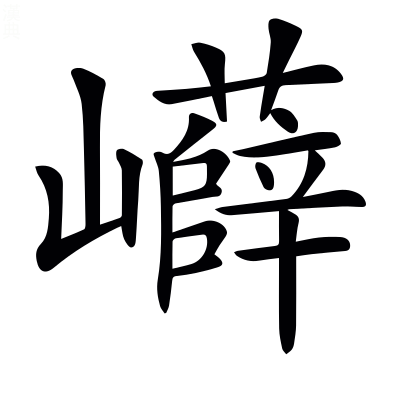

# <!-- page68 -->文選卷第四

> 梁昭明太子撰
> 
> 文林郎守太子右內率府錄事參軍事崇賢館直學士臣李善注上

京都中

> 張平子南都賦一首　左太沖三都賦序一首　蜀都賦一首

## 南都賦

摯虞曰：南陽郡治宛，在京之南，故曰南都。

> 張平子

於`烏`顯樂都，旣麗且康。毛萇詩傳曰：於，歎辭[^4.1.1]，於孤切。詩曰：適彼樂國。

陪京之南，居漢之陽。京，謂洛陽也。尚書曰：嶓冢導漾，東流爲漢。*鄭玄曰：漾水至武都爲漢。*

割周楚之豐壤，跨荊豫而爲疆。~~西京賦曰：周即豫而弱。呂氏春秋曰：河漢之閒爲豫州也。~~周居豫州，已見西京賦[^4.1.2]。漢書地理志注曰：南陽屬荊州。又曰：荊州，楚故都。

體爽塏以閑敞，紛郁郁其難詳。爽塏，已見西京賦。楊雄豫州箴曰「郁郁荊河[^4.1.3]，伊洛是經」也。

爾其地勢，則武闕關其西，桐栢揭`竭`其東。~~武闕山爲關在西也。~~[^4.1.4]漢書音義·文穎曰：武闕山爲關而在西，弘農界也。漢書曰：南陽之平陽縣有桐栢山。

流滄浪而爲隍，廓方城而爲墉。尚書曰：漢水又東爲滄浪之水。左氏傳：屈完曰「楚國方城以爲城，漢水以爲池」。~~說文曰：城池無水曰隍。毛萇詩傳曰：墉，城也。~~[^4.1.5]隍，已見上文。墉，已見西京賦。

湯谷涌其後，淯`育`水盪其胷。盛弘之荊州記曰：南陽郡城北有紫山，紫山東有一水，無所會通，冬夏常温，因名湯谷。山海經曰：攻離之山，淯水出焉。南流注于漢。*郭璞曰：今淯水在淯陽縣南。*盪，他浪切[^4.1.6]。

推淮引湍，三方是通。淮水自此而去，故曰推。湍水自彼而來，故曰引。說文曰：推，排也。山海經曰：翼望之山，湍水出焉。*郭璞曰：湍，鹿摶切。今湍水逕南陽穰縣而入淯也。*三方，東西及南也。

其寶利珎怪，則金彩玉璞，隨珠夜光。彩，金之彩也。璞，玉之未理者。~~淮南子曰：隨侯之珠，和氏之璧，得<!-- page69 -->之而富，失之而貧。高誘曰：隨侯，漢中國姬姓諸侯也。隨侯見大蛇傷斷，以藥傅而塗之，後蛇於夜中銜大珠以報之，因曰隨侯之珠，蓋明月珠也。鄒陽曰夜光之璧，劉琨云夜光之珠。尹文子曰：田父得寶玉徑尺，置於廡上，其夜明照一室。然則夜光爲通稱，不繫之於珠璧也。~~隨珠夜光，已見西都賦[^4.1.7]。

銅錫鉛鍇`苦駭`，赭堊~~惡~~[^4.1.8]流黃。鄭玄周禮注曰：錫，鑞也。說文曰：鉛，青金。又曰：九江謂鐵爲鍇。山海經曰：陸䣀之山，其下多堊；若之山，其上多赭。*郭璞曰：赭，赤土也。堊似土，白色也。*䣀音跪。堊音惡。本草經曰：石流黃，生東海牧陽山谷中。本草言其所出，此亦兼而有之。博物志曰：雄黃似石流黃。

緑碧紫英，青雘`烏郭`丹粟。廣志曰：碧有縹碧，有緑碧。本草經曰：紫石英生太山之谷。山海經曰：景山之西曰驕山，其下多青雘。*郭璞曰：雘，黝屬，音瓠。*山海經曰：荊山之首曰景山，睢水出焉。其中多丹粟。*郭璞曰：細沙如粟。*

太一餘糧，中黃瑴`角`玉。本草經曰：太一禹餘糧，一名石，生山谷。博物志曰：石中黃子黃石脂。又曰：欲得好瑴玉，用合漿，於襄鄉縣舊穴中鑿取，大者如魁斗，小者如雞子。

松子神陂，赤靈解角。習鑿齒襄陽耆舊記曰：神陂在蔡陽縣界，有松子亭，下有神陂也。赤靈，赤龍也。解角，脫角也。事未詳。

耕父揚光於清泠之淵，游女弄珠於漢皐之曲。~~山海經曰：有神耕父處豐山，常游清泠之淵，出入有光。~~耕父，已見東京賦[^4.1.9]。韓詩外傳曰：鄭交甫將南適楚，遵波漢皐臺下，乃遇二女，佩兩珠，大如荊雞之卵。

其山則崆`口江``五江`嶱`苦葛`嵑`五葛`，嵣~~大朗~~㟐~~莽~~嶚~~遼~~剌`力割`。崆嶱嵑，山石高峻之貌。字書曰：崆，山貌也。嵣㟐，山石廣大之貌也[^4.1.10]；嵣音蕩，㟐音莽。嶚，山高而相戾也。廣雅曰：嶚，高也[^4.1.11]；力彫切。說文曰：剌，戾也。

岝~~仕白~~㟯`額`㠑~~祚逥~~嵬~~五迴~~，`香金`巇`許宜`屹`魚乞``五結`。埤蒼曰：岝㟯，山不齊也[^4.1.12]。岝，仕革切。說文曰：㠑嵬，山石崔嵬，高而不平也[^4.1.13]。㠑，昨迴切。嵬，牛迴切。廞巇，山相對而危險之貌也。屹，斷絕之貌也。

幽谷嶜~~岑~~岑`吟`，夏含霜雪。毛詩曰：出自幽谷。楊雄蜀都賦曰：玉石嶜岑。又曰：夏含霜雪。嶜岑，高峻之貌也[^4.1.14]。嶜，士林切。

或㟒~~丘筠~~嶙~~鄰~~而纚~~力氏~~連，或豁爾而中絕。㟒嶙，相連之貌[^4.1.15]。㟒，丘貧切。嶙音鄰。纚，力是切。

鞠~~九六~~巍巍其隱天[^4.1.16]，俯而觀乎雲霓`五結`。鞠，高貌也；九六切。~~班孟堅西都賦曰：其陽則崇山隱天。楊雄蜀都賦曰：蒼山隱天。~~[^4.1.17]隱天，已見西都賦。

若夫天封大狐，列仙之陬子侯。天封，未詳，或曰山名也。南郡圖經曰：大胡山，故縣縣南十里。張衡云：天封，大胡也。~~薛綜注曰：區陬，隅之間也。~~[^4.1.18]陬，已見西京賦。

上平衍而曠蕩，下蒙籠而崎~~溪~~嶇~~區~~。孫子兵法曰：草樹蒙籠。廣雅曰：崎嶇，傾側也[^4.1.19]。崎，丘宜切。嶇，丘嵎切。

坂坻`遲`嶻~~在結~~`五結`而成甗魚勉，谿壑錯繆`謬`而盤紆。郭璞上林賦注曰：坻，岸也。又曰：嶻，高峻也[^4.1.20]。嶻，在結切。毛萇詩傳曰：甗[^4.1.21]，小山，別大山也[^4.1.22]；魚蹇切。錯繆，雜亂貌也。

芝房菌~~奇殞~~蠢生其隈[^4.1.23]，玉膏滵~~密~~溢流其隅[^4.1.24]。芝房，芝生成房也。菌蠢，是芝貌也；其殞切。山海經曰：密山，丹水出焉，其中多白玉，是有玉膏。滵溢，流貌；滵音密。

崑崙無以奓，閬`浪`風不能踰。~~東方朔十州記曰：崑崙，其北角曰閬風之顛。~~[^4.1.25]崑崙，閬風，已見西京赋。

其木則檉勑貞松楔更黠㮨即，槾萬栢杻橿疆。檉似栢而香。爾雅曰：楔曰荊桃。郭璞曰：櫻桃也[^4.1.26]。郭璞山海經注曰：㮨似松栢有刺[^4.1.27]。槾，荊也[^4.1.28]。又曰：杻似桑而細葉。又曰：橿，中車材[^4.1.29]。楓柙櫨櫪，帝女之桑。爾雅曰：楓，聶。楓，音風。聶，之涉切。劉逵吳都賦注曰：柙，香木。智甲切[^4.1.30]。郭璞上林賦注：櫨，橐。櫨，力胡切。櫪與櫟同，來的切。山海經曰：宣山有桑焉，其枝四衢，名帝女之桑。郭璞曰：婦人主蠶，因以名桑也。

楈胥枒邪栟并櫚閭，柍於兩柘檍憶檀。郭璞上林賦注曰：楈枒似栟櫚，皮可作索[^4.1.31]。張揖注上林賦曰：栟櫚，椶也，皮可以爲索[^4.1.32]。柍，未詳[^4.1.33]。爾雅曰：杻，檍。郭璞曰：似桑[^4.1.34]。蒼頡篇曰：檀，木名。

結根竦本，垂條蟬蟬媛袁。結，猶同也。廣雅曰：竦，上也。嬋媛，枝相連引也。

布緑葉之萋萋，敷華蘂之蓑蓑素回反。毛萇詩傳曰：萋萋，茂盛貌。王逸楚辭注曰：蘂，實貌也。劉淵林蜀都賦注曰：蘂，一曰花頭點也[^4.1.35]。蓑蓑，下垂貌。

玄雲合而重陰，谷風起而增哀。淮南子曰：玄雲素朝。毛詩曰：習習谷風。攢在官立叢駢，青冥䀒瞑音眠。言林木攢羅，衆色幽昧也。楚辭曰：遠望兮芊眠。王逸曰：芊眠，遙視闇未明也。芊眠與盰瞑音義同。

杳藹蓊鬱於谷底，森䔿䔿祖本而刺天。皆茂盛貌也。司馬相如弔二世曰：衆樹之蓊鬱兮。

虎豹黃熊游其下，豰呼穀玃居縛猱奴刀㹶廷戲其巔。六韜曰：散宜生得黃熊而獻之紂。說文曰：豰，類犬，腰以上黃，以下黑[^4.1.36]。爾雅曰：玃父喜顧。郭璞曰：似獼猴而大，蒼黑色。鄭玄禮記注曰：猱，獼猴也。張載吳都賦注曰[^4.1.37]：㹶，猨屬。

鸞𪈡岳鵷鶵翔其上，騰猨飛蠝壘棲其間[^4.1.38]。國語曰：周之興也，𪈡鷟鳴於岐山。賈逵曰：𪈡鷟，鳳之別名也。山海經曰：南禺之山有鵷鶵。郭璞曰：鳳屬也。上林賦曰：蜼玃飛蠝。張揖曰：蠝，飛鼠也。蠝與𤢹同，並音壘。其竹則籦鍾

籠龍䈽謹篾銘決，篠蘇了簳幹箛孤箠追。戴凱之竹譜曰：籦籠，竹名也。伶倫吹以爲律。竹堇皮白如霜[^4.1.39]，大者宜爲篙。篠，出魯郡山，堪爲笙。孔安國曰：篾，桃枝也。簳，小竹也。宋玉笛賦曰：奇簳[^4.1.40]。箛、箠，二竹名[^4.1.41]，其形未詳。

縁延坻遲阪，澶徒幹漫陸離。陸離，猶參差也[^4.1.42]。

阿烏可郍奴可蓊烏孔茸如涌，風靡雲披。阿郍，柔弱之貌。說文曰：蓊，竹貌也[^4.1.43]。埤蒼曰：茸，竹頭有文也。風靡雲披，言隨風而靡，如雲之披也。

爾其川瀆，則滍雉[^4.1.44]澧𤄶藥濜自吝[^4.1.45]，發源巖穴。水經曰：滍水出南陽縣西堯山。山海經曰：澧水出雅山。郭璞曰：今出南陽[^4.1.46]。字書曰：𤄶水出泚陽。泚，音此。酈善長水經注曰：濜水出襄鄉縣東北陽中山。潛㕎於臘

洞出，沒滑骨[^4.1.47]瀎蔑[^4.1.47]潏決。倴，山傍穴也，言水洞出此穴。沒滑瀎潏，疾流之貌也[^4.1.48]。

布濩戶漫汗，漭莽沆胡朗洋溢。言廣大也[^4.1.49]。漭沆，已見西京賦。

揔括趨欱呼答，箭馳風疾。言江海欱受諸水，故揔括而趨之。說文曰：欱，歠也[^4.1.50]。慎子曰：西河下龍門，其流敵於竹箭。孫子曰：其疾如風。

流湍投濈戢，砏普貧汃八輣普耕軋烏八。許慎淮南子注曰：湍，水行疾也[^4.1.51]。埤蒼曰：濈，水行出也[^4.1.52]。砏汃輣軋，波相激之聲也。埤蒼曰：砏，大聲也[^4.1.53]。

長輸遠逝，漻流淚力計淢域汩爲筆反。廣雅曰：輸，寫也。韓詩外傳曰：漻[^4.1.54]，清貌也。淮南子曰：水淚破舟[^4.1.55]。說文曰：淢，疾流也[^4.1.56]。王逸楚辭注曰：汩，去貌。

其水蟲則有蠳龜鳴蛇，潛龍伏螭。抱朴子曰：蠳龜噉蛇。山海經曰：鮮水多鳴蛇，其狀如蛇，四翼，其音如磬，見則其邑大旱。說文曰：螭若龍而黃也。

鱏尋鱣張連鰅隅鱅，黿鼉鮫𩽌以規反。鱏、鱣，已見上文。郭璞上林賦注曰：鰅魚有文采[^4.1.57]。鱅似鰱而黑[^4.1.58]。山海經注曰：鮫，䱜屬也，皮有班文而堅。鮫𩽌已見東京賦。巨蜯函含

珠，駮剝瑕委蛇。楊雄蜀都賦曰：蜯函珠而擘裂。蜯與蚌同[^4.1.59]，函與含同。郭璞爾雅注曰：蝦大者長一二丈。委蛇，長貌。瑕與蝦古字通[^4.1.60]。

於其陂澤[^4.1.61]，則有鉗盧玉池，赭陽東陂。杜預表曰：所領部曲，皆居南鄉界，所近鉗盧大陂，下有良田。舊說曰：玉池在宛也。

貯知旅[^4.1.62]水渟亭洿汙，亘望無涯宜。說文曰：貯，積也。廣雅曰：渟，止也。說文曰：洿，濁水不流也。方言曰：亘，竟也。上林賦曰：察之無涯。

其草則藨平表苧直呂薠煩莞[^4.1.63]桓，蔣將蒲孤蒹葭。說文曰：藨，葪之屬[^4.1.64]。又曰：苧可以爲索。郭璞山海經注曰：薠，青薠，似莎而大[^4.1.65]。鄭玄毛詩箋曰：莞，小蒲也[^4.1.66]。說文曰：蔣，菰蔣也[^4.1.67]。爾雅曰：蒹，薕也。葭，蘆也。

藻茆卯菱芡渠儼，芙蓉含華。從風發榮，斐披芬葩。藻，已見西京賦。爾雅曰：茆，鳧葵[^4.1.68]。菱芡、芙蓉，並見東京賦。

其鳥則有鴛鴦鵠鷖烏兮，鴻鴇保鴐加鵝。𪃈苦札[^4.1.69]

鶂雅札鸊步覓[^4.1.70]鶙吐雞[^4.1.70]，鷫肅鷞所良鵾昆鸕盧。毛詩曰：鴛鴦于飛。班孟堅西都賦曰：黃鵠鵁鸛，鳧鷖鴻鴈。張平子西京賦曰：鷫鷞鵠鴇，鴐鵝鴻鶤[^4.1.71]。說文曰：𪃈鶂，鳧屬。方言曰：野鳧，甚小而好沒水中者，南楚之外，謂之鸊鶙。鵾與鶤同。蒼頡篇曰：鸕鷀似鶂而黑。鷀，音磁[^4.1.72]。嚶嚶烏耕

和鳴，澹徒濫淡徒敢隨波。言自恣也。毛詩曰：鳥鳴嚶嚶。爾雅曰：關關嚶嚶，聲之和也。上林賦曰：隨風澹淡。

其水則開竇灑所蟹[^4.1.73]流，浸彼稻田。鄭玄周禮注曰：竇，孔穴也，音豆。漢書音義曰：灑，分也。毛詩曰：浸彼稻田。

溝澮脉連，隄塍繩相輑丘筠反。爾雅曰：水注溝曰澮。韋昭國語注曰：脉，理也。隄塍已見西都賦。輑，相連之貌。

朝雲不興，而潢潦老[^4.1.74]獨臻。左氏傳曰：潢汙行潦之水。說文曰：潢，積水池也。潦，雨水。

決渫薛則暵罕，爲漑古愛爲陸。冬稌肚夏穱側角，隨時代熟。說文曰：渫，去除也[^4.1.75]。又曰：暵，乾也[^4.1.76]。又曰：漑，灌也。稌，已見東京賦。楚辭曰：稻粢穱麥挐黃粱。

其原野則有桑漆麻苧直旅[^4.1.77]，菽麥稷黍。百穀蕃廡武，翼翼與與。說文曰：苧，麻屬。鄭玄毛詩箋曰：菽，大豆也。百穀蕃廡，並已見東京賦。毛詩曰：我黍與與，我稷翼翼。

若其園圃，則有蓼了蕺側立蘘而羊荷，藷之餘[^4.1.78]蔗薑䪤煩[^4.1.78]，菥析[^4.1.78]蓂覓[^4.1.78]芋瓜。說文曰：蓼，辛菜也[^4.1.79]。風土記曰：蕊，香菜[^4.1.80]，根似茆根，蜀人所謂蒩香。蕊與蕺同。說文曰：蘘荷，葍蒩也。葍，普卜切。蒩，子余切。漢書音義曰：藷蔗，甘柘也。字書曰：䪤，小蒜也。爾雅曰：菥蓂大薺。

乃有櫻梅山柿，侯桃梨栗。漢書音義曰：櫻桃，含桃也。郭璞爾雅注曰：梅似杏，實酸。說文曰：柿，赤實果也。曹毗魏都賦注曰：侯桃，山桃。子如麻子。

梬郢棗若留，穰橙鄧橘。說文曰：梬棗，似㮕，如兗切。廣雅曰：石留，若榴也。漢書，南陽郡有穰縣、鄧縣。說文曰：橙，橘屬也[^4.1.81]。

其香草則有薜萍計荔力計蕙若，薇蕪蓀萇。王逸楚辭注曰：薜荔，香草也。郭璞山海經注曰：蕙，香草也，若，杜若也。本草經曰：靡蕪一名薇蕪。陶隱居注曰[^4.1.82]：蕙葉似蛇牀而香。王逸楚辭注曰：蓀，香草也。萇，萇楚也。爾雅曰：蓀楚，銚戈也[^4.1.83]。銚，音遙。

晻於感曖愛蓊烏㧾蔚，含芬吐芳。言草木闇暝而茂盛也。說文曰：晻，不明貌。王逸楚辭注曰：曖，闇昧貌。

若其廚膳，則有華薌重秬渠舉，滍秩履皐香秔公行反。華薌，鄉名也。毛萇詩傳曰：秬，黑黍，一稃二米，故曰重也。稃，音敷[^4.1.84]。滍皐，滍水之澤也。廣雅曰：秔，秈也。秈，音仙。

歸鴈鳴鵽陟滑[^4.1.85]，黃稻鱻咠連魚，以爲芍張略藥音略。鴈能候時去來，故曰歸。史記曰：楚人有以弱弓微繳，加歸鴈之上。爾雅曰：鵽鳩，寇雉。郭璞曰：鵽，大如鴿，羣飛，出北方沙漠。聲類曰：鱻，小魚也[^4.1.86]。子虛賦曰：芍藥之和具而後進也。文穎曰：五味之和。

酸甜滋味，百種千名。說文曰：甜，美也[^4.1.87]。春卵夏筍，秋韭冬菁音精[^4.1.88]。爾雅曰：筍，竹萌也。廣雅曰：韭，其華謂之菁。

蘇蔱殺[^4.1.89]紫薑，拂徹羶尸然[^4.1.89]

腥。爾雅曰：蘇，桂荏。字書曰：蔱，茱萸也。司馬彪上林賦注曰：紫薑，紫色之薑也。杜預左氏傳注曰：徹，猶去也。

酒則九醖於問[^4.1.90]

甘醴，十旬兼清。醪敷徑寸，浮蟻若蓱。魏武集，上九醖酒，奏曰：三日一釀，滿九斛米止。廣雅曰：醖，投也。韓詩曰：醴，甜而不泲也。十旬，蓋清酒百日而成也。鄭玄周禮注曰：清酒，今之中山冬釀接夏而成也。漢書音義，晉灼曰：百日之末酒也。說文曰：醪，汁滓酒也。徑寸，蓋酒膏之徑寸也。釋名曰：酒有汎齊，浮蟻在上，汎汎然如蓱之多者。

其甘不爽，醉而不酲。老子曰：五味令人口爽。廣雅曰：爽，傷也。毛萇詩傳曰：病酒曰酲。

及其糺宗綏族，禴祠蒸嘗。左氏傳曰：召公思周德之不類，故糺合宗族于成周。爾雅曰：綏，安也。毛詩曰：禴祠蒸嘗，于公先王[^4.1.91]。

以速遠朋，嘉賓是將。揖讓而升，宴于蘭堂。儀禮曰：速賓。鄭玄曰：速，召也。論語曰：有朋自遠方來。毛詩曰：我有嘉賓，鼓瑟吹笙；吹笙鼓簧[^4.1.92]，承筐是將。儀禮曰：若四方賓燕，則揖讓而升。賈逵國語注曰：不脫履升堂[^4.1.93]。漢書曰：袚蘭堂。

珍羞琅玕，充溢圓方。爾雅曰：珍，美也。方言曰：羞，熟。以羞之美，故喻於玉也。圓方，器也。尚書曰：厥貢琅玕。又曰：惟辟玉食。

琢琱狎獵，金銀琳琅。爾雅曰：玉謂之琱[^4.1.94]。琱與彫古字通也。爾雅曰：理玉曰琢，都角切。狎獵，飾之貌，胡甲切。獵，士甲切。尚書曰：厥貢球琳琅玕。

侍者蠱媚，巾㡚鮮明。蠱，已見西京賦。毛萇詩傳曰：綦巾，女服也。字書曰：㡚，上衣。

被服雜錯，履躡華英。雜錯，非一也。華英，光耀也。被，皮義切。

儇才齊敏，受爵傳𨢩。方言曰：儇，急疾也，呼緣切。齊，在雞切。毛萇詩傳曰：敏，疾也。

獻酬旣交，率禮無違。毛詩曰：獻酬交錯。左氏傳，晉侯曰：魯侯自郊勞至于贈賄，禮無違者。東觀漢記曰：朱浮上䟽曰：陛下率禮無違。

彈琴擫籥，流風徘徊。言樂聲之結風也。說文曰：擪，一指按也。擪與擫同，烏牒切。鄭玄周禮注曰：籥，舞者所吹也，如篴三孔。籥，音藥。篴，音敵。

清角發徵，聽者增哀。言旣奏清角而又發徵聲，故增哀也。韓子，師曠曰：清徵之聲，不如清角。許慎淮南子注曰：清角絃急，其聲清也。

客賦醉言歸，主稱露未晞。毛詩曰：鼓咽咽，醉言歸。又曰：湛湛露斯，匪陽不晞。厭厭夜飲，不醉無歸。

接歡宴於日夜，終愷樂之令儀。毛詩曰：愷樂飲酒。又曰：莫不令儀。

於是暮春之禊，元巳之辰，方軌齊軫，祓于陽瀕。毛詩曰：惟暮之春。史記曰：武帝禊霸上。續漢書曰：三月上巳，宮人皆禊於東流水上，祓除宿垢疾也。周禮曰：女巫掌歲時祓除。楊雄蜀都賦曰：相與如乎陽瀕。

朱帷連網[^4.1.95]，曜野映雲。網，維網也。

男女姣服，駱驛繽紛。駱驛繽紛，往來衆多貌。

致飾程蠱，偠紹便娟。廣雅曰：程，示也。便娟，則蟬蜎也。蠱及偠紹便娟，已見西京賦。

微眺流睇，蛾眉連卷。鄭玄禮記注曰：睇，傾視也，徒計切。毛詩曰：螓首蛾眉。郭璞爾雅注曰：蠶蛾也。連卷，曲貌。卷，音權。

於是齊僮唱兮列趙女。齊、趙，二國名也。楊惲書曰：婦，趙女也。

坐南歌兮起鄭儛。白鶴飛兮繭曳緒。呂氏春秋曰：禹行水見塗山之女，禹未之遇，而省南土，塗山之女乃令其妾往候禹于塗山之陽，女乃作歌曰：候人猗兮！實始爲南音。周公、召公取風焉。高誘曰：取南音以爲樂歌也。楚辭曰：二八齊容起鄭舞。王逸曰：鄭國儛也。白鶴飛兮繭曳緒，皆舞人之容。

脩袖繚繞而滿庭，羅襪躡蹀而容與。繚繞，袖長貌。躡蹀，小步貌。說文曰：躡，蹈也，徒頰切。許慎淮南子注曰：蹀，蹈也，蘇協切。

翩緜緜其若絕，眩將墜而復舉。毛萇詩傳曰：緜緜，長而不絕貌。國語曰：觀美而眩。賈逵曰：眩，惑也。

翹遙遷延，䠥𨇨蹁躚。翹遙，輕舉貌。遷延，却退貌。上林賦曰：便跚蹩屑。䠥，蒲結切。𨇨，素結切。蹁，步先切。躚，素田切。結九秋之增傷，怨西荊之折盤。古樂府有歷九秋妾薄相行歌，辭曰：齊謳楚舞紛紛，歌聲上徹青雲。西荊，即楚舞也。折盤，舞貌。張衡有七盤舞賦，咸以折盤爲七盤也[^4.1.96]。

彈箏吹笙，更爲新聲。毛詩曰：吹笙鼓簧。史記曰：衛靈公見晉平公曰，今者未聞新聲，請奏之。更，古衡切。

寡婦悲吟，鵾雞哀鳴。寡婦曲，未詳。古相和歌有鵾雞之曲。

坐者悽欷，蕩魂傷精。楚辭曰：憯悽增欷，傷精神也。神女賦曰：精神相依憑。

於是羣士放逐，馳乎沙場。逐，馳逐也。

騄驥齊鑣，黃間機張。騄、驥，駿馬之名也。穆天子傳，八駿有赤驥、騄耳，音録。說文曰：鑣，馬銜也，彼驕切。漢書曰：李廣以大黃射其裨將。鄭氏曰：黃間，弩淵中黃牙。尚書曰：若虞機張。孔安國曰：機，弩牙。

足逸驚飇，鏃析毫芒。言馬疾而矢利。析，音錫。

俯貫魴鱮；仰落雙鶬音倉

。魴鱮，已見西京賦。列子曰：蒲且子連雙鶬於青雲之上。鶬，已見西都賦。

魚不及竄，鳥不暇翔。言急遽也。高唐賦曰：飛鳥未及起，走獸未及發。

爾乃撫輕舟兮浮清池，亂北渚兮揭南涯。浮，已見西都賦。爾雅曰：水正絕流曰亂。說文曰：揭，高舉也[^4.1.97]。

汰太瀺仕減灂仕角兮船容裔，陽侯澆兮掩鳧鷖。楚辭曰：齊吳榜以激汰。王逸曰：汰，水波也[^4.1.98]。上林賦曰：瀺灂隕隊[^4.1.99]。戰國策曰：塞漏舟而輕陽侯之波，則舟覆矣。淮南子曰：武王伐紂，渡于孟津，陽侯之波，逆流而擊之。高誘曰：陽侯，陽國侯也，溺死於水，其神能爲大波。王逸楚辭注曰：回波爲澆[^4.1.100]。毛詩曰：鳧鷖在潨。

追水豹兮鞭蝄蜽，憚丁達夔龍兮怖蛟螭。水豹，已見西京賦。說文曰：蝄蜽，山川之精物也。蛟螭，若龍而黃[^4.1.101]。國語曰：木石之怪夔，水之怪龍。韋昭曰：木石爲山也。夔一足也。

於是日將逮昏[^4.1.102]，樂者未荒。毛詩曰：好樂無荒。

收驩命駕，分背迴塘。孔叢子曰：巾車命駕。廣雅曰：塘，堤也。

車雷震而風厲，馬鹿超而龍驤。雷震，言多也。風厲，言疾也。毛詩曰：戎車焞焞，如霆如雷。毛萇詩傳曰：雷出地奮，震驚百里。古詩曰：涼風率已厲。杜預左氏傳注曰：厲，猛也。韓子曰：馬如鹿者千金。鄒陽上書曰：蛟龍驤首。舞賦曰：龍驤橫舉，揚鑣飛沫。周禮曰：凡馬八尺已上爲龍。

夕暮言歸，其樂難忘。此乃游觀之好，耳目之娛。未睹其美者，焉足稱舉。言此游觀耳目之樂，非極美也。

夫南陽者，真所謂漢之舊都者也[^4.1.103]。遠世則劉后甘厥龍醢海

，視魯縣而來遷[^4.1.104]。左氏傳曰：劉累學擾龍于豢龍氏，以事孔甲。龍一雌死，潛醢以食夏后，夏后饗之，旣又使求之，懼而遷於魯縣。漢書曰：南陽郡魯陽縣即御龍氏所遷。

奉先帝而追孝，立唐祀乎堯山。先帝，謂堯也。皇甫謐曰：堯始封於唐，今中山唐縣是也。後徙晉陽。及爲天子，都平陽，於詩爲唐國。是堯以唐侯升爲天子也[^4.1.105]。水經曰：南陽縣西堯山。酈元曰：魯縣立堯祠於西山，謂之堯山也。

固靈根於夏葉，終三代而始蕃音繁。言劉氏植根於夏葉，終三代而始蕃昌也。毛萇詩傳曰：葉，世也。三代，已見班固兩都序。

非純德之宏圖，孰能揆求癸[^4.1.106]而處旃！孔安國尚書傳曰：揆，度也。鄭玄毛詩箋曰：旃，之也。

近則考侯思故，匪居匪寧。穢長沙之無樂，歷江湘而北征。東觀漢記曰：舂陵節侯，長沙定王中子買。節侯生戴侯，戴侯生考侯。考侯仁以舂陵地勢下濕，難以久處，上書願徙南陽守墳墓，元帝許之，於是北徙。考或爲孝，非也。

曜朱光於白水，會九世而飛榮。朱光，火德也。已見東京賦。東觀漢記曰：考侯仁徙封南陽白水鄉。又曰：世祖光武皇帝，高祖九世孫，承文、景之統，出自長沙定王。榮，光榮也。封禪書曰：發號榮。

察茲邦之神偉[^4.1.107]，啓天心而寤靈。言考侯旣察此都之神偉，且啓上天之心，又寤先靈之意，使之而王也。說文曰：偉，奇也。

於其宮室，則有園廬舊宅，隆崇崔嵬。說文曰：崔[^4.1.108]，高大也。

御房穆以華麗，連閣煥其相徽。御房，帝舊房也。相徽，言俱美。孔安國尚書傳曰：徽，美也。

聖皇之所逍遙，靈祇之所保綏。聖皇，謂光武也。逍遙，謂潛龍之日。韓詩外傳曰：逍遙也[^4.1.109]。靈祇，天地之神也。毛詩曰：神保是饗。又曰：綏以多福也。

章陵鬱以青葱，清廟肅以微微。東觀漢記曰：建武中，更名舂陵爲章陵。光武過章陵，祠園廟。爾雅曰：青謂之葱，林木茂盛之貌。微微，幽靜貌。

皇祖歆而降福，彌萬祀而無衰。毛詩曰：獻之皇祖。說文曰：歆，神食氣也。毛詩曰：降福孔夷。爾雅曰：彌，終也。又曰：祀，年也。

帝王臧其擅美，詠南音以顧懷。帝王，光武也。顧懷，過章陵祠園廟之時也。爾雅曰：臧，善也。說文曰：擅，專也。左氏傳，楚鍾儀囚於晉，與之琴，操南音。劇秦美新曰：后土顧懷。

且其君子，弘懿明叡，允恭温良。容止可則，出言有章。進退屈伸，與時抑揚。班固說東平王蒼曰：體弘懿之姿。叡，哲也。已見東京賦。尚書曰：允恭克讓。論語，子貢曰：夫子温、良、恭、儉、讓。孝經曰：容止可觀，進退可度。毛詩曰：其容不改，出言有章。周易曰：往者屈也，來者伸也，屈伸相感，而利害生焉。班固漢書，叔孫通述曰：叔孫奉常，與時抑揚。

方今天地之睢虛惟剌力達，帝亂其政，豺虎肆虐，真人革命之秋也。漢書音義曰：方，向也。謂高祖之時。蒼頡篇曰：今，時辭也，謂光武。天地，猶天下也。睢剌，喻禍亂也，謂秦二葉也。淮南子曰：萬物盱睢。楚辭曰：獨乖剌而無當。王逸曰：剌，邪也[^4.1.110]。帝謂高祖也。馬融論語注曰：亂，理也。豺狼貪殘，謂王莽也。真人，光武也。文子曰：得天地之道，故謂之真人。革命，已見東都賦。

爾其則有謀臣武將，皆能攫九縛戾執猛，破堅摧剛。排揵件

陷扃古熒[^4.1.111]，蹵蹈咸陽。蒼頡篇曰：攫，搏也。說文曰：揵，距門也。又曰：扃，外閉之關也。

高祖階其塗，光武攬其英。漢書曰：沛公圍宛城，南陽守齮降，引兵西，無不下者。爾雅曰：階，因也。齮音蟻。東觀漢記曰：鄧禹、吳漢並南陽人。三略曰：主將之體，務在攬英雄之心。

是以關門反距，漢德久長。言居西而距東，居東而距西，故言反也。杜篤論都賦曰：是時山東翕然狐疑，意聖朝之西都，懼關門之反距。

及其去危乘安，視人用遷。去危乘安，謂太平也。視人用遷，謂觀人所安而設教。

周召之儔，據鼎足焉，以庀匹婢王職。史記曰：周公旦者，周武王弟也，輔武王。又召公奭，姓姬氏。成王時，召公爲三公。漢書曰：夫三公，鼎足之輔也。賈逵國語注曰：庀，由理也。

縉紳之倫，經綸訓典，賦納以言。漢書音義，臣瓚曰：縉，赤白色。紳，大帶也。周奇曰[^4.1.112]：搢，插笏於大帶。周易曰：君子以經綸。國語曰：修其訓典。尚書曰：敷納以言也。

是以朝無闕政，風烈昭宣也。春秋考異郵曰：後雖殊世，風烈猶合於持方。宋均曰：持方，受命者名。

於是乎鯢齒眉壽，鮐背之叟，皤皤然被黃髮者，毛詩曰：以介眉壽。毛萇曰：眉壽，毫眉也。爾雅曰：黃髮、鯢齒、鮐背、耇老，壽也。皤皤，已見東京賦。

喟然相與歌曰：「望翠華兮葳蕤，建太常兮裶裶音霏。上林賦曰：建翠華之旗。葳蕤，翠華貌。太常已見東京賦。上林賦曰：衯衯裶裶[^4.1.113]。

駟飛龍兮騤騤逵，振和鸞兮京師[^4.1.114]。飛龍，言疾也。周易曰：飛龍在天。毛詩曰：四牡騤騤。鄭玄禮記注曰：鑾輅，有虞氏之車也。有鑾和之節[^4.1.115]。

揔萬乘兮徘徊，按平路兮來歸。」萬乘，見東京賦。毛萇詩傳曰：迴，遲也。然徘徊即遲遲也。毛詩曰：行道遲遲。南陽舊居，故曰來歸。毛詩曰：來歸自鎬。

豈不思天子南巡之辭者哉！遂作頌曰：毛詩曰：豈不爾思。尚書曰：五月南巡狩。

皇祖止焉，光武起焉。皇祖，高祖也。周易曰：庖犧氏沒，神農氏作[^4.1.116]。

據彼河洛，統四海焉。河、洛，謂東都也。西都賦曰：嘗有意乎都河、洛。

本枝百世，位天子焉。毛詩曰：文王子孫[^4.1.117]，本枝百世。

永世克孝，懷桑梓焉。毛詩曰：永世克孝。又曰：維桑與梓，必恭敬止。

真人南巡，覩舊里焉。東觀漢記曰：光武征秦豐，幸舊宅。酈元水經注曰：光武征秦豐，張衡以爲真人南巡，觀舊里焉。

---

文選卷第四

賜進士出身通奉大夫江南蘇松常鎮太等處承宣布政使司布政使胡克家重校刊

[^4.1.1]: 注「於歎辭」　袁本、茶陵本「辭」下有「於孤切」三字，是也。其正文下「烏」字乃五臣音也。凡合併六家之本，於正文下載五臣音，於注中載善音，而善音之同於五臣者每被節去。袁、茶陵二本，又各多寡不齊，蓋合併不一，故所節去不一耳。至尤本於正文下五臣音，往往未嘗區別刊正，而注中善音，則節去彌甚，其失善舊，亦彌甚矣。今取二本善音之可考者，悉皆訂正。其二本已節去在前，則末由考之。間有可借正文下五臣音推知崖略者，然旣非明文，難以稱說，當俟再詳。全書善音之例，均準此。
[^4.1.2]: 注「西京賦曰」下至「爲豫州也」　袁本此二十二字作「周居豫州已見西京賦」，是也。茶陵本複出，非。
[^4.1.3]: 注「郁郁京河」　袁本、茶陵本「京」作「荆」，是也。
[^4.1.4]: 注「武闕山爲關在西也」　茶陵本無此八字。袁本有，何、陳校皆去。觀下注，似不當有。
[^4.1.5]: 注「說文曰」下至「墉城也」　袁本此十七字作「隍已見上文墉已見西京賦」，是也。茶陵本複出，非。
[^4.1.6]: 注「盪他浪切」　袁本、茶陵本無此四字。茶陵有「淯音育」三字，袁亦無。案：茶陵是也。
[^4.1.7]: 注「淮南子曰隨侯之珠」下至「不繫之於珠璧也」　袁本、茶陵本無此一百十七字。袁有「隨珠夜光已見西都賦」九字，茶陵有「隨珠夜光見西都注」八字，案：袁本是也。茶陵例改已見爲複出，此條其遺漏者，尙屬善舊。尤乃複出，甚非。
[^4.1.8]: 注「惡」　袁本、茶陵本作「堊音惡」三字，在注中「䣀音跪」下，是也。
[^4.1.9]: 注「山海經曰」下至「出入有光」　袁本此二十一字作「耕父已見東京賦」，是也。茶陵本複出，非。
[^4.1.10]: 注「嵣㟐山石廣大之貌也」　袁本、茶陵本此下有「嵣音蕩㟐音莽」六字，是也。
[^4.1.11]: 注「嶚高也」　袁本、茶陵本此下有「力彫切」三字，是也。
[^4.1.12]: 注「岝㟯山不齊也」　袁本、茶陵本此下有「岝仕革切」四字，是也。
[^4.1.13]: 注「高而不平也」　袁本、茶陵本此下有「㠑昨迴切嵬牛迴切」八字，是也。
[^4.1.14]: 注「高峻之貌也」　袁本、茶陵本此下有「嶜士林切」四字，是也。
[^4.1.15]: 注「相連之貌」　袁本、茶陵本此下有「㟒丘貧切嶙音鄰纚力是切」十一字，是也。
[^4.1.16]: 注「九六」　袁本、茶陵本作「九六切」三字，在注中「鞠高貌也」下，是也。
[^4.1.17]: 注「班孟堅」下至「蒼山隱天」　袁本此二十四字作「隱天已見西都賦」，是也。茶陵本複出，非。
[^4.1.18]: 注「薛綜注曰區陬隅之間也」　袁本此十一宇作「陬已見西京賦」，是也。茶陵本複出，非。
[^4.1.19]: 注「傾側也」　袁本、茶陵本此下有「崎丘宜切嶇丘嵎切」八字，是也。
[^4.1.20]: 注「嶻高峻也」　袁本、茶陵本此下有「嶻在結切」四字，是也。
[^4.1.21]: 注「毛萇詩傳曰巘」　袁本「巘」作「巚」，茶陵本亦作「巘」。案：各本皆非也。當作「甗」，乃與正文相應。茶陵本校語云善作「甗」，否則善當有「巘」、「甗」異同之注，今刪削不全。又案：西京賦「陵重巘」，正文及注皆作「巘」，而毛詩皇矣正義所引則爲「甗」字，恐彼亦善「甗」、五臣「巘」，各本亂之。如袁本之此正文作「巘」，而失著校語也。
[^4.1.22]: 注「小山別大山也」　袁本、茶陵本此下有「魚蹇切」三字，是也。
[^4.1.23]: 注「奇殞」　袁本作「其殞切」三字，在注中「是芝貌也」下，是也。茶陵本與此同，非。
[^4.1.24]: 注「密」　袁本「滵音密」三字在注末，是也。茶陵本與此同，非。
[^4.1.25]: 注「東方朔」下至「閬風之顛」　袁本此十七字作「崑崙閬風已見西京赋」，是也。茶陵本複出，非。
[^4.1.26]: 注「櫻桃也」　袁本、茶陵本此下有「革黠切」三字，是也。
[^4.1.27]: 注「有刺」　袁本、茶陵本此下有「子力切」三字，是也。
[^4.1.28]: 注「荊也」　袁本、茶陵本此下有「音萬」二字，是也。
[^4.1.29]: 注「中車材」　袁本、茶陵本此下有「音姜」二字，是也。
[^4.1.30]: 注「智甲切」　袁本作「音甲」二字，茶陵本無。案：似袁本是也。
[^4.1.31]: 注「皮可作索」　袁本此下有「楈音胥枒以奢切」七字，是也。茶陵本無「楈音胥」，非。
[^4.1.32]: 注「皮可以爲索」　袁本此下有「栟音并櫚音驢」六字，是也。茶陵本無，非。
[^4.1.33]: 注「柍未詳」　袁本、茶陵本此下有「於良切」三字，是也。
[^4.1.34]: 注「似桑」　袁本此下有「檍音憶」三字，是也。茶陵本無，非。
[^4.1.35]: 注「花頭點也」　案：「花」下當有「鬚」字。各本皆脫。又袁本、茶陵本此下有「而體切」三字，是也。 「體」當作「髓」。
[^4.1.36]: 注「以下黑」　袁本、茶陵本此下有「豰呼木切」四字，是也。
[^4.1.37]: 注「張載吳都賦注曰」　案：張載當作「劉逵」。各本皆誤。
[^4.1.38]: 騰猨飛蠝棲其間　茶陵本「蠝」作「𤢹」，袁本作「」。案：「𤢹」字是也。注云：「蠝」與「𤢹」同，謂正文 之「𤢹」，可證也。
[^4.1.39]: 注「竹堇皮白如霜」　案：「竹堇」當作「䈽」，蓋一字誤分爲二。袁本亦誤。茶陵本改「堇」爲「䈽」，非。
[^4.1.40]: 注「宋玉笛賦曰奇簳」　袁本、茶陵本此下有「古罕切」三字，是也。案：古文苑載此賦云「奇篠異幹」，此疑脫。彼「幹」即「簳」字耳。
[^4.1.41]: 注「二竹名」　袁本、茶陵本此下有「箛公都切箠竹隨切」八字，是也。
[^4.1.42]: 注「陸離猶參差也」　袁本無此六字，茶陵本有。案：此六字，袁在所載五臣向注中，無者是也。
[^4.1.43]: 注「蓊竹貌也」　袁本此下有「於孔切」三字，是也。茶陵本無，非。
[^4.1.44]: 注「雉」　袁本、茶陵本作「音雉」，二字在注中「堯山」下，是也。
[^4.1.45]: 注「自吝」　袁本、茶陵本作「濜自吝切」四字，在注末，是也。
[^4.1.46]: 注「今出南陽」　袁本此下有「音禮」二字，是也。茶陵本無，非。
[^4.1.47]: 注「骨」又注「蔑」　袁本作「滑音骨瀎音蔑」六字，在注末，是也。
[^4.1.48]: 注「言水洞出此穴沒滑瀎潏疾流之貌也」　袁本無「言水洞出此穴疾之」八字，是也。茶陵本并善入五臣，與此同誤。
[^4.1.49]: 注「言廣大也」　袁本、茶陵本無此四字，是也。案：二本在所載良注中。
[^4.1.50]: 注「說文曰欱歠也」　袁本此六字作「欱已見上文」，是也。茶陵本複出，非。
[^4.1.51]: 注「水行疾也」　袁本、茶陵本此下有「他鸞切」三字，是也。
[^4.1.52]: 注「水行出也」　袁本、茶陵本此下有「俎立切」三字，是也。
[^4.1.53]: 注「大聲也」　茶陵本此下有「汃普八切」四字。袁本無。案：茶陵是也。
[^4.1.54]: 注「韓詩外傳曰漻」　案：「外」字不當有。各本皆衍。凡本篇引韓詩外傳曰「鄭交甫」云云一條，韓詩曰「醴甜而不泲也」一條，韓詩外傳曰「逍遙也」一條，及此一條，皆當作「韓詩傳曰」，如東都賦注引「魯詩傳曰」之例。傳者蓋所謂內傳。其「逍遙也」句有脫，各本皆同，無以補之。
[^4.1.55]: 注「水淚破舟」　袁本、茶陵本此下有「音戾」二字，是也。
[^4.1.56]: 注「疾流也」　袁本此下有「音域」二字，是也。茶陵本無，非。
[^4.1.57]: 注「鰅魚有文采」　袁本、茶陵本此下有「音禺」二字，是也。
[^4.1.58]: 注「似鰱而黑」　袁本、茶陵本此下有「鰱音連」三字，是也。
[^4.1.59]: 注「蜯與蚌同」　袁本、茶陵本此下有「步項切」三字，是也。
[^4.1.60]: 注「古字通」　袁本、茶陵本此下有「胡加切」三字，是也。
[^4.1.61]: 於其陂澤　袁本無「於」字，何校去。茶陵初刻無，脩者有。案：無者是也。
[^4.1.62]: 注「知旅」　袁本、茶陵本作「知旅切」三字，在注中「積也」下，是也。
[^4.1.63]: 其草則藨苧薠莞　袁本、茶陵本「則」下有「有」字，案：有者是也。
[^4.1.64]: 注「葪之屬」　何校「葪」改「𦳋」。案：當作「蒯」，「蒯」即「𦳋」字也。
[^4.1.65]: 注「似莎而大」　袁本、茶陵本此下有「扶袁切」三字，是也。
[^4.1.66]: 注「小蒲也」　袁本、茶陵本此下有「胡官切」三字，是也。
[^4.1.67]: 注「菰蔣也」　袁本、茶陵本此下有「蔣子詳切菰音孤」七字，是也。案：「菰音孤」善自音注中字耳，正文「蒲」下「孤」乃因此竄入，誤之甚者也。
[^4.1.68]: 注「茆鳧葵」　袁本、茶陵本此下有「茆亡絞切」四字，是也。
[^4.1.69]: 注「苦札」　袁本作「苦札切」，在注中「鳧屬」下，是也。茶陵本與此同，非。
[^4.1.70]: 注「步覓」又注「吐雞」　袁本作「鸊步覓切鶙土雞切」八字，在注中「謂之鸊鶙」下，是也。茶陵本與此同，非。
[^4.1.71]: 注「班孟堅」下至「鴐鵝鴻鶤」　袁本此三十字作「餘已見上注」，是也。茶陵本複出，非。
[^4.1.72]: 注「鷀音磁」　袁本，茶陵本「鷀」上有「鸕良都切」四字，是也。
[^4.1.73]: 注「所蟹」　袁本、茶陵本作「所蟹切」三字，在注中「灑分也」下，是也。
[^4.1.74]: 注「老」　袁本、茶陵本作「音老」二字，在注末，是也。
[^4.1.75]: 注「去除也」　袁本、茶陵本此下有「息列切」三字，是也。
[^4.1.76]: 注「乾也」　袁本、茶陵本此下有「呼但切」三字，是也。
[^4.1.77]: 注「直旅」　袁本、茶陵本作「直旅切」三字，在注中「麻屬」下，是也。
[^4.1.78]: 注「之餘」又注「煩」又注「析」又注「覓」　袁本、茶陵本作「藷之餘切」四字，在注中「甘柘也」下，「音煩」二字在「小蒜也」下，「菥音析蓂音覓」六字在末，是也。
[^4.1.79]: 注「蓼辛菜也」　袁本、茶陵本此下有「力烏切」三字，是也。
[^4.1.80]: 注「蕊香菜」　案：「蕊」當作「䔼」，下同。各本皆譌。集韻廿六緝云「䔼，香菜」，即本此。
[^4.1.81]: 注「橘屬也」　袁本此下有「除耕切」三字，是也。茶陵本無，非。
[^4.1.82]: 注「陶隱居注曰」　袁本、茶陵本無「注」字，是也。
[^4.1.83]: 注「蓀楚銚戈也」　何校「蓀」改「萇」，陳同，是也。「戈」當作「弋」，各本皆誤。又袁本此下有「萇音長」三字，是也。茶陵本無，非。
[^4.1.84]: 注「稃音敷」　袁本「稃」上有「秬音巨」三字，是也。茶陵本無，非。
[^4.1.85]: 注「陟滑」　袁本、茶陵本作「鵽陟滑切」四字，在注中「寇雉」下，是也。
[^4.1.86]: 注「鱻小魚也」　袁本「也」下有「與鮮同」三字，茶陵本有「胥連切」三字。案：此當兩有「與鮮同胥連切」六字。
[^4.1.87]: 注「甜美也」　袁本、茶陵本此下有「徒兼切」三字，是也。
[^4.1.88]: 注「音精」　袁本、茶陵本此在注末，是也。
[^4.1.89]: 注「殺」又注「尸然」　袁本、茶陵本作「音殺」二字，在注中「茱萸也」下，「羶尸然切」四字在注末。是也。
[^4.1.90]: 注「於問」　袁本、茶陵本作「於問切」三字，在注中「醖投也」下，是也。
[^4.1.91]: 注「于公先王」　袁本、茶陵本「于公」作「祭于」。案：此尤所校改也。
[^4.1.92]: 注「鼓瑟吹笙；吹笙鼓簧」　袁本、茶陵本無「吹笙吹笙」四字。茶陵「簧」作「琴」，袁亦作「簧」。案：此尤所校改也。
[^4.1.93]: 注「不脫履升堂」　案：下當有「曰宴」二字，各本皆脫。
[^4.1.94]: 注「玉謂之琱」　案：「琱」當作「彫」，觀下注可見。各本皆誤。
[^4.1.95]: 朱帷連網　案：「網」當作「綱」。注「網維網也」，二「網」字亦當作「綱」。茶陵本云五臣作「綱」。袁本云善作「網」。各本所見皆非也。
[^4.1.96]: 注「咸以折盤爲七盤也」　案：「咸」當作「或」，各本皆譌。
[^4.1.97]: 注「揭高舉也」　袁本、茶陵本此下有「丘別切」三字，是也。
[^4.1.98]: 注「水波也」　袁本、茶陵本此下有「徒蓋切」三字，是也。
[^4.1.99]: 注「瀺灂隕隊」　袁本、茶陵本此下有「瀺士減切」四字，是也。
[^4.1.100]: 注「回波爲澆」　袁本、茶陵本此下有「公堯切」三字，是也。
[^4.1.101]: 注「説文曰蝄蜽」下至「若龍而黃」　袁本此十七字作「蝄蜽蛟螭已見西京赋」，是也。茶陵本複出，與此不同，皆非。
[^4.1.102]: 於是日將逮昏　袁本、茶陵本「逮」下校語云善作「遙」。案：「遙」但傳寫誤，此蓋尤校改正之也。
[^4.1.103]: 真所謂漢之舊都者也　袁本、茶陵本無「者」字，是也。
[^4.1.104]: 視魯縣而來遷　案：「視」當作「覛」。袁本云善作「視」。茶陵本云五臣作「覛」。各本所見皆非，善亦當作「覛」，但傅寫誤「視」耳。
[^4.1.105]: 注「皇甫謐曰」下至「升爲天子也」　袁本此四十二字作「堯以唐侯升爲天子已見上文」，是也。茶陵本複出，非。
[^4.1.106]: 注「求癸」　袁本、茶陵本作「求癸切」三字，在注中「揆度也」下，是也。
[^4.1.107]: 察茲邦之神偉　袁本云善作「邦」。茶陵本云五臣作「都」。案：注中仍云此「都」，似善亦作「都」也。
[^4.1.108]: 注「說文曰崔」　袁本、茶陵本無此四字，是也。
[^4.1.109]: 注「逍遙也」　何校「遙」下添「遊」字，陳同。案：各本皆無，未審其所據也。
[^4.1.110]: 注「剌邪也」　袁本、茶陵本此下有「睢許規切」四字，是也。
[^4.1.111]: 注「古熒」　袁本、茶陵本作「古熒切」三字，在注末，是也。
[^4.1.112]: 注「周奇曰」　陳云「周」當作「李」，是也。各本皆誤。
[^4.1.113]: 注「衯衯裶裶」　袁本、茶陵本此下有「芳非切」三字，是也。
[^4.1.114]: 振和鸞兮京師　袁本、茶陵本「鸞」作「鑾」，是也。
[^4.1.115]: 注「鄭玄禮記注曰」下至「有鑾和之節」　袁本此十九字作「和鑾已見上文」，是也。茶陵本複出，非。
[^4.1.116]: 注「神農氏作」　陳云下有脫文。今案：當連引注「作起也」，以注正文「起焉」，而各本脫去。乾「聖人作」，釋文載鄭云「起也」。但未審善果引何家耳。
[^4.1.117]: 注「文王子孫」　案：「子孫」當作「孫子」。各本皆倒。
