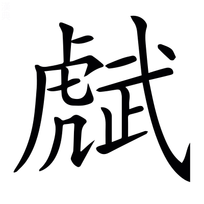
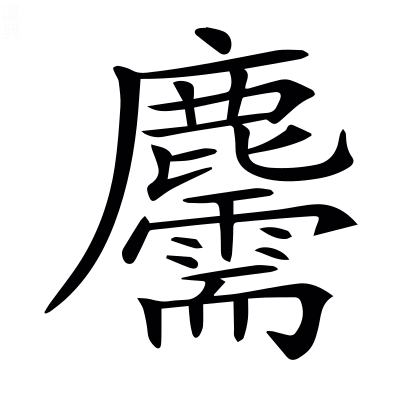
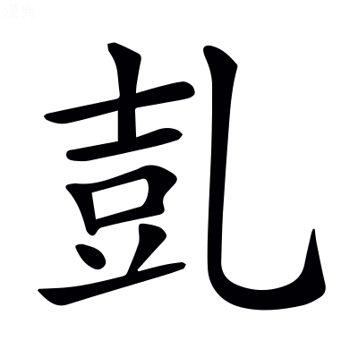

# <!-- page82 -->文選卷第五

> 梁昭明太子撰
> 
> 文林郎守太子右內率府錄事參軍事崇賢館直學士臣李善注上

京都下

左太沖吳都賦一首~~　　劉淵林注~~

## 吳都賦一首[^5.1] [^5.m0]

> 左太沖　　劉淵林注

吳都者，蘇州是也。後漢末，孫權乃都於建業，亦號吳[^5.2]。

東吳王孫辴然而咍[^5.3]，辴，大笑貌。莊周云：齊桓公辴然而笑。楚人謂相笑爲咍。楚辭曰：衆兆所咍。〔善曰〕辴，勑忍切。咍，呼來切。

曰「夫上圖景宿，辨於天文者也。下料`聊`物土，析於地理者也。謂天垂其象，而分野形；地以別土，而區域殊。料，度也。〔善曰〕文子曰：天道爲文，地道爲理。

古先帝代，曾覽八紘之洪緒。一六合而光宅，翔集遐宇。鳥策篆素，玉牒石記[^5.4]。烏聞梁岷有陟方之館、行宮之基歟？淮南子曰：九州外有八澤，方千里。八澤之外有八紘，亦方千里，蓋八索也。一六合而光宅者，并有天下而一家也。說文曰：牒，札也。石記，刻石書傳記也。烏，安也。梁，梁州也；岷，岷山，皆蜀地也。書云：舜陟方，謂南巡守也。光武紀云：濟陽有武帝行過宮。〔善曰〕~~呂氏春秋曰：神通乎六合。高誘曰：四方上下爲六合。~~六合，已見兩都序[^5.5]。尙書序曰：光宅天下。鳥策，鳥書於策也。春秋運斗樞曰：黃龍負圖出，置帝前。鳥文，漢書音義曰：大篆，蟲書鳥書是也。鄭玄禮記注曰：筴，簡也。篆素，篆書於素也。楊雄書曰：齎油素四尺。東觀漢記曰：封禪，其玉牒文秘，天子事也。說文曰：諜，記也。牒與諜同。孝經鈎命訣曰：封禪，刻石紀號也。天子行所立名曰行宮。~~陟，升也。方，道也。巡狩，謂舜也。~~[^5.6]

而吾子言蜀都之富，禺同之有。偉其區域[^5.7]，美其林藪。矜巴漢之阻，則以爲襲險之右。徇蹲鴟之沃，則以爲世濟陽九。握齪而筭[^5.8]，固亦曲士之所歎也[^5.9]。旁魄而論~~都~~[^5.10]，抑非大人之壯觀也。~~吾子，謂西蜀公子。言蜀地富饒及禺同之所有也。~~瑋~~偉[^5.m1]，美也。蜀都賦云：左綿巴中，百濮所充；緣以劒閣，阻以蜀門。矜夸其險也。徇，營也。亡身從物曰徇，夸物示人亦曰徇。卓王孫曰「吾聞岷山之野，下有蹲鴟，至死不飢。三年不收，其形如蹲鴟，故號也。」~~[^5.11]越嶲郡青蛉縣禺同山[^5.12]，有金馬碧雞之神。巴漢之阻，巴郡之扞關也。漢中廣漢，其路由於劒閣褒斜也。易無妄曰：災氣有九。陽阨陰阨，~~四合爲九，~~[^5.13]一元之中，四千六百一十七歲，~~各以數至陽阨，故云百六之會。王孫言公子徇其土地，自生蹲鴟，可以救代飢儉，度陽九之厄。~~有九厄，陽厄五，陰厄四，合爲九[^5.14]。漢書律歷志具有其事。握齪[^5.m2]，好苛局小之貌。曲，謂僻也。言筭量蜀地，亦是曲僻之士。旁魄，取寬大之意。王孫謂寬大之意論西都也。〔善曰〕楊雄城門校尉箴曰：盤石唐芒，襲險重固。漢書：酈食其曰「其將握齪好苛禮。」齪，楚角切。文子曰：曲士不可言至道。莊子曰：將旁礴萬物以爲一。*司馬彪曰：旁礴猶混同也。*礴與魄同。鵩鳥賦曰：大人不曲。

何則？土壤不足以攝生，山川不足以周衛。公孫國之而破，諸葛家之而滅。茲乃喪亂之丘墟，顛覆之軌轍。安可以麗`戾`王公而奢風烈也[^5.15]。攝，持也。老子曰：善攝生。漢書：公孫述~~，王莽末時王蜀，爲光武將吳漢破之。魏志曰：漢末諸葛亮輔劉備而爲臣，都於蜀，終於魏將鄧艾所平。麗，著也。~~王此土而亡。諸葛亮相此國而敗[^5.16]。凡天下存亡，唯繫乎人。然強弱有常勢，利害有常地，必有不可守之土不可興之國矣。易曰：六五之吉，麗王公也。〔善曰〕漢武栢梁臺~~衛尉~~詩曰[^5.17]：周衛交戟禁不時。毛詩曰：喪亂弘多。呂氏春秋：燭過曰「子胥諫而不聽，故吳爲丘墟。」毛詩序曰：閔周室之顛覆。奢，靡也。尙書：周公曰「化奢麗。」風烈，已見南都賦。

翫其磧礫而不窺玉淵者，未知驪龍之所蟠也。習其邑而不覩上邦者，未知英雄之所躔也。磧礫，淺水見沙石之貌。玉淵，水深之處，美玉所出也。尸子曰：龍淵生玉英。莊子曰：千金之珠，在九重之淵，驪龍頷下。故曰，不窺玉淵者，不知驪龍之蟠也。〔善曰〕上林賦曰：下磧礫之坻。說文曰：磧，水渚有石也；且歷切。驪音離。左氏傳曰：衛州吁曰「邑與陳蔡從。」上邦猶上國也。方言曰：躔、歷，行也。

---

子獨未聞大吳之巨麗乎？且有吳之開國也，造自太伯，宣於延陵。蓋端委之所彰，高節之所興。建至德以剏洪業，世無得而顯稱。由克讓以立風俗[^5.18]，輕脫躧於千乘。若率土而論都，則非列國之所觖望也。戰國策曰：黑齒、彫題，大吳之國也。昔周太伯三以天下讓，延陸季子辭國而不處，遂化荊蠻之方，與華夏同風，二人所興。左氏傳曰：太伯端委以治。端委，禮衣委貌。謂冠袖長而裳齊委<!-- page83 -->至地也。孔子曰「太伯三以天下讓，人無得而稱焉。」〔善曰〕端委至德，大伯也。高節克讓，延陵也。左傳曰：吳子諸樊既除喪，將立季札，札曰「聖達節，次守節，下失節，爲君非吾節也」，遂讓不受。史記曰：壽夢欲立季札，讓不可，乃立諸樊也。漢書：武帝曰「吾去妻子如脫躧耳。」聲類曰：躧，或爲。說文曰：，鞮屬也；亦所解切。諸侯，故言千乘之國。論語曰：導千乘之國。漢書曰：上欲王盧綰，爲群臣觖望。*臣瓚曰：觖，謂相觖而怨望也。*觖音決。

故其經略[^5.19]，上當星紀。拓`音託`土畫疆，卓犖`呂角`兼并。包括干越[^5.20]，跨躡蠻荊。左傳曰：天子經略土地，定城國，制諸侯。略，分界也。一曰遠界爲經略也。爾雅曰：星紀，斗、牽牛，吳分野。斗者，日月五星之所經始，故謂之星紀。意者斗爲星紀，則其分域亦所以能爲綱維，故曰卓犖兼并也。越，今之蒼梧、鬱林、合浦、交阯、九真、南海、日南，皆越地，吳之所并也。荊蠻，吳所得荊州四郡，零陵、桂陽、長沙、武陵。〔善曰〕漢書曰：戎狄之與干越，不相入也。*音義曰：干，南方越名也。*春秋曰：于越入吳。*杜預注曰：于，越人發語聲。*詩曰：蠢爾蠻荊。

婺女寄其曜，翼軫寓其精。指衡岳以鎮野，目龍川而帶坰。~~婺女越分，翼軫楚分，非吳分，故言寄曜寓精也。~~越楚地皆割屬吳，故言婺女翼軫寄曜寓精也[^5.21]。〔善曰〕漢書曰：越地婺女之分野，楚地翼軫之分野。周禮曰：正南曰荊州，其鎮衡山。漢書：南海有龍川縣。~~南越志：縣北有龍穴山。舜時有五色龍，乘雲出入此穴。~~[^5.22]爾雅曰：林外謂之坰。

---

爾其山澤，則嵬嶷嶢，巊冥鬱。潰渱泮汗，滇㴐淼漫。或涌川而開瀆，或吞江而納漢。磈磈，滮滮涆涆。䃢碒乎數州之閒，灌注乎天下之半。山之大者衡嶽，澤之大者彭蠡。地理志曰：彭蠡澤在豫章彭澤西，會稽餘暨縣蕭山，潘水所出[^5.23]。~~嵬嶷，高大皃。冥鬱，山氣暗昧之狀。潰虹泮汗，謂直望無崖也。滇㴐淼漫，山水闊遠無崖之狀。~~[^5.24]錢塘縣，武林水出其山[^5.25]，故曰涌川。九江經廬山而東，故曰開瀆。禹貢曰：三江既入，震澤厎定，故曰吞江。又曰：漢水東爲滄浪，南入于江，故曰納漢。~~磈磈，石在山中之貌。涆涆，水流行聲勢也。䃢碒，山深險連延之狀。~~[^5.26]荊揚交廣，數州之閒[^5.27]，土地闊遠，故曰天下之半。〔善曰〕嶷，魚力切。字指曰：，禿山也；五骨切。埤蒼曰：鬱，山皃；扶勿切。渱，胡東切。滇，通見切。㴐，莫見切。淼，水皃；音眇。磈，胡罪切。，力罪切。涆，古旦切。

百川派別，歸海而會。控清引濁，混濤并瀨。濆薄沸騰，寂寥長邁。濞焉洶`呼恭切`洶，隱焉礚礚。字說曰：水別流爲派。濤，大波也。瀨，急湍也。~~長邁，不回之意。~~[^5.28]礚，苦蓋切。〔善曰〕尙書大傳曰：百川趨于海。洶洶、礚礚，皆水聲也。

出乎大荒之中，行乎東極之外。經扶桑之中林，包湯谷之滂沛。潮波汩起，迴復萬里。歊霧漨浡，雲蒸昏昧。大荒，謂海外也。爾雅曰：孤竹、北戶、西王母、日下，謂之四荒。孤竹在北，北戶在南，日下在東，西王母在西，皆四方荒昏之國也。又曰：東至大遠，西至邠國，南至濮鉛，北至祝栗，謂之四極。謂四方之極。極，遠也，言大荒、東極、扶桑、湯谷者，謂海外彌廣，無所不連也。~~潮波汩起，言水彌廣。汩，急疾，无所不至。歊霧，水霧之氣，似雲蒸昏暗不明也。~~[^5.29]〔善曰〕扶桑、湯谷，已見上文。漨，薄工切。浡，蒲昧切。

泓澄奫潫，澒溶沆`戶朗`瀁`余兩`。莫測其深，莫究其廣。澶湉漠而無涯，㹅有流而爲長。瓌異之所叢育，鱗甲之所集往。〔善曰〕說文曰：泓，下深大也。澄，湛也。奫潫[^5.30]，迴復之貌~~。皆水深廣闊也。奫~~[^5.31]；於旻切。潫，於權切。澒，胡孔切。溶，余腫切。澶湉，安流貌。澶音纏。湉音恬。~~瓌異、龜魚，皆在水中生長。~~[^5.32]

---

於是乎長鯨吞航，修鯢吐浪。躍龍騰蛇，鮫鯔琵琶。王鮪`偉`鯸鮐，鮣`印`龜鱕䱜。烏賊擁劒，`古侯`鼊`辟`鯖鰐。涵泳乎其中。~~航，舡之別名。~~[^5.33]異物志云：鯨魚，長者數十里，小者數十丈[^5.34]，雄曰鯨，雌曰鯢，或死於沙上，得之者皆無目，俗言其目化爲明月珠。鄧析子曰：釣鯢者不於清池。一說曰：鯨猶言鳳，鯢猶言皇也。異物志曰：朱厓有水蛇，鮫魚出合浦，長二三尺，背上有甲，珠文堅強，可以飾刀，口可以爲鑢。鯔魚形如鯢，長七尺，吳會稽臨海皆有之。琵琶魚無鱗，其形似琵琶，東海有之。鯸鮐魚狀如科斗，大者尺餘，腹下白，背上青黑，有黃文。性有毒，雖小，獺及大魚不敢餤之。蒸煑餤之，肥美，豫章人珎之。鮣魚長三尺許，無鱗，身中正四方如印。扶南俗云：諸大魚欲死，鮣魚皆先封之。鱕䱜有橫骨在鼻前，如斤斧形，東人謂斧斤之斤爲鐇[^5.35]，故謂之鱕䱜。魚二十餘種，此其尤異者。此魚所擊，無不中斷也。有出入。䱜子，朝出求食，暮還入母腹中，皆出臨海。烏賊魚~~腹~~中~~有~~藥[^5.36]。擁劒，蟹屬也，從廣二尺許，有爪，其螯偏大，大者如人大指，長二寸餘，色不與體同，特正黃而生光明，常忌護之，如珍寶~~矣~~，以利如劒[^5.37]，故曰擁劒。其一螯尤細，主取食，出南海交趾。鼊，龜屬也，其形如笠，四足縵胡無指，其甲有黑珠，文采如瑇瑁，可以飾物，肉如龜肉，肥美可食。鯖魚出交趾合浦諸郡。鰐魚長二丈餘，有四足，似鼉，喙長三尺，甚利齒，虎及大鹿渡水，鰐擊之，皆中斷。生則出在沙上乳卵，卵如鴨子，<!-- page84 -->亦有黃白，可食。其頭琢去齒，旬日間更生，廣州有之。涵，沉也。楊雄方言曰：南楚謂沉爲涵。泳，潜行也，見爾雅。~~言已上魚龍，潜沒泳其中。~~[^5.38]〔善曰〕莊子曰：吞舟之魚，蕩而失水。周易曰：見龍在田，或躍在淵。楚辭曰：騰蛇兮後從。文子曰：騰蛇無足而騰。鯔音菑。鮐音夷。鱕，甫袁切。䱜，甫亦切。鰐，五洛切。涵音含。

葺`七入`鱗鏤甲，詭類舛錯。泝`素`洄順流，噞喁沈浮。葺，累也。甲，謂龜甲也。楚辭曰：魚葺鱗以自別。噞喁，魚在水中羣出動口貌。〔善曰〕毛詩曰：泝洄從之，道阻且長。淮南子曰：水濁則魚噞喁[^5.39]。噞，牛檢切。喁，魚㐫切。

鳥則鵾鷄鸀`燭``玉`，鸘`霜`鵠鷺鴻。鶢`爰`鶋`居`避風，候鴈造`七報`江。鸂䳵鷛，鶄鶴鶬。鸛鷗鷁`七激`鸕，氾濫乎其上。鵾鷄，鳥也，好鳴[^5.40]。鸀，水鳥也。，如鷺而大，長頸赤目，其毛辟水毒，丹陽、鄱陽皆有之。鶢鶋，鳥也，似鳳。左傳曰：海鳥爰居，止魯東門外三日，臧文仲使國人祭之，不知其鳥，以爲神也。鸂䳵，水鳥也，色黃赤，有斑文，食短狐蟲，在水中，無毒，江東諸郡皆有之。鷛，似鴨而鷄足。鶄鶴，出南海桂陽諸郡。〔善曰〕候鴈，已見南都賦。毛詩曰：有在梁。*毛萇詩傳曰：禿也。*蒼頡篇曰：鷗，大如鳩。郭璞山海經注曰：鷗，水鷂也。鷛音庸。音渠。音秋。

湛淡羽儀，隨波參差。理翮整翰，容與自翫。彫啄蔓藻，刷盪漪瀾。湛淡，迅疾皃。漪瀾，水波也。彫啄，鳥食貌。蔓藻，海藻之屬也。〔善曰〕說文曰：刷，刮也。猗，蓋語辭也[^5.41]。毛詩曰：河水清且漣漪。爾雅曰：大波爲瀾。

魚鳥聱耴，萬物蠢`昌允`生。芒芒黖黖，慌`呼廣`罔奄欻`許勿`，神化翕忽，函幽育明。窮性極形，盈虛自然。蚌蛤珠胎，與月虧全。巨鼇贔`備`屓`許器`，首冠靈山。大鵬繽翻，翼若垂天。振盪汪流，雷抃重淵。殷`上聲`動宇宙，胡可勝原。蠢，動也。黖黖，絕遠貌。奄欻，去來不定之意。翕忽，疾貌[^5.42]。函幽育明，皆謂珠玉光耀之狀也。窮性極形，物皆極大也[^5.43]。呂氏春秋曰：月望則蚌蛤實，月晦則蚌蛤虛。列仙傳曰：鼇負蓬萊山而抃滄海之中。贔屓，用力壯貌。莊子曰：北溟有魚名鵾，化爲鵬，怒而飛，翼若垂天之雲。鵬之將徙於南溟，水擊三千里，摶扶搖而上九萬里。示振盪之狀也。汪流，水深貌，其聲勢之不可勝盡也。淮南子曰：虛廓生宇宙，宇宙生天地者也。〔善曰〕聱耴，衆聲也。埤蒼云：聱，不聽也；魚幽切。耴，牛乙切。杜篤論都賦曰：蠢生萬類。黖黖，不明貌；許既切。春秋保乾圖曰：日以圓照，月以虧全。*宋均曰：全，十五日時也。*列子：夏革曰「渤海之東曰歸塘，其中有五山焉。帝命禺強使巨鼇十五舉首而戴五山，峙而不動。」玄中記曰：鼇，巨龜也。西京賦曰：巨靈贔屓。王逸楚辭注曰：擊手曰抃，音卞。

---

島嶼`序`緜邈，洲渚馮`平`隆`崇`。曠瞻迢遞，迥眺冥蒙。珍怪麗，奇隙充。徑路絕，風雲通。洪桃屈盤，丹桂灌叢。瓊枝抗莖而敷蘂，珊瑚幽茂而玲瓏。島，海中山也。嶼，海中洲，上有山石。魏武蒼海賦曰：覽島嶼之所有。緜邈，廣遠貌[^5.44]。水中可居曰洲，小洲曰渚。曠瞻迢遞，謂島嶼也。馮隆，高貌。迢遞，遠貌[^5.45]。迥眺冥蒙，謂洲渚也[^5.46]，深奧之貌。言珍怪之物，麗於島嶼之中[^5.47]。徑路絕者，人道斷絕，風雲通者，唯風雲能交通也。意者謂奇怪之徒，因風雲以交通。水經曰：東海中有山焉，名曰度索，上有大桃，屈盤三千里。桂，生蒼梧交趾合浦以南山中，所在叢聚，無他雜木也，其枝葉皆辛。木叢生曰灌。瓊樹，食其華蘂，~~仙人所食~~[^5.48]，令人長生。楚辭曰：精瓊蘂以爲糧。蓬萊三山，神仙所居，故宜有焉。漢書：歌曰[^5.49]「上蓬萊，咀瓊英。」珊瑚樹赤色，有枝無華[^5.50]。扶南傳曰：漲海中有盤石，珊瑚生其上。玲瓏，明貌[^5.51]。〔善曰〕後漢黎陽山碑曰：山河馮隆，有精英兮。朱穆鬱金賦曰[^5.52]：丹桂植其東。莊子曰：南方積石千里，名瓊枝，高百二十仞。

增岡重阻，列真之宇。玉堂對霤，石室相距。藹藹翠幄，嫋嫋素女。江斐於是往來，海童於是宴語。斯實神妙之響象，羌難得而覼縷[^5.53]。玉堂石室，仙人居也。海童，海神童也。吳歌曲曰：仙人齎持何等，前謁海童。爾雅曰：羌，楚人發語端也。〔善曰〕馮衍爵銘曰：富如江海，壽配列真。道書曰：上曰神，次曰仙人，下曰真人[^5.54]。楚辭曰：紫貝闕兮玉堂。鄭玄禮記注曰：堂前有承霤。列仙傳曰：赤松子常止西王母石室中。藹藹，盛貌[^5.55]。徐幹齊都賦曰：翠幄浮遊。埤蒼曰：嫋嫋，美也；奴鳥切。史記曰：泰帝使素女鼓五十絃瑟。神異經曰：西海有神童，乘白馬，出則天下大水[^5.56]。王延壽王孫賦曰：嗟難得而覼縷。覼，力戈切。

---

爾乃地勢坱圠，卉木镺蔓。遭藪爲圃，值林爲苑。異荂蓲蘛`育`，夏曄`于輒`冬蒨。方志所辨，中州所羨。坱圠，莽沕也，高下不平貌也。卉，百草揔名，楚人語也。有木曰苑，有草曰圃。言林藪非一，所在皆爲苑圃，有國有家者，因天地之自然，不復假人功爲園圃也。爾雅曰：荂，榮也。蓲，華也[^5.57]。敷蘛，華開貌。南土草<!-- page85 -->木通冬日生[^5.58]，故曰蒨。〔善曰〕鵩鳥賦曰：坱圠無垠。坱，烏朗切。圠，烏八切。廣雅曰：镺，長也；烏老切。荂，枯瓜切。爾雅曰：蕍，榮也。*郭璞曰：蕍猶敷蕍，亦草之貌也。*蘛與蕍同，庾俱切。蓲與敷同，無俱切。

草則藿蒳豆蔻，薑彙非一。江蘺之屬，海苔之類。綸組紫絳，食葛香茅`莫侯`。石帆水松，東風扶留。異物志曰：藿香，交趾有之。豆蔻，生交趾，其根似薑而大，從根中生，形似益智，皮殼小厚，核如石榴，辛且香。蒳，草樹也，葉如栟櫚而小，三月採其葉，細破，陰乾之，味近苦而有甘，并雞舌香食之，益美。薑彙，大如累，氣猛，近於臭，南土人擣之以爲虀。荾，一名廉薑，生沙石中，薑類也，其累大，辛而香，削皮以黑梅并鹽汁漬之則成也，始安有之。彙，類也。易曰：拔茅連茹，以其彙，征吉。所謂薑彙非一也。江蘺，香草也。楚辭曰：扈江蘺。海苔，生海水中，正青，狀如亂髮，乾之~~亦~~赤[^5.59]，鹽藏，有汁，名曰濡苔，臨海出之。爾雅曰：綸似綸，組似組，東海有之。紫，紫菜也。生海水中，正青，附石生，取乾之，則紫色，臨海常獻之。絳，絳草也，出臨賀郡，可以染。食葛，蔓生，與山葛同，根特大，美於芋也，豫章閒種之。香茅，生零陵。石帆，生海嶼石上，草類也，無葉，高尺許，其華離~~婁~~樓相貫連[^5.60]，雖無所用，然異物也，死則浮水中，人於海邊得之，希有見其生者。水松，藥草，生水中，出南海交趾。東風，亦草也，出九真。扶留，藤也，緣木而生，味辛。~~可~~食檳榔者[^5.61]，斷破之，長寸許，以合~~石~~古賁灰[^5.62]，與檳榔并咀之，口中赤如血，始興以南皆有之。〔善曰〕蒳音納。蔻，火豆切。彙音謂。綸，古頑切。

布濩皐澤，蟬聯陵丘。夤緣山嶽之岊，冪歷江海之流。扤白蔕，銜朱蕤。鬱兮䓲茂，曄兮菲菲。光色炫晃，芬馥肸蠁。職貢納其包匭，離騷詠其宿莽。布濩，遍滿貌。蟬聯，不絕貌。夤緣，布藤上貌。冪歷，分布覆被貌[^5.63]。許氏記字曰：岊，陬隅而山之節也。扤，搖也。蔕，花本也。菲菲，花美貌也[^5.64]。方言曰：凡草生而初達謂之䓲。芬馥，色盛香散狀[^5.65]。包，裹也。匭猶結也。尙書禹貢曰：包匭菁茅。菁茅生桂陽，可以縮酒，給宗廟，異物也，重之，是故既包裹而又纏結之。一曰，匭，柙也。爾雅曰：卷葹草，拔其心，不死。江淮間謂之宿莽。屈原嘉之以其志，故離騷曰：夕覽洲之宿莽。〔善曰〕毛萇詩傳曰：扤，動也。淮南子曰：草木之勾萌，銜翠載實。說文曰：蕤，草木華垂貌。肸蠁，已見蜀都賦。夤緣，出也。岊音節。䓲，以稅切。蕤，汝誰切。

木則楓柙`甲`豫章[^5.66]，栟櫚枸`古候`桹。緜杬杶櫨，文欀楨橿`薑`。平仲君遷[^5.67]，松梓古度。南榴之木[^5.68]，相思之樹。楓柙，皆香木名也。豫章，木也。異物志曰：栟櫚，椶也，皮可作索。枸桹，樹也，直而高，其用與栟櫚同。栟櫚出武陵山，枸桹出廣州。木緜樹高大，其實如酒杯，皮薄，中有如絲綿者，色正白，破一實得數斤，廣州、日南、交趾、合浦皆有之。杬，大樹也，其皮厚，味近苦澀，剥乾之，正赤，煎訖以藏衆果，使不爛敗，以增其味，豫章有之。杶櫨，二木名。文，文木也，材密緻無理，色黑如水牛角，日南有之。欀木，樹皮中有如白米屑者，乾擣之，以水淋之，可作餅，似麵，交趾盧亭有之。楨櫨，二木名。劉成曰：平仲之木，實白如銀。君遷之樹，子如瓠形。松梓，二木名，古度，樹也，不華而實，子皆從皮中出，大如安石榴，正赤，初時可煑食也，廣州有之。南榴，木之盤結者，其盤節文尤~~好，~~可以作器[^5.69]；建安所出最大長也。相思，大樹也，材理堅，邪斫之則文，可作器；其實如珊瑚，歷年不變，東冶有之。〔善曰〕桹音郎。杬音元。杶，勑倫切。欀音襄。楨音貞。

宗生高岡，族茂幽阜。擢本千尋，垂蔭萬畒。攢柯挐莖，重葩殗葉。輪囷蚪蟠，㙷鱗接。榮色雜糅，綢繆縟繡。宵露霮`徒感`䨴`徒外`，旭日晻`烏感`㫲。與風䬙`搖`颺`樣`，䬀瀏颼飀。鳴條律暢，飛音響亮。蓋象琴筑`竹`并奏，笙竽俱唱。宗生，宗類而生於高山之脊，故名宗生。族茂，言種族繁多也。擢本，高聳皃。八尺曰尋。言婆娑覆萬畒之地[^5.70]。莊~~子~~周曰[^5.71]：匠石見樹百圍，其臨千仞，而後有枝，此大樹之屬也。〔善曰〕許愼淮南子注曰：挐，亂也；女居切。殗，重也，葉重疊貌[^5.72]；於劫切。鄒陽上書曰：輪囷離奇。輪囷，謂屈曲貌。蚪蟠，謂樹如龍蛇之盤屈相糾也[^5.73]。㙷，枝柯相重疊貌[^5.74]。，楚立切。㙷，除立切。縟繡，言草木花光似繡文。綢繆，花采密貌。霮䨴，露垂貌[^5.75]。毛詩曰：旭日始旦。㫲，亦闇也；房妹切。䬀瀏，風聲也。䬀，於酉切。瀏，力久切。颼，所求切。飀音留。律，謂籟也，殷仲文所謂幽律是也。言木枝葉與風搖蕩作聲，如律呂之暢[^5.76]。說文曰：筑，似箏，五絃之樂也。世本曰：隨作竽。鄭玄周禮注曰：三十六簧也。

其上則猨父哀吟[^5.77]，子長嘯。狖鼯`吾`猓`古火`然，騰趠飛超。争縣接垂[^5.78]，競游遠枝。驚透沸亂，牢落翬散。吳越春秋曰：越有處女，出於南林之中，越王使使聘問以劒戟之事。處女將北見於越王，道逢老翁，自稱素袁公，問處女「吾聞子善爲劒術，願一觀之。」女曰「妾不敢有所隱，唯公試之。」於是袁公即跳於林竹，槁折墮地，處女即接末，袁公操本以刺處女，女應節入，三入，因舉枝擊之，袁公即飛上樹，化爲白猿，遂引去。子，猿類，猿身人面，見人嘯[^5.79]。異<!-- page86 -->物志曰：狖，猿類，露鼻，尾長四五尺，樹上居[^5.80]，雨則以尾塞鼻，建安臨海北有之。鼯，大如猿，肉翼，若蝙蝠，其飛善從高集下，食火煙，聲如人號，一名飛生，飛生子故也，江東諸郡皆有之[^5.81]。猓然，猿狖之類，居樹，色青赤有文，日南九真有之。楊雄方言曰：透，驚也。〔善曰〕山海經曰：獄法之山有獸，狀如犬，人面，見人則笑，名。，胡奔切。枚乘兔園賦曰：騰涌雲亂，枝葉翬散[^5.82]。狖，余幼切。趠，吐教切。超，士弔切。

其下則有梟羊麡`儕`狼，猰㺄`勑俱`象。烏菟之族，犀兕之黨。鉤爪鋸牙，自成鋒穎。精若燿星，聲若震霆。名載於山經，形鏤於夏鼎。爾雅曰：梟羊，一名，如人，面長脣黑，身有毛及踵，見人則笑，左手操管，海南經所云也。異物志云：麡狼，大如麋，角前向，有枝下出，反向上，長者四五尺，廣州有之，常居平地，不得入山林。山海經曰：南海之外有猰㺄，狀如，龍首，食人。，虎屬也，或曰能化爲人也。象，生九真日南山中，大者其牙鼻長一丈。於菟，虎也，江淮閒謂虎爲於菟[^5.83]。犀，狀如水牛，頭似猪，四足類象，倉黑色，一角當額上，鼻上角亦墮也，又有小角長五寸，不墮，性好食棘，口中灑血，武陵已南山中有之。兕，獸也，似牛。左傳曰：昔夏之方有德也，遠方圖物，貢金九牧，鑄鼎象物，而爲之備，使人知神姦，故人入山澤林藪，不逢不若，魑魅魍魎[^5.84]，莫能逢之。故曰形鏤於夏鼎。〔善曰〕麡，在西切。猰，於八切。㺄，以主切。淮南子曰：勾爪鋸牙，於是摯矣。禮記曰：刀，却刃授穎。*鄭玄曰：穎，鐶也[^5.85]。*摯伯陵答司馬遷書曰：有能見鋒穎之狀。

---

其竹則篔簹林箊`於`[^5.86]，桂箭射筒。由~~`由`~~梧有篁[^5.87]，篻簩有叢。皆竹名也。異物志曰：篔簹，生水邊，長數丈，圍一尺五六寸，一節相去六七尺，或相去一丈，廬陵界有之。始興以南，又多小桂，夷人績以爲布葛。林箊，是袁公所與越女試劒竹者也。桂竹，生於始興小桂縣，大者圍二尺，長四五丈。箭竹，細小而勁實，可以爲箭，通竿無節，江東諸郡皆有之。射筒竹，細小通長，長丈餘，亦無節，可以爲筒，射筒及由梧竹皆出交趾九真[^5.88]。篻竹，大如戟槿，實中勁強，交趾人銳以爲矛，甚利。簩竹，有毒，夷人以爲觚，刺獸，中之則必死。篔，于君切。篻，芳眇切。簩音勞。

苞筍抽節，往往縈結。綠葉翠莖，冒霜停雪。橚矗`蓄`森萃，蓊茸`而勇`蕭瑟。檀欒蟬蜎，玉潤碧鮮。梢雲無以踰，嶰谷弗能連。鸑鷟食其實，鵷鶵擾其閒。苞筍，冬筍也，出合浦，其味美於春夏時筍也。見馬援傳。漢書天文志曰：見梢雲。其說，梢如樹也。嶰谷，崑崙北谷也。漢書律歷志[^5.89]：黃帝詔伶倫爲音律，伶倫乃之崑崙山之陰嶰谷之中，取竹斬之，以其厚均者吹之[^5.90]，以爲黃鍾之管。鸑鷟~~鳳鶵也。~~鵷鶵，~~周本紀曰~~皆鳳類也[^5.91] [^5.92]，非梧桐不棲[^5.93]，非竹實不食。黃帝時，鳳集東園，食帝竹實，終身不去。擾，馴~~善~~也[^5.94]。〔善曰〕橚矗，長直貌。蓊茸[^5.95]，茂盛貌。蕭瑟，聲也[^5.96]。冒，犯也。嬋娟，言竹妍雅也[^5.97]。橚，所六切。矗，丑六切。枚乘兔園賦曰：脩竹檀欒，夾水碧鮮。言竹似之也。梢雲，山名，出竹[^5.98]。

其果則丹橘餘甘，荔枝之林。檳榔無柯，椰葉無陰。龍眼橄欖，棎劉禦霜[^5.99]。結根比景之陰，列挺衡山之陽。薛瑩荊揚已南異物志曰：餘甘，如梅李，核有刺，初食之，味苦，後口中更甘，高涼建安皆有之。荔枝樹生山中，葉綠色，實赤，肉正白，味大甘美[^5.100]。檳榔樹，高六七丈，正直無枝，葉從心生，大如楯，其實作房，從心中出，一房數百實，實如雞子，皆有殼，肉滿殼中，正白，味苦澀，得扶留藤與古賁灰合食之，則柔滑而美，交趾日南九真皆有之。椰樹，似檳榔無枝條，高十餘尋，葉在其末，如束蒲，實大如瓠，繫在樹頭，如掛物也。實外有皮如胡桃，核裏有膚，膚白如雪，厚半寸，如豬脂[^5.101]，味美如胡桃，膚裏有汁升餘，清如水，美如蜜，飲之可以愈渴，核作飲器也。龍眼，如荔枝而小，圓如彈丸，味甘勝荔枝，蒼梧交趾南海合浦皆獻之，山中人家亦種之。橄欖，生山中，實如雞子，正青，甘美，味成時食之益善，始興以南皆有之，南海常獻之。棎，棎子樹也，生山中，實似梨，冬熟，味酸，丹陽諸郡皆有之。榴，榴子樹也，出山中，實亦如梨，核堅，味酸美，交趾獻之。〔善曰〕橄音敢。欖音覽。棎，市瞻切。漢書音義·如淳曰：比景，日中於頭上，景在己下，故名之比景。比，方利切。一作北景，云漢武時，日南郡置北景縣，言在日之南，向北看日，故名[^5.102]。宋玉笛賦曰：余嘗觀於衡山之陽。

素華斐，丹秀芳。臨青壁，系紫房。鷓鴣南翥而中留，孔雀綷羽以翶翔。山雞歸飛而來棲，翡翠列巢以重行。鷓鴣，如雞，黑色，其鳴自呼。或言此鳥常南飛不北，豫章已南諸郡處處有之。孔雀，尾長六七尺，綠色有華彩，朱崖交趾皆有之，在山草中。山雞，如雞而黑色，樹棲晨鳴。今所謂山雞者，鷩蛦也。合浦有之。翡翠，巢於樹顛生子，夷人稍徙下其巢，子大未飛，便取之。皆出於交趾鬱林郡。

其琛賂則琨瑤之阜，銅鍇之垠。火齊之<!-- page87 -->寶，駭雞之珍。頳丹明璣，金華銀樸。紫貝流黃，縹碧素玉。隱賑崴㠢，雜插幽屏`必井`。精曜潛熲，硩陊`直氏`山谷。碕岸爲之不枯，林木爲之潤黷。隋侯於是鄙其夜光，宋王於是陋其結綠。琛，寶也。賂，貨也。詩曰：來獻其琛，大賂南金。琨瑤，皆美石也。鍇，金屬也。禹貢：揚州貢金三品，謂金銀銅。異物志曰：火齊，如雲母，重沓而可開，色黃赤，似金，出日南。頳，赤也。丹，丹砂也。出山中，有穴。禹貢：荊州貢丹。璣，珠屬也，朱崖出珠。金華，采者[^5.103]。銀朴，銀之在石者。紫貝，以色言之。流黃，土精也，淮南子曰：夏至而流黃澤。縹碧素玉者，亦以色言也。硩者，言其有如硩擿而陊落山谷者[^5.104]。淮南子曰：積疊琁玉，以純脩碕。張衡南都賦曰：隋珠夜光。張祿先生曰：宋有結綠，隋侯宋王於此各鄙其寶也。〔善曰〕尙書曰：瑤琨篠蕩。孝經援神契曰：神靈滋液，則犀駭雞。*宋衷曰：角有光，雞見而駭驚也[^5.105]。*劉欣期交州記曰：金華，出珠崖，謂金有華采者。埤蒼曰：崴㠢，不平也，又重累貌[^5.106]。崴，烏乖切。㠢，故乖切。幽屏，謂生處也。潛熲，謂潛深而有光熲[^5.107]。說文：硩，擿空青珊瑚墮之，珠玉潛伏土石閒，隨四時長，故硩毀陊落山谷之土石也。潤，膩也。黷，黑茂貌[^5.108]。硩，勑列切。孫卿子曰：言無小而不聲，行無隱而不形，玉在山而木潤，淵生珠而崖不枯。許愼淮南子注曰：碕，長邊也；巨依切。

---

其荒陬`子侯`譎`決`詭，則有龍穴內蒸，雲雨所儲。陵鯉若獸，浮石若桴。雙則比目，片則王餘。窮陸飲木，極沈水居。泉室潜織而卷綃，淵客慷慨而泣珠。開北戶以向日，齊南冥於幽都。陬，四隅，謂邊遠也[^5.109]。湘東新平縣有龍穴，穴中黑土，天旱，人人便共以水沾穴[^5.110]，則暴雨應之，常以此請雨也。陵鯉，有四足，狀如獺，鱗甲似鯉，居土穴中，性好食蟻。楚辭曰：陵魚曷止。*王逸曰：陵魚，陵鯉也。*浮石，體虛輕浮，在海中，南海有之。桴，舟也[^5.111]。比目魚，東海所出。王餘魚，其身半也。俗云：越王鱠魚未盡，因以其半棄之爲魚[^5.112]，遂無其一面，故曰王餘也。朱崖海中有渚，東西五百里，南北千里，無水泉，有大木，斬之，以盆甕承其汁而飲之。水居，鮫人水底居也，俗傳鮫人從水中出，曾寄寓人家，積日賣綃，綃者，竹孚俞也。鮫人臨去，從主人索器，泣而出珠滿盤，以與主人。日南人北戶，猶日北人南戶也。〔善曰〕尙書曰：宅朔方，曰幽都。謂日既在北，則南冥與幽都同。王餘泉客，皆見博物志。窮陸，見後漢書。史記曰：秦始皇地，南至北向戶，北據河爲塞。

其四野則畛畷無數，膏腴兼倍。原隰殊品，窊隆異等。象耕鳥耘，此之自與。穱`捉`秀菰`孤`穗`詞翠切`，於是乎在。畛畷，謂地廣道多也。舊井田閒，有徑有畛[^5.113]。〔善曰〕鄭玄毛詩箋曰：畛，舊田有徑路也；之引切。說文曰：畷，兩陌閒道也；知衛切，又陟劣切。說文曰：窊，汙邪，下也；於瓜切。越絕書曰：舜葬蒼梧，象爲之耕；禹葬會稽，鳥爲之耘。左傳曰：生人之道，於是乎在。

煑海爲鹽，採山鑄錢。國稅再熟之稻，鄉貢八蠶之緜。〔善曰〕史記曰：吳有豫章郡銅山，吳王濞則招致天下亡命者，盜鑄錢，煑海爲鹽，國用富饒。異物志：交趾稻夏熟，農者一歲再種。劉欣期交州記曰：一歲八蠶繭，出日南也。

---

徒觀其郊隧之內奧，都邑之綱紀。霸王之所根柢`帝`，開國之所基趾。郛郭周匝，重城結隅。通門二八，水道陸衢。所以經始，用累千祀也[^5.114]。憲紫宮以營室，廓廣庭之漫漫。寒暑隔閡`五蓋`於邃宇，虹蜺回帶於雲館。所以跨跱煥炳萬里也。爾雅曰：柢，本也。吳與周並世世稱王。自泰伯至闔閭二十五世矣。夫差益強大，得爲盟主[^5.115]，故曰霸王之所根柢也。越絕書曰：吳郭周匝六十八里六十步，大城周匝[^5.116]四十七里二百一十步。水門八，陸門八，其二有樓，名門者，車船並入。昌門今見在，銅柱石填地。大城中有小城，周十二里，亦有水陸門，皆有樓[^5.117]。闔閭宮，在高平里。言經營造作之始，使子孫累代保居也。漫漫，長遠貌[^5.118]。寒暑所閡，謂冬溫夏涼。〔善曰〕西都賓曰[^5.119]：虹蜺迴帶於棼楣。

造姑蘇之高臺，臨四遠而特建，帶朝夕之濬池，佩長洲之茂苑。窺東山之府，則瓌寶溢目；䚕海陵之倉，則紅粟流衍。姑蘇，吳臺名也。〔善曰〕越絕書曰：吳王夫差[^5.120]起姑胥之臺，五年乃成，高見三百里。史記曰：越伐吳，敗之姑蘇。漢書：伍被曰「子胥云，見麋鹿遊姑蘇之臺」。然姑胥即姑蘇也。漢書：枚乘上書曰「夫漢諸侯方輸錯出[^5.121]，其珍怪不如東山之府；轉粟西向，不如海陵之倉；修治上林，圈守禽獸，不如長洲之苑；遊曲臺，臨上路，不如朝夕之池。」蔡邕月令章句曰[^5.122]，穀藏曰倉。蒼頡篇曰：䚕，索視之貌；師蟻切。漢書曰：太倉<!-- page88 -->之粟，紅腐而不可食。

起寢廟於武昌，作離宮於建業。闡闔閭之所營，采夫差之遺法。抗神龍之華殿，施榮楯而捷獵。崇臨海之崔巍，飾赤烏之韡曄。吳志曰：前吳都武昌，在豫章[^5.123]；後都建業~~在丹陽。孫權自會稽徙治丹陽建業，人皆不樂徙，故爲歌曰：寧飲建業水，不向武昌居。~~[^5.124]。言離宮者，明非吳舊都也。神龍，建業正殿名。臨海、赤烏，~~皆建業吳大帝所太初宮~~[^5.125]殿名也。捷獵，高顯貌[^5.126]。越絕書曰：昔越王勾踐欲伐吳，大夫種對以九術[^5.127]。於是作榮楯，嬰以白璧，鏤以黃金，狀類龍蛇，以獻吳王夫差，夫差大悅[^5.128]。子胥諫曰「王勿受也」。王不聽，遂受之，以飾殿也[^5.129]。闔閭造吳城郭宮室，~~其子~~夫差嗣[^5.130]，增崇侈靡。孫權移都建業，皆學之[^5.131]，故曰闡闔閭之所營，采夫差之遺法，而施榮楯也。春秋左氏傳曰：夫差，次有臺榭陂池焉，玩好必從，歡樂是務。

東西膠葛，南北崢嶸。房櫳對櫎`晃`，連閣相經。閽闥譎詭，異出奇名。左稱彎碕，右號臨硎。〔善曰〕膠葛，長遠貌[^5.132]。崢嶸，深邃貌[^5.133]。魯靈光殿賦曰：洞膠葛其無垠。說文曰：櫳，房室之䟽也。又曰：櫎，帷屏屬。然~~則~~門牕之廡通名櫎。櫎與榥音義同[^5.134]。彎碕臨硎，閽闥名也。吳後主起昭明宮於太初之東，開彎碕臨硎二門。彎碕，宮東門；臨硎，宮西門。碕，巨依切[^5.135]。硎，口耕切。

彫欒鏤楶，青瑣丹楹。圖以雲氣，畫以仙靈。雖茲宅之夸麗，曾未足以少寧。思比屋於傾宮，畢結瑤而搆瓊。梁，栭也。瑣，戶兩邊，以青畫爲瑣文。楹，柱也[^5.136]。汲郡地中古文冊書曰：桀築傾宮，飾瑤臺，紂作瓊室，立玉門。言其夸麗。〔善曰〕鄭玄禮記注曰：栭謂之楶；音節。左氏傳曰：丹桓宮楹。*杜預曰：楹，柱也。*

高闈有閌，洞門方軌。朱闕雙立，馳道如砥。樹以青槐，亘以綠水。玄蔭眈眈，清流亹亹。〔善曰〕李尤德陽殿賦曰：朱闕巖巖。漢書音義·應劭曰：馳道，天子之道。毛詩曰：周道如砥。言其平直也。漢書：賈山上書曰「秦爲馳道，樹以青松」。然古之表道，或松或槐也。亘，引也。眈眈，樹陰重貌[^5.137]。韓詩曰：亹亹，進也[^5.138]。

列寺七里，俠棟陽路。屯營櫛比，解署棊布。橫塘查下，邑屋隆夸。長干延屬，飛甍舛互。~~吳自宮門南出苑路，府寺相屬~~建業宮前宮寺[^5.139]，俠道七里也。解猶署也。吳有司徒大監諸署，非一也。~~橫塘在淮水南，近家渚緣江築長堤，謂之橫塘。北接柵塘查下。查浦在橫塘西，隔內江。自山頭南上十里，至查浦。建業南五里有山崗，其間平地，吏民雜居。東長干~~橫塘查下，皆百姓所居之區名。江東謂山岡間爲干，建鄴之南有山，其間平地，吏民居之，故號爲干[^5.140]，中有大長干、小長干，皆相屬[^5.141]，~~大長干在越城東，小長干在越城西，地有長短，故號大小相干~~疑是居稱干也[^5.142]。韓詩曰：考盤在干。地下而黃曰干。櫛比，喻其多也。藏官物曰公廨。醫巫所居曰署。飛甍舛互[^5.m3]，言室屋之多相連下之貌[^5.143]。〔善曰〕應劭風俗通曰：今尙書御史謁者所止皆曰寺。俠棟，棟相俠也；古洽切。陽路，路陽也。毛詩曰：其崇如墉，其比如櫛。

---

其居則高門鼎貴，魁岸豪傑。虞魏之昆，顧陸之裔。歧嶷繼體，老成弈世。躍馬疊跡，朱輪累轍。陳兵而歸，蘭錡內設。冠蓋雲蔭，閭閻闐噎。~~魁岸，大度也。漢書曰：江充爲人魁岸。又于公高門以待封。又賈捐之傳曰：石顯方鼎貴[^5.144]。~~應劭曰：鼎，始也。乃祖乃父已來皆貴，故曰鼎貴也。~~虞，虞文秀。魏，魏周。顧，顧榮。陸，陸遜。隆吳之舊貴也~~虞魏顧陸，吳之舊姓也[^5.145]。昆裔，皆後世也。歧嶷，謂有識知也。老成德之人，養之乞言[^5.146]。躍馬，騰躍之謂，言富貴也[^5.147]。蔡澤傳曰：躍馬肉食。西京賦曰：武庫禁兵，設在蘭錡。閭閻闐噎，言人物遍滿之貌[^5.148]。〔善曰〕[^5.149]漢書曰：江充爲人魁岸。毛詩曰：克歧克嶷。又曰：雖無老成人。謝承後漢書曰：王公位二千石，弈世相襲。楊惲書曰：方家隆盛時，乘朱輪者十人[^5.150]。

其鄰則有任俠之靡，輕訬之客。締交翩翩，儐從弈弈。出躡珠履，動以千百。里讌巷飲，飛觴舉白。翹關扛鼎。拚射壺博。鄱陽暴謔，中酒而作。靡，美也。楊子法言曰：聶政荊軻，刺客之靡。締，結也。賈誼過秦論曰：締交。白，罰爵名也。漢書曰：引滿舉白。鄱陽人俗性暴急。何晏云：鄱陽惡戲，難與曹也。鄱陽本豫章縣。〔善曰〕漢書曰：季布爲任俠。*如淳曰：相與信爲任，同是非爲俠。*漢書述曰：江都訬輕[^5.151]~~~謂輕~~薄爲~~訬~~也[^5.152]。~~締，結也。翩翩，往來貌。弈弈，輕靡之貌。~~[^5.153]高誘淮南子注曰：訬，輕利急疾也。訬音眇。史記曰：趙平原君使人於楚，楚相春申君處[^5.154]趙使欲夸楚，爲玳瑁簪，刀劒室皆以珠飾之。請春申君。春申君客三千餘人，其上客皆躡珠履而迎之，趙[^5.155]使大慙。翹關扛鼎，皆逞壯力之勁，能招門開也[^5.156]。列子曰：孔子勁能招國門之關，而不肯以力聞。招與翹同。扛，舉也。漢書曰：項羽力能扛鼎。又[^5.157]漢書贊曰：元帝時覽拚射。*孟康曰：手搏爲拚。*壺，投壺也。禮有投壺。論語曰：不有博弈者乎。

---

於是樂只衎而歡飫無匱，都輦殷而四奧來暨。水浮陸行，方舟結駟。唱櫂轉轂，昧旦永日。昧旦，清晨也。左傳曰：昧旦丕顯。〔善曰〕毛詩曰：其樂只且。又曰：嘉賓式宴以衎。飫，已見上文。輦，王者所乘，故京邑之地，通曰輦焉。漢書曰：殺身靡骨，死事輦轂下。四隩來暨，言四方之人皆來。唱櫂轉轂，言遠人唱歌擿船，乘車轉轂，以向吳都[^5.158]。楚辭曰：青驪結駟齊千乘。漢書曰：轉轂百數。毛詩曰：且以永日。衎，苦旦切。飫，一據切。

開市朝而並納[^5.159]，橫闤闠而流溢。混品物而同廛，并都鄙而爲一。士女佇眙，商賈駢坒。紵衣<!-- page89 -->絺服，雜沓傱萃[^5.160]。輕輿按轡以經隧，樓船舉颿`帆`而過肆。果布輻湊而常然，致遠流離與珂`苦何`珬。混，同也。佇眙，立視也。今市聚人，謂之立眙。南方多絺葛，故曰紵衣絺服也。樓船，船有樓也。颿者，船帳也。地理志曰：越多犀象玳瑁珠璣銅銀果布之湊。黃支國多異物，入海市明珠流離。果，橘柚之屬。布，箋紵之屬。近海多寶物。湊，會處也。珬，老鵰化西海爲珬，已裁割若馬勒者謂之珂；珬者，珂之本璞也。日南郡出珂珬。〔善曰〕楚辭曰：覽涕而佇眙。許愼淮南子注曰：坒，相連也；扶必切。羽獵賦曰：萃傱沇溶。埤蒼曰：傱，走貌；先鞏切。隧，向市路。肆，市路也[^5.161]。漢書有樓船將軍。珬音戌。

䌖賄紛紜，器用萬端。金溢磊砢[^5.162]`力可`，珠琲`步對`闌干。桃笙象簟，韜於筒中；蕉葛升越，弱於羅紈。䌖，蠻夷貨名也。扶南傳曰：䌖貨布帛曰賄。金二十四兩爲溢。史記曰：趙孝成王一見虞卿[^5.163]，賜黃金百溢。磊珂，衆多貌。琲，貫也，珠十貫爲一琲。闌干猶縱橫也[^5.164]。桃笙，桃枝簟也，吳人謂簟爲笙。又折象牙以爲簟也[^5.165]。蕉葛，葛之細者。升越，越之細者。䌖音捷。

㒊譶澩㺒[^5.166]，交貿相競。諠譁喤呷，芬葩蔭映。揮袖風飄而紅塵晝昬；流汗霢~~`脈`~~霂`沐`而中逵泥濘。〔善曰〕㒊，所立切。蒼頡篇曰：譶，不止也；佇立切。澩㺒，衆相交錯之貌。澩，胡巧切。方言曰：㺒，猥也；奴巧切。方言曰：~~諻，吁橫切。諻，通也。~~諻，音也；吁橫切；諻與喤通[^5.167]。說文曰：呷，吸也，呼甲切。紛葩，謂舒張貿物使覆映[^5.168]。史記：蘇秦說齊王「舉袂成帳，揮汗成雨」。毛萇詩傳曰：小雨謂之霢霂。霢音脈[^5.169]。杜預左氏傳注曰：濘，泥也；奴定切。

---

富中之甿，貨殖之選。乘時射利，財豐巨萬。競其區宇，則并疆兼巷；矜其宴居，則珠服玉饌。越絕書曰：富中，大唐中也，勾踐治以爲田[^5.170]，肥饒，故謂之富中。珠服，珠襦之屬，以珠飾之也。玉饌者，尙書曰：惟辟玉食[^5.171]。言富中之食，貨殖之選者各利[^5.172]，所以能豐其財也。并疆，踰田畒也。兼巷，踰里閭也。言農人之富，自相夸競[^5.173]。〔善曰〕說文曰：甿，田人也。孔安國尙書傳曰[^5.m4]：自賢曰矜。射，賓亦切。

趫`起喬`材悍壯，此焉比廬。捷若慶忌，勇若專諸。危冠而出，竦劒而趨。扈帶鮫函，扶揄屬鏤`力駒切`。秦零陵令上書曰：荊軻挾匕首，卒刺陛下，陛下以神武，扶揄長劒以自救[^5.174]。韓非子曰[^5.m5]：解其長劒，免其危冠。離騷曰：扈江離。楚人謂被爲扈。鮫函，鮫魚甲，可爲鎧。淮南子曰：鮫革犀兕爲甲冑也。周禮曰：燕無函。孟子曰：矢人豈不仁於函人哉。左傳曰：吳賜子胥屬鏤[^5.175]以死。凡此皆其器用之事義，亦其土俗所能出，有嘉服用也。〔善曰〕成公綏洛禊賦曰：趫才逸態，習水善浮。呂氏春秋曰：吳王欲殺王子慶忌，謂要離曰：吾常以馬逐之江上而不能及，射之，矢左右滿抱而不能中。高誘曰：慶忌，吳王僚之子也。走追奔獸，接及飛鳥[^5.176]。左傳曰：吳公子光享王，鱄諸寘劒於全魚中[^5.177]以進，抽劒刺王，遂殺闔閭[^5.178]。

藏鍦於人，去自閭。家有鶴膝，戶有犀渠。軍容蓄用，器械兼儲。吳鉤越棘，純鈞湛盧。戎車盈於石城，戈船掩乎江湖。鍦，矛也。楊雄方言曰：吳越以矛爲鍦。，楯也。鶴膝，矛也。矛骹如鶴脛，上大下小[^5.179]，謂之鶴膝。犀渠，楯也，犀皮爲之[^5.180]。國語曰：奉文犀之渠[^5.181]。軍容，軍之容表，言矛劒等也。司馬法曰：古者軍容不入國，國容不入軍。軍容入國，則人德麄；國容入軍，則人德弱。越絕書曰：闔閭既重莫耶，乃復命國中作金鈎，有人貪王賞之重，殺其兩兒，以血釁鈎，遂成二鈎，獻之闔閭，詣官求賞。王曰「爲鈎者衆多，而子獨求賞，何以異於衆人之鈎乎？」曰「我之作鈎也，殺二子成兩鈎。」王曰「舉鈎以示之，何者是也？」於是鈎師向鈎而哭，呼其兩子之名吳鴻扈稽，曰「我在此，王不知汝之神也。」聲未絕於口，兩鈎俱飛著於父之背。吳王大驚，曰「嗟乎！寡人誠負子。」迺賞之百金，遂服其鈎。爾雅曰：棘，戟也。純鈞湛盧，劒名也。越絕書曰：昔越王勾踐有寶劒五，聞於天下，客有能相劒者名薛燭，王召而問之，對曰「歐冶子因天地之精，悉其伎巧，一曰純鈞，二曰湛盧，三曰莫耶，四曰豪曹，五曰巨闕。」石城，石頭隖也，在建業西，臨江，其中有庫，藏軍儲。戈船，船下有戈也。江湖，二水名也。〔善曰〕禮記曰：越棘大弓，天子之戎器也。*鄭玄曰：越，國名也。*考工記曰：越鐵利，可以爲戟[^5.182]。環濟吳紀曰：建安十七年，城石頭。越絕書：伍子胥船有戈。

---

露往霜來，日月其除。草木節解，鳥獸腯膚。觀鷹隼，誡征夫。坐組甲，建祀姑。命官帥而擁鐸，將校獵乎具區。詩曰：今我不樂，日月其除。國語曰：本見而草木節解。本，氐也，謂霜降之後，生氣既衰，草木枝葉，皆節理解落也[^5.183]。腯，肥也。左氏傳曰：肥腯，謂畜之碩大蕃滋也。漢書曰：鷹隼未擊，矰弋不施於蹊隧，於此時也，可以戒戎夫。左氏傳曰：裹糧坐甲。又曰：組甲三千。*馬融曰：組甲，以組爲甲。*祀姑，幡名，麾旗之<!-- page90 -->屬也。國語曰：吳王夫差出軍，與晉爭長，昏乃戒，夜中令服兵擐甲，陳士卒[^5.184]，官帥擁鐸，建祀姑。此吳軍容之舊制也。鐸，施號令而振之也[^5.185]。周禮：校人，中大夫掌王田獵之馬，校千二百九十六匹[^5.186]。具區，澤名也，在吳之西。〔善曰〕爾雅曰：吳越之閒有具區。

烏滸`忽古`狼䐠`呼光`，夫南西屠。儋`都含`耳黑齒之酋`自由`，金鄰象郡之渠。驫䮅飍矞，靸霅警捷，先驅前塗。異物志曰：烏滸，南夷別名也，其落在深山之中，其種族爲人所殺，則居其死所，且伺殺主，若有過之者，是與非則仇而食之。狼䐠，~~人夜~~齅金知~~其~~良~~不~~[^5.187]。夫南，特有才巧，不與衆夷同。西屠，以草染齒，染白作黑。儋耳人，鏤其耳匡。夫南之外，有金鄰國，去夫南可二千餘里，土地出銀，人衆多，好獵大象，生得，其死則取其牙。酋、渠，皆豪帥也。象郡，今日南郡也，~~又~~有象林~~郡~~縣[^5.188]。〔善曰〕驫䮅飍矞，衆馬走皃。驫，必幽切。䮅，呼橘切。飍，香幽切。矞，以出切。靸霅，走疾皃。靸，素合切。霅，徒合切。

俞騎騁路，指南司方。出車檻檻，被練鏘鏘。吳王乃巾玉輅，軺`翊焦`驌驦。旂魚須，常重光。攝`烏頰`烏號，佩干將。羽旄揚蕤，雄戟耀芒。貝冑象弭，織文鳥章。六軍袀`翊遵`服，四騏龍驤。管子曰：桓公北征孤竹，見人長尺，而人物具焉。冠而右袪衣，走馬。管仲曰「登山之神，有俞兒者，長尺，人物具焉。霸王之君興，登山之神見，且走馬前導也。袪衣，示前有水也。右袪衣，從右方涉也」。至卑耳之溪，有贊水者，從左方涉，其深及冠；從右方涉，其深至膝，已涉大濟也。指南，指南車也，鬼谷子曰：鄭人取玉，必載司南之車，爲其不惑也。鏘鏘，行步貌也。左傳曰：被練三千。*馬融曰：被練，爲甲者所服也。*玉輅，以玉飾車也。驌驦，馬也。左氏傳曰：唐成公如楚，有兩驌驦馬，子常欲之，不與。三年止之，唐人竊馬而獻子常，子常歸唐侯。*馬融曰：驌驦，鳥也，馬似之。*旂，旌旗之屬。周禮有巾車官。又[^5.189]交龍爲旂，以魚須爲柄也。日月爲常，重光，謂日月畫於旂上也。攝，持也[^5.190]。烏號，柘名，以爲弓，淮南子曰：烏號之弓，不能[^5.191]無弦而射。列女傳曰：柘枝體動，烏集其上，被即舉彈，烏乃哀號，故號之[^5.192]，干將，劒名。冑，兜鍪，以貝飾之。弭，弓末，以象飾之。鳥章，染絲織鳥，畫爲文章，置於旌旗也[^5.193]。左氏傳曰：袀服振振；袀服，皁服也~~袀，同也~~[^5.194]。騏，馬名[^5.195]。〔善曰〕毛詩曰：大車檻檻。子虛賦曰：靡魚須之撓旃。史記：趙良曰「屈盧之勁矛，干將之雄戟」。又曰：冑貝朱綅。又曰：象弭魚服。又曰：織文鳥章。又曰：乘其四騏。南都賦曰：馬鹿超而龍驤。

峭格周施，罿罻普張。罼䍐瑣結，罠蹏連綱。阹以九疑，禦以沅湘。輶軒蓼擾，彀騎煟煌[^5.196]。莊子曰：峭格羅絡。謂張網周遍[^5.197]。罿罻罼䍐，皆鳥網也。瑣結，似瑣連結也。連網，言不絕也[^5.198]。罠，麋網。蹏，兔網[^5.199]。周易略例曰[^5.200]：蹄所以在兔，得兔而忘蹄。阹，闌也。因山谷以遮獸也。禦，禁苑也。謂因沅湘爲藩落也[^5.201]。楊雄羽獵賦曰：禦自汧渭。九疑，山名。沅湘，水名。輶，輕也。詩云：輶車鑾鑣。彀騎，張弓弩之騎也。峭，七肖切。罿音衝。罻音尉。罼音畢。罠，無貧切。阹音袪。禦音語。彀，古候切。

袒裼徒搏，拔距投石之部。猨臂駢脅[^5.202]，狂趭獷猤。鷹瞵鶚視，䟃翋。若離若合者，相與騰躍乎莽䍚之野。爾雅曰：袒裼，肉袒也；詩云：袒裼暴虎。拔距，謂兩人以手相案，能拔引之也。超，踰躍也。投石，舉石以投摘也。王翦傳曰：投石拔距。猿臂，通肩也。漢書：李廣猿臂，爲武騎常侍。骿脅，今駢幹也。骿駢通[^5.203]。史記商君傳：趙良謂鞅曰「君之出，多力而駢脅者參乘」。左傳曰：晉文公駢脅。趭，走也。鷹瞵鶚視，言勇士似之也[^5.204]。〔善曰〕司馬相如大人賦曰：騰而狂趭；子召切。說文曰：獷犬不可附也[^5.205]；子猛切。猤，壯勇之貌；其翠切。說文曰：瞵，目精也；力辰切。䟃翋，相隨驅逐衆多貌。䟃，七感切。翋，力答切。，徒合切。莽䍚，廣大貌。莽，莫浪切。䍚音浪[^5.206]。

干鹵殳鋋，暘`以良切`夷勃盧之旅。長短兵，直髮馳騁。儇`許緣`佻坌並，銜枚無聲。悠悠斾旌者，相與聊浪`郎`乎昧莫之坰。干鹵，皆楯也。越絕書曰：越王身披暘夷之甲，扷勃盧之矛。短兵，刀劒也。尙書曰：稱爾干[^5.207]。過秦論曰：流血漂鹵。廣雅曰：，矛也；呼狄切。楚辭曰：車錯轂兮短兵接。史記曰：荊軻怒髮直衝冠[^5.208]。方言曰：儇佻，疾也。佻，他弔切。漢書曰：相如弔二世曰：坌入曾宮之嵯峨。*音義曰：坋，並也；步寸切。*周禮：銜枚氏，下士。*鄭玄曰：止言語囂諠也。枚，大如箸，橫銜之。*毛詩曰：有聞無聲。又曰：蕭蕭馬鳴，悠悠斾旌。悠悠，流貌。昧莫，廣大貌。聊浪，放曠貌。

鉦`征`鼓疊山，火烈熛林。飛爓浮煙，載霞載陰。菈擸雷硠，崩巒弛`直氏`岑。鳥不擇木，獸不擇音。疊，振疊也。熛，火爓也[^5.209]。左傳曰：鳥則擇木。又曰：鹿死不擇音。鹿得美草，呦呦而鳴，至於困迫將死，不暇復擇，出音急之至也。凡閑暇而有好聲，逼急不擇音，獸皆然，非唯鹿也。莊子亦曰：獸死不擇音。以雷硠之至，故云鳥不擇木，獸不擇音[^5.210]。〔善曰〕說文曰：鉦，鐃也。菈擸雷硠，崩弛之聲。菈，朗答切。擸音獵。硠音郎。爾雅曰：巒山墮。山小而高曰岑

甝虪，<!-- page91 -->麋麖。驀六駮，追飛生。彈鸞鶁，射猱㹶。白雉落，黑鴆零。陵絕嶛`尞`嶕`茲遙`，聿越巉`鋤咸`險。跇踰竹栢，㺦猭杞柟。封狶䓼，神螭掩。剛鏃`祖祿`潤，霜刃染。，絆前兩足也。莊子曰：連之羈；音聳。麖，大麃也。桂林有麃[^5.211]。山海經曰：駮，如馬[^5.212]，白身黑尾，一角，鋸牙[^5.212]，虎爪，音如鼓，能食虎也[^5.212]。詩曰：隰有六駮。飛生，鼯也。師曠曰：南方有鳥曰羌鶁，黃頭赤目，五色備也。猱，似猿，奴刀切。㹶音亭[^5.213]。鴆鳥，一名雲日[^5.214]，黑色，長頸赤喙，食蝮蛇，體有毒，古人謂之鴆毒，江東諸大山中皆有之。左氏傳曰：叔牙飲酖酒而死。聿越，豹走貌[^5.215]。霜刃，言其殺利也。〔善曰〕毛詩曰：不敢暴虎。*毛萇曰：暴虎，空手以搏也。*與暴同。爾雅曰：甝，白虎，明甘切。虪，黑虎；音叔。說文曰：驀，上馬也。鶁音京。史記曰：跇萬里。*如淳曰：跇，超踰也；恥曳切。*埤蒼曰：㺦猭，逃也。㺦，丑珎切。猭，恥傳切。淮南子：申包胥曰「吳爲封狶脩蛇」。方言曰：南楚人謂豬爲狶；虛豈切。䓼，狶聲；呼學切。

---

於是弭節頓轡，齊鑣駐蹕。徘徊倘佯，寓目幽蔚。覽將帥之權勇[^5.216]，與士卒之揚抑[^5.217]。羽族以觜距爲刀鈹`披`，毛羣以齒角爲矛鋏`古業`，皆體著`池著`而應卒`倉忽`。所以挂扢而爲創`瘡`痏，衝踤而斷筋骨。莫不衄銳挫芒，拉捭摧藏。雖有石林之岝`賾`崿，請攘臂而靡之；雖有雄虺之九首，將抗足而跐之。離騷曰：抑志弭節。蹕，止行者也。王者出入警蹕。徜佯猶翶翔。言吳之將帥，皆有拳勇[^5.218]。羽族，鳥屬也。毛群，獸屬也。鈹，兩刃小刀也。鋏，刀身劒鋒，有長鋏短鋏。體著者，著體而生也。楚辭·天問篇曰：烏有石林。此本南方楚圖畫，而屈原難問之。於義，則石林當在南也。楚辭·招魂曰：南方不可以止，雄虺九首，往來儵忽。雖有石林，雖有雄虺者，蓋張誕之云，非必臨時所遇。〔善曰〕左氏傳曰：得臣寓目焉。毛詩曰：無拳無勇。拳與權同。楚辭曰：帶長鋏之陸離。廣雅曰：扢，摩也；公紇切。蒼頡篇曰：痏，歐傷也；爲軌切。說文曰：踤，觸也；材律切。衂，折傷也；女六切。拉，頓折也[^5.219]。捭，兩手擊絕也[^5.220]；布買切。靡，碎也[^5.221]。廣雅曰：跐，躡也；且爾切。

顛覆巢居，剖破窟宅。仰攀鵕䴊，俯蹴`七六`豺獏。刦剞`几`熊羆之室，剽掠虎豹之落。猩猩啼而就禽，笑而被格。屠巴蛇，出象骼。斬鵬翼，掩廣澤。山海經曰：猩猩，豕身人面。異物志曰：出交趾，封溪有猩猩，夜聞其聲，如小兒啼也。，梟羊也，已解上章矣。梟羊善食人，大口，其初得人，喜而笑，却脣上覆額，移時而後食之。人因爲筒，貫於臂上，待執人，人即抽手從筒中出，鑿其脣於額，而得禽之[^5.222]。張衡玄圖曰：梟羊喜獲，先笑後愁。山海經曰：巴蛇食象，三歲而出其骨。骼，骨也。其爲蛇，青黃赤黑。鵬翼，大垂天也。〔善曰〕許愼淮南子注曰：鵕䴊，鷩雉也。鵕，思俊切。䴊音儀。爾雅曰：獏，白豹；音陌。剞，亦刦也；居綺切[^5.223]。廣雅曰：落，居也。，扶沸切。骼音格。

輕禽狡獸，周章夷猶。狼跋乎紭`橫`中，忘其所以睒睗，失其所以去就。魂褫氣懾`之葉`而自踢䟮者，應弦飲羽[^5.224]，形僨景僵者，累積而增益，雜襲錯繆。傾藪薄，倒岬岫。巖穴無豜豵，翳薈無鷚。思假道於豐隆，披重霄而高狩。籠烏兔於日月，窮飛走之栖宿。周章，謂章皇周流也[^5.225]。楚辭曰：君不行兮夷猶。*王逸曰：夷猶，猶豫也。*紭，網綱也。踶跋，促遽皃[^5.226]。踢䟮，皆頓伏也。飲羽，謂所射箭沒其箭羽也。闕子曰：宋景公以弓人之弓，升虎圈之臺，東向而射，箭集彭城之東，其餘力逸勁，猶飲羽於石梁。雜襲，重疊也。錯繆，聊亂貌。薄，不入之叢。藪，澤別名[^5.227]。言欲假道豐隆，非實事也。然欲窮高極遠，究變化，備幽明之故，設此云。〔善曰〕毛詩曰：狼跋其胡。說文曰：睒，蹔視也；式冉切。睗，疾視也；式亦切。褫，奪也；直示切。聲類曰：踢，跌也；徒郎切。漢書音義曰：䟮，崩也；蒲北切。爾雅曰：僨，僵也；方問切。許愼淮南子注曰：岬，山旁；古押切。爾雅曰：山有穴曰岫。毛萇詩傳曰：獸三歲曰豜；公妍切。爾雅曰：豕生三子曰豵；子公切。說文曰：，麛也；音須。又曰：鷚，鳥大鶵也；力幼切。楚辭曰：吾令豐隆乘雲兮。*王逸曰：豐隆，雲師也[^5.228]。*春秋元命苞曰：~~日~~月[^5.229]兩設，以蟾蠩與兔者，陰雙居。月中有兔，已見蜀都賦。

---

嶰澗閴，岡岵童。罾罘滿，效獲衆。迴靶乎行邪睨[^5.230]，觀魚乎三江。汎舟航於彭蠡，渾萬艘而既同。閴，空也。易曰：閴其無人。爾雅曰：山多草木曰岵。岡，山脊也。童，無草木也，若童無角。靶，轡革也。彭蠡，澤名。〔善曰〕爾雅曰：小山別大山曰嶰，山夾水曰㵎。毛萇詩傳曰：太平，山不童，澤不竭。聖主得賢臣頌曰：王良執靶。左氏傳曰：公觀魚于棠。尙書曰：三江既入，震澤底定，彭蠡既瀦。說文<!-- page92 -->曰：艘，船名。衆，一作潨。潨，水會也。嶰，古買切。航，船別名[^5.231]。

弘舸連舳，巨檻接艫。飛雲蓋海，制非常模。疊華樓而島跱，時髣髴於方壺。比鷁首而有裕，邁餘皇於往初。楊雄方言曰：江湖凡大船曰舸。舳，船前也。艫，船後也。船上下四方施板者曰檻也[^5.232]。飛雲蓋海，吳樓船之有名者，皆彫鏤采畫，有軒櫎華檻之船也。島峙，謂似方壺蓬萊二山有宮闕。左氏傳曰：楚敗吳師，獲其乘舟餘皇，吳子光請於衆曰：喪先君之乘舟，豈唯光罪，衆亦有焉。〔善曰〕釋名曰：上下重牀曰艦。江表傳曰：孫權乘飛雲大船。吳志曰：賀齊所乘船，彫刻丹鏤，望之若山。方壺，已見上文。

張組幃，構流蘇。開軒幌，鏡水區。槁工檝師[^5.233]，選自閩禺。習御長風，狎翫靈胥。責千里於寸陰，聊先期而須臾。流蘇，謂翦繒綵垂於彫文之樓也。水區，河中也。言開文軒，光輝如鏡照川也。閩，越名也。秦并天下，以其地爲閩中郡。班固述兩越傳曰：悠悠外宇，閩越東甌。禺，番禺也。其彼地人便水。方言云：刺船曰槁。檝，橈也。淮南子曰：來溪谷之流以象禺。長風，遠風也。靈胥，伍子胥神也，昔吳王殺子胥於江，沈其尸於江，後爲神[^5.234]，江海之閒莫不尊畏子胥。將濟者，皆敬祠其靈，以爲性命，舟檝之師，獨能狎翫之也。千里，路之長也。寸陰，晷之短也。言水靈輯睦，浪濤弭息，取長路於短景，獨能先期而到，故有須臾之暇也。〔善曰〕西京賦曰：長風激於別島。越絕書曰：子胥死，王使捐於大江口，乃發僨馳騰，氣若奔馬，乃歸神大海，蓋子胥，水仙也。

櫂謳唱，簫籟鳴。洪流響，渚禽驚。弋磻`波`放，稽鷦䳟。虞機發，留鵁鶄。弋，繳射也[^5.235]。鷦䳟，鳥也。楚辭曰：從玄鶴與鷦䳟。尙書曰：若虞機張。*鄭氏注曰：虞，主田獵之地者也。機，弩牙也。*鵁鶄，鳥也，似鳧，頭上揔毛羽。〔善曰〕櫂謳，已見西都賦。說文曰：籟，三孔籥也。磻，已見西京賦。

鉤鉺縱橫，網罟接緒。術兼詹公，巧傾任父。筌䱎`亘`䲛，~~鱺~~纚鱨魦[^5.236]。罩`勑教`兩魪，罺`側梢`鰝鰕。乘鱟`胡豆`黿鼉，同罛共羅。沈虎潛鹿，馽`縶`龓僒束。鰴鯨輩中於羣犗，攙搶暴出而相屬。雖復臨河而釣鯉，無異射鮒`附`於井谷。易曰：結繩而爲網罟，以畋以漁。詹公，詹何也。任父，任公子也。莊周曰：任公子爲大鈎巨矰，五十犗牛以爲餌，蹲會稽，投竿東海，已而大魚食巨鈎，鈎沒而下，驚揚奮鬐，白波若山，海水震蕩。任公子得若魚，離餌之，制河以東，蒼梧以西，莫不猒此魚者。筌，捕魚器。今之斗囬也[^5.237]。筌，所以得魚也。莊子曰：得魚而忘筌。罩，籗也。編竹籠魚者也。詩云：南有嘉魚，烝然罩罩。魪，左右魪，一目，所謂比目魚也。云須兩魚並合乃能游，若單行，落魄著物，爲人所得，故曰兩魪，丹陽吳會有之。罺，抑魚之器也。鱟，形如惠文冠，青黑色，十二足，似蟹，足悉在腹下，長五六寸，雌常負雄行，漁者取之，必得其雙，故曰乘鱟，南海朱崖合浦諸郡皆有之。罛，魚網也。詩云：施罛濊濊。虎魚，頭身似虎，或云變而成虎。鹿頭魚，有角似鹿。同罛共羅，言皆爲網罟所制獲也。縶龓僒束者，陷網罟之中，見侰束也。鰴鯨，魚之有力者也。魚大者莫若鯨也，故曰鰴鯨也。攙搶，星也[^5.238]。淮南子曰：鯨魚死而彗星出。易井卦曰：九二，井谷射鮒。*鄭玄云：九二，坎爻也，坎爲水，上直巽九三[^5.239]，艮爻也，艮爲山，山下有井。必因谷水所生魚無大魚，但多鮒魚耳。言微小也[^5.240]。*夫感動天地，此魚之至大，射鮒井谷，此魚之至小，故以相況。〔善曰〕列子曰：詹何，楚人也，以獨繭絲爲綸，芒針爲鈎，荊篠爲竿，剖粒爲餌，引盈車之魚，於百仞之淵。䱎䲛，鮪也。䱎，古贈切。鱨魦，已見西京賦。魪音介。爾雅曰：鰝，大~~魚~~鰕~~音遐~~[^5.241]。鱟音候。馽，已見西京賦。說文曰：龓，兼有也[^5.242]；力公切。鵩鳥賦曰：僒若囚拘；求殞切。鰴音輝。說文曰：犗，騬牛也。犗，古邁切。騬，以陵切。

---

結輕舟而競逐，迎潮水而振緡`密巾`。想萍實之復形，訪靈夔於鮫人。精衛銜石而遇繳，文鰩夜飛而觸綸。北山亡其翔翼，西海失其遊鱗。繳，弋綸也。緡綸，皆釣繳也。詩曰：其釣~~惟~~伊何[^5.243]，惟絲伊緡。~~〔善曰〕家語曰：~~[^5.244]楚昭王渡江，得物如斗，入王舟中，王怪之，~~使~~問孔子[^5.245]。孔子曰：此爲萍實，~~可~~令剖而食之[^5.246]，其甘如蜜。唯王者能獲此吉祥也。云先時童謠曰：楚王渡江得萍實，大如斗赤如日，剖而食之甘如蜜。引此事，言今乘江流，想復遇斯事也。山海經曰：東海中有獸如牛，蒼身無角，一足，入水則風，其聲如雷，以其皮冒鼓，聞五百里，名曰夔；鮫人居水中，故訪之。北山經曰：發鳩之山有鳥，狀如烏而文首，白喙赤足，名精衛，其鳴自呼，赤帝之女，姓姜，遊於東海，溺而死，不反；常取西山木石，以填東海。西山經曰：秦器之山，濩水出焉，是多鰩魚，狀如鯉，魚身而鳥翼，蒼文而白首，赤喙，常行西海，而遊於東海，夜飛而行。言吳之綸繳得此鳥魚[^5.247]，故西海北山，失其鱗翼<!-- page93 -->也。〔善曰〕萍實，見家語。戰國策曰[^5.249]：夏水浮輕舟。楊雄蜀都賦曰：行舟競。

雕題之士，鏤身之卒。比飾虬龍，蛟螭與對。簡其華質，則錦繢`會`。料`遼`其虓勇，則鵰悍狼戾。〔善曰〕水經云：雕題國在鬱林水南。漢書曰：昔少康之庶子，封於會稽，文身斷髮，以避蛟龍之害。蛟螭，龍子也[^5.248]。費，錦文貌；於既切。詩曰：闞如虓虎；火交切。戰國策曰：趙王狼戾無親。戾，力計切。

相與昧潜險，搜瓌奇。摸蝳蝐，捫觜。剖巨蚌於回淵，濯明月於漣漪。昧，冒也。巨蚌，育明珠者。列仙傳曰：高后時，會稽朱仲獻三寸四寸珠，此非回淵巨蚌，不出之也[^5.250]。風行水成文曰漣漪。詩曰：河水清且漣漪。明月珠，珠之至光者。清且漣漪者，水極麗也。濯光珠於麗水，蓋美之。〔善曰〕說文曰：淵，回水也[^5.251]。觜，子規切。，呼圭切。~~大龜也。言天下川澤魚鳥蟲獸瑰奇之物，隱翳之處，搜索使盡也。說文曰：昧，目不明也；門撥切。謂之潜隱之穴也~~[^5.252]

---

畢天下之至異，訖無索而不臻。谿壑爲之一罄，川瀆爲之中`去聲`貧。哂澹臺之見謀，聊襲海而徇珍。載漢女於後舟，追晉賈而同塵。~~徇，求也。襲，入也。~~[^5.253]〔善曰〕干寶搜神記曰：澹臺子羽齎璧渡河，風波忽起，兩龍夾舟，子羽奮劒斬龍，波乃止。登岸投璧於河，河伯三歸之。子羽毀璧而去。漢女、賈大夫，已見西京賦。老子曰：和其光，同其塵。

汩乘流以砰宕，翼颸風之䬟䬟。直衝濤而上瀨，常沛沛以悠悠。汔可休而凱歸，揖天吳與陽侯。汩，疾也。砰宕，舟擊水貌。䬟䬟，風~~初~~利貌[^5.254]。颸，疾風。瀨，水大波。沛沛，行貌。悠悠，亦行貌。離騷曰：溢颸風兮上征。班固曰：颸，疾也。凱，樂也。左氏傳曰：振旅凱入于晉。山海經曰：朝陽之谷神爲天吳，是水伯。揖之者，辭水靈而歸。〔善曰〕詩曰：汔可小康。*鄭玄曰：汔，幾也；虛乞切。*陽侯，見南都賦。

指包山而爲期，集洞庭而淹留。數軍實乎桂林之苑，饗戎旅乎落星之樓。置酒若淮泗，積肴若山丘。飛輕軒而酌綠酃，方雙轡而賦珍羞。班固曰：洞庭，澤名。王逸曰：太湖在秣陵東，湖中[^5.255]有包山，山中有如石室，俗謂洞庭。吳有桂林苑落星樓，樓在建鄴東北十里。左傳曰：以數軍實。外傳曰：射不過講軍實。*鄭氏曰：軍所以討獲曰實[^5.256]。*〔善曰〕周處風土記曰：陽羨太湖中有包山。左傳：晉穆子曰「有酒如淮，有肉如坻」。史記云：紂爲肉山也。湘州記曰：湘州臨水縣有酃湖，取水爲酒，名曰酃酒。車騎行酒肉，已見西京賦。

飲烽起，釂鼓震`真`。士遺倦，衆懷欣。幸乎館娃`烏佳`之宮，張女樂而娛群臣。羅金石與絲竹，若鈞天之下陳。吳俗謂好女爲娃。楊雄方言曰：吳有館娃宮。〔善曰〕飲烽、釂鼓、鈞天，並見西京賦。左傳曰：女樂二八。

登東歌，操南音。胤陽阿，詠韎`莫介`任。荊豔楚舞，吳愉越吟。翕習容裔，靡靡愔愔。晏子春秋曰：桀作東歌。南音，徵引也，南國之音也。左氏傳曰：鍾儀在晉，使與之琴[^5.257]，操南音。商角徵羽各有引。鍾儀，楚人，思在楚，故操南音。呂氏春秋曰：禹行水，見塗山之女，未之遇而南省南土。塗山之女乃令其妾往候禹于塗山之陽。女乃作歌曰「候人猗」。實始作爲南音，周公召公取風焉。胤，繼也。呂氏春秋曰：陽阿，古樂曲。周禮曰：韎，東樂名。任，南樂名[^5.258]。豔，楚歌也。漢書：四面楚歌也。愉，吳歌也。楚辭曰：吳愉蔡謳[^5.259]。翕習容裔，音樂之狀。靡靡愔愔，言樂容與閑麗也[^5.260]。〔善曰〕韎、任，已見東都賦。曹植妾薄相行曰：齊謳楚舞紛紛。登樓賦曰：莊舄顯而越吟。史記曰：紂作靡靡之樂。左傳曰：楚右尹子革曰「祈招之詩曰『祈招之愔愔』」。

---

若此者，與夫唱和之隆響，動鍾鼓之鏗耾`橫`。有殷坻`丁禮`頹於前，曲度難勝。皆與謠俗汁協，律呂相應。其奏樂也，則木石潤色；其吐哀也，則淒風暴興。或超延露而駕辯，或踰綠水而采菱。軍馬弭髦而仰秣，淵魚竦鱗而上升。詩曰：唱予和女[^5.261]。解嘲曰：聲若坻頹。坻頹，崩聲也。天水之大坂名曰隴坻[^5.m6]，因爲隴坻之曲[^5.262]。楚辭曰：伏羲駕辯。伏羲作琴，始造此曲。淮南子曰：瓠巴鼓琴[^5.263]，鱏魚出聽，伯牙鼓琴，駟馬仰秣。〔善曰〕戰國策：司馬喜曰「臣觀人萌謠俗」。列子曰：鄭師文鼓琴，當春而叩商弦，以召南呂，涼風至，草木實；及秋，叩角絃以激夾鍾，溫風徐迴，草木發榮。銜子曰：皆與謠俗協。言雖遐方異樂，皆上合律呂，下應謠俗，故能奏和樂之音，則木石潤色也。淮南子曰：夫歌采菱，發陽阿，鄙人聽之，不若延露以和。*高誘曰：延露，鄙曲也[^5.264]。*淮南子曰：互會綠水之趣。*高誘曰：綠水，古詩也。*趣，節也。鏗耾，大聲。汁猶叶也[^5.265]。

酣湑`思與`半，八音并。歡情留，良辰征。魯陽~~揮~~援戈而高麾[^5.266]，迴<!-- page94 -->曜靈於太清。將轉西日而再中，齊既往之精誠。酣，酒洽也。湑，樂也。辰，時也。爾雅曰：不辰，不時也。楚辭曰：日吉兮辰良[^5.267]。淮南子曰：魯陽公，楚將也[^5.268]，與韓遘難[^5.269]，戰酣，日暮，援戈而麾之，日爲之反三舍。太清，謂天也。此言酣飲與音樂，蓋是其中半并會之際，歡情之所以留連，良辰之所以覺也[^5.270]。故追述魯陽迴日之意，而將轉西日於中盛之時，以適己之盛~~觀~~歡也[^5.271]。昔光武合呼沱水，鄒衍有隕霜之應，精誠之感通天地，人神以相應。魯陽公麾日，抑亦此之謂也。苟日可麾而迴，則精誠可庶而幾，故曰齊精誠於既往。蓋是酣樂之至，逼時之晏者，所以慷慨髣髴，是故引而況焉。〔善曰〕曜靈，已見蜀都賦。鶡冠子曰：上及太清，下及太寧也。

---

昔者夏后氏朝羣臣於茲土，而執玉帛者以萬國。蓋亦先生之所高會，而四方之所軌則。春秋之際，要盟之主。闔閭信其威，夫差窮其武。內果伍員之謀，外騁孫子之奇。勝彊楚於栢舉，棲勁越於會稽。闕`掘`溝乎商魯，爭長於黃池。左傳曰：禹會諸侯於塗山，執玉帛~~而朝~~者萬國[^5.272]。先王謂舜等也。信讀爲申[^5.273]。國語曰：吳王夫差起軍，~~與齊晉爭衡，晉文踐土之盟，齊桓邵陵之會，奮其威強，未能過也。伍員，楚大夫，出仕於吳，吳王因其謀伐楚。孫武，吳人，善用兵，作書號孫子兵書。~~[^5.274]北征闕池，爲深溝於商魯之閒，北屬之濟，以會晉定公於黃池。吳晉爭長，吳先歃，晉亞之[^5.275]。〔善曰〕左傳曰：楚師陳于栢舉，闔閭之弟夫槩王先擊楚子常，楚師大敗。國語曰：越王勾踐棲於會稽之上。難蜀父老曰：南馳使以誚勁越。

徒以江湖嶮陂，物產殷充。繞霤`李救`未足言其固，鄭白未足語其豐。士有陷堅之銳，俗有節概`蓋`之風。睚`五賣`眦`助賣`則挺劒，喑`廕`嗚`烏故`則彎弓。漢書：王莽策命前將軍曰「繞霤之固，南當荊楚」。鄭白，二渠名，意者謂吳江湖之阻，洞庭之嶮，土地之沃，物產之豐，雖關中所謂繞霤之固，鄭白之豐，未足以爲言也。凡天下言豐者，皆多稱關中，故引焉。韓信曰：項羽喑嗚叱吒。〔善曰〕太公陰符經曰：無堅不陷也。楊惲曰：西河魏土，凜然皆有節槩。睚眥，已見西京賦。家語：孔子曰「公良儒者，有勇力，挺劒而令衆也」。孟子曰：越人彎弓而射我。

擁之者龍騰，據之者虎視。麾城若振槁，搴旗若顧指。雖帶甲一朝，而元功遠致。雖累葉百疊，而富彊相繼。樂湑衎`苦旱`其方域，列仙集其土地。桂父練形而易色，赤須蟬蛻`稅`而附麗。賈誼傳曰：權制天下，顧指如意。叔孫通列傳曰：斬將搴旗之士。顧指，諭疾且易也。葉猶世也[^5.276]。列仙傳曰：桂父，象林人也，常服桂葉，以龜腦和之，顏色~~如童~~時黑時白時赤[^5.277]，南海人尊事之累世。赤須子，豐人也，豐中傳世見之，秦穆公之主魚吏也，數道豐界災異水旱，十不失一。食栢實石脂，絕穀，齒落更生，細髮復出，後去之吳~~山言此人等仙，如蟬之脫殼~~[^5.278]。爾雅曰：麗，附也。莊子曰：附離不以膠漆。赤須子本非吳人，故言附麗也。夫土地險固以致彊，豐沃以致盛，而天下之美皆歸焉，霸王之功皆存焉。故賦者既舉其富彊之業，而載其神仙之事。〔善曰〕長楊賦曰：麾城摲邑。商君曰：秦師至鄢郢，舉若振槁。~~槁，葉落。~~[^5.279]漢書曰：吳晉爭長，吳爲帶甲三萬。史記曰：維祖元功，輔臣股肱。新序曰：齊侯相管仲，國既富強。楚辭曰：濟江海兮蟬蛻。淮南子曰：蟬飲而不食，三十日而蛻。

中夏比焉，畢世而罕見，丹青圖其珍瑋[^5.280]，貴其寶利也。舜禹游焉，沒齒而忘歸，精靈留其山阿，翫其奇麗也。中夏貴其珍寶而不能見，徒以丹青畫其象類也。楚辭九歌曰：九疑繽兮並迎。謂舜神在九疑山也。言聖帝明王，存亡而淹留於是者，貴其奇麗也。~~書曰：舜南巡狩陟方死。~~[^5.281]〔善曰〕山海經曰：南方蒼梧之丘，有九疑山焉，舜之所葬。吳越春秋：禹老，嘆曰「吾年壽將盡，止死斯乎」，乃命羣臣「葬我於會稽之山」。論語曰：管仲奪伯氏駢邑，沒齒無怨言也。

剖判庶士，商搉`角`萬俗。國有鬱鞅而顯敞，邦有湫`子小`阨`烏介`而踡`拳`跼。伊茲都之函弘，傾神州而韞櫝。仰南斗以斟酌，兼二儀之優渥。湫，下也。阨，小也。函弘，寬大也。左氏傳：齊景公欲更晏子之宅，曰「子宅湫隘[^5.282]，不可以居」。禹所受地說書曰：崑崙東南方五千里，名曰神州，帝王居之[^5.283]。楚辭曰：八柱何以東南傾。吳國在地勢所傾寫，故曰傾神州而韞櫝也。論語曰：韞櫝而藏諸。廣雅曰：商，度也。搉，粗略也。言商度其粗畧。天官星占曰：南斗主爵祿，其宿六星。春秋說題辭曰：南斗爲吳。詩曰：既優既渥。

---

繇此而揆之，西蜀之於東吳，小大之相絕也，亦猶棘林螢燿，而與夫尋<!-- page95 -->木龍燭也[^5.284]。否泰之相背也，亦猶帝之懸解，而與夫桎梏䟽屬也[^5.285]。庸可共世而論巨細，同年而議豐确`胡角`乎？崔寔政論云：使賢不肖相去如日月之與螢火，雖頑嚚之人猶察。山海經曰：尋木長千里。又曰：鍾山之神，名曰燭龍，視爲晝，暝爲夜。莊子曰：老子死，秦失弔之，三號而出。弟子曰「非子之交耶？」曰「然。」「然弔若是，可乎？」曰「始也，吾以其人也，而今非也。適~~爲~~來夫子時也[^5.286]，適去夫子順也。安時而處順，憂樂不能入也。古者謂是帝之懸解。」~~莊子曰：有繫謂之懸，無謂之解。郭璞曰：懸絕曰解。~~[^5.287]山海經曰：二負殺猰㺄，帝乃梏之䟽屬之山，桎其右足，反縛兩手。漢宣帝時，擊磻石於上郡，陷得石室，其中有反縛械人，劉向曰：此二負之臣也。帝曰：何以知之？以山海經對。帝，天也，人生稟命於天，受拘俗之性，憂虞終身不解，此乃自終執縛，爲天所繫。夫安時處順，憂樂不能入，此自然放肆爲天所解也。天在上者，故曰帝之懸解，性之永放者也。桎梏䟽屬，形之永拘者也，相背之甚，故以相況焉。凡物安於所守，思不易方，處窮塞而不識天下之通塗，亦如此也。确，薄也。〔善曰〕[^5.288]：棘聚而成林。郭象玄莊子注曰：生曰懸，死曰解。過秦論曰：不可同年而語矣。~~确，薄也。~~

暨其幽遐獨邃，寥廓閑奧。耳目之所不該，足趾之所不蹈。倜儻之極異，崫`君屈`詭之殊事[^5.289]，藏理於終古，而未寤於前覺也。若吾子之所傳，孟浪之遺言，略舉其梗概，而未得其要妙也。」俶儻、崫詭，皆謂非常詭異之事。終古猶永古也。周禮考工記曰：輪以崇則人不能~~登也。輪~~升，以庳[^5.290]則終古登阤。離騷曰：吾焉能忍此終古。孟子曰：伊尹云「天之生斯人也，使先知覺後知，先覺覺後覺也。予，天民之先覺者也」。孟浪猶莫絡也，~~不委細之意。~~[^5.291]莊子曰：夫子以爲孟浪之言，我以爲妙道之行。〔善曰〕司馬彪莊子注曰：孟浪，鄙野之語。東京賦曰：粗~~謂~~為賓言其梗槩[^5.292]。梗槩，粗言也[^5.293]。

---

文選卷第五

賜進士出身通奉大夫江南蘇松常鎮太等處承宣布政使司布政使胡克家重校刊

[^5.1]: 考異：吳都賦　袁本、茶陵本此下有「左太沖劉淵林注」七字，是也。尤脫「左太沖」三字，「劉淵林注」四字倒錯入上行，非。
[^5.2]: 考異：注「吳都者蘇州是也後漢末孫權乃都於建業亦號吳」　案：此一節非善注也。袁、茶陵二本不冠注家名於首，說已見前。
[^5.3]: 考異：東吳王孫囅然而咍　何校「囅」改「辴」。陳云「囅」當作「辴」，注同，是也。各本皆譌。
[^5.4]: 考異：玉牒石記　案：「牒」當作「諜」。茶陵本云五臣作「諜」。袁本作「諜」，無校語。「牒」但傳寫誤，茶陵校語非。劉注「說文曰牒札也」六字，當作「諜札也」三字。後注岊引說文稱爲許氏記字，此非劉元文明甚。善注「說文曰諜記也」，「諜記」當作「牒札」，因劉以「札」注「諜」，而「諜」乃間諜字，故引說文「牒」以明之。下云「牒」與「諜」同，正謂所引之「牒」與賦及劉注之「諜」同。各本皆誤，絕不可通。
[^5.5]: 考異：注「呂氏春秋曰」下至「爲六合」　袁本此二十字作「六合已見兩都序」，是也。茶陵本複出，非。
[^5.6]: 考異：注「陟升也」下至「謂舜也」　袁本、茶陵本無此十一字。案：無者是也。說見下。
[^5.7]: 考異：瑋其區域　茶陵本「瑋」作「偉」，云五臣作「瑋」。袁本作「瑋」。案：袁用五臣也，失著校語，此以五臣亂善，皆非。
[^5.8]: 考異：齷齪而筭　案：「齷」當作「握」。茶陵本云善作「握」。此以五臣亂善，非。袁本失著校語，而善注引漢書作「握」，未誤，此并改「齷」，益非。
[^5.9]: 考異：顧亦曲士之所歎也　袁本、茶陵本「顧」作「固」，陳云當作「固」。案：似「固」字是也。
[^5.10]: 考異：旁魄而論都　何校稱潘稼堂耒云「都」字衍，涉下「論都」而誤。今案：所說是也。「旁魄而論」與上「握齪而筭」偶句，各四字，不當偏贅一字。
[^5.11]: 考異：注「吾子謂西蜀公子」下至「其形如蹲鴟故號也」　袁本、茶陵本無此九十三字。案：無者最是。尤延之初刻亦無，後乃添入，故脩改之跡，至今尚存。凡此等語，皆五臣以後，不知何人記在行間者，尤校此書，意主改舊，遂悉取以增多，而讀者相沿，罕能辨正。幸袁、茶陵二本均未嘗誤，各得反覆推驗，決知其非，特詳載之，用俟刊正。以下盡同此也。
[^5.12]: 考異：注「蜻蛉縣禺山」　案：「蜻」當作「青」，「禺」下當有「同」字。各本皆誤。續漢書郡國志可證。
[^5.13]: 考異：注「四合爲九」　袁本、茶陵本無此四字。
[^5.14]: 考異：注「各以數至」下至「度陽九之厄」　袁本、茶陵本無此三十六字，有「有九厄陽厄五陰厄四合爲九」十二字。案：二本最是。此所增多，繆戾不可讀。
[^5.15]: 考異：安可以儷王公而著風烈也　案：「儷」當作「麗」，「著」當作「奢」。劉注引「麗王公也」，「麗」字之證。善注「奢，靡也」，尙書曰「弊化奢麗」，「奢」字之證。袁、茶陵二本所載五臣銑注云云，作「儷」作「著」。各本皆以五臣亂善，與注不相應，甚非。
[^5.16]: 考異：注「王莽末時王蜀」下至「麗著也」　袁本、茶陵本無此四十二字，有「王此土而亡諸葛亮相此國而敗」十三字。案：二本最是。
[^5.17]: 考異：注「漢武柏梁臺衛尉詩曰」　袁本、茶陵本無「衛尉」二字。
[^5.18]: 考異：由克讓以立風俗　茶陵本云五臣有「俗」字，袁本無校語。案：此與「建至德以剏洪業」偶句，「俗」似傳寫脫，尤校改正之也。
[^5.19]: 考異：故其經略　茶陵本「故」下校語云「善作固」，袁本無校語。案：「固」似傳寫誤，尤校改正之也。
[^5.20]: 考異：包括干越　袁本「干」作「于」，注同。茶陵本作「干」，與此同，注亦作「干」。今案：正文當作「干」。善引漢書及音義當作「干」，引春秋杜預注當作「于」。「春秋曰」上當有「一曰」二字。今注或盡作「于」，或盡作「干」，皆未是。
[^5.21]: 考異：注「婺女越分翼軫楚分非吳分故言寄曜寓精也」　袁本、茶陵本作「越楚地皆割屬吳故言婺女翼軫寄曜寓精也」。案：二本最是，尤改甚非。
[^5.22]: 考異：注「南越志」下至「出入此穴」　袁本、茶陵本無此二十一字。
[^5.23]: 考異：注「會稽餘姚縣蕭山瀵水所出」　何校「姚」改「暨」，「瀵」改「潘」，陳同。案：據漢書地理志，校是也。各本皆譌。劉昭注續漢書郡國志引賦此注。今本「潘」作「潛」。考顏師古「潘音甫元反」，然則「瀵」、「潛」皆非。
[^5.24]: 考異：注「嵬嶷高大貌」下至「山水闊遠無崖之狀」　袁本、茶陵本無此三十七字。
[^5.25]: 考異：注「武林水所出龍川」　袁本、茶陵本作「武陵龍川出其坰」。案：各本皆非也，當作「武林水出其山」，謂漢書地理志錢唐之武林山，武林水所出也。二本涉上節正文而誤。尤所校改未是。
[^5.26]: 考異：注「磈磈」下至「山深險連延之狀」　袁本、茶陵本無此二十五字。
[^5.27]: 考異：注「數州之間」　袁本、茶陵本「數」上有「故曰」二字，是也。
[^5.28]: 考異：注「長邁不回之意」　袁本、茶陵本無此六字。
[^5.29]: 考異：注「潮波汩起」下至「昏暗不明也」　袁本、茶陵本無此二十九字。
[^5.30]: 考異：注「奫潫」　袁本、茶陵本無「潫」字。
[^5.31]: 考異：注「皆水深廣闊也奫」　袁本、茶陵本無此七字。
[^5.32]: 考異：注「瓌異龜魚皆在水中生長」　袁本、茶陵本無此十字。
[^5.33]: 考異：注「航舡之別名」　袁本、茶陵本無此五字。
[^5.34]: 考異：注「長者數十里小者數十丈」　袁本、茶陵本「數」上有「有」字，「十」作「千」，無「小者數十丈」五字。
[^5.35]: 考異：注「東人謂斧斤之斤爲鱕」　案：「鱕」當作「鐇」。各本皆譌。
[^5.36]: 考異：注「烏賊魚腹中有藥」　袁本、茶陵本無「腹」字、「有」字。案：「中」「藥」最是。
[^5.37]: 考異：注「如珍寶矣利如劍」　袁本、茶陵本「矣」作「以」，是也。「以」字下屬。
[^5.38]: 考異：注「言已上魚龍潛沒泳其中」　袁本、茶陵本無此十字。
[^5.39]: 考異：注「淮南子曰水濁則魚噞喁」　袁本、茶陵本「淮南」作「文」。案：二本是也。「喁」字不當有。此善自引文子，尤以淮南子主術訓改之，其兩見皆無「喁」。各本涉正文而衍。
[^5.40]: 考異：注「鵾鷄鳥也好鳴」　袁本、茶陵本無此六字。
[^5.41]: 考異：注「漪蓋語辭也」　袁本、茶陵本「漪」作「猗」，下同。案：二本是也。劉注爲「漪」，善注爲「猗」，尤并改善作「漪」，甚非。
[^5.42]: 考異：注「黖黖」下至「疾貌」　袁本、茶陵本無此十七字。
[^5.43]: 考異：注「物皆極之也」　袁本、茶陵本「之」作「大」，是也。
[^5.44]: 考異：注「緜邈廣遠貌」　袁本、茶陵本無此五字。
[^5.45]: 考異：注「馮隆高貌迢遞遠貌」　袁本、茶陵本無此八字。
[^5.46]: 考異：注「謂洲渚」　袁本、茶陵本「渚」下有「也」字，是也。
[^5.47]: 考異：注「深奧之貌」下至「麗於島嶼之中」　袁本、茶陵本無此十五字。
[^5.48]: 考異：注「生其華蘂仙人所食」　袁本、茶陵本「生」作「食」，無「仙人所食」四字。
[^5.49]: 考異：注「漢書歌曰」　袁本、茶陵本無「書」字。
[^5.50]: 考異：注「無華」　袁本、茶陵本無此二字。
[^5.51]: 考異：注「玲瓏明貌」　袁本、茶陵本無此四字。
[^5.52]: 考異：注「朱稱鬱金賦曰」　案：「稱」當作「穆」。各本皆譌。魯靈光殿賦注引作「穆」，不誤。
[^5.53]: 考異：嗟難得而覼縷　案：「嗟」當作「羌」，注同。袁本皆作「羌」，是也。茶陵本亦誤「嗟」。又案：劉注：「爾雅曰：嗟，楚人發語端也。」爾雅無此文，疑「爾」當作「小」，即西都賦善注所引之「小雅曰：羌，發聲也」耳。又案：蜀都賦「羌見偉於疇昔」，劉氏不注，五臣改爲「嗟」，此未改。魯靈光殿賦「羌瓌譎而鴻紛」，張載有注，五臣亦未改。前說善「羌」、五臣「嗟」，乃其大槩，仍不可執一爲例有如此。
[^5.54]: 考異：注「道書曰」下至「下曰真人」　袁本、茶陵本無此十四字。
[^5.55]: 考異：注「藹藹盛貌」　袁本、茶陵本無此四字。
[^5.56]: 考異：注「神異經曰」下至「出則天下大水」　袁本、茶陵本無此十八字。
[^5.57]: 考異：注「蓲華也」　袁本、茶陵本無此三字。
[^5.58]: 考異：注「通□冬生」　袁本、茶陵本「□」作「曰」。案：疑「曰冬」當作「冬日」也。
[^5.59]: 考異：注「乾之亦」　袁本、茶陵本「亦」作「赤」，是也。以三字爲一句。
[^5.60]: 考異：注「其華離婁相貫連」　袁本、茶陵本「婁」作「樓」，是也。
[^5.61]: 考異：注「可食檳榔者」　陳云「食」下脫一「食」字。今案：此蓋當衍「可」字耳。各本皆衍。
[^5.62]: 考異：注「以合石賁灰」　案：「石」當作「古」，見下注。各本皆譌。
[^5.63]: 考異：注「布濩」下至「分布覆被貌」　袁本、茶陵本無此二十三字。
[^5.64]: 考異：注「蔕花本也菲菲花美貌也」　袁本、茶陵本無此十字。
[^5.65]: 考異：注「芬馥色盛香散狀」　袁本、茶陵本無此七字。
[^5.66]: 考異：木則楓柙櫲樟　袁本、茶陵本「櫲樟」作「豫章」，注同，是也。案：此尤誤改。
[^5.67]: 考異：平仲桾櫏　袁本、茶陵本作「君遷」，是也。案：此尤誤改，注仍作「君遷」未改，可證。字書雖有「桾櫏」字，但劉既不從「木」，善又與劉同，不得取而改之。凡今所論是非，意皆專主善何作。
[^5.68]: 考異：楠榴之木　案：「楠」當作「南」，注中作「南」，各本皆同。袁、茶陵二本「楠」下有「南」音，蓋五臣「楠」而亂之。「南榴」複二字，爲一木名，與「柟」之別體作「楠」無涉，五臣誤也。
[^5.69]: 考異：注「尤好可以作器」　袁本、茶陵本無「好」字，是也。
[^5.70]: 考異：注「宗生」下至「覆萬畝之地」　袁本、茶陵本無此四十字。
[^5.71]: 考異：注「莊子曰」　袁本、茶陵本「子」作「周」，是也。
[^5.72]: 考異：注「葉重疊貌」　袁本、茶陵本無此四字。
[^5.73]: 考異：注「輪囷謂屈曲貌」下至「相糾也」　袁本、茶陵本無此十九字。
[^5.74]: 考異：注「枝柯相重疊貌」　袁本、茶陵本無「枝柯」二字，「疊」作「之」。
[^5.75]: 考異：注「縟繡」下至「露垂貌」　袁本、茶陵本無此二十一字。
[^5.76]: 考異：注「言木枝葉」下至「如律呂之暢」　袁本、茶陵本無此十五字。
[^5.77]: 考異：其上則猨父哀吟　袁本、茶陵本「則」下有「有」字，「猨」作「猿」，是也。
[^5.78]: 考異：爭接縣垂　茶陵本「接縣」作「縣接」，云五臣作「爭接縣垂」。袁本作「接縣」，用五臣也。此蓋亦尤改耳。
[^5.79]: 考異：注「子」下至「見人嘯」　袁本、茶陵本無此十一字。
[^5.80]: 考異：注「居樹上」　袁本、茶陵本作「樹上居」，是也。
[^5.81]: 考異：注「東吾諸郡皆有之」　案：「東吾」當作「江東」。各本皆誤。下注「箭」亦有此句，是其證也。
[^5.82]: 考異：注「上涌雲亂葉翬散」　袁本、茶陵本「上」作「騰」，是也。陳云「亂」下有「枝」字，案：古文苑所載有，陳據之校耳。
[^5.83]: 考異：注「於菟虎也江淮間謂虎爲於菟」　袁本二「菟」字皆作「塗」。茶陵本初刻同，後改「菟」。案：「塗」是也。依此則正文當是「塗」字。袁、茶陵二本「菟」下有「徒」音，蓋五臣「菟」而各本亂之矣。
[^5.84]: 考異：注「魑魅魍魎」　袁本「魑」作「螭」，是也。茶陵本亦誤「魑」。
[^5.85]: 考異：注「穎鋒也」　案：「鋒」當作「鐶」。各本皆誤。
[^5.86]: 考異：則篔簹箖箊　袁本、茶陵本「箖」作「林」，注同，是也。案：此尤誤改。
[^5.87]: 考異：柚梧有篁　案：「柚」當作「由」，注中作「由」，各本皆同。「柚」下「由」乃五臣音，蓋五臣「柚」而亂之。
[^5.88]: 考異：注「可以爲射筒筒及由梧竹」　案　「射筒」當作「筒射」。各本皆倒。「筒」句絕，「射」下屬。詳劉注意，篔簹也，林箊也，桂也，箭也，射筒也，由梧也，篻也，簩也，凡八竹，此但可以爲「筒」耳，非單名筒也。
[^5.89]: 考異：注「漢書律歷志」　袁本、茶陵本無此五字。
[^5.90]: 考異：注「伶倫乃之崑崙山之陰嶰谷之中取竹斬之以其厚均者吹之」　袁本、茶陵本此二十四字作「伶倫乃之崑崙陰取嶰谷之竹斬其厚均者而吹之」二十字，是也。
[^5.91]: 考異：注「鳳鶵也」　袁本、茶陵本無此三字。
[^5.92]: 考異：注「周本紀曰」　袁本、茶陵本無此四字，有「皆」字，屬下。
[^5.93]: 考異：注「非梧桐不棲」　袁本、茶陵本無此五字。
[^5.94]: 考異：注「馴擾善也」　案：當作「擾馴也」。各本皆譌。
[^5.95]: 考異：注「長直貌蓊茸」　袁本、茶陵本無此五字。
[^5.96]: 考異：注「蕭瑟聲也」　袁本、茶陵本無此四字。
[^5.97]: 考異：注「嬋娟言竹妍雅也」　袁本、茶陵本無此七字。
[^5.98]: 考異：注「碧鮮」下至「出竹」　袁本、茶陵本無此十三字。
[^5.99]: 考異：棎榴禦霜　茶陵本「榴」下校語云「善作劉」。袁本作「榴」，用五臣也。此蓋亦尤改耳。各本注中皆作「榴」，疑注字有譌，而尤誤據之。
[^5.100]: 考異：注「味大甘美」　袁本、茶陵本無「大」字、「美」字。
[^5.101]: 考異：注「如豬膏」　袁本、茶陵本「膏」作「脂」，是也。
[^5.102]: 考異：注「一作北景」下至「故名」　袁本、茶陵本無此二十六字。
[^5.103]: 考異：注「金華采者」　案：此各本皆有脫，無可補。何、陳校添「金有華」於「采」上，云別本。今未見，恐誤涉下善注耳。
[^5.104]: 考異：注「言其如硩擿」　袁本「如」上有「有」字，是也。茶陵本亦脫。
[^5.105]: 考異：注「雞見而駭驚也」　袁本、茶陵本無「驚」字。
[^5.106]: 考異：注「又重累貌」　袁本、茶陵本無此四字。又下「崴烏乖切㠢故乖切」八字，亦無。案：下八字當有。凡音各本不同，二本刪耳。
[^5.107]: 考異：注「潛穎謂潛深而有光穎」　茶陵本二「穎」字，皆作「熲」。袁本亦作「穎」。案：依文義「熲」字爲是。依此則正文當是「熲」字。茶陵校語云五臣作「熲」，與尤所見皆傳寫誤。袁本作「熲」，用五臣，唯無校語，或所見未譌歟？
[^5.108]: 考異：注「珠玉潛伏土石」下至「黷黑茂貌」　袁本、茶陵本無此二十九字。又下「硩勑列切」四字亦無。案：下四字當有，二本刪者，因正文下有「勑列」二字也。下放此，不更出。
[^5.109]: 考異：注「四隅謂邊遠也」　袁本、茶陵本無「謂邊遠」三字。
[^5.110]: 考異：注「沾穴」　袁本、茶陵本「沾」下有「此」字。
[^5.111]: 考異：注「桴舟也」　袁本、茶陵本無此三字。
[^5.112]: 考異：注「因以殘半棄水中」　袁本、茶陵本「殘」作「其」，「水中」作「之」，是也。
[^5.113]: 考異：注「畛畷」下至「有徑有畛」　袁本、茶陵本無此十六字。
[^5.114]: 考異：用累千祀　袁本、茶陵本「祀」下有「也」字。茶陵云善無。袁無校語。案：此與下文「煥炳萬里也」偶句，恐無者傳寫脫。
[^5.115]: 考異：注「二十五世矣夫差益強大得爲盟主」　袁本、茶陵本「矣夫差益強大得」七字作「益強夫差」四字。
[^5.116]: 考異：注「大城周匝」　袁本、茶陵本無「匝」字。
[^5.117]: 考異：注「亦有水陸門皆」　案：「皆」下當有「有樓」二字。各本皆脫。
[^5.118]: 考異：注「言經營造作之始」下至「長遠貌」　袁本、茶陵本無此二十字。
[^5.119]: 考異：注「西都賦曰」　袁本、茶陵本「賦」作「賓」，是也。
[^5.120]: 考異：注「越絕書曰吳王夫差」　袁本、茶陵本無「夫差」二字。
[^5.121]: 考異：注「夫漢諸侯方輸□錯出」　袁本、茶陵本「□」作「謂」。此初亦衍，而後去之。
[^5.122]: 考異：注「蔡邕月令章句」　袁本、茶陵本「句」下有「曰」字。又「漢書」下同。袁「邕」作「雍」。茶陵本作「邕」。案：疑善盡作「雍」，今「雍」、「邕」錯見，乃後人改之。
[^5.123]: 考異：注「前吳都武昌在豫章」　袁本、茶陵本「前吳」作「吳前」，無「在豫章」三字。
[^5.124]: 考異：注「在丹陽孫權自會稽」下至「不向武昌居」　袁本、茶陵本無此三十三字。何云「不樂徙乃孫皓時事」。是矣，但未悟非劉注。案：此不知何人謬記云云，尤乃取以增多，誤之甚者也。
[^5.125]: 考異：注「皆建業吳大帝所太初宮」　袁本、茶陵本無此十字，有「二」字屬下。案：此增多云「吳大帝」，上下增多云「孫權」，一人之稱，乖剌如此，誤中之誤，不勝辨正。凡今於二本所無當刊削者，譌誤亦不復論。
[^5.126]: 考異：注「捷獵高顯貌」　袁本、茶陵本無此五字。
[^5.127]: 考異：注「大夫種」　袁本、茶陵本「種」下有「蠡」字。案：此尤刪，似是也。
[^5.128]: 考異：注「以獻吳王夫差夫差大悅」　袁本、茶陵本無「夫差夫差」四字，有「王」字。
[^5.129]: 考異：注「以飾殿也」　袁本、茶陵本無此四字。
[^5.130]: 考異：注「其子」　袁本、茶陵本無此二字。
[^5.131]: 考異：注「孫權移都建業皆學之」　袁本、茶陵本無此九字。
[^5.132]: 考異：注「長遠貌」　袁本、茶陵本「貌」上有「之」字。
[^5.133]: 考異：注「崢嶸深邃貌」　袁本、茶陵本無此五字。
[^5.134]: 考異：注「櫎音榥」　茶陵本「音」作「與」，是也。袁本亦誤「音」。
[^5.135]: 考異：注「吳後王」下至「碕巨依切」　袁本、茶陵本無此三十三字。
[^5.136]: 考異：注「梁栭也」下至「爲瑣文楹柱也」　袁本、茶陵本無此十六字。
[^5.137]: 考異：注「亘引也眈眈樹陰重貌」　袁本、茶陵本無此九字。
[^5.138]: 考異：注「亹水流進貌」　袁本、茶陵本作「亹進也」。案：此當作「亹亹進也」，二本脫重「亹」字。所引當是「亹亹文王」之傳或章句文，尤改大誤，後來考韓詩者從而認爲「鳧鷖在亹」，誤中之誤也。
[^5.139]: 考異：注「吳自宮門南出苑路府寺相屬」　袁本、茶陵本此十二字作「建業宮前宮寺」六字。
[^5.140]: 考異：注「橫塘在淮水南」下至「吏民雜居東長干」　袁本、茶陵本無此六十二字，有「橫塘查下皆百姓所居之區名江東謂山岡間爲干建鄴之南有山其間平地吏民居之故號爲干」三十八字。
[^5.141]: 考異：注「皆相連」　袁本、茶陵本「連」作「屬」，是也。
[^5.142]: 考異：注「大長干」下至「故號大小相干」　袁本、茶陵本此二十四字作「疑是居稱干也」六字。
[^5.143]: 考異：注「櫛比」下至「相連下之貌」　袁本、茶陵本無此三十二字。
[^5.144]: 考異：注「魁岸大度也」下至「石顯方鼎貴」　袁本、茶陵本無此三十三字。
[^5.145]: 考異：注「虞虞文秀魏魏周顧顧榮陸陸遜隆吳之舊貴也」　袁本、茶陵本作「虞魏顧陸吳之舊姓也」。案：二本最是，何陳校改云云，皆未悟非劉注，今不取。
[^5.146]: 考異：注「歧嶷」下至「養之乞言」　袁本、茶陵本無此十六字，有「賈捐之傳石顯方鼎貴」九字。案：此九字疑亦後人添之。
[^5.147]: 考異：注「言富貴也」　袁本、茶陵本無「言富貴」三字，「也」屬上。
[^5.148]: 考異：注「閭閻闐噎言人物遍滿之貌」　袁本、茶陵本無此十一字。
[^5.149]: 考異：注「善曰」　袁本、茶陵本此下有「後漢書云江充爲人魁岸」。案：「後」字衍，「云」當作「曰」。尤延之移入劉注，非。
[^5.150]: 考異：注「方家隆盛時乘」　袁本、茶陵本無此六字。
[^5.151]: 考異：注「江都輕訬」　案：「輕訬」當作「訬輕」。各本皆倒。
[^5.152]: 考異：注「謂輕薄爲訬也」　袁本、茶陵本無「謂輕訬」三字。案：此不當有，見下。
[^5.153]: 考異：注「締結也翩翩往來貌弈弈輕靡之貌」　案：此三句，亦不當有。上引景十三王述，下引淮南高注，相連接解「輕訬」，後人添之，隔截其間，非。凡尤本誤取增多之外，袁、茶陵二本亦有失善舊者，如此是矣。
[^5.154]: 考異：注「使人於楚楚相春申君處」　袁本、茶陵本無「楚楚相處」四字。
[^5.155]: 考異：注「而迎之趙」　袁本、茶陵本無此四字。
[^5.156]: 考異：注「翹關扛鼎」下至「能招門開也」　袁本、茶陵本無此十五字。
[^5.157]: 考異：注「漢書曰項羽力能扛鼎又」　袁本此十字作「扛鼎已見西京賦」，是也。茶陵本所複出，不同，亦非。
[^5.158]: 考異：注「四隩來暨」下至「以向吳都」　袁本、茶陵本無此三十字。
[^5.159]: 考異：開市朝而並納　袁本、茶陵本「並」作「普」。案：此蓋善「並」、五臣「普」，二本失著校語。
[^5.160]: 考異：雜沓傱萃　袁本、茶陵本「傱」作「漎」。案：此蓋善「傱」、五臣「漎」，二本失著校語。又二本注中亦作「漎」非。
[^5.161]: 考異：注「隧向市路肆市路也」　袁本、茶陵本無此八字。
[^5.162]: 考異：金鎰磊砢　袁本、茶陵本「鎰」作「溢」，注同，是也。案：此尤誤改耳。
[^5.163]: 考異：注「史記曰趙孝成王一見虞卿」　袁本、茶陵本「記」下有「虞卿傳」三字，「見」下無「虞卿」二字。
[^5.164]: 考異：注「闌干猶縱橫也」　袁本、茶陵本無此六字。
[^5.165]: 考異：注「又折象牙以爲簟也」　袁本、茶陵本無「折」字。
[^5.166]: 考異：㒊譶澩㺒　袁本、茶陵本「㒊」作「澀」。案：此蓋善「㒊」、五臣「澀」，二本失著校語。琴賦「紛㒊譶以流漫」，廣韻二十六緝「㒊言不止」，皆可借證也。又考集韻云「譅譶言不止」，疑五臣「澀」，又「譅」之譌耳。
[^5.167]: 考異：注「諻吁橫切諻通也」　袁本二「諻」字皆作「喤」。茶陵本作「喤通也」無「吁橫切諻」四字。案：各本皆非也。方言有「諻音也」，在十二卷，別無「諻通也」。此當作「諻音也吁橫切諻與喤通」。今所誤不可讀。
[^5.168]: 考異：注「紛葩謂舒張貨物使覆映」　袁本、茶陵本無此十字。
[^5.169]: 考異：注「謂之霢霂」　袁本、茶陵本「霂」下有「霢音脈」三字，是也。
[^5.170]: 考異：注「富中大塘中也句踐治以爲田」　袁本、茶陵本「塘」下無「中也」二字，「田」上有「義」字，是也。案：此所引記地傳文。
[^5.171]: 考異：注「尙書曰惟辟玉食」　袁本、茶陵本無「惟辟」二字。
[^5.172]: 考異：注「言富中之食貨殖之選者各利」　案：「食」當作「人」。陳云「各利」當有脫文。各本皆同，無可補也。以意揣之，似當云「各乘其時而射利」。
[^5.173]: 考異：注「言農人之富自相夸競」　袁本、茶陵本無此九字。
[^5.174]: 考異：注「以自救」　袁本、茶陵本「救」下有「謂此也」三字。
[^5.175]: 考異：注「左傳曰吳賜子胥屬鏤」　袁本、茶陵本無「左」字，是也。
[^5.176]: 考異：注「走追奔獸接及飛鳥」　袁本、茶陵本無此八字。
[^5.177]: 考異：注「鱄諸寘劍於全魚中」　袁本、茶陵本無「全」字。
[^5.178]: 考異：注「遂殺闔閭」　袁本「闔閭」作「王僚」，是也。茶陵本亦誤「闔閭」。
[^5.179]: 考異：注「上大下小」　袁本、茶陵本無此四字，有「者」字，屬上。
[^5.180]: 考異：注「犀皮爲之」　袁本、茶陵本無此四字。
[^5.181]: 考異：注「奉父犀渠」　案：「父」當作「文」。各本皆譌。此所引吳語文，今本「犀」下有「之」字，疑亦脫也。
[^5.182]: 考異：注「考工記曰越鐵利可以爲戟」　袁本、茶陵本無此十一字。
[^5.183]: 考異：注「皆節理解落也」　袁本、茶陵本無「落」字。
[^5.184]: 考異：注「陳王卒」　袁本、茶陵本「王」作「士」，是也。
[^5.185]: 考異：注「鐸施號令而振之也」　袁本、茶陵本無此八字。
[^5.186]: 考異：注「一校千二百九十六匹」　袁本、茶陵本無「一」字，是也。案：此節鄭注而引之，乃五種合之數，尤所添甚誤。
[^5.187]: 考異：注「狼䐠人夜齅金知其良不」　袁本、茶陵本無「人夜其不」四字。
[^5.188]: 考異：注「又有象林郡」　案：「又」字不當有。「郡」當作「縣」。各本皆誤。晉書地理志云：交州日南郡，秦置象郡，漢武帝改名焉。統縣五，象林云云，可證也。
[^5.189]: 考異：注「周禮有巾車官又」　袁本、茶陵本無此七字。
[^5.190]: 考異：注「日月爲常重光謂日月畫於旂上也攝持也」　袁本，茶陵本此十七字作「有日月爲常重光謂日月重光也」十三字。
[^5.191]: 考異：注「不能」　袁本、茶陵本無此二字。
[^5.192]: 考異：注「列女傳曰」下至「故號之」　袁本、茶陵本無此二十三字。
[^5.193]: 考異：注「染絲織鳥畫爲文章置於旌旗也」　袁本、茶陵本此十三字作「鳥爲章也」四字。
[^5.194]: 考異：注「袀同也」　案：當作「袀服，皁服也」。各本皆涉五臣謂「下同服」而脫誤。劉昭注續漢書輿服志引賦此注，云「袀，皁服也」，可證，但彼「袀」下仍當有「服」字耳。
[^5.195]: 考異：注「騏馬名」　袁本、茶陵本無此三字。
[^5.196]: 考異：彀騎煒煌　袁本、茶陵本「煒」作「煟」。案：此蓋亦尤改耳。
[^5.197]: 考異：注「謂張網周遍」　袁本、茶陵本無此五字。
[^5.198]: 考異：注「瑣結」下至「言不絕也」　袁本、茶陵本無此十三字。
[^5.199]: 考異：注「蹏兔網」　袁本、茶陵本無此三字。
[^5.200]: 考異：注「周易曰」　何校「易」下添「略例」二字，陳同，是也。各本皆脫。
[^5.201]: 考異：注「禦禁也謂因沅湘爲藩落也」　袁本、茶陵本「禁」下有「苑」字，無「因沅湘」三字。
[^5.202]: 考異：猿臂骿脅　袁本、茶陵本「猿」作「猨」，「骿」作「駢」。案：此尤誤改也。
[^5.203]: 考異：注「骿脅今駢幹也骿駢通」　袁本、茶陵本無此九字。
[^5.204]: 考異：注「鷹瞵鶚視言勇士似之也」　袁本、茶陵本無此十字。
[^5.205]: 考異：注「犬獷不可附也」　案：「犬獷」當作「獷犬」。各本皆倒。今說文「獷，犬獷獷不可附也」，蓋善節引。
[^5.206]: 考異：注「說文曰瞵」下至「䍚音浪」　袁本脫此注，非。茶陵本無「翋莽䍚」四音，刪也。
[^5.207]: 考異：注「尙書曰稱爾干」　案：「尚」上當有「善曰」二字。各本皆脫。袁本、茶陵本「干」下衍「戈」字，益非。又此節注，二本無「佻，他弔切，又步寸切」兩音，刪也。
[^5.208]: 考異：注「史記曰荊軻怒髮直衝冠」　袁本、茶陵本無此十字。
[^5.209]: 考異：注「熛火爓也」　袁本、茶陵本無此四字。有「鳥擇木而棲」五字。
[^5.210]: 考異：注「故云鳥不擇木獸不擇音」　袁本無此十字，茶陵本有。案：袁本有脫誤，茶陵、尤所補亦未是。
[^5.211]: 考異：注「麖大䴢也桂林有䴢」　茶陵本二「䴢」字作「麋」，袁本亦作「䴢」。案：各本皆非也，當作「麃」。
[^5.212]: 考異：注「如馬」又注「鋸牙」又注「能食虎也」：袁本、茶陵本無此八字。
[^5.213]: 考異：注「猱似猿奴刀切㹶言亭」　袁本、茶陵本無此九字。案：二本刪音也。「似猿」二字，尤增。
[^5.214]: 考異：注「一名雲白」　案：「白」當作「日」。各本皆譌。羣書或言「運日」，或言「暉日」，或言「䲰日」。「運」、「暉」、「䲰」與此「雲」皆同字。
[^5.215]: 考異：注「左氏傳曰」下至「豹走貌」　袁本、茶陵本無此十六字。
[^5.216]: 考異：覽將帥之拳勇　陳云據注「拳」當作「權」。案：所說是也。善注毛詩曰「無拳無勇」，「拳」與「權」同，謂引詩之「拳」與此賦之「權」同也。疑五臣以此改正文爲「拳」，但於注無明文耳。
[^5.217]: 考異：與士卒之抑揚　何校「抑揚」改「揚抑」。陳云「抑叶韻」。各本皆同，蓋倒也。
[^5.218]: 考異：注「言吳之將帥皆有拳勇」　袁本、茶陵本無此九字。又此節注茶陵以下多脫，不具論。
[^5.219]: 考異：注「女六切拉頓折也」　袁本、茶陵本無此七字。案：二本刪音也。下四字，尤增。
[^5.220]: 考異：注「捭兩手擊絕也」　袁本、茶陵本無「絕」字。
[^5.221]: 考異：注「靡碎也」　袁本、茶陵本無此三字。
[^5.222]: 考異：注「人因爲筒」下至「而得禽之」　袁本、茶陵本無此二十八字。又此上「梟羊善食人」下至「而後食之」二十五字，袁有，茶陵無。
[^5.223]: 考異：注「剞亦刦也」　袁本此下有「居綺切」三字，是也。茶陵本無，非。
[^5.224]: 考異：應弦飲羽　袁本、茶陵本「飲」上有「而」字。案：此上自「魂褫氣攝」下及「雜襲錯繆」，似各本皆有誤，今無以訂之也。又後文自「若此者」下及「曲度難勝」亦然，附出於此，以俟再詳。
[^5.225]: 考異：注「周章謂章皇周流也」　袁本、茶陵本無此八字。
[^5.226]: 考異：注「踶跋促遽貌」　袁本、茶陵本無此五字。
[^5.227]: 考異：注「雜襲」下至「澤別名」　袁本、茶陵本無此十九字。
[^5.228]: 考異：注「王逸曰豐隆雲師也」　茶陵本有此八字，袁本無。
[^5.229]: 考異：注「春秋元命苞曰日月」　案：「日」字不當有。各本皆衍。
[^5.230]: 考異：迴靶乎行邪睨　袁本、茶陵本無「邪」字。案：此蓋尤取西京賦之「遷延邪睨」改「行」爲「邪」，仍未去「行」字，而兩有「行」、「邪」耳。
[^5.231]: 考異：注「說文曰艘」下至「船別名」　袁本、茶陵本無此二十三字。
[^5.232]: 考異：注「船上下四方施板者曰艦也」　袁本此十一字作「艦大船也」四字。茶陵本此節注多脫。
[^5.233]: 考異：槁工檝師　袁本、茶陵本「槁」作「篙」，注同。案：尤取方言改「篙」爲「㰏」，而又譌成「槁」也。
[^5.234]: 考異：注「昔吳王」下至「後爲神」　袁本、茶陵本無此十六字。
[^5.235]: 考異：注「弋繳射也」　袁本、茶陵本無此四字。
[^5.236]: 考異：鱺鱨魦　案：「鱺」字誤也。劉、善皆無注。袁、茶陵二本下音「所買」。西京賦「纚鰋鮋」薛注云「纚網如箕形，狹前廣後」；善曰「纚，所買切」。蓋此賦字本與彼同，故善不更注。「所買」即善音，二本割裂入正文下，尤刪削之。善音失舊，每如此也。又江賦云「筩灑連鋒」，善引舊說曰「筩、灑，皆釣名也。灑，所蟹切」。彼「灑」亦即「纚」也。或爲網，或爲釣，說之者有不同耳。可證「鱺」字各本所見皆傳寫誤。
[^5.237]: 考異：注「筌捕魚器今之斗回也」　袁本、茶陵本無此九字。
[^5.238]: 考異：注「攙搶星也」　袁本、茶陵本無此四字。
[^5.239]: 考異：注「上直魚生一」　袁本、茶陵本「魚」作「巽」，「一」作「三」，是也。案：「生」當作「九」。各本皆誤。
[^5.240]: 考異：注「言微小也」　袁本、茶陵本無此四字。
[^5.241]: 考異：注「鰝大魚鰕音遐」　案：「魚」字不當有，「鰕」屬上讀。袁本、茶陵本無「鰕音遐」三字，乃刪音而誤於衍字絕其句也。又上「魪」下「犗」兩音，二本無，亦刪。
[^5.242]: 考異：注「又曰龓兼有也」　案：「又」當作「說文」二字，各本皆脫誤。
[^5.243]: 考異：注「其釣惟何」　袁本、茶陵本「惟」作「伊」。案：此尤改，非是。
[^5.244]: 考異：注「善曰家語曰」　袁本無此五字。案：無者最是，說見下。茶陵本亦無，但移此下「楚昭王云云」入後善注中，而依家語改其文，大誤。
[^5.245]: 考異：注「使問孔子」　袁本無「使」字，是也。
[^5.246]: 考異：注「可剖而食之」　袁本「可」作「令」，是也。
[^5.247]: 考異：注「得此鳥魚」　袁本、茶陵本無「魚」字。案：此尤補也。下注「失其鱗翼也」，「失」上似各本脫「亡」字。
[^5.248]: 考異：注「蛟螭龍子也」　袁本、茶陵本無此五字。
[^5.249]: 考異：注「戰國策曰」　袁本「戰」上有「善曰萍實見家語」七字。案：有者最是。茶陵本亦有「善曰」，但改「萍實見家語」爲「家語楚昭王云云」，大誤，說在上。
[^5.250]: 考異：注「不出之也」　袁本、茶陵本「之」下有「珠」字。
[^5.251]: 考異：注「善曰回淵水也」　案：當作「善曰說文曰淵回水也」。各本皆脫誤。魏都賦「回淵漼」善注可證也。
[^5.252]: 考異：注「大龜也」下至「目不明也門撥切謂之潛隱之穴也」　袁本、茶陵本無此四十三字。案：此尤所添，最誤。劉注「昧冒也」，與目不明之「眛」迥不相涉，又於賦文義難通。「門撥切」一音，乃尤并添，不在善音二本刪之例。
[^5.253]: 考異：注「徇求也襲入也」　袁本、茶陵本無此六字。案：無者是也，但當有「善曰」二字，觀下注可見。袁、茶陵作「劉曰」，「劉」即「善」字之誤也。
[^5.254]: 考異：注「風初貌」　案：「初」當作「利」。各本皆譌。
[^5.255]: 考異：注「太湖在秣陵東湖中」　袁本、茶陵本「在秣陵東」四字作「也」字，「湖」下有「水」字。
[^5.256]: 考異：注「軍所以討獲曰實」　袁本、茶陵本作「軍實所獲也」五字。
[^5.257]: 考異：注「鍾儀在晉使與之琴」　袁本、茶陵本無此八字。
[^5.258]: 考異：注「允繼也」下至「任南樂名」　袁本、茶陵本無此二十四字。
[^5.259]: 考異：注「吳歈蔡謳」　袁本、茶陵本「歈」作「愉」，是也。
[^5.260]: 考異：注「翕習容裔」下至「容與閑麗也」　袁本、茶陵本無此十九字。
[^5.261]: 考異：注「詩曰唱予和女」　袁本、茶陵本無此六字。
[^5.262]: 考異：注「坻頹崩聲也」下至「因爲隴坻之曲」　袁本、茶陵本無此十九字。
[^5.263]: 考異：注「匏巴鼓琴」　袁本、茶陵本「匏」作「瓠」，是也。
[^5.264]: 考異：注「鄙曲也」　袁本、茶陵本無「鄙」字。
[^5.265]: 考異：注「汁猶愜也」　茶陵本「愜」作「叶」，是也。袁本作「叶猶汁也」，誤。
[^5.266]: 考異：魯陽揮戈而高麾　何校「揮」改「援」。案：以「揮」、「麾」文複言之，蓋是也。各本皆誤耳。
[^5.267]: 考異：注「楚辭曰日吉兮辰良」　袁本、茶陵本無此八字。
[^5.268]: 考異：注「楚將也」　袁本、茶陵本無此三字。
[^5.269]: 考異：注「與韓遘」　何校「遘」下添「難」字，陳同，是也。各本皆脫。
[^5.270]: 考異：注「良辰之所以覺也」　袁本、茶陵本「也」作「速」，是也。
[^5.271]: 考異：注「以適己之盛觀也」　袁本、茶陵本「觀」作「歡」，是也。
[^5.272]: 考異：注「執玉帛而朝者」　袁本、茶陵本無「而朝」二字。
[^5.273]: 考異：注「先王謂舜等也信讀爲申」　袁本、茶陵本無此十字。
[^5.274]: 考異：注「與齊晉爭衡」下至「號孫子兵書」　袁本、茶陵本無此五十五字。案：無者最是。上文「起軍」，下文「北征」，四字爲句，盡「晉亞之」，皆引吳語文。五十五字在其間，誤甚矣。可見凡增多者之決不當有也。
[^5.275]: 考異：注「晉惡之」　袁本、茶陵本「惡」作「亞」，是也。
[^5.276]: 考異：注「叔孫通列傳曰」下至「猶世也」　袁本、茶陵本無此二十三字。
[^5.277]: 考異：注「如童」　袁本、茶陵本無此二字。
[^5.278]: 考異：注「山言此人等仙如蟬之脫殼」　袁本、茶陵本無此十一字。
[^5.279]: 考異：注「槁葉落」　袁本、茶陵本無此三字。
[^5.280]: 考異：畢世而罕見丹青圖其珍瑋　袁本、茶陵本無「而」字，其下有「象」字。案：此尤添刪之，觀下文偶句，蓋是也。詳劉注云「象類」者，解上文「比焉」之「比」，非正文有「象」，或誤認而衍之耳。
[^5.281]: 考異：注「書曰舜南巡狩陟方死」　袁本、茶陵本無此九字，有「善曰」二字。案：二本最是。
[^5.282]: 考異：注「子宅湫隘」　袁本、茶陵本「隘」作「阨」，茶陵脩改亦作「隘」。案：此蓋劉引，自作「阨」。
[^5.283]: 考異：注「帝王居之」　袁本、茶陵本無此四字。
[^5.284]: 考異：而與夫樳木龍燭也　袁本、茶陵本「樳」作「尋」，注同。案：此蓋亦尤改之耳。
[^5.285]: 考異：而與桎梏疏屬也　袁本、茶陵本「與」下有「夫」字。案：此尤本脫耳。
[^5.286]: 考異：注「適爲夫子時也」　袁本、茶陵本「爲」作「來」，是也。
[^5.287]: 考異：注「莊子曰有繫」下至「懸絕曰解」　袁本、茶陵本無此十九字。
[^5.288]: 考異：注「亦如此也善曰」　袁本、茶陵本「也」下有「确薄也」三字。善注末無此三字，是也。
[^5.289]: 考異：誳詭之殊事　袁本、茶陵本「誳」作「崫」，注同。案：此蓋亦尤改之耳。
[^5.290]: 考異：注「輪已崇則人不能登也輪已庳」　袁本「登也輪」三字作「升」字，二「已」皆作「以」。案：袁本是也。劉引自如此，茶陵本與此同，皆取考工記改之耳。
[^5.291]: 考異：注「不委細之意」　袁本、茶陵本無此五字。
[^5.292]: 考異：注「粗謂賓言其梗槩」　案：「謂」當作「爲」。各本皆誤。陳云別本「爲」。今未見。
[^5.293]: 考異：注「梗槩粗言也」　袁本、茶陵本無此五字。

[^5.m0]: 愚案：原無「一首」二字，依前後卷樣式添。
[^5.m1]: 愚案：今既從考異改正文「瑋」為「偉」，則連改此注文。
[^5.m2]: 愚案：今既從考異改正文「齷」為「握」，則連改此注文。
[^5.m3]: 愚案：胡本「甍」作「薨」，據正文改。
[^5.m4]: 愚案：「尙書」下原無「傳」字，今補。
[^5.m5]: 愚案：「韓」，胡本作「胡」，今依上海古籍本改。
[^5.m6]: 愚案：胡本無「坂」字。
