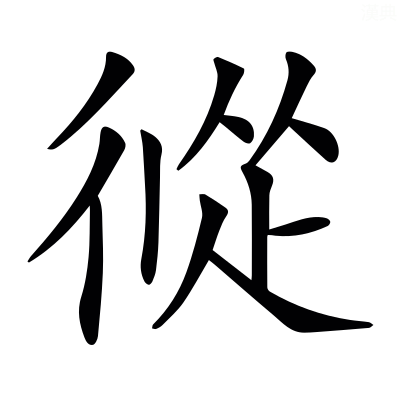
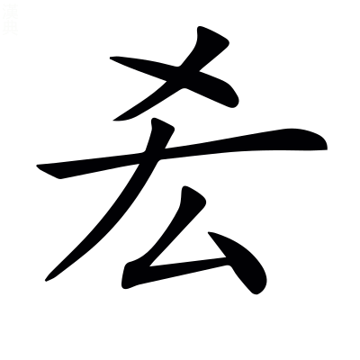
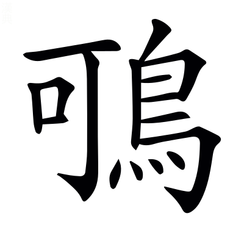

# <!-- page111 -->文選卷第七

> 梁昭明太子撰
> 
> 文林郎守太子右內率府錄事參軍事崇賢館直學士臣李善注上

郊祀

　楊子雲甘泉賦

耕籍

　潘安仁籍田賦

畋獵上

　司馬長卿子虛賦

郊祀祭天曰郊，郊者，言神交接也。祭地曰祀，祀者，敬祭神明也。郊天正於南郊。郭外曰郊。

## 甘泉賦一首并序

> 楊子雲〔善曰〕漢書曰：楊雄，字子雲，蜀郡~~成都~~人也[^7.1.1]。雄少好學，年四十餘，自蜀來遊京師，大司馬王音召以爲門下史，薦雄待詔，歲餘，爲郎中，給事黃門，卒。桓譚新論曰：雄作甘泉賦一首，始成，夢腸出，收而內之，明日遂卒[^7.1.2]。然舊有集注者並篇內具列其姓名，亦稱臣善以相別。佗皆類此。

孝成帝時，客有薦雄文似相如者，〔善曰〕雄答劉歆書曰：雄作成都城四隅銘，蜀人有楊莊者，爲郎，誦之於成帝，以爲似相如，雄遂以此得見。

上方郊祀甘泉泰畤汾陰后土，以求繼嗣，〔善曰〕上謂成帝也。漢書曰：武帝幸甘泉，令祠官具太乙祠壇，太一所用，如雍畤物[^7.1.3]。又立后土於汾陰脽上。*孟康曰：畤音止，神靈之所止也。脽音雖。*

召雄待詔承明之庭。〔善曰〕諸以材術見知，直於承明，待詔即見，故曰待詔焉。承明，已見上文。

正月，從上甘泉還，奏甘泉賦以風。〔善曰〕漢書曰：永始四年正月，行幸甘泉。七略曰：甘泉賦「永始三年正月，待詔臣雄上。」漢書三年無幸甘泉之文，疑七略誤也。毛詩序曰：下以風刺上；音諷；不敢正言謂之諷。

其辭曰：惟漢十世，將郊上玄，〔善曰〕惟，有也，是也。十世，成帝也。上玄，天也。

定泰畤，雍神休，尊明號，晉灼曰：雍，祐也。休，美也。言見祐護以休美之祥也。明號，下同符三皇也。〔善曰〕言將祭泰畤，冀神擁祐之以美祥，因尊己之明號也。廣雅曰：將，欲也。雍音擁。

同符三皇，錄功五帝，文穎曰：符，合也。〔善曰〕言同符契於三皇，錄功勤於五帝也。

卹胤錫羨，拓迹開統。應劭曰：卹，憂也。胤，續也。錫，與也。羨，饒也。拓，廣也。時成帝憂無繼嗣，故修祠泰畤后土。言神明饒與福祥，廣迹而開統也。李奇曰：統，緒也。〔善曰〕羨，弋戰反。

於是乃命羣僚，歷吉日，協靈辰，〔善曰〕爾雅曰：命，告也。楚辭曰：歷吉日吾將行。郭璞上林賦注曰：歷，選也。爾雅注曰：辰，時也。

星陳而天行。〔善曰〕星陳天行，已見西京賦。

詔招搖與~~太~~泰陰兮[^7.1.4]，伏鉤陳使當兵。張晏曰：禮記曰，招搖在上，急繕其怒。~~太~~泰陰，歲後三辰也。服虔曰：鉤陳，神名也，紫微宮外營陳星也。〔善曰〕句陳，已見上文。鄭玄禮記注曰：當，主也。主，謂典領也。

屬堪輿以壁壘兮，捎夔魖而抶獝狂。張晏曰：堪輿，天地緫名也。孟康曰：木石之怪曰夔，如龍有角，人面。魖，耗鬼也。獝狂，亦惡鬼也。今皆捎而去之。〔善曰〕杜預左氏傳注曰：屬，託也。淮南子曰：堪輿行雄以知雌。*許慎曰：堪，天道也。輿，地道也。*說文曰：抶，擊也；丑乙切。

八神奔而警蹕兮，振殷轔而軍裝。服虔曰：自招搖遊神之屬也。張晏曰：堪輿至獝狂，八神也。〔善曰〕言上諸神，各有職役，夔魖之屬，又捎去之，故令八方之神，奔走而警蹕，殷轔之盛而以軍裝也。轔，栗忍切。漢書·武帝紀曰：用事八神。*文穎曰：八方之神也。*薛君韓詩章句曰：振，奮也。殷轔，言盛多也。軍裝，如軍戎之裝者也。

蚩尤之倫，帶干將而秉玉戚兮，飛蒙茸而走陸梁。張晏曰：玉戚，以玉爲戚柲也。晉灼曰：飛者蒙茸而亂，走者陸梁而跳，謂猛士之輩。〔善曰〕蚩尤，已見西京賦。干將，已見東京賦。禮記曰：朱干玉戚。*鄭玄曰：戚，斧也。*又考工記注曰：柲猶柄也；音祕。茸，而恭反。

齊緫緫以撙<!-- page112 -->撙，其相膠轕兮[^7.1.5]，猋駭雲~~迅~~訊[^7.1.6]，奮以方攘。晉灼曰：方攘，半散也。〔善曰〕王逸楚辭注曰：緫緫撙撙，束聚貌也。膠葛，已見上文。鄭玄禮記注曰：奮，迅也。撙，子本切。~~迅~~訊音信。攘，人羊切。

駢羅列布，鱗以雜沓兮，柴虒參差，魚頡而鳥䀪。〔善曰〕駢猶併也。張揖上林賦注曰：柴虒，不齊也。頡䀪猶頡頏也。柴，初蟻切。虒音豸。頡，胡結切。䀪，胡剛切。

翕赫曶霍，霧集而蒙合兮，半散昭爛，粲以成章。〔善曰〕翕赫，盛貌。曶霍，疾貌。爾雅曰：天氣下，地氣不應曰霧，霧與蒙同[^7.1.7]。曶音忽。

於是乘輿廼登夫鳳皇兮而翳華芝，韋昭曰：鳳皇爲車飾也。翳，隱也。服虔曰：華芝，華蓋也。〔善曰〕言以華蓋自翳也。

駟蒼螭兮六素虯，蠖略蕤綏，灕虖襂纚。〔善曰〕高唐賦曰：乘玉輿兮駟蒼螭。上林賦曰：乘鏤象，六玉虯。說文曰：虯，龍無角者。春秋命歷序曰：皇伯駕六龍。蠖略蕤綏，龍行之貌也。灕虖襂纚，龍翰下垂之貌也。蠖，於钁切。灕音離。襂音森。纚，所宜切。

帥爾陰閉，霅然陽開，晉灼曰：帥，聚也。霅，散也。〔善曰〕文子曰：與陰俱閉，與陽俱開。霅，於甲切。

騰清霄而軼浮景兮，夫何旟旐郅偈之旖旎也。張晏曰：軼過雲與倒景也。服虔曰：旖旎，從風柔弱貌。〔善曰〕薛君韓詩章句曰：騰，乘也。何休公羊傳注曰：軼，過也[^7.1.8]。浮景，流景也。神女賦曰：夫何神女之妖麗。何休公羊傳注曰：據疑問所不知者曰何。周禮曰：鳥隼爲旟，龜蛇爲旐。郅偈，竿之貌也。郅音質。偈音桀。旖，於綺切。旎，女氏切。

流星旄以電爥兮，咸翠蓋而鸞旗。〔善曰〕言星旄之流，如電之光也。周書曰：樓煩星旄者，羽旄也。*鄭玄曰：可以爲旌旗也。*高唐賦曰：蜺爲旌，翠爲蓋。蔡邕獨斷曰：天子出，前驅有鸞旗者，編羽毛，列繫橦傍。

敦萬騎於中營兮，方玉車之千乘。〔善曰〕敦與屯同。王逸楚辭注曰：屯，陳也。鄭玄儀禮注曰：方，併也。玉車，以玉飾車也。

聲駍隱以陸離兮，輕先疾雷而馺遺風。〔善曰〕廣雅曰：陸離，參差也。方言曰：馺，馳也。*郭璞曰：馺，疾也。*聖主得賢臣頌曰：追奔電，逐遺風。駍，普萌切。馺，先合切。

凌高衍之嵱嵷兮，超紆譎之清澄。孟康曰：衍，無崖岸也。紆譎，曲折也。李奇曰：嵱音踊。嵷音竦。如淳曰：嵱嵷，上下衆多貌。

登椽欒而羾天門兮，馳閶闔而入凌兢。服虔曰：椽欒，甘泉南山也。凌兢，恐懼貌也。李奇曰：羾音貢。蘇林曰：羾，至也。〔善曰〕楚辭曰：吾令帝閽開關兮，倚閶闔而望予[^7.1.9]。*王逸曰：閶闔，天門也。*兢，鉅陵切。

是時未轃夫甘泉也，廼望通天之繹繹。〔善曰〕轃與臻同。至也[^7.1.10]。通天，臺名，已見上文。薛君韓詩章句曰：繹繹，盛皃。

下陰潛以慘廩兮，上洪紛而相錯。〔善曰〕慘廩，寒貌也。廩，來感切。

直嶢嶢以造天兮，厥高慶而不可乎彌度。〔善曰〕七發曰：條上造天。孔安國尙書傳曰：造，至也。爾雅曰：彌，終也。言高不可終竟而度量也。慶音羌。度，大各切。彌或爲彊。

平原唐其壇曼兮，列新雉於林薄。鄧展曰：唐，道也。服虔曰：新雉，香草也。雉夷聲相近。〔善曰〕子虛賦曰：案衍壇曼。新雉，辛夷也，本草，辛夷一名辛引。廣雅曰：草藂生曰薄。壇，徒旦切。曼，莫旦切。

攢并閭與茇葀兮，紛被麗其亡鄂。〔善曰〕蒼頡篇曰：攢，聚也。并~~櫚~~閭，椶也[^7.1.11]。茇葀，草名也。被麗，分散貌也。風賦曰：被麗披離。鄂，垠鄂也。茇，步末切。葀音括。被，皮義切。麗音隸。

崇丘陵之駊騀兮，深溝嶔巖而爲谷。蘇林曰：駊騀音叵我。〔善曰〕駊騀，高大貌也。嶔岩，深貌也。嶔，口銜切。

離宮般以相爥兮，封巒石關施靡乎延屬。應劭曰：言秦離宮三百，武帝復往往脩理之也。〔善曰〕說文曰[^7.1.12]：，古文往字也。往往，言非一也。般，布也，與班同。三輔黃圖曰：甘泉有石關觀、封巒觀。施靡，相連貌也。施，弋尔切。鄭玄喪服傳注曰：屬，連也；屬，之欲切。

於是大厦雲譎波詭，摧嗺而成觀。孟康曰：言厦屋變巧，乃爲雲氣水波相譎詭也。摧嗺，~~林~~材木崇積貌也[^7.1.13]。〔善曰〕言大厦之高，而成觀闕也。摧，子罪切。嗺，子水切。觀，工喚切。

仰撟首以高視兮，目冥眴而亡見。〔善曰〕王逸楚辝注曰：撟，舉也。撟與矯同。冥眴，昏亂之貌。冥，莫見切。眴音縣。

正瀏濫以弘惝兮，指東西之漫漫。孟康曰：瀏，清也。服虔曰：惝，大貌也；音敞。〔善曰〕瀏濫猶言清淨而汎濫也。漫漫，無厓際之貌也。瀏音劉。

徒徊徊以徨徨兮，魂固眇眇而昏亂[^7.1.14]。〔善曰〕言迷惑也。

據軨軒而周流兮，忽坱圠而亡垠。韋昭<!-- page113 -->曰：軨，欄也。軒，檻板也。〔善曰〕軨與櫺同。周流，流行周徧也。~~軮軋~~坱圠[^7.1.15]，廣大貌也。服鳥賦曰：軮軋無垠。軨音零。坱，烏朗切。圠，烏黠切。

翠玉樹之青葱兮，璧馬犀之瞵㻞。〔善曰〕漢武帝故事曰：上起神屋，前庭植玉樹，珊瑚爲枝，碧玉爲葉。璧馬犀，言作馬及犀爲璧飾也。埤蒼曰：瞵㻞，文貌也。應劭曰：瞵音隣。晉灼曰：㻞音豳。

金人仡仡其承鍾虡兮，嵌巖巖其龍鱗。〔善曰〕孔安國尙書傳曰：仡仡，壯勇之貌也。嵌，開張之貌也。龍鱗，似龍之鱗也。仡，魚乞切。嵌，火敢切。

揚光曜之燎爥兮，垂景炎之炘炘。晉灼曰：景，大也。〔善曰〕廣雅曰：炘，熱也；音欣。

配帝居之縣圃兮，象泰壹之威神。服虔曰：曾城、縣圃、閬風，崑崙之山三重也，天帝神在其上。〔善曰〕春秋合誠圖曰：紫宮帝室，太一之精[^7.1.16]。

洪臺~~崛~~掘其獨出兮[^7.1.17]，㮹北極之嶟嶟。應劭曰：崛，特貌也。㮹，至也。晉灼曰：嶟嶟，穊緻也。〔善曰〕爾雅曰：北極謂之北辰。崛，其勿切。㮹，竹指切。嶟，千旬切。

列宿廼施於上榮兮，日月纔經於柍桭。韋昭曰：榮，屋翼也。服虔曰：柍，中央也。桭，屋梠也。〔善曰〕施，式支切。柍，於兩切。桭音辰。

雷鬱律於巖窔兮，電儵忽於牆藩。〔善曰〕鬱律，小聲也。上林賦曰：巖窔洞房。釋名曰：窔，幽也。儵忽，疾貌也。藩，籬也。窔，一吊切。

鬼魅不能自逮兮，半長途而下㒹。〔善曰〕逮，及也。爾雅曰：㒹，隕也。

歷倒景而絕飛梁兮，浮蠛蠓而撇天。張揖曰：陵陽子明經曰：倒景氣去地四千里，其景皆倒在下[^7.1.18]。如淳郊祀志注曰：在日月之上，日月返從下照，故其景倒。又曰：絕，度也[^7.1.19]。服虔曰：浮，高貌也。晉灼曰：飛梁，浮道之橋也。〔善曰〕孫炎爾雅注曰[^7.1.20]：蠛蠓，蟲，小於蚊。張揖三蒼注曰：撇，拂也。蠓，莫孔反。撇，匹列反。

左欃槍而右玄冥兮，前熛闕而後應門。晉灼曰：大人賦曰：攬欃槍以爲旗。又曰：左玄冥而右黔雷。雄擬相如，故云爾也。熛闕，赤色之闕也，南方之帝曰赤熛怒。應門，正門，在熛闕之內也。〔善曰〕應劭~~曰~~大人賦注曰[^7.1.21]：欃槍，奔星也。張揖曰：玄冥，北方黑帝佐也。熛，必遙切。

蔭西海與幽都兮，涌醴汩以生川。如淳曰：言闕之高，乃蔭西海也。〔善曰〕山海經曰：北海之內有山，名曰幽都，黑水出焉。涌醴，醴泉涌出也。方言曰：汩，疾也，于筆切。

蛟龍連蜷於東厓兮，白虎敦圉乎崑崙。〔善曰〕連蜷，長曲貌也。敦圉，盛怒貌也。春秋漢含孳曰：天一之帝居，左青龍，右白虎。*服虔曰：象崑崙山在甘泉宮中也。*蜷音拳。敦，徒昆切[^7.1.22]，與屯同。

覽樛流於高光兮，溶方皇於西清。服虔曰：高光，宮名也。晉灼曰：樛流猶繚繞。〔善曰〕樛流，高曲之貌也。溶，盛貌也。方皇即彷徨，觀名也。漢書曰：甘泉有高光旁皇；旁音傍。西清，西廂清淨之處也。上林賦曰：象輿偃蹇於西清。

前殿崔巍兮，和氏瓏玲[^7.1.23]。晉灼曰：以黃金爲璧帶，含藍田璧。瓏玲，明見皃也。〔善曰〕前殿，正殿也，諸宮皆有之。漢書曰：未央宮立前殿。

炕浮柱之飛榱兮，神莫莫而扶傾。〔善曰〕炕，舉也。舉浮柱之飛榱，言檐宇高峻，若神清淨而扶其傾危也。炕與抗古字同。毛詩曰：君婦莫莫。*毛萇曰：莫莫，清淨也。*

閌閬閬其寥廓兮，似紫宮之崢嶸。〔善曰〕閌，高也。說文曰：閬閬，高大之貌也。寥廓，虛靜貌。紫宮及崢嶸，並已見上文。閬音浪。寥音僚。

駢交錯而曼衍兮，㟎隗乎其相嬰。〔善曰〕~~駢，列也~~駢猶併也，已見上注[^7.1.24]。曼衍，分布也。埤蒼曰：㟎，山長貌。隗，高貌。嬰，繞也。衍，弋戰切。㟎，他賄切。音辠。隗，五賄切。

乘雲閣而上下兮。紛蒙籠以棍成。服虔曰：蒙籠，膠葛貌。棍成，言自然也。〔善曰〕雲閣，言高連雲也。老子曰：有物混成。棍與混同。

曳紅采之流離兮，颺翠氣之宛延。〔善曰〕言宮觀之高，故紅采翠氣，流離宛延在其側，而曳颺之[^7.1.25]。

襲琁室與傾宮兮，若登高眇遠，~~亡國~~[^7.1.26]肅乎臨淵。服虔曰：襲，繼也。桀作琁室，紂作傾宮，以此微諫也。應劭曰：登高遠望，當以亡國爲戒，若臨深淵也。〔善曰〕晏子春秋曰：夏之衰也，其王桀作爲琁室；殷之衰也，其王紂作爲傾宮。

回猋肆其碭駭兮，翍桂椒而鬱栘楊。服虔曰：回猋，回風也。〔善曰〕毛萇詩傳曰：肆，疾也。碭，過也。廣雅曰：駭，起也。翍與披同。說文曰：鬱，木聚生也。爾雅曰：棠棣，栘也。楊，楊樹也。言回風碭駭，披散桂椒，又鬱~~衆~~聚栘楊也[^7.1.27]。碭，徒浪切。栘音移。

香芬茀以穹隆兮，擊薄櫨而將榮。〔善曰〕言香氣芬茀，穹隆而盛，乃拂擊薄櫨，而及屋榮也。說文曰：薄櫨，柱上枅也。薛君韓詩章句曰：將，辝也。茀，房物切。薄，房隔切。櫨，力都切。

薌呹肸以棍批兮，聲駍隱而歷鍾。〔善曰〕薌亦香字也。禮記曰：燔燎羶薌。呹，疾貌也。說文曰：肸蠁，布也。司馬彪上林賦注曰：肸，過也[^7.1.28]。棍，同也。批，擊也。歷鍾，經歷至鍾也。呹，余日切。肸，許一切。棍，下本切。批，薄結切。駍，普耕切。

排玉戶而颺金鋪兮，發蘭蕙與藭。李奇曰：鋪，門鋪首也。〔善曰〕言風飄香氣，既排玉戶而颺金鋪，又發揚蕙蘭與藭也。長門賦曰：擠玉戶以撼金鋪。司馬注子虛賦曰：藭，似槀本[^7.1.29]。

帷弸彋其拂汩兮，稍暗暗而靚深。〔善曰〕弸彋，風吹帷帳之聲也。拂汩，鼓動之貌。暗暗，深空之貌。靚即靜字耳。弸，普萌切。彋音宏。汩，于密切。暗，烏感切。

陰陽清濁穆羽相和兮，若夔牙之調琴。張晏曰：聲細不過羽，穆然相和也。〔善曰〕莊子：黃帝曰「一清一濁，陰陽調和。」尙書曰：夔典樂，教冑子。列子曰：伯牙善鼓琴。

般倕棄其剞劂兮，王爾投其鉤繩。應劭曰：剞，曲刀也。劂，曲鑿也。〔善曰〕尙書曰：倕，汝作共工[^7.1.30]。般，魯般也；爾，王爾也，並已見西京賦。般與班同。倕音垂。

雖方征僑與偓佺兮，猶彷彿其若夢。晉灼曰：方，常也。征，行也。言宮觀之高峻，雖使仙人常行其上[^7.1.31]，恐遽不識其形觀，猶髣髴若夢也。〔善曰〕鄭玄毛詩箋曰：方，且也。征僑，姓征名僑也，司馬相如大人賦曰：厮征伯喬，漢書曰：正伯喬，並同也。餘依晉說。列仙傳曰：偓佺，槐里采藥父也。食松實，形躰生毛數寸，能飛，行逮走馬。說文曰：彷彿，相似，視不諟也。楚辭曰：時彷彿以遙見。諟即諦字；音帝。

於是事變物化，目駭耳回，〔善曰〕蒼頡篇曰：駭，驚也。回，謂回皇也。

蓋天子穆然，珍臺閒館，琁題玉英，蜵蜎蠖濩之中。應劭曰：題，頭也。榱椽之頭，皆以玉飾，言其英華相爥也。張晏曰：蜵蜎蠖濩，刻鏤之形也。〔善曰〕范子曰：玉英出藍田。孝經援神契曰：玉英，玉有英華之色。閒音閑。蜵音淵。蜎，於緣切。蠖，烏郭切。濩，胡郭切。

惟夫所以澄心清魂，儲精垂恩，〔善曰〕鄭玄毛詩箋曰：惟，思也。文子曰：澄心清意。言儲蓄精神，冀神垂恩也。

感動天地，逆釐三神者；服虔曰：釐，福也。韋昭曰：逆，迎也，迎受福釐也。〔善曰〕三神，天地人也。釐音熙。

迺搜逑索偶，皐伊之徒，冠倫魁能，韋昭曰：搜，擇也。逑，匹也。索，求也。偶，對也。應劭曰：冠其群倫。魁，桀也。〔善曰〕皐，皐繇，堯臣也。伊，伊尹，湯臣也。

函甘棠之惠[^7.1.32]，挾東征之意，〔善曰〕毛詩序曰：甘棠，美邵伯也。又曰：東山，周公東征也。

相與齊乎陽靈之宮。〔善曰〕韓康伯周易注曰：洗心曰齊。齊，側皆反。祭天之所，故曰陽靈。

靡薜荔而爲席兮，折瓊枝以爲芳。〔善曰〕靡，謂偃靡之，藉地而爲席也。楚辭曰：折瓊枝以繼佩。

~~吸~~噏清雲之流瑕兮[^7.1.33]，飲若木之露英。〔善曰〕淮南子曰：志厲青雲，非夸矜也。司馬相如大人賦曰：呼吸沆瀣餐朝霞。霞與瑕古字通。山海經曰：灰野之山有赤樹，青葉，名曰若木。露英，英之含露者。

集乎禮神之囿，〔善曰〕禮神，謂祭天也。

登乎頌祇之堂。晉灼曰：后土歌祭之處也。〔善曰〕爲歌頌以祭地祇。

建光燿之長旓兮，昭華覆之威威。服虔曰：昭，明也。華覆，華蓋也。〔善曰〕埤蒼曰：旓，旌旗斿也。旓，所交切。威猶葳蕤也。

攀琁璣而下視兮，行遊目乎三危。〔善曰〕漢書曰：北斗七星，所謂琁璣玉衡。楚辭曰：忽反顧以游目。尙書曰：導黑水，至于三危。

陳衆車於東阬兮，肆玉軑而下馳。如淳曰：東阬，東海也；苦庚切。晉灼曰：軑，車轄也。韋昭曰：軑，徒計切。〔善曰〕賈逵國語注曰：肆，恣也。楚辭曰：齊玉軑而並馳。軑音大。

漂龍淵而還九垠兮，窺地底而上回。應劭曰：龍淵在張掖。服虔曰：九垠，九重也。〔善曰〕言從東阬下馳，遂浮龍淵，而繞其九重，乃窺地底而上歸也。說文曰：漂，浮也。莊子曰：千金之珠，在九重之淵驪龍頷下。廣雅曰：垠，厓也，厓亦重之義也。還音旋。

風~~漎漎~~而扶轄兮[^7.1.34]，鸞鳳紛其銜蕤[^7.1.35]。〔善曰〕~~漎漎~~，疾皃也，音竦。晉灼曰：蕤，綏也。

梁弱水之濎濙兮，躡不周之逶蛇。服虔曰：崑崙之東有弱水，渡之若濎濙耳。〔善曰〕濎濙，小水貌也。字林曰：濙，絕小水也。廣雅曰：躡，履也。山海經曰：西海之外，有山不合，名曰不周。逶蛇，欲平貌也。濎，吐定切。濙音熒。蛇音移。

想西王母欣然而上壽兮，屏玉女而却宓妃。〔善曰〕言既臻西極，故想王母而上壽，乃悟好色之敗德，故屏除玉女而及宓妃，亦以此微諫也。山海經曰：玉山，西王母所居也。神異經曰：東荒中有大石室，東王公居之，常與玉女共投壺。宓妃，已見東京賦。

玉女亡所眺其清矑兮，宓妃曾不得施其蛾眉。服虔曰：矑，目童子也。〔善曰〕毛詩曰：螓首蛾眉。

方攬道德之精剛兮，侔神明與之爲資。晉灼曰：等天地之計量也。〔善曰〕說文曰：攬，撮持也；音覽。精剛，精微剛強也。

於是欽<!-- page115 -->柴宗祈，〔善曰〕恭敬燔柴，尊崇所祈也。尙書曰：至于岱宗，柴。

燎薰皇天，應劭曰：牲玉之香也。

~~皐~~招搖泰壹[^7.1.36]。如淳曰[^7.1.37]：招作皐，皐，挈皐也。積柴於挈皐頭，置牲玉於其上，舉而燒之，欲近天也。張晏曰：招搖、泰一，皆神名。〔善曰〕搖與遙同。

舉洪頤，服虔曰：洪頤，旌名也。應劭曰：旌斾布也。

樹靈旗。李奇曰：欲伐南越，告禱太一，畫旗，樹太一壇上，名靈旗，以指所伐之國也，見漢書郊祀志。

樵蒸昆上，配藜四施。張晏曰：配藜，披離也。〔善曰〕言燔燎之盛，故樵蒸之光同上，而披離四布也。周禮曰：共祭祀之薪蒸。*鄭玄曰：麄曰薪，細曰蒸。*說文曰：昆，同也。昆或爲焜，字書曰：焜煌，火貌。

東爥滄海，西耀流沙。北熿幽都，南煬丹厓。服虔曰：丹水之厓也。〔善曰〕尙書曰：弱水餘波入于流沙。幽都，已見吳都賦。熿與晃音義同。方言曰：煬，炙也。

玄瓚觩䚧，秬鬯泔淡。服虔曰：以玄玉飾之，故曰玄瓚。張晏曰：瓚受五升，口徑八寸，以大圭爲柄，用灌鬯。觩䚧，其貌也。應劭曰：泔淡，滿也。〔善曰〕孔安國尙書傳曰：黑黍曰秬，釀以鬯草。觩音求。䚧，力幽切。泔，胡敢切。淡，大敢切。

肸蠁豐融，懿懿芬芬。〔善曰〕言秬鬯分布，芬芳盛美也。肸蠁，已見上文。

~~炎~~焱感黃龍兮[^7.1.38]，熛訛碩麟。韋昭曰：碩，大也。〔善曰〕言焱熛熾盛，感動神物也。字林曰：焱，火光也。說文曰：熛，火飛也。毛萇詩傳曰：訛，動也。熛，必遙切。

選巫咸兮叫帝閽，開天庭兮延羣神。服虔曰：令巫祝叫呼天門也。〔善曰〕山海經曰：大荒中有靈山，巫咸從此升降。王逸楚辭注曰：巫咸，古神巫也。楚辝曰：吾令帝閽~~闢~~開關兮[^7.1.39]。鄭玄禮記注曰：延，導也。

儐暗藹兮降清壇，瑞穰穰兮委如山。張晏曰：儐，贊也。〔善曰〕鄭玄周禮注曰：接賓曰儐，然謂贊禮者也。暗藹，衆盛貌也。委，積也。暗，烏感切。

於是事畢功弘，迴車而歸，度三巒兮偈棠~~黎~~棃[^7.1.40]。晉灼曰：黃圖無三巒，相如傳有封巒觀。〔善曰〕三巒即封巒觀也。漢書曰：甘泉有封巒、棠黎。韋昭曰：偈，息也；音憇。

天閫決兮地垠開，八荒協兮萬國諧。〔善曰〕鄭玄禮記注曰：閫，門限也。決，亦開也。言門決以出德澤，故八荒万國，俱協諧也。

登長平兮雷鼓礚，天聲起兮勇士厲。如淳曰：長平，坂名，在池陽南。〔善曰〕字指曰：礚，大聲也；口蓋切。天聲，如天之聲，言其大也。杜預左氏傳注曰：厲，猛也。

雲飛揚兮雨滂沛，于胥德兮麗萬世。〔善曰〕言恩澤之多，若雲行雨施，君臣皆有聖德，故華麗至于万世也。毛詩曰：于胥樂兮。*鄭玄曰：于，於也。胥，皆也。*麗，光華也[^7.1.41]。

亂曰：〔善曰〕王逸楚辭注曰：亂，理也，所以發理辭指，揔撮所要也。

崇崇圜丘，隆隱天兮。〔善曰〕崇崇，高貌也。廣雅曰：圜丘，大壇，祭天也。

登降峛崺，單埢垣兮。〔善曰〕登降，上下也。峛崺，邪道也。單，大貌。埢垣，圜貌。峛，力爾切。崺，弋爾切。單音蟬。埢音拳。

增宮㠁差，駢嵯峨兮。〔善曰〕㠁與參同，初林切。駢，步千切。嵯，材何切。峨音俄。

岭巆嶙峋，洞無厓兮。〔善曰〕埤蒼曰：岭巆嶙峋，深無厓之貌。岭音零。巆音熒。嶙音鄰，峋音旬。

上天之縡，杳旭卉兮。〔善曰〕縡，事也。杳，深遠也。旭卉，~~幽昧之貌~~難知也[^7.1.42]。毛詩曰：上天之載，無聲無臭。縡與載同。

聖皇穆穆，信厥對兮。李奇曰：對，配也，能與天相對配也。〔善曰〕詩曰：帝作邦作對。

徠祇郊禋[^7.1.43]，神所依兮，〔善曰〕言來郊禋而甚敬，故爲神祇之所依也。徠，古來字。

徘徊招搖，靈~~迉迡~~屖迡兮[^7.1.44]。〔善曰〕招搖猶彷徨也。迉迡，即棲遟也。毛萇詩傳曰：棲遟，遊息也。招，必遙切。~~迉音棲~~屖音棲。迡，大夷反。

光煇眩燿，降厥福兮。子子孫孫，長無極兮。

[^7.1.1]: 考異：注「蜀郡成都人也」　袁本、茶陵本無「成都」二字。
[^7.1.2]: 考異：注「明日遂卒」　何云據班書，非新論本然也。今案：此蓋「卒」字有誤。文賦注引新論作「及覺，病喘痵少氣」，或「卒」當作「病」。
[^7.1.3]: 考異：注「如雍畤物」　袁本、茶陵本無「物」字。
[^7.1.4]: 考異：詔招搖與太陰兮　茶陵本云「太」善作「泰」，袁本作「太」，用五臣也。漢書正作「泰」。
[^7.1.5]: 考異：其相膠轕兮　案：「轕」當作「葛」。注云「膠葛已見上文」，謂見吳都賦「東西膠葛」也。蓋善作「葛」，五臣作「轕」，各本亂之。漢書正作「葛」。羽獵賦「從橫膠轕」，漢書作「轕」，善及顏皆音葛。此及彼，皆同漢書耳。
[^7.1.6]: 考異：猋駭雲迅　茶陵本云「迅」善作「訊」。袁本作「迅」，用五臣也。漢書正作「訊」。
[^7.1.7]: 考異：注「地氣不應曰霧霧與蒙同」　陳云別本兩「霧」字並作「雺」。案：今未見。考爾雅釋文，「雺」或作「霧」，字同，亡公、亡侯二反。善引即「或作」而讀「亡公反」也。
[^7.1.8]: 考異：注「何休公羊傳注曰軼過也」　袁本、茶陵本無此十字。
[^7.1.9]: 考異：注「令帝閽開閶闔而望予」　案：「令」上當有「吾」字，「開」下當有「關兮倚」三字。各本皆脫。
[^7.1.10]: 考異：注「至也」　袁本、茶陵本無此二字，有「或作輳」三字，乃校語錯入注。
[^7.1.11]: 考異：注「并櫚椶也」　袁本、茶陵本「櫚」作「閭」，是也。
[^7.1.12]: 考異：注「說文曰」　袁本、茶陵本無此三字，有「往往作」四字，乃校語錯入注。
[^7.1.13]: 考異：注「林木崇積貌也」　案：「林」當作「材」，漢書注可證。各本皆譌。
[^7.1.14]: 考異：魂眇眇而昏亂　袁本、茶陵本「魂」下有「魄」字，云善本去「魂」作「魄固」。案：漢書作「魂固」，蓋善自作「魂固」。袁、茶陵所見「魂」作「魄」者，非。尤本誤涉五臣脫「固」字，益非。
[^7.1.15]: 考異：注「軮軋」　袁本、茶陵本「軮軋」作「坱圠」，下「軮軋無垠」同。案：二本是也。正文善「坱圠」及音皆可證。
[^7.1.16]: 考異：注「善曰春秋」下至「太一之精」　袁本、茶陵本無此十六字。
[^7.1.17]: 考異：洪臺崛其獨出兮　茶陵本云「崛」善作「掘」。袁本作「崛」，用五臣也。漢書正作「掘」。
[^7.1.18]: 考異：注「其景皆倒在下」　袁本、茶陵本無此六字。
[^7.1.19]: 考異：注「又曰絕度也」　袁本、茶陵本無此五字，有「在下」二字。
[^7.1.20]: 考異：注「孫炎爾雅曰」　何校「曰」上添「注」字，是也。陳云別本有。
[^7.1.21]: 考異：注「應劭曰大人賦注曰」　案：「劭」下當去「曰」字。各本皆衍。
[^7.1.22]: 考異：注「敦徒昆切」　袁本、茶陵本此下有「與屯同」三字，是也。
[^7.1.23]: 考異：和氏玲瓏　袁本作「瓏玲」，云善作「玲瓏」。茶陵本云五臣作「瓏玲」。案：各本所見皆非也。陳云漢書作「瓏玲」，此韻腳，不容同異，當乙。其說是矣。凡袁、茶陵皆據所見爲校語，非必善真如此，每有牴牾，詳見各條下。注「玲瓏，明見貌也」，亦當乙。漢書注可證。太玄、法言皆有「瓏玲」，亦可互證。法言「玲」作「」同字也。
[^7.1.24]: 考異：注「善曰駢列也」　袁本無「列也」二字，有「已見上文」四字。案：尤本此處脩改，必初刻同。袁本謂「駢猶併也，已見上注」也。茶陵本複出之，亦可證所改之非。
[^7.1.25]: 考異：注「而曳颺之」　袁本、茶陵本無此四字。
[^7.1.26]: 考異：若登高眇遠亡國　袁本「眇」下有「而」字，「遠」下無「亡國」二字，云善正文作「登高眇遠亡國」。茶陵本云五臣作「若登高眇而遠」。陳云漢書無「亡國」二字。今案：各本所見皆非也。注應劭曰「當以亡國爲戒」者，但說賦意，非舉賦文也。傳寫善本因注引應而誤添正文。又五臣衍「而」字，漢書亦無。
[^7.1.27]: 考異：注「又鬱衆栘楊也」　案：「衆」當作「聚」，漢書注「而栘楊鬱聚也」可證。陳云別本「聚」。
[^7.1.28]: 考異：注「司馬彪上林賦注曰肸過也」　袁本、茶陵本無此十一字。
[^7.1.29]: 考異：注「長門賦曰」下至「藭似槀本」　袁本、茶陵本無此二十三字。
[^7.1.30]: 考異：注「倕汝作共工」　袁本、茶陵本「倕」上有「咨」字，無「作」字。
[^7.1.31]: 考異：注「雖使仙人行其上」　案：「行」上當有「常」字，漢書注可證。各本皆脫。
[^7.1.32]: 考異：函甘棠之惠　袁本、茶陵本云「惠」善作「恩」，蓋所見不同也。漢書作「惠」。
[^7.1.33]: 考異：吸清雲之流瑕兮　茶陵本「吸」作「噏」，云五臣作「吸」。袁本作「吸」，用五臣也。漢書正作「噏」。
[^7.1.34]: 考異：風漎漎而扶轄兮　袁本云「漎」善作「從」。茶陵本作「」，云五臣作「漎」。案：茶陵是也。尤誤以五臣亂善，非也。漢書作「傱」。集韻二腫有「，傱」，云「，疾貌，或从人」。上字據此，下字據漢書也。袁本當云「善作」，今有誤。羽獵賦「萃傱沇溶」，五臣亦作「漎」，可互證。
[^7.1.35]: 考異：鸞鳳紛其銜蕤　陳云「銜」漢書作「御」，顏注或作「銜」，俗妄改也。今案：五臣注作「銜」，有明文，善注不見此字，或未必與五臣同，但無可考。袁、茶陵二本亦不著校語也。
[^7.1.36]: 考異：皐搖泰壹　案：「皐」當作「招」，茶陵本作「皐」，云五臣作「招」。今考漢書作「招」，善與之同，故如淳解讀作「皐」，張晏解「招如字」，而兩引之。不知者但據如解改爲「皐」，而張解不可通矣。袁本作「招」，不著校語，可知非五臣與善異，所見當未誤。
[^7.1.37]: 考異：注「如淳曰」　袁本、茶陵本「曰」下有「招作皐」三字。案：有者是也，說已見上。尤因所見賦誤「招」爲「皐」，遂刪此注，以就正文，失之矣。
[^7.1.38]: 考異：炎感黃龍兮　案：「炎」當作「焱」。據善注云「言焱熛熾盛，感動神物也」。字林曰：「焱，火光也」云云，作「焱」甚明。其五臣注作「炎」，各本亂之。漢書作「炎」，則與此不必全同也。
[^7.1.39]: 考異：注「吾令帝閽闢開兮」　袁本、茶陵本無「闢」字。案：當於「開」下添「關」字。各本皆譌。
[^7.1.40]: 考異：偈棠黎　茶陵本「黎」作「棃」，云五臣作「黎」。袁本作「黎」，用五臣也。漢書正作「棃」。案：此尤本以五臣亂善，非也。
[^7.1.41]: 考異：注「麗光華也」　袁本、茶陵本無此四字。
[^7.1.42]: 考異：注「幽昧之貌」　袁本、茶陵本作「難知也」三字，是也。
[^7.1.43]: 考異：徠祇郊禋　茶陵本「祇」作「祗」，云善作「祇」。案：茶陵所見及尤本非也。顏注漢書與善此注皆以「敬」解「祗」，其非異字可知。袁本作「祗」而不著校語，所見當未誤。
[^7.1.44]: 考異：靈迉迡兮　茶陵本「迉迡」作「棲遟」，云善作「迉迡」。案：茶陵所見及尤本皆非也。袁本云「棲遟」善作「屖迡」；其載善音則云「屖音棲」。漢書作「遟」，顏注「遟音栖」。考集韻十二齊有「屖」「遟」，別無「迉」字重出其下。然則但傳寫誤耳。當依袁所見訂正。陳云「迡」當作「」，從漢書校也。

耕藉臣瓚漢書注曰：景帝詔曰「朕親耕。」本以躬親爲義。藉，謂蹈藉之也。

## 藉田賦一首

臧榮緒晉書曰：泰始四年正月丁亥，世祖初藉于千畒，司空掾潘岳作藉田頌也。

> 潘安仁臧榮緒晉書：潘岳，字安仁，滎陽中牟人。揔角辯惠，摛藻清豔，鄉邑稱爲奇童。弱冠辟司空太尉府，舉秀才，高步一時，爲衆所疾。然藉田西征，咸有舊注，以其釋文膚淺，引證疏略，故並不取焉。

伊晉之四年正月丁未，皇帝親率群后，藉于千畒之甸，禮也。晉書曰：丁亥藉田，戊子大赦。今爲丁未，誤也。千畒，已見西京賦。禮記曰：天子籍田千畒[^7.2.1]。

於是乃使甸帥清<!-- page116 -->畿，野廬掃路。周禮曰：甸師掌帥其屬，而耕耨王籍。*鄭玄曰：師猶長也。*然師而爲帥者，避晉景帝諱也。周禮曰：野廬氏，掌達國之道路也。

封人壝宮，掌舍設枑。周礼曰：封人，掌設王之社壝，爲畿封而樹之。*鄭玄曰：聚土曰封。壝謂壇及堳埒也。*周禮曰：掌舍，掌王之會同之舍，設梐柜再重[^7.2.2]。杜子春讀爲梐枑，梐枑，行馬也。壝，以季切[^7.2.3]。枑音互。

青壇蔚其嶽立兮，翠幕黕以雲布。國語：虢文公曰「古者王命司空，除壇于藉。」楊脩許昌宮賦曰：華殿炳而嶽立。鄭玄周禮注曰：帷覆上曰幕。魏文帝愁霖賦曰：玄雲黕其四塞。黕，黑貌也。封禪書曰：雲布霧散。黕，丁敢切。

結崇基之靈趾兮，啓四塗之廣阼。崇基，謂壇也。於壇四面而爲階也。說文曰：趾，基也。又曰：阼，主階也。

沃野墳腴，膏壤平砥。墳腴、平砥，已見上文。史記曰：京師膏壤，沃野千里。毛詩曰：周道如砥[^7.2.4]。

清洛濁渠，引流激水。子虛賦曰：激水推移。

遐阡繩直，邇陌如矢。史記曰：秦孝公壞井田，開阡陌。風俗通曰：南北曰阡，東西曰陌。繩直，已見上文。詩曰：其直如矢。

繱犗服于縹軛兮，紺轅綴於黛耜。繱犗，帝耕之牛也。說文曰：繱，帛青色；音蔥。犗牛，已見吳都賦。又曰：縹，帛青白色。轅軛，犂轅軛也。鄭玄周禮注曰：轅端壓牛領曰軛；於革切。說文曰：紺，染青而揚赤色也。鄭玄禮記注曰：耜，耒之金。

儼儲駕於廛左兮，俟萬乘之躬履。駕牛儼然，在於廛左，以待天子躬親履之，耕以儲畜，故曰儲駕也。說文曰：儼，好貌也。晉灼漢書注曰[^7.2.5]：廛，一百畒也。然古耕以耒，而今以牛者，蓋晉時創制，不㳂於古也。

百僚先置，位以職分。百僚，已見上文。羽獵賦曰：先置乎白楊之南。漢書曰：六卿各有徒屬職分也。

自上下下，具惟命臣。周易曰：自上下下，其道大光。西京賦曰：具惟帝臣。鄭玄儀禮注曰：命者，加爵服之名。

襲春服之萋萋兮，接游車之轔轔。司馬彪上林賦注曰：襲，服也。禮記曰：孟春，衣青衣。春服，已見魏都賦。薛君韓詩章句曰：萋萋，盛也。文穎漢書注曰：天子出，游車九乘。毛詩曰：有車轔轔。

微風生於輕幰，纖埃起於朱輪。幰，車幰也。釋名曰：車，所以御熱也。朱輪，見吳都賦。

森奉璋以階列，望皇軒而肅震。森，盛貌也。毛詩曰：奉璋峨峨，髦士攸宜。階，爵之次也。爾雅曰：震，懼也。

若湛露之晞朝陽，~~似~~衆星之拱北辰也[^7.2.6]。毛詩曰：湛湛露斯，匪陽不晞。*毛萇曰：晞，乾也。*言露見日而乾，以喻諸侯承命而施敬也。論語：子曰「爲政以德，譬如北辰，居其所，而衆星共之。」

於是前驅魚麗，屬車鱗萃。周禮曰：王出入，則自左馭而前驅。*鄭玄曰：前驅，如今導引也。*魚麗，已見東京賦。屬車，已見西京賦。子虛賦曰：珍怪鳥獸，萬端鱗萃。

閶闔洞啓，參塗方駟。洛陽宮舍記曰：洛陽有閶闔門。西京賦曰：旁開三門，參塗夷庭。羽獵賦曰：方~~駕~~馳千駟[^7.2.7]。

常伯陪乘，太僕秉轡。尙書曰：左右常伯。應劭~~曰~~漢官儀曰[^7.2.8]：侍中，周成王常伯任侍中，殿下稱制，出即陪乘。鄭玄周禮注曰：陪乘，參乘也。漢舊儀曰：漢乘輿大駕儀，公卿奉引，太僕御也。

后妃獻穜稑之種，司農撰播殖之器。周禮曰：上春，詔王后帥六宮之人，而生穜稑之種，而獻于王。*鄭司農曰：先種後熟謂之穜，後種先熟謂之稑。*漢書曰：大農令，武帝更名大司農。孔安國論語注曰：撰，具也。史記曰：后稷播~~植~~殖百穀[^7.2.9]。孔安國尙書傳曰：播，布也。蒼頡篇曰：殖，種也。

挈壺掌升降之節，宮正設門閭之蹕。周禮有挈壺氏。周禮曰：宮正，凡邦之事，蹕宮中。*鄭玄曰：正，長也。宮中之長也。鄭司農曰：蹕，謂止行者，清道，若今時警蹕。*

天子乃御玉輦，蔭華蓋。臧榮緒晉書曰：大駕鹵簿有大輦華蓋中道。玉輦，大輦也。華蓋，已見西京賦。

衝牙錚鎗，綃紈綷䌨。禮記曰：凡帶必有佩，佩玉有衝牙。鄭玄曰：衝牙[^7.2.10]，居中央，以前後觸也。錚鎗，玉聲也。錚，~~义~~叉耕切。鎗，~~义~~叉行切。鄭玄禮記注曰：綃，綺屬也。許慎淮南子注曰：紈，素也。漢書班婕妤賦曰：紛綷䌨兮紈素聲。綃，思樵切。紈音丸。綷，七悴切。䌨，七大切。

金根照耀以烱晃兮，龍驥騰驤而沛艾。司馬彪續漢書曰：漢承秦制，御爲乘輿，金根安車，五采文畫輈。西京賦曰：乃奮翅而騰驤。龍驥沛艾，已見上文。

表朱玄於離坎，飛青縞於震兌。中黃曅以發揮，方綵紛其繁會。謂鹵簿之儀，車騎旌旗，各依方色。表猶摽也。周易曰：離，南方之卦也；坎者，正北方之卦也；震者，東方；兌，正西秋也。周禮曰：東方謂之青，南方謂之赤，西方謂之白，北方謂之黑。毛萇詩傳曰：縞，白色<!-- page117 -->也。縞，古老切。周禮曰：地謂之黃。臧榮緒晉書：鹵簿，曰青立車、青安車、赤立車、赤安車、黃立車、黃安車、白立車、白安車、黑立車、黑安車，合十乘，並駕駟，建旗十二，如車色。

五~~輅~~路鳴鑾[^7.2.11]，九旗揚斾。周禮曰：王之五路：一曰玉路，二曰金路，三曰象路，四曰革路，五曰木路。又曰：掌九旗之物名，日月爲常，蛟龍爲旂，通帛爲旃；雜帛爲物，熊虎爲旗，鳥隼爲旟；龜蛇爲旐，全羽爲旞，析羽爲旌。

瓊鈒入，雲罕晻藹。臧榮緒晉書曰：雲罕車駕駟，~~戟車載~~闟戟車載戟[^7.2.12]。闟與鈒音義同也。蒼頡篇曰：，聚也。楚辭曰：揚雲霓之晻藹。鈒音吸。晻音烏感切。

簫管嘲哳以啾嘈兮，鼓鞞硡隱以砰礚。簫管，已見上文。楚辭曰：鵾雞嘲哳而悲鳴。蒼頡篇曰：啾，衆聲也。嘈，已見上文。周禮曰：鍾師掌鞞。*鄭玄曰：擊鞞以和樂。*字林曰：鼙，小鼓也。鞞與鼙同；步迷切。硡與訇音義同；火宏切。字書曰：砰，大聲也。字指曰：礚，大聲也。砰，披萌切。礚，苦蓋切。

筍簴嶷以軒翥兮，洪鍾越乎區外。筍簴、軒翥，已見西京賦。天子之行，擊左右鍾，已見西都賦。

震震~~填填~~闐闐[^7.2.13]，塵騖連天，以幸乎藉田。震震，盛也。郭璞爾雅注曰：闐闐，群行聲也。東觀漢記曰：王邑旗幟蔽野，埃塵連天。騖或爲霧，非也。

蟬冕熲以灼灼兮，碧色肅其千千[^7.2.14]。蟬冕，已見魏都賦。千千，碧貌。

似夜光之剖荆璞兮，若茂松之依山也。

---

於是我皇乃降靈壇，撫御耦。降，謂臨幸也。應劭漢官儀曰：天子東耕之日，天子升壇，~~上~~壇空無祭[^7.2.15]，天子耕於壇，舉耒，三推而已。論語曰：長沮桀溺耦而耕。*鄭玄曰：耜廣五寸，二耜爲耦。*王逸楚辭注曰：撫，持也。

坻場染屨，洪縻在手。方言曰：坻，場也。蚍蜉犂鼠之場，謂之坻場，浮壤之名也；音傷。說文曰：縻，牛轡也；忙皮反。

三推而舍，庶人終畒。三推，已見上文。國語：虢文公曰「王耕一墢，班三之，庶人終于千畒。」*韋昭曰：一墢，一耜之墢也。班，次也。三之，下各三其上。王一，公三，卿九，大夫二十七，庶人盡耕也。*既云以牛而又言推者，蓋㳂古成文，不可以文而害實也。墢，扶發切。然國語與禮記不同，而潘雜用之。

貴賤以班，或五或九。禮記曰：帝藉，三公五推，卿諸侯九推。

于斯時也，居靡都鄙，民無華裔。都，謂京邑也。杜預左傳注：鄙，邑也[^7.2.16]。左傳：孔子曰「裔不謀夏，夷不亂華。」王肅家語注曰：裔，邊裔也。

長幼雜遝以交集，士女頒斌而咸戾。雜遝，衆多貌也。頒斌，相雜之貌也。爾雅曰：戾，至也。

被褐振裾，垂髫總髮[^7.2.17]，老子曰：被褐而懷玉。杜預左氏傳注曰：振，整也。說文曰：褐者，粗衣也。爾雅曰：衱，謂之裾。*郭璞曰：衣後裾也。*衱音劫。魏志，毛玠曰：臣垂髫執簡，埤蒼曰：髫，髦也；大聊切。毛詩曰：緫角之宴。*毛萇曰：緫角，結髮也。*

躡踵側肩，掎裳連襼。說文曰：躡，追也。躡其踵，所以爲追逐也。聲類曰：踵，足根也。史記：馮驩曰「夫朝趨市者，側肩爭門而入。」賈逵國語注曰：從後牽曰掎。方言曰：複襦，江湖之間或謂之簫襼。郭璞方言注曰：襼，即袂字。說文曰：袂，袖也。

黃塵爲之四合兮，陽光爲之潛翳。山陽公載記曰：賈詡鳴鼓雷震，黃塵蔽天。西都賦曰：紅塵四合。

動容發音而觀者，莫不抃儛乎康衢，謳吟乎聖世。列子曰：一里老幼，喜躍抃儛。康衢，已見上文。~~吾~~虞丘壽王驃騎論功曰[^7.2.18]：遊童牧竪，詠德謳吟。

情欣樂於昏作兮，慮盡力乎樹蓺。昏作，已見西京賦。韓詩外傳曰：子路治蒲，孔子曰「我入其境，田疇甚易，草萊甚辟，故其人盡力也。」周禮曰：正月之吉，頒職事，二日樹蓺。鄭玄毛詩箋曰：蓺猶樹也。

靡誰督而常勤兮，莫之課而自厲。說文曰：誰，何也，謂責問之也。字書曰：督，察也。王逸楚辭注曰：課，試也。

躬先勞以說使兮，豈嚴刑而猛制~~之~~哉[^7.2.19]。周易曰：說以使民，民忘其勞。史記曰：秦繁法嚴刑，而天下不振。

有邑老田父，或進而稱曰：蓋損益隨時，理有常然。周易曰：損益盈虛，與時偕行。又曰：隨時之義大矣哉。晏子春秋曰：物有必至，事有常然，古之道也。

高以下爲基，民以食爲天。老子曰：貴必以賤爲本，高必以下爲基。漢書：酈食其曰「王者以人爲天，而民以食爲天。」

正其末者端其本，善其後者慎其先。言治國之道，以商爲末，而農爲本，以貨爲後，而食爲先也。陸賈新語注曰：治末者調其本。李奇漢書注曰：本，農也。末，賈也。漢書：詔曰「農，天下之本也，而人或不務本而事末，故生不遂。」禮記曰：善終者如始。尙書大傳曰：八政何以先食。傳曰：食者萬物之始。人事之本也，故八政先食。

夫九土之宜弗任，<!-- page118 -->四人之務不壹。國語：展禽曰「共工氏之子曰后土，能平九土。」*韋昭曰：九土，九州之土。*尙書曰：禹別九州，任土作貢。管子曰：士農工商四民者，國之正民也。孔安國尙書傳曰：壹，專一也。

野有菜蔬之色，朝靡代耕之秩。禮記曰：三年耕，必有一年食，雖有凶旱水溢，人無菜色。又曰：夫祿足以代其耕。

無儲稸以虞災，徒望歲以自必。言無儲稸以度荒災，空自必望於歲也。崔寔四民月令曰：十月，五穀既登，家有儲稸。禮記曰：國無九年之蓄，曰不足。韋昭曰：虞，度也。左氏傳：王曰「余一人閔閔焉，如農夫之望歲也。」

三季之衰，皆此物也。國語：郭偃曰「夫三季王之亡，宜也。」*韋昭曰：季，末也。三季王，桀紂幽王也。*

今聖上昧旦丕顯，夕惕若慄。昧旦丕顯，已見東京賦。周易曰：君子夕惕若厲。爾雅曰：慄，懼也。

圖匱於豐，防儉於逸。言常節約以戒不虞，故圖乏者必於豐殷，禦儉者在於奢逸也。廣雅曰：儉，少也。

欽哉欽哉，惟穀之卹[^7.2.20]。尙書曰：欽哉欽哉，惟刑之恤哉。

展三時之弘務，致倉廩於盈溢。國語：虢文公曰「三時務農，一時講武。」*韋昭曰：三時，春夏秋也。*管子曰：倉廩實則知禮節。蔡邕月令章句曰：穀藏曰倉，米藏曰廩。

固堯湯之用心，而存救之要術也。漢書：董仲舒對策曰「陛下親耕籍田，以爲農先，此亦堯舜之用心也。」

若乃廟祧有事，祝宗諏日。廟祧，已見西京賦。禮記曰：宗祝在廟。*鄭玄曰：宗，宗人也。祝，接神者也。*毛詩箋曰：后稷既爲郊祀之酒，則諏謀其日。應劭漢書注曰：諏，謀也。

簠簋普淖，則此之自實。周禮曰：舍人，凡祭祀共簠簋，實之陳之。儀禮曰：孝孫某敢用嘉薦普淖[^7.2.21]。*鄭玄曰：~~普淖~~黍稷也。普，大也。淖，和也。德能大和，乃有黍稷，故以爲號云。淖，乃孝切。*

縮鬯蕭茅，又於是乎出。左氏傳：管仲曰「尔貢苞茅不入，王祭不供，无以縮酒。」周禮曰：鬯人，釀秬以爲酒。又曰：甸師，祭祀共蕭茅。*杜子春曰：蕭，香蒿也。鄭玄曰：既薦，然後爇蕭，合馨香，茅以縮酒。*國語：虢文公曰「上帝之粢盛，於是乎出。」

黍稷馨香，旨酒嘉栗。左氏傳：季良「奉酒醴以告曰『嘉栗旨酒』，謂其上下皆有嘉德而無違心，所謂馨香，無讒慝。」*杜預曰：栗，謹敬也。*

宜其民和年登，而神降之吉也[^7.2.22]。左氏傳：季梁「奉粢盛以告曰『潔粢豐盛』，謂其三時不害，而人和年豐也。」鄭玄周禮注曰：登，成也。左氏傳曰：致其禋祀，於是乎人和而神降之福。

古人有言曰「聖人之德，無以加於孝乎。夫孝，天地之性，人之所由靈也。」孝經：曾子曰「敢問聖人之德，無以加於孝乎？」子曰「天地之性，人爲貴，人之行，莫大於孝。夫聖人之德，又可以加於孝乎？」漢書曰：人，有生之最靈者也。

昔者明王以孝治天下[^7.2.23]，其或繼之者，鮮哉希矣！孝經：子曰「昔者明王之以孝理天下也。」論語：子曰「其或繼周者，雖百世可知也。」

逮我皇晉，實光斯道。鄭玄毛詩箋曰：光，明也。斯道，謂孝道也。

儀刑孚于萬國，愛敬盡於祖考。毛詩曰：儀刑文王，萬國作孚。*毛萇曰：孚，信也。*孝經：子曰「愛敬盡於事親，而德教加於百姓。」

故躬稼以供粢盛，所以致孝也。尙書大傳曰：王者躬耕，所以供粢盛。五經要義曰：天子藉田千畒，所以先百姓而致孝敬也。

勸穡以足百姓，所以固本也。西京賦曰：勸穡於原陸。論語：孔子曰「百姓足，君孰與不足？」尙書曰：民惟邦本，本固邦寧。何晏論語注曰：本，基也。

能本而孝，盛德大業至矣哉。周易曰：盛德大業至矣哉。

此一役也，而二美具焉。一役，謂籍田也。二美，謂能本而孝也。左氏傳：陰飴甥曰「此一役也。秦可以霸。」

不亦遠乎，不亦重乎。論語文也。

敢作頌曰：思樂甸畿，薄采其茅[^7.2.24]。茅，即上甸師之所供者。毛詩曰：思樂泮水，薄采其芹。*毛萇曰：薄，辭也。*

大君戾止，言藉其農。周易曰：大君有命。毛詩曰：魯侯戾止，言觀其旂。*毛萇曰：戾，來也。止，至也。*

其農三推，萬方以祗。禮記曰：耕藉，然後諸侯知所以敬。爾雅曰：祗，敬也。

耨我公田，實及我私。鄭玄周禮注曰：耨，耘耔也；奴豆切。毛詩曰：雨我公田，遂及我私。

我簠斯盛，我簋斯齊。禮記曰：天子藉田，以事天地山川，以爲齊盛。毛萇詩傳曰：器實曰齊，在器曰盛。齊音資。

我倉如陵，我庾如坻。毛詩曰：我倉既盈，我庾惟億。又曰：曾孫之庾，如坻如京。*鄭玄曰：庾，露積穀也。坻，水中高地。*

念茲在茲，永言孝思。言念此黍稷，在此祭祀也。尙書：禹曰<!-- page119 -->「念茲在茲。」毛詩曰：永言孝思。

人力普存，祝史正辭。左氏傳：季梁曰「上思利人，忠也。祝史正辭，信也。故奉牲以告曰『博碩肥腯』，謂人力之普存也。」

神祇攸歆，逸豫無期。左氏傳：楚子曰「能歆神人。」*杜預曰：歆，享也。*毛詩曰：尔公尔侯，逸豫無期。

一人有慶，兆民賴之。尙書：王曰「一人有慶，兆民賴之。」

[^7.2.1]: 考異：注「禮記曰天子籍田千畝」　袁本、茶陵本無此九字。
[^7.2.2]: 考異：注「設梐枑再重」　何校「枑」改「柜」，陳同。各本皆譌。
[^7.2.3]: 考異：注「壝以委切」　袁本、茶陵本「委」作「季」，是也。
[^7.2.4]: 考異：注「毛詩曰周道如砥」　袁本、茶陵本無此七字。
[^7.2.5]: 考異：注「晉灼漢書曰」　陳云「書」下當有「注」字。各本皆脫。
[^7.2.6]: 考異：似衆星之拱北辰也　袁本、茶陵本無「似」字，晉書無。又上句末及「輕幰階列離坎發揮」下有「兮」字，袁本、茶陵本「離坎」下無，餘同。案：此等或善、五臣不同，但不著校語，無可考。
[^7.2.7]: 考異：注「方駕千駟」　袁本、茶陵本「駕」作「馳」，是也。
[^7.2.8]: 考異：注「應劭曰漢官儀曰」　陳云上「曰」字衍，是也。各本皆衍。
[^7.2.9]: 考異：注「后稷播植百穀」　袁本、茶陵本「植」作「殖」，是也。
[^7.2.10]: 考異：注「鄭玄曰衝牙」　袁本、茶陵本無此五字。
[^7.2.11]: 考異：五輅鳴鑾　案：「輅」當作「路」。各本善注中字皆作「路」。袁本所載向注則作「輅」。蓋善「路」、五臣「輅」而亂之也。晉書正作「路」。
[^7.2.12]: 考異：注「戟車載」　茶陵本「戟車」作「闟」。尤本「戟車」二字處脩改，袁本亦然。案：此當云「闟戟車載戟」，各本皆脫誤。晉書輿服志云「闒戟車，長戟邪偃向後」，是其義。「闟」、「闒」亦同字。
[^7.2.13]: 考異：震震填填　案：「填填」當作「闐闐」。各本善注中字皆作「闐」，袁、茶陵二本所載良注則作「填」，蓋善「闐」、五臣「填」而亂之也。晉書作「填」，與五臣所據同。
[^7.2.14]: 考異：碧色肅其千千　袁本、茶陵本作「芊芊」。案：尤本是也。高唐賦「肅何千千」，安仁用其語。袁、茶陵作「芊芊」者，五臣字如此，所載向注可考。彼賦善「千」、五臣「芊」，正有明文。晉書作「芊」，與五臣所據同。又二本皆脫去善此節注，亦非。
[^7.2.15]: 考異：注「上空無祭」　袁本「上」作「壇」。案：「壇」字是也。茶陵本亦誤「上」。
[^7.2.16]: 考異：注「都謂京邑杜預左傳注鄙邑也」　袁本、茶陵本無此十三字。
[^7.2.17]: 考異：垂髫總髮　袁本、茶陵本「髮」作「髻」，云善作「髮」，晉書作「髻」。案晉書、五臣非也。「髮」字去聲，協霽、祭諸韻之字。魏都賦「纍纍辮髮」或「鏤膚而鑽髮」，兩見皆然，不知韻者改之耳。或有謂「髻」是「髮」非者誤，附訂於此。
[^7.2.18]: 考異：注「吾丘壽王」　袁本、茶陵本「吾」作「虞」。案：「虞」字是也。「虞」「吾」雖通，但此自爲「虞」耳。
[^7.2.19]: 考異：豈嚴刑而猛制之哉　袁本、茶陵本無「之」字，晉書無。案：此尤所見衍。
[^7.2.20]: 考異：惟穀之卹　袁本、茶陵本「卹」作「恤」，晉書作「恤」。案：各本注中引尙書字皆作「恤」，或注有譌也。
[^7.2.21]: 考異：注「敢用嘉薦」　何校下添「普淖」二字，陳同。今案：當乙下文「普淖」二字於此。
[^7.2.22]: 考異：而神降之吉也　何云「吉」字後人誤改「福」字，本協。今案：各本及晉書盡同，何因注引左傳而云然也。考賦自「四人之務不壹」至「旨酒嘉栗」，所用皆質、術韻之字。「福」字古音「別」，協職、德韻。又案：西征賦以此句與日、室、一協，夏侯常侍誄以此句與秩、疾、卒協，是安仁自作「吉」。善彼二注亦引左傳，皆是注「神降之」，而不取「福」字。善注如此例者甚多，何說非是。
[^7.2.23]: 考異：以孝治天下　袁本、茶陵本「治」作「理」，云善作「治」，晉書作「治」。案：注中引孝經字作「理」。考「治」字，唐諱也。李濟翁資暇錄曰：李氏依舊本不避國朝廟諱，五臣易而避之，宜矣。其有李本本作「泉」及「年代」字云云，是在當時已錯出不一也。今全書中經五臣以後迴改者又不少矣，皆不復具論。
[^7.2.24]: 考異：薄采其茅　袁本「茅」作「芳」，云善作「茅」。茶陵本云五臣作「芳」，晉書作「芳」。案：晉書、五臣非也。賦文作「茅」，觀善注及上文「縮鬯蕭茅」句注，灼然可知。何云「茅音蒙」，其說甚是。凡「茅」聲之字，協東韻者多矣。或乃疑此，故附辨之。凡晉書此賦與善異者每誤，不詳論也。

畋獵鄭玄禮記注曰：田者，所以供祭祀庖廚之用。王制曰：天子諸侯無事，則歲三田。*馬融曰：取獸曰畋。*

## 子虛賦一首

〔善曰〕漢書曰：相如遊梁，乃著子虛賦。後蜀人楊得意爲狗監，侍上。上讀子虛賦，曰：朕獨不得與此人同時哉！得意曰：臣邑人司馬相如自言爲此賦。上乃召相如。相如曰：此乃諸侯之事，未足觀，請爲天子遊獵之賦。以子虛，虛言也，爲楚稱；烏有先生，烏有此事也，爲齊難；亡是公者，亡是人也，欲明天子之義。故虛藉此三人爲辭，以風諫焉。

> 司馬長卿〔善曰〕漢書曰：司馬相如，字長卿，蜀郡人。少好讀書，爲武騎常侍，後拜文園令，病卒。

> 郭璞注

楚使子虛使於齊，王悉發車騎與使者出畋。司馬彪曰：畋，獵也。〔善曰〕家語曰：孔子在齊，齊侯出畋。本或云境內之士，備車騎之衆，非也。

畋罷，子虛過奼烏有先生，張揖曰：奼，誇也，丑亞切，字當作詫。

亡是公存焉。坐定，烏有先生問曰：「今曰畋樂乎？」子虛曰：「樂。」「獲多乎？」曰：「少。」「然則何樂？」對曰：「僕樂齊王之欲夸僕以車騎之衆，而僕對以雲夢之事也。」張揖曰：楚藪也，在南郡華容縣。〔善曰〕廣雅曰：僕，謂附著於人[^7.3.1]，然自卑之稱也。夢，莫諷切。

曰：「可得聞乎？」

子虛曰：「可。王車駕千乘，選徒萬騎，畋於海濱。郭璞曰：濱，涯也。

列卒滿澤，罘網彌山。郭璞曰：彌，覆也。〔善曰〕罘，已見上文。

掩兔轔鹿，射麋腳麟。司馬彪曰：轔，轢也音。韋昭曰：腳，謂持其腳也。〔善曰〕鄭玄毛詩箋曰：掩者，覆也。

騖於鹽浦，割鮮染輪。張揖曰：海水之厓，多出鹽也。李奇曰：鮮，生也。染，擩也。切生肉，擩車輪，鹽而食之也。〔善曰〕擩，搵也。擩，而緣切。搵，一頓切。

射中獲多，矜而自功，郭璞曰：伐其功也。〔善曰〕鄭玄禮記注曰：矜，自尊大也。

顧謂僕曰：『楚亦有平原廣澤游獵之地，饒樂若此者乎？楚王之獵孰與寡人乎？』郭璞曰：與猶如也。

僕下車對曰：郭璞曰：下車，謙也。

『臣，楚國之鄙人也。廣雅曰：鄙，小也。

幸得宿衛十有餘年，時從出游，游於後園，覽於有無，然猶未能徧覩也，〔善曰〕覽於有無，謂或有所見，或復無也。

又焉足以言其外澤乎？』齊王曰：『雖然，略以子之所聞見而言之。』

「僕對曰：『唯唯。臣聞楚有七澤，嘗見其一，未覩其餘也。臣之所見，蓋特其小小者耳。郭璞曰：特，獨也。

名曰雲夢。雲夢者，方九百里，其中有山焉。其山則盤紆岪鬱，隆崇崒。郭璞曰：隆崇，竦起也。〔善曰〕岪音佛。

岑崟參差，日月蔽虧。張揖曰：高山擁蔽，日月虧缺半見也。〔善曰〕崟音吟。

交錯糾紛，上干青雲。郭璞曰：言相摎結而峻絕也。〔善曰〕孔安國尙書傳曰：干，犯也。

罷池陂陀，下屬江河。郭璞曰：言旁頹也。屬，連也。罷音疲。陂音婆。陀音駝。文穎曰：南方無河也。冀州凡水大小皆謂之河，詩賦通方言耳。晉灼曰：文章假借協陀之韻也。

其土則丹青赭堊，雌黃白坿，錫碧金銀。張揖曰：丹，丹沙也。青，青雘也。赭，赤土也。堊，白土也。蘇林曰：白坿，白石英也。坿音附。〔善曰〕高誘淮南子注曰：碧，青石也。

衆色炫耀，照爛龍鱗。郭璞曰：如龍之鱗彩也。

其石則赤玉玫瑰，琳瑉昆吾。張揖曰：琳，珠也。瑉者，石之次玉者。昆吾，山名也。出美金。尸子曰：昆吾之金。晉灼曰：玫瑰，火齊珠也。郭璞曰：琳，玉名。

瑊玏玄厲，張揖曰：瑊玏，石之次玉者。玄厲，黑石可用磨也。如淳曰：瑊音緘。玏音勒。

碝石碔砆。張揖曰：碝石、碔砆，皆石之次玉者。碝石，白者如冰，半有赤色。碔砆，赤地白采，葱蘢白黑不分。郭璞曰：碝，而兗切。〔善曰〕管子曰：陰山碝珉。戰國策曰：白骨疑象，碔砆類玉。

其東則有蕙圃，衡蘭芷若，藭菖蒲[^7.3.2]。張揖曰：蕙圃，蕙草之圃也。衡，杜衡也。其狀若葵，其臭如蘪蕪。芷，白芷也。若，杜若也。司馬彪曰：芎藭，似藁本。〔善曰〕薛綜西京賦注曰：蘭，香草也。芷若下或有射干，非也。

茳蘺蘪蕪[^7.3.3]，諸柘巴苴。張揖曰：江蘺，香草也。蘪蕪，蘄芷也，似蛇床而香。諸柘，甘柘也。郭璞曰：江蘺，似水薺。文穎曰：巴苴，草名，一名巴蕉。〔善曰〕苴，子余切。

其南則有平原廣澤，登降陁靡，案衍壇曼。司馬彪曰：陁靡，邪靡也。案衍，窊下也。壇曼，平博也。〔善曰〕陁，弋爾切。衍，弋戰切。壇，徒旦切。曼，莫幹切。

緣以大江，限以巫山。張揖曰：巫山在南郡巫縣。

其高燥則生葴菥苞荔，張揖曰：葴，馬藍也。菥，似燕麥也。苞，蔍也[^7.3.4]。荔，馬荔也。蘇林曰：菥，斯歷切。〔善曰〕葴，之林切。苞音包。荔音隸。蔍，皮表切。

薛莎青薠。張揖曰：薛，藾蒿也。莎，薃侯也。青薠，似莎而大，生江湖，鴈所食。〔善曰〕薠音煩。

其埤濕則生藏莨蒹葭，郭璞曰：藏莨，草名，中牛馬蒭。張揖曰：蒹，薕；葭，蘆也。〔善曰〕埤音婢。茛音郎。

東蘠彫胡。張揖曰：東蘠，實可食。彫胡，菰米也。

蓮藕觚盧，張揖曰：蓮，荷之實也，其根藕。張晏曰：觚盧，扈魯也。

菴閭軒于。張揖曰：菴閭，蒿也，子可醫疾。軒于，蕕草也，生水中，揚州有之。〔善曰〕菴音淹。蕕音猶。

衆物居之，不可勝圖。郭璞曰：圖，畫也。

其西則有湧泉清池，激水推移。郭璞曰：波抑揚也。

外發芙蓉菱華，內隱鉅石白沙。應劭曰：芙蓉，蓮花也。

其中則有神龜蛟鼉，瑇瑁鼈黿。張揖曰：蛟狀魚身而蛇尾，皮有珠也。

其北則有陰林，其樹楩枏豫章。服虔曰：陰林，山北之林也。〔善曰〕尸子曰：水積則生吞舟之魚，土積則生楩楠豫章。本或林下有巨字[^7.3.5]，樹下有則字，非也。

桂椒木蘭，檗離朱楊。郭璞曰：木蘭，皮辛可食。張揖曰：檗，皮可染者。離，山梨也。郭璞曰：朱楊，赤莖柳也。〔善曰〕蓋山之國，東有樹[^7.3.6]，赤皮幹，名曰朱木楊柳也。

樝梨梬栗，橘柚芬芳。張揖曰：樝，似梨而甘也。梬，梬棗也。〔善曰〕說文曰：梬棗似柿而小，名曰㮕，而兗切。蘇林曰：梬音郢都之郢。然諸說雖殊而木一也。今依蘇音。

其上則有鵷鶵孔鸞，騰遠射干。張揖曰：孔，孔雀也。鸞，鸞鳥也。射干，似狐能緣木。服虔曰：騰遠，獸名也。〔善曰〕射，弋舍切。

其下則有白虎玄豹，蟃蜒貙犴。郭璞曰：蟃蜒，大獸，似貍，長百尋。貙，似貍而大。犴，胡地野犬也，似狐而小。蟃音萬。〔善曰〕山海經曰：鳥鼠同穴之山，其上多白虎。又曰：幽都之山，其上有玄豹。郭璞曰：黑豹也。

「『於是乎乃使剸諸之倫，手格此獸。〔善曰〕剸諸，已見吳都賦。

楚王乃駕馴駮之駟，張揖曰：馴，擾也。駮，如馬，白身黑尾，一角鋸牙，食虎豹，擾而駕之，以當駟馬也。

乘彫玉之輿。郭璞曰：刻玉以飾車也。

靡魚須之橈旃，張揖曰：以魚須爲旃柄，驅馳逐獸也。橈，靡也[^7.3.7]。〔善曰〕橈，女教切。

曳明月之珠旗。張揖曰：以明月珠綴飾旗也。〔善曰〕孝經援神契曰：蛟珠旗。宋均曰：蛟魚之珠有光耀，可以飾旗。

建干將之雄戟，張揖曰：干將，韓王劍師也。雄戟，胡中有者，干將所造也。〔善曰〕雄戟，已見吳都賦。音巨。左烏號之雕弓，張揖曰：黃帝乘龍上天，小臣不得上，挽持龍鬚，鬚拔，墮黃帝弓，臣下抱弓而號，名烏號也。郭璞曰：雕，畫也。

右夏服之勁箭。服虔曰：服，盛箭器也。夏后氏之良弓名繁弱，其矢亦良，即繁弱箭服，故曰夏服也。

陽子驂乘，孅阿爲御。張揖曰：陽子，伯樂字也。秦繆公臣，姓孫名陽。郭璞曰：孅阿，古之善御者，見楚辭。孅音纖。〔善曰〕楚辭曰：孅阿不御焉。

案節未舒，即陵狡獸。司馬彪曰：案節，行得節。未舒，馬足未舒也。狡獸，狡健之獸也。〔善曰〕天文志曰：案節徐行。服虔曰：謂行遲也。

蹵蛩蛩，轔距虛。張揖曰：蛩蛩，青獸，狀如馬。距虛，似驘而小。〔善曰〕說苑，孔子曰：蛩蛩、距虛，見人將來，必負蟨以走。二獸者，非性心愛蟨也，爲得甘草而貴之故也。

軼野馬，陶駼。張揖曰：軼，過也。野馬，似馬而小。海外經曰：北海內有獸，狀如馬，名陶駼。郭璞曰：，車軸頭也。〔善曰〕軼、，言車之疾能過野馬及陶駼也。軼不言車，不言過，互文也。音衛。陶音逃。駼音塗。乘遺風，射游騏。張揖曰：遺風，千里馬也。呂氏春秋曰：遺風之乘。爾雅曰：嶲，如馬，一角；不角者騏。嶲音攜。

倐眒倩浰，張揖曰：皆疾貌。〔善曰〕倐，式六切。眒，式刃切。倩，千見切。浰音練。

雷動猋至，星流霆擊。郭璞曰：霆，劈歷。

弓不虛發，中必決眦。李奇曰：射之巧妙，決於目眦。〔善曰〕說文曰：眥，目匡也。眦、眥，俱同。

洞胸達掖，絕乎心繫。張揖曰：自左射之，貫胸通右髃，中絕系也[^7.3.8]。〔善曰〕說文曰：髃，肩前也，五口切，一音五俱切。繫音系。

獲若雨獸，揜草蔽地。〔善曰〕言所在衆多[^7.3.9]，若天之雨獸。雨，于具切。毛萇詩傳曰：揜，覆也。

於是楚王乃弭節徘徊，翶翔容與。郭璞曰：弭猶低也。節，所仗信節也[^7.3.10]。翶翔容與，言自得也。〔善曰〕王逸楚辭注曰：弭，案也。

覽乎陰林，觀壯士之暴怒，與猛獸之恐懼。徼受詘，郭璞曰：，疲極也。音劇。司馬彪曰：徼，遮其倦者。〔善曰〕受屈，取其力屈也。詘與屈同，丘勿切。殫覩衆物之變態。郭璞曰：殫，盡也。變態，姿貌也。

「『於是鄭女曼姬，如淳曰：鄭女，夏姬也。曼姬，楚武王夫人鄧曼也。

被阿緆[^7.3.11]，揄紵縞。張揖曰：阿，細繒也。緆，細布也。揄，曳也。司馬彪曰：縞，細繒也。〔善曰〕列子曰：鄭衛之處子，衣阿緆。戰國策：魯連曰：君後宮皆衣紵縞。緆與錫古字通。

雜纖羅，垂霧縠。司馬彪曰：纖，細也。張揖曰：縠細如霧，垂以爲裳也。〔善曰〕神女賦曰：動霧縠以徐步。

襞積褰縐[^7.3.12]，紆徐委曲[^7.3.13]，鬱橈谿谷。張揖曰：襞積，簡齰也。褰，縮也。縐，裁也。其縐中文理岪鬱，有似於谿谷也。〔善曰〕襞，必亦切。縐，側救切。齰，詐白切。

衯衯裶裶，揚袘戌削，郭璞曰：衯衯、裶裶，皆衣長貌也。張揖曰：揚，舉也。袘，衣袖也。戌削，裁制貌也。〔善曰〕裶音非。袘，弋爾切。戌音卹。

蜚襳垂髾。司馬彪曰：襳，袿飾也。髾，燕尾也。〔善曰〕襳與燕尾，皆婦人袿衣之飾也。蜚，古飛字也。襳音纖。髾，所交切。

扶輿猗靡，張揖曰：扶持楚王車輿相隨也。〔善曰〕猗，於綺切。

翕呷萃蔡。張揖曰：翕呷，衣起張也。萃蔡，衣聲也。〔善曰〕呷，火甲切。萃音翠。

下靡蘭蕙，上拂羽蓋。〔善曰〕垂髾飛襳，飄揚上下，故或摩蘭蕙[^7.3.14]，或拂羽蓋。

錯翡翠之威蕤，張揖曰：錯其羽毛以爲首飾也。

繆繞玉綏。張揖曰：楚王車之綏以玉飾之也。郭璞曰：綏，登車所執。言手纏絞之。

眇眇忽忽，若神仙之髣髴[^7.3.15]。郭璞曰：言其容飾奇豔，非世所見也。若神，已見上文。

「『於是乃相與獠於蕙圃，〔善曰〕說文曰：獠，獵也，力笑切。

媻姍㪍窣，上乎金隄。韋昭曰：媻姍㪍窣，匍匐上也。司馬彪曰：金隄，隄名也。〔善曰〕媻音盤。姍，先安切。窣，先忽切。

揜翡翠，射鵔鸃。〔善曰〕方言曰：揜，取也。鵔鸃，已見上文。

微矰出，孅繳施。〔善曰〕矰繳，已見上文。

弋白鵠，連鴐鵝[^7.3.16]。〔善曰〕言既弋白鵠，而因連駕鵝也。

雙鶬下，玄鶴加。〔善曰〕雙鶬，見上注。爾雅曰：下，落也。戰國策，更羸曰：臣能虛發而下鳥[^7.3.17]。淮南子注曰：加，制也。列子曰：蒲且子連雙鶬於青雲之上[^7.3.18]。戰國策，莊辛曰：黃鵠不知射者修矰繳，將加己也。

怠而後發，游於清池。郭璞曰：怠，倦也。

浮文鷁，張揖曰：鷁，水鳥也，畫其象於船首也。

揚旌栧。張揖曰：揚，舉也。析羽爲旌，建於船上也。郭璞曰：栧，船舷，樹旌於上。〔善曰〕栧，依郭說。栧音曳。

張翠帷，建羽蓋。郭璞曰：施之船上也。〔善曰〕翠帷羽蓋，謂以翠羽飾帷蓋。

罔瑇瑁，鉤紫貝。郭璞曰：紫貝，紫質黑文也。〔善曰〕瑇瑁、紫貝，已見西京賦。

摐金鼓，韋昭曰：摐，擊也音䆫。郭璞曰：金鼓，鉦也。

吹鳴籟。張揖曰：籟，簫也。

榜人歌，張揖曰：榜，船也。月令曰：命榜人。榜人，船長也，主唱聲而歌者也。〔善曰〕榜，方孟切。

聲流喝。郭璞曰：言悲嘶也。〔善曰〕喝，一介切。嘶，蘇奚切。

水蟲駭，波鴻沸。郭璞曰：魚龜躍，濤浪作。

涌泉起，奔揚會。郭璞曰：暴湓激相鼓薄也。〔善曰〕湓，普頓切。

礧石相擊，硠硠礚礚。〔善曰〕礧，力對切。

若雷霆之聲，聞乎數百里之外。

「『將息獠者，擊靈鼓，起烽燧。文穎曰：靈鼓，六面鼓。

車按行，騎就隊。應劭曰：按，按次第也。〔善曰〕服虔左氏傳注曰：隊，部也。行，胡郎切。隊，大內切。

纚乎淫淫，般乎裔裔。司馬彪曰：皆行貌也。〔善曰〕纚音屣。般音盤。

於是楚王乃登雲陽之臺，孟康曰：雲夢中高唐之臺，宋玉所賦者，言其高出雲之陽。

怕乎無爲，憺乎自持。郭璞曰：養神氣也。〔善曰〕老子曰：我獨怕然而未兆。說文曰：怕，無爲也。廣雅曰：憺怕，靜也。神女賦曰：頩薄怒以自持。憺與澹同，徒濫切。怕與泊同，蒲各切。

勺藥之和具，而後御之。服虔曰：具，美也。或以芍藥調食也。文穎曰：五味之和也。晉灼曰：南都賦曰歸鴈鳴鵽，香稻鮮魚，以爲芍藥，酸恬滋味，百種千名之說是也[^7.3.19]。〔善曰〕服氏一說[^7.3.20]，以芍藥爲藥名，或者因說今之煮馬肝猶加芍藥，古之遺法。晉氏之說，以勺藥爲調和之意。枚乘七發曰：勺藥之醬。然則和調之言，於義爲得。韋昭曰：勺，丁削切。藥，旅酌切。

不若大王終日馳騁，曾不下輿。脟割輪焠，自以爲娛。韋昭曰：焠，謂割鮮焠輪也。郭璞曰：焠，染也。〔善曰〕脟音臠。焠，七內切。

臣竊觀之，齊殆不如。』〔善曰〕毛萇詩傳曰：殆，近也。

於是齊王無以應僕也。」

烏有先生曰：「是何言之過也！足下不遠千里，來貺齊國，郭璞曰：言有惠賜也。〔善曰〕戰國策，秦王謂蘇秦曰：今先生不遠千里而庭教。高誘曰：不以千里之道爲遠。

王悉發境內之士，備車騎之衆，與使者出畋，〔善曰〕家語曰：越悉起境內之士三千人助吳。

乃欲戮力致獲[^7.3.21]，以娛左右，晉灼曰：謙不斥言，故云左右，言使者左右也。〔善曰〕國語曰：戮力一心。賈逵曰：戮，并力也。

何名爲夸哉！問楚地之有無者，願聞大國之風烈，先生之餘論也。〔善曰〕風烈，已見上文。先生，謂子虛也。張晏曰：願聞先賢之遺談美論也。

今足下不稱楚王之德厚，而盛推雲夢以爲高，郭璞曰：以爲高談。

奢言淫樂而顯侈靡，郭璞曰：顯，明也。奢，闊也。

竊爲足下不取也。必若所言，固非楚國之美也。無而言之，是害足下之信也。彰君惡，傷私義，〔善曰〕史記，樂毅與燕惠王書曰[^7.3.22]：恐傷先王之明，有害足下之義。彰君惡，害私義[^7.3.23]，非楚國之美，彰君惡也；害足下之信，傷私義也。本或云有而言之，是彰君之惡者，非也。

二者無一可。而先生行之，必且輕於齊而累於楚矣。文穎曰：必見輕於齊，輕易於齊也。〔善曰〕使者失辭，爲輕於齊；使非其人，爲累於楚也。累，力瑞切。

且齊東陼鉅海，南有琅邪。蘇林曰：小洲曰陼。司馬彪曰：齊東臨大海爲渚也。張揖曰：琅邪，臺名也。在渤海間。〔善曰〕呂氏春秋：辛寬曰：太公望封於營丘，渚海阻山也。聲類曰：陼或作渚。

觀乎成山，張揖曰：觀，闕也。成山在東萊掖縣[^7.3.24]，於其上築宮闕也。

射乎之罘。晉灼曰：之罘山在東萊腄縣，獵其上也。〔善曰〕腄，直瑞切。

浮渤澥，應劭曰：渤澥，海別枝也。澥音蟹。

游孟諸。文穎曰：宋之大澤也。故屬齊。

邪與肅慎爲隣，郭璞曰：肅慎，國名，在海外，北接之。

右以湯谷爲界。司馬彪曰：湯谷，日所出也，以爲東界也。〔善曰〕言爲東界，則右當爲左字之誤也。

秋田乎青丘，服虔曰：青丘國在海東三百里。〔善曰〕山海經曰：青丘，其狐九尾。

徬徨乎海外。〔善曰〕毛詩曰：海外有截。

吞若雲夢者八九，於其胸中曾不蔕芥。〔善曰〕蔕芥，已見西京賦。

若乃俶儻瑰瑋，異方殊類。郭璞曰：俶儻猶非常也。〔善曰〕廣雅曰：瑰瑋，琦玩也。俶，佗歷切。

珍怪鳥獸，萬端鱗崪。〔善曰〕高唐賦曰：珍怪奇偉，不可稱論。張揖曰：崪與萃同，集也。

充牣其中，不可勝記。禹不能名，卨不能計。張揖曰：禹爲堯司空，辨九州名山，別草木。卨爲堯司徒，敷五教，率萬事。應劭曰：契善計也[^7.3.25]。〔善曰〕廣雅曰：充牣，滿也。

然在諸侯之位，不敢言游戲之樂，苑囿之大。先生又見客，如淳曰：見賓客，禮待故也。〔善曰〕言見先生是客也。

是以王辭不復，司馬彪曰：復，答也。

何爲無以應哉！」

---

文選卷第七

賜進士出身通奉大夫江南蘇松常鎮太等處承宣布政使司布政使胡克家重校刊

[^7.3.1]: 考異：注「廣雅曰僕謂附著於人」　案：「雅」當作「蒼」。各本皆譌。樊恭廣倉見隋志。上林賦注引「若蹈足貌」。茶陵本亦譌「蒼」爲「雅」也。
[^7.3.2]: 考異：藭菖蒲　袁本、茶陵本「」作「芎」。案：注中字作「芎」。考說文艸部「藭，香艸也」。重文「芎」，司馬相如說「营」或从「弓」，謂凡將如此。史記、漢書作「穹」者，假借也。字書別未載「」字，當是尤延之以改「芎」爲「穹」，遂成此形耳。甘泉賦「發蘭蕙與藭」，正文及注皆誤。
[^7.3.3]: 考異：茳蘺蘪蕪　案：「茳」當作「江」，注中「江」字兩見，皆不從艸，史記、漢書亦作「江」。考上林賦「被以江蘺」，茶陵本云五臣作「茳」，袁本無校語。蓋此賦亦善「江」、五臣「茳」而亂之，故袁、茶陵二本皆不著校語。何校改作「江」，據史、漢。陳云別本作「江」，未詳其何本也。
[^7.3.4]: 考異：注「苞蔍也」　案：「蔍」當作「麃」。史記、漢書注可證。各本皆譌。下「蔍皮表切」。茶陵本未誤。
[^7.3.5]: 考異：注「本或林下有巨字」　案：「有」當作「作」，謂「林」下「其」字作「巨」也。不云「其」作「巨」者，因正文有兩「其」字，以此分別之。史記、漢書及五臣同，或本作「巨」。
[^7.3.6]: 考異：注「善曰蓋山之國東有樹」　袁本、茶陵本「蓋」上有「有」字，無「東」字。案：二本是也。此所引大荒西經文，依善例「曰」下當有「山海經曰」四字，二本仍皆脫。
[^7.3.7]: 考異：注「驅馳逐獸也橈靡也」　案：上「也」當作「正」，漢書注可證，以八字爲一句也。各本皆譌。
[^7.3.8]: 考異：注「中絕系也」　袁本、茶陵本「中」下有「心」字。案：漢書注正有，此脫。
[^7.3.9]: 考異：注「言所在衆多」　袁本「所在」下有「射獲」二字。茶陵本脫此注。
[^7.3.10]: 考異：注「弭猶低也節所仗信節也」　袁本無此十字，茶陵本亦無。案：漢書注有之。考史記索隱引郭璞曰「言頓轡也」，集解引郭璞曰：「或云節，今之所仗信節也」，善此注引王逸「弭，案也」，意謂即上文「案節未舒」，與郭「頓轡」之解相近，無取或云也。尤延之從漢書注添，未是。
[^7.3.11]: 考異：被阿緆　案：「緆」當作「錫」。注云「緆與錫古字通」，必善作「錫」，故有此語。今各本皆作「緆」者以五臣作「緆」而亂之，遂不可通，非也。史記、漢書皆作「錫」。袁、茶陵井削善此注，益非。
[^7.3.12]: 考異：襞積褰縐　袁本、茶陵本「積」作「襀」音積。案：史記、漢書皆作「積」，袁、茶陵二本善注中引張揖字仍作「積」，蓋善「積」、五臣「襀」而音「積」，袁、茶陵所見亂之，故不著校語。尤本獨未誤。
[^7.3.13]: 考異：紆徐委曲　何校云漢書無此四字，無者爲勝。案：以李注引張揖詳之，本無此四字。今史記有。而集解引漢書音義，索隱引小顏、孟康，似二家史記亦與漢書同，並不當有。唯五臣向注云「紆徐委曲，裙下垂貌」。蓋五臣較多四字而亂之也。各本皆非。
[^7.3.14]: 考異：注「故或摩蘭蕙」　案：善正文作「靡」，此「摩」字誤。五臣作「摩」，袁、茶陵二本有明文。今史記、漢書作「摩」，而張守節正義及顏注中仍作「靡」，「靡」者古「摩」字之通用，恐亦「靡」是「摩」非也。
[^7.3.15]: 考異：若神仙之髣髴　袁本、茶陵本云善無「仙」字。案：詳注意，善不當有甚明。尤本此處脩改添入，乃其誤也。漢書無，今史記亦誤衍，并正義所引戰國策末亦贅以「仙」字，誤之甚矣。凡史記與此同誤，皆後人所改耳。
[^7.3.16]: 考異：連鴐鵝　茶陵本云「鴐」，善作「駕」。案：注云「而因連駕鵝也」，字正作「駕」，史記、漢書亦皆作「駕」。考「駕」者，「」之假借。左傳「榮駕鵝」，唐石經、宋槧本下皆從「馬」，古今人表所載亦然。相如此賦用字古矣。唯中山經「是多駕鳥」，郭注未詳也。或曰「駕」宜爲「鴐」，鴐鵝也。然則「駕」字晉代不復行用之。袁本正文及注並改爲「鴐」，而不著校語。又上林賦「駕鵝屬玉」，各本作「鴐」，皆誤，以五臣亂善，非也。西京賦「鴐鵝鴻鶤」，平子用「鴐」字，是爲異人用字不同之例。全書此類極多，皆不更著。
[^7.3.17]: 考異：注「戰國策更羸曰臣能虛發而下鳥」　袁本無此十三字，有「見西都賦高誘」六字。茶陵本例改已見者爲複出，故亦有。尤本脩改添入，未是。又「高誘」二字屬下，不當刪之也。
[^7.3.18]: 考異：注「列子曰蒲且子連雙鶬于青雲之上」　袁本無此十四字，茶陵本有。案：尤本脩改添入，未是。說在上條。
[^7.3.19]: 考異：注「之說是也」　案：「之」當作「文」，漢書注可證。各本皆譌。
[^7.3.20]: 考異：注「服氏一說」　案：「一」當作「之」。各本皆譌。
[^7.3.21]: 考異：乃欲戮力致獲　袁本、茶陵本「戮」作「勠」。案：史記、漢書皆作「戮」，蓋善「戮」、五臣「勠」，二本所見亂之，而不著校語。「戮」「勠」同字耳。劇秦美新曰：「勠力咸陽。」餘同此者，不更出。
[^7.3.22]: 考異：注「善曰史記樂毅與燕惠王書曰」　袁本、茶陵本無「史記惠」三字。
[^7.3.23]: 考異：注「彰君惡害私義」　袁本、茶陵本無此六字。
[^7.3.24]: 考異：注「成山在東萊掖縣」　案：漢書注引「掖」作「不夜」，史記集解徐廣亦曰：「在東萊不夜縣」。考史記封禪書、漢書武帝紀、郊祀志、地理志，「不夜」是，「掖」非。各本皆譌也。
[^7.3.25]: 考異：注「契善計也」　袁本此下有「契卨同」三字，茶陵本無。案：有者是也。
 