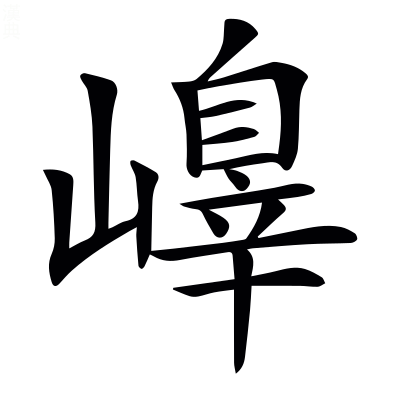
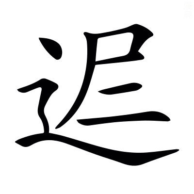

# <!-- page111 -->文選卷第七

> 梁昭明太子撰
> 
> 文林郎守太子右內率府錄事參軍事崇賢館直學士臣李善注上

郊祀

　楊子雲甘泉賦

耕籍

　潘安仁籍田賦

畋獵上

　司馬長卿子虛賦

郊祀祭天曰郊，郊者，言神交接也。祭地曰祀，祀者，敬祭神明也。郊天正於南郊。郭外曰郊。

## 甘泉賦一首并序

> 楊子雲〔善曰〕漢書曰：楊雄，字子雲，蜀郡~~成都~~人也[^7.1.1]。雄少好學，年四十餘，自蜀來遊京師，大司馬王音召以爲門下史，薦雄待詔，歲餘，爲郎中，給事黃門，卒。桓譚新論曰：雄作甘泉賦一首，始成，夢腸出，收而內之，明日遂卒[^7.1.2]。然舊有集注者並篇內具列其姓名，亦稱臣善以相別。佗皆類此。

孝成帝時，客有薦雄文似相如者，〔善曰〕雄答劉歆書曰：雄作成都城四隅銘，蜀人有楊莊者，爲郎，誦之於成帝，以爲似相如，雄遂以此得見。

上方郊祀甘泉泰畤汾陰后土，以求繼嗣，〔善曰〕上謂成帝也。漢書曰：武帝幸甘泉，令祠官具太乙祠壇，太一所用，如雍畤物[^7.1.3]。又立后土於汾陰脽上。*孟康曰：畤音止，神靈之所止也。脽音雖。*

召雄待詔承明之庭。〔善曰〕諸以材術見知，直於承明，待詔即見，故曰待詔焉。承明，已見上文。

正月，從上甘泉還，奏甘泉賦以風。〔善曰〕漢書曰：永始四年正月，行幸甘泉。七略曰：甘泉賦「永始三年正月，待詔臣雄上。」漢書三年無幸甘泉之文，疑七略誤也。毛詩序曰：下以風刺上；音諷；不敢正言謂之諷。

其辭曰：惟漢十世，將郊上玄，〔善曰〕惟，有也，是也。十世，成帝也。上玄，天也。

定泰畤，雍神休，尊明號，晉灼曰：雍，祐也。休，美也。言見祐護以休美之祥也。明號，下同符三皇也。〔善曰〕言將祭泰畤，冀神擁祐之以美祥，因尊己之明號也。廣雅曰：將，欲也。雍音擁。

同符三皇，錄功五帝，文穎曰：符，合也。〔善曰〕言同符契於三皇，錄功勤於五帝也。

卹胤錫羨，拓迹開統。應劭曰：卹，憂也。胤，續也。錫，與也。羨，饒也。拓，廣也。時成帝憂無繼嗣，故修祠泰畤后土。言神明饒與福祥，廣迹而開統也。李奇曰：統，緒也。〔善曰〕羨，弋戰反。

於是乃命羣僚，歷吉日，協靈辰，〔善曰〕爾雅曰：命，告也。楚辭曰：歷吉日吾將行。郭璞上林賦注曰：歷，選也。爾雅注曰：辰，時也。

星陳而天行。〔善曰〕星陳天行，已見西京賦。

詔招搖與~~太~~泰陰兮[^7.1.4]，伏鉤陳使當兵。張晏曰：禮記曰，招搖在上，急繕其怒。~~太~~泰陰，歲後三辰也。服虔曰：鉤陳，神名也，紫微宮外營陳星也。〔善曰〕句陳，已見上文。鄭玄禮記注曰：當，主也。主，謂典領也。

屬堪輿以壁壘兮，捎夔魖而抶獝狂。張晏曰：堪輿，天地緫名也。孟康曰：木石之怪曰夔，如龍有角，人面。魖，耗鬼也。獝狂，亦惡鬼也。今皆捎而去之。〔善曰〕杜預左氏傳注曰：屬，託也。淮南子曰：堪輿行雄以知雌。*許慎曰：堪，天道也。輿，地道也。*說文曰：抶，擊也；丑乙切。

八神奔而警蹕兮，振殷轔而軍裝。服虔曰：自招搖遊神之屬也。張晏曰：堪輿至獝狂，八神也。〔善曰〕言上諸神，各有職役，夔魖之屬，又捎去之，故令八方之神，奔走而警蹕，殷轔之盛而以軍裝也。轔，栗忍切。漢書·武帝紀曰：用事八神。*文穎曰：八方之神也。*薛君韓詩章句曰：振，奮也。殷轔，言盛多也。軍裝，如軍戎之裝者也。

蚩尤之倫，帶干將而秉玉戚兮，飛蒙茸而走陸梁。張晏曰：玉戚，以玉爲戚柲也。晉灼曰：飛者蒙茸而亂，走者陸梁而跳，謂猛士之輩。〔善曰〕蚩尤，已見西京賦。干將，已見東京賦。禮記曰：朱干玉戚。*鄭玄曰：戚，斧也。*又考工記注曰：柲猶柄也；音祕。茸，而恭反。

齊緫緫以撙<!-- page112 -->撙，其相膠轕兮[^7.1.5]，猋駭雲~~迅~~訊[^7.1.6]，奮以方攘。晉灼曰：方攘，半散也。〔善曰〕王逸楚辭注曰：緫緫撙撙，束聚貌也。膠葛，已見上文。鄭玄禮記注曰：奮，迅也。撙，子本切。~~迅~~訊音信。攘，人羊切。

駢羅列布，鱗以雜沓兮，柴虒參差，魚頡而鳥䀪。〔善曰〕駢猶併也。張揖上林賦注曰：柴虒，不齊也。頡䀪猶頡頏也。柴，初蟻切。虒音豸。頡，胡結切。䀪，胡剛切。

翕赫曶霍，霧集而蒙合兮，半散昭爛，粲以成章。〔善曰〕翕赫，盛貌。曶霍，疾貌。爾雅曰：天氣下，地氣不應曰霧，霧與蒙同[^7.1.7]。曶音忽。

於是乘輿廼登夫鳳皇兮而翳華芝，韋昭曰：鳳皇爲車飾也。翳，隱也。服虔曰：華芝，華蓋也。〔善曰〕言以華蓋自翳也。

駟蒼螭兮六素虯，蠖略蕤綏，灕虖襂纚。〔善曰〕高唐賦曰：乘玉輿兮駟蒼螭。上林賦曰：乘鏤象，六玉虯。說文曰：虯，龍無角者。春秋命歷序曰：皇伯駕六龍。蠖略蕤綏，龍行之貌也。灕虖襂纚，龍翰下垂之貌也。蠖，於钁切。灕音離。襂音森。纚，所宜切。

帥爾陰閉，霅然陽開，晉灼曰：帥，聚也。霅，散也。〔善曰〕文子曰：與陰俱閉，與陽俱開。霅，於甲切。

騰清霄而軼浮景兮，夫何旟旐郅偈之旖旎也。張晏曰：軼過雲與倒景也。服虔曰：旖旎，從風柔弱貌。〔善曰〕薛君韓詩章句曰：騰，乘也。何休公羊傳注曰：軼，過也[^7.1.8]。浮景，流景也。神女賦曰：夫何神女之妖麗。何休公羊傳注曰：據疑問所不知者曰何。周禮曰：鳥隼爲旟，龜蛇爲旐。郅偈，竿之貌也。郅音質。偈音桀。旖，於綺切。旎，女氏切。

流星旄以電爥兮，咸翠蓋而鸞旗。〔善曰〕言星旄之流，如電之光也。周書曰：樓煩星旄者，羽旄也。*鄭玄曰：可以爲旌旗也。*高唐賦曰：蜺爲旌，翠爲蓋。蔡邕獨斷曰：天子出，前驅有鸞旗者，編羽毛，列繫橦傍。

敦萬騎於中營兮，方玉車之千乘。〔善曰〕敦與屯同。王逸楚辭注曰：屯，陳也。鄭玄儀禮注曰：方，併也。玉車，以玉飾車也。

聲駍隱以陸離兮，輕先疾雷而馺遺風。〔善曰〕廣雅曰：陸離，參差也。方言曰：馺，馳也。*郭璞曰：馺，疾也。*聖主得賢臣頌曰：追奔電，逐遺風。駍，普萌切。馺，先合切。

凌高衍之嵱嵷兮，超紆譎之清澄。孟康曰：衍，無崖岸也。紆譎，曲折也。李奇曰：嵱音踊。嵷音竦。如淳曰：嵱嵷，上下衆多貌。

登椽欒而羾天門兮，馳閶闔而入凌兢。服虔曰：椽欒，甘泉南山也。凌兢，恐懼貌也。李奇曰：羾音貢。蘇林曰：羾，至也。〔善曰〕楚辭曰：吾令帝閽開關兮，倚閶闔而望予[^7.1.9]。*王逸曰：閶闔，天門也。*兢，鉅陵切。

是時未轃夫甘泉也，廼望通天之繹繹。〔善曰〕轃與臻同。至也[^7.1.10]。通天，臺名，已見上文。薛君韓詩章句曰：繹繹，盛皃。

下陰潛以慘廩兮，上洪紛而相錯。〔善曰〕慘廩，寒貌也。廩，來感切。

直嶢嶢以造天兮，厥高慶而不可乎彌度。〔善曰〕七發曰：條上造天。孔安國尙書傳曰：造，至也。爾雅曰：彌，終也。言高不可終竟而度量也。慶音羌。度，大各切。彌或爲彊。

平原唐其壇曼兮，列新雉於林薄。鄧展曰：唐，道也。服虔曰：新雉，香草也。雉夷聲相近。〔善曰〕子虛賦曰：案衍壇曼。新雉，辛夷也，本草，辛夷一名辛引。廣雅曰：草藂生曰薄。壇，徒旦切。曼，莫旦切。

攢并閭與茇葀兮，紛被麗其亡鄂。〔善曰〕蒼頡篇曰：攢，聚也。并~~櫚~~閭，椶也[^7.1.11]。茇葀，草名也。被麗，分散貌也。風賦曰：被麗披離。鄂，垠鄂也。茇，步末切。葀音括。被，皮義切。麗音隸。

崇丘陵之駊騀兮，深溝嶔巖而爲谷。蘇林曰：駊騀音叵我。〔善曰〕駊騀，高大貌也。嶔岩，深貌也。嶔，口銜切。

離宮般以相爥兮，封巒石關施靡乎延屬。應劭曰：言秦離宮三百，武帝復往往脩理之也。〔善曰〕說文曰[^7.1.12]：，古文往字也。往往，言非一也。般，布也，與班同。三輔黃圖曰：甘泉有石關觀、封巒觀。施靡，相連貌也。施，弋尔切。鄭玄喪服傳注曰：屬，連也；屬，之欲切。

於是大厦雲譎波詭，摧嗺而成觀。孟康曰：言厦屋變巧，乃爲雲氣水波相譎詭也。摧嗺，~~林~~材木崇積貌也[^7.1.13]。〔善曰〕言大厦之高，而成觀闕也。摧，子罪切。嗺，子水切。觀，工喚切。

仰撟首以高視兮，目冥眴而亡見。〔善曰〕王逸楚辝注曰：撟，舉也。撟與矯同。冥眴，昏亂之貌。冥，莫見切。眴音縣。

正瀏濫以弘惝兮，指東西之漫漫。孟康曰：瀏，清也。服虔曰：惝，大貌也；音敞。〔善曰〕瀏濫猶言清淨而汎濫也。漫漫，無厓際之貌也。瀏音劉。

徒徊徊以徨徨兮，魂固眇眇而昏亂[^7.1.14]。〔善曰〕言迷惑也。

據軨軒而周流兮，忽坱圠而亡垠。韋昭<!-- page113 -->曰：軨，欄也。軒，檻板也。〔善曰〕軨與櫺同。周流，流行周徧也。~~軮軋~~坱圠[^7.1.15]，廣大貌也。服鳥賦曰：軮軋無垠。軨音零。坱，烏朗切。圠，烏黠切。

翠玉樹之青葱兮，璧馬犀之瞵㻞。〔善曰〕漢武帝故事曰：上起神屋，前庭植玉樹，珊瑚爲枝，碧玉爲葉。璧馬犀，言作馬及犀爲璧飾也。埤蒼曰：瞵㻞，文貌也。應劭曰：瞵音隣。晉灼曰：㻞音豳。

金人仡仡其承鍾虡兮，嵌巖巖其龍鱗。〔善曰〕孔安國尙書傳曰：仡仡，壯勇之貌也。嵌，開張之貌也。龍鱗，似龍之鱗也。仡，魚乞切。嵌，火敢切。

揚光曜之燎爥兮，垂景炎之炘炘。晉灼曰：景，大也。〔善曰〕廣雅曰：炘，熱也；音欣。

配帝居之縣圃兮，象泰壹之威神。服虔曰：曾城、縣圃、閬風，崑崙之山三重也，天帝神在其上。〔善曰〕春秋合誠圖曰：紫宮帝室，太一之精[^7.1.16]。

洪臺~~崛~~掘其獨出兮[^7.1.17]，㮹北極之嶟嶟。應劭曰：崛，特貌也。㮹，至也。晉灼曰：嶟嶟，穊緻也。〔善曰〕爾雅曰：北極謂之北辰。崛，其勿切。㮹，竹指切。嶟，千旬切。

列宿廼施於上榮兮，日月纔經於柍桭。韋昭曰：榮，屋翼也。服虔曰：柍，中央也。桭，屋梠也。〔善曰〕施，式支切。柍，於兩切。桭音辰。

雷鬱律於巖窔兮，電儵忽於牆藩。〔善曰〕鬱律，小聲也。上林賦曰：巖窔洞房。釋名曰：窔，幽也。儵忽，疾貌也。藩，籬也。窔，一吊切。

鬼魅不能自逮兮，半長途而下㒹。〔善曰〕逮，及也。爾雅曰：㒹，隕也。

歷倒景而絕飛梁兮，浮蠛蠓而撇天。張揖曰：陵陽子明經曰：倒景氣去地四千里，其景皆倒在下[^7.1.18]。如淳郊祀志注曰：在日月之上，日月返從下照，故其景倒。又曰：絕，度也[^7.1.19]。服虔曰：浮，高貌也。晉灼曰：飛梁，浮道之橋也。〔善曰〕孫炎爾雅注曰[^7.1.20]：蠛蠓，蟲，小於蚊。張揖三蒼注曰：撇，拂也。蠓，莫孔反。撇，匹列反。

左欃槍而右玄冥兮，前熛闕而後應門。晉灼曰：大人賦曰：攬欃槍以爲旗。又曰：左玄冥而右黔雷。雄擬相如，故云爾也。熛闕，赤色之闕也，南方之帝曰赤熛怒。應門，正門，在熛闕之內也。〔善曰〕應劭~~曰~~大人賦注曰[^7.1.21]：欃槍，奔星也。張揖曰：玄冥，北方黑帝佐也。熛，必遙切。

蔭西海與幽都兮，涌醴汩以生川。如淳曰：言闕之高，乃蔭西海也。〔善曰〕山海經曰：北海之內有山，名曰幽都，黑水出焉。涌醴，醴泉涌出也。方言曰：汩，疾也，于筆切。

蛟龍連蜷於東厓兮，白虎敦圉乎崑崙。〔善曰〕連蜷，長曲貌也。敦圉，盛怒貌也。春秋漢含孳曰：天一之帝居，左青龍，右白虎。*服虔曰：象崑崙山在甘泉宮中也。*蜷音拳。敦，徒昆切[^7.1.22]，與屯同。

覽樛流於高光兮，溶方皇於西清。服虔曰：高光，宮名也。晉灼曰：樛流猶繚繞。〔善曰〕樛流，高曲之貌也。溶，盛貌也。方皇即彷徨，觀名也。漢書曰：甘泉有高光旁皇；旁音傍。西清，西廂清淨之處也。上林賦曰：象輿偃蹇於西清。

前殿崔巍兮，和氏瓏玲[^7.1.23]。晉灼曰：以黃金爲璧帶，含藍田璧。瓏玲，明見皃也。〔善曰〕前殿，正殿也，諸宮皆有之。漢書曰：未央宮立前殿。

炕浮柱之飛榱兮，神莫莫而扶傾。〔善曰〕炕，舉也。舉浮柱之飛榱，言檐宇高峻，若神清淨而扶其傾危也。炕與抗古字同。毛詩曰：君婦莫莫。*毛萇曰：莫莫，清淨也。*

閌閬閬其寥廓兮，似紫宮之崢嶸。〔善曰〕閌，高也。說文曰：閬閬，高大之貌也。寥廓，虛靜貌。紫宮及崢嶸，並已見上文。閬音浪。寥音僚。

駢交錯而曼衍兮，㟎隗乎其相嬰。〔善曰〕~~駢，列也~~駢猶併也，已見上注[^7.1.24]。曼衍，分布也。埤蒼曰：㟎，山長貌。隗，高貌。嬰，繞也。衍，弋戰切。㟎，他賄切。音辠。隗，五賄切。

乘雲閣而上下兮。紛蒙籠以棍成。服虔曰：蒙籠，膠葛貌。棍成，言自然也。〔善曰〕雲閣，言高連雲也。老子曰：有物混成。棍與混同。

曳紅采之流離兮，颺翠氣之宛延。〔善曰〕言宮觀之高，故紅采翠氣，流離宛延在其側，而曳颺之[^7.1.25]。

襲琁室與傾宮兮，若登高眇遠，~~亡國~~[^7.1.26]肅乎臨淵。服虔曰：襲，繼也。桀作琁室，紂作傾宮，以此微諫也。應劭曰：登高遠望，當以亡國爲戒，若臨深淵也。〔善曰〕晏子春秋曰：夏之衰也，其王桀作爲琁室；殷之衰也，其王紂作爲傾宮。

回猋肆其碭駭兮，翍桂椒而鬱栘楊。服虔曰：回猋，回風也。〔善曰〕毛萇詩傳曰：肆，疾也。碭，過也。廣雅曰：駭，起也。翍與披同。說文曰：鬱，木聚生也。爾雅曰：棠棣，栘也。楊，楊樹也。言回風碭駭，披散桂椒，又鬱~~衆~~聚栘楊也[^7.1.27]。碭，徒浪切。栘音移。

香芬茀以穹隆兮，擊薄櫨而將榮。〔善曰〕言香氣芬茀，穹隆而盛，乃拂擊薄櫨，而及屋榮也。說文曰：薄櫨，柱上枅也。薛君韓詩章句曰：將，辝也。茀，房物切。薄，房隔切。櫨，力都切。

薌呹肸以棍批兮，聲駍隱而歷鍾。〔善曰〕薌亦香字也。禮記曰：燔燎羶薌。呹，疾貌也。說文曰：肸蠁，布也。司馬彪上林賦注曰：肸，過也[^7.1.28]。棍，同也。批，擊也。歷鍾，經歷至鍾也。呹，余日切。肸，許一切。棍，下本切。批，薄結切。駍，普耕切。

排玉戶而颺金鋪兮，發蘭蕙與藭。李奇曰：鋪，門鋪首也。〔善曰〕言風飄香氣，既排玉戶而颺金鋪，又發揚蕙蘭與藭也。長門賦曰：擠玉戶以撼金鋪。司馬注子虛賦曰：藭，似槀本[^7.1.29]。

帷弸彋其拂汩兮，稍暗暗而靚深。〔善曰〕弸彋，風吹帷帳之聲也。拂汩，鼓動之貌。暗暗，深空之貌。靚即靜字耳。弸，普萌切。彋音宏。汩，于密切。暗，烏感切。

陰陽清濁穆羽相和兮，若夔牙之調琴。張晏曰：聲細不過羽，穆然相和也。〔善曰〕莊子：黃帝曰「一清一濁，陰陽調和。」尙書曰：夔典樂，教冑子。列子曰：伯牙善鼓琴。

般倕棄其剞劂兮，王爾投其鉤繩。應劭曰：剞，曲刀也。劂，曲鑿也。〔善曰〕尙書曰：倕，汝作共工[^7.1.30]。般，魯般也；爾，王爾也，並已見西京賦。般與班同。倕音垂。

雖方征僑與偓佺兮，猶彷彿其若夢。晉灼曰：方，常也。征，行也。言宮觀之高峻，雖使仙人常行其上[^7.1.31]，恐遽不識其形觀，猶髣髴若夢也。〔善曰〕鄭玄毛詩箋曰：方，且也。征僑，姓征名僑也，司馬相如大人賦曰：厮征伯喬，漢書曰：正伯喬，並同也。餘依晉說。列仙傳曰：偓佺，槐里采藥父也。食松實，形躰生毛數寸，能飛，行逮走馬。說文曰：彷彿，相似，視不諟也。楚辭曰：時彷彿以遙見。諟即諦字；音帝。

於是事變物化，目駭耳回，〔善曰〕蒼頡篇曰：駭，驚也。回，謂回皇也。

蓋天子穆然，珍臺閒館，琁題玉英，蜵蜎蠖濩之中。應劭曰：題，頭也。榱椽之頭，皆以玉飾，言其英華相爥也。張晏曰：蜵蜎蠖濩，刻鏤之形也。〔善曰〕范子曰：玉英出藍田。孝經援神契曰：玉英，玉有英華之色。閒音閑。蜵音淵。蜎，於緣切。蠖，烏郭切。濩，胡郭切。

惟夫所以澄心清魂，儲精垂恩，〔善曰〕鄭玄毛詩箋曰：惟，思也。文子曰：澄心清意。言儲蓄精神，冀神垂恩也。

感動天地，逆釐三神者；服虔曰：釐，福也。韋昭曰：逆，迎也，迎受福釐也。〔善曰〕三神，天地人也。釐音熙。

迺搜逑索偶，皐伊之徒，冠倫魁能，韋昭曰：搜，擇也。逑，匹也。索，求也。偶，對也。應劭曰：冠其群倫。魁，桀也。〔善曰〕皐，皐繇，堯臣也。伊，伊尹，湯臣也。

函甘棠之惠[^7.1.32]，挾東征之意，〔善曰〕毛詩序曰：甘棠，美邵伯也。又曰：東山，周公東征也。

相與齊乎陽靈之宮。〔善曰〕韓康伯周易注曰：洗心曰齊。齊，側皆反。祭天之所，故曰陽靈。

靡薜荔而爲席兮，折瓊枝以爲芳。〔善曰〕靡，謂偃靡之，藉地而爲席也。楚辭曰：折瓊枝以繼佩。

~~吸~~噏清雲之流瑕兮[^7.1.33]，飲若木之露英。〔善曰〕淮南子曰：志厲青雲，非夸矜也。司馬相如大人賦曰：呼吸沆瀣餐朝霞。霞與瑕古字通。山海經曰：灰野之山有赤樹，青葉，名曰若木。露英，英之含露者。

集乎禮神之囿，〔善曰〕禮神，謂祭天也。

登乎頌祇之堂。晉灼曰：后土歌祭之處也。〔善曰〕爲歌頌以祭地祇。

建光燿之長旓兮，昭華覆之威威。服虔曰：昭，明也。華覆，華蓋也。〔善曰〕埤蒼曰：旓，旌旗斿也。旓，所交切。威猶葳蕤也。

攀琁璣而下視兮，行遊目乎三危。〔善曰〕漢書曰：北斗七星，所謂琁璣玉衡。楚辭曰：忽反顧以游目。尙書曰：導黑水，至于三危。

陳衆車於東阬兮，肆玉軑而下馳。如淳曰：東阬，東海也；苦庚切。晉灼曰：軑，車轄也。韋昭曰：軑，徒計切。〔善曰〕賈逵國語注曰：肆，恣也。楚辭曰：齊玉軑而並馳。軑音大。

漂龍淵而還九垠兮，窺地底而上回。應劭曰：龍淵在張掖。服虔曰：九垠，九重也。〔善曰〕言從東阬下馳，遂浮龍淵，而繞其九重，乃窺地底而上歸也。說文曰：漂，浮也。莊子曰：千金之珠，在九重之淵驪龍頷下。廣雅曰：垠，厓也，厓亦重之義也。還音旋。

風~~漎漎~~而扶轄兮[^7.1.34]，鸞鳳紛其銜蕤[^7.1.35]。〔善曰〕~~漎漎~~，疾皃也，音竦。晉灼曰：蕤，綏也。

梁弱水之濎濙兮，躡不周之逶蛇。服虔曰：崑崙之東有弱水，渡之若濎濙耳。〔善曰〕濎濙，小水貌也。字林曰：濙，絕小水也。廣雅曰：躡，履也。山海經曰：西海之外，有山不合，名曰不周。逶蛇，欲平貌也。濎，吐定切。濙音熒。蛇音移。

想西王母欣然而上壽兮，屏玉女而却宓妃。〔善曰〕言既臻西極，故想王母而上壽，乃悟好色之敗德，故屏除玉女而及宓妃，亦以此微諫也。山海經曰：玉山，西王母所居也。神異經曰：東荒中有大石室，東王公居之，常與玉女共投壺。宓妃，已見東京賦。

玉女亡所眺其清矑兮，宓妃曾不得施其蛾眉。服虔曰：矑，目童子也。〔善曰〕毛詩曰：螓首蛾眉。

方攬道德之精剛兮，侔神明與之爲資。晉灼曰：等天地之計量也。〔善曰〕說文曰：攬，撮持也；音覽。精剛，精微剛強也。

於是欽<!-- page115 -->柴宗祈，〔善曰〕恭敬燔柴，尊崇所祈也。尙書曰：至于岱宗，柴。

燎薰皇天，應劭曰：牲玉之香也。

~~皐~~招搖泰壹[^7.1.36]。如淳曰[^7.1.37]：招作皐，皐，挈皐也。積柴於挈皐頭，置牲玉於其上，舉而燒之，欲近天也。張晏曰：招搖、泰一，皆神名。〔善曰〕搖與遙同。

舉洪頤，服虔曰：洪頤，旌名也。應劭曰：旌斾布也。

樹靈旗。李奇曰：欲伐南越，告禱太一，畫旗，樹太一壇上，名靈旗，以指所伐之國也，見漢書郊祀志。

樵蒸昆上，配藜四施。張晏曰：配藜，披離也。〔善曰〕言燔燎之盛，故樵蒸之光同上，而披離四布也。周禮曰：共祭祀之薪蒸。*鄭玄曰：麄曰薪，細曰蒸。*說文曰：昆，同也。昆或爲焜，字書曰：焜煌，火貌。

東爥滄海，西耀流沙。北熿幽都，南煬丹厓。服虔曰：丹水之厓也。〔善曰〕尙書曰：弱水餘波入于流沙。幽都，已見吳都賦。熿與晃音義同。方言曰：煬，炙也。

玄瓚觩䚧，秬鬯泔淡。服虔曰：以玄玉飾之，故曰玄瓚。張晏曰：瓚受五升，口徑八寸，以大圭爲柄，用灌鬯。觩䚧，其貌也。應劭曰：泔淡，滿也。〔善曰〕孔安國尙書傳曰：黑黍曰秬，釀以鬯草。觩音求。䚧，力幽切。泔，胡敢切。淡，大敢切。

肸蠁豐融，懿懿芬芬。〔善曰〕言秬鬯分布，芬芳盛美也。肸蠁，已見上文。

~~炎~~焱感黃龍兮[^7.1.38]，熛訛碩麟。韋昭曰：碩，大也。〔善曰〕言焱熛熾盛，感動神物也。字林曰：焱，火光也。說文曰：熛，火飛也。毛萇詩傳曰：訛，動也。熛，必遙切。

選巫咸兮叫帝閽，開天庭兮延羣神。服虔曰：令巫祝叫呼天門也。〔善曰〕山海經曰：大荒中有靈山，巫咸從此升降。王逸楚辭注曰：巫咸，古神巫也。楚辝曰：吾令帝閽~~闢~~開關兮[^7.1.39]。鄭玄禮記注曰：延，導也。

儐暗藹兮降清壇，瑞穰穰兮委如山。張晏曰：儐，贊也。〔善曰〕鄭玄周禮注曰：接賓曰儐，然謂贊禮者也。暗藹，衆盛貌也。委，積也。暗，烏感切。

於是事畢功弘，迴車而歸，度三巒兮偈棠~~黎~~棃[^7.1.40]。晉灼曰：黃圖無三巒，相如傳有封巒觀。〔善曰〕三巒即封巒觀也。漢書曰：甘泉有封巒、棠黎。韋昭曰：偈，息也；音憇。

天閫決兮地垠開，八荒協兮萬國諧。〔善曰〕鄭玄禮記注曰：閫，門限也。決，亦開也。言門決以出德澤，故八荒万國，俱協諧也。

登長平兮雷鼓礚，天聲起兮勇士厲。如淳曰：長平，坂名，在池陽南。〔善曰〕字指曰：礚，大聲也；口蓋切。天聲，如天之聲，言其大也。杜預左氏傳注曰：厲，猛也。

雲飛揚兮雨滂沛，于胥德兮麗萬世。〔善曰〕言恩澤之多，若雲行雨施，君臣皆有聖德，故華麗至于万世也。毛詩曰：于胥樂兮。*鄭玄曰：于，於也。胥，皆也。*麗，光華也[^7.1.41]。

亂曰：〔善曰〕王逸楚辭注曰：亂，理也，所以發理辭指，揔撮所要也。

崇崇圜丘，隆隱天兮。〔善曰〕崇崇，高貌也。廣雅曰：圜丘，大壇，祭天也。

登降峛崺，單埢垣兮。〔善曰〕登降，上下也。峛崺，邪道也。單，大貌。埢垣，圜貌。峛，力爾切。崺，弋爾切。單音蟬。埢音拳。

增宮㠁差，駢嵯峨兮。〔善曰〕㠁與參同，初林切。駢，步千切。嵯，材何切。峨音俄。

岭巆嶙峋，洞無厓兮。〔善曰〕埤蒼曰：岭巆嶙峋，深無厓之貌。岭音零。巆音熒。嶙音鄰，峋音旬。

上天之縡，杳旭卉兮。〔善曰〕縡，事也。杳，深遠也。旭卉，~~幽昧之貌~~難知也[^7.1.42]。毛詩曰：上天之載，無聲無臭。縡與載同。

聖皇穆穆，信厥對兮。李奇曰：對，配也，能與天相對配也。〔善曰〕詩曰：帝作邦作對。

徠祇郊禋[^7.1.43]，神所依兮，〔善曰〕言來郊禋而甚敬，故爲神祇之所依也。徠，古來字。

徘徊招搖，靈~~迉迡~~屖迡兮[^7.1.44]。〔善曰〕招搖猶彷徨也。迉迡，即棲遟也。毛萇詩傳曰：棲遟，遊息也。招，必遙切。~~迉音棲~~屖音棲。迡，大夷反。

光煇眩燿，降厥福兮。子子孫孫，長無極兮。

[^7.1.1]: 考異：注「蜀郡成都人也」　袁本、茶陵本無「成都」二字。
[^7.1.2]: 考異：注「明日遂卒」　何云據班書，非新論本然也。今案：此蓋「卒」字有誤。文賦注引新論作「及覺，病喘痵少氣」，或「卒」當作「病」。
[^7.1.3]: 考異：注「如雍畤物」　袁本、茶陵本無「物」字。
[^7.1.4]: 考異：詔招搖與太陰兮　茶陵本云「太」善作「泰」，袁本作「太」，用五臣也。漢書正作「泰」。
[^7.1.5]: 考異：其相膠轕兮　案：「轕」當作「葛」。注云「膠葛已見上文」，謂見吳都賦「東西膠葛」也。蓋善作「葛」，五臣作「轕」，各本亂之。漢書正作「葛」。羽獵賦「從橫膠轕」，漢書作「轕」，善及顏皆音葛。此及彼，皆同漢書耳。
[^7.1.6]: 考異：猋駭雲迅　茶陵本云「迅」善作「訊」。袁本作「迅」，用五臣也。漢書正作「訊」。
[^7.1.7]: 考異：注「地氣不應曰霧霧與蒙同」　陳云別本兩「霧」字並作「雺」。案：今未見。考爾雅釋文，「雺」或作「霧」，字同，亡公、亡侯二反。善引即「或作」而讀「亡公反」也。
[^7.1.8]: 考異：注「何休公羊傳注曰軼過也」　袁本、茶陵本無此十字。
[^7.1.9]: 考異：注「令帝閽開閶闔而望予」　案：「令」上當有「吾」字，「開」下當有「關兮倚」三字。各本皆脫。
[^7.1.10]: 考異：注「至也」　袁本、茶陵本無此二字，有「或作輳」三字，乃校語錯入注。
[^7.1.11]: 考異：注「并櫚椶也」　袁本、茶陵本「櫚」作「閭」，是也。
[^7.1.12]: 考異：注「說文曰」　袁本、茶陵本無此三字，有「往往作」四字，乃校語錯入注。
[^7.1.13]: 考異：注「林木崇積貌也」　案：「林」當作「材」，漢書注可證。各本皆譌。
[^7.1.14]: 考異：魂眇眇而昏亂　袁本、茶陵本「魂」下有「魄」字，云善本去「魂」作「魄固」。案：漢書作「魂固」，蓋善自作「魂固」。袁、茶陵所見「魂」作「魄」者，非。尤本誤涉五臣脫「固」字，益非。
[^7.1.15]: 考異：注「軮軋」　袁本、茶陵本「軮軋」作「坱圠」，下「軮軋無垠」同。案：二本是也。正文善「坱圠」及音皆可證。
[^7.1.16]: 考異：注「善曰春秋」下至「太一之精」　袁本、茶陵本無此十六字。
[^7.1.17]: 考異：洪臺崛其獨出兮　茶陵本云「崛」善作「掘」。袁本作「崛」，用五臣也。漢書正作「掘」。
[^7.1.18]: 考異：注「其景皆倒在下」　袁本、茶陵本無此六字。
[^7.1.19]: 考異：注「又曰絕度也」　袁本、茶陵本無此五字，有「在下」二字。
[^7.1.20]: 考異：注「孫炎爾雅曰」　何校「曰」上添「注」字，是也。陳云別本有。
[^7.1.21]: 考異：注「應劭曰大人賦注曰」　案：「劭」下當去「曰」字。各本皆衍。
[^7.1.22]: 考異：注「敦徒昆切」　袁本、茶陵本此下有「與屯同」三字，是也。
[^7.1.23]: 考異：和氏玲瓏　袁本作「瓏玲」，云善作「玲瓏」。茶陵本云五臣作「瓏玲」。案：各本所見皆非也。陳云漢書作「瓏玲」，此韻腳，不容同異，當乙。其說是矣。凡袁、茶陵皆據所見爲校語，非必善真如此，每有牴牾，詳見各條下。注「玲瓏，明見貌也」，亦當乙。漢書注可證。太玄、法言皆有「瓏玲」，亦可互證。法言「玲」作「」同字也。
[^7.1.24]: 考異：注「善曰駢列也」　袁本無「列也」二字，有「已見上文」四字。案：尤本此處脩改，必初刻同。袁本謂「駢猶併也，已見上注」也。茶陵本複出之，亦可證所改之非。
[^7.1.25]: 考異：注「而曳颺之」　袁本、茶陵本無此四字。
[^7.1.26]: 考異：若登高眇遠亡國　袁本「眇」下有「而」字，「遠」下無「亡國」二字，云善正文作「登高眇遠亡國」。茶陵本云五臣作「若登高眇而遠」。陳云漢書無「亡國」二字。今案：各本所見皆非也。注應劭曰「當以亡國爲戒」者，但說賦意，非舉賦文也。傳寫善本因注引應而誤添正文。又五臣衍「而」字，漢書亦無。
[^7.1.27]: 考異：注「又鬱衆栘楊也」　案：「衆」當作「聚」，漢書注「而栘楊鬱聚也」可證。陳云別本「聚」。
[^7.1.28]: 考異：注「司馬彪上林賦注曰肸過也」　袁本、茶陵本無此十一字。
[^7.1.29]: 考異：注「長門賦曰」下至「藭似槀本」　袁本、茶陵本無此二十三字。
[^7.1.30]: 考異：注「倕汝作共工」　袁本、茶陵本「倕」上有「咨」字，無「作」字。
[^7.1.31]: 考異：注「雖使仙人行其上」　案：「行」上當有「常」字，漢書注可證。各本皆脫。
[^7.1.32]: 考異：函甘棠之惠　袁本、茶陵本云「惠」善作「恩」，蓋所見不同也。漢書作「惠」。
[^7.1.33]: 考異：吸清雲之流瑕兮　茶陵本「吸」作「噏」，云五臣作「吸」。袁本作「吸」，用五臣也。漢書正作「噏」。
[^7.1.34]: 考異：風漎漎而扶轄兮　袁本云「漎」善作「從」。茶陵本作「」，云五臣作「漎」。案：茶陵是也。尤誤以五臣亂善，非也。漢書作「傱」。集韻二腫有「，傱」，云「，疾貌，或从人」。上字據此，下字據漢書也。袁本當云「善作」，今有誤。羽獵賦「萃傱沇溶」，五臣亦作「漎」，可互證。
[^7.1.35]: 考異：鸞鳳紛其銜蕤　陳云「銜」漢書作「御」，顏注或作「銜」，俗妄改也。今案：五臣注作「銜」，有明文，善注不見此字，或未必與五臣同，但無可考。袁、茶陵二本亦不著校語也。
[^7.1.36]: 考異：皐搖泰壹　案：「皐」當作「招」，茶陵本作「皐」，云五臣作「招」。今考漢書作「招」，善與之同，故如淳解讀作「皐」，張晏解「招如字」，而兩引之。不知者但據如解改爲「皐」，而張解不可通矣。袁本作「招」，不著校語，可知非五臣與善異，所見當未誤。
[^7.1.37]: 考異：注「如淳曰」　袁本、茶陵本「曰」下有「招作皐」三字。案：有者是也，說已見上。尤因所見賦誤「招」爲「皐」，遂刪此注，以就正文，失之矣。
[^7.1.38]: 考異：炎感黃龍兮　案：「炎」當作「焱」。據善注云「言焱熛熾盛，感動神物也」。字林曰：「焱，火光也」云云，作「焱」甚明。其五臣注作「炎」，各本亂之。漢書作「炎」，則與此不必全同也。
[^7.1.39]: 考異：注「吾令帝閽闢開兮」　袁本、茶陵本無「闢」字。案：當於「開」下添「關」字。各本皆譌。
[^7.1.40]: 考異：偈棠黎　茶陵本「黎」作「棃」，云五臣作「黎」。袁本作「黎」，用五臣也。漢書正作「棃」。案：此尤本以五臣亂善，非也。
[^7.1.41]: 考異：注「麗光華也」　袁本、茶陵本無此四字。
[^7.1.42]: 考異：注「幽昧之貌」　袁本、茶陵本作「難知也」三字，是也。
[^7.1.43]: 考異：徠祇郊禋　茶陵本「祇」作「祗」，云善作「祇」。案：茶陵所見及尤本非也。顏注漢書與善此注皆以「敬」解「祗」，其非異字可知。袁本作「祗」而不著校語，所見當未誤。
[^7.1.44]: 考異：靈迉迡兮　茶陵本「迉迡」作「棲遟」，云善作「迉迡」。案：茶陵所見及尤本皆非也。袁本云「棲遟」善作「屖迡」；其載善音則云「屖音棲」。漢書作「遟」，顏注「遟音栖」。考集韻十二齊有「屖」「遟」，別無「迉」字重出其下。然則但傳寫誤耳。當依袁所見訂正。陳云「迡」當作「」，從漢書校也。
