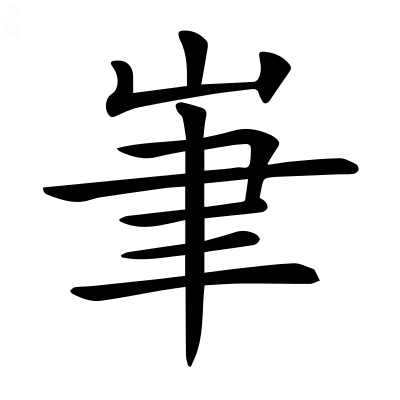
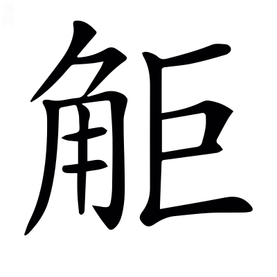

畋獵鄭玄禮記注曰：田者，所以供祭祀庖廚之用。王制曰：天子諸侯無事，則歲三田。*馬融曰：取獸曰畋。*

## 子虛賦一首

〔善曰〕漢書曰：相如遊梁，乃著子虛賦。後蜀人楊得意爲狗監，侍上。上讀子虛賦，曰「朕獨不得與此人同時哉。」得意曰「臣邑人司馬相如，自言爲此賦。」上乃召相如。相如曰「此乃諸侯之事，未足觀，請爲天子遊獵之賦。」以子虛，虛言也，爲楚稱；烏有先生，烏有此事也，爲齊難；亡是公者，亡是人也，欲明天子之義。故虛藉此三人爲辭，以風諫焉。

> 司馬長卿〔善曰〕漢書曰：司馬相如，字長卿，蜀郡人。少好讀書，爲武騎常侍，後拜文園令，病卒。郭璞注

楚使子虛使於齊，王悉發車騎，與使者出畋。司馬彪曰：畋，獵也。〔善曰〕家語曰：孔子在齊，齊侯出畋。本或云境內之士，備車騎之衆，非也。

畋罷，子虛過奼烏有先生，張揖曰：奼，誇也；丑亞切；字當作詫。

亡是公存焉。坐定，烏有先生問曰「今曰畋，樂乎？」子虛曰「樂。」「獲多乎？」曰「少。」「然則何樂？」對曰「僕樂齊王之欲夸僕以車騎之衆，而僕對以雲夢之事也。」張揖曰：楚藪也，在南郡華容縣。〔善曰〕廣~~雅~~蒼曰：僕，謂附著於人[^7.3.1]。然自卑之稱也。夢，莫諷切。

曰「可得聞乎？」子虛曰「可。王車駕千乘，選徒萬騎，畋於海濱。郭璞曰：濱，涯也。

列卒滿澤，罘網彌山。郭璞曰：彌，覆也。〔善曰〕罘，已見上文。

掩兔轔鹿，射麋脚麟。司馬彪曰：轔，轢也；音。韋昭曰：脚，謂持其脚也。〔善曰〕鄭玄毛詩箋曰：掩者，覆也。

騖於鹽浦，割鮮染輪。張揖曰：海水之厓，多出鹽也。李奇曰：鮮，生也。染，擩也。切生肉，擩車輪，鹽而食之也。〔善曰〕擩，搵也。擩，而緣切。搵，一頓切。

射中獲多，矜而自功，郭璞曰：伐其功也。〔善曰〕鄭玄禮記注曰：矜，自尊大也。

顧謂僕曰『楚亦有平原廣澤游獵之地，饒樂若此者乎？楚王之獵，孰與寡人乎？』郭璞曰：與猶如也。

僕下車對曰郭璞曰：下車，謙也。

『臣，楚國之鄙人也。廣雅曰：鄙，小也。

幸得宿衛，十有餘年，時從出游，游於後園，覽於有無，然猶未能徧覩也，〔善曰〕覽於有無，謂或有所見，或復無也。

又焉足以言其外澤乎？』齊王曰『雖然，略以子之所聞見而言之。』僕對曰『唯唯。臣聞楚有七澤，嘗見其一，未覩其餘也。臣之所見，蓋特其小小者耳，郭璞曰：特，獨也。

名曰雲夢。雲夢者，方九百里，其中有山焉。其山則盤紆岪鬱，隆崇崒。郭璞曰：隆崇，竦起也。〔善曰〕岪音佛。

岑崟參差，日月蔽虧。張揖曰：高山擁蔽日月。虧，缺，半見也。〔善曰〕崟音吟。

交錯糾紛，上干青雲。郭璞曰：言相摎結而峻絕也。〔善曰〕孔安國尙書傳曰：干，犯也。

罷池陂陀，下屬江河。郭璞曰：言旁頹也。屬，連也。罷音疲。陂音婆。陀音駝。文穎曰：南方無河也。冀州，凡水大小皆謂之河，詩賦通方言耳。晉灼曰：文章假借協陀之韻也。

其土則丹青赭堊，雌黃白坿，錫碧金銀。張揖曰：丹，丹沙也。青，青雘也。赭，赤土也。堊，白土也。蘇林曰：白坿，白石英也。坿音附。〔善曰〕高誘淮南子注曰：碧，青石也。

衆色炫耀，照爛龍鱗。郭璞曰：如龍之鱗彩也。

其石則赤玉玫瑰，琳琘昆吾。張揖曰：琳，珠也。琘者，石之次玉者。昆吾，山名也。出美金。尸子曰：昆吾之金。晉灼曰：玫瑰，火齊珠也。郭璞曰：琳，玉名。

瑊玏玄厲，張揖曰：瑊玏，石之次玉者。玄厲，黑石可用磨也。如淳曰：瑊音緘。玏音勒。

碝石碔砆。張揖曰：碝石碔砆，皆石之次玉者。碝石，白者如冰，半有赤色。碔砆，赤地白采，葱蘢白黑不分。郭璞曰：碝，而兗切。〔善曰〕管子曰：陰山碝珉。戰國策曰：白骨疑象，碔砆類玉。

其東則有蕙圃，衡蘭芷若，~~~~芎藭菖蒲[^7.3.2]。張揖曰：蕙圃，蕙草之圃也。衡，杜衡也。其狀若葵，其臭如蘪蕪。芷，白芷也。若，杜若也。司馬彪曰：芎藭，似藁本。〔善曰〕薛綜西京賦注曰：蘭，香草也。芷若下或有射干，非也。

~~茳~~江蘺蘪蕪[^7.3.3]，諸柘巴苴。張揖曰：江蘺，香草也。蘪蕪，蘄芷也，似蛇床而香。諸柘，甘柘也。郭璞曰：江蘺，似水薺。文穎曰：巴苴，草名，一名巴蕉。〔善曰〕苴，子余切。

其南則有平原廣澤，登降陁靡，案衍壇曼。司馬彪曰：陁靡，邪靡也。案衍，窊下也。壇曼，平博也。〔善曰〕陁，弋爾切。衍，弋戰切。壇，徒旦切。曼，莫幹切。

緣以大江，限以巫山。張揖曰：巫山在南郡巫縣。

其高燥則生葴菥苞荔，張揖曰：葴，馬藍也。菥，似燕麥也。苞，~~蔍~~麃也[^7.3.4]。荔，馬荔也。蘇林曰：菥，斯歷切。〔善曰〕葴，之林切。苞音包。荔音隸。~~蔍~~麃，皮表切。

薛莎青薠。張揖曰：薛，藾蒿也。莎，薃侯也。青薠，似莎而大，生江湖，鴈所食。〔善曰〕薠音煩。

其埤濕則生藏莨蒹葭，郭璞曰：藏莨，草名，中牛馬蒭。張揖曰：蒹，薕；葭，蘆也。〔善曰〕埤音婢。茛音郎。

東蘠彫胡。張揖曰：東蘠，實可食。彫胡，菰米也。

蓮藕觚盧，張揖曰：蓮，荷之實也，其根藕。張晏曰：觚盧，扈魯也。

菴閭軒于。張揖曰：菴閭，蒿也，子可醫疾。軒于，蕕草也，生水中，揚州有之。〔善曰〕菴音淹。蕕音猶。

衆物居之，不可勝圖。郭璞曰：圖，畫也。

其西則有湧泉清池，激水推移。郭璞曰：波抑揚也。

外發芙蓉菱華，內隱鉅石白沙。應劭曰：芙蓉，蓮花也。

其中則有神龜蛟鼉，瑇瑁鼈黿。張揖曰：蛟，狀魚身而蛇尾，皮有珠也。

其北則有陰林，其樹楩枏豫章。服虔曰：陰林，山北之林也。〔善曰〕尸子曰：水積則生吞舟之魚，土積則生楩楠豫章。本或林下~~有~~作巨字[^7.3.5]，樹下有則字，非也。

桂椒木蘭，檗離朱楊。郭璞曰：木蘭，皮辛可食。張揖曰：檗，皮可染者。離，山梨也。郭璞曰：朱楊，赤莖柳也。〔善曰〕山海經曰：有蓋山之國~~東~~有樹[^7.3.6]，赤皮幹，名曰朱木楊柳也。

樝梨梬栗，橘柚芬芳。張揖曰：樝，似梨而甘也。梬，梬棗也。〔善曰〕說文曰：梬棗，似柿而小，名曰㮕，而兗切。蘇林曰：梬音郢都之郢。然諸說雖殊，而木一也。今依蘇音。

其上則有鵷鶵孔鸞，騰遠射干。張揖曰：孔，孔雀也。鸞，鸞鳥也。射干，似狐能緣木。服虔曰：騰遠，獸名也。〔善曰〕射，弋舍切。

其下則有白虎玄豹，蟃蜒貙犴。郭璞曰：蟃蜒，大獸，似貍，長百尋。貙，似貍而大。犴，胡地野犬也，似狐而小。蟃音萬。〔善曰〕山海經曰：鳥鼠同穴之山，其上多白虎。又曰：幽都之山，其上有玄豹。*郭璞曰：黑豹也。*

---

於是乎乃使剸諸之倫，手格此獸。〔善曰〕剸諸，已見吳都賦。

楚王乃駕馴駮之駟，張揖曰：馴，擾也。駮，如馬，白身黑尾，一角鋸牙，食虎豹，擾而駕之，以當駟馬也。

乘彫玉之輿。郭璞曰：刻玉以飾車也。

靡魚須之橈旃，張揖曰：以魚須爲旃柄，驅馳逐獸~~也~~正橈靡也[^7.3.7]。〔善曰〕橈，女教切。

曳明月之珠旗。張揖曰：以明月珠綴飾旗也。〔善曰〕孝經援神契曰：蛟珠旗。宋均曰：蛟魚之珠有光耀，可以飾旗。

建干將之雄戟，張揖曰：干將，韓王劒師也。雄戟，胡中有者，干將所造也。〔善曰〕雄戟，已見吳都賦。音巨。

左烏號之雕弓，張揖曰：黃帝乘龍上天，小臣不得上，挽持龍鬚，鬚拔，墮黃帝弓，臣下抱弓而號，名烏號也。郭璞曰：雕，畫也。

右夏服之勁箭。服虔曰：服，盛箭器也。夏后氏之良弓名繁弱，其矢亦良，即繁弱箭服，故曰夏服也。

陽子驂乘，孅阿爲御。張揖曰：陽子，伯樂字也。秦繆公臣，姓孫名陽。郭璞曰：孅阿，古之善御者，見楚辭。孅音纖。〔善曰〕楚辭曰：孅阿不御焉。

案節未舒，即陵狡獸。司馬彪曰：案節，行得節。未舒，馬足未舒也。狡獸，狡健之獸也。〔善曰〕天文志曰：案節徐行。*服虔曰：謂行遲也。*

蹵蛩蛩，轔距虛。張揖曰：蛩蛩，青獸，狀如馬。距虛，似驘而小。〔善曰〕說苑：孔子曰「蛩蛩距虛，見人將來，必負蟨以走。二獸者，非性心愛蟨也，爲得甘草而貴之故也。」

軼野馬，陶駼。張揖曰：軼，過也。野馬，似馬而小。海外經曰：北海內有獸，狀如馬，名陶駼。郭璞曰：，車軸頭也。〔善曰〕軼，言車之疾，能過野馬及陶駼也。軼不言車，不言過，互文也。音衛。陶音逃。駼音塗。

乘遺風，射游騏。張揖曰：遺風，千里馬也。呂<!-- page121 -->氏春秋曰：遺風之乘。爾雅曰：嶲，如馬，一角；不角者騏。嶲音攜。

倐眒倩浰，張揖曰：皆疾皃。〔善曰〕倐，式六切。眒，式刃切。倩，千見切。浰音練。

雷動猋至，星流霆擊。郭璞曰：霆，劈歷。

弓不虛發，中必決眦。李奇曰：射之巧妙，決於目眦。〔善曰〕說文曰：眥，目匡也。眦眥俱同。

洞胷達掖，絕乎心繫。張揖曰：自左射之，貫胷通右髃，中心絕系也[^7.3.8]。〔善曰〕說文曰：髃，肩前也；五口切，一音五俱切。繫音系。

獲若雨獸，揜草蔽地。〔善曰〕言所在射獲衆多[^7.3.9]，若天之雨獸。雨，于具切。毛萇詩傳曰：揜，覆也。

於是楚王乃弭節徘徊，翶翔容與。~~郭璞曰：弭猶低也。節，所仗信節也。~~[^7.3.10]翶翔容與，言自得也。〔善曰〕王逸楚辭注曰：弭，案也。

覽乎陰林，觀壯士之暴怒，與猛獸之恐懼。徼受詘，郭璞曰：，疲極也。音劇。司馬彪曰：徼，遮其倦者。〔善曰〕受屈，取其力屈也，詘與屈同；丘勿切。

殫覩衆物之變態。郭璞曰：殫，盡也。變態，姿貌也。

---

於是鄭女曼姬，如淳曰：鄭女，夏姬也。曼姬，楚武王夫人鄧曼也。

被阿~~緆~~錫[^7.3.11]，揄紵縞。張揖曰：阿，細繒也。緆，細布也。揄，曳也。司馬彪曰：縞，細繒也。〔善曰〕列子曰：鄭衛之處子，衣阿緆。戰國策：魯連曰「君後宮皆衣紵縞。」緆與錫古字通。

雜纖羅，垂霧縠。司馬彪曰：纖，細也。張揖曰：縠細如霧，垂以爲裳也。〔善曰〕神女賦曰：動霧縠以徐步。

襞積褰縐[^7.3.12]~~，紆徐委曲~~[^7.3.13]，鬱橈谿谷。張揖曰：襞積，簡齰也。褰，縮也。縐，裁也。其縐中文理岪鬱，有似於谿谷也。〔善曰〕襞，必亦切。縐，側救切。齰，詐白切。

衯衯裶裶，揚袘戌削，郭璞曰：衯衯裶裶，皆衣長貌也。張揖曰：揚，舉也。袘，衣袖也。戌削，裁制貌也。〔善曰〕裶音非。袘，弋爾切。戌音卹。

蜚襳垂髾。司馬彪曰：襳，袿飾也。髾，燕尾也。〔善曰〕襳與燕尾，皆婦人袿衣之飾也。蜚，古飛字也。襳音纖。髾，所交切。

扶輿猗靡，張揖曰：扶持楚王車輿相隨也。〔善曰〕猗，於綺切。

翕呷萃蔡。張揖曰：翕呷，衣起張也。萃蔡，衣聲也。〔善曰〕呷，火甲切。萃音翠。

下靡蘭蕙，上拂羽蓋。〔善曰〕垂髾飛襳，飄揚上下，故或~~摩~~靡蘭蕙[^7.3.14]，或拂羽蓋。

錯翡翠之威蕤，張揖曰：錯其羽毛以爲首飾也。

繆繞玉綏。張揖曰：楚王車之綏，以玉飾之也。郭璞曰：綏，登車所執。言手纏絞之。

眇眇忽忽，若神~~仙~~之髣髴[^7.3.15]。郭璞曰：言其容飾奇豔，非世所見也。[^7.3.m1]若神，已見上文。

---

於是乃相與獠於蕙圃，〔善曰〕說文曰：獠，獵也，力笑切。

媻姍㪍窣，上乎金隄。韋昭曰：媻姍㪍窣，匍匐上也。司馬彪曰：金隄，隄名也。〔善曰〕媻音盤。姍，先安切。窣，先忽切。

揜翡翠，射鵔鸃。〔善曰〕方言曰：揜，取也。鵔鸃，已見上文。

微矰出，孅繳施。〔善曰〕矰繳，已見上文。

弋白鵠，連鴐鵝[^7.3.16]。〔善曰〕言既弋白鵠，而因連駕鵝也。

雙鶬下，玄鶴加。〔善曰〕雙鶬，見上注。爾雅曰：下，落也，見西都賦。~~戰國策：更羸曰「臣能虛發而下鳥。」~~[^7.3.17]高誘淮南子注曰：加，制也。~~列子曰：蒲且子連雙鶬於青雲之上。~~[^7.3.18]。戰國策：莊辛曰「黃鵠不知射者修矰繳，將加己也。」

怠而後發，游於清池。郭璞曰：怠，倦也。

浮文鷁，張揖曰：鷁，水鳥也，畫其象於船首也。

揚旌栧。張揖曰：揚，舉也。析羽爲旌，建於船上也。郭璞曰：栧，船舷，樹旌於上。〔善曰〕栧，依郭說。栧音曳。

張翠帷，建羽蓋。郭璞曰：施之船上也。〔善曰〕翠帷羽蓋，謂以翠羽飾帷蓋。

罔瑇瑁，鉤紫貝。郭璞曰：紫貝，紫質黑文也。〔善曰〕瑇瑁紫貝，已見西京賦。

摐金鼓，韋昭曰：摐，擊也；音䆫。郭璞曰：金鼓，鉦也。

吹鳴籟。張揖曰：籟，簫也。

榜人歌，張揖曰：榜，船也。月令曰：命榜人。榜人，船長也，主唱聲而歌者也。〔善曰〕榜，方孟切。

聲流喝。郭璞曰：言悲嘶也。〔善曰〕喝，一介切。嘶，蘇奚切。

水蟲駭，波鴻沸。郭璞曰：魚龜躍，濤浪作。

涌泉起，奔揚會。郭璞曰：暴湓激，相鼓薄也。〔善曰〕湓，普頓切。

礧石相擊，硠硠礚礚。〔善曰〕礧，力對切。

若雷霆之聲，聞乎數百里之外。

---

將息獠者，擊靈鼓，起烽燧。文穎曰：靈鼓，六面鼓。

車按行，騎就隊。應劭曰：按，按次第也。〔善曰〕服虔左氏傳注曰：隊，部也。行，胡郎切。隊，大內切。

纚乎淫淫，般乎裔裔。司馬彪曰：皆行貌也。〔善曰〕纚音屣。般音盤。

於是楚王乃登雲陽之臺，孟康曰：雲夢中高唐之臺，宋玉所賦者，言其高出雲之陽。

怕乎無爲，憺乎自持。郭璞曰：養神氣也。〔善曰〕老子曰：我獨怕然而未兆。說文曰：怕，無爲也。廣雅曰：憺怕，靜也。神女賦曰：頩薄怒以自持。憺與澹同；徒濫切。怕與泊同；蒲各切。

勺藥之和具，而後御之。服虔曰：具，美也。或以芍藥調食也。文穎曰：五味之和也。晉灼曰：南都賦曰，歸鴈鳴鵽，香稻鮮魚，以爲芍藥，<!-- page122 -->酸恬滋味，百種千名。~~之~~文說是也[^7.3.19]。〔善曰〕服氏~~一~~之說[^7.3.20]，以芍藥爲藥名，或者因說，今之煑馬肝，猶加芍藥，古之遺法。晉氏之說，以勺藥爲調和之意。枚乘七發曰：勺藥之醬。然~~則~~和調之言[^7.3.m2]，於義爲得。韋昭曰：勺，丁削切。藥，旅酌切。

不若大王終日馳騁，曾不下輿。脟割輪焠，自以爲娛。韋昭曰：焠，謂割鮮焠輪也。郭璞曰：焠，染也。〔善曰〕脟音臠。焠，七內切。

臣竊觀之，齊殆不如。』〔善曰〕毛萇詩傳曰：殆，近也。

於是齊王無以應僕也。」

---

烏有先生曰：「是何言之過也。足下不遠千里，來貺齊國，郭璞曰：言有惠賜也。〔善曰〕戰國策：秦王謂蘇秦曰「今先生不遠千里而庭教。」*高誘曰：不以千里之道爲遠。*

王悉發境內之士，備車騎之衆，與使者出畋，〔善曰〕家語曰：越悉起境內之士三千人助吳。

乃欲戮力致獲[^7.3.21]，以娛左右，晉灼曰：謙不斥言，故云左右，言使者左右也。〔善曰〕國語曰：戮力一心。*賈逵曰：戮，并力也。*

何名爲夸哉。問楚地之有無者，願聞大國之風烈，先生之餘論也。〔善曰〕風烈，已見上文。先生，謂子虛也。張晏曰：願聞先賢之遺談美論也。[^7.3.m3]

今足下不稱楚王之德厚，而盛推雲夢以爲高，郭璞曰：以爲高談。

奢言淫樂，而顯侈靡，郭璞曰：顯，明也。奢，闊也。

竊爲足下不取也。必若所言，固非楚國之美也。無而言之，是害足下之信也。彰君惡，傷私義，〔善曰〕史記：樂毅與燕~~惠~~王書曰[^7.3.22]：恐傷先王之明，有害足下之義。~~彰君惡，害私義，~~[^7.3.23]非楚國之美，彰君惡也；害足下之信，傷私義也。本或云有而言之是彰君之惡者，非也。

二者無一可。而先生行之，必且輕於齊而累於楚矣。文穎曰：必見輕於齊，輕易於齊也。〔善曰〕使者失辭，爲輕於齊；使非其人，爲累於楚也。累，力瑞切。

且齊東陼鉅海，南有琅邪。蘇林曰：小洲曰陼。司馬彪曰：齊東臨大海爲渚也。張揖曰：琅邪，臺名也。在渤海閒。〔善曰〕呂氏春秋：辛寬曰「太公望封於營丘，渚海阻山也。」聲類曰：陼或作渚。

觀乎成山，張揖曰：觀，闕也。成山在東萊~~掖~~不夜縣[^7.3.24]，於其上築宮闕也。

射乎之罘。晉灼曰：之罘山在東萊腄縣，獵其上也。〔善曰〕腄，直瑞切。

浮渤澥，應劭曰：渤澥，海別枝也。澥音蟹。

游孟諸。文穎曰：宋之大澤也。故屬齊。

邪與肅慎爲隣，郭璞曰：肅慎，國名，在海外，北接之。

右以湯谷爲界。司馬彪曰：湯谷，日所出也，以爲東界也。〔善曰〕言爲東界，則右當爲左字之誤也。

秋田乎青丘，服虔曰：青丘國在海東三百里。〔善曰〕山海經曰：青丘，其狐九尾。

徬徨乎海外。〔善曰〕毛詩曰：海外有截。

吞若雲夢者八九，於其胷中曾不蔕芥。〔善曰〕蔕芥，已見西京賦。

若乃俶儻瑰瑋，異方殊類。郭璞曰：俶儻猶非常也。〔善曰〕廣雅曰：瑰瑋，琦玩也。俶，佗歷切。

珍怪鳥獸，萬端鱗崪。〔善曰〕高唐賦曰：珍怪奇偉，不可稱論。張揖曰：崪與萃同，集也。

充牣其中，不可勝記。禹不能名，卨不能計。張揖曰：禹爲堯司空，辯九州名山，別草木。卨爲堯司徒，敷五教，率萬事。應劭曰：契善計也[^7.3.25]，契卨同。〔善曰〕廣雅曰：充牣，滿也。

然在諸侯之位，不敢言游戲之樂，苑囿之大。先生又見客，如淳曰：見賓客，禮待故也。〔善曰〕言見先生是客也。

是以王辭不復，司馬彪曰：復，答也。

何爲無以應哉！」

---

文選卷第七

賜進士出身通奉大夫江南蘇松常鎮太等處承宣布政使司布政使胡克家重校刊

[^7.3.1]: 考異：注「廣雅曰僕謂附著於人」　案：「雅」當作「蒼」。各本皆譌。樊恭廣倉見隋志。上林賦注引「若蹈足貌」。茶陵本亦譌「蒼」爲「雅」也。
[^7.3.2]: 考異：藭菖蒲　袁本、茶陵本「」作「芎」。案：注中字作「芎」。考說文艸部「藭，香艸也」。重文「芎」，司馬相如說「营」或从「弓」，謂凡將如此。史記、漢書作「穹」者，假借也。字書別未載「」字，當是尤延之以改「芎」爲「穹」，遂成此形耳。甘泉賦「發蘭蕙與藭」，正文及注皆誤。
[^7.3.3]: 考異：茳蘺蘪蕪　案：「茳」當作「江」，注中「江」字兩見，皆不從艸，史記、漢書亦作「江」。考上林賦「被以江蘺」，茶陵本云五臣作「茳」，袁本無校語。蓋此賦亦善「江」、五臣「茳」而亂之，故袁、茶陵二本皆不著校語。何校改作「江」，據史、漢。陳云別本作「江」，未詳其何本也。
[^7.3.4]: 考異：注「苞蔍也」　案：「蔍」當作「麃」。史記、漢書注可證。各本皆譌。下「蔍皮表切」。茶陵本未誤。
[^7.3.5]: 考異：注「本或林下有巨字」　案：「有」當作「作」，謂「林」下「其」字作「巨」也。不云「其」作「巨」者，因正文有兩「其」字，以此分別之。史記、漢書及五臣同，或本作「巨」。
[^7.3.6]: 考異：注「善曰蓋山之國東有樹」　袁本、茶陵本「蓋」上有「有」字，無「東」字。案：二本是也。此所引大荒西經文，依善例「曰」下當有「山海經曰」四字，二本仍皆脫。
[^7.3.7]: 考異：注「驅馳逐獸也橈靡也」　案：上「也」當作「正」，漢書注可證，以八字爲一句也。各本皆譌。
[^7.3.8]: 考異：注「中絕系也」　袁本、茶陵本「中」下有「心」字。案：漢書注正有，此脫。
[^7.3.9]: 考異：注「言所在衆多」　袁本「所在」下有「射獲」二字。茶陵本脫此注。
[^7.3.10]: 考異：注「弭猶低也節所仗信節也」　袁本無此十字，茶陵本亦無。案：漢書注有之。考史記索隱引郭璞曰「言頓轡也」，集解引郭璞曰：「或云節，今之所仗信節也」，善此注引王逸「弭，案也」，意謂即上文「案節未舒」，與郭「頓轡」之解相近，無取或云也。尤延之從漢書注添，未是。
[^7.3.11]: 考異：被阿緆　案：「緆」當作「錫」。注云「緆與錫古字通」，必善作「錫」，故有此語。今各本皆作「緆」者以五臣作「緆」而亂之，遂不可通，非也。史記、漢書皆作「錫」。袁、茶陵并削善此注，益非。
[^7.3.12]: 考異：襞積褰縐　袁本、茶陵本「積」作「襀」音積。案：史記、漢書皆作「積」，袁、茶陵二本善注中引張揖字仍作「積」，蓋善「積」、五臣「襀」而音「積」，袁、茶陵所見亂之，故不著校語。尤本獨未誤。
[^7.3.13]: 考異：紆徐委曲　何校云漢書無此四字，無者爲勝。案：以李注引張揖詳之，本無此四字。今史記有。而集解引漢書音義，索隱引小顏、孟康，似二家史記亦與漢書同，並不當有。唯五臣向注云「紆徐委曲，裙下垂貌」。蓋五臣較多四字而亂之也。各本皆非。
[^7.3.14]: 考異：注「故或摩蘭蕙」　案：善正文作「靡」，此「摩」字誤。五臣作「摩」，袁、茶陵二本有明文。今史記、漢書作「摩」，而張守節正義及顏注中仍作「靡」，「靡」者古「摩」字之通用，恐亦「靡」是「摩」非也。
[^7.3.15]: 考異：若神仙之髣髴　袁本、茶陵本云善無「仙」字。案：詳注意，善不當有甚明。尤本此處脩改添入，乃其誤也。漢書無，今史記亦誤衍，并正義所引戰國策末亦贅以「仙」字，誤之甚矣。凡史記與此同誤，皆後人所改耳。
[^7.3.16]: 考異：連鴐鵝　茶陵本云「鴐」，善作「駕」。案：注云「而因連駕鵝也」，字正作「駕」，史記、漢書亦皆作「駕」。考「駕」者，「」之假借。左傳「榮駕鵝」，唐石經、宋槧本下皆從「馬」，古今人表所載亦然。相如此賦用字古矣。唯中山經「是多駕鳥」，郭注未詳也。或曰「駕」宜爲「鴐」，鴐鵝也。然則「駕」字晉代不復行用之。袁本正文及注並改爲「鴐」，而不著校語。又上林賦「駕鵝屬玉」，各本作「鴐」，皆誤，以五臣亂善，非也。西京賦「鴐鵝鴻鶤」，平子用「鴐」字，是爲異人用字不同之例。全書此類極多，皆不更著。
[^7.3.17]: 考異：注「戰國策更羸曰臣能虛發而下鳥」　袁本無此十三字，有「見西都賦高誘」六字。茶陵本例改已見者爲複出，故亦有。尤本脩改添入，未是。又「高誘」二字屬下，不當刪之也。
[^7.3.18]: 考異：注「列子曰蒲且子連雙鶬于青雲之上」　袁本無此十四字，茶陵本有。案：尤本脩改添入，未是。說在上條。
[^7.3.19]: 考異：注「之說是也」　案：「之」當作「文」，漢書注可證。各本皆譌。
[^7.3.20]: 考異：注「服氏一說」　案：「一」當作「之」。各本皆譌。
[^7.3.21]: 考異：乃欲戮力致獲　袁本、茶陵本「戮」作「勠」。案：史記、漢書皆作「戮」，蓋善「戮」、五臣「勠」，二本所見亂之，而不著校語。「戮」「勠」同字耳。劇秦美新曰：「勠力咸陽。」餘同此者，不更出。
[^7.3.22]: 考異：注「善曰史記樂毅與燕惠王書曰」　袁本、茶陵本無「史記惠」三字。
[^7.3.23]: 考異：注「彰君惡害私義」　袁本、茶陵本無此六字。
[^7.3.24]: 考異：注「成山在東萊掖縣」　案：漢書注引「掖」作「不夜」，史記集解徐廣亦曰：「在東萊不夜縣」。考史記封禪書、漢書武帝紀、郊祀志、地理志，「不夜」是，「掖」非。各本皆譌也。
[^7.3.25]: 考異：注「契善計也」　袁本此下有「契卨同」三字，茶陵本無。案：有者是也。

[^7.3.m1]: 愚案：此處似當有善曰二字。
[^7.3.m2]: 愚案：依前考異，刪則字。
[^7.3.m3]: 愚案：張晏曰句，似當移在善曰句上。
