# <!-- page123 -->文選卷第八

> 梁昭明太子撰
> 
> 文林郎守太子右內率府錄事參軍事崇賢館直學士臣李善注上

畋獵中

　司馬長卿上林賦

　楊子雲羽獵賦

## 上林賦一首

> 司馬長卿　　郭璞注

亡是公听然而笑〔善曰〕說文曰：听，笑貌也，牛隱切。

曰：「楚則失矣[^8.1.1]，而齊亦未爲得也。夫使諸侯納貢者，非爲財幣，所以述職也[^8.1.2]；郭璞曰：諸侯朝於天子，曰述職。〔善曰〕尙書大傳曰：古者諸侯之於天子，五年一朝見，述其職。述職者，述其所職也。

封疆畫界者，非爲守禦，所以禁淫也。郭璞曰：天下有道，守在四夷。立境界者，欲以杜絕淫放耳。〔善曰〕小雅曰：淫，過也。

今齊列爲東藩，而外私肅慎，郭璞曰：私與通也。

捐國踰限，越海而田，其於義固未可也。且二君之論，不務明君臣之義[^8.1.3]，正諸侯之禮，徒事爭於游戲之樂，苑囿之大，欲以奢侈相勝，荒淫相越，此不可以揚名發譽，而適足以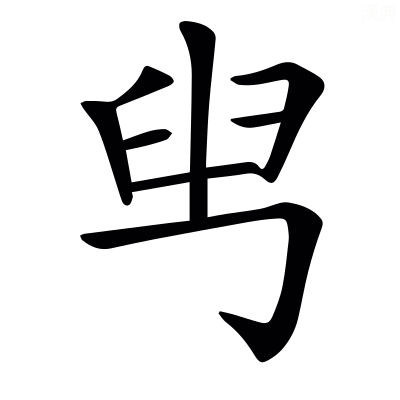君自損也[^8.1.4]。晉灼曰：，古貶字也．〔善曰〕鄧析子曰：因勢而發譽。毛萇詩傳曰：秖，適也。

且夫齊楚之事，又烏足道乎？君未覩夫巨麗也，獨不聞天子之上林乎？左蒼梧，右西極。文穎曰：蒼梧郡屬交州，在長安東南，故言左。爾雅曰：至于豳國，爲西極，在長安西，故言右也。

丹水更其南，應劭曰：丹水出上洛冢領山，東南至析縣入汋水。更，公衡切。

紫淵徑其北。文穎曰：~~河南~~西河穀羅縣[^8.1.5]有紫澤，在縣西北[^8.1.6]，於長安爲在北也。

終始灞滻，出入涇渭。張揖曰：灞滻二水，終始盡於苑中，不復出也。涇渭二水，從苑外來，又出苑去也。

酆鎬潦潏，紆餘委蛇，經營乎其內。張揖曰：酆水出鄠縣南山酆谷，北入渭。鎬在昆明池北。〔善曰〕潦，即澇水也。說文曰：澇水出鄠縣，北入渭。潏水出杜陵，今名~~沇~~泬水[^8.1.7]，自南山~~黃~~皇子陂[^8.1.8]西北流，~~經~~至昆明池[^8.1.9]入渭。郭璞曰：經營其內，言周旋苑中也[^8.1.10]。

蕩蕩乎八川分流，相背而異態。郭璞曰：變態不同也。〔善曰〕潘岳關中記曰：涇渭灞滻酆鄗潦潏，凣八川。

東西南北，馳騖往來。郭璞曰：言更相錯涉也。來，盧代切。

出乎椒丘之闕，服虔曰：丘名也。兩山俱起，象雙闕者也。郭璞曰：椒丘，見楚辭。〔善曰〕楚辭曰[^8.1.11]：馳椒丘且焉。止，息也，且音昌呂切[^8.1.12]。

行乎洲淤之浦。張揖曰：淤，漫也。浦，水崖也。淤，於庶切。〔善曰〕方言曰：水中可居者曰洲。三輔謂之淤也。

經乎桂林之中，張揖曰：桂林，林名也。南海經曰：桂林八樹，在番禺東也。

過乎泱漭之壄。張揖曰：山海經所謂大荒之野。如淳曰：大貌也。泱，烏朗切。

汩乎混流，順阿而下，蘇林曰：楊雄方言曰，汩，逕疾也。汩，于筆切。郭璞曰：混，并也。阿，大陵也。

赴隘陿之口。郭璞曰：夾岸閒爲陿。隘，於懈切。陿音狹。

觸穹石，激堆埼，張揖曰：穹石，大石也。埼，曲岸頭也。郭璞曰：堆，沙堆也；丁回切。埼，巨依切。

沸乎暴怒，郭璞曰：沸，水聲也；音拂。

洶涌彭湃。司馬彪曰：洶涌，跳起也。彭湃，波相戾也。洶，許勇切。湃，蒲拜切。

滭弗宓汩，蘇林曰：滭音畢。宓音密。司馬彪曰：畢弗[^8.1.13]，盛貌也。宓汩，去疾也。汩，于筆切。

偪側泌瀄。郭璞曰：泌瀄音筆櫛。司馬彪曰：偪側，相迫也。泌瀄，相揳也。偪字與逼同。揳，先結切。

橫流逆折，轉騰潎洌。司馬彪曰：逆折，旋回也，孟康曰：轉騰，相過也。潎洌，相撇也。潎，匹列切。洌音列。

滂濞沆溉，司馬彪曰：滂濞，水聲也。沆溉，徐流也。郭璞曰：滂音匹亨切。濞，匹祕切。溉，胡慨切。韋昭曰：沆，胡郎切。

穹隆雲橈，郭璞曰：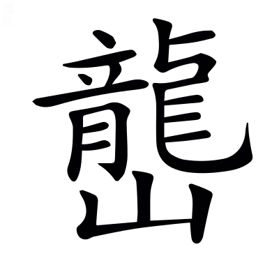起回窊也。〔善曰〕雲橈，如雲屈橈也。橈，女教切。

宛潬膠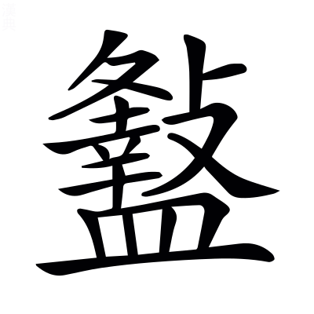。司馬彪曰：宛潬，展轉也。膠，邪屈也。宛音婉。潬音善。，古戾字。

踰波趨浥，涖涖下瀨。司馬彪曰：踰波，後波凌前波也。趍浥，輸於淵也。涖涖，水聲也。浥，於俠切。涖音利。

批巖衝擁，奔揚滯沛。<!-- page124 -->司馬彪曰：擁，曲隈也。〔善曰〕說文曰：批，擊也。滯沛，奔揚之貌也。滯，直制切。沛，蒲蓋切。

臨坻注壑，瀺灂霣墜。鄧展曰：坻，水中山也。坻音遲。〔善曰〕字林曰：瀺灂，小水聲也。霣即隕字也。墜，直類切。

沈沈隱隱，砰磅訇礚。〔善曰〕沈沈，深貌也。隱隱，盛貌也。司馬彪曰：砰磅訇礚，皆水聲也。砰，普氷切。磅，普萌切。

潏潏淈淈，湁潗鼎沸。〔善曰〕說文曰：潏，水湧出也。淈，水出貌[^8.1.14]。周成雜字曰：湁潗，水沸貌也。淈音骨。湁，勑立切。潗，子入切。

馳波跳沫，汩~~濦~~㴔漂疾[^8.1.15]，司馬彪曰：汩~~濦~~㴔，水聲也。韋昭曰：~~濦~~㴔，許及切。〔善曰〕汩，于筆切。漂，匹姚切。

悠遠長懷。郭璞曰：懷亦歸，變文耳。

寂漻無聲，肆乎永歸。〔善曰〕說文曰：漻，清深也[^8.1.16]。漻音聊。杜預左氏傳注曰：肆，放也。言水奔放，而長歸於淵海也。

然後灝溔潢漾，郭璞曰：皆水无涯際貌也。灝音皓。溔，弋少切。潢，胡廣切。漾，弋丈切。

安翔徐回。郭璞曰：言運轉也。

翯乎滈滈，郭璞曰：水白光貌也。翯，胡角切。滈音鎬。

東注太湖，郭璞曰：太湖在吳縣，尙書所謂震澤也。

衍溢陂池。郭璞曰：~~其形狀~~言溢而出也[^8.1.17]。陂池，江旁小水。

於是乎蛟龍赤螭，文穎曰：龍子爲螭。張揖曰：赤螭，雌龍也。

䱎䲛漸離。李奇曰：周洛曰鮪，蜀曰䱎䲛，出鞏山穴中。司馬彪曰：漸離，魚名也。張揖曰：其形狀未聞[^8.1.18]。䱎音亘。䲛音懵。

鰅鰫鰬魠，郭璞曰：鰅，魚有文彩。鰫，似鰱而黑。鰬，似鱓。魠，鱤也，一名黃~~曰~~頰[^8.1.19]。鰅音顒。鰫，嘗容切。鰬音乾。魠音托。鱓音善。鱤音感。

禺禺魼鰨。郭璞曰：禺禺魚，皮有毛，黃地黑文。魼，比目魚，狀似牛脾，細鱗紫色，兩相合~~得乃~~乃得行[^8.1.20]。鰨，鯢魚也，似鮎，有四足，聲如嬰兒。禺音顒。魼音榻。鰨，奴榻切。

揵鰭掉尾，振鱗奮翼，郭璞曰：揵，舉也。鰭，背上鬣也。〔善曰〕高唐賦曰：振鱗奮翼。揵，巨言切。掉，徒釣切。

潜處乎深巖。郭璞曰：隱岸坻也[^8.1.21]。

魚鼈讙聲，萬物衆夥。〔善曰〕小雅曰：夥，多也。

明月珠子，的皪江靡，應劭曰：靡，邊也。明月珠子生於江中，其光耀乃照於江邊也。張揖曰：靡，厓也。〔善曰〕說文曰：玓瓅，明珠光也。玓瓅與的皪音義同。

蜀石黃碝，水玉磊砢。張揖曰：蜀石，石次玉者也。郭璞曰：碝，碝石，黃色。水玉，水精也。磊砢，魁礨貌也。〔善曰〕山海經曰：~~常~~重庭之山[^8.1.22]其上多水玉。碝，如兗切。砢，洛可切。

磷磷爛爛，采色澔汗，郭璞曰：皆玉石符采映耀也。磷音吝。澔音皓。

藂積乎其中。鴻鷫鵠鴇，鴐鵝屬玉。張揖曰：鴻，大鴈也。郭璞曰：鷫，鷫鷞也。屬玉，似鴨而大，長頸赤目，紫紺色者。

交精旋目，郭璞曰：交精，似鳧而脚高，有毛冠，辟火災。司馬彪曰：旋目，鳥名也。

煩鶩庸渠。郭璞曰：煩鶩，鴨屬也。庸渠，似鳧，灰色而雞脚，一名章渠。鶩音木。

箴疵鵁盧，張揖曰：箴疵，似魚虎而倉黑色。鵁，鴢頭鳥。郭璞曰：盧，鸕鷀也。箴音鍼。疵音資。鷀音慈也。

羣浮乎其上。汎淫泛濫，隨風澹淡。郭璞曰：皆鳥任風波自縱漂貌也。汎音馮。泛，敷劔切。

與波搖蕩，奄薄水渚。張揖曰：奄，覆也。郭璞曰：薄猶集也。

唼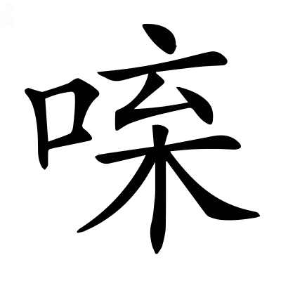菁藻，咀嚼菱藕。郭璞曰：菁，水草也。〔善曰〕通俗文曰：水鳥食謂之啑，與唼同，所甲切。，丈甲切。咀，才汝切。嚼，才削切。

於是乎崇山矗矗，巃嵸崔巍。郭璞曰：皆高峻貌也。巃，力孔切。嵸音揔。

深林巨木，嶄巖嵾嵳。郭璞曰：皆峯嶺之貌也。嶄，仕銜切。嵾，楚林切。嵳，楚宜切。

九嵕嶻嶭，南山峩峩。郭璞曰：嶻嶭，高峻貌也。〔善曰〕九嵕、南山，已見西都賦。嶻音截。嶭音齧。峩音娥。

巖陁甗錡，~~摧~~嶊崣崛崎[^8.1.23]。司馬彪曰：陁，靡也。甗，甑也。錡，欹也。上大下小，有似欹甑也。張揖曰：~~摧~~嶊崣，高貌也。崛崎，斗絕也。摧，作罪切。崣，卒鄙切。郭璞曰：崛音掘。崎音錡。

振溪通谷，蹇產溝瀆。張揖曰：振，拔也[^8.1.24]。水注川曰谿，注谿曰谷。蹇產，詰曲也。郭璞曰：自溪及瀆，皆水相通注也。〔善曰〕言山石收歛溪水，而不分泄。

谽呀豁閕，阜陵別隝。司馬彪曰：谽呀，大貌。豁閕，空虛也。郭璞曰：隝，水中山也。谽，呼含切。呀，呼加切。閕，呵下切。隝音擣。

崴磈㟪廆，丘虛堀礨。郭璞曰：皆其形勢也。崴，於鬼切。磈，魚鬼切。㟪，惡罪切。廆，胡罪切。虛音袪。堀音窟。礨音磊。

隱轔鬱㠥，登降施靡，郭璞曰：隱轔鬱~~壘~~㠥[^8.1.25]，堆壟不平貌。轔，洛盡切。㠥音壘。施，式氏切。

陂池貏豸。郭璞曰：陂池，旁頹貌也。陂音皮。貏音被。豸，直爾切。〔善曰〕貏豸，漸平皃。

沇溶淫鬻，張揖曰：水流谿谷之閒也。沇，以水切。溶音容。淫，以舟切。鬻音育。

散渙夷陸。司馬彪曰：布平地也。

亭皐千里，靡不被築。服虔曰：皐，澤也。隄上十里一亭。郭璞曰：皆築地令平也。被，皮義切。

揜以綠蕙，被以江蘺。張揖曰：掩，覆也。綠，王芻也。蕙，薰<!-- page125 -->草也。[^8.1.m1]郭璞山海經注曰[^8.1.26]：蕙，香草，蘭屬也。

糅以蘪蕪，雜以留夷。張揖曰：留夷，新夷也。〔善曰〕王逸楚辭注曰：留夷，香草。

布結縷，郭璞曰：結縷，蔓生，如縷相結。

攢戾莎，司馬彪曰：戾莎，莎名也。

揭車衡蘭，應劭曰：揭車，一名䒗輿，香草也。揭，去竭切。䒗，巨乞切。

槀本射干。郭璞曰：槀本，槀茇也；方末切。司馬彪曰：射干，香草也。射，弋舍切。

茈薑蘘荷，張揖曰：茈薑，子薑也。茈音紫。蘘，人羊切。

葴持若蓀。如淳曰：箴音鍼。韋昭曰：持音懲。張揖曰：箴持，闕。若，杜若。郭璞曰：蓀，香草也。

鮮支黃礫，司馬彪曰：鮮支，支子也。張揖曰：皆香草也。

蔣~~苧~~芧青薠[^8.1.27]。張揖曰：蔣，菰也。~~苧~~芧，三稜也。郭璞曰：~~苧~~芧音杼。

布濩閎澤，延曼太原。郭璞曰：布濩猶布露也。〔善曰〕閎，大也。濩音護。延，弋戰切。

離靡廣衍。〔善曰〕離靡，離而邪靡，不絕之貌也。孟康甘泉賦注曰：衍，无厓岸也。離，力爾切。

應風披靡。吐芳揚烈，〔善曰〕烈，酷烈，香氣盛也。披，丕蟻切。

郁郁菲菲。衆香發越，郭璞曰：香氣射散也。菲音妃。

肸蠁布寫，䁆薆咇茀。司馬彪曰：肸，過也。芬芳之過，若蠁之布寫也。郭璞曰：香氣盛馝馞也。〔善曰〕說文曰：肸蠁，布也。馝馞、咇茀音義同。說文曰：馣馤[^8.1.28]，香氣奄藹也。馣與䁆、馤與薆音義同。䁆音奄。咇，步必切。茀音勃。

於是乎周覽泛觀，縝紛軋芴，孟康曰：縝紛，衆盛也。軋芴，緻密也。縝，丑人切。芴音勿。

芒芒恍忽。郭璞曰：言眼亂也。芒，莫朗切。

視之無端，察之無涯。日出東沼，入乎西陂。張揖云：日朝出苑之東池，暮入於苑西陂中。〔善曰〕漢宮殿簿曰：長安有西陂池、東陂池。

其南則隆冬生長，涌水躍波。張揖曰：其苑南陽煖，則盛冬十月，草木生長也。郭璞曰：躍波，言不凍也。〔善曰〕孫卿子曰：松栢經隆冬而不彫。

其獸則㺎旄貘犛，沈牛麈麋。郭璞曰：㺎似牛，領有肉堆也；音容。張揖曰：旄，旄牛也，其狀如牛而四節毛。貘，白豹。犛牛，黑色，出西南徼外。沈牛，水牛也，能沈沒水中。麈，似鹿而大。〔善曰〕南越志曰：潛牛，形角似水牛，一名沈牛也。

赤首圜題，窮奇象犀。張揖曰：題，頟也。窮奇，狀如牛而蝟毛，其音如噑狗，食人者也。

其北則盛夏含凍裂地，涉冰揭河。司馬彪曰：揭，舉衣也。〔善曰〕尸子曰：寒凝冰裂地。

其獸則麒麟角端，騊駼橐駝。郭璞曰：麒，似麟而無角。角端，似貃，角在鼻上，中作弓。韋昭曰：背上有肉似橐，故曰橐駝也。

蛩蛩驒騱，駃騠驢驘。郭璞曰：驒騱，駏驉類也。駃騠，生三日而超其母。驒音㒹。騱音奚。駃音玦。騠音提。驘騾~~驘~~同[^8.1.29]。

於是乎離宮別館，彌山跨谷。〔善曰〕鄭玄周禮注曰：彌，徧也。

高廊四注，重坐曲閣。司馬彪曰：廊廡上級下級皆可坐，故曰重坐。曲閣，閣道委曲也。

華榱璧璫，輦道纚屬。韋昭曰：裁金爲璧，以當榱頭也。如淳曰：輦道，閣道也。司馬彪曰：纚屬，連屬也。張揖曰：纚，力尔切。屬，之欲切。

步櫩周流，長途中宿。〔善曰〕步櫩，步廊也。周流，周徧流行也。楚辭曰：曲屋步櫩。郭璞曰：~~中~~途，樓閣間陛道[^8.1.30]。司馬彪曰：中宿乃至其上。

夷嵕築堂，累臺增成。如淳曰：嵕，山也。張揖曰：平此山以作堂者也。重累而成之，故曰增成。嵕，子公切。

巖窔洞房。郭璞曰：言於巖窔底爲室，潛通臺上也。〔善曰〕窔，一吊切。

頫杳眇而無見，仰橑而捫天。〔善曰〕聲類曰：頫，古文俯字。說文曰：頫，低頭也。楚辭曰：遂倐忽而捫天。晉灼曰：，古攀字也。捫，摸也。橑音老。捫音門。

奔星更於閨闥，宛虹扡於楯軒。〔善曰〕奔，流星也，行疾，故曰奔。如淳曰：宛虹，屈曲之虹也。應劭曰：楯，欄檻也。司馬彪曰：軒，楯下版也。更，工衡切。

青龍蚴蟉於東~~葙~~箱[^8.1.31]，郭璞曰：蚴蟉，龍行貌也。〔善曰〕孫炎爾雅注曰：~~葙~~箱，夾室前堂也。蚴，一糾切。蟉，力紏切。

象輿婉僤於西清。張揖曰：山出象輿，瑞應車也。西清者，~~葙~~箱中清淨處也。〔善曰〕婉僤，動貌也。僤uj音善。

靈圄燕於閒館，張揖曰：靈圄，衆仙之號也。楚辭曰：坐靈圄而來謁，閒讀曰閑。

偓佺之倫，暴於南榮。郭璞曰：偓佺，仙人也。暴，謂偃卧日中也。榮，屋南檐也。

醴泉涌於清室，通川過於中庭。郭璞曰：醴泉，瑞水也。〔善曰〕言醴泉於室中涌出，而通流爲川，而過中庭。

盤石~~振~~裖崖[^8.1.32]，李奇曰：~~振~~裖，整也。以石整頓池水之涯也。~~振~~裖，之刃切。

嶔巖倚傾，郭璞曰：嶔巖，欹貌也。嶔，口銜切。倚，於綺切。

嵯峨㠎嶫，刻削崢嶸。郭璞曰：言自然若彫刻也。司馬彪曰：崢嶸，深貌也。〔善曰〕㠎音捷。嶫音業。

玫瑰碧琳，珊瑚叢生。〔善曰〕並已見上文。<!-- page126 -->

瑉玉旁唐，玢豳文鱗。郭璞曰：旁唐，言磐礡也。玢豳，文理貌也；音紛彬。〔善曰〕宋玉笛賦曰：其處磅磄千仞[^8.1.33]。磅磄與旁唐音義同

赤瑕駮犖，雜臿其閒，張揖曰：赤瑕，赤玉也。郭璞曰：言雜廁崖石中。駮犖，采點也。犖，洛角切。

晁采琬琰，和氏出焉。司馬彪曰：晁采，玉名。〔善曰〕晁，古朝字。尙書曰：弘璧琬琰在西序。

於是乎盧橘夏熟[^8.1.34]，應劭曰：伊尹書曰「箕山之東，青鳥之所，有盧橘夏熟。」晉灼曰：此雖賦上林，博引異方珍奇，不係於一也。盧，黑也。

黃甘橙楱。郭璞曰：黃甘，橘屬，而味精。楱，亦橘之類也；音湊。張揖曰：楱，小橘也，出武陵。〔善曰〕說文曰：橙，橘屬也。

枇杷橪柿，~~楟~~亭柰厚朴[^8.1.35]。張揖曰：枇杷，似斛樹，長葉，子如杏。亭，山梨也。厚朴，藥名也。郭璞曰：橪，橪支木也。橪音煙。朴，步角切。

梬棗楊梅，張揖曰：楊梅，其實似~~縠~~榖子[^8.1.36]而有核，其味酸，出江南也。

櫻桃蒲陶。〔善曰〕櫻桃蒲陶，見南都賦。

隱夫薁棣，張揖曰：隱夫，未詳。薁，山李也。郭璞曰：棣，實似櫻桃也。薁，於六切。棣，徒計切。

答遝離支。張揖曰：答遝，似李，出蜀。晉灼曰：離支，大如雞子，皮麄，剥去皮，肌如雞子，中黃，味甘多酢少。遝音沓。離，力智切。

羅乎後宮，列乎北園。䝯丘陵，下平原。司馬彪曰：䝯，延也，羊氏切。

揚翠葉，扤紫莖。張揖曰：扤，搖也；音兀。

發紅華，垂朱榮。煌煌扈扈，照曜鉅野。郭璞曰：言其光采之盛也。煌音皇。

沙棠櫟櫧，張揖曰：沙棠，狀如棠，黃華赤實，其味如李，無核，呂氏春秋曰：果之美者，沙棠之實。櫧，似柃，葉冬不落。應劭曰：櫟，~~採~~棌木也[^8.1.37]。櫧音諸，柃音零。~~採~~棌音采。

華楓枰櫨。張揖曰：華，皮可以爲索。楓，攝也，脂可以爲香。郭璞曰：枰，平仲木也。櫨，已見南都賦。華，胡化切。

留落胥邪，仁頻并閭。郭璞曰：留，未詳。落，檴也。中作器。胥邪，似并閭，皮可作索。孟康曰：仁頻，椶也。〔善曰〕仙藥錄曰：檳榔，一名椶，然仁頻即檳榔也。胥邪、并閭，已見南都賦。檴音鑊。

欃檀木蘭，孟康曰：欃檀，檀別名也。欃音讒。

豫章女貞。張揖曰：女貞木，葉冬不落。

長千仞，大連抱。司馬彪曰：七尺曰仞。

夸條直暢，實葉葰楙。郭璞曰：夸，張布也。司馬彪曰：葰，大也；葰音峻。

攢立叢倚，連卷欐佹。司馬彪曰：欐佹，支重累也。倚，於綺切。卷，巨專切。欐，力爾切。佹音詭。〔善曰〕蒼頡篇曰：攢，聚也。

崔錯癹骪，郭璞曰：~~崔錯，交雜。癹骪，蟠戾也~~蟠戾相樛也[^8.1.38]。崔，干賄切。癹，步葛切。骪，古委字。

坑衡閜砢。郭璞曰：坑衡，徑直貌。閜砢，相扶持也[^8.1.39]。坑，口庚切。閜，烏可切。砢，來可切。

垂條扶䟽，落英幡纚。〔善曰〕說文曰：扶䟽，四布也。呂氏春秋曰：樹肥無使扶䟽。英，謂華也[^8.1.40]。張揖曰：幡纚，飛揚貌也。纚，山爾切。

紛溶箾蔘，猗狔從風。郭璞曰：紛溶箾蔘，支竦擢也。張揖曰：猗狔猶阿那也。溶音容。箾音蕭。蔘音森。猗，憶靡切。狔，女尔切。

藰莅芔歙，司馬彪曰：衆聲貌也。藰音劉。莅音利，芔，古卉字。歙音翕。

蓋象金石之聲，管籥之音。〔善曰〕金石、管，已見上文。籥，已見南都賦。

偨池茈虒，旋還乎後宮。張揖曰：偨池，參差也。茈虒，不齊也。如淳曰：茈音此。虒音豸。郭璞曰：還，繞也。偨音差。

雜襲絫輯，郭璞曰：相重被也。〔善曰〕絫，古累字。輯與集同。

被山緣谷，循阪下隰，視之無端，究之無窮。於是乎玄猨素雌，蜼玃飛[^8.1.41]，張揖曰：蜼，似母猴，卬鼻而長尾。玃，似獮猴而大。飛，鼠也[^8.1.42]，其狀如兔而鼠首，以其髯飛。郭璞曰：蠝，鼯鼠也，毛紫赤色，飛且生，一名飛生。蜼音遺。蠝音誄。〔善曰〕玄猨，言猨之雄者玄色也。素雌，猨之雌者素色也。玃音钁。

蛭蜩蠼猱，司馬彪曰：山海經曰，不咸之山，飛蛭四翼。蜩，蟬也。玃猱，獮猴也。郭璞曰：蛭蜩，未聞。如淳曰：蛭音質。猱，奴刀切。

獑胡豰蛫，張揖曰：獑胡，似獮猴，頭上有髦，要以後黑。郭璞曰：豰，似鼬而大，要以後黃，一名黃要，食獮猴。蛫，未聞也。獑音讒。豰，呼谷切。蛫音詭。

棲息乎其閒。長嘯哀鳴，翩幡互經，郭璞曰：互經，互相經過也。

夭蟜枝格，偃蹇杪顚。郭璞曰：皆獮猴在樹~~暴~~共戲姿態也[^8.1.43]。夭蟜，頻申也。〔善曰〕埤蒼曰：格，木長貌也。說文曰：杪，末也[^8.1.44]。廣雅曰：顚，末也。蟜音矯。

隃絕梁，騰殊榛，郭璞曰：梁，石絕水也。張揖曰：殊榛，異枿也。〔善曰〕隃字與踰同。榛，仕人切。枿，五曷切。

捷垂條，掉希閒。張揖曰：捷持懸垂之條，掉往著稀䟽無支之閒也。郭璞曰：掉，懸擿也；託釣切。

牢落陸離，郭璞曰：羣奔走也。〔善曰〕牢落猶遼落也。廣雅曰：陸離，參差也。

爛漫遠遷。郭璞曰：崩騰羣走貌也。

若此者數百千處，~~娛~~娭遊往來[^8.1.45]，宮宿館舍。〔善曰〕說文曰：~~娛~~娭，戲也；許其切。郭璞曰：皆離宮別館，出入所幸也。

庖廚不徙，後宮不移，百<!-- page127 -->官備具。郭璞曰：言所在有也。

於是乎背秋涉冬，天子校獵。李奇曰：以五校兵出獵也。

乘鏤象，六玉虯。張揖曰：鏤象，象路也，以象牙䟽鏤其車輅。六玉虯，謂駕六馬，以玉飾其鑣勒，有似玉虯[^8.1.46]。龍~~也~~子，無角[^8.1.47]曰虯也。郭璞曰：韓子曰：黃帝駕象車，六蛟龍。〔善曰〕此依古成文而假言之，非謂似也。今依郭說。

拖蜺旌，靡雲旗。張揖曰：析羽毛，染以五采，綴以縷爲旌，有似虹蜺之氣也。畫熊虎於旒爲旗，似雲氣也。〔善曰〕此亦假言也。高唐賦曰：蜺爲旌。雲旗，已見東京賦。

前皮軒，後道游。文穎曰：皮軒，以虎皮飾車。天子出，道車五乘，游車九乘，在乘輿車前，賦頌爲偶辭耳。〔善曰〕言皮軒最居前，而道游次皮軒之後，此爲前後相對爲偶辭耳，非謂道游在乘輿之後。

孫叔奉轡，衛公參乘。~~李善~~鄭氏曰：孫叔者[^8.1.48]，太僕公孫賀也，字子叔。衛公者，大將軍衛青也。大駕，太僕御，大將軍參乘。

扈從橫行，出乎四校之中。晉灼曰：扈，大也。張揖曰：跋扈縱橫，不案鹵簿也。文穎曰：凡五校，今言四者，中一校隨天子乘輿也。

鼓嚴簿，縱獵者，張揖曰：鼓，嚴鼓也。簿，鹵薄也。〔善曰〕言擊嚴鼓~~簿鹵~~鹵簿之中也[^8.1.49]。

~~河江~~江河爲阹[^8.1.50]，泰山爲櫓。郭璞曰：因山谷遮禽獸爲阹。櫓，望樓。

車騎靁起，殷天動地。郭璞曰：殷猶震也。〔善曰〕靁，古雷字。殷音隱。

先後陸離，離散別追。郭璞曰：各有所逐也。〔善曰〕廣雅曰：陸離，參差。

淫淫裔裔，緣陵流澤，雲布雨施。郭璞曰：言徧山野也。〔善曰〕韓子曰：雲布風動。周易曰：雲行雨施也。

生貔豹，搏豺狼。韋昭曰：生~~謂生取~~執之也[^8.1.51]。郭璞曰：貔，執夷，虎屬；音毗。

手熊羆，足壄羊。張揖曰：熊，犬身人足，黑色。羆，如熊，黃白色。壄羊，麢羊也，似羊而青。郭璞曰：足謂踏也。

蒙鶡蘇，孟康曰：鶡，鶡尾也。蘇，析羽也。張揖曰：鶡，似雉，鬪死不却。〔善曰〕蒙，謂蒙覆而取之。鶡以蘇爲奇，故特言之，以成文耳。鶡音曷。

絝白虎。郭璞曰：絝，謂絆絡之也[^8.1.52]。〔善曰〕絝音袴。

被班文，〔善曰〕班文，虎豹之皮也。司馬彪續漢書曰[^8.1.53]：虎賁騎，皆虎文單衣。

跨壄馬。〔善曰〕跨，謂騎之也。

陵三嵕之危[^8.1.m2]，〔善曰〕漢書音義曰：陵，上也。郭璞三倉注曰：三嵕山在聞喜。

下磧歷之坻。張揖曰：磧歷，不平也。坻，下阪道也。坻音遲。

徑峻赴險，越壑厲水。郭璞曰：厲，以衣渡水。

椎蜚廉[^8.1.54]，弄獬豸。郭璞曰：飛廉，龍雀也，鳥身鹿頭。張揖曰：獬豸，似鹿而一角，人君刑罰得中，則生於朝廷，主觸不直者，今可得而弄也。獬音蟹。豸，文介切。

格蝦蛤，鋋猛氏。孟康曰：蝦蛤、猛氏，皆獸名。郭璞曰：今蜀中有獸，狀如熊而小，毛淺，有光澤，名猛氏。蝦音遐。蛤音閤。〔善曰〕說文曰：鋋，小矛也，市延切。

羂騕褭，射封豕。張揖曰：騕褭，馬金喙赤色，一日行萬里者。郭璞曰：封豕，大豬也。〔善曰〕聲類曰：羂，係取也；工犬切。左氏傳：申包胥曰「吳爲封豕長蛇。」

箭不苟害，解脰陷腦。弓不虛發，應聲而倒。張揖曰：脰，項也。〔善曰〕脰音豆。史記[^8.1.m3]：陷，苦念切。

於是乘輿弭節徘徊，翶翔往來。郭璞曰：言周旋也。〔善曰〕楚辝曰：䬃弭節而高厲。

睨部曲之進退，覽將帥之變態。〔善曰〕部曲，已見上文。

然後侵淫促節，郭璞曰：言疾驅也。〔善曰〕侵淫，漸進之貌。

儵敻遠去。郭璞曰：儵忽，長逝也。〔善曰〕曹大家幽通賦注曰：敻，遠也。

流離輕禽，蹴履狡獸。張揖曰：流離，放散也。輕禽，飛鳥也。晉灼曰：輕小之禽。〔善曰〕張說是也。

䡺白鹿，捷狡兔。郭璞曰：狡兎徤跳，故曰捷耳。捷音接。

軼赤電，遺光耀。張揖曰：軼，過也。郭璞曰：皆妖氣爲變怪，游光之屬也。

追怪物，出宇宙。張揖曰：怪物，奇禽也。

彎蕃弱，滿白羽。文穎曰：彎，牽也。蕃弱，夏后氏良弓之名。引弓盡箭鏑爲滿。以白羽~~爲~~羽箭[^8.1.55]，故言白羽也。〔善曰〕左氏傳：衛子魚曰「分魯公以封父之繁弱。」蕃與繁古字通。國語曰：吳素甲白羽之矰，望之如荼。

射游梟，櫟蜚遽。張揖曰：梟，惡鳥也，故射之。櫟，梢也。飛遽，天上神獸也，鹿頭而龍身。郭璞曰：梟羊也。〔善曰〕高誘淮南子注：梟羊，山精也，似遽類。高說是也。梟，工聊切。遽音鉅。

擇肉而后發，先中而命處。郭璞曰：言必如所志也。〔善曰〕廣雅曰：命，名也。

弦矢分，藝殪仆。文穎曰：所射準的爲藝，壹發死爲殪。〔善曰〕說文曰：仆，頓也。殪音翳。仆音赴。

然后揚節而上浮，郭璞曰：言騰游也。〔善曰〕楚辝曰：鳥託乘而上浮。

凌驚風，歷駭猋，乘虛無，與神俱。張揖曰：~~郭璞老子經注曰~~[^8.1.56]虛無寥廓，與元通靈[^8.1.57]，言其所乘氣之高，故能出飛鳥之上，而與神俱者也。

躪玄鶴，亂昆雞。張揖曰：昆雞，似鶴，黃白色。郭璞曰：躪，踐也。亂者，言亂其行<!-- page128 -->伍也。

遒孔鸞。促鵕䴊。郭璞曰：遒促，皆迫捕貌。遒，才由切。

拂翳鳥，張揖曰：山海經曰：九疑之山有五采之鳥，名曰翳鳥。

捎鳳凰。捷鵷鶵，揜焦明。張揖曰：焦明，似鳳，西方之鳥也。〔善曰〕方言曰：揜，取也。樂汁圖徵[^8.1.58]：焦明，狀似鳳皇。*宋衷曰：水鳥也。*

道盡途殫，迴車而還。消搖乎襄羊，降集乎北紘。司馬彪曰：消搖，逍遙也。張揖曰：淮南子云：八澤之外，乃有八紘，北方之紘曰委羽。郭璞曰：襄羊猶彷徉也。

率乎直指，郭璞曰：率~~，徑~~然馳去也[^8.1.59]。

晻乎反鄉。郭璞曰：忽然疾歸貌。

蹷石~~闕~~關[^8.1.60]，歷封巒。過鳷鵲，望露寒。郭璞曰：蹷，蹋也；音厥。張揖曰：此四觀，武帝建元中作，在雲陽甘泉宮外。鳷音支。

下棠棃，息宜春，張揖曰：棠棃，宮名，在雲陽東南三十里。郭璞曰：宜春，宮名，在渭南杜縣東。

西馳宣曲，張揖曰：宣曲，宮名也，在昆明池西。

濯鷁牛首。張揖曰：牛首，池名，在上林苑西頭。〔善曰〕漢書曰：鄧通以濯舡爲黃頭郎。*音義曰：善濯舡於池中也。一說能持櫂行船也。韋昭曰：櫂，今棹也；*並直孝切。

登龍臺，張揖曰：觀名也，在豐水西北，近渭也。

掩細柳。郭璞曰：觀名也，在昆明池南。〔善曰〕方言曰：掩者，息也。

觀士大夫之勤略，司馬彪曰：略，巡行也。

均獵者之所得獲。郭璞曰：平其多少也。

徒車之所轥轢，郭璞曰：徒，步也。轢，輾也。〔善曰〕輾，女展切。

步騎之所蹂若，人臣之所蹈籍。〔善曰〕廣倉曰：若，蹈足貌。

與其窮極倦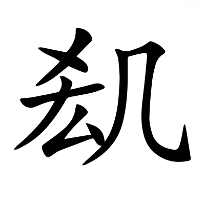，驚憚讋伏。郭璞曰：窮極倦，疲憊者也。驚憚讋伏，怖不動貌也。音劇。憚，丁曷切。讋，之涉切。

不被創刄而死者，他他籍籍。郭璞曰：言交橫也。他，徒河切。

填阬滿谷，掩平彌澤。〔善曰〕廣雅曰：大野曰平。

於是乎遊戲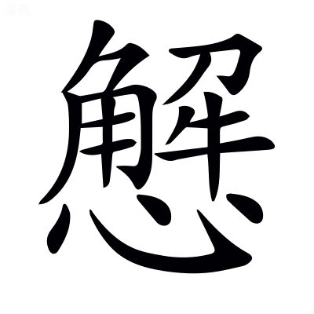怠，置酒乎顥天之臺，張揖曰：臺高，上干顥天也。

張樂乎膠葛之㝢。郭璞曰：言曠遠深貌也。

撞千石之鍾，張揖曰：千石，十二萬斤也。

立萬石之虡。張揖曰：虡獸，重百二十萬斤，以俠鍾旁。

建翠華之旗，樹靈鼉之鼓，張揖曰：以翠羽爲葆也，以鼉皮爲鼓也。郭璞曰：華，葆也。

奏陶唐氏之舞，如淳曰：舞咸池也。〔善曰〕尙書曰：惟彼陶唐。*孔安國曰：陶唐，堯氏也。*

聽葛天氏之歌。張揖曰：葛天氏，三皇時君號也。其樂，三人持牛尾，投足以歌八曲，一曰載民，二曰玄鳥，三曰育草木，四曰奮五穀，五曰敬天常，六曰徹帝功，七曰依地德，八百緫禽獸之極。韋昭曰：葛天氏，古之王者，其事見呂氏春秋。〔善曰〕呂氏春秋云：葛天氏之樂，以歌八~~闋~~曲：一曰載~~民~~氏[^8.1.61]，三曰~~遂~~育草木，六曰~~建~~徹帝功。今注以闋爲曲，以民爲氏，以遂爲育，以建爲徹，皆誤。

千人唱，萬人和。山陵爲之震動，川谷爲之蕩波。郭璞曰：波浪起也。

巴渝宋蔡，淮南干遮[^8.1.62]，郭璞曰：巴西閬中有渝水，獠居其上，皆剛勇[^8.1.63]好舞。初高祖募取，以平三秦，後使樂府習之，因名巴渝舞也。張揖曰：樂記曰「宋音燕女溺志。蔡人謳員三人，淮南鼓員四人。」干遮，曲名。

文成顛歌。文穎曰：文成，遼西縣名也，其縣人善歌。顛，益州顛縣，其人能作西南夷歌也。顛與滇同也。

族居遞奏，金鼓迭起。張揖曰：族，聚也。郭璞曰：遞，迭也；徒結切。

鏗鎗闛鞈，洞心駭耳。〔善曰〕鏗鎗，鍾聲也。闛鞈，鼓音也。毛詩曰：擊鼓其鏜。字書曰：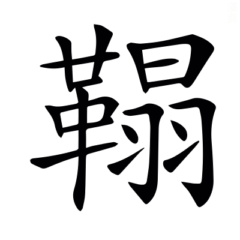，鼓聲。闛與鏜與鞈古字通。闛，託郎切。鞈音榻。

荊吳鄭衛之聲，郭璞曰：皆淫哇也。〔善曰〕禮記曰：鄭衛之音，亂世之音也。

韶濩武象之樂，文穎曰：韶，舜樂也。濩，湯樂也。大武，武王樂也。張揖曰：象，周公樂也。南人服象，爲虐於夷，成王命周公以兵追之，至於海南，乃爲三象樂。

陰淫案衍之音。郭璞曰：流沔曲也。衍，弋戰切。

鄢郢繽紛，激楚結風。李奇曰：鄢，今宜城縣也。郢，楚都也。繽紛，舞也。張揖曰：楚歌曲也。文穎曰：激，衝激，急風也[^8.1.64]；結風，回風，亦急風也[^8.1.65]。楚地風氣既自漂疾，然歌樂者猶復依激結之急風爲節也，其樂促迅哀切也。

俳優侏儒，狄鞮之倡，〔善曰〕三蒼曰：俳，倡也。優，樂也。禮記曰：夫新樂及優侏儒。郭璞曰：狄鞮，西戎樂名也。鞮，丁奚切。

所以娛耳目樂心意者，麗靡爛漫於前，郭璞曰：言恣所觀也。

靡曼美色。張揖曰：靡，細也。曼，澤也。〔善曰〕言作樂於前者，皆是靡曼也~~美色也~~。色下或云[^8.1.66]於後，非也。

若夫青琴宓妃之徒，伏儼曰：青琴，古神女也。如淳曰：宓妃，伏羲氏女，溺死洛，遂爲洛水之神。

絕殊離俗，郭璞曰：離俗，無雙也。

妖冶嫺都。〔善曰〕字書曰：妖，巧也。說文曰：嫺，雅也，或作閑。小雅曰：都，盛<!-- page129 -->也。

靚糚刻飾，便嬛綽約。郭璞曰：靚糚，粉白黛黑也。刻，刻畫鬋鬢也。便嬛，輕利也。綽約，婉約也。〔善曰〕莊子曰：綽約若處子。嬛音翾。靚音淨。

柔橈~~嫚嫚~~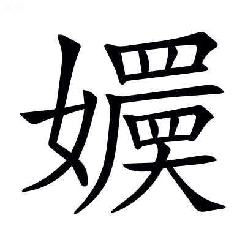[^8.1.67]，嫵媚孅弱。郭璞曰：柔橈嫚嫚，皆骨體耎弱長豔貌也。孅弱，弱顏也。〔善曰〕埤蒼曰：嫵媚，悅也。孅弱，謂容體孅細柔弱也。方言曰：自關而西，凡物小謂之孅。橈，女教切。~~嫚~~，於圓切。嫵音武。孅即纖字。

曳獨繭之褕絏，眇閻易以卹削。張揖曰：褕，襜褕也。絏，袖也。郭璞曰：獨繭，一繭之絲也。閻易，衣長大貌也。卹削，言如刻畫作之也。〔善曰〕褕音踰。絏音曳。易，弋示切。

便姍嫳屑，與俗殊服。郭璞曰：衣服婆娑貌。〔善曰〕便，步千切。姍音先。嫳，步結切。

芬芳漚鬱，酷烈淑郁。皓齒粲爛，宜笑的皪。郭璞曰：香氣盛也。漚，一候切。又曰[^8.1.68]：鮮明貌也。〔善曰〕楚辭曰：美人皓齒嫮以姱[^8.1.69]。又曰：嫮目宜笑娥眉曼。皪音礫。

長眉連娟，微睇緜藐。郭璞曰：連娟，言曲細也。緜藐，遠視貌。〔善曰〕娟，一全切。睇，大計切。藐音邈。

色授魂與，心愉於側。張揖曰：彼色來授，我魂往與接也。愉音踰。

於是酒中樂酣，郭璞曰：中，半也，中仲切。

天子芒然而思，似若有亡，司馬彪曰：亡，喪也。

曰：『嗟乎，此大奢侈！朕以覽聽餘閒，無事棄日。〔善曰〕言聽政既有餘暇，無事而虛棄時日也。閒音閑。

順天道以殺伐，郭璞曰：因秋氣也。〔善曰〕家語：孔子曰「啓蟄不殺，則順天道也。」

時休息於此。郭璞曰：謂苑囿中也。

恐後葉靡麗，遂往而不返，非所以爲繼嗣創業垂統也。』郭璞曰：言不可以示將來也。〔善曰〕爲，于僞切。孟子曰：君子創業垂統，爲可繼也。

於是乎乃解酒罷獵，而命有司曰：『地可墾闢，悉爲農郊，以贍萌隸，張揖曰：邑外謂之郊。郊，田也。詩曰：稅于農郊。韋昭曰：萌，民也。司馬彪曰：隸，小臣也。〔善曰〕爾雅曰：命，告也。蒼頡篇曰：墾，耕也。小雅曰：贍，足也。

隤墻填塹，使山澤之人得至焉。郭璞曰：芻蕘者往也，雉兔者往也。

實陂池而勿禁，虛宮館而勿仭。司馬彪曰：養魚鱉滿陂池，而不禁民取也。郭璞曰：虛，言不聚人衆其中也。仭，滿也。

發倉廩以救貧窮，補不足。〔善曰〕蔡邕月令章句曰：穀藏曰倉，米藏曰廩。孟子：齊景公興發補不足。*趙岐曰：興惠政，發倉廩，以振貧而補不足也。*

恤鰥寡，存孤獨。出德號，省刑罰。郭璞曰：號，號令也。

改制度，郭璞曰：變宮室車服。

易服色。郭璞曰：衣尚黑。

革正朔，郭璞曰：更以十~~二~~三月爲正[^8.1.70]，平旦爲朔。

與天下爲更始。』郭璞曰：新其事。

於是歷吉日以齋戒，張揖曰：歷，筭也。〔善曰〕周易曰：聖人以此齋戒。*韓康伯曰：洗心曰齋，防患曰戒。*

襲朝服，乘法駕，司馬彪曰：襲，服也。法駕，六馬也。

建華旗，鳴玉鸞，郭璞曰：鸞，鈴也。〔善曰〕楚辭曰：鳴玉鸞之啾啾。

游于六藝之囿，馳騖乎仁義之塗。郭璞曰：六藝：禮樂射御書數也。論語曰：游於藝。塗，道也。〔善曰〕藝，六經也。

覽觀春秋之林，如淳曰：春秋義理繁茂，故比之於林藪也。

射貍首，兼騶虞。郭璞曰：貍首，逸詩篇名，諸侯以爲射節。騶虞，召南之卒章，天子以爲射節也。

弋玄鶴，舞干戚。郭璞曰：干，楯也。戚，斧也。〔善曰〕言古者舞玄鶴以爲瑞，令弋取之而舞干戚也。尙書大傳曰：舜樂歌曰和伯之樂，舞玄鶴。公羊傳曰：朱干玉戚，以舞大夏。

載雲䍐，揜羣雅。張揖曰：䍐，罼也，前有九流雲罼之車。掩，捕也。詩小雅之材七十四人，大雅之材三十一人，故曰羣雅也。〔善曰〕先用雲䍐以獵獸，今載之於車，而捕羣雅之士也。

悲伐檀，張揖曰：其詩刺賢者不遇明王也。

樂樂胥。〔善曰〕毛詩曰：君子樂胥，受天之祜。言王者樂得材智之人使在位，故天與之福禄也。胥，先呂切。

脩容乎禮園，郭璞曰：禮，所以整威儀自脩飾也。

翶翔乎書圃。郭璞曰：尙書，所以䟽通知遠者，故遊涉之。

述易道，郭璞曰：脩絜靜精微之術。

放怪獸。張揖曰：苑中奇怪之獸，不復獵。

登明堂，坐清廟。郭璞曰：明堂者，所以朝諸侯處。清廟，太廟也。〔善曰〕禮記月令曰：天子居太廟太室。*鄭玄曰：太廟太室，中央室也。*

次羣臣，奏得失。四海之內，靡不受獲。〔善曰〕得恩德也。

於斯之時，天下大說，鄉風而聽，隨流而化，芔然興道而遷義。郭璞曰：芔猶勃也；許貴切。

刑錯而不用，德隆於三~~王~~皇[^8.1.71]，而功羨於五帝。〔善曰〕包咸論語注曰：錯，置也，千故切。司馬<!-- page130 -->彪曰：羨，溢也。

若此故獵，乃可喜也。若夫終日馳騁，勞神苦形。罷車馬之用，抏士卒之精。郭璞曰：精，銳也。抏，損也；音翫。

費府庫之財，而無德厚之恩。〔善曰〕管子曰：國雖盛滿，無德厚以安之，國非其國也。

務在獨樂，不顧衆庶。〔善曰〕鄭玄毛詩箋曰[^8.1.72]：顧，念也。

忘國家之政，貪雉兎之獲。則仁者不繇也。郭璞曰：繇，道也；音由。

從此觀之，齊楚之事，豈不哀哉！地方不過千里，而囿居九百，是草木不得墾辟，而人無所食也。〔善曰〕蒼頡篇曰：墾，耕也。薛君韓詩章句曰：辟，除也。

夫以諸侯之細，而樂萬乘之所侈[^8.1.73]，僕恐百姓被其尤也。」於是二子愀然改容，超若自失，郭璞曰：愀然，變色貌也；材誘切。〔善曰〕禮記曰：孔子愀然作色而對也。

逡巡避廗，〔善曰〕公羊傳曰：逡巡北面再拜。廣雅曰：逡巡，却退也。孝經曰：曾子避席。廗與席古字通。

曰：「鄙人固陋，不知忌諱，〔善曰〕廣雅曰：鄙，小也。

乃今日見教，謹受命矣。」

[^8.1.1]: 考異：曰楚則失矣　茶陵本有校語云善作「是」，蓋所見本「楚」譌爲「是」也。袁本無。史記、漢書皆作「楚」。

[^8.1.2]: 考異：所以述職也　茶陵本云善無「也」字。袁本無校語。史記、漢書皆有。

[^8.1.3]: 考異：不務明君臣之義　袁本、茶陵本云善無「臣」字。史記、漢書皆有。

[^8.1.4]: 考異：而適足以君自損也　案：當作「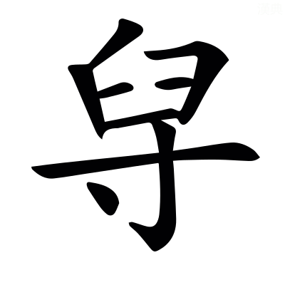」，各本皆譌。其字上「臼」下「寸」，在說文巢部。今漢書作「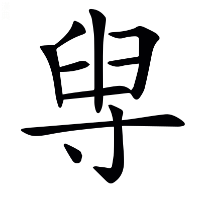」，亦譌也。史記作「貶」，與五臣同。

[^8.1.5]: 考異：注「河南穀羅縣」　陳云「河南」漢書注作「西河」爲是。案：史記正義引亦作「西河」。今漢書地理志「西河郡穀羅，武澤在西北」。依文穎此注，似其本「武」作「紫」也。

[^8.1.6]: 考異：注「在縣北」　案：「北」上當有「西」字，漢書注可證，地理志亦可證，各本皆脫。

[^8.1.7]: 考異：注「今名沇水」　陳云「沇」當作「沈」，詳漢書顏注。今案：陳說非也，當作「泬」。史記索隱引姚氏云「今名泬水」，善全取彼文與顏注「此即今所謂沈水」迥異。

[^8.1.8]: 考異：注「黃子陂」　袁本、茶陵本「黃」作「皇」。案：史記索隱引姚氏正作「皇」，「皇」字是也。漢書注亦作「皇」，陳校依漢注。

[^8.1.9]: 考異：注「經至昆明池」　袁本、茶陵本無「經」字。案：史記索隱引姚氏云「注昆明池」，漢書顏注云「經昆明池」。此尤延之校改「至」作「經」，因誤兩存也。

[^8.1.10]: 考異：注「周旋苑中也」　袁本、茶陵本「周」上有「言」字。

[^8.1.11]: 考異：注「善曰楚辭曰」　袁本、茶陵本無「善曰」二字，有「郭璞曰椒丘見」六字。今案：當作「郭璞曰椒丘見楚辭善曰楚辭曰」十三字，各本皆脫。

[^8.1.12]: 考異：注「馳椒丘兮焉且且止也音昌呂切」　袁本、茶陵本無「焉且且止也」五字，袁本有「且且」二字，茶陵本有「焉且且」三字。案：各本皆譌，當作「馳椒丘且焉止息也且音昌呂切」。此離騷經文。

[^8.1.13]: 考異：注「司馬彪曰畢弗」　案：「畢」當作「滭」，史記索隱引可證。各本皆譌。

[^8.1.14]: 考異：注「淈水出貌」　袁本、茶陵本無此四字。

[^8.1.15]: 考異：汩濦漂疾　袁本「濦」作「㴔」，云善作「濦」。茶陵本云五臣作「㴔」。案：各本所見皆非也。史記、漢書皆作「㴔」。善引韋昭曰「㴔，許及切」，即漢書音正作「㴔」可知。彼載晉灼「華給反」，郭璞「許立反」，史記索隱同，諸家無作「濦」者。又各本注中亦譌「濦」。

[^8.1.16]: 考異：注「說文曰漻清深也」　袁本、茶陵本無此七字。

[^8.1.17]: 考異：注「其形狀而出也」　袁本、茶陵本「其形狀」作「言溢」。漢書注作「言湓溢」。陳云別本作「言溢」爲是。

[^8.1.18]: 考異：注「張揖曰其形狀未聞」　袁本、茶陵本無「其形狀」三字。

[^8.1.19]: 考異：注「魠鱤一名黃曰頰」　袁本、茶陵本無「曰」字。案：依漢書注無「曰」字，鱤下當有「也」字。

[^8.1.20]: 考異：注「兩相合得乃行」　袁本、茶陵本無「合」字。案：漢書注有，蓋尤依彼添。陳云「得乃」當從漢書注作「乃得」。

[^8.1.21]: 考異：注「隱岸坻也」　袁本、茶陵本「坻」作「底」，漢書注作「底」。案：當以尤爲是，即海賦云「巖坻之隈」者也，二本及漢書注皆傳寫譌耳。

[^8.1.22]: 考異：注「常庭之山」　袁本、茶陵本「常」作「重」。案：今本山海經作「堂」，一作「常」，疑善引自異。

[^8.1.23]: 考異：摧崣崛崎　袁本、茶陵本「摧」作「嶊」，史記、漢書皆作「嶊」。案：此尤本之誤，注同。

[^8.1.24]: 考異：注「振拔也」　袁本、茶陵本「拔」作「收」。何云下言「收斂溪水」，當從「收」。今案：漢書注、史記索隱引皆作「拔」。

[^8.1.25]: 考異：注「隱轔鬱壘」　茶陵本「壘」作「㠥」袁本與此同。案：下云「㠥音壘」，蓋茶陵本是也。今本漢書亦正文「㠥」、注「壘」，歧誤正同此。

[^8.1.26]: 考異：注「郭璞山海經曰」　何校「經」下添「注」字，陳同。各本皆脫。

[^8.1.27]: 考異：蔣苧青薠　案：「苧」當作「芧」，史記、漢書皆作「芧」，各本及注中俱譌，五臣作「芋，云句切」，大誤。又案：玉篇「芋」、「苧」同，與此賦之「芧」迥別，彼乃說文所云「草可以爲繩」者，此張揖解爲「三稜」。三稜類詳見政和經史證類本草，實異名同，不可援以相證，決爲譌字無疑。

[^8.1.28]: 考異：注「說文曰馣馤」　案：此「曰」下有脫也。各本皆同，無以補之。或因此謂說文有「馣馤」，非。羣書引說文而未見者，皆不必今本脫去也。

[^8.1.29]: 考異：注「騾驘同」　案：當作「驘騾同」，誤倒也。正文，五臣作「騾」，史記亦作「騾」。凡五臣每取善注以改字或取他書，皆此類。漢書作「䯁」。袁本、茶陵本刪此注，非。

[^8.1.30]: 考異：注「中途樓閣間陛道」　案：「中」字不當有。史記集解引無。各本皆衍。

[^8.1.31]: 考異：青龍蚴蟉於東葙　案：「葙」當作「箱」。史記、漢書皆作「箱」，善與之同。今各作「葙」，凡偏旁「竹」「艹」每相混耳。五臣改作「廂」，非也。

[^8.1.32]: 考異：盤石振崖　案：「振」當作「裖」，注同。史記、漢書皆作「裖」。高唐賦「裖陳磑磑」，善注云「裖，已見上林賦」。彼五臣作「振」，然則此賦亦爲五臣亂之，而失其校語也。

[^8.1.33]: 考異：注「其處磅磄千仞」　案：此下當有「磅磄與旁唐音義同」一句，各本皆無，蓋脫也。

[^8.1.34]: 考異：盧橘夏熟　袁本、茶陵本云「熟」善作「熱」。案：二本所見誤也。史記、漢書皆作「孰」，善與之同。「孰」即「熟」字。

[^8.1.35]: 考異：楟柰厚朴　「楟」當作「亭」，注引張揖曰「亭山梨也」，蓋善作「亭」，五臣作「楟音亭」，而各本亂之也。漢書作「亭」，史記作「楟」，善此賦大略文同漢書者較多。

[^8.1.36]: 考異：注「其實似縠子」　袁本、茶陵本「縠」作「穀」，無「子」字。案：「穀」，亦譌也。此字從「木」不從「禾」，楮也。漢書注、史記索隱皆云「穀子」，尤依添，但「縠」字益譌。

[^8.1.37]: 考異：注「採木也」　何校「採」改「棌」，下「採音采」同。漢書注作「采音菜」。

[^8.1.38]: 考異：注「崔錯交雜癹骪蟠戾也」　袁本、茶陵本作「錯相樛也」四字。考史記索隱引郭璞云「崔錯癹骪者，蟠戾相樛也」。袁、茶陵二本有脫，尤所添改，在今漢書顏注，亦未是，當作「蟠戾相樛也」五字。

[^8.1.39]: 考異：注「郭璞曰坑衡徑直貌閜砢相扶持也」　袁本、茶陵本無「閜砢相扶持」五字。案：史記索隱引郭璞云「坑衡、閜砢者，揭孽傾欹貌也」，尤所添，在今漢書顏注，亦未是。或「坑衡徑直貌也」一句，係善注誤連爲郭耳。

[^8.1.40]: 考異：注「英謂華也」　袁本、茶陵本無此四字。案：在今漢書顏注。

[^8.1.41]: 考異：蜼玃飛　茶陵本「」作「蠝」。案：注中三見，下二字不從「土」，漢書作「蠝」，史記作「䴎」，單行本索隱仍作「蠝」。考集韻五旨，「䴎」下重文有六，而不載「」，可證其非。袁本正文作「」，注皆作「蠝」，以南都賦互證，疑五臣本之誤，而又相亂也。

[^8.1.42]: 考異：注「飛鼠也」　案「鼠」上當有「飛」字。案漢書注、史記集解、索隱有。陳云別本有，各本皆脫。南都賦注引「蠝，飛鼠也」，脫上「飛」字，當互訂。

[^8.1.43]: 考異：注「在樹暴戲恣態也」　陳云「暴」當作「共」。案：漢書注、史記正義引作「共」。各本皆誤。

[^8.1.44]: 考異：注「說文曰杪末也」　袁本、茶陵本無此六字。

[^8.1.45]: 考異：娛遊往來　案：「娛」當作「娭」。各本皆譌。注引說文「娭，許其切」，非「娛」甚明。史記作「嬉」，「娭」、「嬉」同字也。今本漢書及注誤與此同。又見羽獵賦。

[^8.1.46]: 考異：注「有似虯」　何校引徐七來惇復曰：「似」下脫「玉」字，據漢書注校，是也。各本皆脫。

[^8.1.47]: 考異：注「龍也無角」　何校引徐曰「子」誤「也」，據漢書注校。袁本「無」作「有」，茶陵本亦作「無」。案：漢書注作「有」。說文「虯，龍子有角者」，稚讓所本，故其廣雅亦云「有角曰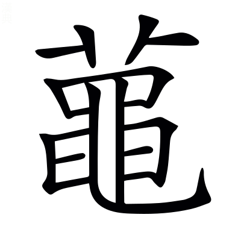龍，即虯，上卝者，角也」，此注決不當自爲兩解。唯王逸注離騷「有角曰龍，無角曰虯」。善彼注仍之，所以各存異說，或不知者用彼以改此也。

[^8.1.48]: 考異：注「李善曰孫叔者」　袁本、茶陵本「李善」作「鄭玄」。案：「玄」當作「氏」，漢書注作「氏」，最是。「鄭氏」，見顏師古敘例臣瓚云「鄭德」者也。

[^8.1.49]: 考異：注「言擊嚴鼓簿鹵之中也」　袁本、茶陵本「簿鹵」作「鹵簿」，是也。陳云別本二字乙。

[^8.1.50]: 考異：河江爲阹　茶陵本作「江河」，云善作「河江」。袁本作「江河」，無校語。史記、漢書皆作「江河」。

[^8.1.51]: 考異：注「生謂生取之也」　袁本、茶陵本「謂生取」三字作「抗」字。案：尤所添改，在今漢書顏注，亦未是。「抗」當作「執」，「生執之也」四字一句讀。五臣向注「生，生執」，即襲韋，可借爲證。

[^8.1.52]: 考異：注「絝謂絆絡之也」　袁本、茶陵本無「謂絆之」三字。案：史記集解引有此三字。尤延之蓋依彼添。

[^8.1.53]: 考異：注「司馬彪漢書曰」　何校「漢」上添「續」字，陳同。各本皆脫。

[^8.1.54]: 考異：椎蜚廉　案：「椎」史記、漢書皆作「推」。顏注云「推，亦謂弄之也」，其字從「手」。今流俗讀作「椎擊之椎」，失其義矣。考五臣銑注「椎謂擊殺」，其本作「椎」之明文。善既不注此字，袁、茶陵二本又俱無校語，未審何作也。凡偏傍「扌」「木」每相混。

[^8.1.55]: 考異：注「以白羽爲箭」　袁本、茶陵本「爲」作「羽」。案：重「羽」最是。上「羽」言體，下「羽」言用。漢書注、史記正義引皆可證。

[^8.1.56]: 考異：注「郭璞老子經注曰」　陳云此七字衍。張氏乃曹魏時人，不當引郭語。老子又無郭注。其說是矣。各本皆衍。

[^8.1.57]: 考異：注「與元通靈」　陳云「元」當作「天」，漢書注可據。今案：漢書注譌也。史記正義正作「元」。鄭禮記注引孝經說曰「上通元莫」，即此「元」字之義。

[^8.1.58]: 考異：注「樂汁圖」　案：「圖」下當有「徵」字。史記索隱引有。各本皆脫。

[^8.1.59]: 考異：注「率徑馳去也」　袁本、茶陵本「徑」作「然」。案：考漢書顏注曰「率然直去意」，或尤改「馳」爲「徑」而誤去「然」字。

[^8.1.60]: 考異：蹷石闕　袁本、茶陵本「闕」作「關」，而不著校語。案：依此善與五臣同作「關」也。漢書作「關」，史記作「闕」，善引張揖漢書注則作「關」，未爲非。恐此是尤延之依史記改。前卷及漢書楊雄傳俱作「關」字。

[^8.1.61]: 考異：注「一曰載民」　案：「民」當作「氏」。各本皆譌，下有明文。漢書注誤與此同。

[^8.1.62]: 考異：淮南干遮　何云「干」史、漢作「于」。案：善及小司馬皆引張揖漢書注，不當有異文，蓋今各本作「于」並譌耳。

[^8.1.63]: 考異：注「皆剛勇」　袁本、茶陵本無此三字。案：史記索隱引無，集解有，尤蓋依彼添。

[^8.1.64]: 考異：注「衝激急風也」　袁本、茶陵本「衝」上有「激」字，單行本索隱有，舞賦及七發注有，七命注「衝激」作「激衝」，脫下「激」字，當互訂。

[^8.1.65]: 考異：注「結風亦急風也」　案：單行本索隱「結風」下有「回風」二字，舞賦、七發、七命注皆有，依文義，有者是也。各本此注脫。

[^8.1.66]: 考異：注「皆是靡曼美色也下或云」　袁本、茶陵本「美色也」三字作「也色」二字。案：「也」句絕，「色」屬下，尤添改失之。

[^8.1.67]: 考異：柔橈嫚嫚　案：「嫚嫚」當作「」，漢書作「」，可證也。善注「於圓切」，正爲「」字作音，或五臣誤爲「嫚」，而各本亂之耳。史記作「嬛」，亦「」字之譌。徐廣曰「音娟」。「」即「娟」字，古人每以同字爲音也。小司馬引廣雅「，容也」。今索隱盡作「嬛」，大誤。

[^8.1.68]: 考異：注「香氣盛也漚一候切又曰」　袁本、茶陵本無此十字。

[^8.1.69]: 考異：注「嫮以姱」　袁本、茶陵本「嫮」作「奼」。案：此尤校改也。

[^8.1.70]: 考異：注「更以十二月爲正」　何校引徐曰「二」當作「三」。案：所校是也。漢書武紀「太初元年以正月爲歲首」。師古曰：「謂建寅之月爲正也。」郭取彼事爲義。「夏以十三月爲正」，原出緯書，不知者誤改之。

[^8.1.71]: 考異：德隆於三王　茶陵本云五臣作「皇」，袁本云善作「王」。案：各本所見皆非也。史記、漢書皆作「皇」，善自與之同，傳寫譌耳。

[^8.1.72]: 考異：注「鄭玄毛詩曰」　案：「詩」下當有「箋」字。各本皆脫。

[^8.1.73]: 考異：而樂萬乘之侈　袁本「之」下有「所」字，云善無。茶陵本云五臣有「所」，漢書有。何云「萬乘之所侈，謂天子猶謂此太奢侈者也」。今案：史記亦有，或各本所見脫之。

[^8.1.m1]: 愚案：此處當有善曰二字。

[^8.1.m2]: 愚案：「陵」，胡本原作「凌」，依注文及上海古籍本改。

[^8.1.m3]: 愚案：史記下當有「注」字。

## 羽獵賦一首[^8.2.1]

并序

> 楊子雲

孝成帝時羽獵，服虔曰：士卒負羽也。〔善曰〕高唐賦曰：傳言羽獵。

雄從。以爲昔在二帝三王，應劭曰：堯舜夏殷周也。〔善曰〕春秋說題辤曰：尙書者，二帝之迹，三王之義，所以推期運，明命授之際。

宮館臺榭，沼池苑囿，林麓藪澤，財足以奉郊廟，御賓客，充庖廚而已，〔善曰〕財與纔同。毛萇詩傳曰：御，進也。禮記曰：天子無事，歲三田，一爲乾豆，二爲賓客，三爲充君之庖也。

不奪百姓膏腴穀土桑柘之地。女有餘布，男有餘粟，〔善曰〕孟子曰：以羨補不足，則農有餘粟，女有餘布也。

國家殷富，上下交足。故甘露零其庭，醴泉流其唐，〔善曰〕禮記曰：天降膏露，地出醴泉。孝經援神契曰：甘露，一名膏露。應劭曰：爾雅曰，廟中路，謂之唐也。

鳳凰巢其樹，黃龍游其沼，麒麟臻其囿，神爵棲其林。〔善曰〕禮記曰：鳳皇麒麟，皆在郊藪，龜龍在宮沼。漢書注曰：神雀，大如鷄，斑文。

昔者禹任益虞，而上下和，草木茂，〔善曰〕尙書：帝曰「疇若予上下草木。」禹曰「益哉。」帝曰「汝作朕虞。」*孔安國曰：上謂山，下謂澤也。*

成湯好田，而天下用足；〔善曰〕呂氏春秋曰：湯見網置四面，湯拔其三面也。

文王囿百里，民以爲尚小；齊宣王囿四十里，民以爲大：裕民之與奪民也。〔善曰〕孟子：齊宣王問孟子曰「文王之囿方七十里，有諸？」曰「有之。」「若是其大乎？」答曰「民猶以爲小也。」「寡人之囿方四十里耳，民猶以爲大，何也？」答曰「文王之囿，與人同之，民以爲小，不亦宜乎？王之囿四十里，殺其麋鹿，如殺人之罪，人以爲大，不亦宜乎？」孫卿子曰：足國之道，節用裕民，而善藏其餘。不知節用裕民，雖好取侵奪，猶將寡獲也。

武帝廣開上林，~~東~~南至宜春[^8.2.2]鼎湖，御宿昆吾，晉灼曰：鼎湖宮，黃圖以爲在藍田。昆吾，地名，上有亭。〔善曰〕宜春，已見上文。三秦記曰：樊川，一名御宿。

旁南山，西至長楊五柞，〔善曰〕漢書曰：盩厔有長楊五柞宮。旁，步浪切。

北繞黃山，~~濱~~賓渭而東[^8.2.3]，〔善曰〕漢書曰：槐里有黃山之宮。濱，涯也。言循渭水之涯而東也。公羊傳：濤塗曰「濱海而東。」濱與賓同音也。

周袤數百里。〔善曰〕說文曰：南北曰袤。

穿昆明池，象滇河，瓚曰：西南夷有昆明國，又有滇池，故作昆明池以象之，以習水戰。

營建章鳳闕，神明馺娑，孟康曰：馺娑，殿名也。〔善曰〕鄭玄毛詩箋曰：營，治也。建章，宮名也。神明，臺名也。

漸臺泰液，象海水周流方丈瀛洲蓬萊。〔善曰〕漢書曰：建章，其北治太液池，漸臺高二十餘丈，名曰泰液，中有蓬萊方丈瀛洲，象海中仙山。*服虔曰：海中三山名，法効象之。*

游觀侈靡，窮妙極麗。雖頗割其三垂，以贍齊民，〔善曰〕三垂，謂西方南方東方。武帝侵三垂以置郡，故謂之割。漢書：杜鄴上書曰「三垂蠻夷。」又雄上書曰「北狄，中國之堅敵，三垂比之，縣矣。」爾雅曰：邊，垂也。如淳曰：齊，等也。無有貴賤，故謂之齊人，若今言平人矣。晉灼曰：中國被教齊整之民。

然至羽獵，甲車戎馬，器械儲偫，禁禦所營，〔善曰〕說文曰：儲<!-- page131 -->偫，待也。應劭曰：禦，禁也，謂禁止往來。營，謂造作也。即賦云「禦自汧渭，經營酆鄗」。甲或爲田，非也。

尚泰奢麗誇詡，〔善曰〕毛萇詩傳曰：詡，大也；許羽切。

非堯舜成湯文王三驅之意也。〔善曰〕三驅，已見西都賦。

又恐後世復脩前好，不~~折~~制中以泉臺[^8.2.4]，服虔曰：魯莊公築泉臺[^8.2.5]，非禮也，至文公毀之，公羊譏云：先祖爲之而毀之，勿居而已。今楊雄以宮觀之盛，非成帝所造，勿脩而已，當以泉臺爲折中也。韋昭曰：制或爲折也。

故聊因校獵，賦以風之。〔善曰〕七略曰：羽獵，永始三年十二月上。校獵，已見上文。

其辭曰：

或稱羲農，豈或帝王之彌文哉？〔善曰〕假爲人也。或人之意[^8.2.6]，言古之樸素而合禮者，咸稱羲農，是則豈或謂後代帝王，彌加文飾，而不合禮哉。故論者答之於下。

論者云否，各~~以~~亦並時而得宜[^8.2.7]，奚必同條而共貫？〔善曰〕論者，雄自謂也。言帝王文質，各並時而得宜，何必同條而共貫乎？言必不然也。尙書大傳曰：否，不也。漢書：武帝制曰「帝王之道，豈不同條共貫也？」

則泰山之封，焉得七十而有二儀？孟康曰：言封禪各~~言~~異也[^8.2.8]。〔善曰〕管子曰：古之封太山禪梁父者七十二家，而夷吾所記者，十有二焉。

是以創業垂統者俱不見其爽，遐邇五三，孰知其是非？張晏曰：爽，差也。不差其優劣，誰知其賢愚也。〔善曰〕言創業垂統者，各隨時立制，皆不見其差爽，故五帝三王，誰知其是非乎？但文質不同，明無是非也。廣雅曰：爽，差也。

遂作頌曰：麗哉神聖，處於玄宮。富既與地乎侔訾，貴正與天乎比崇。〔善曰〕玄，北方也。禮記月令曰：季冬，天子居玄堂右个。蔡邕月令章句曰：玄，黑也，其堂尚玄。莊子曰：夫道，顓頊得之以處玄宮。又曰：莫神於天，莫富於地，莫大於帝王，故曰帝王之德配天地。

齊桓曾不足使扶轂，楚嚴未足以爲驂乘。狹三王之阨僻，嶠高舉而大興。〔善曰〕史記曰：齊公子小白立，是爲桓公。又曰：楚穆王卒，子莊王侶立。春秋感精記曰：黃池之會，重吳子，滕薛夾轂，魯衛驂乘。鄭氏曰：阨僻，陋小也。王逸楚辭注曰：嶠，舉也。嶠音矯。

歷五帝之寥廓，涉三皇之登閎。〔善曰〕寥廓，高遠也。韋昭曰：登，高也。閎，大也。

建道德以爲師，友仁義與之爲朋。於是玄冬季月，天地隆烈，〔善曰〕北方水色黑，故曰玄冬。隆烈，陰氣盛。

萬物權輿於內，徂落於外，〔善曰〕爾雅曰：權輿，始也。大戴禮曰：孟春，百草權輿。

帝將惟田于靈之囿，開北垠受不周之制，〔善曰〕薛君韓詩章句曰：惟，辭也。孟康曰：西北爲不周風，謂冬時也。

以~~奉~~終始顓頊玄冥之統[^8.2.9]。應劭曰：顓頊玄冥，皆北方之神，主殺戮者。

廼詔虞人典澤，東延昆鄰，西馳閶闔。〔善曰〕孔安國尙書傳曰：虞，掌山澤之官。又曰：延，及也。張晏曰：東至昆明之邊也。〔善曰〕閶闔，已見上文。

儲積共偫，戍卒夾道。〔善曰〕~~郭~~犍爲舍人爾雅注曰[^8.2.10]：共，具物也。偫，具事也。漢書曰：廷中陳車騎，戍卒，衛官也。

斬叢棘，夷野草。〔善曰〕杜預左氏傳注曰：夷，殺也。

禦自汧渭，經營酆鎬。〔善曰〕孔安國尙書傳曰：經營，規度也。

章皇周流，出入日月，天與地沓。〔善曰〕章皇猶彷徨也。周流，周匝流行也。出入日月，言其廣大，日月似在其中出入也。張晏曰：日出扶桑，入湯谷。應劭曰：沓，合也。

爾廼虎路三嵕，以爲司馬，圍經百里，而爲殿門。晉灼曰：路音落。~~落，纍也。~~[^8.2.11]服虔曰：以竹虎落此山也。應劭曰：外門爲司馬門，殿門在內也。〔善曰〕三嵕，已見上文。

外則正南極海，邪界虞淵。應劭曰：虞淵，日所入也。〔善曰〕爾雅曰：極，至也。淮南子曰：至于虞淵，是謂黃昬。

鴻濛沆茫，揭以崇山。韋昭曰：鴻濛沆茫，水草廣大貌也。〔善曰〕薛綜東京賦注曰：揭猶表也。鴻，胡孔切。濛，莫孔切。沆，胡朗切。茫音莽、揭音竭也。

營合圍會，然後先置乎白楊之南，昆明靈沼之東。張晏曰：先置供具於前也。服虔曰：白楊，觀名也。〔善曰〕三秦記曰：昆明池中有靈沼神池。

賁育之倫，蒙盾負羽，杖鏌邪而羅者以萬計。〔善曰〕說苑曰：勇士孟賁，水行不避蛟龍，陸行不避虎狼。育，夏育也，已見西京賦。說文曰：鏌邪，大戟也。鏌音莫。邪，弋奢切。

其餘荷垂天之罼，張竟壄之罘。〔善曰〕言罼之大，垂天之邊也。

靡日月之朱竿，曳彗星之飛旗。〔善曰〕朱竿<!-- page132 -->，太常之竿也。周禮：日月爲太常，王建太常。穆天子傳曰：日月之旗，七星之文。河圖曰：彗星者，天地之旗也。楚辭曰：攬彗星以爲旗。

青雲爲紛，紅蜺爲繯，屬之乎崑崙之虛。韋昭曰：紛，旗旒也。繯，旗上繫也。〔善曰〕鄭玄喪服傳注曰：屬，連也。爾雅曰：河出崑崙虛。繯，下犬切。屬，之欲切。虛音墟。

渙若天星之羅，浩如濤水之波。〔善曰〕天星之羅，言光明也。濤水之波，言廣大也。

淫淫與與，前後要遮。〔善曰〕淫淫與與，皆行貌也。

欃槍爲闉，明月爲候。孟康曰：闉，戰闘自障蔽，如城門外女垣也。〔善曰〕杜預左傳注曰：候，望敵者。

熒惑司命，天弧發射。張晏曰：熒惑，執法[^8.2.12]，使司~~命~~不祥[^8.2.13]。天弧，虛上二星。〔善曰〕樂緯稽耀嘉曰：熒惑主命。禮記曰：凡生於天地之閒者，皆曰命。漢書曰：狼下有四星曰弧。

鮮扁陸離，駢衍佖路。服虔曰：鮮扁，戰闘軍陣貌也。駢衍，軍壘駢衍也。晉灼曰：佖，滿也。〔善曰〕扁音篇。佖，頻一切。

徽車輕武，鴻絧緁獵。晉灼曰：徽，疾貌也；音揮。〔善曰〕廣雅曰：武，徤也。鴻絧，相連貌也。緁獵，相次貌也。鴻，胡弄切。絧，徒弄切。緁音捷。

殷殷軫軫，被陵緣岅。窮敻極遠者，相與列乎高原之上。〔善曰〕殷軫，盛貌也。敻或爲冥。殷音隱。

羽騎營營，昈分殊事。韋昭曰：騎，負羽也。蘇林曰：昈，明也。〔善曰〕毛萇詩傳曰：營營，往來貌。昈分，謂羽騎明白分別，各殊其事也。昈音戶。

繽紛往來，轠轤不絕。若光若滅者，布乎青林之下。孟康曰：轠轤，連屬貌也。如淳曰：轠音雷。轤音盧。

於是天子乃以陽晁，始出乎玄宮，〔善曰〕陽~~朝~~晁，陽明之朝[^8.2.14]。晁，古字同也。

撞鴻鍾，建九旒，〔善曰〕尙書大傳曰：天子將出，則撞黃鍾之鍾。禮記曰：龍旗九旒也。

六白虎，載靈輿。〔善曰〕杜~~業~~延年奏~~事~~曰[^8.2.15]：輬車駕白虎四。白虎，馬名。服虔曰：靈輿，天子輿也。

蚩尤並轂，蒙公先驅。〔善曰〕韓子曰：黃帝駕象車，異方並轂，蚩尤居前。楚辭曰：選衆以並轂。漢書音義曰：蒙公，蒙恬也；如淳曰：蒙公，髦頭也；晉灼曰：此多說天子事，如說是。並，步浪切。

立歷天之旂，曳捎星之旃。韋昭曰：歷，干也。捎，拂也。

霹靂烈缺，吐火施鞭。應劭曰：霹靂，雷也。烈缺，閃也。火，電照也。〔善曰〕言威德之盛，役使百神，故霹靂烈缺，吐火施鞭，而爲衛也。閃，失染切。

萃傱沇溶，淋離廓落，戲八鎮而開關。應劭曰：四方四隅爲八鎮。如淳曰：不言九者，一鎮在中，天子居之故也。〔善曰〕埤蒼曰：傱，走貌也。沇溶，盛多之貌也。上林賦曰：沇溶淫鬻。傱，先勇切。沇，以永切。溶音容。戲音麾。

飛廉雲師，吸嚊潚率，鱗羅布烈[^8.2.16]，攢以龍翰。〔善曰〕楚辭曰：後飛廉使奔屬。*王逸曰：飛廉，風伯也。*雲師，已見吳都賦。說文曰：吸，~~喘~~內息也[^8.2.17]。埤蒼曰：嚊，喘息聲也。潚率，吸嚊之貌。鱗羅，若鱗之羅也。攢以龍翰，若龍翰之聚也。鄭玄尙書大傳注曰：翰，毛之長大者。嚊，普利切。潚音肅。

啾啾蹌蹌，入西園，切神光。〔善曰〕郭璞三蒼解詁曰：啾啾，衆聲也；啾或爲秋。蹌蹌，行貌。楚辭曰：鳴玉鸞之啾啾。張晏曰：切，近也。神光，宮名也。

望平樂，徑竹林。張揖曰：平樂，館名。晉灼曰：在上林中也。

蹂蕙圃，踐蘭唐。〔善曰〕蕙圃，已見子虛賦。服虔曰：蘭唐，蘭生唐中也。

舉熢烈火，轡者施技，〔善曰〕轡者，執轡之人也。

方馳千駟，狡騎萬帥。晉灼曰：狡徤之騎也。〔善曰〕鄭玄毛詩箋曰：方，併也。

虓虎之陳，從橫膠轕。猋拉雷厲，驞駍駖礚。服虔曰：虓音哮。鄧展曰：拉音獵。〔善曰〕毛詩曰：噉如虓虎。拉，風聲也。哮，火交切。轕音葛，驞，疋人切。駍，普萌切。駖，力莖切。

洶洶旭旭，天動地岋。〔善曰〕洶洶旭旭，鼓動之聲也。韋昭曰：岋，動貌也。洶，旭勇切。岋，五合切。

羨漫半散，蕭條數千里外。〔善曰〕羨，弋戰切。

若夫壯士忼慨，殊鄉別趣。〔善曰〕鄉音向。毛萇詩傳曰：趣，趨也。

東西南北，騁耆奔欲。〔善曰〕言各隨其耆欲而奔騁也。耆音嗜。

扡蒼狶，跋犀犛[^8.2.18]，蹶浮麋。韋昭曰：跋，蹋也。應劭曰：蹶，頓也。〔善曰〕廣雅曰：扡，引也；音他。浮麋，過麋也。跋，步末切。蹶，居月切。

斮巨狿，搏玄猨。韋昭曰：斮，斬也；側略切。服虔曰：巨狿，獸名也。〔善曰〕廣雅曰：搏，擊也。狿，已見上林賦。

騰空虛，距連卷。張晏曰：連卷，木也。〔善曰〕距，古岠字也。孔安國尙書傳曰：距，至也。卷音拳。

踔夭蟜，娭澗間。張晏曰：踔夭蟜之枝也。〔善曰〕三蒼詁訓曰：踔，踰也，丑孝切。

莫莫紛紛，山谷爲之風猋，林叢爲之生塵。〔善曰〕莫莫紛紛，<!-- page134 -->風塵之貌也。

及至獲夷之徒，蹶松柏，掌蒺~~藜~~蔾[^8.2.19]。服虔曰：獲夷，能獲夷狄者。〔善曰〕蹶，踏也。掌，以掌擊之也。爾雅曰：茨，蒺~~藜~~蔾。

獵蒙蘢，轔輕飛。〔善曰〕蒙蘢，已見上文。輕飛，輕獸飛禽也。

屨般首，帶脩蛇。如淳曰：般音班。班首，虎之頭也。〔善曰〕屨，謂踐履之也。淮南子曰：吳爲封豕長蛇。

鉤赤豹，摼象犀。韋昭曰：摼，扼也。〔善曰〕摼，古牽字。

跇巒阬，超唐陂。如淳曰：跇，超踰也。音義曰：巒，山小而銳。阬，大坂也。

車騎雲會，登降闇藹。〔善曰〕闇藹，衆盛貌。闇，烏感切。

泰華爲旒，熊耳爲綴。張晏曰：旒，幡；綴，旌也。〔善曰〕綴亦旒也。司馬相如大人賦曰：垂絳幡之素蜺。*張揖曰：以赤氣爲幡，綴以白氣也。*

木仆山還，漫若天外。如淳曰：還音旋，言山爲之回旋也。〔善曰〕宋玉大言賦曰：長劔耿介倚天外。

儲與乎大浦，聊浪乎宇內。服虔曰：儲與，相羊貌也。浦，水涯也。〔善曰〕淮南子曰：陰陽儲與。聊浪，放蕩也。與音餘。浦音普。浪音琅。

於是天清日晏，〔善曰〕許慎淮南子注曰：晏，無雲之處也。

逢蒙列眥，羿氏控弦。〔善曰〕吳越春秋曰：黃帝作弓，後有楚狐父以其道傳羿，羿傳逢蒙。說文曰：匈奴名引弓曰控弦。

皇車幽輵，光純天地，服虔曰：皇車，君車也。李奇曰：純，緣繞也。〔善曰〕幽輵，車聲也。方言曰：純，文也。輵，一轄切。純，之允切。

望舒彌轡，服虔曰：望舒，月御也。如淳曰：楚辭曰「前望舒使先駈。」〔善曰〕彌轡，按行貌也。彌與弭古字通。彌，莫爾切。

翼乎徐至於上蘭。晉灼曰：上蘭觀在上林中也。

移圍徙陣，浸淫蹵部。〔善曰〕部，軍之部伍也。毛萇詩傳曰：蹙，促也；蹵古字通；子育切。

曲隊堅重，各按行伍[^8.2.20]。〔善曰〕隊，徒內切。行，胡郎切。

壁壘天旋，神抶電擊，〔善曰〕言威之盛也。埤蒼曰：抶，笞擊也。

逢之則碎，近之則破。〔善曰〕六韜：太公曰「當之者破，近之者亡。」

鳥不及飛，獸不得過。〔善曰〕高唐賦曰：飛鳥未及起，走獸未及發。

軍驚師駭，刮野掃地。〔善曰〕言殺獲皆盡，野地似乎掃刮也。宋衷春秋緯注曰：驚，動也。廣雅曰：駭，起也。刮，古滑切。掃，先早切。

及至罕車飛揚，武騎聿皇。〔善曰〕罕，~~罼~~畢罕也[^8.2.21]。聿皇，輕疾貌。

蹈飛豹，羂嘄陽。〔善曰〕嘄陽即狒狒也，已見上文。羂，工犬切。

追天寶，出一方。應劭曰：天寶，陳寶也。晉灼曰：天寶，雞頭而人身。

應駍聲，擊流光。野盡山窮，囊括其雌雄。如淳曰：陳寶神來下時，駍然有聲，又有光精。應劭曰：下時[^8.2.22]窮極山川天地之閒，然後得其雌雄也。〔善曰〕太康記曰：秦文公時，陳倉人獵得獸，若彘，而不知其名，道逢二童子，曰：「此名爲䊧弗述。」䊧弗述亦語曰「彼二童子名爲寶雞，得雄者王，得雌者霸。」陳倉人舍䊧弗述，逐二童子，化爲雉，雄止陳倉，化爲石，雌如楚，止南陽也。䊧，浮謂切。

沇沇溶溶，遙噱乎紘中。晉灼曰：口之上下名爲噱。言禽獸奔走倦極，皆遙張噱吐舌於紘網之中也。〔善曰〕噱，其略切。

三軍芒然，窮冘閼與。孟康曰：冘，行也。閼，止也。言三軍之盛，窮閼禽獸，使不得逸漏也。〔善曰〕孟康之意，言窮其行止，皆無逸漏。如淳曰：窮音穹。冘者，懈怠也。晉灼曰：閼與，容貌也。如晉之意，言三軍芒然懈惓，容貌閼與而舒緩也。今依如晉之說也。芒，莫郎切。冘音滛。閼，於庶切。與音豫。

亶觀夫剽禽之紲隃，犀兕之抵觸。韋昭曰：亶音但。〔善曰〕古但字。紲與跇同，已見上文。文子曰：兕牛之動，以抵觸也。

熊羆之挐玃，虎豹之凌遽。韋昭曰：挐玃，惶遽也。〔善曰〕說文曰：凌，越也。遽，窘也。

徒角槍題注，䠞竦讋怖。魂亡魄失[^8.2.23]，觸輻關脰。晉灼曰：徒，但也。服虔曰：獸以角觸地也。〔善曰〕䠞與蹙同。爾雅曰：竦、慴，懼也。讋與慴同。觸輻關脰，言觸車輻，因關其頸也。槍，七羊切。䠞，子育切。脰音豆。

妄發期中，進退履獲。〔善曰〕言矢雖妄發而期於必中，進退之際，必踐履而獲之也。韓子曰：新砥礪殺矢，彀弩而射，雖冥而妄發，其端未嘗不中秋毫者也。

創淫輪夷，丘累陵聚。張晏曰：淫，過也。夷，平也。言獸被創過，~~大血流~~與~~車~~輪平也[^8.2.24]。音義曰：創血流平於車輪也。〔善曰〕丘累陵聚，言積獸之多也。

於是禽殫中衰，〔善曰〕中，竹仲切。

相與集於靖冥之館，以臨珍池。晉灼曰：靖冥，深閑之館也。服虔曰：珍池，山下之流。

灌以岐梁，溢以江河。晉灼曰：梁，梁山。〔善曰〕尙書曰：治梁及岐。*孔安國曰：治山通水，故以山名。*

東瞰目盡，西暢無崖。〔善曰〕目盡，盡目而望也。無崖，廣遠也。

隨珠和氏，焯爍其陂。〔善曰〕焯，古灼字。爍，式藥切。

玉石嶜崟，眩燿青熒。〔善曰〕玉石，玉之<!-- page134 -->與石也。李彤單行字曰：嶜崟，高大貌。青熒，光明貌。

漢女水潜，怪物暗冥，不可殫形。應劭曰：漢女，鄭交甫所逢二女也。〔善曰〕不可殫形，不能盡其形也。高唐賦曰：曾不可殫形也。

玄鸞孔雀，翡翠垂榮。〔善曰〕榮，光榮也。

王雎關關，鴻鴈嚶嚶。羣~~娛~~娭乎其中[^8.2.25]，噍噍昆鳴。〔善曰〕毛詩曰：關關雎鳩。*毛萇曰：雎鳩，王雎也。*又曰：鳥鳴嚶嚶。噍與啾同；子由切。說文曰：昆，同也。

鳧鷖振鷺，上下砰礚，聲若雷霆。〔善曰〕言鳥飛上下，翅翼之聲若雷霆也。

乃使文身之技，水格鱗蟲。服虔曰：文身，越人也，能入水取物也。

凌堅冰，犯嚴淵，探巖排碕，薄索蛟螭。〔善曰〕嚴，言可畏也。巖，岸側嶔巖之處也。孔安國尙書傳曰：薄，迫也。賈逵國語注曰：索，求也。嶔，口銜切。

蹈獱獺，據黿鼉，〔善曰〕郭璞三蒼解詁曰：獱，似狐，青色，居水中，食魚。服虔曰：音賓。〔善曰〕廣雅曰：據，引也。

抾靈。鄭~~玄~~氏曰：抾音袪[^8.2.26]。韋昭曰：抾，捧也。服虔曰：，觜。

入洞穴，出蒼梧。晉灼曰：洞穴，禹穴也。〔善曰〕郭璞山海經注曰：吳縣南太湖，中有包山，山下有洞庭道也。言潜行水底，無所不通也。

乘巨鱗，騎京魚。〔善曰〕京魚，大魚也，字或爲鯨，鯨亦大魚也。

浮彭蠡，目有虞。應劭曰：彭蠡，大澤，在豫章。〔善曰〕有虞，謂舜也。

方椎夜光之流離，剖明月之珠胎，〔善曰〕鄭玄毛詩箋曰：方，且也。明月珠，蚌子珠，爲蚌所懷，故曰胎。椎，直追切。

鞭洛水之宓妃，餉屈原與彭胥。鄭~~玄~~氏曰：彭咸也。晉灼曰：胥，伍子胥也。皆水沒也。〔善曰〕楚辭曰：願依彭咸之遺~~制~~則[^8.2.27]。*王逸曰：殷賢大夫，自投水而死。*宓妃，已見上。子胥，已見吳都賦。

於茲乎鴻生鉅儒，俄軒冕，雜衣裳，韋昭曰：俄，卬也。車有蕃曰軒。冕，大冠也。〔善曰〕管子曰：先王制軒冕，足以章貴賤。雜衣裳，言衣裳殊色也。

脩唐典，匡雅頌，揖讓於前。昭光振燿，蠁曶如神。〔善曰〕蠁曶，疾也。蠁與響同。曶與忽同。

仁聲惠於北狄，武誼動於南鄰。〔善曰〕南鄰，南方之邑。

是以旃裘之王，胡貉之長，移珍來享，抗手稱臣。如淳曰：以物與人曰移。〔善曰〕周禮曰：職方掌九貉。*鄭司農曰：北方曰貉。*犍爲舍人爾雅注曰：獻珍物曰珍，獻食物曰享。毛詩曰：~~自彼氐羌~~[^8.2.28]莫敢不來享。爾雅曰：享，獻也。抗手，舉手而拜者也。貉，莫白切。

前入圍口，後陳盧山。孟康曰：單于~~南庭~~庭南山[^8.2.29]。

群公常伯~~陽~~楊朱墨翟之徒[^8.2.30]，〔善曰〕常伯，侍中也，已見籍田賦。~~陽~~楊朱、墨翟，取古賢以爲喻。列子曰：~~陽~~楊朱南游沛，逢老聃。~~高誘呂氏春秋注以爲宋人~~[^8.2.31]

喟然並稱曰：「崇哉乎德，雖有唐虞大夏成周之隆，何以侈茲！〔善曰〕周易曰：先王以作樂崇德。樂錄圖曰：成康之隆，妖孽滅也。

夫古之覲東嶽，禪梁基，舍此世也，其誰與哉？」〔善曰〕東嶽，泰山也；梁，梁父也，已見上文。

上猶謙讓而未俞也，張晏曰：俞，然也。

方將上獵三靈之流，下決醴泉之滋。如淳曰：三靈，日月星垂象之應也。服虔曰：受福流也。〔善曰〕賈逵國語注曰：獵，取也。

發黃龍之穴，窺鳳凰之巢，臨麒麟之囿，幸神雀之林。奢雲夢，侈孟諸。〔善曰〕言以雲夢孟諸爲奢侈而非之也。雲夢，楚藪澤名也。左氏傳曰：楚靈王與鄭伯田于江南之雲夢。孟諸，宋藪澤也。又曰：楚穆王欲伐宋，昭公導以田孟諸也。

非章華，是靈臺。〔善曰〕言以楚章華爲非，而以周之靈臺爲是。左傳：楚子成章華之臺。

罕徂離宮，而輟觀游。〔善曰〕罕徂，言希往也。

土事不飾，木功不彫，〔善曰〕晏子曰：土事不文，木事不鏤。

丞民乎農桑，勸之以弗怠，〔善曰〕聲類曰：丞，亦拯字也。說文曰：拯，上舉也。

儕男女使莫違。〔善曰〕杜預左氏傳注曰：儕，等也。莫違，謂以時爲婚，無違於期也。毛詩序曰：男女多違。儕，士階切。

恐貧窮者不徧被洋溢之饒，開禁苑，散公儲，創道德之囿，弘仁惠之虞。〔善曰〕虞與娛古字通。

馳弋乎神明之囿，覽觀乎群臣之有亡。〔善曰〕言馳弋神明之囿，兾以齊其聖德，觀其有無而加恩施。

放雉兔，收罝罘。麋鹿蒭蕘，與百姓共之，〔善曰〕毛萇詩傳曰：芻蕘，薪采者也。

蓋所以臻茲也。於是醇洪鬯之德，豐茂世之規。〔善曰〕鬯與暢同。暢，通也。

加勞三皇，勗勤五<!-- page135 -->帝，不亦至乎！乃祗莊雍穆之徒，〔善曰〕祗，敬也。雍，和也。

立君臣之節，崇賢聖之業，未遑苑囿之麗，游獵之靡也。因回軫還衡，背阿房，反未央。〔善曰〕麗，光華也。鄭玄禮記注曰：靡，奢侈也。

文選卷第八

賜進士出身通奉大夫江南蘇松常鎮太等處承宣布政使司布政使胡克家重校刊

[^8.2.1]: 考異：羽獵賦　案：賦下當有「一首」二字，後每題盡同。袁、茶陵本無。說見前。又前第七、八，後第十三、十四、十六各卷首子目亦放此。

[^8.2.2]: 考異：東南至宜春　何云漢書無「東」字，疑衍。案：據史文，此云「南至」，下云「西至」，又下云「北繞」，又下云「頗割其三垂」，故何云即指「上林之三垂」而言，是也。其東濱渭，則云「濱渭而東」而已，無所開廣，亦無所割，此句不得有「東」字。但善解「三垂」爲武帝侵西南東三方以置郡，豈所見漢書有「東」字與下「濱渭而東」相接連，以上林爲不僅有三垂耶？然所解實未安。

[^8.2.3]: 考異：濱渭而東　案：「濱」當作「賓」。注云「濱」與「賓」同音也。蓋善正文作「賓」，所引公羊作「濱」，故有此語。今各本以五臣作「濱」而亂之。難蜀父老「率土之濱」注「本或作賓」，可爲此作「賓」之證。今漢書作「瀕」，又異本耳。袁、茶陵二本無注「濱與賓同音也」六字，誤謂此專發音，與五臣「濱音賓」重複而削去，益非。

[^8.2.4]: 考異：不折中以泉臺　案：「折」當作「制」，善引韋昭曰「制或爲折也」，是其證矣。蓋五臣作「折」，而各本亂之。顏注漢書作「折」，即韋所云「或爲」耳。

[^8.2.5]: 考異：注「魯莊公築臺」　陳云「築」下當有「泉」字，是也。各本皆脫。

[^8.2.6]: 考異：注「假爲或人之意」　袁本、茶陵本「爲」下有「人也」二字。

[^8.2.7]: 考異：各以並時而得宜　袁本、茶陵本「以」作「亦」，案：漢書作「亦」，此疑尤本誤也。

[^8.2.8]: 考異：注「封禪各言異也」　陳云別本「言」字在「封」上爲是。案：今未見，但漢書注如此。

[^8.2.9]: 考異：以奉終始顓頊玄冥之統　袁本、茶陵本無「奉」字。案：漢書無，疑尤本誤。

[^8.2.10]: 考異：注「郭舍人爾雅注曰」　陳云爾雅郭注，與所引不同，則知非景純也。下文「移珍來享」句，又引犍爲舍人爾雅注。今案：其說是也。爾雅犍爲郡文學卒史臣舍人注二卷，見陸氏釋文敘例。必「犍爲」二字各本誤改作「郭」。

[^8.2.11]: 考異：注「落纍也」　袁本、茶陵本無此三字。案：在今漢書顏注。

[^8.2.12]: 考異：注「熒惑法」　案：「法」上當有「執」字。「熒惑或謂之執法」，見廣雅。各本及今漢書注皆脫。

[^8.2.13]: 考異：注「使司命不祥」　案：「命」字不當有。各本皆衍。漢書注無。

[^8.2.14]: 考異：注「陽朝陽明之朝」　案：上「朝」字當作「晁」，此善以「朝」解「晁」，故下云「晁古字同也」，各本皆譌。

[^8.2.15]: 考異：注「杜業奏事曰」　袁本、茶陵本無「奏事」二字。案：此文今在漢書霍光傳注中，云「杜延年奏載霍光柩以輬車」云云，非「杜業」明甚。宋孝武宣貴妃誄「晨轀解鳳」注所引云云，亦在霍光傳注。然則當作「杜延年奏曰」。各本皆誤。

[^8.2.16]: 考異：鱗羅布烈　茶陵本云五臣作「列」，袁本云善作「烈」。今案：各本所見皆非也。漢書作「列」，善自與之同，但傳寫譌耳。又案上文「霹靂烈缺」，二本校語亦云然，彼漢書仍作「列」，而以應劭「閃隙」之義求之，作「烈」自通，善、顏亦不盡同也。恐此涉彼而加「火」。

[^8.2.17]: 考異：注「吸喘息也」　袁本、茶陵本「喘」作「內」。案：二本是也，「喘」字誤。

[^8.2.18]: 考異：跋犀犛　袁本、茶陵本云善無「犀」。案：二本所見非也。漢書有，尤本獨未譌。

[^8.2.19]: 考異：掌蒺藜　茶陵本「藜」作「蔾」，注同。袁本正文「藜」，注「蔾」。案：漢書作「疾棃」。考字書「藜」、「蔾」二字有分別，據此知「蒺蔾」乃變體加「艹」，非借「藜藿」字。當依茶陵本。

[^8.2.20]: 考異：各按行伍　袁本、茶陵本云「伍」善作「五」。案：漢書作「伍」，或善作古字也。蹵部注「軍之部伍也」，當同此。

[^8.2.21]: 考異：注「罼罕也」　袁本、茶陵本「罼」作「畢」。案：「畢」字是也。上「荷垂天之罼」，漢書作「畢」。或善「畢」、五臣「罼」而亂之。尤并此亦改爲「罼」，未是。「太元畢格，禽鳥之貞」，用「畢」字，亦可證。

[^8.2.22]: 考異：注「應劭曰下時」　袁本、茶陵本無「劭曰」二字。案：漢書注有。

[^8.2.23]: 考異：魂亡魄　袁本、茶陵本下有「失」字，云善無。案：各本所見皆非也。漢書有，善自與之同，傳寫脫耳。陳云上當以「徒角槍題注」爲句，而「䠞竦讋怖」、「魂亡魄失」各以四字爲句也。

[^8.2.24]: 考異：注「言獸被創過大血流與車輪平也」　袁本、茶陵本無「大血流車」四字。案：無者是也。言「獸被創過」，解「創淫」；「與輪平也」，解「輪夷」，即謂獲獸平輪耳。張此解與下引音義迥別，尤所添改複沓，非是。

[^8.2.25]: 考異：羣娛乎其中　袁本、茶陵本「娛」作「嬉」，云善作「娛」。案：所見皆非也。漢書作「娭」音許其反，說見上林賦「娭遊往來」下。又案：上文「娭澗間」，袁、茶陵本亦云善作「娛」，此本獨未譌，或尤延之依漢書校正。

[^8.2.26]: 考異：注「鄭玄曰抾音袪」　案：「玄」當作「氏」。各本皆誤。又下注「鄭玄曰：彭咸也」之「玄」，亦當作「氏」。「鄭氏」說見上林賦內。

[^8.2.27]: 考異：注「願依彭咸之遺制」　案：「制」當作「則」。各本皆譌。陳云別本作「則」，今未見。

[^8.2.28]: 考異：注「自彼氐羌」　袁本、茶陵本無此四字。

[^8.2.29]: 考異：注「單于南庭山」　袁本、茶陵本「南庭」作「庭南」。案：「庭南」是也。今本漢書注亦誤倒。

[^8.2.30]: 考異：陽朱墨翟之徒　袁本、茶陵本「陽」作「楊」，注同。案：「陽」蓋尤本之譌，漢書作「楊」。

[^8.2.31]: 考異：注「高誘呂氏春秋注以爲宋人」　袁本、茶陵本無此十一字。
