# <!-- page123 -->文選卷第八

> 梁昭明太子撰
> 
> 文林郎守太子右內率府錄事參軍事崇賢館直學士臣李善注上

畋獵中

　司馬長卿上林賦

　楊子雲羽獵賦

## 上林賦一首

> 司馬長卿　　郭璞注

亡是公听然而笑〔善曰〕說文曰：听，笑貌也，牛隱切。

曰：「楚則失矣[^8.1.1]，而齊亦未爲得也。夫使諸侯納貢者，非爲財幣，所以述職也[^8.1.2]；郭璞曰：諸侯朝於天子，曰述職。〔善曰〕尙書大傳曰：古者諸侯之於天子，五年一朝見，述其職。述職者，述其所職也。

封疆畫界者，非爲守禦，所以禁淫也。郭璞曰：天下有道，守在四夷。立境界者，欲以杜絕淫放耳。〔善曰〕小雅曰：淫，過也。

今齊列爲東藩，而外私肅慎，郭璞曰：私與通也。

捐國踰限，越海而田，其於義固未可也。且二君之論，不務明君臣之義[^8.1.3]，正諸侯之禮，徒事爭於游戲之樂，苑囿之大，欲以奢侈相勝，荒淫相越，此不可以揚名發譽，而適足以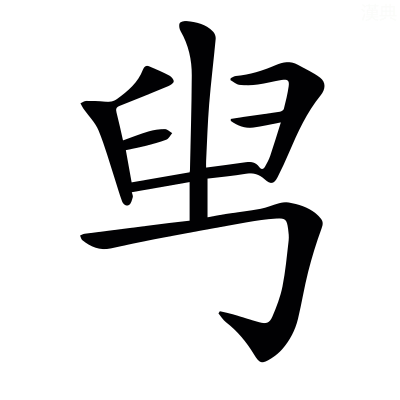君自損也[^8.1.4]。晉灼曰：，古貶字也．〔善曰〕鄧析子曰：因勢而發譽。毛萇詩傳曰：秖，適也。

---

且夫齊楚之事，又烏足道乎？君未覩夫巨麗也，獨不聞天子之上林乎？左蒼梧，右西極。文穎曰：蒼梧郡屬交州，在長安東南，故言左。爾雅曰：至于豳國，爲西極，在長安西，故言右也。

丹水更其南，應劭曰：丹水出上洛冢領山，東南至析縣入汋水。更，公衡切。

紫淵徑其北。文穎曰：~~河南~~西河穀羅縣[^8.1.5]有紫澤，在縣西北[^8.1.6]，於長安爲在北也。

終始灞滻，出入涇渭。張揖曰：灞滻二水，終始盡於苑中，不復出也。涇渭二水，從苑外來，又出苑去也。

酆鎬潦潏，紆餘委蛇，經營乎其內。張揖曰：酆水出鄠縣南山酆谷，北入渭。鎬在昆明池北。〔善曰〕潦，即澇水也。說文曰：澇水出鄠縣，北入渭。潏水出杜陵，今名~~沇~~泬水[^8.1.7]，自南山~~黃~~皇子陂[^8.1.8]西北流，~~經~~至昆明池[^8.1.9]入渭。郭璞曰：經營其內，言周旋苑中也[^8.1.10]。

蕩蕩乎八川分流，相背而異態。郭璞曰：變態不同也。〔善曰〕潘岳關中記曰：涇渭灞滻酆鄗潦潏，凣八川。

東西南北，馳騖往來。郭璞曰：言更相錯涉也。來，盧代切。

出乎椒丘之闕，服虔曰：丘名也。兩山俱起，象雙闕者也。郭璞曰：椒丘，見楚辭。〔善曰〕楚辭曰[^8.1.11]：馳椒丘且焉。止，息也，且音昌呂切[^8.1.12]。

行乎洲淤之浦。張揖曰：淤，漫也。浦，水崖也。淤，於庶切。〔善曰〕方言曰：水中可居者曰洲。三輔謂之淤也。

經乎桂林之中，張揖曰：桂林，林名也。南海經曰：桂林八樹，在番禺東也。

過乎泱漭之壄。張揖曰：山海經所謂大荒之野。如淳曰：大貌也。泱，烏朗切。

汩乎混流，順阿而下，蘇林曰：楊雄方言曰，汩，逕疾也。汩，于筆切。郭璞曰：混，并也。阿，大陵也。

赴隘陿之口。郭璞曰：夾岸閒爲陿。隘，於懈切。陿音狹。

觸穹石，激堆埼，張揖曰：穹石，大石也。埼，曲岸頭也。郭璞曰：堆，沙堆也；丁回切。埼，巨依切。

沸乎暴怒，郭璞曰：沸，水聲也；音拂。

洶涌彭湃。司馬彪曰：洶涌，跳起也。彭湃，波相戾也。洶，許勇切。湃，蒲拜切。

滭弗宓汩，蘇林曰：滭音畢。宓音密。司馬彪曰：畢弗[^8.1.13]，盛貌也。宓汩，去疾也。汩，于筆切。

偪側泌瀄。郭璞曰：泌瀄音筆櫛。司馬彪曰：偪側，相迫也。泌瀄，相揳也。偪字與逼同。揳，先結切。

橫流逆折，轉騰潎洌。司馬彪曰：逆折，旋回也，孟康曰：轉騰，相過也。潎洌，相撇也。潎，匹列切。洌音列。

滂濞沆溉，司馬彪曰：滂濞，水聲也。沆溉，徐流也。郭璞曰：滂音匹亨切。濞，匹祕切。溉，胡慨切。韋昭曰：沆，胡郎切。

穹隆雲橈，郭璞曰：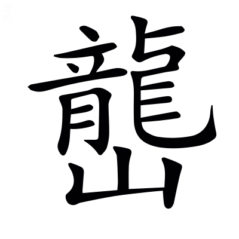起回窊也。〔善曰〕雲橈，如雲屈橈也。橈，女教切。

宛潬膠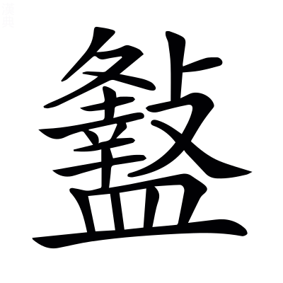。司馬彪曰：宛潬，展轉也。膠，邪屈也。宛音婉。潬音善。，古戾字。

踰波趨浥，涖涖下瀨。司馬彪曰：踰波，後波凌前波也。趍浥，輸於淵也。涖涖，水聲也。浥，於俠切。涖音利。

批巖衝擁，奔揚滯沛。<!-- page124 -->司馬彪曰：擁，曲隈也。〔善曰〕說文曰：批，擊也。滯沛，奔揚之貌也。滯，直制切。沛，蒲蓋切。

臨坻注壑，瀺灂霣墜。鄧展曰：坻，水中山也。坻音遲。〔善曰〕字林曰：瀺灂，小水聲也。霣即隕字也。墜，直類切。

沈沈隱隱，砰磅訇礚。〔善曰〕沈沈，深貌也。隱隱，盛貌也。司馬彪曰：砰磅訇礚，皆水聲也。砰，普氷切。磅，普萌切。

潏潏淈淈，湁潗鼎沸。〔善曰〕說文曰：潏，水湧出也。淈，水出貌[^8.1.14]。周成雜字曰：湁潗，水沸貌也。淈音骨。湁，勑立切。潗，子入切。

馳波跳沫，汩~~濦~~㴔漂疾[^8.1.15]，司馬彪曰：汩~~濦~~㴔，水聲也。韋昭曰：~~濦~~㴔，許及切。〔善曰〕汩，于筆切。漂，匹姚切。

悠遠長懷。郭璞曰：懷亦歸，變文耳。

寂漻無聲，肆乎永歸。〔善曰〕說文曰：漻，清深也[^8.1.16]。漻音聊。杜預左氏傳注曰：肆，放也。言水奔放，而長歸於淵海也。

然後灝溔潢漾，郭璞曰：皆水无涯際貌也。灝音皓。溔，弋少切。潢，胡廣切。漾，弋丈切。

安翔徐回。郭璞曰：言運轉也。

翯乎滈滈，郭璞曰：水白光貌也。翯，胡角切。滈音鎬。

東注太湖，郭璞曰：太湖在吳縣，尙書所謂震澤也。

衍溢陂池。郭璞曰：~~其形狀~~言溢而出也[^8.1.17]。陂池，江旁小水。

於是乎蛟龍赤螭，文穎曰：龍子爲螭。張揖曰：赤螭，雌龍也。

䱎䲛漸離。李奇曰：周洛曰鮪，蜀曰䱎䲛，出鞏山穴中。司馬彪曰：漸離，魚名也。張揖曰：其形狀未聞[^8.1.18]。䱎音亘。䲛音懵。

鰅鰫鰬魠，郭璞曰：鰅，魚有文彩。鰫，似鰱而黑。鰬，似鱓。魠，鱤也，一名黃~~曰~~頰[^8.1.19]。鰅音顒。鰫，嘗容切。鰬音乾。魠音托。鱓音善。鱤音感。

禺禺魼鰨。郭璞曰：禺禺魚，皮有毛，黃地黑文。魼，比目魚，狀似牛脾，細鱗紫色，兩相合~~得乃~~乃得行[^8.1.20]。鰨，鯢魚也，似鮎，有四足，聲如嬰兒。禺音顒。魼音榻。鰨，奴榻切。

揵鰭掉尾，振鱗奮翼，郭璞曰：揵，舉也。鰭，背上鬣也。〔善曰〕高唐賦曰：振鱗奮翼。揵，巨言切。掉，徒釣切。

潜處乎深巖。郭璞曰：隱岸坻也[^8.1.21]。

魚鼈讙聲，萬物衆夥。〔善曰〕小雅曰：夥，多也。

明月珠子，的皪江靡，應劭曰：靡，邊也。明月珠子生於江中，其光耀乃照於江邊也。張揖曰：靡，厓也。〔善曰〕說文曰：玓瓅，明珠光也。玓瓅與的皪音義同。

蜀石黃碝，水玉磊砢。張揖曰：蜀石，石次玉者也。郭璞曰：碝，碝石，黃色。水玉，水精也。磊砢，魁礨貌也。〔善曰〕山海經曰：~~常~~重庭之山[^8.1.22]其上多水玉。碝，如兗切。砢，洛可切。

磷磷爛爛，采色澔汗，郭璞曰：皆玉石符采映耀也。磷音吝。澔音皓。

藂積乎其中。鴻鷫鵠鴇，鴐鵝屬玉。張揖曰：鴻，大鴈也。郭璞曰：鷫，鷫鷞也。屬玉，似鴨而大，長頸赤目，紫紺色者。

交精旋目，郭璞曰：交精，似鳧而脚高，有毛冠，辟火災。司馬彪曰：旋目，鳥名也。

煩鶩庸渠。郭璞曰：煩鶩，鴨屬也。庸渠，似鳧，灰色而雞脚，一名章渠。鶩音木。

箴疵鵁盧，張揖曰：箴疵，似魚虎而倉黑色。鵁，鴢頭鳥。郭璞曰：盧，鸕鷀也。箴音鍼。疵音資。鷀音慈也。

羣浮乎其上。汎淫泛濫，隨風澹淡。郭璞曰：皆鳥任風波自縱漂貌也。汎音馮。泛，敷劔切。

與波搖蕩，奄薄水渚。張揖曰：奄，覆也。郭璞曰：薄猶集也。

唼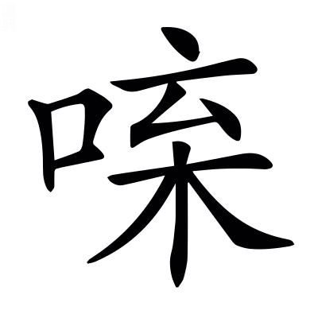菁藻，咀嚼菱藕。郭璞曰：菁，水草也。〔善曰〕通俗文曰：水鳥食謂之啑，與唼同，所甲切。，丈甲切。咀，才汝切。嚼，才削切。

---

於是乎崇山矗矗，巃嵸崔巍。郭璞曰：皆高峻貌也。巃，力孔切。嵸音揔。

深林巨木，嶄巖嵾嵳。郭璞曰：皆峯嶺之貌也。嶄，仕銜切。嵾，楚林切。嵳，楚宜切。

九嵕嶻嶭，南山峩峩。郭璞曰：嶻嶭，高峻貌也。〔善曰〕九嵕、南山，已見西都賦。嶻音截。嶭音齧。峩音娥。

巖陁甗錡，~~摧~~嶊崣崛崎[^8.1.23]。司馬彪曰：陁，靡也。甗，甑也。錡，欹也。上大下小，有似欹甑也。張揖曰：~~摧~~嶊崣，高貌也。崛崎，斗絕也。摧，作罪切。崣，卒鄙切。郭璞曰：崛音掘。崎音錡。

振溪通谷，蹇產溝瀆。張揖曰：振，拔也[^8.1.24]。水注川曰谿，注谿曰谷。蹇產，詰曲也。郭璞曰：自溪及瀆，皆水相通注也。〔善曰〕言山石收歛溪水，而不分泄。

谽呀豁閕，阜陵別隝。司馬彪曰：谽呀，大貌。豁閕，空虛也。郭璞曰：隝，水中山也。谽，呼含切。呀，呼加切。閕，呵下切。隝音擣。

崴磈㟪廆，丘虛堀礨。郭璞曰：皆其形勢也。崴，於鬼切。磈，魚鬼切。㟪，惡罪切。廆，胡罪切。虛音袪。堀音窟。礨音磊。

隱轔鬱㠥，登降施靡，郭璞曰：隱轔鬱~~壘~~㠥[^8.1.25]，堆壟不平貌。轔，洛盡切。㠥音壘。施，式氏切。

陂池貏豸。郭璞曰：陂池，旁頹貌也。陂音皮。貏音被。豸，直爾切。〔善曰〕貏豸，漸平皃。

沇溶淫鬻，張揖曰：水流谿谷之閒也。沇，以水切。溶音容。淫，以舟切。鬻音育。

散渙夷陸。司馬彪曰：布平地也。

亭皐千里，靡不被築。服虔曰：皐，澤也。隄上十里一亭。郭璞曰：皆築地令平也。被，皮義切。

揜以綠蕙，被以江蘺。張揖曰：掩，覆也。綠，王芻也。蕙，薰<!-- page125 -->草也。[^8.1.m1]郭璞山海經注曰[^8.1.26]：蕙，香草，蘭屬也。

糅以蘪蕪，雜以留夷。張揖曰：留夷，新夷也。〔善曰〕王逸楚辭注曰：留夷，香草。

布結縷，郭璞曰：結縷，蔓生，如縷相結。

攢戾莎，司馬彪曰：戾莎，莎名也。

揭車衡蘭，應劭曰：揭車，一名䒗輿，香草也。揭，去竭切。䒗，巨乞切。

槀本射干。郭璞曰：槀本，槀茇也；方末切。司馬彪曰：射干，香草也。射，弋舍切。

茈薑蘘荷，張揖曰：茈薑，子薑也。茈音紫。蘘，人羊切。

葴持若蓀。如淳曰：箴音鍼。韋昭曰：持音懲。張揖曰：箴持，闕。若，杜若。郭璞曰：蓀，香草也。

鮮支黃礫，司馬彪曰：鮮支，支子也。張揖曰：皆香草也。

蔣~~苧~~芧青薠[^8.1.27]。張揖曰：蔣，菰也。~~苧~~芧，三稜也。郭璞曰：~~苧~~芧音杼。

布濩閎澤，延曼太原。郭璞曰：布濩猶布露也。〔善曰〕閎，大也。濩音護。延，弋戰切。

離靡廣衍。〔善曰〕離靡，離而邪靡，不絕之貌也。孟康甘泉賦注曰：衍，无厓岸也。離，力爾切。

應風披靡。吐芳揚烈，〔善曰〕烈，酷烈，香氣盛也。披，丕蟻切。

郁郁菲菲。衆香發越，郭璞曰：香氣射散也。菲音妃。

肸蠁布寫，䁆薆咇茀。司馬彪曰：肸，過也。芬芳之過，若蠁之布寫也。郭璞曰：香氣盛馝馞也。〔善曰〕說文曰：肸蠁，布也。馝馞、咇茀音義同。說文曰：馣馤[^8.1.28]，香氣奄藹也。馣與䁆、馤與薆音義同。䁆音奄。咇，步必切。茀音勃。

---

於是乎周覽泛觀，縝紛軋芴，孟康曰：縝紛，衆盛也。軋芴，緻密也。縝，丑人切。芴音勿。

芒芒恍忽。郭璞曰：言眼亂也。芒，莫朗切。

視之無端，察之無涯。日出東沼，入乎西陂。張揖云：日朝出苑之東池，暮入於苑西陂中。〔善曰〕漢宮殿簿曰：長安有西陂池、東陂池。

其南則隆冬生長，涌水躍波。張揖曰：其苑南陽煖，則盛冬十月，草木生長也。郭璞曰：躍波，言不凍也。〔善曰〕孫卿子曰：松栢經隆冬而不彫。

其獸則㺎旄貘犛，沈牛麈麋。郭璞曰：㺎似牛，領有肉堆也；音容。張揖曰：旄，旄牛也，其狀如牛而四節毛。貘，白豹。犛牛，黑色，出西南徼外。沈牛，水牛也，能沈沒水中。麈，似鹿而大。〔善曰〕南越志曰：潛牛，形角似水牛，一名沈牛也。

赤首圜題，窮奇象犀。張揖曰：題，頟也。窮奇，狀如牛而蝟毛，其音如噑狗，食人者也。

其北則盛夏含凍裂地，涉冰揭河。司馬彪曰：揭，舉衣也。〔善曰〕尸子曰：寒凝冰裂地。

其獸則麒麟角端，騊駼橐駝。郭璞曰：麒，似麟而無角。角端，似貃，角在鼻上，中作弓。韋昭曰：背上有肉似橐，故曰橐駝也。

蛩蛩驒騱，駃騠驢驘。郭璞曰：驒騱，駏驉類也。駃騠，生三日而超其母。驒音㒹。騱音奚。駃音玦。騠音提。驘騾~~驘~~同[^8.1.29]。

---

於是乎離宮別館，彌山跨谷。〔善曰〕鄭玄周禮注曰：彌，徧也。

高廊四注，重坐曲閣。司馬彪曰：廊廡上級下級皆可坐，故曰重坐。曲閣，閣道委曲也。

華榱璧璫，輦道纚屬。韋昭曰：裁金爲璧，以當榱頭也。如淳曰：輦道，閣道也。司馬彪曰：纚屬，連屬也。張揖曰：纚，力尔切。屬，之欲切。

步櫩周流，長途中宿。〔善曰〕步櫩，步廊也。周流，周徧流行也。楚辭曰：曲屋步櫩。郭璞曰：~~中~~途，樓閣間陛道[^8.1.30]。司馬彪曰：中宿乃至其上。

夷嵕築堂，累臺增成。如淳曰：嵕，山也。張揖曰：平此山以作堂者也。重累而成之，故曰增成。嵕，子公切。

巖窔洞房。郭璞曰：言於巖窔底爲室，潛通臺上也。〔善曰〕窔，一吊切。

頫杳眇而無見，仰橑而捫天。〔善曰〕聲類曰：頫，古文俯字。說文曰：頫，低頭也。楚辭曰：遂倐忽而捫天。晉灼曰：，古攀字也。捫，摸也。橑音老。捫音門。

奔星更於閨闥，宛虹扡於楯軒。〔善曰〕奔，流星也，行疾，故曰奔。如淳曰：宛虹，屈曲之虹也。應劭曰：楯，欄檻也。司馬彪曰：軒，楯下版也。更，工衡切。

青龍蚴蟉於東~~葙~~箱[^8.1.31]，郭璞曰：蚴蟉，龍行貌也。〔善曰〕孫炎爾雅注曰：~~葙~~箱，夾室前堂也。蚴，一糾切。蟉，力紏切。

象輿婉僤於西清。張揖曰：山出象輿，瑞應車也。西清者，~~葙~~箱中清淨處也。〔善曰〕婉僤，動貌也。僤uj音善。

靈圄燕於閒館，張揖曰：靈圄，衆仙之號也。楚辭曰：坐靈圄而來謁，閒讀曰閑。

偓佺之倫，暴於南榮。郭璞曰：偓佺，仙人也。暴，謂偃卧日中也。榮，屋南檐也。

醴泉涌於清室，通川過於中庭。郭璞曰：醴泉，瑞水也。〔善曰〕言醴泉於室中涌出，而通流爲川，而過中庭。

盤石~~振~~裖崖[^8.1.32]，李奇曰：~~振~~裖，整也。以石整頓池水之涯也。~~振~~裖，之刃切。

嶔巖倚傾，郭璞曰：嶔巖，欹貌也。嶔，口銜切。倚，於綺切。

嵯峨㠎嶫，刻削崢嶸。郭璞曰：言自然若彫刻也。司馬彪曰：崢嶸，深貌也。〔善曰〕㠎音捷。嶫音業。

玫瑰碧琳，珊瑚叢生。〔善曰〕並已見上文。<!-- page126 -->

瑉玉旁唐，玢豳文鱗。郭璞曰：旁唐，言磐礡也。玢豳，文理貌也；音紛彬。〔善曰〕宋玉笛賦曰：其處磅磄千仞[^8.1.33]。磅磄與旁唐音義同

赤瑕駮犖，雜臿其閒，張揖曰：赤瑕，赤玉也。郭璞曰：言雜廁崖石中。駮犖，采點也。犖，洛角切。

晁采琬琰，和氏出焉。司馬彪曰：晁采，玉名。〔善曰〕晁，古朝字。尙書曰：弘璧琬琰在西序。

---

於是乎盧橘夏熟[^8.1.34]，應劭曰：伊尹書曰「箕山之東，青鳥之所，有盧橘夏熟。」晉灼曰：此雖賦上林，博引異方珍奇，不係於一也。盧，黑也。

黃甘橙楱。郭璞曰：黃甘，橘屬，而味精。楱，亦橘之類也；音湊。張揖曰：楱，小橘也，出武陵。〔善曰〕說文曰：橙，橘屬也。

枇杷橪柿，~~楟~~亭柰厚朴[^8.1.35]。張揖曰：枇杷，似斛樹，長葉，子如杏。亭，山梨也。厚朴，藥名也。郭璞曰：橪，橪支木也。橪音煙。朴，步角切。

梬棗楊梅，張揖曰：楊梅，其實似~~縠~~榖子[^8.1.36]而有核，其味酸，出江南也。

櫻桃蒲陶。〔善曰〕櫻桃蒲陶，見南都賦。

隱夫薁棣，張揖曰：隱夫，未詳。薁，山李也。郭璞曰：棣，實似櫻桃也。薁，於六切。棣，徒計切。

答遝離支。張揖曰：答遝，似李，出蜀。晉灼曰：離支，大如雞子，皮麄，剥去皮，肌如雞子，中黃，味甘多酢少。遝音沓。離，力智切。

羅乎後宮，列乎北園。䝯丘陵，下平原。司馬彪曰：䝯，延也，羊氏切。

揚翠葉，扤紫莖。張揖曰：扤，搖也；音兀。

發紅華，垂朱榮。煌煌扈扈，照曜鉅野。郭璞曰：言其光采之盛也。煌音皇。

沙棠櫟櫧，張揖曰：沙棠，狀如棠，黃華赤實，其味如李，無核，呂氏春秋曰：果之美者，沙棠之實。櫧，似柃，葉冬不落。應劭曰：櫟，~~採~~棌木也[^8.1.37]。櫧音諸，柃音零。~~採~~棌音采。

華楓枰櫨。張揖曰：華，皮可以爲索。楓，攝也，脂可以爲香。郭璞曰：枰，平仲木也。櫨，已見南都賦。華，胡化切。

留落胥邪，仁頻并閭。郭璞曰：留，未詳。落，檴也。中作器。胥邪，似并閭，皮可作索。孟康曰：仁頻，椶也。〔善曰〕仙藥錄曰：檳榔，一名椶，然仁頻即檳榔也。胥邪、并閭，已見南都賦。檴音鑊。

欃檀木蘭，孟康曰：欃檀，檀別名也。欃音讒。

豫章女貞。張揖曰：女貞木，葉冬不落。

長千仞，大連抱。司馬彪曰：七尺曰仞。

夸條直暢，實葉葰楙。郭璞曰：夸，張布也。司馬彪曰：葰，大也；葰音峻。

攢立叢倚，連卷欐佹。司馬彪曰：欐佹，支重累也。倚，於綺切。卷，巨專切。欐，力爾切。佹音詭。〔善曰〕蒼頡篇曰：攢，聚也。

崔錯癹骪，郭璞曰：~~崔錯，交雜。癹骪，蟠戾也~~蟠戾相樛也[^8.1.38]。崔，干賄切。癹，步葛切。骪，古委字。

坑衡閜砢。郭璞曰：坑衡，徑直貌。閜砢，相扶持也[^8.1.39]。坑，口庚切。閜，烏可切。砢，來可切。

垂條扶䟽，落英幡纚。〔善曰〕說文曰：扶䟽，四布也。呂氏春秋曰：樹肥無使扶䟽。英，謂華也[^8.1.40]。張揖曰：幡纚，飛揚貌也。纚，山爾切。

紛溶箾蔘，猗狔從風。郭璞曰：紛溶箾蔘，支竦擢也。張揖曰：猗狔猶阿那也。溶音容。箾音蕭。蔘音森。猗，憶靡切。狔，女尔切。

藰莅芔歙，司馬彪曰：衆聲貌也。藰音劉。莅音利，芔，古卉字。歙音翕。

蓋象金石之聲，管籥之音。〔善曰〕金石、管，已見上文。籥，已見南都賦。

偨池茈虒，旋還乎後宮。張揖曰：偨池，參差也。茈虒，不齊也。如淳曰：茈音此。虒音豸。郭璞曰：還，繞也。偨音差。

雜襲絫輯，郭璞曰：相重被也。〔善曰〕絫，古累字。輯與集同。

被山緣谷，循阪下隰，視之無端，究之無窮。於是乎玄猨素雌，蜼玃飛[^8.1.41]，張揖曰：蜼，似母猴，卬鼻而長尾。玃，似獮猴而大。飛，鼠也[^8.1.42]，其狀如兔而鼠首，以其髯飛。郭璞曰：蠝，鼯鼠也，毛紫赤色，飛且生，一名飛生。蜼音遺。蠝音誄。〔善曰〕玄猨，言猨之雄者玄色也。素雌，猨之雌者素色也。玃音钁。

蛭蜩蠼猱，司馬彪曰：山海經曰，不咸之山，飛蛭四翼。蜩，蟬也。玃猱，獮猴也。郭璞曰：蛭蜩，未聞。如淳曰：蛭音質。猱，奴刀切。

獑胡豰蛫，張揖曰：獑胡，似獮猴，頭上有髦，要以後黑。郭璞曰：豰，似鼬而大，要以後黃，一名黃要，食獮猴。蛫，未聞也。獑音讒。豰，呼谷切。蛫音詭。

棲息乎其閒。長嘯哀鳴，翩幡互經，郭璞曰：互經，互相經過也。

夭蟜枝格，偃蹇杪顚。郭璞曰：皆獮猴在樹~~暴~~共戲姿態也[^8.1.43]。夭蟜，頻申也。〔善曰〕埤蒼曰：格，木長貌也。說文曰：杪，末也[^8.1.44]。廣雅曰：顚，末也。蟜音矯。

隃絕梁，騰殊榛，郭璞曰：梁，石絕水也。張揖曰：殊榛，異枿也。〔善曰〕隃字與踰同。榛，仕人切。枿，五曷切。

捷垂條，掉希閒。張揖曰：捷持懸垂之條，掉往著稀䟽無支之閒也。郭璞曰：掉，懸擿也；託釣切。

牢落陸離，郭璞曰：羣奔走也。〔善曰〕牢落猶遼落也。廣雅曰：陸離，參差也。

爛漫遠遷。郭璞曰：崩騰羣走貌也。

---

若此者數百千處，~~娛~~娭遊往來[^8.1.45]，宮宿館舍。〔善曰〕說文曰：~~娛~~娭，戲也；許其切。郭璞曰：皆離宮別館，出入所幸也。

庖廚不徙，後宮不移，百<!-- page127 -->官備具。郭璞曰：言所在有也。

---

於是乎背秋涉冬，天子校獵。李奇曰：以五校兵出獵也。

乘鏤象，六玉虯。張揖曰：鏤象，象路也，以象牙䟽鏤其車輅。六玉虯，謂駕六馬，以玉飾其鑣勒，有似玉虯[^8.1.46]。龍~~也~~子，無角[^8.1.47]曰虯也。郭璞曰：韓子曰：黃帝駕象車，六蛟龍。〔善曰〕此依古成文而假言之，非謂似也。今依郭說。

拖蜺旌，靡雲旗。張揖曰：析羽毛，染以五采，綴以縷爲旌，有似虹蜺之氣也。畫熊虎於旒爲旗，似雲氣也。〔善曰〕此亦假言也。高唐賦曰：蜺爲旌。雲旗，已見東京賦。

前皮軒，後道游。文穎曰：皮軒，以虎皮飾車。天子出，道車五乘，游車九乘，在乘輿車前，賦頌爲偶辭耳。〔善曰〕言皮軒最居前，而道游次皮軒之後，此爲前後相對爲偶辭耳，非謂道游在乘輿之後。

孫叔奉轡，衛公參乘。~~李善~~鄭氏曰：孫叔者[^8.1.48]，太僕公孫賀也，字子叔。衛公者，大將軍衛青也。大駕，太僕御，大將軍參乘。

扈從橫行，出乎四校之中。晉灼曰：扈，大也。張揖曰：跋扈縱橫，不案鹵簿也。文穎曰：凡五校，今言四者，中一校隨天子乘輿也。

鼓嚴簿，縱獵者，張揖曰：鼓，嚴鼓也。簿，鹵薄也。〔善曰〕言擊嚴鼓~~簿鹵~~鹵簿之中也[^8.1.49]。

~~河江~~江河爲阹[^8.1.50]，泰山爲櫓。郭璞曰：因山谷遮禽獸爲阹。櫓，望樓。

車騎靁起，殷天動地。郭璞曰：殷猶震也。〔善曰〕靁，古雷字。殷音隱。

先後陸離，離散別追。郭璞曰：各有所逐也。〔善曰〕廣雅曰：陸離，參差。

淫淫裔裔，緣陵流澤，雲布雨施。郭璞曰：言徧山野也。〔善曰〕韓子曰：雲布風動。周易曰：雲行雨施也。

生貔豹，搏豺狼。韋昭曰：生~~謂生取~~執之也[^8.1.51]。郭璞曰：貔，執夷，虎屬；音毗。

手熊羆，足壄羊。張揖曰：熊，犬身人足，黑色。羆，如熊，黃白色。壄羊，麢羊也，似羊而青。郭璞曰：足謂踏也。

蒙鶡蘇，孟康曰：鶡，鶡尾也。蘇，析羽也。張揖曰：鶡，似雉，鬪死不却。〔善曰〕蒙，謂蒙覆而取之。鶡以蘇爲奇，故特言之，以成文耳。鶡音曷。

絝白虎。郭璞曰：絝，謂絆絡之也[^8.1.52]。〔善曰〕絝音袴。

被班文，〔善曰〕班文，虎豹之皮也。司馬彪續漢書曰[^8.1.53]：虎賁騎，皆虎文單衣。

跨壄馬。〔善曰〕跨，謂騎之也。

陵三嵕之危[^8.1.m2]，〔善曰〕漢書音義曰：陵，上也。郭璞三倉注曰：三嵕山在聞喜。

下磧歷之坻。張揖曰：磧歷，不平也。坻，下阪道也。坻音遲。

徑峻赴險，越壑厲水。郭璞曰：厲，以衣渡水。

椎蜚廉[^8.1.54]，弄獬豸。郭璞曰：飛廉，龍雀也，鳥身鹿頭。張揖曰：獬豸，似鹿而一角，人君刑罰得中，則生於朝廷，主觸不直者，今可得而弄也。獬音蟹。豸，文介切。

格蝦蛤，鋋猛氏。孟康曰：蝦蛤、猛氏，皆獸名。郭璞曰：今蜀中有獸，狀如熊而小，毛淺，有光澤，名猛氏。蝦音遐。蛤音閤。〔善曰〕說文曰：鋋，小矛也，市延切。

羂騕褭，射封豕。張揖曰：騕褭，馬金喙赤色，一日行萬里者。郭璞曰：封豕，大豬也。〔善曰〕聲類曰：羂，係取也；工犬切。左氏傳：申包胥曰「吳爲封豕長蛇。」

箭不苟害，解脰陷腦。弓不虛發，應聲而倒。張揖曰：脰，項也。〔善曰〕脰音豆。史記[^8.1.m3]：陷，苦念切。

---

於是乘輿弭節徘徊，翶翔往來。郭璞曰：言周旋也。〔善曰〕楚辝曰：䬃弭節而高厲。

睨部曲之進退，覽將帥之變態。〔善曰〕部曲，已見上文。

然後侵淫促節，郭璞曰：言疾驅也。〔善曰〕侵淫，漸進之貌。

儵敻遠去。郭璞曰：儵忽，長逝也。〔善曰〕曹大家幽通賦注曰：敻，遠也。

流離輕禽，蹴履狡獸。張揖曰：流離，放散也。輕禽，飛鳥也。晉灼曰：輕小之禽。〔善曰〕張說是也。

䡺白鹿，捷狡兔。郭璞曰：狡兎徤跳，故曰捷耳。捷音接。

軼赤電，遺光耀。張揖曰：軼，過也。郭璞曰：皆妖氣爲變怪，游光之屬也。

追怪物，出宇宙。張揖曰：怪物，奇禽也。

彎蕃弱，滿白羽。文穎曰：彎，牽也。蕃弱，夏后氏良弓之名。引弓盡箭鏑爲滿。以白羽~~爲~~羽箭[^8.1.55]，故言白羽也。〔善曰〕左氏傳：衛子魚曰「分魯公以封父之繁弱。」蕃與繁古字通。國語曰：吳素甲白羽之矰，望之如荼。

射游梟，櫟蜚遽。張揖曰：梟，惡鳥也，故射之。櫟，梢也。飛遽，天上神獸也，鹿頭而龍身。郭璞曰：梟羊也。〔善曰〕高誘淮南子注：梟羊，山精也，似遽類。高說是也。梟，工聊切。遽音鉅。

擇肉而后發，先中而命處。郭璞曰：言必如所志也。〔善曰〕廣雅曰：命，名也。

弦矢分，藝殪仆。文穎曰：所射準的爲藝，壹發死爲殪。〔善曰〕說文曰：仆，頓也。殪音翳。仆音赴。

---

然后揚節而上浮，郭璞曰：言騰游也。〔善曰〕楚辝曰：鳥託乘而上浮。

凌驚風，歷駭猋，乘虛無，與神俱。張揖曰：~~郭璞老子經注曰~~[^8.1.56]虛無寥廓，與元通靈[^8.1.57]，言其所乘氣之高，故能出飛鳥之上，而與神俱者也。

躪玄鶴，亂昆雞。張揖曰：昆雞，似鶴，黃白色。郭璞曰：躪，踐也。亂者，言亂其行<!-- page128 -->伍也。

遒孔鸞。促鵕䴊。郭璞曰：遒促，皆迫捕貌。遒，才由切。

拂翳鳥，張揖曰：山海經曰：九疑之山有五采之鳥，名曰翳鳥。

捎鳳凰。捷鵷鶵，揜焦明。張揖曰：焦明，似鳳，西方之鳥也。〔善曰〕方言曰：揜，取也。樂汁圖徵[^8.1.58]：焦明，狀似鳳皇。*宋衷曰：水鳥也。*

---

道盡途殫，迴車而還。消搖乎襄羊，降集乎北紘。司馬彪曰：消搖，逍遙也。張揖曰：淮南子云：八澤之外，乃有八紘，北方之紘曰委羽。郭璞曰：襄羊猶彷徉也。

率乎直指，郭璞曰：率~~，徑~~然馳去也[^8.1.59]。

晻乎反鄉。郭璞曰：忽然疾歸貌。

蹷石~~闕~~關[^8.1.60]，歷封巒。過鳷鵲，望露寒。郭璞曰：蹷，蹋也；音厥。張揖曰：此四觀，武帝建元中作，在雲陽甘泉宮外。鳷音支。

下棠棃，息宜春，張揖曰：棠棃，宮名，在雲陽東南三十里。郭璞曰：宜春，宮名，在渭南杜縣東。

西馳宣曲，張揖曰：宣曲，宮名也，在昆明池西。

濯鷁牛首。張揖曰：牛首，池名，在上林苑西頭。〔善曰〕漢書曰：鄧通以濯舡爲黃頭郎。*音義曰：善濯舡於池中也。一說能持櫂行船也。韋昭曰：櫂，今棹也；*並直孝切。

登龍臺，張揖曰：觀名也，在豐水西北，近渭也。

掩細柳。郭璞曰：觀名也，在昆明池南。〔善曰〕方言曰：掩者，息也。

觀士大夫之勤略，司馬彪曰：略，巡行也。

均獵者之所得獲。郭璞曰：平其多少也。

徒車之所轥轢，郭璞曰：徒，步也。轢，輾也。〔善曰〕輾，女展切。

步騎之所蹂若，人臣之所蹈籍。〔善曰〕廣倉曰：若，蹈足貌。

與其窮極倦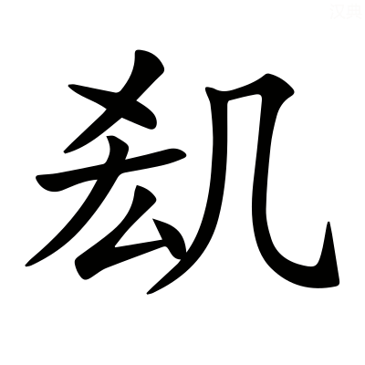，驚憚讋伏。郭璞曰：窮極倦，疲憊者也。驚憚讋伏，怖不動貌也。音劇。憚，丁曷切。讋，之涉切。

不被創刄而死者，他他籍籍。郭璞曰：言交橫也。他，徒河切。

填阬滿谷，掩平彌澤。〔善曰〕廣雅曰：大野曰平。

---

於是乎遊戲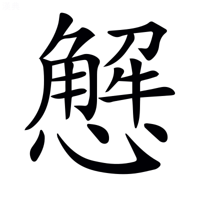怠，置酒乎顥天之臺，張揖曰：臺高，上干顥天也。

張樂乎膠葛之㝢。郭璞曰：言曠遠深貌也。

撞千石之鍾，張揖曰：千石，十二萬斤也。

立萬石之虡。張揖曰：虡獸，重百二十萬斤，以俠鍾旁。

建翠華之旗，樹靈鼉之鼓，張揖曰：以翠羽爲葆也，以鼉皮爲鼓也。郭璞曰：華，葆也。

奏陶唐氏之舞，如淳曰：舞咸池也。〔善曰〕尙書曰：惟彼陶唐。*孔安國曰：陶唐，堯氏也。*

聽葛天氏之歌。張揖曰：葛天氏，三皇時君號也。其樂，三人持牛尾，投足以歌八曲，一曰載民，二曰玄鳥，三曰育草木，四曰奮五穀，五曰敬天常，六曰徹帝功，七曰依地德，八百緫禽獸之極。韋昭曰：葛天氏，古之王者，其事見呂氏春秋。〔善曰〕呂氏春秋云：葛天氏之樂，以歌八~~闋~~曲：一曰載~~民~~氏[^8.1.61]，三曰~~遂~~育草木，六曰~~建~~徹帝功。今注以闋爲曲，以民爲氏，以遂爲育，以建爲徹，皆誤。

千人唱，萬人和。山陵爲之震動，川谷爲之蕩波。郭璞曰：波浪起也。

巴渝宋蔡，淮南干遮[^8.1.62]，郭璞曰：巴西閬中有渝水，獠居其上，皆剛勇[^8.1.63]好舞。初高祖募取，以平三秦，後使樂府習之，因名巴渝舞也。張揖曰：樂記曰「宋音燕女溺志。蔡人謳員三人，淮南鼓員四人。」干遮，曲名。

文成顛歌。文穎曰：文成，遼西縣名也，其縣人善歌。顛，益州顛縣，其人能作西南夷歌也。顛與滇同也。

族居遞奏，金鼓迭起。張揖曰：族，聚也。郭璞曰：遞，迭也；徒結切。

鏗鎗闛鞈，洞心駭耳。〔善曰〕鏗鎗，鍾聲也。闛鞈，鼓音也。毛詩曰：擊鼓其鏜。字書曰：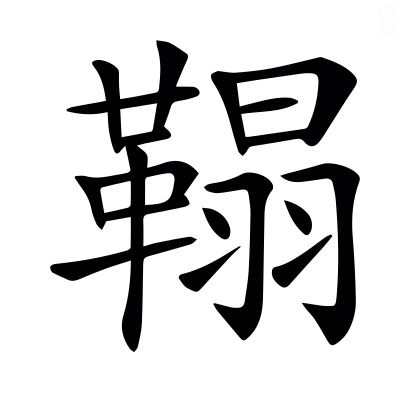，鼓聲。闛與鏜與鞈古字通。闛，託郎切。鞈音榻。

荊吳鄭衛之聲，郭璞曰：皆淫哇也。〔善曰〕禮記曰：鄭衛之音，亂世之音也。

韶濩武象之樂，文穎曰：韶，舜樂也。濩，湯樂也。大武，武王樂也。張揖曰：象，周公樂也。南人服象，爲虐於夷，成王命周公以兵追之，至於海南，乃爲三象樂。

陰淫案衍之音。郭璞曰：流沔曲也。衍，弋戰切。

鄢郢繽紛，激楚結風。李奇曰：鄢，今宜城縣也。郢，楚都也。繽紛，舞也。張揖曰：楚歌曲也。文穎曰：激，衝激，急風也[^8.1.64]；結風，回風，亦急風也[^8.1.65]。楚地風氣既自漂疾，然歌樂者猶復依激結之急風爲節也，其樂促迅哀切也。

俳優侏儒，狄鞮之倡，〔善曰〕三蒼曰：俳，倡也。優，樂也。禮記曰：夫新樂及優侏儒。郭璞曰：狄鞮，西戎樂名也。鞮，丁奚切。

所以娛耳目樂心意者，麗靡爛漫於前，郭璞曰：言恣所觀也。

靡曼美色。張揖曰：靡，細也。曼，澤也。〔善曰〕言作樂於前者，皆是靡曼也~~美色也~~。色下或云[^8.1.66]於後，非也。

---

若夫青琴宓妃之徒，伏儼曰：青琴，古神女也。如淳曰：宓妃，伏羲氏女，溺死洛，遂爲洛水之神。

絕殊離俗，郭璞曰：離俗，無雙也。

妖冶嫺都。〔善曰〕字書曰：妖，巧也。說文曰：嫺，雅也，或作閑。小雅曰：都，盛<!-- page129 -->也。

靚糚刻飾，便嬛綽約。郭璞曰：靚糚，粉白黛黑也。刻，刻畫鬋鬢也。便嬛，輕利也。綽約，婉約也。〔善曰〕莊子曰：綽約若處子。嬛音翾。靚音淨。

柔橈~~嫚嫚~~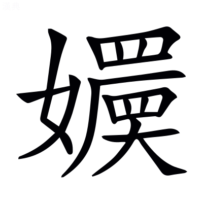[^8.1.67]，嫵媚孅弱。郭璞曰：柔橈嫚嫚，皆骨體耎弱長豔貌也。孅弱，弱顏也。〔善曰〕埤蒼曰：嫵媚，悅也。孅弱，謂容體孅細柔弱也。方言曰：自關而西，凡物小謂之孅。橈，女教切。~~嫚~~，於圓切。嫵音武。孅即纖字。

曳獨繭之褕絏，眇閻易以卹削。張揖曰：褕，襜褕也。絏，袖也。郭璞曰：獨繭，一繭之絲也。閻易，衣長大貌也。卹削，言如刻畫作之也。〔善曰〕褕音踰。絏音曳。易，弋示切。

便姍嫳屑，與俗殊服。郭璞曰：衣服婆娑貌。〔善曰〕便，步千切。姍音先。嫳，步結切。

芬芳漚鬱，酷烈淑郁。皓齒粲爛，宜笑的皪。郭璞曰：香氣盛也。漚，一候切。又曰[^8.1.68]：鮮明貌也。〔善曰〕楚辭曰：美人皓齒嫮以姱[^8.1.69]。又曰：嫮目宜笑娥眉曼。皪音礫。

長眉連娟，微睇緜藐。郭璞曰：連娟，言曲細也。緜藐，遠視貌。〔善曰〕娟，一全切。睇，大計切。藐音邈。

色授魂與，心愉於側。張揖曰：彼色來授，我魂往與接也。愉音踰。

---

於是酒中樂酣，郭璞曰：中，半也，中仲切。

天子芒然而思，似若有亡，司馬彪曰：亡，喪也。

曰：『嗟乎，此大奢侈！朕以覽聽餘閒，無事棄日。〔善曰〕言聽政既有餘暇，無事而虛棄時日也。閒音閑。

順天道以殺伐，郭璞曰：因秋氣也。〔善曰〕家語：孔子曰「啓蟄不殺，則順天道也。」

時休息於此。郭璞曰：謂苑囿中也。

恐後葉靡麗，遂往而不返，非所以爲繼嗣創業垂統也。』郭璞曰：言不可以示將來也。〔善曰〕爲，于僞切。孟子曰：君子創業垂統，爲可繼也。

於是乎乃解酒罷獵，而命有司曰：『地可墾闢，悉爲農郊，以贍萌隸，張揖曰：邑外謂之郊。郊，田也。詩曰：稅于農郊。韋昭曰：萌，民也。司馬彪曰：隸，小臣也。〔善曰〕爾雅曰：命，告也。蒼頡篇曰：墾，耕也。小雅曰：贍，足也。

隤墻填塹，使山澤之人得至焉。郭璞曰：芻蕘者往也，雉兔者往也。

實陂池而勿禁，虛宮館而勿仭。司馬彪曰：養魚鱉滿陂池，而不禁民取也。郭璞曰：虛，言不聚人衆其中也。仭，滿也。

發倉廩以救貧窮，補不足。〔善曰〕蔡邕月令章句曰：穀藏曰倉，米藏曰廩。孟子：齊景公興發補不足。*趙岐曰：興惠政，發倉廩，以振貧而補不足也。*

恤鰥寡，存孤獨。出德號，省刑罰。郭璞曰：號，號令也。

改制度，郭璞曰：變宮室車服。

易服色。郭璞曰：衣尚黑。

革正朔，郭璞曰：更以十~~二~~三月爲正[^8.1.70]，平旦爲朔。

與天下爲更始。』郭璞曰：新其事。

---

於是歷吉日以齋戒，張揖曰：歷，筭也。〔善曰〕周易曰：聖人以此齋戒。*韓康伯曰：洗心曰齋，防患曰戒。*

襲朝服，乘法駕，司馬彪曰：襲，服也。法駕，六馬也。

建華旗，鳴玉鸞，郭璞曰：鸞，鈴也。〔善曰〕楚辭曰：鳴玉鸞之啾啾。

游于六藝之囿，馳騖乎仁義之塗。郭璞曰：六藝：禮樂射御書數也。論語曰：游於藝。塗，道也。〔善曰〕藝，六經也。

覽觀春秋之林，如淳曰：春秋義理繁茂，故比之於林藪也。

射貍首，兼騶虞。郭璞曰：貍首，逸詩篇名，諸侯以爲射節。騶虞，召南之卒章，天子以爲射節也。

弋玄鶴，舞干戚。郭璞曰：干，楯也。戚，斧也。〔善曰〕言古者舞玄鶴以爲瑞，令弋取之而舞干戚也。尙書大傳曰：舜樂歌曰和伯之樂，舞玄鶴。公羊傳曰：朱干玉戚，以舞大夏。

載雲䍐，揜羣雅。張揖曰：䍐，罼也，前有九流雲罼之車。掩，捕也。詩小雅之材七十四人，大雅之材三十一人，故曰羣雅也。〔善曰〕先用雲䍐以獵獸，今載之於車而捕羣雅之士也。

悲伐檀，張揖曰：其詩刺賢者不遇明王也。

樂樂胥。〔善曰〕毛詩曰：君子樂胥，受天之祜。言王者樂得材智之人使在位，故天與之福祿也。胥，先呂切。

脩容乎禮園，郭璞曰：禮，所以整威儀自脩飾也。

翶翔乎書圃。郭璞曰：尙書，所以疏通知遠者，故遊涉之。

述易道，郭璞曰：脩絜靜精微之術。

放怪獸。張揖曰：苑中奇怪之獸，不復獵。

登明堂，坐清廟。郭璞曰：明堂者，所以朝諸侯處。清廟，太廟也。〔善曰〕禮記月令曰：天子居太廟太室。*鄭玄曰：太廟太室，中央室也。*

次羣臣，奏得失。四海之內，靡不受獲。〔善曰〕得恩德也。

於斯之時，天下大說，鄉風而聽，隨流而化，芔然興道而遷義。郭璞曰：芔猶勃也，許貴切。

刑錯而不用，德隆於三~~王~~皇[^8.1.71]，而功羨於五帝。〔善曰〕包咸論語注曰：錯，置也，千故切。司馬彪曰：羨，溢也。

若此，故獵乃可喜也。

---

若夫終日馳騁，勞神苦形。罷車馬之用，抏士卒之精。郭璞曰：精，銳也。抏，損也；音翫。

費府庫之財，而無德厚之恩。〔善曰〕管子曰：國雖盛滿，無德厚以安之，國非其國也。

務在獨樂，不顧衆庶。〔善曰〕鄭玄毛詩箋曰[^8.1.72]：顧，念也。

忘國家之政，貪雉兔之獲。則仁者不繇也。郭璞曰：繇，道也；音由。

從此觀之，齊楚之事，豈不哀哉！地方不過千里，而囿居九百，是草木不得墾辟，而人無所食也。〔善曰〕蒼頡篇曰：墾，耕也。薛君韓詩章句曰：辟，除也。

夫以諸侯之細，而樂萬乘之侈[^8.1.73]，僕恐百姓被其尤也。」

---

於是二子愀然改容，超若自失，郭璞曰：愀然，變色貌也，材誘切。〔善曰〕禮記曰：孔子愀然作色而對也。

逡巡避廗，〔善曰〕公羊傳曰：逡巡北面再拜。廣雅曰：逡巡，却退也。孝經曰：曾子避席。廗與席古字通。

曰：「鄙人固陋，不知忌諱，〔善曰〕廣雅曰：鄙，小也。

乃今日見教，謹受命矣。」

---

[^8.1.1]: 考異：曰楚則失矣　茶陵本有校語云善作「是」，蓋所見本「楚」譌爲「是」也。袁本無。史記、漢書皆作「楚」。
[^8.1.2]: 考異：所以述職也　茶陵本云善無「也」字。袁本無校語。史記、漢書皆有。
[^8.1.3]: 考異：不務明君臣之義　袁本、茶陵本云善無「臣」字。史記、漢書皆有。
[^8.1.4]: 考異：而適足以君自損也　案：當作「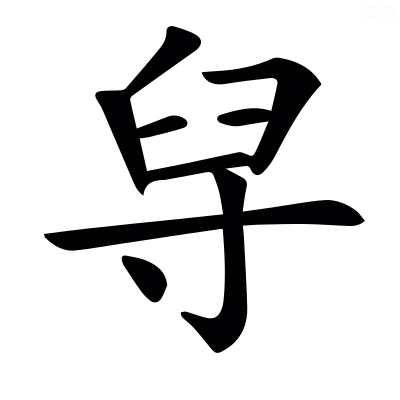」，各本皆譌。其字上「臼」下「寸」，在說文巢部。今漢書作「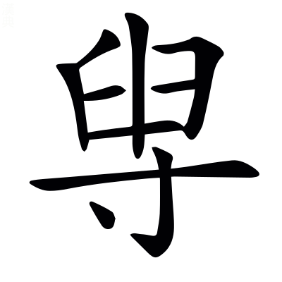」，亦譌也。史記作「貶」，與五臣同。
[^8.1.5]: 考異：注「河南穀羅縣」　陳云「河南」漢書注作「西河」爲是。案：史記正義引亦作「西河」。今漢書地理志「西河郡穀羅，武澤在西北」。依文穎此注，似其本「武」作「紫」也。
[^8.1.6]: 考異：注「在縣北」　案：「北」上當有「西」字，漢書注可證，地理志亦可證，各本皆脫。
[^8.1.7]: 考異：注「今名沇水」　陳云「沇」當作「沈」，詳漢書顏注。今案：陳說非也，當作「泬」。史記索隱引姚氏云「今名泬水」，善全取彼文與顏注「此即今所謂沈水」迥異。
[^8.1.8]: 考異：注「黃子陂」　袁本、茶陵本「黃」作「皇」。案：史記索隱引姚氏正作「皇」，「皇」字是也。漢書注亦作「皇」，陳校依漢注。
[^8.1.9]: 考異：注「經至昆明池」　袁本、茶陵本無「經」字。案：史記索隱引姚氏云「注昆明池」，漢書顏注云「經昆明池」。此尤延之校改「至」作「經」，因誤兩存也。
[^8.1.10]: 考異：注「周旋苑中也」　袁本、茶陵本「周」上有「言」字。
[^8.1.11]: 考異：注「善曰楚辭曰」　袁本、茶陵本無「善曰」二字，有「郭璞曰椒丘見」六字。今案：當作「郭璞曰椒丘見楚辭善曰楚辭曰」十三字，各本皆脫。
[^8.1.12]: 考異：注「馳椒丘兮焉且且止也音昌呂切」　袁本、茶陵本無「焉且且止也」五字，袁本有「且且」二字，茶陵本有「焉且且」三字。案：各本皆譌，當作「馳椒丘且焉止息也且音昌呂切」。此離騷經文。
[^8.1.13]: 考異：注「司馬彪曰畢弗」　案：「畢」當作「滭」，史記索隱引可證。各本皆譌。
[^8.1.14]: 考異：注「淈水出貌」　袁本、茶陵本無此四字。
[^8.1.15]: 考異：汩濦漂疾　袁本「濦」作「㴔」，云善作「濦」。茶陵本云五臣作「㴔」。案：各本所見皆非也。史記、漢書皆作「㴔」。善引韋昭曰「㴔，許及切」，即漢書音正作「㴔」可知。彼載晉灼「華給反」，郭璞「許立反」，史記索隱同，諸家無作「濦」者。又各本注中亦譌「濦」。
[^8.1.16]: 考異：注「說文曰漻清深也」　袁本、茶陵本無此七字。
[^8.1.17]: 考異：注「其形狀而出也」　袁本、茶陵本「其形狀」作「言溢」。漢書注作「言湓溢」。陳云別本作「言溢」爲是。
[^8.1.18]: 考異：注「張揖曰其形狀未聞」　袁本、茶陵本無「其形狀」三字。
[^8.1.19]: 考異：注「魠鱤一名黃曰頰」　袁本、茶陵本無「曰」字。案：依漢書注無「曰」字，鱤下當有「也」字。
[^8.1.20]: 考異：注「兩相合得乃行」　袁本、茶陵本無「合」字。案：漢書注有，蓋尤依彼添。陳云「得乃」當從漢書注作「乃得」。
[^8.1.21]: 考異：注「隱岸坻也」　袁本、茶陵本「坻」作「底」，漢書注作「底」。案：當以尤爲是，即海賦云「巖坻之隈」者也，二本及漢書注皆傳寫譌耳。
[^8.1.22]: 考異：注「常庭之山」　袁本、茶陵本「常」作「重」。案：今本山海經作「堂」，一作「常」，疑善引自異。
[^8.1.23]: 考異：摧崣崛崎　袁本、茶陵本「摧」作「嶊」，史記、漢書皆作「嶊」。案：此尤本之誤，注同。
[^8.1.24]: 考異：注「振拔也」　袁本、茶陵本「拔」作「收」。何云下言「收斂溪水」，當從「收」。今案：漢書注、史記索隱引皆作「拔」。
[^8.1.25]: 考異：注「隱轔鬱壘」　茶陵本「壘」作「㠥」袁本與此同。案：下云「㠥音壘」，蓋茶陵本是也。今本漢書亦正文「㠥」、注「壘」，歧誤正同此。
[^8.1.26]: 考異：注「郭璞山海經曰」　何校「經」下添「注」字，陳同。各本皆脫。
[^8.1.27]: 考異：蔣苧青薠　案：「苧」當作「芧」，史記、漢書皆作「芧」，各本及注中俱譌，五臣作「芋，云句切」，大誤。又案：玉篇「芋」、「苧」同，與此賦之「芧」迥別，彼乃說文所云「草可以爲繩」者，此張揖解爲「三稜」。三稜類詳見政和經史證類本草，實異名同，不可援以相證，決爲譌字無疑。
[^8.1.28]: 考異：注「說文曰馣馤」　案：此「曰」下有脫也。各本皆同，無以補之。或因此謂說文有「馣馤」，非。羣書引說文而未見者，皆不必今本脫去也。
[^8.1.29]: 考異：注「騾驘同」　案：當作「驘騾同」，誤倒也。正文，五臣作「騾」，史記亦作「騾」。凡五臣每取善注以改字或取他書，皆此類。漢書作「䯁」。袁本、茶陵本刪此注，非。
[^8.1.30]: 考異：注「中途樓閣間陛道」　案：「中」字不當有。史記集解引無。各本皆衍。
[^8.1.31]: 考異：青龍蚴蟉於東葙　案：「葙」當作「箱」。史記、漢書皆作「箱」，善與之同。今各作「葙」，凡偏旁「竹」「艹」每相混耳。五臣改作「廂」，非也。
[^8.1.32]: 考異：盤石振崖　案：「振」當作「裖」，注同。史記、漢書皆作「裖」。高唐賦「裖陳磑磑」，善注云「裖，已見上林賦」。彼五臣作「振」，然則此賦亦爲五臣亂之，而失其校語也。
[^8.1.33]: 考異：注「其處磅磄千仞」　案：此下當有「磅磄與旁唐音義同」一句，各本皆無，蓋脫也。
[^8.1.34]: 考異：盧橘夏熟　袁本、茶陵本云「熟」善作「熱」。案：二本所見誤也。史記、漢書皆作「孰」，善與之同。「孰」即「熟」字。
[^8.1.35]: 考異：楟柰厚朴　「楟」當作「亭」，注引張揖曰「亭山梨也」，蓋善作「亭」，五臣作「楟音亭」，而各本亂之也。漢書作「亭」，史記作「楟」，善此賦大略文同漢書者較多。
[^8.1.36]: 考異：注「其實似縠子」　袁本、茶陵本「縠」作「穀」，無「子」字。案：「穀」，亦譌也。此字從「木」不從「禾」，楮也。漢書注、史記索隱皆云「穀子」，尤依添，但「縠」字益譌。
[^8.1.37]: 考異：注「採木也」　何校「採」改「棌」，下「採音采」同。漢書注作「采音菜」。
[^8.1.38]: 考異：注「崔錯交雜癹骪蟠戾也」　袁本、茶陵本作「錯相樛也」四字。考史記索隱引郭璞云「崔錯癹骪者，蟠戾相樛也」。袁、茶陵二本有脫，尤所添改，在今漢書顏注，亦未是，當作「蟠戾相樛也」五字。
[^8.1.39]: 考異：注「郭璞曰坑衡徑直貌閜砢相扶持也」　袁本、茶陵本無「閜砢相扶持」五字。案：史記索隱引郭璞云「坑衡、閜砢者，揭孽傾欹貌也」，尤所添，在今漢書顏注，亦未是。或「坑衡徑直貌也」一句，係善注誤連爲郭耳。
[^8.1.40]: 考異：注「英謂華也」　袁本、茶陵本無此四字。案：在今漢書顏注。
[^8.1.41]: 考異：蜼玃飛　茶陵本「」作「蠝」。案：注中三見，下二字不從「土」，漢書作「蠝」，史記作「䴎」，單行本索隱仍作「蠝」。考集韻五旨，「䴎」下重文有六，而不載「」，可證其非。袁本正文作「」，注皆作「蠝」，以南都賦互證，疑五臣本之誤，而又相亂也。
[^8.1.42]: 考異：注「飛鼠也」　案「鼠」上當有「飛」字。案漢書注、史記集解、索隱有。陳云別本有，各本皆脫。南都賦注引「蠝，飛鼠也」，脫上「飛」字，當互訂。
[^8.1.43]: 考異：注「在樹暴戲恣態也」　陳云「暴」當作「共」。案：漢書注、史記正義引作「共」。各本皆誤。
[^8.1.44]: 考異：注「說文曰杪末也」　袁本、茶陵本無此六字。
[^8.1.45]: 考異：娛遊往來　案：「娛」當作「娭」。各本皆譌。注引說文「娭，許其切」，非「娛」甚明。史記作「嬉」，「娭」、「嬉」同字也。今本漢書及注誤與此同。又見羽獵賦。
[^8.1.46]: 考異：注「有似虯」　何校引徐七來惇復曰：「似」下脫「玉」字，據漢書注校，是也。各本皆脫。
[^8.1.47]: 考異：注「龍也無角」　何校引徐曰「子」誤「也」，據漢書注校。袁本「無」作「有」，茶陵本亦作「無」。案：漢書注作「有」。說文「虯，龍子有角者」，稚讓所本，故其廣雅亦云「有角曰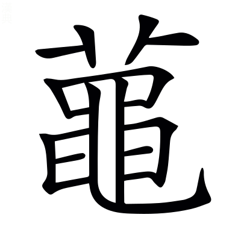龍，即虯，上卝者，角也」，此注決不當自爲兩解。唯王逸注離騷「有角曰龍，無角曰虯」。善彼注仍之，所以各存異說，或不知者用彼以改此也。
[^8.1.48]: 考異：注「李善曰孫叔者」　袁本、茶陵本「李善」作「鄭玄」。案：「玄」當作「氏」，漢書注作「氏」，最是。「鄭氏」，見顏師古敘例臣瓚云「鄭德」者也。
[^8.1.49]: 考異：注「言擊嚴鼓簿鹵之中也」　袁本、茶陵本「簿鹵」作「鹵簿」，是也。陳云別本二字乙。
[^8.1.50]: 考異：河江爲阹　茶陵本作「江河」，云善作「河江」。袁本作「江河」，無校語。史記、漢書皆作「江河」。
[^8.1.51]: 考異：注「生謂生取之也」　袁本、茶陵本「謂生取」三字作「抗」字。案：尤所添改，在今漢書顏注，亦未是。「抗」當作「執」，「生執之也」四字一句讀。五臣向注「生，生執」，即襲韋，可借爲證。
[^8.1.52]: 考異：注「絝謂絆絡之也」　袁本、茶陵本無「謂絆之」三字。案：史記集解引有此三字。尤延之蓋依彼添。
[^8.1.53]: 考異：注「司馬彪漢書曰」　何校「漢」上添「續」字，陳同。各本皆脫。
[^8.1.54]: 考異：椎蜚廉　案：「椎」史記、漢書皆作「推」。顏注云「推，亦謂弄之也」，其字從「手」。今流俗讀作「椎擊之椎」，失其義矣。考五臣銑注「椎謂擊殺」，其本作「椎」之明文。善既不注此字，袁、茶陵二本又俱無校語，未審何作也。凡偏傍「扌」「木」每相混。
[^8.1.55]: 考異：注「以白羽爲箭」　袁本、茶陵本「爲」作「羽」。案：重「羽」最是。上「羽」言體，下「羽」言用。漢書注、史記正義引皆可證。
[^8.1.56]: 考異：注「郭璞老子經注曰」　陳云此七字衍。張氏乃曹魏時人，不當引郭語。老子又無郭注。其說是矣。各本皆衍。
[^8.1.57]: 考異：注「與元通靈」　陳云「元」當作「天」，漢書注可據。今案：漢書注譌也。史記正義正作「元」。鄭禮記注引孝經說曰「上通元莫」，即此「元」字之義。
[^8.1.58]: 考異：注「樂汁圖」　案：「圖」下當有「徵」字。史記索隱引有。各本皆脫。
[^8.1.59]: 考異：注「率徑馳去也」　袁本、茶陵本「徑」作「然」。案：考漢書顏注曰「率然直去意」，或尤改「馳」爲「徑」而誤去「然」字。
[^8.1.60]: 考異：蹷石闕　袁本、茶陵本「闕」作「關」，而不著校語。案：依此善與五臣同作「關」也。漢書作「關」，史記作「闕」，善引張揖漢書注則作「關」，未爲非。恐此是尤延之依史記改。前卷及漢書楊雄傳俱作「關」字。
[^8.1.61]: 考異：注「一曰載民」　案：「民」當作「氏」。各本皆譌，下有明文。漢書注誤與此同。
[^8.1.62]: 考異：淮南干遮　何云「干」史、漢作「于」。案：善及小司馬皆引張揖漢書注，不當有異文，蓋今各本作「于」並譌耳。
[^8.1.63]: 考異：注「皆剛勇」　袁本、茶陵本無此三字。案：史記索隱引無，集解有，尤蓋依彼添。
[^8.1.64]: 考異：注「衝激急風也」　袁本、茶陵本「衝」上有「激」字，單行本索隱有，舞賦及七發注有，七命注「衝激」作「激衝」，脫下「激」字，當互訂。
[^8.1.65]: 考異：注「結風亦急風也」　案：單行本索隱「結風」下有「回風」二字，舞賦、七發、七命注皆有，依文義，有者是也。各本此注脫。
[^8.1.66]: 考異：注「皆是靡曼美色也下或云」　袁本、茶陵本「美色也」三字作「也色」二字。案：「也」句絕，「色」屬下，尤添改失之。
[^8.1.67]: 考異：柔橈嫚嫚　案：「嫚嫚」當作「」，漢書作「」，可證也。善注「於圓切」，正爲「」字作音，或五臣誤爲「嫚」，而各本亂之耳。史記作「嬛」，亦「」字之譌。徐廣曰「音娟」。「」即「娟」字，古人每以同字爲音也。小司馬引廣雅「，容也」。今索隱盡作「嬛」，大誤。
[^8.1.68]: 考異：注「香氣盛也漚一候切又曰」　袁本、茶陵本無此十字。
[^8.1.69]: 考異：注「嫮以姱」　袁本、茶陵本「嫮」作「奼」。案：此尤校改也。
[^8.1.70]: 考異：注「更以十二月爲正」　何校引徐曰「二」當作「三」。案：所校是也。漢書武紀「太初元年以正月爲歲首」。師古曰：「謂建寅之月爲正也。」郭取彼事爲義。「夏以十三月爲正」，原出緯書，不知者誤改之。
[^8.1.71]: 考異：德隆於三王　茶陵本云五臣作「皇」，袁本云善作「王」。案：各本所見皆非也。史記、漢書皆作「皇」，善自與之同，傳寫譌耳。
[^8.1.72]: 考異：注「鄭玄毛詩曰」　案：「詩」下當有「箋」字。各本皆脫。
[^8.1.73]: 考異：而樂萬乘之侈　袁本「之」下有「所」字，云善無。茶陵本云五臣有「所」，漢書有。何云「萬乘之所侈，謂天子猶謂此太奢侈者也」。今案：史記亦有，或各本所見脫之。

[^8.1.m1]: 愚案：此處當有善曰二字。

[^8.1.m2]: 愚案：「陵」，胡本原作「凌」，依注文及上海古籍本改。

[^8.1.m3]: 愚案：史記下當有「注」字。