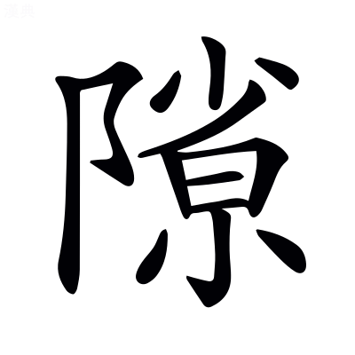

## 羽獵賦一首[^8.2.1]

并序

> 楊子雲

孝成帝時羽獵，服虔曰：士卒負羽也。〔善曰〕高唐賦曰：傳言羽獵。

雄從。以爲昔在二帝三王，應劭曰：堯、舜、夏、殷、周也。〔善曰〕春秋說題辭曰：尙書者，二帝之迹，三王之義，所以推期運，明命授之際。

宮館臺榭，沼池苑囿，林麓藪澤，財足以奉郊廟，御賓客，充庖廚而已，〔善曰〕財與纔同。毛萇詩傳曰：御，進也。禮記曰：天子無事，歲三田：一爲乾豆，二爲賓客，三爲充君之庖也。

不奪百姓膏腴穀土桑柘之地。女有餘布，男有餘粟，〔善曰〕孟子曰：以羨補不足，則農有餘粟，女有餘布也。

國家殷富，上下交足。故甘露零其庭，醴泉流其唐，〔善曰〕禮記曰：天降膏露，地出醴泉。孝經援神契曰：甘露，一名膏露。應劭曰：爾雅曰：廟中路，謂之唐也。

鳳凰巢其樹，黃龍游其沼，麒麟臻其囿，神爵棲其林。〔善曰〕禮記曰：鳳皇麒麟，皆在郊藪，龜龍在宮沼。漢書注曰：神雀，大如鷄，斑文。

昔者禹任益虞而上下和，草木茂，〔善曰〕尙書，帝曰：疇若予上下草木。禹曰：益哉。帝曰：汝作朕虞。孔安國曰：上謂山，下謂澤也。

成湯好田而天下用足；〔善曰〕呂氏春秋曰：湯見網置四面，湯拔其三面也。

文王囿百里，民以爲尚小；齊宣王囿四十里，民以爲大：裕民之與奪民也。〔善曰〕孟子：齊宣王問孟子曰：文王之囿方七十里，有諸？曰：有之。若是其大乎？答曰：民猶以爲小也。寡人之囿方四十里耳，民猶以爲大，何也？答曰：文王之囿，與人同之，民以爲小，不亦宜乎？王之囿四十里，殺其麋鹿，如殺人之罪，人以爲大，不亦宜乎？孫卿子曰：足國之道，節用裕民，而善藏其餘。不知節用裕民，雖好取侵奪，猶將寡獲也。

武帝廣開上林，東南至宜春[^8.2.2]鼎湖御宿昆吾，晉灼曰：鼎湖宮，黃圖以爲在藍田。昆吾，地名，上有亭。〔善曰〕宜春，已見上文。三秦記曰：樊川，一名御宿。

旁南山西，至長楊五柞，〔善曰〕漢書曰：盩厔有長楊五柞宮。旁，步浪切。

北繞黃山，濱渭而東[^8.2.3]，〔善曰〕漢書曰：槐里有黃山之宮。濱，涯也。言循渭水之涯而東也。公羊傳，濤塗曰：濱海而東。濱與賓同音也。

周袤數百里。〔善曰〕說文曰：南北曰袤。

穿昆明池，象滇河，瓚曰：西南夷有昆明國，又有滇池，故作昆明池以象之，以習水戰。

營建章鳳闕神明馺娑，孟康曰：馺娑，殿名也。〔善曰〕鄭玄毛詩箋曰：營，治也。建章，宮名也。神明，臺名也。

漸臺泰液，象海水周流方丈瀛洲蓬萊。〔善曰〕漢書曰：建章，其北治太液池，漸臺高二十餘丈，名曰泰液，中有蓬萊、方丈、瀛洲，象海中仙山。服虔曰：海中三山名，法効象之。

游觀侈靡，窮妙極麗。雖頗割其三垂以贍齊民，〔善曰〕三垂，謂西方、南方、東方。武帝侵三垂以置郡，故謂之割。漢書：杜鄴上書曰：三垂蠻夷。又雄上書曰：北狄，中國之堅敵，三垂比之縣矣。爾雅曰：邊，垂也。如淳曰：齊，等也。無有貴賤，故謂之齊人，若今言平人矣。晉灼曰：中國被教齊整之民。

然至羽獵甲車戎馬器械儲偫禁禦所營，〔善曰〕說文曰：儲偫，待也。應劭曰：禦，禁也，謂禁止往來。營，謂造作也。即賦云禦自汧渭，經營酆鄗。甲或爲田，非也。

尚泰奢麗誇詡，〔善曰〕毛萇詩傳曰：詡，大也，許羽切。

非堯舜成湯文王三驅之意也。〔善曰〕三驅，已見西都賦。

又恐後世復脩前好，不折中以泉臺[^8.2.4]，服虔曰：魯莊公築臺[^8.2.5]，非禮也，至文公毀之。公羊譏云：先祖爲之而毀之，勿居而已。今楊雄以宮觀之盛，非成帝所造，勿脩而已，當以泉臺爲折中也。韋昭曰：制或爲折也。

故聊因校獵賦以風之。〔善曰〕七略曰：羽獵，永始三年十二月上。校獵，已見上文。

其辭曰：

或稱羲農，豈或帝王之彌文哉？〔善曰〕假爲或人之意[^8.2.6]，言古之樸素而合禮者，咸稱羲、農，是則豈或謂後代帝王彌加文飾而不合禮哉。故論者答之於下。

論者云否，各以並時而得宜[^8.2.7]，奚必同條而共貫？〔善曰〕論者，雄自謂也。言帝王文質各並時而得宜，何必同條而共貫乎？言必不然也。尙書大傳曰：否，不也。漢書：武帝制曰「帝王之道，豈不同條共貫也？」

則泰山之封，焉得七十而有二儀？孟康曰：封禪各言異也[^8.2.8]。〔善曰〕管子曰：古之封太山禪梁父者七十二家，而夷吾所記者，十有二焉。

是以創業垂統者俱不見其爽，遐邇五三孰知其是非？張晏曰：爽，差也。不差其優劣，誰知其賢愚也。〔善曰〕言創業垂統者，各隨時立制，皆不見其差爽，故五帝、三王，誰知其是非乎？但文質不同，明無是非也。廣雅曰：爽，差也。

遂作頌曰：麗哉神聖，處於玄宮。富既與地乎侔訾，貴正與天乎比崇。〔善曰〕玄，北方也。禮記月令曰：季冬，天子居玄堂右个。蔡邕月令章句曰：玄，黑也，其堂尚玄。莊子曰：夫道，顓頊得之以處玄宮。又曰：莫神於天，莫富於地，莫大於帝王，故曰帝王之德配天地。

齊桓曾不足使扶轂，楚嚴未足以爲驂乘。狹三王之阨僻，嶠高舉而大興。〔善曰〕史記曰：齊公子小白立，是爲桓公。又曰：楚穆王卒，子莊王侶立。春秋感精記曰：黃池之會，重吳子，滕薛夾轂，魯衛驂乘。鄭氏曰：阨僻，陋小也。王逸楚辭注曰：嶠，舉也。嶠音矯。

歷五帝之寥廓，涉三皇之登閎。〔善曰〕寥廓，高遠也。韋昭曰：登，高也。閎，大也。

建道德以爲師，友仁義與之爲朋。

於是玄冬季月，天地隆烈，〔善曰〕北方水色黑，故曰玄冬。隆烈，陰氣盛。

萬物權輿於內，徂落於外，〔善曰〕爾雅曰：權輿，始也。大戴禮曰：孟春，百草權輿。

帝將惟田于靈之囿，開北垠，受不周之制，〔善曰〕薛君韓詩章句曰：惟，辭也。孟康曰：西北爲不周風，謂冬時也。

以奉終始顓頊玄冥之統[^8.2.9]。應劭曰：顓頊、玄冥，皆北方之神，主殺戮者。

廼詔虞人典澤，東延昆鄰，西馳閶闔。〔善曰〕孔安國尙書傳曰：虞，掌山澤之官。又曰：延，及也。張晏曰：東至昆明之邊也。〔善曰〕閶闔，已見上文。

儲積共偫，戍卒夾道。〔善曰〕郭舍人爾雅注曰[^8.2.10]：共，具物也。偫，具事也。漢書曰：廷中陳車騎戍卒衛官也。

斬叢棘，夷野草。〔善曰〕杜預左氏傳注曰：夷，殺也。

禦自汧渭，經營酆鎬。〔善曰〕孔安國尙書傳曰：經營，規度也。

章皇周流，出入日月，天與地沓。〔善曰〕章皇，猶彷徨也。周流，周匝流行也。出入日月，言其廣大，日月似在其中出入也。張晏曰：日出扶桑，入湯谷。應劭曰：沓，合也。

爾廼虎路三嵕以爲司馬，圍經百里而爲殿門。晉灼曰：路音落。落，纍也[^8.2.11]。服虔曰：以竹虎落此山也。應劭曰：外門爲司馬門，殿門在內也。〔善曰〕三嵕，已見上文。

外則正南極海，邪界虞淵。應劭曰：虞淵，日所入也。〔善曰〕爾雅曰：極，至也。淮南子曰：至于虞淵，是謂黃昏。

鴻濛沆茫，揭以崇山。韋昭曰：鴻濛沆茫，水草廣大貌也。〔善曰〕薛綜東京賦注曰：揭，猶表也。鴻，胡孔切。濛，莫孔切。沆，胡朗切。茫音莽。揭音竭也。

營合圍會，然後先置乎白楊之南，昆明靈沼之東。張晏曰：先置供具於前也。服虔曰：白楊，觀名也。〔善曰〕三秦記曰：昆明池中有靈沼神池。

賁育之倫，蒙盾負羽，杖鏌邪而羅者以萬計。〔善曰〕說苑曰：勇士孟賁，水行不避蛟龍，陸行不避虎狼。育，夏育也，已見西京賦。說文曰：鏌邪，大戟也。鏌音莫。邪，弋奢切。

其餘荷垂天之罼，張竟壄之罘。〔善曰〕言罼之大，垂天之邊也。

靡日月之朱竿，曳彗星之飛旗。〔善曰〕朱竿，太常之竿也。周禮：日月爲太常，王建太常。穆天子傳曰：日月之旗，七星之文。河圖曰：彗星者，天地之旗也。楚辭曰：攬彗星以爲旗。

青雲爲紛，紅蜺爲繯，屬之乎崑崙之虛。韋昭曰：紛，旗旒也。繯，旗上繫也。〔善曰〕鄭玄喪服傳注曰：屬，連也。爾雅曰：河出崑崙虛。繯，下犬切。屬，之欲切。虛音墟。

渙若天星之羅，浩如濤水之波。〔善曰〕天星之羅，言光明也。濤水之波，言廣大也。

淫淫與與，前後要遮。〔善曰〕淫淫與與，皆行貌也。

欃槍爲闉，明月爲候。孟康曰：闉，戰鬭自障蔽，如城門外女垣也。〔善曰〕杜預左傳注曰：候，望敵者。

熒惑司命，天弧發射。張晏曰：熒惑法[^8.2.12]使司命不祥[^8.2.13]。天弧，虛上二星。〔善曰〕樂緯稽耀嘉曰：熒惑主命。禮記曰：凡生於天地之間者，皆曰命。漢書曰：狼下有四星曰弧。

鮮扁陸離，駢衍佖路。服虔曰：鮮扁，戰鬭軍陣貌也。駢衍，軍壘駢衍也。晉灼曰：佖，滿也。〔善曰〕扁音篇。佖，頻一切。

徽車輕武，鴻絧緁獵。晉灼曰：徽，疾貌也音揮。〔善曰〕廣雅曰：武，健也。鴻絧。相連貌也。緁獵，相次貌也。鴻，胡弄切。絧，徒弄切。緁音捷。

殷殷軫軫，被陵緣岅。窮敻極遠者，相與列乎高原之上。〔善曰〕殷軫，盛貌也。敻或爲冥。殷音隱。

羽騎營營，昈分殊事。韋昭曰：騎負羽也。蘇林曰：昈，明也。〔善曰〕毛萇詩傳曰：營營，往來貌。昈分，謂羽騎明白分別，各殊其事也。昈音戶。

繽紛往來，轠轤不絕。若光若滅者，布乎青林之下。孟康曰：轠轤，連屬貌也。如淳曰：轠音雷。轤音盧。

---

於是天子乃以陽晁始出乎玄宮，〔善曰〕陽朝，陽明之朝[^8.2.14]。晁，古字同也。

撞鴻鍾，建九旒，〔善曰〕尙書大傳曰：天子將出，則撞黃鍾之鍾。禮記曰：龍旗，九旒也。

六白虎，載靈輿。〔善曰〕杜業奏事曰[^8.2.15]：輬車駕白虎四。白虎，馬名。服虔曰：靈輿，天子輿也。

蚩尤並轂，蒙公先驅。〔善曰〕韓子曰：黃帝駕象車，異方並轂，蚩尤居前。楚辭曰：選衆以並轂。漢書音義曰：蒙公，蒙恬也。如淳曰：蒙公，髦頭也。晉灼曰：此多說天子事，如說是。並，步浪切。

立歷天之旂，曳捎星之旃。韋昭曰：歷，干也。捎，拂也。

霹靂烈缺，吐火施鞭。應劭曰：霹靂，雷也。烈缺，閃也。火，電照也。〔善曰〕言威德之盛，役使百神，故霹靂烈缺，吐火施鞭，而爲衛也。閃，失染切。

萃傱沇溶，淋離廓落，戲八鎮而開關。應劭曰：四方四隅爲八鎮。如淳曰：不言九者，一鎮在中，天子居之故也。〔善曰〕埤蒼曰：傱，走貌也。沇溶，盛多之貌也。上林賦曰：沇溶淫鬻。傱，先勇切。沇，以永切。溶音容。戲音麾。

飛廉雲師，吸嚊潚率，鱗羅布烈[^8.2.16]，攢以龍翰。〔善曰〕楚辭曰：後飛廉使奔屬。王逸曰：飛廉，風伯也。雲師，已見吳都賦。說文曰：吸，喘息也[^8.2.17]。埤蒼曰：嚊，喘息聲也。潚率，吸嚊之貌。鱗羅，若鱗之羅也。攢以龍翰，若龍翰之聚也。鄭玄尙書大傳注曰：翰，毛之長大者。嚊，普利切。潚音肅。

啾啾蹌蹌，入西園，切神光。〔善曰〕郭璞三蒼解詁曰：啾啾，衆聲也。啾或爲秋。蹌蹌，行貌。楚辭曰：鳴玉鸞之啾啾。張晏曰：切，近也。神光，宮名也。

望平樂，徑竹林。張揖曰：平樂，館名。晉灼曰：在上林中也。

蹂蕙圃，踐蘭唐。〔善曰〕蕙圃，已見子虛賦。服虔曰：蘭唐，蘭生唐中也。

舉熢烈火，轡者施技，〔善曰〕轡者，執轡之人也。

方馳千駟，狡騎萬帥。晉灼曰：狡健之騎也。〔善曰〕鄭玄毛詩箋曰：方，併也。

虓虎之陳，從橫膠轕。猋拉雷厲，驞駍駖礚。服虔曰：虓音哮。鄧展曰：拉音獵。〔善曰〕毛詩曰：噉如虓虎。拉，風聲也。哮，火交切。轕音葛，驞，疋人切。駍，普萌切。駖，力莖切。

洶洶旭旭，天動地岋。〔善曰〕洶洶旭旭，鼓動之聲也。韋昭曰：岋，動貌也。洶，旭勇切。岋，五合切。

羨漫半散，蕭條數千里外。〔善曰〕羨，弋戰切。

---

若夫壯士忼慨，殊鄉別趣。〔善曰〕鄉音向。毛萇詩傳曰：趣，趨也。

東西南北，騁耆奔欲。〔善曰〕言各隨其耆欲而奔騁也。耆音嗜。

扡蒼狶，跋犀犛[^8.2.18]，蹶浮麋。韋昭曰：跋，蹋也。應劭曰：蹶，頓也。〔善曰〕廣雅曰：扡，引也音他。浮麋，過麋也。跋，步末切。蹶，居月切。

斮巨狿，搏玄猨。韋昭曰：斮，斬也，側略切。服虔曰：巨狿，獸名也。〔善曰〕廣雅曰：搏，擊也。狿，已見上林賦。

騰空虛，距連卷。張晏曰：連卷，木也。〔善曰〕距，古岠字也。孔安國尙書傳曰：距，至也。卷音拳。

踔夭蟜，娭澗間。張晏曰：踔夭蟜之枝也。〔善曰〕三蒼詁訓曰：踔，踰也，丑孝切。

莫莫紛紛，山谷爲之風猋，林叢爲之生塵。〔善曰〕莫莫紛紛，風塵之貌也。

及至獲夷之徒，蹶松柏，掌蒺藜[^8.2.19]。服虔曰：獲夷，能獲夷狄者。〔善曰〕蹶，踏也。掌，以掌擊之也。爾雅曰：茨，蒺藜。

獵蒙蘢，轔輕飛。〔善曰〕蒙蘢，已見上文。輕飛，輕獸飛禽也。

屨般首，帶脩蛇。如淳曰：般音班。班首，虎之頭也。〔善曰〕屨，謂踐履之也。淮南子曰：吳爲封豕長蛇。

鉤赤豹，摼象犀。韋昭曰：摼，扼也。〔善曰〕摼，古牽字。

跇巒阬，超唐陂。如淳曰：跇，超踰也。音義曰：巒，山小而銳。阬，大坂也。

車騎雲會，登降闇藹。〔善曰〕闇藹，衆盛貌。闇，烏感切。

泰華爲旒，熊耳爲綴。張晏曰：旒幡，綴旌也。〔善曰〕綴，亦旒也。司馬相如大人賦曰：垂絳幡之素蜺。張揖曰：以赤氣爲幡，綴以白氣也。

木仆山還，漫若天外。如淳曰：還音旋，言山爲之回旋也。〔善曰〕宋玉大言賦曰：長劍耿介倚天外。

儲與乎大浦，聊浪乎宇內。服虔曰：儲與，相羊貌也。浦，水涯也。〔善曰〕淮南子曰：陰陽儲與。聊浪，放蕩也。與音餘。浦音普。浪音琅。

---

於是天清日晏，〔善曰〕許慎淮南子注曰：晏，無雲之處也。

逢蒙列眥，羿氏控弦。〔善曰〕吳越春秋曰：黃帝作弓，後有楚狐父以其道傳羿，羿傳逢蒙。說文曰：匈奴名引弓曰控弦。

皇車幽輵，光純天地，服虔曰：皇車，君車也。李奇曰：純，緣繞也。〔善曰〕幽輵，車聲也。方言曰：純，文也。輵，一轄切。純，之允切。

望舒彌轡，服虔曰：望舒，月御也。如淳曰：楚辭曰：前望舒使先駈。〔善曰〕彌轡，按行貌也。彌與弭古字通。彌，莫爾切。

翼乎徐至於上蘭。晉灼曰：上蘭觀在上林中也。

移圍徙陣，浸淫蹵部。〔善曰〕部，軍之部伍也。毛萇詩傳曰：蹙，促也。蹵，古字通，子育切。

曲隊堅重，各按行伍[^8.2.20]。〔善曰〕隊，徒內切。行，胡郎切。

壁壘天旋，神抶電擊，〔善曰〕言威之盛也。埤蒼曰：抶，笞擊也。

逢之則碎，近之則破。〔善曰〕六韜：太公曰：當之者破，近之者亡。

鳥不及飛，獸不得過。〔善曰〕高唐賦曰：飛鳥未及起，走獸未及發。

軍驚師駭，刮野掃地。〔善曰〕言殺獲皆盡，野地似乎掃刮也。宋衷春秋緯注曰：驚，動也。廣雅曰：駭，起也。刮，古滑切。掃，先早切。

及至罕車飛揚，武騎聿皇。〔善曰〕罕，罼罕也[^8.2.21]。聿皇，輕疾貌。

蹈飛豹，羂嘄陽。〔善曰〕嘄陽，即狒狒也，已見上文。羂，工犬切。

追天寶，出一方。應劭曰：天寶，陳寶也。晉灼曰：天寶雞頭而人身。

應駍聲，擊流光。野盡山窮，囊括其雌雄。如淳曰：陳寶神來下時，駍然有聲，又有光精。應劭曰：下時[^8.2.22]窮極山川天地之間，然後得其雌雄也。〔善曰〕太康記曰：秦文公時，陳倉人獵得獸，若彘，而不知其名，道逢二童子，曰：此名爲䊧弗述。䊧弗述亦語曰：彼二童子名爲寶雞，得雄者王，得雌者霸。陳倉人舍䊧弗述，逐二童子，化爲雉，雄止陳倉化爲石，雌如楚止南陽也。䊧，浮謂切。

沇沇溶溶，遙噱乎紘中。晉灼曰：口之上下名爲噱。言禽獸奔走倦極，皆遙張噱吐舌於紘網之中也。〔善曰〕噱，其略切。

三軍芒然，窮冘閼與。孟康曰：冘，行也。閼，止也。言三軍之盛，窮閼禽獸，使不得逸漏也。〔善曰〕孟康之意，言窮其行止，皆無逸漏。如淳曰：窮音穹。冘者，懈怠也。晉灼曰：閼與，容貌也。如、晉之意，言三軍芒然懈倦，容貌閼與而舒緩也。今依如、晉之說也。芒，莫郎切。冘音滛。閼，於庶切。與音豫。

亶觀夫剽禽之紲隃，犀兕之抵觸。韋昭曰：亶音但。〔善曰〕古但字。紲與跇同，已見上文。文子曰：兕牛之動，以抵觸也。

熊羆之挐玃，虎豹之凌遽。韋昭曰：挐玃，惶遽也。〔善曰〕說文曰：凌，越也。遽，窘也。

徒角槍題，注䠞竦讋。怖魂亡魄[^8.2.23]，觸輻關脰。晉灼曰：徒，但也。服虔曰：獸以角觸地也。〔善曰〕䠞與蹙同。爾雅曰：竦、慴，懼也。讋與慴同。觸輻關脰，言觸車輻因關其頸也。槍，七羊切。䠞，子育切。脰音豆。

妄發期中，進退履獲。〔善曰〕言矢雖妄發而期於必中，進退之際，必踐履而獲之也。韓子曰：新砥礪殺矢，彀弩而射，雖冥而妄發，其端未嘗不中秋毫者也。

創淫輪夷，丘累陵聚。張晏曰：淫，過也。夷，平也。言獸被創過大，血流與車輪平也[^8.2.24]。音義曰：創血流平於車輪也。〔善曰〕丘累陵聚，言積獸之多也。

---

於是禽殫中衰，〔善曰〕中，竹仲切。

相與集於靖冥之館，以臨珍池。晉灼曰：靖冥，深閑之館也。服虔曰：珍池，山下之流。

灌以岐梁，溢以江河。晉灼曰：梁，梁山。〔善曰〕尙書曰：治梁及岐。孔安國曰：治山通水，故以山名。

東瞰目盡，西暢無崖。〔善曰〕目盡，盡目而望也。無崖，廣遠也。

隨珠和氏，焯爍其陂。〔善曰〕焯，古灼字。爍，式藥切。

玉石嶜崟，眩燿青熒。〔善曰〕玉石，玉之與石也。李彤單行字曰：嶜崟，高大貌。青熒，光明貌。

漢女水潛，怪物暗冥，不可殫形。應劭曰：漢女，鄭交甫所逢二女也。〔善曰〕不可殫形，不能盡其形也。高唐賦曰：曾不可殫形也。

玄鸞孔雀，翡翠垂榮。〔善曰〕榮，光榮也。

王雎關關，鴻鴈嚶嚶。羣娛乎其中[^8.2.25]，噍噍昆鳴。〔善曰〕毛詩曰：關關雎鳩。毛萇曰：雎鳩，王雎也。又曰：鳥鳴嚶嚶。噍與啾同，子由切。說文曰：昆，同也。

鳧鷖振鷺，上下砰礚，聲若雷霆。〔善曰〕言鳥飛上下，翅翼之聲若雷霆也。

乃使文身之技，水格鱗蟲。服虔曰：文身，越人也，能入水取物也。

凌堅冰，犯嚴淵，探巖排碕，薄索蛟螭。〔善曰〕嚴，言可畏也。巖，岸側嶔巖之處也。孔安國尙書傳曰：薄，迫也。賈逵國語注曰：索，求也。嶔，口銜切。

蹈獱獺，據黿鼉，〔善曰〕郭璞三蒼解詁曰：獱，似狐，青色，居水中，食魚。服虔曰：音賓。〔善曰〕廣雅曰：據，引也。

抾靈。鄭玄曰：抾音袪[^8.2.26]。韋昭曰：抾，捧也。服虔曰：，觜。

入洞穴，出蒼梧。晉灼曰：洞穴，禹穴也。〔善曰〕郭璞山海經注曰：吳縣南太湖，中有包山，山下有洞庭道也。言潛行水底，無所不通也。

乘巨鱗，騎京魚。〔善曰〕京魚，大魚也，字或爲鯨。鯨亦大魚也。

浮彭蠡，目有虞。應劭曰：彭蠡，大澤，在豫章。〔善曰〕有虞，謂舜也。

方椎夜光之流離，剖明月之珠胎，〔善曰〕鄭玄毛詩箋曰：方，且也。明月珠，蚌子珠，爲蚌所懷，故曰胎。椎，直追切。

鞭洛水之宓妃，餉屈原與彭胥。鄭玄曰：彭咸也。晉灼曰：胥，伍子胥也。皆水沒也。〔善曰〕楚辭曰：願依彭咸之遺制[^8.2.27]。王逸曰：殷賢大夫自投水而死。宓妃，已見上。子胥，已見吳都賦。

---

於茲乎鴻生鉅儒，俄軒冕，雜衣裳，韋昭曰：俄，卬也。車有蕃曰軒。冕，大冠也。〔善曰〕管子曰：先王制軒冕，足以章貴賤。雜衣裳，言衣裳殊色也。

脩唐典，匡雅頌，揖讓於前。昭光振燿，蠁曶如神。〔善曰〕蠁曶，疾也。蠁與響同。曶與忽同。

仁聲惠於北狄，武誼動於南鄰。〔善曰〕南鄰，南方之邑。

是以旃裘之王，胡貉之長，移珍來享，抗手稱臣。如淳曰：以物與人曰移。〔善曰〕周禮曰：職方掌九貉。鄭司農曰：北方曰貉。犍爲舍人爾雅注曰：獻珍物曰珍，獻食物曰享。毛詩曰：自彼氐羌[^8.2.28]，莫敢不來享。爾雅曰：享，獻也。抗手，舉手而拜者也。貉，莫白切。

前入圍口，後陳盧山。孟康曰：單于南庭山[^8.2.29]。

羣公常伯陽朱墨翟之徒[^8.2.30]，〔善曰〕常伯，侍中也，已見籍田賦。陽朱、墨翟，取古賢以爲喻。列子曰：陽朱南游沛，逢老聃。高誘呂氏春秋注以爲宋人[^8.2.31]。

喟然並稱曰：「崇哉乎德，雖有唐虞大夏成周之隆，何以侈茲！〔善曰〕周易曰：先王以作樂崇德。樂錄圖曰：成、康之隆，妖孽滅也。

夫古之覲東嶽，禪梁基，舍此世也，其誰與哉？」〔善曰〕東嶽，泰山也；梁，梁父也，已見上文。

---

上猶謙讓而未俞也，張晏曰：俞，然也。

方將上獵三靈之流，下決醴泉之滋。如淳曰：三靈，日、月、星垂象之應也。服虔曰：受福流也。〔善曰〕賈逵國語注曰：獵，取也。

發黃龍之穴，窺鳳凰之巢，臨麒麟之囿，幸神雀之林。奢雲夢，侈孟諸。〔善曰〕言以雲夢、孟諸爲奢侈而非之也。雲夢，楚藪澤名也。左氏傳曰：楚靈王與鄭伯田于江南之雲夢。孟諸，宋藪澤也。又曰：楚穆王欲伐宋，昭公導以田孟諸也。

非章華，是靈臺。〔善曰〕言以楚章華爲非，而以周之靈臺爲是。左傳：楚子成章華之臺。

罕徂離宮而輟觀游。〔善曰〕罕徂，言希往也。

土事不飾，木功不彫，〔善曰〕晏子曰：土事不文，木事不鏤。

丞民乎農桑，勸之以弗怠，〔善曰〕聲類曰：丞，亦拯字也。說文曰：拯，上舉也。

儕男女使莫違。〔善曰〕杜預左氏傳注曰：儕，等也。莫違，謂以時爲婚，無違於期也。毛詩序曰：男女多違。儕，士階切。

恐貧窮者不徧被洋溢之饒，開禁苑，散公儲，創道德之囿，弘仁惠之虞。〔善曰〕虞與娛古字通。

馳弋乎神明之囿，覽觀乎羣臣之有亡。〔善曰〕言馳弋神明之囿，冀以齊其聖德，觀其有無而加恩施。

放雉兔，收罝罘。麋鹿蒭蕘與百姓共之，〔善曰〕毛萇詩傳曰：芻蕘，薪采者也。

蓋所以臻茲也。於是醇洪鬯之德，豐茂世之規。〔善曰〕鬯與暢同。暢，通也。

加勞三皇，勗勤五帝，不亦至乎！乃祗莊雍穆之徒，〔善曰〕祗，敬也。雍，和也。

立君臣之節，崇賢聖之業，未遑苑囿之麗，游獵之靡也。因回軫還衡，背阿房，反未央。〔善曰〕麗，光華也。鄭玄禮記注曰：靡，奢侈也。

---

文選卷第八

賜進士出身通奉大夫江南蘇松常鎮太等處承宣布政使司布政使胡克家重校刊

[^8.2.1]: 考異：羽獵賦　案：賦下當有「一首」二字，後每題盡同。袁、茶陵本無。說見前。又前第七、八，後第十三、十四、十六各卷首子目亦放此。
[^8.2.2]: 考異：東南至宜春　何云漢書無「東」字，疑衍。案：據史文，此云「南至」，下云「西至」，又下云「北繞」，又下云「頗割其三垂」，故何云即指「上林之三垂」而言，是也。其東濱渭，則云「濱渭而東」而已，無所開廣，亦無所割，此句不得有「東」字。但善解「三垂」爲武帝侵西南東三方以置郡，豈所見漢書有「東」字與下「濱渭而東」相接連，以上林爲不僅有三垂耶？然所解實未安。
[^8.2.3]: 考異：濱渭而東　案：「濱」當作「賓」。注云「濱」與「賓」同音也。蓋善正文作「賓」，所引公羊作「濱」，故有此語。今各本以五臣作「濱」而亂之。難蜀父老「率土之濱」注「本或作賓」，可爲此作「賓」之證。今漢書作「瀕」，又異本耳。袁、茶陵二本無注「濱與賓同音也」六字，誤謂此專發音，與五臣「濱音賓」重複而削去，益非。
[^8.2.4]: 考異：不折中以泉臺　案：「折」當作「制」，善引韋昭曰「制或爲折也」，是其證矣。蓋五臣作「折」，而各本亂之。顏注漢書作「折」，即韋所云「或爲」耳。
[^8.2.5]: 考異：注「魯莊公築臺」　陳云「築」下當有「泉」字，是也。各本皆脫。
[^8.2.6]: 考異：注「假爲或人之意」　袁本、茶陵本「爲」下有「人也」二字。
[^8.2.7]: 考異：各以並時而得宜　袁本、茶陵本「以」作「亦」，案：漢書作「亦」，此疑尤本誤也。
[^8.2.8]: 考異：注「封禪各言異也」　陳云別本「言」字在「封」上爲是。案：今未見，但漢書注如此。
[^8.2.9]: 考異：以奉終始顓頊玄冥之統　袁本、茶陵本無「奉」字。案：漢書無，疑尤本誤。
[^8.2.10]: 考異：注「郭舍人爾雅注曰」　陳云爾雅郭注，與所引不同，則知非景純也。下文「移珍來享」句，又引犍爲舍人爾雅注。今案：其說是也。爾雅犍爲郡文學卒史臣舍人注二卷，見陸氏釋文敘例。必「犍爲」二字各本誤改作「郭」。
[^8.2.11]: 考異：注「落纍也」　袁本、茶陵本無此三字。案：在今漢書顏注。
[^8.2.12]: 考異：注「熒惑法」　案：「法」上當有「執」字。「熒惑或謂之執法」，見廣雅。各本及今漢書注皆脫。
[^8.2.13]: 考異：注「使司命不祥」　案：「命」字不當有。各本皆衍。漢書注無。
[^8.2.14]: 考異：注「陽朝陽明之朝」　案：上「朝」字當作「晁」，此善以「朝」解「晁」，故下云「晁古字同也」，各本皆譌。
[^8.2.15]: 考異：注「杜業奏事曰」　袁本、茶陵本無「奏事」二字。案：此文今在漢書霍光傳注中，云「杜延年奏載霍光柩以輬車」云云，非「杜業」明甚。宋孝武宣貴妃誄「晨轀解鳳」注所引云云，亦在霍光傳注。然則當作「杜延年奏曰」。各本皆誤。
[^8.2.16]: 考異：鱗羅布烈　茶陵本云五臣作「列」，袁本云善作「烈」。今案：各本所見皆非也。漢書作「列」，善自與之同，但傳寫譌耳。又案上文「霹靂烈缺」，二本校語亦云然，彼漢書仍作「列」，而以應劭「閃隙」之義求之，作「烈」自通，善、顏亦不盡同也。恐此涉彼而加「火」。
[^8.2.17]: 考異：注「吸喘息也」　袁本、茶陵本「喘」作「內」。案：二本是也，「喘」字誤。
[^8.2.18]: 考異：跋犀犛　袁本、茶陵本云善無「犀」。案：二本所見非也。漢書有，尤本獨未譌。
[^8.2.19]: 考異：掌蒺藜　茶陵本「藜」作「蔾」，注同。袁本正文「藜」，注「蔾」。案：漢書作「疾棃」。考字書「藜」、「蔾」二字有分別，據此知「蒺蔾」乃變體加「艹」，非借「藜藿」字。當依茶陵本。
[^8.2.20]: 考異：各按行伍　袁本、茶陵本云「伍」善作「五」。案：漢書作「伍」，或善作古字也。蹵部注「軍之部伍也」，當同此。
[^8.2.21]: 考異：注「罼罕也」　袁本、茶陵本「罼」作「畢」。案：「畢」字是也。上「荷垂天之罼」，漢書作「畢」。或善「畢」、五臣「罼」而亂之。尤并此亦改爲「罼」，未是。「太元畢格，禽鳥之貞」，用「畢」字，亦可證。
[^8.2.22]: 考異：注「應劭曰下時」　袁本、茶陵本無「劭曰」二字。案：漢書注有。
[^8.2.23]: 考異：魂亡魄　袁本、茶陵本下有「失」字，云善無。案：各本所見皆非也。漢書有，善自與之同，傳寫脫耳。陳云上當以「徒角槍題注」爲句，而「䠞竦讋怖」、「魂亡魄失」各以四字爲句也。
[^8.2.24]: 考異：注「言獸被創過大血流與車輪平也」　袁本、茶陵本無「大血流車」四字。案：無者是也。言「獸被創過」，解「創淫」；「與輪平也」，解「輪夷」，即謂獲獸平輪耳。張此解與下引音義迥別，尤所添改複沓，非是。
[^8.2.25]: 考異：羣娛乎其中　袁本、茶陵本「娛」作「嬉」，云善作「娛」。案：所見皆非也。漢書作「娭」音許其反，說見上林賦「娭遊往來」下。又案：上文「娭澗間」，袁、茶陵本亦云善作「娛」，此本獨未譌，或尤延之依漢書校正。
[^8.2.26]: 考異：注「鄭玄曰抾音袪」　案：「玄」當作「氏」。各本皆誤。又下注「鄭玄曰：彭咸也」之「玄」，亦當作「氏」。「鄭氏」說見上林賦內。
[^8.2.27]: 考異：注「願依彭咸之遺制」　案：「制」當作「則」。各本皆譌。陳云別本作「則」，今未見。
[^8.2.28]: 考異：注「自彼氐羌」　袁本、茶陵本無此四字。
[^8.2.29]: 考異：注「單于南庭山」　袁本、茶陵本「南庭」作「庭南」。案：「庭南」是也。今本漢書注亦誤倒。
[^8.2.30]: 考異：陽朱墨翟之徒　袁本、茶陵本「陽」作「楊」，注同。案：「陽」蓋尤本之譌，漢書作「楊」。
[^8.2.31]: 考異：注「高誘呂氏春秋注以爲宋人」　袁本、茶陵本無此十一字。
