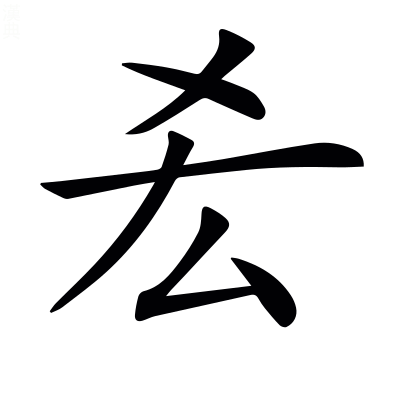
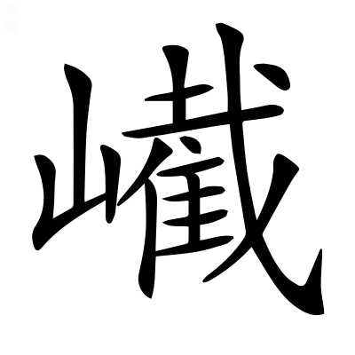

# 文選卷第十

> 梁昭明太子撰
> 
> 文林郎守太子右內率府錄事參軍事崇賢館直學士臣李善注上

紀行下

潘安仁西征賦一首

## 西征賦

臧榮緒晉書曰：岳爲長安令，作西征賦，述行歷，論所經人物山水也。

> 潘安仁岳，滎陽中牟人。晉惠元康二年，岳爲長安令，因行役之感，而作此賦。岳家在鞏縣東，故言西征。

歲次玄枵`許喬`，月旅蕤賓。丙丁統日，乙未御辰。岳傷弱子序曰：元康二年五月，余之長安。以歷推之，元康二年，歲在壬子，乙未，五月十八日也。爾雅曰：太歲在子曰困敦。左氏傳：梓慎曰「歲在星紀，而滛於玄枵。」*杜預曰：歲，歲星也。玄枵在子，虛危之次也。*然玄枵，歲星所歷；困敦，太歲所次。今論太歲而曰玄枵，疑誤也。鄭玄周禮注曰：旅猶處也。禮記曰：仲夏之月，律中蕤賓。*鄭玄曰：中猶應也。仲夏氣至，則蕤賓律應也。*呂氏春秋曰：仲夏，其日丙丁。*高誘曰：丙丁，火日也。*然夏爲火德，故以丙丁統夏也。左氏傳云：日月之會是謂辰，故以配日。*杜預曰：一歲，日月十二會，所會謂之辰。配日，謂子丑配甲乙也。*然其日值乙未也。鄭玄禮記注曰：御猶主也。

潘子憑軾西征，自京徂秦。潘子，岳自謂也。馮衍揚節賦曰：馮子耕於酈山之阿。憑軾，已見魏都賦。爾雅曰：徂，往也。

廼喟然歎曰：古往今來，邈矣悠哉！寥廓惚恍，化一氣而甄三才。論語：夫子喟然歎曰「吾與點也。」寥廓惚恍，未分之貌也。鵩鳥賦曰：寥廓忽荒。列子曰：太易者，未見氣也。易變而爲一。又曰：一者，形變之始也。輕清者上爲天，重濁者下爲地，中和之氣者爲人。*張湛曰：所謂易者，窈冥惚恍，不可變也。一氣恃之而作化，故寄名變耳。*甄，已見魏都賦。周易曰：有天道焉，有地道焉，有人道焉，兼三才而兩之~~漢書音義曰：陶人作瓦器謂之甄。~~[^10.1]。

此三才者，天地人道。<!-- page147 -->唯生與位，謂之大寶。周易曰：天地之大德曰生，聖人之大寶曰位。

生有脩短之命，位有通塞之遇。鬼神莫能要，聖智弗能豫。東征賦曰：脩短之運愚智同。通塞猶窮達也。班固覽海賦曰：運之脩短，不豫期也。

當休明之盛世，託菲薄之陋質。左氏傳：王孫滿曰「德之休明。」楚辭曰：質菲薄而無由。馬融論語注曰：菲，薄也。

納旌弓於鉉台，讚庶績於帝室。臧榮緒晉書曰：岳弱冠，辟太尉府掾。孟子曰：夫招士以旂，大夫以旌。左氏傳：陳敬仲曰「詩云，翹翹車乘，招我以弓。」周易曰：鼎金鉉。*鄭玄曰：金鉉，喻明道，能舉君之官職也。*鄭玄尙書注曰：鼎，三公象也。春秋漢含孳曰：三公在天，法三台也。尙書曰：庶績其凝。應劭漢官儀曰：帝室猶言王室者也。

嗟鄙夫之常累，固旣得而患失。無柳季之直道，佐士師而一黜。臧榮緒晉書曰：岳遷廷尉平，爲公事免官。論語：子曰「鄙夫不可與事君，其未得之，患得之；旣得之，患失之。」又曰：柳下惠爲士師，三黜。人曰「子未可以去乎？」曰「直道而事人，焉往而不三黜。」

武皇忽其升遐，八音遏於四海。臧榮緒晉書·武紀曰：帝諱炎，字世安，崩，謚曰武。禮記曰：天王崩，告喪，曰「天王登遐。」尙書曰：帝乃徂落，三載，四海遏密八音。*孔安國尙書傳曰[^10.m1]：遏，絕；密，靜也。*

天子寢於諒闇，百官聽於冢宰。臧榮緒晉書·惠紀曰：帝諱衷，字正度。武帝崩，太子即皇帝位。禮記曰：高宗諒闇，三年不言。干寶晉紀曰：楊駿爲太傅，百官揔己，以聽於駿。尙書曰：百官揔己，以聽於冢宰。

彼負荷之殊重，雖伊周其猶殆。伊尹之相太甲，致桐宮之師；周旦之輔成王，有流言之謗。左氏傳曰：子產曰「其父析薪，其子弗克負荷。」爾雅曰：殆，危也。

窺七貴於漢庭，譸一姓之或在？七姓，謂呂霍上官趙丁傅王也。庾亮表曰：向使西京七族，皆非姻黨。~~從而~~縱不悉全[^10.2]，決不盡敗。聲類曰：譸，亦疇字也。爾雅曰：疇，誰也。

無危明以安位，秖居逼以示專。陷亂逆以受戮，匪禍降之自天[^10.3]。言無見危之明，以安其位，秖爲逼主，以示己專也。干寶晉紀曰：駿被誅。禮記曰：明於順，然後能守危。*鄭玄曰：能守自危之道。*周易曰：危者，安其位者也。毛詩曰：亂匪降自天，生自婦人。

孔隨時以行藏，蘧與國而舒卷。苟蔽微以繆章，患過辟之未遠。言孔蘧有知微知章之鑒，故隨否泰而行藏，與治亂而舒卷。中庸之流，苟蔽繆於斯術，故患此過常之辟，未遠其身也。周易曰：隨時之義大矣哉！論語：子謂顏淵曰「用之則行，舍之則藏，唯我與爾有是夫！」又曰「君子哉，蘧伯玉。邦有道則仕；邦無道可卷而懷之。」周易注曰：君子知微，謂幽昧；知章，謂明顯也。爾雅曰：辟，罪也[^10.4]。未遠，不離其身也。辟，匹亦切。

悟山潛之逸士，卓長往而不反。班固漢書賛曰：山林之士，往而不能反。

陋吾人之拘攣，飄萍浮而蓬轉。言己闕行藏之明，而有蔽繆之累，故悟山潛之爲是，陋拘攣之寔非。謝承後漢書：鄭玄戒子書曰「黃巾爲害，萍浮南北。」東觀漢記：太史官曰「票駭蓬轉，因遇際會。」

寮位儡其隆替，名節漼以隳落。危素卵之累殼，甚玄鷰之巢幕。心戰懼以兢悚，如臨深而履薄。說文曰：儡，壞敗之貌；洛罪切。漼亦壞貌；七罪切。累卵，已見魏都賦。左氏傳：吳公子札曰「夫子在此，猶鷰巢幕上也。」*杜預曰：夫子，孫文子也。*毛詩曰：戰戰兢兢，如臨深淵，如履薄冰。殼，苦角切。

夕獲歸於都外，宵未中而難作。王隱晉書曰：潘岳爲楊駿府主簿，駿被誅日，岳取急，對人朱振代夷三族。

匪擇木以棲集，尠林焚而鳥存。擇木，已見魏都賦。爾雅曰：尠，寡也。

遭千載之嘉會，皇合德於乾坤。聖主得賢臣頌曰：上下懽然交欣，千載一會。周易曰：亨者，嘉之會也。乾坤，天地也。張超宣尼頌曰：合量乾坤。周易曰：大人者，與天地合其德。

弛秋霜之嚴威，流春澤之渥恩。韋昭漢書注曰：弛，廢也。荀悅申鑒曰：人主怒如秋霜。漢書：孫寶勑侯文曰「今鷹隼始擊，當從天氣取姦惡，以成嚴霜之威。」古□長歌行曰[^10.5]：陽春布德澤，萬物生光輝。洞簫賦曰：蒙聖主之渥恩。

甄大義以明責，反初服於私門。宋均尙書緯注曰：甄，表也。楚辭曰：進不入以離尤兮，退將復脩吾初服。戰國策：蘇子說魏王曰「破公家而成私門。」

皇鑒揆余之忠誠，俄命余以末班。末班，謂長安令也。楚辭曰：皇鑒揆余於初度。何休公羊傳注曰：俄者，<!-- page148 -->須臾之間。

牧疲人於西夏，攜老幼而入關。周禮曰：以嘉石平疲民。陳思王述征賦曰：恨西夏之不綱。戰國策曰：薛人攜老幼迎孟嘗君道中。

丘去魯而顧歎，季過沛而涕零。伊故鄉之可懷，疚聖達之幽情。韓詩外傳曰：孔子去魯，遟遟乎其行也。漢書曰：上過沛，留，置酒沛宮，乃起舞，忼~~慷~~慨傷懷[^10.6]，泣下數行，謂沛父老曰「遊子悲故鄉。」爾雅曰：疚，病也。舞賦曰：幽情形而外揚。

矧匹夫之安土，邈投身於鎬京。爾雅曰：矧，況也。漢書：元帝詔曰「安土重遷，黎人之性。」毛詩序曰：王居鎬京。

猶犬馬之戀主，竊託慕於闕庭。曹植責躬表曰：不勝犬馬戀主之情。東都~~賦~~主人曰：闕庭神麗。

眷鞏洛而掩涕，思纏緜於墳塋。鞏洛，二縣名也[^10.8]。河南郡圖經曰：潘岳父冢，鞏縣西南三十五里。楚辭曰：長太息以掩涕。張升與任彥堅書曰：纏緜恩好，庶蹈高蹤。漢書音義·如淳曰：塋，冢田也；音營。

爾乃越平樂，過街郵。秣馬臯門，稅駕西周。平樂，館名也。酈善長水經注曰：梓澤西有一原，古舊亭處，即街郵也。石卷瀆口，高三丈，謂之臯門橋。左氏傳曰：秣馬利兵。毛萇詩傳曰[^10.9]：秣，粟也。韓子曰：衛靈公至濮水之上，稅馬而牧。法言曰：仲尼之駕稅矣。*李軌曰：稅，舍也；失銳切。*西周，見下注解。

遠矣姬德，興自高辛。思文后稷，厥初生民。率西水滸，化流岐豳。祚隆昌發，舊邦惟新。左氏傳：劉子曰「美哉禹功，明德遠矣。」史記曰：帝~~嚳~~俈高辛者[^10.10]，黃帝曾孫也。姜嫄爲帝~~嚳~~俈元妃，生弃，號曰后稷，別姓姬氏。毛詩曰：思文后稷，克配彼天。又曰：厥初生人，時維姜嫄。又曰：古公亶父，來朝走馬，率西水滸，至於岐下。史記曰：后稷之孫慶節立國於邠。後古公爲戎狄攻之，遂去邠，止於岐下。公季卒，子昌立，曰文王。文王崩，太子發立，是爲武王。毛詩曰：周雖舊邦，其命惟新。俈與嚳同。邠與豳同。

旋牧野而歷茲，愈守柔以執競。尙書曰：武王與受戰于牧野。茲，此也，謂此周也。北征賦曰：騑遟遟兮歷茲。老子曰：守柔曰強。毛詩曰：執競武王，無競維烈。*鄭玄曰：競，強也。能~~材~~持強道者[^10.11]，惟有武王爾。*

夜申旦而不寐，憂天保之未定。楚辭曰：獨申旦而不寐。史記曰：武王望商邑，至于周，自夜不寐。周公旦曰「曷爲不寐？」王曰「我未定天保，何暇寐也。」

惟泰山其猶危，祀八百而餘慶。言武王~~滅商~~基[^10.12]，雖有泰山之固，尚以爲危，故能載祀八百，猶有餘慶也。郭璞爾雅注曰：惟，發語辭也。戰國策：呂不韋曰「周凡三十七王，八百六十七年。」然今言八百，舉全數也。周易曰：積善之家，必有餘慶。

鑒亡王之驕淫，竄南巢以投命。坐積薪以待然，方指日而比盛。亡王，謂桀也[^10.13]。言武王居安而慮危，而桀處險而逾泰也。尙書曰：成湯放桀於南巢。范曄後漢書：趙壹曰「奚異涉海之失柂，坐積薪而待然。」尙書大傳曰：伊尹入告於王曰「大命之去有日矣。」王曰「天之有日，猶吾之有人，日有亡哉？日亡，吾亦亡。」*鄭玄曰：自比於天，言常在也。比於日，言去復來也。*

人度量之乖舛，何相越之遼迥！人，謂武王與桀也。安危異情，故曰乖舛也。喻巴蜀檄曰：人之度量相越，豈不遠哉！乖舛，不齊也。爾雅曰：迥，遠也。今協韻爲呼瞑切。

考土中于斯邑，成建都而營築。旣定鼎于郟鄏，遂鑚龜而啓繇。尙書曰：成王欲宅洛邑，周公曰：王來紹上帝，自復于土中。毛詩曰：考卜惟王。*鄭玄曰：考，稽也。*東都~~賦~~主人曰[^10.7]：建都河洛。左氏傳曰：王孫滿曰「成王定鼎於郟鄏，卜世三十，卜年七百。」杜預左氏傳注曰：繇，卜兆辭也。

平失道而來遷，繄二國而是祐。史記曰：平王東遷于雒邑。二國，晉鄭也。左氏傳：桓公曰「我周之東遷，晉鄭焉依。」杜預左氏傳注曰：繄，語助也。

豈時王之無僻，賴先哲以長懋。言周末之王，豈無邪僻之行，但賴前聖之德，所以長茂也。左傳：韓厥曰「三代之令王，皆數百年保天之祿，夫豈無僻王，賴前喆以免也。」漢書：策詔曰「大禹能亡失德，夏以長懋。」說文曰：懋，盛也。

望圉北之兩門，感虢鄭之納惠。討子頹之樂禍，尤闕西之効戾。言鄭伯以子頹樂及徧舞爲樂禍而討之，旣尤之矣，及乎享王闕西，備樂，是乃効其爲戾也。左氏傳曰：初，王姚嬖于莊王，生子頹。子頹有寵。及惠王即位，衛師燕師伐周，立子頹。享五大夫，樂及徧舞。鄭伯聞之，見虢叔，曰「寡人聞之，哀樂失時，殃咎必至。今王子頹歌舞不倦，樂禍也，盍納王乎？」虢公曰「寡人之願也。」同伐王城。鄭伯將王自圉門入，虢叔自北門入，殺子頹。鄭伯享王于闕西辟，樂備。原<!-- page149 -->伯曰「鄭伯効尤，其亦將有咎[^10.14]。」包咸論語注曰：尤，過也。爾雅曰：戾，罪也。

重戮帶以定襄，弘大順以霸世。左氏傳曰：太叔帶以狄師伐周，襄王出適鄭。晉侯迎王，王入于城，取太叔於溫，殺之。鄭玄毛詩箋曰：弘，廣也。重，晉文侯重耳。

靈壅川以止鬭，晉演義以獻說。國語曰：靈王二十二年，穀洛二水鬭，欲毀王宮。王欲壅之，太子晉諫曰「不可。晉聞古之長人，不隳山，不防川。今吾執政實有所辟，而禍夫二川之神。」賈逵曰：鬭者，兩會似於鬭。小雅曰：演，廣遠也。

咨景悼以迄丐，政凌遲而彌季。俾庶朝之構逆，歷兩王而干位。孔安國尙書傳曰：咨，嗟也。左氏傳曰：王子朝有寵於景王。王崩，子朝因舊官之喪職秩者以作亂。單子逆悼王於莊宮以歸，子朝奔京。王子猛卒，敬王即位。王子朝入于尹。劉子以王如劉，王子朝入於王城。單子如晉告急，晉智躒帥師納王。子朝奔楚。王人殺子朝于楚。*杜預曰：悼王，子猛也。敬王，子猛母弟子丐也。*賈逵國語注曰：子朝，景王之長庶子也。爾雅曰：迄，至也；呼乞切。丐音蓋。毛詩序曰：禮義凌遲。左氏傳：晏子曰「此季世也。」毛詩曰：我日構禍。*毛萇曰：構，成也。*左氏傳：衛彪奚曰「魏子干位，以令大事。」

踰十葉以逮赧，邦分崩而爲二。竟橫噬於虎口，輸文武之神器。史記曰：景王崩，子悼王立。崩，弟敬王立。崩，子元王立。崩，子定王立。崩，子哀王立。弟殺哀王自立，爲思王。弟殺思王自立，爲考王。崩，子威烈王立。崩，子安王立。崩，子烈王立。崩，弟立爲顯王。崩，子慎靚王立。崩，子赧王立。東西周分治，王赧徙都西周。初，考王封其弟于河南。桓公卒，威公立。卒，子惠公立，乃封其少子于鞏以奉王，號東周惠公。秦莊襄王滅東西周。爾雅曰：逮，及也。論語：子曰「邦分崩離析。」虎口，喻秦也。漢書曰：秦二世拜叔孫通爲博士，通出，曰「我幾不免虎口。」老子曰：天下神器，不可爲也，爲者敗之。

澡孝水而濯纓，嘉美名之在茲。澡，水經注作濟[^10.15]。字林曰：孝水，在河南郡。酈元曰：在河南城西十餘里。楚辭曰：滄浪之水清，可以濯吾纓。毛萇詩傳曰：濯，滌也。

夭赤子於新安，坎路側而瘞之。亭有千秋之號，子無七旬之期。雖勉勵於延吳，實潛慟乎余慈。傷弱子序曰：三月壬寅，弱子生。五月之長安。壬寅，次于新安之千秋亭。甲辰而弱子夭，乙巳瘞于亭東。廣雅曰：夭，折也。書曰：若保赤子。字書曰：瘞，埋也；猗例切。禮記曰：延陵季子適齊，於其反也，其長子死，葬於嬴博之閒，其坎深不至於泉。列子曰：魏有東門吳者，子死而不憂。其相室曰「公之愛子也，天下無有。子死而不憂者，何也？」東門吳曰「吾嘗無子，無子之時[^10.16]不憂；今子死，乃與向無子時同，吾奚憂也？」戰國策以吳爲吾。

眄山川以懷古，悵攬轡於中塗。虐項氏之肆暴，坑降卒之無辜。激秦人以歸德，成劉后之來蘇。事回泬而好還，卒宗滅而身屠。東都賦曰：慨長思而懷古。楚辭曰：攬騑轡而下節。杜預左氏傳注曰：肆，極也。史記曰：章邯降項王，秦吏卒多竊言曰「今能入關破秦，大善；即不能，秦必盡誅吾父母妻子。」諸將聞其計，以告項羽。於是楚軍夜擊坑秦卒二十餘萬新安城南。後羽敗垓下，至烏江自剄。尙書曰：后來其蘇。韓詩曰：謀猷回泬。*薛君曰：回，邪；泬，僻也[^10.17]。*老子曰：其事好還。

經澠池而長想，停余車而不進。漢書：弘農郡有澠池縣。舞賦曰：遠思長想。

秦虎狼之彊國，趙侵弱之餘燼。超入險而高會，杖命世之英藺。戰國策：楚王曰「秦，虎狼之國也。」左氏傳：齊賓媚人曰「請收合餘燼，背城借一。」*杜預曰：燼，火餘之木也。*高會，已見吳都賦。孟子曰「五百年必有王者興，其閒必有命世者。」廣雅曰：命，名也。李陵書曰：命世之才。

恥東瑟之偏鼓，提西缶而接刃。辱十城之虛壽，奄咸陽以取儁。史記曰：趙王與秦王會於澠池，秦王曰「寡人聞趙王好音，請奏瑟。」趙王鼓瑟。相如前曰「趙王竊聞秦王善爲秦聲，請奏缶。」秦王怒，不許。相如曰「請得以頸血濺大王矣。」左右欲刃相如，相如叱之，皆靡。秦王不懌，爲一擊缶。秦之羣臣請以趙十五城爲秦王壽。藺相如亦曰「請以秦咸陽爲趙王壽。」秦王終不能加勝於趙[^10.18]。爾雅曰：盎謂之缶。呂氏春秋曰：兵不接刃，而人人服化。說文曰：奄，覆也。取儁，自取雄儁也。

出申威於河外，何猛氣之咆勃。入屈節於廉公，若四體之無骨。河外，謂之澠池。史記曰：秦王使使告趙王，爲好會於西河外澠池。咆勃，怒貌也。史記曰：廉頗曰「我爲趙將，有攻城野戰之功，而藺相如徒以口舌爲勞，而位居我上。我見相如，必辱之。」相如出，<!-- page150 -->見廉頗，引車避匿[^10.19]。荀悅申鑒曰：高祖申威於秦項。宋玉笛賦曰：悲猛氣兮飄疾。家語：子夏曰「今夫子欲屈節以救父母之國。」論語：丈人曰「四體不勤。」尸子曰：徐偃王有筋而無骨也。

處智勇之淵偉，方鄙之忿悁。雖改日而易歲，無等級以寄言。智勇，相如也。忿悁，廉頗也。言以相如之比廉頗，雖以一日之促，方一歲之永，猶未足以寄言。言相去遠也。史記：繆賢曰「臣舍人藺相如，勇士，有智謀。」太史公曰：其處智勇，可謂兼之矣。范曄後漢書：陳蕃曰「鄙之萌，復存乎心。」戰國策：張儀曰「秦忿悁含怒之日久也。」

當光武之蒙塵，致王誅于赤眉。異奉辭以伐罪，初垂翅於回谿。不尤眚以掩德，終奮翼而高揮。東觀漢記曰：馮異，字公孫，拜爲征西將軍，與赤眉相距。上命諸將士屯澠池，爲赤眉所乘，反走，上回谿阪。異復合兵追擊，大破之殽底。璽書勞異曰「垂翅回谿，奮翼澠池。」左氏傳：臧文仲曰「天子蒙塵于外。」東都賦曰：天人致誅。東觀漢記曰：樊崇欲與王莽戰，恐其衆與莽兵亂，乃皆朱其眉，以相別識，由是號曰赤眉。尙書曰：奉辭伐罪。左傳~~秦穆公~~曰[^10.20]：吾不以一眚掩大德。西京賦曰：遊鷮高翬。*薛綜曰：翬，飛也。揮與翬古字通。*

建佐命之元勳，振皇綱而更維。佐命，已見西都賦。答賓戲曰：廓帝紘，恢皇綱。鄭玄周禮注曰：維猶連結也[^10.21]。

登崤坂之威夷，仰崇嶺之嵯峨。韓詩曰：周道威夷。*薛君曰：威夷，險也。*嵯峨，已見上文。

皐~~記~~託墳於南陵[^10.22]，文違風於北阿。蹇哭孟以審敗，襄墨縗以授戈。曾隻輪之不反，三帥以濟河。左氏傳曰：秦穆公召孟明西乞白乙，使出師襲鄭。蹇叔之子與師，哭而送之，曰「晉人禦師必於殽。殽有二陵焉，其南陵，夏后皐之墓也；其北陵，文王之所避風雨也。必死是閒，余收爾骨焉。」秦師還，~~晉文公~~子墨縗絰[^10.23]敗秦師于殽，獲百里孟明視西乞術白乙丙以歸。文嬴請三帥，公許之。*杜預曰：晉文公未葬[^10.24]，故襄公稱子。*公羊傳曰：晉人敗秦師于殽，匹馬隻輪~~而~~無反者[^10.25]。

值庸主之矜愎，殆肆叔於朝市。任好綽其餘裕，獨引過以歸己。明三敗而不黜，卒陵晉以雪恥。豈虛名之可立，良致霸其有以。言若值庸主，矜而愎諫，殆戮三帥，陳之市朝，而賴任好綽然寬裕，故直引過而歸諸己。爾雅曰：庸，常也。鄭玄禮記注曰：矜，自尊大也。左氏傳曰：慶鄭曰「愎諫違卜。」*杜預曰：愎，戾也。*論語：子服景伯曰「吾力猶能肆諸市朝。」*鄭玄曰：陳其尸曰肆。*史記：秦繆公曰任好。孟子曰：吾進退豈不綽然有餘裕哉？左氏傳曰：秦伯不廢孟明，曰「孤之罪也。」又曰：秦孟明視伐晉，晉侯禦之~~，戰于彭衙~~[^10.26]，秦師敗績。~~又曰：晉先且居伐秦，取汪、彭衙而還，以報彭衙之役。斯三敗矣。~~[^10.27]又曰：秦伯伐晉，取王官及郊，晉人不出~~，封殽尸而還，遂霸西戎，用孟明也~~[^10.28]。然止二敗，言三，未詳。史記：秦穆公謂三將曰「子其悉雪恥[^10.29]。」又曰：穆公遂霸西戎。古詩曰：虛名復何益。楚辭曰：名不可以僞立。毛詩曰：何其久也，必有以也。*鄭玄曰：必以有功德也。*卒或爲雜，非也。

降曲崤而憐虢[^10.30]，託與國於亡虞。貪誘賂以賣鄰，不及臘而就拘。垂棘反於故府，屈產服于晉輿。德不建而民無援，仲雍之祀忽諸。劉澄之地理書曰：肴有純石，或謂石肴。如淳漢書注曰：相與友善爲與國。與，黨與也。左氏傳曰：晉荀息請以屈產之乘垂棘之璧假道於虞以伐虢，虞公許之。宮之奇曰「虞不臘矣。」晉滅虢，虢公醜奔京師，還，館於虞，遂襲虞，滅之。穀梁傳曰：後晉舉虞，荀息牽馬操璧而前曰「璧猶是，馬齒加長矣。」燕丹子：夏扶曰「馬無服輿之伎，則未可與決良。」左氏傳曰：臧文仲聞六與蓼滅，曰「皐陶庭堅不祀，忽諸，德之不建，人之無援，哀哉！」*杜預曰：忽然而亡也。*史記曰：武王求仲雍之後，得虞仲，封於周之北，故夏墟之地。

我徂安陽，言陟陝郛。行乎漫瀆之口，憩乎曹陽之墟。漢書：弘農郡有陝縣。酈善長水經注曰：橐水出橐山，北流出谷，謂之漫澗。與安陽溪水合，又西經陝縣故城南，又合一水，謂之瀆谷水。漫澗水北有逆旅亭，謂之漫口客舍。弘農郡圖經曰：曹陽，桃林縣東十二里。

美哉邈乎！茲土之舊也，固乃周邵之所分，二南之所交。麟趾信於關雎，騶虞應乎鵲巢。公羊傳曰：自陝以東，周公主之；自陝以西，召公主之。毛詩序曰：關雎麟趾之化，王者之風也，故繫之周公。鵲巢騶虞之德，諸侯之風也，故繫之邵公。周南邵南，正始之道，王化之基。

愍漢氏之剥亂，朝流亡以離析。卓滔天以大滌，劫宮廟而遷迹。俾萬乘之<!-- page151 -->盛尊，降遙思於征役。顧請旋於汎，旣獲許而中惕。追皇駕而驟戰，望玉輅而縱鏑。魏志曰：董卓，字仲穎，隴西人，爲相國。卓以山東豪傑並起，乃徙天子都長安，燔燒洛陽宮室。卓至西京，呂布誅卓。卓將李郭汎擅朝政。質天子於營。將楊奉叛，衆稍衰，天子乃得出，至新豐。楊奉董承以天子還洛陽。汎悔遣天子，復相與追及天子於弘農之曹陽，大戰，奉兵敗。左氏傳：子朝曰「單旗劉狄，剥亂天下。」毛詩曰：民卒流亡。離析，已見上注。孔安國尙書傳曰：滌，除也。左氏傳：晉趙括謂楚曰「寡君使羣臣遷大國之迹於鄭。」淮南子曰：雖有盛尊之親。萬乘，已見上文。

痛百寮之勤王，咸畢力以致死。分身首於鋒刃，洞胷腋以流矢。有褰裳以投岸，或攘袂以赴水。傷桴檝之褊小，撮舟中而掬指。華嶠後漢書曰：李等大戰弘農，百官士卒死者不可勝數。董承率衆擊，大破之，乘輿乃得進。承先具舟船，帝以絹挽而下，餘人匍匐岸側，或自投死。范曄後漢書：獻帝下登船，諸不得渡者皆爭攀船，船上人刃擽其指，舟中之指可掬。左氏傳：狐偃曰「求諸侯莫如勤王。」東觀漢記：太史曰「忠臣畢力。」尉繚子曰：未有不能得其力而致其死。北征賦曰：首身分而不寤。子虛賦曰：洞胷達腋。禮記曰：流矢在白肉。毛詩曰：褰裳涉洧。~~又~~七啓曰：攘袂而興[^10.31]。左氏傳曰：晉中軍下軍爭舟，舟中之指可掬。

升曲沃而惆悵，惜兆亂而兄替。枝末大而本披，都偶國而禍結。左氏傳曰：晉穆侯之夫人姜氏，以條之役生太子，命之曰仇；其弟以千畒之戰生，命之曰成師。師服曰「今君命太子曰仇，弟曰成師，始兆亂矣。兄其替乎？」復封桓叔于曲沃。師服曰「吾聞國家之立也，本大而末小，是以能固。天子建國，諸侯立家。今晉，甸侯也，本既弱矣，其能久乎？」後曲沃莊伯伐翼，殺孝侯。曲沃武公伐翼，獲翼侯。然孝侯翼侯，仇之後也；莊伯武公桓叔成師之後也。翼，晉都也。曲沃在河東聞喜縣。酈善長水經注曰：春秋，晉~~侯~~使詹嘉[^10.32]守桃林之塞，處此以備秦，時以曲沃之官守之，故有曲沃之名。然此曲沃在西，因彼曲沃而得名。今因名而說彼。楚辭曰：惆悵而私自憐。爾雅曰：替，廢也。左氏傳：申無宇曰「末大必折。」漢書曰：田蚡曰「枝大於幹，脛大於股，不折必披。」或云：枝本大而末披。左氏傳：辛伯曰「大都偶國，亂之本也。」

臧札飄其高厲，委曹吳而成節。何莊武之無恥，徒利開而義閉[^10.33]！左氏傳曰：吳子諸樊將立季札，季札辭曰「曹宣公之卒也，諸侯與曹人不義曹君，將立子臧，子臧去之，遂不爲也，以成曹君。君子曰『能守節矣。』君，義嗣也，誰敢奸君？有國，非吾節也。札雖不才，願附於子臧，以無失節。」王逸楚辭注曰：委，弃也。范曄後漢書：李固奏記梁商曰「夫義路閉則利門開，利門開則義路閉。」

躡函谷之重阻，看天險之衿帶。迹諸侯之勇怯，筭嬴氏之利害。廣雅曰：躡，履也。函谷，已見西都賦。鸚鵡賦曰：崎嶇重阻。周易曰：天險不可升，地險山川丘陵。衿帶，已見上文。孫卿子曰：勇怯，勢也。

或開關以延敵，競遯逃以奔竄。言其利也。過秦論曰：諸侯以百萬之衆，叩關而攻秦，秦人開關延敵，九國之師遯逃而不敢進也。

有噤門而莫啟，不窺兵於山外。言其害也。戰國策：范雎謂秦王曰「秦今反閉關，而不敢窺兵於山東者，穰侯爲國謀不忠，大王計有所失也。」楚辭曰：噤閉而不言。然噤亦閉也。噤，巨蔭切。

連雞互而不棲，小國合而成大。言小國異乎連雞也。戰國策：秦惠王謂寒泉子曰「蘇秦約于諸侯，諸侯之不可一，猶連雞之不能俱止棲，亦明矣。」

豈地勢之安危，信人事之否泰！言崤函之險，未甞暫改，或開關延敵，或噤門莫啓，明此不徒在地勢，亦由在人也。周書：湯曰[^10.34]「吾欲因其地勢所有而~~敵~~獻之[^10.35]。」否泰，周易二卦名也。周易曰：泰，上下交而其志同也；否，上下不交而天下無邦。

漢六葉而拓畿，縣弘農而遠關。六葉，武帝也。難蜀父老曰：德茂存乎六世。應劭漢書注曰：拓，廣也。漢書：元鼎三年，徙函谷關於新安，以故關爲弘農縣也。

厭紫極之閑敞，甘微行以遊盤。長傲賓於柏谷，妻覩貌而獻餐。疇匹婦其已泰，胡厥夫之繆官！紫極，星名。王者爲宮以象之[^10.36]。曹植上表曰：情注于皇居，心在乎紫極。南都賦曰：體爽塏以閑敞。蒼頡篇曰：敞，高顯也。漢武帝故事曰：帝即位，爲微行，甞至柏谷，夜投亭長宿。亭長不納，乃宿~~逆旅~~逆旅翁，~~要~~惡少年[^10.37]十餘人，皆持弓矢刀劔，令主人嫗出遇客。婦謂其翁曰「吾觀此丈夫非常人也。且有備，不可圖也。」天寒，嫗酌酒，<!-- page152 -->多與其夫。夫醉，嫗自縛其夫。諸少年皆走。嫗出謝客，殺雞作食。平旦，上去還宮，乃召逆旅夫妻見之，賜嫗金千斤，擢其夫爲羽林郎。疇猶詶也。

昔明王之廵幸，固清道而後往。懼銜橜之或變，峻徒御以誅賞。東觀漢記曰：西廵幸長安，司馬相如上䟽曰：夫清道而後行，猶將有銜橜之變。漢書音義·張揖曰：銜，勒也。司馬彪莊子注曰：橜，騑馬口中長銜也；橜，巨月切。淮南子曰：陗法刻刑。*許慎曰：陗，峻也[^10.38]。*毛詩曰：徒御不驚。

彼白龍之魚服，挂豫且之密網。輕帝重于天下，奚斯漸之可長？白龍，已見東京賦。帝重，帝位之重也。言輕帝位之重於天下，此乃陵上之漸，何可長乎。

弔戾園於湖邑，諒遭世之巫蠱。探隱伏於難明，委讒賊之趙虜。加顯戮於儲貳，絕肌膚而不顧。作歸來之悲臺，徒望思其何補？漢書曰：戾太子據與江充有隙。會巫蠱事起，充遂至太子宮，掘得桐木人。太子無以自明，乃斬江充。與丞相劉屈氂戰，兵敗，東至湖邑，自縊而死。車千秋訟太子冤。上憐太子無辜，乃作思子宮，爲歸來望思之臺於湖。宣帝即位，謚曰戾，以湖邑閿鄉爲戾園。又太子罵充曰「趙虜乃亂吾父子也。」蒼頡篇曰：委，任也。尙書：王曰「弗迪，有顯戮。」漢書：䟽廣曰「太子，國儲副君。」宋均元命苞注曰：儲君，副主，言設以待之。王命論曰：高四皓之名，~~刻~~割肌膚之愛[^10.39]。幽通賦曰：雖覆醢其何補？

紛吾旣邁此全節，又繼之以盤桓。問休牛之故林，感徵名於桃園[^10.40]。言吾紛然行此全節之野，又繼之以盤桓而不前。楚辭曰：紛吾乘兮玄雲。北征賦曰：紛吾去此舊都，騑遟遟而歷茲。爾雅曰：邁，行也。全節，即漢書全鳩里[^10.41]，戾太子死處。圖經曰：全節，閿鄉縣東十里鳩澗西[^10.42]。廣雅曰：盤桓，不進也。周易曰：初九，盤桓。尙書·武成曰：放牛於桃林之野，示天下弗服。東征記曰：全節，地名，其西名桃原，古之桃林也。

發閿鄉而警策，愬黃巷以濟潼。眺華岳之陰崖，覿高掌之遺蹤。~~漢書湖縣名今虢州閬鄉湖城二縣皆其地也~~漢書：湖有閬鄉[^10.43]。曹子建應詔詩曰：僕夫警策。鄭玄周礼注曰：警，勑戒之也。薛綜西京賦注曰：~~愬~~遡，向也[^10.44]。愬與遡古字通。獻帝春秋曰：興平二年十一月丙寅，車駕東行，到黃巷亭；庚午到弘農。述征記曰：河自關北東流，水側有長坂[^10.45]，謂之黃巷坂。雍州圖經曰：潼水在華陰縣界。水經曰：北流注河。西京賦曰：綴以二華，巨靈贔屓，高掌遠蹠，以流河曲。閿音聞。

憶江使之反璧，告亡期於祖龍。史記曰：秦始皇帝三十六年，鄭使者從關東來，至華陰之野，有持與使者璧曰「爲我遺鎬池君。」因言曰「明年祖龍死。」置璧而去，忽不見。始皇使人視璧，乃二十八年渡江所沈璧也。*蘇林曰：祖，始也；龍，人君之象，謂始皇也。*

不語怪以徵異，我聞之於孔公。論語曰：子不語怪力亂神。

慍韓馬之大憝，阻關谷以稱亂。何晏論語注曰：慍，怒也。魏志曰：建安十六年，關中諸將馬超韓遂等反。超等屯潼關。尙書曰：元惡大憝。*孔安國曰：憝，惡也。*杜預左氏傳注曰：阻，恃也。關谷，潼關函谷也。尙書曰：敢行稱亂。*孔安國曰：稱，舉也。*

魏武赫以霆震，奉義辭以伐叛。彼雖衆其焉用，故制勝於廟筭。魏志曰：曹公西征，與超等夾關爲戰，大破之。尙書曰：奉辭伐罪。左氏傳：隨武子曰「伐叛，刑也；柔服，德也。」又，屈完曰「雖君之衆，無所用之。」孫子曰：水因地而制行，兵因敵而制勝。又曰：夫未戰而廟勝，得筭之多者也。漢書：楊雄即趙充國圖畫而頌之曰「料敵制勝[^10.46]。」

砰揚桴以振塵，繣瓦解而冰泮。超遂遁而奔狄，甲卒化爲京觀。字書曰：砰，大聲也。魏志曰：韓遂馬超走涼州。楚辭曰：揚桴兮拊鼓。左氏傳曰：援枹而鼓。說文曰：枹，鼓椎也。東觀漢記：馮衍說吳漢曰「得道之兵，鼓不振塵。」鄭玄禮記注曰：振，動也。繣，破聲也；呼麥切。春秋運斗樞曰：不能宣德，天下瓦解。漢書曰：徐樂上書曰「何謂瓦解？吳楚齊趙之兵是也。當此之時，安土樂俗之人衆，故諸侯無境外之助，此之謂瓦解。」淮南子曰：冰泮而農桑起。左氏傳：潘黨曰「君盍收晉尸以爲京觀。」*杜預曰：積尸封土其上，謂之京觀。*砰，普耕切。

倦狹路之迫隘，軌踦以低仰。倦，極也。司馬相如大人賦曰：區中之隘狹。廣雅曰：踦，傾側也。

蹈秦郊而始闢，豁爽塏以宏壯。黃壤千里，沃野彌望。華實紛敷，桑麻條暢。班固高紀述曰：粵蹈秦郊。尙書曰：雍州，厥土惟黃壤。杜篤論都賦曰：沃野千里，原隰彌望，保植五穀，桑麻條暢。春秋文耀鉤曰：春致其時，華實乃榮。洞簫賦曰：標紛敷以扶踈。廣雅曰：暢，長也。

邪界襃斜，右濱汧隴，襃斜汧隴，並已見上文。

<!-- page153 -->寶雞前鳴，甘泉後涌。寶雞甘泉，並已見上文。

面終南而背雲陽，跨平原而連嶓冢。漢書：武功山有太一，古文以爲終南。此賦下云太一，明與終南別山。西京賦曰「於前則終南太一」，二山明矣。漢書：左馮翊有雲陽縣。西京賦曰：後則高陵平原。又曰：連崗乎嶓冢。

九嵕，太一巃嵸。並已見上文。

吐清風之飂戾，納歸雲之鬱蓊。孔叢子：孔子曰「夫山者，興吐風雲，以通乎天地之閒。」四子講德論曰：虎嘯而風寥戾。思玄賦曰：馮歸雲而遐逝。楚辭曰：望谿谷兮滃鬱。

南有玄灞素滻，湯井溫谷。玄素，水色也。霸滻，二水名也。楚辭曰：臨沅湘之玄淵。又曰：舍素水而蒙深。湯井，溫湯也。雍州圖曰：溫湯在新豐縣界。溫谷，即溫泉也。雍州圖曰：溫泉在藍田縣界。

北有清渭濁涇，蘭池周曲。毛萇詩傳曰：涇渭相入，而清濁異。三輔黃圖曰：蘭池觀在城外。長安圖曰：周氏曲，咸陽縣東南三十里，今名周氏陂，陂南一里，漢有蘭池宮。

浸決鄭白之渠，漕引淮海之粟。鄭玄周礼注曰：浸者，可以爲陂灌溉者[^10.47]。鄭白，已見上文。西都賦曰：通溝大漕，控引淮湖，與海通波也。

林茂有鄠之竹，山挺藍田之玉。並已見上文。

班述陸海珍藏，張敘神皐隩區。此西賓所以言於東主，安處所以聽於憑虛也，可不謂然乎？西都賦曰：陸海珍藏。西京賦曰：寔惟地之奧區神皐。

勁松彰於歲寒，貞臣見於國危。論語：子曰「歲寒，然後知松栢之後凋。」老子曰：國家昬亂，有貞臣。

入鄭都而~~抵~~扺掌[^10.48]，義桓友之忠規。竭股肱於昬主，赴塗炭而不移。世善職於司徒，緇衣而改爲。史記曰：鄭桓公友者，周厲王少子也。犬戎殺幽王於酈山下，并殺桓公。鄭人共立其子，爲武公。~~抵~~扺掌，已見蜀都賦。左氏傳：荀息曰「竭其股肱之力。」尙書：帝曰「臣作股肱。」又曰：民墜塗炭。毛詩序曰：緇衣，美武公也，父子並爲周司徒，善於其職。詩曰：緇衣之宜兮，，予又改爲兮。

履犬戎之侵地，疾幽后之詭惑。舉僞烽以沮衆，淫嬖襃以縱慝。軍敗戲水之上，身死驪山之北。赫赫宗周，烕爲亡國。史記：宣王崩，子幽王宮立。幽王嬖愛襃姒，竟廢申后及太子，而以襃姒爲后。襃姒不好笑，幽王爲烽燧大鼓，有寇至，舉烽火。諸侯悉至，至而無寇，襃姒乃大笑。幽王悅之，爲數舉烽火。其後不信，諸侯益亦不至。廢后之父申侯乃與西夷犬戎共攻幽王。幽王舉烽火徵兵，兵莫至。遂殺幽王驪山下。毛萇詩傳曰：沮，止也。又曰：慝，邪也。國語：里革曰「厲流于彘，幽滅于戲。」毛詩曰：赫赫宗周，襃姒烕之。*毛萇曰：烕[^10.49]，滅也；呼滅切。*

又有繼於此者，異哉，秦始皇之爲君也！傾天下以厚葬，自開闢而未聞。匠人勞而弗圖，俾生埋以報勤。外~~罹~~離西楚之禍[^10.50]，內受牧豎之焚。漢書：劉向上䟽曰「秦始皇葬驪山之阿，石槨爲遊館，生埋工匠。後項籍燔其宮室營宇。其後牧兒亡羊，入其鑿中，牧者持火照求羊，失火，燒其藏槨。自古至今，葬未有盛始皇也，數年之閒，外被項籍之災，內離牧豎之禍，豈不哀哉！」尙書考靈耀曰：天地開闢，勞而不圖。言匠人勞苦，而不圖謀其賞。生埋報勤，謂反以生埋之事，以報其功勤也。

語曰「行無禮，必自及。」此非其効與？左氏傳：君子曰「志有之，所謂行無禮，必自及者也。」

乾坤以有親可久，君子以厚德載物。周易曰：乾以易知，坤以簡能。易知則有親，易從則有功。有親則可久，有功則可大。可久則賢人之德，可大則賢人之業。又曰：君子以厚德載物，方論高祖之德，故以乾坤爲喻焉。

觀夫漢高之興也，非徒聦明神武豁達大度而已也。漢書班固高紀述曰：寔天生德，聦明神武。漢書曰：高祖仁愛，意豁如也，常有大度。

乃實慎終追舊，篤誠款愛。澤靡不漸，恩無不逮。論語曰：慎終追遠。左氏傳：季孫行父曰「明允篤誠。」廣雅曰：款，誠也。說苑：晏子謂景公曰「今君愛老，而恩無不逮也。」

率土且猶弗遺[^10.51]，而況於隣里乎？~~況於卿士乎？~~[^10.52]于斯時也，乃摹寫舊豐，制造新邑。故社易置，枌榆遷立。街衢如一，庭宇相襲。渾雞犬而亂放，各識家而競入。三輔舊事曰：太上皇不樂關中，思慕鄉里。高祖徙豐沛屠兒酤酒煑餅商人，立<!-- page154 -->爲新豐。西京雜記曰：高祖旣作新豐，并徙舊社，放犬羊雞鴨於通途，亦競識其家。孟子曰：變置社稷。*趙岐曰：更置立之。*漢書曰：高祖禱豐枌榆社。*張晏曰：枌，白榆。社在豐東北十五里。*尙書曰：欲遷其社。孔安國尙書傳曰：襲，因也。渾，胡本切。

籍含怒於鴻門，沛跼蹐而來王。范謀害而弗許，陰授劍以約莊。撛白刃以萬舞，危冬葉之待霜。履虎尾而不噬，寔要伯於子房。漢書曰：項羽欲西入關，聞沛公已定關中，大怒，遂至戲，於是饗士，旦日合戰。羽季父項伯素善張良，夜馳見良，具告事實。良與項伯俱見沛公，沛公曰「吾豈敢反，願伯明言，不敢背德。」戒沛公早自來謝。沛公旦見羽鴻門，因留沛公飲。范曾數目羽擊沛公，羽不應。范曾起出，謂項莊曰「汝入以劍舞，因擊沛公殺之。不者，女屬且爲所虜。」莊拔劍起舞，項伯亦起舞，常翼蔽沛公。周書：武王曰「吾含怒深矣。」毛詩曰：謂天蓋高，不敢不跼；謂地蓋厚，不敢不蹐。尙書曰：四夷來王。毛詩曰：莫敢不來王。撛，挺也；力刃切。周易曰：履虎尾，不咥人，亨。鄭玄注本爲噬。噬，齧也；音誓。

樊抗憤以巵酒，咀彘肩以激揚。漢書曰：樊噲聞事急，乃持楯撞入。項羽目之，問之爲誰，張良曰「沛公參乘樊噲。」項羽曰「壯士！」賜之巵酒彘肩。噲飲酒，拔劍切肉食之。項羽曰「能復飲乎？」曰「臣死且不辭，豈特巵酒乎？」又谷永上䟽曰「贊命之臣，靡不激揚也。」

忽蛇變而龍攄，雄霸上而高驤。曾遷怒而橫撞，碎玉斗其何傷？史記曰：褚先生曰「丈夫龍變。」傳曰「蛇化爲龍，不變其文；家化爲國，不變其姓。」漢書曰：元年十月，沛公至霸上。鄒陽上書曰：蛟龍驤首奮翼。漢書曰：沛公獻璧，羽受之。又獻玉斗於范曾，曾怒，撞其斗，曰「吾屬今爲沛公虜矣！」論語曰：不遷怒。又曰：何傷乎？

嬰罥組於軹塗，投素車而肉袒。漢書曰：秦王子嬰素車白馬，係頸以組，降軹道傍[^10.53]。軹塗，已見東京賦。左氏傳曰：鄭伯肉袒牽羊以逆。*杜預曰：肉袒，示服爲臣僕也。*

踈飲餞於東都，畏極位之盛滿。漢書曰：踈廣，字仲翁，爲太子太傅，兄子受爲少傅。廣謂受曰「吾聞知足不辱，知止不殆。今官成名立不去，懼有後悔。」遂上䟽乞骸骨，上皆許之。故人邑子爲設祖道，供帳東都門外[^10.54]。*蘇林曰：長安東門也。*毛詩曰：飲餞于禰。*毛萇曰：祖而舍軷，飲酒於其側曰餞。*漢書曰：劉德妻死，霍光欲以女妻之，德不敢取，畏盛滿也。

金墉鬱其萬雉，峻嵃峭以繩直。西京賦曰：橫西洫而絕金㟾。西都賦曰：建金城而萬雉。嵃，謂棧嵃，嶮貌也。繩直，已見東京賦。

戾飲馬之陽橋，踐宣平之清閾。爾雅曰：戾，至也。長安圖曰：漢時七里渠有飲馬橋。夏侯嬰冢在橋南三里。陽，橋之陽也。三輔黃圖曰：長安東出北頭第一城門名宣平門。清，謂華而且清也。

都中雜遝，戶千人億。華夷士女，駢田逼側。展名京之初儀，即新館而蒞職。勵疲鈍以臨朝，勗自強而不息。長安舊都，故曰名京。潘子初臨，故曰新館。蒞職，謂釐政也。毛萇詩傳曰：蒞，臨也。孔安國尙書傳曰：勵，勉也。又曰：勗，勉也。周易曰：君子以自強不息。

於是孟秋爰謝，聽覽餘日。楚辭曰：青春~~爰~~受謝[^10.55]。*王逸曰：謝，去也。*上林賦曰：聽覽餘閑。舞賦曰：餘日怡蕩。

廵省農功，周行廬室。街里蕭條，邑居散逸。營宇寺署，肆廛管庫，蕞芮於城隅者，百不處一。言今之寺署，蕞芮在於城隅。方之昔時，雖復百分不能處一也。漢書：劉向上䟽曰「項籍燔其宮室營宇。」風俗通曰：今尙書御史謁者所止，皆曰寺。漢書百官表：少府有諸僕射署。鄭玄周禮注曰：肆，市中陳物處。鄭司農周禮注曰：廛，市中空地。禮記曰：管庫之士。*鄭玄曰：管，管鍵也。庫，物所藏也。*字林曰：蕞，聚貌也；音在外切。說文曰：芮，小貌；而銳切。處一或爲一處，非也。

所謂尚冠脩成，黃棘宣明。建陽昌陰，北煥南平。皆夷漫滌蕩，亡其處而有其名。皆里名也。漢書曰：宣帝舍長安尚冠里。又曰：武帝同母姊金王孫女，號脩成君。餘未詳。

爾乃階長樂，登未央。汎太液，凌建章。縈馺娑而款駘盪，轥枍詣而轢承光。徘徊桂宮，惆悵柏梁。已上並見西京賦。

鷩雉雊於臺陂，狐兔窟於殿傍。何黍苗之離離，而余思之芒芒！鷩雉，已見射雉賦。黍苗，已見魏都賦。尙書曰：予思日孜孜[^10.56]。

洪鍾頓於毀廟，乘風廢而弗縣。史遊急就章曰：乘風縣鍾華~~祠~~洞樂[^10.57]。

禁省鞠爲茂草，金狄遷於~~灞~~霸川[^10.58]。如淳漢書注曰：本名禁中，漢儀注，孝元皇后父名禁，避之，故曰省。毛詩曰：踧踧周道，鞠爲茂草。*毛萇曰：鞠，窮也。*潘岳關中記曰：秦爲銅人十二，董卓壞以爲錢，餘二枚，魏明帝欲徙詣洛，載到霸城，重不可致[^10.59]。今在霸城~~次~~大道南[^10.60]。銅人即金狄也。

懷夫蕭曹魏邴之相，並已見西都賦。

辛李衛霍之將。漢書曰：辛慶忌，字子真，爲左將軍。匈奴西域親附，敬其威信。本狄道人。又曰：李廣，隴西人也，爲右北平太守。匈奴號曰漢飛將軍，避之。數歲不入界。衛霍，已見長楊賦。

銜使則蘇屬國，震遠則張博望。漢書：孫寶銜命奉使，職在刺舉。又曰：蘇武字子卿，杜陵人也。武以中郎將，使持節送匈奴使留在漢者，匈奴乃徙武北海上。武杖漢節牧羊。武留匈奴凡十九歲，乃還，拜爲典屬國。又曰：張騫，漢中人也。以郎應募，使月氏，去十三年，得還。騫以校尉從大將軍擊匈奴，知水草處，軍得以不乏。封騫爲博望侯。

教敷而彝倫敘，兵舉而皇威暢。敷教，蕭曹也。舉兵，衛霍也。尙書曰：彝倫攸敘。

臨危而智勇奮，投命而高節亮。臨危，張騫也。智勇，已見上文。投命，蘇武也[^10.61]。吳子曰：一人投命，足懼千人。杜預左氏傳注曰：投，弃命也。史記曰：魯連好持高節。

暨乎秺侯之忠孝淳深，小雅曰：暨，及也。漢書曰：金日磾，字翁叔，本匈奴休屠王太子也。武帝拜爲侍中駙馬都尉。莽何羅矯制發兵。明旦，上臥未起，何羅從外入。日磾奏廁心動，立入坐內戶下。何羅褏白刃從東廊上，日磾抱何羅呼曰「何羅反！」得禽縛之。繇是著忠孝節，封爲秺侯；音妬。

陸賈之優游宴喜[^10.62]。漢書曰：陸賈，楚人也。高祖拜賈爲太中大夫，有五男。分其子，子二百金，令爲生產。賈常乘安車駟馬，從歌鼓瑟侍者十人。謂其子曰「與女約，過女，女給人馬酒食。」後陳平乃以奴婢百人、車馬五十乘、錢五百萬遺賈爲食飲費。賈以此游漢庭公卿間，名聲籍甚。答賓戲曰：陸子優游，新語以興。毛詩曰：吉甫燕喜，既多受祉。

長卿淵雲之文，子長政駿之史。司馬長卿、王子淵、楊子雲也[^10.63]。史記曰：司馬遷字子長，爲太史令。修史記，歷黃帝以來至太初，凡百三十篇。漢書曰：劉向字子政，元帝擢爲宗正。著疾讒、擿要、救危及世頌，凡八篇；又著五行傳、列女傳、新序、說苑。又曰：劉歆字子駿，爲中壘校尉。爲七略。

趙張三王之尹京，定國釋之之聽理。漢書曰：趙廣漢，字子都，涿郡人，守京兆大尹，發姦擿伏如神。又曰：張敞，字子高，河東人也。守京兆尹，枹鼓稀鳴，市無偷盜。又曰：王遵，字子貢，涿郡人也。爲諫大夫，守京輔都尉，行京兆尹事，旬月間，盜賊清。又曰：王章，字仲卿，泰山人也。章以選爲京兆尹。又曰：王駿，琅邪人也，爲京兆尹。趙廣漢、張敞、王章至駿，皆有能名，故京師稱曰「前有趙張，後有三王。」又曰：于定國，字曼倩，東海人也。爲廷尉，其決疑平法，務在哀鰥寡，罪疑惟輕，朝廷稱之。又曰：張釋之，字子季，南陽人也，爲廷尉。周亞夫見釋之持議平，乃結爲親友，繇此天下稱之也。

汲長孺之正直，鄭當時之推士。漢書曰：汲黯，字長孺，濮陽人也，爲主爵都尉，數直諫。又曰：鄭當時，字莊，陳人也，爲大司農，每朝，候上間說，未嘗不言天下長者；聞人之善，進之上唯恐後。班固贊曰：汲黯之正直，鄭當時之推賢。

終童山東之英妙，賈生洛陽之才子。漢書曰：終軍，字子雲，濟南人也，年十八選爲博士弟子。上書言事，武帝異其文，拜爲謁者。死時年二十餘，故世謂之終童。又曰：賈誼，雒陽人也，年十八，以能誦詩屬書稱於郡中。文帝召以爲博士，時年二十餘。曹植自試表曰：終軍以妙年使越。

飛翠緌，拖鳴玉，以出入禁門者衆矣。鄭玄禮記注曰：緌，纓之飾也。禮記曰：君子行則鳴珮玉。東觀漢記：杜詩上書曰「伏湛宜出入禁門，補缺拾遺是也。」

或被髮左袵，奮迅泥滓。謂日磾也。論語曰：吾其被髮左袵矣。凡人沈於卑賤，故曰泥滓。東觀漢記曰：趙喜奮迅行伍。李陵與蘇武書曰：言爲瑕穢，動增泥滓。說文曰：滓，澱也。

或從容傅會，望表知裏。謂陸賈也。班固漢書贊曰：陸賈從容平勃之間，附會將相。尙書大傳：孔子謂子夏曰「子見表，未見其裏。」

或著顯績而嬰時戮，謂廣漢之屬也。

或有大才而無貴仕。謂賈誼之屬也。

皆揚清風於上烈，垂令聞而不已。想珮聲之遺響，若鏗鏘之在耳。胡廣書曰[^10.64]：建鴻德，流清風。毛詩曰：令聞令望。左氏傳：穆嬴曰「今君雖終，言猶在耳。」

當音鳳恭顯之任勢也，乃熏灼四方，震耀都鄙。漢書曰：王鳳與元后同母，爲大司馬大將軍，用事。上遂謙讓無所專。鳳薨，從弟音代鳳爲司馬車騎將軍。又曰：弘恭，沛人，坐法腐刑。爲中尙書，明習法令故事。石顯，已見西京賦。漢書：谷永曰「許班之貴，熏灼四方。」范曄後漢書曰：鄧騭寵靈顯赫，光震都鄙。

而死之日，曾不得與夫十餘公之徒隸齒。才難，不其然乎？論語曰：齊景公死之日，民無德而稱焉。十餘公之徒，謂蕭曹之屬也。張湛列子注曰：隸猶羣輩也。一云，徒隸，賤人也。漢書：賈誼曰「握重權大官，而有徒隸無恥之心乎？」高誘呂氏春秋注曰：齒，列也。論語：子曰「才難，不其然乎？」

望漸臺而扼腕，梟巨猾而餘怒。漢書曰：更始兵從宣平城門入，王莽之漸臺上，商人杜吳殺莽，取其綬。史記曰：天下之士，莫不扼腕而言。西京賦曰：巨猾間舋。漢書音義曰：懸首於木上曰梟。

揖不疑於北闕，軾樗里於武庫。漢書曰：儁不疑字曼倩，勃海人也，爲京兆尹。有一男子乘黃犢車詣北闕，自謂衛太子。公車以聞，丞相二千石至者莫敢發言。不疑後到，叱從吏收縛，曰「昔蒯瞶違命出奔，輒距而不納，春秋是之。衛太子得罪先帝，亡不即死，今來自詣，此罪人也。」遂送詔獄。史記曰：樗里子者，名疾，秦惠王之弟也，卒葬于渭南章臺之東。曰「後百歲，當有天子之宮夾我墓。」至漢興，長樂宮在其東，未央宮在其西，武庫正直其墓也。

酒池鑒於商辛，追覆車而不寤。漢書贊曰：武帝設酒池肉林。賈逵國語注曰：鑒，察也。六韜：太公曰「桀紂王天下之時，積糟爲阜，以酒爲池，脯肉爲山林。」晏子春秋曰：諺曰「前車覆，後車戒。」賈誼過秦曰：三主惑而終身不寤也。

曲陽僭於白虎，化奢淫而無度。漢書曰：王根爲曲陽侯。五侯大脩第室，起土山漸臺，洞門高廓[^10.65]。百姓歌之曰「五侯初起，曲陽最怒。壞決高都，連竟外杜。土山漸臺，象西白虎。」毛詩序曰：遊蕩無度。

命有始而必終，孰長生而久視？家語：孔子曰「命者，性之始也；死者，生之終也。有始必有終矣。」老子曰：長生久視之道。

武雄略其焉在，近惑文成而溺五利。~~文成將軍李少翁，五利將軍欒大，皆方術士，說武帝作宮觀以延神仙。帝耽溺之，其雄才大略亦何在也。~~[^10.66]班固漢書贊曰：如武帝~~有~~之雄才大略。文成五利，已見上文。

侔造化以制作，窮山海之奧秘。淮南子曰：大丈夫無爲，與造化逍遙。

靈若翔於神島，奔鯨浪而失水。爆鱗骼於漫沙，隕明月以雙墜。擢仙掌以承露，干雲漢而上至。西都賦曰：抗仙掌以承露，擢雙立之金莖。西京賦曰：干雲霧以上達[^10.67]。

致邛蒟其奚難，惟余欲而是恣。縱逸遊於角觝，絡甲乙以珠翠。忍生民之減半，勒東岳以虛美。~~班固漢書西域贊曰：孝武之時，感蒟醬邛竹杖，則開䍧柯、越嶲。漢書曰：武帝作角抵戲。又東方朔曰：甲乙之帳。*臣瓚曰：興造甲乙之帳，絡以隋珠和璧。~~*[^10.68]漢書贊曰：孝武奢侈，海內虛耗，戶口減半。~~漢書曰：武帝登封泰山。封禪書曰：勒功中岳。~~[^10.69]續漢書曰：羣臣上言，宜封泰山。詔曰「遠遣吏上壽，盛稱虛美。」餘並已見上文。

超長懷以遐念，若循環之無賜。尙書大傳曰：三王之統，若循連環，周則復始，窮則反本。方言曰：賜，盡也。

較面朝之煥炳，次後庭之猗靡。言先明面朝，次至後庭也。廣雅曰：較，明也。周禮曰：面朝後市。子虛賦曰：飛襳垂髾，扶輿猗靡。較音校。

壯當熊之忠勇，深辭輦之明智。漢書曰：孝元馮昭儀，上幸虎圈闘獸，熊佚出圈，攀檻欲上殿，左右貴人傅昭儀皆走，馮婕妤直前，當熊而立。左右格殺熊。上問「人情驚懼[^10.70]，何故當熊？」婕妤對曰「猛獸得人而止，妾恐熊至御坐，故身當之。」元帝嗟嘆，以此倍敬重焉。傅昭儀等皆慚[^10.71]。又曰：成帝遊於後庭，嘗欲與班婕妤同輦載。婕妤辭曰「觀古圖畫，賢聖之君，皆有名臣在側。三代末主，乃有嬖女。今欲同輦，得無近似之乎？」楚辭曰：招貞良與明智。

衛鬒髮以光鑒，趙輕體之纖麗。~~漢武故事曰：衛子夫得幸，頭解，上見其美髮，悅之。~~[^10.72]衛趙，已見西京賦。左傳：叔向母曰「昔有仍氏生女，黰黑而甚美，光可以鑑。」廣雅曰：鑑，照也。~~荀悅漢紀曰：趙氏善舞，上悅之，事由體輕。~~[^10.73]

咸善立而聲流，亦寵極而禍侈。以奇見幸，故曰聲流。緣廢自裁，故曰禍侈。

津便門以右轉，究吾境之所暨。漢書武帝紀曰：三年，作便門橋。杜預左氏傳注曰：暨，至也。

~~掩~~揜細柳而撫劍[^10.74]，快孝文之命帥。周受命以忘身，明戎政之果毅。距華蓋於壘和，案乘輿之尊轡。肅天威之臨顏，率軍禮以長撎。輕棘霸之兒戲，重條侯之倨貴。方言曰：掩，止也，掩與揜同。漢書曰：孝文後六年，匈奴大入邊，遣宗王劉禮軍霸上，祝茲侯徐厲軍棘門，河內守周亞夫軍細柳。帝勞軍至霸上棘門，直馳入；而之細柳軍，軍士吏被甲持滿，上至，不得入。於是上使使詔將軍曰「吾欲勞軍。」亞夫乃傳言開壁。壁門士謂車騎曰「將軍約，軍中不得驅馳。」天子乃案轡徐行，至中營，亞夫持兵揖曰「介冑之士不拜，請以軍禮見。」文帝曰「嚮者，霸上棘門軍如兒戲，至於亞夫，可得而犯耶？」左氏傳曰：子朱怒，撫劍從之。六韜曰：爲將者，受命忘家，當敵忘身。左氏傳：君子曰「殺敵爲果，致果爲毅。」華蓋，已見上文。壘，營也。和，軍營之正門也。左氏傳：齊侯曰「天威不違顏咫尺。」說文曰：撎，拜舉手下也；因利切。漢書曰：丞相條侯，至貴倨也。杜預左傳注曰：倨，傲也。

索杜郵其焉在，云孝里之前號。惘輟駕而容與，哀武安以興悼。爭伐趙以徇國，定廟筭之勝負。扞矢言而不納，反推怨以歸咎。未十里於遷路，尋賜劍以刎首。嗟主闇而臣嫉，禍於何而不有？杜郵，亭名，在咸陽西，今謂之孝里。辛氏三秦記曰：畢陌西北有孝里，畢陌西有白起墓。惘猶罔罔，失志之貌也。楚辭曰：遵赤水而容與。史記曰：白起者，郿人也，善用兵，事秦昭王，爲武安君。秦使王陵攻趙邯鄲，少利。秦王欲使武安君代陵將，武安君曰「邯鄲未易攻也。」王自命不行，乃使應侯請之，終不~~肯~~可行[^10.75]。秦圍邯鄲，弗能拔。武安君曰「不聽臣~~言~~計[^10.76]，今何如矣。」秦王聞之怒，遣白起不得留咸陽中。既行，出咸陽西門十里至杜郵。秦王乃使使者賜之劍，自殺。~~昭王，昭襄王也~~暗主，昭王也[^10.77]。廟筭，已見上文。尙書曰：率籲衆慼，出矢言。何休公羊注曰：刎，割也。孫卿子曰：主闇於上，臣詐於下，俱害之道。杜篤吊比干文曰：闇主之在上，豈忠諫之是謀[^10.78]。西京賦曰：林麓之饒，于何不有？

窺秦墟於渭城，冀闕緬其堙盡。覓陛殿之餘基，裁岥岮以隱嶙。聲類曰：墟，故所居也。史記曰：秦孝公作爲咸陽，築冀闕。緬，盡貌也；亡衍切。岥岮，頹貌也。司馬相如哀二世曰：登岥岮之長岅。隱嶙，絕起貌。

想趙使之抱璧，瀏睨楹以抗憤。史記曰：秦王得趙璧，無意償趙城。相如曰「璧有瑕，請指示王。」王授璧。相如因持璧却立倚柱，曰「臣觀大王無償趙王城~~邑~~色[^10.79]，故臣復取璧。大王必欲急臣，臣頭今與璧俱碎於柱矣。」相如持其璧睨柱，欲以擊~~柱~~[^10.80]，秦王乃辭謝。瀏睨，目清貌也。

燕圖窮而荊發，紛絕袖而自引。史記曰：荊軻獻燕督亢之地圖，圖窮匕首見。因左手把秦王之袖，而右手持匕首揕之。未至身，秦王驚，自引而起，袖絕。以其匕首揕秦王，不中。揕，丁鴆切。

筑聲厲而高奮，狙潛鉛以脫臏。史記曰：荊軻之客高漸離，變名姓爲人庸保，以擊筑聞於秦始皇。始皇召見，人有識者，乃高漸離。秦帝矐其目，使擊筑。稍益近之，高漸離乃以鉛置筑中，舉筑扑秦皇帝，不中，遂誅。論衡曰：高漸離舉筑擊秦王，中臏。秦王病瘡死。蒼頡篇曰：狙，伺候也；七豫切。尙書刑德放曰：臏者，脫去人之臏也。郭璞三蒼解詁曰：臏，膝蓋。矐音各，一音格字。

據天位其若茲，亦狼狽而可愍！尙書曰：伊尹曰「天位艱哉！」文字集略曰：狼狽猶狼跋也。孔叢子曰：吾於狼狽，見聖人之志。荀悅漢紀論曰：周勃狼狽失據，塊然囚執。狽音貝。

簡良人以自輔，謂斯忠而鞅賢。寄苛制於捐灰，矯扶蘇於朔邊。史記曰：商君者，衛之諸庶孽子也，名鞅，姓公孫氏。商君之法，刑弃灰於道者。又曰：李斯者，上蔡人也。始皇以斯爲丞相。始皇長子扶蘇監兵上郡。始皇崩，與趙高謀，詐爲受始皇命，立子胡亥爲太子，爲書賜長子扶蘇曰「扶蘇不孝，其賜劍以自裁。」扶蘇爲人仁，即自殺。賈逵國語注曰：苛，煩也。鄭玄周禮注曰：矯，稱詐以爲是。

儒林填於坑穽，詩書煬而爲煙。史記曰：盧生爲始皇求仙藥，亡去，始皇大怒，使御史案問諸生。諸生犯禁者四百六十四人，皆坑之咸陽。又曰：李斯曰「臣請非博士官所職，天下敢有藏詩書百家語，詣守尉雜燒之。」廣雅曰：穽，阬也；才性切[^10.81]。郭璞方言注曰：今江東呼火熾猛爲煬；余亮切。

國滅亡以斷後，身刑轘以啓前[^10.82]。商法焉得以宿，黃犬何可復牽？史記曰：秦孝公卒，太子立，公子虔之徒告商君反。商君亡至閞下，欲舍客舍，人不知其是商君，曰「商君之法，舍人無驗者坐之。」商君喟然嘆曰「嗟乎！爲法之，一至於此哉！」秦惠王車裂商君。鄭玄周禮注曰：車裂曰轘。史記曰：李斯具五刑，出獄，與其中子俱執，顧謂其子曰「吾欲與若復牽黃犬俱出上蔡東門，逐狡兔，可得乎？」遂夷三族。商鞅、李斯各有食邑，故曰國也。刑轘之辟，二人爲首，故曰啓前。

野蒲變而成脯，苑鹿化以爲馬。風俗通曰：秦相趙高指鹿爲馬，束蒲爲脯，二世不覺。史記曰：趙高欲爲亂，恐羣臣不聽，乃先驗，持鹿於二世曰「馬也。」二世笑曰「丞相誤耶？謂鹿爲馬也。」

假讒逆以天權，鉗衆口而寄坐。春秋元命苞曰：赤受命，持天權。莊子曰：鉗墨翟之口。

兵在頸而顧問，何不早而告我？願黔黎其誰聽，惟請死而獲可。~~國語：單襄公曰「兵在其頸，不可久。」東征賦曰：惕覺寤而顧問。~~[^10.83]史記曰：趙高恐二世怒，誅及其身，與其女壻閻樂謀易置上，樂遂斬衛令。二世怒，召左右，皆惶擾，不鬭。傍有宦者一人侍，不敢去。二世入內謂曰「公何不蚤告我？」宦者曰「臣不敢言，故得全；使臣蚤言，皆已誅，安得至今。」閻樂前，即告二世曰「足下其自爲計。」二世曰「吾願得郡[^10.84]爲王。」弗許。又曰「願爲萬戶侯。」弗許。「願與妻子爲黔首。」弗許。閻樂麾其兵陵二世，乃自殺。兵在頸，已見東京賦。

徤子嬰之果決，敢討賊以紓禍。勢土崩而莫振，作降王於路左。史記曰：趙高立公子嬰爲秦王，子嬰與其子二人謀曰「今使我齋見廟，此欲因廟中殺我。我稱病不行，丞相必自來，來則殺之。」高果自往，子嬰遂刺殺高於齋宮。廣雅曰：果，能也。杜預左氏傳注曰：紓，除也。漢書：徐樂上書曰「臣聞天下之患，在於土崩，秦之末世是也。人困而主不恤，下怨而上不知，此之謂土崩。」賈逵國語注曰：振，救也。子嬰降，已見上文。

蕭收圖以相劉，料險易與衆寡。史記：沛公至咸陽，蕭何獨先入，收秦丞相御史圖書藏之。漢所以具知天下阨塞戶口多少者，以何具得秦圖書也。說文曰：料，量也。孫卿子曰：地~~者遠近~~有遠近遠險易[^10.85]。又曰：識衆寡之用者勝也。

羽天與而弗取，冠沐猴而縱火。史記曰：客有說張耳曰「天與不取，反受其咎。」又曰：或說項王「關中可都。」項王見秦皆已燒殘破，又心懷思欲東歸。說者曰「人言楚人沐猴而冠耳，果然。」*張晏曰：沐猴，獼猴也。*漢書曰：羽西屠咸陽[^10.86]，燒其宮室。楚辭曰：若縱火於秋蓬。

貫三光而洞九泉，曾未足以喻其高下也。鄧析子曰：賢愚之相覺，若九地之下與重天之顛。淮南子曰：大道含吐陰陽而章三光。*許慎曰：三光，日月星也。*燕丹子曰：死懷恨入於九泉。

感市閭之菆井，歎尸韓之舊處。丞屬號而守闕，人百身以納贖。豈生命之易投，誠惠愛之洽著。訐望之以求直，亦余心之所惡。思夫人之政術，實幹時之良具。苟明法以釋憾，不愛才以成務。弘大體以高貴，非所望於蕭傅。漢書曰：韓延壽，字長公，燕人也，爲東郡太守，爲天下最，代蕭望之爲左馮翊。望之遷御史大夫。延壽在東郡時，放散官錢千餘萬。會御史問事東郡，望之因令并問之，延壽知，即案劾望之在馮翊時，廩犠官錢，放散百餘萬。上令窮竟所考，望之卒無事實，而延壽竟坐弃市。吏民數千人送至渭城，百姓莫不流涕[^10.87]。說文曰：菆，麻蒸也；阻留切。然菆井即渭城，賣蒸之市也。延壽被誅，丞屬無守闕者，而趙廣漢就戮則有之。恐潘誤。毛詩曰：如可贖兮，人百其身。論語：子貢曰「賜也，亦有惡乎？惡訐以爲直者。」說文曰：訐，面相斥罪。左氏傳：穆叔曰「齊人釋憾於弊邑之地。」又：魏犫，公欲殺之，而愛其材。周易曰：開物成務。莊子曰：襄公之應司馬~~曰~~目夷[^10.88]，知大體者也。漢書曰：蕭望之左遷太子太傅。

造長山而慷慨，偉龍顏之英主。胸中豁其洞開，羣善湊而必舉。漢書曰：高祖隆準而龍顏。又曰：高祖葬長陵。三秦記曰：秦名天子冢曰~~長~~山[^10.89]，漢曰陵，故通名山陵。漢書曰：高祖意豁如也。王命論曰：英雄陳力，羣冊畢舉，此高祖之大略也。潘元茂九錫文曰：羣善必舉也。

存威格乎天區，亡墳掘而莫禦。臨揜坎而累抃，步毀垣以延佇。尙書：周公曰「時則有若伊尹，格于皇天。」范曄後漢書曰：赤眉焚西京宮室，發掘園陵。又光武詔曰：脩復西京園陵。爾雅曰：揜，蓋也。*郭璞曰：謂覆蓋。*王逸楚辭注曰：擊手曰抃。楚辭曰：結幽蘭而延佇。

越安陵而無譏，諒惠聲之寂寞。漢書曰：惠帝葬安陵。穀梁傳曰：公會齊侯于讙，無譏乎？楚辭曰：欲寂漠而絕端。薛君韓詩章句曰：寂，無聲之貌也。漠，靜也。

弔爰絲之正義，伏梁劍於東郭。漢書曰：爰盎字絲，楚人也，爲楚相，病免家居。梁孝王欲求爲嗣，盎進說，王以此怨盎，使人刺殺盎安陵郭門外。盎，烏浪切。

訊景皇於陽丘，奚信譖而矜謔？隕吳嗣於局下，蓋發怒於一博。成七國之稱亂，飜助逆以誅錯。恨過聽而無討，茲沮善而勸惡。廣雅曰：訊，問也。何休公羊傳注曰：如其事曰訊，加誣曰譖。爾雅曰：戲，謔也。漢書曰：景帝葬陽陵。又景帝爲太子，吳太子侍飲博弈，爭道不恭。皇太子引博局提吳太子殺之。景帝即位，晁錯說上，令削吳地。及書至，吳王起兵，誅漢吏二千石以下。膠西、膠東、淄川、濟南、楚、趙亦皆反。七國反書聞，爰盎曰「吳楚相遺書，言賊臣晁錯擅迫諸侯，削奪之地，以故反爲名，而共誅錯。方今計獨斬錯，發使赦七國，則兵可無血刃。」上從其議，遂斬錯。又，鄧公謂上曰「錯患諸侯強大，請削之地，計畫始行，卒受大戮，內杜忠臣之口，外爲諸侯報仇。」帝曰「公言善，吾亦恨之。」又曰：晁錯，潁川人，爲御史大夫。錯，七故切；今協韻七各切。漢書：成帝曰「過聽將作大匠解萬年[^10.90]言，昌陵三年可成。」無討，謂不誅盎也。左氏傳：子鮮曰「賞罰無章，何以沮勸？」沮，才與切。漢書：谷永曰「虧德沮善。」毛萇詩傳曰：沮，止也。

呰孝元於渭塋，執奄尹以明貶。漢書曰：元帝葬渭陵。奄尹，謂弘恭、石顯也。班固漢書述曰：閹尹之呰，穢我明德。*韋昭曰：呰，病也；疾移切。*鄭玄禮記注曰：呰，毀也；子爾切。何休公羊傳注曰：貶，損也。

襃夫君之善行，廢園邑以崇儉。襃猶贊美也。夫君，元帝也。漢書曰：元帝罷衛思園及戾園。又詔曰「初陵勿置縣邑。」

過延門而責成，忠何辜而爲戮？䧟社稷之王章，俾幽死而莫鞠。漢書曰：成帝葬延陵。爾雅曰：辜，罪也。漢書曰：成帝時，日有蝕之。王章奏封事，召見，言王鳳不可任用。帝謂章曰「微京兆直言，吾不聞社稷計。」後上不忍退鳳，章遂爲鳳所䧟，章罪至大逆，死獄中。爾雅曰：俾，使也。漢書曰：趙王幽死。張晏漢書注曰：~~鞠~~鞫[^10.91]，窮也，謂窮問囚情也；一曰~~勒~~鞠，毛萇詩傳~~注~~曰：~~勒~~鞠，告也[^10.92]。

忲淫嬖之匈忍，勦皇統之孕育。小雅曰：狃，忲也。淫嬖，謂趙飛燕也。漢書曰：司隸解光奏言「許美人及宮史曹宮，皆御幸孝成皇帝，產子，隱不見。」又掖庭中，御幸生子者輒死。又飲藥傷惰者無數。左氏傳[^10.93]：楚令尹子上曰「蜂目而豺聲，忍人也。」*杜預曰：忍，行不義也。*尙書曰：天用勦絕其命。*孔安國曰：勦，截也。截絕其命是也。*

張舅氏之姦漸，貽漢宗以傾覆。廣雅曰：張，開也。舅氏，諸王也。爾雅曰：貽，遺也。左氏傳：呂相曰「傾覆我國家。」

刺哀主於義域，僭天爵於高安。欲法堯而承羞，永終古而不刊。漢書曰：哀帝葬義陵。王莽奏曰「王者父事天，故爵稱天子[^10.94]。」又曰：封董賢爲高安侯。已見西京賦。論語曰：不恒其德，或承之羞。楚辭曰：長無絕兮終古。鄭玄禮記注曰：刊，削也。

瞰康園之孤墳，悲平后之專絜。殃厥父之簒逆，蒙漢恥而不雪。激義誠而引決，赴丹爓以明節。投宮火而焦糜，從灰熛而俱滅。漢書曰：平帝葬康陵。又曰：孝平王皇后，莽女也。及漢兵誅莽，燔燒未央宮，后曰「何面目以見漢家！」自投火中而死。后不合葬，故曰孤墳。

騖橫橋而旋軫，歷敝邑之南垂。潘岳關中記曰：秦作渭水橫橋。橫音光。雍州圖曰：在長安北二里橫門外也。

門礠石而梁木蘭兮，構阿房之屈奇。䟽南山以表闕，倬樊川以激池。役鬼傭其猶否，矧人力之所爲？工徒斲而未息，義兵紛以交馳。宗祧汙而爲沼，豈斯宇之獨隳？三輔黃圖曰：阿房前殿，以木蘭爲梁，礠石爲門。懷刃者止之。史記曰：始皇表南山之巔[^10.95]以爲闕。毛萇詩傳曰：倬，大也。三秦記曰：長安正南秦嶺，嶺根水流爲秦川，一名樊川。漢武上林，唯此爲盛。史記：由余曰「役鬼爲之，則神怒矣；使人爲之，則人亦苦矣。」鄭玄周禮注曰：傭與庸通。漢書：高祖曰「吾以義兵誅殘賊。」禮記曰：遠廟爲祧。又邾婁定公曰「臣弒君，殺其人，壞其室，洿其宮而瀦焉。」汙與洿古字通；音烏。方言曰：隳，壞也。

由僞新之九廟，夸宗虞而祖黃。驅吁嗟而妖臨，搜佞哀以拜郎。漢書：王莽下書曰「定有天下，號曰新。」又王莽九廟：一曰黃帝，二曰虞帝，三曰陳王，四曰齊敬王，五曰濟北惠王，六曰濟南伯王，七曰元城孺王，八曰陽平頃王，九曰新都顯王。又曰：鄧曄、于匡起兵南鄉，莽愈憂，不知所出。崔發曰「周禮，國有大災，則哭以厭之。」莽乃率羣臣至南郊，搏心大哭。諸生甚悲哀及能誦策文，除以爲郎也。

誦六藝以飾姦，焚詩書而面牆。心不則於德義，雖異術而同亡。漢書曰：王莽立樂經，徵天下通一藝，皆詣公車。焚詩書，已見上文。尙書曰：不學牆面。左氏傳：富辰曰「心不則德義之經爲頑。」班固漢書王莽贊曰：昔秦焚詩書，以立私義；莽誦六藝，以文姦言，同歸殊塗，俱用滅亡。

宗孝宣於樂游，紹衰緒以中興。漢書音義·應劭曰：宣帝廟曰樂游。又宣紀贊曰：可謂中興，侔德殷宗周宣矣。

不獲事于敬養，盡加隆於園陵。兆惟奉明，邑號千人。訊諸故老，造自帝詢。隱王母之非命，縱聲樂以娛神。漢書：孝武衛皇后生戾太子，太子納史良娣，產子男進，號曰史皇孫。太子敗，皆遇害。太子遺孫一人，史皇孫子，王夫人男，是爲孝宣。帝即位，乃葬衛后，追謚曰思后，故太子謚曰戾，史良娣曰戾夫人，史皇孫曰悼，母曰悼后。悼園稱奉明園。潘岳關中記曰：宣帝父曰悼皇考，母曰悼夫人，墓曰奉明園，后曰思后。以倡優雜伎千人樂思后園，今所謂千人鄉者是也。兆，塋也。詢，宣帝名也。毛詩曰：召彼故老，訊之占夢。毛萇詩傳曰：隱，痛也。王母，思后也。爾雅曰：父之妣爲王母。

雖靡率於舊典，亦觀過而知仁。爾雅曰：率，循也。尙書曰：舊典時式。論語：子曰「人之過也，各於其黨；觀過，斯知仁矣。」

憑高望之陽隈，體川陸之汙隆。廣雅曰：憑，登也。長安圖曰：高望堆，延興門南八里。隈，厓也。鄭玄周禮注曰：體，分也。漢書音義·或曰：汙，下也。

開襟乎清暑之館，游目乎五柞之宮。曹植閑居賦曰：愬寒風而開襟。清暑，謂甘泉也。西都賦曰：九嵕甘泉。固陰沍寒。日北至而含凍，此焉清暑。楚辭曰：忽反顧而游目。五柞，~~在盩厔~~已見上文[^10.96]。

交渠引漕，激湍生風，漕渠，已見上文。

乃有昆明池乎其中。~~漢書：武帝發謫穿昆明池。~~[^10.97]其池則湯湯汗汗，滉瀁彌漫，浩如河漢。~~西都賦曰：集乎豫章之宇，臨乎昆明之池，左牽牛而右織女，似雲漢之無厓。古詩曰：皎皎河漢女。~~[^10.98]並已見上文

日月麗天，出入乎東西，旦似湯谷，夕類虞淵。~~周易曰：日月麗乎天。西京賦曰：日月於乎出，象扶桑與濛汜。淮南子曰：日出湯谷。又曰：日入虞淵之汜，曙於濛谷之浦。~~[^10.99]並已見上文

昔豫章之名宇，披玄流而特起。~~三輔黃圖曰：上林有豫章觀。西京賦曰：神池靈沼，黑水玄沚，豫章珍館，揭焉中峙。~~[^10.100]儀景星於天漢，列牛女以雙峙。儀，謂法象之也。~~毛萇詩傳曰：京，大也。大戴禮曰：漢，天漢。宮閣䟽曰：昆明池有二石，牽牛織女象也。~~[^10.101]餘並已見上西京賦

啚萬載而不傾，奄摧落於十紀。擢百尋之層觀，今數仞之餘趾。孔安國尙書傳曰：十二年曰紀。武帝元狩三年，穿昆明池。至王莽之敗，凡一百一十三年。今云十紀，言其大數耳。~~鄭玄周禮注曰：八尺曰尋。包咸論語注曰：七尺曰仞。說文曰：趾，基也。~~[^10.102]

振鷺于飛，鳧躍鴻漸。~~毛詩曰：振鷺于飛。周易曰：鴻漸于干。~~[^10.103]乘雲頡頏，隨~~波~~流澹淡[^10.104]。~~毛萇詩傳曰：飛而上曰頡，飛而下曰頏。上林賦曰：浮淫汎濫，隨波澹淡。~~[^10.105]瀺灂驚波，唼喋䔖芡。~~瀺灂，出沒之皃。高唐賦曰：巨石溺以瀺灂。西京賦曰：散似驚波。上林賦曰：唼喋菁藻。~~[^10.106]並已見上文

華蓮爛於淥沼，青蕃蔚乎翠瀲。說文曰：蕃，草茂也；夫袁切。瀲，波際也；力奄切。

伊茲池之肇穿，肄水戰於荒服。志~~勤~~懃遠以極武[^10.107]，良無要於後福。釋穿池之意也。言志在勤於遠略，以極武功，良無要於已後之福也。福，謂水物之利。漢書曰：越欲與漢用船戰，遂乃脩昆明池。賈逵國語注曰：肄，習也。左氏傳：周宰孔曰「齊侯不務德而勤遠略。」鍾會檄曰「窮武極戰。」杜預左氏傳注曰：要，邀也。

而菜蔬芼實，水物惟錯，乃有贍乎原陸。在皇代而物土，故毀之而又復。西都賓曰：華實之毛。尙書曰：海物惟錯。字書曰：贍，足也。皇代，謂晉也。言在皇代，物其土宜，故前毀之，而今又復。左氏傳：賓媚人曰「先王疆理天下物土之宜。」*杜預曰：播殖之物，各從土宜。*

凡厥寮司，既富而教。咸帥貧惰，同整檝櫂。收罟課獲，引繳舉效。鰥夫有室，愁民以樂。論語，冉有曰「既富矣，又何加焉？」曰「教之。」廣雅曰：課，第也，謂品第~~也謂品第~~其所獲也[^10.108]。杜預左氏傳注曰[^10.109]：效，致也。謂其舉所致多少也。

徒觀其鼓枻迴輪，灑釣投~~網~~罔[^10.110]，垂餌出入，挺叉來往。言欲迴輪必先鼓枻也。郭璞方言注曰[^10.111]：今江東人呼枻爲軸。舊說曰：輪，釣輪也，謂爲車以收釣緡也。輪或爲綸，毛萇詩傳曰：緡，綸也。灑，亦投也。挺，拔也。叉，取魚叉也。西京賦曰：叉蔟之所攙捔。

纖經連白，鳴桹厲響。貫鰓尾，掣三牽兩。纖經連白，網也。連白，以白羽連綴，網經其上於水中，二人對引之。說文曰：桹，高木也。以長木叩舷爲聲。言曳纖經於前，鳴長桹於後，所以驚魚，令入網也。淮南子曰：魚者扣舟。猶擊也，音的。字書曰：掣，牽也。

於是弛青鯤於網鉅[^10.112]，解頳鯉於黏徽。杜預左氏注曰：弛，解也。鯉鯤，二魚名。孔安國論語注曰：網者，爲大網，以繳繫鉤羅屬著網。鉅，鉤也。說文曰：黏，相著也；女廉切。又曰：徽，大索也。言魚黏於網，故曰黏徽也。

華魴躍鱗，素鱮揚鬐。鬐，已見子虛賦。

~~雍~~饔人縷切[^10.113]。鸞刀若飛。應刃落俎，靃靃霏霏。周禮曰：內饔中士。*鄭玄曰：饔者，割烹煎和之稱也。*鸞刀，已見東京賦。

紅鮮紛其初載，賓旅竦而遲御。既餐服以屬厭，泊恬靜以無欲。迴小人之腹，爲君子之慮。傅毅七激曰：膾其鯉魴，積如委紅。張衡七辨曰：鞏洛之鱒，割以爲鮮。薛君韓詩章句曰：載，設也。毛萇詩傳曰：南方有魚[^10.114]，遲之也；然遲，思待之也。毛詩曰：以御賓客。左氏傳曰：梗陽有獄，其大宗賂以女樂，魏子將受，閻沒、女寬將諫，饋入，三歎，曰「始至，恐其不足，是以歎。中置自咎曰『豈將軍食之而有不足？』是以再歎。及饋之畢，願以小人之腹，爲君子之心，屬厭而已。」獻子辭梗陽人~~賂~~[^10.115]。廣雅曰：恬，泊靜也。老子曰：我好靜而民自正，我无欲而民自朴。

爾乃端策拂茵，彈冠振衣。言將還也。許慎淮南子注曰[^10.116]：策，杖也[^10.117]。茵，車中蓐也。毛詩曰：文茵暢轂。楚辭曰：新沐者必彈冠，新浴者必振衣。

徘徊酆鎬[^10.118]，如渴如飢。心翹懃以仰止，不加敬而自祗。酆鄗，周所居也。孔叢子：子思曰「君若飢渴待賢。」翹，企佇也[^10.119]。毛詩曰：高山仰止。禮記曰：宗庿之中，未施敬而人敬。

豈三聖之敢夢，竊十亂之或希。琴操曰：崇侯譖文王於紂曰「西伯昌，聖人也。長子發、中子旦，皆聖。三聖合謀，將不利於君。」論語：孔子曰「吾不復夢見周公。」尙書曰：予有亂臣十人。*馬融論語注曰：周公旦、召公奭、太公望、畢公、榮公、太顛、閎夭、散宜生、南宮适。其一人謂文母也。*廣雅曰：希，庶也。

經始靈臺，成之不日。惟酆及鄗，仍京其室。庶人子來，神降之吉。積德延祚，莫二其一。靈臺，已見上文。毛詩曰：作邑於酆。又曰：宅是鎬京。左氏傳：季梁曰「人和而神降之福。」史記曰：古公積德行義，國人皆戴之。漢書：翼奉上書曰「永世延祚，不亦優乎？」莫二其一，謂周祚延之長，唯有其一，莫能爲二。蔡邕胡黃二公頌曰[^10.120]：莫參其二也[^10.121]。

永惟此邦，云誰之識？越可略聞，而難臻其極。言誰之識，言難識也。馬融廣成頌曰：三五以來，越可略聞。周禮嘉量銘曰：允臻其極。

子贏鋤以借父，訓秦法而著色。耕讓畔以閑田，沾姬化而生棘。蘇張喜而詐騁，虞芮愧而訟息。漢書：賈誼曰「商君遺禮義，秦俗日敗，借父耰鋤，慮有德色。」*音義曰：假與父鋤而德之。*尙書傳曰：虞人與芮人質其成於文王，入文王之境，則見其人萌讓爲士大夫，入其國，則見士大夫讓爲公卿。二國相謂曰「此其君亦讓以天下而不居也。」讓其所爭，以爲閑田。毛萇詩傳曰：耕者讓畔，行者讓路。蘇秦、張儀，已見上文。

由此觀之，土無常俗，而教有定式。上之遷下，均之埏埴。漢書：董仲舒曰「上之化下，下之從上，猶泥之在鈞，唯甄者之所爲。」*如淳曰：陶家作器於鈞上。*杜預左氏傳注曰：均，平也。老子曰：埏埴以爲器。*河上公曰：埏，和也。埴，土也。謂和土以爲器也。*埏，失然切。埴，市力切。

五方雜會，風流溷淆。惰農好利，不昬作勞。密邇獫狁，戎馬生郊。漢書曰：秦地五方雜錯，風俗不純，富人則商賈爲利。說文曰：溷，亂也；溷或爲渾。尙書曰：惰農自安，不昬作勞。左氏傳曰：以魯國之密邇仇讎。毛詩曰：獫狁孔熾。老子曰：天下無道，戎馬生郊。

而制者必割，實存操刀。言在於化也。漢書：賈誼曰「黃帝云，操刀必割。」左氏傳：子產曰「大官大邑，而使學者制焉，猶未能操刀而使之割。」

人之升降，與政隆替。杖信則莫不用情，無欲則賞之不竊。左氏傳：子展曰「杖德莫如信，杖信以待晉，不亦可乎？」論語：子曰「上好信，則人莫敢不用情。」又曰：季康子患盜，孔子曰「苟子之不欲，雖賞之不竊也。」

雖智弗能理，明弗能察；信此心也，庶免夫戾[^10.122]。言己雖無才能，然任其~~才~~杖信無欲之心[^10.123]，庶足以理。左氏傳：太史克曰「庶幾免於戾乎？」戾下或有劣字，非。

如其禮樂，以俟來哲。論語：冉求曰「如其禮樂，以俟君子。」幽通賦曰：訊來哲以通情。

[^10.1]: 考異：注「易曰兼三才而兩之漢書音義曰陶人作瓦器謂之甄」　袁本「易」上有「周」字，「曰」下有「有天道焉有地道焉有人道焉」十二字，無「漢書音義」以下十三字。茶陵本同，唯上注「甄已見魏都賦」作「如淳漢書注曰陶人作瓦器謂之甄」十四字。案：此尤本脩改之誤也。茶陵例以已見者複出，尤本、袁本俱不然，其不當更贅十三字明矣，因此而刪善引易，益非。

[^10.2]: 考異：注「從而悉全」　陳云「從而」當作「縱不」，是也。各本皆譌。

[^10.3]: 考異：匪禍降之自天　袁本、茶陵本「禍降」作「降禍」，不著校語，無可考也。

[^10.4]: 考異：注「爾雅曰辟罪」　案：「罪」下當有「也」字。各本皆脫。

[^10.5]: 考異：注「古□長歌行曰」　袁本、茶陵本「古」下有「今」字。案：此尤知其字衍，脩改去之，是也。

[^10.6]: 考異：注「忼慷傷懷」　案：「慷」當作「慨」。各本皆譌。

[^10.7]: 考異：注「東都賦曰」　袁本、茶陵本「賦」作「主人」二字。案：前注「東都賦曰：闕庭神麗」，二本「賦」亦作「主人」。考今注中有「西都賓」、「東都主人」，亦有「東都賦」、「西都賦」，疑作「賦」者皆後人所改。

[^10.8]: 考異：注「鞏洛二縣名也」　袁本、茶陵本無此六字，所載五臣翰注有之。案：蓋尤所見有。

[^10.9]: 考異：注「毛萇詩曰」　陳云「詩」下當有「傳」字，是也。各本皆脫。

[^10.10]: 考異：注「史記曰帝嚳高辛者」　袁本「嚳」作「俈」。案：「俈」是也，後注「俈與嚳同」可證。茶陵本亦誤「嚳」。又下云「姜嫄爲帝嚳元妃」，「嚳」亦當作「俈」。各本皆誤。

[^10.11]: 考異：注「能材強道者」　袁本、茶陵本無「材強」二字，陳云別本「材」作「持」。案：考詩箋是「持」字，無者益非。

[^10.12]: 考異：注「言武王滅商」　袁本、茶陵本「滅商」二字作「基」。案：「基」是也。

[^10.13]: 考異：注「亡王謂桀也」　袁本、茶陵本無此五字，所載五臣向注有之。案：蓋尤所見有。

[^10.14]: 考異：注「左氏傳曰初」下至「其亦將有咎」　此一百二十六字袁本、茶陵本無，蓋因五臣同善而節去也。尤本有者是。

[^10.15]: 考異：注「澡水經注作濟」　袁本、茶陵本無此六字。案：尤本此處脩改，未知其爲別本如此，抑或有記水經注之異於旁者，而尤延之取以入注也。

[^10.16]: 考異：注「吾嘗無子之時」　袁本重「無子」二字。案：重者是也。尤本此處脩改，蓋誤依五臣向注刪。茶陵本全刪此注，益非。

[^10.17]: 考異：注「回邪僻也」　案：「僻」上當有「泬」字，曹大家注幽通賦可證。彼「泬」作「穴」，同字也。各本皆脫。

[^10.18]: 考異：注「史記曰趙王」下至「終不能加勝於趙」　此一百二十字袁本、茶陵本無，蓋因五臣同善而節去也。尤本有者是。

[^10.19]: 考異：注「史記曰廉頗曰」下至「引車避匿」　此四十九字袁本、茶陵本無，蓋因五臣同善而節去也。尤本有者是。

[^10.20]: 考異：注「左傳秦穆公曰」　袁本、茶陵本無「秦穆公」三字。

[^10.21]: 考異：注「維猶連結也」　袁本、茶陵本「也」作「之」。

[^10.22]: 考異：皐記墳於南陵　袁本、茶陵本「記」作「託」，云善作「記」。案：此善亦作「託」，但傳寫譌爲「記」，二本校語及尤所見皆非。

[^10.23]: 考異：注「晉文公子墨縗絰」　陳云「晉文」二字當在後「杜預曰」下，「公」字衍。各本皆誤。

[^10.24]: 考異：注「杜預曰公未葬」　案：「曰」下脫字，見上。

[^10.25]: 考異：注「而無反者」　陳云「而」字衍，是也。各本皆衍。

[^10.26]: 考異：注「戰于彭衙」　袁本、茶陵本無此四字。

[^10.27]: 考異：注「又曰晉先且居伐秦」下至「斯三敗矣」　袁本、茶陵本無此二十四字。案：無者是也。善明云「止二敗，言三未詳」，更不得有此。當是或駁善注而記於其旁，尤延之不審，取以入注耳。考此役，秦未嘗乃晉師戰，其非孟明將而敗，無待言，故難數之以足三也。於此可知善義例之精矣。

[^10.28]: 考異：注「封殽尸而還」下至「用孟明也」　袁本、茶陵本無此十三字。

[^10.29]: 考異：注「子其悉雪恥」　袁本、茶陵本「恥」下有「又曰穆公遂霸西戎」八字。案：此一節注皆當以袁本、茶陵本爲是也。尤所添刪俱失善意。

[^10.30]: 考異：降曲崤而憐虢　案：注引劉澄之地理書「肴有純石，或謂石肴」。今正文未見當引此爲注之處，疑「曲崤」善作「石肴」也。五臣良注曰「曲崤，地名」，或其本亂善耳。

[^10.31]: 考異：注「又曰攘袂而興」　陳云「又」字當作「七啓」二字，是也。各本皆誤。

[^10.32]: 考異：注「晉侯使詹嘉」　袁本、茶陵本無「侯」字。

[^10.33]: 考異：徒利開而義閉　茶陵本「徒」作「徙」，云五臣作「徒」。袁本云善作「徙」。案：「徙」但傳寫譌也。

[^10.34]: 考異：注「湯曰」　陳云別本「湯」上有「周書」二字。案：此周書王會解文，有者是。但今未見其本耳。

[^10.35]: 考異：注「而敵之」　案：「敵」當作「獻」，王會解可證。各本皆譌。

[^10.36]: 考異：注「紫極星名王者爲宮以象之」　袁本、茶陵本無此十一字。

[^10.37]: 考異：注「乃宿逆旅逆旅翁要少年」　袁本、茶陵本不重「逆旅」二字，「要」作「惡」。

[^10.38]: 考異：注「淮南子曰」下至「陗峻也」　袁本、茶陵本無此十四字。

[^10.39]: 考異：注「刻肌膚之愛」　陳云「刻」當作「割」，是也。各本皆譌。

[^10.40]: 考異：感徵名於桃園　何云「園」疑作「原」。案：何校據善注「其西名桃原」而云然，五臣銑注云「桃園則桃林也」，疑善與五臣之異，但袁、茶陵二本不著校語。又水經注河水四引此賦亦作「園」，然則未當改也。

[^10.41]: 考異：注「即漢書全鳩里」　陳云別本「全」作「泉」。案：今未見，戾太子傳是「泉」字。

[^10.42]: 考異：注「閿鄉縣東十里鳩澗西」　何校「十」下添「五」字，「鳩」上添「泉」字。案：何校據戾太子傳顏注云「泉鳩水今在䦩鄉縣東南十五里」而添也。此注各本盡同，未審善有以否。

[^10.43]: 考異：注「漢書湖縣名今虢州閿鄉湖城二縣皆其地也」　袁本、茶陵本此十八字作「漢書湖有閿鄉」六字。案：二本是也。但此六字實續漢書郡國志文，疑「漢」上脫「續」字，善以注正文「閿鄉」，尤延之取顏戾太子傳之注「湖」者添改，不知此正文並無「湖」字，甚非。

[^10.44]: 考異：注「愬向也」　案：「愬」當作「遡」。各本皆譌。

[^10.45]: 考異：注「水側有坂」　袁本、茶陵本「坂」上有「長」字。案：有者是也。匡謬正俗所謂「過此長巷」者也。

[^10.46]: 考異：注「漢書楊雄」下至「料敵制勝」　袁本、茶陵本無此十八字。

[^10.47]: 考異：注「鄭玄周禮注曰浸者可以爲陂灌溉者」　袁本、茶陵本無此十五字。

[^10.48]: 考異：入鄭都而抵掌　案：「抵」當作「扺」。各本皆非也，說見前。

[^10.49]: 考異：注「毛萇曰烕」　袁本、茶陵本無此四字。陳云下當有「滅」也。案：此尤延之添改而仍脫誤。

[^10.50]: 考異：外罹西楚之禍　袁本、茶陵本「罹」作「離」。案：「離」是也。

[^10.51]: 考異：率土且弗遺　袁本、茶陵本「且」下有「猶」字。案：此亦無可考也。

[^10.52]: 考異：況於卿士乎　袁本作「而況於卿士乎矣」，云善無七字。茶陵本作「而況於卿士乎」，亦云善無六字。尤本此處脩改乃取五臣五字以亂善，非也。

[^10.53]: 考異：注「漢書曰」下至「降軹道旁」　此十九字袁本、茶陵本無。案：有者是。

[^10.54]: 考異：注「漢書曰踈廣」下至「東都門外」　此六十八字袁本無，因五臣同善而節也。茶陵本亦有。有者是。

[^10.55]: 考異：注「青春爰謝」　案：「爰」當作「受」。此大招文也。正文云「孟秋爰謝」，善引此及王逸注者，但取「謝」字耳。其楚詞之「春受」，潘賦之「秋爰」，各自爲義。五臣乃改賦作「孟春受謝」，不知岳以仲夏憑軾，及此莅職，初不改歲，何言春乎？各本又因善正文之「爰」迴改注「受」字，亦爲失之。其他篇注誤爲「爰」者，不盡出。

[^10.56]: 考異：注「尙書曰予思日孜孜」　袁本、茶陵本無此八字。

[^10.57]: 考異：注「乘風懸鍾華祠樂」　案：「祠」當作「洞」。袁本茶陵本作「獨」，亦誤。

[^10.58]: 考異：金狄遷於灞川　袁本、茶陵本「灞」作「霸」。案：「霸」是也。注中皆作「霸」。

[^10.59]: 考異：注「潘岳關中記」下至「重不可致」　此三十六字袁本、茶陵本無，因五臣同善而節也。有者是。

[^10.60]: 考異：注「次道南」　袁本、茶陵本「次」作「大」，是也。

[^10.61]: 考異：注「臨危」下至「蘇武也」　此十六字袁本、茶陵本無。案：有者是。

[^10.62]: 考異：陸賈之優游宴喜　何校「宴」改「燕」。案：據注引毛詩也。其實「宴」、「燕」同字，亦未當改。廣絕交論「陸大夫宴喜西都」注正引此。

[^10.63]: 考異：注「司馬長卿王子淵楊子雲也」　此十一字袁本、茶陵本無。案：有者是。

[^10.64]: 考異：注「胡廣曰」　案：「廣」下當有「書」字。後屢引。各本皆脫。

[^10.65]: 考異：注「洞門高廓」　陳云「廓」別本作「廊」。案：今未見。外戚傳是「廊」字。

[^10.66]: 考異：注「文成將軍李少翁」下至「亦何在也」　此一節注四十字，袁本係「五臣良曰」下，其善注作「班固漢書贊曰如武帝有雄才大略文成已見上文」二十字。案：此尤本所見，以五臣語當善，反失真善注，誤甚，幸袁本訂正之。但袁「文成」下尚少「五利」二字，引漢書「有」當作「之」，爲小誤。茶陵本載善注上十四字與袁同，下「文成」、「五利」悉複出，亦非。

[^10.67]: 考異：注「西都賦曰抗仙掌」下至「干雲霧以上達」　袁本無此二十六字，其善注作「並已見上文」。案：袁本是也。茶陵本悉複出，與此全異，亦非。

[^10.68]: 考異：注「漢書曰武帝作角抵戲」下至「絡以隋珠和璧」　袁本無此三十三字。案：不當有也。善下注所謂「餘並已見上文」，即指此等耳。茶陵本悉複出，仍與此不同，亦非。

[^10.69]: 考異：注「漢書曰武帝」下至「勒功中岳」　袁本、茶陵本無此十七字。案：不當有也。說在上條。

[^10.70]: 考異：注「人情驚懼」　袁本、茶陵本無此四字。

[^10.71]: 考異：注「傅昭儀等皆慚」　袁本、茶陵本無此六字。

[^10.72]: 考異：注「漢武故事曰衛子夫」下至「悅之」　袁本無此十九字。其善注作「衛趙已見西京賦」。案：袁本是也。茶陵本有，乃取西京賦注而複出也。彼全書於善云已見者例如此，蓋尤所見本亦然，而誤依添耳。

[^10.73]: 考異：注「廣雅曰鑑照也」下至「事由體輕」　袁本無此二十二字。案：袁本是也。茶陵本有，仍與此不同。說在上條。唯「廣雅曰鑑照也」六字，非取西京注，或當有。

[^10.74]: 考異：掩細柳而撫劍　案：注云「方言曰掩止也掩與揜同」，蓋善「揜」、五臣「掩」而亂之。袁、茶陵二本不著校語，及尤所見，皆非。

[^10.75]: 考異：注「終不肯行」　袁本、茶陵本「肯」作「可」，是也。

[^10.76]: 考異：注「不聽臣言」　袁本、茶陵本「言」作「計」，是也。

[^10.77]: 考異：注「昭王昭襄王也」　袁本作「暗主昭王也」。案：袁本最是。正文云「主暗」而注云「暗主」者，如上注云「敷教舉兵」，正文云「教敷兵舉」之例也。茶陵本全刪此注，益非。

[^10.78]: 考異：注「杜篤弔比干文曰」下至「豈忠諫之是謀」　袁本、茶陵本無此十八字。

[^10.79]: 考異：注「無償趙王城邑」　袁本「邑」作「色」。案：「色」是也。茶陵本亦誤「邑」。

[^10.80]: 考異：注「欲以擊柱」　袁本、茶陵本無「柱」字。

[^10.81]: 考異：注「廣雅曰穽阬也才性切」　袁本、茶陵本無此九字。案：蓋尤所見有。

[^10.82]: 考異：身刑轘以啓前　袁本云善作「先」，茶陵本作「先」，云五臣作「前」。案：二本與尤所見不同也。但各本於注中皆云「故曰啓前」，似善自作「前」字也。

[^10.83]: 考異：注「國語單襄公曰」下至「惕覺寤而顧問」　袁本無此二十三字，茶陵本有。案：袁是也。善明云「兵在頸已見東京賦」，茶陵複出，尤增多，皆於注末，所云不可通。

[^10.84]: 考異：注「吾願得郡」　袁本、茶陵本「郡」上有「一」字。案：有者是也，史記文。

[^10.85]: 考異：注「地者遠近險易」　袁本「者遠近」作「有近遠」。案：袁本是也。茶陵本作「者近遠」，「者」亦「有」之誤。

[^10.86]: 考異：注「羽屠咸陽」　袁本「羽」下有「因」字，茶陵本有「西」字。案：有「西」字是也。史記文。

[^10.87]: 考異：注「漢書曰韓延壽」下至「莫不流涕」　此一百十八字袁本、茶陵本無，因五臣同善而節去也。尤本有者是。

[^10.88]: 考異：注「襄公之應司馬曰夷」　陳云「曰」當作「目」，是也。各本皆譌。

[^10.89]: 考異：注「秦名天子冢曰長山」　案：「長」字當去。各本皆衍。水經注渭水下所引無，可證也。

[^10.90]: 考異：注「過聽將作大匠解萬年」　袁本、茶陵本無「解」字。案：無者是也。

[^10.91]: 考異：注「張晏漢書曰鞠」　案：「曰」上脫「注」字，見下，「鞠」當作「鞫」。各本皆譌。

[^10.92]: 考異：注「一曰勒毛萇詩傳注曰勒告也」　陳云「注」字當在上。「張晏漢書」下兩「勒」字，並當作「鞠」，所引乃采𦬊三章傳，是也。各本皆譌。

[^10.93]: 考異：注「左氏」　陳云下當有「傳」字，是也。各本皆脫。

[^10.94]: 考異：注「王莽奏曰」下至「故爵稱天子」　袁本、茶陵本無此十四字。

[^10.95]: 考異：注「始皇南山之巔」　陳云「南」上當有「表」字，是也。袁本亦脫。茶陵本全刪此注，益非。

[^10.96]: 考異：注「五柞在盩厔」　袁本作「五柞已見上文」。案：袁本是也。茶陵本複出，亦非。

[^10.97]: 考異：注「漢書武帝發謫穿昆明池」　袁本無此十字，正文不另分節。

[^10.98]: 考異：注「西都賦曰集乎豫章之宇」下至「皎皎河漢女」　袁本無此三十七字，其善注作「並已見上文」，詳下。

[^10.99]: 考異：注「周易曰日月麗乎天」下至「曙於濛谷之浦」　袁本無此四十五字，其善注作「並已見上文」，詳下。

[^10.100]: 考異：注「三輔黃圖曰」下至「揭焉中峙」　袁本無此三十一字，正文不另分節。

[^10.101]: 考異：注「毛萇詩傳曰」下至「牽牛織女象也」　袁本無此三十一字，其善注作「餘並已見上西京賦」。案：以上各條皆袁本是也。善注例自如此，尤增多，茶陵本複出，互有不同，皆非。

[^10.102]: 考異：注「鄭玄周禮注曰」下至「趾基也」　袁本無此二十六字，正文并在上節。案：袁本是也。

[^10.103]: 考異：注「毛詩曰」下至「鴻漸于干」　袁本無此十四字，正文不另分節。

[^10.104]: 考異：隨波澹淡　袁本、茶陵本「波」作「流」。案：尤此處皆脩改，蓋「流」字是。

[^10.105]: 考異：注「毛萇詩傳曰飛而上」下至「隨波澹淡」　袁本無此二十七字，正文不另分節。

[^10.106]: 考異：注「瀺灂出沒之皃」下至「唼喋菁藻」　袁本無此三十二字，其善注作「並已見上文」。案：皆袁本是也。茶陵本所複出，互有不同，亦非。

[^10.107]: 考異：志勤遠以極武　袁本、茶陵本云「勤」，善作「懃」。案：此處尤本皆脩改，下文「心翹懃以仰止」，亦五臣「勤」、善「懃」，二本所見是矣。

[^10.108]: 考異：注「謂品第也謂品第其所獲也」　茶陵本無「也謂品第」四字，是也。袁本亦衍。

[^10.109]: 考異：注「杜預左氏傳曰」　袁本重「曰」字，茶陵本「左」上有「春秋」二字。案：皆非也。陳云「傳」下當有「注」字。

[^10.110]: 考異：灑釣投網　袁本云善作「罔」。茶陵本作「罔」，云五臣作「網」。案：二本所見是也。

[^10.111]: 考異：注「郭璞方言曰」　陳云「言」下脫「注」字，是也。各本皆脫。

[^10.112]: 考異：於是弛青鯤於網鉅　袁本作「綱」，云善作「網」。茶陵本亦作「網」，無校語。案：所見皆非也。善作「綱」，故引孔安國論語注，必「子釣而不綱」之注也。今并注中三「綱」字盡譌爲「網」。尤及茶陵遂不見「綱」字，袁本又以「綱」轉屬之五臣，全失善意。

[^10.113]: 考異：雍人縷切　袁本云善作「雍」。茶陵本云五臣作「饔」。案：各本注中皆作「饔」，疑善自作「饔」字。

[^10.114]: 考異：注「毛萇詩傳曰南方有魚」　陳校「毛萇傳」改「鄭玄箋」。案：此節箋文也。但善引毛、鄭每不甚分別，蓋其時傳、箋久并，故致如此耳。陳校悉以爲誤而改之。當仍其舊。他條亦不更出。

[^10.115]: 考異：注「獻子辭梗陽人賂」　袁本無「賂」字，是也。茶陵本刪「陽」以添「賂」，益誤。

[^10.116]: 考異：注「許慎淮南子注曰」　袁本、茶陵本無此七字。

[^10.117]: 考異：注「策杖也」　袁本、茶陵本「杖」作「馬檛」二字。

[^10.118]: 考異：徘徊酆鎬　袁本云善作「鎬」。茶陵本作「鎬」云五臣作「鄗」。案：各本注中皆作「鄗」，似善自作「鄗」字。下文「惟酆及鄗」，亦各本俱作「鄗」。

[^10.119]: 考異：注「企佇也」　陳云「企」上脫「翹」字。案：爲正文「翹」字作注也。各本皆脫。

[^10.120]: 考異：注「蔡邕胡黃公頌曰」　案：「公」上當有「二」字，皇太子釋奠會作詩注所引可證。

[^10.121]: 考異：注「參其二也」　案：「參」上當有「莫」字，皇太子釋奠會作詩注所引可證。今後漢書胡廣傳注及蔡中郎集皆作「莫與爲二」，更誤。

[^10.122]: 考異：庶免夫戾　何校「夫」改「大」，陳云別本作「大」。案：何、陳所言皆誤。「夫」是，「大」非。今各本亦未見有作「大」者。

[^10.123]: 考異：注「然任其才信無欲之心」　陳云「才」當作「杖」，是也。各本皆譌。

[^10.m1]: 愚案：尚書傳三字不當有。

文選卷第十

賜進士出身通奉大夫江南蘇松常鎮太等處承宣布政使司布政使胡克家重校刊
