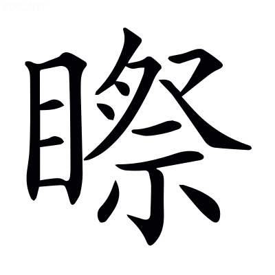

# 文選卷第十一

> 梁昭明太子撰
> 
> 文林郎守太子右內率府錄事參軍事崇賢館直學士臣李善注上

遊覽

## 登樓賦

盛弘之荊州記曰：當陽縣城樓，王仲宣登之而作賦。

> 王仲宣魏志曰：王粲，字仲宣，山陽人。獻帝西遷，粲從至長安。以西京擾亂，乃之荊州，依劉表。後太祖辟爲右丞相掾。魏國建，爲侍中，卒。

登茲樓以四望兮，聊暇~~`古雅`~~[^11.1.1]日以銷憂。馮衍顯志賦曰：伏朱樓而四望，采三秀之華英。孫卿子曰：多暇日者，其出入不遠也。賈逵國語注曰：暇，閑也。暇或爲假。楚辭曰：遷逡次而勿驅，聊假日以消時。邊讓章華臺賦曰：兾彌日以銷憂。漢書，東方朔曰：銷憂者莫若酒。假，古雅切

覽斯宇之所處兮，實顯敞而寡仇。~~說文曰：屋宇邊，謂樓之宇也。~~[^11.1.2]西京賦曰：雖斯宇之既坦。李尤高安館銘曰：增臺顯敞，禁室靜幽。蒼頡篇曰：敞，高顯也。爾雅曰：仇，匹也。

挾清漳之通浦兮，倚曲沮之長洲。挾，猶帶也。山海經曰：荊山，漳水出焉，而東南注于雎。漢書地理志曰：漢中房陵東山，沮水所出，至郢入江。雎與沮同。

背墳衍之廣陸兮，臨皐隰之沃流。杜預左氏傳注曰：陸，道也。孟康漢書注曰：沃，灌溉也。

北彌陶牧，西接昭丘。爾雅曰：彌，終也，謂終極也。盛弘之荊州記曰：江陵縣西有陶朱公冢，其碑云是越之范蠡而終於陶。爾雅曰：郊外曰牧。荊州圖記曰：當陽東南七十里有楚昭王墓，登樓則見，所謂昭丘。

華實蔽野，黍稷盈疇。春秋文耀鉤曰：春致其時，華實乃榮。說文曰：疇，耕治之田也。賈逵國語注曰：一井爲疇。

雖信美而非吾土兮，曾何足以少留？楚辭曰：雖信美而無禮。北征賦曰：曾不得乎少留。說文曰：曾，謂辭之舒也。

遭紛濁而遷逝兮，漫踰紀以迄今。紛濁，喻代亂也。楚辭曰：吸精粹而吐紛濁。孔安國尙書傳曰：十二年曰紀。毛詩曰：以迄于今。毛萇曰：迄，至也。

情眷眷而懷歸兮，孰憂思之可任？韓詩曰：眷眷懷顧。毛詩曰：豈不懷歸。毛萇曰：懷，思也。杜預左氏傳注曰：任，當也。

憑軒檻以遙望兮，向北風而開襟。言感北風逾增鄉思也。小雅曰：馮，依也。漢書曰：天子自軒檻上隤銅丸。韋昭曰：軒檻，殿上欄軒上板也。風賦曰：有風䬃然而至，王乃披襟而當之。

平原遠而極目兮，蔽荊山之高岑。楚辭曰：目極千里傷春心。漢書，臨沮縣，荊山在東北也。爾雅曰：山小而高曰岑。

路逶迤而脩迥兮，川既漾~~以上~~[^11.1.3]而濟深。逶迤，長貌也。爾雅曰：迥，遠也。韓詩曰：江之漾矣，不可方思。薛君曰：漾，長也。毛詩曰：濟有深涉。爾雅曰：濟，渡也。漾，以上切。

悲舊鄉之壅隔兮，涕橫墜而弗禁。楚辭曰：忽臨睨夫舊鄉。漢中山王勝曰[^11.1.4]：不知涕泣之橫集。

昔尼父之在陳兮，有歸歟之歎音。左氏傳曰：孔丘卒，公誄之曰：尼父，無自律。論語，子在陳曰：歸欤！歸欤！

鍾儀幽而楚奏兮，莊舄顯而越吟。左氏傳曰：晉侯觀于軍府，見鍾儀問曰：南冠而縶者誰也？有司對曰：鄭人所獻楚囚也。使稅之，問其族，對曰：伶人也。使與之琴，操南音。公曰：樂操土風，不忘舊也。史記曰：陳軫適楚，秦惠王曰：子去寡人之楚，亦思寡人不？陳軫對曰：昔越人莊舄仕楚執珪，有頃而病。楚王曰：舄，故越之鄙細人也，今仕楚執珪，富貴矣，亦思越不？對曰：凡人之思[^11.1.5]故，在其病也。彼思越則越聲，不思越則且楚聲。人往聽之，猶尚越聲也。今臣雖弃逐之楚，豈能無秦聲者哉！

人情同於懷土兮，豈窮達而異心？窮，謂鍾儀。達，謂莊舄。論語，子曰：小人懷土。孔安國曰：懷，思也。呂氏春秋曰：道德於此[^11.1.6]，窮達一也。

惟日月之逾邁兮，俟河清其未極。尙書云：日月逾邁，若弗云來。左氏傳，鄭子駟曰：周詩有之，俟河之清，人壽幾何？杜預曰：逸詩也。爾雅曰：極，至也。

兾王道之一平兮，假高衢而騁力。賈逵國語注曰：覬，望也。兾與覬同。尙書曰：王道正直。孔安國曰：王道平直也。高衢，謂大道也。薛君韓詩章句曰：騁，馳也。

懼匏瓜之徒懸兮，畏井渫之莫食。論語，子曰：吾豈匏瓜也哉，焉能繫而不食！鄭玄曰：我非匏瓜，焉能繫而不食者，兾往仕而得祿。周易曰：井渫不食，爲我心側。鄭玄曰：謂已浚渫也，猶臣脩正其身以事君也。張璠曰：可爲側然，傷道未行也，然不食以被任用也。

步棲遟以徙倚兮，白日忽其將匿。毛詩曰：衡門之下，可以棲遟。楚辝曰：步徙倚而遙思。杜預左氏傳注曰：匿，藏也。

風蕭瑟而並興兮，天慘慘而無色。楚辭曰：蕭瑟兮草木搖落而變衰。通俗文曰：暗色曰黲。慘與黲古字通。

獸狂顧以求羣兮，鳥相鳴而舉翼。楚辭曰：狂顧南行。王逸曰：狂，猶遽也。大戴禮夏小正曰：鳴也者，相命也。

原野闃其無人兮，征夫行而未息。原野闃無農人，但有征夫而已。周易曰：闚其戶，闃其無人。埤蒼曰：闃，靜也。毛詩曰：駪駪征夫。

心悽愴以感發兮，意忉怛丁達[^11.1.7]而憯七感切惻。廣雅曰：感，傷也。毛詩曰：勞心忉忉。毛萇曰：憂，勞也[^11.1.8]。又曰：勞心怛怛。毛萇曰：怛怛，猶忉怛也[^11.1.9]。

循堦除而下降兮，氣交憤於胷臆於力切[^11.1.10]。司馬彪上林賦注曰：除，樓階也。杜預左氏傳注曰：交，戾也。王逸楚辭注曰：憤，懣也。說文曰：臆，胷也。

夜參半而不寐兮，悵盤桓以反側。方言曰：參，分也。韓子曰：衛靈公泊濮水[^11.1.11]，夜分而聞有鼓瑟者[^11.1.12]。毛詩曰：耿耿不寐。易曰：初九，盤桓，利居貞。廣雅曰：盤桓，不進也。毛詩曰：展轉反側。

---

[^11.1.1]: 考異：注「古雅」　袁本、茶陵本無此二字，注末有「假古雅切」四字。案：二本是也。此音注「或爲假」之「假」，不當移入正文「暇」字下。
[^11.1.2]: 考異：注「說文曰屋宇邊謂樓之宇也」　袁本、茶陵本無此十三字。案：有者蓋誤衍。
[^11.1.3]: 考異：注「以上」　袁本、茶陵本作「漾以上切」，在注末，是也。
[^11.1.4]: 考異：注「漢中山王勝曰」　陳云「漢」下當有「書」字。各本皆脫。案：謂景十三王傳也。
[^11.1.5]: 考異：注「對曰凡人之思」　何校「對」上添「中謝」二字，是也。此陳軫傳文，各本皆脫。
[^11.1.6]: 考異：注「道德於此」　陳云「德」當作「得」，是也。各本皆譌。
[^11.1.7]: 考異：注「丁達」　袁本、茶陵本作「怛丁達切」，在注末，是也。
[^11.1.8]: 考異：注「憂勞也」　袁本、茶陵本此下有「音刀」二字，是也。
[^11.1.9]: 考異：注「猶忉怛也」　案：「怛」當作「忉」，各本皆譌。此齊風甫田傳文。猶者，猶上章。
[^11.1.10]: 考異：注「於力切」　袁本、茶陵本在注末，是也。
[^11.1.11]: 考異：注「衛靈公泊濮水」　案：「泊」當作「宿」，各本皆譌。王正長雜詩注引有其證。
[^11.1.12]: 考異：注「而聞有鼓瑟者」　袁本、茶陵本「瑟」作「琴」。案：「琴」是也。此韓子十過文，又載史記樂書，亦是「琴」字。

## 遊天台山賦

并序。支遁天台山銘序曰：余覽內經山記云：剡縣東南有天台山。

> 孫興公何法盛晉中興書曰：孫綽，字興公，太原人也。爲章安令，稍遷散騎常侍，領著作郎，尋轉廷尉卿，卒。于時才筆之士，綽爲其冠。

天台山者，蓋山嶽之神秀者也。廣雅曰：秀，異也。

涉海則有方丈蓬萊，登陸則有四明天台。方丈、蓬萊，皆海中名山也。爾雅曰：高平曰陸。謝靈運山居賦注曰：天台、四明相接連。四明方石四面，自然開窗。

皆玄聖之所遊化，靈仙之所窟宅。名山略記曰：天台山，即是定光寺諸佛所降葛仙公山也。

夫其峻極之狀，嘉祥之美，毛詩曰：嵩高維嶽，峻極于天。東京賦曰：備致嘉祥。

窮山海之瑰富，盡人神之壯麗矣。埤蒼曰：瑰瑋，珍琦也。

所以不列於五嶽，闕載於常典者，爾雅曰：太山爲東嶽，華山爲西嶽，衡山爲南嶽，常山爲北嶽，嵩山爲中嶽。常典，五經之流也。

豈不以所立冥奧，其路幽迥。冥奧者，冥冥深奧也。幽迥，遐遠也。

或倒景於重溟，或匿峰於千嶺。重溟，謂海也。山臨水而影倒，故曰倒景也。

始經魑魅之塗，卒踐無人之境。杜預左氏傳注曰：魑，山神。魅，怪物。莊子曰：其道幽遠而無人。

舉世罕能登陟，王者莫由禋祀。劉兆穀梁注曰：舉，盡也。楚辭曰：舉世皆然將誰告。孔安國尙書傳曰：精意以享謂之禋。

故事絕於常篇，名標於奇紀。廣雅曰：絕，滅也。篇，即常典也。廣雅曰：標，書也。奇紀，即內經山記。

然圖像之興，豈虛也哉！非夫遺世翫道，絕粒茹芝者，烏能輕舉而宅之？列仙傳曰：赤松子好食松實，絕穀。孔安國尙書傳曰：米食曰粒，音立。列仙傳讚曰：吞水須，茹芝莖，斷食休糧，以除穀氣。廣雅曰：茹，食也，讓慮切。楚辭曰：願輕舉而遠遊。

非夫遠寄冥搜，篤信通神者，何肯遙想而存之？言非寄情遐遠，搜訪幽冥，篤信善道，通神感化者，何肯存之也。

余所以馳神運思，晝詠宵興，俛仰之間，若已再升者也。莊子，老聃謂崔臞曰：其疾也哉，俛仰之間，再撫四海之外也。王弼周易注曰：若，辭也。臞，音劬。

方解纓絡，永託茲嶺。方，猶將也。纓絡以喻世網也。說文曰：嬰，繞也。纓與嬰通。郭璞山海經注曰：絡，繞也。

不任吟想之至，聊奮藻以散懷。歸田賦曰：揮翰墨以奮藻。

太虛遼廓而無閡，運自然之妙有，太虛，謂天也。自然，謂道也。無閡，謂無名。妙有，謂一也。言大道運彼自然之妙一而生萬物也。管子曰：虛而無形謂之道。鵩鳥賦曰：寥廓忽荒。老子曰：天法道，道法自然。鍾會曰：莫知所出，故曰自然。王弼曰：自然，無義之言，窮極之辭也。又曰：妙者，極之微也。老子曰：道生一。王弼曰：一數之始，而物之極也。謂之爲妙有者，欲言有，不見其形，則非有，故謂之妙；欲言其物由之以生，則非無，故謂之有也。斯乃無中之有，謂之妙有也。阮籍通老子論曰：道者自然，易謂之太極，春秋謂之元，老子謂之道也。

融而爲川瀆，結而爲山阜。老子曰：三生萬物。鍾會曰：散而爲萬物也。融，猶銷也。班固終南山賦曰：流澤遂而成水，停積結而爲山。

嗟台嶽之所奇挺，寔神明之所扶持。廣雅曰：挺，出也。魯靈光殿賦序曰：豈非神明依憑支持者也。

蔭牛宿以曜峰，託靈越以正基。天台，越境，故云牛宿也。漢書曰：越地，牽牛之分野。

結根彌於華岱，直指高於九疑。結，猶固也。南都賦曰：結根竦本。華、岱、九疑皆山名也。劉瓛周易義曰：彌，廣也。

應配天於唐典，齊峻極於周詩。配，猶對也。左氏傳，周史謂陳侯曰：姜，太嶽之後也。山嶽則配天。杜預曰：姜姓之先，爲堯四嶽，故曰唐典也。

邈彼絕域，幽邃窈窕。王逸楚辭注曰：邈，遠也。絕，遠也。魯靈光殿賦曰：琁室㛹娟以窈窕，洞房叫窱而幽邃。王逸曰：邃，深也。近智以守見而不之，之者以路絕而莫曉。近智，猶小智也。爾雅曰：之，往也。言近智守所見而不之，假有之者，以其路斷絕，莫之能曉也。方言曰：曉，知也。

哂夏蟲之疑冰，整輕翮而思矯。言淺近小智，同乎夏蟲，今既哂之，故整翮思矯也。馬融論語注曰：哂，笑也。莊子，北海若謂河伯曰：夏蟲不可以語於冰者，篤於時也。司馬彪曰：厚信其所見之時也。方言曰：矯，飛也。

理無隱而不彰，啓二奇以示兆。劉向列女傳曰：名無細而不聞，行無隱而不彰。二奇，赤城、瀑布也。賈逵國語注曰：兆，形也。

赤城霞起而建標卑遙，瀑布飛流以界道。支遁天台山銘序曰：往天台當由赤城山爲道徑。孔靈符會稽記曰：赤城山名色皆赤，狀似雲霞。懸霤千仞，謂之瀑布。飛流灑散，冬夏不竭。天台山圖曰：赤城山，天台之南門也。瀑布山，天台之西南峰。水從南巖懸注，望之如曳布。建標立物，以爲之表識也。戰國策曰：舉標甚高。界道，謂爲道疆界也。法華經曰：黃金爲繩，以界八道。

睹靈驗而遂徂，忽乎吾之將行。仍羽人於丹丘，尋不死之福庭。楚辭曰：仍羽人於丹丘兮，留不死之舊鄉。王逸曰：因就衆仙於明光也。丹丘，晝夜常明。山海經有羽人之國，不死之民。

苟台嶺之可攀，亦何羨於層城？薛君韓詩章句曰：羨，願也。淮南子曰：掘崑崙墟以下，地中有層城九重是也。

釋域中之常戀，暢超然之高情。老子曰：域中有四大。漢書音義曰：暢，通也。老子曰：雖有榮觀，宴處超然。

被毛褐之森森，振金策之鈴鈴。七啓曰：余好毛褐，未暇此服也。金策，錫杖也。鈴鈴，策聲。

披荒榛之蒙蘢，陟峭崿之崢嶸。高誘淮南子注曰：叢木曰榛。孫子曰：草樹蒙蘢。文字集略曰：崿，崖也。字林曰：崢嶸，山高貌。

濟楢由溪而直進，落五界而迅征。顧愷之啓蒙記注曰：之天台山，次經油溪。謝靈運山居賦曰：凌石橋之莓苔，越楢溪之縈紆。注曰：所居往來，要經石橋、過楢溪，人跡不復過此。楢字雖殊，並酉留切。落，邪行也。五界，五縣之界。孔靈符會稽記曰：此山舊名，五縣之餘地。五縣：餘姚、鄞、句章、剡、始寧。服虔漢書注曰：鄞，音銀。

跨穹隆之懸磴丁鄧，臨萬丈之絕冥。穹隆，長曲貌。西京賦曰：閣道穹隆。懸磴，石橋也。顧愷之啓蒙記曰：天台山石橋，路逕不盈尺，長數十步，步至滑，下臨絕冥之澗。冥，幽深也。

踐莓苔之滑石，搏壁立之翠屏。莓苔，即石橋之苔也。翠屏，石橋之上石壁之名也。異苑曰：天台山石有莓苔之險。孔靈符會稽記曰：赤城山上，有石橋懸度，有石屏風橫絕橋上，邊有過逕，纔容數人。仲長子昌言曰：斧帳翠屏之不坐。莓，音梅。

攬樛居求木之長蘿，援葛藟力鬼之飛莖。顧愷之啓蒙記注曰：濟石橋者，搏巖壁，援女蘿葛藟之莖。毛詩曰：南有樛木，葛藟纍之。毛萇曰：木下曲曰樛。爾雅曰：女蘿，兔絲。賈逵國語注曰：援，引也。

雖一冒於垂堂，乃永存乎長生。漢爰盎諫上曰：臣聞千金之子，坐不垂堂。老子曰：長生久視之道。東方朔十洲記曰：桂英流丹，服之長生。

必契誠於幽昧，履重嶮而逾平。幽昧，謂道也。鍾會老子注曰：幽冥晦昧，故稱爲玄。

既克隮於九折，路威夷而脩通。言其道嶮，曲折有九也。杜篤首陽山賦曰：九折萎嶵而多艱。韓詩曰：道威夷者也。

恣心目之寥朗，任緩步之從容。列子曰：晏平仲問養生於管夷吾曰：恣目之所欲視，恣意之所欲行。寥朗，謂心虛目明也。說文曰：寥，虛空也。毛萇詩傳曰：朗，明也。列子曰：子華之容，緩步闊視。尙書曰：從容以和。

藉慈夜萋萋之纖草，蔭落落之長松。以草薦地而坐曰藉。楚辭曰：春草生兮萋萋。杜篤首陽山賦曰：長松落落，卉木蒙蒙。

覿翔鸞之裔裔，聽鳴鳳之嗈嗈。裔裔，飛貌也。爾雅曰：嗈嗈，和也，謂聲之和也。

過靈溪而一濯，疏煩想於心胸。靈溪，溪名也。廣雅曰：濯，洗也。賈逵國語注曰：疏，除也。

蕩遺塵於旋流，發五蓋之遊蒙。因一濯而假言也。六塵虛假而能不住，故曰蕩。雖遣而未能盡，故曰遺。中論曰：六塵，色、聲、香、味、觸、法。高誘淮南子注曰：旋流，深淵也。身意皆淨而能不離，故曰發。五蓋非真而蔽己善行，故曰遊。大智度論曰：五蓋，貪欲、瞋恚、睡眠、調戲、疑悔。禮記曰：昭然發蒙。五蓋或爲神表。

追羲農之絕軌，躡二老之玄蹤。羲、農，伏羲、神農也。廣雅曰：軌，跡也。又曰：躡，履也。二老，老子、老萊子也。史記曰：老子者，楚苦縣人，名耳，字聃，姓李氏。見周之衰，乃遂去。西至關，關令曰：子將隱矣，強爲我著書。乃著上下二篇，言道德之意。又曰：老萊子，亦楚人也。著書十五篇，言道家之用，脩道而養壽也。劉向別錄曰：老萊子，古之壽者。

陟降信宿，迄于仙都。毛詩曰：陟降廷止。毛萇曰：陟降，上下。左氏傳曰：凡師一宿爲舍，再宿爲信。爾雅曰：迄，至也。十洲記曰：滄浪海島中有石室，九老仙都治處，仙官數萬人。

雙闕雲竦以夾路，瓊臺中天而懸居。朱闕玲瓏於林間，玉堂陰映于高隅。顧愷之啓蒙記注曰：天台山列雙闕於青霄中，上有瓊樓、瑤林、醴泉，仙物畢具。十洲記曰：承淵山金臺玉樓，流精之闕，瓊華之室，西王母之所治，真官仙靈之所宗也。晉灼漢書注曰：玲瓏，明見貌。

彤雲斐亹亡匪以翼櫺，曒公鳥日炯晃於綺疏。斐亹，文貌。翼，猶承也。櫺，窗間子也。毛詩曰：有如曒日。炯晃，光明也。李尤東觀銘曰：房闥內布，綺疏外陳。薛綜西京賦注曰：疏，刻穿之也。然刻爲綺文，謂之綺疏也。

八桂森挺以凌霜，五芝含秀而晨敷。山海經曰：桂林八樹，在賁隅東。郭璞曰：八樹成林，言其大也。賁隅音番禺。神農本草經曰：桂葉冬夏常青不枯。又曰：赤芝一名丹芝，黃芝一名金芝，白芝一名玉芝，黑芝一名玄芝，紫芝一名木芝。馮衍顯志賦曰：食五芝之茂英。

惠風佇芳於陽林，醴泉涌溜於陰渠。邊讓章華臺賦曰：惠風春施。宁，猶積也。佇與宁同。毛萇詩傳曰：山南曰陽。鄭玄周禮注曰：陽林生於山南。史記曰：崑崙山上有醴泉。白虎通曰：醴泉者美泉，狀如醴。陰渠，山北之渠。

建木滅景於千尋，琪樹璀璨而垂珠。淮南子曰：建木在廣都，衆帝所自上下。日中無景，呼而無響，蓋天地之中也。山海經曰：神人之丘，有建木，百仞無枝。又曰：崑崙之墟，北有珠樹、文玉樹、玗琪樹。璀璨，珠垂貌。玗，羽俱切。璀，七罪切。

王喬控鶴以沖天，應真飛錫以躡虛。列仙傳曰：王子喬者，周靈王太子晉也。道人浮丘公接以上嵩高山。三十餘年後，人於山上見之。告我家於七月七日待我於緱氏山頭。果乘白鶴駐山頭。毛萇詩傳曰：控，引也。史記，楚莊王曰：有鳥不蜚，蜚乃沖天。百法論曰：并及八輩應真僧。然應真，謂羅漢也。大智度論曰：菩薩常應二時，頭陀常用錫杖、經傳、佛像。

騁神變之揮霍，忽出有而入無。言衆仙既登正道，故能騁其神變，出於衆有而入無爲也。淮南子曰：出於無有，入於無爲。

於是遊覽既周，體靜心閑。王逸楚辭注曰：閑，靜也。害馬已去，世事都捐。莊子曰：黃帝將見大隗于具茨之山，適遇牧馬童子。黃帝曰：請問爲天下？小童曰：夫爲天下者，亦奚以異乎牧馬者哉？亦但去其害馬者而已矣！郭璞曰：馬以過分爲害。歸田賦曰：與世事乎長辭。

投刃皆虛，目牛無全。莊子曰：庖丁爲文惠君屠牛。文惠君曰：善哉技。庖丁對曰：臣好者道，進乎技矣。臣始解牛時，所見無非牛者，三年之後，未嘗見全牛也。今臣以神遇，而不以目視也。

凝思幽巖，朗詠長川。廣雅曰：凝，止也。朗，猶清徹也。

爾乃羲和亭午，遊氣高褰。楚辭曰：吾令羲和弭節兮。王逸曰：羲和，日御也。午，日中。徐爰射雉賦注曰：褰，開也。

法鼓琅以振響，衆香馥以揚煙。法華經曰：擊大法鼓。又曰：燒衆名香。

肆覲天宗，爰集通仙。天宗，謂老君也。通仙，謂衆仙也。其通猶通侯也。尙書曰：肆覲羣后。孔安國曰：肆，遂也。

挹以玄玉之膏，嗽以華池之泉。毛萇詩傳曰：挹，斟也。山海經曰：密山是生玄玉，玉膏之所出。郭璞曰：言玉膏中又出黑玉。史記曰：崑崙其上有華池。

散以象外之說，暢以無生之篇。象外，謂道也。周易曰：象者，像也。荀粲列傳，粲答兄俁云：立象以盡意，此非通乎象外者也。象外之意，故蘊而不出矣。無生，謂釋典也。維摩詰曰：是天女所願具足，得無生忍。俁，牛矩切。

悟遣有之不盡，覺涉無之有間；言道釋二典，皆以無爲宗。今悟有爲非而遣之，遣之而不盡，覺無爲是而涉之，涉之而有間，言皆滯於有也。說文曰：悟，覺也。小雅曰：間，隙也。

泯色空以合跡，忽即有而得玄。言有既滯有，故釋典泯色空以合其跡。道教忽於有而得於玄。郭象莊子注曰：泯，平泯也。又曰：本末內外，暢然俱得，泯然無跡。維摩經，喜見菩薩曰：色色空爲二，色即是空，非色滅空，色性自空，如是受想行識。識空爲二，識即是空，非識性自空，於其中通而達者，爲入不二法門。有，謂有形也。王弼老子注曰：凡有皆始於無。又曰：有之所始，以無爲本。然王以凡有皆以無爲本，無以有爲功，將欲寤無，必資於有。故曰，即有而得玄也。王弼又曰：玄，冥嘿無有也。

釋二名之同出，消一無於三幡。釋，謂解說令散也。二名，即有名物始，無名物母也。言二名雖異，釋之令同出於道也。老子曰：無名天地之始，有名萬物之母。故常無欲以觀其妙，常有欲以觀其徼。此兩者，同出而異名，同謂之玄。王弼曰：兩者謂始與母也，同出於玄也。異名，所施不同也，在首則謂之始，終則謂之母也。訓暢令盡也。三幡，色一也。色空二也，觀三也。言三幡雖殊，消令爲一，同歸於無也。郤敬輿與謝慶緒書論三幡義曰：近論三幡，諸人猶多欲，既觀色空，別更觀識，同在一有，而重假二觀，於理爲長。然敬輿之意，以色空及觀爲三幡，識空及觀亦爲三幡。

恣語樂以終日，等寂默於不言。夫言從道生，道因言暢。道之因言，理歸空一，故終日語樂，等乎不言。莊子曰：言而足，則終日言而盡道也。又曰：言無言，終身未嘗言，終身不言，未嘗不言。

渾萬象以冥觀，兀同體於自然。妙悟玄宗，則蕩然都遣，不知己之是己，不見物之爲物，故渾齊萬像以冥觀，兀然同體於自然。孝經鉤命決曰：地以舒形，萬象咸載。冥，昧也，言不顯視也。兀，無知之貌也。自然，已見上文。

---

蓋山嶽之神秀者也：袁本、茶陵本無「者」字。
注「老子曰天法道」下至「極之微也」　此四十三字袁本、茶陵本無。案：此以尤所校添爲是。
注「欲言其」：袁本、茶陵本「其」下有「無」字。案：有者是也。
近智以守見而不之：袁本、茶陵本「智」下有「者」字。案：二本不載校語，無可考也。
注「卑遙」：袁本、茶陵本作「卑遙切」，在注中「舉標甚高」下，是也。
注「名色皆赤」：案：「名」當作「石」。各本皆譌而屬上，非也。
注「丁鄧」：袁本、茶陵本作「磴丁鄧切」，在注中「下臨絕冥之澗」下，是也。
注「顧愷之啓蒙記曰」：袁本、茶陵本「記」下有「注」字，是也。
注「異苑曰天台山石」：何校「石」下添「橋」字。各本皆脫。
注「居求」又注「力鬼」：袁本、茶陵本作「居虯切」，「藟，力鬼切」，在注中「木下曲曰樛」下，是也。
注「道威夷者也」：陳云別本「道」上有「周」字，無「者也」。案：此脫「周」字，衍「者」字。別本今未見。
注「玲瓏明見貌」：案：「玲瓏」當作「瓏玲」，此楊雄傳「和氏瓏玲」注也。善取同義，不拘語倒。其例全書盡然，不知者依正文乙轉，非也。
注「亡匪」：袁本、茶陵本作「亹亡匪切」，在注中「文貌」下，是也。
注「宁猶積也佇與宁同」：陳云「宁」當作「貯」，是也。各本皆譌。
注「陽林生於山南」：案：「林」當作「木」，此「地官山虞」注也。善以「陽木」注「陽林」，不知者依正文改字，非也。
挹以玄玉之膏：案：「挹」當作「揖」。乃善「揖」、五臣「挹」而亂之，說見下。
注「挹斟也」：袁本、茶陵本此下有「揖與挹同」四字。案：二本有者最是也。善引詩傳「挹」以注「揖」，故有是語，五臣因改爲「挹」。袁、茶陵皆正文用五臣亂善而不載校語。尤本并刪此注，幾莫可考，甚非。
注「荀粲列傳」：案：「列」當作「別」。各本皆誤。三國魏志荀彧傳注有其證也。

## 蕪城賦

四言。集云：登廣陵故城。漢書曰：廣陵國，高帝十一年屬吳，景帝更名江都，武帝更名廣陵。江都易王非、廣陵厲王胥皆都焉。

> 鮑明遠沈約宋書：鮑昭，字明遠，文辭贍逸。世祖時，昭爲中書舍人，上好爲文章，自謂物莫能及，昭悟其旨，爲文多鄙言累句，當時咸謂昭才盡，實不然也。臨海王子瑱爲荊州，昭爲前軍掌書記之任。子瑱敗，爲亂兵所殺。

濔弭迆以爾平原，濔，相連漸平之貌也。廣雅曰：迆，斜也。平原，即廣陵也。

南馳蒼梧漲張海，北走去聲紫塞鴈門。南馳、北走，言所通者遠也。漢書有蒼梧郡。謝承後漢書曰：陳茂常渡漲海。如淳漢書注曰：走，音奏，趨也。崔豹古今注曰：秦所築長城土色皆紫，漢塞亦然，故稱紫塞。漢書有鴈門郡。

柂以漕渠，軸以崑崗。廣雅曰：柂，引也。漕渠，邗溝也。左氏傳曰：吳城邗溝，通江、淮。杜預曰：通糧道。說文曰：漕，水轉轂也。又曰：軸，持輪也。崑崗，廣陵之鎮平也，類車軸之持輪。河圖括地象曰：崑崗之山，橫爲地軸。柂或爲阹，軸或爲袖。

重江複關之隩，四會五達之莊。南臨江曰重，濱帶江南曰複。蒼頡篇曰：隩，藏也。洛陽記曰：銅駞二枚在四會道頭。爾雅曰：五達謂之康，六達謂之莊。

當昔全盛之時，車挂轊衛，人駕肩。全盛，謂漢時也。史記，蘇秦說齊王曰：臨菑之塗，車𩌊擊，人肩摩。說文曰：轊，車軸端。杜預左氏傳注曰：駕，陵也，謂相迫切也。

廛閈撲卜地，歌吹沸天。鄭玄周禮注曰：廛，民居區域之稱。說文曰：閈，閭也。方言曰：撲，盡也。郭璞曰：今種物皆生，云撲地出也。

孳茲貨鹽田，鏟利銅山。聲類曰：孳，蕃也。孳、滋古字通也。海賦曰：陸死鹽田。蒼頡篇曰：鏟，削平也，初產切。史記曰：吳有豫章郡銅山，吳王濞盜鑄錢，煮海水爲鹽。

才力雄富，士馬精妍。班固傳贊曰：材力有餘，士馬強盛。范曄後漢書曰：王元說隗囂曰：今天水完富，士馬最強。

故能奓秦法，佚周令。聲類曰：奓，侈字也。軼，過也。佚與軼通。西都賦曰：覽秦制，跨周法。

劃崇墉，刳濬洫，圖脩世以休命。字林曰：佳刀曰劃。刳，謂除消其土也。周易曰：刳木爲舟。薛綜西京賦注：墉，謂城；洫，池也。左氏傳，北宮文子曰：其有國家，令問長世。尙書曰：俟天休命。春秋元命苞曰：命者，天之命也。

是以板築雉堞之殷，井幹寒烽櫓之勤。郭璞曰：三蒼解詁曰：板，築牆上下板。築，杵頭鐵沓也。鄭玄周禮注曰：雉，長三丈，高一丈。杜預左氏傳注曰：堞，女牆也。殷，盛也。淮南子曰：大構架，興宮室，雞棲井幹。許慎曰：皆屋構飭也。郭璞上林賦注曰：櫓，望樓也。

格高五嶽，袤廣三墳。蒼頡篇曰：格，量度也。五嶽，已見天台賦。南北曰袤。三墳未詳，或曰：毛詩曰，遵彼汝墳。又曰：鋪敦淮墳。爾雅曰：墳莫大於河墳。此蓋三墳。

崪慈聿若斷岸，矗丑六似長雲。崒，高峻也。矗，齊平也。

製磁石以禦衝，糊頳壤以飛文。三輔黃圖曰：阿房宮以磁石爲門，懷刃者止之。廣雅曰：衝，突也。字書曰：糊，黏也，戶徒切。毛萇詩傳曰：頳，赤也。七啓曰：燿飛文。

觀基扃之固護，將萬祀而一君。說文曰：扃，外閉之關也。凡文士之言基扃，汎論城闕，猶車稱軫，舟謂之艫耳，非獨指扃也。固護，言牢固也。

出入三代五百餘載，竟瓜剖而豆分！王逸廣陵郡圖經曰：郡城，吳王濞所築。然自漢迄于晉末，故云出入三代五百餘載也。漢書，賈誼上疏曰：高帝瓜分天下，王功臣也。

澤葵依井，荒葛罥塗。王逸楚辭注曰：風萍，水葵，生於池中。罥，猶綰也。

壇羅虺吁鬼蜮羽逼，階鬬麏居筠鼯。王逸楚辭注曰：壇，堂也。毛詩曰：爲鬼爲蜮。毛萇曰：蜮，短狐也。公羊傳曰：有麇而角。劉兆曰：麇，麞也。麏與麇音義同。鼯，鼯鼠也。

木魅莫隗山鬼，野鼠城狐。說文曰：魅，老物精也，莫愧切。楚辭九歌有祭山鬼。漢書曰：蘇武掘野鼠草實而食之。魏明帝長歌行曰：久城育狐兔，高墉多鳥聲。

風嘷雨嘯，昏見晨趨。左氏傳曰：豺狼所嘷也。胡高切。

飢鷹厲吻，寒鴟嚇雛。厲，摩也。鄭玄周禮注曰：吻，口邊也，亡粉切。鄭玄毛詩箋曰：口拒人曰嚇，火嫁切。郭璞爾雅注曰：雛生而能自食者，謂鳥子也。

伏虣藏虎，乳血飧膚。字書曰：虣，古文暴字，蒲到切。虣或爲甝。爾雅曰：甝，白虎。甝，戶甘切。

崩榛塞路，崢嶸古馗。服虔漢書注曰：榛，木叢生也。廣雅曰：崢嶸，深冥也。韓詩曰：肅肅兔罝，施于中馗。薛君曰：中馗，馗中九交之道也。仇悲切。

白楊早落，塞草前衰。崔豹古今注曰：白楊葉圓。李陵書曰：涼秋九月，塞外草衰。塞或爲寒。

稜稜霜氣，蔌蔌風威。稜稜霜氣，嚴冬之貌。蔌蔌風聲，勁疾之貌。蔌，素鹿切。

孤蓬自振，驚砂坐飛。無故而飛曰坐飛。

灌莽杳而無際，叢薄紛其相依。廣雅曰：灌，叢也。王逸楚辭注曰：草木交曰薄。

通池既已夷，峻隅又已頹。通池，城濠也。峻隅，城隅也。

直視千里外，唯見起黃埃。王逸楚辭注曰：埃，塵也。

凝思寂聽，心傷已摧。天台山賦曰：凝思高巖。

若夫藻扃黼帳，歌堂舞閣之基。璇淵碧樹，弋林釣渚之館。藻扃，扃施藻畫也。司馬相如美人賦曰：芳香芬烈，黼帳高張。璇淵，玉池也。碧樹，玉樹也。

吳蔡齊秦之聲，魚龍爵馬之玩。楚辭曰：吳歈、蔡謳。漢書藝文志有齊歌、秦歌。西京賦曰：海鱗變而成龍。又曰：大雀踆踆。又曰：爵馬同轡。

皆薰歇燼滅，光沉響絕。杜預左氏傳注曰：薰，香草也。又曰：燼，火之餘木。

東都妙姬，南國麗人。蕙心紈質，玉貌絳脣。陸機擬東城一何高曰：京洛多妖麗，玉顏侔瓊蕤。然京洛即東都也。曹子建詩曰：南國有佳人，華容若桃李。左九嬪武帝納皇后頌曰：如蘭之茂。好色賦曰：腰如束素。蘭蕙同類，紈素兼名，文士愛奇，故變文耳。宋玉笛賦曰：頳顏臻，玉貌起。楊雄蜀都賦曰：姚朱顏，離絳脣。

莫不埋魂幽石，委骨窮塵。委，猶積也。

豈憶同輿之愉樂，離宮之苦辛哉！魏志曰：明帝悼毛皇后有寵，出入與帝同輿輦。長門賦曰：期城南之離宮。

天道如何？吞恨者多！抽琴命操，爲蕪城之歌。韓詩外傳曰：孔子抽琴按軫，以授子貢。廣雅曰：命，名也。琴道曰：琴有伯夷之操。夫遭遇異時，窮則獨善其身，故謂之操。

歌曰：邊風急兮城上寒，井逕滅兮丘隴殘。周禮曰：九夫爲井。又曰：夫間有遂，遂上有徑。

千齡兮萬代，共盡兮何言！莊子曰：化窮數盡謂之死。

---

蕪城賦注「四言」：袁本無此二字。案：無者是也。凡四言、五言，皆詩題下注，賦不得有。茶陵本亦衍，與尤所見同誤。或連之於下注「集云」讀更誤。集者，鮑明遠集。茶陵本於「集云」上隔以「善曰」二字，則雖衍而未嘗以爲「四言集」也。今鮑集正有所云，亦可證。
注「登廣陵故城」：陳云下當有「作」字。案：此依集校，是也。各本皆脫。
注「昭爲前軍」：何校下添「行參軍」三字。陳云當有，是也。各本皆脫。
柂以漕渠：袁本、茶陵本云「柂」，善作「弛」。案：二本及尤所見，皆非也。考善注引廣雅「拖引也」，必作「拖」字。其五臣濟注「柂舟具也」，乃改之使配下句「軸」耳。不當以亂善，亦不得謂善別作「弛」也。注中「拖」字，尤、茶陵亦誤「柂」。袁本尚未偽，可據以訂正。
注「南臨江曰重濱帶江南曰複」：袁本、茶陵本「臨」下有「二」字，「帶」上無「濱」字。案：二本是也。又案：據此注似集云「重關複江」者，恐是誤倒。何校正文取之，非矣。
孳貨鹽田：案：「孳」當作「滋」，注云：「孳，蕃也，孳、滋古字通也。」善必作「滋」字，故有是語。五臣因改爲「孳」。各本所見以之亂善，袁、茶陵又不載校語，皆非。下文「奓秦法」，善「奓」、五臣「侈」。尤自不誤，而二本亦無校語，正同此誤。
注「佳刀曰劃」：茶陵本「佳」作「注」。案：皆誤也。當作「錐」，說文如此。陳云別本作「錐」。袁本仍作「佳」，亦誤。
注「郭璞曰三倉解詁曰」：陳云上「曰」字衍，是也。各本皆衍。
注「爵馬同轡」：案：「爵」當作「百」，此因正文云「爵馬」而誤，不知「爵」字上引「大雀踆踆」，已注訖，此但注「馬」字也。各本皆誤。
注「孔子抽琴按軫」：袁本「按」作「去」。案：「去」字是也。茶陵本亦誤「按」。
井逕滅兮：袁本、茶陵本「逕」作「徑」。案：「徑」字是也。

宮殿

## 魯靈光殿賦

并序

> 王文考范曄後漢書曰：王逸，字叔師，南郡宜城人也。子延壽，字文考，有雋才，遊魯作靈光殿賦。後蔡邕亦造此賦，未成，及見延壽所爲，甚奇之，遂輟翰而止。後溺水死，時年二十餘。

> 張載注

魯靈光殿者，蓋景帝程姬之子恭王餘之所立也。善曰：漢書景帝十三王傳曰：程姬生魯恭王餘。

初，恭王始都下國，好治宮室，善曰：漢書曰：恭王徙魯，好治宮室。毛詩曰：命于下國。韋昭國語注曰：曲沃在絳下，故曰下國。然以天子爲上國，故諸侯爲下國。

遂因魯僖基兆而營焉。昔魯僖公使大夫公子奚斯，上新姜嫄之廟，下治文公之宮，故曰遂因魯僖基兆而營焉。善曰：史記，季友奉公子申立，是爲釐公。釐與僖同。爾雅曰：兆，域也。

遭漢中微，盜賊奔突，突，唐突也。詩云：昆夷突矣。

自西京未央建章之殿，皆見隳壞，未央、建章，西京二殿之名。杜預左氏傳注曰：隳，毀也。

而靈光巋丘軌然獨存。巋然，高大堅固貌也。善曰：孔叢子，孔子曰：夫山者巋然高。

意者豈非神明依憑支持以保漢室者也。善曰：廣雅曰：意，疑也。

然其規矩制度，上應星宿音秀，亦所以永安也。善曰：上應星宿，謂觜陬也。賦曰：規矩應天，上憲觜陬。

予客自南鄙，觀蓺於魯，南鄙，荊州也。廣雅曰：鄙，國也。蓺，六經也。魯有周公、孔子在焉。

睹斯而眙丑吏切。愕視曰眙。本爲蓺而來，見此驚也。

曰：嗟乎！詩人之興，感物而作。見可嗟之物，爲作詩作賦。

故奚斯頌僖，歌其路寢，而功績存乎辭，德音昭乎聲。善曰：韓詩曰：新廟奕奕，奚斯所作。薛君曰：奚斯，魯公子也。言其新廟弈弈然盛。是詩公子奚斯所作也。左氏傳，司馬侯曰：先王務脩德音，以享神人。毛詩曰：我有嘉賓，德音孔昭。

物以賦顯，事以頌宣，匪賦匪頌，將何述焉？遂作賦曰：

粵若稽古帝漢，祖宗濬哲欽明。若，順也。稽，考也。言能順天地，考行古之道者，帝也。濬，深也。哲，智也。又有深知欽明。詩云：濬哲維商。書云：放勳欽明。善曰：書曰：粵若稽古帝堯。又曰：濬哲文明。

殷五代之純熙，紹伊唐之炎精。善曰：殷，盛也。五代，周、殷、夏、唐、虞也。言漢盛於五代純熙之道。而紹帝堯火德之運。毛詩曰：時純熙矣。爾雅曰：純，大也。孔安國尙書傳曰：熙，廣也。爾雅曰：紹，繼也。詩含神務曰：慶都生伊堯。孔安國尙書傳曰：堯以唐侯升爲天子。李尤德陽殿賦曰：若炎唐稽古作先。東觀漢記序曰：漢以炎精布耀，或幽而光。又馮衍說鮑永曰：社稷復存，炎精更輝。

荷天衢以元亨，廓宇宙而作京。衢，道也。易曰：荷天之衢，道大行也。元，善之長也。亨，嘉之會也。天所覆爲宇，中所由爲宙也。善曰：方言曰：張小使大謂之廓。鄭玄周易注曰：人君在上位，負荷天之大道。

敷皇極以創業，協神道而大寧。皇極，皇建其有極，謂得中也。協和神明之道，而天下大寧，皆謂初漢之盛時也。善曰：孟子曰：君子創業垂統，謂可繼也。周易曰：聖人以神道設教。

於是百姓昭明，九族敦序，乃命孝孫，俾侯于魯。善曰：尙書曰：百姓昭明。又曰：敦敘九族。孔安國曰：九族。高祖玄孫之親也。爾雅曰：命，告也。毛詩曰：孝孫有慶。又曰：建爾元子，俾侯于魯。

錫介珪以作瑞，宅附庸而開宇。介，大也。圭長尺二寸謂之介。瑞，信也。諸侯錫大圭以爲瑞信，又以爲寶。申伯之封云：錫爾介圭，以作爾寶。古者附庸百里，魯五百里之封也。成王以周公有大功，錫二十四等附庸，方七百里，以是開居也。善曰：毛詩曰：錫之山川，土田附庸。又曰：大啓爾宇，爲周室輔。

乃立靈光之秘殿，配紫微而爲輔。詩云：秘宮有侐。紫微至尊宮，斥京師也。善曰：毛萇詩傳曰：秘，神也。西京賦曰：思比象於紫微。春秋合誠圖曰：北辰，其星七，在紫微中，

承明堂於少陽，昭列顯於奎之分野。善曰：言承漢明堂而在少陽之位，其光昭列，顯於奎之分野也。爾雅曰：分，次也。漢書曰：泰山郡奉高縣有明堂，武帝造。又曰：少陽，東方也。又曰：魯地，奎、婁之分野也。一曰春秋說題辭曰：心爲天，明堂以布政教，言靈光承天之明堂，在少陽之地。

瞻彼靈光之爲狀也，則嵯峨嶵罪嵬隗，峞巍㠥𡸖。皆其形也。善曰：皆高峻之貌。峞，羌軌切。巍，五軌切。㠥，盧罪切。𡸖，枯罪切。吁！可畏乎其駭人也。駭，驚也，故睹斯而眙。孔安國尙書傳曰：吁，疑怪之辭。

迢嶢倜儻，豐麗博敞，洞轇轕乎其無垠也。又其形也。博，廣也。敞，高平也。善曰：迢嶢，高貌也。倜儻，非常也。上林賦曰：張樂乎膠葛之寓。郭璞曰：言曠遠深邈貌。

邈希世而特出，羌瑰譎而鴻紛。羌，辭也。羌，亦乃也。善曰：瑰，異。譎，詭也。甘泉賦曰：上洪紛而相錯。

屹魚乙山峙以紆鬱，隆崛魚勿岉勿乎青雲。屹，猶孽也，高大貌。詩云：臨衝弗弗，崇墉屹屹。隆屈也。西京賦曰：終南太一，隆屈崔崒。崛岉乎青雲，言此物上逮青雲。善曰：廣雅曰：峙，止也。

鬱坱鞅圠烏黠以嶒七耕𡵓宏，崱助力繒綾陵而龍鱗。崱，崱嶷然皆其形也。善曰：坱圠，無齊限之貌。嶒𡵓，深空貌。繒綾，不平貌。甘泉賦曰：嵌巖其龍鱗。汩于筆

磑磑五哀以璀璨，赫燡燡亦而爥坤。皆其形貌光輝也。善曰：汩，淨貌。磑磑，高貌。璀璨，衆材飾貌。燡，光明貌。爥坤，光照下土。

狀若積石之鏘鏘，又似乎帝室之威神。威神，言尊嚴也。善曰：積石，山名。西都賦曰：激神岳之嶈嶈。帝室，天帝之室。春秋合誠圖曰：紫宮，太帝室也。

崇墉岡連以嶺屬，朱闕巖巖而雙立。墉，牆也。善曰：李尤德陽殿賦曰：朱闕巖巖。

高門擬于閶闔，方二軌而並入。閶闔，天門也。王者因以爲門。善曰：二軌，謂容兩車也。鄭玄儀禮注曰：方，併也。周禮曰：應門二轍。鄭玄周禮注曰：軌，謂轍廣。

於是乎乃歷夫太階，以造其堂。俯仰顧眄，東西周章。造其堂、觀其狀而賦之。善曰：孔安國尙書傳曰：造，至也。

彤彩之飾，徒何爲乎？澔澔涆涆，流離爛漫。善曰：澔澔涆涆，光明盛貌。澔，古老切。涆，古旦切。流離爛漫，分散遠貌。

皓壁皜曜以月照，丹柱歙赩而電烻。霞駮雲蔚，若陰若陽。其色狀也。善曰：皜，白也，古老切。崔駰七依曰：丹柱彫牆，烻光盛起。烻，弋戰切。

瀖濩燐亂，煒煒煌煌。善曰：采色衆多，眩曜不定也。瀖，音霍。濩，音穫。

隱陰夏以中處，霐寥窲以崢嶸。善曰：陰夏，向北之殿也。韋仲將景福殿賦曰：陰夏則有望舒涼室。亦與此同。霐寥窲、崢嶸，皆幽深之貌。霐，烏宏切。寥，魚夭切。窲，音巢。

鴻爌炾以爣閬，飋蕭條而清泠。鴻，大也。爌炾、爣朗，皆寬明也。善曰：飋蕭條，清涼之貌。爌，苦晃切。炾，呼廣切。爣，土黨切。閬，音朗。

動滴瀝以成響，殷雷應其若驚。善曰：言簷垂滴瀝，纔成小響，室內應之，其聲似雷之驚也。說文曰：滴瀝，水下滴瀝之也。

耳嘈嘈以失聽，目矎矎而喪精。言炫燿也。矎矎，目不正也。善曰：埤蒼曰：嘈嘈，聲衆也。廣雅曰：矎，視也。洞簫賦曰：愍眸子之喪精。矎，火縣切。

駢密石與琅玕，齊玉璫與璧英。琅玕，珠也，似玉。尙書曰：球琳琅玕。善曰：李軌法言注曰，駢，並也。國語曰：天子之室，加密石焉。韋昭曰：密，密理，謂砥也。然彼以密石磨琢，此亦爲飾也。西都賦曰：裁金璧以飾璫。璧英，璧玉之英也。孝經援神契曰：玉英，玉有英華之色。

遂排金扉而北入，霄靄靄而晻曖。言深邃也。霄，冥也

旋室㛹娟以窈窕，洞房叫窱而幽邃。善曰：淮南子曰：傾宮、旋室，在崑崙閶闔之中。徐幹七喻曰：連觀飛榭，旋室迴房，旋室，曲屋也。㛹娟，迴曲貌。楚辭曰：姱容脩態亘洞房。西京賦曰：望叫窱以經廷。西廂踟躕以閑宴，西廂，西序也。踟躕，連閣傍小室也。閑，清閑也，可以燕會。踟或移字。善曰：踟躕，相連貌。毛萇傳曰：宴，安也，言安靜也。

東序重深而奧祕。東序，東廂也。互言之，文相避耳。爾雅曰：東西廂謂之序。善曰：廣雅曰：奧，藏也。字書曰：祕，密也。

屹鏗瞑以勿罔，屑黶翳以懿濞。寂寞之形也。善曰：瞑，莫耕切。

魂悚悚其驚斯，心而發悸。驚斯，於此驚也。善曰：蘇林漢書注曰：葸葸，懼貌。與葸同。說文曰：悸，心動也，渠季切。悸或爲欷。

於是詳察其棟宇，觀其結構。欲安心定意審其事也。善曰：高誘呂氏春秋注曰：結，交也。構，架也。

規矩應天，上憲觜陬。應天文星宿也。憲，法也。善曰：爾雅曰：觜陬之星，營室東壁也。毛詩曰：定之方中，作爲楚宮。毛萇曰：定，營室也。觜，子移切。陬，子瑜切。

倔佹雲起，嶔崟離摟。善曰：甘泉賦曰：大夏雲譎波詭。離摟，衆木交加之貌。長門賦曰：羅丰茸之遊樹，離摟梧而相撐。倔，渠物切。佹，君委切。摟，力朱切。

三間四表，八維九隅。室每三間，則有四表。四角四方爲八維，并中爲九。

萬楹叢倚，磊砢相扶。楹，柱也。善曰：磊砢，壯大之貌。

浮柱岧嵽以星懸，漂嶢而枝拄。枝柱，言無根而倚立也。善曰：甘泉賦曰：抗浮柱之飛榱。漂，輕貌。嶢，不安之貌。，五結切。蒼頡篇曰：柱，枝也，誅僂切。飛梁偃蹇以虹指，揭蘧蘧而騰湊。善曰：甘泉賦：歷倒景而絕飛梁。西都賦曰：抗應龍之虹梁。崔駰七依曰：夏屋蘧蘧。高也，音渠。王逸楚辭注曰：湊，聚也。

層櫨磥垝以岌峨，曲枅要紹而環句。善曰：說文曰：欂櫨，柱上枅。蒼頡篇曰：枅，柱上方木。然枅櫨爲一，此重言之，蓋有曲直之殊爾。要紹，曲貌。

芝栭欑羅以戢孴，枝牚杈枒而斜據。芝栭，山節，方小木爲之。牚，眉梁之上也。各長三尺。牚或作棖字。善曰：說文曰：栭，枅上梁。蒼頡篇曰：欑，聚也。戢孴，衆貌。孴，乃立切。說文曰：牚，柱也，恥孟切。杈枒，參差之貌。杈，楚加切。枒，音牙。毛萇詩傳曰：據，依也。

傍夭蟜以橫出，互黝糾而搏負。善曰：夭蟜、黝糾，特出之貌。蟜，巨表切。黝，於糾切。搏負，負荷而攢搏也。

下岪蔚以璀錯，上崎嶬而重注。善曰：岪蔚，特起貌。璀錯，衆盛貌。岪，扶弗切。崎嶬，危嶮貌。崎，音綺。嶬，音蟻。注，猶屬也。

捷獵鱗集，支離分赴。善曰：捷獵，相接貌。支離，分散也。

縱橫駱驛，各有所趣。善曰：縱橫，四散也。駱驛，不絕。

爾乃懸棟結阿，天窗綺疏。天窗，高窗也。綺，文也。疏，刻鏤也。善曰：周書曰：明堂咸有四阿，屋四垂也。綺疏，已見上文。

圓淵方井，反植荷蕖。反植者，根在上而葉在下。爾雅曰：荷，芙蕖，種之於員淵方井之中，以爲光輝。善曰：鄭玄周禮注曰：植，根生之屬。

發秀吐榮，菡萏披敷。綠房紫菂，窋咤垂珠。綠房，芙蕖之房，刻繒爲之，綠色。紫菂，菂中芍也。爾雅曰：其中菂。珠，珠之實窋咤也。善曰：爾雅曰：荷，其華菡萏。菡，胡感切。萏，徒感切。菂與芍同音的。說文曰：窋，物在穴中貌，張滑切。咤亦窋也，竹亞切。

雲楶藻梲，龍桷雕鏤。雲節，畫雲氣爲山節也。梲，梁上楹，又畫水草之文。龍桷，畫椽爲龍。善曰：爾雅曰：栭謂之節。郭璞曰：節，櫨也。楶與節同。論語曰：山節藻梲。包咸曰：梲者，梁上楹，畫爲藻文。鄭玄禮記注曰：栭謂之梁。楚辭曰：仰觀刻桷畫龍蛇。

飛禽走獸，因木生姿。爲之形也。善曰：高唐賦曰：狀似走獸，或象飛禽。

奔虎攫挐以梁倚，仡奮舋而軒鬐。善曰：攫挐，相搏持也。羽獵賦曰：熊羆之挐攫。張揖漢書注曰：梁倚，相著也。仡，舉頭也。郭璞曰：鬐，背上鬣也。杜預左氏傳注曰：舋，動也。

虯龍騰驤以蜿蟺，頷若動而躨跜。善曰：杜預左氏傳注曰：頷，搖頭也，牛感切。李尤辟廱賦曰：萬騎躨跜以攫挐。躨跜，動貌。躨音逵。跜音尼。

朱鳥舒翼以峙衡，騰蛇蟉虯而遶榱。榱，亦椽也。有三名，一曰椽，二曰桷，三曰榱。善曰：春秋漢含孳曰：太一之常居前朱鳥。衡，四阿之長衡也。淮南子曰：桁題不枅。文字曰：騰，蟉虯，曲貌。蟉，力鳥切。虯，巨繞切。

白鹿孑蜺於欂櫨，蟠螭宛轉而承楣。善曰：古王子喬辭曰：王子喬參駕，白鹿雲中遨。孑蜺，延首之貌。孑，甄熱切。蜺，詣結切。方言曰：未升天龍，謂之蟠龍。

狡兔跧伏於柎側，猿狖攀椽而相追。善曰：說文曰：跧，蹴也，壯欒切。柎，音父。

玄熊舑舕以齗齗，却負載而蹲跠。跠，踞也。善曰：舑舕，吐舌貌。舑，吐玷切。舕，吐暫切。蒼頡篇曰：齗，齒根也，牛斤切。廣雅曰：蹲跠，踞也。

齊首目以瞪眄，徒眽眽而狋狋。齊首目以瞪眄，駢頭而相觀視。眽眽、狋狋，視貌。善曰：埤蒼曰：瞪，直證切。爾雅曰：眽，相視也，莫革切。說文曰：狋，大怒貌，牛飢切。

胡人遙集於上楹，儼雅跽而相對。仡欺以鵰𥄴，𪃨顤顟而睽睢，狀若悲愁於危處，憯嚬蹙而含悴。皆胡、夷之畫形也。人尊於鳥獸，故著在上楹。儼雅而相對，言敬恭也。善曰：儼雅，跽貌。說文曰：跽，長跪也，奇几切。欺，大首也。鵰𥄴，如鵰之視也。聲類曰：瞲，驚視也。𥄴與瞲同，呼穴切。𪃨顤顟，大首深目之貌。𪃨，烏交切。顤，呼交切。顟，力交切。睽睢，張目貌。孟子曰：嚬蹙而言。嚬蹙，憂貌。神仙岳岳於棟間，玉女闚窗而下視。神女之人，又彌高也。善曰：岳岳，立貌。李尤函谷關銘曰：玉女流眄而下視。

忽瞟眇以響像，若鬼神之髣彿。善曰：瞟眇，視不明之貌。說文曰：瞟，睽也。廣雅曰：眇，莫也。響像，猶依俙，非正形聲也。說文曰：彷彿相似，視不諟也。諟與諦同。

圖畫天地，品類羣生。雜物奇怪，山神海靈。寫載其狀，託之丹青。千變萬化，事各繆形。隨色象類，曲得其情。言委曲得情也。善曰：列子曰：千變萬化，不可窮極。繆形，形不同也。淮南子曰：以鏡視形，曲得其情。

上紀開闢，遂古之初。更畫太古開闢之時帝王之君也。善曰：尙書考靈耀曰：天地開闢，曜滿舒光。楚辭曰：遂古之初，誰傳道之。

五龍比翼，人皇九頭。善曰：春秋命歷序曰：皇伯、皇仲、皇叔、皇季、皇少五姓，同期俱駕龍，周密與神通，號曰五龍。又曰：人皇九頭，提羽蓋，乘雲車，出暘谷，分九河。宋均曰：九頭，九人也。提羽蓋，鳥之羽。

伏羲鱗身，女媧蛇軀。女媧，亦三皇也。善曰：列子曰：伏羲、女媧，蛇身而人面，有大聖之德，玄中記曰：伏羲龍身，女媧蛇軀。

鴻荒朴略，厥狀睢盱。鴻，大也。朴，質也。略，野略。上古之世，爲鴻荒之世也。畫其形亦質而略。睢盱，質朴之形。善曰：法言曰：鴻荒之世，聖人惡之。尙書璇璣鈐曰：帝嚳以上朴略，有象難傳。西京賦曰：睢盱跋扈。字林曰：睢，仰目也。盱，張目也。

煥炳可觀，黃帝唐虞。至於煥炳可觀，唯黃帝、堯、舜以來。易曰：黃帝、堯、舜垂衣裳而天下治。善曰：尙書璇璣鈐曰：帝堯煥炳，隆興可觀。

軒冕以庸，衣裳有殊。車曰軒，冠曰冕。庸，用也。作此車服，以賜有功，章有德。書曰：車服以庸。上曰衣，下曰裳。有功者賞，無功者否，故曰殊也。

下及三后，婬妃亂主。皆畫其形也。三后，夏、殷、周也。善曰：國語，史蘇曰：昔夏桀，妹嬉有寵而亡夏；殷辛，妲己有寵而亡殷；周幽，褒姒有寵，周於是乎亡。

忠臣孝子，烈士貞女。忠臣，屈原、子胥之等。孝子，申生、伯奇之等。烈士，豫讓、聶政之等。貞女，梁寡、昭姜之等。

賢愚成敗，靡不載敘。善曰：列子曰：但伏羲以來，賢愚好醜，成敗是非，無不消滅也。

惡以誡世，善以示後。善曰：家語曰：孔子觀於明堂，睹四墉有堯、舜、桀、紂之象，而各有善惡之狀，興廢之誡焉。孔叢子，子思曰：古者則有國史，書之以示後也。善以爲示，惡以爲誡也。

於是乎連閣承宮，馳道周環。馳道，馳馬之道，旋宮而帀。毛萇詩傳曰：年不順成，馳道不脩。善曰：馳道，人君所行之道也。君必乘車馬，故以馳爲名也。

陽榭外望，高樓飛觀。大殿無內室，謂之榭。春秋傳曰：宣榭災。榭而高大，謂之陽。

長途升降，軒檻曼延。長途升降，閣道上下也。軒檻所以開明也。善曰：上林賦曰：長途中宿。郭璞曰：途，樓閣間陛道。

漸臺臨池，層曲九成。善曰：言重高九層也。呂氏春秋曰：有娀氏有二佚女，爲九成之臺也。

屹然特立，的爾殊形。高徑華蓋，仰看天庭。高徑，所徑高亢，上至華蓋也。善曰：楚辭曰：登華蓋兮乘暘谷。答賓戲曰：未仰天庭而睹白日。

飛陛揭孽，緣雲上征。善曰：揭孽，高貌。

中坐垂景，頫視流星。言臺之高，自中坐而乘日景也。楚辭曰：流星墜兮成雨。

千門相似，萬戶如一。千門萬戶，言衆多也。相似如一，言皆好也。善曰：漢書曰：建章宮度爲千門萬戶。

巖突洞出，逶迤詰屈。善曰：子虛賦曰：巖突洞房。

周行數里，仰不見日。或二或三爲數，非正之辭也。論語，孔子曰：加我數年，可以學易。

何宏麗之靡靡，咨用力之妙勤。善曰：小雅曰：靡靡，細也。郭璞方言注曰：靡靡，細好也。妙勤，精妙功勤也。

非夫通神之俊才，誰能剋成乎此勳？善曰：移太常博士曰：聖上德通神明。漢書曰：益州刺史王襄，聞王褒有俊才。爾雅曰：勳，功也。

據坤靈之寶勢，承蒼昊之純殷。易曰：地勢坤。蒼、昊，皆天之稱也。春爲蒼天，夏爲昊天。純，大；殷，中也。言魯承天之大中也。

包陰陽之變化，含元氣之煙熅。煙熅，天地之蒸氣也。善曰：孫卿子曰：陰陽大化。周易曰：四時變化。春秋命歷序曰：元氣正則天地八卦孳。周易曰：天地絪縕，萬物化醇。

玄醴騰涌於陰溝，甘靈被宇而下臻。醴泉出地，故曰陰溝也。善曰：春秋元命包曰：天樞得則醴泉出。孝經援神契曰：德至天則甘露降。

朱桂黝儵於南北，蘭芝阿那於東西。黝儵、阿那，皆茂盛之貌。善曰：尙書大傳曰：德光地序，則朱草生。禮斗威儀曰：君乘金而王其政平，則蘭芝常生。鄭玄曰：主調和也。伏儼子虛賦注曰：芍藥，以蘭桂調食也。然蘭既爲瑞，桂亦宜同。春秋運斗樞曰：搖光得陵黑芝。朱穆鬱金賦曰：丹桂植其東。

祥風翕習以颯灑，激芳香而常芬。風之散物，如灑颯然，及激溉草木，出其芳滋，故云翕習以灑颯。善曰：禮斗威儀曰：君乘火而王，其政平，則祥風至。翕習，盛貌。颯，素合切。

神靈扶其棟宇，歷千載而彌堅。善曰：甘泉賦曰：神莫莫而扶傾。爾雅曰：彌，益也。

永安寧以祉福，長與大漢而久存。實至尊之所御，保延壽而宜子孫。善曰：喪服傳曰：天子至尊。高唐賦曰：延年益壽千萬歲。毛詩曰：宜爾子孫振振兮。

苟可貴其若斯，孰亦有云而不珍？毛萇詩傳曰：云，言也。爾雅曰：珍，美也。

亂曰：彤彤靈宮，巋嶵穹崇，紛庬鴻兮。善曰：皆高大之貌。嶵，助軌切。庬，莫董切。鴻，胡董切。

崱屴嵫釐，岑崟崰嶷，駢巃嵸兮。善曰：皆峻嶮之貌。崱，助力切。屴，音力。嵫，音茲。釐，音貍。崰，音菑。嶷，音疑。

連拳偃蹇，崙菌踡嵼，傍欹傾兮。善曰：皆特起之貌。崙，音倫。菌，巨貧切。踡，巨免切。嵼，音產。

歇欻幽藹，雲覆霮䨴，洞杳冥兮。善曰：皆幽邃之貌。歇，許乞切。欻，許勿切。霮，杜咸切。䨴，杜對切。葱翠紫蔚，礧碨瑰瑋，含光晷兮。善曰：蔚，文貌。埤蒼曰：礧，碨礧也。礧，力罪切。碨，於賄切。郭璞山海經注曰：礧硌，大石也，音洛。埤蒼曰：瑰瑋，珍琦也。

窮奇極妙，棟宇已來，未之有兮。善曰：周易曰：上棟下宇，以庇風雨。

神之營之，瑞我漢室，永不朽兮。

---

注「丘軌」：袁本、茶陵本作「巋丘軌切」，在注末，是也。
注「若炎唐」：案：「若」上當有「粵」字。各本皆脫。
注「爾雅曰分次也」：袁本「爾」作「小」。案：「小」，是也。茶陵本亦誤「爾」。今廣詁「次也」條，脫此字。
注「孔安國尙書傳曰吁」：袁本、茶陵本此在善注。案：二本是也。尤本上脫去「善曰」二字，甚非。凡東晉尙書傳，盡善所引耳。又案：上注「杜預左氏傳注曰：隳，毀也」、「廣雅曰：鄙，國也」，下注「楚辭曰：流星墜兮成雨」。疑亦善引而係之於載注者，各本皆然，恐失其舊。
注「隆屈也」：陳云「屈也」二字誤，或有脫文。今案：此當重「隆」字。「隆屈也」解「隆」，猶下注以「崱嶷然」解「崱」也。各本皆譌。
注「陵」：袁本、茶陵本作「繒如字，綾音陵」，在注末，是也。
注「嵌巖其龍鱗」：袁本重「巖」字，是也。茶陵本亦脫。
狀若積石之鏘鏘：何校「鏘」改「嶈」。陳云當作「嶈嶈」。案：皆據注引「西都嶈嶈」校也。考彼賦蓋當作「將將」。後漢書作「嶈嶈」。此五臣翰注作「鏘鏘」。未審善果何作。
注「爌炾爣朗」：案：正文各本皆作「閬」，善注末云「閬音朗」。茶陵本載善「音朗」。此注似有誤，蓋當爲「閬」也。集韻三十七蕩有「閬云爣閬寬明貌」，即取此，亦是一證。其射雉賦云「畏映日之儻朗」，則安仁用字不同也。
注「言炫燿也矎矎目不正也」：袁本、茶陵本作「矎矎言炫燿而目不正也」。案：二本是也。
霄靄靄而晻曖：袁本、茶陵本「霄」作「宵」。案：「宵」是也。
注「踟或移字」：茶陵本作「踟或作移」。袁本有「字」無「作」，與此同。案：各本皆非也。當云：「踟或作移字」，互有脫耳。下注「牚或作棖字」，是其例。又案：爾雅曰「連謂之簃」，郭注今呼之「簃廚」，「簃」即「移」也。此賦蓋本是「移廚」，亦又爲「踟廚」，故張載以爲「連閣傍小室」。李善云「相連貌」，五臣不解，妄云「緩步不進」，然則「廚」字有「足」旁，乃今善本爲所亂也，并訂之如此。
注「欲安心定意」：袁本、茶陵本「欲」上有「詳謂」二字。案：有者是也。
嶔崟離摟：袁本、茶陵本「摟」作「樓」，注同。案：「樓」字是也。長門賦可證。
漂嶢而枝拄：袁本、茶陵本「拄」作「柱」。案：「柱」字是也。此本注中亦皆作「柱」。
枝牚杈枒而斜據：袁本、茶陵本「杈枒」作「扠㧎」，注同。案：此或善、五臣有異，但不著校語，無可考也。
窋咤垂珠：袁本、茶陵本「咤」作「䆛」，注同。案：「䆛」字是也。
注「刻繒爲之」：案：「繒」當作「繪」，言刻爲房及菂，繪爲綠及紫也。各本皆譌。景福殿賦注云「謂繪五彩於刻鏤之中」，此「刻繪」之明證。
注「珠珠之實窋咤也」：陳云「珠之」似當作「菂之」，是也。各本皆誤。
注「雲節」：案：「節」當作「楶」，此複舉正文，不當改字。下乃以「節」解之，如上以「芍」解「菂」之例，各本皆誤。
注「栭謂之梁」：案：「梁」當作「楶」。各本皆譌。此禮器注文，今本作「節」，蓋善引自不同。
奔虎攫挐以梁倚：袁本云善作「玃」，注中皆爲「玃」字。案：袁本是也。羽獵賦可證。茶陵本作「攫」，云五臣作「钁」，依袁本「钁」者五臣音「攫」之字也。其所見必誤。
注「文字曰騰」：袁本、茶陵本此下有「蛇無足而騰」五字。案：有者是也。何校「字」改「子」。陳云見第十五卷思玄賦注。各本皆誤。
注「儼雅而相對」：案：「雅」下當有「跽」字。此複舉正文，全句如上「齊首目以瞪眄」之例也，各本皆脫。
注「瞟暌也」：案：「睽」當作「」。各本皆譌。
陽榭外望高樓飛觀又注「大殿無內室謂之榭春秋傳曰宣榭災榭而高大謂之陽」：袁本校語云善無「陽榭外望高樓飛觀」二句。今茶陵本有，改校語小字而升之爲正文耳，其初亦無也。注二十二字袁、茶陵皆無。案：善魏都賦注引此賦注曰「榭而高大謂之陽」，然則正文當有「陽榭」云云，似無者爲傳寫脫也。其注「大殿至宣榭災」，未審尤何所出。
中坐垂景：案：注云「自中坐而乘日景」，是。「垂」當作「乘」。各本皆誤。蓋五臣作「垂」也。又案：甘泉賦「垂景炎之炘炘」，漢書「垂」作「乘」，亦恐善「乘」、五臣「垂」，但善彼無注，又各本不著校語，無以考之。
巖突洞出：案：「突」當作「穾」，注同。各本皆誤。上林賦作「窔」，「穾」與「窔」同字也。一弔切。史記司馬相如傳可證。今漢書亦作「突」，皆傳寫之偽。又此注引「上林」作「子虛」，或善誤記耳。
注「小雅曰靡靡細也」：案：「靡」字不當重。此廣言文也。各本皆衍。
注「搖光得陵黑芝」：袁本、茶陵本「陵」下有「出」字。案：有者是也。
歇欻幽藹：茶陵本「藹」作「靄」，云五臣作「藹」，袁本作「藹」。案：此尤所見以五臣亂善也。

## 景福殿賦

洛陽宮殿簿曰：許昌宮景福殿七間。

> 何平叔典略曰：何晏，字平叔，南陽人也。尚金鄉公主。有奇才，頗有材能，美容貌。魏明帝將東巡，恐夏熱，故許昌作殿，名曰景福。既成，命人賦之，平叔遂有此作。平叔爲散騎常侍，遷尙書主選。後曹爽反，爲司馬宣王斬於東市。

大哉惟魏，世有哲聖。武創元基，文集大命。武，武帝。文，文帝。並見魏都賦。毛詩曰：世有哲王。尙書，伊尹曰：天監厥德，用集大命。孔安國曰：集王命於其身。

皆體天作制，順時立政。東都賦曰：體元立制，順時立政。謂依月令而行也。禮記曰：凡舉事必順其時。尙書有立政篇。

至于帝皇，遂重熙而累盛。魏志曰：明皇帝諱叡，字元仲，文帝太子也。生數嵗而有歧嶷之姿，武皇異之。文帝崩，即皇帝位。東都賦曰：至乎永平之際，重熙而累洽也。

遠則襲陰陽之自然，近則本人物之至情。周易曰：一陰一陽之謂道。阮籍通老子論曰：道法自然。漢書晁錯對策曰：計安天下，莫不本於人情也。

上則崇稽古之弘道，下則闡長世之善經。稽古，已見靈光殿賦。尙書序曰：謂之三墳，言大道也。左氏傳曰：北宮文子曰：有其國家，令問長世。又隨武子曰：兼弱攻昧，武之善經。

庶事既康，天秩孔明。尙書，咎繇曰：庶事康哉。又曰：天秩有禮。毛詩曰：祀事孔明。

故載祀二三，而國富刑清。歲三月，東巡狩，至于許昌。魏志明紀曰：大和六年三月，行幸東巡。四月，行幸許昌宮。春秋說題辭曰：國富民康。周易曰：聖人以順動，則刑罰清。班固漢書述曰：國富刑清。尙書曰：歲二月，東巡狩至于岱宗，柴。

望祠山川，考時度方。存問高年，率民耕桑。禮記王制曰：歲二月，東巡狩，望祠山川，問百年者，就見之，考時月，定禮樂制度，衣服，正之。史記曰：撫萬民，度四方。王齊曰：隔定四方而安撫之。司馬彪續漢書曰：凡郡國掌治民，常以春行所至縣，勸民農桑。

越六月既望，林鍾紀律，大火昏正。桑梓繁廡，大雨時行。尙書曰：惟五月既望。孔安國曰：十五日，日月相望也。又越，於也。禮記曰：季夏之月，昏火中。又曰：律中林鍾。是月也。大雨時行。尙書曰：庶草蕃廡。

三事九司，宏儒碩生。三事，三公也。毛詩曰：三事大夫，莫肯夙夜。九司，九卿也。春秋漢含孳曰：九卿象河海。劇秦美新曰：耆儒碩老。爾雅曰：宏、碩，大也。

感乎溽暑之伊鬱，而慮性命之所平。禮記曰：季夏，是月也，土潤溽暑。伊鬱，煩熱貌。周易曰：乾道變化，各正性命。家語，孔子對魯哀公曰：分於道謂之命，形於一謂之性。王肅曰：分於道始得爲人也。各受陰陽剛柔之性，故曰形於一。

惟岷越之不靜，寤征行之未寧。岷、越，吳、蜀二境也。尙書曰：西土人亦不靜也。

乃昌言曰：「昔在蕭公，暨于孫卿。皆先識博覽，明允篤誠。尙書曰：禹拜昌言。蕭公，何也。荀卿子曰：宮室臺榭，以避燥濕，養德別輕重也。長笛賦序曰：博覽典雅。左氏傳曰：高陽氏有才子，明允篤誠。

莫不以爲不壯不麗，不足以一民而重威靈。不飭不美，不足以訓後而永厥成。漢書曰：蕭何治未央宮，上見其壯麗，甚怒。何曰：天子以四海爲家，非令壯麗，亡以重威；且亡令後世有以加也。賈逵連珠曰：夫君人者，不飾不美，不足以一民。國語，屈建曰：不可以訓後嗣，不可以私欲干國。毛詩曰：我客戾止，永觀厥成。

故當時享其功利，後世賴其英聲。杜預左氏傳注曰：享，受也。史記司馬季曰：助上養下，多其功利。封禪書曰：飛英聲。

且許昌者，乃大運之攸戾，圖讖之所旌。獻帝紀曰：太史丞許芝奏故白馬令李雲上書曰：許昌氣見於當塗高者，昌於許。當塗高者，魏也。今魏基昌於許。漢微絕於許。春秋元命包曰：許昌爲周當塗。春秋說題辭曰：大運在五。雒書摘亡辭曰：五德之運。杜預左氏傳注曰：戾，定也。賈逵國語注曰：旌，表也。

苟德義其如斯，夫何宮室之勿營？」帝曰：「俞哉！」廣雅曰：何，問也。尙書，帝曰：俞。孔安國曰：俞，然也。

玄輅既駕，輕裘斯御。禮記曰：孟冬之月，天子乘玄輅。又曰：是月也，天子始裘。論語，子曰：衣輕裘。蔡邕月令章句曰：凡衣服加於身曰御。

乃命有司，禮儀是具。禮記曰：乃命有司。漢書，景帝詔曰：禮官具禮儀。

審量日力，詳度費務。漢書曰：王延世功費約省，用日力寡。孫子曰：必先筭其費務。

鳩經始之黎民，輯農功之暇豫。左氏傳，郯子曰：以鳩其氏。爾雅曰：鳩，聚也。毛詩曰：經始靈臺。孔安國尙書傳曰：黎，衆也。又輯，集也。左氏傳，呂相絕秦曰：芟夷我農功。國語，優施曰：我教暇豫之事君。韋昭曰：暇，間也。豫，樂也。

因東師之獻捷，就海孽之賄賂。魏志，明帝六年九月，脩許昌宮。十月，田豫討大將周賀於成山，殺賀。東師獻捷，蓋謂此也。左氏傳曰：齊侯來獻戎捷。漢書曰：蟲豸之妖謂之孽。以吳僻居海曲而稱亂，故曰海孽。魚列切。爾雅曰：賄，財也。

立景福之秘殿，備皇居之制度。魏志，明紀曰：脩許昌宮，起景福殿。魯靈光殿賦曰：立靈光之秘殿。

爾乃豐層覆之耽耽，建高基之堂堂。西京賦曰：大廈耽耽。史記曰：楚國，堂堂之大也。

羅疏柱之汩王筆越，肅坻直夷鄂五各之鏘鏘。羅，列也。疏柱，畫柱也。汩越，光明貌。坻，殿基也。鄂，垠鄂也。西京賦曰：坻鍔鱗眴。

飛櫩翼以軒翥，反宇䡾魚桀以高驤。西京賦曰：反宇嶪嶪。飛櫩䡾䡾。又曰：鳳騫翥於甍標。西都賦曰：荷棟桴而高驤。流羽毛之威蕤，垂環玭之琳琅。言宮室以羽毛爲飾。又垂環玭及琳琅也。西都賦曰：翡翠火齊。威蕤，羽毛之貌。爾雅曰：肉好若一謂之環。說文曰：玭，珠也。蒲眠切。

參旗九旒，從風飄揚。周禮曰：熊旗六斿以象伐。毛萇詩傳曰：參，伐也。然伐一星，以旗象參，故曰參旗。周禮曰：龍旗九旒。今云參旗九旒，蓋一指旗名，一言旒數，可以相明也。

皓皓旰旰，丹彩煌煌。旰旰、煌煌，皆盛貌。

故其華表，則鎬鎬杲鑠鑠，赫奕章灼，若日月之麗天也。華表，謂華飾屋外之表也。鎬鎬鑠鑠，赫奕章灼，皆謂光顯昭明也。周易曰：日月麗乎天。鎬，古皓切。鑠，舒藥切。

其奧秘則蘙蔽曖昧，髣彿退概，若幽星之纚連也。魯靈光殿賦曰：西序重深而奧秘。翳蔽曖昧、髣彿退概，皆謂幽深不明也。幽，猶夜也。曖，音愛。概，古愛切。纚，相連之貌，力氏切。

既櫛比明逸而攢集，又宏璉以豐敞。毛詩曰：其比如櫛。璉，未詳。一曰宏連，大連衆木也。王逸楚辭注曰：橫木關柱爲連。璉與連古字通。

兼苞博落，不常一象。博落，謂所繞者廣也。郭璞山海經注曰：絡，繞也。落與絡古字通。

遠而望之，若摛朱霞而耀天文；迫而察之，若仰崇山而戴垂雲。廣雅曰：摛，舒也。宋衷易緯注曰：天文者謂三光。王褒甘泉賦曰：却而望之，鬱乎似積雲；就而察之，䨴乎若太山。羌瑰瑋以壯麗，紛彧彧其難分，此其大較角也。南都賦曰：紛郁郁其難詳。大較，猶大略也。孔安國尙書傳曰：大較，三品也。

若乃高甍萌崔嵬，飛宇承霓。薛綜西京賦注曰：甍，棟也。

綿蠻黮徒感䨴徒會，隨雲融泄。韓詩曰：綿蠻黃鳥。薛君曰：綿蠻，文貌。黮䨴，黑貌。黮，徒感切。䨴，徒對切。融泄，動貌也。鳥企山峙，若翔若滯。言屋形高竦，如鳥之企，如山之竦。若翔若滯，山鳥之貌。毛詩曰：如鳥斯企。說文曰：企，舉踵也，去豉切。魯靈光殿賦曰：屹山峙以紆鬱。

峨峨嶪業嶪，罔識所屆。西京賦曰：嵯峨捷業，罔識所則。

雖離朱之至精，猶眩曜而不能昭晰也。趙岐孟子章句曰：離朱，即離婁也。淮南子曰：離朱之明，察箴末於百步之外。箴，古針字。王逸楚辭注曰：眩曜，惑亂貌。說文曰：昭晰，明也。晰，之逝切。

爾乃開南端之豁達，張筍虡之輪豳。凡正門皆謂之端門。春秋說題辭曰：血書魯端門。豁達，門通之貌。輪豳，其形也。

華鍾杌其高懸，悍獸仡以儷陳。言端門之內爲筍以懸華鍾。又植悍獸爲虡以負之，仡然相對而陳列之。東都賦曰：鏗華鍾，獸負鍾。已見西京賦。何休公羊傳注曰：仡然，壯勇貌。賈逵國語注曰：儷，偶也。儷，力計切。

體洪剛之猛毅，聲訇普安其若震音真。毛詩傳曰：，雷聲也，於謹切。爰有遐狄，鐐質輪菌。遐狄，即長狄也。以鐐爲質。輪菌然也。爾雅曰：白金謂之銀，美者謂之鐐。郭璞曰：音遼。廣雅曰：質，軀也。輪，音倫。菌，其旻切。

坐高門之側堂，彰聖主之威神。言爲金狄坐於高門側堂之中，以明聖主之有威神。晏子曰：景公坐於堂側。

芸若充庭，槐楓被宸。禮記曰：仲冬之月，芸始生。鄭玄曰：芸，香草也。若，杜若也。何休公羊傳注曰：充，滿也。槐、楓，二木名。說文曰：宸，屋宇也，音辰。

綴以萬年，綷以紫榛。賈逵國語注曰：綴，連也。晉宮閣銘曰：華林園萬年樹十四株。綷，猶雜也。毛詩曰：山有紫榛。毛萇曰：榛，木名。

或以嘉名取寵，或以美材見珍。萬年，嘉名之屬。紫榛，美材之屬。

結實商秋，敷華青春。禮記曰：孟秋之月，其音商。楚辭曰：青春爰謝。王逸曰：青，東方爲春位，其色青。

藹藹萋萋，馥馥芬芬。爾其結構，則脩梁彩制，下褰上奇。脩梁跨迥，故曰褰。衆彩殊制，故曰奇。徐爰射雉賦注曰：褰，開也。說文曰：奇，異也。

桁梧複疊，勢合形離。桁，梁上所施也。桁與衡同。梧，柱也，音悟。

赩如宛虹，赫如奔螭。宛虹、奔螭，梁上之飾也。如淳漢書注曰：宛虹，屈虹也。

南距陽榮，北極幽崖宜。任重道遠，厥庸孔多。言椽栱交結，南自陽榮而北至幽崖，故云任重道遠，其功甚多。多當爲趨。廣雅曰：趨，多也，紙移切。郭璞上林賦注曰：榮，屋南簷也。在南曰陽。論語曰：任重而道遠。

於是列髹休彤之繡桷，垂琬琰之文璫。言桷以髹漆飾之而爲藻繡，以琬琰之玉而爲文璫。漢書曰：殿上髹。周禮曰：王之喪車髹飾。鄭玄曰：赤多黑少謂之髹。韋昭曰：刷漆爲髹。尙書曰：弘璧琬琰在西序。上林賦曰：華榱璧璫。

蝹於云若神龍之登降，灼若明月之流光。神龍，繡桷也。明月，文璫也。薛綜西京賦注曰：蝹，龍貌。

爰有禁楄補沔，勒分翼張。楄，附陽馬之短桷也。說文曰：楄，署也。扁從戶冊者，署門戶也。桷、署雖殊，爲文之義則一也。扁與楄同，一音必綿切。冊，楚責切。勒分翼張，言如獸勒之分，鳥翼之張。釋名曰：勒與肋古字通。

承以陽馬，接以員方。陽馬，四阿長桁也。禁楄列布，承以陽馬，衆材相接，或員方也。馬融梁將軍西第賦曰：騰極受檐，陽馬承阿。

斑間賦白，疏密有章。廣雅曰：斑，分也。毛萇詩傳曰：賦，布也。考工記曰：畫繪之事，赤與白謂之章。

飛枊鳥踊，雙轅是荷。飛枊之形，類鳥之飛。又有雙轅任承檐，以荷衆材。今人名屋四阿栱曰櫼枊也。劉梁七舉曰：雙轅覆井，芰荷垂英。枊，吾郎切。

赴險凌虛，獵捷相加。其衆材相加，或凌虛赴嶮。獵捷，相接之貌。

皎皎白間，離離列錢。白間，青瑣之側，以白塗之，今猶謂之白間。列錢，金釭也。西京賦曰：金釭銜璧，是爲列錢。

晨光內照，流景外烻。晨光，日景也。日光照於室中，而流景外發而延起也。西都賦曰：激日景而納光。烻，起貌，式延切。

烈若鉤星在漢，煥若雲梁承天。言宮殿烈然光明，若鉤星之在河漢。煥然高廣，又似雲梁而承於天也。廣雅曰：辰星，或謂之鉤星。雲梁，以雲爲梁也。

騧徙增錯，轉縣成郛。騧或爲蝸，言合衆板上爲井欄，而形文錯若蝸之徙，遞轉縣之，各成郛郭。

茄蔤倒植，吐被芙蕖。爾雅曰：荷芙蕖，其莖茄，其本蔤。郭璞曰：莖下曰藕，在泥中者。蔤音密。蒼頡篇曰：植，種也。

繚了以藻井，編以綷子會疏；紅葩𦾏胡甲直甲，丹綺離婁力俱反。廣雅曰：繚，繞纏也。西京賦曰：蔕倒茄於藻井，披紅葩之狎獵。又曰：何工巧之瑰瑋，交綺豁以疏寮。綷疏，謂繪五彩於刻鏤之中。離婁，刻鏤之貌。劉向熏爐銘曰：彫鏤萬獸，離婁相加。

菡萏赩翕，纖縟紛敷。菡萏，已見上文。頷與菡同。說文曰：縟，采飾也。

繁飾累巧，不可勝書。廣雅曰：勝，舉也。言不可勝而書。

於是蘭栭積重，窶數矩設。蘭，木蘭也。以木蘭爲栭，言蘭栭重疊交互以相承，有似窶數，故借其名焉。蘇林漢書注曰：窶數，四股鉤。窶，其矩切。數，所柱切。

櫼子兼櫨各落以相承，欒栱夭蟜而交結。櫼，即枊也。櫼，子廉切。說文曰：櫨，柱上枅也。薛綜西京賦注曰：欒，柱上曲木，兩頭受櫨者。栱，欒類而曲也。夭蟜，欒栱長壯之貌。蟜，其夭切。

金楹齊列，玉舄承跋。金楹，金柱也，而以玉礩承柱之跋也。西京賦曰：彫楹玉舄。廣雅曰：磶，礩也。禮記曰：燭不見跋。鄭玄曰：跋，本也，方末切。

青瑣銀鋪，是爲閨闥。言以青瑣銀鋪，是爲閨闥之飾。漢書曰：赤墀青瑣。銀鋪，以銀爲鋪首也。長門賦曰：擠玉戶而撼金鋪。

雙枚既脩，重桴乃飾。雙枚，屋內重檐也。重桴，重棟也。在內謂之雙枚，在外謂之重桴。言重檐既長，因達于外而爲重棟，以施采飾也。枚，莫回切。

㮰梠緣邊，周流四極。言以㮰梠緣屋邊隅，周帀流移至於四極。說文曰：㮰梠，秦名屋綿聯，楚謂之梠也。㮰，頻移切。侯衛之班，藩服之職。言㮰梠之居四極，若五服之鎮外藩也。周書有侯衛藩服。小雅曰：班，次也。溫房承其東序，涼室處其西偏。溫房、涼室，二殿名。卞蘭許昌宮賦曰：則有望舒涼室，羲和溫房。然卞、何同時，今引之者，轉以相明也。他皆類此。

開建陽則朱炎豔，啓金光則清風臻。建陽門在東，金光在西。白虎通曰：炎者太陽。韋仲將景福殿賦曰：昭剛義於金光，崇柔惠於建陽。爾雅曰：臻，至也。

故冬不淒寒，夏無炎燀。言寒暑猶門，故無寒燀之患。毛萇詩傳曰：淒，寒風也。國語，太子晉曰：水無沉氣，火無炎燀。韋昭曰：燀，炎起貌，昌延切。

鈞調中適，可以永年。呂氏春秋曰：衷也者，適也。高誘曰：適，中也。舞賦曰：永年之術。

墉垣碭基，其光昭昭。爾雅曰：牆謂之墉。說文曰：碭，文石也，徒浪切。昭，之紹切。

周制白盛，今也惟縹。墉之色也。周禮曰：掌𧒏共白盛之𧒏。鄭玄注曰：盛，猶成也，謂飾墉使白之𧒏也。今東萊用蛤，謂之义灰。劉梁七舉曰：丹墀縹壁，紫柱紅梁。落帶金釭，此焉二等。落帶，壁帶也。而交落之，上施金釭而爲二等。漢書曰：昭陽舍，其壁帶往往爲黃金釭，函藍田璧。

明珠翠羽，往往而在。漢書曰：昭陽舍，往往明珠翠羽飾之。

欽先王之允塞，悅重華之無爲。尙書曰：重華濬哲文明，溫恭允塞。孔安國曰：舜有深智、文明、溫恭之德，信充塞四表上下也。論語曰：無爲而治者其舜也歟。

命共工使作繢，明五采之彰施。尙書，帝曰：垂，命汝作共工。又曰：予欲觀古人之象，作會宗彝，以五采彰施于五色，作服汝明。鄭玄曰：繢，讀曰繪，凡畫者爲繪，胡對切。

圖象古昔，以當箴規。韋昭國語注曰：箴，箴刺王闕。鄭玄毛詩箋曰：規，正圓之器，以思親正君曰規也。

椒房之列，是準是儀。漢舊儀曰：皇后稱椒房。詩曰：椒聊之實，蔓延盈升。美其繁興也。

觀虞姬之容止，知治國之佞臣。列女傳曰：齊虞姬者，名損之，齊威王之姬也。威王即位，諸侯並侵之，其佞臣周破胡專權擅勢，嫉賢妬能，即墨大夫賢而日毀之；阿大夫不肖反日譽之。虞姬謂王曰：破胡諛讒之佞臣也，不可不退。齊有北郭先生者，賢明於道，可置左右。王乃封即墨大夫以萬戶，烹阿大夫與周破胡，遂收故侵地，齊國大治。

見姜后之解珮，寤前世之所遵。列女傳曰：周宣王姜后者，齊侯之女，宣王之后也。宣王嘗夜臥而晏起，后夫人不出於房。姜后既出，乃脫簪珥待罪於永巷，使其傅母通言於王曰：妾不才，妾之淫心見矣，致君王失禮而晏朝。注云：永巷，堂塗是也。

賢鍾離之讜言，懿楚樊之退身。列女傳曰：鍾離春者，齊無鹽邑之女也，爲人極醜，自詣宣王，願乞一見。宣王召見之，乃舉手拊膝曰：殆哉！殆哉！宣王曰：願聞命。對曰：今西有橫秦之患，南有強楚之讎，春秋四十，壯勇不立，此一殆也。漸臺五層，萬民疲困，此二殆也。賢者伏匿山林，諂諛強於左右，此三殆也。酒漿沉湎，以夜繼日，女樂俳優，縱橫大笑，此四殆也。宣王喟然而歎：寡人之殆幾不全。拜無鹽君以爲王后。漢書，成帝曰：久不見班生，今日復聞讜言。聲類曰：讜，善言也。列女傳曰：楚莊王樊姬者，楚莊王之夫人也。王嘗聽朝而罷晏。樊姬曰：何罷之晏也？王曰：今旦與賢者語。樊姬曰：王之所謂賢者，諸侯之客與，將國中士也！王曰：虞丘子也。樊姬揜口而笑曰：妾幸得充後宮，妾所進者九人，今賢於妾者二人，與妾同列者七人。今夫虞丘子之相楚十餘年矣，其所薦者非其子孫則族昆弟，未嘗聞其進賢而退不肖，夫知賢而不進，是不忠也；若不知賢，是無知也，豈可謂賢哉？

嘉班妾之辭輦，偉孟母之擇鄰。漢書曰：成帝遊於後庭，嘗與班婕妤同輦。婕妤辭曰：三代末主，乃有嬖女，今欲同輦，得無近似之？列女傳曰：孟軻母者，即孟子母也，號曰孟母。其舍近墓。孟子之少也，嬉戲爲墓間之事，踊躍築埋。孟母曰：此非所以居處子也。乃去。舍市傍，其子嬉戲爲賈。又曰：此非所以居處子也。乃舍學宮之傍。其子遊戲，乃設俎豆，揖讓進退。曰：此可以居子。遂居。及孟子長，學六藝，卒成大儒。

故將廣智，必先多聞。文子曰：聰明廣智，守以愚；多聞博辯，守以儉。國語曰：晉公使趙衰爲卿，辭曰：胥臣多聞，臣不若也。

多聞多雜，多雜眩真。楊子曰：雜乎雜。人病多知爲雜，惟聖人爲不雜。賈逵國語注曰：眩，惑也。

不眩焉在，在乎擇人。左氏傳：士文伯謂晉侯曰：務三而已，一曰擇人。杜預曰：擇賢人也。

故將立德，必先近仁。言將欲立德，必先近於仁賢也。左氏傳，穆叔曰：太上立德。禮記曰：力行近乎仁也。

欲此禮之不諐去乾，是以盡乎行道之先民。大戴禮記曰：禮義之不諐，何恤人言。禮記，孔子曰：行道之人。國語曰：古曰在昔，昔曰先民也。

朝觀夕覽，何與書紳？言朝夕觀覽圖畫，何如書紳之事乎。論語曰：子張書諸紳。

若乃階除連延，蕭曼雲征。蕭曼，蕭條曼延，言高遠也。西京賦曰：途閣雲曼。魯靈光殿賦曰：飛陛揭孽，緣雲上征。

櫺檻邳張，鉤錯矩成。西京賦曰：伏櫺檻而頫聽。薛綜曰：櫺檻，臺上欄也。邳或爲丕。孔安國尙書傳曰：丕，大也。鉤以正曲，矩以正方也。莊子曰：曲者不以鉤，方者不以矩。錯猶治也。

楯類騰蛇，槢音習似瓊英。榮楯彫鏤，形類騰蛇。衆槢文采，又似瓊英。越絕書曰：越王句踐欲伐吳，大夫文種於是作榮楯，嬰以白璧，鏤以黃金，狀類龍蛇，以獻吳王。一曰，應劭漢書注曰：楯，欄橫也。司馬彪莊子注曰：槢，械楔也。瓊英，玉英也。此既施之於櫺檻，然凡楔皆謂之槢，辭立切。楔，先結切。

如螭之蟠，如虯之停。廣雅曰：無角曰螭龍，有角曰虯龍。蟠，已見上文。

玄軒交登，光藻昭明。司馬彪上林賦注曰：軒楯，下板也，上加漆，故曰玄軒。楯，階除之欄，故曰交登。鄭玄周禮注曰：登，升也。

騶虞承獻，素質仁形。言爲騶虞以乘軒板，狀軒軒然。毛萇詩傳曰：騶虞，白虎黑文。毛詩序曰：仁如騶虞，則王道成矣。劉熙孟子注曰：獻，猶軒，軒在物上之稱也。廣雅曰：質，地也。

彰天瑞之休顯，照遠戎之來庭。司馬相如封禪書騶虞頌曰：厥塗靡從，天瑞之徵。王褒四子講德論曰：南郡獲白虎，是以北狄賓也。

陰堂承北，方軒九戶。在北，故曰陰堂也。方軒，併窗也。西京賦曰：九戶開闢。

右个清宴，西東其宇。杜預左氏傳注曰：个，東西廂也。清宴，殿名。韋誕景福殿賦曰：離殿別館，粲如列星，安昌延休，清宴永寧。

連以永寧，安昌臨圃。洛陽宮殿簿曰：許昌宮永寧殿七間，安昌殿十間。臨圃，殿名。

遂及百子，後宮攸處。韋誕景福殿賦曰：美百子之特居，嘉休祥之令名。鄭玄毛詩箋曰：大姒十子，衆妾則宜百子。其殿之名，蓋取於此。

處之斯何，窈窕淑女。毛詩曰：窈窕淑女，君子好仇。

思齊徽音，聿求多祜。毛詩曰：思齊大任，文王之母。又曰：大姒嗣徽音，則百斯男。又曰：靡有不克，自求伊祜。

其祜伊何，宜爾子孫。宜爾子孫，已見上文。

克明克哲，克聰克敏。蔡邕橋玄碑曰：克明克哲，實叡實聰。毛詩曰：農夫克敏。

永錫難老，兆民賴止。錫之以難老，令其壽考。毛詩曰：既飲旨酒，永錫難老。尙書曰：一人有慶，兆民賴之。

於南則有承光前殿，賦政之宮。洛陽宮殿簿曰：許昌宮承光殿七間。

納賢用能，詢道求中。西京賦曰：表賢簡能。毛萇詩傳曰：親戚之謀爲詢也。

疆理宇宙，甄陶國風。左氏傳，齊賓媚人謂晉人曰：先王疆理天下。楊子法言曰：甄陶天下，其在和乎。李聃曰：埏埴爲器曰甄陶，王者亦甄陶其民也。埏，失然切。

雲行雨施，品物咸融。周易曰：雲行雨施，品物流形。融，猶通也。

其西則有左墄右平，講肄之場。七略曰：蹴鞠者，傳言黃帝所作。王者宮中，必左墄而右平。墄，猶國也。言有國當治之也。蹴鞠亦有治國之象，左墄而右平。侯權景福殿賦曰：乃造彼鞠室。講肄，謂習武也。賈逵國語注曰：肄，習也。

二六對陳，殿翼相當。二六蓋鞠室之數，而室有一人也。李尤鞠室銘曰：圓鞠方牆，放象陰陽，法月衝對，二六相當。卞蘭許昌宮賦曰：設御坐於鞠域，觀奇材之曜暉。二六對而講功，體便捷其若飛。

僻脫承便，蓋象戎兵。言相僻脫似承敵人之便，以象戎兵習戰之術也。七略曰：蹋鞠，兵勢也。漢書音義曰：捽胡，若今相僻臥輪之類。僻，匹赤切。

察解言歸，譬諸政刑。將以行令，豈唯娛情。言察之既解，而各言歸，斯實譬之政刑，非爲戲樂而已。七略曰：蹋鞠，其法律多微意，皆因嬉戲以講練士，至今軍士羽林無事，使得蹋鞠。歸田賦曰：聊以娛情。

鎮以崇臺，寔曰永始。永始，臺名，倉廩所居也。韋仲將景福殿賦曰：時襄羊以劉覽，步華輦於永始，知稼穡之艱難，壯農夫之克敏。

複閣重闈，猖狂是俟。莊子曰：猖狂，妄行也。

京庾之儲，無物不有。毛詩曰：曾孫之庾，如坻如京。鄭玄曰：庾，露積穀也。西京賦曰：于何不有。

不虞之戒。於是焉取。言有不虞之戒，取京庾以給之。周易曰：君子以除戎器，戒不虞。

爾乃建凌雲之層盤，浚虞淵之靈沼。凌雲，層，盤名也，爲之以承甘露也。虞淵，靈沼名也。韋仲將景福殿賦曰：虞淵靈沼，淥水泱泱。毛詩曰：王在靈沼。

清露瀼瀼，淥水浩浩。清露，層盤之露也。毛詩曰：零露瀼瀼。而羊切。尙書曰：浩浩滔天。

樹以嘉木，植以芳草。西京賦曰：嘉木樹庭，芳草如積。

悠悠玄魚，曤曤白鳥。孔叢子，孔子歌曰：黃河洋洋，悠悠之魚。毛詩曰：白鳥翯翯。毛萇曰：翯翯，肥澤也。翯與曤音義同。

沈浮翶翔，樂我皇道。言魚鳥得所。

若乃虯龍灌注，溝洫交流。言爲虯龍之形，吐水灌注，以成溝洫，交橫而流。東征賦曰：望河、洛之交流。

陸設殿館，水方輕舟。爾雅曰：大夫方舟。郭璞曰：併兩船。

篁棲鵾鷺，瀨戲鰋鮋音由。服虔漢書注曰：篁，叢竹也。鵾、鷺，二鳥名。鰋、鮋二魚名。

豐侔淮海，富賑山丘。字林曰：侔，齊等也。馮衍爵銘曰：富如江海。孫卿子曰：節用裕民，且有富厚丘山之積矣。爾雅曰：賑，富。

叢集委積，焉可殫籌？鄭玄周禮注曰：少曰委，多曰積。儀禮注曰：籌，筭也。

雖咸池之壯觀，夫何足以比讎？春秋漢含孳曰：咸池主五穀。宋均曰：咸池，取池水灌注生物以爲名也。元命包曰：其星五者各有職，以蓄積爲作恃五穀。爾雅曰：讎，匹也，視周切。

於是碣以高昌崇觀，表以建城峻廬。薛綜東京賦注曰：高昌、建城，二觀名也。韋仲將景福殿賦曰：北看高昌，邪睨建城。碣，揭同。

岧嶢岑立，崔嵬巒居。爾雅曰：山小而高曰岑。又曰：巒，山墮。郭璞曰：山形長狹者，荊州謂之巒。

飛閣干雲，浮堦乘虛。西都賦曰：脩塗飛閣。西京賦曰：干雲霧而上達。浮堦，飛陛也。

遙目九野，遠覽長圖。謂建城也。淮南子曰：上通九天，下貫九野。高誘曰：九天，八方中央，九野亦如之。周禮曰：遂人掌邦之野，以土地之圖經田野。

頫眺三市，孰有誰無？謂高昌也。韋仲將景福殿賦曰：踐高昌以北眺，臨列隊之京市。周禮曰：大市，日仄而市。朝市，朝時爲市。夕市，夕時爲市。孟子曰：古之爲市，以其所有，易其所無。

睹農人之耘耔，亮稼穡之艱難。惟饗年之豐寡，思無逸之所歎。毛詩曰：或耘或耔，黍稷薿薿。尙書無逸，周公曰：嗚呼，君子所其無逸，先知稼穡之艱難乃逸。又曰：我聞在昔，殷王中宗享國七十有五年，高宗之享國五十有九年。自是厥後立王，生則逸，或五六年，或四三年。

感物衆而思深，因居高而慮危。謂三市也。感，猶思也。周易曰：日中爲市，聚天下之貨。又曰：君子安而不忘危。

惟天德之不易，懼世俗之難知。周易曰：用九，天德不可爲首也。尙書曰：爾亦弗知天命不易也。

觀器械之良窳以主，察俗化之誠偽。文子曰：器械不惡，而職事不慢也。鄭玄禮記曰：器械，禮樂之器及兵甲也。史記曰：舜陶河濱，器不苦窳。晉灼曰：窳，病也。班固漢書贊曰：孝宣之治，至於器械。自元、成間鮮能及之，亦足以知吏稱其職，民安其業。

瞻貴賤之所在，悟政刑之夷陂。晏子春秋，景公謂晏子曰：子之宅近市，則識貴賤乎？對曰：既竊利之，敢不識乎？公曰：何貴何賤？是時也，景公繁於刑。晏子對曰：踊貴而屨賤。公是以省刑。孔安國尙書傳曰：夷，平也。陂，險也。

亦所以省風助教，豈惟盤樂而崇侈靡？省風，觀器械也。國語，伶州鳩曰：天子省風以作樂助教，察政刑也。班固漢書述曰：威實輔德，刑亦助教。子虛賦曰：奢言淫樂而顯侈靡也。

屯坊列署，三十有二。星居宿陳，綺錯鱗比。聲類曰：坊，別屋也。方與坊古字通。釋名曰：坊，別屋名。星，散也。列位，布散也。宿，星宿也。比，比相次也。扶至切。

辛壬癸甲，爲之名秩。辛壬癸甲，十干之名，今取以題坊署，以別先後也。

房室齊均，堂庭如一。出此入彼，欲反忘術。廣雅曰：術，道也。

惟工匠之多端，固萬變之不窮。楚辭曰：亦多端而膠加。又曰：萬變之情，豈其可盡。

物無難而不知，乃與造化乎比隆。列子曰：穆王見偃師歎曰：人之巧，乃與造化同功。造化，已見東都賦注。

讎天地以開基，並列宿而作制。制無細而不協於規景，作無微而不違於水臬五結切。無細不合，皆言合也。無微而違，言不違也。周禮，匠人建國，水地以縣，置𣙗以縣，視其景，爲規識日出之景與日入之景，鄭玄曰：於四角立植，而縣以水，望其高下，高下既定，乃爲位而平地也。𣙗，古文臬，假借字也。於所平之地，中樹八尺之臬，以縣正之，視之其景，將以正四方也。故其增構如積，植木如林。區連域絕，葉比枝分。離背別趣，駢田胥附。離背別趣，各有所施也。駢田胥附，羅列相著也。

縱橫踰延，各有攸注。公輸荒其規矩，匠石不知其所斲。墨子曰：公輸般爲雲梯。鄭玄禮記注曰：公輸若，匠師也。般、若之族多技巧也。孔安國尙書傳曰：荒，廢也。莊子曰：匠石之齊，見櫟社樹。觀者如市，匠伯不顧。司馬彪曰：匠石字伯。說文曰：斲，竹句切。

既窮巧於規摹，何彩章之未殫。爾乃文以朱綠，飾以碧丹。言既極規摹之巧，而未盡采章之盛，故文之以朱綠，而飾之以碧丹也。傅毅七激曰：文以朱綠。殫下或有駮字。非也。

點以銀黃，爍以琅玕。黃謂黃金。漢書曰：楊僕懷銀黃也。

光明熠以入爚藥，文彩璘班。說文曰：熠，盛光也。爚，火光也。埤蒼曰：璘㻞，文貌。清風萃而成響，朝日曜而增鮮。雖崑崙之靈宮，將何以乎侈旃。穆天子傳曰：天子升於崑崙之丘，觀黃帝之宮。

規矩既應乎天地，舉措又順乎四時。太玄經曰：天道成規，地道成矩。文子曰：舉措廢置，不可不審。順乎四時，即順時立政也。

是以六合元亨，九有雍熙。呂氏春秋曰：神通乎六合。高誘曰：四方上下爲六合。元亨，已見上文。毛詩曰：方命厥后，奄有九有。毛萇曰：九有，九州也。東京賦曰：上下共其雍熙。尙書曰：黎民於變時雍。又曰：庶績咸熙。

家懷克讓之風，人詠康哉之詩。尙書曰：允恭克讓。又：咎繇乃歌曰：元首明哉，股肱良哉，庶事康哉。

莫不優游以自得，故淡泊而無所思。毛詩曰：優哉游哉。鄭玄曰：優游，自安止也。東都主人曰：莫不優游而自得，玉潤而金聲。淮南子曰：所謂有天下者，自得而已。老子曰：道之出口，淡乎其無味。說文曰：泊，無爲也。莊子曰：知反於帝宮，見黃帝而問焉，曰：何思何慮則知道？黃帝曰：無思無慮則知道也。

歷列辟而論功，無今日之至治直之反。封禪書曰：歷選列辟。李尤平樂觀賦曰：披典籍以論功，蓋罔及乎大漢。莊子曰：容成氏、大庭氏，若此時至治也。

彼吳蜀之湮滅，固可翹足而待之。封禪書曰：湮滅而不稱。新序，趙良謂商君曰：君亡可翹足而待也。廣雅曰：翹，舉也。

然而聖上猶孜孜靡忒，求天下之所以自悟。孟子曰：雞鳴而起，孳孳爲善者，舜之徒也。孳與孜同。鄭玄毛詩箋曰：忒，變也。家語，魯君曰：微夫子，寡人無由自悟也。

招忠正之士，開公直之路。漢書，谷永上書曰：崇諫爭之官，廣開忠直之路。

想周公之昔戒，慕咎繇之典謨。周公昔戒，謂無逸也。咎繇典謨，謂康哉之歌也。

除無用之官，省生事之故。史記曰：吳起如楚，捐不急之官。漢書，蕭望之曰：生事於外夷，漸不可長。公羊傳曰：遂者何，生事也。何休曰：生，猶造也。賈逵國語注曰：故，謀也。

絕流遁之繁禮，反民情於太素。淮南子曰：凡亂之所由生者，皆在流遁。流遁之所生者五，或遁於木，或遁於水，或遁於土，或遁於金，或遁於火。此五者一足以亡天下也。說文曰：遁，遷也。尙書曰：禮煩即亂。太素，樸素也。東都賦曰：昭節儉，示太素。

故能翔岐陽之鳴鳳，納虞氏之白環。國語，周內史過曰：周之興也，鸑鷟鳴於岐山。世本曰：舜時，西王母獻白環及珮。

蒼龍覿於陂塘，龜書出於河源。魏志文紀曰：青龍見於靡陂。魏略文紀曰：神龜出於靈池。東京賦曰：龜書畀姒。班固漢書贊曰：漢使窮河源也。

醴泉涌於池圃，靈芝生於丘園。魏志曰：延康元年，醴泉出，芝草生於樂平郡。

總神靈之貺祐，集華夏之至歡。王逸楚辭注曰：總，合也。春秋元命包曰：通三靈之貺。長楊賦曰：受神人之福祐。爾雅曰：貺，賜也。祐，福也。尙書曰：華夏蠻貊。

方四三皇而六五帝，曾何周夏之足言！鄭玄毛詩箋曰：方，且也。燕丹子，夏扶謂荊軻曰：何以教太子？軻曰：高欲令四三王，下欲令六五霸，於君何如也。

---

注「頗有材能」：茶陵本無此四字。袁本以此上此下注係之於「五臣銑曰」，而無「散騎常侍遷曹爽反」等字。其善注作「典略曰何晏字平叔南陽人也尚金鄉公主頗有材能爲散騎常侍遷尙書主選及曹爽反誅晏并收斬東市」四十二字。案：袁本是也。茶陵例於大略相同，便稱某同某注，其實文句非全同也。此并銑於善耳。尤所見者亦然，又將他本善注「頗有材能」四字校添，益不可通。
注「生數歲」下至「武皇異之」：袁本、茶陵本無此十三字。
注「晁錯對策曰」：袁本、茶陵本「晁錯」作「董仲舒」。案：此尤校改者是。
注「王齊曰隔定四方」：案：「齊」當作「肅」，「隔」當作「商」。此所引家語五帝德注也。史記集解亦載其語可證。各本皆誤。
不飭不美：袁本、茶陵本「飭」作「飾」。案：「飾」字是也。
注「田豫討大將」：袁本「大」作「吳」，是也。茶陵本亦誤「大」，何校據改。
注「然伐一星」：案：「然」下當有「參」字。各本皆脫。
注「晉宮閣銘曰」：案：「銘」當作「名」。各本皆譌。
注「山有紫榛」：案：「紫」字不當有。各本皆衍。
注「多當爲趨廣雅曰趨多也」　案：二「趨」字皆當作「𢻈」。今廣雅釋詁三作「㩼」，兩京賦「清酤㩼」注亦引廣雅「㩼，多也」。「𢻈」與「㩼」同字耳。
注「說文曰楄署也」：案：「楄」當作「扁」，下文可證。各本皆譌。
菡萏赩翕：案：「菡」當作「頷」。注云「菡萏已見上文」者，謂魯靈光殿賦「菡萏披敷」也。云「頷」與「菡」同者，謂此賦之「頷」字與彼賦之「菡」字同也。善正文必是「頷」字無疑，五臣乃改爲「菡」，各本亂之而失著校語。
命共工使作繢：案：「繢」當作「繪」。注引鄭尙書注可證。「繪」字通作「繢」，蓋五臣改之，各本正文皆以亂善而不著校語。
注「繢讀曰繪」：袁本「繢」作「會」。案：「會」字是也。茶陵本亦誤「繢」，蓋校者初欲以「繢」改下「繪」字，而誤改「會」字也。
注「以思親正君」：陳云別本「思」作「恩」。案：「恩」是也。此沔水箋文，但今未見其本耳。
注「壯勇不立」：案：「勇」當作「男」。各本皆譌。
注「酒漿沈湎」：袁本、茶陵本「沈」作「流」，是也。何校據改。
注「大戴禮記曰」：袁本「記」作「詩」。茶陵本「記曰」作「引詩」。案：袁本是也。
注「靡有不克」：案：「克」當作「孝」。各本皆譌。
宜爾子孫：袁本作「孫子」，云善作「子孫」。茶陵本云五臣作「孫子」。案：各本所見皆非也。注云「宜爾子孫已見上文」者，謂毛詩已引在魯靈光殿賦也。詩之「子孫」與賦之「孫子」，語倒而意不異，無嫌取證，不知者遂依注以改正文，乃失其韻矣。
注「李聃曰」：案：「聃」當作「軌」，謂李軌，注：法言也。各本皆誤。
注「侯權景福殿賦曰」：案：「侯」上當有「夏」字，「權」上當有「稚」字。各本皆脫。安陸昭王碑注引作「夏侯稚」，當互訂。稚權名惠，見魏志夏侯淵傳注。
注「時襄羊以劉覽」：陳云「劉」當作「瀏」，「瀏覽」與西征賦「瀏睨」同義。其說是也。各本皆譌。
注「言爲虯龍之形吐水灌注以成溝洫交橫而流」：袁本無此十八字。茶陵本無「之形吐水注以成」七字。案：此所見不同也。
注「服虔漢書注曰篁叢竹也鵾鷺二鳥名鰋鮋二魚名」又注「字林曰侔齊等也」：袁本無此二十七字。茶陵本無兩「名」字。案：此所見不同也。
注「賑富」：案：「富」下當有「也」字，各本皆脫。
注「爲作恃五穀」：袁本、茶陵本「作恃」作「天持」，是也。
注「薛綜東京賦注曰高昌建城二觀名也」：袁本、茶陵本無此十五字。案：此所見不同。袁、茶陵是，而尤非也。何云東京賦無此語，謂賦文既無「高昌建城」，則薛注自不得有矣。其說最是。凡尤校此書，專主增多，故往往并他本衍文而取之。
注「碣揭同」：袁本、茶陵本無此三字。案：蓋五臣以此改正文「碣」爲「揭」，而二本去此注耳。
注「毛詩曰或耘或耔」：袁本此注首有「謂九野也」四字，最是。茶陵本無，尤所見與之同，皆誤脫。
注「鄭玄禮記曰」：案：「記」下當有「注」字。各本皆脫。
屯坊列署：袁本、茶陵本「坊」作「方」。案：二本是也。
制無細而不協於規景：案：當衍「而」字。說見下。
作無微而不違於水臬：案：當衍「不」字。注云：「無細不合，皆言合也；無微而違，言不違也。」正文上句無「而」字，下句無「不」字，甚明白易知。各本皆誤衍。又案：考五臣濟注云「無微不違，言不違」，當是。其本乃衍。袁、茶陵二本不著校語，則所見皆以五臣亂善也。
注「無細不合皆言合也」：案：上「合」當作「協」，「皆言」當倒。各本皆誤。
文彩璘班：袁本「班」作「㻞」，云善作「班」。茶陵本云五臣作「㻞」。案：注引埤蒼作「㻞」，疑校語未是。
注「熠盛光也」：袁本、茶陵本無「盛」字。案：此尤依說文校添。
注「魏志文紀曰青龍見於靡陂」：何校「文」改「明」，「靡」改「摩」，陳同。案：依魏志校也。各本皆譌。
總神靈之貺祐：案：「祐」當作「祜」，注同。各本皆然，但傳寫偽耳。
