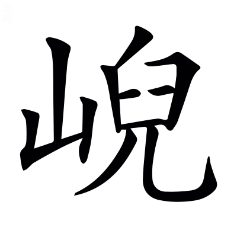

# 文選卷第十二

> 梁昭明太子撰
> 
> 文林郎守太子右內率府錄事參軍事崇賢館直學士臣李善注上

江海

## 海賦

> 木玄虛今書七志曰：木華，字玄虛。華集曰：為楊駿府主簿。傅亮文章志曰：廣川木玄虛為海賦，文甚儁麗，足繼前良。

昔在帝媯`古為`~~巨~~臣唐之代[^12.1.1]，帝媯，謂舜也。尙書序曰：昔在帝堯。尙書曰：釐降二女于媯汭。*孔安國曰：舜所居媯水之汭也。*左氏傳：季文子使太史克對宣公曰「舜臣堯，舉八愷使主后土。」*杜預曰：為堯臣也。*

天綱浡`蒲沒`潏`以出`，為凋為瘵`側界反`。言水之廣大，為天綱紀。浡潏，沸涌貌。桓子新論曰：夏禹之時，鴻水浡潏。說文曰：潏，水涌出也。又說文曰：凋，半傷也。爾雅曰：瘵，病也。尙書曰：湯湯洪水方割。*孔安國曰：割，害也。*

洪濤瀾汗，萬里無際。瀾汗，長貌。西京賦曰：起洪濤而揚波。

長波涾`徒答``杜我`，迆`羊氏`涎~~`延`~~八裔[^12.1.2]。涾，相重之貌。迆涎，邐迆相連也。八裔猶八方也。涎音延。

於是乎禹也，乃鏟臨崖之阜陸，決陂潢而相~~沷~~沃[^12.1.3]。孟子曰：當堯之時，洪水橫流，氾濫天下。堯獨憂之，舉舜，舜使禹疏九河，踰濟漯[^12.1.4]。蒼頡篇曰：鏟，削平也。淮南子曰：禹有洪水之患，陂塘之事。*高誘曰：陂，畜也；塘，堤也。*說文曰：潢，積水池也。~~沷~~沃，灌也。

啟龍門之岝，陵巒而嶄`七咸`鑿。尙書琁璣鈐曰：禹開龍門，導積石。*鄭玄注曰：龍門，山名也。*岝，高貌。岝，助格切。，五格切。廣雅曰：墾，治也。與墾音義同。廣雅曰：鐫謂之鏨；仕咸切。鏨與嶄古字通。

群山既略，百川潛渫`息列切`。孔安國尙書傳曰：治山通水，故以山名。尙書曰：嵎夷既略。*孔安國曰：用功少曰略。*周書曰：禹渫七十川，大利天下。尙書大傳曰：百川趨於海。爾雅曰：潛，深也。說文曰：渫，除去也。

泱`思朗`漭`莫廣`澹`徒敢`泞，騰波赴勢。泱漭，廣大也。澹泞，澄深也。泞音紵。

江河既導，萬穴俱流。尙書曰：岷山導江，又曰：導河積石。淮南子曰：溏有萬穴。

掎`居蟻`拔五嶽，竭涸九州。掎拔、竭涸，言水既除，掎拔而出，竭涸而乾也。掎，引也。廣雅曰：拔，出也。五嶽：泰華霍恒嵩。賈逵國語注曰：涸，竭也。尙書序曰：禹別九州。

瀝滴滲淫~~`七林`~~[^12.1.5]，薈`烏外`蔚雲霧。涓流泱~~`烏黨`~~瀼~~`乃朗`~~[^12.1.6]，莫不來注。說文曰：瀝滴，水下滴瀝也。滲淫，小水津液也。滲音侵。薈蔚，雲霧霑潤也。毛詩曰：薈兮蔚兮，南山朝隮。涓流，小流也。泱瀼，渟淤也。漢書：杜欽曰「屯氏河羨溢，有填淤反瀼之害。」泱，烏黨反。瀼，乃蕩切。說文曰：注，灌也。

於廓靈海，長為委輸。毛萇詩傳曰：於，歎辭也。爾雅曰：廓，大也。孟子曰：舜使禹疏九河，踰濟漯而注諸海。禮記曰：三王之祭川也，或源或委。*鄭玄曰：委流所聚。*淮南子曰：河水九折注海，而流不絕者，崑崙之輸也。

其為廣也，其為怪也，宜其為大也。爾其為狀也，則乃浟`由`湙`亦`瀲`力冉`灩`以冉`，浮天無岸。浟湙，流行之貌。瀲灩，相連之貌。玄中記曰：天下之多者水焉，浮天載地。說文曰：浮，汎也。

浺`沖`瀜沆`胡廣`瀁`余兩`，渺`眇`瀰`彌`湠`炭`漫。浺瀜沆瀁，深廣之貌。渺瀰湠漫，曠遠之貌[^12.1.7]。瀜音融。

波如連山，乍合乍散。莊子曰：白波若山。

噓噏`許急`百川，洗滌淮漢。噓噏猶吐納也。百川，已見上文。淮漢之流小而且穢，故洗滌之。

襄陵廣舄，㶀`交`㵧`葛`浩汗。尙書曰：懷山襄陵。又曰：海濱廣斥。史記~~曰~~以斥為舄[^12.1.8]，古今字也。㶀㵧，廣深之貌。

若乃大明㩠~~`彼苗`~~轡於金樞之穴[^12.1.9]，~~言月將夕也~~[^12.1.10]大明，月也。言日將夕也。周易曰：懸象著明，莫大乎日月。㩠猶攬也。月有御，故言轡。金，西方也。河圖帝覽嬉曰：月者金之精，月有窟，故言穴。伏~~韜~~滔望~~清~~濤賦曰[^12.1.11]：金樞理轡，素月告望。義出於此。㩠，彼苗切

翔陽逸駭於扶桑之津。言日初出也。翔陽，日也。淮南子曰：日，陽之主也。日中有烏，故言翔。逸駭，言出疾也。廣雅曰：駭，起也。山海經曰：湯谷上有扶木者，扶桑也，十日所浴。

彯`匹遙`沙礐`苦角`石，蕩`以出`島濱。言此二時風尤疾也。易通卦驗曰：巽~~風~~氣不至[^12.1.12]，則大風發屋揚沙。說文曰：礐，石聲也。春秋命歷序曰：大風飄石。，風疾貌。說文曰：島，海中往往有山可居曰島。

於是鼓怒，溢浪揚浮。言風既疾，而波鼓怒也。上林賦曰：沸乎暴怒。

更相觸搏，飛沫起濤。蒼頡篇曰：濤，大波也。

狀如天輪，膠戾而激轉；呂氏春秋曰：天地如車輪，終則復始。*高誘曰：輪，轉也。*上林賦曰：宛潬膠盭。

又似地軸，挺拔而爭迴。河圖括地象曰：地下有四柱，廣十萬里，有三千六百軸。廣雅曰：挺，出也。

岑嶺飛騰而反覆，五嶽鼓舞而相磓~~`丁迴反`~~[^12.1.13]。岑嶺、五嶽，言波濤之形，遞相觸激，故或反覆，故或相磓也。爾雅曰：山小而高曰岑。五嶽，已見上文。磓猶激也；丁迴反。

渭~~`謂`~~濆淪而滀`丑六`漯~~`他答`~~，鬱沏`切`迭而隆頹。渭，亂貌。濆淪，相糾貌。滀漯，攢聚貌。鬱，盛貌。沏迭，疾貌。隆頹，不平貌[^12.1.14]。渭音謂。漯音累。迭，徒結切。

盤盓~~`乙于`~~激而成窟[^12.1.15]，`七笑``~~土含~~吐甘切`滐`桀`而為魁[^12.1.16]。盤盓，旋遶也。，峻波也。毛萇詩傳曰：傑，特立也；滐與傑同[^12.1.17]。賈逵國語注曰：川阜曰魁。盓音洿。

㴸`失冉`泊`匹帛`柏而迆`以爾`颺`余諒`，磊`洛罪`匒~~`答`~~[^12.1.18]匌`苦合`而相豗`呼迴反`。㴸，疾貌。泊柏，小波也。迆颺，邪起也。磊，大貌。匒匌，重疊也。匒，直合切。相豗，相擊也。

驚浪雷奔，駭水迸集，七發曰：波湧而濤起，橫奔似雷。字書曰：迸，散也。

開合解會，瀼瀼`傷`濕濕。瀼瀼濕濕，開合之貌。

葩華踧`子六`沑`女六`，㴿`頂`濘~~`奴冷`~~[^12.1.19]潗`側立`㵫`女及反`。葩華，分散也。踧沑，蹴聚也。㴿濘，沸貌。濘，奴冷反。潗㵫，沸聲。

若乃霾~~`莫排`~~曀`一計`潛銷，莫振莫竦。爾雅曰：風而雨土為霾，陰而風為曀。霾音埋[^12.1.20]。說文曰：潛，藏也。廣雅曰：振，動也。竦，亦動也。

輕塵不飛，纖蘿不動。爾雅曰：唐蒙，女蘿。

猶尚呀~~`呼加`~~呷，餘波獨湧。言風雖靜而餘波猶壯。呀呷，波相吞吐之貌[^12.1.21]。呷，~~呀~~呼甲切

澎`匹宏`濞灪`於勿`䃶`烏埋`，碨`烏罪`磊山壟。澎濞，水聲。洞簫賦曰：澎濞，慷慨。灪䃶，高峻貌。碨磊，不平貌。

爾其枝岐潭`以審`瀹`藥`，渤蕩成汜`音似`。管子：管仲對桓公曰「水，別於他水，入於大水及海者，命曰枝。」穆天子傳曰：飲于枝洔之中。*郭璞曰：水岐成洔。*洔，小渚也；音止。潭瀹，動搖之貌。毛詩曰：江有汜。*毛萇曰：決復入為汜也。*

乖蠻隔夷，迴互萬里。若乃偏荒速告，王命急宣。列子曰：殊方偏國。*張湛曰：偏，邊也。*毛詩曰：肅肅王命。

飛駿鼓楫，汎海淩山。爾雅曰：駿，速也。*郭璞曰：駿猶迅速，亦疾也。*方言曰：楫，謂之橈。東方朔對詔曰：淩山越海，窮天乃止。

於是候勁風，揭`桀`百尺。廣雅曰：揭，舉也。百尺，帆檣也。

維長綃`所交`，挂帆席。綃，今之帆綱也，以長木為之，所以挂帆也。劉熙釋名曰：隨風張幔曰帆，或以席為之，故曰帆席也。

望濤遠決，冏`九永`然鳥逝。蒼頡篇曰：冏，光也。

鷸`聿`如驚鳧之失侶，倏如六龍之所掣~~`充制反`~~[^12.1.22]。鷸，疾貌。蘇武答李陵書曰：雖乘雲附景，不足以比速，晨鳧失群，不足以喻疾。春秋命歷序曰：皇伯登出扶桑日之陽，駕六龍以上下。說文曰：掣，引而縱也；充制反。

一越三千，不終朝而濟所屆。左氏傳曰：子文訓兵於睽，終朝而畢。爾雅曰：濟，度也。孔安國尙書傳曰：屆，至也。

若其負穢臨深，虛誓愆祈。負穢，言身有罪，若負荷然。尙書曰：負罪引慝。杜預左氏傳注曰：愆，失也。鄭玄周禮注曰：祈，禱也。

則有海童邀路，馬銜當蹊。吳歌曰：仙人齎持何，等前謁海童。爾雅曰：邀，遮也。陸綏海賦圖云：馬銜，其狀馬首一角而龍形。杜預左氏傳注曰：蹊，徑也。

天吳乍見而~~髣髴~~彷彿[^12.1.23]，~~蝄像~~罔象[^12.1.24]暫曉而閃~~`式染`~~[^12.1.25]屍。山海經曰：朝陽之谷，神為天吳，為水伯。說文曰：~~髣髴~~彷彿[^12.1.26]，見不諟也。楚辭曰；時彷彿以遙見。國語：仲尼曰「丘聞之，水之怪龍罔象，木之怪夔魍魎。」*韋昭曰：罔象食人。*閃屍，暫見之貌。閃。式染切。

群妖遘迕，眇䁘`余沼`冶夷。爾雅曰：遘，遇也。小雅曰：迕，犯也。眇䁘，視貌。冶夷，妖媚之貌。

決帆摧橦`直江`，戕風起惡`去聲`。橦，百尺也。杜預左氏傳注曰：戕，卒暴之名也。起惡，起為暴惡也。

廓如靈變，惚怳幽暮。廓猶開也，言廓然暫開，如神之變，惚怳之頃，而又幽暮也。鄭玄禮記注曰：幽闇者，不明也。

氣似天霄，靉`愛`靅`費`雲布。言海神吐氣，類於天霄。靉靅，昏闇貌。韓子曰：雲布風動。

䨹`叔`昱絕電，百色妖露。䨹昱，疾貌。妖露，為妖而呈露也。

呵㗵`許勿`掩鬱，矆`居縛`睒`失冉`無度。呵㗵掩鬱，不明貌。說文曰：矆，大視也。又曰：睒，暫視也。

飛澇~~`勞`~~[^12.1.27]相磢~~`楚爽`~~，激勢相沏`楚櫛反`。言戕風迅疾而波浪相衝也。澇，大波也；音勞。郭璞方言注曰：漺，錯也；漺與磢同；楚兩切。沏，摩也。[^12.1.28]~~楚乙切~~

崩雲屑雨，浤浤`火宏`汨汨。屑雨，飛灑之貌，言波浪飛灑，似雲之崩，如雨之屑也。李尤辟雝賦曰：興雲動雷，飛屑風雨。浤浤汨汨，波浪之聲也。浤音宏。

𧿒`勑甚`踔`丑角`湛`以甚``藥`，沸潰渝溢。𧿒踔湛，波前卻之貌。潰，亂流也。渝，亦溢也。

瀖`霍`泋`卉`濩~~`鑊`~~[^12.1.29]渭，蕩雲沃日。瀖泋濩渭，衆波之聲。濩音鑊。

於是舟人漁子，徂南極東。言風起而浪驚，故漂浮而無定。毛萇詩傳曰：極，至也。

或屑沒於黿鼉之穴，或挂罥於岑㟼~~`敖`~~[^12.1.30]之峰。言被漂溺死，非一所也。屑猶碎也。禮記曰：屑桂與薑。聲類曰：罥，係也。爾雅曰：山多小石曰㟼；牛高切。

或掣`充制`掣洩`余制`洩於裸人之國，或汎汎悠悠於黑齒之邦。掣掣洩洩，任風之貌。汎汎悠悠，隨流之貌。淮南子曰：自西南至東南，有裸人國，黑齒民。*許慎曰：其民不衣也，其人~~黑~~齒黑~~也~~[^12.1.31]。*

或乃萍流而浮轉，或因歸風以自反。謝承後漢書：鄭玄戒子書曰「黃巾為害，萍浮南北。」

徒識觀怪之多駭，乃不悟所歷之近遠。蒼頡篇曰：駭，驚也。說文曰：悟，覺也。

爾其為大量也[^12.1.32]，則南澰`歛`朱崖，北灑天墟~~`音虛`~~。廣雅曰：澰，漬也。東都主人曰：南燿朱垠。垠亦崖也。爾雅曰：北陸~~虛也~~天墟[^12.1.33]；音區。

東演析木，西薄青徐。說文曰：演，長流也。言流至析木之境。爾雅曰：析木謂之天津，海在青徐之東，故云西薄。小雅曰：薄，迫也。尙書曰：海岱惟青州。又曰：海岱及淮惟徐州。

經途瀴`烏冷`溟~~`莫泠`~~[^12.1.34]，萬萬有餘。鄭玄周禮注曰：經，謂里數也。瀴溟猶絕遠杳冥也。溟，莫泠切

吐雲霓，含龍魚。淮南子曰：四海之雲湊。

隱鯤鱗，潛靈居。鯤鱗，或為昆山。昆山，方壺之屬也。靈居，衆仙所處也。

豈徒積太顚之寶貝，與隨侯之明珠。琴操曰：紂徙文王於羑里，擇日欲殺之，於是太顚、散宜生、南宮适之屬，得水中大貝以獻紂，立出西伯。墨子曰：和氏之璧，隋侯之珠。

將世之所收者常聞，所未名者若無。言世之所收者，常聞其名，其或未名者，若本無也。

且希世之所聞，惡~~`烏`~~[^12.1.35]審其名？言希世乃一聞之，故不能審其名。魯靈光殿賦曰：邈希世而特出。惡音烏。

故可仿像其色，靉`於愷`霼`虛氣`其形。仿像、靉霼，不審之貌。

爾其水府之內，極深之庭。劉劭趙都賦曰：其東則有天浪水府，百川是理。

則有崇島巨鼇，峌`庭結``五結`孤亭。擘洪波，指太清。崇島，五嶽也。巨鼇，大鼇也。列仙傳曰：巨鼇負蓬萊山而抃滄海之中。列子曰：渤海之東，名曰歸墟，其中有五山，帝命禺強使巨鼇十五，舉首載五山，峙而不動。說文曰：海中往往有山可依止曰島。峌，高貌。山居海中，故云擘。峻極際天，故云指。鄭衆周禮注曰：擘，破裂也。東方朔十洲記曰：冥海洪波百丈。鶡冠子曰：上及泰清，下及太寧。

竭磐石，栖百靈。鄭玄禮記注曰：竭猶載也。聲類曰：磐，大石也。百靈，衆仙。

颺凱風而南逝，廣莫至而北征。言巨鼇多力，溯風而行也。呂氏春秋曰：南方曰凱風，北方曰廣莫風。

其垠`銀`則有天琛水怪，鮫人之室。天琛，自然之寶也。尙書曰：天球在東序。水怪奇石，生乎水濱也。尙書曰：鈆松怪石。曹子建七啟曰：戲鮫人。劉淵林吳都賦注曰：鮫人，水底居。

瑕石詭暉，鱗甲異質。說文曰：瑕，玉之小赤色者也。詭暉，別色。說文曰：詭，變也。異質，殊形也。廣雅曰：質，軀也。

若乃雲錦散文於沙汭之際，綾羅被光於螺蚌之節。言沙汭之際，文若雲錦；螺蚌之節，光若綾羅也。毛萇詩傳曰：芮，崖也；芮與汭通。曹植齊瑟行曰：蚌蛤被濱崖，光采如錦紅。

繁采揚華，萬色隱鮮。說文曰：隱，蔽也。

陽冰不冶，陰火潛然。言其陽則有不冶之冰，其陰則有潛然之火也。晏子春秋曰：陰冰凝，陽冰厚五寸。說文曰：冶，銷也。

熺`許眉`炭重燔`煩`，吹炯`古永`九泉。熺炭，炭之有光也。廣雅曰：熺，熾也。重燔猶重然也。吹猶然也。漢書：趙氏無吹火焉。說文曰：炯，光也，言火之光下照九泉。地有九重，故曰九泉。

朱𤒦`焰`綠煙，䁏`一眇`眇蟬蜎`一緣反`。䁏眇蟬蜎，煙豔飛騰之貌。𤒦與爓同。

魚則橫海之鯨，突~~扤~~杌孤遊[^12.1.36]。弔屈原曰：橫江湖之鱣鱏。郭璞山海經注曰：橫，塞也。突~~扤~~杌，高貌。

戛巖㟼，偃高濤。戛猶㮣也。

茹鱗甲，吞龍舟。廣雅曰：茹，食也。莊子曰：吞舟之魚，碭而失水。高誘淮南子注曰：龍舟，大舟。

噏`虛及`波則洪漣踧蹜，吹澇則百川倒流。劉劭趙都賦曰：巨鼇冠山，陵魚吞舟，吸潦吐波，氣成雲霧。蹜，蹙聚貌。踧，子六切。蹜，所六切。

或乃蹭~~`七鄧`~~蹬~~`鄧`~~窮波[^12.1.37]，陸死鹽田。蹭蹬，失勢之貌。蹭，七鄧切。蹬音鄧。鹽田，海邊也。張揖上林賦注曰：海水之崖，多出鹽也。

巨鱗插雲，~~鬐~~鰭鬣刺天[^12.1.38]。郭璞上林賦注曰：鰭，魚背上鬣也。南都賦曰：森䔿䔿而刺天。

顱~~`盧`~~[^12.1.39]骨成嶽，流膏為淵。廣雅曰：顱謂之䫳䫫；音盧。魏武四時食制曰：東海有魚如山，長五六里，謂之鯢，時死岸上，膏流九頃。春秋元命包曰：積骨成山，流血成淵。

若乃巖坻`直夷`之隈，沙石之嶔`音欽`。郭璞上林賦注曰：坻，岸也。說文曰：隈，水曲也。嶔，沙石嶔岑也。

毛翼產鷇苦，剖卵成禽。爾雅曰：生哺鷇。*郭璞曰：鳥子須母食也。*剖猶破也。

鳧雛離褷`所宜`，鶴子淋滲`所今反`。西京雜記曰：太液池，其間鳧雛、鶴子，布滿充積。離褷、淋滲，毛羽始生之貌。

群飛侶浴，戲廣浮深。翔霧連軒，洩`余世`洩淫淫。軒，舉也。洩洩淫淫，飛翔之貌。

翻動成雷，擾翰為林。翻，動貌。漢書：趙王曰「聚蚊成雷。」孔安國尙書傳曰：擾，亂也。王弼周易注曰：翰，高飛貌。

更相叫嘯，詭色殊音。~~詭異也~~[^12.1.40]若乃三光既清，天地融朗。淮南子曰：夫道，紘宇宙而章三光。杜預左氏傳注曰：融，朗也。

不汎陽侯，乘蹻`去喬`絕往。淮南子曰：武王渡于孟津，陽侯之波，逆流而擊。曹植苦寒行曰：乘蹻追術士，遠在蓬萊山。抱朴子曰：乘蹻可以周流天下。蹻道有三法，一曰龍蹻，二曰氣蹻，三曰鹿盧蹻。

覿安期於蓬萊，見~~喬~~橋山之帝像[^12.1.41]。列仙傳曰：安期先生謂始皇曰「後千歲求我蓬萊山下。」史記曰：武帝祭黃帝冢橋山。上曰「吾聞黃帝不死，今有冢，何也？」或對曰「黃帝已仙上天，群臣葬其衣冠也。」

群仙~~縹~~瞟`匹妙`眇[^12.1.42]，餐玉清涯`音宜`。~~縹~~瞟眇，遠視之貌。魯靈光殿賦曰：忽瞟眇以響像。列仙傳曰：赤松子服水玉。

履阜鄉之留舄，被羽翮之襂`所今`纚`所宜反`。列仙傳曰：安期先生，琅邪阜鄉人，自言千歲。秦始皇與語，賜金數千萬於阜鄉亭，皆置去，留書以赤玉舄一量為報。言仙人以羽翮為衣。漢書曰：天道將軍衣羽衣。襂纚，羽垂之貌。

翔天沼，戲窮溟。莊子曰：窮髮之北有溟海者，天池也。

甄`古然`有形於無欲，永悠悠以長生。言衆仙雖表有形而無情欲，故能久視長生也。鄭玄尙書緯注曰：甄，表也。淮南子曰：有形之類，莫尊於水。莊子曰：同乎無欲。老子曰：常無欲以觀其妙。又曰：長生久視之道。

且其為器也，包乾之奧，括坤之區。周易曰：乾為天，坤為地。孔安國尙書傳曰：奧，內也。又曰：區，域也。

惟神是宅，亦祇是廬。神祇，衆靈之通稱，非惟天地而已。禮記曰：有天下者，祭百神也。

何奇不有？何怪不儲？說文曰：儲，積也。

~~芒芒~~茫茫積流[^12.1.43]，含形內虛。班彪覽海賦曰：余有事於淮浦，觀滄海於茫茫。孫卿子曰：不積小流，無以成河海。含形內虛，言水能含衆形，內虛，似乎謙也。孫卿子曰：水清則見物之形。周易曰：君子以虛受人。

曠哉坎德，卑以自居。周易曰：坎為水。家語：金人銘曰「江海雖左長百川，以其卑也。」周易曰：謙謙君子，卑以自牧。管子曰：夫人皆赴高，水獨赴下，卑也，而水以為都居也。

弘往納來，以宗以都。自海而往，弘之而令大，自外而來，納之而不逆。尙書曰：江漢朝宗于海。山海經曰：和山實惟河之九都。*郭璞曰：九水所潛，故曰九都。*

品物類生，何有何無！言諸品物以類相生，何所不有，何者而無。言其多也。韓詩外傳曰：夫水，群物以生，品物以正。李~~尤~~充翰林論曰[^12.1.44]：木氏海賦，壯則壯矣，然首尾負揭，狀若文章，亦將由未成而然也。

[^12.1.1]: 考異：巨唐之代：袁本「巨」作「臣」，云善作「巨」。茶陵本云五臣作「臣」。案：各本所見皆非也。陳云觀此注中「臣堯」之解，則善本亦作「臣」也，「巨」乃傳寫之誤，其說最是。

[^12.1.2]: 考異：注「延」：袁本、茶陵本作「涎音延」三字，在注末，是也。

[^12.1.3]: 考異：決陂潢而相沷：案：「沷」當作「沃」，注「沷灌也」同。茶陵本云善作「沷」，袁本云善作「湲」，所見皆誤也。「沃」與下句「鑿」協，字偽而失其韻。

[^12.1.4]: 考異：注「踰濟漯」：陳云「踰」別本作「瀹」，下注引同。案：茶陵脩改本如此，袁本仍皆作「踰」，似善讀孟子不同也。

[^12.1.5]: 考異：注「七林」：陳云二字似當在「滲」字下，袁、茶陵二本正如此。今案：此衍字也。袁、茶陵有者，為五臣「滲」字音，其善「滲音侵」自在注中，尤所見因誤在「淫」字下，遂兩存之，正以「七林」當「淫」字音耳。又案：凡善音各本，多失其舊，今於其可考者，悉加訂正。

[^12.1.6]: 考異：注「烏黨」又注「乃朗」：茶陵本作「泱烏黨反瀼乃蕩切」，在注中「有填淤反瀼之害」下。袁本但有「泱烏黨反」四字。又案：凡善音皆云反，今本作切者，後人所改，此則改而未盡者也。餘準此，不悉出。

[^12.1.7]: 考異：注「曠遠之貌」：袁本、茶陵本此下有「瀜音融」三字，是也。

[^12.1.8]: 考異：注「史記曰斥為舄」：案：「曰」當作「以」，各本皆偽。西征賦注云「戰國策以吳為吾」，其句例也。

[^12.1.9]: 考異：注「彼苗」：袁本、茶陵本作「㩠彼苗切」，在注末，是也。

[^12.1.10]: 考異：注「言月將夕也」：袁本、茶陵本「月」作「日」。又此五字在「大明月也」下。其下節注作「翔陽日也」，言日初出也。案：此蓋尤本誤倒。

[^12.1.11]: 考異：注「伏韜望清賦曰」：何校「韜」改「滔」，「清」改「濤」，各本皆偽。

[^12.1.12]: 考異：注「巽風不至」：案：「風」當作「氣」，各本皆誤。舞鶴賦注引正作「氣」字。

[^12.1.13]: 考異：注「丁迴反」：袁本、茶陵本在注末，是也。「反」作「切」，非。

[^12.1.14]: 考異：注「不平貌」：袁本、茶陵本此下有「渭音謂漯音累迭徒結切」十字，是也。

[^12.1.15]: 考異：注「乙于」：案：此五臣音。袁本、茶陵本有「盓音洿」三字，在注末，是也。尤存此刪彼，非。

[^12.1.16]: 考異：注「土含」：茶陵本云「吐甘切」五臣作「土含切」，袁本作「土含」。案：茶陵校語是也。袁本用五臣，尤與之同，非。

[^12.1.17]: 考異：注「滐與傑同」：袁本、茶陵本無此四字。案：所見不同也，似有者是矣。

[^12.1.18]: 考異：注「答」：案：此五臣音，袁本有「匒直合切」四字，在注中「重叠也」下，是也。茶陵本并此節注「於翰而去」四字，尤與之同，非。

[^12.1.19]: 考異：注「奴冷」：袁本作「濘奴冷反」四字，在注中「沸貌」下，是也。茶陵本亦誤去，說見上。

[^12.1.20]: 考異：注「霾音埋」：袁本、茶陵本無此三字。案：無者非也。此善音，正文下「莫排」二字，乃五臣音，尤所見未檢照而兩存，然足訂二本之失。凡善音各本皆非其舊，或袁、茶陵非而尤是，此條其例也。

[^12.1.21]: 考異：注「波相吞吐之貌」：袁本、茶陵本此下有「呷呀甲切」四字。案：「呀」當作「呼」，此善「呷」字之音也，尤誤刪。

[^12.1.22]: 考異：注「充制反」：袁本、茶陵本在注末，是也。「反」作「切」，非。

[^12.1.23]: 考異：「天吳乍見而髣髴」：案：「髣髴」當作「彷彿」。善注可證。見下甘泉賦「猶彷彿其若夢」注「彷彿」亦引說文、楚辭。彼五臣作「髣髴」，有明文，此亦各本亂之而不著校語。

[^12.1.24]: 考異：蝄像：案：「蝄像」當作「罔象」，善注可證。考袁本、茶陵本於善注字則作「罔象」，於五臣向注字則作「蝄像」，截然有別，無可疑也。唯正文不著校語，為以五臣亂善，而讀者乃不辨耳。

[^12.1.25]: 考異：注「式染」：袁本、茶陵本作「閃式染切」，在注末，是也。

[^12.1.26]: 考異：注「說文曰髣髴」：袁本、茶陵本作「彷彿」。案：二本是也。尤所改非，下引楚詞仍未改可證，說見上。又甘泉賦，漢書作「仿佛」，二注所引說文字亦在「亻」部，但善引說文多不合，未必與顏同作「仿佛」也。

[^12.1.27]: 考異：注「勞」：袁本作「音勞」二字，在注中「澇大波也」下，是也。茶陵本誤，與此同。

[^12.1.28]: 考異：注「楚乙切」：袁本無此三字。茶陵本在「沏摩也」上作「楚兩切」。案：茶陵本最是也。此善「磢」字之音，正文下「楚爽」二字，乃五臣音，尤本誤倒入下文，改「兩」為「乙」，失之矣。

[^12.1.29]: 考異：注「鑊」：袁本、茶陵本作「濩音鑊」，在注末，是也。

[^12.1.30]: 考異：注「敖」：案：此五臣音，茶陵本有「牛高切」，在注末「㟼」字下，乃善音。袁本亦誤去，與尤本皆非。

[^12.1.31]: 考異：注「其人黑齒也」：茶陵本「黑齒」作「齒黑」，無「也」字。案：「齒黑」是也。袁本亦誤與此同。

[^12.1.32]: 考異：爾其為大量也：袁本、茶陵本無「為」字。案：此無可考也。

[^12.1.33]: 考異：注「虛也」：袁本、茶陵本作「天墟」，下有「音區」二字，正文下無「音虛」二字。案：此尤用今爾雅改，其實非善意也。今爾雅郭讀「虛」如字，不得引以注此賦，必他家讀為「墟域」之「墟」，故曰「音區」。又「天」字，善因是釋天文而增之，如下引「析木謂之天津」，「天」字亦本文所無，何云注誤，未得其解。

[^12.1.34]: 考異：注「莫泠」：袁本、茶陵本作「溟莫泠切」，在注末，是也。

[^12.1.35]: 考異：注「烏」：袁本、茶陵本作「惡音烏」，在注末，是也。

[^12.1.36]: 考異：突扤孤遊：袁本、茶陵本「扤」作「杌」，是也。注同。

[^12.1.37]: 考異：注「七鄧」又注「鄧」：袁本、茶陵本作「蹭七鄧切蹬音鄧」，在注中「失勢之貌」下，是也。

[^12.1.38]: 考異：鬐鬣刺天：案：「鬐」當作「鰭」。考善注引上林賦注，各本皆作「鰭」，而袁本、茶陵本於所載五臣濟注則作「鬐」，截然有別，唯不著校語，為以五臣亂善，尤本所見亦然，皆非也。又江賦「揚鰭掉尾」正文不誤，而注引上林為「鬐」，亦因二本用五臣作「鬐」相涉，而轉輾致偽也。

[^12.1.39]: 考異：注「盧」：袁本、茶陵本作「音盧」二字，在注中「謂之䫳䫫」下，是也。

[^12.1.40]: 考異：注「詭異也」：袁本、茶陵本無此三字。案：無者是也。以二本考之，乃五臣銑注，尤本誤係之於善耳。

[^12.1.41]: 考異：見喬山之帝像：案：「喬」當作「橋」。考善注引史記，各本皆作「橋」，而袁本、茶陵本於所載五臣良注則作「喬」，截然有別，唯不著校語，為以五臣亂善，尤本所見亦然也。

[^12.1.42]: 考異：群仙縹眇：何校「縹」改「瞟」，注同。案：所改是也。善作「瞟」，注「瞟眇，遠視之貌」，引魯靈光殿賦「瞟眇」證之。五臣作「縹」，向注「縹眇，高遠貌」。各本皆以五臣亂善而不著校語，唯注引「忽瞟眇」句未偽也。

[^12.1.43]: 考異：芒芒積流：袁本、茶陵本「芒芒」作「茫茫」，是也。

[^12.1.44]: 考異：注「李尤翰林論曰」：陳云：案「尤」當作「充」，見晉書文苑傳，與東漢李尤時代敻殊。今案：所校是也。李尤遠在木前，亦不撰翰林論。各本皆偽。

## 江賦

釋名曰：江者，公也，出物不私，故曰公也。風俗通曰：江者，貢也，為其出物可貢。晉中興書曰：璞以中興，三宅江外，乃著江賦，述川瀆之美。

> 郭景純臧榮緒晉書曰：郭璞，字景純，河東人。璞性放散，不脩威儀，為佐著作。後轉王敦記室參軍。敦謀逆，為敦所害。又云：有人見其睡形變鼉，云是鼉精也。

咨五~~才~~材之並用[^12.2.1]，寔水德之靈長。左氏傳：宋子罕曰「天生五材，人並用之，廢一不可。」*杜預曰：金木水火土也。*淮南子曰：夫水者，大不可極，深不可測，無公無私，水之德也。

惟岷山之導江，初發源乎濫觴。惟，發語之辭也。岷山導江，~~東別為沱~~已見上文[^12.2.2]。南都賦曰：發源巖穴。家語：孔子謂子路曰「夫江始於岷山，其源可以濫觴。及其至於江津，不舫舟，不避風，則不可以涉。」*王肅曰：觴，所以盛酒者，言其微也。*

聿經始於洛沬`昧`，攏萬川乎巴梁。薛君韓詩章句曰：聿，辭也。漢書：廣漢郡雒縣有漳山，雒水所出，入湔；雒與洛通。湔音煎。說文曰：沬[^12.2.3]水出蜀西塞外，東南入江。沬，武蓋切。攏猶括束也。巴，郡名也。梁，州名也。

衝巫峽以迅激，躋江津而起漲。盛弘之荊州記曰：~~信~~江陵縣西二十里[^12.2.4]有巫峽。方言曰：躋，登也。酈元水經注曰：馬頭崖北對大岸，謂之江津。漲，水大之貌。

極泓`烏宏`量而海運，狀滔天以淼茫。鄭玄禮記注曰：極，窮也。莊子曰：大鵬海運，則將徙南溟。*司馬彪曰：運，轉也。*尙書曰：浩浩滔天。

總括漢泗，兼包淮湘。并吞沅澧`禮`，汲引沮`七余`漳。南都賦曰：總括趨欱。郭璞山海經注曰：泗水出魯國卞縣，至臨淮下相縣入淮。孟子曰：禹決汝漢，排淮泗，而注之江。景福殿賦曰：兼苞博落。郭璞山海經注曰：湘水出陵營道縣陽朔山。過秦論曰：并吞八荒之心。山海經曰：沅水出象郡而東注江，合洞庭中。應劭漢書地理志注曰：沅水出牂柯。漢書地理志曰[^12.2.5]：武陵郡充縣歷山，澧水所出，入沅，水經云入江。說文曰：汲，引水也。山海經曰：景山，睢水出焉，南注于沔江。又曰：荊山，漳水出焉，而東南流注于睢。沮與睢同。

源二分於崌`居`崍`來`，流九派乎潯陽。山海經曰：岷山東北百四十里崍山，江水出焉；又東百五十里崌山，江水出焉，而東流注于大江。*郭璞曰：崍山，中江所出也，崌山，北江所出也。*水別流為派。尙書曰：荊州，九江孔殷。應劭漢書注曰：江自廬江潯陽，分為九也。漢書：廬江郡有潯陽縣。

鼓洪濤於赤岸，淪餘波乎柴桑。洪濤，已見海賦。七發曰：凌赤岸。或曰：赤岸在廣陵~~興~~輿縣[^12.2.6]。廣雅曰：淪，沒也。餘波，濤之餘波也，言濤之餘波至柴桑而盡也。尙書曰：餘波入于流沙。漢書：豫章郡有柴桑縣。

綱絡群流，商搉`苦角`涓`古玄`澮`古外反`。廣雅曰：商，度也。許慎淮南子注曰：揚搉粗略也。涓澮，小流也。爾雅曰：注溝曰澮也。

表神委於江都，混流宗而東會。委及宗並見上文。漢書曰：廣陵國有江都縣，東會于海。尙書曰：東會于泗沂。

注五湖以漫漭，灌三江而漰`普萌`沛`普會反`。墨子曰：禹治天下，南為江漢淮汝，東流之，注五湖之處，以利荊楚干越之民。史記：太史公曰「余登姑蘇，望五湖。」張勃吳錄曰：五湖者，太湖之別名也，周行五百餘里。尙書曰：三江既入，震澤底定。*孔安國曰：自彭蠡，江分為三，入震澤。*又曰：震澤，吳南太湖名也。

滈`胡道`汗六州之域，經營炎景之外。六州，益梁荊江揚徐。臧榮緒晉書曰：華陽黑水惟梁州，部巴東郡。益州，梁州之南地，部蜀郡。江州，本荊州之東界，揚州之南境也。海岱及淮惟徐州，部廣陵郡。上林賦曰：經營于其內。南方火，故曰炎景。

所以作限於華裔，壯天地之嶮介。言江波之濬，既作限於華夷，天地嶮介，因之益壯也。吳錄曰：魏文帝臨江嘆曰：天所以隔南北也！周易曰：天嶮不可升。地嶮，山川丘陵。郭璞爾雅注曰：介，閡也。

呼吸萬里，吐納靈潮。自然往復，或夕或朝。呼吸萬里，言其疾也。抱朴子曰：麋氏云朝者，據朝來也；言夕者，據夕至也。

激逸勢以前驅，乃鼓怒而作濤。峨嵋為泉陽之揭，玉壘作東別之標。峨嵋、玉壘，二山名也。泉陽，即陽泉也。顧野王輿地志云：益州陽泉縣，蜀分綿竹立。揭標，皆表也。水經曰：江水又東別為沲，開明之所鑿。尙書曰：岷山導江，東別為沲。戰國策曰：舉標甚高。

衡霍磊落以連鎮，巫廬嵬`魚鬼`崫`危勿`而比嶠。周禮曰：荊州之鎮山曰衡山。*鄭玄曰：在湘水南，鎮~~山~~名山，安地德者也[^12.2.7]。*爾雅曰：霍山為南岳。*郭璞曰：今在廬江西。*漢書曰：南郡巫縣，巫山在西南。釋慧遠廬山記曰：山在江州潯陽之南。爾雅曰：山銳而高曰嶠；其廟切，協韻音橋。

協靈通氣，濆`忿`薄相陶。流風蒸雷，騰虹揚霄。莊子曰：川谷通氣，故飄風。老子曰：陰陽陶冶萬物。韋昭國語注曰：蒸，升也。

出信陽而長邁，淙~~`悰`~~大壑與沃焦[^12.2.8]。信陽即信陵之陽也。臧榮緒晉書曰：建平郡有信陵縣。吳都賦曰：寂寥長邁。說文曰：淙，水聲也；昨宗切。列子曰：渤海之東，不知幾萬億里，有大壑，無底之谷，其下無底，名歸墟。玄中記曰：天下之大者，東海之沃焦焉，水灌之而不已。沃焦，山名也，在東海南方三萬里。

若乃巴東之峽，夏后疏鑿。盛弘之荊州記，古歌曰：巴東三峽巫峽長，猿鳴三聲淚沾裳。禹疏三江，已見上文。

絕岸萬丈，壁立赮駮。赮駮，如赮之駮也。赮，古霞字。

虎牙嵥`桀`豎`樹`以屹`魚乙`崒`慈聿`，荊門闕竦而磐礡。盛弘之荊州記曰：郡西泝江六十里南岸有山，名曰荊門，北岸有山，名曰虎牙，二山相對，楚之西塞也。虎牙，石壁紅色，間有白文，如牙齒狀。荊門上合下開，~~開~~闇達山南[^12.2.9]，有門形，故因以為名。嵥，特立貌。屹崒，高峻貌。闕竦，如闕之竦也。西京賦曰：圜闕竦以造天。磐礡，廣大貌。

圓淵九回以懸騰，湓`普寸`流雷呴`呼后`而電激。淮南子曰：藏志九旋之淵。許慎曰：九旋之淵至深。說文曰：騰，水涌也。蒼頡篇曰：湓，水聲也。聲類曰：呴，嗥也。答賓戲曰：遊說之徒，風颺電激。

駭浪暴灑，驚波飛薄。灑，散也。飛薄，飛騰蕩薄也。

迅澓~~`扶福`~~增澆，涌湍疊躍。澓，澓流也；音伏[^12.2.10]。王逸楚辭注曰：洄波為澆；古堯切。

砯`普冰`巖鼓作，漰`普萌`湱`呼陌`澩~~`胡角`~~灂`仕角反`。砯，水激巖之聲也。漰湱澩灂，皆大波相激之聲也。爾雅曰：夏有水、冬無水曰澩；音學[^12.2.11]。

㵗`蒲冰`㶔`蒲拜``火宏``呼拜`，潰濩`穫`㳚`呼活`漷`呼郭反`。皆水勢相激洶湧之貌。

潏`胡決`湟`皇`淴`烏骨`泱`烏朗`，㶖`叔`㴸`失冉`㶒`舒感`瀹`始灼反`。皆水流漂疾之貌。

漩`旋`澴`許玄`滎`於營`瀯`營`，渨`紆鬼`㵽`誄`濆`忿`瀑`步角反`。皆波浪回旋濆涌而起之貌也。

溭`助側`淢`域`濜`助謹`涓`于窘`，龍鱗結絡。溭淢濜溳，參差相次也。龍鱗結絡，如龍之鱗，連結交絡也。潘岳金谷詩曰：濫泉龍鱗瀾。

碧沙瀢`杜罪``徒可`而往來，巨石硉`洛骨`矹`五骨`以前卻。瀢、硉矹，沙石隨水之貌。

潛演`胤`之所汩淈`胡骨`，奔溜之所磢`楚爽`錯。說文曰：潛，藏也。又曰：演，水脈行地中；弋刃切。蒼頡篇曰：淈，水通貌。磢，已見海賦。廣雅曰：錯，摩也。

厓隒`魚檢`為之泐`勒`嵃`魚免`，碕嶺為之喦崿。說文曰：隒，厓也。周禮曰：石有時以泐。鄭司農曰：泐，謂石解散也。嵃猶嶮也。楚辭曰：觸石碕而橫逝。許慎淮南子注曰：碕，長邊也。

幽積岨，礐~~`力隔`~~硞~~`客`~~䃕`盧角`礭`苦角反`[^12.2.12]。爾雅曰：山夾水曰澗。與澗同。礐硞䃕礭，皆水激石嶮峻不平之貌。硞，力隔切。

若乃曾潭之府，靈湖之淵。鄭玄毛詩箋曰：曾，重也。王逸楚辭注曰：楚人名淵曰潭[^12.2.13]。府，已見上文。

澄澹汪洸`烏宏`，瀇`烏廣`滉`胡廣`囦泫`音玄`。皆水深廣之貌。說文曰：汪，廣也；烏黃切。

泓汯~~`宏`~~[^12.2.14]浻`烏猛`澋`胡猛`，涒`紆筠`鄰㘤`彎`潾`力銀反`。皆水勢回旋之貌。汯音宏。

混澣`音翰`灦`呼見`渙，流映揚焆`音涓`。水勢清深而澄澈光映也。蒼頡篇曰：焆，明也。

溟`莫令`漭渺湎`莫翦`，汗汗沺`田`沺。皆廣大無際之貌。

察之無象，尋之無邊。氣滃`烏孔`渤`蒲沒`以霧杳，時鬱律其如煙。滃渤，霧出貌。鬱律，煙上貌。成公綏天河賦曰：氣蓬勃以霧蒸。說文曰：杳，冥也。

類肧`普抔`渾之未凝，象太極之構天。言雲氣杳冥，似肧胎渾~~混~~沌[^12.2.15]，尚未凝結，又象太極之氣，欲構天也。淮南子曰：孕婦三月而肧~~胎~~[^12.2.16]。春秋命歷序曰：冥莖無形，濛鴻萌兆，渾渾混混。*宋均曰：渾渾混混，雖卵未分也。*周易曰：是故易有太極，是生兩儀。*韓康伯曰：太極者，無稱之稱，不可得名也。*

長波浹`子協`渫`牒`，峻湍崔嵬。埤蒼曰：浹渫，水滂溏也。小雅曰：峻，高也。

盤渦`烏和`谷轉，淩濤山頹。渦，水旋流也。廣雅曰：淩，馳也。王粲遊海賦曰：洪濤奮蕩，大浪~~踊~~踽躍[^12.2.17]，山隆谷窳，宛亶相搏。

陽侯砐`五合`硪`我`以岸起，洪瀾涴`宛`演而雲迴。陽侯，已見海賦。砐硪，搖動貌。涴演，迴曲貌。

峾`銀`淪溛`烏華`瀤`烏懷`，乍浥`烏甲`乍堆。峾淪，回旋之貌。溛瀤，不平之貌。

豃`呼檻`如地裂，豁若天開。豃，豁開貌。易緯曰：天下愁，地裂山崩。漢書曰：孝惠二年，天開東北，廣十餘丈。

觸曲厓以縈繞~~`叫`~~[^12.2.18]，駭崩浪而相礧。相礧，相擊也；音雷。

鼓㕉`苦合`窟以漰`普萌`渤~~`蒲沒`~~，乃湓`普寸`湧而駕隈。㕉，亦窟之類也。漰渤，水聲也[^12.2.19]。渤，蒲沒切。小雅曰：駕，凌也。

魚則江豚`徒昆`海狶`喜`，叔鮪`于軌`王鱣`音亶`。南越志曰：江豚似豬。臨海水土~~記曰~~物志[^12.2.20]：海狶，豕頭，身長九尺。郭璞山海經注曰：今海中有海狶，體如魚，頭似豬。爾雅曰：鮥，䱙鮪。*郭璞曰：鮪，鱣屬[^12.2.21]，大者王鮪，小者叔鮪。王鱣，鱣之大者[^12.2.22]，猶曰王鮪。*鮥音洛。

䱻`骨`鰊`練``特登`鮋`直流`，鯪`陵`鰩`遙`鯩鰱`音連`。山海經曰：䱻魚，其狀如魚而鳥翼，出入有光，其音如鴛鴦。*郭璞曰：音滑。*舊說曰：鰊，似鱦；音繩[^12.2.23]。山海經曰：，其狀如鱖；居逵切，蒼文赤尾。*郭璞曰[^12.2.24]：音滕。*舊說曰：鮋，似鱓。*楚辭曰：鯪魚何所出。*王逸曰：鯪魚，鯪鯉也。*山海經曰：鰩魚，狀如鯉。又曰：鯩魚，黑文，狀如鮒，食之不腫。*郭璞曰：音倫。*廣雅曰，鰱，鱮也。

或鹿觡`格`象鼻，或虎狀龍顏。臨海異物志曰：鹿魚，長二尺餘，有角，腹下有腳，如人足。郭璞山海經注曰：麋鹿角曰觡。又曰：今海中有虎鹿魚，體皆如魚，而頭似虎鹿。龍顏，似龍也。

鱗甲鏙`七罪`錯，煥爛錦斑。鏙錯，間雜之貌。

揚鰭掉尾，噴`普問`浪飛唌`似延反`。上林賦曰：揵鬐掉尾。說文曰：噴，吒也；唌，沫也。

排流呼哈`乎合`，隨波遊延。或爆`蒲角`采以晃淵，或嚇`呼厄`鰓乎巖間。說文曰：爆，灼也，今以為曝曬也[^12.2.25]。爆，蒲角切。曝，步木切。廣雅曰：晃，暉也。嚇猶開也。

介鯨乘濤以出入，鯼`祖洪`鮆`薺`順時而往還。爾雅曰：介，大也。字林曰：鯼魚，出南海，頭中有石，一名石首。郭璞山海經注曰：鮆，狹薄而長，頭大者長尺餘，一名刀魚，常以三月八月出，故曰順時。

爾其水物怪錯，則有潛鵠魚牛，虎蛟鉤蛇。怪錯，奇怪雜錯也。舊說曰：潛鶴，似鵠而大也。山海經曰：魚牛，其狀如牛，陵居，蛇尾，有翼。又曰：虎蛟，其狀魚身而蛇尾，有翼，其音如鴛鴦。郭璞山海經注曰：今永昌郡有鉤蛇，長數丈，尾跂[^12.2.26]，在水中鉤取斷岸人及牛馬啖之。

蜦`倫``團`鱟`候`蝞`媚`，鱝`扶粉``鳥郎``迷``音麻`。說文曰：蜦，蛇屬也，黑色，潛於神泉之中，能興雲致雨。山海經曰：魚，其狀如鮒而彘尾。*郭璞曰：音如團~~如~~扇之團[^12.2.27]。*廣志曰：鱟魚，似便面，雌常負雄而行，失雄則不能獨活，出交阯南海中。臨海水土物志曰：蝞，似蝦，中食，益人顏色，有愛媚。又曰：鱝魚，如圓盤，口在腹下，尾端有毒。又曰：初寧縣多，龜形薄頭，喙似鵞指爪。又與辟相似，形大如䕠，生乳海邊~~曰~~沙中[^12.2.28]，肉極好，中啖。

王珧`姚`海月，土肉石華。郭璞山海經注曰：珧，亦蚌屬也。臨海水土物志曰：海月，大如鏡，白色，正圓，常死海邊，其柱如搔頭大，中食。又曰：土肉，正黑，如小兒臂大，長五寸，中有腹，無口目，有三十足，炙食。又曰：石華，附石生，肉中啖。

三蝬~~`子工`~~[^12.2.29]`流`江，鸚螺`力戈`蜁`旋`蝸`古花反`。臨海水土物志曰：三蝬，似蛤，蝬，子公反。舊說曰：江，似蟹而小，十二腳。南州異物志曰：鸚鵡螺，狀如覆杯，頭如鳥頭，向其腹視，似鸚鵡，故以為名也。舊說曰：蜁蝸，小螺也。

璅蛣`詰`腹蟹，水母目蝦遐。南越志曰：璅蛣，長寸餘，大者長二三寸，腹中有蟹子，如榆莢，合體共生，俱為蛣取食。又曰：海岸間頗有水母，東海謂之䖳，正白，濛濛如沫，生物有智識，無耳目，故不知避人。常有蝦依隨之，蝦見人則驚，此物亦隨之而沒。䖳音蜡，二字並除嫁切。

紫蚢`胡岡`如渠，洪蚶~~`呼甘`~~[^12.2.30]專車。爾雅曰：大貝曰蚢。漢書曰：尉佗獻紫貝五百。尙書大傳曰：文王囚於羑里，散宜生之江淮之浦，而得大貝，如車渠，以獻紂。*鄭玄曰：渠，罔也。*臨海水土物志曰：蚶則徑四尺，背似瓦壟，有文；呼甘切。國語：孔子曰「防風氏其骨節專車。」*賈逵曰：專，滿也。*

瓊蚌晞曜以瑩珠，石`居葉`應節而揚葩。異物志曰：蚌似車螯，絜白如玉。晞曜，向日也。楊雄蜀都賦曰：蚌含珠而擘裂。南越志曰：石，形如龜腳，得春雨則生花，花似草華。廣雅曰：葩，花也。音劫。

蜛`居`蝫`諸`森衰以垂翹，玄蠣`力滯`磈`苦罪`磥`力罪`而碨`烏懷`䃁`烏遐反`。南越志曰：蜛蝫，一頭，尾有數條，長二三尺，左右有腳，狀如蠶，可食。森衰，垂貌。翹，尾也。臨海水土物志曰：蠣，長七尺。南越志曰：蠣，形如馬蹄。磈磥、碨䃁，不平之貌。

或泛瀲`辝豔`於潮波，或混淪乎泥沙。字書曰：瀲，泛也，水波上及也。混淪，輪轉之貌。廣雅曰：混，轉也。混，乎本切。淪，力本切。

若乃龍鯉一角，奇鶬`倉`九頭。山海經曰：龍鯉，陵居，其狀如鯉。或曰：龍魚一角也。劉騊駼玄根賦曰：一足之夔，九頭之鶬。

有鱉三足，有龜六眸`莫侯反`。山海經曰：三足鱉，岐尾。爾雅曰：鱉三足曰能。*郭璞曰：今吳興郡陽羨縣山上有池，池中出三足鱉，又有六眼龜。*

赬蟞胏`扶廢`躍而吐璣，文魮~~`毗`~~[^12.2.31]磬鳴以孕璆。山海經曰：珠蟞之魚，其狀如胏而有目，六足，有珠。*郭璞曰：蟞音鱉。*南越志曰：珠鱉吐珠。山海經曰：文魮之魚，其狀如覆銚，鳥首而翼，魚尾，音如磬之聲，是生珠玉。*郭璞曰：音毗。*

䖺`條`䗤`庸`拂翼而掣`充制`耀，神蜧`麗`蝹`於粉`蜦`力殞`以沉遊。山海經曰：䖺䗤，狀如黃蛇，魚翼，出入有光。*郭璞曰：音條容。*說文曰：蜧，蛇屬也。許慎淮南子注曰：黑蜧，神蛇也。潛於神泉。蝹蜦，行貌。

`蒲沒`馬騰波以噓蹀`牒`，水兕雷咆`薄交`乎陽侯。山海經曰：馬，牛尾，白身，一角，其音如虎。*郭璞曰：音勃。*黃伯仁龍馬賦曰：噓天慷慨。南越志曰：西鞏縣東暨于海，其中多水兕，形似牛。說文曰：咆，嗥也。

淵客築室於巖底，鮫人構館于懸流。吳都賦曰：淵客慷慨而泣珠。鮫人，已見海賦。

雹布餘糧，星離沙鏡。雹布、星離，言衆多也。本草經曰：禹餘糧，生東海池澤。傅玄擬楚篇曰：光滅星離。舊說曰：沙鏡，似雲母也。

青綸競糾，縟組爭映。爾雅曰：綸似綸，組似組，東海有之。糾，繚也。縟，繁采也。

紫菜熒曄以叢被，綠苔鬖`所咸`髿`沙`乎研上。紫菜，色紫，狀似鹿角菜而細，生海中。熒曄，光明貌。南越志曰：海藻，一名海苔，生研石上。風土記曰：石髮，水苔也，青綠色，皆生於石。通俗文曰：髮亂曰鬖髿。說文曰：~~研~~硯[^12.2.32]，滑石也，研與硯同；五見切。菜，或為䓴。

石帆`平`蒙籠以蓋嶼`序`，蓱實時出而漂泳`音詠`。劉逵吳都賦注曰：石帆，生海嶼石上，草類也。又曰：嶼，海中洲，上有山石。家語曰：楚昭王渡江，中流有物，大如斗，員而赤，直觸王舟，舟人取之，王大怪，使聘魯，問孔子。孔子曰「此所謂萍實也，可剖而食之，吉祥也。唯霸者為能得焉。」*王肅曰：萍，水草也。*說文曰：漂，浮也。爾雅曰：泳，游也。

其下則金礦丹礫`歷`，雲精爥銀。說文曰：礦，銅鐵璞也；古猛切。丹礫，丹砂也。異物志曰：雲母，一曰雲精，入地萬歲不朽。穆天子傳曰：乃披圖視典，曰「天子之寶，璿珠爥銀。」*郭璞曰：銀有精光如爥也。*

珕`麗`珋`留`璿瑰`古回`，水碧潛琘`美巾反`。說文曰：珕，屬；力計切。又曰：珋，石之有光者。山海經曰：大荒之中，有西王母之山，爰有璿瑰。*郭璞曰：璿瑰，亦玉名也。旋回兩音。*山海經曰：耿山多水碧。*郭璞曰：亦水玉類也。*潛琘，亦水玉也。

鳴石列於陽渚，浮磬肆乎陰濱。山海經曰：共水多鳴石。*郭璞曰：晉永康元年，襄陽郡上鳴石，似玉，色青，撞之，聲聞七八里。*尙書曰：泗濱浮磬。*孔安國尙書傳曰：肆，陳也。*

或熲`古迥`彩輕漣，或焆`涓`曜崖~~鄰~~粼[^12.2.33]。焆，已見上文。說文曰：~~鄰~~粼，水崖間~~鄰鄰~~粼粼然也[^12.2.34]；力因切。

林無不溽，岸無不津。孫卿子曰：玉在山而木潤，淵生珠而崖不枯。廣雅曰：溽，濕也。鄭玄周禮注曰：津，潤也。

其羽族也，則有晨鵠天雞，鴢`於絞`鷔`敖`鷗。山海經曰：大鶚音如晨鵠。*郭璞曰：晨鵠，猶晨鳧也。*爾雅曰：螒，天雞。*孫炎曰：黑身，一名莎雞。*山海經曰：鴢，其狀如鳧，青身而朱目，赤尾。*郭璞曰：音窈窕之窈。*山海經曰：鷔，青黃，其所集者其國亡。*郭璞曰：音敖。*山海經曰：，其狀如鳧。*郭璞曰：音鉗之；徒計切。*

陽鳥爰翔，于以玄月。尙書曰：彭蠡既瀦，陽鳥攸居。爾雅曰：九月為玄。*郭璞曰：國語云，至于玄月也。*

千類萬聲，自相喧聒。說文曰：聒，讙語也。

濯翮疏風，鼓翅`許聿``許月反`。疏，理也。禮記曰：鳳以為畜，故鳥不獝；麟以為畜，故獸不狘。*鄭玄曰：獝狘，飛走之貌。*~~與獝同~~與獝狘同[^12.2.35]。

揮弄灑珠，拊拂瀑沫。洞簫賦曰：揚素波而揮連珠。說文曰：瀑，霣也；蒲到切。

集若霞布，散如雲豁。產毻`他`積羽，往來勃碣`其列反`。字書曰：毤，落毛也；毤與毻同；音唾。竹書曰：穆王北征，行流沙千里，積羽行千里。漢書曰：燕地勃碣之間，一都會也。伏琛齊地記曰：勃海郡東有碣石，謂之勃碣也。

橉`力刃`杞稹`之忍`薄於潯涘，栛槤`連`森嶺而羅峰。橉杞，二木名也。字林曰：稹，稠穊也。薄，叢生也。淮南子曰：南遊江潯。*許慎注曰：潯，水涯也；音尋。*栛槤，亦二木名也。栛音隸。

桃枝篔`筠`簹`當`，實繁有叢。劉淵林蜀都賦注曰：桃枝，竹屬也，可為杖。又吳都賦注曰：篔簹竹，生水邊，長數丈。

葭蒲雲蔓，䙬以蘭紅。雲蔓，言多而無際也。䙬，采色相映也。蘭，澤蘭也。爾雅曰：紅，蘢~~舌~~古[^12.2.36]。

揚皜`杲`毦~~`二`~~[^12.2.37]，擢紫茸`而容反`。皜，白也。毦~~與~~茸[^12.2.38]，皆草花也。毦，耳利切。

蔭潭隩`於六`，被長江。爾雅曰：隩，隈也。*郭璞曰：今江東呼為浦隩；於到切。*

繁蔚`尉`芳蘺，隱藹水松。蘺，江蘺，香草也，似水薺。水松，藥草名也。

涯灌芊`千見`萰`力見`，潛薈`烏外`蔥蘢`郎公反`。涯灌~~則~~，厓側叢生也[^12.2.39]。潛薈，水中茂盛也。芊萰、蔥蘢，皆青盛貌也。

鯪`陵`鯥`六`䟸~~`日眉`~~跼~~`具側`~~於垠`銀`隒`魚儉`[^12.2.40]，獱`頻`獺`失冉`瞲`呼穴`乎厱`去聲`空。鯪魚，已見~~同篇~~上文[^12.2.41]。山海經曰：有魚狀如牛，陵居，蛇尾，其名曰鯥。埤蒼曰：䟸蹶，跳也；求悲切。聲類曰：偏舉一足曰跼蹄也；渠俱切。郭璞三蒼解詁曰：獱，似青狐，居水中，食魚。山海經曰：釐山，滽滽之水出焉，有獸，名曰~~獺~~與獺同[^12.2.43]。*~~鱬~~獳，如珠切。，暫視也。聲類曰：瞲，驚視上也；呼穴切。厱，岸側空處也；去巖切。

迅蜼`聿季`臨虛以騁巧，孤玃`居縛`登危而雍容。蜼，狖也。玃，似獼猴也。

夔㸸`呼口`翹踛`六`於夕陽，鴛雛弄翮乎山東。山海經曰：岷山多夔牛。*郭璞曰：今蜀山中有大牛，重數千斤，名為夔牛。*又爾雅注曰：今青州呼犢為~~㸸~~[^12.2.44]，然此，夔牛之子也[^12.2.45]。㸸與同；火口切。莊子曰：齕草飲水，翹尾而踛，此馬之真性也。*司馬彪曰：踛，跳也。*廣雅曰：翹，舉也。山海經曰：南禺之山有鵷鶵。*郭璞曰：鵷鶵，鳳屬也。*爾雅曰：山西曰夕陽，山東曰朝陽。

因岐成渚，觸澗開渠。岐，已見上文。

漱`所遘`壑生浦，區別作湖。周禮曰：善為溝者水漱之。*鄭玄曰：漱，齧也。*論語曰：區以別矣。

磴`土登`之以瀿`煩`瀷`翼`，渫`息列`之以尾閭。磴猶益也；土登切。淮南子曰：莫鑒於流瀿，而鑒於澄水。*許慎曰：楚人謂水暴溢為瀿；扶園切。*淮南子曰：潦水，旬月不雨，則涸而枯，澤受瀷而無源者也。*許慎曰：瀷，湊漏之流也。*瀷，昌即切。莊子：海若曰「天下之水，莫大於海，萬川歸之而不盈，尾閭渫之而不虛。」*司馬彪曰：尾閭，水之從海出也。*

標之以翠蘙，泛之以遊菰。標猶表識也。蘙，草之蘙薈也。菰，菰蔣也，浮於水上，故曰遊也。

播匪藝之芒種，挺自然之嘉蔬。孔安國尙書傳曰：播，布也。鄭玄毛詩箋曰：藝猶樹也。鄭司農周禮注曰：芒種，稻麥也。禮記曰：凡祭廟之禮，稻曰嘉蔬。*鄭玄曰：嘉，善也。稻，衆蔬之屬。*

鱗被菱荷，攢布水蓏`力果反`。鱗被，如鱗之被，言多也。蒼頡篇曰：攢，聚也。應劭漢書注曰：木實曰果，草實曰蓏。

翹莖瀵`芳問`橤，濯穎散裹。說文曰：瀵，水浸也；匹問切。廣雅曰：橤，華也；穎，穗也。裹，謂草實也。高唐賦曰：綠葉紫裹。

隨風猗萎`於危`，與波潭沲。猗萎，隨風之貌。潭沲，隨波之貌。潭音覃。沲，徒我切

流光潛映，景炎`羊染`~~霞~~赮火[^12.2.46]。言草之華橤流耀，潛映波瀾，景色外發，炎於赮火。赮與霞同。

其旁則有雲夢雷池，彭蠡青草，雲夢，澤名也。吳錄曰：雷池，在皖。尙書曰：彭蠡既瀦。*孔安國曰：澤名也。*吳錄曰：巴陵縣有青草湖。

具區洮`姚`滆`翮`，朱滻丹漅。具區，亦澤名也。風土記曰：陽羨縣西有洮湖。水經注曰：中江東南左合滆湖；音核。又曰：朱湖在溧陽。又曰：沔水又東得滻湖，水周三四百里。丹湖在丹陽，漅湖在居巢。漅，祖了切。

極望數百，沆`胡朗`瀁`余兩`皛`胡杳`溔`余少反`。七發曰：極望成林。鄭玄禮記注曰：極，盡也。沆瀁，廣大之貌。皛溔，深白之貌。

爰有包山洞庭，巴陵地道。潛逵傍通，幽岫窈窕。郭璞山海經注曰：洞庭地穴，在長沙巴陵。吳縣南太湖中有苞山，山下有洞庭穴道，潛行水底，云無所不通，號為地脈。逵，水中穴道交通者。

金精玉英瑱`他見`其裏，瑤珠怪石琗其表。穆天子傳：河伯曰「示汝黃金之膏。」*郭璞曰：金膏，其精汋也。*汋音綽。孝經援神契曰：玉英，玉有英華之色也。孫卿子曰：琁玉瑤珠不知佩。山海經曰：苟林之山多怪石。*郭璞曰：怪石，似玉也。*瑱、琗，謂文采相雜。小雅曰：雜采曰綷，琗與綷同。瑱，徒見切。琗，字憒切。

驪虯`渠幽`摎`居由`其址`止`，梢雲冠其㟽`必眇反`。驪虯，驪龍也，在於九重之泉，故云摎其址也。莊子曰：千金之珠，在九重之淵，而驪龍頷下。宋衷太玄經注曰：摎猶糾也。孫氏瑞應圖曰：梢雲，瑞雲。人君德至則出，若樹木梢梢然也。㟽，山巔也；方眇切。

海童之所巡遊，琴高之所靈矯。海童，已見上文。列仙傳曰：琴高浮遊冀州二百餘年，後入碭水中，乘赤鯉魚來，出泊一月，復入水去。方言曰：矯，飛也，言飛而去來其中。

冰夷倚浪以傲睨`五計`，江~~妃~~婓含嚬而`彌延`眇[^12.2.47]。山海經曰：從極之川，唯冰夷恆都焉。冰夷，人面而乘龍。*郭璞曰：冰夷，馮夷也。*莊子曰：獨與天地精神往來，而不傲睨於萬物。傲睨，自寬縱不正之貌。列仙傳曰：江婓二女。出遊江濱，鄭交甫所挑者。孟子注：嚬蹙而言；嚬蹙，憂貌。眇，遠視貌。法言曰：眇綿作炳。~~。音綿。~~[^12.2.48]

撫淩波而鳧躍，吸翠霞而夭矯。鄭玄禮記注曰：撫，以手按之也。廣雅曰：淩，馳也。上林賦曰：馳波跳沫。廣雅曰：吸，飲也。陵陽子明經曰：春食朝霞。朝霞者，日始出之赤氣。夭矯，自得之貌。

若乃宇宙澄寂，八風不翔。文子曰：四方上下謂之宇。說文曰：宙，舟車所極覆。淮南子曰：天有八風：條風，明庶風，清明風，景風，涼風，閶闔風，不周風，廣莫風。洞簫賦曰：翔風蕭蕭而逕其末。

舟子於是搦`女角`棹，涉人於是~~㩘~~檥`魚綺`榜~~`補郎反`~~[^12.2.49]。毛詩曰：招招舟子，人涉卬否。搦，捉也。應劭漢書注曰：~~㩘~~檥，止也。王逸楚辭注曰：榜，船櫂也；補孟切。一曰：榜，併船也[^12.2.50]；補浪切。

漂飛雲，運艅艎。劉淵林吳都賦注曰：飛雲，吳樓船之有名者。左氏傳曰：楚敗吳師，獲其乘舟艅艎。*杜預曰：艅艎，舟名也。*

舳艫相屬，萬里連檣。說文曰：舳，舟尾也。艫，船頭也。埤蒼曰：檣，帆柱也；才羊切。

泝洄沿流，或漁或商。毛詩曰：泝洄從之。*毛萇曰：逆流而上曰溯洄。*孔安國尙書傳曰：順流而下曰沿。列子曰：中國之人，或農或商，或佃或漁。

赴交益，投幽浪`平聲`。交益，二州名也。周禮曰：東北曰幽州。漢書有樂浪郡也。

竭南極，窮東荒。淮南子曰：章亥自北極步至南極。山海經有東荒經。

爾乃雰`紛`祲`子蔭`於清旭`許玉`，覘`敕詹`五兩之動靜。方言曰：，視也；音隸。杜預左氏傳注曰[^12.2.51]：氛，氣也。說文曰：雰，亦氛字也。鄭玄禮記注曰：祲，陰陽氣相浸漸以成災也。毛萇詩傳曰：旭，日始出也。鄭玄禮記注曰：覘，闚視也；敕廉切。兵書曰：凡候風法，以雞羽重八兩，建五丈旗，取羽繫其巔，立軍營中。許慎淮南子注曰：綄，候風也，楚人謂之五兩也。綄音桓。

長風颹`于鬼`以增扇，廣莫䬅`麗`而氣整。高唐賦曰：長風至而波起。颹，大風貌；音葦。廣莫，風，已見上文。郭璞山海經注曰：䬅䬅，急風貌；音戾。

徐而不䬐`烏回`，疾而不猛。埤蒼曰：䬐，風遲也；音隈。

鼓帆`平`迅越，䞟`陌`漲`張`截泂`音迥`。帆，已見上文。䞟猶越也。截，直度也。漲泂，皆深廣之貌。

淩波縱柂，電往杳溟`覓冷反`。楊雄方言曰：船後曰舳。*郭璞曰：今江東柂呼為舳也。*王逸荔枝賦曰：飛匡上下，電往景還。匡，勤往切。

䨴如晨霞孤征，眇若雲翼絕嶺。䨴，征貌；徒對切。晨霞，朝霞也。莊子曰：大鵬翼若垂天之雲，故曰雲翼，言廣大也。

倏忽數百，千里俄頃。楚辭曰：往來儵忽。何休公羊傳注曰：俄者，須臾之間。司馬彪莊子注曰：頃，久也。王肅家語注曰：俄，有頃也。

飛廉無以睎其蹤，渠黃不能企其景。史記曰：飛廉善走。廣雅曰：睎，視也。穆天子傳曰：天子之八駿曰渠黃。毛詩曰：跂予望之。*鄭玄曰：舉足，則望見之。*企與跂~~同~~通[^12.2.52]。

於是蘆人漁子，擯落江山，謂採蘆捕魚之子也。擯落，謂被斥擯而漂落也。司馬彪莊子注曰：擯，棄也。

衣則羽褐，食惟蔬鱻`思延切`。鄭玄毛詩箋曰：褐，毛布也。聲類曰：鱻，小魚也。

栫`寂見`澱`廷見`為涔，夾潀`在公`羅筌。說文曰：栫，以柴木壅水也。劉淵林吳都賦注曰：淀，如淵而淺。澱與淀古字通。爾雅曰：槮謂之涔。*郭璞曰：今作槮，叢木於水中，魚得寒，入其裏，以薄捕取之也。*槮，蘇感切。涔，字廉切。說文曰：潀，小水入大水也。筌，捕魚之器，以竹為之，蓋魚笱屬。

筩灑連鋒，罾`子僧`䍣`雷`比船。舊說曰：筩、灑，皆釣名也。罾、䍣，皆網名也。灑，所蟹切。

或揮輪於懸碕`奇`，或中瀨而橫旋。輪，釣輪也。埤蒼曰：碕，曲岸頭也。

忽忘夕而宵歸，詠採菱以叩舷。淮南子曰：夫歌採菱，發陽阿。楚辭曰：漁父鼓栧而去。*王逸曰：叩船舷也。*

傲自足於一嘔，尋風波以窮年。字書曰：傲，倨也。嘔與謳同。楚辭曰：順風波以南北兮，霧宵晦以紛紛。西京賦曰：窮年忘歸，猶不能遍也。

爾乃域之以盤巖，豁之以洞壑，疏之以沲`度河`汜`似`，鼓之以朝夕。尙書曰：沲潛既導。*孔安國曰：沲，江別名也。*汜，已見上文。漢書：枚乘上書曰「游曲臺，臨上路，不如朝夕之池也。」

川流之所歸湊，雲霧之所蒸液。王逸楚辭注曰：湊，聚也。琴賦曰：蒸靈液以播雲。淮南子曰：山雲蒸而柱礎潤。

珍怪之所化產，傀奇之所窟宅。高唐賦曰：珍怪奇偉。子虛賦曰：珍怪鳥獸。說文曰：傀，偉也。又曰：奇異也。

納隱淪之列真，挺異人乎精魄。桓子新論曰：天下神人五：一曰神仙，二曰隱淪，三曰使鬼物，四曰先知，五曰鑄凝。馮衍爵銘曰：富如江海，壽配列真。說文曰：真，仙人變形也。班固公孫弘贊曰：異人並出。孝經援神契曰：五岳之精雄，四瀆之精仁。左氏傳：樂祁曰「心之精爽，是謂魂魄。」

播靈潤於千里，越岱宗之觸石。公羊傳曰：曷為祭大山河海？山川有能潤乎百里者，天子秩而祭之，觸石而出，膚寸而合，不崇朝而遍雨天下者，唯太山雲爾，河海潤于千里[^12.2.53]。*何休曰：雲氣觸石理而出為雨，無膚寸之地而不遍也。河海興雲，雨及千里。*

及其譎變儵怳，符祥非一。動應無方，感事而出。孔安國尙書傳曰：神妙無方。鄭玄論語注曰：方，常也。

經紀天地，錯綜人術。言以~~綜~~織為喻也[^12.2.54]。符祥上則經紀天地，下則錯綜人術。漢書·五行志曰：厥風絕經紀。*如淳曰：壞絕匹帛之屬。*周易曰：錯綜群數。*王肅曰：錯，交也；綜，理事也。*仲長子昌言曰：錯綜人情。

妙不可盡之於言，事不可窮之於筆。若乃岷精垂曜於東井，陽~~侯~~后遯形乎大波[^12.2.55]。河圖括地象曰：岷山之地，上為井絡。史記曰：五星聚于東井。陽后，陽侯也。高誘淮南子注曰：~~楊~~陽國侯[^12.2.56]溺死於水，其神能為大波。莊子曰：其死，登遐三年而形遯。

奇相`去`得道而宅神，乃協靈爽於湘娥。廣雅曰：江神謂之奇相。西京賦曰：懷湘娥。王逸楚辭注曰：堯二女墜湘水之中，因為湘夫人也。

駭黃龍之負舟，識伯禹之仰嗟。呂氏春秋曰：禹南省，方濟乎江，黃龍負舟，舟中之人，五色無主，禹仰視天而嘆曰「吾受命於天，竭力以養民。生，性也[^12.2.57]，死，命也，余何憂於龍焉！」龍俛耳曳尾而逃。

壯荊飛之擒蛟，終成氣乎太阿。呂氏春秋曰：荊有佽飛者，得寶劍於干遂，反涉江至于中流，有兩蛟夾繞其舡，佽飛拔寶劍曰「此江中腐肉朽骨也。」赴江刺蛟，殺之。荊王聞之，仕以執珪。*高誘曰：干遂，吳邑。*越絕書曰：歐冶子作鐵劍，二曰太阿。

悍要離之圖慶，在中流而推戈。廣雅曰：悍，勇也。呂氏春秋曰：要離走，往見王子慶忌於衛，慶忌喜，要離曰「請與王子往奪之國。」王子慶忌與要離俱涉於江，拔劍以刺王子慶忌，捽而投之於江，浮出，又取而投之於江，如此者三。其卒曰「汝天下之國士也，幸汝以成名。」要離不死。歸吳矣。

悲靈均之任石，嘆漁父之櫂歌。楚辭曰：名余曰正則，字余曰靈均。又曰：望大河之洲渚，悲申徒之抗直，驟諫君而不聽，重任石之何益。又曰：懷沙礫而自沉兮，不忍見君之蔽壅。史記曰：屈原作懷沙賦，懷石自投汨羅。懷沙，即任石也，義與王逸不同。楚辭曰：漁父鼓栧而歌曰：滄浪之水清，可以濯吾纓。

想周穆之濟師，驅八駿於黿鼉。紀年曰：周穆王三十七年征伐，大起九師，東至于九江，叱黿鼉以為梁。列子曰：周穆王遠遊，命駕八駿之乘：驊騮、綠耳、赤驥、白儀、渠黃、踰輪、盜驪、山子。*張湛曰：儀，古義字。*

感交甫之~~喪~~愆珮[^12.2.58]，愍神使之嬰羅。廣雅曰：感，傷也。韓詩內傳曰：鄭交甫遵彼漢皋臺下，遇二女，與言曰「願請子之珮。」二女與交甫，交甫受而懷之，超然而去，十步循探之，即亡矣。迴顧二女，亦即亡矣。莊子曰：宋元君夜半夢人被髮而窺阿門曰「予自罕露之泉，為清江使河伯之所，漁者豫且得予。」元君覺，召占夢者占之曰：此神龜也，元君乃刳龜以卜，七十鑽而無遺策。*司馬彪曰：鑽，命卜以所卜事而灼之。*

煥大塊之流形，混萬盡於一科。莊子曰：夫大塊載我以形，勞我以生。*司馬彪曰：大塊，自然也。*周易曰：品物流形。混萬盡於一科，言混萬物盡歸於一科也。孟子曰：~~水~~[^12.2.59]源泉混混，不舍晝夜，盈科而後進，放乎四海。*趙岐曰：科，坎也。*

保不虧而永固，稟元氣於靈和。春秋元命包曰：水者，五行始焉，元氣之湊液也。

考川瀆而妙觀，實莫著於江河。班固漢書贊曰：中國川原以百數，莫著於四瀆，而河為宗也。

文選卷第十二

賜進士出身通奉大夫江南蘇松常鎮太等處承宣布政使司布政使胡克家重校刊

[^12.2.1]: 考異：咨五才之並用：案：「才」當作「材」。善注中引左傳，各本皆作「材」可證也。袁本所載五臣向注作「才」，茶陵本已刪。度其所刪，亦必是「才」耳。皆不著校語，與尤本同為以五臣亂善。

[^12.2.2]: 考異：注「東別為沱」：袁本作「已見上文」，是也。茶陵本複出，與尤同誤。

[^12.2.3]: 考異：注「說文曰沬」：案：孝說文此字從「末」，但善難蜀父老音「妹」，顏師古音漢書亦然。又索隱云音「妹」，又音「末」，唯小司馬又音為從「末」耳。然則在當時往往從「未」作矣。善引說文多不合，當仍其舊。又案：蜀都賦善音「武蓋反」，亦從「未」也。

[^12.2.4]: 考異：注「信陵縣西二十里」：案：「信」當作「江」，郡國志所載荊州南郡江陵縣也。各本皆偽。

[^12.2.5]: 考異：注「應劭漢書地理志曰」：何校「志」下添「注」字，陳同。今案：此下所引皆班志文，蓋善元作「應劭漢書地理志注曰：沅水出牂柯，漢書地理志曰」云云，今各本脫「注」下十二字而不可通也。引應「沅水出牂柯」，與上引「山海經出象郡」異說，正下文「入沅，水經云入江」之例。

[^12.2.6]: 考異：注「在廣陵興縣」：何校「興」改「輿」，是也。各本皆偽。

[^12.2.7]: 考異：注「山名安地德者也」：案：「山名」當作「名山」，各本皆倒。

[^12.2.8]: 考異：注「悰」：案：此五臣音，茶陵本有「昨宗切」，在注中水聲也下乃善音，袁本亦誤去，與尤本皆非。

[^12.2.9]: 考異：注「開達山南」：何校改「開」作「闇」，是也。各本皆偽。陳云一作「闇」，今未見。

[^12.2.10]: 考異：注「音伏」：袁本、茶陵本無此二字。案：無者非也。說見前。

[^12.2.11]: 考異：注「音學」：袁本、茶陵本無此二字。案：無者非也。說見前。凡以後放此者，不悉出。

[^12.2.12]: 考異：注「客」：案：此五臣音也。茶陵本云五臣作「硌音客」，袁本作「硌音客」，用五臣也。云善作「硞」。考集韻二十一麥有「硞克革切」，云「礐硞，水激石不平貌。」然則上「力隔」二字，乃真善「硞」字音，必本是注末有「硞力隔切」云云也。各本皆誤係之於「礐」字下，而尤本又以五臣「硌」字音音「硞」，益不可通。

[^12.2.13]: 考異：注「楚人名淵曰潭府」：袁本「府」下有「已見上文」四字。案：此尤誤刪也。潭，句絕，「府已見上文」五字為一句，謂海賦「水府之內」引劉劭趙都為注也。茶陵本亦誤與此同。

[^12.2.14]: 考異：注「宏」：袁本、茶陵本作「汯音宏」三字，在注末，是也。

[^12.2.15]: 考異：注「似肧胎渾混」：袁本、茶陵本「混」作「沌」，下皆同，是也。陳云當作「沌」。

[^12.2.16]: 考異：注「孕婦三月而肧胎」：袁本、茶陵本無「胎」字。案：此精神訓文也。今本作「三月而胎」，必善所引者作「肧」，尤延之校改，遂誤兩存。

[^12.2.17]: 考異：注「大浪踊躍」：袁本、茶陵本「踊」作「踽」，是也。

[^12.2.18]: 考異：注「叫」：案：此五臣音。茶陵本云五臣作「澆音叫」。袁本作「澆音叫」，用五臣也。又云善作「繞」。蓋善不為「繞」字作音，尤衍，甚非。

[^12.2.19]: 考異：注「漰渤水聲也」：袁本、茶陵本此下有「渤蒲沒切」四字，是也。

[^12.2.20]: 考異：注「臨海水土記曰」：袁本、茶陵本無「臨海」二字。案：以下所引皆作「臨海水土物志」，疑「記曰」當作「物志」二字也。

[^12.2.21]: 考異：注「鮪屬」：陳云別本「屬」上有「鱣」字。案：今未見，考爾雅注當有。

[^12.2.22]: 考異：注「王鱣之大者」：案：「鱣」字當重，各本皆脫。

[^12.2.23]: 考異：注「鰊似繩」：袁本、茶陵本「似」下有「鱦音」二字，是也。

[^12.2.24]: 考異：注「郭璞曰」：茶陵本此下有「音滕」三字。案：此在中山經注，今本作「鰧音騰」，字與善引不同，然可借證其當有。

[^12.2.25]: 考異：注「曬也」：袁本、茶陵本此下有「爆蒲角切」四字，是也。

[^12.2.26]: 考異：注「尾跂」：袁本「跂」作「岐」，茶陵本亦作「跂」。案：此亦在中山經注，今本作「岐」，或善引不同。

[^12.2.27]: 考異：注「音團如扇之團」：案：「團如」當作「如團」，此在南山經注，今本不誤。

[^12.2.28]: 考異：注「生乳海邊曰沙中」：袁本、茶陵本無「曰」字，是也。

[^12.2.29]: 考異：注「子工」：案：此五臣音。茶陵本有「蝬子公反」四字，在注中「三蝬似蛤」下，乃善音。袁本亦誤去。

[^12.2.30]: 考異：注「呼甘」：袁本、茶陵本作「呼甘切」三字，在注中「有文」下，是也。

[^12.2.31]: 考異：注「毗」：案：此五臣音也。善自引郭璞曰「音毗」，在注末，五臣襲之耳。各本皆誤兩存。後凡放此者，不更出。

[^12.2.32]: 考異：注「說文曰研」：袁本「研」作「硯」，是也。茶陵本亦誤「研」。

[^12.2.33]: 考異：或焆曜崖鄰：案：「鄰」當作「粼」。善引說文可證，見下。五臣乃作「鄰」，向注云「畔也」，是其明文。各本皆作「鄰」，又不著校語，以五臣亂善，非也。

[^12.2.34]: 考異：注「鄰水崖間鄰鄰然也」：袁本三「鄰」字皆作「粼」。案：此「粼」之別體字，最是。茶陵本亦皆作「鄰」，與此同誤。

[^12.2.35]: 考異：注「與獝同」：案：當作「與獝狘同」，各本皆脫。

[^12.2.36]: 考異：注「紅蘢舌」：案：「舌」當作「古」，各本皆偽。

[^12.2.37]: 考異：注「二」：案：此五臣音。茶陵本有「毦耳利切」四字，在注中「皆草花也」下，乃善音。袁本亦誤去。

[^12.2.38]: 考異：注「毦與茸」：袁本、茶陵本無「與」字，是也。

[^12.2.39]: 考異：注「涯灌則叢生也」：袁本、茶陵本則作「厓側」二字，是也。

[^12.2.40]: 考異：注「日眉」又注「具側」：案：此正文五臣作「踦」，故「踦」下音「巨眉」，「」下音「具俱」。袁、茶陵可證，但不著校語，為以五臣亂善耳。善作「䟸跼」，音義具在注中，尤本依而改正，是矣，但仍贅此音而又誤其字，則失之。陳有校語，殊誤，今不取。又「跼」「跔」同字，載集韻。陳云別本作「跔」，注同，今未見其本。

[^12.2.41]: 考異：注「已見同篇」：袁本「同篇」作「上文」。案：善注例云「上文」，是也。茶陵本改為複出，其所見仍當是「上文」耳。

[^12.2.42]: 考異：注「名曰獺其狀如鱬」：陳云「獺」當作「」，「鱬」當作「獳」，是也。案：此引中山經注文。下「鱬」同。

[^12.2.43]: 考異：注「與獺同」：案：「與」上當有「」字。各本皆脫。

[^12.2.44]: 考異：注「呼犢為㸸」：案：「㸸」當作「」，下文云「㸸與同」，謂引此「」與正文「㸸」同也。今爾雅正作「」。

[^12.2.45]: 考異：注「㸸夔牛之子也」：袁本此上有「然此」二字，是也。茶陵本全刪此三字，益非。又案：此「㸸」亦當作「」。

[^12.2.46]: 考異：景炎霞火：陳云據注「霞」當作「赮」。案：所校是也。前「壁立赮駮」，袁、茶陵二本有校語云善作「赮」，五臣作「霞」，此必同彼，但失其校語耳。後「吸翠霞而夭矯」，亦當有誤。

[^12.2.47]: 考異：江妃含嚬而眇：案：「妃」當作「婓」，注引列仙傳作「婓」，可證。各本皆以五臣作「妃」而亂之。吳都賦「江婓於是往來」，五臣作「妃」，此同彼也。

[^12.2.48]: 考異：注「音綿」：袁本、茶陵本無此四字。案：此蓋「與緜同」之誤，或其下仍有「音緜」二字。

[^12.2.49]: 考異：涉人於是㩘榜：袁本、茶陵本「㩘」作「檥」，是也。注同。

[^12.2.50]: 考異：注「併船也」：袁本、茶陵本此下有「補浪切」三字，是也。

[^12.2.51]: 考異：注「杜預左氏傳曰」：案：「傳」下當有「注」字。各本皆脫。

[^12.2.52]: 考異：注「企與跂同」：袁本、茶陵本「同」作「通」，是也。

[^12.2.53]: 考異：注「海潤于千里」：何校「海」上添「河」字，陳同。各本皆脫。

[^12.2.54]: 考異：注「言以綜為喻也」：袁本、茶陵本「綜」作「織」，是也。

[^12.2.55]: 考異：陽侯遯形乎大波：陳云據注「侯」當作「后」。案：所校是也。善作「后」，五臣作「侯」。袁本所載翰注「陽侯，波神」，各本皆以五臣亂善而不著校語，非也。

[^12.2.56]: 考異：注「楊國侯」：案：「楊」當作「陽」。各本皆偽。此覽冥訓注也。今本云「陽侯，陵陽國侯也」。蓋善節引之。

[^12.2.57]: 考異：注「生性也」：袁本、茶陵本無此三字。案：此尤所校添。

[^12.2.58]: 考異：感交甫之喪珮：案：「喪」當作「愆」。袁本作「喪」，有校語云善作「愆」，可證。茶陵本亦作「喪」，而無校語，與此皆為以五臣亂善。

[^12.2.59]: 考異：注「孟子曰水」：陳云別本無「水」字。案：茶陵本如此，袁本仍有。
