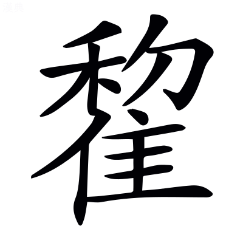

# 文選卷第十九

> 梁昭明太子撰
> 
> 文林郎守太子右內率府錄事參軍事崇賢館直學士臣李善注上

賦癸

情

易曰：利貞者，性情也。性者，本質也；情者，外染也。色之別名，~~事~~於事最末[^19.1.1]，故居於癸。

## 高唐賦

并序。~~漢書注曰：雲夢中高唐之臺。此賦蓋假設其事，風諫淫惑也。~~[^19.1.2]

> 宋玉

昔者楚襄王與宋玉遊於雲夢之臺，~~史記曰：楚懷王薨，太子橫立，為頃襄王。~~[^19.1.3]漢書音義·張揖曰：雲夢，楚藪也，在南郡華容縣，其中有臺館。

望高唐之觀。其上獨有雲氣，崒兮直上，忽兮改容，須臾之間，變化無窮。爾雅曰：崒者，厜笌。注謂山峰頭巉喦然。言雲氣形似於山。

王問玉曰「此何氣也？」玉對曰「所謂朝雲者也。」王曰「何謂朝雲？」玉曰：「昔者先王嘗遊高唐，怠而晝寢，~~鄭玄曰：寢，臥息也。~~[^19.1.4]夢見一婦人曰『妾巫山之女也，襄陽耆舊傳曰：赤帝女曰姚姬，未行而卒，葬於巫山之陽，故曰巫山之女。楚懷王遊於高唐，晝寢，夢見與神遇，自稱是巫山之女。王因幸之。遂為置觀於巫山之南，號為朝雲。後至襄王時復遊高唐。

為高唐之客。[^19.1.5]自言為高唐之客。

聞君遊高唐，願薦枕席。』薦，進也。欲親~~進~~於枕席[^19.1.6]，求親昵之意也。

王因幸之。去而辭曰『妾在巫山之陽，高丘之阻，山南曰陽，土高曰丘。漢書注曰：巫山在南郡巫縣。阻，險也。

旦為朝雲，暮為行雨。朝雲行雨，神女之美也。

朝朝暮暮，陽臺之下。』旦朝視之如言。故為立廟，號曰朝雲。」王曰「朝雲始出，狀若何也？」玉對曰「其始出也，㬣兮若松榯。㬣，茂貌~~，如曋也~~[^19.1.7]；徒對切。榯，直豎貌；音時。

其少進也，晰兮若姣姬。揚袂鄣日，而望所思。晰，昭晰，謂有光明美色。揚袂，舉袖也。如美人之舉袖，望所思也。

忽兮改容，偈兮若駕駟馬，建羽旗。韓詩曰[^19.1.8]：偈，桀侹也[^19.1.9]；居竭切。疾驅貌。周禮曰：析羽為旍。謂破五色鳥羽為之也。言氣變改或如駕馬建旗也。建，立也。

湫兮如風，淒兮如雨。風止雨霽，雲無處所。」湫兮，涼貌。詩曰：風雨淒淒。爾雅曰：濟謂之霽。*郭璞注曰：今南陽人呼雨止為霽；*音薺。

王曰「寡人方今可以遊乎？」玉曰「可。」方今猶正今也。廣雅曰：方，正也。

王曰：「其何如矣？」玉曰「高矣顯矣，臨望遠矣！廣矣普矣，萬物祖矣！廣，間也。普，遍也。祖，始也。言萬物皆祖宗生乎此土[^19.1.10]，為萬物神靈之祖，最有異也。

上屬於天，下見於淵，珍怪奇偉，不可稱論。」王曰「試為寡人賦之。」玉曰「唯唯。禮記曰：父召無諾，先生召無諾，唯而起。*鄭玄曰：應，唯恭於諾也。*皇尧曰：唯謂今之爾是也。

惟高唐之大體兮，殊無物類之可儀比。 巫山赫其無疇兮，道互折而曾累。言殊異於常，無物可儀比。比，類也。赫然，盛貌。道路交互曲折。曾，重也。謂橫斜而上。

登巉巖而下望兮，巉巖，石勢，不生草木。

臨大阺之锣水。說文曰：秦謂陵阪曰阺；丁兮切。周禮曰：以瀦畜水。字林曰：锣，積也，與畜同；抽六切。

遇天雨之新霽兮，觀百谷之俱集。濞洶洶其無聲兮，潰淡淡而並入。百谷者，眾谷雜水集至山之下。字林曰：濞，水暴至聲也。說文曰：洶洶，涌也，謂水波騰貌。洶，詡鞏切。潰，水相交過也。淡，以冉切，~~安流~~平滿貌[^19.1.11]。

滂洋洋而四施兮，蓊湛湛而弗止。長風至而波起兮，若麗山之孤畝。蓊然，聚貌。湛湛，深貌。弗止，謂不常靜或行。郭象莊子注曰：麗，著也。~~爾雅曰：如畝畝丘。郭璞曰：丘有隴界如田畝。~~郭璞爾雅注曰：有隴界如畝[^19.1.12]。素問：歧伯對黃帝曰：卒風暴雨，風吹水勢，波落而隴起。言風吹水勢，浪文如孤壟之附山。

勢薄岸而相擊兮，隘交引而卻會。~~廣雅曰：隘，陿也。~~[^19.1.13]言水之勢，既薄岸而相激，至迫隘之處，其流交引而卻相會。~~謂水口急陿，不得前進，則卻退，復會於上流之中止。~~[^19.1.14]

崒中怒而特高兮，若浮海而望碣[^19.1.15]。崒，聚也。謂兩浪相合聚而中高也。言水怒浪如海邊之望碣石。~~孔安國注尙書曰：碣石，海畔山也。~~碣石，山名也，已見上注[^19.1.16]。

石礫磥磥而相摩兮，巆震天之磕磕。相摩，言水急石流，自相摩礪，聲動徹天。說文曰：礫，小石也。磥磥，眾石貌。巆，聲也；火宏切。字林曰：磕，大聲也。

巨石溺溺之瀺灂兮，沫潼潼而高厲。巨石，大石也。溺溺，沒也。瀺灂，石在水中出沒之貌。沫，水高低貌。潼潼，高貌。厲，起也。~~埤蒼曰：瀺灂，水流聲貌。~~[^19.1.17]

水澹澹而盤紆兮，洪波淫淫之溶㵝。說文曰：澹澹，水搖也。紆，回也。淫淫，去遠貌。溶㵝猶蕩動也；音容裔。

奔揚踊而相擊兮，雲興聲之霈霈。言水之奔揚踊起而相擊，其狀若雲，又興聲霈霈然。上林賦曰：穹隆雲橈，義出於此。纂文曰：雲若大波。霈，浦大切。

猛獸驚而跳駭兮，妄奔走而馳邁。虎豹豺兕，失氣恐喙。雕鶚鷹鷂，飛揚伏竄，妄，謂不覺東西漫走。竄，走也。說文曰：鷂，鷙鳥也；與照切。~~字林曰：竄，逃也，七外切。非關協韻。一音七玩切。~~[^19.1.18]

股戰脅息，安敢妄摯。股戰猶股慄也。脅息猶翕息也。

於是水蟲盡暴，乘渚之陽。水蟲，魚鱉之屬，驚而陸處。方言曰：曬，暴也；蒲卜切。巫山所臨之渚，陽，水北也，暖故魚鱉游焉。

黿鼉鱣鮪，交積縱橫。振鱗奮翼，蜲蜲蜿蜿。中阪遙望，謂張其鱗甲。翼，魚腮邊兩鬣也。蜲蜲蜿蜿，龍蛇之貌。上言水中蟲盡暴，總色說之。中，阪之中，猶未至山頂。蜲，於危切。蜿，於袁切。

玄木冬榮。煌煌熒熒，奪人目精。爛兮若列星，曾不可殫形。榛林鬱盛，葩華覆蓋。雙椅垂房，糾枝還會。煌煌熒熒，草木花光也。榛林，栗林也。葩，花。栗花長與葉間生，自相覆蓋也。雙椅，椅，桐屬也。垂房，花作房生也。房，椅實也。還會，~~交~~相交也[^19.1.19]。糾枝，枝曲下垂也。~~毛詩曰：其桐其椅。注：椅，梧屬。爾雅曰：下句曰糾。~~[^19.1.20]

徙靡澹淡，隨波闇藹。徙靡，言枝往來靡靡然。澹淡，水波小文也。闇藹者，言木蔭水波，闇藹然也。

東西施翼，猗狔豐沛。東西施翼者，謂樹枝四向施布，如鳥翼然。言東西，則南北可知，其林木多也。猗狔，柔弱~~下垂~~貌[^19.1.21]。~~漢書：大人賦「猗狔以招搖。」~~[^19.1.22]猗，於宜切。狔，於危切。

綠葉紫裹，~~丹~~朱莖白蔕[^19.1.23]。裹猶房也；古臥切。

纖條悲鳴，聲似竽籟。清濁相和，五變四會。左氏傳：晏子曰「先王和五聲也，清濁小大以相濟也。吹小枝則聲清，吹大枝則聲濁。」五變，五音皆變也。禮記曰：聲相應故生變，變成方謂之音。四會，四懸俱會也。又云：與四夷之樂聲相會也。

感心動耳，迴腸傷氣。孤子寡婦，寒心酸鼻。言上諸聲能迴轉人腸，傷斷人氣。禮記王制曰：小而無父謂之孤。寒心，謂戰慄也。酸鼻，鼻辛酸淚欲出也。

長吏隳官，賢士失志。尙書曰：股肱惰哉，萬事隳哉[^19.1.24]。*孔安國曰：隳，廢也；*許規切。失其本志，不知所為。

愁思無已，歎息垂淚。登高遠望，使人心瘁。登高心瘁。此下謂至山上高處，未至觀也。瘁，病也。

盤岸巑岏，裖陳磑磑。王逸楚辭注曰：巑岏，山銳貌。裖，已見上林賦[^19.1.25]；音振。~~李奇曰：~~[^19.1.26]裖，整也。陳，列也。磑磑，高貌。~~方言曰：磑，堅也。~~[^19.1.27]

磐石險峻，傾崎崖隤。~~埤蒼曰：崎嶇不安也。~~[^19.1.28]廣雅曰：隤，壞也。說文曰：墜下也。

巖嶇參差，從橫相追。勢如相追。

陬互橫啎，背穴偃蹠。廣雅曰：陬，角也；側溝切。啎，五故切。偃蹠，言山石之形，背穴偃蹇，如有所蹈也。許慎淮南子注曰：蹠，蹈也。啎，逆也。路有橫石逆當其前。背，卻也。穴，孔也。卻又當山之孔穴。

交加累積，重疊增益。交加者，言石相交加累其上，別有交加。石之勢在巑岏崖上，重益其高。

狀若砥柱，在巫山下。砥柱，山名，在水中如柱然。此崖岸在巫山下者，似砥柱山然。

仰視山顛，肅何千千，炫燿虹蜺，說文曰：~~俗~~谸[^19.1.29]，望山谷~~芊芊~~千千青也[^19.1.30]。千~~芊~~谸古字通。言山高如虹蜺炫燿其上。

俯視崝嶸，窐寥窈冥。廣雅曰：崝嶸，深~~直~~冥貌[^19.1.31]。窐寥，空深貌。崝，士耕切。嶸音宏。窐，苦交切。寥音勞。

不見其底，虛聞松聲。言山下杳遠不見，但空聞松聲。

傾岸洋洋，立而熊經。言岸既將傾，水流又迅，故立者恐懼而似熊經。~~傾岸之勢，其水洋洋，避立之處，如熊之在樹。~~[^19.1.32]

久而不去，足盡汗出。謂傾岸之勢，阻險之處，人所懼見，心自戰懼，足下流汗而出也。

悠悠忽忽，怊悵自失。悠悠，遠貌。忽忽，迷貌。言人神悠悠然遠，迷惑不知所斷。~~楚辭曰：怊悵而自悲。王逸曰：悵，恨貌。~~王逸楚辭注曰：怊悵，恨貌[^19.1.33]。怊，恥驕切。

使人心動，無故自恐。動，驚也。言無有，故對此而驚恐。

賁育之斷，不能為勇。孟賁夏育，決斷之士，今見此嶮阻，亦不能為勇也。斷，丁亂切。

卒愕異物，不知所出。卒，七忽切。爾雅曰：槞，見也；午故切。愕與槞同。言卒然復有驚愕之異物，從旁而出，不知所從來。

縰縰莘莘，若生於鬼，若出於神。縰縰莘莘，眾多之貌。~~說文曰：纚，冠織也。縰與纚同；所綺切。詩曰：魚在在藻，有莘其尾。*毛萇曰：莘，眾多也。*莘，所巾切，字或作兟，往來貌，若出於神。~~言不可測知[^19.1.34]。

狀似走獸，或象飛禽。譎詭奇偉，不可究陳。上至觀側，地蓋底平。箕踵漫衍，芳草羅生。自此已前，並述山勢也。杜預左氏傳注曰：底，平也。箕踵，前闊後狹似箕。衍，平貌。言山勢如簸箕之踵也。

秋蘭茞蕙，江離載菁。廣雅曰：菁，華也。載，則也。

青荃射干，揭車苞并。~~見本草。夜干，一名烏扇，今江東為烏蓮，史記為射干。漢書音義曰：~~射干，江東為烏~~蓮~~萐[^19.1.35]。揭車，香草也。苞并，叢生也。

薄草靡靡，聯延夭夭。越香掩掩，靡靡，相依倚貌。夭夭，少長也。越香，言氣發越。掩掩，同時發也。掩，同也。

眾雀嗷嗷。雌雄相失，哀鳴相號。雀，鳥之通稱。毛詩曰：鴻鴈于飛，哀鳴嗷嗷。

王雎鸝黃，正冥楚鳩。姊歸思婦，垂雞高巢。其鳴喈喈，~~爾雅曰：王雎。郭璞曰：鵰類。今江東通呼為鴞。詩云：鳥摯而有別者，一名王鵰。驪黃，郭璞曰：其色黧黑而黃，因名之。一曰鶬鶊。~~王鴡、鸝黃，已見上[^19.1.36]。方言曰：或謂黃為楚雀。廣雅曰：楚鳩一名嗶啁。爾雅曰：嶲周。*郭璞曰：子嶲鳥出蜀中。或曰：即子規，一名姊歸。*嶲，胡圭切。思婦，亦鳥名也。地理志曰：夷通鄉北過仁里有觀山，故老相傳云：昔有思婦登~~北~~此山[^19.1.37]，絕望愁思而死，因以為名。垂雞，未詳。高巢，巢高也。

當年遨遊。一本云：子當千年萬世。遨遊，未詳。

更唱迭和，赴曲隨流。赴曲者，鳥之哀鳴，有同歌曲，故言赴曲。隨流者，隨鳥類而成曲也。

有方之士，羨門高谿。史記曰：方士皆掩口。杜預左氏傳注曰：方，法術也。史記曰：秦始皇使燕人盧生求羨門高誓。谿疑是誓字。~~漢書郊祀志曰：充尚、羨門高最後，皆燕人，為方令道，形辭銷化玉。充尚、羨門高，二人。~~[^19.1.38]

上成鬱林，公樂聚穀。蓋亦方士也。未詳所見。又鬱然仙人盛多如林木。公，共也，人共在山上作~~巢~~樂[^19.1.39]。穀，食也。聚食於山阿。

進純犧，禱琁室。進，謂祭也。禱，祭也。尙書曰：神祇之犧牷牲用。*孔安國曰：色純曰犧。*淮南子曰：崑崙之山，有傾宮琁室。*高誘曰：琁~~宮~~室，以玉飾~~宮~~室也[^19.1.40]。*

醮諸神，禮太一。醮，祭也；子肖切。史記曰：宜立太一，而上親郊之。

傳祝已具，言辭已畢。王乃乘玉輿，駟倉螭，垂旒旌，旆合諧。紬大絃而雅聲流，冽風過而增悲哀。傳祝已具，神之語已具。言辭，即祝所傳辭也。畢，竟也。旒旌，謂建太常十二旒。雅聲，正不淫邪。~~字林曰：~~[^19.1.41]冽，寒風也。紬，引也；音抽。

於是調謳，令人惏悷憯悽，脅息增欷。並悲傷貌。脅息，縮氣也。增，益也。惏，力甚切。悷，力計切。

於是乃縱獵者，基趾如星。傳言羽獵，銜枚無聲。相傳言語，遍告眾士。~~漢書音義·李奇曰：羽林騎士。張晏曰：以應獵負羽。周禮：銜枚氏，軍旅田役令。鄭玄以為枚止言語囂讙也。枚狀如箸，橫銜之。~~羽獵，已見上。銜枚，見吳都賦[^19.1.42]。

弓弩不發，罘颍不傾。涉漭漭，馳苹苹。漭漭，水廣遠貌。~~爾雅曰：苹，藾蕭。郭璞曰：今藾蒿也，邪生亦可食。~~[^19.1.43]說文曰：苹苹，草貌；音平。

飛鳥未及起，走獸未及發。何節奄忽，啼足灑血？何，問辭也。言何節奄忽之間，而獸之蹄足已皆灑血。節，所執之節也。

舉功先得，獲車已實。王將欲往見，必先齋戒，差時擇日。毛萇詩傳曰：差，擇也。

簡輿玄服，建雲旆，蜺為旌，翠為蓋。冬王水，水色黑，故衣黑服。簡，略也，省也。翠，翡翠也。~~以羽飾蓋。~~[^19.1.44]

風起雨止，千里而逝。蓋發蒙，往自會。素問：黃帝曰「發蒙解惑，未足以論也。」會，與神女相會。

思萬方，憂國害。開賢聖，輔不逮。開導賢聖，令其進仕，用其謀策，輔己不逮。此又陳諫於王也。

九竅通鬱精神察~~滯~~[^19.1.45]。文子曰：九竅者，精神之戶牖。~~氣者，五藏之使候。~~[^19.1.46]呂氏春秋曰：凡人九竅五藏惡之精氣鬱。*高誘曰：鬱滯，不通也。*

延年益壽千萬歲。」

[^19.1.1]: 考異：情注「事於最末」：袁本、茶陵本「事於」作「於是」。何校改「於事」。

[^19.1.2]: 考異：高唐賦注「漢書注曰」下至「風諫淫惑也」：袁本、茶陵本無此二十三字。

[^19.1.3]: 考異：注「史記曰」下至「為頃襄王」：袁本、茶陵本無此十五字。

[^19.1.4]: 考異：注「鄭玄曰寢臥息也」：袁本、茶陵本無此七字。

[^19.1.5]: 考異：為高唐之客及注「自言為高唐之客」：袁本無此正文五字、注七字。茶陵本有。案：此蓋善有，五臣無，而失著校語者。

[^19.1.6]: 考異：注「欲親進於枕席」：袁本、茶陵本無「進」字。案：「親」當作「進」。尤校改「親」為「進」，因誤兩存耳。

[^19.1.7]: 考異：注「如曋也」：袁本、茶陵本無此四字。陳云「曋」二字疑。今案：無四字是也。字書不見「曋」。考五臣云「如松栽也」，或誤入，但亦非「曋」。袁、茶陵二本為不誤。

[^19.1.8]: 考異：注「韓詩曰」：何校「詩」下添「章句」二字，陳同。今案：此所脫無以訂之。

[^19.1.9]: 考異：注「偈桀侹也」：袁本此下有「居竭切」三字。案：是也。尤改入注末，作「偈居竭切」，非。茶陵本刪去，益非。讀者因是皆誤連下文「疾驅貌」於此句，而不可通矣。

[^19.1.10]: 考異：注「生此土」：袁本「生」下有「乎」字，是也。茶陵本無。又其下此注不完，皆非。

[^19.1.11]: 考異：注「安流平滿貌」：袁本、茶陵本無「安流」二字。

[^19.1.12]: 考異：注「爾雅曰如畝畝丘郭璞曰丘有隴界如田畝」：袁本、茶陵本作「郭璞爾雅注曰有隴界如畝」十一字。

[^19.1.13]: 考異：注「廣雅曰隘陿也」：袁本、茶陵本無此六字。

[^19.1.14]: 考異：注「謂水口急陿」下至「復會於上流之中止」：袁本、茶陵本無此二十字。

[^19.1.15]: 考異：若浮海而望碣石：案：「碣」當斷句，「會」、「碣」、「磕」、「厲」及以下皆相協，無容失其一韻，「石」字當屬下句首。「石礫磥磥」二句，言小石也；「巨石溺溺」二句，言大石也。其善注則云「碣石者」，以「碣石」解正文之「碣」，非其讀正文於「石」為句，必五臣不察，乃誤分節如此，後善為所亂，而各本不著校語也。又五臣誤改下文「磥磥」作「碨碨」，由不知「磥磥」與「溺溺」相對為文，亦可證。

[^19.1.16]: 考異：注「孔安國注尙書曰碣石海畔山也」：袁本作「碣石山名也已見上注」，是也。茶陵本全複出，皆非。

[^19.1.17]: 考異：注「埤蒼曰瀺灂水流聲貌」：袁本、茶陵本無此九字。

[^19.1.18]: 考異：注「字林曰竄逃也七外切非關協韻一音七玩切」：袁本、茶陵本無此十八字。案：袁、茶陵似非也。此卷善音，二本多所刪去耳。

[^19.1.19]: 考異：注「交相也」：案：「交相」當作「相交」。各本皆倒。

[^19.1.20]: 考異：注「毛詩曰」下至「下句曰糾」：袁本、茶陵本無此十八字。

[^19.1.21]: 考異：注「柔弱下垂貌」：袁本、茶陵本無「下垂」二字。

[^19.1.22]: 考異：注「漢書大人賦猗狔以招搖」：袁本、茶陵本無此十字。

[^19.1.23]: 考異：丹莖白蔕：何校云「丹」一作「朱」，陳同。案：袁本、茶陵本「丹」作「朱」也。

[^19.1.24]: 考異：注「惰哉萬事」：袁本、茶陵本無此四字。案：此二本脫。

[^19.1.25]: 考異：注「裖已見上林賦」：茶陵本作「振」字當作「裖」字，袁本作「振」當作「裖」字，皆校語錯入注，又誤改善作，當以尤所見為是。

[^19.1.26]: 考異：注「李奇曰」：袁本、茶陵本無此三字。

[^19.1.27]: 考異：注「方言曰磑堅也」：袁本、茶陵本無此六字。

[^19.1.28]: 考異：注「埤蒼曰崎嶇不安也」：袁本、茶陵本無此八字。

[^19.1.29]: 考異：注「說文曰俗」：案：「俗」當作「谸」，此所引谷部文。各本皆偽。下文「千芊古字通」，「芊」亦「谸」字之誤。

[^19.1.30]: 考異：注「望山谷芊芊青也」：袁本、茶陵本「芊芊」作「千千」。案：今本說文作「谸谸」。

[^19.1.31]: 考異：注「深直貌」：案：「直」當作「冥」。各本皆偽。此在釋訓。

[^19.1.32]: 考異：注「傾岸之勢」下至「如熊之在樹」：袁本、茶陵本無此十七字。

[^19.1.33]: 考異：注「楚辭曰怊悵而自悲王逸曰悵恨貌」：袁本、茶陵本作「王逸楚辭注曰怊悵恨貌」十字。

[^19.1.34]: 考異：注「說文曰纚」下至「若出於神」：袁本、茶陵本無此四十六字，有「言不可測知」五字。案：此尤添四十六字於「言不可測知」上，而傳寫者因遺落其元有之五字也，但所添不當。凡尤意專主增多，每類此。陳但謂「若出於神」四字衍，未是。

[^19.1.35]: 考異：注「見本草」下至「漢書音義曰」：袁本無此二十五字，有「射干江東為烏蓮」七字。茶陵本作「射干烏蓮草也」六字。案：「蓮」當作「萐」。廣雅：烏萐，射干也。曹憲音所夾。今本亦作「蓮」，其誤正同此。

[^19.1.36]: 考異：注「爾雅曰王雎」下至「一曰鶬鶊」：袁本無此四十七字，有「王鴡鸝黃已見上」七字，最是。茶陵本所複出不同，皆非。

[^19.1.37]: 考異：注「昔有婦登北山」：袁本、茶陵本「婦」上有「思」字。陳云「北」當作「此」。各本皆偽。

[^19.1.38]: 考異：注「漢書郊祀志曰」下至「充尚羨門高二人」：袁本、茶陵本無此三十二字。案：二本最是。此或駮善注「羨門高誓」之解而記於旁。尤延之誤取之也。

[^19.1.39]: 考異：注「人在山上作巢」：袁本、茶陵本「人」下有「共」字。又案：此解正文「公樂」，當云「人共在山上作樂」。各本「樂」偽為「巢」也。

[^19.1.40]: 考異：注「以玉飾宮也」：袁本、茶陵本「以」上有「琁宮」二字。案：無者非也。又二「宮」字皆「室」之誤。

[^19.1.41]: 考異：注「字林曰」：袁本、茶陵本無此三字。

[^19.1.42]: 考異：注「漢書音義李奇曰」下至「橫銜之」：袁本無此四十七字。有「羽獵已見上銜枚見吳都賦」十一字，最是。茶陵本所複出不同，皆非。

[^19.1.43]: 考異：注「爾雅曰苹」下至「亦可食」：袁本、茶陵本無此十八字。

[^19.1.44]: 考異：注「以羽飾蓋」：袁本、茶陵本無此四字。

[^19.1.45]: 考異：九竅通鬱精神察滯：袁本云善有「滯」字，茶陵本云五臣無「滯」字。案：各本所見皆非也。詳注意，善並無「滯」字。「察」字韻上「逮」下「歲」自協，以七字為一句，但傳寫者誤，因注中「鬱滯不通也」妄添於下。袁、茶陵據之作校語，尤延之亦不審，而讀者皆誤認為善有、五臣無矣。

[^19.1.46]: 考異：注「氣者五藏之使候」：袁本、茶陵本無此七字。

## 神女賦

并序

> 宋玉

楚襄王與宋玉遊於雲夢之浦，使玉賦高唐之事。其夜~~王~~玉寢[^19.2.1]，~~果~~夢與神女遇[^19.2.2]，其狀甚麗。王異之，明日以白~~玉~~王。~~玉~~王曰「其夢若何？」~~王~~玉對曰[^19.2.3]「晡夕之後，精神怳忽，若有所喜。紛紛擾擾，未知何意。晡，日跌時也。怳忽，不自覺知之意。所喜，忽然喜悅。~~紛擾，喜也。~~[^19.2.4]

目色髣彿，作若有記。見一婦人，狀甚奇異。寐而夢之，寤不自識。罔兮不樂，悵然失志。於是撫心定氣，復見所夢。」王曰[^19.2.5]「狀何如也？」如有可記識也。~~髣彿，見不審也。~~[^19.2.6]罔，憂也。撫，覽也。見神女也。

玉曰[^19.2.7]「茂矣美矣，諸好備矣，盛矣麗矣，難測究矣，上古既無，世所未見。瑰姿瑋態，不可勝贊。~~勝，盡也。贊，明也。~~[^19.2.8]其始來也，耀乎若白日初出照屋梁。韓詩曰：東方之日。*薛君曰：詩人所說者顏色美盛若東方之日。*

其少進也，皎若明月舒其光。毛詩曰：月出皎兮。*毛萇曰：喻婦人有美白砽也。*

須臾之間，美貌橫生。曄兮如華，溫乎如瑩。毛詩曰：有女同車，顏如蕣華。~~又曰：尚之以瓊瑩乎而。注：瓊瑩，石似玉也；音榮。~~[^19.2.9]逸論語曰：如玉之瑩。說文曰：瑩，玉色也；為明切。曄，盛貌。

五色並馳，不可殫形。詳而視之，奪人目精。其盛飾也，則羅紈綺繢盛文章。馳，施也。綺，五色也。蒼頡篇曰：繢，似纂，色赤；胡憒切。

極服妙采照萬方。振繡衣，被袿裳。劉熙釋名曰：婦人上服謂之袿。

襛不短，纖不長。說文曰：襛，衣厚貌；如恭切。

步裔裔兮曜殿堂。忽兮改容，婉若遊龍乘雲翔。嫷被服，侻薄裝。裔裔，行貌。~~毛萇詩傳曰：~~[^19.2.10]婉，美貌。方言曰：嫷，美也；他臥切。說文曰：~~侻~~娧[^19.2.11]，好也，與~~娧~~侻同[^19.2.12]；他外切。又：侻，可也。言薄裝正相堪可。

沐蘭澤，含若芳。性和適，宜侍旁。順序卑，調心腸。」沐，洗也。以蘭浸油澤以塗頭。~~旁，~~宜侍王旁[^19.2.13]。卑，柔弱也。

王曰「若此盛矣，試為寡人賦之。」玉曰「唯唯。夫何神女之姣麗兮，含陰陽之渥飾。言神女得陰陽厚美之飾。

被華藻之可好兮，若翡翠之奮翼。其象無雙，其美無極。毛嬙鄣袂，不足程式。西施掩面，比之無色。慎子曰：毛嬙、先施，天下之姣也。衣之以皮倛，則見者皆走，易之以玄錫，則行者皆止。先施西施一也。嬙音牆。

近之既~~妖~~姣[^19.2.14]，遠之有望。骨法多奇，應君之相。視之盈目，孰者克尚。近看既美，復宜遠望。孰，誰也。克，能也。誰者能尚，言無有也。

私心獨悅，樂之無量。交希恩疏，不可盡暢。他人莫睹，王覽其狀。其狀峨峨，何可極言。貌豐盈以莊姝兮，苞溫潤之玉顏。暢，申也。未可申暢己志也。豐盈，肥滿也。莊，嚴也。~~方言曰：姝，好也。~~[^19.2.15]毛萇詩傳曰，姝，美色也。禮記曰：玉溫潤而澤，仁也。

眸子炯其精朗兮，瞭多美而可觀。~~字林曰：瞭，明也。~~[^19.2.16]鄭玄周禮注曰：瞭，明目也；力小切。

眉聯娟以蛾揚兮，朱脣的其若丹。~~聯娟，微曲貌。[^19.2.17]~~素質幹之醲實兮，志解泰而體閑。既姽嫿於幽靜兮，又婆娑乎人間。言志操解散，奢泰多閑，不急躁也。謂在人中最好無比也。婆娑猶盤姍也。說文曰：姽，~~靖好貌~~閑體行也[^19.2.18]；五累切。~~廣雅曰：嫿，好也~~嫿，靜好也[^19.2.19]；音畫。~~說文：靜，審也。韓詩：靜，貞也。~~[^19.2.20]

宜高殿以廣意兮，翼放縱而綽寬。動霧縠以徐步兮，拂墀聲之珊珊。珊珊，聲也。翼，放縱貌。如鳥之翼，隨意放縱。縠，今之輕紗，薄如霧也。

望余帷而延視兮，若流波之將瀾。流波，目視貌。言舉目延視，精若水波將成瀾也。

奮長袖以正衽兮，立躑躅而不安。說文曰：衽，衣衿也。自矜嚴也。

澹清靜其愔嫕兮，性沈詳而不煩。澹，靜貌。愔，和也。嫕，淑善也。言志度靜而和淑也。不煩，不躁也。~~聲類曰：~~[^19.2.21]愔，見魏都賦，嫕，已見洞簫賦~~，和靜貌。韓詩曰：嫕，悅也。說文曰：嫕，靜也。蒼頡篇曰：嫕，密也~~[^19.2.22]。

時容與以微動兮，志未可乎得原。意似近而既遠兮，若將來而復旋。原，本也。其意欲似近，而心靜不測，是復為遠也。將來可親之意更遠也，謂復更遠也。~~字林曰：旋，回也。~~[^19.2.23]

褰余幬而請御兮，願盡心之惓惓。鄭玄毛詩箋曰：幬，床帳也。

懷貞亮之絜清兮，卒與我兮相難。陳嘉辭而云對兮，吐芬芳其若蘭。精交接以來往兮，心凱康以樂歡。神獨亨而未結兮，魂焭焭以無端。含然諾其不分兮，喟揚音而哀歎。頩薄怒以自持兮，曾不可乎犯干。精，神也。未結猶未相著[^19.2.24]，焭焭然無有端次，不知何計分當也。言神女之意，雖含諾，猶不當其心。廣雅曰：頩，色也；匹零切。~~方言曰：頩，怒色青貌；切韻，匹迥切。~~[^19.2.25]歛容也。蒼頡篇曰：薄，微也。捉顏色而自矜持也。

於是搖珮飾，鳴玉鸞。整衣服，歛容顏。顧女師，命太傅。古者皆有女師，教以婦德。今神女亦有教也。毛詩序曰：尊敬師傅，可以歸寧父母。漢書音義曰：婦人年五十無子者為傅。

歡情未接，將辭而去。遷延引身，不可親附。似逝未行，中若相首。遷延，卻行去也。廣雅曰：首，向也；舒救切。

目略微眄，精彩相授。志態橫出，不可勝記。意離未絕，神心怖覆。禮不遑訖，辭不及究。願假須臾，神女稱遽。目略輕看，精神光采相授與也，猶未即絕。怖覆，謂恐怖而反覆也。左氏傳：豎頭須曰「沐則心覆，心覆則圖反。」遽，急也。言去不住也。

徊腸傷氣，顛倒失據。毛萇詩傳曰：據，依也。

闇然而暝，忽不知處。情獨私懷，誰者可語。惆悵垂涕，求之至曙。」

[^19.2.1]: 考異：其夜王寢：陳云「王寢」「白玉」諸字當如沈存中、姚令威之說。案：何校亦云然，謂「玉」「王」互偽也。說載筆談及西溪叢語。今考互偽始於五臣，見下。

[^19.2.2]: 考異：果夢與神女遇：袁本、茶陵本無「果」字，是也。案：尤本所見又五臣以後之誤者。

[^19.2.3]: 考異：王曰：袁本、茶陵本「王」下有「對」字，是也。案：此「玉對曰」，五臣「玉」作「王」，仍存「對」字。尤本所見又五臣以後之誤者。

[^19.2.4]: 考異：注「紛擾喜也」：袁本、茶陵本無此四字。

[^19.2.5]: 考異：王曰：袁本、茶陵本「王」作「玉」。案：此二本失著校語。

[^19.2.6]: 考異：注「髣髴見不審也」：袁本、茶陵本無此六字。

[^19.2.7]: 考異：玉曰：袁本、茶陵本「玉」作「王」，云善作「玉」。案：二本與尤正同，然則善、五臣「王」「玉」互換，此其明驗也。自「王寢」以下，及後「王覽其狀」，皆當如此。二本校語不備，尤本亦多以五臣亂善，賴存此一處，可以推知致偽之由，為沈存中、姚令威疏通而證明之，讀者亦可以無疑矣。

[^19.2.8]: 考異：注「勝盡也贊明也」：袁本、茶陵本無此六字。

[^19.2.9]: 考異：注「又曰尚之以瓊瑩乎而注瓊瑩石似玉也音榮」：袁本、茶陵本無此十八字。

[^19.2.10]: 考異：注「毛萇詩傳曰」：袁本、茶陵本無此五字。

[^19.2.11]: 考異：注「說文曰侻」：案：「侻」當作「娧」。各本皆偽。此女部文也。

[^19.2.12]: 考異：注「與娧同」：案：「娧」當作「侻」。各本皆偽。

[^19.2.13]: 考異：注「旁宜侍王旁」：案：首不當有「旁」字，蓋此注在「宜侍旁」句下，後并上為一節，而標此字為識。各本因皆衍。

[^19.2.14]: 考異：近之既妖：案：「妖」當作「姣」。上文「姣麗」，五臣作「妖」，善作「姣」。袁、茶陵二本有校語，此以五臣亂善，各本皆非。善注言「近看既美」，是作「姣」之證。

[^19.2.15]: 考異：注「方言曰姝好也」：袁本、茶陵本無此六字。

[^19.2.16]: 考異：注「字林曰瞭明也」：袁本、茶陵本無此六字。

[^19.2.17]: 考異：注「聯娟微曲貌」：袁本、茶陵本無此五字，其所載五臣濟注有之。案：二本是也。此尤所見誤衍。

[^19.2.18]: 考異：注「靖好貌」：袁本、茶陵本作「閑體行也」。案：二本是也。此女部文。今本「閑體行姽姽也」，而善節引之。

[^19.2.19]: 考異：注「廣雅曰嫿好也」：袁本、茶陵本作「嫿靜好也」四字。案：二本是也。此亦女部文，非引廣雅。尤所見誤衍。

[^19.2.20]: 考異：注「音畫說文靜審也韓詩靜貞也」：袁本、茶陵本無此十二字。案：或仍當有「音畫」二字。以下皆誤衍耳。

[^19.2.21]: 考異：注「聲類曰」：袁本、茶陵本無此三字。

[^19.2.22]: 考異：注「和靜貌」下至「嫕密也」：袁本、茶陵本無此二十二字。

[^19.2.23]: 考異：注「字林曰旋回也」：袁本、茶陵本無此六字。

[^19.2.24]: 考異：注「結猶未相著」：袁本、茶陵本「結」上有「未」字，是也。

[^19.2.25]: 考異：注「方言曰頩怒色清貌切韻匹迥切」：袁本、茶陵本無此十三字。

## 登徒子好色賦

并序。~~此賦假以為辭，諷於婬也。~~[^19.3.1]

> 宋玉

大夫登徒子侍於楚王，短宋玉曰大夫，官也。登徒，姓也。子者，男子之通稱。戰國策曰：孟嘗君至楚，楚獻象床，登徒送之。高誘淮南子注曰：短，說其罪闕也。

「玉為人，體貌閑麗，口多微辭，又性好色。閑，靜也。麗，美也。微，妙也。公羊傳曰：定哀多微辭。論語：子曰「吾未見好德如好色者也。」

願王勿與出入後宮。」王以登徒子之言問宋玉，玉曰「體貌閑麗，所受於天也；口多微辭，所學於師也；至於好色，臣無有也。」王曰：「子不好色，亦有說乎？遣自解說也。

有說則止，無說則退。」玉曰：「天下之佳人莫若楚國，楚國之麗者莫若臣里，臣里之美者莫若臣東家之子。東家之子，增之一分則太長，減之一分則太短，著粉則太白，施朱則太赤。眉如翠羽，肌如白雪，莊子曰：藐姑射之山有神人居焉，肌膚若冰雪。

腰如束素，齒如含貝。莊子：孔子謂盜跖曰「將軍齒如齊貝。」貝，海螺，其色白。

嫣然一笑，惑陽城，迷下蔡。王逸楚辭注曰：嫣，笑貌。~~廣雅曰：嘕嘕欯欯，喜也。~~[^19.3.2]陽城下蔡，二縣名，蓋楚之貴介公子所封，故取以喻焉。

然此女登牆闚臣三年，至今未許也。字林曰：窺，傾頭門內視也。又小視也。

登徒子則不然。其妻蓬頭攣耳，齞脣歷齒。莊子曰：蓬頭突鬢。爾雅曰：攣，病也；力專切。說文曰：齞，張口見齒也；牛善切。歷猶疏也。

旁行踽僂，又疥且痔。踽僂，傴僂也。廣雅曰：傴僂，曲貌。傴，央矩切。僂，力主切。說文曰：疥，瘙也。痔，後病也。

登徒子悅之，使有五子。王孰察之，誰為好色者矣。」是時，秦章華大夫在側，因進而稱曰「今夫宋玉盛稱鄰之女，以為美色，愚亂之邪！臣自以為守德，謂不如彼矣。章華，楚地名。大夫，楚人入仕於秦，時使襄王。~~一云食邑章華，因以為號。~~[^19.3.3]愚，鈍也。亂，昏也。邪，僻也。言昏鈍邪僻之臣。章華大夫自謙不如彼之登徒所說也。言宋玉之所說鄰女美色，愚臣守德，猶不如登徒之說，況宋玉乎？臣，章華大夫自謂。

且夫南楚窮巷之妾，焉足為大王言乎？若臣之陋，目所曾睹者，未敢云也。」

王曰：「試為寡人說之。」大夫曰：「唯唯[^19.3.4]。臣少曾遠遊，周覽九土，足歷五都。九土，九州之土。五都，五方之都。

出咸陽，熙邯鄲。 從容鄭衛溱洧之間。熙，戲也。~~廣雅曰：從容，舉動也。~~[^19.3.5]毛詩曰：溱與洧，方渙渙兮。*毛萇曰：溱洧，鄭兩水名。*洧，于軌切。

是時向春之末，迎夏之陽。鶬鶊喈喈，群女出桑。毛詩曰：倉庚喈喈。又曰：十畝之間兮，桑者閑閑兮。

此郊之姝，華色含光。體美容冶，不待飾裝。臣觀其麗者，因稱詩曰『遵大路兮攬子袪，~~此郊，即鄭衛之郊。~~[^19.3.6]毛詩曰：~~靜女其姝。又曰：~~[^19.3.7]遵大路兮，摻執子之祛兮。~~大路，詩篇名也。遵，循也。路，道也。謂道路逢子之美，願攬子之袂與俱歸也。~~[^19.3.8]稱此詩者，此本鄭詩，故稱以感動。

贈以芳華辭甚妙。』折芳草之華以贈之，為辭甚妙。

於是處子怳若有望而不來，忽若有來而不見。意密體疏，俯仰異觀，含喜微笑，竊視流眄。謂折芳草之花以贈之，欲贈芳華，恐不受，故先與妙辭以進之。處女，未嫁者。怳，失意貌。體疏，相離殊遠。謂異於未贈花前所視。

復稱詩曰『寤春風兮發鮮榮。絜齋俟兮惠音聲。贈我如此兮不如無生。』~~司馬彪注漢書子虛賦曰：復，答也。顏師古注：復音伏。~~復，報也[^19.3.9]。寤，覺也。鮮榮，華也，喻少年之盛。齋，莊也，言自絜貌，矜莊而待惠音聲。如此，謂贈以芍藥，欲結恩情，而女不受。毛詩曰：知我如此，不如無生。*鄭玄曰：則己之生，不如不生。無生，恨之辭也。*

因遷延而辭避，蓋徒以微辭相感動，精神相依憑，目欲其顏，心顧其義，揚詩守禮，終不過差，故足稱也。」微辭，謂向所陳辭甚妙者。若即折登徒言多微詞。

於是楚王稱善，宋玉遂不退。宋玉雖不逮大夫之顧義，而不同登徒之好色，故不退。

[^19.3.1]: 考異：登徒子好色賦注「此賦假以為辭諷於婬也」：袁本、茶陵本無此十字。

[^19.3.2]: 考異：注「廣雅曰嘕嘕欯欯喜也」：袁本、茶陵本無此九字。

[^19.3.3]: 考異：注「一云食邑章華因以為號」：袁本、茶陵本無此十字。

[^19.3.4]: 考異：唯唯：案：此下各本皆提行，非也。考此賦本無所謂序，今題下有「并序」二字，而於此提行，謂以上是序，以下是賦，善必不應如是大誤，未詳其何時始爾也。

[^19.3.5]: 考異：注「廣雅曰從容舉動也」：袁本、茶陵本無此八字。

[^19.3.6]: 考異：注「此郊即鄭衛之郊」：袁本、茶陵本無此七字。

[^19.3.7]: 考異：注「靜女其姝又曰」：袁本、茶陵本無此六字。

[^19.3.8]: 考異：注「大路詩篇名也」下至「與俱歸也」：袁本、茶陵本無此二十八字。

[^19.3.9]: 考異：注「司馬彪注漢書子虛賦曰復答也顏師古注復音伏」：袁本、茶陵本無此二十字，有「復報也」三字。案：二本是也。凡此等尤所添皆非是。

## 洛神賦

并序。漢書音義·如淳曰：宓妃，宓羲氏之女，溺死洛水，為神。

> 曹子建~~記曰：魏東阿王，漢末求甄逸女，既不遂。太祖回，與五官中郎將。植殊不平，晝思夜想，廢寢與食。黃初中入朝，帝示植甄后玉鏤金帶枕，植見之，不覺泣。時已為郭后讒死。帝意亦尋悟，因令太子留宴飲，仍以枕賚植。植還，度轘轅，少許時，將息洛水上，思甄后。忽見女來，自云「我本託心君王，其心不遂。此枕是我在家時從嫁前與五官中郎將，今與君王。」遂用薦枕席，懽情交集，豈常辭能具。為郭后以糠塞口，今被髮，羞將此形貌重睹君王爾。」言訖，遂不復見所在。遣人獻珠於王，王答以玉珮，悲喜不能自勝，遂作感甄賦。後明帝見之，改為洛神賦。~~[^19.4.1]

黃初三年，余朝京師，還濟洛川。~~黃初，文帝丕年號。京師，洛陽也。洛川，洛水之川也，洛水出洛山。濟，度也。~~[^19.4.2]古人有言，斯水之神，名曰宓妃。感宋玉對楚王神女之事，遂作斯賦。其辭曰：

余從京域，言歸東藩。魏志曰：黃初三年，立植為鄄城王。四年，徙封雍丘。其年朝京師。又文紀曰：黃初三年，行幸許。又曰：四年三月，還雒陽宮。然京域謂雒陽，東蕃即鄄城。魏志及諸詩序並云四年朝，此云三年，誤。~~一云魏志三年不言植朝，蓋魏志略也。~~[^19.4.3]

背伊闕，越轘轅。伊闕、轘轅，已見東~~都~~京賦[^19.4.4]。

經通谷，陵景山。華延洛陽記曰：城南五十里有大谷，舊名通谷。河南郡圖經曰：景山，緱氏縣南七里。

日既西傾，車殆馬煩。 爾迺稅駕乎蘅皋，秣駟乎芝田。蘅，杜蘅也。皋，澤也。嵩高山記曰：山上有神芝[^19.4.5]。十洲記曰：鍾山仙家耕田種芝草。

容與乎~~陽~~楊林[^19.4.6]，流眄乎洛川。 於是精移神駭，忽焉思散。 俯則未察，仰以殊觀。睹一麗人，于巖之畔。迺援御者而告之曰「爾有覿於彼者乎？彼何人斯，若此之豔也？」~~陽林，一作~~楊林[^19.4.7]，地名，生多楊，因名之。移，變也。情思消散，如有所悅。未察，猶未的審所觀殊異。毛詩曰：彼何人斯。

御者對曰「臣聞河洛之神，名曰宓妃，然則君王所見，無迺是乎？其狀若何？臣願聞之。」余告之曰「其形也，翩若驚鴻，婉若遊龍。邊讓章華臺賦曰：體迅輕鴻，榮曜春華。神女賦曰：婉若遊龍乘雲翔。翩翩然若鴻鴈之驚，婉婉然如遊龍之升。

榮曜秋菊，華茂春松。朱穆鬱金賦曰：比光榮於秋菊，齊英茂於春松。

髣髴兮若輕雲之蔽月，飄颻兮若流風之迴雪。遠而望之，皎若太陽升朝霞；正歷曰：太陽，日也。

迫而察之，灼若芙蕖出淥波。襛纖得衷，脩短合度。神女賦曰：襛不短，纖不長。

肩若削成，腰如~~約~~束素[^19.4.8]。削成，已見魏都賦。登徒子好色賦曰：腰如束素。束素，約素，謂圓也。

延頸秀項，皓質呈露。楚辭曰：小腰秀項若鮮卑。說文曰：項，頸也。司馬相如美人賦曰：皓質呈露。呈，見也。延秀，皆長也。

芳澤無加，鉛華弗御。楚辭曰：粉白黛黑施芳澤。鉛華，粉也。博物志曰：燒鉛成胡粉。張平子定情賦曰：思在面為鉛華兮，患離塵而無光。

雲髻峨峨，脩眉聯娟。毛詩曰：鬒髮如雲。神女賦曰：眉聯娟以蛾揚。峨峨，高如雲也。脩，長曲而細也。

丹脣外朗，皓齒內鮮。明眸善睞，靨輔承權。神女賦曰：眸子炯其精朗。離騷曰：靨輔奇牙宜笑嘕。*王逸曰：美人頰有靨輔也。*權，兩頰。睞，旁視也。

瑰姿豔逸，儀靜體閑。神女賦曰：瑰姿瑋態。又曰：志解泰而體閑。儀靜，安靜也。體閑，謂膚體閑暇也。

柔情綽態，媚於語言。奇服曠~~世~~代[^19.4.9]，骨像應圖。柔，弱也。綽，寬也。神女賦曰：骨法多奇，應君之相。應圖，應畫圖也。

披羅衣之璀粲兮，珥瑤碧之華琚。璀粲，衣聲。山海經曰：~~沃人之國爰有璿瑰瑤碧。郭璞曰：名玉也。又曰：~~[^19.4.10]和山，其上多瑤碧。毛詩曰：~~投我以木瓜，~~[^19.4.11]報之以瓊~~瑤~~琚[^19.4.12]。*毛萇曰：琚，佩玉名；*音居。

戴金翠之首飾，綴明珠以耀軀。司馬彪續漢書曰，太皇后花勝上為金鳳，以翡翠為毛羽，步搖貫白珠八。劉騊駼玄根賦曰：戴金翠，珥珠璣。劉熙釋名曰：皇后首飾曰副。

踐遠遊之文履，曳霧綃之輕裾。繁欽定情詩曰：何以消滯憂，足下雙遠遊。有此言，未詳其本。神女賦曰：動霧縠以徐步。~~綃，輕縠也。~~綃，已見吳都賦[^19.4.13]

微幽蘭之芳藹兮，步踟躕於山隅。於是忽焉縱體，以遨以嬉。左倚采旄，右蔭桂旗。芳藹，芳香晻藹也。楚辭曰：建雄虹之采旄。又曰：辛夷車兮結桂旗。

攘皓腕於神滸兮，采湍瀨之玄芝。~~爾雅曰：岸上曰滸。郭璞曰：厓上地也。~~[^19.4.14]毛詩曰：在河之滸。*毛萇曰：滸，水厓也。*~~漢書音義·應劭曰：瀨，水流沙上也。傅瓚曰：瀨，湍也。~~[^19.4.15]本草曰：黑芝一名玄芝。

余情悅其淑美兮，心振蕩而不怡。無良媒以接懽兮，託微波而通辭。毛詩曰：子無良媒。

願誠素之先達兮，解玉佩以要之。嗟佳人之信脩兮，羌習禮而明詩。抗瓊珶以和予兮，指潛淵而為期。要，屈也。佳人信脩整，習禮謂立德，明詩謂善言辭。古人指水為信，如有如白水之類也。珶，玉也；徒帝切。潛淵，謂所居也。

執眷眷之款實兮，懼斯靈之我欺。感交甫之棄言兮，悵猶豫而狐疑。~~神仙傳曰：切仙一出遊於江濱，逢鄭交甫，交甫不知何人也，目而挑之，女遂解佩與之。交甫行數步，空懷無佩，女亦不見。~~交甫，已見江賦[^19.4.16]。爾雅曰：猶如麂，善登木。此獸性多疑慮，常居山中。忽聞有聲，則恐人來害之，每預上樹，久久無度復下，須臾又上。如此非一。故不決者稱猶焉。一曰，隴西俗謂犬子，隨人行，每預前，待人不得，又來迎候，故言猶豫也。狐之為獸，其性多疑，每渡冰行且聽且渡。故疑者稱狐疑。

收和顏而靜志兮，申禮防以自持。~~說文曰：靜，審也。韓詩曰：靜，貞也。~~[^19.4.17]申，展也。子建自防持也。

於是洛靈感焉，徙倚傍徨。謝靈運山居賦注曰：河靈，河伯也，東阿所謂洛靈。

神光離合，乍陰乍陽。竦輕軀以鶴立，若將飛而未翔。陰去陽來也。邊讓章華臺賦曰：縱輕軀以迅赴，若離鵠之失群。言如鶴鳥之立望。

踐椒塗之郁烈，步蘅薄而流芳。椒塗蘅薄，言芳香也。郁烈，香氣之甚。

超長吟以永慕兮，聲哀厲而彌長。爾迺眾靈雜遝，命儔嘯侶。或戲清流，或翔神渚。或采明珠，或拾翠羽。 從南湘之二妃，攜漢濱之游女。厲，急也。雜遝，眾貌。二妃、遊女，並已見上文[^19.4.18]。~~毛詩曰：漢有游女，不可求思。注：漢上游女，無求思者。~~

歎匏瓜之無匹兮，詠牽牛之獨處。史記曰：四星在危南。匏瓜。牽牛為犧牲。其北織女。織女，天女孫也。天官星占曰：匏瓜一名天雞，在河鼓東。牽牛一名天鼓，不與織女值者，陰陽不和。曹植九詠注曰：牽牛為夫，織女為婦。織女牽牛之星，各處河~~鼓~~之旁[^19.4.19]。七月七日，乃得一會。阮瑀止慾賦曰：傷匏瓜之無偶，悲織女之獨勤。俱有此言。然無匹之義，未詳其始。

揚輕袿之猗靡兮，翳脩袖以延佇。體迅飛鳧，飄忽若神。陵波微步，羅韈生塵。陵波而韈生塵，言神人異也。洛靈即神，而言若者，夫神萬靈之總稱，言若所以類彼，非謂此為非神也。淮南子曰：聖~~足~~人行於水[^19.4.20]，無跡也；眾生行於霜，有跡也。說文曰：陉，足衣也。

動無常則，若危若安。進止難期，若往若還。轉眄流精，光潤玉顏。神女賦曰：苞溫潤之玉顏。

含辭未吐，氣若幽蘭。神女賦曰：吐芬芳其若蘭。

華容婀娜，令我忘~~飡~~餐[^19.4.21]。張衡七辯曰：蝤齊之領，阿那宜顧。杜篤禊祝曰：懷李女使不~~飧~~湌[^19.4.21]。婀，烏可切。娜，奴可切。

於是屏翳收風，川后靜波。王逸楚辭注曰：屏翳，雨師名。虞喜志林曰：韋昭云，屏翳，雷師。喜云雨師。然說屏翳者雖多，並無明據。曹植詰~~洛~~咎文曰[^19.4.22]：河伯典澤，屏翳司風。植既皆為風師，不可引他說以非之。川后，河伯也，已見上文。

馮夷鳴鼓，女媧清歌。馮夷、女媧，並已見上文。

騰文魚以警乘，鳴玉鸞以偕逝。騰，升也。文魚有翅能飛，故使警乘。警，戒也。楚辭曰：文魚兮上瀨。又曰：將騰駕兮皆逝。玉鸞，已見上文。

六龍儼其齊首，載雲車之容裔。春秋命歷序曰：有神人右耳蒼色大肩，駕六龍出輔，號曰神農。儼，矜莊貌。春秋命歷序曰：人皇乘雲車出谷口。博物志曰：漢武帝好道，西王母七月七日漏七刻，王母乘紫雲車而來[^19.4.23]。

鯨鯢踊而夾轂，水禽翔而為衛。於是越北沚，過南岡。紆素領，迴清陽。北海魚非洛川所有，然神仙之川亦有。~~爾雅曰：水中渚曰沚。孔安國尙書注曰：山脊曰岡。~~[^19.4.24]毛詩曰：領如蝤蠐。又曰：有美一人，清陽婉兮。

動朱脣以徐言，陳交接之大綱。恨人神之道殊兮，怨盛年之莫當。 抗羅袂以掩涕兮，淚流襟之浪浪。盛年，謂少壯之時不能得當君王之意。此言微感甄后之情。楚辭曰：攬茹蕙以掩涕兮，沾予襟之浪浪。~~淚下貌。~~[^19.4.25]

悼良會之永絕兮，哀一逝而異鄉。無微情以效愛兮，獻江南之明璫。良會，夫婦之道。鄉猶方也。淮南子曰：禮豐不足以效愛。服虔通俗文曰：耳珠曰璫。

雖潛處於太陰，長寄心於君王。太陰，眾神之所居。

忽不悟其所舍，悵神宵而蔽光。漢書音義·孟康曰：宵，化也。

於是背下陵高，足往神留。遺情想像，顧望懷愁[^19.4.26]。楚辭曰：思舊故而想像。傅毅七激曰：無物可樂，顧望懷愁。

冀靈體之復形，御輕舟而上溯。浮長川而忘反，思緜緜而增慕。夜耿耿而不寐，霑繁霜而至曙。溯，逆流向上也。緜緜，密意也。毛詩曰：耿耿不寐。又曰：正月繁霜。

命僕夫而就駕，吾將歸乎東路。攬騑轡以抗策，悵盤桓而不能去。」~~說文曰：騑，驂駕也。毛萇詩傳曰：騑騑，行不止之貌。廣雅曰：盤桓，不進也。~~[^19.4.27]

[^19.4.1]: 考異：注「記曰」下至「改為洛神賦」：此二百七字袁本、茶陵本無。案：二本是也。此因世傳小說有感甄記，或以載於簡中，而尤延之誤取之耳。何嘗駮此說之妄，今據袁、茶陵本考之，蓋實非善注。又案：後注中「此言微感甄后之情」，當亦有誤字也。

[^19.4.2]: 考異：注「黃初文帝丕年號」下至「濟度也」：袁本、茶陵本無此二十七字。

[^19.4.3]: 考異：注「一云魏志三年不言植朝蓋魏志略也」：袁本、茶陵本無此十五字。案：此亦尤延之誤取，或駮善注之記於旁者。

[^19.4.4]: 考異：注「已見東都賦」：陳云「都」當作「京」，是也。袁、茶陵二本複出，皆非。案：複出不合善例，凡袁亦誤者不悉出。

[^19.4.5]: 考異：注「山上神芝」：袁本、茶陵本神上有「有」字，是也。

[^19.4.6]: 考異：容與乎陽林：袁本、茶陵本「陽」作「楊」，云五臣作「陽」。案：二本是也。尤所見以五臣亂善。

[^19.4.7]: 考異：注「陽林一作楊林」：袁本、茶陵本無「陽林一作」四字。案：二本是也。此尤所見蓋有「陽林」，善作「楊林」，乃校語錯入注，因改善作「一」以就之耳。

[^19.4.8]: 考異：腰如約素：袁本、茶陵本云「約」善作「束」。案：二本校語是也。注云「束素，約素」，以「約」解「束」。五臣因改正文作「約」，尤所見以之亂善，非也。

[^19.4.9]: 考異：奇服曠世：袁本、茶陵本云「世」善作「代」。案：此以五臣亂善。

[^19.4.10]: 考異：注「沃人之國」下至「名玉也又曰」：袁本、茶陵本無此十八字。

[^19.4.11]: 考異：注「投我以木瓜」：袁本、茶陵本無此五字。

[^19.4.12]: 考異：注「報之以瓊瑤」：何校「瑤」改「琚」，是也。各本皆偽。

[^19.4.13]: 考異：注「綃輕縠也」：案：此當作「綃已見吳都賦」。袁、茶陵二本所複出者其證也。

[^19.4.14]: 考異：注「爾雅曰」下至「厓上地也」：袁本、茶陵本無此十四字。

[^19.4.15]: 考異：注「漢書音義應劭曰」下至「瀨湍也」：袁本、茶陵本無此十九字。

[^19.4.16]: 考異：注「神仙傳曰切仙一出」下至「女亦不見」：袁本、茶陵本此注作「韓詩內傳曰鄭交甫遵彼漢皋臺下遇二女與言曰願請子之珮二女與交甫交甫受而懷之超然而去十步循探之即亡矣迴顧二女亦即亡矣」。案：皆非也。依善例求之，當云「交甫已見江賦」。袁、茶陵其所複出也。

[^19.4.17]: 考異：注「說文曰」下至「靜貞也」：袁本、茶陵本無此十二字。

[^19.4.18]: 考異：注「二妃已見上文毛詩曰」下至「無求思者」：案：「二妃」下當有「遊女並」三字，依善例求之如此。謂「二妃」注在思玄賦，「游女」注在琴賦。袁本、茶陵本所複出皆非，然即其證也。「毛詩曰」以下二十字，尤本誤衍，袁、茶陵無。

[^19.4.19]: 考異：注「各處河鼓之旁」：袁本、茶陵本無「鼓」字，是也。

[^19.4.20]: 考異：注「聖足行於水」：袁本、茶陵本「足」作「人」，是也。

[^19.4.21]: 考異：令我亡飡：袁本、茶陵本「飡」作「餐」。案：疑善「湌」、五臣「餐」而失著校語也。「湌」、「餐」古亦同字，俗偽為「飡」。他皆放此。又案：注「使不飧」，「飧」當為「湌」。

[^19.4.22]: 考異：注「曹植詰洛文曰」：案：「洛」當作「咎」。各本皆偽。文今載集中。袁本、茶陵本「詰」偽「結」，陳云當作「禊」，大非。王伯厚嘗言：曹子建詰咎文，假天帝之命，以詰風伯雨師。名篇之意顯然矣。

[^19.4.23]: 考異：注「王母乘紫雲車來」：袁本、茶陵本「來」上有「而」字，是也。

[^19.4.24]: 考異：注「爾雅曰」下至「山脊曰岡」：袁本、茶陵本無此十九字。

[^19.4.25]: 考異：注「淚下貌」：袁本、茶陵本無此三字。

[^19.4.26]: 考異：顧望懷愁：案：袁本、茶陵本此下校語云善作「怨」，其所見非也。此韻腳非有異同，尤本未誤。

[^19.4.27]: 考異：注「說文曰騑」下至「盤桓不進也」：袁本、茶陵本無此二十七字。

詩甲

補亡

## 補亡詩六首

四言并序補亡詩序曰：皙與司業疇人肄脩鄉飲之禮，然所詠之詩，或有義無辭，音樂取節，闕而不備，於是遙想既往，存思在昔，補著其文，以綴舊制。

> 束廣微王隱晉書曰：束皙，字廣微，平陽陽干人也。父惠，馮翊太守；兄璨，與皙齊名。嘗覽古詩，惜其不補，故作詩以補之。賈謐請為著作郎。[^19.5.1]

南陔，孝子相戒以養也。毛詩序曰：有其義而亡其辭。子夏序曰：南陔廢則孝友缺矣。~~聲類曰：~~[^19.5.2]陔，隴也。

循彼南陔，言采其蘭。~~采蘭以自芬香也。循陔以采香草者，將以供養其父母，喻人求珍異以歸。~~言蘭芬芳以之，故己循陔以采之，喻己當自身盡心以養也[^19.5.3]。

眷戀庭闈，心不遑安。庭闈，親之所居。眷戀，思慕也。言我思歸供養，心不暇安。

彼居之子，罔或游盤。居，謂未仕者。~~言在家之子，~~[^19.5.4]無有~~縱樂~~游盤，~~須供養。此~~相戒之辭也[^19.5.5]。尙書曰：乃盤游無度。

馨爾夕膳，絜爾晨飡。~~馨，芬香也。絜，鮮靜也。教其朝晚供養之方。~~言相戒盡心以養也[^19.5.6]。

循彼南陔，厥草油油。草油油而從風，喻己亦當柔色以承親。史記：微子之歌曰「麥秀之漸漸，禾黍之油油。」鄭玄禮記注曰：油然，物始生好貌。

眷戀庭闈，心不遑留。彼居之子，色思其柔[^19.5.7]。言承望父母顏色須其柔順也。論語：子夏問孝，子曰「色難。」色難，謂承順父母顏色乃為難也。

馨爾夕膳，絜爾晨羞。羞，有滋味者。

有獺有獺，在河之涘。禮記曰：~~孟春之月，魚上冰，獺祭魚。獺將食之，先以祭，又曰：~~[^19.5.8]獺祭魚，然後虞人入澤梁。~~此喻孝子循陔如求珍異，歸養其親也。~~[^19.5.9]

淩波赴汨，噬魴捕鯉。字林曰：汨，深水也；于筆切。~~廣雅曰：噬，嚙也。爾雅曰：魴，魾也。郭璞曰：今呼魴魚為鳊。~~[^19.5.10]

嗷嗷林烏，受哺于子。小雅曰：純黑而反哺者，烏也。毛詩曰[^19.5.11]：相彼反哺，尚在翔禽。

養隆敬薄，惟禽之似。孟子曰：食而不愛，豕~~畜~~交之[^19.5.12]；愛而不敬，獸畜之。*劉熙曰：愛而不敬，若人畜禽獸，但愛而不能敬也。言鳥亦能報恩，但不知禮敬耳。今人雖有供養而無禮敬，禽獸何異乎？*

勗增爾虔，以介丕祉。鄭玄毛詩箋云：介，助也。毛萇詩傳曰：祉，福也。

白華，孝子之絜白也。言孝子養父母，常自絜，如白華之無點汙也。子夏序曰：白華廢則廉恥缺矣。

白華朱萼，被于幽薄。毛詩曰：鄂不韡韡[^19.5.13]。*鄭玄曰：承華者，鄂也。*纂要曰：草叢生曰薄。此喻~~兄弟比於~~華萼[^19.5.14]，在林薄之中，若孝子之在眾雜，方於華萼，自然鮮絜。

粲粲門子，如磨如錯。毛詩曰：粲粲衣服。周禮曰：正室謂之門子。*鄭玄曰：正室適子，將代父當門者。*毛詩曰：如切如瑳，如琢如磨。石曰磨。~~爾雅曰：謂之剒。~~[^19.5.15]

終晨三省，匪惰其恪。論語：曾子曰「吾日三省吾身：為人謀而不忠乎？與朋友交而不信乎？傳不習乎？」陳思王魏德論曰：位冠萬國，不惰厥恪。

白華絳趺，在陵之陬。鄭玄毛詩箋曰：跗，鄂足也。跗與趺同。陬，山足也。

蒨蒨士子，涅而不渝。蒨蒨，鮮明貌。論語：子曰「不曰白乎？涅而不緇。」渝，變也。

竭誠盡敬，亹亹忘劬。毛萇詩傳曰：亹亹，勉勉也；亡匪切。

白華玄足，在丘之曲。堂堂處子，無營無欲。論語：曾子曰「堂堂乎張也。」處子，處士也。已見鸚鵡賦。梁鴻安丘嚴平頌曰：無營無欲，澹爾淵清。

鮮侔晨葩，莫之點辱。孝經鉤命決曰：名毀行廢，玷辱先人。王逸楚辭注曰：點，汙也。點與玷古字通。

華黍，時和歲豐，宜黍稷也。子夏序曰：華黍廢則畜積缺矣。

黮黮重雲，~~輯輯~~揖揖和風[^19.5.16]。黮黮，~~雲色不明~~黑貌[^19.5.17]；徒感切。~~輯輯，風聲和也。~~[^19.5.18]毛詩曰：習習谷風。*毛萇曰：習習，和舒之貌。*~~輯~~揖與習同。

黍華陵巔，麥秀丘中。毛詩曰：黍稷方華。微子有麥秀之歌。*鄭玄曰：高田宜黍稷，下田宜稻麥。*

靡田不播，九穀斯豐。尙書曰：播厥百穀。周禮曰：三農生九穀。~~鄭玄曰：九穀，~~[^19.5.19]稷黍秫稻麻大小豆大小麥也。

奕奕玄霄，濛濛甘霤。鄭玄毛詩箋曰：奕奕，光也。玄，黑也。霄，雲也。毛萇詩傳曰：濛濛，雨貌。凡水下流曰霤。

黍發稠華，亦挺其秀。~~蒼頡篇曰：稠，眾也。~~[^19.5.20]廣雅曰：稠，穊也；直留切。穊，居致切。毛詩曰：實發實秀。

靡田不殖，九穀斯茂。無高不播，無下不殖。芒芒其稼，參參其穡。芒芒，多貌。參參，長貌。種曰稼，斂曰穡。參，所今切。

稸我王委，充我民食。公羊傳曰：君子之為國也，必有三年之委。尙書：八政，一曰食。

玉燭陽明，顯猷翼翼。爾雅曰：四氣和謂之玉燭。~~郭璞曰：道光照也。~~[^19.5.21]廣雅曰：翼翼，明貌。猷，道也。

由庚，萬物得由其道也。由，從也。庚，道也。言物並得從陰陽道理而生也。子夏序曰：由庚廢則陰陽失其道理矣。

蕩蕩夷庚，物則由之。尙書曰：王道蕩蕩。毛萇詩傳曰：夷，常也。萬物由之以生也。喻王者之德，群生仰之以安也。

蠢蠢庶類，王亦柔之。毛萇詩傳曰：蠢，動也。國語曰：夏禹能平水土以品處庶類。孔安國尙書傳曰：柔，安也。

道之既由，化之既柔。木以秋零，草以春抽。言萬物既由於道，群黎又安於化，故草木遂性而零茂隨四時也。

獸在~~于~~在草[^19.5.22]，魚躍順流。言皆得其時也。

四時遞謝，八風代扇。~~淮南子曰：四時者，春生夏長秋收冬藏。八風，已見上。~~四時八風，並已見上。[^19.5.23]

纖阿案晷，星變其躔。淮南子曰：纖阿，月御也。顏延年纂要曰：景曰晷。呂氏春秋曰：月躔二十八宿。漢書曰：日月初躔星之紀。*音義曰：躔，舍也。*

五是不逆，六氣無易。尙書云：曰雨曰暘曰燠~~曰風曰時~~曰寒曰風[^19.5.24]，五是來備，各以其序，庶草蕃廡。左氏傳：秦醫和謂晉侯曰「天有六氣，陰陽風雨晦明。」易，改也。謂不改其常行也。

愔愔我王，紹文之跡。左氏傳：右尹革曰「祈昭之愔愔。」*杜預曰：愔愔，安和貌。*我王，成王也。此詩成王時也。文，周文王也。言能繼文王之跡也。

崇丘，萬物得極其高大也。~~崇丘，高丘也。言~~萬物生長於高丘者[^19.5.25]，皆遂其性，得極其高大也。子夏序曰：崇丘廢則萬物不遂其性矣。

瞻彼崇丘，其林藹藹。植物斯高，動類斯大。藹藹，茂盛貌。~~周禮曰：山林植物。鄭玄曰：物，根生之屬。~~[^19.5.26]

周風既洽，王猷允泰。周，周室也。毛詩曰：王猷允塞。猶猷古字通[^19.5.27]。

漫漫方輿，回回洪覆。淮南子曰：以天為蓋，以地為輿。曾子曰：天道曰員，地道曰方。

何類不繁，何生不茂。物極其性，人永其壽。易乾鑿度曰：統者在上，方物常在，五位應時，群物遂性。漢書：公孫弘對策曰「故形和則無疾，無疾則不夭。」

恢恢大圓，芒芒九壤。老子曰：天網恢恢。九壤，九州也。左氏傳曰：芒芒九土。

資生仰化，于何不養。資，取也。言取生者皆仰德而化也。易曰：至哉坤元，萬物資生。言物盡其性，咸生長也。

人無道夭，物極則長。老子曰：終天年而不中道夭者，是智之盛也。年未三十而死曰夭，言無夭折之道也。~~易曰：小人道消，君子道長。言物極則歸長也。~~[^19.5.28]

由儀，萬物之生，各得其儀也。言萬物之生，各由其道，得其所儀也。毛萇詩傳曰：儀，宜也。蒼頡篇曰：宜，得所也。子夏序曰：由儀廢則萬物失其道理矣。

肅肅君子，由儀率性。爾雅曰：肅肅，敬也。*郭璞曰：容儀謹敬也。*禮記曰：率性之謂道。

明明后辟，仁以為政。爾雅曰：明明，察也。*郭璞曰：聰明鑒察也。*爾雅曰：后辟，君也。

魚游清沼，鳥萃平林。毛詩曰：依彼平林，有集維鷮。

濯鱗鼓翼，振振其音。賓寫爾誠，主竭其心。賓，謂群臣也。

時之和矣，何思何脩。時既和平矣，何所思慮，何所脩治。易曰：天下何思何慮。*王弼曰：一以貫之，不慮而盡也。*莊子：老聃曰「至人之於德也，若天之自高，地之自厚，夫何脩之為。」

文化內輯，武功外悠。輯，和也。言以文化輯和於內，用武德加於外遠也。悠，遠也。

[^19.5.1]: 考異：注「王隱晉書曰」下至「賈謐請為著作郎」：此四十九字袁本、茶陵本無，所載五臣翰注亦引王隱書而文大異，蓋并善於五臣之誤。以尤所見為是。

[^19.5.2]: 考異：注「聲類曰」：袁本、茶陵本無此三字。

[^19.5.3]: 考異：注「采蘭以自芬香也」下至「喻人求珍異以歸」：袁本、茶陵本此二十八字作「言蘭芬芳以之故己循陔以采之喻己當自身盡心以養也」二十三字。

[^19.5.4]: 考異：注「言在家之子」：袁本、茶陵本無此五字。

[^19.5.5]: 考異：注「無有縱樂須供養此相戒之辭也」：袁本、茶陵本「縱樂」作「游盤」，無「須供養此」四字。

[^19.5.6]: 考異：注「馨芬香也」下至「教其朝晚供養之方」：袁本、茶陵本此十六字作「言相戒盡心以養也」八字。

[^19.5.7]: 考異：彼居之子色思其柔：陳云二句當在「心不遑留」下，如首章例。案：所校是也。各本皆誤倒。

[^19.5.8]: 考異：注「孟春之月」下至「先以祭又曰」：袁本、茶陵本無此十九字。

[^19.5.9]: 考異：注「此喻孝子循陔如求珍異歸養其親也」：袁本、茶陵本無此十五字。

[^19.5.10]: 考異：注「廣雅曰噬」下至「今呼魴魚為鳊」：袁本、茶陵本無此二十一字。

[^19.5.11]: 考異：注「毛詩曰」：案：「毛」字誤。各本皆同，無以訂之。

[^19.5.12]: 考異：注「豕畜之」：袁本、茶陵本「畜」作「交」，是也。

[^19.5.13]: 考異：注「鄂不韡韡」：袁本、茶陵本「鄂」作「萼」，下同。案：二本非也。此善注當有「鄂與萼同」，如下注「跗與趺同」之例，因順正文改字而刪去之也。尤依毛詩校正，但未補所脫。

[^19.5.14]: 考異：注「此喻兄弟比於華萼」：案：「兄弟比於」四字不當有，因上引「常棣」而誤添也。各本皆衍。

[^19.5.15]: 考異：注「爾雅曰謂之剒」：袁本、茶陵本無此六字。

[^19.5.16]: 考異：輯輯和風：案：「輯輯」當作「揖揖」。袁本、茶陵本校語云善作「揖揖」，可證。此必尤延之所改。二本注云「揖與習同」，尤亦改「揖」為「輯」，甚非。

[^19.5.17]: 考異：注「雲色不明貌」：袁本、茶陵本「雲色不明」四字作「黑」字。

[^19.5.18]: 考異：注「輯輯風聲和也」：袁本、茶陵本無此六字。

[^19.5.19]: 考異：注「鄭玄曰九穀」：袁本、茶陵本無此五字。

[^19.5.20]: 考異：注「蒼頡篇曰稠眾也」：袁本、茶陵本無此七字。

[^19.5.21]: 考異：注「郭璞曰道光照也」：袁本、茶陵本無此七字。

[^19.5.22]: 考異：獸在于草：案：「于」當作「在」。袁本、茶陵本校語云善作「在在」，可證。尤所見誤以五臣亂善。何云當作「在」，陳同，蓋據二本校。

[^19.5.23]: 考異：注「淮南子曰四時者春生夏長秋收冬藏八風已見上」：袁本作「四時八風並已見上」，是也。茶陵本脫。

[^19.5.24]: 考異：注「曰風曰時」：案：當作「曰寒曰風」。章懷太子注後漢書李雲傳所引史記如此，蓋尙書亦然也。今以東晉古文添「曰時」二字，而誤去「曰寒」二字。各本皆偽。何校添「曰寒」，陳同，皆仍衍「曰時」，未是。

[^19.5.25]: 考異：注「崇丘高丘也言萬物生長於高丘」：袁本、茶陵本無首六字，末有「者」字。

[^19.5.26]: 考異：注「周禮曰山林」下至「根生之屬」：袁本無此十五字。茶陵本此節無善注。

[^19.5.27]: 考異：注「猶猷古字通」：袁本、茶陵本無此五字。案：此或所見不同，若有之，當如何校改，上引詩「王猷」作「猶」，乃相應。

[^19.5.28]: 考異：注「易曰」下至「則歸長也」：袁本、茶陵本無此十七字。

述德

## 述祖德詩二首

五言。陳郡謝錄曰：玄字幼度，領徐州牧。苻堅傾國大出，玄為前鋒，射傷苻堅，臨陣殺苻融，封康樂公。靈運述祖德詩序曰：太元中，王父龕定淮南，負荷世業，尊主隆人。逮賢相徂謝，君子道消，拂衣蕃岳，考卜東山，事同樂生之時，志期范蠡之舉。

> 謝靈運沈約宋書曰：謝靈運，陳郡人也。博覽群書，文章之美，江左莫逮。初辟琅邪王大司馬行參軍，後為臨川郡守。為有司所糾，徙付廣州，遂令趙欽等要合鄉里健兒，於三江口篡取謝，要不及，有司奏依法收罰，詔於廣州行棄市刑。

達人貴自我，高情屬天雲。呂氏春秋曰：陽朱貴己。*高誘曰：輕天下而重己也。*天雲，言高也。曹植七啟曰：獨馳思乎天雲之際。

兼抱濟物性，而不纓垢氛。纓，繞也。垢，滓也。氛，氣也。謂世事呰惡，不相纓繞，不雜塵霧。嵇康書曰：子文三登令尹，是君子思濟物之意也。

段生蕃魏國，展季救魯人。段生，干木也，已見上。展季，柳下惠也。劉向列女傳曰：柳下惠妻誄之曰：蒙恥救人，德彌大兮。遂謚曰惠。

弦高犒晉師，仲連卻秦軍。~~春秋僖公二十六年，齊孝公伐魯北鄙，公使展喜犒師。齊侯未入境，喜從之。公曰「魯人恐乎？」對曰「小人則恐，君子則否。」齊侯曰「野無青草，室如懸磬，何恃而不恐？」對曰「恃先王之命。昔周公太公股肱周室，夾輔成王，成王賜之盟曰：世世子孫，不相侵害。」齊侯乃還。公使展喜犒師，使受命於展禽。~~[^19.6.1]呂氏春秋曰：秦將興師伐鄭，賈人弦高遇之，曰「此必襲鄭。」乃矯鄭伯之命以勞之曰「寡君使臣犒勞以璧，膳以十二牛。」秦三帥對曰「寡君使丙也、術也、視也，於邊候之道也，迷惑陷入大國之地。再拜受之。」高誘曰：*，國名也，音。*今為晉字之誤也。漢書音義·服虔曰：以師枯槁故饋之，猶食勞苦謂之勞也。廣雅曰：犒，勞也。史記曰：魯仲連，齊人也。趙孝成王時，秦使白起圍趙。魏王使將軍新垣衍說趙尊秦昭王為帝，仲連責而歸之，新垣衍起，再拜請出。秦將聞之，為卻十五里。

臨組乍不緤，對珪寧肯分。史記曰：平原君欲封魯連，連不肯受。左太沖詠史詩曰：臨組不肯緤，對珪不肯分。說文曰：組，綬屬也。王逸楚辭注曰：緤，繫也。據仲連文雖不見分珪之事，古者封爵，皆隨其爵之輕重而賜之珪璧，執以為瑞信。今仲連不受齊趙之封爵，明其不肯分珪也。

惠物辭所賞，勵志故絕人。恩惠及物，而不受賞賜，言勉其志不與眾同，故言絕人也。孔安國尙書傳曰：勵，勉也。

苕苕歷千載，遙遙播清塵。清塵竟誰嗣，明哲時經綸。明哲，謂祖玄也。清塵已見懷舊賦。經綸見南都賦。

委講綴道論，改服康世屯。漢書曰：太史公習道論於黃子。左氏傳：齊侯謂韓厥曰「服改矣。」*杜預曰：朝戎異服。*周易曰：屯，難也。

屯難既云康，尊主隆斯民。莊子曰：語大功，立大名，此朝廷之士，尊主強國之人也。魏志：詔曰「翻然改節，以隆斯民。」

中原昔喪亂，喪亂豈解已。晉中興書曰：中原亂，中宗初鎮江東。中原謂洛陽也。晉懷愍帝時，有石勒、劉聰等賊破洛陽，懷帝沒於平陽。

崩騰永嘉末，逼迫太元始。王隱晉書曰：懷帝即位，年號永嘉。孝武即位，年號太元。

河外無反正，江介有蹙圮。河外，~~西晉也~~已見西征賦[^19.6.2]。公羊傳曰：撥亂反正，莫近於春秋。江介，~~東晉也~~已見魏都賦[^19.6.3]。~~左氏傳曰：以敝邑褊小，介於大國。杜預曰：介，間也。~~[^19.6.4]毛詩曰：今也曰蹙國百里[^19.6.5]。爾雅曰：圮，敗覆也。

萬邦咸震懾，橫流賴君子。懾，懼也。謝靈運山居賦自注曰：余祖車騎建大功，淮肥左右，得免橫流之禍。孟子曰：洪水橫流，氾濫於天下。

拯溺由道情，龕暴資神理。拯，濟也。溺，沒也。孟子曰：天下溺則援之以道。莊子曰：夫道有情有信。~~孔安國尙書傳曰：龕，勝也。~~[^19.6.6]曹植武帝誄曰：人事既關，聰鏡神理。

秦趙欣來蘇，燕魏遲文軌。尙書曰：傒予后，后來其蘇。文軌，已見恨賦。

賢相謝世運，遠圖因事止。賢相，即太傅也。山居賦注曰：太傅既薨，遠圖已輟。左傳：榮成伯曰「遠圖者忠也。」曹大家上疏~~謂~~請兄曰[^19.6.7]「上損國家累世劬勞遠圖之功。」

高揖七州外，拂衣五湖裏。山居賦注曰：便求解駕東歸，以避君側之亂。舜分天下為十二州，時晉有七，故云七州也。~~張勃吳錄曰：五湖者，太湖之別名，周行五百餘里。~~五湖，已見江賦[^19.6.8]。

隨山疏濬潭，傍巖蓺枌梓。山居賦注曰：選神麗之所，申高栖之意。疏，開也。濬，深也。楚人謂深水為潭。~~蓺，樹也。~~[^19.6.9]

遺情捨塵物，貞觀丘壑美。貞，正也。觀，視也。言正見丘壑之美。

[^19.6.1]: 考異：注「春秋僖公二十六年」下至「使受命於展禽」：袁本、茶陵本無此一百十一字。案：二本是也，此實非善注。

[^19.6.2]: 考異：注「西晉也」：袁本作「已見西征賦」，是也。茶陵本複出，亦可證。

[^19.6.3]: 考異：注「東晉也」：袁本作「已見魏都賦」，是也。茶陵本複出，亦可證。

[^19.6.4]: 考異：注「左氏傳曰以敝邑」下至「介間也」：袁本、茶陵本無此十九字。

[^19.6.5]: 考異：注「今也蹙國百里」：袁本、茶陵本也下有「日」字。案：陳云脫。

[^19.6.6]: 考異：注「孔安國尙書傳曰龕勝也」：袁本、茶陵本無此十字。

[^19.6.7]: 考異：注「曹大家上疏謂兄曰」：袁本、茶陵本「謂」作「諸」。陳云「諸」當作「請」。

[^19.6.8]: 考異：注「張勃吳錄曰」下至「周行五百餘里」：袁本無此十九字，有「五湖已見江賦」六字，是也。茶陵本複出，與此皆非。

[^19.6.9]: 考異：注「蓺樹也」：袁本、茶陵本無此三字。

勸勵

勸者，進善之名。勵者，勗己之稱。

## 諷諫

四言。并序。

> 韋孟〔善曰〕漢書曰：韋賢，魯國鄒人也。其先韋孟，家本彭城，為楚元王傅。

孟為元王傅，傅子夷王及孫王戊。戊荒淫不遵道，作詩諷諫。曰：〔善曰〕漢書曰：楚元王交，字遊，高祖同父少弟也。高祖即位，立交為楚王。薨，子郢客嗣，是為夷王。薨，子戊嗣。

肅肅我祖，國自豕韋。應劭曰：左氏傳曰「在商為豕韋氏。」*杜預曰：國名。東郡白馬縣南有韋城。*

黼衣朱黻，四牡龍旂。〔善曰〕~~應劭曰：黼衣，衣上畫為斧形，而白與黑為采。龍旂，旗上畫龍為之。~~黼衣，已見上[^19.7.1]。朱黻，上廣一尺，下廣二尺，長三尺，以皮為之，古者上公服之。毛詩曰：朱黻斯皇。又曰：四牡翼翼。又曰：龍旂承祀。

彤弓斯征，撫寧遐荒。~~言受彤弓之賜，於此得專征伐。~~[^19.7.2]〔善曰〕毛詩曰：彤弓弨兮。荒，荒服也。

摠齊群邦，以翼大商。迭彼大彭，勳績惟光。應劭曰：國語曰「大彭豕韋為商伯。」言豕韋與大彭互為伯於商也。迭，互也。[^19.7.3]

至于有周，歷世會同。~~顏師古曰：繼為諸侯，預盟會之事也。~~〔善曰〕會同，已見東京賦。

王赧聽譖，寔絕我邦。應劭曰：王赧，周末王，聽讒受譖潤，絕豕韋氏。~~劉兆曰：旁言曰譖。~~[^19.7.4]〔善曰〕赧王，已見西征賦。

我邦既絕，厥政斯逸。應劭曰：自絕豕韋之後，政授逸漏，不由王者。臣瓚曰：逸，放也。管子曰：令不行謂之放。~~顏師古曰：~~[^19.7.5]瓚說是也。

賞罰之行，非繇王室。〔善曰〕~~尙書曰：以蕃王室。~~[^19.7.6]繇與由古字通。

庶尹群后，靡扶靡衛。~~顏師古曰：庶尹，庶官之長也。群后，諸侯也。~~〔善曰〕尙書曰：庶尹允諧。又曰：肆覲群后。尹，正也。群后，天下諸侯也。

五服崩離，宗周以墜。應劭曰：五服，謂甸服、侯服、綏服、要服、荒服也。~~墜，失也；真魏切。~~[^19.7.7]〔善曰〕論語：子曰「邦分崩離析。」宗周，已見西征賦。

我祖斯微，遷子彭城。~~顏師古曰：言我先祖遂微。~~〔善曰〕漢書曰：楚國有彭城縣。

在予小子，勤唉厥生。~~應劭曰：小兒啼聲唉唉。顏師古曰：唉，歎聲。~~[^19.7.8]〔善曰〕方言曰：唉，歎辭也；許其切。

阨此嫚秦，耒耜斯耕。顏師古曰：言遭秦暴嫚，無有列位，躬耕于野。

悠悠嫚秦，上天不寧。乃眷南顧，授漢于京。顏師古曰：高祖起在豐沛，於秦為南，故曰南顧。言以秦之京邑授與漢也。

於赫有漢，四方是征。顏師古曰：於讀為烏。烏，歎辭也。赫，明貌。此詩中諸歎稱於者，其音皆同。

靡適不懷，萬國攸平。~~顏師古曰：懷，思也，來也。~~〔善曰〕[^19.7.9]言漢兵所往，無不歸懷，故萬國所以皆平。

乃命厥弟，~~弟謂元王也，元王封於楚國。~~[^19.7.10]建侯于楚。俾我小臣，惟傅是輔。矜矜元王，恭儉靜一。〔善曰〕孔安國尙書傳曰：矜矜，戒慎。恭，敬；靜，守；一，道也。

惠此黎民，納彼輔弼。享國漸世，垂烈于後。應劭曰：~~元王立二十七年而薨，垂遺業於後嗣。~~即位且三十年[^19.7.11]，漸世，沒世也。〔善曰〕漸，沒也。

迺及夷王，克奉厥緒[^19.7.12]。~~夷王名郢客，元王子。~~[^19.7.13]咨命不永，惟王統祀。〔善曰〕夷王立四年薨。~~戊乃嗣，故言不永。~~統祀，[^19.7.14]纂統宗祀也。

左右陪臣，斯惟皇士。顏師古：大雅曰：皇，正也。〔善曰〕毛詩曰，思皇多士。皇士，美士也。

如何我王，不思守保。不惟履冰，以繼祖考。~~顏師古曰：惟，亦思也。言不思念敬慎如履薄冰之義，用繼祖考之業也。~~〔善曰〕守其富貴，保其社稷。履冰，已見寡婦賦。

邦事是廢，逸游是娛。犬馬悠悠[^19.7.15]，是放是驅。~~顏師古曰：繇與悠同，行貌。放，放犬；驅，驅馬也。~~務此鳥獸，忽此稼苗。蒸民以匱，我王以媮。〔善曰〕馳騁犬馬，悠悠然遠也。媮與愉同，樂也。人失稼穡以~~致困匱~~困乏[^19.7.16]，而王反以為樂也。

所弘匪德，所親匪俊。唯囿是恢，唯諛是信。顏師古曰：恢，大也。諛，謟言也。

睮睮謟夫，諤諤黃髮。如淳曰：睮睮，目媚貌。史記曰：不如周舍之咢咢。咢與諤同。睮，以朱切。諤諤，正直貌。黃髮，老人髮落，更生黃者。

如何我王，曾不是察。既藐下臣，追欲縱逸。應劭曰：藐，遠也。言疏遠忠賢之輔，追情欲，縱逸遊也。臣瓚曰：藐，陵藐也。〔善曰〕儀禮曰：凡自稱於君士大夫，則曰下臣。

嫚彼顯祖，輕此削黜。〔善曰〕尙書曰：昭乃顯祖。

嗟嗟我王[^19.7.17]，漢之睦親。~~顏師古曰：睦，密也。言服屬近。~~〔善曰〕~~我王，戊也。~~[^19.7.18]尙書曰：九族既睦。

曾不夙夜，以休令聞。〔善曰〕尙書曰：舊有令聞。

穆穆天子，照臨下土。〔善曰〕毛詩曰：天子穆穆。又曰：明明上天，照臨下土。

明明群司，執憲靡顧。顏師古曰：靡，無也。言執天子之法，無所顧望。讀如古，協韻。

正遐由近，殆其~~茲~~怙茲[^19.7.19]。〔善曰〕茲，此，謂此親也。言欲正遠人，先從近親始，而王怙恃漢戚，~~不自勗慎，~~[^19.7.20]以致危殆。

嗟嗟我王，曷不斯思？匪思匪監，嗣其罔則。〔善曰〕言王不思之不鑒鏡之~~義~~[^19.7.21]，是令後嗣無所法則。

彌彌其逸，岌岌其國。應劭曰：彌彌猶稍稍也。罪過滋甚。岌，欲毀壞之意。~~顏師古曰：岌岌，危動貌；五答切。又鄧展曰，岋，孟子曰「天下殆哉岌乎！」司馬彪以為岋岋，危也。~~[^19.7.22]

致冰匪霜，致墜匪嫚。應劭曰：易曰：履霜堅冰至。言非一日之寒也。晉灼曰：致冰無不先由微霜，致墜無不先由驕慢。

瞻惟我王，時靡不練。〔善曰〕時，是也。練，委也。言王於上所言之事，無不委練也。

興國救顛，孰違悔過？〔善曰〕言欲興其邦國，救其顛墜，誰能違於悔過乎？

追思黃髮，秦繆以霸。~~顏師古曰：秦繆公伐鄭，為晉所敗而歸，乃作秦誓。~~〔善曰〕尙書：秦穆公曰「詢茲黃髮，則罔所愆。」

歲月其徂，年其逮耇。~~顏師古曰：逮，及也。耇者，老人面色如耇。~~〔善曰〕徂，往也。言日月徂逝，年將及老，悔過自新，理宜在速。爾雅曰：耇，老壽也。

於~~赫~~昔君子[^19.7.23]，庶顯于後。顏師古曰：於，歎辭也。昔之君子，庶幾善道，所以能光顯於後代也。

我王如何，曾不斯覽。顏師古：覽，視也。協韻，音濫。

黃髮不近，胡不時鑒！~~顏師古曰：黃髮不近者，斥遠耇老之人。近音其靳切。~~〔善曰〕歎美昔之君子，能庶幾自悔，故光顯于後。

[^19.7.1]: 考異：注「應劭曰黼衣」下至「旗上畫龍為之」：袁本無此二十五字，有「黼衣已見上」五字。茶陵本有「杜預曰白與黑謂之黼」九字。

[^19.7.2]: 考異：注「言受彤弓之賜於此得專征伐」：袁本、茶陵本無此十二字。案：無者是也。此或以漢書顏注記於旁，尤延之誤取之。陳云「言」上當有「顏師古曰」四字，不知其非善引也。以下凡「顏師古曰」各條，皆不當有。袁、茶陵二本俱無者最是。今不悉出。其所有誤中之誤，亦不更論。

[^19.7.3]: 考異：注「迭互也」：袁本、茶陵本此三字在注末。案：尤誤依顏注移。

[^19.7.4]: 考異：注「劉兆曰旁言曰譖」：袁本、茶陵本無此七字。

[^19.7.5]: 考異：注「顏師古曰」：袁本、茶陵本無此四字。案：尤延之添耳。

[^19.7.6]: 考異：注「尙書曰以蕃王室」：袁本、茶陵本無此七字。

[^19.7.7]: 考異：注「墜失也真魏切」：袁本、茶陵本無此六字。案：此即顏注而竄入善者。

[^19.7.8]: 考異：注「應劭曰小兒啼聲唉唉」：袁本、茶陵本無此并下顏注，共十六字。

[^19.7.9]: 考異：注「顏師古曰懷思也來也」：袁本、茶陵本無此九字，有「善曰」二字。案：二本是也。以下皆善注，而此為顏注竄入者。

[^19.7.10]: 考異：注「弟謂元王也元王封於楚國」：袁本、茶陵本無此十一字。

[^19.7.11]: 考異：注「元王立二十七年而薨垂遺業於後嗣」：袁本、茶陵本無此十五字，有「即位且三十年」六字。案：二本最是，此亦顏注竄入。

[^19.7.12]: 考異：克奉厥緒：袁本云「緒」善作「次」。茶陵本云五臣作「緒」。案：此所見不同，漢書作「緒」，或當是也。

[^19.7.13]: 考異：注「夷王名郢客元王子」：袁本、茶陵本無此八字。

[^19.7.14]: 考異：注「戊乃嗣故言不永統祀」：袁本、茶陵本無此九字。案：上七字顏注竄入。

[^19.7.15]: 考異：犬馬悠悠：陳云據注當作「繇繇」。今案：其說誤也。顏注竄入，非善所引。善注「悠悠然遠也」在下，可證其與顏不同也。尤延之所誤取，複沓歧互，不相比次，讀者多不審。

[^19.7.16]: 考異：注「以致困匱」：袁本、茶陵本作「以困乏」三字。案：二本是也。「以致困匱」，乃尤依顏注改耳。

[^19.7.17]: 考異：嗟嗟我王：袁本、茶陵本不提行，是也。

[^19.7.18]: 考異：注「我王戊也」：袁本、茶陵本無此四字。

[^19.7.19]: 考異：殆其茲怙：袁本云善作「茲怙」。茶陵本云五臣作「怙茲」。案：各本所見皆非也。此但傳寫誤倒，非善獨作「茲怙」。何云當從漢書作「怙茲」，於韻乃協。陳同。

[^19.7.20]: 考異：注「不自勗慎」：袁本、茶陵本無此四字。案：二本是也。此亦顏注竄入。

[^19.7.21]: 考異：注「言王不思鑒鏡之義」：袁本、茶陵本「思」下有「之不」二字，無「義」字。案：二本是也。尤誤依顏注改。

[^19.7.22]: 考異：注「又鄧展曰岋」下至「危也」：袁本、茶陵本無此二十三字。又上顏注十二字亦無。說具於前。

[^19.7.23]: 考異：於赫君子：案：「赫」當作「昔」，此善作「昔」，五臣作「赫」。故善注云「歎美昔之君子」。袁本、茶陵本所載五臣翰注云「於赫美也」。各本皆以五臣亂善，所當訂正。考漢書作「昔」，五臣誤耳。唯此節下顏注仍為誤取竄入，不相比次。說具於前。

## 勵志

四言。~~廣雅曰：勵，勸也。此詩茂先自勸勤學。~~[^19.8.1]

> 張茂先

大儀斡運，天迴地游。大儀，太極也。以生天地謂之大，成形之始謂之儀。鄭玄曰：極中之道，淳和未分之氣也。斡，轉也。春秋元命包曰：天左旋，地右動。河圖曰：地有四游，冬至地上行，北而西三萬里；夏至地下行，南而東三萬里。春秋二分，是其中矣。地常動不止而人不知，譬如閉舟而行，不覺舟之運也。

四氣鱗次，寒暑環周。禮記曰：四氣之和，以著萬物之理。李尤辟雍賦曰：攢羅鱗次，差池雜遝。范子曰：度如環無有端，周迴如循環，未始有極。

星火既夕，忽焉素秋。星火，火星也，已見上。爾雅曰：秋為白藏，故云素秋。

涼風振落，熠燿宵流。其一。涼風，已見上。~~毛詩傳曰：熠燿，燐也。~~熠燿，已見秋興賦[^19.8.2]。

吉士思秋，寔感物化。思，悲也。謂鴻鴈來賓，雀入大水為蛤之類。毛詩曰：有女懷春，吉士誘之。淮南子曰：春女悲，秋士哀，而知物化矣。

日與月與，荏苒代謝。毛詩曰：日居月諸。淮南子曰：二者代謝而踳馳。顏延年曰：~~一寒一暑，一往一復~~來者[^19.8.3]為代。去者為謝。

逝者如斯，曾無日夜。~~論語曰：子在川上曰「逝者如斯夫，不捨晝夜。」~~逝者，已見秋興賦[^19.8.4]。

嗟爾庶士，胡寧自舍？其二。言逝川之流，不舍日夜，亦當感之以勵志，何得晏然自舍哉？

仁道不遐，德輶如羽。求焉斯至，眾鮮克舉。論語：子曰「仁遠乎哉？我欲仁，斯仁至矣。」毛詩曰：德輶如毛，人鮮克舉之[^19.8.5]。

大猷玄漠，將抽厥緒。毛詩曰：秩秩大猷。說文曰：玄，幽遠也。又曰：漠，寂也。廣雅曰：漠，泊也。說文曰：漠，無為也。言大道玄遠幽漠，知之猶從小引其端緒，而至於可知。

先民有作，貽我高矩。其三。毛詩曰：自古在昔，先民有作。~~又，匪先民是經。先民，周公孔子也。~~[^19.8.6]

雖有淑姿，放心縱逸。~~田~~出般于游[^19.8.7]，居多暇日。孫卿子曰：其為人也多暇日者，其出入不遠也。

如彼梓材，弗勤丹漆。雖勞朴斲，終負素質。其四。尙書曰：若作梓材，既勤樸斲，惟其塗丹雘。

養由矯矢，獸號于林。~~淮南子曰：楚恭王遊于林中，有白猿緣木而矯，王使左右射之，騰躍避矢不能中。於是使由基撫弓而眄，猿乃抱木而長號。何者？誠在於心，而精通於物。~~養由，已見幽通賦[^19.8.8]。

蒱盧縈繳，神感飛禽。蒱盧，舊說云，即蒲且也，已見西京賦。汲冢書曰：蒲且子見雙鳧過之，其不被弋者亦下。故言感也。

末伎之妙，動物應心。研精躭道，安有幽深？其五。物，獸與禽也。尙書序曰：研精覃思。答賓戲曰：浮英華，躭道德。

安心恬蕩，棲志浮雲。體之以質，彪之以文。莊子曰：恬淡寂漠，道德之篤也。淮南子曰：使神恬蕩而不失其充。答賓戲曰：仲尼抗浮雲之志。說文曰：彪，虎文貌。

如彼南畝，力耒既勤。藨蔉至功，必有豐殷。其六。以農喻也。左氏傳：趙文子謂祁午曰「譬如農夫，是藨是蔉，雖有饑饉，必有豐年。」*杜預曰：藨，耘也。壅苗為蔉。*

水積成淵，載瀾載清。土積成山，歊蒸鬱冥。~~荀~~孫卿子曰[^19.8.9]：土積成山，風雨興焉；水積成川，蛟龍生焉；~~種~~積善成德[^19.8.10]，而神明自得，聖心循焉。尸子曰：土積成岳，則楩柟豫章出焉；水積成川，則吞舟之魚生焉。夫學之積也，亦有所出也。傅毅顯宗頌曰：蕩蕩川瀆，既瀾且清。張揖字詁曰：歊，氣上出貌。

山不讓塵，川不辭盈。管子曰：海不辭水，故能成其大；山不辭土，故能成其高；士不猒學，故能成其聖。

勉~~爾~~志含弘[^19.8.11]，以隆德聲。其七。周易曰：含弘光大。蔡邕袁喬碑曰：于茲德聲，發聞遐邇。

高以下基，洪由纖起。老子曰：高必以下為基。又曰：合抱之木，生於毫末。

川廣自源，成人在始。禮記曰：王者之祭川也，皆先河而後海，或源也，或委也。鄭玄曰：始於一勺，卒成不測。論衡曰：自源發流，安得不廣？國語：晉趙武冠，見韓獻子，獻子曰「戒之，此謂成人。成人在始~~興~~與善~~，敬之哉~~[^19.8.12]。」

累微以著，乃物之理。孫卿子曰：盡小者大，積微者著。

纆牽之長，實累千里。其八。凡言物之大，必資於小；故此言若輕於小，亦累於大。戰國策：段干越謂韓相新城君曰「昔王良弟子駕千里之馬，過京父之弟子。京父之弟子曰『馬，千里之馬也；服，千里之服也；而不能取千里，何也？』曰『子纏牽長。』故纏牽於事，萬分之一也，而難千里之行。今臣雖不肖，於秦亦萬分之一也，而相國見臣不懌者，是纏牽長也。千里之馬，繫以長索，則為累矣。人雖有容貌，不脩德，如千里馬也。」

復禮終朝，天下歸仁。論語：~~顏淵問仁，~~[^19.8.13]子曰「克己復禮為仁[^19.8.14]。」一日「克己復禮，天下歸仁焉。」~~孔安國曰：復，及也。身能及禮，則為仁也。馬融曰：一日猶見歸，況於終身。~~[^19.8.15]

若金受礪，若泥在鈞。大戴禮曰：君子學不可以已矣，是故金就礪則利。在鈞，已見西征賦，謂陶家泥輪以能成器也。~~老子曰：埏埴以為器。~~[^19.8.16]

進德脩業，暉光日新。~~易曰：君子進德脩業，欲及時也。~~進德脩業，已見閑居賦[^19.8.17]。又曰：君子之光，其暉吉[^19.8.18]。又曰：日新之謂盛德。

隰朋仰慕，予亦何人？其九。莊子曰：管仲有病，桓公往問之「仲父之病病矣！寡人惡乎屬國而可？」對曰「則隰朋可[^19.8.19]。其為人也，愧不若黃帝，而哀不己若者。」朋慕管之德，華言隰朋猶慕德，我是何人，而不慕乎？

文選卷第十九

賜進士出身通奉大夫江南蘇松常鎮太等處承宣布政使司布政使胡克家重校刊

[^19.8.1]: 考異：注「廣雅曰勵」下至「自勸勤學」：袁本、茶陵本無此十四字。

[^19.8.2]: 考異：注「毛詩傳曰熠燿燐也」：袁本無此八字，有「熠燿已見秋興賦」七字，是也。茶陵本所複出，與此皆誤。

[^19.8.3]: 考異：注「一寒一暑一往一復」：袁本、茶陵本無此八字，有「來者」二字，是也。何校添「來者」於「復」字下，陳同，仍衍八字。

[^19.8.4]: 考異：注「論語曰」下至「不舍晝夜」：袁本無此十七字，有「逝者已見秋興賦」七字，是也。茶陵本所複出，與此皆非。

[^19.8.5]: 考異：注「人鮮克舉」：茶陵本下有「之」字，袁本無。陳云引詩脫「之」字，是也。

[^19.8.6]: 考異：注「又匪先民是經先民周公孔子也」：袁本、茶陵本無此十三字。

[^19.8.7]: 考異：田般於游：袁本、茶陵本「田」作「出」。何校依之改，陳同。案：此尤本偽耳。

[^19.8.8]: 考異：注「淮南子曰楚恭王」下至「而精通於物」：袁本無此五十八字，有「養由已見幽通賦」七字，是也。茶陵本所複出，與此皆非。

[^19.8.9]: 考異：注「荀卿子曰」：案：「荀」當作「孫」，各本皆偽。

[^19.8.10]: 考異：注「種善德」：茶陵本「種」作「積」，「善」下有「成」字，是也。袁本誤與此同。

[^19.8.11]: 考異：勉爾含弘：袁本、茶陵本「爾」作「志」。案：此亦尤本偽也。

[^19.8.12]: 考異：注「成人在始興善敬之哉」：茶陵本「興」作「與」，無「敬之哉」三字，是也。袁本無「興善敬之哉」五字，非。

[^19.8.13]: 考異：注「顏淵問仁」：袁本、茶陵本無此四字。

[^19.8.14]: 考異：注「克己復禮為仁」：袁本、茶陵本無此六字。

[^19.8.15]: 考異：注「孔安國曰復」下至「況於終身」：袁本、茶陵本無此二十七字。

[^19.8.16]: 考異：注「老子曰埏埴以為器」：袁本、茶陵本無此八字。

[^19.8.17]: 考異：注「易曰君子進德脩業欲及時也」：袁本無此十二字，有「進德脩業已見閑居賦」九字，是也。茶陵本所複出，與此皆非。

[^19.8.18]: 考異：注「暉吉」：茶陵本「暉」上有「其」字，是也。袁本亦脫。

[^19.8.19]: 考異：注「隰朋可」：袁本、茶陵本「隰」上有「則」字，是也。
