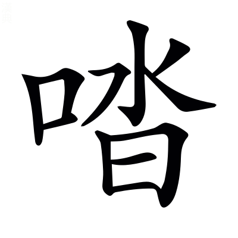
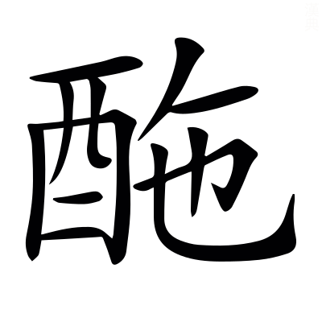

# 文選卷第二十三

> 梁昭明太子撰
> 
> 文林郎守太子右內率府錄事參軍事崇賢館直學士臣李善注上

詩丙

詠懷

## 詠懷詩十七首

五言。顏延年曰：說者阮籍在晉文代常慮禍患，故發此詠耳。

> 阮嗣宗臧榮緒晉書曰：阮籍，字嗣宗，陳留尉氏人也，容貌瑰傑，志氣宏放。蔣濟辟為掾，後謝病去，為尙書郎，遷步兵校尉卒。
> 
> 顏延年沈約等注

夜中不能寐，起坐彈鳴琴。薄帷鑑明月，清風吹我衿。廣雅曰：鑑，照也。

孤鴻號外野，朔鳥鳴北林。廣雅曰：號，鳴也。

徘徊將何見？憂思獨傷心。嗣宗身仕亂朝，常恐罹謗遇禍，因茲發詠，故每有憂生之嗟。雖志在刺譏，而文多隱避。百代之下，難以情測，故粗明大意，略其幽旨也。

---

二妃遊江濱，消遙順風翔。交甫懷環珮，婉孌有芬芳。猗靡情歡愛，千載不相忘。列仙傳曰：江~~妃~~婓二女[^23.1.1]出遊江濱，交甫遇之。餘與韓詩內傳同，已見南都賦。王逸楚辭注曰：在衣曰懷。毛萇詩傳曰：婉孌，少好貌。子虛賦曰：扶輿猗靡。

傾城迷下蔡，容好結中腸。漢書：李延年歌曰「一顧傾人城。」登徒子好色賦曰：臣東家之子，嘕然一笑，惑陽城，迷下蔡。

感激生憂思，諼草樹蘭房。膏沐為誰施？其雨怨朝陽。趙岐孟子章指曰：千載聞之，猶有感激。毛詩曰：焉得諼草，言樹之背。又曰：豈無膏沐，誰適為容？又曰：其雨其雨，杲杲出日。*鄭玄曰：人言其雨其雨，杲杲然日復出，猶我言伯且來，伯且來，則復不來也。*伯~~且~~，君子字[^23.1.2]。

如何金石交，一旦更離傷？沈約曰：婉孌則千載不忘，金石之交，一旦輕絕，未見好德如好色。〔善曰〕漢書曰：楚王使武涉說韓信曰：足下雖自以為與漢王為金石交，然今為漢王所禽矣。

---

嘉樹下成蹊，東園桃與李。顏延年曰：左傳「季孫氏有嘉樹。」〔善曰〕班固漢書李廣贊曰：諺曰「桃李不言，下自成蹊。」

秋風吹飛藿，零落從此始。沈約曰：風吹飛藿之時，蓋桃李零落之日，華實既盡，柯葉又彫，無復一毫可悅。〔善曰〕說文曰：藿，豆之葉也。楚辭曰：惟草木之零落。

繁華有憔悴，堂上生荊杞。言無常也。文子曰；有榮華者必有愁悴。班固答賓戲曰：朝為榮華，夕為憔悴。山海經曰：虖夕之山，下為荊杞。*郭璞曰：杞，枸杞。*

驅馬舍之去，去上西山趾。西山，夷齊所居，言欲從之以避世禍。

一身不自保，何況戀妻子？沈約曰：榮悴去就，此人本無保身之術，況復妻子者乎！

凝霜被野草，歲暮亦云已。沈約曰：歲暮風霜之時，徒然而已耳。〔善曰〕繁霜已凝，歲亦暮止。野草殘悴，身亦當然。楚辭曰：漱凝霜之紛紛。字書曰：凝，冰堅也。毛詩曰：歲聿云暮。蒼頡篇曰：已，畢也。

---

昔日繁華子，安陵與龍陽。史記：華陽夫人姉說夫人曰「不以繁華時樹本。」說苑曰：安陵君纏，得寵於楚恭王。江乙謂纏曰「吾聞以財事人者，財盡則交絕；以色事人者，華落則愛衰。子安得長被幸乎？」會王出獵，江渚有火若雲蜺，兕從南方來，正觸王驂，善射者射之，兕死於車下。王謂纏曰「萬歲後，子將誰與樂？」纏泣下沾衣曰「大王萬歲後，臣將殉。」恭王乃封纏車下三百戶。故江乙善謀，安陵善知時。龍陽君釣十餘魚而棄，因泣下。王曰「有所不安乎？」對曰「無。」王曰「然則何為涕出？」對曰「臣始得魚甚喜，後得益多，而又欲棄前之所得也。今以臣兇惡而得拂枕席，今爵至人君，走人於庭，避人於塗，四海之內，其美人甚多矣，聞臣之得幸於王，畢褰裳而趍王。臣亦曩之所得魚也，亦將棄矣，安得無涕出乎！」王乃布令「敢言美人者族。」

夭夭桃李花，灼灼有輝光。毛詩曰：桃之夭夭，灼灼其華。

悅懌若九春，磬折似秋霜。春秋元命苞曰：陽氣數成於三，故時別三月；陽數極於九，故三月一時九十日。*宋衷曰：四時皆象此類，不唯春也。*尙書大傳曰：諸侯來受命，周公莫不磬折。

流盻發姿媚，言笑吐芬芳。神女賦曰：陳嘉辭而云對，吐芬芳其若蘭。

攜手等歡愛，宿昔同衣裳。廣雅曰：宿，夜也。

願為雙飛鳥，比翼共翱翔。建安中無名詩曰：中有雙飛鳥，自名為鴛鴦。

丹青著明誓，永世不相忘。以財助人者，財盡則交絕；以色助人者，色盡則愛弛。是以嬖女不弊席，嬖男不弊輿。安陵君所以悲魚也[^23.1.3]，亦豈能丹青著誓，永代不忘者哉！蓋以俗衰教薄，方直道喪，攜手笑言，代之所重者，乃足傳之永代，非止恥會一時。故託二子以見其意，不在分桃斷袖，愛嬖之懽。丹青不渝，故以方誓。~~〔善曰〕~~東觀漢記[^23.1.4]：光武詔曰「明設丹青之信，廣開束手之路。」

---

天馬出西北，由來從東道。漢書曰：天馬來，從西極；涉流沙，九夷服。天馬來，歷無草；經千里，循東道。*張晏曰：馬從西而來東也。*沈約云：由西北來東道也。

春秋非有~~託~~訖[^23.1.5]，富貴焉常保？沈約曰：春秋相代，若環之無端，天道常也。譬如天馬本出西北，忽由東道；況富之與貧，貴之與賤，易至乎？〔善曰〕鄭玄禮記注曰：~~託~~訖，止也。

清露被皋蘭，凝霜霑野草。迅疾也。楚辭曰：皋蘭被徑兮斯露漸。凝霜，已見上文。古詩曰：白露沾野草。

朝為媚少年，夕暮成醜老。自非王子晉，誰能常美好？王子晉，已見上文。

---

登高臨四野，北望青山阿。應劭風俗通曰：葬於郭北北首，求諸幽之道。

松柏翳岡岑，飛鳥鳴相過。仲長子昌言曰：古之葬，植松柏梧桐以識其墳。

感慨懷辛酸，怨毒常苦多。蒼頡篇曰：懷，抱也。史記：太史公曰「怨毒之於人甚矣哉！」廣雅曰：毒，痛也。

李公悲東門，蘇子狹三河。求仁自得仁，豈復歎咨嗟！沈約曰：河南、河東、河北，秦之三川郡。古人呼水皆為河耳。蘇子以兩周之狹小，不足逞其志力，故去佩六國相印也。云二子豈不知進趨之近禍敗哉？常以交利貨賒禍，故冒而行之，所謂求仁得仁也。松柏岡岑，丘墓所在也。古有皆死之義，莫有免者焉。達者安小大之涯，各遂分內之樂，委天任命，以至於俱為一丘之土，夫何異哉！故因此望山阿而發此句，明徂謝之理雖同，夭逝之途則異也。感慨之來，誠逝者所不免，至於顛沛~~逆天~~道夭[^23.1.6]，怨毒求生，蘇子、李斯張本也。〔善曰〕李斯，已見西征賦。蘇秦，已見左太沖詠史詩。漢書：東方朔曰「漢興，去三河之地，止霸產以西。」論語：子貢曰「伯夷叔齊何人也？」子曰「古之賢人。」曰「怨乎？」曰「求仁而得仁，又何怨！」

---

開秋兆涼氣，蟋蟀鳴床帷。開秋，秋初開也。楚辭曰：開春發歲兮。四子講德論曰：蟋蟀候秋吟。毛詩曰：十月蟋蟀，入我床下。

感物懷殷憂，悄悄令心悲。古詩曰：感物懷所思。韓詩曰：耿耿不寐，如有殷憂。毛詩曰：憂心悄悄，慍于群小。

多言焉所告，繁辭將訴誰？沈約曰：重言之，猶云懷哉！懷哉！〔善曰〕論衡曰：甘議繁辭，終不見信。

微風吹羅袂，明月耀清暉。晨雞鳴高樹，命駕起旋歸。樂錄曰：雞鳴高樹顛。古辭。孔叢子：孔子歌曰「巾車命駕，將適唐都。」毛詩曰：薄言旋歸。

---

平生少年時，輕薄好絃歌。論語曰：久要不忘平生之言。范曄後漢書曰：光武曰「孝孫素謹，輕薄兒誤之。」孝孫，劉嘉字。

西遊咸陽中，趙李相經過。顏延年曰：趙，漢成帝趙后飛燕也；李，武帝李夫人也。並以善歌妙舞幸於二帝也。〔善曰〕史記曰：秦作咸陽，徙都也。

娛樂未終極，白日忽蹉跎。驅馬復來歸，反顧望三河。黃金百溢盡，資用常苦多。北臨太行道，失路將如何？少年之日，志好絃歌，及乎歲晚旋歸，路失財盡，同乎太行之子，當如之何乎？戰國策曰：魏王欲攻邯鄲，季梁聞之，中道而反，衣焦不信，頭塵不浴，往見王曰「今者臣來，見人於太行，乃北面而持其駕，告臣曰『我欲之楚。』臣曰『之楚將奚為北面？』曰『吾馬良。』臣曰『雖良，此非楚之道也。』曰『吾用多。』臣曰『雖多，此非之楚之路也。』曰『吾善御。』此數者逾善，而離楚逾遠耳。今王動欲成霸王，舉欲信於天下，恃王國之大，兵之精銳，而欲攻邯鄲，以廣地尊名，王之動逾數，而離王逾遠耳！猶至楚而北行也。」*高誘曰：面，向也。駕，馬也。之，至也。用，資也。*賈逵國語注曰：一溢，二十四兩。

---

昔聞東陵瓜，近在青門外。連軫距阡陌，子母相拘帶。五色曜朝日，嘉賓四面會。軫當為畛。宋衷太玄經注曰：畛，界也。說文曰：畛，井田間陌也。孔安國尙書傳曰：距，至也。子母、五色，俱謂瓜也。史記曰：邵平者，故秦東陵侯。秦破，為布衣，貧，種瓜於長安城東。瓜美，故時俗謂之東陵瓜，從邵平始也。漢書曰：霸城門，民間所謂青門也。毛詩曰：我有嘉賓。

膏火自煎熬，多財為患害。布衣可終身，寵祿豈足賴。沈約曰：當東陵侯侯服之時，多財爵貴；及種瓜青門，匹夫耳。寔由善於其事，故以味美見稱，連軫距陌，五色相照，非唯周身贍己，乃亦坐致嘉賓。夫得固易失，榮難久恃，膏以明自煎，人以財興累；布衣可以終身，豈寵祿之足賴哉！〔善曰〕莊子曰：山木自寇也，膏火自煎也。漢書：疏廣曰「愚而多財，則益其過。」左氏傳曰：石碏曰「四者之來，寵祿過也。」又宋華元曰「不能治官，敢賴寵乎？」

---

步出上東門，北望首陽岑。河南郡圖經曰：東有三門，最北頭曰上東門。河南郡境界簿曰：城東北十里首陽山，上有首陽祠一所。

下有采薇士，上有嘉樹林。沈約曰：夷齊尚不食周粟，況取之以不義者乎？〔善曰〕史記曰：武王平殷，伯夷叔齊恥之，義不食周粟，隱於首陽山，采薇而食之。顏延~~之~~年曰[^23.1.7]：史記龜策傳曰「無蟲曰嘉林。」

良辰在何許？凝霜霑衣襟。寒風振山岡，玄雲起重陰。沈約曰：良辰何許，言世路險薄，非良辰也。風霜交至，凋殞非一；玄雲重陰，多所擁蔽；是以寄言夷齊，望首陽而嘆息。〔善曰〕東征賦曰：撰良辰而將行。王仲宣詩曰：白露沾衣衿[^23.1.8]。

鳴鴈飛南征，鶗鴃發哀音。沈約曰：此鳥鳴則芳歇也。芬芳歇矣，所存者臰腐耳。〔善曰〕楚辭曰：鴈邕邕而南遊。又曰：恐鶗鴃之先鳴，使夫百草為之不芳。

素質遊商聲，悽愴傷我心。沈約曰：致此彫素之質，由於商聲用事秋時也。遊字應作由，古人字類無定也。〔善曰〕禮記曰：孟秋之月，其音商。*鄭玄曰：秋氣和則~~音~~商聲調[^23.1.9]。*

---

昔年十四五，志尚好書詩。論語：子曰「吾十有五而志于學。」杜預左氏傳注曰：尚，上之耳。

被褐懷珠玉，顏閔相與期。家語：子路問於孔子曰「有人於此，被褐而懷玉，何如？」子曰「國無道可也，國有道則袞冕而執玉也。」顏回，已見幽通賦。史記曰：閔損，字子騫。

開軒臨四野，登高望所思。丘墓蔽山岡，萬代同一時。方言曰：冢大者為丘。王逸楚辭注曰：小曰丘[^23.1.10]。

千秋萬歲後，榮名安所之？乃悮羨門子，噭噭今自蚩。沈約曰：自我以前，徂謝者非一，雖或稅駕參差，同為今日之一丘，夫豈異哉！故云萬代同一時也。若夫被褐懷玉，託好詩書；開軒四野，昇高永望；志事不同，徂沒理一，追悟羨門之輕舉[^23.1.11]，方自笑耳。〔善曰〕戰國策曰：楚王謂安陵君曰「寡人萬歲千秋之後，誰與樂此矣？」淮南子曰：死有遺業，生有榮名。薛綜西京賦注曰：安，焉也。史記曰：始皇使燕人盧生求羨門。韋昭曰：古仙人也。說文云：嗤，笑也。嗤與蚩同。

---

徘徊蓬池上，還顧望大梁。漢書地理志曰：河南開封縣東北有蓬池，或曰即宋蓬澤也。又陳留郡有浚儀縣，故大梁也。

綠水揚洪波，曠野莽茫茫。毛詩曰：率彼曠野。楚辭曰：莽茫茫之無涯。*毛萇曰：茫茫，廣大貌。*

走獸交橫馳，飛鳥相隨翔。是時鶉火中，日月正相望。左氏傳曰：晉侯伐虢，公問卜偃曰「吾其濟乎？」對曰「剋之，其九月十月之交乎？鶉火中，必是時也。」*杜預曰：夏之九月十月也。*尙書曰：惟二月既望。*孔安國曰：十五日，日月相望也。*

朔風厲嚴寒，陰氣下微霜。爾雅曰：朔，北方也。杜預左氏傳注曰：厲，猛也。曾子曰：陰氣騰則凝為霜。

羈旅無疇匹，俛仰懷哀傷。左氏傳曰：陳敬仲曰「羈旅之臣也。」

小人計其功，君子道其常。豈惜終憔悴，詠言著斯章。沈約曰：豈惜終憔悴，蓋由不應憔悴而致憔悴，君子失其道也。小人計其功而通，君子道其常而塞，故致憔悴也。因乎眺望多懷，兼以羈旅無匹，而發此詠。〔善曰〕孫卿子曰：天有常道，君子有常體；君子道其常，小人計其功。

---

炎暑惟茲夏，三旬將欲移。南方為火而主夏，火性炎上，故謂夏月為炎暑也。薛君韓詩章句曰：惟，辭也。鄭玄毛詩箋曰：炎，熱氣也。

芳樹垂綠葉，清雲自逶迤。淮南子曰：志厲清雲。楚辭曰：載雲旗之逶迤。

四時更代謝，日月遞差馳。孫卿子曰：日月遞照，四時代御。

徘徊空堂上，忉怛莫我知。毛詩曰：勞心忉忉。又曰：勞心怛怛。楚辭曰：國無人兮莫我知。

願睹卒歡好，不見悲別離。言四時代移，日月遞運，年壽將盡，而人莫己知。恐被讒邪，橫遭擯斥，故云願卒歡好，不見離別。

---

灼灼西隤日，餘光照我衣。楚辭曰：日杳杳而西頹。

迴風吹四壁，寒鳥相因依。周周尚銜羽，蛩蛩亦念飢。韓子曰：鳥有周周者，首重而屈尾，將欲飲於河則必顛，乃銜羽而飲。今人之所有飢不足者，不可以不索其羽矣。爾雅曰：西方有比肩獸焉，與邛邛岠虛比，為邛邛岠虛齧甘草；即有難，邛邛岠虛負而走，其名謂之蟨。*郭璞曰：蟨音厥。*

如何當路子，磬折忘所歸？豈為夸譽名，憔悴使心悲。沈約曰：天寒，即飛鳥走獸尚知相依，周周銜羽以免顛仆，蛩蛩負蟨以美草[^23.1.12]，而當路者知進趍，不念暮歸，所安為者，惟夸譽名，故致憔悴而心悲也。〔善曰〕孟子：公孫丑問曰「夫子當路於齊，管晏之功，可復許乎？」*綦母邃曰：當仕路也。*磬折，已見上文。呂氏春秋曰：古之人有不肯富貴者，由重生故也；非夸以名也，為其實也。司馬彪莊子注曰：夸虛名也。鄭玄禮記注曰：名，令聞也。

寧與燕雀翔，不隨黃鵠飛。黃鵠遊四海，中路將安歸？沈約曰：若斯人者，不念己之短翮，不隨燕雀為侶，而欲與黃鵠比遊。黃鵠一舉沖天，翱翔四海，短翮追而不逮，將安歸乎？為其計者，宜與燕雀相隨，不宜與黃鵠齊舉。〔善曰〕漢書：息夫躬絕命辭曰「玄雲~~決~~泱鬱[^23.1.13]將安歸。」

---

獨坐空堂上，誰可與歡者？出門臨永路，不見行車馬。登高望九州，悠悠分曠野。孤鳥西北飛，離獸東南下。日暮思親友，晤言用自寫。毛詩曰：彼美淑姬，可與晤言。*鄭玄曰：晤，對也。*

---

北里多奇舞，濮上有微音。史記曰：紂使師涓作新聲北里之舞。禮記曰：桑間濮上之音，亡國之音也。

輕薄閑遊子，俯仰乍浮沈。捷徑從狹路，僶俛趣荒淫。輕薄之輩，隨俗浮沈，棄彼大道，好從狹路，不尊恬淡，競赴荒淫；言可悲甚也。漢司馬遷書曰：從俗浮沈，與時俯仰。

焉見王子喬，乘雲翔鄧林。獨有延年術，可以慰我心。子喬離俗以輕舉，全性以保真。其人已遠，故云焉見，其法不滅，故云可慰心。楚辭云：譬若王喬之乘雲兮，載赤雲而陵太清。山海經曰：夸父與日競逐而渴死，其杖化為鄧林。楚辭曰：延年不死兮壽何所止？方言曰：延，長也。毛詩曰：仲山父永懷，以慰其心。*毛萇曰：慰，安也。*

---

湛湛長江水，上有楓樹林。楚辭曰：湛湛江水兮上有楓~~樹~~[^23.1.14]。

皋蘭被徑路，青驪逝駸駸。皋蘭，已見上文。楚辭曰：青驪結駟齊千乘。毛詩曰：駕彼駟牡[^23.1.15]，載驟駸駸。*毛萇曰：駸駸，驟貌。*駸，七林切。

遠望令人悲，春氣感我心。三楚多秀士，朝雲進荒淫。孟康漢書注曰：舊名江陵為南楚，吳為東楚，彭城為西楚。呂氏春秋曰：舜耕於歷山，秀士從之。高唐賦曰：妾旦為朝雲。

朱華振芬芳，高蔡相追尋。一為黃雀哀，涕下誰能禁？戰國策曰：劇辛諫楚王曰[^23.1.16]「郢必危矣，王獨不見黃雀，俯啄白粒，仰栖茂樹，鼓翅奮翼，自以為與人無爭；不知夫公子王孫，左挾彈，右攝丸，以其頸為的，晝遊茂樹，夕調酸鹹耳。黃雀其小者也，蔡聖侯因是已南遊高陂，北陵巫山，飲茹溪之流，食湘波之魚，左視幼妾，右擁嬖女，與之馳騁乎高蔡之中，而不以國家為事；不知夫子發受命于宣王，繫己以朱絲而見之也。蔡聖侯之事其小者也，君王自因是已左州侯，從鄢陵與壽陵君，飯封祿之粟，載方府之金，與之馳乎雲夢之中，而不以天下國家為事；不知夫穰侯方謀受命乎秦王，填澠池之塞內，投己澠池塞之外。」襄王聞，顏色變，四體戰慄，於是乃執珪中授之，封以為陽陵君。延叔堅戰國策論曰：因是已，因事已復有是也。茹谿，谿流所沃者美好也。孔叢子：賈子陽謂子思曰「吾念周室將滅，涕泣不禁。」禁，止也。

---

[^23.1.1]: 考異：注「江妃二女」：袁本「妃」作「婓」。案：「婓」字是也。江賦注所引正作「婓」。以吳都賦證之，善「婓」，五臣「妃」，說已見前。此詩蓋善亦作「婓」，因正文為五臣所亂，并改此注為「妃」，益誤。茶陵本作「妃」，誤與尤本同。

[^23.1.2]: 考異：注「伯且君子字」：何校云「且」字衍，陳同，是也。各本皆衍。

[^23.1.3]: 考異：注「安陵君所以悲魚也」：案：「以」字下有脫文。各本皆然，無可據補也。

[^23.1.4]: 考異：注「善曰東觀漢記」：袁本、茶陵本無「善曰」二字。陳云二字衍。何校於此節注首添「沈約曰」三字。今案：陳據別本，蓋是也。何以意添，非。

[^23.1.5]: 考異：春秋非有託：茶陵本云五臣作「訖」。袁本作「訖」，云善作「託」。案：各本所見皆非也。善引鄭禮記注「訖，止也」，可見亦作「訖」。沈約曰「春秋相代，若環之無端，所謂非有訖矣」，作「託」，但傳寫偽。今各本并注中亦偽「託」。考所引即禮記「祭統訖其嗜欲」注之「訖，猶止也」，不得為「託」，明甚。

[^23.1.6]: 考異：注「至於顛沛逆天」：袁本、茶陵本「逆天」作「道夭」，是也。

[^23.1.7]: 考異：注「顏延之曰」：何校「之」改「年」。案：以前後例之，是也。各本皆偽。

[^23.1.8]: 考異：注「白露沾衣」：案：「衣」下當有「衿」字。各本皆脫。此所引七哀詩也。

[^23.1.9]: 考異：注「則音聲調」：案：「音」當作「商」。各本皆偽。

[^23.1.10]: 考異：注「王逸楚辭注曰小曰丘」：此九字袁本、茶陵本無。案：尤本是也。所引在七諫，沈、江二本脫去之。

[^23.1.11]: 考異：注「追悟羨門之輕舉」：袁本、茶陵本「悟」作「悞」。案：善「悞」，五臣「悟」，二本校語有明文。善所載沈約注，自不當作「悟」，又正文何、陳皆從五臣「悟」，但未必非阮借「悞」為「悟」。當仍其舊。

[^23.1.12]: 考異：注「蛩蛩負蟨以美草」：案：「以」下少一字。各本皆脫，無可據補。陳云脫「求」字，但以意添耳。

[^23.1.13]: 考異：注「玄雲決鬱」：案：「決」當作「泱」。各本皆偽。顏注漢書「音烏朗反」。

[^23.1.14]: 考異：注「上有楓樹」：陳云「樹」字衍，是也。各本皆衍。

[^23.1.15]: 考異：注「駕彼駟牡」：陳云「牡」當作「駱」。各本皆作「牡」。今案：毛詩作「四駱」，但恐李所據本異，未可輒改。凡注中各本既同，而引書與今所行差互疑不能明者，皆準此，不悉出。其異本尚可考，亦不悉出。唯顯知傳寫之誤，乃訂正之。

[^23.1.16]: 考異：注「劇辛諫楚王曰」：茶陵本「劇」作「莊」。案：「莊」，非也。依今本戰國策改耳。袁本作「劇」，與此同。恐善自如此，為所據異本也。

## 秋懷

五言

> 謝惠連

平生無志意，少小嬰憂患。平生，已見上文。說文曰：嬰，繞也。

如何乘苦心，矧復值秋晏。古詩曰：晨風懷苦心。淮南子曰：秋士哀也。

皎皎天月明，弈弈河宿爛。古詩曰：明月何皎皎。薛君韓詩章句曰：弈弈，盛貌。毛詩曰：子興視夜，明星有爛。

蕭瑟含風蟬，寥唳度雲鴈。楚辭曰：秋之為氣也，蕭瑟兮草木搖落而變衰。

寒商動清閨，孤燈曖幽幔。寒商，秋風也。楚辭曰：商風肅而害之，百草育而不長。王逸楚辭注曰：曖曖，闇昧貌。

耿介繁慮積，展轉長宵半。楚辭曰：獨耿介而不隨。毛詩曰：展轉反側。

夷險難豫謀，倚伏昧前筭。夷險，謂道，以喻時也。演連珠曰：才經夷險，不為世屈。淮南子曰：接徑歷遠，直道夷險。鶡冠子曰：禍兮福之所倚，福兮禍之所伏。

雖好相如達，不同長卿慢。達，謂通達不拘禮也。嵇康高士傳司馬長卿讚曰：長卿慢世，越禮自放；犢鼻居市，不恥其狀。託疾避患，蔑~~比~~此卿相[^23.2.1]。乃~~至仕~~賦大人[^23.2.2]，超然莫尚。

頗悅鄭生偃，無取白衣宦。偃，謂偃仰不仕也。范曄後漢書曰：鄭均，字仲虞，東平任城人也，公車特徵，再遷尙書，後病乞骸骨，拜議郎告歸，因稱病篤。帝東巡過任城，乃幸均舍，敕賜尙書祿以終其身，故人號為白衣尙書。

未知古人心，且從性所翫。賓至可命觴，朋來當染翰。秋興賦序曰：染翰操紙，慨然而賦。

高臺驟登踐，清淺時陵亂。爾雅曰：水正絕流曰亂。

頹魄不再圓，傾羲無兩旦。魄，月魄也。羲，羲和，謂日也。

金石終消毀，丹青暫彫煥。張綱集曰：書功金石，圖形丹青。

各勉玄髮歡，無貽白首歎。阮籍詠懷詩曰：玄髮發朱顏，睇眄有光華。嵇康有白首賦。

因歌遂成賦，聊用布親串。爾雅曰：串，習也；古患切。

---

[^23.2.1]: 考異：注「蔑比卿相」：案：「比」當作「此」。世說新語「品藻」注引可證。各本皆偽。何、陳校改為「彼」，誤也。

[^23.2.2]: 考異：注「乃至仕人」：陳云「至仕」當作「賦大」，見世說注，是也。各本皆誤。

臨終

## 臨終詩

五言

> 歐陽堅石[^23.3.1]王隱晉書曰：石崇外生歐陽建，渤海人也，為馮翊太守。趙王倫之為征西，撓亂關中，建每匡正，不從私欲，由是有隙。及乎倫篡立，勸淮南王允誅倫，未行，事覺，倫收崇建及母妻，無少長，皆行斬刑。孫盛晉陽秋曰：建字堅石，臨刑作。

伯陽適西戎，子欲居九蠻。列仙傳曰：老子西遊，尹喜見之，與老子俱之流沙之西。魏武飲馬長城窟行曰：四~~時~~皓隱南山[^23.3.2]，子欲適西戎。論語曰：子欲居九夷。

苟懷四方志，所在可遊盤。左氏傳：姜氏謂晉公子曰「子有四方之志。」尙書曰：乃盤遊無度。

況乃遭屯蹇，顛沛遇災患`平聲`。周易曰：屯如邅如。又曰：往蹇來連。孔叢子：歌曰「遂邇不復，自嬰屯蹇。」論語：子曰「顛沛必於是。」

古人達機兆，策馬遊近關。周易曰：機者動之微，吉之先見者也。左氏傳：蘧伯玉曰「瑗不得聞君之出，敢聞其入。」遂行，從近關出也。

咨余沖且暗，抱責守微官。孔安國尙書傳曰：沖，童也。賈逵國語注曰：暗，不明也。孟子曰：吾聞有官守者，不得其職則去；有言責者，不得其言則去。

潛圖密已構，成此禍福端。爾雅曰：圖，謀也。莊子曰：而子身若槁木之枝，而心若死灰，若是禍亦不至，福亦不來，禍福無有，惡有人災。枚叔上吳王書曰：福生有基，禍生有胎。傅子曰：福生有兆，禍來無端。方言曰：端，緒也。

恢恢六合間，四海一何寬！天網布紘綱，投足不獲安。老子曰：天網恢恢，疏而不失。山海經曰：地之所載，六合之間。許慎淮南子注曰：紘，維也。解嘲曰：欲行者擬足而投跡。

松柏隆冬悴，然後知歲寒。孫卿子曰：松柏經冬而不彫。論語：子曰「歲寒然後知松柏之後彫。」

不涉太行險，誰知斯路難？淮南子曰：何為九山？曰「太行羊腸。」*高誘曰：太行，今上黨太行、河內野王縣。*

真偽因事顯，人情難豫觀。窮達有定分，慷慨復何歎`平聲`？孟子曰：窮則獨善其身，達則兼善天下。呂氏春秋曰：百里奚處虞而虞亡，處秦而秦霸，有其本也。其本也者，定分之謂也。

上負慈母恩，痛酷摧心肝。說文曰：負，受貨不償。然受恩不報亦謂之負也。方言曰：傳云「慈母怒子，折葼以笞之。」

下顧所憐女，惻惻中心酸。鄭玄毛詩箋曰：顧，念也。

二子棄若遺，念皆遘凶殘。毛詩曰：將安將樂，棄余如遺。

不惜一身死，惟此如循環。薛君韓詩章句曰：惟，念也。尙書大傳曰：三王之統，若循連環，周則復始也。

執紙五情塞，揮筆涕汍瀾。文子曰：昔者中黃子曰「色有五~~色文~~章[^23.3.3]，人有五情。」漢書：息夫躬絕命辭曰「涕泣流兮萑蘭。」*瓚曰：萑蘭，涕泣闌干。*萑與汍同。

---

[^23.3.1]: 考異：歐陽堅石：案：此不得在謝惠連下，當是臨終自為一類。尤、袁、茶陵各本皆不分，蓋傳寫有誤。又案：俗行汲古閣本反不誤，乃毛自改之耳，非別有本也。凡彼僅有是者，餘均不置論，為舉例如此。

[^23.3.2]: 考異：注「四時隱南山」：何校「時」改「皓」，陳同。各本皆偽。

[^23.3.3]: 考異：注「色有五色文章」：案：「色文」二字不當有。各本皆衍。

哀傷

## 幽憤詩

四言。魏氏春秋曰：康及呂安事，為詩自責。呂安事，已見思舊賦。班固史遷述曰：幽而發憤，乃思乃精。

> 嵇叔夜

嗟余薄祜，少遭不造。蔡邕書曰：邕薄祜，早喪二親。毛詩曰：閔予小子，遭家不造。*鄭玄曰：造，成也。不造，言家道未成也。*

哀煢靡識，越在繈褓。左氏傳：后成叔曰[^23.4.1]「聞君越在他境。」淮南子曰：成王幼在繈褓之中。張華博物志曰：繈，織縷為之，廣八寸，長丈二，以約小兒於背上。韋昭漢書注曰：褓，若今時小兒腹衣。李奇曰：褓，小兒大藉也。

母兄鞠育，有慈無威。嵇氏譜曰：康兄喜，字公穆，歷徐揚州刺史，太僕，宗正卿。母孫氏。毛萇詩傳曰：鞠，養也。毛詩曰：父兮生我，母兮鞠我。

恃愛肆姐，不訓不師。賈逵國語注曰：肆，恣也。說文曰：姐，嬌也。嬌與姐同耳。姐，子豫切。

爰及冠帶，馮寵自放[^23.4.2]。抗心希古，任其所~~尚~~上[^23.4.3]。廣雅曰：希，庶也。趙岐孟子章句曰：各崇所尚，則義不虧矣。說文曰：尚，庶幾也。

託好老莊，賤物貴身。嵇喜謂康長好老莊之業，恬靜無欲。淮南子曰：原道者，欲一言之而寤，則尊天而保真；欲再言之而通，則賤物而貴身也。~~莊子曰：真者，精誠之志。~~[^23.4.4]

志在守樸，養素全真。老子曰：見素抱樸，少私寡欲。*河上公曰：抱，守也。*薛綜東京賦注曰：樸，質也。莊子：盜跖謂孔子曰「子之道，非可以全真者也。」又曰：真者，精誠之~~志~~至也[^23.4.5]。

曰余不敏，好善闇人。謂與呂安交也。孝經曰：參不敏，何足以知之？左傳曰：吳公子札來聘，見叔孫穆子曰「子好善而不能擇人也。」

子玉之敗，屢增惟塵。子玉，楚大夫也。左氏傳曰：楚子將圍宋，使子文治兵於睽，終朝而畢，不戮一人。子玉復治兵於蒍，終日而畢，鞭七人，貫三人耳。國老皆賀子文，子文飲之酒，蒍賈尚幼，後至，不賀。子文問之，對曰「不知所賀。子之傳政於子玉，子玉之敗，子之舉也；舉以敗國，將何賀焉？」毛詩曰：無將大車，維塵冥冥。*鄭玄曰：喻大夫進舉小人，適自作憂患也。*

大人含弘，藏垢懷恥。周易曰：含弘光大，品物咸亨。左氏傳：伯宗謂晉侯曰「國君含垢。」~~說文曰：懷，藏也。~~*杜預曰：忍垢恥也。*說文曰：懷，藏也。[^23.4.6]

民之多僻，政不由己。毛詩曰：民之多僻，無自立辟。*鄭玄曰：民行多邪僻者，汝君臣之過，無自謂得法度。*論語曰：為仁由己。

惟此褊心，顯明臧否。褊心，康自謂也。郭璞爾雅注曰：惟，發~~論~~語辭也[^23.4.7]。毛詩曰：惟是褊心，是以為刺。又曰：於乎小子，未知臧否。

感悟思愆，怛若創痏。西京賦曰：所惡成創痏。蒼頡篇曰：痏，毆傷也。方言曰：怛，痛也。說文曰：痏，瘢也。漢書音義曰：以杖毆擊人，剝其皮膚，起青黑無創者，謂疻痏。

欲寡其過，謗議沸騰。論語曰：蘧伯玉使人於孔子，孔子問焉，曰「夫子何為？」對曰「夫子欲寡其過而未能也。」漢賈山曰：古者庶人謗於道，商旅議於市。毛詩曰：百川沸騰。

性不傷物，頻致怨憎。莊子：仲尼謂顏回曰「聖人處物不傷者，物亦不能傷也。」

昔慚柳惠，今愧孫登。柳下惠，已見西征賦。魏氏春秋曰：初康采藥於中山北，見隱者孫登，康欲與之言，登默然不對。踰年將去，康曰「先生竟無言乎？」登乃曰「子才多識寡，難乎免於今之世也。」

內負宿心，外恧良朋。鄭玄禮記注曰：負之言背也。趙壹報羊陟書曰：惟君明叡，平其宿心。爾雅曰：恧，慚也。毛詩曰：每有良朋。

仰慕嚴鄭，樂道閑居。漢書曰：谷口有鄭子真，蜀有嚴君平，皆脩身保性。成帝時，元舅王鳳以禮聘子真，子真遂不詘而終。君平卜筮於成都市，以為卜筮賤業，而可以惠眾，日閱數人，得百錢，足以自養，則閉肆下簾而授老子。年九十餘，遂以其業終。論語：子曰「貧而樂。」漢書曰：司馬相如稱疾閑居。

與世無營，神氣晏如。蔡邕釋誨曰：安貧樂賤，與世無營。淮南子曰：古人神氣不蕩於外。漢書曰：楊雄室亡儋石之儲，猶晏如也。

咨予不淑，嬰累多虞。毛萇詩傳曰：咨，嗟也。毛詩曰：之子不淑，云如之何。左氏傳：趙孟曰「以晉國之多虞。」

匪降自天，寔由頑疏。毛詩曰：下民~~為~~之孽[^23.4.8]，匪降自天。噂背增，職競由人。

理弊患結，卒致囹圄。杜預左氏傳注曰：弊，壞也。禮記曰：仲春，省囹圄。*鄭玄曰：所以守禁繫者。秦曰囹圄，漢曰獄。*

對答鄙訊，縶此幽阻。言己對答之辭鄙於見訊也。張晏漢書曰：訊者，三日復問，知之與前辭同不也。杜預左氏傳注曰：縶，拘執也。鄙，俚也。訊，問也。

實恥訟免，時不我與。論語曰：陽貨曰「日月逝矣，歲不我與。」文雖出此，而意微殊，亦不以文害意也。免或為冤，非也。

雖曰義直，神辱志沮。毛萇詩傳曰：沮，壞也；才與切。

澡身滄浪，豈云能補。孟子：孺子歌曰「滄浪之水清，可以濯吾纓；滄浪之水濁，可以濯吾足。」孔子曰「小子聽之，清斯濯纓，濁斯濯足，自取之也。」劉歆答父書曰：誠思拾遺，冀以云補。

嗈嗈鳴鴈，奮翼北遊。順時而動，得意忘憂。毛詩曰：雍雍鳴鴈。管子：桓公曰「夫鴻鵠有時而南，有時而北。」又曰：鴻鵠秋南而不失時，

嗟我憤歎，曾莫能儔。毛詩曰：嗟我懷人。說文曰：曾，辭之舒也。儔，等也。

事與願違，遘茲淹留。淹留，謂囚縶而留也。爾雅曰：淹留，久也。

窮達有命，亦又何求。王命論曰：窮達有命，吉凶由人。毛詩曰：謂我何求。

古人有言，善莫近名。莊子曰：為善莫近名，為惡莫近~~刑~~形[^23.4.9]。*司馬彪曰：勿脩名也。被褐懷玉，穢惡其身，以無陋於形也。郭象曰：忘善惡而居中，任萬物之自為也。*

奉時恭默，咎悔不生。尙書曰：恭默思道。周易曰：悔吝者，憂虞之象也。曾子曰：懽欣忠信，咎故不生，可為孝矣。

萬石周慎，安親保榮。漢書曰：萬石君奮長子建為郎中令，建老白首，萬石君尚無恙，每五日洗沐歸謁親。建為郎中令，奏事，事下，建自讀之，驚恐曰「書馬者與尾而五，今迺四，不足一，獲譴死矣。」其為謹慎，雖他皆如此。論語摘輔像讖曰：曾子未嘗不問安親之道也。孔安國尙書注曰：周，至也。

世務紛紜，祗攪予情。漢書曰：嚴安徐樂上書言世務。毛詩曰：祗攪我心。攪，亂也。祗，適也。

安樂必誡，乃終利貞。家語：金人銘曰「安樂必戒，無行所悔。」*王肅曰：雖處安樂，必警戒也。*周易曰：乾，元亨利貞。

煌煌靈芝，一年三秀。西京賦曰：擢靈芝之朱柯。楚辭曰：采三秀於山間。*王逸曰：三秀，謂芝草也。*

予獨何為，有志不就。楚辭曰：云有志而無謗。爾雅曰：就，成也。

懲難思復，心焉內疚。潘元茂九錫文曰：懲難念功。毛詩曰：既往既來，我心永疚。疚，病也。

庶勗將來，無馨無臭。爾雅曰：勗，勉也。毛詩曰：上天之載，無聲無臭。

采薇山阿，散髮巖岫。采薇，已見上文。琴操：許由曰「散髮優遊，所以安己不懼也。」范曄後漢書曰：袁閎散髮絕世。

永嘯長吟，頤性養壽。杜篤連珠曰：能離光明之顯，長吟永嘯。爾雅曰：頤，養也。東方朔非有先生論曰：故養性受命之士莫肯進。禮記曰：百年曰期頤。*鄭玄曰：頤猶養也。*

---

[^23.4.1]: 考異：注「后成叔曰」：陳云「后」當作「郈」。今案：「后」即「郈」也。檀弓「后木」鄭注曰：「魯孝公子惠伯鞏之後。」正義曰：「案世本，孝公生惠伯革，其後為厚氏。」世本云「革」，此云「鞏」，世本云「厚」，此云「后」，其字異耳。春秋名號歸一圖曰：厚成叔後改為「郈」，皆可證。冊魏公九錫文引作「厚」。

[^23.4.2]: 考異：爰及冠帶馮寵自放：袁、茶陵二本有校語云善無此二句。案：二本所見非也。此與下二句為韻，善不容無，但傳寫脫去。又其下當有善注，為脫去一節也。尤本有者是。然恐屬據五臣校補，尚少善注耳。

[^23.4.3]: 考異：任其所尚：袁本、茶陵本有校語云善作上注「各崇所尚」。二本「尚」皆作「上」。案：善下注又云「說文曰，尚，庶幾也」。不作「上」字。尤本以此校改。然恐善注未全，或於末元有注「上」「尚」異同之語，而今失之。

[^23.4.4]: 考異：注「莊子曰真者精誠之志」：陳云此九字衍，觀下注自明，是也。各本皆衍。

[^23.4.5]: 考異：注「精誠之志也」：袁本「志」作「至」，是也。茶陵本亦誤「志」。

[^23.4.6]: 考異：注「說文曰懷藏也杜預曰忍垢恥也」：陳云「說文」下六字當在杜注下，是也。各本皆倒。

[^23.4.7]: 考異：注「發論辭也」：何校「論」改「語」，是也。各本皆誤。

[^23.4.8]: 考異：注「下民為孽」：陳云「為」，「之」誤。今案：各本皆然。疑李所據與今本作「之」者異。下「尊沓背增」，今本作「憎」，又「我心永疚」，今本作「使我心疚」，皆放此，餘不悉出。

[^23.4.9]: 考異：注「為惡莫近刑」：案：「刑」當作「形」，詳下注。司馬彪本作「形」字也。各本皆誤。

## 七哀詩

五言

> 曹子建贈答，子建在仲宣之後，而此在前，誤也。

明月照高樓，流光正徘徊。夫皎月流輝，輪無輟照，以其餘光未沒，似若徘徊，前覺以為文外傍情，斯言當矣。

上有愁思婦，悲歎有餘哀。古詩曰：慷慨有餘哀。

借問歎者誰？言是客子妻。君行踰十年，孤妾常獨棲。君若清路塵，妾若濁水泥。漢書：民歌曰「涇水一石，其泥數斗。」

浮沈各異勢，會合何時諧？爾雅曰：諧，和也。

願為西南風，長逝入君懷。古詩曰：從風入君懷，四坐莫不嘆。

君懷良不開，賤妾當何依？史記：驪姬曰「以賤妾之故，廢嫡立庶。」

## 七哀詩二首

五言

> 王仲宣

西京亂無象，豺虎方遘患。左氏傳：晉侯問於士弱曰「吾聞之宋災，於是乎知有天道，可必乎？」對曰「國亂無象，不可知也。」班固漢書張耳陳餘述曰：據國爭權，還為豺虎。遘與構同，古字通也。道經曰：執大象，天下往。*河上公注曰：執，守也。象，道也。聖人守大道，則天下萬民移心歸往也。*

復棄中國去，遠身適荊蠻。荊蠻，已見登樓賦。毛詩曰：蠢爾蠻荊。*毛萇曰：蠻荊，荊州之蠻也。*

親戚對我悲，朋友相追攀。出門無所見，白骨蔽平原。路有飢婦人，抱子棄草間。顧聞號泣聲，揮涕獨不還。言迴顧雖聞其子號泣之聲，但知揮涕獨去，不復還視也。家語曰：文伯卒，敬姜曰「二三婦無揮涕。」*王肅曰：揮涕，不哭揮涕，以手揮之也。*

未知身死處，何能兩相完？此婦人之辭也。說文曰：完，全也。

驅馬棄之去，不忍聽此言。南登霸陵岸，迴首望長安。漢書曰：文帝葬霸陵。

悟彼下泉人，喟然傷心肝。毛詩序曰：下泉，思治也。曹人思明王賢伯也。

---

荊蠻非我鄉，何為久滯淫？國語曰：底著滯淫。*賈逵曰：淫，久也。*

方舟溯大江，日暮愁我心。爾雅曰：大夫方舟。*郭璞曰：併兩舡也。*爾雅曰：逆流而上曰溯流。

山崗有餘暎，巖阿增重陰。通俗文曰：日陰曰暎。

狐狸馳赴穴，飛鳥翔故林。皆言不忘本也。文子曰：鳥飛之鄉，依其所主也。楚辭曰：鳥飛之故鄉，狐死必首丘。

流波激清響，猴猿臨岸吟。迅風拂裳袂，白露霑衣衿。楚辭曰：擊迅風於清涼。禮記曰：孟秋之月白露降。說苑曰：孺子不覺露之沾衣。

獨夜不能寐，攝衣起撫琴。漢書曰：沛公起攝衣，延酈食其也。韓子曰：師涓靜坐撫琴。

絲桐感人情，為我發悲音。史記曰：騶忌以鼓琴見齊威王，王曰「夫治國家何為絲桐之間也。」

羈旅無終極，憂思壯難任。羈旅，已見上文。

## 七哀詩二首

五言

> 張孟陽臧榮緒晉書曰：張載，字孟陽，武邑人也，有才華。起家拜著作佐郎，稍遷領著作，遂稱疾，抽簪告歸。卒於家。

北芒何壘壘，高陵有四五。廣雅曰：壘，重也。古樂府詩曰：還望故鄉，鬱何壘壘。北芒，山名也。壘壘，塚相次之貌。

借問誰家墳？皆云漢世主。恭文遙相望，原陵鬱膴膴。范曄後漢書曰：葬孝安皇帝于恭陵。又曰：葬靈帝于文陵。又曰：葬光武皇帝于原陵。毛萇曰：膴膴，肥美也。

季世喪亂起，賊盜如豺虎。左氏傳曰：叔向曰「齊其何如？」晏子曰「此季世也。」*韋昭國語注曰：季，末也。*豺虎，已見上文。

毀壤過一抔，便房啟幽戶。一抔，喻少也。漢書：張釋之曰「假令愚人取長陵一抔土，何如？」漢書注曰：便房，冢壙中室也。

珠柙離玉體，珍寶見剽虜。魏文帝典論曰：喪亂以來，漢氏諸陵，無不發掘，至乃燒取玉柙金鏤，體骨并盡。西京雜記曰：漢帝及王侯送死，皆珠襦玉匣，玉匣形如鎧甲，連以金鏤。枚乘七發曰：太子玉體不安。說文曰：剽，劫人也。又，虜，獲也。漢書注曰：虜與鹵同。如淳曰：鹵，鈔掠也。

園寢化為墟，周墉無遺堵。漢書曰：自高祖下至宣帝，各自居陵傍立廟，又園中各有寢便殿。又曰：自貢禹建迭毀之議，遂毀惠景廟及太上寢園，廢而為墟。爾雅曰：牆謂之墉。毛萇詩傳曰：一丈為板，五板為堵。

蒙籠荊棘生，蹊逕登童豎。狐兔窟其中，蕪穢不復掃。關中記曰：漢諸陵守衛掃除。廣雅曰：掃，除也。餘見下注。掃，蘇老切。

頹隴並墾發，萌隸營農圃。蒼頡篇曰：墾，耕也。毛詩曰：俊發爾私。*鄭玄曰：俊，疾也。發，伐也。疾耕發其私田也。*司馬相如上林賦曰：地可墾闢，悉為農郊，以贍萌隸。

昔為萬乘君，今為丘山土。漢書曰：天子畿方千里，兵車萬乘，故稱萬乘之主。方言曰：冢大者為丘。淮南子曰：吾死也，有一棺之土。

感彼雍門言，悽愴哀往古。桓子新論曰：雍門周以琴見孟嘗君曰「臣竊悲千秋萬歲後，墳墓生荊棘，狐兔穴其中，樵兒牧豎躑䠱而歌其上，行人見之悽愴；孟嘗君之尊貴，如何成此乎！」孟嘗君喟然嘆息，淚下承睫。

---

秋風吐商氣，蕭瑟掃前林。王逸楚辭注曰：商風，西風也。秋氣起則西風急疾。鸚鵡賦曰：涼風蕭瑟。

陽鳥收和響，寒蟬無餘音。陽鳥，春鳥也。禮記曰：孟秋，寒蟬鳴。蔡邕月令章句曰：寒蟬應陰而鳴[^23.7.1]，鳴則天涼，故謂之寒蟬。楚辭曰：蟬寂寞而無聲。

白露中夜結，木落柯條森。呂氏春秋曰：秋氣至則草木落。

朱光馳北陸，浮景忽西沈。朱光，日也。楚辭曰：陽杲杲其朱光。續漢書云：日行北陸謂之冬。杜預左氏傳注曰：陸，道也。孔安國尙書注曰：浮，行也。說文曰：景，日光也。

顧望無所見，惟睹松柏陰。松柏，丘墓，已見上文。

肅肅高桐枝，翩翩栖孤禽。禮記曰：草木皆肅。*鄭玄曰：肅，謂枝葉縮栗也。*

仰聽離鴻鳴，俯聞蜻蛚吟。易通卦驗曰：立秋，蜻蛚鳴。蔡邕月令章句曰：蟋蟀，蟲名，俗謂之蜻蛚。蟋蟀吟，已見上文注。蜻音精。蛚音列。

哀人易感傷，觸物增悲心。秦嘉答婦詩曰：哀人易感傷。

丘隴日已遠，纏綿彌思深。古詩曰：相去日已遠。張升與任彥堅書曰：纏綿恩好，庶蹈高蹤。

憂來令髮白，誰云愁可任。古詩曰：座中何人，誰不懷憂。令我白頭。登樓賦曰：誰憂思之可任。

徘徊向長風，淚下霑衣衿。楚辭曰：愬長風以徘徊。又曰：向長風而舒情。又曰：泣歔欷而沾襟。

---

[^23.7.1]: 考異：注「孟秋寒蟬應陰而鳴」：案：「蟬」下當有「鳴蔡邕月令章句曰寒蟬」十字。各本皆脫。陳云月令章句見子建贈白馬王詩注也。

## 悼亡詩三首

五言。風俗通曰：慎終悼亡。鄭玄詩箋曰：悼，傷也。

> 潘安仁

荏苒冬春謝，寒暑忽流易。荏苒猶漸也。冉冉，歲月流貌也。王逸楚辭注曰：謝，去也。列子曰：寒暑易節。

之子歸窮泉，重壤永幽隔。之子，謂妻也。毛詩曰：之子于歸，百兩御之。琴賦曰：披重壤以誕載。

私懷誰克從，淹留亦何益？神女賦曰：情獨私懷，誰者可語？說文曰：懷，念思也。楚辭曰：倚躊躇以淹留。

僶俛恭朝命，迴心反初役。毛詩曰：僶俛從事，不敢告勞。役，謂所任也。王充論衡曰：充罷州役。

望廬思其人，入室想所歷。家語：孔子曰「思其人，愛其樹。」說文曰：歷，過也。

帷屏無髣彿，翰墨有餘跡。廣雅曰：帷，帳也。聲類作幃。說文曰：彷彿相似，見不諦也。歸田賦曰：揮翰墨以奮藻。

流芳未及歇，遺挂猶在壁。洛神賦曰：步蘅薄而流芳。廣雅曰：挂，懸也。

悵怳如或存，周遑忡驚惕。王逸楚辭注曰：怳，失意也。

如彼翰林鳥，雙栖一朝隻。曹植善哉行曰：如彼翰鳥，或飛戾天。王弼周易注曰：翰，鳥飛也。曹植種葛篇曰：下有交頸禽。即雙栖禽也。

如彼遊川魚，比目中路析。爾雅曰：東方有比目魚焉，不比不行。

春風緣隟來，晨霤承檐滴。說文曰：霤，屋承水也。

寢息何時忘，沈憂日盈積。宋玉笛賦曰：武毅發，沈憂結。

庶幾有時衰，莊缶猶可擊。郭璞爾雅注曰：庶幾，徼幸也。莊子妻死，惠子吊之，方箕踞鼓盆而歌。惠子曰「與人居，長子老身，死不哭，亦足矣；又鼓盆而歌，不已甚乎？」莊子曰「不然。是其始死也，我獨何能無概？察其始而本無生；非徒無生，而本無形；非徒無形，而本無氣。人見偃然寢於巨室，而我噭噭隨而哭之，自以為不通乎命，故止。」

---

皎皎窗中月，照我室南端。室南端，室之南正門。

清商應秋至，溽暑隨節闌。秋風為商，已見上文。禮記曰：季夏，土潤溽暑。文穎漢書注曰：闌，希也。說文曰：溽暑，濕暑也。

凜凜涼風升，始覺夏衾單。古詩曰：涼風歲云暮[^23.8.1]。毛萇詩傳曰：衾，被也。

豈曰無重纊，誰與同歲寒？毛詩曰：豈曰無衣，與子同袍。孔安國尙書傳曰：纊，細綿也。

歲寒無與同，朗月何朧朧。毛詩曰：叔兮伯兮，靡所與同。埤蒼曰：朣朧，欲明也。

展轉眄枕席，長簟竟床空。展轉，已見上文。

床空委清塵，室虛來悲風。莊子曰：空穴來風。*司馬彪曰：門戶孔空，風善從之。*古詩曰：白楊多悲風。

獨無李氏靈，髣彿睹爾容。桓子新論曰：武帝所幸李夫人死，方士李少君言能致其神。乃夜設燭張幄，令帝居他帳，遙見好女似夫人之狀，還帳坐也。

撫衿長歎息，不覺涕霑胸。漢書：公孫玃曰「累撫衿。」魏武帝苦寒行曰：延頸長歎息。魏文帝燕歌行曰[^23.8.2]：不覺淚下霑衣裳。

霑胸安能已？悲懷從中起。史記曰：文帝意慘悽悲懷。魏武帝短歌行曰：憂從中來。

寢興目存形，遺音猶在耳。毛詩曰：言念君子，載寢載興。禮記曰：色不忘乎目。楊脩傷夭賦曰：悲體貌之潛翳兮，目常存乎遺形。左氏傳：晉穆嬴曰「今君雖終，言猶在耳。」

上慚東門吳，下愧蒙莊子。列子曰：魏有東門吳者，死子而不憂。莊子，蒙人，故云蒙莊子。

賦詩欲言志，此志難具紀。尙書曰：詩言志。賈逵國語注曰：紀猶錄也。

命也可奈何！長戚自令鄙。魚豢典略：趙岐卒，歌曰「有志無時，命也奈何！」論語曰：小人長戚戚。長笛賦曰：長戚之~~士~~不能閑居[^23.8.3]。

---

曜靈運天機，四節代遷逝。楚辭曰：角宿未旦，曜靈焉藏？廣雅曰：曜靈，日也。陳琳柳賦曰：天機之運旋，夫何逝之速也？莊子天運篇曰：天其運乎？*郭子玄曰：不運而自行也。*

淒淒朝露凝，烈烈夕風厲。毛詩曰：秋日淒淒。又曰：冬日烈烈，飄風發發。

奈何悼淑儷，儀容永潛翳。左氏傳：施氏之婦曰「已不能庇其伉儷。」*杜預曰：儷，偶也。*魏太祖祭橋玄文曰：幽靈潛翳，邈哉緬矣！

念此如昨日，誰知已卒歲。蒼頡篇曰：昨，隔日也。毛詩曰：無衣無褐，何以卒歲？

改服從朝政，哀心寄私制。茵幬張故房，朔望臨爾祭。鄭玄禮記注曰：茵，褥也。毛詩箋曰：幬，床帳也。

爾祭詎幾時，朔望忽復盡。衾裳一毀撤，千載不復引。爾雅曰：引，陳也。

亹亹期月周，戚戚彌相愍。楚辭曰：時亹亹而過中。又曰：居戚戚而不解。

悲懷感物來，泣涕應情隕。感物，已見上文。毛詩曰：涕既隕之。

駕言陟東阜，望墳思紆軫。毛詩曰：駕言出遊。又[^23.8.4]。楚辭曰：鬱結紆軫兮，離愍而長鞠。

徘徊墟墓間，欲去復不忍。禮記：周酆曰「墟墓之間，未施哀於民而民哀。」

徘徊不忍去，徙倚步踟躕。毛詩序曰：彷徨不忍去。楚辭曰：步徙倚而遙思。

落葉委埏側，枯荄帶墳隅。聲類曰：埏，墓也。方言曰：荄，根也。

孤魂獨煢煢，安知靈與無？曹子建贈白馬王彪詩曰：孤魂翔故城。楚辭曰：魂煢煢兮不遑寐。

投心遵朝命，揮涕強就車。揮涕，已見上文。

誰謂帝宮遠？路極悲有餘。毛詩曰：誰謂宋遠？莊子曰；知反帝宮。禮記：子路曰「吾聞諸夫子，喪禮，與其哀不足而禮有餘也，不若禮不足而哀有餘也。」

---

[^23.8.1]: 考異：注「涼歲云暮」：案：「涼」下當有「風」字。各本皆脫。

[^23.8.2]: 考異：注「魏文帝歌行曰」：案：「歌」上當有「燕」字。各本皆脫。

[^23.8.3]: 考異：注「長戚之士能閑居」：案：「士」當作「不」。各本皆偽。

[^23.8.4]: 考異：注「駕言出遊又」：案：「又」下當有脫，無可據補。陳云「又」字衍，非也。袁本無，乃改去耳。故於下句「楚辭」下加一「注」字以足之。茶陵本與此同，尚未經改也。

## 廬陵王墓下作

五言。~~宋武帝子義真，封廬陵王，未之藩而高祖崩。廬陵聰敏好文，常與靈運周旋。屬少帝失德，朝廷謀廢立之事，次在廬陵，言廬陵輕訬，不任主社稷。因其與少帝不協，徐羨之等奏廢廬陵為庶人，徙新安郡。羨之使使殺廬陵也。後有讒靈運欲立廬陵王，遂遷出之。後知其無罪，追還，至曲阿，過丹陽。文帝問曰「自南行來，何所制作？」對曰「過廬陵王墓下作一篇。」~~沈約宋書曰：武帝男廬陵獻王義真，初封廬陵王，之任，而高祖崩。義真聰明，愛文義，與陳郡謝靈運周旋異常。而少帝失德，徐羨之等密謀廢立，則次第應在義真，義真輕訬不任主社稷，因與少帝不協。乃奏廢義真為庶人，徙新安近郡。羨之等遣使殺義真於徙所，時年十八。元嘉三年誅徐羨之傅亮，是日詔曰「故廬陵王可追崇侍中，王如故。」[^23.9.1]

> 謝靈運

曉月發雲陽，落日次朱方。越絕書曰：曲阿為雲陽縣。左氏傳曰：吳伐楚，以報朱方之役。*杜預曰：朱方，吳~~也~~邑[^23.9.2]。*吳地記曰：吳改朱方曰丹徒。

含悽泛廣川，灑淚眺連崗。史記曰：春申君曰「廣川大水，山林谿谷。」楚辭曰：還顧高丘泣如灑。青烏子相冢書曰：天子葬高山，諸侯葬連崗。

眷言懷君子，沈痛結中腸。毛詩曰：眷言顧之。阮籍詠懷詩曰：容好結中腸。

道消結憤懣，運開申悲涼。道消，少帝之日；運開，文帝之初也。沈約宋書曰：少帝諱義符，武帝長子，即位為邢安泰所害。周易否卦曰：小人道長，君子道消。白虎通曰：天子崩，赴諸侯何？緣臣子哀痛憤懣，無能不告諸侯者也。春秋說題辭曰：天子崩，黎庶殞涕，海內悲涼。*宋均曰：涼，愁也。*

神期恆若在，德音初不忘。家語曰：今之言五帝三王者，威靈若存。*王肅曰：其威與明靈常若存也。*毛詩曰：彼美孟姜，德音不忘。

徂謝易永久，松柏森已行。尙書曰：帝乃徂落。毛詩曰：我行永久。曹植寡婦~~詩~~賦曰[^23.9.3]：高墳鬱兮巍巍，松柏森兮成行。

延州協心許，楚老惜蘭芳。新序曰：延陵季子將西聘晉，帶寶劍以過徐君，徐君不言而色欲之，季子為有上國之事未獻也，然心許之矣。使於晉，顧反，則徐君死，於是以劍帶徐君墓樹而去。漢書曰：龔勝者，楚人也，字君賓。勝卒，有一老父來吊，其哭甚哀，既而，曰「嗟乎！薰以香自燒，膏以明自銷；龔先生竟夭天年，非吾徒也。」遂趍而出，莫知其誰。徐州先賢傳曰；楚老者，彭城之隱人也。

解劍竟何及，撫墳徒自傷。解劍，已見上注。潘岳虞茂春誄曰：姨撫墳兮告辭，皆莫能兮仰視。顧愷之拜宣武墓詩曰：遠念羨昔存，撫墳哀今亡。

平生疑若人，通蔽互相妨。若人，謂延州及楚老也。令德高遠，是通也；解劍撫墳，是蔽也。論語：子謂子賤曰「君子哉！若人。」桓子新論曰：漢高祖建立鴻基，侔功湯武。及身病，得良醫弗用，專委婦人，歸之天命，亦以誤矣！此必通人而蔽者也。

理感深情慟，定非識所將。言己往日疑彼~~三~~二人[^23.9.4]，迨乎今辰，己亦復耳。斯則理感既深，情便悲慟，定非心識之所能行也。王隱晉書曰：荀粲與傅嘏善，夏侯玄亦親，常調嘏玄曰「子等在世業間功名，玄必勝我，識減我耳。」嘏難曰「能成功名者，識也，天下孰有本不足而末有餘者？」粲曰「功名局之所獎，然則志自一物耳，固非識之所獨齊。我以能役子等為貴，未能齊子所為也。」毛萇詩傳曰：將，行也。

脆促良可哀，夭枉特兼常。莊子曰：其生也柔脆，其死也枯槁。趙岐孟子章句曰：良，甚。

一隨往化滅，安用空名揚？莊子曰：已化而生，又化而死。孝經曰：揚名於後世。

舉聲泣已灑，長歎不成章。孟子曰：君子之志於道也，不成章不達。

---

[^23.9.1]: 考異：注「宋武帝子義真」下至「作一篇」：此一節注袁本、茶陵本皆係「翰曰」下。茶陵本云善同翰注。袁本別有「善曰沈約宋書曰武帝男廬陵獻王義真初封廬陵王之任而高祖崩義真聰明愛文義與陳郡謝靈運周旋異常而少帝失德徐羨之等密謀廢立則次第應在義真義真輕訬不任主社稷因與少帝不協乃奏廢義真為庶人徙新安近郡羨之等遣使殺義真於徙所時年十八元嘉三年誅徐羨之傅亮是日詔曰故廬陵王可追崇侍中王如故」一節注，共一百卅一字，當是。尤所見與茶陵本同而致誤，袁本為是也。

[^23.9.2]: 考異：注「朱方吳也」：案：「也」當作「邑」。各本皆偽。

[^23.9.3]: 考異：注「曹植寡婦詩曰」：陳云「詩」，「賦」誤，是也。各本皆誤。

[^23.9.4]: 考異：注「疑彼三人」：陳云「三」，「二」誤，是也。各本皆誤。

## 拜陵廟作

五言。沈約宋書曰：漢儀，上陵歲以為常。魏無定制。江左元帝崩後，諸侯始有謁陵辭陵事，蓋率情而舉，非京洛之舊。自元嘉已來，每正月輿駕必謁初寧陵，復漢儀。

> 顏延年

周德恭明祀，漢道尊光靈。周書曰：各助王恭明祀。東觀漢記：上賜東平王蒼書曰「今送光烈皇后衣一篋。」今魯國孔氏尚有仲尼車輿冠履。明德盛者，光靈遠也。

哀敬隆祖廟，崇樹加園塋。漢書：房中歌曰「乃立祖廟，敬明尊親。」如淳漢書注曰：塋，墓田也。

逮事休命始，投跡階王庭。休命始，高祖之初也。禮記曰：逮事父母。尙書曰：陳于商郊，俟天休命。莊子曰：多物將往，投跡者眾。周易曰：夬揚于王庭。

陪廁迴天顧，朝讌流聖情。毛詩曰：不明爾德，時無背無側；爾德不明，時無陪無卿。鄭玄毛詩箋曰：迴首曰顧。

早服身義重，晚達生戒輕。服，服事也。早服，恩淺也。故以存身之義為重也。達，宦達也。晚達恩厚，故以養生之戒為輕也。王~~逸~~隱晉書曰[^23.10.1]：孔坦上表曰「士死知遇，恩令命輕。」

否來王澤竭，泰往人悔形。否來泰往，少帝之時也。否泰，易二卦名也。言王之德澤既竭，人之悔吝形見。班固西都賦序曰：王澤竭而詩不作。周易曰：悔吝者，憂虞之象也。列子曰：公孫朝不知世道之安危，人理之悔吝。周易曰：否之匪人，不利君子貞。又曰：泰，君子道長，小人道消。

敕躬慚積素，復與昌運并。孝經鉤命決曰：敕躬未濟，汲汲孳孳者[^23.10.2]。四子講德論曰：非有積素累舊之懽。春秋孔演圖曰：帝當會昌，成封岱宗。*宋均曰：應會之期耳。*

恩合非漸漬，榮會在逢迎。論語糾滑讖曰：漸漬以道，廢消乃行。戰國策曰：田光造燕太子，跪而逢迎，卻行為道。

夙御嚴清制，朝駕守禁城。束紳入西寢，伏~~軫~~軾出東坰[^23.10.3]。紳，大帶也。論語：子曰「赤也束帶立於朝。」西寢，廟在西也。莊子曰：~~宣尼~~孔子伏~~軫~~軾而嘆[^23.10.4]。東坰，陵所在也。

衣冠終冥漠，陵邑轉蔥青。漢書曰：自高祖已下，各自~~君~~居陵傍立廟[^23.10.5]，月一遊衣冠。吊魏武文曰：悼繐帳之冥漠。漢書景帝紀曰：作陽陵邑[^23.10.6]。*張晏曰：景帝作壽陵，起邑。*南都賦曰：章陵鬱以青蔥。

松風遵路急，山煙冒壟生。說文曰：冒，覆也。方言曰：秦晉之間，塚謂之壟。

皇心憑容物，民思被歌聲。皇心，謂文帝也。司馬彪續漢書曰：根車旋，載容衣~~，被歌聲~~[^23.10.7]。班固漢書贊曰：元帝自度曲被歌。*應劭曰：持新曲以為歌聲也。*然此言人之思慕，被在歌謳之聲。

萬紀載絃吹，千載託旒旌。漢書：詔曰「制禮作樂各有由，歌者所以發德也。」又曰「聖王已沒，鍾鼓管絃之聲未衰。」儀禮士喪禮曰：為銘各以其物。*鄭玄曰：銘，明旌也。以死者不可別，故以其旗識之以別貴賤，故云表德也。天子各有建也。*

未殊帝世遠，已同淪化萌。言帝澤被天下[^23.10.8]，威靈若存，故未殊其遠；而己質雖存，其神已謝，故同乎淪化之萌也。

幼~~牡~~壯困孤介[^23.10.9]，末暮謝幽貞。漢書音義·臣瓚曰：介，特也。周易曰：幽人貞吉。

發軌喪夷易，歸軫慎崎傾。以車之行喻己之仕也。發軌，弱冠也。王武子答何劭詩曰：計終收遐致，發軌將先起。封禪書曰：軌跡夷易。易，遵也。歸軫，暮年也。楚辭曰：睹軫丘兮崎傾。

---

[^23.10.1]: 考異：注「王逸晉書曰」：袁本、茶陵本「逸」作「隱」，是也。

[^23.10.2]: 考異：注「汲汲孳孳者」：袁本、茶陵本無此五字。案：蓋所見不同也。

[^23.10.3]: 考異：伏軫出東坰：案：「軫」當作「軾」。茶陵本云五臣作「軾」。袁本云善作「軫」。詳善引莊子以注「伏軾」，是亦作「軾」，其作「軫」者，但傳寫誤耳。況此詩末句有「歸軫」，必不應複用矣。尤因此并改注字，益非。見下。

[^23.10.4]: 考異：注「宣尼伏軫而嘆」：袁本、茶陵本「軫」作「軾」。案：二本是也。此所引在莊子漁父云「孔子伏軾而嘆」，可證。又「宣尼」亦誤，當作「孔子」也。

[^23.10.5]: 考異：注「各自君陵傍立廟」：袁本、茶陵本「君」作「居」，是也。

[^23.10.6]: 考異：注「作陽陵」：陳云「陵」下脫「邑」字，是也。各本皆脫。

[^23.10.7]: 考異：注「被歌聲」：案：此三字不當有。各本皆衍。

[^23.10.8]: 考異：注「言帝澤被天下」：袁本、茶陵本無「澤被天下」四字。

[^23.10.9]: 考異：幼牡困孤介：案：「牡」當作「壯」。袁、茶陵二本校語云善作「牡」。「幼壯」與「末暮」偶句，不待解而自曉。故善俱無注，實非於五臣有異，校語非也。

## 同謝諮議銅雀臺詩

五言。集曰：謝諮議璟。魏志曰：建安十五年冬，作銅雀臺。魏武遺令曰：吾伎人皆著銅爵臺，於臺上施六尺床，繐帳，朝晡上脯糒之屬。月朝十五日，輒向帳作伎，汝等時時登銅爵臺，望吾西陵墓田。

> 謝玄暉

繐幃飄井幹，鐏酒若平生。鄭玄禮記注曰：凡布細而疏者謂之繐。今南陽有鄧繐。淮南子曰：大構架，興宮室，有雞棲井幹。*許慎曰：皆屋構飭也。*司馬彪莊子注曰：幹，井欄。然井幹，臺之通稱也。

鬱鬱西陵樹，詎聞歌吹聲。不敢指斥，故以樹言之也。

芳襟染淚跡，嬋媛空復情。楚辭云：心嬋媛而傷懷兮。*王逸曰：嬋媛，牽引也。*

玉座猶寂漠，況迺妾身輕！易是謀類曰：假威出坐玉床。鄭玄曰：坐玉床，處天之位也。寡婦賦曰：懼身輕而施重。

## 出郡傳舍哭范僕射

五言。劉璠梁典曰：天監二年，僕射范雲卒。任昉自義興貽沈約書曰「永念平生，忽為疇昔。」然此郡謂義興也。劉熙釋名曰：傳，傳舍也[^23.12.1]，使人所止息而去，後人復來，轉相傳也。風俗通曰：諸有傳信，乃得舍於傳也。

> 任彥昇劉璠梁典曰：任昉，字彥昇，樂安人。年四歲，誦古詩數十篇，十六舉秀才第一。辭章之美，冠絕當時。為寧朔將軍，新安太守。卒。

平生禮數絕，式瞻在國楨。國楨，謂范雲也。左氏傳曰：名位不同，禮亦異數。女史箴曰[^23.12.2]：式瞻清懿。毛詩曰：思皇多士，生此王國；王國克生，惟周之楨。*毛萇詩傳曰：楨，幹也。*

一朝萬化盡，猶我故人情。莊子曰：若人之形者，萬化而未始有極也。史記：范雎謂須賈曰「戀戀有故人之意。」

待時屬興運，王佐俟民英。易曰：君子藏器於身，待時而動。班固漢書曰：劉向稱董仲舒有王佐之才也。袁子正書曰：立德蹈禮謂之英。子產、季札，人之英也。

結懽三十載，生死一交情。左氏傳曰：楚子使椒舉如晉，曰「寡君願結懽於二三君。」史記：太史公云「下邽翟公曰『一死一生，乃知交情。』」

攜手遁衰孽，接景事休明。衰孽，齊東昏侯也。休明，梁武帝也。班固漢書述曰：攜手遯~~于~~秦[^23.12.3]。鄭玄毛詩箋曰：孽，支庶也。抱朴子曰：攜手而遊，接景而處。左氏傳曰：王孫滿曰「德之休明。」

運阻衡言革，時泰玉階平。曾子曰：天下有道，則君子訢然以交同；天下無道，則衡言不革。孔安國尙書傳曰[^23.12.4]：衡，平也，言平常之言也。彼言不革，此言革，言亂之甚也。長楊賦曰：玉衡正而泰階平。

濬沖得茂彥，夫子值狂生。傅暢讚曰：王戎，字濬沖。戎為選官時，江夏李重字茂曾，汝南李毅字茂彥，重以清尚，毅淹而通，二人操異，俱處要職。戎以識會待之，各得其用。夫子，謂范雲；狂生，昉自謂也。梁典曰：范雲為吏部尙書。又曰：昉為吏部侍郎。淮南子曰：~~臺~~無所鑒[^23.12.5]，謂之狂生。*高誘曰：~~臺~~，持也。所鑒者玄德，故為狂生。*~~臺~~，古握字也。漢書曰：酈食其，人皆謂之狂生。

伊人有涇渭，非余揚濁清。伊人，謂范雲也。綜核人物，涇渭殊流，非余狂生能揚清激濁也。毛詩曰：涇以渭濁，湜湜其沚。孫綽曰：涇渭殊流，雅鄭異調。曹子建贈丁儀詩曰：涇渭揚濁清。

將乖不忍別，欲以遣離情。言將乖之初，不忍便訣，欲留少選之頃，以遣離曠之情也。

不忍一辰意，千齡萬恨生。言昔日將乖，不忍一辰之意，況今千齡永隔，萬恨俱生者乎！毛萇詩傳曰：辰，時也。應璩與許子後書曰：前別倉卒，情意不悉，追懷萬恨。

已矣平生事，詠歌盈篋笥。新序：孫叔敖曰「筐篋之橐簡書。」說文曰：篋，笥也。

兼復相嘲謔，常與虛舟值。蒼頡篇曰：啁，調也。字書曰：嘲，亦啁也。毛詩曰：善戲謔兮。莊子曰：方舟而濟於河，有虛舟來觸舟，雖有褊心之人不怒也。

何時見范侯，還敘平生意；與子別幾辰，經塗不盈旬。左氏傳曰：日月之會是謂辰，以子丑配甲乙也。經猶歷也。

弗睹朱顏改，徒想平生人。楚辭曰：美人既醉朱顏。又曰：容則秀雅稚朱顏。[^23.12.6]

寧知安歌日，非君撤瑟晨。楚辭曰：猶憤積而哀娛兮，翔江州而安歌。*王逸曰：安意歌~~今~~吟[^23.12.7]，自寬慰也。*儀禮曰：有疾病者，齊撤瑟琴。

已矣余何歎，輟舂哀國均。史記：趙良謂商鞅曰「五羖大夫死，秦國男女流涕，舂者不相杵。」毛詩曰：尹氏太師，維周之氐，秉國之均，四方是維。*毛萇曰：均，平也。*

---

[^23.12.1]: 考異：注「傳舍也」：袁本、茶陵本重「傳」字。案：今釋名「傳，傳舍也」。蓋尤本刪下「舍」字而誤去「傳」字。

[^23.12.2]: 考異：注「女史曰」：何校「史」下脫「箴」字，陳同。各本皆脫。

[^23.12.3]: 考異：注「攜手遯于秦」：陳云「于」字衍，是也。各本皆衍。

[^23.12.4]: 考異：注「孔安國尙書曰」：袁本、茶陵本「書」下有「傳」字，是也。

[^23.12.5]: 考異：注「臺無所鑒」：陳云「臺」當作「」，下同，是也。各本皆偽。

[^23.12.6]: 考異：注「又曰容則秀雅稚朱顏」：袁本、茶陵本無此九字。

[^23.12.7]: 考異：注「安意歌今」：陳云「今」，「吟」誤，是也。各本皆誤。

贈答一

## 贈蔡子篤詩

四言。魏晉百官名曰[^23.13.1]：蔡睦，字子篤，為尙書。

> 王仲宣

翼翼飛鸞，載飛載東。翼翼，飛貌也。鸞，喻子篤也。楚辭曰：高翱翔之翼翼。毛詩曰：載飛載鳴。

我友云徂，言戾舊邦。蔡氏譜曰：睦，濟陽人。毛詩曰：我友敬矣。又曰：周雖舊邦。

舫舟翩翩，以泝大江。楚辭曰：將舫舟而下流。舫與方同。

蔚矣荒塗，時行靡通。董仲舒士不遇賦曰：懼荒塗而難踐。

慨我懷慕，君子所同。毛詩曰：慨我寤歎。封禪書曰：懷而慕思也。

悠悠世路，亂離多阻。毛詩曰：悠悠南行。又曰：亂離瘼矣。

濟岱江~~行~~衡[^23.13.2]，邈焉異處。濟岱近兗州，子篤所往；江行近荊州，仲宣所居也。

風流雲散，一別如雨。鸚鵡賦曰：何今日以雨絕。陳琳檄吳將校曰：雨絕于天。然諸人同有此言，未詳其始。

人生實難，願其弗與。張奐與崔子書曰：人生實難，所務非此。

瞻望遐路，允企伊佇。毛詩曰：瞻望弗及，佇立以泣。又曰：跂予望之。*鄭玄曰：跂足可以望見之。*跂與企同。

烈烈冬日，肅肅淒風。毛詩曰：冬日烈烈。左氏傳：申豐曰「春無淒風。」

潛鱗在淵，歸鴈載軒。魚鴈，言時候也。毛詩曰：魚潛在淵。*鄭玄曰：寒則逃於淵。*史記曰：楚人有好以弱弓微繳，加歸鴈之上。軒，飛貌。

苟非鴻鵰，孰能飛飜？因所見而言之。毛詩曰：匪鶉匪鳶，翰飛戾天。*毛萇注曰：鶉，鵰也。*

雖則~~追~~進慕[^23.13.3]，予思罔宣。法言曰：夫進也者，進於道，慕於德。尙書曰：予思日孜孜。

瞻望東路，慘愴增歎。率彼江流，爰逝靡期。毛詩曰：率彼淮浦。

君子信誓，不遷于時。毛詩曰：言笑晏晏，信誓旦旦。

及子同寮，生死固之。左氏傳曰：先薎之使也，荀林父止之曰「同官為寮，吾嘗同寮，敢不盡心乎？」

何以贈行？言授斯詩。晏子春秋曰：曾子將行，晏子送曰「嬰聞贈人以財，不若以言，請以言乎。夫蘭本三年成，而湛之以酒，則君子不近；湛之麋醢，貨以匹馬，願子剋求所湛。」

中心孔悼，涕淚漣~~洏~~而[^23.13.4]。毛詩曰：中心是悼。周易曰：泣血漣如。杜預左氏傳注曰：而，語助也。

嗟爾君子，如何勿思！毛詩曰：君子行役，如之何勿思！

---

[^23.13.1]: 考異：注「晉官名曰」：何校「官」上添「百」字，陳同。案：「晉」上當有「魏」字。隋書經籍志，魏晉百官名五卷，晉百官名三十卷並載，皆無撰人名。晉書蔡謨傳曰：「曾祖睦，魏尙書。」可見此所引乃魏晉百官名，而非晉百官名也。各本皆脫。陳又云「所引書名當有誤」，是矣，但失檢隋志耳。

[^23.13.2]: 考異：濟岱江行：案：「行」當作「衡」。袁本作「衡」字，顯然無疑。今各本并注偽為「行」，絕不可通。何校云藝文類聚「行」作「衡」，亦是一證。

[^23.13.3]: 考異：雖則追慕：案：「追」當作「進」。袁本云善作「追」。茶陵本云五臣作「進」。各本所見，皆傳寫誤。善引法言以注「進慕」，是亦作「進」。若作「追慕」，不得云以此專注「慕」字也。凡此等善與五臣無異，袁、茶陵二本據誤字為校語而失之者，於今所訂正為一例也。

[^23.13.4]: 考異：涕泣漣洏：案：「洏」當作「而」。注引杜預左傳注「而，語助也」，善必為「而」字無疑。贈士孫文始詩「胡不悽而」句，例正同。唯袁、茶陵二本載濟注云「洏亦淚流也」，是五臣乃作「洏」字。今各本所見，皆以五臣亂善耳。祭古冢文「縱鍤漣而」，亦善「而」五臣「洏」，彼未亂之，可為證矣。凡此等善與五臣截然有異，袁、茶陵二本不著校語而失之者，於今所訂正，為又一例也。

## 贈士孫文始

四言。三輔決錄~~趙岐~~注[^23.14.1]曰：士孫~~孺子名~~萌[^23.14.2]，字文始，少有才學，年十五，能屬文。初，董卓之誅也，父瑞，知王允必敗，京師不可居，乃命萌將家屬至荊州依劉表。去無幾，果為李傕等所殺。及天子都許昌，追論誅董卓之功，封萌為澹津亭侯。與山陽王粲善，萌當就國，粲等各作詩以贈萌，于今詩猶存也。

> 王仲宣

天降喪亂，靡國不夷。毛詩曰：天降喪亂，滅我立王。又曰：亂生不夷，靡國不泯。廣雅曰：夷，滅也。

我暨我友，自彼京師。爾雅曰：暨，與也。毛詩曰：自彼氐羌。

宗守盪失，越用遁違。杜預左氏傳注曰：越，遠也。鄭玄禮記注曰：遁，逃也。孔安國尙書傳注曰：違，避也。

遷于荊楚，在漳之湄。山海經曰；荊山，漳水出焉。毛詩曰：居河之湄。

在漳之湄，亦~~尅~~克宴處[^23.14.3]。劉歆七略曰：宴處從容觀詩書。

和通篪塤，比德車輔。毛詩曰：伯氏吹塤，仲氏吹篪。*毛萇云：土曰塤，竹曰篪。鄭玄曰：其相應和如塤篪。*左氏傳曰：宮之奇曰「諺所謂輔車相依，脣亡齒寒，其虞虢之謂乎。」

既度禮義，卒獲笑語。毛詩曰：獻酬交錯，禮儀卒度，笑語卒獲。

庶茲永日，無愆厥緒。毛詩曰：且以喜樂，且以永日。尙書曰：荒墜厥緒。

雖曰無愆，時不我已。鄭玄毛詩箋曰：已，與也。

同心離事，乃有逝止。張衡怨詩曰：同心離居，絕我中腸。

橫此大江，淹彼南汜。楚辭曰：橫大江兮揚靈。*王逸曰：橫度大江，揚己精誠也。*毛詩曰：江有汜，之子歸，不我已。

我思弗及，載坐載起。毛詩曰；瞻望弗及。張衡怨詩曰：我聞其聲，載坐載起。

惟彼南汜，君子居之。論語曰：君子居之，何陋之有？

悠悠我心，薄言慕之。毛詩曰：青青子衿，悠悠我心。又曰：采采芣苡，薄言采之。

人亦有言，靡日不思[^23.14.4]。毛詩曰：人亦有言，靡喆不愚。又曰：有懷于衛，靡日不思。

矧伊嬿婉，胡不悽而？毛詩曰：矧伊人矣。又曰：人無兄弟，胡不比焉？

晨風夕逝，託與之期。毛萇詩傳注曰：晨風，鸇也。楚辭曰：因歸鳥而致詞，羌迅高而難當。

瞻仰王室，慨其永歎。毛詩曰：瞻仰昊天。尙書曰：以蕃王室。毛詩曰：慨其歎矣。又曰：我思肥泉，茲之永歎。

良人在外，誰佐天官？毛詩曰：維此良人，弗求弗迪。尙書曰：天工，人其代之。孔安國曰：人代天理官，不以天官私非其材。

四國方阻，俾爾歸蕃。爾之歸蕃，作式下國。毛詩曰：四國于蕃。又曰：俾爾多益。尙書曰：世世享德，萬邦作式。鄭玄毛詩箋曰：式，法也。毛詩曰：命于下國。

無曰蠻裔，不虔汝德。賈逵國語注曰：虔，敬也。

慎爾所主，率由嘉則。毛詩曰：慎爾出話。又曰：不愆不忘，率由舊章。又曰：仲山甫之德，柔嘉維則。

龍雖勿用，志亦靡忒。周易曰：潛龍勿用，陽在下也。鄭玄毛詩箋云：忒，差也。

悠悠澹澧，鬱彼唐林。荊州圖曰：漢壽縣城南一百步有澹水，出縣西陽山。又曰：澧陽縣蓋即澧水為名也，在郡西南接澧水。晉書曰：天門有零陽縣，南平郡有作唐縣。盛弘之荊州記曰：零陵東接作唐。然此三縣連延相接。唐林，即唐地之林也。

雖則同域，邈其迥深。爾雅曰：迥，遠也。

白駒遠志，古人所箴。允矣君子，不遐厥心。既往既來，無密爾音。毛詩曰：皎皎白駒，在彼空谷。生芻一束，其人如玉。無金玉爾音，而有遐心。又曰：允矣君子，展也大成。

---

[^23.14.1]: 考異：注「三輔決錄趙岐注」：陳云「趙岐」二字衍，岐著三輔決錄，晉摯虞作注。下云「於今詩猶存」，即虞自謂作注之時耳。案：所校是也。各本皆誤。

[^23.14.2]: 考異：注「士孫孺子名萌」：袁本、茶陵本無「孺子名」三字。

[^23.14.3]: 考異：亦尅宴處：袁本、茶陵本「尅」作「克」，是也。

[^23.14.4]: 考異：靡日不思：茶陵本「日」作「喆」，云五臣作「哲」。袁本作「哲」，無校語。案：二本所見皆非也，此及上句皆取詩成文，善注因「人亦有言」連引「靡喆不愚」者，猶之因「靡日不思」連引「有懷於衛」耳！與正文無涉也。唯銑注云「哲，智也」，是五臣乃誤作「哲」，又以之亂善。此所見獨不誤，或尤延之知其非而校改之也。

## 贈文叔良

四言。干寶搜神記曰：文穎，字叔良，南陽人。繁欽集又云：為荊州從事文叔良作移零陵文。而粲集又有贈叔良詩。獻帝初平中，王粲依荊州劉表，然叔良之為從究，蓋事劉表也。詳其詩意，似聘蜀結好劉璋也。

> 王仲宣

翩翩者鴻，率彼江濱。毛詩曰：翩翩者鵻。說文曰：翩翩，飛疾貌。

君子于征，爰聘西鄰。毛詩曰：之子于征。西鄰，謂蜀也。

臨此洪渚，伊思梁岷。楚辭曰：伊思兮往古。

爾往孔邈，如何勿勤？君子敬始，慎爾所主。老子曰：慎終如始，則無敗事。孟子曰：吾聞之，觀近臣以其所為主，觀遠臣以其所主。趙岐曰：近臣當為遠方來賢者為主，遠臣而至，主於在朝臣之賢者也。

謀言必賢，錯說申輔。鄭玄禮記注曰：賢，善也。所言說當申相輔也。申或為車，非也。

延陵有作，~~僑~~喬肸是與[^23.15.1]。公孫~~僑~~喬，子產也；羊舌肸，叔向也。左氏傳曰：吳公子札聘于鄭，見子產如舊相識，與之縞帶，子產獻紵衣。適晉，說叔向。將行，謂叔向曰「吾子勉之，君侈而多良，大夫皆富，政將在家。吾子直，必思自免於難也。」

先民遺跡，來世之矩。毛詩曰：先民有作，溫恭朝夕。尙書曰：予恐來世以台為口實。

既慎爾主，亦迪知幾。探情以華，睹著知微。華，喻貌。越絕書：子胥曰「聖人見微知著，睹始知已。」

視明聽聰，靡事不惟。論語：孔子曰「君子有九思，視思明，聽思聰。」字林曰：惟，思也。

董褐荷名，胡寧不師？國語曰：吳晉爭長，未成。吳王昏，乃戒令秣馬食士。於是晉師大駭，乃令董褐請事曰「兩君偃兵接好，日中為期，今大國越境而造於弊邑之軍壘，敢請~~辭~~亂故[^23.15.2]。」吳王親對之曰「天子有令，周室既卑，約貢獻莫入，上帝鬼神而不可以~~之~~告[^23.15.3]。孤用~~視~~親聽命[^23.15.4]於藩離之外。」董褐既致命，乃告趙鞅曰「觀吳王之色，類有大憂，小則嬖妾嫡子死，不則國有大難；大則越入吳，將毒，不可與戰，主其許之，然而不可徒許也。」趙孟許諾。晉乃令董褐復命曰「曩君之言，周室既卑，諸侯失禮於天子。今君奄王東海，以淫名聞於天下，有短垣而自踰之，況蠻荊則何有於周室？夫諸侯無二君，而周無二王，君若無卑天子[^23.15.5]以干其不祥，而曰吳公，孤敢不順從君命長弟。」吳王許諾。及退，就幕而會。吳公先歃，晉侯亞之。*韋昭曰：董褐，晉大夫司馬寅也。*毛詩曰：胡寧忍予？

眾不可蓋，無尚我言。家語：金人銘曰「君子知天下之不可蓋也，故下之。」廣雅曰：尚，高也。我，叔良也。

梧宮致辯，齊楚構患。說苑曰：楚使使者聘於齊，齊王饗之於梧宮。使者曰「大哉梧乎！」王曰「江海之魚必吞舟，大國之樹必巨圍，使者何怪焉？」使者曰「然昔者燕攻齊，焚雍門，飲馬于淄澠，定獲於琅邪。王與太后奔莒，逃於成陽之山。敢問當此之時，梧之大小何如？」王命陳先生對之，陳子曰「臣不如貂勃。」貂勃對曰「使者為問植梧之始邪？昔楚無道，殺子胥之父。子胥奔吳，吳以為相。後將兵伐楚，以復父讎。楚王奔隨，吳王入郢，子胥親射宮門，鞭平王之墳。當此之時，梧始生之年也。」齊楚於是構怨，遂舉兵相伐也。

成功有要，在眾思歡。尙書：帝曰「成允成功，惟汝賢。」又曰「有倫有要。」

人之多忌，掩之實難。左氏傳：秦伯謂公孫枝曰「夷吾其定乎？」對曰「今其言多忌克，難哉！」

瞻彼黑水，滔滔其流。尙書曰：華陽黑水惟梁州。毛詩曰：滔滔江漢，南國之紀。

江漢有卷，允來厥休。言彼二國席卷而來，信汝之美也。~~言江漢之君，有席卷之志，信服而來，自是美，非汝之功也。~~[^23.15.6]漢書：劉敬說高祖曰「今陛下徑往卷蜀漢，定三秦。」

二邦若否，職汝之由。言彼二國若懷不順，此汝之由。毛詩曰：邦國若否，仲山甫明之。毛萇詩傳曰：若，順也。否猶臧否也，謂善惡也。左氏傳：范宣子數諸戎曰「言語漏渫，則職汝之由也。」

緬彼行人，鮮克弗留。少能不留，言多淹留也。賈逵國語注曰：緬，思貌也。左氏傳曰：行人，言使人也。毛詩曰：靡不有初，鮮克有終。

尚哉君子，于異他仇。左氏傳：楚子木語晉范武子之德，王曰「尚矣哉，能歆神人。」*杜預曰：尚者，上也。*毛萇詩傳注曰：仇，匹也。

人誰不勤？無厚我憂。楚辭曰：惟天地之無窮，哀生民之長勤。我，粲自謂也。

惟詩作贈，敢詠在舟。言為詩以贈者，有在舟之義，憂患同也。鄧析子曰：同舟渡海，中流遇風，救患若一。

---

[^23.15.1]: 考異：僑肸是與：案：「僑」當作「喬」，注同。茶陵本作「喬」，云五臣作「僑」。袁本作「僑」，用五臣而失著校語。尤所見以五臣亂善，非也。考隸釋三公山碑云喬札季文，議郎元賓碑云有喬宰鄭，皆東漢時書「喬」字無「人」旁之證。群書亦有之，不悉數。

[^23.15.2]: 考異：注「敢請辭故」：陳云「辭」，「亂」誤，是也。各本皆偽。

[^23.15.3]: 考異：注「而不可以之告」：何校刪「之」字，陳同。各本皆衍。

[^23.15.4]: 考異：注「孤用視聽命」：何校「視」改「親」，陳同。各本皆偽。

[^23.15.5]: 考異：注「君若卑天子」：陳云「卑」上脫「無」字，是也。各本皆脫。

[^23.15.6]: 考異：注「言江漢之君」下至「非汝之功也」：袁本、茶陵本無此二十二字。何校云考六臣本即良注。陳云削去為是。案：所校是也。

## 贈五官中郎將四首

五言

> 劉公幹

昔我從元后，整駕至南鄉。元后，謂曹操也。至南鄉，謂征劉表也。尙書曰：眾非元后何戴？張衡思玄賦曰：爰整駕而亟行。毛詩曰：維汝荊楚，居國南鄉。

過彼豐沛都，與君共翱翔。豐沛，漢高祖所居，以喻譙也。君，謂五官也。毛詩曰：將翱將翔。

四節相推斥，季冬風且涼。四節，已見潘安仁悼亡詩。周易曰：寒暑相推，而歲成焉。廣雅曰：斥，推也。

眾賓會廣坐，明鐙熺炎光。史記：侯嬴曰「公子自~~是~~起[^23.16.1]，迎嬴群眾廣坐之中。」楚辭曰：蘭膏明燭華鐙錯。鐙與燈音義同。廣雅曰：熺，熾也。熺，大明貌；火其切。

清歌製妙聲，萬舞在中堂。毛詩曰：公庭萬舞。*鄭玄曰：萬舞，干舞也。*

金罍含~~甘~~其醴[^23.16.2]，羽觴行無方。毛詩曰：我姑酌彼金罍。楚辭曰：瑤漿密勺實羽觴。

長夜忘歸來，聊且為大康。毛詩曰：無已大康，職思其居。

四牡向路馳，歡悅誠未央。四牡，謂驪駒也。漢書：王式曰「聞之於師，客歌驪駒。主人歌無庸歸。」*音義曰：逸詩篇名也。*

---

余嬰沈痼疾，竄身清漳濱。禮記曰：身有痼疾。說文曰：痼，久也。漢書曰：魏郡武始縣漳水至邯鄲入漳。山海經曰：少山，清漳水出焉，東流于濁漳之水。

自夏涉玄冬，彌曠十餘旬。楊雄羽獵賦曰：玄冬季月，天地隆烈。杜預左氏傳注曰：彌，遠也。蒼頡篇曰：曠，疏曠也。

常恐遊岱宗，不復見故人。援神契曰：太山，天帝孫也，主召人魂。尙書曰：至于岱宗。太山為四岳宗也。

所親一何篤？步趾慰我身。左氏傳：蒍啟~~強~~疆曰[^23.16.3]「今君親步玉趾。」

清談同日夕，情眄敘憂勤。毛詩曰：朝夕思念，至於憂勤也。

便復為別辭，遊車歸西鄰。西鄰，鄴都。

素葉隨風起，廣路揚埃塵。逝者如流水，哀此遂離分。論語曰：子在川上曰「逝者如斯夫，不捨晝夜。」

追問何時會？要我以陽春。楚辭曰：無衣裘以御冬，恐死不得見乎陽春。

望慕結不解，貽爾新詩文。蔡邕瞽師賦曰：詠新詩以悲歌。

勉哉脩令德，北面自寵珍。左氏傳曰：忠為令德。北面，臣位也。禮記曰：君之南鄉，答陽之義也。臣之北面，答君之義也。

---

秋日多悲懷，感慨以長歎。毛萇詩傳曰：秋士悲也。

終夜不遑寐，敘意於濡翰。毛詩曰：不遑假寐。楚辭曰：魂煢煢兮不遑寐。韋昭漢書注曰：翰，筆也。

明鐙曜閨中，清風淒已寒。白露塗前庭，應門重其關。楚辭曰：白露紛以塗。毛詩曰：乃立應門。爾雅曰：正門謂之應門。

四節相推斥，歲月忽欲殫。禮記曰：歲既殫矣。

壯士遠出征，戎事將獨難。壯士，謂五官也。漢書：高祖曰「壯士行何畏！」出征，謂在孟津也。魏志曰：建安十六年，文帝立為五官中郎將。典略曰：建安二十二年，魏郡大疫，徐幹劉楨等俱逝。然其間唯有鎮孟津及黎陽，而無所征伐，故疑出征謂在孟津也。以在鄴，故曰出征；以有兵衛，故曰戎事也。

涕泣灑衣裳，能不懷所歡？涕泣，幹自謂也[^23.16.4]。

---

涼風吹沙礫，霜氣何皚皚。易通卦驗曰：巽氣不至，則大風揚沙。礫，小石也。說文曰：皚皚，霜雪貌。劉歆遂初賦曰：漂積雪之皚皚；牛哀切。

明月照緹幕，華~~燈~~鐙散炎輝[^23.16.5]。緹丹色也。華~~燈~~鐙，已見上文。

賦詩連篇章，極夜不知歸。論衡曰：興論立說，結連篇章者，文人鴻儒也。

君侯多壯思，文雅縱橫飛。漢儀注曰：列侯為丞相，稱君侯。大戴禮曰：天子不知文雅之辭，少師之任。

小臣信頑鹵，僶俛安能追？儀禮曰：小臣正辭。李尤東觀賦曰：臣雖頑鹵，慕小雅斯干歎詠之美。僶俛，已見上文。論語曰：參也魯。*孔安國曰：魯，鈍也。*魯與鹵同。

---

[^23.16.1]: 考異：注「公子自是」：案：「是」當作「起」。各本皆誤。

[^23.16.2]: 考異：金罍含甘醴：袁本、茶陵本云「甘」，善作「其」。案：據校語，五臣乃作「甘」，此作「甘」者，尤延之所改也。注無明文，而第三首云「應門重其關」句，例正同，未必非。善自作「其」字，尤改失之。

[^23.16.3]: 考異：注「蒍啟強曰」：陳云「強」，「疆」誤，是也。各本皆偽。

[^23.16.4]: 考異：注「幹自謂也」：何校「幹」改「楨」。案：所改非也。幹即公幹，善注稱人字有此例。

[^23.16.5]: 考異：華燈散炎輝：案：「燈」當作「鐙」，注同。各本皆偽。第一首、第三首袁、茶陵二本有校語，此首失著，乃誤以五臣「燈」字亂之。

## 贈徐幹

五言

> 劉公幹

誰謂相去遠？隔此西掖垣。毛詩曰：誰謂宋遠？跂予望之。洛陽故宮銘曰：洛陽宮有東掖門西掖門。

拘限清切禁，中情無由宣。史記曰：景帝居禁中。禁中者，門戶有禁，非侍御不得入。楚辭曰：抒中情而為詩。

思子沈心曲，長歎不能言。毛詩曰：在其板屋，亂我心曲。古詩曰：氣結不能言。

起坐失次第，一日三四遷。步出北寺門，遙望西苑園。風俗通曰：尙書、侍御、御史、謁者所止，皆曰寺也。

細柳夾道生，方塘含清源。思玄賦曰：旦余沐於清源。

輕葉隨風轉，飛鳥何翻翻！楚辭曰：漂翻翻其上下。

乖人易感動，涕下與衿連。仰視白日光，皦皦高且懸。毛詩曰：謂余不信，有如皦日。*毛萇曰：皦，白也。*楚辭曰：晞白日兮皎皎。

兼燭八紘內，物類無頗偏。韓子曰：朱孺對衛靈公曰「夫日兼燭天下，一物不能當也。」楊雄解~~嘲~~難云[^23.17.1]：日月之經不千里，則不能燭六合，耀八紘。*音義曰：八方之綱維也。*尙書曰：無偏無陂，遵王之誼。

我獨抱深感，不得與比焉。

---

[^23.17.1]: 考異：注「楊雄解嘲曰」：案：「嘲」當作「難」。各本皆誤。

## 贈從弟三首

五言

> 劉公幹

汎汎東流水，磷磷水中石。呂氏春秋曰：水泉東流，日夜不休。毛詩曰：楊之水，白石磷磷。*毛萇傳曰：清徹也。*

蘋藻生其涯，華紛何擾弱？采之薦宗廟，可以羞嘉客。蘋藻，以喻從弟也。左氏傳：君子曰：苟有明信，澗谿沼沚之毛，蘋繁蘊藻之菜，可薦於鬼神，可羞於王公。毛詩曰：所謂伊人，於焉嘉客。

豈無園中葵，懿此出深澤。古詩曰：青青園中葵，朝露待日晞。爾雅曰：懿，美也。

---

亭亭山上松，瑟瑟谷中風。風聲一何盛，松枝一何勁！冰霜正慘~~愴~~悽[^23.18.1]，終歲常端正。楚辭曰：霜露憯悽而交下。

豈不~~羅~~罹凝寒[^23.18.2]，松柏有本性！凝，嚴也。莊子曰：天寒既至，雪霜將降，吾是以知松柏之茂也。

---

鳳凰集南嶽，徘徊孤竹根。鳳生丹穴，故曰南嶽。鄭玄毛詩箋曰：鳳凰之性，非竹實不食。亦喻從弟也。

於心有不厭，奮翅凌紫氛。豈不常勤苦？羞與黃雀群。黃雀，喻俗士也。

何時當來儀？將須聖明君。尙書曰：鳳凰來儀。*孔安國曰：聖人受命則鳳凰至。*

---

[^23.18.1]: 考異：冰霜正慘愴：茶陵本「愴」作「悽」。案：「悽」字是也，注有明文。袁本作「愴」，與此同誤。

[^23.18.2]: 考異：豈不羅凝寒：何云「羅」疑作「罹」，陳同。案：各本皆作「羅」，蓋傳寫偽。

---

文選卷第二十三

賜進士出身通奉大夫江南蘇松常鎮太等處承宣布政使司布政使胡克家重校刊
