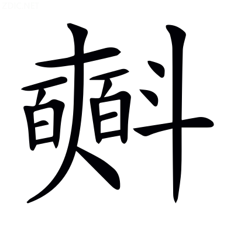

# 文選卷第二十四

> 梁昭明太子撰
> 
> 文林郎守太子右內率府錄事參軍事崇賢館直學士臣李善注上

詩丙

贈答二

## 贈徐幹

五言

> 曹子建

驚風飄白日，忽然歸西山。夫日麗於天，風生乎地，而言飄者，夫浮景駿奔，倏焉西邁，餘光杳杳，似若飄然。古步出夏門行曰：行行復行行，白日薄西山。

圓景光未滿，眾星粲以繁。圓景，月也。論衡曰：日月之體，狀如正圓。鄭玄毛詩箋曰：景，明也。釋名曰：望，月滿之名也。論語曰：眾星共之。廣雅曰：粲，明也。

志士營世業，小人亦不閑。論語：子曰「志士仁人，無求生以害人。」孔叢子曰：仲尼大聖，自茲以降，世業不替。

聊且夜行遊，遊彼雙闕間。文昌鬱雲興，迎風高中天。劉淵林魏都賦注曰：文昌，正殿名也。廣雅曰：鬱，出也。爾雅曰：興，起也。地理書曰：迎風觀在鄴。列子曰：周穆王築臺號曰中天之臺。

春鳩鳴飛棟，流猋激櫺軒。爾雅曰：扶搖謂之飆。*郭璞曰：暴風從上下者。*猋與飆同，古字通。說文曰：櫺，楯間子也。徐幹齊都賦曰：窗櫺參差景納陽。軒，長廊之有窗也。

顧念蓬室士，貧賤誠足憐。蓬室士，謂徐幹也。蒼頡篇曰：顧，旋也。列子曰：北宮子庇其蓬至，若廣廈之蔭。

薇藿弗充虛，皮褐猶不全。墨子曰：古之人其為食也。足以增氣充虛而已。鄭玄周禮注曰：充，足也。淮南子曰：貧人冬則羊裘短褐，不掩形也。

忼慨有悲心，興文自成篇。說文曰：忼慨，壯士不得志於心也。鄭玄考工記注曰：興，發也。

寶棄怨何人？和氏有其愆。寶以喻幹。和氏，喻知己也。韓子曰：楚人和氏得璞玉於楚山之中，奉而獻之武王，武王使玉人相之。玉人曰「石也。」跀和氏左足。武王薨，成王即位，和又獻之。玉人又曰「石也。」跀其右足。成王薨，文王即位，和乃抱璞而哭於楚山之下，王使玉人理其璞而得寶焉，遂名曰和氏之璧。跀音刖。孔安國尙書傳曰：愆，過也。

彈冠俟知己，知己誰不然？言欲彈冠以俟知己，知己誰不同於棄寶，而能相~~萬~~薦乎[^24.1.1]？漢書曰：蕭育與朱博友，往者有王陽貢公，故長安語曰「蕭朱結綬，王貢彈冠。」晏子春秋：越石父曰「士者申乎知己。」

良田無晚歲，膏澤多豐年。良田、膏澤，喻有德也。無晚歲、多豐年，喻必榮也。漢書曰：翟義請陂下良田。國語：子餘曰「君若膏澤之，使能成嘉穀。」毛詩曰：豐年穰穰。

亮懷璵璠美，積久德逾宣。爾雅曰：亮，信也。蒼頡篇曰：懷，抱也。左氏傳曰：季平子行東野，還未至，卒于房。陽虎將以璵璠斂。*杜預曰：璵璠，美玉，君所佩也。*璵音餘。璠音煩。

親交義在敦，申章復何言！莊子曰：親交益疏。孔安國尙書傳曰：敦，厚也。又曰：申，重也。

---

[^24.1.1]: 考異：注「而能相萬乎」：何校「萬」改「薦」，陳同。各本皆偽。

## 贈丁儀

五言。集云：與都亭侯丁翼，今云儀，誤也。魏略曰：丁儀，字正禮。太祖辟儀為掾。

> 曹子建

初秋涼氣發，庭樹微銷落。漢書：孝武傷李夫人賦曰「桂枝落而銷亡。」

凝霜依玉除，清風飄飛閣。楚辭曰：漱凝霜之紛紛。字書曰：凝，冰堅也。玉除，階也。說文曰：除，殿階也。西都賦曰；玉~~除~~階彤庭[^24.2.1]。又曰：脩塗飛閣。

朝雲不歸山，霖雨成川澤。廣雅曰：八月浮雲不歸。左氏傳曰：凡雨，自三日已往為霖。

黍稷委疇隴，農夫安所獲？王逸楚辭注曰：委，棄也。說文曰：疇，耕治之田也。毛詩曰：帥時農夫。

在貴多忘賤，為恩誰能博？言俗之常情也。

狐白足禦冬，焉念無衣客？言服狐白者不念無衣，以喻處尊貴者多忘貧賤也。晏子春秋曰：景公之時，雨雪三日，公被狐白之裘，坐於堂側，謂晏子曰「雨雪三日，天下不寒，何也？」晏子曰「賢君飽知人飢，溫知人寒。」楚辭曰：無衣裘以禦冬。毛詩曰：無衣無褐，何以卒歲？

思慕延陵子，寶劍非所惜。言延陵不欺於死，而況其生者乎？故己思慕之，冀異於俗也。新序曰：延陵季子將西聘晉，帶寶劍以過徐君，徐君不言而色欲之。季為有上國之事，未獻也，然心許之矣。致使於晉，顧反，則徐君死，於是以劍帶徐君墓樹而去。廣雅曰：惜，愛也。

子其寧爾心，親交義不薄。

---

[^24.2.1]: 考異：注「玉除彤庭」：案：「除」當作「階」。各本皆偽。但引以注「玉」字，其「除」即是「階」，上已注訖。不知者用正文「玉除」改之，非也。後贈何劭王濟詩注引不誤，亦可證。或又因此欲改西都賦作「除」，則益非矣。

## 贈王粲

五言

> 曹子建

端坐苦愁思，攬衣起西遊[^24.3.1]。古詩曰：攬衣起徘徊。

樹木發春華，清池激長流。中有孤鴛鴦，哀鳴求匹儔。鴛鴦，喻粲也。毛萇詩傳曰：鴛鴦，匹鳥也。楚辭曰：覽可與兮匹儔。

我願執此鳥，惜哉無輕舟。言願執鳥而無輕舟，以喻己之思粲而無良會也。賈逵國語注曰：惜，痛也。戰國策：蘇代曰「水浮輕舟。」

欲歸忘故道，顧望但懷愁。傅毅七激曰：無物可樂，顧望懷愁。鄭玄毛詩箋曰：迴首曰顧。

悲風鳴我側，羲和逝不留。楚詞曰：哀江介之悲風。又曰：吾令羲和弭節兮。*王逸曰：羲和，日御也。*墨子曰：時不可及，日不可留。

重陰潤萬物，何懼澤不周？重陰，以喻太祖。蔡邕月令章句曰：陰者，密雲也。

誰令君多念，自使懷百憂。毛詩曰：我生之後，逢此百憂。

---

[^24.3.1]: 考異：攬衣起西遊：袁本「攬」下有校語云善作「攪」。茶陵本則云五臣作「攪」。案：此悉傳寫誤耳，無論善自作「攬」，即五臣亦未始作「攪」也。

## 又贈丁儀王粲

五言。集云：答丁敬禮、王仲宣。翼字敬禮，今云儀，誤也。

> 曹子建

從軍度函谷，驅馬過西京。魏志曰：建安二十年，公西征張魯。漢書：弘農縣故秦函谷關。毛詩曰：驅馬悠悠。

山岑高無極，涇渭揚濁清。毛萇詩傳曰：涇渭相入，而清濁異。

壯哉帝王居，佳麗殊百城。漢書曰：高祖南過曲逆，曰「壯哉縣。」高誘戰國策注曰：佳，大也。麗，美也。謝承後漢書曰：黃琬拜豫州，威邁百城。

員闕出浮雲，承露概泰清。西京賦曰：圜闕竦以造天。淮南子曰：魏闕之高，上際青雲。西都~~賦~~賓曰[^24.4.1]：抗仙掌與承露[^24.4.2]。廣雅曰：扢，摩也。概與扢同，古字通。鶡冠子曰：上及泰清，下及太寧。

皇佐揚天惠，四海無交兵。皇佐，太祖也。邊讓章華賦曰：建皇佐之高勳，飛仁聲之顯赫。左氏傳：箴尹克黃曰「君，天也。」家語：孔子曰「君惠臣忠。」楚漢春秋：吳廣說陳涉曰「王引兵西擊，則野無交兵。」

權家雖愛勝，全國為令名。權家，兵家也。史記曰：呂尚其事多兵權與奇計。孫子兵法曰：用兵法，全國為上，破國次之。左氏傳：子產曰「令名，德之輿也。」鄭玄禮記注曰：名，令聞也。

君子在末位，不能歌德聲。君子，謂丁王也。琴操曰：古者君子在位，役不踰時。德聲，謂太祖令德之聲也。

丁生怨在朝，王子歡自營。歡怨非貞則，中和誠可經。言歡怨雖殊，俱非忠貞之則，惟有中和樂職，誠可謂經也。漢書：王襄使王褒作中和樂職宣布詩。*如淳曰：言王政中和，在官者樂其職。*鄭玄周禮注曰：經，法也。

---

[^24.4.1]: 考異：注「西都賦曰」：袁本、茶陵本「賦」作「賓」，是也。又後贈張華答何劭詩注皆然。

[^24.4.2]: 考異：注「抗仙掌與承露」：茶陵本「抗」作「扢」。案：涉下而誤也。袁本作「抗」，與此同，不誤。引之但注「承露」，其以下方注「概」字，或因據此誤字反欲改西都賦，則謬矣。聊出之於尤本，無施也。「與」，賦作「以」。

## 贈白馬王彪

五言。魏志曰：楚王彪，字朱虎，武帝子也。初封白馬王，後徙封楚。集曰：於圈城作。又曰：黃初四年五月，白馬王任城王與余俱朝京師，會節氣，~~日不~~到洛陽[^24.5.1]，任城王薨。至七月，與白馬王還國。後有司以二王歸蕃，道路宜異宿止，意毒恨之。蓋以大別在數日，是用自剖，與王辭焉，憤而成篇。

> 曹子建

謁帝承明廬，逝將歸舊疆。陸機洛陽記曰：承明門，後宮出入之門，吾常怪謁帝承明廬，問張公，云「魏明帝作建始殿，朝會皆由承明門。」毛詩曰：逝將去汝。舊疆，鄄城也。時植雖封雍丘，仍居鄄城。

清晨發皇邑，日夕過首陽。陸機洛陽記曰：首陽山在洛陽東北，去洛二十里。

伊洛廣且深，欲濟川無梁。楚詞曰：道壅塞而不達，江河廣而無梁。

汎舟越洪濤，怨彼東路長。國語曰：秦汎舟于河。西京賦曰：起洪濤而揚波。

顧瞻戀城闕，引領情內傷。其一。毛詩曰：顧瞻周道。又曰：在城闕兮。左氏傳：穆叔謂晉侯曰「引領西望，曰庶幾乎！」楚詞曰：永懷兮內傷。

---

太谷何寥廓，山樹鬱蒼蒼。薛綜東京賦注曰：太谷在洛陽西南。風俗通曰：泰山松樹，鬱鬱蒼蒼。

霖雨泥我塗，流潦浩縱橫。魏志曰：黃初四年七月，大雨，伊洛溢流。毛萇詩傳曰：行潦，流潦也。

中逵絕無軌，改轍登高崗。毛詩曰：肅肅兔罝，施於中逵。廣雅曰：軌，跡也。

脩阪造雲日，我馬玄以黃。其二。毛詩曰：陟陂高岡，我馬玄黃。*毛萇曰：玄馬病則黃。*

---

玄黃猶能進，我思鬱以紆。楚詞曰：願假簧以舒憂，志紆鬱其難釋。*王逸曰：紆，屈也。鬱，愁也。*

鬱紆將~~難進~~何念[^24.5.2]，親愛在離居。楚詞曰：將以遺兮離居。

本圖相與偕，中更不克俱。毛萇詩傳曰：偕，俱也。

鴟梟鳴衡扼，豺狼當路衢。鴟梟、豺狼，以喻小人也。毛詩曰：懿厥哲婦，為梟為鴟。漢書：杜文謂孫寶曰「豺狼當路，不宜復問狐狸。」公羊傳曰：楚莊王伐鄭，放乎路衢。*何休注曰：路衢，郭內衢也。*

蒼蠅間白黑，讒巧令親疏。毛詩曰：營營青蠅，止於樊。*鄭玄曰：蠅之為蟲，汙白使黑，汙黑使白。喻佞人變亂善惡也。*廣雅曰：間，毀也。

欲還絕無蹊，攬轡止踟躕。其三。楚辭曰：攬騑轡而下節。毛詩曰：搔首踟躕。

---

踟躕亦何留[^24.5.3]？相思無終極。漢書：息夫躬絕命詞曰「嗟若是欲何留也。」

秋風發微涼，寒蟬鳴我側。蔡邕月令章句曰：寒蟬應陰而鳴，鳴則天涼，故謂之寒蟬也。

原野何蕭條，白日忽西匿。楚辭曰：山蕭條而無獸。又曰：日杳杳而西頹。

歸鳥赴喬林，翩翩厲羽翼。毛詩曰：翩翩者鵻。厲，疾貌。

孤獸走索群，銜草不遑食。尙書曰：不遑暇食。

感物傷我懷，撫心長太息。其四。廣雅曰：感，傷也。古詩曰：感物懷所思。列子曰：師襄乃撫心高蹈。楚辭曰：長太息以掩涕。

---

太息將何為？天命與我違。鄭玄周易注曰：命，所受天命也。楚辭曰：屬天命而委之咸池。*王逸曰：咸池，天神也。*古詩曰：同袍與我違。毛萇詩傳曰：違，離也，謂不耦也。

奈何念同生，一往形不歸。魏志曰：武皇帝卞皇后生任城王彰、陳思王植。左氏傳曰：鄭罕駟豐同生。*杜預曰：罕，子皮；駟，子皙；豐，公孫段也。三家本同母兄弟也。*漢書：武帝詔曰「梁王親慈同生，願以邑分弟。」

孤魂翔故~~城~~域[^24.5.4]，~~`魏志城作域`~~靈柩寄京師。漢書：貢禹上書曰「骸骨棄捐，孤魂不歸。」

存者忽復過，亡沒身自衰。人生處一世，去若朝露晞。漢書：李陵謂蘇武曰「人生如朝露，何久自苦如此！」薤露歌曰：薤上零露何易晞！毛萇詩傳曰：晞，乾也。

年在桑榆間，影響不能追。日在桑榆，以喻人之將老。東觀漢記：光武曰「失之東隅，收之桑榆。」仲長子昌言曰：捷疾馳影響人間也。

自顧非金石，咄唶令心悲。其五。鄭玄毛詩箋曰：顧，念也。古詩曰：人生非金石，豈能長壽考？說文曰：咄，叱也；丁兀切。聲類曰：唶，大呼也；子夜切。言人命叱呼之間，或至夭喪也。

---

心悲動我神，棄置莫復陳。丈夫志四海，萬里猶比鄰。恩愛苟不虧，在遠分日親。鄧析子曰：遠而親者，志相應也。分猶志也。

何必同衾幬，然後展慇勤。毛詩曰：抱衾與裯。*毛萇曰：衾，被也。鄭玄曰：裯，床帳也。*幬與裯古字同。

憂思成疾疹，無乃兒女仁。毛詩曰：心之憂矣，疹如疾首。史記曰：呂公謂呂媼曰「非兒女之所知。」又，韓信謂漢祖曰「項王所謂婦人之仁也。」

倉卒骨肉情，能不懷苦辛。其六。李陵書曰：前書倉卒。骨肉，謂兄弟也。蘇子卿詩云：骨肉緣枝葉。古詩又曰：轗軻長苦辛。

---

苦辛何慮思？天命信可疑。虛無求列仙，松子久吾欺。班固楚辭序曰：帝閽宓妃，虛無之語。論衡曰：傳稱赤松王喬好道為仙，度世不死，是又虛也。魏武帝善哉行曰：痛哉世人，見欺神仙。

變故在斯須，百年誰能持？漢書：谷永曰「三郡所奏，皆有變故。」鄭玄周禮注曰：故，災也。禮記：君子曰「禮樂不可斯須去身。」*鄭玄曰：斯須猶須臾也。*古詩曰：生年不滿百。呂氏春秋曰：人之壽久不過百。

離別永無會，執手將何時？蔡琰詩曰：念別無會期。毛詩曰：執子之手，與子偕老。

王其愛玉體，俱享黃髮期。七發曰：太子玉體不安。東漢觀記：太子~~執~~報桓榮書曰[^24.5.5]「君慎疾加湌，重愛玉體。」杜預左氏傳注曰：享，受也。尙書曰：詢茲黃髮。

收淚即長路，援筆從此辭。其七。韓詩外傳曰：孫叔敖治楚三年，而楚國霸。楚史援筆而書於策。蘇武詩曰：去去從此辭。

---

[^24.5.1]: 考異：注「日不陽」：袁本、茶陵本「日不」作「到洛」，是也。

[^24.5.2]: 考異：鬱紆將難進：茶陵本云「難進」，五臣作「何念」。袁本云善作「難進」。何校云「難進」當從魏氏春秋作「何念」。案：此恐善本傳寫有誤。

[^24.5.3]: 考異：踟躕亦何留：袁本、茶陵本云「何」善作「可」。案：二本所見非也，善自作「何」，注有明文，此不誤，或尤校改之也。

[^24.5.4]: 考異：孤魂翔故城注「魏志城作域」：袁本、茶陵本無注「魏志城作域」五字，正文皆作「域」。茶陵本有校語云善作「城」。袁本無。案：「魏志城作域」五字當是，或記於旁，尤誤取添入注，故此處脩改之跡尚存也。善作「城」，無明文，恐尤及茶陵所見傳寫有誤，而袁所見為未誤也。

[^24.5.5]: 考異：注「太子執報桓榮書曰」：案：「執」字不當有。各本皆衍。太子，漢明帝也，在范蔚宗書桓榮傳。

## 贈丁翼

五言。文士傳曰：翼字敬禮，儀之弟也，為黃門侍郎。

> 曹子建

嘉賓填城闕，豐膳出中廚。鄭玄禮記注曰：填，滿也。毛詩曰：我有嘉賓。城闕，已見上文。

吾與二三子，曲宴此城隅。論語：子曰「二三子以我為隱乎？吾無隱乎爾。」毛詩曰：俟我於城隅。

秦箏發西氣，齊瑟揚東謳。楚辭曰：挾秦箏而彈徵。歌錄有美女篇齊瑟行。史記：蘇秦說秦王曰「臨菑甚富，其民無不吹竽鼓瑟。」說文曰：謳，齊歌也。

肴來不虛歸，觴至反無餘。我豈狎異人？朋友與我俱。毛詩曰：豈伊異人？兄弟匪他。爾雅曰：狎，習也。毛詩序曰：伐木，燕朋友故舊也。

大國多良材，譬海出明珠。禮斗威儀曰：其君乘金而王，則江海出大貝明珠。

君子義休偫，小人德無儲。言君子之義，美而且具。小人之德，寡而無儲也。說文曰：偫，待也；一曰具也。儲，謂蓄積之以待無也。

積善有餘慶，榮枯立可須。周易曰：積善之家，必有餘慶。孔安國尙書傳曰：須，待也。

滔蕩固大節，~~世~~時俗多所拘[^24.6.1]。淮南子曰：使神滔蕩而不失其充。又曰：曲士不可與語至道，拘於俗而束於教。

君子通大道，無願為世儒。論衡曰：說經者為世儒。

---

[^24.6.1]: 考異：世俗多所拘：袁本、茶陵本「世」作「時」，是也。

## 贈秀才入軍五首

四言。集云：兄秀才公穆入軍贈詩。劉義慶集林曰：嵇熹，字公穆，舉秀才。

> 嵇叔夜

良馬既閑，麗服有暉。毛詩曰：良馬四之。又曰：君子之馬，既閑且馳。*鄭玄曰：閑，習也。*廣雅曰：麗，好也。楊雄反騷曰：素初貯厥麗服兮。

左攬繁弱，右接忘歸。新序曰：楚王載繁弱之弓，忘歸之矢，以射兕於雲夢。

風馳電逝，躡景追飛。四子講德論曰：風馳雨集，雜襲並至。孫該琵琶賦曰：飄風電逝，舒疾無方。七啟曰：忽躡景而輕騖。

凌厲中原，顧~~盼~~䀎生姿[^24.7.1]。劉歆遂初賦曰：登句注以凌厲。廣雅曰：凌，馳也。厲，上也。風俗通曰：顏色厚所顧~~盼~~䀎，若以親密也。

攜我好仇，載我輕車。毛詩曰：君子好仇。

南凌長阜，北厲清渠。廣雅曰：凌，乘也。王逸楚辭注曰：厲，度也。

仰落驚鴻，俯引淵魚。盤于遊田，其樂只且。西京賦曰：盤于游畋，其樂只且。

---

輕車迅邁，息彼長林。春木載榮，布葉垂陰。習習谷風，吹我素琴。毛詩曰：習習谷風。秦嘉婦徐氏書曰：芳香既珍，素琴又好。

咬咬黃鳥，顧疇弄音。毛詩曰：交交黃鳥。古歌曰：黃鳥鳴相追，咬咬弄好音。

感悟馳情，思我所欽。古詩曰：馳情整中帶。

心之憂矣，永嘯長吟。毛詩曰：心之憂矣，我歌且謠。杜篤連珠曰：能離光明之顯，長吟永嘯。

---

浩浩洪流，帶我邦畿。毛萇詩傳曰：畿，疆也。

萋萋綠林，奮榮揚暉。魚龍瀺灂，山鳥群飛。樂動聲儀曰；風雨動魚龍，仁義動君子。上林賦曰：瀺灂霣墜。劉向七言曰：山鳥群鳴我心懷。

駕言出遊，日夕忘歸。毛詩曰：駕言出遊。楚辭曰：日將暮兮悵忘歸。

思我良朋，如渴如飢。毛詩曰：每有良朋。曹植責躬詩曰：遲奉聖顏，如渴如飢。

願言不獲，愴矣其悲。張衡詩曰：願言不獲，終然永思。曹植責躬詩曰：心之云慕，愴矣其悲。

---

息徒蘭圃，秣馬華山。蘭圃，蕙圃也。毛詩曰：之子于歸，言秣其馬。*毛萇詩傳曰：秣，養也。*華山，山有光華也。

流磻平皋，垂綸長川。說文曰：磻，以石著弋繳也。鄭玄毛詩箋曰：釣者，以絲為之綸。

目送歸鴻，手揮五絃。漢書曰：周亞夫趨出，上以目送之。歸田賦曰：彈五絃於妙指。

俯仰自得，游心泰玄。楚辭曰：漠虛靜以恬愉兮，澹無為而自得。泰玄，謂道也。淮南子曰：自得者，全其身者也。全其身，則與道為一矣。

嘉彼釣叟，得魚忘筌。莊子曰：莊子釣於濮水之上。又曰：筌者，所以~~得~~在魚也[^24.7.2]，得魚而忘筌。蹄者，所以在兔也，得兔而忘蹄。言者，所以在意也，得意而忘言。吾焉得夫忘言之人而與之言哉？

郢人逝矣，誰與盡言？莊子曰：莊子送葬，過惠子之墓，顧謂從者曰「郢人堊漫其鼻端，若蠅翼，使匠石斲之，匠石運斤成風，~~聲~~聽而斲之[^24.7.3]，盡堊而鼻不傷，郢人立不失容。宋元君聞之，召匠石曰『嘗試為寡人為之。』匠石曰『臣則~~當~~嘗能斲之[^24.7.4]。雖然，臣質死久矣。』自夫子之死也，吾無以為質矣，吾無與言之矣。」

---

閑夜肅清，朗月照軒。舞賦曰：夫何皦皦之閑夜，明月列以施光。軒，已見曹子建贈徐幹詩注。

微風動褂，組帳高褰。方言曰：褂謂之裾；音圭，褂或為幃。周禮曰：幕人掌帷幕幄帟綬之事。*鄭司農曰：帟，平~~帷~~帳也[^24.7.5]。綬，組綬，所以繫帷也。*王逸楚詞注曰：以幕組結束玉璜為帷帳也。

旨酒盈樽，莫與交歡。毛詩曰：旨酒欣欣。漢書曰：郭解入關，賢豪爭交歡。

鳴琴在御，誰與鼓彈？毛詩曰：琴瑟在御，莫不靜好。

仰慕同趣，其馨若蘭。六韜曰：同好相趣。薛綜西京賦注曰：趣猶意也。易曰：同心之言，其臭如蘭。

佳人不在，能不永歎！楚辭曰；聞佳人兮召予。毛詩曰：假寐永歎。

---

[^24.7.1]: 考異：顧盼生姿：袁本、茶陵本「盼」作「䀎」，注同。案：「䀎」字是也。「䀎」為「眄」之別體字，不知者多改為「盻」。茶陵改刻如此，後又誤成「盼」也。

[^24.7.2]: 考異：注「所以得魚也」：何校「得」改「在」，陳同。各本皆偽。

[^24.7.3]: 考異：注「聲而斲之」：何校「聲」改「聽」，陳同。各本皆偽。

[^24.7.4]: 考異：注「臣則當能斲之」：袁本「當」作「嘗」，是也。茶陵本亦誤「當」。

[^24.7.5]: 考異：注「帟平帷也」：何校「帷」改「帳」，是也。此節注袁、茶陵二本多脫字，不具論。

## 贈山濤

五言

> 司馬紹統臧榮緒晉書曰：司馬彪，字紹統，少篤學，初拜騎都尉，太始中為秘書郎，轉丞，後拜散騎侍郎，終於家。

苕苕椅桐樹，寄生於南岳。椅桐，彪自喻也。毛詩曰：其桐其椅，其實離離。馬融琴賦曰：惟椅梧之所生，在衡山之峻陂。

上凌青雲霓，下臨千仞谷。蒼頡篇曰：凌，侵也。呂氏春秋曰：若決積水於千仞之谿。包咸論語注曰：七尺曰仞。

處身孤且危，於何託余足？毛詩序曰：孤危將亡。漢書：賈山上書曰「不得邪徑而託足焉。」

昔也植朝陽，傾枝俟鸞鷟。毛詩曰：鳳凰鳴矣，于彼高岡；梧桐生矣，于彼朝陽。*鄭玄曰：鳳凰之性，非梧桐不栖，非竹實不食也。*說文曰：鸞鷟，鳳屬，神鳥也。

今者絕世用[^24.8.1]，倥偬見迫束。新語曰：楩梓仆則為世用。楚辭曰：悲余生之無歡兮，愁倥偬於山陸。*王逸曰：倥偬，困苦也。*

班匠不我顧，牙曠不我錄。班匠及牙曠，皆喻執政也。墨子曰：公輸般為雲梯。鄭玄禮記注曰：般，伎巧者也。莊子曰：匠石之齊，見櫟杜樹，匠伯不顧。*司馬彪曰：匠石字伯。*鄭玄毛詩箋曰：顧，視也。列子曰：伯牙善鼓琴。左氏傳曰：師曠侍於晉侯。*杜預曰：師曠，晉樂太師。*

焉得成琴瑟，何由揚妙曲？桓子新論曰：黃門工鼓琴者，有任真卿、虞長倩，能傳其度數，妙曲遺聲。

冉冉三光馳，逝者一何速！廣雅曰：冉冉，進也。淮南子曰：夫道含吐陰陽，而章三光。*許慎曰：三光，日月星也。*逝者，見下注。

中夜不能寐，撫劍起躑䠱。毛詩曰：耿耿不寐。左氏傳曰：子朱怒，撫劍從之。說文曰：蹢躅，住足也。躑䠱與蹢躅同。

感彼孔聖歎，哀此年命促。春秋說題辭曰：天嘗有血書魯端門作法，孔聖沒，周室亡。論語曰「子在川上曰：逝者如斯！」司馬遷悲士不遇賦曰：天道悠昧人理促。

卞和潛幽冥，誰能證奇璞？卞和，已見上文。

冀願神龍來，揚光以見燭。神龍，喻濤也。山海經曰：赤水之山有神，人面蛇身，其瞑乃晦，其視乃明，是燭九陰，是謂燭龍。

---

[^24.8.1]: 考異：今者絕世用：袁本、茶陵本有校語云「用」善作「人」。案：二本所見非也。注有明文，此不誤，或亦尤校改。

## 答何劭二首

五言

> 張茂先

吏道何其迫？窘然坐自拘。班彪與金昭卿書曰：遠在東垂，吏道迫促。鵩鳥賦曰：愚士繫俗，窘若囚拘。

纓婑為徽纆，文憲焉可踰？纓緌制人，同於徽纆。國之文憲，豈可踰乎？禮記曰：冠緌纓。*鄭玄曰：緌，纓飾也。*周易曰：繫用徽纆。孔安國尙書傳曰：憲，法也。

恬曠苦不足，煩促每有餘。廣雅曰：恬，靜也。蒼頡篇曰：曠，疏曠也。

良朋貽新詩，示我以遊娛。良朋，已見上文。徐幹贈五官中郎將詩曰：貽爾新詩~~又~~文[^24.9.1]。思玄賦曰：雖遊娛以媮樂。

穆如灑清風，奐若春華敷。毛詩曰：吉父作誦，穆如清風。淮南子曰：猶條風之時灑。答賓戲曰：摛藻如春華。

自昔同寮寀，於今比園廬。臧榮緒晉書曰：惠帝即位，劭為太子太師。又曰：武帝崩，華為太子少傅。然考乎其時，事正相接，故曰同寮也。左氏傳曰：先蔑之使也，荀林父止之曰「同官為寮，吾嘗同寮，敢不盡心乎？」爾雅曰：采，僚官也。南都賦曰：園廬，舊宅也。

衰夕近辱殆，庶幾並懸輿。王逸楚辭注曰：夕以喻衰。言日夕將暮，己已衰老也。老子曰[^24.9.2]：知足不辱，知止不殆。漢書曰：薛廣德乞骸骨，賜安車駟馬，懸其安車，傳子傳孫也。

散髮重陰下，抱杖臨清渠。鍾會遺榮賦曰：散髮抽簪。

屬耳聽鶯鳴，流目翫~~儵~~鯈魚[^24.9.3]。毛詩曰：耳屬于垣。*鄭玄曰：屬耳於壁聽之。*又儀禮注曰：屬，注也。毛詩曰：鶯其鳴矣。思玄賦曰：流目眺夫衡阿。翫猶悅也。莊子曰：鯈魚出遊從容，是魚樂也。

從容養餘日，取樂於桑榆。漢書：疏廣曰「此金者，聖主所以惠養老臣也；故樂與鄉黨共饗其賜，以盡吾餘日，不亦可乎？」桑榆，已見上文。

---

洪鈞陶萬類，大塊稟群生。洪鈞，大鈞，謂天也。大塊，謂地也。言天地陶化萬類，而群化稟受其形也。鵩鳥賦曰：大鈞播物。廣雅曰：陶，化也。河圖曰：地有九州，以苞萬類。莊子曰：大塊載我以形，勞我以生。孔安國尙書傳曰：稟，受也。漢書：董仲舒對策曰「群生和而萬物殖。」

明闇信異姿，靜躁亦殊形。劉歆遂初賦曰：非積習之生常，固明闇之所別。老子曰：重為輕根，靜為躁君。*王弼曰：凡物輕不能載重，小不能鎮大，不行者使行，不動者制動；是以重必為輕根，靜必為躁君。*

自予及有識，志不在功名。李陵與蘇武書曰：陵自有識以來，士之立操未有如子卿者也。呂氏春秋曰：功名大立，天也。

虛恬竊所好，文學少所經。楚辭曰：漠虛靜以恬愉。

忝荷既過任，白日已西傾。白日西傾，以喻年老也。洛神賦曰：日既西傾。

道長苦智短，責重困才輕。論語：曾子曰「士不可以不弘毅，任重而道遠。仁以為己任，不亦重乎？死而後已，不亦遠乎？」呂氏春秋曰：智短則不知化，不知化者每舉必危。范曄後漢書：劉寬曰「任重責大，憂心如醉。」曹植上表曰：爵重才輕。

周任有遺規，其言明且清。論語：孔子云「周任有言曰『陳力就列，不能者止。』」*馬融曰：周任，古之良史。*子思子：詩云「昔吾有先正，其言明且清。國家以寧，都邑以成。」

負乘為我戒，夕惕坐自驚。周易曰：負且乘，致寇至。負也者，小人之事也；乘也者，君子之器也。小人乘君子之器，盜思奪之矣。又曰：夕惕若厲。孔安國尙書傳曰：惕，懼也。

是用感嘉貺，寫心出中誠。感猶荷也。魏文帝書曰：嘉貺益腆。

發篇雖溫麗，無乃違其情。西都~~賦~~賓曰：啟發篇章。漢書曰：司馬相如作賦，甚弘麗溫雅。廣雅曰：違，背也。

---

[^24.9.1]: 考異：注「貽爾新詩又」：陳云「又」，「文」誤，是也。各本皆偽。

[^24.9.2]: 考異：注「己已衰老子曰」：袁本、茶陵本「老」下有「也老」二字，是也。

[^24.9.3]: 考異：流目翫儵魚：茶陵本「儵」作「鯈」，注同。案：「鯈」字是也。考莊子釋文作「儵」，爾雅釋文作「鯈」。陸於秋水篇引說文「直留反」，謂「魚部鯈字音」。然則「鯈」是，「儵」非也。袁本亦誤「儵」，其注作「鯈」，仍不誤。

## 贈張華

五言

> 何敬祖

四時更代謝，懸象迭卷舒。孫卿子曰：日月遞照，四時代御。淮南子曰：二者代謝舛馳。周易曰：懸象著明，莫大乎日月。淮南子曰：陰陽嬴縮卷舒，淪於不測。

暮春忽復來，和風與節俱。論語曰：暮春者，春服既成。毛詩曰：習習谷風。*毛萇傳曰：習習，和舒之貌。*楊泉物理論曰：春氣臑，其風溫和。

俯臨清泉涌，仰觀嘉木敷。西都~~賦~~賓曰：嘉木樹庭。

周旋我陋圃，西瞻廣武廬。臧榮緒晉書曰：吳滅，封張華廣武侯。左氏傳：太史克曰「奉以周旋。」

既貴不忘儉，處有能存無。毛萇詩傳曰：有謂富，無謂貧。

鎮俗在簡約，樹塞焉足摹？周易曰：簡則易從。廣雅曰：約，儉也。論語曰：或問管仲知禮乎？孔子曰「邦君樹塞門，管氏亦樹塞門。」

在昔同班司，今者並園墟。同班司，已見張華答詩。

私願偕黃髮，逍遙綜琴書。黃髮，已見上文。王肅周易注曰：綜，理事也。劉歆遂初賦曰：玩琴書以條暢。

舉爵茂陰下，攜手共躊躇。韓詩曰：搔首躊躇。*薛君曰：躊躇，躑躅也。*

奚用遺形骸？忘筌在得魚。莊子曰：申徒，兀者，謂子產曰「吾與夫子遊十有九年矣，而未曾知吾兀者也。今子與我遊於形骸之內，而子索我於形骸之外，不亦過乎？」得魚忘筌，已見上文。

## 贈馮文羆遷斥丘令

四言。晉百官名曰：外兵郎馮文羆。集云：文羆為太子洗馬，遷斥丘令，贈以此詩。闞駰十三州記曰：斥丘縣在魏郡東八十里。

> 陸士衡

於皇聖世，時文惟晉。毛詩曰：於皇時周。周禮：栗氏量銘曰「時文思索。」*鄭玄曰：言是文德之君，思求可以為人立法也。*

受命自天，奄有黎獻。謂武帝也。毛詩曰：有命自天，命此文王。又曰：奄有四方。*毛萇曰：奄，大也。*尙書曰：萬邦黎獻，共惟帝臣。*孔安國曰：黎，眾也。獻，賢也。*

閶闔既闢，承華再建。謂惠帝也。晉宮閣名曰：洛陽城閶闔門。陸機洛陽記曰：太子宮在太宮東，薄室門外，中有承華門。再建，謂立愍懷太子國儲，以對閶闔，故謂之再也。

明明在上，有集惟彥。其一。毛詩曰：明明在下，赫赫在上。

---

弈弈馮生，哲問允迪。方言曰：自關而西，凡美容謂之弈弈。尙書曰：允迪厥德，謨明弼諧。*孔安國曰：迪，蹈也。言信蹈行古人之德。*

天保定子，靡德不鑠。毛詩曰：天保定爾，亦孔之固。劇秦美新曰：鑠德懿和之風。爾雅曰：鑠，美也。

邁心玄曠，矯志崇邈。爾雅曰：邁，行也。王逸楚辭注曰：矯，舉也。爾雅曰：崇，高也。

遵彼承華，其容灼灼。其二。毛詩曰：桃之夭夭，灼灼其華。

---

嗟我人斯，戢翼江潭。毛詩曰：嗟我懷人。又曰：彼何人斯。又曰：鴛鴦在梁，戢其左翼。楚辭曰：遊於江潭。

有命集止，飜飛自南。周易曰：大君有命。毛詩曰：有命既集。又曰：飜飛惟鳥。又曰：凱風自南。

出自幽谷，及爾同林。謂俱為洗馬也。臧榮緒晉書曰：楊駿誅，徵機為太子洗馬。毛詩曰：出自幽谷，遷于喬木。

雙情交映，遺物識心。其三。映猶照也。

---

人亦有言，交道實難。毛詩曰：人亦有言，靡哲不愚。漢書曰：蕭育與朱博後有隙，故世以交為難也。

有頍者弁，千載一彈。毛詩曰：有頍者弁，實維伊何。*毛萇曰：頍，弁貌也。弁，皮弁也。*彈冠，已見上文。杜預左氏傳注曰：弁，亦冠也，故通言之。頍，丘橤切，與跬同音。

今我與子，曠世齊歡。言我及子雖與王貢曠世，而實齊其歡也。范曄後漢書：班固議曰「~~以~~漢興已來[^24.11.1]，曠世歷年。」廣雅曰：曠，遠也。

利斷金石，氣惠秋蘭。其四。周易曰：二人同心，其利斷金。同心之言，其臭如蘭。

---

群黎未綏，帝用勤止。毛詩曰：群黎百姓。長楊賦曰：群黎為之不康。毛詩曰：文王既勤止，我應受之。

我求明德，肆于百里。毛詩，我求懿德，肆于時夏。*鄭玄曰：肆，陳也，陳其功烈也。*漢書曰：縣大率百里，其人稠則盛，稀則曠也。

僉曰爾諧，俾民是紀。尙書：僉曰垂哉，帝曰汝諧。毛詩曰：四方是維，俾民不迷。鄭玄毛詩箋曰：以網罟喻為政理之為紀也。

乃眷北徂，對揚帝祉。其五。毛詩曰：乃眷西顧。又曰：對揚王休。又曰：既受帝祉，施于孫子。

---

疇昔之遊，好合纏綿。左氏傳：羊斟曰「疇昔之羊子為政。」毛詩曰：妻子好合。張升與任彥堅書曰：纏綿恩好，庶蹈高蹤。

借曰未洽[^24.11.2]，亦既三年。毛詩曰：借曰未知，亦既抱子。

居陪華幄，出從朱輪。應璩與趙叔潛書曰：入侍華幄，出典禁闈。司馬彪續漢書曰：皇太子安車朱班輪。

方驥齊鑣，比跡同塵。其六。鄭玄儀禮注曰：方，併也。南都賦曰：騄驥齊鑣。范曄後漢書：孔融薦謝該曰「該實卓然，比跡前列。」老子曰：和其光，同其塵。

---

之子既命，四牡項領。毛詩曰：駕彼四牡，四牡項領。

遵塗遠蹈，騰軌高騁。四子講德論曰：未若遵塗之疾也。鄭玄考工記注曰：軌，謂轍也。

慶雲扶質，清風承景。廣雅曰：質，軀也。

嗟我懷人，其邁惟永。其七。毛詩曰：嗟我懷人。*毛萇曰：懷，思也。*

---

否泰苟殊，窮達有違。否泰，周易二卦名也。列子：西門子謂北宮子曰「汝造事而窮，予造事而達，此厚薄之驗與？」賈逵國語注曰：違，異也。

及子春華，後爾秋暉。言否泰殊流，窮達異轍，今雖及爾春華之美，終當後爾秋暉之盛也。春華喻少年，秋暉喻老成也。蘇武詩曰：努力愛春華。

逝將去我，陟彼朔垂。逝將去汝，已見上文。毛詩曰：陟彼高岡。朔垂，斥丘也。爾雅曰：朔，北方也。說文曰：垂，遠邊也。

非子之念[^24.11.3]，心孰為悲？其八。

---

[^24.11.1]: 考異：注「後漢班固議曰以漢興已來」：案：「漢」下當有「書」字，「曰」下當衍「以」字。各本皆誤。在班固傳也。

[^24.11.2]: 考異：借曰未洽：茶陵本作「給」，云五臣作「洽」。袁本作「洽」，無校語。案：二本所見皆大誤，所載翰注曰「給，猶足也」，五臣作「給」無疑。然則善作「洽」也。茶陵本例用善為正文，當作「洽」，而著五臣作「給」。袁本例用五臣為正文，當作「給」，而著善作「洽」。今倒錯失理。此不誤，必尤延之知其非，而校改正之。

[^24.11.3]: 考異：非子之念：袁本、茶陵本有校語云「非」善作「悲」。案：二本所見非也。注無明文，然作「悲」不可通，必善自作「非」，與五臣無異，但傳寫誤也。此不誤，蓋亦尤校改正之也。

## 答賈長淵

四言。并序。王隱晉書曰：~~魯公~~賈謐[^24.12.1]，字長淵。

> 陸士衡

余昔為太子洗馬，漢書曰：太子屬官有先馬。*如淳曰：前驅也。*先或作洗。

賈長淵以散騎常侍東宮積年。高誘呂氏春秋注曰：東宮，太子所居。詩曰：東宮之妹。

余出補吳王郎中令，臧榮緒晉書曰：吳王晏，字平度，武帝第二十三子，封吳。又曰：吳王出鎮淮南，以機為郎中令。

元康六年入為尙書郎。臧榮緒晉書曰：機為尙書中兵郎。

魯公贈詩一篇，作此詩答之云爾。

---

伊昔有皇，肇濟黎蒸。爾雅曰：伊，惟也。*郭璞曰：發語辭也。*毛詩曰：有皇上帝。*毛萇曰：皇，君也。*封禪書曰：覺悟黎蒸。

先天創物，景命是膺。周易曰：先天而天弗違。周禮曰：智者創物。毛詩曰：君子萬年，景命有僕。*毛萇曰：僕，附也。*毛詩曰：戎翟是膺。*毛萇曰：膺，當也。*

降及群后，迭毀迭興。史記：太史公曰「遞興遞廢，能者用事。」小雅曰：遞，迭更也。

邈矣終古，崇替有徵。其一。楚辭曰：春蘭兮秋菊，長無絕兮終古。國語：藍尹亹謂子西曰「吾聞君子唯獨居思念前世之崇替，於是乎有歎。」*韋昭曰：崇，終也。替，廢也。*左氏傳曰：君子之言，信而有徵。

---

在漢之季，皇綱幅裂。韋昭曰國語注曰：季，末也。皇綱，以~~綱~~網為喻也[^24.12.2]。答賓戲曰：廓帝紘，恢皇綱。毛萇詩傳曰：張之曰綱。魏志：崔琰曰「今天下分崩，九州幅裂。」

大辰匿耀，金虎習質。漢書曰：東方蒼龍房心，心為明堂大星天王。爾雅曰：大辰，房心尾也。石氏星經曰：昴者，西方白虎之宿也。太白者，金之精。太白入昴，金虎相薄，主有兵亂。

雄臣馳騖，義夫赴節。解嘲曰：世亂，則聖哲馳騖而不足。

釋位揮戈，言謀王室。其二。左氏傳：王子朝告于諸侯曰「居王于彘，諸侯釋位，以間王政。」說文曰：揮，奮也。左氏傳曰：會于洮，謀王室也。

---

王室之亂，靡邦不泯。毛詩曰：亂生不夷，靡國不泯。*毛萇曰：泯，滅也。*

如彼墜景，曾不可振。丁德禮妻寡婦賦曰[^24.12.3]：日亹亹以西墜。說文曰：振，舉也。

乃眷三哲，俾乂斯民。三哲，劉備、孫權、曹操也。尙書：帝曰「下民其咨，有能俾乂。」*孔安國曰：乂，治也。*

啟土雖難，改物承天。其三。尙書曰：建邦啟土。國語：王謂晉侯曰「叔父若能更姓改物，以創天下。」禮記明堂陰陽錄曰：王者承天統物也。

---

爰茲有魏，即宮天邑。禮記：孔悝鼎銘曰「即宮于宗周。」尙書曰：周公曰「肆予敢求爾于天邑商。」

吳實龍飛，劉亦岳立。東京賦曰：乃龍飛白水。

干戈載揚，俎豆載戢。毛詩曰：載戢干戈。*毛萇曰：戢，聚也。*論語：孔子曰「俎豆之事，則嘗聞之矣。」

民勞師興，國玩凱入。其四。毛詩曰：民亦勞止。玩與翫同，古字通。周禮曰：師有功則愷樂。

---

天厭霸德，黃祚告舋。左氏傳：鄭伯曰「天而既厭周德矣。」干寶搜神記曰：魏惟五德之運，以土承漢。春秋保乾圖曰：漢以魏徵黃精接期，天下歸高。賈逵國語注曰：舋，兆也，言禍有兆。

獄訟違魏，謳歌適晉。孟子：萬章曰「堯以天下與舜，有諸？」孟子曰「否，不然，天與之。堯崩，三年之喪畢，舜讓避丹朱於南河之南。天下朝覲獄訟者，不之堯之子而之舜；謳歌者不謳歌堯之子而謳歌舜。舜曰『天也。』夫而後歸中國，踐天子之位焉。」

陳留歸蕃，我皇登禪。魏志曰：陳留王諱奐，字景明，武帝孫，燕王宇子也。奉皇帝璽綬策禪位于晉嗣王。魏世譜曰：封帝為陳留王。

庸岷稽顙，三江改獻。其五。庸岷，蜀境也。庸，國名也。岷，山名也。禮記：孔子曰「拜而後稽顙。」三江，吳境也。尙書曰：三江既入。

---

赫矣隆晉，奄宅率土。曹府君陳寔誄曰：赫矣陳君。毛詩曰：宅殷土芒芒。又曰：率土之濱。

對揚天人，有秩斯祜。對揚，已見上文。司馬相如封禪文曰：天人之際已交。毛詩曰：嗟~~爾~~嗟烈祖[^24.12.4]，有秩斯祜。爾雅曰：祜，福也。

惟公太宰，光翼二祖。臧榮緒晉書曰：晉太祖為大將軍，以賈充為司馬右長史。及世祖受禪，轉太宰。左氏傳：康王論晉范會曰「宜夫子之光輔五君。」

誕育洪冑，纂戎于魯。其六。臧榮緒晉書曰：謐父韓壽，河南尹。母，賈充少女也。充平生不議立後。充後妻郭槐輒以外孫韓謐為黎民子，襲封。槐自表陳，是充遺意也。帝許之，以謐為魯公。毛詩曰：誕彌厥月。*毛萇曰：誕，大也。鄭玄曰：大矣后稷之在其母，終於人道，十月而生。*毛詩曰：纘戎祖考。*鄭玄曰：戎，汝也。*毛詩曰：俾侯于魯。

---

東朝既建，淑問峩峩。謂愍懷太子也。毛詩曰：淑問如皋陶。

我求明德，濟同以和。我求懿德，已見上文。左氏傳：齊侯曰「唯據與我和。」晏子曰「據亦同也，焉得為和？和如羹焉，宰夫和之，濟其不及，以渫其過；君子食之，以平其心。君臣亦然。」*杜預曰：梁丘據也。*

魯公戾止，袞服委蛇。毛詩曰：魯侯戾止。爾雅曰：戾，至也。周禮曰：三公自袞冕而下。毛詩曰：退食自公，委蛇委蛇。

思媚皇儲，高步承華。其七。王隱晉書曰：謐以賈后之妹子，數入宮，與愍懷處。毛詩曰：思媚周姜。又曰：媚于天子。漢書：疏廣曰「太子，國儲嗣君。」承華，已見上文。

---

昔我逮茲，時惟下僚。下僚，謂洗馬也。

及子棲遲，同林異條。俱在東宮，故曰同林。而貴賤殊隔，故曰異條。毛詩曰：或棲遲偃仰。

年殊志比，服舛義稠。服，章服也。尊卑殊制，故曰舛也。說文曰：稠，多也。

遊跨三春，情固二秋。其八。

---

祗承皇命，出納無違。尙書曰：祗承于帝。論語曰：樊遲問孝，子曰「無違。」

往踐蕃朝，來步紫微。蕃朝，吳也。紫微，至尊所居，謂為尙書郎。

升降秘閣，我服載暉。謝承後漢書曰：謝承父嬰為尙書侍郎，每讀高祖及光武之後將相名臣策文通訓，條在南宮，秘於省閣，唯臺郎升複道取急，因得開覽。序云：入為尙書郎作此詩。然秘閣即尙書省也。

孰云匪懼？仰肅明威。其九。尙書曰：我有周佑命，將天明威。

---

分索則易，攜手實難。鄭玄禮記注曰：索，散也。

念昔良遊，茲焉永歎！劉楨黎陽山賦曰：良遊未厭，白日潛輝。毛詩曰：茲之永歎。

公之云感，貽此音翰。應劭漢書注曰：云，有也。韋昭曰：翰，筆也。

蔚彼高藻，如玉之~~闌~~爛[^24.12.5]。其十。蔚，文貌。周易曰：君子豹變，其文蔚也。楚辭曰：文彩燿於玉石。*王逸曰：言發文舒詞，爛然成章，如玉石之有文彩也。*~~闌~~爛，力旦切，協韻力丹切。

---

惟漢有木，曾不踰境。惟南有金，萬邦作詠。木，謂橙也。賈謐贈詩云：在南稱柑，度北則橙，故答以此。言木度北而變質，故不可以踰境。金百鍊而不銷，故萬邦作詠。~~賈~~潘戒之以木[^24.12.6]，而陸自勗以金也。穀梁傳曰：婦人既嫁，不踰境。毛詩曰：大賂南金。

民之胥好，狂狷厲聖。爾雅曰：胥，相也，謂相戒勗以所好尚也。論語：子曰「不得中行而與之，必也狂狷乎？狂者進取，狷者有所不為。」尙書曰：惟聖罔念作狂，惟狂克念作聖。說文曰：厲，石也。言人之自勗，若金之受厲。

儀形在昔，予聞子命。其十一。毛詩曰：儀形文王，萬邦作孚。左氏傳：~~晉~~里克曰[^24.12.7]「臣聞命矣。」

---

[^24.12.1]: 考異：注「魯公賈謐」：袁本、茶陵本無「魯公」二字，是也。

[^24.12.2]: 考異：注「以綱為喻也」：案：「綱」當作「網」。各本皆偽。

[^24.12.3]: 考異：注「丁德禮寡婦賦曰」：案：此有誤也。前潘安仁寡婦賦屢引丁儀妻寡婦賦，其「日杳杳而西匿」句注引此文，然則「禮」下脫「妻」字。各本皆誤。儀字正禮，疑一字德禮。奏彈王源注引丁德禮勵志賦，蓋儀作也。又赴洛道中作詩注引丁儀寡婦賦，恐亦脫「妻」字。

[^24.12.4]: 考異：注「嗟爾烈祖」：袁本、茶陵本「爾」作「嗟」，是也。

[^24.12.5]: 考異：如玉之闌：案「闌」當作「爛」。善引王逸楚辭注「爛然」為注，可見也。又音「爛，力旦切」，皆其證。今亦改「闌」，益非。茶陵本云善作「之闌」。袁本云善作「之蘭」。乃五臣改「爛」為「蘭」，改「之」為「如」，而云「如蘭之芳」，又轉轉多偽。謝靈運擬鄴中集陳琳詩「夜聽極星爛」，善引「明星有爛」為注，五臣改「爛」作「闌」，而以為「闌稀」。袁、茶陵二本校語具有明文，正與此略同矣。

[^24.12.6]: 考異：注「賈戒之以木」：袁本「賈」作「潘」，是也，謂安仁所作耳。見後。茶陵本亦作「賈」，與此同誤。

[^24.12.7]: 考異：注「晉克曰」：何校「晉」改「里」，陳同。各本皆誤。

## 於承明作與士龍

五言。集云：與士龍於承明亭作。

> 陸士衡

牽世嬰時網，駕言遠徂征。鄒陽上書曰：豈拘於俗、牽於世。曹子建責躬詩曰：舉挂時網。毛詩曰：駕言徂東。

飲餞豈異族？親戚弟與兄。毛詩曰：飲餞于禰。又曰：豈伊異人，兄弟匪他。

婉孌居人思，紆鬱遊子情。方言曰：倇，歡也。倇與婉同，古字通。說文曰：孌，慕也。班固漢書述哀紀曰：婉孌董公，惟亮天工。紆鬱，已見上文。

明發遺安寐，寤言涕交纓。毛詩曰：明發不寐。又曰：獨寐寤言。淮南子曰：雍門子以琴見孟嘗君，涕流霑纓。

分塗長林側，揮袂萬始亭。佇~~盼~~眄要遐景[^24.13.1]，傾耳玩餘聲。家語：孔子曰「傾耳而聽之，不可得而聞。」杜預左氏傳注曰：翫，貪也。

南歸憩永安，北邁頓承明。毛萇詩傳曰：憩，息也。頓，止舍也。

永安有昨軌，承明子棄予。毛詩曰：棄予如遺。

俯仰悲林薄，慷慨含辛楚。范曄後漢書：劉瑜上書曰「竊為辛楚，泣血連如。」楚猶痛也。

懷往歡絕端，悼來憂成緒。言和悅纔往，歡已絕端，哀悼暫來，憂便成緒。毛萇詩傳曰：懷，和也。楚辭曰：欲寂漠而絕端。方言曰：悼，哀也。

感別慘舒翮，思歸樂遵渚。舒翮謂鵠，遵渚謂鴻。言感別之情，慘於舒翮之飛鵠；思歸之志，樂於遵渚之征鴻也。蘇武詩曰：黃鵠一遠別。酈炎詩曰：舒吾凌霄羽。毛詩曰：鴻飛遵渚。

---

[^24.13.1]: 考異：佇盼要遐景：茶陵本「盼」作「眄」，是也。袁本作「盻」，亦非。說見前。

[^24.13.2]: 考異：俯仰悲林薄：案：「林」當作「外」。袁本、茶陵本云善作「外」。薄，迫也。言悲自外而來迫也。不知者以五臣亂善，尤所見非。

## 贈尙書郎顧彥先二首

五言。王隱晉書曰：顧榮，字彥先，吳人也，為尙書郎。

> 陸士衡

大火貞朱光，積陽熙自南。爾雅曰：大火謂之大辰。*郭璞曰：大火，心也，在中最明，故時候主之也。*孔安國尙書傳曰：貞，正也。朱光，朱明也。爾雅曰：夏為朱明。尙書曰：日永星火，以正仲夏。淮南子曰：積陽之熱氣生火，火氣之精者為日。爾雅曰：熙，興也。續漢書曰：日行南陸謂之夏也。

望舒離金虎，屏翳吐重陰。言月離畢，天將雨也。楚辭曰：前望舒使先驅。*王逸曰：望舒，月御也。*漢書曰：西方，金也。尙書考靈耀曰：西方秋虎。漢書曰：參，白虎三星。又曰：觜𧤤為虎首。孔安國尙書傳曰：昴，白虎中星。然西方七星畢昴之屬，俱白虎也。毛詩曰：月離于畢，俾滂沲矣！楚辭曰：~~屏翳~~荓號起雨[^24.14.1]。*王逸曰：~~□~~荓，屏翳[^24.14.2]，雨師名也。*曹子建贈王粲詩曰：重陰潤萬物。

淒風迕時序，苦雨遂成霖。左氏傳：申豐曰「春無淒風，秋無苦雨。」*杜預曰：苦雨，為人所患苦也。*小雅曰：迕，犯也。莊子曰：陰陽四時運行，各得其序。

朝遊忘輕羽，夕息憶重衾。輕羽，謂扇也。傅毅有羽扇賦。衾，已見上文。

感物百憂生，纏綿自相尋。百憂、纏綿，並已見上文。

與子隔蕭牆，蕭牆隔且深。論語：子曰「吾恐季孫之憂，在蕭牆之內也。」

形影曠不接，所託聲與音。音聲日夜闊，何用慰吾心？毛詩曰：仲山甫永懷，以慰其心。

---

朝遊遊層城，夕息旋直廬。張晏漢書注曰：直宿曰廬也。

迅雷中宵激，驚電光夜舒。論語曰：迅雷風烈必變。楚辭曰：凌驚雷軼駭電兮。

玄雲拖朱閣，振風薄綺疏。說文曰：拖，曳也；徒可切。鄭玄禮記注曰：振，動也。風以動物，故謂之振。孔安國尙書傳曰：薄，迫也。李尤東觀銘曰：房闥內布，綺疏外陳，是謂東觀，書籍林淵[^24.14.3]。

豐注溢脩霤，黃潦浸階除。王逸楚辭注曰：霤，屋宇也。說文曰：潦，雨水也。又曰：除，殿階也。

停陰結不解，通衢化為渠。沈稼湮梁潁，流民泝荊徐。廣雅曰：湮，沒也。梁潁，二地名也。毛萇詩傳曰：泝，向也。荊徐，二州名也。

眷言懷桑梓，無乃將為魚。毛詩曰：眷言顧之。又曰：惟桑與梓，必恭敬止。左氏傳曰：天王使劉定公勞趙孟，館於雒汭。劉子曰「美哉禹功，明德遠矣。微禹，吾其魚乎！」

---

[^24.14.1]: 考異：注「屏翳起雨」：袁本「屏翳」作「荓號」，是也。茶陵本亦誤作「屏翳」。案：天問文。

[^24.14.2]: 考異：注「王逸曰□屏翳」：袁本「曰」下有「荓」字。茶陵本有「屏」字。案：袁本是也，此尤脩改而誤。

[^24.14.3]: 考異：注「書籍林淵」：袁本、茶陵本無此四字。

## 贈交阯太守顧公真

五言。晉百官名曰：交州刺史顧秘，字公真。

> 陸士衡

顧侯體明德，清風肅已邁。周易曰：君子體仁足以長人。*鄭玄曰：體，生也。*尙書曰：先王既勤用明德。胡廣書曰：建鴻德，流清風。

發跡翼藩后，改授撫南裔。藩后，吳王也。顧氏譜曰：秘為吳王郎中令。南裔，謂交阯也。解嘲曰：驃騎發跡於祈連。蔡邕陳球碑曰：遠鎮南裔，近撫侯服。鄭玄周禮注曰：撫，安也。

伐鼓五嶺表，揚旌萬里外。漢書曰：秦北為長城之役，南有五嶺之戍。裴淵廣州記五嶺云：大庾、始安、臨賀、桂陽、揭陽。漢書：劉向上疏曰「甘延壽懸旌萬里之外。」

遠績不辭小，立德不在大。左氏傳：劉子謂趙孟曰「子盍亦遠績~~禹~~功[^24.15.1]，而大庇民焉。」又穆叔曰「大上有立德，其次立功。」

高山安足淩？巨海猶縈帶。古辯異博遊曰：眾星累累如連貝，江河四海如衣帶。

惆悵瞻飛駕，引領望歸旆。楚辭曰：惆悵兮而私自憐。左氏傳：穆叔謂晉侯曰「引領西望，曰『庶幾乎。』」

---

[^24.15.1]: 考異：注「子盍亦遠績禹功」：袁本、茶陵本無「禹」字，是也。案：見左傳釋文。善引自如此，尤添「禹」字耳。

## 贈從兄車騎

五言。集云：陸士光。

> 陸士衡

孤獸思故藪，離鳥悲舊林。周禮曰：藪牧，養蕃鳥獸。*鄭玄曰：澤無水曰藪。*

翩翩遊宦子，辛苦誰為心？漢書：薄昭與淮南王書曰「游宦事人。」

髣彿谷水陽，婉孌崑山陰。楚辭曰：時髣彿以遙見。陸道瞻吳地記曰：海鹽縣東北二百里有長谷，昔陸遜陸凱居此。谷東二十里有崑山，父祖葬焉。穀梁傳曰：水北曰陽。婉孌，已見上文。

營魄懷茲土，精爽若飛沈。老子曰：載營魄抱一，能無離乎？*鍾會曰：載，辭也。*經護為營，形氣為魄。謂魂魄經護其形氣，使之長存也。論語：子曰「小人懷土。」左氏傳：樂祈曰「心之精爽，是謂魂魄。」

寤寐靡安豫，願言思所欽。東京賦曰：膺多福以安悆。毛詩曰：願言思子。嵇康贈秀才詩曰：思我所欽。

感彼歸塗艱，使我怨慕深。孟子：萬章問曰「舜往于田，日號泣於旻天，何謂其號泣也？」孟子曰「怨慕也。」集本云：歸塗順也。

安得忘歸草，言樹背與衿。韓詩曰：焉得諠草，言樹之背。然衿猶前也。

斯言豈虛作，思鳥有悲音。

## 答張士然

五言。孫盛晉陽秋曰：張悛，字士然，少以文章與陸機友善。悛，七全切。

> 陸士衡

絜身躋祕閣，祕閣峻且玄。四子講德論曰：絜身脩思。弔魏武曰：機出補著作，遊乎祕閣。然祕書省亦為祕閣。說文曰：玄，幽遠也。謂祕閣之幽遠也。

終朝理文案，薄暮不遑暝。毛詩曰：不遑假寐。暝，古眠字。

駕言巡明祀，致敬在祈年。駕言，已見上文。毛詩曰：~~敬祭明祀~~敬恭明神[^24.17.1]。禮記曰：拜至所以致敬也。毛詩曰：祈年孔夙。*鄭玄曰：我祈豐年甚早也。*

逍遙春王圃，躑䠱千畝田。晉宮閣~~銘~~名曰[^24.17.2]：洛陽宮有春王園。躑䠱與蹢躅同。禮記曰：天子為籍田千畝。

回渠繞曲陌，通波扶直阡。風俗通曰：南北曰阡，東西曰陌。

嘉穀垂重穎，芳樹發華顛。尙書曰：農殖嘉穀。廣雅曰：顛，末也。

余固水鄉土，摠轡臨清淵。水鄉，謂吳也。漢書曰：武功中水鄉人三舍墊為池。家語：孔子曰「善御者，正身以摠轡。」

戚戚多遠念，行行遂成篇。楚辭曰：居戚戚而不解。

---

[^24.17.1]: 考異：注「敬祭明祀」：陳云當作「敬恭明神」，是也。各本皆誤。

[^24.17.2]: 考異：注「晉宮閣銘曰」：案：「銘」當作「名」。各本皆偽。

## 為顧彥先贈婦二首

五言。集云：為全彥先作，今云顧彥先，誤也。且此上篇贈婦，下篇答，而俱云贈婦，又誤也。

> 陸士衡

辭家遠行遊，悠悠三千里。鸚鵡賦曰：女辭家而適人。蔡琰詩曰：悠悠三千里，何時復來會。

京洛多風塵，素衣化為緇。毛萇詩傳曰：緇，黑色。

脩身悼憂苦，感念同懷子。孟子曰：古之人不得志，脩身見於世。列子曰：卑辱則憂苦。

隆思辭心曲，沈歡滯不起。薛君韓詩章句曰：時風又且暴，使己思益隆。毛詩曰：亂我心曲。

歡沈難克興，心亂誰為理？願假歸鴻翼，飜飛~~浙~~游江汜[^24.18.1]。魏文帝喜霽賦曰：思寄身於鴻鸞，舉六翮而輕飛。毛詩曰：江有汜。

---

東南有思婦，長歎充幽闥。曹子建七哀詩曰：上有愁思婦，悲歎有餘哀。西京賦曰：重閨幽闥。

借問歎何為？佳人眇天末！西京賦曰：眇天末以遠期。

遊宦久不歸，山川脩且闊。遊宦，已見上文。

形影參商乖，音息曠不達。左氏傳：子產曰「昔高辛氏有二子，伯曰閼伯，季曰實沈。居曠林，不相能，日尋干戈，以相征討。后帝不臧，遷閼伯于商丘，主辰。商人是因，故辰為商星。遷實沈于大夏，主參。唐人是因，以服事夏商；其季世曰唐叔，故參為晉星。」法言曰：吾不睹參辰之相比也。音息，音問消息也。廣雅曰：曠，久也。

離合非有常，譬彼弦與括。呂氏春秋曰：夫萬物成則毀，合則離；離則復合，合則復離。劉熙釋名曰：矢末曰括。括，會也，與弦會。

願保金石軀，慰妾長飢渴。金石，已見上文。李陵贈蘇武詩曰：思得瓊樹枝，以解長飢渴。

---

[^24.18.1]: 考異：翻飛浙江汜：袁本、茶陵本有校語云「游」善作「浙」。今案：各本所見皆非也。詳善但引「江有汜」為注，而不注「浙江」，是「江汜」連文，非「浙江」連文。蓋亦作「游」，與五臣無異，傳寫誤也。

## 贈馮文羆

五言

> 陸士衡

昔與二三子，遊息承華南。二三子及承華，已見上文。

拊翼同枝條，飜飛各異尋。班固漢書曰：撫翼俱起。

苟無凌風翮，徘徊守故林。莊子曰：鵲巢於高榆之巔，巢折，凌風而起。[^24.19.1]

慷慨誰為感，願言懷所欽。所欽，已見上文。

發軫清洛汭，驅馬大河陰。尙書曰：東至于洛汭。*孔安國曰：水北曰汭。*穀梁傳曰：水南曰陰。

佇立望朔塗，悠悠迥且深。馮在斥丘，故云朔塗。毛詩曰：佇立以泣。王粲贈士孫文始詩曰：雖則同域，邈其迥深。

分索古所悲，志士多苦心。古詩曰：晨風懷苦心。

悲情臨川結，苦言隨風吟。張平子書曰：酸者不能不苦於言。

愧無雜珮贈，良訊代兼金。毛詩曰：知子之來之，雜珮以贈之。孟子曰：齊王餽兼金一百而不受。*趙岐曰：兼金，其價兼倍於惡金也。*

夫子茂遠猷，款誠寄惠音。尙書曰：遠爾猷。秦嘉贈婦詩曰：何用敘我心，遺思致款誠。好色賦曰：絜齋俟兮惠音聲。

---

[^24.19.1]: 考異：苟無凌風翮徘徊守故林及注「莊子曰鵲巢於高榆之巔巢折凌風而起」：袁本、茶陵本云善無此二句。注十六字，二本無。案：此尤延之校添，或其所見者有正文二句及注也。故林謂吳，必作於出補吳王郎中令時，故云爾。潘安仁為賈謐作贈詩「旋反桑梓，帝弟作弼；或去國宦，清塗攸失」。亦即此意。有者，是矣。五臣向注誤，不具論。

## 贈弟士龍

五言

> 陸士衡

行矣怨路長，惄焉傷別促。論語曰：君命召，不俟駕行矣。曹子建贈白馬王詩曰：怨彼東路長。詩曰：我心憂傷，惄焉如擣。方言曰：愵，憂也。自關而西，秦晉之間，或曰惄；並奴的切。曹子建送應氏詩曰：別促會日長。

指途悲有餘，臨觴歡不足。我若西流水，子為東峙岳。言己逝如西流之不息，雲止類東岳之不移也。

慷慨逝言感，徘徊居情育。逝，機自謂也。居，謂雲也。言慷慨不平，逝者之言多感；徘徊興戀，居者之志彌生。

安得攜手俱，契闊成騑服。毛詩曰：死生契闊，與子成說。又曰：攜手同行。*毛萇曰：契闊，懃苦也。*說文曰：騑，驂傍馬也。鄭玄毛詩箋曰：兩服，中央夾轅也。

## 為賈謐作贈陸機

四言

> 潘安仁

肇自初創，二儀煙熅。周易曰：易有太極，是生兩儀。*王肅曰：兩儀，天地也。*易曰：天地煙熅，萬物化醇。

粵有生民，伏羲始君。結繩闡化，八象成文。劇秦美新曰：爰初生民。周易曰：上古結繩而治，後世聖人易之以書契。又曰：古者包犧氏之王天下也，使作八卦，以通神明之德，以類萬物之情。包犧，即伏犧也。聲類曰：闡，大開也。

芒芒九有，區域以分。其一。左氏傳：魏絳曰「虞人之箴曰『芒芒禹跡，畫為九州。』」*杜預云：芒芒，遠貌也。*毛詩曰：方命厥后，奄有九有。*毛萇曰：九有，九州也。*

---

神農更王，軒轅承紀。史紀曰：軒轅為天子，代神農氏，是為黃帝，順天地之紀。家語：孔子曰「古之王者易代改號，取法五行。五行更王，終始相生也。」

畫野離彊，爰封眾子。漢書曰：昔在黃帝，畫野分州，得百~~姓~~里之國[^24.21.1]萬區。史紀曰：黃帝二十五子，~~得~~其得姓者[^24.21.2]一十四人。

夏殷既襲，宗周繼祀。楚辭曰：思堯舜兮襲興。毛詩曰：赫赫宗周。

綿綿瓜瓞，六國互峙。其二。毛詩曰：綿綿瓜瓞，民之初生，自土沮漆。六國，謂韓燕趙魏齊楚也。

---

強秦兼并，吞滅四隅。史記曰：秦始皇初并天下。班固漢書述曰：孝武行師，吞滅海隅。淮南子曰：經營四隅，還反於樞。*高誘曰：隅猶方也。*

子嬰面櫬，漢祖膺圖。子嬰、漢祖，並已見上文。左氏傳曰：楚子圍許，許僖公見楚子於武城，面縛銜璧，大夫衰絰，士輿櫬。東京賦曰：高祖膺錄受圖。曹植大魏篇曰：大魏膺符。

靈獻微弱，在涅則渝。范曄後漢書曰：孝靈皇帝諱宏，肅宗玄孫也。桓帝崩，無子，即皇帝位。又曰：孝獻皇帝諱協，靈帝中子也。靈帝崩，即皇帝位。曾子曰：沙在泥，與之皆黑。趙岐孟子章句曰：白沙入泥，不染自黑。爾雅曰：渝，變也。

三雄鼎足，孫啟南吳。其三。三雄，即三國之主。班固漢書述曰：三雄是敗。漢書：蒯通說韓信曰「方今足下三分天下，鼎足而居。」

---

南吳伊何，僭號稱王。吳志曰：黃龍元年，權即皇帝位。春秋命歷序曰：吳楚駒勝，僭號稱王。駒，景駒也。勝，陳勝也。字書曰：僭，假也。

大晉統天，仁風遐揚。謂武帝也。周易曰：大哉乾元，萬物資始，乃統天。典引曰：仁風翔于海表。

偽孫銜璧，奉土歸彊。偽孫，謂皓也。吳志曰：孫皓，字元宗，和子也。孫休薨，皓立。晉命王濬伐皓。皓致書於濬，濬受皓之降。銜璧，已見上句。

婉婉長離，凌江而翔。其四。長離，喻機也。楚辭曰：駕八龍之婉婉。漢書曰：長麗前掞光耀明。*臣瓚曰：長離，靈鳥也。*離與麗古字通。

---

長離云誰？咨爾陸生。毛詩曰：云誰之思。又曰：咨爾殷商。

鶴鳴九皋，猶載厥聲。毛詩曰：鶴鳴九皋，聲聞于天。又曰：厥聲載路。

況乃海隅，播名上京。海隅，謂吳也。尙書曰：至于海隅。范曄後漢書：沮授謂袁紹曰「將軍~~弱冠登朝，~~[^24.21.3]播名海內。」孔安國尙書傳曰：播，布也。

爰應旌招，撫翼宰庭。其五。臧榮緒晉書曰：太熙末，太傅楊駿辟機為祭酒。孟子曰：~~夫招士以旂，大夫以旌~~招大夫以旌[^24.21.4]。撫翼，已見上文。宰，謂駿也。宰或為紫，非也。

---

儲皇之選，實簡惟良。漢書：疏廣曰「太子師友，必~~之~~於天下英俊[^24.21.5]。」爾雅曰：簡，擇也。尙書曰：時惟良顯哉。*孔安國曰：是惟良臣，則君顯明於世。*

英英朱鸞，來自南岡。鸞，亦喻機也。毛萇詩傳曰：英，鮮明也。王逸楚辭序曰：虯龍鸞鳳，以託君子。毛詩曰：我來自東。

曜藻崇正，玄冕丹裳。謂為洗馬也。崇正，太子之宮也。臧榮緒晉書曰：世祖以皇太子富於春秋，初命講孝經於崇政殿。周禮曰：大夫玄冕。禮記曰：君朱韠。環濟要略曰：韠以象裳色。

如彼蘭蕙，載採其芳。其六。

---

藩岳作鎮，輔我京室。謂吳王也。班固盧綰述曰：綰自同閈，鎮我北彊。毛詩曰：大啟爾宇，為周室輔。

旋反桑梓，帝弟作弼。桑梓，已見上文。作弼，謂為吳王郎中令也。

或云國宦，清塗攸失。漢書曰：武有淮南衡山之謀，作左宦之律。*應劭曰：人道尚右，今舍天子而仕諸侯，故謂之左宦。*

吾子~~洗~~洒然[^24.21.6]，恬淡自逸。其七。莊子曰：庚桑子之始來也，吾洒然異之。鄭玄禮記注曰：洒如，肅敬也。文子曰：靜漠恬淡。說文曰：淡，安也；徒敢切。毛詩曰：我不敢傚我友自逸。陳太丘碑曰：澹然自逸。

---

廊廟惟清，俊乂是延。史記曰：賢人深謀於廊廟。爾雅曰：室有東西廂曰廟。犍為舍人曰：殿有東西小堂也。然廊廟，君之居，臣朝覲之所，故曰俊乂是延也。尙書曰：俊乂在官。鄭玄周禮注曰：延，進也。

擢應嘉舉，自國而遷。方言曰：擢，拔也。

齊轡群龍，光讚納言。謂為尙書郎也。楊雄河東賦曰：建乾坤之貞兆兮，將悉總之以群龍。韋昭曰：比群賢也。尙書：帝曰「龍，命汝作納言。」應劭漢書注曰：納言，如今尙書官。機為郎，故曰光讚也。鄭玄周禮注曰：贊，佐也。

優遊省闥，珥筆華軒。其八。毛詩曰：優遊爾休矣。崔駰奏記：竇憲曰「珥筆持牘，拜謁曹下。」韋昭漢書注曰：檻，殿上欄軒上板。

---

昔余與子，繾綣東朝。左氏傳：臧昭伯曰「繾綣從公，無通外內也。」

雖禮以賓，情同友僚。嬉娛絲竹，撫鞞舞韶。禮記曰：絲竹，樂之器也。字林曰：鞞，小鼓也。尙書曰：簫韶九成。*孔安國曰：韶，舜樂名。*

脩日朗月，攜手逍遙。其九。

---

自我離群，二周于今。禮記曰：子夏曰「吾離群索居。」毛詩曰：自我不見，于今三年。

雖簡其面，分著情深。孔安國尙書傳曰：簡，略也。袁紹與公孫瓚書曰：分著丹青。

子其超矣，實慰我心。毛詩曰：實獲我心。

發言為詩，俟望好音。其十。毛詩序曰：在心為志，發言為詩。毛詩曰：誰將西歸，懷之好音。

---

欲崇其高，必重其層。郭璞~~曰~~山海經注曰[^24.21.7]：層，重也；慈登切。

立德之柄，莫匪安恆[^24.21.8]。周易曰：謙，德之柄也。恆，德之固也。

在南稱甘，度北則橙。言甘以移植而易名，恐人徙居而變節，故引以誡之。淮南子曰：江南橘，樹之江北，而化為橙。博物志曰：橘柚類甚多，甘橙枳皆是。

崇子鋒穎，不頹不崩。其十一。鄭玄禮記注曰：崇猶尊也。摯伯陵答司馬遷書曰：有能者見鋒穎之秋毫。毛詩曰：如南山之壽，不騫不崩。

---

[^24.21.1]: 考異：注「得百姓之國」：茶陵本「姓」作「里」，是也。袁本亦誤「姓」。

[^24.21.2]: 考異：注「得其姓者」：案：「得其」當作「其得」。各本皆倒。

[^24.21.3]: 考異：注「將軍弱冠登朝」：袁本、茶陵本無「弱冠登朝」四字，是也。

[^24.21.4]: 考異：注「夫招士以旂大夫以旌」：袁本、茶陵本作「夫招士以旌」五字。案：當是「招大夫以旌」之偽。尤所添改，未是。

[^24.21.5]: 考異：注「必之天下英俊」：袁本、茶陵本「之」作「於」，是也。

[^24.21.6]: 考異：吾子洗然：案：「洗」當作「洒」。善注中兩字皆作「洒」。唯袁、茶陵二本所載五臣銑注字乃作「洗」。然則善「洒」、五臣「洗」，各本所見亂之而失著校語。善所引禮記玉藻、莊子庚桑楚，皆本是「洒」字，釋文可證也。

[^24.21.7]: 考異：注「郭璞□山海經注曰」：袁本「璞」下衍「曰」字，茶陵本無。此亦初衍脩去。

[^24.21.8]: 考異：莫匪安恆：袁本、茶陵本云「安」善作「宣」。案：此蓋所見不同，今無考。但作「宣」不可通，當是傳寫誤也。

## 贈陸機出為吳王郎中令

> 潘正叔文章志曰：潘尼，字正叔。少有清才，初應州辟，後以父老，歸供養。父終，乃出仕，位終大常。

東南之美，曩惟延州。爾雅曰：東南之美者，有會稽之竹箭焉。左氏傳曰：吳子使屈狐庸聘于晉，趙文子問焉，曰「延州來季子其果立乎？」*杜預曰：延州來，季札邑也。*

顯允陸生，於今鱻儔。毛詩曰：顯允君子，莫不令德。

振鱗南海，濯翼清流。高唐賦曰：振鱗奮翼。應德璉建章臺集詩曰：濯翼陵高梯。

婆娑翰林，容與墳丘。其一。答賓戲曰：婆娑乎術藝之場。長楊賦曰：借翰林以為主人。左氏傳：楚左史倚相趍過。王曰「是良史也[^24.22.1]，能讀三墳五典八索九丘。」

---

玉以瑜潤，隨以光融。禮記：孔子曰「君子比德於玉焉，溫潤而澤，仁也；瑜不揜瑕，忠也。」*鄭玄曰：瑜，其中間美者。*隨，隨珠，已見上文。杜預左氏傳注曰：融，朗也。

乃漸上京，乃儀儲宮。周易曰：鴻漸于陸，其羽可以為儀吉。

玩爾清藻，味爾芳風。玩猶愛也。禰衡顏子碑曰：秀不實，振芳風。

泳之彌廣，挹之彌沖。其二。毛詩曰：漢之廣矣，泳之游之。毛萇曰：潛行為泳。又曰：挹，也。老子曰：大滿若沖。字書曰：沖猶虛也。

---

崑山何有？有瑤有珉。新序：晉平公嘆曰「嗟乎，安得賢士大夫與共此樂？」船人固桑對曰「夫劍產於越，珠產江漢，玉產崑山，此三寶皆無足而致。今君苟好士，則賢士至矣。」說文曰：瑤，玉美者。又曰：珉，石之美者。

及爾同僚，具惟近臣。臧榮緒晉書曰：正叔，元康初拜太子舍人。機仕東宮，已見上文。毛詩曰：我雖異事，及爾同僚。東京賦曰：具惟帝臣。國語曰：近臣盡規。

予涉素秋，子登青春。素秋，喻老。青春，喻少也。劉楨與臨淄侯書曰：肅以素秋則落。楚辭曰：青春爰謝。

愧無老成，廁彼日新。其三。毛詩曰：雖無老成人，尚有典刑。周易曰：大畜剛健篤實，輝光日新其德。

---

祈祈大邦，惟桑惟梓。毛詩曰：采繁祈祈。*毛萇曰：祁祁，眾多也。*

穆穆伊人，南國之紀。毛詩曰：穆穆魯侯。又曰：所謂伊人。又曰：滔滔江漢，南國之紀。

帝曰爾諧，惟王卿士。尙書：帝曰爾諧。

俯僂從命，爰恤奚喜。其四。左氏傳：孟僖子召其大夫曰「吾聞將有達者。曰孔丘，聖人之後也。其祖弗父何始有國[^24.22.2]，而授厲公，及正考父，佐戴武宣，三命茲益恭~~敬~~[^24.22.3]，其鼎銘曰『一命而僂，再命而傴，三命而俯，循牆而走，莫余敢侮。』」

---

我車既巾，我馬既秣。周禮：巾車下大夫二人。*鄭玄曰：巾猶衣也。*秣馬，已見上文。

星陳夙駕，載脂載轄。尙書大傳：八伯歌曰「爛然星陳。」毛詩曰：星言夙駕，說于桑田。又曰：載脂載轄，還車言邁。

婉孌二宮，徘徊殿闥。醪澄莫饗，孰慰飢渴？其五。淮南子曰：酒澄而不飲。孔叢子：子思謂魯穆公曰「君若飢渴待賢也。」

---

昔子忝私，貽我蕙蘭。陸集有贈正叔詩。

今子徂東，何以贈旃？徂東，謂適吳也。毛詩曰：駕言徂東。又曰：何以贈之？

寸晷惟寶，豈無璵璠？淮南子曰：聖人不貴尺之璧，而重寸之陰，難得而易失也。說文曰：晷，景也。璵璠，美玉也。

彼美陸生，可與晤言。其六。毛詩曰：彼美淑姬，可以晤言。*鄭玄曰：晤猶對也。*

---

[^24.22.1]: 考異：注「是史也」：何校「史」上添「良」字，陳同。各本皆脫。

[^24.22.2]: 考異：注「其祖弗父何始有國」：袁本、茶陵本無此八字。

[^24.22.3]: 考異：注「茲恭敬」：何校「恭」上添「益」字，下去「敬」字，是也。各本皆誤。

## 贈河陽

五言

> 潘正叔

虑生化單父，子奇蒞東阿。呂氏春秋曰：虑子賤治亶父，彈鳴琴，身不下堂，亶父治。巫馬期以戴星出入，日夜不居，以身親之，而亶父亦治。巫馬期以問其故於密子[^24.23.1]，虑子曰「我之任人，子之任力；任力者固勞，任人者固逸。」說苑曰：子奇年十八，齊君使治阿，既行，齊君悔之，遣使追。使者返，曰「子奇必能矣，共載者皆白首者也。」子奇至阿，鑄庫兵以為耕器。魏聞童子為君，庫無兵，倉無粟，乃起兵擊之。阿人父率子，兄率弟，以私兵戰，遂敗魏師。

桐鄉建遺烈，武城播弦歌。漢書曰：朱邑，字仲卿，廬江人。少時為舒桐鄉嗇夫，廉平不苛。後為大司農。病且死，屬其子曰「我故為桐鄉吏，其人愛我，必葬我桐鄉。後世子孫，奉我不如桐鄉人。」及死，其子葬之桐鄉西郭外，人果然共~~立~~為邑，起冢[^24.23.2]立祠祭，至今不絕。班固說東平王蒼曰「遺烈著於無窮。」論語曰：子之武城，聞弦歌之聲。*孔安國曰：子游為武城宰。*

逸驥騰夷路，潛龍躍洪波。驥龍，喻岳也。

弱冠步鼎鉉，既立宰三河。岳早辟賈充府，出為河陽令。禮記曰：人生二十曰弱冠。周易曰：鼎金鉉。*鄭玄曰：金鉉，喻明道，能舉~~居~~君之官職也[^24.23.3]。*尙書注曰：鼎，三公象也。論語曰：三十而立。漢書：東方朔曰「漢去三河之地，止霸滻以西。」

流聲馥秋蘭，摛藻豔春華。家語：孔子曰「流聲後裔，非唯學之所致耶？」楚詞曰：秋蘭兮青青。說文曰：摛，舒也。摛藻、春華，已見上文。

徒美天姿茂，豈謂人爵多。風俗通曰：太尉掾范滂天姿聰叡。孟子曰：有天爵，有人爵。仁義忠信，樂善不倦，此天爵也。公卿大夫，此人爵也。古之人脩其天爵，而人爵從之；今之人脩天爵以要人爵，既得人爵，而棄天爵，終亦亡矣。

---

[^24.23.1]: 考異：注「以問於密子」：袁本「問」下有「其故」二字。茶陵本有二字，無「以」字。尤初同茶陵而脩去。

[^24.23.2]: 考異：注「人果共立為邑起冢」：陳云「立」字衍，是也。案：漢書循吏傳「共」上有「然」字，無「立」字。各本皆誤。

[^24.23.3]: 考異：注「能舉居之官職也」：茶陵本「居」作「君」，是也。袁本亦誤「居」。

## 贈侍御史王元貺

五言

> 潘正叔

崑山積瓊玉，廣廈構眾材。崑山出玉，已見上文。慎子曰：廊廟之材，非一木之枝。

遊鱗萃靈沼，撫翼希天階。遊鱗，龍也。毛萇詩傳曰：萃，集也。毛詩曰：王在靈沼。楚辭曰：攀天階而下視。

膏蘭孰為銷？濟治由賢能。漢書曰：龔遂卒，有父老來弔曰「薰以香自燒，膏以明自銷。」

王侯厭崇禮，迴跡清憲臺。漢書：上謂嚴助曰「君厭承明之廬。」張孟陽魏都賦注曰：聽政殿左崇禮門。漢官儀曰：御史為憲臺也。

蠖屈固小往，龍翔迺太來。周易曰；尺蠖之屈，以求伸也；龍蛇之蟄，以存身也。又曰：泰，小往大來，吉。郭璞方言注曰：尺蠖，又呼為步屈也；於縛切。

協心毗聖世，畢力讚康哉！尙書曰：三后協心。毛詩曰：天子是毗。*鄭玄曰：毗，輔也。*呂氏春秋曰：百官有司之事，畢力竭智矣。尙書：咎繇乃歌曰「元首明哉！股肱良哉！庶事康哉！」

---

文選卷第二十四

賜進士出身通奉大夫江南蘇松常鎮太等處承宣布政使司布政使胡克家重校刊
