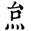
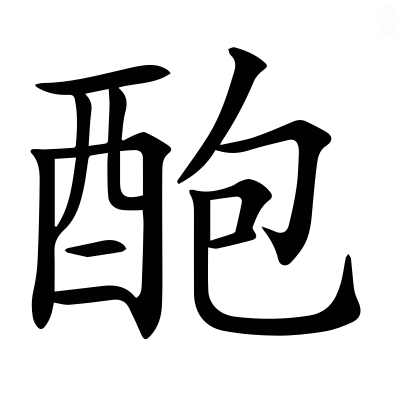
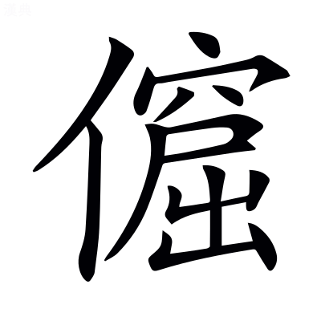
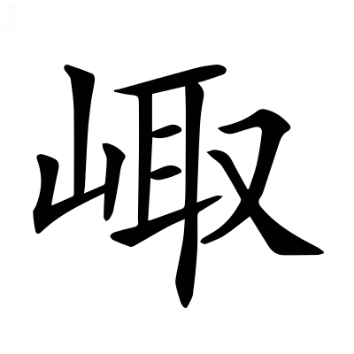
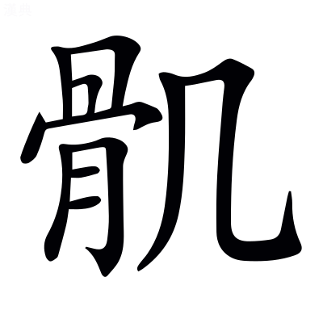

# 文選卷第三十三

> 梁昭明太子撰
> 
> 文林郎守太子右內率府錄事參軍事崇賢館直學士臣李善注上

騷下

## 九歌二首

> 屈平
> 
> 王逸注

### 少司命

秋蘭兮蘪蕪，羅生兮堂下。言己供神之室，閑而清靜，眾香之草，又環其堂下，羅列而生。誠司命君所宜幸集也。

綠葉兮素華，芳菲菲兮襲予。襲，及也。予，我也。言芳草茂盛，吐葉垂華，芳香菲菲，上及我也。

夫人自有兮美子，夫人，謂萬民也。

蓀何以兮愁苦！蓀，謂司命也。言天下萬民，人人自有子孫，司命何為主握其年命而用思愁苦？

秋蘭兮青青，綠葉兮紫莖。言己事神崇敬，重種芳草，莖葉五色，香益暢也。

滿堂兮美人，忽獨與余兮目成。言萬民眾多，美人並會，盛滿於堂，而司命獨與我睨而相視，成為親親也。

入不言兮出不辭，言神往來奄忽，入不語言，出不訣辭，其志難知也。

乘回風兮載雲旗。言司命之去，乘風載雲，其形貌不可得見。

悲莫悲兮生別離。屈原思神略畢，憂愁復出，乃長歎曰：人居世悲哀，莫痛與妻子生別離。傷己當之也。

樂莫樂兮新相知。言天下之樂，莫大於男女始相知之時也。屈原言己無新相知之樂，而有生離之憂。

荷衣兮蕙帶，儵而來兮忽而逝。言司命被服香淨，往來奄忽，難當值也。

夕宿兮帝郊，帝，謂天帝。

君誰須兮雲之際？言司命之去，暮宿於天帝之郊，誰待於雲之際乎？幸其有意而顧己。

~~與汝遊兮九河，衝飆起兮水揚波。~~[^33.1.1]與汝沐兮咸池。咸池，星名也。蓋天池。

晞汝髮兮陽之阿。晞，乾也。詩云：匪陽不晞。阿，曲阿。日所行也。言己願託司命，俱沐咸池，乾髮陽阿，齋戒絜己，冀蒙天祐也。

望美人兮未來，美人，謂司命也。

臨風怳兮浩歌。怳，失意貌也。言己思望司命而未肯來，臨疾風而大歌，冀神聞之而來至也。

孔蓋兮翠旌。言司命以孔雀之翅為車蓋，翡翠之羽為旌旗。言殊飾也。

登九天兮撫彗星。九天，八方中央也。言司命乃昇九天之上，撫持彗星，欲掃除邪惡輔仁賢也。

竦長劍兮擁幼艾，竦，執也。幼，少也。艾，長也。言司命持長劍以誅絕惡，擁護萬人，長少使各得其命。

荃獨宜兮為民正。言司命執心公方，無所阿私，善者佑之，惡者誅之。故宜為萬民之正。

### 山鬼

若有人兮山之阿，有人，謂山鬼也。阿，曲隅也。

被薜荔兮帶女蘿。女蘿，菟絲也。言山鬼彷彿若人，見山之阿，被薜荔之衣，以菟絲為帶也。薜荔、菟絲，皆無根，緣物而生，山鬼亦奄忽無形，故衣之以為飾也。

既含睇兮又宜笑，睇，微~~盻~~眄也[^33.1.2]。言山鬼之狀，體含妙容，美目盻然，又好口齒而宜笑。

子慕予兮善窈窕。子，謂山鬼也。窈窕，好貌也。詩云：窈窕淑女。言山鬼之貌既以姱麗，亦復慕我有善行好姿，是故來見其容也。

乘赤豹兮從文貍，辛夷車兮結桂旗。辛夷，香草也。言山鬼出入乘赤豹，從神貍，結桂與辛夷以為車旗。言有香絜也。

被石蘭兮帶杜衡，石蘭杜衡，皆香草也。

折芳馨兮遺所思。所思，謂清絜之士，若屈原者也。言山鬼脩飾眾香以崇其神。屈原履行清絜以厲其身。神人同好，故折香馨相遺，以同其志也。

余處幽篁兮終不見天，言山鬼所處，乃在幽昧之內，終不見天地，所以來出，歸有德也。或曰：幽篁，竹林。

路險難兮獨後來。言所處既深，其路阻險又難，故來晚暮，後諸神。

表獨立兮山之上，表，特也。言山鬼後到，特立於山之上而自異也。

雲容容兮而在下。杳冥冥兮羌晝晦，言山鬼所在至高，雲出其下，雖白晝猶冥晦。

東風飄兮神靈雨。飄，風貌也。詩云：匪風飄兮。言東風飄然而起，則靈應之而雨。以言陰陽相感，風雨相和。屈原自傷獨無和也。

留靈脩兮憺忘歸，靈脩，謂懷王也。

歲既晏兮孰華予！晏，晚也。孰，誰也。言己宿留懷王，冀其還己，心中憺然，安而忘歸，年歲晚暮，將欲疲老，誰當復使我榮華也。

采三秀兮於山間，三秀，謂芝草也。

石磊磊兮葛蔓蔓。言己欲服芝草以延年命，周旋山間，采而求之，終不能得。但見山石磊磊，葛草蔓蔓。或曰：三秀，秀才之士隱處者也。言石葛者，喻所在深也。

怨公子兮悵忘歸，公子，謂公子椒也。言所以怨公子椒者，以其知己忠信而不肯達。故我悵然失志而忘歸也。

君思我兮不得閒。言懷王時思念我，顧不肯以閒暇之日，召己謀議。

山中人兮芳杜若，山中人，屈原自謂也。

飲石泉兮蔭松柏。言己雖在山中無人之處，猶取杜若以為芬芳，飲石泉之水，蔭松柏之木。飲食居處，動以香絜自脩飾。

君思我兮然疑作。言懷王有思我時，然讒言妄作，故令狐疑者也。

雷填填兮雨冥冥，猿啾啾兮狖夜鳴。風颯颯兮木蕭蕭，言己在深山之中，遭雷電暴雨，猿~~號~~狖號呴[^33.1.3]，風木搖動，以言恐懼失其所也。或曰：雷為諸侯，以興於君。雲雨冥昧，以興佞臣。猿狖善鳴，以興讒言。風以喻政，木以喻人。雷填填者，君妄怒也。雨冥冥者，群佞聚也。猿啾啾者，讒夫弄口也。風颯颯者，政煩擾也。木蕭蕭者，民驚駭也。

思公子兮徒離憂。言己怨子椒不見達，故遂憂愁。

---

[^33.1.1]: 考異：與汝遊兮九河衝飆起兮水揚波：何校云洪興祖謂此二句河伯章中語，王逸無注，古本無此二句。陳同。案：其說是也。詳五臣濟有解「九河衝飆」之注，是其本有此二句，各本所見皆以五臣亂善而誤衍，又失著校語也。楚辭亦衍，或即五臣之所本，要以古本無為是。

[^33.1.2]: 考異：注「睇微盻也」：茶陵本「盻」作「眄」，袁本作「盼」。案：楚辭作「眄」，「眄」字是也。下「美目盻然」，各本及楚辭皆作「盼」，非。洪興祖引說文「南楚謂眄曰睇，眄，眠見切」，可證。逸以「眄」注「睇」，二字俱當作「眄」，與詩「美目盼兮」無涉。洪於下又引詩者，所見已誤下「眄」為「盼」耳。七啟「睇眄流光」注引此，亦其證。

[^33.1.3]: 考異：注「猿號狖呴」：案：「號狖」當依楚辭注作「狖號」。袁、茶陵二本作「猴號」。考楚辭「狖夜鳴」。洪興祖本「狖」作「又」，云「又」一作「狖」。然則作「狖」之本，此注則云「猿狖號呴」；作「又」之本，此注則云「猿猴號呴」也。下注「猿狖善鳴」，亦當然。袁本正文作「又」，茶陵本正文作「狖」，蓋善「狖」、五臣「又」而不同，二本失著校語。此及下俱作「猴」，非。

## 九章

序曰：九章者，屈原之所作也。屈原放江南之野，故復作九章。章，著也，明也。言己所陳忠信之道甚明著也。

> 屈平
> 
> 王逸注

### 涉江

余幼好此奇服兮，奇，異也。或曰：奇服，好服也。

年既老而不衰。衰，懈也。己少好奇偉之服，履忠直之行，至老不懈。

帶長鋏之陸離兮，長鋏，劍名也。其所握長劍，楚人名曰長鋏也。

冠切雲之崔巍。崔巍，高貌也。言己內修忠信之志，外帶長利之劍，戴崔巍之冠，其高切青雲也。

被明月兮佩寶璐。在背曰被。寶璐，美玉也。言己背被明月之珠，腰佩美玉，德寶兼備，行度清白。

世溷濁而莫余知兮，溷，亂也。濁，貪也。

吾方高馳而不顧。言時世貪亂，遭君蔽闇，無有知我之賢，然猶高行抗志，終不回曲也。

駕青虯兮驂白螭，言虯螭神獸，宜於駕乘。以喻賢人清白，宜可信任也。

吾與重華遊兮瑤之圃。重華，舜名也。瑤，石次玉也。圃，園也。言己想侍虞舜遊玉圃，猶言遇聖帝，升清朝也。

登崑崙兮食玉英，猶言坐明堂，受爵位。

與天地兮比壽，與日月兮齊光。言己年與天地相敵，名與日月同曜也。

哀南夷之莫吾知兮，屈原怨毒楚俗嫉害忠貞，乃曰：可哀哉，南夷之人無知我賢者也。

旦余濟~~兮~~乎江湘[^33.2.1]。旦，明也。濟，度也。言己遭放棄，以明旦時始去，遂渡江、湘之水。言明旦~~之~~者[^33.2.2]，紀時明，刺君不明也。

乘鄂渚而反顧兮，乘，登也。鄂渚，地名也。

欸秋冬之緒風。欸，歎也。緒，餘也。言己登鄂渚高岸，還望楚國，嚮秋冬北風，愁而長歎之，中憂思也。

步余馬兮山皋，~~邸~~低余車兮方林[^33.2.3]。~~邸~~低，舍也。方林，地名。言我馬壯強，行山皋，無所驅馳；我車堅牢，~~捨~~舍於方林[^33.2.4]，無所載任也。以言己才德方壯，誠可任用，棄在山野，亦無所施也。

乘舲船余上沅兮，舲船，船有窗牖者也。

齊吳榜以擊汰。吳榜，船櫂也。汰，水波。言己始去乘窗船西上沅、湘之水，士卒齊舉大櫂而擊水波。自傷去朝堂之上，而入湖澤之中也。或曰：齊悲歌，言愁思也。

船容與而不進兮，淹回水而疑滯。疑，惑也。滯，留也。言士眾雖同力引櫂，船猶不進，隨水流，使己疑惑，有意還之者也。

朝發枉渚兮，枉渚，地名。

夕宿辰陽。辰陽，亦地名。言己乃從枉渚，宿辰陽，自傷去日遠也。或曰：枉，曲也。渚，沚也。辰，時也。陽，明也。言己將去枉曲之俗，而處時明之鄉。

苟余心其端直兮[^33.2.5]，苟，誠也。

雖僻遠之何傷！僻，左也。言我惟行正直之心，雖在遠僻之域，猶有善稱。無害疾也。故論語曰：子欲居九夷也。

入漵浦余儃佪兮。漵，水名也。

迷不知吾之所如。迷，惑也。如，之也。言己思念楚國，雖循水涯，意猶迷惑不知所之。

深林杳以冥冥兮，草木茂盛。

乃猿狖之所居。非賢士之道徑。

山峻高以蔽日兮，言嶮岨危傾也。

下幽晦以多雨。言暑濕泥濘也。

霰雪紛其無垠兮，涉冰凍之盛寒。

雲霏霏而承宇。室屋沈沒，與天連也。或曰：日以喻君，山以喻臣，霰雪以喻殘賊，雲以象佞人。山峻高以蔽日者，謂臣掩君明也。下幽晦以多雨者，群下專擅施恩惠也。霰雪紛其無垠者，殘賊之政害仁賢也。雲霏霏而承宇者，佞人並進，滿朝廷也。

哀吾生之無樂兮，遭遇讒佞，失官祿也。

幽獨處乎山中。遠離親戚而斥逐也。

吾不能變心而從俗兮，終不易志隨枉曲也。

固將愁苦而終窮。愁思無聊，身困極也。

接輿髡首兮，桑扈臝行。接輿，楚狂接輿也。髡，剔也。首，頭也。自刑身體[^33.2.6]，避世不仕也。桑扈，隱士也。去衣臝袒，效夷也。言屈原不容於世，引比隱者以自慰。

忠不必用兮，賢不必以。以，亦用也。

伍子逢殃兮，伍子，伍子胥也。為吳王夫差臣，諫令伐越，夫差不聽，遂賜劍而自殺。後越竟滅吳。故逢殃也。

比干葅醢。比干，紂之諸父也。紂淫惑妲己，作糟丘酒池長夜之飲，斮朝涉，剖孕婦，比干正諫，紂怒，妲己曰：聖人之心有七孔。於是乃殺比干，剖其心而觀之。故言葅醢也。

與前世而皆然兮，謂行忠直而遇患害，若比干、子胥也。

吾又何怨乎今之人！言自古有迷亂之君，若紂、夫差，不用忠信，滅國忘身，當何為復怨今之君乎？

余將董道而不豫兮，董，正也。豫，猶豫也。言己雖見先賢執忠被害，猶正身直行，志不猶豫而有狐疑也。

固將重昏而終身。昏，亂也。言己不逢明君，思慮交錯，心將重亂以終年命。

---

[^33.2.1]: 考異：旦余濟兮江湘：案：「兮」當作「乎」，此尤本誤字。袁本、茶陵本、楚辭皆可證。

[^33.2.2]: 考異：注「言明旦之者」：案：當依楚辭注去「之」字。各本皆衍。

[^33.2.3]: 考異：邸余車兮方林：袁本、茶陵本「邸」作「低」。案：楚辭作「低」，洪興祖本作「邸」，云「邸一作低」，補注以為「低」無「舍」義，非也。廣雅釋詁四「宿，次；低，弛，舍也」。洪失之未考。袁、茶陵二本無校語。善引逸是「低」字，五臣亦同，尤延之乃改「邸」耳。

[^33.2.4]: 考異：注「捨於方林」：案：「捨」當依楚辭注作「舍」。各本皆誤。

[^33.2.5]: 考異：苟余心其端直兮：袁本云逸無「心」字。茶陵本五臣有「心」字。案：楚辭有「心」字。二本所見，蓋傳寫脫。此亦初無而尤脩改添之。

[^33.2.6]: 考異：注「自刑體」：案：「體」上當依楚辭添「身」字。各本皆脫。

## 卜居

序曰：卜居者，屈原之所作也。原放棄，乃往太卜之家，卜己居俗，何所宜行。

> 屈平
> 
> 王逸注

屈原既放三年，違去郢都，處山林也。

不得復見，道路僻遠，所在深也。

竭智盡忠，建造策謀，披胸心也。

蔽鄣於讒。遇諂佞也。

心煩意亂，意憤悶也。

不知所從。迷瞀眩也。

乃往見太卜鄭詹尹，稽神明也。鄭詹尹，工師姓名也。

曰「余有所疑，意惑遑也。

願因先生決之。」斷吉凶也。

詹尹乃端策拂龜，整儀容也。

曰「君將何以教之？」願聞其要。

屈原曰吐詞情也。

「吾寧悃悃款款，志純一也。

朴以忠乎？竭誠信也。

將送往勞來，追俗人也。

斯無窮乎？不困貧也。

寧誅鋤草茅，刈蒿菅也。

以力耕乎？耕稼穡也。

將遊大人，事貴戚也。

以成名乎？榮譽立也。

寧正言不諱，諫君惡也。

以危身乎？被刑戮也。

將從俗富貴，食重祿也。

以媮生乎？身安樂也。

寧超然高舉，讓官爵也。

以保真乎？守玄默也。

將哫訾慄斯，承顏色也。

喔咿嚅唲，強笑噱也。

以事婦人乎？詘蜷局也。

寧廉絜正直，志如玉也。

以自清乎？脩絜白也。

將突梯滑稽，轉隨俗也。

如脂如韋，柔弱曲也。

以~~潔~~絜楹乎[^33.3.1]？順滑澤也。

寧昂昂志行高也。

若千里之駒乎？才絕殊也。

將汜汜普愛眾也。

若水中之鳧~~乎~~[^33.3.2]？群戲遊也。

與波上下，隨眾高卑。

偷以全吾軀乎？身無憂患。

寧與騏驥抗軛乎？沖天驅也。

將隨駑馬之跡乎？安步徐也。

寧與黃鵠比翼乎？飛雲隅也。

將與雞鶩爭食乎？啄糠糟也。

此孰吉孰凶？誰喜憂也。

何去何從？安所由也。

世溷濁而不清，貨賂行也。

蟬翼為重，近讒佞也。

千鈞為輕。遠忠良也。

黃鍾毀棄，賢隱藏也。

瓦釜雷鳴。愚讙訟也。

讒人高張，居朝堂也。

賢士無名。身窮困也。

吁嗟嘿嘿兮，世莫論也。

誰知吾之廉貞？」不別賢也。

詹尹乃釋策而謝，愚不能明。

曰「夫尺有所短，騏驥不驟中庭。

寸有所長，雞鶴知時而鳴。

物有所不足，地虧東南角也。

智有所不明，孔子厄陳蔡也。

數有所不逮，天不可計量也。

神有所不通，日不能夜照也。

用君之心，所念慮也。

行君之意，遂本操也。

龜策誠不能知此事。」不能決君之志。

---

[^33.3.1]: 考異：以潔楹乎：袁本、茶陵本「潔」作「絜」，是也。案：單行楚辭正作「絜」。洪興祖本作「潔」，非。

[^33.3.2]: 考異：若水中之鳧乎：何校去「乎」字。案：洪興祖云一無「乎」字，何據之，是也。各本皆衍。

## 漁父

序曰：漁父者，屈原之所作。漁父避俗，時遇屈原，怪而問之，遂相應答。

> 屈平
> 
> 王逸注

屈原既放，身斥逐也。

遊於江潭，戲水側也。

行吟澤畔，履荊棘也。

顏色憔悴，皯黴黑也。皯，古旱切。黴，力遲切

形容枯槁。癯瘦瘠也。

漁父見而問之，怪屈原也。

曰「子非三閭大夫歟？謂其故官。

何故至於斯？」曷為遭此患也。

屈原曰「世人皆濁眾貪鄙也。

我獨清，忠絜己也。

眾人皆醉惑財賄也。

我獨醒，廉自守也。

是以見放。」棄草野也。

漁父曰隱士言也。

「聖人不凝滯於物[^33.4.1]，不困辱其身也。

而能與世推移。隨俗方圜。

世皆濁，人貪婪也。

何不淈其泥同其風也。

而揚其波？與沈浮也。

眾人皆醉，巧佞曲也。

何不餔其糟從其俗也。

而歠其醨？食其祿也。

何故深思高舉，獨行忠直。

自令放為？」遠在他域。

屈原曰「吾聞之，受聖制也。

新沐者必彈冠，拂土芥也。

新浴者必振衣，去塵穢也。

安能以身之察察，己清絜也。

受物之汶汶者乎！蒙垢塵也。

寧赴湘流，自沈淵也。

葬於江魚腹中，身消爛也。

安能以皓皓之白，皓皓，猶皎皎也。

蒙世俗之塵埃乎！」被汙點也。

漁父莞爾而笑，笑~~難斷~~離齗也[^33.4.2]。

鼓枻而去。叩船舷也。

乃歌曰「滄浪之水清兮，喻世昭明。

可以濯我纓，沐浴陞朝。

滄浪之水濁兮，喻世昏闇。

可以濯我足。」宜隱遁也。

遂去，不復與言。合道真也。

---

[^33.4.1]: 考異：聖人不凝滯於物：茶陵本「於」下有「萬」字，云五臣無。袁本云逸有。案：楚辭無。洪興祖云一本「物」上有「萬」字。此亦初有而尤脩改去之。何、陳皆云衍，是也。史記亦無。

[^33.4.2]: 考異：注「笑難斷也」：袁本、茶陵本「難斷」作「離齗」。案：此尤本誤字。

## 九辯五首

序曰：九辯者，楚大夫宋玉之所作也。辯者，變也。九者，陽之數也，道之綱紀也。謂陳說道德，以變說君也。宋玉，屈原弟子。閔惜其師忠而放逐，故作九辯以述其志也。

> 宋玉
> 
> 王逸注

悲哉秋之為氣也！寒氣聊戾，歲將暮也。

蕭瑟兮陰令促急，風疾暴也。

草木搖落華葉隕零，肥潤去也。

而變衰。形體易色，枝枯槁也。自傷不遇，將與草木俱衰老也。

憭慄兮思念暴戾，心自傷也。憭音了。

若在遠行，遠客出去之他方也。

登山臨水兮升高遠望，視~~江~~河江也[^33.5.1]。

送將歸。族親別逝，還故鄉也[^33.5.2]。

泬寥兮泬寥，曠蕩而虛靜也。或曰：泬寥，猶蕭條無雲貌也。泬音血。

天高而氣清，秋天高朗，體清明也。言天高朗，照見無形，傷君昏亂，不聰明也。

寂漻兮源瀆順流，漠無聲也。

收潦而水清。溝無溢潦，百川靜也。言川水夏濁而秋清，傷君無有清明之時也。

憯悽增欷兮愴痛感動，歎累息也[^33.5.3]。

薄寒之中人，傷我肌膚，變顏色也。

愴怳懭悢兮中情愴惘，意不得也。

去故而就新。初會鉏鋙，志未合也。

坎廩兮數遭患禍，身困~~窮~~極也[^33.5.4]。

貧士失職亡失財物，逢寇賊也。

而志不平。心常憤懣，意未~~明~~服也[^33.5.5]。

廓落兮喪志失耦，塊獨立也。

羈旅而無友生。遠客寄居，孤單特也。

惆悵兮後黨失輩，惘愁毒也。

而私自憐。竊內念己，自閔傷也。

燕翩翩其辭歸兮，將入大海，飛徊翔也。

蟬寂寞而無聲。螗蜩歛翅而伏藏也。

鴈噰噰而南游兮，雄雌和樂，群戲行也。

鹍雞啁哳而悲鳴。奮翼鳴呼[^33.5.6]而低昂也。夫燕蟬遇秋寒將穴處而懷懼，候鴈鹍雞喜樂而逸豫，言無有候鴈鹍雞之喜，而有蟬燕之憂也。

獨申旦而不寐兮，夜坐視瞻而終明也。

哀蟋蟀之宵征。見蜻蛚之夜行，自傷放棄，與昆蟲為雙也。或曰：宵征，謂七月在野，八月在宇，九月在戶，十月蟋蟀入我床下。是其宵征行也。

時亹亹而過中兮，年已過半，日進往也。亹亹，進貌。詩曰：亹亹文王。

蹇淹留而無成。雖久壽考，無成功也。

---

悲憂窮蹙兮脩德見過，愁懼惶也。

獨處廓，孤立特止，居一方也。

有美一人兮位尊服好，謂懷王也。

心不繹。常念弗解，內結藏也。

去鄉離家兮，背違邑里，之他鄉也。

來遠客，去郢南征，濟沅湘也。

超逍遙兮遠出游逝，離州域也。

今焉薄？欲止無賢，皆讒賊也。

專思君兮執心壹意，在胸臆也。

不可化，同姓親聯，恩義篤也。

君不知兮聰明淺短，志迷惑也。

可柰何！頑嚚難啟，長歎息也。

蓄怨兮積思，結恨在心，慮憤鬱也。

心煩憺兮忘食事。思君念主，忽不食也。

願一見兮道余意，舒寫忠誠，自陳列也。

君之心兮與余異。方圓殊性，猶白黑也。

車駕兮朅而歸，迴逝言~~還~~邁[^33.5.7]，欲反國也。

不得見兮心悲。自傷流離，路隔塞也。

倚結軨兮太息，伏車重軨，而涕泣也。

涕潺湲兮霑軾。泣下交流，濡茵席也。

慷慨絕兮不得。中心恚恨，心剝切也。

中瞀亂兮迷惑。思念煩惑，忘南北也。

私自憐兮何極？哀祿命薄，常含戚也。

心怦怦兮諒直。志行忠正，無所告也。

---

皇天平分四時兮，何直春生而秋殺也。~~爾雅曰：四時和為通正。~~[^33.5.8]

竊獨悲此凜秋。微霜淒愴，寒慄烈也。

白露既下降百草兮，萬物群生將被害也。

奄離披此梧楸。痛傷茂木又芟刈也。

去白日之昭昭兮，違離天明而湮沒也。

襲長夜之悠悠。永處冥冥而覆蔽也。

離芳藹之方壯兮，去己盛美之光容也。

余委約而悲愁。身體疲病而憂窮也。

秋既先戒以白露兮，君不弘德而嚴令也。

冬又申之以嚴霜。刑罰刻峻而重深也。

收恢~~炱~~台之孟夏兮[^33.5.9]，上無仁恩以養民也[^33.5.10]。夫天制四時，春生夏長，人君則之，以養萬物。秋殺冬藏，亦順其宜，而行刑罰。故君賢臣忠，政合大中，則品庶安寧，萬物豐茂，上闇下偽，用法殘虐，則貞良被害，草木枯落，故宋玉援引天時，託譬草木，以茂美之樹[^33.5.11]，興於仁賢，早遇霜露，懷德君子，忠而被害也。

然坎傺而沈藏。民無住足，竄巖~~藪~~穴也[^33.5.12]。楚人謂住曰傺。

葉菸邑而無色兮，顏容變易而蒼黑也。

枝煩挐而交橫。柯條糾錯而崱嶷也。

顏淫溢而將罷兮，形貌羸瘦，無潤澤也。

柯彷彿而委黃。腹內空虛，皮乾腊也。

萷櫹槮之可哀兮，華葉已落，莖獨立也。

形銷鑠而瘀傷。身體燋枯，被病久也。

惟其紛糅而將落兮，蓬茸傎仆，根蠹朽也。

恨其失時而無當。不值聖主而年老也。

覽騑轡而下節兮，安步徐馬而勿驅也。

聊逍遙以相羊。且徐低佪以遊戲也。

歲忽忽而遒盡兮，年歲逝往之若流也。

恐余壽之弗將。懼我性命之不長也。

悼余生之不時兮，傷己幼少，後三王也。

逢此世之俇攘，卒遇譖讒而遽惶也。

澹容與而獨倚兮，煢煢獨立，無朋黨也。

蟋蟀鳴此西堂。自閔傷己與蟲並也。

心怵惕而震盪兮，思慮惕動，沸若湯也。

何所憂之多方。內念君父及~~兄~~弟兄也[^33.5.13]。

仰明月而太息兮，上告昊天，愬神靈也。

步列星而極明。周覽九天，仰觀星宿，不能臥寐，乃至明也。

---

竊悲夫蕙華之曾敷兮，蕙草芬芳，以興在位之~~賢~~貴臣也[^33.5.14]。

紛旖旎乎都房。被服盛飾於宮殿也。旖旎，盛貌也。詩云：旖旎其華。

何曾華之無實兮[^33.5.15]，外貌若忠而心佞也。

從風雨而飛颺。隨君嗜欲而回傾也。夫風為號令，雨為德惠，故風動而草木搖，雨降而萬物植，故以風雨諭君，~~政~~言政令德惠所由出~~之~~也[^33.5.16]。

以為君獨服此蕙兮，體受正氣而高明也。

羌無以異於眾芳。乃與佞臣之同情也。

閔奇思之不通兮，傷己忠策無由入也。

將去君而高翔。適彼樂土，之他域也。

心閔憐之慘悽兮，內自哀念，心~~惻~~隱惻也[^33.5.17]。

願一見而有明。分別忠心與偽惑也。

重無怨而生離兮，身無罪過而~~逐~~放逐也[^33.5.18]。

中結軫而增傷。肝膽破裂，心剖也，普逼切。

豈不鬱陶而思君兮，憤念蓄積，盈胸臆也。

君之門以九重。門闈扃閉，道路塞也。

猛犬狺狺而迎吠兮，讒佞讙呼而在側也。

關梁閉而不通。閽人承指，呵問急也。

皇天淫溢而秋霖兮，久雨連日，澤深厚也。

后土何時而得乾[^33.5.19]？山阜濡澤，草木茂也。

塊獨守此無澤兮，不蒙恩施，獨枯槁也。

仰浮雲而永歎。愬天語神，我何咎也。

---

何時俗之工巧兮，世人辯慧，造詐偽也。

背繩墨而改錯！違廢聖典，背仁義也。夫繩墨者，工之法度也；仁義者，民之正路也。繩墨用，則曲木截；仁義進，則讒佞滅。二者殊義，不可不察也。

卻騏驥而不乘兮，斥逐子胥與比干也。

策駑駘而取路。言任豎刀與椒、蘭也。

當世豈無騏驥兮？家有稷契與管晏也。

誠莫之能善御。世無堯舜及桓文也。

見執轡者非其人兮，遭值桀紂之亂昏也。

故駒跳而遠去。被髮為奴，走橫奔也。

鳧鴈皆唼夫梁藻兮，群小在位，食重祿也。

鳳愈飄翔而高舉。賢者伏匿，竄山谷也。

圜鑿而方枘兮，正直邪枉，行殊則也。

吾固知其鉏鋙而難入。所務不同，若粉墨也。

眾鳥皆有所登棲兮，群佞並進，處官爵也。

鳳獨遑遑而無所集。孔子棲棲而困厄也。

願銜枚而無言兮，意欲括囊而靜默也。

常被君之渥洽。前蒙寵遇，錫祉福也。

太公九十乃顯榮兮，呂尚耆老然後貴也。

誠未遇其匹合。遭值文王功冠世也。

謂騏驥兮安歸？躊躇吳阪，遇伯樂也。

謂鳳皇兮安棲。集棲梧桐，食竹實也。

變古易俗兮世衰，以賢為愚，時闇惑也。

今之相者兮舉肥。不量才能，視顏色也。

騏驥伏匿而不見兮，仁賢幽處而隱藏也。

鳳皇高飛而不下。智者遠逝之四方也。

鳥獸猶知懷德兮，慕歸堯舜之聖明~~德~~也[^33.5.20]。

何云賢士之不處？二老，太公歸文王也。

驥不驟進而求服兮，干木闔門而辭相也。

鳳亦不貪餧而妄食。顏闔鑿培而逃亡也。

君棄遠而不察兮，介推割股而自放也。

雖願忠其焉得？申生至孝而被謗也。

欲寂寞而絕端兮，甯武佯愚而不言也。

竊不敢忘初之厚德。常受祿惠，識舊恩也。

獨悲愁其傷人兮，思念纏結，摧肺肝也。

馮鬱鬱其何極。憤懣盈胸，終~~年~~歲年也[^33.5.21]。

---

[^33.5.1]: 考異：注「視江河也」：案：「江河」當作「河江」。各本皆倒。此以「江」與上「傷」「方」、下「鄉」為韻。楚辭注亦倒。凡此篇逸注用韻，其誤有可以所協推知者，例如此。

[^33.5.2]: 考異：注「還故鄉」：案：「鄉」下當依楚辭注添「也」字。各本皆脫。

[^33.5.3]: 考異：注「歎息也」：案：「歎」下當依楚辭注添「累」字。各本皆脫。

[^33.5.4]: 考異：注「身困窮也」：案：「窮」當依楚辭注作「極」。各本皆誤。

[^33.5.5]: 考異：注「意未明也」：案：「明」當依楚辭注作「服」。各本皆誤。

[^33.5.6]: 考異：注「奮翼呼」：案：「呼」上當依楚辭注添「鳴」字。各本皆脫。

[^33.5.7]: 考異：注「迴逝言還」：袁本、茶陵本「還」作「邁」。案：此尤本誤字。

[^33.5.8]: 考異：注「爾雅曰四時和為通正」：袁本、茶陵本無此九字。案：無者是也。楚辭注正無，尤校添，甚非。

[^33.5.9]: 考異：收恢炱之孟夏兮：袁本、茶陵本「炱」作「台」。案：「台」字是也。善注舞賦「恢炱」，引此作「台」，而云「炱與台古字通」。可見善自作「台」，甚明。尤延之校改作「炱」，非是。楚辭作「」，洪興祖本作「台」，云「台」一作「」，一作「炱」。雖自有據，然不容以之改善也。

[^33.5.10]: 考異：注「以養民」：案：「民」下當依楚辭注添「也」字。各本皆脫。

[^33.5.11]: 考異：注「以茂美樹」：案：「美」下當依楚辭注添「之」字。各本皆脫。

[^33.5.12]: 考異：注「竄巖藪也」：案：「藪」當依楚辭注作「穴」。各本皆誤。

[^33.5.13]: 考異：注「及兄弟也」：案：「兄弟」當依單行楚辭注作「弟兄」。各本及洪興祖本楚辭注皆誤倒。

[^33.5.14]: 考異：注「以興在位之賢臣也」：案：「賢」當依楚辭注作「貴」。各本皆偽。

[^33.5.15]: 考異：何曾華之無實兮：袁本、茶陵本校語云逸無「華」字。案：此亦初無而尤脩改添之。考楚辭有，當是傳寫誤脫，二本據所見為校語耳。

[^33.5.16]: 考異：注「政言德惠所由出之也」：案：當依楚辭注作「言政令德惠所由出也」。各本皆誤。

[^33.5.17]: 考異：注「心惻隱也」：案：「惻隱」當依楚辭注作「隱惻」。各本皆倒。

[^33.5.18]: 考異：注「而逐放也」：袁本、茶陵本「逐放」作「放逐」。案：此尤本誤倒。

[^33.5.19]: 考異：后土何時而得乾：袁本、茶陵本「而」作「兮」。案：楚辭「而」，洪興祖云「而」一作「兮」。此或善「而」、五臣「兮」，否則尤延之校改「兮」作「而」，今無以考之。

[^33.5.20]: 考異：注「慕歸堯舜之明德也」：案：「明德」當依楚辭注作「聖明」。各本皆誤。

[^33.5.21]: 考異：注「終年歲也」：案：「年歲」當作「歲年」。各本及楚辭注皆倒。

## 招魂

序曰：招魂者，宋玉之所作也。宋玉憐哀屈原厥命將落，作招魂，欲以復其精神，延其年壽也。

> 宋玉
> 
> 王逸注

朕幼清以廉絜兮，朕，我也。不求曰清。不受曰廉。不汙曰絜。

身服義而未沫。沫，已也。言我少小脩清絜之行，身服仁義，未曾有懈已之時也。沫音昧。

主此盛德兮，牽於俗而蕪穢。牽，引也。不治曰蕪。多草曰穢，言己施行常以道德為主，以忠事君，以信結交。為俗人所推引，德能蕪穢，無所用也。

上無所考此盛德兮，考，校也。

長離殃而愁苦。殃，禍也。言己履行忠信而遇闇主。上則無所考校，己盛德長遭殃禍，愁苦而已。

帝告巫陽帝，謂天也。女曰巫，陽其名也。

曰「有人在下，我欲輔之。人，謂賢人也。則屈原也。宋玉上設天意，祐助貞良，故曰帝告巫陽，有賢人屈原在於下方，我欲輔成其志，以厲黎民也。

魂魄離散，汝筮予之！」魂者，身之精，魄者，性之決也。所以經緯五藏，保守形體也。蓍曰筮。尙書曰：決之蓍龜。言天帝哀閔屈原魂魄離散，身將顛沛，使巫陽筮問求索，得而與之，使反其身。

巫陽對曰「掌夢！巫陽對天帝言。招魂者，本掌夢之官所主職也。

上帝其命難從！言天帝難從掌夢之官，欲使巫陽~~招之~~也[^33.6.1]。

若必筮予之，恐後~~之~~謝之[^33.6.2]，不能復用巫陽焉。」謝，去也。巫陽言，如必欲先筮問求魂魄所在，然後與之，恐後世怠懈，必去卜筮之法[^33.6.3]，不能復脩用。但招之可也。

乃下招曰巫陽受天帝之命，因下招屈原之魂也。

魂兮來歸！還歸屈原之身。

去君之恒幹，恒，常也。幹，體也。易曰：貞者，事之幹也。

何為兮四方些？言魂靈當扶人養命，何為去君之常體，而遠之四方乎？夫人須魂而生，魂待人而榮，二者別離，命則霣零也。或曰：去君之恒閈。閈，里也。楚人名里曰閈也。

舍君之樂處，而離彼不祥些。舍，置也。祥，善也。言何為舍君楚國饒樂之處，陸離走不善之鄉，以觸眾惡也。

魂兮歸來！東方不可以託些。託，寄也。論語曰：可以託六尺之孤。言東方之俗，其人無義，不可以託寄身也。

長人千仞，唯魂是索些。七尺曰仞。索，求也。言東方有長人國，其高千仞，主求人魂而食之也。

十日代出，代，更也。

流金鑠石些。鑠，銷也。言東方有扶桑之木，十日並在其上，以次更行，其勢酷烈，金石堅剛皆為銷釋。

彼皆習之，魂往必釋些。釋，解也。言彼十日之處，自習其熱，魂行到，身必解爛也。

歸來歸來！不可以託些。言魂宜急來歸，此誠不可託附而居。

魂兮歸來！南方不可以止些。言南方之俗，其人無信，不可久留也。

雕題黑齒，雕，畫也。題，額也。

得人肉~~而~~以祀[^33.6.4]，以其骨為醢些。醢，醬也。言南極之人雕畫其額，齒牙盡黑。常食~~蠃~~龜蚌[^33.6.5]，得人之肉，用祭先祖，復以其骨為醢醬。

蝮蛇蓁蓁，蝮，大蛇。蓁蓁，積聚之貌。

封狐千里些。封狐，大狐也。言炎土之氣多蝮虺，積聚蓁蓁，爭欲齧人。又有大狐，徤走千里求食。不可逢遇也。

雄虺九首，往來倏忽，吞人以益其心些。倏忽，疾急貌也。言復有雄虺，一身九頭，往來奄忽，常喜吞人魂魄，以益其賊害之心也。

歸來歸來！不可久淫些。淫，遊也。言其惡如此，不可久遊，必被害也。

魂兮歸來！西方之害，流沙千里些。流沙，沙流而行也。言西方之地厥土不毛，流沙滑滑，晝夜流行，從橫千里，又無舟航者也。

旋入雷~~淵~~泉[^33.6.6]，旋，轉也。~~淵~~泉，室也。

爢散而不可止些。爢，碎也。言欲涉流沙，則回入雷公之室運轉而行，身雖爢碎，尚不可得休止也。

幸而得脫，其外曠宇些。曠，大也。宇，野也。言從雷淵雖得免脫，其外復有曠遠之野，無人之土也。

赤蟻若象，蟻，蚍蜉也。

玄蜂若壺些。壺，乾瓠也。言曠野之中有赤蟻，其大如象。又有大飛蜂，腹大如壺。皆有~~蠆~~䘍毒[^33.6.7]，能殺人。

五穀不生，叢菅是食些。柴棘為叢。菅，茅也。言西極之地，不生五穀。其人但食柴草，若群牛也。

其土爛人，求水無所得些。言西方之土溫暑而熱，燋爛人身肉，渴欲求水，無有源泉，不可得也。

彷徉無所倚，廣大無所極些。倚，依也。言欲彷徉東西，無人可依，其野廣大，行不可極也。彷，蒲忙切。

歸來歸來！恐自遺賊些。賊，害也。魂魄欲往者，自予賊害。

魂兮歸來！北方不可以止些。增冰峨峨，飛雪千里些。言北方常寒，其冰重累，峨峨如山。涼風急疾，雪隨之飛行千里，乃至地也。

歸來歸來！不可以久些。言其寒殺人，不可久留也。

魂兮歸來！君無上天些。天不可得上也。

虎豹九關，啄害下人些。啄，齧也。天門九重，使神、虎、豹執其開閉。~~言~~主啄天下欲上之人[^33.6.8]而殺之。

一夫九首，拔木九千些。言有丈夫[^33.6.9]一身九頭，強梁多力。從朝至暮，拔大木九千枚也。

豺狼從目，往來侁侁些。侁侁，行聲也。詩曰：侁侁征夫，有豺狼之獸，其目皆從奔走往來，其聲侁侁，爭欲啗人。

懸人以嬉，投之深淵些。投，擿也。言豺狼得人不即啗食，先懸其頭，用之嬉戲，疲倦已後，乃擿於深淵之底而棄之。

致命於帝，然後得瞑些。瞑，臥也。言投人已訖，上致命於天帝，然後乃得眠臥也。

歸來歸來！往恐危身些。往則逢害，身危殆也。

魂兮歸來！君無下此幽都些。幽都，地下，后土所治也。地下幽冥，故曰幽都。

土伯九約，其角觺觺些。土伯，后土之侯伯也。約，屈也。觺觺，角利貌。言地有土伯執衛門戶。其身九屈，有角觺觺觸害人也。

敦脄血拇，敦，厚也。脄，背也。拇，手拇指也。

逐人駓駓些。駓駓，走貌也。言土伯之狀，廣肩厚背。逐人駓駓，其走捷疾，以手中血漫污人。

參目虎首，其身若牛些。言土伯之頭，其貌如虎而有三目。身又肥大，狀如牛矣。

此皆甘人，歸來歸來！恐自遺災些。甘，美也。災，害也。此物食人以為甘美，往必自害不旋踵。

魂兮歸來！入脩門些。脩門，郢城門也。宋玉設呼屈原之魂歸楚都，入郢門。欲以感激懷王，使還之也。

工祝招君，背行先些。工，巧也。男巫曰祝。背，倍也。言選擇名工巧辯之巫，使招呼君，倍道先行在前，宜隨也。

秦篝齊縷，篝，落也。縷，線也。

鄭綿絡些。綿，纏也。絡，縛也。言為君魂作衣，乃使秦人織其篝落，齊人作綵縷，鄭國之工纏而縛之，堅而且好也。

招具該備，永嘯呼些。該亦備也。言撰設甘美，招魂之具靡不畢備。故長嘯大呼以招君也。夫嘯者，陰也；呼者，陽也。陰主魂，陽主魄。故必嘯呼以感之也。

魂兮歸來！反故居些。反，還也。故，古也。言宜急來歸，還古昔之處。

天地四方，多賊姦些。賊，害。姦，惡也。言天有虎豹，地有土伯，東有長人，西有赤蟻，南有雄虺，北有增冰，皆為姦惡以賊害也。

像設君室，像，法也。

靜閒安些。無聲曰靜，空寬曰閒，言乃為君造設第室，法像舊廬，所在之處，清靜寬閒，可安樂之。

高堂邃宇，邃，深也。宇，屋也。

檻層軒些。檻，楯也。從曰檻，橫曰楯。軒，樓板也。言所造之室，其堂高顯，屋宇深邃，下有檻楯，上有樓板，形容異制且鮮明也。

層臺累榭，層、累，皆重也。有木謂之臺。無木謂之榭。

臨高山些。言復作層重之臺，累石之榭，其顛眇眇，上乃臨於高山也。或曰：臨高山而作臺榭也。

網戶朱綴，網戶，綺文鏤也。朱，丹也。綴，緣也。

刻方連些。刻，鏤也。橫木關柱為連。言門戶之楣，皆刻鏤綺文，朱丹其椽，雕鏤~~綺~~連木，使方好也[^33.6.10]。

冬有穾夏，穾，複室也。夏，大屋也。詩云：於我乎，夏屋渠渠也。穾，烏弔切。

夏室寒些。言隆冬凍寒，則有大屋，複穾溫室；盛夏暑熱，則有洞達陰堂，其內寒涼也。

川谷徑復，流源為川，注谿為谷。徑，過也。復，反也。

流潺湲些。言所居之舍，激導川水，經過園庭，回通反覆，其流急疾又絜淨也。

光風轉蕙，光風，謂雨已日出而風，草木有光色。轉，搖也。

氾崇蘭些。氾猶汎。汎，搖動貌也。崇，充也。言天霽日明，微風奮發，動搖草木，皆令有光，充實蘭蕙，使之芬芳而益暢。

經堂入奧，西南隅謂之奧。

朱塵筵些。朱，丹也。塵，承塵也。筵，席也。詩云：~~肆~~設筵設机[^33.6.11]。言升殿過堂，入房至奧處，上則有朱畫承塵，下則有筵簟好席，可以休息也。或曰：朱塵筵，謂承塵薄壁，曼延相連接也。

砥室翠翹，砥，石名也。翠，鳥名也。翹，羽也。

絓曲瓊些。絓，懸也。曲瓊，玉鉤也。言內臥之室，以砥石為壁，平而滑澤，以翠鳥之羽，雕飾玉鉤，以懸衣物也。或曰：儃室，謂儃佪曲房也。

翡翠珠被，雄曰翡，雌曰翠。被，衾也。

爛齊光些。齊，同也。言床上之被，則飾以翡翠之羽，及與珠璣，刻畫眾華，其文爛然而同光明。

蒻阿拂壁，蒻，蒻席也。阿，曲隅也。拂，薄也。

羅幬`儔`張些。羅，綺屬也。張，施也。言房內則以蒻席薄床，四壁及與曲隅施羅幬，輕且涼也。

纂組綺縞，纂組，綬類也。

結琦璜些。璜，玉名也。言幃帳之細，皆用綺縞。又以纂組結束玉璜，為幃帳之飾。

室中之觀，多珍怪些。金玉為珍，詭異為怪。言從觀房室之中，四方珍琦玩好怪物，無不畢具。

蘭膏明燭，以蘭香練膏也。

華容備些。容，貌也。言日暮游宴，然香蘭之膏，張施明燭，以觀其鐙錠，雕鏤百獸，華奇好備也。錠，都定切。

二八侍宿，二八，二列也。言大夫有二列之樂，~~左傳曰~~故晉悼公[^33.6.12]賜魏絳女樂二八，歌鍾二肆也。

射遞代些。射，猒也。詩云：服之無射。遞，更也。言使好女十六，侍君宴宿，意有猒倦，則使更相代也。或曰：遞代夕暮也。

九侯淑女，淑，善也。

多迅眾些。迅，疾也。言復有九國諸侯好善之女，多才長意，用心齊疾，勝於眾人也。

盛鬋不同制，鬋，鬢也。制，法也。

實滿宮些。宮，猶室也。爾雅曰：宮謂之室。言九侯之女，工巧妍雅，裝飾兩結~~垂鬢下髮~~垂髮下鬋[^33.6.13]，形貌詭異，不與眾同。皆來實滿充後宮也。

容態好比，態，姿也。比，親也。

順彌代些。彌，久也。言美女眾多，其貌齊同，姿態好美，自相親比，承順上意，久則相代。

弱顏固植，固，堅。植，志也。

謇其有意些。謇，正言貌也。言美女內多廉恥，弱顏易愧，心志堅固，不可侵犯，則謇然發言中禮意者也[^33.6.14]。

姱容脩態，姱，好貌也。脩，長也。

絚`亘`洞房些。絚，竟也。房，室也。言復有美好之女，其貌姱好，多意長智，群聚羅列，竟於洞達滿房室也。

娥眉曼睩，曼，澤也。睩，視貌也。

目騰光些。騰，馳也。言美女之貌，娥眉玉貌，好目曼澤，時睩睩然視，精光騰馳，驚感人心也。

靡顏膩理，靡，緻也。膩，滑也。

遺視矊些。遺，竊視。矊，脈也。言美女顏容脂緻，身體夷滑，中心矊脈，時時竊視，安詳審諦[^33.6.15]，志不可動也。

離榭脩幕，離，別也。脩，長也。幕，大帳也。

侍君之閒`閑`些。閒，靜也。言願令美女於離宮別觀帳幕之中，侍君閒靜而宴游。

翡帷翠幬，飾高堂些。言復以翡翠之羽，雕飾幬帳，張之高堂[^33.6.16]，以樂君也。

紅壁沙版，紅，赤貌也。沙，丹沙也。

玄玉之梁些。玄，黑也。言堂上四壁皆堊色，令之紅白。又以丹沙盡飾軒版，承以黑玉之梁。五采分別也。

仰觀刻桷，畫龍蛇些。言仰視屋之榱橑，皆刻畫龍蛇而有文章也。

坐堂伏檻，檻，楯也。

臨曲池些。言坐於堂上，前伏楯，下臨曲水清池，可漁釣也。

芙蓉始發，芙蓉，蓮華也。

雜芰荷些。芰，菱也。秦人謂之薢茩。言池中有芙蓉始發，其芰菱雜錯，羅列而生，俱盛茂也。或曰：倚荷，立生特倚也。薢，古買切。茩，古后切。

紫莖屏風，屏風，水葵也。

文緣波些。言復有水葵生於池中，其莖紫色，風起水動，波緣其葉而生文也。或曰：紫莖，言荷葉紫色也。屏風，謂葉鄣風也。

文異豹飾，豹猶虎豹也。

侍陂陀些。陂陀，長陛也。言侍從之人皆衣虎豹之文，異采之飾[^33.6.17]，侍君堂隅，衛階陛也。或曰：侍陂池，侍從於君，遊陂池之中也。

軒輬既低，軒輬，皆輕車名也。低，屯也。

步騎羅些。徒行為步，乘馬為騎。羅，列也。言官屬之車既已屯止，步騎士眾，羅列~~之~~而陳[^33.6.18]，俟須君命。

蘭薄戶樹，薄，附也。樹，種也。

瓊木籬些。柴落為籬。言所造舍，種樹蘭蕙，附於門戶，外以玉木為其籬落，守禦堅重又芬香也。

魂兮歸來！何遠為些。遠為四方而不歸也。

室家遂宗，宗，眾也。

食多方些。方，道也。言君九族室家以眾盛，人人曉味，故飲食之和多方道也。

稻粢穱麥，稻，稌也。粢，稷也。穱，擇也。擇麥中先熟者。粢，子夷切。穱，側角切。

挐黃梁些。挐，糅也。言飯則以稻糅稷，擇新麥糅以黃梁。和而柔濡，且香滑。

大苦鹹酸，大苦，豉也。

辛甘行些。辛，謂椒薑也，甘，謂飴蜜也。言取鼓汁調和以椒薑鹹酢，和以飴蜜，則辛甘之味皆發而行也。

肥牛之腱，腱，筋頭也。

臑若芳些[^33.6.19]。臑若，熟爛也。言取肥牛之腱爛熟之，則𦠆美也[^33.6.20]。𦠆，蘇本切。臑，仁珠切。

和酸若苦，陳吳羹些。言吳人工作羹，和調甘酸，其味若苦而後甘者也。

濡鱉炮羔，羔，羊子也。

有柘漿些。柘，~~藷~~諸蔗也[^33.6.21]。言復以飴蜜濡鱉炮羔，令之爛熟，取諸蔗之汁，以為漿飲也。

鵠酸臇鳧，臇，小臛也。臇，子兗切。

煎鴻鶬些。鴻，鴻~~鴈~~鸕也[^33.6.22]。鶬，鶬鶴也。言復以酢醬烹鵠為羹。小臇臛鳧，煎熬鴻鶬，令之肥美也。

露雞臛蠵，露雞，露栖雞也。有菜曰羹。無菜曰臛。蠵，大龜也。蠵，以規切。

厲而不爽些。厲，烈也。爽，敗也。楚人名羹敗曰爽[^33.6.23]。言乃復烹露棲之肥雞，臛蠵龜之肉，其味清烈不敗也。

粔籹蜜餌，有餦餭些。餦餭，餳也。以蜜和米~~䴮~~麵[^33.6.24]熬煎作粔籹，擣黍作餌，又有美餳，眾味甘具也。

瑤漿蜜勺，瑤，玉也。勺，沾也。

實羽觴些。實，滿也。羽，翠羽也，觴，觚也。言食已，復有玉漿以蜜沾之。滿羽觴以漱口。

挫糟凍飲，挫，捉也。凍，冰也。

酎清涼些。酎，醇酒也。言盛夏則為覆蹙乾釀，捉去其糟，但取清醇，居之冰上，然後飲之，酒寒清涼，又長味好飲也[^33.6.25]。

華酌既陳，酌，酒升也。

有瓊漿些。言酒尊在前，華酌陳列，復有玉漿，恣意所用者也。

歸來歸來反故室，敬而無妨些。妨，害也。言若魂急來歸，還反所居故室，子孫承事恭敬，長無禍害也。

肴羞未通，魚肉為肴。羞，進也。

女樂羅些。言肴膳已具，進舉在前，賓主之禮慇勤未通，則女樂列堂下。

陳鍾桉鼓，桉，徐也。

造新歌些。言乃奏樂作音，而撞鍾徐鼓，造為新曲之歌，與眾絕異。

涉江采䔖，發~~楊~~揚荷些[^33.6.26]。楚人歌曲也。言己涉彼大江，南入湖池，采取菱芰，發~~楊~~揚荷葉。喻屈原背去朝堂，隱伏草澤，失其所也。

美人既醉，朱顏酡些。朱，赤也。酡，著也。言美女飲啗醉，則面著赤色而鮮好也。

娭光眇視，娭，戲也。眇，眺也。

目曾波些。波，華也。言美人醉樂，顧望娭戲，身有光文，眺視曲眄，目采眇然，白黑分明，精若水波而重華也。

被文服纖，文，謂綺繡也。纖，謂羅縠也。

麗而不奇些。麗，美貌也。不奇，奇也。猶詩云不顯，顯也。言美女被服綺繡，曳羅縠，其容美麗，誠~~足~~獨怪奇也[^33.6.27]。

長髮曼鬋，曼，澤也。

豔陸離些。豔，好貌也。左氏傳曰：宋華督見孔父之妻，目逆而送之，曰「美而豔」。言美人長髮工結，鬢鬋滑澤，其狀豔美，儀貌陸離而難形也。

二八齊容，齊，同也。

起鄭舞些。鄭舞，鄭國舞也。言二八美女，其儀容齊一，被服同飾，奮袂俱起而舞也。或曰：鄭重折屈而舞也。

衽若交竿，撫案下些。撫，抵也。言舞者便旋，衣衽掉搖，回轉相拘，狀如交竹竿，以抵案而徐行者也。

竽瑟狂會，狂，猶並也。

搷`田`鳴鼓些。搷，擊也。言眾樂並會，吹竽彈瑟，又搷擊鼓以進，八音為之節也。

宮庭震驚，發激楚些。激，清聲也。言眾樂並會，宮庭之內，莫不震動驚駭，復作激楚之聲，以發其音也。

吳歈`俞`蔡謳，吳蔡，國名也。歈謳，皆歌也。

奏大呂些。大呂，律名也。周官曰：舞雲門，奏大呂，言乃復使吳人歌謠，蔡人謳吟，進雅樂，奏大呂，五音六律聲和調也。

士女雜坐，亂而不分些。言醉飽酣樂，合尊促席，男女雜坐，比肩齊睞，恣意調戲，亂而不分別也。

放陳組纓，組，綬也。

班其相紛些。紛，亂也。言男女共坐，除其威嚴，放其冠纓，舒陳印綬，班然相亂，不可整理也。

鄭衛妖玩，來雜陳些。鄭、衛，國名也。妖玩，好女也。雜，廁也。陳，列也。言鄭、衛二國，復遣妖玩好女，來雜廁俱坐，而陳列之。

激楚之結，激，感也。結，頭髻也。結，吉詣切。

獨秀先些。秀，異也。言鄭、衛妖女，工於服飾，其結殊形，能感楚人。故秀異獨前而先進也。

菎`昆`蔽象棋，菎，玉。蔽，簙箸。以玉飾之也。或言菎蕗，今之箭囊也。

有六簙些。投六箸，行六棋[^33.6.28]，故為六簙也。言宴樂既畢，乃設六簙。菎蕗作箸，象牙為棋，妙且好也。

分曹並進，曹，偶也。

遒相迫些。遒亦迫也。言分曹列耦，並進伎巧，投箸行棋，轉相遒迫，使不得擇行也。或曰：分曹並進者，謂並用射禮進之。

成梟而牟，倍勝為牟。

呼五白些。五白，簙齒也。言己棋己梟，當成牟勝，射張食棋，下逃於窟，故呼五白以助投者也。

晉制犀比，晉，國名也。制，作也。比，集~~者~~也[^33.6.29]。

費白日些。費，光貌也。言晉國工作簙棋箸，比集犀角以為雕飾，投之皜然如日光。

鏗鐘搖虡，鏗，撞也。搖，動也。

揳梓瑟些。揳，鼓也。言眾賓既集，簙以相樂。堂下復鳴大鐘，左右歌吟，鼓琴瑟。揳，古八切。

娛酒不廢，娛，樂也。

沈日夜些。言雖以酒相娛樂，不廢政事。晝夜沈湎以忘憂也。或曰：娛酒不發。發，旦也。詩曰：明發不寐。言歡娛日夜湛樂也。又曰；和樂且~~耽~~湛[^33.6.30]。言晝夜以酒相樂也。

蘭膏明燭，華鐙錯些。言鐙錠盡雕琢錯鏤，飾設以禽獸，有英華。

結撰至思，撰猶博也。

蘭芳假些。假，至也。書曰：假于上下。~~言~~蘭芳以喻賢人[^33.6.31]。言君能結撰博思，至心以思賢人，賢人即至也。

人有所極，同心賦些。賦，誦也。言眾座之人各欲盡情，與己同心者，獨誦忠與道德。

酎飲~~既~~盡歡[^33.6.32]，樂先故些。故，舊也。言飲酒作樂，盡己歡欣者，誠欲樂我先祖，及與故舊人。

魂兮歸來！反故居些。言魂神宜急來歸還楚國，居舊故之處，安樂無憂。

亂曰：獻歲發春兮，獻，進也。

汨吾南征~~些~~[^33.6.33]。征，行也。言歲始來進，春氣奮揚，萬物皆感氣而生。自傷放逐，獨南行也。

菉蘋齊葉兮[^33.6.34]，~~爾雅曰：~~[^33.6.35]菉，王芻也。

白芷生~~些~~。言屈原放時，菉蘋之草其葉適齊，白芷萌牙，方始欲生。~~懷~~據時所見，自傷哀也[^33.6.36]。猶詩云：昔我往矣，楊柳依依也。

路貫廬江兮，左長薄，貫，出也。廬江、長薄，地名也。言屈原行，先出廬江，過歷長薄。在江北時東行，故言左者也。

倚沼畦瀛兮，沼，池也。畦，猶區也。瀛，池中也。楚人名澤中曰瀛。

遙望博，遙，遠也。博，平也。言循江而行，遂入池澤。其中區瀛遠望，平博無人也。

青驪結駟兮，純黑為驪。結，連也。四馬為駟也。

齊千乘。齊，同也。言屈原嘗與君俱獵於此。官屬駕駟馬，或青或黑，連車千乘，皆同服也。

懸火延起兮，玄顏蒸。懸火，懸鐙也。玄，天也。言己時從君夜獵，懸鐙林木之中，其火延起，燒於野澤，煙上蒸~~于~~天[^33.6.37]，使黑色也。

步及驟處兮，驟，走也。處，止也。

誘騁先。誘，導也。騁，馳也。言獵時有步行者；有乘馬走驟者；有處止者；分以圍獸，己獨馳騁，為君先導也。

抑騖若通兮，抑，止也。騖，馳也。若，順也。

引車右還。還，轉也。言抑止馳騖者，順通共護，引車右轉，以遮獸也。

與王趨夢兮，課後先。夢，澤中也。楚名澤中為夢中。左氏傳曰：楚大夫鬥伯比與鄖公之女淫而生子，棄諸夢中。言己與懷王俱獵趍於夢澤之中。課第群臣先至後至也。

君王親發兮，發，射也。

憚青兕。憚，驚也。言懷王是時親自射獸，驚青兕牛而不能制也。言嘗侍從君田獵，今乃放逐，歎而自傷閔也。

朱明承夜兮，朱明，~~謂~~日也[^33.6.38]。承，續也。

時不見淹[^33.6.39]。淹，淹久也。言歲月逝往，晝夜相續，年命將老，不可久處，當急來歸也。

皋蘭被徑兮，皋，澤也。被，覆也。徑，路也。

斯路漸。漸，沒也。言澤中香草茂盛，覆被徑路，人無采取者。水卒增溢，漸沒其道，將棄捐也。以言賢人久處山野，君不事用，亦將隕顛也。

湛湛江水兮，湛湛，水貌。

上有楓。楓，木名也。言湛湛江水，浸潤楓木，使之茂盛。傷己不蒙君惠，而身放棄，曾不如樹木得其所也。或曰：水旁林~~木~~中[^33.6.40]，鳥獸所聚，不可居也。

目極千里兮，傷春心。言湖澤博平，春時草短，望見千里，令人愁思而傷心也。或曰蕩春心。蕩，滌也，言春時平望遠，可以滌蕩愁思之心。

魂兮歸來，哀江南！言魂魄當急來以歸，江南土地僻遠，山林嶮岨，誠可哀傷，不足處也。

---

[^33.6.1]: 考異：注「欲使巫陽招之也」：袁本、茶陵本無「招之」二字。案：無者是也。單行楚辭無，洪興祖本有。尤依之添，非。

[^33.6.2]: 考異：恐後之謝：茶陵本「之謝」作「謝之」，云五臣無「之」字。袁本無「謝」，下校語云逸有「之」。案：楚辭作「之謝」，故尤延之校改，其實非也。洪興祖云一云「謝之」，即袁、茶陵所見本；一無「之」字，即五臣本也。

[^33.6.3]: 考異：注「必卜筮之法」：袁本、茶陵本「必」下有「去」字。案：此尤本脫。

[^33.6.4]: 考異：得人肉而祀：袁本、茶陵本「而」作「以」。案：楚辭作「而」，洪興祖本作「以」。或尤延之校改「以」作「而」，今亦無以考之。

[^33.6.5]: 考異：注「常食蠃蚌」：袁本、茶陵本「蠃」作「龜」。案：楚辭注作「蠃」。此亦尤校改。

[^33.6.6]: 考異：旋入雷淵：袁本、茶陵本「淵」作「泉」，注同。案：楚辭作「淵」。案：此必尤延之校改。

[^33.6.7]: 考異：注「皆有蠆毒」：袁本、茶陵本作「蠆」。案：皆非也，當依楚辭注作「䘍]」。

[^33.6.8]: 考異：注「言啄天下欲上之人」：何校「言」改「主」，陳同。案：楚辭注作「主」，是也。各本皆誤。

[^33.6.9]: 考異：注「言有丈夫」：袁本、茶陵本無「丈」字。案：楚辭注有，尤校添之。

[^33.6.10]: 考異：注「雕鏤綺木使方好也」：案：「綺」當依楚辭注作「連」，各本皆誤。

[^33.6.11]: 考異：注「詩云肆筵設机」：袁本、茶陵本「肆」作「設」。案：「設」字是也。「設筵設机」者，公劉之「俾筵俾几」也。凡叔師所引，皆非今毛詩。單行楚辭作「設」，洪興祖本誤為「肆」。今毛詩仍無「肆筵設机」之文，尤誤取之以校改，非。

[^33.6.12]: 考異：注「言大夫有二列之樂左傳曰晉悼公」：袁本無「有左傳曰」四字。茶陵本亦無，「樂」作「故」。案：各本皆非也，當依楚辭注作「言大夫有二列之樂故晉悼公」。

[^33.6.13]: 考異：注「垂鬢下髮」：袁本、茶陵本作「垂髮下鬋」。案：單行楚辭注作「垂髮鬢下鬋」，洪興祖本作「垂鬢鬘下髮」，互有不同，蓋尤以意校改如此，未必是也。

[^33.6.14]: 考異：注「發言中禮意者也」：袁本、茶陵本無「發」字。案：單行楚辭注無，洪興祖本有，尤校添之。

[^33.6.15]: 考異：注「時竊視安詳諦」：案：當依楚辭注重「時」字，「諦」上有「審」字。各本皆脫。

[^33.6.16]: 考異：注「飾幬帳之高堂」：陳云「帳」下當有「張」字，是也。楚辭注有。各本皆脫。

[^33.6.17]: 考異：注「皆衣虎豹之文異采之飾」：袁本、茶陵本無「之文」二字。案：楚辭注有，尤校添之。

[^33.6.18]: 考異：注「羅列之陳」：案：「之」當依楚辭注作「而」，各本皆誤。

[^33.6.19]: 考異：臑若芳些：袁本作「胹」，校語云逸本作「腝」。茶陵本作「臑」，云五臣作「胹」。案：楚辭作「臑」。洪興祖云「臑」一作「腝」，一作「胹」。此注「臑仁珠切」，似善作「臑」，或袁本校語有偽。否則，音非善舊也。

[^33.6.20]: 考異：注「爛熟之則𦠆美也」：袁本、茶陵本無「爛」字。案：楚辭注有，尤校添之。

[^33.6.21]: 考異：注「藷蔗也」：袁本、茶陵本「藷」作「謂」。案：當作「諸」，下文可證。楚辭注作「藷」，與善異本，尤校改失之。

[^33.6.22]: 考異：注「鴻鴈也」：袁本、茶陵本「鴈」作「鸕」。案：洪興祖本作「鴈」，單行本作「鴈鸕」，蓋改「鸕」為「鴈」而兩有。考九思悼亂云「鴻鸕兮振翅」，是作「鸕」未必非也。

[^33.6.23]: 考異：注「楚人名羹曰爽」：案：「羹」下當依楚辭注有「敗」字。各本皆脫。

[^33.6.24]: 考異：注「以蜜和米䴮」：袁本、茶陵本「䴮」作「麵」。案：此尤本誤字。

[^33.6.25]: 考異：注「又長味好飲」：袁本、茶陵本「好飲」作「也」。案：楚辭注作「好飲也」，尤校改之。

[^33.6.26]: 考異：發楊荷些：案：「楊」當作「揚」。注「發楊荷葉」同。袁、茶陵二本所見亦誤，楚辭俱作「揚」也。

[^33.6.27]: 考異：注「誠足怪奇也」：袁本、茶陵本「足」作「獨」。案：單行楚辭作「獨」，洪興祖本作「足」，尤校改之。

[^33.6.28]: 考異：注「投六箸行六棋」：袁本、茶陵本「行」下無「六」字。案：楚辭注有，尤校添之。

[^33.6.29]: 考異：注「比集者也」：案：當依楚辭注去「者」字。各本皆衍。

[^33.6.30]: 考異：注「又曰和樂且耽」：案：「耽」當依楚辭注作「湛」。各本皆誤。凡逸所引，皆非今毛詩，此必不知者改。

[^33.6.31]: 考異：注「言蘭芳以喻賢人」：袁本、茶陵本無「言」字。案：楚辭注「言」字在下句首，蓋尤校添而誤其處。

[^33.6.32]: 考異：酎飲既盡歡：何校去「既」字。茶陵本云五臣無「既」字。袁本云逸有「既」字。案：楚辭無。洪興祖云一本「盡」上有「既」字，即此本也。此不當有，恐傳寫衍。各本所見皆誤。

[^33.6.33]: 考異：汨吾南征些：何校去「些」字。下「白芷生些」同。案：楚辭無。各本皆衍。

[^33.6.34]: 考異：菉蘋齊葉兮：袁本、茶陵本「蘋」作「薠」，下有「煩」音。案：此必善「蘋」，五臣「薠」也。「湘夫人登白蘋以騁望」，二本校語有明文，此正同。彼二本所見以五臣亂善而失著校語，尤所見不誤。袁本所載逸注中字作「蘋」，亦不誤。楚辭作「蘋」，即此本也。洪興祖云「蘋」一作「薠」，即五臣本也。又案：洪興祖補注於湘夫人云「薠」一作「蘋」非是。其說殊誤。逸注上云「蘋草秋生」，其下「鳥萃兮蘋中」注云「鳥當集木巔而言草中」，文自相承，二句既同一草，必同一字，不得如五臣之上一字作「薠」，下一字作「蘋」。或又謂「白蘋」與「蘋」不當一物異稱。獨不見九辯「鳳凰」與「鳳」雜錯稱之乎？逸注本無可疑，洪未達其旨，附正之於此。

[^33.6.35]: 考異：注「爾雅曰」：袁本、茶陵本無此三字。案：無者是也，楚辭注無。

[^33.6.36]: 考異：注「懷所見自傷哀也」：何校「懷」改「據」，陳同。案：楚辭注作「據時」二字，是也。何、陳但改「據」字，其「時」字仍不補，未詳所出。袁、茶陵二本亦作「懷」。

[^33.6.37]: 考異：注「煙上蒸于天」：袁本、茶陵本無「于」字。案：此尤校添之，其實誤也。楚辭注亦無。

[^33.6.38]: 考異：注「謂日也」：袁本、茶陵本無「謂」字。案：此尤校添之，其實誤也。楚辭注亦無。

[^33.6.39]: 考異：時不見淹：袁本、茶陵本「見」作「可」。案：楚辭作「可以」，單行本舊校云一作「時不見淹」。洪興祖本云：一云「時不淹」，一云「時不可淹」，一云「時不見淹」，疑善「見」、五臣「可」，二本非而尤是也，但無明文可以考之。

[^33.6.40]: 考異：注「水旁林木中」：袁本、茶陵本無「木」字。案：楚辭注有，尤校添之。

## 招隱士

序曰：招隱士者，淮南小山之所作也。小山之徒，閔傷屈原身雖沈沒，名德顯聞，與隱處山澤無異。故作招隱士之賦，以彰其志也。

> 劉安漢書曰：淮南王安，為人好書，招致賓客數千人。後伍被自詣吏，具告與淮南謀反，上使宗正以符節劾王，未至，自刑殺也。
> 
> 王逸注

桂樹叢生兮桂樹芬香，以興屈原之忠良也。

山之幽，遠去朝廷而隱藏也。

偃謇連卷兮容貌美好，德茂盛也。

枝相繚。信義枝結，條理成也。以言才德高明，宜輔賢君，為~~楨~~幹楨也[^33.7.1]。

山氣隴嵷兮岑崟㠁嵯，雲塕鬱也。塕，烏孔切。

石嵯峨，嵯峨巀嶭，峻蔽日也。

谿谷嶄巖兮崎嶇閜寪，險阻也。閜，呼雅切。寪，于軌切。，苦滑切。

水曾波。涌躍灃沛，流迅疾也。

蝯狖群嘯兮禽獸所居，志樂佚也。狖，余救切。

虎豹嗥，猛獸爭食，欲相齕也。以言山谷之中，幽深險阻，非君子之所處，猿狖虎豹，非賢者之偶也。齕，下沒切。

攀援桂枝兮登引山木，遠望愁也。

聊淹留。便旋中野，立踟躕也。

王孫遊兮隱士避世，在山隅也。

不歸，違背舊土，棄室家也。

春草生兮萬物蠢動，抽萌芽也。

萋萋。垂條吐葉，紛榮華也。

歲暮兮年齒已老，壽命衰也。

不自聊，中心煩亂，常含憂也。

蟪蛄鳴兮蜩蟬得夏，喜呼號也。

啾啾。秋節將至，悲嘹噍也。以言物盛則衰，樂極則憂，不宜久隱，失盛時也。

坱兮軋，霧氣昧也。

山曲岪，盤詰屈也。

心淹留兮志望絕也。

洞荒忽。亡妃匹也。

罔兮沕，精氣失也。

憭兮慄。心剝切也。

虎豹岤，嵺穿岤也。嵺音料。岤音血。

叢薄深林兮攢刺棘也。

人上慄。恐變色也。

嶔崟碕礒兮山阜嵎也。

硱磈磳硊。崔巍嵼嵼[^33.7.2]。

樹輪相糾兮交錯扶疏。

林木茇。枝葉盤紆。茇音跋。

青莎雜樹兮草木列居。

薠草靃`髓`靡。隨風披敷。

白鹿麕麚兮眾禽並遊。

或騰或倚。走住~~殊~~異趨[^33.7.3]。

狀貌崟崟兮峨峨，頭角甚殊。

淒淒兮漇漇。淒淒漇漇，毛衣若濡。

獮猴兮熊羆，百獸皆俱也。

慕類兮以悲，哀己不遇也。從此已上，皆陳山林傾危，草木~~茂~~盛茂[^33.7.4]，麋鹿所居，虎兕所聚，不宜育道德，養情性。欲屈原還歸郢也。

攀援桂枝兮配託香木，誓同志也。

聊淹留。踟躕徘徊，待明時也。

虎豹鬥兮殘賊之獸，忽急怒也。

熊羆咆，貪殺之獸，跳梁吼也。

禽獸駭兮雉菟之群，驚奔走也。

亡其曹。違離鄉黨，失群偶也。

王孫兮歸來，旋反舊邑，入故宇也。

山中兮不可以久留。誠多患害，難隱處也。

---

[^33.7.1]: 考異：注「楨幹也」：案：句首楚辭注有「為」字。又案：「楨幹」疑當作「幹楨」，以「楨」與「盛」成韻。各本皆脫誤。

[^33.7.2]: 考異：注「崔巍嵼嵼」：陳云上「嵼」疑「蹇」。案：「蹇」「嵼」雖可通，但此與上句「山阜嵎」不協，恐仍未是。各本皆同，楚辭注亦然，無以考之矣。

[^33.7.3]: 考異：注「走住殊異」：案：「殊異」當依楚辭注作「異趨」。各本皆誤。「趨」字韻。洪興祖云「一云走䟭殊也」，亦非。

[^33.7.4]: 考異：注「草木茂盛」：案：「茂盛」疑當作「盛茂」，以「茂」與「聚」韻。各本及楚辭注皆誤倒。

---

文選卷第三十三

賜進士出身通奉大夫江南蘇松常鎮太等處承宣布政使司布政使胡克家重校刊
