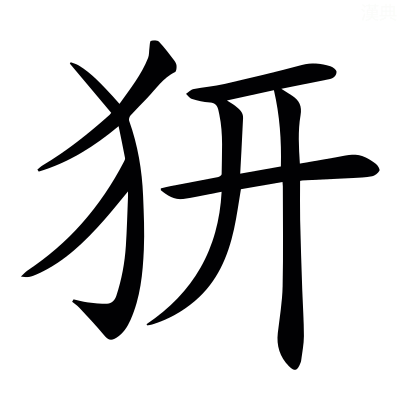
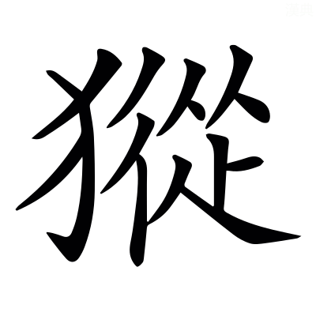
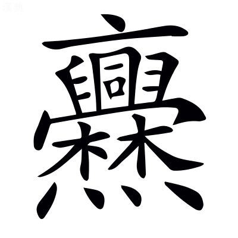

# 文選卷第三十五

> 梁昭明太子撰
> 
> 文林郎守太子右內率府錄事參軍事崇賢館直學士臣李善注上

七下

## 七命八首

> 張景陽

沖漠公子，含華隱曜。沖漠，沖虛恬漠也。范曄後漢書：孔融曰「南山四皓，潛光隱耀，世嘉其高也。」

嘉遯龍盤，~~翫~~超世高蹈[^35.1.1]。周易曰：嘉遯貞吉。尙書大傳曰：~~盤~~蟠龍賁信越其藏[^35.1.2]。*鄭玄曰：蟠，屈也。*左氏傳：齊人歌曰「魯人之皋，使我高蹈」也。

游心於浩然，玩志乎衆妙。莊子曰：乘物以游心。孟子曰：我善養吾浩然之氣。「敢問何謂浩然之氣？」曰「難言也。其為氣也，至大至剛，以直養而無害，則塞于天地之間。」老子曰：玄之又玄，衆妙之門。

絕景乎大荒之遐阻，吞響乎幽山之窮奧。山海經曰：大荒之中，有山名曰大荒之山。日月所入，是謂大荒之野。毛詩曰：幽幽南山。奧，隱處也。

於是~~殉~~徇華大夫[^35.1.3]聞而造焉。~~殉~~徇，營也。華，浮華。

乃敕雲輅，驂飛黃。東京賦曰：結飛雲之袷輅。淮南子曰：黃帝治天下，於是飛黃服皁。

越奔沙，輾流霜。劉劭七華曰：超重淵，越流沙。

凌扶搖之風，躡堅冰之津。莊子曰：摶扶搖而上者九萬里。*司馬彪曰：扶搖，上行風也。*列子曰：堅冰立散。

旌拂霄堮，軌出蒼垠。許慎淮南子注曰：垠堮，端崖也。

天清泠而無霞，野曠朗而無塵。臨重岫而攬轡，顧石室而迴輪。仲長子昌言曰：聞上古之隱士，或伏重岫之內，窟窮皋之底。列仙傳曰：赤松子常止西王母石室中。

遂適沖漠之所居。爾雅曰：適，之也。

其居也，崢嶸幽藹，蕭瑟虛玄。廣雅曰：崢嶸，深冥也。說文曰：玄，幽遠也。

溟海渾濩涌其後，嶰谷㟹嶆張其前。十洲記曰：東王所居處，山外有員海，員海水色正黑，謂之溟海。說文曰：渾，流聲也；後袞切。又曰：濩，霤下貌也；胡郭切。漢書曰：取竹之嶰谷。*音義曰：嶰谷，崑崙北谷名。*㟹嶆，深空之貌也。嶰音解。㟹音牢。嶆音曹。

尋竹竦莖蔭其壑，百籟群鳴聾其山。山海經曰：大荒之中有岳山，尋竹生焉。*郭璞曰：尋竹，大竹也。*莊子曰：地籟則衆竅是也。聾其山，謂衆聲既喧，山為之聾也。蒼頡篇曰：聾，耳不聞也。

衝飆發而迴日，飛礫起而灑天。鹽鐵論曰：衝風飄鹵，沙石凝積。東京賦曰：飛躒雨散。

於是登絕巘，溯長風。毛萇詩傳曰：巘，小山，別大山者也。薛綜西京賦注曰：溯，向~~風~~也[^35.1.4]。

陳辯惑之辭，命公子於巖中。論語：子張曰「敢問崇德辨惑。」

曰「蓋聞聖人不卷道而背時，智士不遺身而匿跡。應瑒釋賓曰：聖人不違時而遯跡，賢者不背俗而遺功。七啟曰：感分遺身。楚辭曰：聊竄端匿跡也。

生必耀華名於玉牒，沒則勒洪伐於金冊。東觀漢記曰：封禪其玉牒文祕。說文曰：牒，札也。陳琳韋端碑曰：撰勒洪伐，式昭德音。金冊，已見西京賦。

今公子違世陸沈，避地獨竄。陸沈，已見張景陽雜詩。孔安國尙書傳曰：違，避也。論語：子曰「賢者避世，其次避地。」

有生之歡滅，資父之義廢。漢書曰：夫人有生之最靈者也。孝經曰：資於事父以事君而敬同。

愁洽百年，苦溢千歲。古詩曰：人生不滿百，常懷千歲憂。

何異促鱗之游汀濘，短羽之棲翳薈。張升與任彥堅書曰：今將老弱處于窮澤，漸漬汀濘，當何聊賴？汀，吐冷切。說文曰：濘，絕小水也；奴冷切。孫子兵法曰：林木翳薈也。

今將榮子以天人之大寶，悅子以縱性之至娛。周易曰：天地之大德曰生，聖人之大寶曰位。列子，楊朱曰：從性而游，不逆萬物所好。七啟曰：說游觀之至娛。

窮地而游，中天而居。列子曰：穆王執化人之袪，騰而上者，中天乃止。

傾四海之歡，殫九州之腴。說文曰：歡，喜樂也。又曰：腴，腹下肥者。西都賓曰：華實之毛，則九州之上腴焉。

鑽屈轂之瓠，解疏屬之拘，子欲之乎？」言屈轂之瓠難鑽，疏屬之拘難解。今欲以辯而鑽解之也。韓子曰：齊有居士田仲者，宋人屈轂往見之，謂仲曰「轂有巨瓠，堅如石，厚而無竅，願效之先生。」田仲曰「堅如石，不可剖而斲；厚而無竅，不可以受水漿。吾無用此瓠為也。」屈轂曰「然其棄物乎？」曰「然。今先生雖不恃人之食，亦無益人之國矣。猶可棄之瓠也。」田仲若有所失，慚而不對。山海經曰：~~二~~貳負[^35.1.5]殺猰㺠，帝乃梏之疏屬之山，桎其右足，及縛兩手。

公子曰「大夫不遺，來萃荒外。毛萇詩傳曰：萃，集也。

雖在不敏，敬聽嘉話。」孝經曰：參不敏。說文曰：話，會合善言也。

大夫曰「寒山之桐，出自太冥。楚辭曰：北有寒山，卓龍赩然。北方極陰，故曰太冥。

含黃鍾以吐幹，據蒼岑而孤生。禮記曰：季夏之月，中央土，律中黃鍾之宮。尙書曰：嶧陽孤桐。孔安國曰：孤特生桐，中琴也。

既乃瓊巘嶒崚，金岸崥崹。瓊巘，玉山也。魯靈光殿賦曰：崱~~崚嶒~~繒綾而龍鱗[^35.1.6]。崥崹，漸平貌也。崥，步迷切。崹，徒奚切。

左當風谷，右臨雲谿。上無凌虛之巢，下無跖實之蹊。淮南子曰：鳥排虛而飛，獸蹠實而走。*高誘曰：實，地也。*廣雅曰：蹠，履也。跖與蹠同。

搖刖峻挺，茗邈苕嶢。搖刖，危貌也。茗邈，高貌也。茗，莫冷切。

晞三春之溢露，~~溯~~愬九秋之鳴飆[^35.1.7]。毛萇詩傳曰：晞，乾也。班固終南山賦曰：三春之季，孟夏之初。愬與溯同。已見上文。古樂府有歷九秋、妾薄相行。

零雪寫其根[^35.1.8]，霏霜封其條。毛萇詩傳曰：霏，雪貌也。霜亦雪類，故通言之。

木既繁而後綠，草未素而先彫。傅毅七激曰：陽春後榮，涉秋先彫。

於是構雲梯，陟崢嶸。墨子曰：公輸般為雲梯，必取宋。長笛賦曰：構雲梯，抗浮柱。郭璞方言注曰：崢嶸，高峻也。

剪蕤賓之陽柯，剖大呂之陰莖。禮記曰：仲夏之月，律中蕤賓。又曰：季冬之月，律中大呂。蒼頡篇曰：剖，析也。周禮曰：仲冬斬陽木，仲夏斬陰木。*鄭玄曰：陽木生於山南，陰木生於山北也。*

營匠斲其樸，伶倫均其聲。營匠，未詳。莊子曰：匠石之齊，見櫟杜樹，觀者如市，匠伯不顧。*司馬彪曰：石字伯。*說文曰：斲，斫也。漢書曰：黃帝使伶倫取嶰谷之竹，斷兩節，間而吹之，以為黃鍾之宮。制十二簫，以聽鳳皇之音，以比黃鍾之宮。

器舉樂奏，促調高張。禮記曰：金石絲竹，樂之器也。楊雄解~~嘲~~難曰[^35.1.9]：絃者，高張急徽。

音朗號鍾，韻清繞梁。楚辭曰：操伯牙之號鍾兮[^35.1.10]，挾秦箏而彈徵。尸子曰：繞梁之鳴，許史鼓之，非不樂也。墨子以為傷義，故不聽也。

追逸響於八風，采奇律於歸昌。風俗通曰：聲所以五者，繫五行也；音所以八者，繫八風也。淮南子曰：律之初生也，寫鳳之音。韓詩外傳曰：鳳舉曰上翔，集鳴曰歸昌。

啟中黃之少宮，發蓐收之變商。中黃，土色。禮斗威儀曰：少宮主政。*宋均曰：聲五而已，必加少宮、少商者，以君臣任重，為設副也。*劉向雅琴賦曰：彈少宮之際天，援中徵以及泉。禮記曰：孟秋之月，其神蓐收。淮南子曰：變宮生徵。變商生羽。

若乃龍火西頹，暄氣初收。漢書曰：東宮蒼龍房心，心為火，故曰龍火也。左氏傳曰：仲尼曰：火猶西流。禮記曰：仲秋陽氣日衰。

飛霜迎節，高風送秋。桓麟七說曰：飛霜厲其末，猋風激其崖。李尤七歎曰：季秋末際，高風猋厲。

羇旅懷土之徒，流宕百罹之疇。左氏傳：陳敬仲曰「羇旅之臣。」論語曰：小人懷土。謝忱後漢書序曰：士庶流宕，他州異境。毛詩曰：我生之後，逢此百罹。

撫促柱則酸鼻，揮危絃則涕流[^35.1.11]。舞賦曰：若絙瑟促柱。高唐賦曰：寒心酸鼻。廣雅曰：揮，動也。鄭玄論語注曰：危，高也。侯瑾箏賦曰：急絃促柱，變調改曲。陸機前緩歌行曰：大客揮高絃。意與此同也。

若乃追清哇，赴嚴節。張衡舞賦曰：含清哇而吟詠。蒼頡篇曰[^35.1.12]：哇，謳也。嚴節，急節也。漢書曰：隤銅丸以擿鼓，聲中嚴鼓之節。

奏綠水，吐白雪。淮南子曰：手會綠水之趍。*高誘曰：淥水，古詩也。*宋玉~~風~~諷賦曰[^35.1.13]：為幽蘭白雪之曲。

激楚迴，流風結。上林賦曰：激楚結風。*文穎曰：激，衝，急風也。*結風，迴風，亦急風也。楚地風氣既自漂疾，然歌樂者，猶復依激結之急風為節也。

悲蓂莢之朝落，悼望舒之夕缺。田俅子曰「堯為天子，蓂莢生於庭，為帝成歷。」鄭玄詩箋曰：悼，傷也。楚辭曰：前望舒使先驅。*王逸曰：望舒，月御也。*古詩曰：四五占兔缺。

煢釐為之擗摽，孀老為之嗚咽。左氏傳：初，莒有婦人，莒子殺其夫，己為釐婦。*杜預曰：寡婦為釐。*毛詩曰：寤擗有摽。*毛萇曰：擗，拊心貌。*淮南子曰：童子不孤，婦人不孀。*高誘曰：寡婦曰孀。*

王子拂纓而傾耳，六馬噓天而仰秣。列仙傳曰：王子喬，周靈王太子晉也。吹笙則鳳鳴。禮記曰：傾耳而聽之。孫卿子曰：昔者瓠巴鼓瑟，而鱏魚出聽。伯牙鼓琴，而六馬仰秣。黃伯仁龍馬賦曰：或有噓天慷慨，骨騰肉飛。說文曰：噓，吹噓；音虛。秣或為蹀也。

此蓋音曲之至妙。子豈能從我而聽之乎？」舞賦曰：天下之至妙。

公子曰「余病，未能也。」大夫曰「蘭宮祕宇，彫堂綺櫳。楚辭曰：彷徨兮蘭宮。魯靈光殿賦曰：乃立靈光之祕殿。說文曰：櫳，房室之疏也。

雲屏爛汗，瓊壁青蔥。禮記曰：疏屏，天子廟飾也。*鄭玄曰：屏，謂之樹，刻之為雲氣。*王褒甘泉賦云：耀照形之玉壁。

應門八襲，琁臺九重。毛詩曰：乃立應門。郭璞爾雅注曰：襲猶重也。汲郡古文曰[^35.1.14]：桀作傾宮，飾瑤臺。韓子：箕子曰「紂必為九重高臺也。」

表以百常之闕，圜以萬雉之墉。表，標也。百常，高也。西京賦曰：徑百常而莖擢。西都賦曰：建金城之萬雉。毛萇詩傳曰：墉，城也。

爾乃嶢榭迎風，秀出中天。方言曰：嶢，高也。郭璞爾雅注曰：榭，臺上起屋也。曹子建七啟曰：迎清風而立觀。國語曰：秀出於衆。秀，出貌也。列子曰：周穆王築臺，號曰中天之臺。

翠觀岑青，~~彫~~彤閣霞連[^35.1.15]。長翼臨雲，飛陛凌山。鄭玄禮記注曰：榮，屋翼也。魯靈光殿賦曰：飛陛揭孽，緣雲上征。

望玉繩而結極，承倒景而開軒。春秋元命苞曰：玉衡北兩星為玉繩。說文曰：極，棟也。陵陽子明經曰：倒景氣去地四千里，其景皆倒在下。軒，長廊之窗也。

頳素炳煥，枌栱嵯峨。毛萇詩傳曰：頳，赤也。說文曰：棼，複屋棟也。棼與枌古字通。

陰虯負檐，陽馬承阿。虯，龍也。楚辭曰：仰觀刻桷畫龍~~虯~~蛇[^35.1.16]。馬融梁將軍西第賦曰：騰極受檐，陽馬承阿。周書曰：明堂咸有四阿。

錯以瑤英，鏤以金華。廣雅曰：錯，廁也。范子計然曰：玉英出藍田。劉欣期交州記曰：金華出珠崖。謂金有華彩也。

方疏含秀，圓井吐葩。魯靈光殿賦曰：懸棟結阿，天窗綺疏。圓淵方井，反植荷蕖。張載曰：疏，刻鏤也。秀謂華也。

重殿疊起，交綺對幌。西京賦曰：交綺豁以疏寮。文字集略曰：幌以帛明窗也。

幽堂晝密，明室夜朗。焦螟飛而風生，尺蠖動而成響。晏子春秋：景公問於晏子曰「天下有極細乎？」對曰「東海有蟲，名曰焦螟。巢於蚊睫，飛乳去來，而蚊不覺。」周易曰：尺蠖之屈，以求伸也。

若乃目厭常玩，體倦帷幄。列子曰：聲色不可常玩聞。

攜公子而雙游，時娛觀於林麓。曹大家列女傳注曰：竹木曰林，山足曰麓。

登翠阜，臨丹谷。華草錦繁，飛采星燭。陽葉春青，陰條秋綠。華實代新，承意恣歡。仰折神虈，俯采朝蘭。本草經曰：白芷，一名虈；許妖切。

溯~~蕙~~惠風於~~衡~~蘅薄[^35.1.17]，眷椒塗於瑤壇。邊讓章華臺賦曰：~~蕙~~惠風春施。洛神賦曰：踐椒塗之郁烈，步~~衡~~蘅薄而流芳。漢書曰：遍觀此，眺瑤堂。王逸楚辭注曰：壇猶堂也。

爾乃浮三翼，戲中沚。越絕書：伍子胥水戰兵法內經曰「大翼一艘，長十丈；中翼一艘，長九丈六尺；小翼一艘，長九丈。」毛詩曰：宛在水中沚。

潛鰓駭，驚翰起。蘇林漢書注曰：鰓音魚鰓。今呼魚謂之鰓，猶呼車以為軫也。鄭玄詩箋曰：翰，鳥中豪俊者也。

沈絲結，飛矰理。毛詩曰：其釣維何，維絲伊緡。*毛萇曰：緡，綸也。鄭玄曰：以絲為之綸。*周禮曰：矰矢用諸弋射。*鄭玄曰：結繳於矢，謂之矰也。*

挂歸翮於赤霄之表，出華鱗於紫淵之裏。歸翮，鴻鴈之屬也。淮南子曰：夫鴻鵠，背負蒼天，膺摩赤霄。上林賦曰：紫淵徑其北。

然後縱棹隨風，弭楫乘波。杜預左氏傳注曰[^35.1.18]：縱，放也。毛萇詩傳曰：弭，止也。

吹孤竹，拊雲和。周禮曰：孤竹之管，雲和之琴瑟。*鄭玄曰：孤竹，竹特生者。雲和，山名。*

淵客唱淮南之曲，榜人奏采菱之歌。淵客，習水者也。吳都賦：淵客慷慨而泣珠。漢書曰：淮南鼓員四人。子虛賦曰：榜人歌。*張揖曰：船長也。*淮南子曰：歌采菱，發陽阿也。

歌曰：乘鳧舟兮為水嬉，穆天子傳曰：天子乘鳧舟。*郭璞曰：舟為鳧形制。今吳之青雀舫，此其遺象也。*琴道：雍門周曰「水嬉則舫龍舟。」

臨芳洲兮拔靈芝[^35.1.19]。楚辭曰：采芳洲兮杜若。西京賦曰：擢靈芝之朱柯。

樂以忘戚，游以卒時。論語：子曰「樂以忘憂。」家語：孔子歌曰「優哉游哉，聊以卒歲。」

窮夜為日，畢歲為期。此蓋宴居之浩麗，子豈能從我而處之乎？」毛詩曰：或燕燕居息。浩，猶大也。

公子曰「余病，未能也。」大夫曰「若乃白商素節，月既授衣。周禮曰：西方白。禮記曰：孟秋之月，其音商。劉植與臨淄侯書曰：肅以素秋則落。毛詩曰：九月授衣。

天凝地閉，風厲霜飛。凝猶結也。禮記曰：仲冬之月，塗城闕，築囹圄，助天地之閉藏也。

柔條夕勁，密葉晨稀。將因氣以效殺，臨金郊而講師。禮記曰：季冬之月，天子乃教於田獵。劉向尙書五行說曰：金，西方。萬物既成，殺氣之始也。故立秋出軍，行師西方為金，故曰金郊也。國語：虢文公曰「三時務農，一時講武。」

爾乃列輕武，整戎剛。輕武戎剛，四車名也。司馬彪續漢書曰：輕車，古之戰車也。不巾不蓋。韓子曰：管仲之始~~治~~化也[^35.1.20]，桓公武車。元戎，已見上文。~~輕武，卒名也。戎剛，車名也。東京賦：總輕武於後陳，奏嚴鼓之嘈囐。~~[^35.1.21]漢書曰：衛青令武剛車自環為營[^35.1.22]。*張晏曰：兵車也。*

建雲髦，啟雄芒。雲髦，雲旆竿上施旄也。上林賦曰：連雲旆。髦與旄古字通。子虛賦曰：建干將之雄戟。芒，鋒刃也。漢書：賈誼曰「解十二牛而芒刃不頓。」

駕紅陽之飛燕，驂唐公之驌驦。紅陽飛燕，未詳。或曰：駿馬圖有含陽、侯驃，疑含即紅聲之誤也。左氏傳曰：唐成公有兩驌驦馬。*馬融曰：驌驦，鴈也，馬似之。*

屯羽隊於外林，縱輕翼於中荒。羽隊，士負羽而為隊也。羽獵賦曰：蒙盾負羽而羅者以萬計。翼，左右甄也。越絕書曰：子胥兵分為兩翼，夜火相望。

爾乃布飛羉~~或云飛羅~~[^35.1.23]盧端切。

張脩罠。爾雅曰：彘罟謂之羉，或作罠；音旻。~~夫~~天[^35.1.24]然羉罠一以為對，恐互體。廣雅曰：罠，兔罟也。[^35.1.25]劉逵吳都賦注曰：罠，麋網也。然張氏之意，蓋同劉說。羉或為羅。

陵黃岑，挂青巒。爾雅曰：巒，嶞也。*郭璞曰：山嶞長者，荊州謂之巒。*

畫長~~豁~~壑以為限[^35.1.26]，帶流谿以為關。既乃內無疏蹊，外無漏跡。廣雅曰：疏，通也。七啟曰：下無漏跡，上無逸飛。

叩鉦~~數~~散校[^35.1.27]，舉麾旌獲。周禮曰：鼓鉦鳴鐲車皆行。*鄭玄曰：鐲，鉦也。散為陣列而行也。*漢書曰：大校獵。*如淳曰：合軍聚衆，有幡校也。*周禮曰：建大麾以田。*鄭玄曰：不在九旗之中。*周禮曰：服不氏，射則贊張侯，以旌居乏而待獲。*鄭玄曰：待獲，待射者中[^35.1.28]，舉旌以獲也。*

彀金機。馳鳴鏑。說文曰：彀，張弓弩。機，弩牙也，以金為之。漢書曰：冒頓乃作為鳴鏑。*音義曰：箭，鏑也。如今鳴箭是也。*

剪剛豪，落勁翮。車騎競騖，駢武齊轍。說文曰：騖，亂馳也。駢，並也。毛萇詩傳曰：武，跡也。杜預左氏傳注曰：轍，車跡也。

翕忽揮霍，雲迴風烈。[^35.1.29]聲動響飛，形移景發。孫卿子曰：下之和上，譬猶響之應聲，影之隨形。

舉戈林竦，揮鋒電滅。東京賦曰：戈矛若林。廣雅曰：竦，立也。

仰傾雲巢，俯殫地穴。周禮有穴氏。*鄭玄曰：穴，搏蟄獸所藏者也。*

乃有圓文之，班題之。毛萇詩傳曰：豕一歲曰。又鄭玄曰：豕生三子曰也。然此、指諸獸，不專論豕也。

鼓鬣風生，怒目電瞛。瞛，光也；七從切。

口齩霜刃，足撥飛鋒。說文曰：齩，齧骨也；胡狡切。廣雅曰：撥，除也；補達切。

~~齀~~鼿林蹶石[^35.1.30]，扣跋幽叢。~~齀~~鼿，以鼻搖動也；五忽切。郭璞爾雅注曰：蹶，動搖之貌也；居月切。孔安國論語注曰：扣，擊也。毛萇詩傳曰：跋，躐也。扣跋，或謂卻伏也。

於是飛黃奮銳，賁石逞技。史記曰：~~蜚~~飛廉[^35.1.31]以材力事殷紂。尸子：中黃伯曰「余左執太行之獶，而右搏雕虎。」說苑曰：勇士孟賁，水行不避蛟龍，陸行不避虎狼。吳越春秋曰：夫差使王孫聖占夢，聖曰「占之不吉。」王怒，使力士石蕃以鐵椎椎殺聖。張華博物志曰：石蕃，衛臣也。背負千二百斗沙。

蹙封狶，僨馮豕。淮南子曰：~~伍~~申包胥曰[^35.1.32]「吳為封狶脩蛇。」小雅曰：封，大也。方言曰：南楚人謂豬為狶。爾雅曰：僨，僵也；甫運切。僨或為㩌，非也。王逸楚辭注曰：馮，大也。拉甝虪，挫獬廌。爾雅曰：甝，白虎。虪，黑虎。張揖漢書注曰：獬廌，似鹿而一角也。

勾爪摧，鋸牙捭。淮南子曰：勾爪、鋸牙，於是摯矣。說文曰：捭，兩手擊也；補買切。

瀾漫狼藉，傾榛倒壑。說文曰：草編狼藉也。

殞胔挂山，僵踣掩澤。鄭玄周禮注曰：四足死者曰胔。爾雅曰：僵，仆也。郭璞爾雅注曰：踣，前覆也。張揖上林賦注曰：掩，覆也。

藪為毛林，隰為丹薄。鄭玄周禮注曰：澤無水曰藪也。廣雅曰：草叢生曰薄。

於是撤圍頓罔，卷旆收鳶。鄭玄~~禮~~儀禮注曰[^35.1.33]：撤，除也。頓猶捨也。禮記曰：前有塵埃，則載鳴鳶。

虞人數獸，林衡計鮮。周禮有虞人，又有林衡。孔安國尙書傳曰：鳥獸新殺曰鮮。

論最犒勤，息馬韜弦。張晏漢書注：最，功第一也。西京賦曰：犒勤賞功。杜預左氏傳注曰：犒，勞也。又曰：韜，藏也。

肴駟連鑣，酒駕方軒。說文曰：鑣，馬銜也。西京賦曰：酒車酌醴，方駕授饔。

千鐘電釂，萬燧星繁。孔叢子曰：堯飲千鐘。西京賦曰：升觴舉燧，既釂鳴鍾。說文曰：釂，飲酒盡也。

陵阜霑流膏，谿谷厭芳煙。歡極樂殫，迴節而旋。鄭玄周禮注曰：節，信也。行者所執之信也。

此亦田游之壯觀，子豈能從我而為之乎？」封禪文曰：天下之壯觀。

公子曰「余病，未能也。」大夫曰「楚之陽劍，歐冶所營。越絕書曰：楚王召風胡子而問之曰「寡人聞吳有干將，越有歐冶子，寡人願齎邦之重寶，請此二人作為鐵劍，可乎？」於是風胡子之吳，見歐冶干將，使之作鐵劍三枚，一曰龍淵，二曰太阿，三曰工市。陽劍，見下文。

邪谿之鋌，赤山之精。越絕書曰：越王勾踐有寶劍五，聞於天下。客有能相劍者，名曰薛燭，王召而問之，對曰「當造此劍之時，赤堇之山破而出錫，若耶之溪涸而出銅。」許慎淮南子注曰：鋌，銅鐵璞也；徒鼎切。精，謂其中尤善者。

銷踰羊頭，鏷越鍛成。淮南子曰：苗山之鋌，羊頭之銷，雖水斷龍髯，陸剸兕甲，莫之服帶。*許慎曰：銷，生鐵也。高誘曰：苗山利金，所出羊頭之銷，白羊子刀也。*鏷或~~謂~~為鍱[^35.1.34]。廣雅曰：鍱，鋌也。謝承後漢書曰：孝章皇帝賜諸尙書劍，手自署姓名，尙書陳寵濟南鍛成。蒼頡書曰：鍛，椎也。

乃鍊乃鑠，萬辟千灌。說文曰：煉，冶金也。賈逵國語注曰：鑠，銷也。說文曰：銷，鑠金也。辟，謂疊之。灌，謂鑄之。典論曰：魏太子丕造百辟寶劍，長四尺。王粲刀銘曰：灌辟以數，質象以呈。

豐隆奮椎，飛廉扇炭。越絕書：薛燭曰「當造此劍之時，雨師灑掃，雷公擊橐，蛟龍捧爐，天帝裝炭。」思玄賦注曰：豐隆，雷公也。王逸楚辭注曰：飛廉，風伯也。

神器化成，陽文陰縵。吳越春秋曰：干將者，吳人。造劍二枚，一曰干將，二曰莫耶。莫耶者，干將之妻名也。干將曰「吾師之作冶也，金鐵之類不銷，夫妻俱入冶爐之中。」莫耶曰「先師親爍身以成物，妾何難也。」於是干將夫妻乃斷髮揃爪，投之爐中，使童女三百鼓橐裝炭，金鐵乃濡，遂以成劍。陽曰干將，而作龜文；陰曰莫耶，而漫理。干將匿其陽出其陰而獻之闔閭。闔閭甚重之。

流綺星連，浮綵豔發。綺，光色也。越絕書曰：王取純鈞。薛燭觀其釧爛如列星之行。典論曰：太子丕劍銘曰「流采色，似采虹。」釧，齒掾切。

光如散電，質如耀雪。莊子曰：此劍一用，如雷霆之震也[^35.1.35]。魏文帝大牆上蒿行曰：我帶長寶劍，光白如積雪。

霜鍔水凝，冰刃露潔。典論曰：魏太子丕造素質，堅而似霜。造匕首，理似堅冰。聲類曰：鍔，刀刃也。字書曰：凝，冰之潔也。越絕書曰：王取純鈞，薛燭觀其光，如水之溢於塘；觀其文，煥煥如冰之將釋。

形冠豪曹，名珍巨闕。越絕書曰：越王取豪曹，薛燭曰「豪曹非寶劍也。夫寶劍五色並見，莫能相勝，曹已擅名矣，非寶劍也。」王取巨闕，曰「非寶劍也。夫寶劍者，金錫和銅而不離，今巨闕已離矣，非寶劍也。」

指鄭則三軍白首，麾晉則千里流血。越絕書曰：楚王作鐵劍三枚，晉鄭聞而求之，不得。興師圍楚之城，三年不解。於是楚引太阿之劍，登城而麾之，三軍破敗，士卒迷惑，流血千里，晉鄭之軍頭畢白也。

豈徒水截蛟鴻，陸灑奔駟，韓非子曰：負長劍，赴榛薄，折兕豹，赴深淵，斷蛟龍。戰國策曰：蘇秦曰「韓卒之劍，水擊鴻鴈。」越絕書曰：勾踐示薛燭巨闕曰「吾坐露壇之宮，有駟駕白鹿而過者，車奔馬騰，吾引劍而指之，駟駕上飛揚，不知其絕也。」

斷浮翮以為工，絕重甲而稱利云爾而已哉！浮翮，鴻鴈也，已見上注。史記：蘇秦說韓王曰「韓卒之劍，當敵則斬堅甲。」

若其靈寶，則舒辟無方，奇鋒異模。說文曰：舒，申也。晉灼漢書注曰：方，常也。鄭玄毛詩箋曰：模，法也。

形震薛蜀，光駭風胡。越絕書為燭，吳越春秋為蜀。蓋一人也。

價兼三鄉，聲貴二都。越絕書：勾踐示薛燭純鈞曰「客有買之者，有市之鄉二，駿馬千匹，千戶之都二，可乎？」薛燭曰「雖傾城量金，珠玉滿河，猶不得此一物，況有市之鄉二，駿馬千匹，千戶之都二，何足言哉！」然實二鄉，而云三者，避下文也。

或馳名傾秦，或夜飛去吳。越絕書曰：闔廬無道，湛盧之劍去之入水。行湊楚，楚王臥而設湛盧之劍也。秦王聞而求之，不得，興師擊楚，曰「與我湛盧之劍，還師去汝。」楚王不與。

是以功冠萬載，威曜無窮。揮之者無前，擁之者身雄。說文曰：揮，奮也。漢書：元后詔曰「奮無前之威。」

可以從服九國，橫制八戎。過秦曰：秦人開關延敵，九國之師遯逃而不敢進。史記：趙良曰「五羖大夫相秦，施德諸侯，而八戎來服。」

爪牙景附，函夏承風。毛詩曰：祈父予王之爪牙。崔琰大將軍夫人寇氏誄曰「英雄景附。」楊雄河東賦曰：函夏之大漢。家語：孔子曰「舜之為君，四海承風。」

此蓋希世之神兵，子豈能從我而服之乎？」魯靈光殿賦曰：邈希世而特出。

公子曰「余病，未能也。」大夫曰：「天驥之駿，逸態超越。天驥，天馬也。驥或為機。傅玄乘輿馬賦曰：九方不能測其天機。列子：伯樂曰「九方皋之所觀天機也。」

稟氣靈淵，受精皎月。孔安國尙書傳曰：稟，受也。遯甲開山圖曰：隴西神馬山有淵池，龍馬所生。春秋考異郵曰：地生月精為馬。月數十二，故馬十二月而生。

眸瞷黑照，玄采紺發。趙岐孟子注曰：眸，目瞳子也。說文曰：瞷，戴目也；音閑。說文曰：紺，深青而赤色。

沬如揮紅，汗如振血。漢書：天馬歌曰「霑赤汗，染流赭。」*應劭曰：大宛馬，汗血霑濡也，流沬如赭也。*韓康伯周易注曰：揮，散也。薛君韓詩章句曰：振猶奮也。

秦青不能識其衆尺，方堙不能睹其若滅。呂氏春秋曰：古者善相馬者，管青相脣吻，秦牙相前，皆天下良士也。若趙之王良，秦之伯樂、九方堙，尤盡其妙矣。相馬經曰：夫法千里馬，有三十六尺四寸。列子：伯樂曰「天馬者，若滅若沒，若亡若失。若此者，絕塵弭轍。」

爾乃巾雲軒，踐朝霧。鄭玄周禮注曰：巾猶衣也。雲軒，已見上。

赴春衢，整秋御。秋御，秋駕也。司馬彪莊子注曰：秋駕，法駕也。

虯蛹螭騰，麟超龍翥。甘泉賦曰：駟蒼螭兮六素虯。劉梁七舉曰：天馬之號，出自西域。纖阿為右，御以術儀；攬轡舒節，凌雲先螭。尸子曰：馬有騏驎徑駿。南都賦曰：馬鹿超而龍駿。

望山載奔，視林載赴。氣盛怒發，星飛電駭。李尤七嘆曰：神奔電驅，星流矢驚，則莫若益野驣駒也[^35.1.36]。

志凌九州，勢越四海。景不及形，塵不暇起。劉廣世七興曰：駿駔之馬，影不及形，塵不暇興也。

浮箭未移，再踐千里。浮箭，謂漏刻也。

爾乃踰天垠，越地隔。過汗漫之所不游，躡章亥之所未跡。准南子：若士曰「吾與汗漫期於九垓之上。若士舉臂竦身而遂入雲中。」又曰：禹乃使大章步自東極，至於西極，二億三萬三千五百里七十步；使豎亥步自北極，至於南極，二億三萬三千五百七十里。

陽烏為之頓羽，夸父為之投策。春秋元命苞曰：陽成於三，故日中有三足烏，烏者陽精。山海經曰：夸父與日競走，渴飲河渭，河渭不足，北飲大澤，未至，道渴而死。棄其杖為鄧林。

斯蓋天下之雋乘，子豈能從我而御之乎[^35.1.37]？」公子曰「余病，未能也。」大夫曰「大梁之黍，瓊山之禾，大梁黍，未詳。瓊山禾，即崑崙之山木禾。山海經曰：崑崙之上，有木禾，長五尋，大五圍。

唐稷播其根，農帝嘗其華。尙書：帝曰「汝后稷，播時百穀。」賈誼曰：神農嘗百草之實，教人食穀者也。

爾乃六禽殊珍，四膳異肴。周禮曰：庖人掌共六禽。*鄭司農注曰：鴈鶉鷃雉鳩鴿。*禮記曰：孟春食麥與羊，孟夏食菽與雞，孟秋食麻與犬，孟冬食黍與彘。

窮海之錯，極陸之毛。尙書曰：海物惟錯，禮記曰：加豆，陸產也。穀梁傳曰：凡地之所生，謂之毛。

伊公鼎，庖子揮刀。伊公，伊尹也。韋昭漢書注曰：，灼也。庖子，庖丁也。

味重九沸，和兼勺藥。呂氏春秋：伊尹說湯曰「凡味之本，水最為始。五味三和，九沸九變，為火之紀。」*高誘曰：紀，節也。味待火然後成，故曰火為之節也。*文穎上林賦注曰：勺藥，五味之和。

晨鳧露鵠，霜鵽黃雀。說苑曰：魏文侯嗜晨鳧。霜露降，鵠鵽美。南都賦曰：歸鴈鳴鵽。楚辭曰：煎~~鯖~~鰿臛雀[^35.1.38]。*王逸曰：臛，黃雀也。*

圜案星亂，方丈華錯。鹽鐵論曰：垂拱持案食者，不知蹠耒躬耕者之勤也。墨子曰：美食方丈，目不能遍視，口未能遍味也。列女傳曰：方丈於前，所甘不過一肉也。

封熊之蹯，翰音之跖。左氏傳曰：晉靈公宰夫胹熊蹯不熟。禮記曰：雞曰翰音。呂氏春秋曰：善學者，若齊王之食雞也。食其跖數千，而後足也。

鷰髀猩脣，髦殘象白。呂氏春秋：伊尹說湯曰「肉之美者，嶲鷰之髀。」孫炎爾雅注曰：嶲，胡圭切。說文曰：髀，股外也；裨爾切。呂氏春秋：伊尹曰「肉之美者，猩猩之脣，髦象之約。」*高誘曰：髦，髦牛也，在西方。象，象獸也，在南方。~~取其遠方物之~~約，美也[^35.1.39]。髦象之肉美，貴異味也。*殘白，蓋煮肉之異名也。崔駰博徒論曰：鷰臛羊殘，炙鴈煮鳧。

靈淵之龜，萊黃之鮐。七啟曰：寒~~方~~芳苓之巢龜[^35.1.40]。鹽鐵論曰：江湖之魚，萊黃之鮐，不可勝也。漢書：東萊郡有黃縣。說文曰：鮐，海魚也；待來切。

丹穴之鷚，玄豹之胎。山海經曰：丹穴之山有鳥焉，其狀如鶴，五采，名曰鳳。說文曰：鷚，鳥大~~鴝~~鶵也[^35.1.41]。列女傳：陶答子妻曰「南山有玄豹。」六韜曰：殷君玉杯象箸，不盛菽藿之羹，必將熊蹯豹胎也。

燀以秋橙，酟以春梅。左氏傳：晏子曰「和如羹焉，水火醯醢鹽梅，以烹魚肉，燀之以薪。」*杜預曰：燀，炊之也。*博物志曰：橙，似橘而非，若柚而有芬香。劉梁七舉曰：酟以醢䤈，和以密飴。廣雅曰：沾，溢也。酟與沾同也；他兼切。尙書曰：若作和羹。爾惟鹽梅。

接以商王之箸，承以帝辛之杯。商王帝辛，皆謂紂也。史記曰：帝乙崩，子辛立，是為帝辛，天下謂之紂。六韜曰：殷君陳玉杯象箸。韓子曰：紂為象箸，箕子曰「象箸玉杯，不盛菽藿者也。」

范公之鱗，出自九溪。陶朱公養魚經曰：威王聘朱公，問之曰「公家累億金，何術乎？」朱公曰「夫為生之法五，水畜第一。所謂水畜者，魚池也。以六畝地為池，池中有九洲，即求懷子鯉魚，以二月上旬庚日內池中。養鯉者，鯉不相食，易長又貴也。」

頳尾丹鰓，紫翼青鬐。毛詩曰：魴魚頳尾。丹鰓，已見上文。上林賦曰：揵鬐掉尾，振鱗奮翼。

爾乃命支離，飛霜鍔。莊子曰：朱泙漫學屠龍於支離益，殫千金之家，三年技成，而無所用其巧。*司馬彪曰：朱，姓也；泙漫，名也。益，人名也。*泙，普彭切。霜鍔，已見上文。

紅肌綺散，素膚雪落。七啟曰：玄熊素膚。又曰：離若散雪。

婁子之豪不能廁其細，秋蟬之翼不足擬其薄。孟子曰：離婁者，古明目者也。能視百步之外，見秋毫之末。楚辭曰：蟬翼為重。

繁肴既闋，亦有寒羞。蒼頡篇曰：闋，訖也。周禮曰：朝事之籩。*鄭司農曰：朝事，謂清朝未食，先進寒具口實之籩也。*

商山之果，漢皋之楱。漢書曰：四人者，秦之世，避而入商雒深山。已見西都賦。漢皋，已見南都賦。~~韓詩外傳曰：鄭交甫遵彼漢皋臺下。~~[^35.1.42]郭璞上林賦注曰：楱，亦橘之類也；音湊，或曰楱[^35.1.43]。

析龍眼之房，剖椰子之殼。劉淵林吳都賦注曰：龍眼如荔枝而小，味甘。又曰：椰樹似檳榔，實大如瓠，裏有汁，美如蜜，核可作飲器，殼即核也。凡物內盛者皆謂之殼；苦角切，協韻苦豆切。

芳旨萬選，承意代奏。鄭玄周禮注曰：選，擇也。孔安國尙書傳曰：奏，進也。

乃有荊南烏程，豫北竹葉。盛弘之荊州記曰：淥水出豫章康樂縣，其間烏程鄉，有酒官取水為酒，酒極甘美，與湘東酃湖酒，年常獻之，世稱酃淥酒。吳錄地理志曰[^35.1.44]：吳興烏程縣，酒有名。張華輕薄篇曰：蒼梧竹葉清，宜城九醞酒。

浮蟻星沸，飛華蓱接。南都賦曰：醪敷徑寸，浮蟻如蓱。

玄石嘗其味，儀氏進其法。博物志曰：玄石從中山酒家酤酒，酒家與之千日之酒。戰國策：魯君曰「昔帝女儀狄作酒而美，進之於禹也。」

傾罍一朝，可以流湎千日。薛君韓詩章句曰：齊顏色，均衆寡，謂之流。閉門不出客，謂之湎。漢書：谷永曰「流湎媟嫚。」千日，已見上文。

單醪投川，可使三軍告捷。黃石公記曰：昔良將之用兵也，人有饋一簞之醪，投河，令衆迎流而飲之。夫一簞之醪，不味一河，而三軍思為致死者，以滋味及之也。

斯人神之所歆羨，觀聽之所煒曄也。毛詩曰：帝謂文王，無然歆羨。說文曰：歆，神食氣也。方言曰：煒，盛也。*郭璞曰：暐曄，盛貌也。*

子豈能強起而御之乎？」公子曰「耽~~口~~爽口之饌[^35.1.45]，甘腊毒之味。老子曰：五味令人口爽。廣雅曰：爽，傷也。國語：單襄公謂魯成公曰「高位寔疾顛；厚味寔腊毒。」*賈逵曰：顛，隕也。腊，久也。言味厚者，其毒久。*

服腐腸之藥，御亡國之器。呂氏春秋曰：肥肉厚酒，以務相彊，命曰爛腸之食，亡國之器。象箸、玉杯，已見上文。

雖子大夫之所榮，故亦吾人之所畏。余病，未能也。」大夫曰「蓋有晉之融皇風也，金華啟徵，大人有作。杜預左氏傳注曰：融，朗也。晉為金德，故曰金華。周易曰：利見大人。又曰：聖人作，而萬物睹。

繼明代照，配天光宅。周易曰：明兩作離，大人以繼明照于四方。毛詩序曰：思文后稷，配天也。尙書序曰：昔在帝堯，光宅天下。

其基德也，隆於姬公之處岐。姬公，文王也。~~國語曰：太上基德，十五王而始平之。孟子曰：昔文王之治岐也，仕者世祿。~~[^35.1.46]文王處岐，已見思玄賦。

其垂仁也，富乎有殷之在亳。尙書：仲虺曰「惟王克寬克仁，彰信兆民。」*孔安國曰：言湯有寬仁之德。*尙書序曰：湯既黜夏命[^35.1.47]，復歸於亳。

南箕之風，不能暢其化。離畢之雲，無以豐其澤。尙書曰：星有好風，星有好雨。春秋緯曰：月失其行，離於箕者風；離於畢者雨。

皇道煥炳，帝載緝熙。景福殿賦曰：樂我皇道。尙書：舜曰「有能奮庸，熙帝之載。」詩曰：維清緝熙，文王之典。

導氣以樂，宣德以詩。呂氏春秋曰：陶唐氏之化，陰多滯伏，陽道壅塞，人氣鬱閼，筋骨攣縮，作舞宣導之。國語曰：王將鑄無射，問律於泠州鳩，對曰「律，所以立均度，所以宣布哲人之令德，示民軌儀也。」

教清於雲官之世，治穆乎鳥紀之時。左氏傳曰：郯子來朝，公與之宴。昭子問焉，曰「少皞氏鳥名，何故也？」郯子曰「昔者黃帝氏以雲紀，故為雲師而雲名。我高祖少皞摯之立也，鳳鳥適至，故以鳥紀，為鳥師而鳥名也。」

王猷四塞，函夏謐寧。毛詩曰：王猶允塞。猶與猷同，已見上文。爾雅曰：謐，寧也。

丹冥投烽，青徼釋警。丹，南方朱冥也。楚辭曰：歷祝融於朱冥。*王逸曰：朱冥之野也。青徼，東方也。*呂氏春秋曰：禹東至青羌之野，南至交阯丹粟。范曄後漢書：遼東徼外貊人寇右北平。張揖漢書注曰：徼，塞也。以木柵水中，為夷狄之界也。

卻馬於糞車之轅，銘德於昆吳之鼎。老子曰：天下之道，卻走馬以糞。*王弼曰：天下有道，脩於內而已。故卻走馬以糞田。*東京賦曰：卻走馬以糞車。墨子曰：昔夏開使飛廉採金於山，以鑄鼎於昆吳。蔡邕銘論曰：呂尚作周太師而封齊，其功銘於昆吾之冶也。

群萌反素，時文載郁。素，樸素也。東京賦曰：遵節儉，尚素樸。論語：子曰「周監於二代，郁郁乎文哉。」

耕父推畔，魚豎讓陸。文子曰：黃帝之化天下，田者讓畔。淮南子曰：黃帝化天下，漁者不爭坻。

樵夫恥危冠之飾，輿臺笑短後之服。長楊賦曰：士有不談王道者，即樵夫笑之。韓非子曰：解其長劍，免其危冠。左氏傳曰：人有十等，皁臣僕，僕臣臺。莊子：魏太子謂莊周曰「吾王所見，唯劍士短後之服。」王乃說之也。

六合時邕，巍巍蕩蕩。呂氏春秋曰：神通乎六合。尙書曰：黎民於變時雍。論語：子曰「大哉堯之為君，蕩蕩乎民無能名焉；巍巍乎其有成功也。」

玄齠巷歌，黃髮擊壤。埤蒼曰：髫，髮也。髫與齠古字通也；大聊切。列子曰：堯理天下，乃微服游康衢，聞兒童謠曰「立我蒸民，莫匪爾極；不識不知，順帝之則。」毛詩曰：黃髮台背。爾雅曰：黃髮，壽也。論衡曰：堯時天下大和，百姓無事，有五十之人擊壤於塗也。

解羲皇之繩，錯陶唐之象。周易曰：上古結繩而治。尙書大傳曰：唐虞之象刑，赭衣不純；中刑雜屨，下刑墨幪。幪音蒙也。

若乃華裔之夷，流荒之貊。左氏傳：孔子曰「裔不謀夏，夷不亂華。」尙書曰：五百里荒服。又曰：二百里流。*孔安國曰：要服之外，五百里也。*周書曰：四夷九貊。*孔晁曰：貊，夷之別也。*

語不傳於輶軒，地不被乎正朔。風俗通曰：秦周常以八月輶軒，使採異代方言，藏之祕府。春秋說題辭曰：蠻服流遠，正朔不及，盛德則感越裳重譯至也。

莫不駿奔稽顙，委質重譯。毛詩曰：駿奔走在廟。喻巴蜀曰：稽顙來享。禮記曰：拜而後稽顙。左氏傳：狐突曰「策名委質，貳乃辟也。」重譯，見上文。

于時昆蚑感惠，無思不擾。毛詩序曰：文王德及鳥獸昆蟲焉。說文云：蚑，行也。凡生之類，行皆蚑也。毛詩曰：無思不服。應劭漢書注曰：擾，馴也。

苑戲九尾之禽，囿棲三足之~~烏~~鳥[^35.1.48]。春秋元命苞曰：天命文王以九尾狐。白虎通曰：禽者何，鳥獸之總名。明為人所禽制也。典引曰：三足軒翥於茂林。蔡邕曰：烏，反哺之鳥，至孝之應也。

鳴鳳在林，夥於黃帝之園。禮瑞命記曰：黃帝服黃服，戴黃冠，齋于宮，鳳乃蔽日而來，止帝園，食竹實，棲帝梧桐，終不去。漢書曰：楚人謂多為夥。

有龍游淵，盈於孔甲之沼。左氏傳：蔡墨曰「有夏孔甲，擾于有帝，帝賜之乘龍，河漢各二，各有雌雄也。」*杜預曰：孔甲，少康之後九世之君也。*

萬物煙熅，天地交泰。周易曰：天地絪縕，萬物化醇。又曰：天地交泰。

義懷靡內，化感無外。莊子：遍謂周曰「吾知道，近乎無內，遠乎無外。」

林無被褐，山無韋帶。老子曰：聖人被褐懷玉。漢書：賈山上疏曰「夫布衣韋帶之士，脩身於內，成名於外。」

皆象刻於百工，兆發乎靈蔡。尙書曰：高宗夢得說，使百工營求諸野。乃審象旁求於天下。*孔安國曰：審所夢之人，刻其形象也。*史記曰：呂尚年老矣，以漁釣奸周。西伯將畋，卜之曰「所獲霸王之輔。」於是西伯獵，果遇太公。論語：子曰「臧文仲居蔡。」*鄭玄曰：蔡，謂國君之守龜也。*

搢紳濟濟，軒冕藹藹。封禪書曰：因雜搢紳先生之略術。毛萇詩傳曰：濟濟，多威儀也。管子曰：先生制軒冕，足以著貴賤。廣雅曰：藹藹，盛也。

功與造化爭流，德與二儀比大。」淮南子曰：大丈夫無為，與造化逍遙。周易曰：易有太極，是生兩儀。嚴君平老子指歸曰：功與造化爭流，德與天地齊光。

言未終，公子蹶然而興，莊子曰：黃帝問廣成子，廣成子蹶然而起。*司馬彪曰：蹶，疾起貌。*

曰「鄙夫固陋，守此狂狷。鄙夫，已見西征賦。司馬遷書曰：請略陳固陋。論語：子曰「不得中行而與之，必也狂狷乎？狂者進取，狷者有所不為也。」

蓋理有毀之，而爭寶之訟解；莊子曰：庚市子肩之毀玉也。淮南子莊子后解曰：庚市子，聖人無慾者也。人有爭財相鬥者，庚市子毀玉於其間，而鬥者止。

言有怒之，而齊王之疾痊。呂氏春秋曰：齊閔王病瘠，往宋迎文摯。文摯視王疾，謂太子曰「王病得怒當愈。愈則殺摯，如何？」太子曰「臣當與母共請於王，必不殺子矣。」摯往，不解屨，登床履衣，問王之疾，王怒，叱而起，病即瘳。將生烹文摯，太子與后請，不得，遂烹文摯。司馬彪莊子注曰：痊，除也。

向子誘我以聾耳之樂，棲我以蔀家之屋。老子曰：五音令人耳聾。周易曰：豐其屋，蔀其家。覆曖障光之物也。既豐其屋，又覆其家，屋厚家覆，闇之甚也。

田游馳蕩，利刃駿足。既老氏之攸戒，非吾人之所欲。故靡得而應子[^35.1.49]。老子曰：馳騁田獵，令人心發狂。

至聞皇風載韙，時聖道醇。杜預左氏傳注曰：韙，是也；于匪切。尙書曰：政事惟醇。*孔安國曰：醇，粹也。*

舉實為秋，摛藻為春。韓詩外傳曰：魏文侯之時，子質仕而獲罪，謂簡主「吾不復樹德。」簡主曰「夫春樹桃李，夏以得蔭其下，秋得食其實。今子樹其非人也。」答賓戲曰：摛藻如春華。

下有可封之民，上有大哉之君。尙書大傳曰：周人可比屋而封。論語：子曰「大哉堯之為君，惟天為大，惟堯則之。民或為屋。」

余雖不敏，請尋後塵。」論語：顏回曰「回雖不敏，請事斯語。」應瑗與桓元則書曰：敢不策馳，敬尋後塵。

---

[^35.1.1]: 考異：翫世高蹈：何校云「翫」，晉書作「超」。案：「翫」字非也。茶陵本云五臣作「越」。袁本云善作「翫」。此必欲改下文「玩志乎衆妙」之「玩」為「翫」，誤以當此處。各本校語，皆據所見而不察也。但善作「越」之與作「超」，無明文以決之。

[^35.1.2]: 考異：注「盤龍賁信越其藏」：袁本、茶陵本「盤」作「蟠」，「越」作「於」。案：二本是也。正文作「盤」，疑注更有「盤」、「蟠」異同之語，刪削不全。三國名臣序贊「初九龍盤」注引方言「蟠龍」，亦如此。蜀都賦「潛龍蟠於沮澤」，用字不同也。晉書作「蟠」，何、陳校改正文。考此篇善未必與晉書同。下「聾其山」，彼作「籠乘鳧」；「舟」，彼作「鷁」，與注不合，最為顯證。今各依其舊，亦不盡出。

[^35.1.3]: 考異：於是殉華大夫：袁本、茶陵本「殉」作「徇」，注同。案：此蓋尤校改為「殉」。晉書作「殉」，但善未必同彼也。

[^35.1.4]: 考異：注「溯向風也」：袁本、茶陵本無「風」字，是也。

[^35.1.5]: 考異：注「山海經曰二負」：袁本、茶陵本「二」作「貳」，是也。

[^35.1.6]: 考異：注「崱崚嶒而龍鱗」：袁本、茶陵本「崚嶒」作「繒綾」。案：二本是也，尤誤改之，說詳前。鍾山詩「崚嶒起青嶂」下晉書作「層陵」。

[^35.1.7]: 考異：溯九秋之鳴飆：案：「溯」當作「愬」。注云「愬」與「溯」同。若正文作「溯」，不當有此注。蓋五臣改為「溯」，各本所見亂之。晉書上文「溯長風」及此皆作「愬」，下文「溯惠風於蘅薄」亦然，疑善皆作「愬」也。月賦「愬皓月而長歌」，西京賦「咸溯風而欲翔」，張載魏都賦注引作「愬」，皆可互證。

[^35.1.8]: 考異：零雪寫其根：茶陵本云五臣作「零」。袁本云善作「雲」。案：「雲」但傳寫誤，此尤校改也。晉書作「雰」。

[^35.1.9]: 考異：注「楊雄解嘲曰」：袁本、茶陵本「嘲」作「難」。案：「難」字是也。解難亦載本傳，與解嘲迥不相涉，不知者誤改耳。

[^35.1.10]: 考異：注「操伯牙之號鍾兮」：袁本、茶陵本「伯」作「百」。案：此尤校改之也。

[^35.1.11]: 考異：揮危絃則涕流：袁本云善作「流涕」。茶陵本云五臣作「涕流」。案：「流涕」但傳寫倒，此尤校改正之也。晉書不誤。

[^35.1.12]: 考異：注「蒼頡曰」：何校「頡」下添「篇」字，陳同。各本皆脫。

[^35.1.13]: 考異：注「宋玉風賦曰」：案：「風」當作「諷」。各本皆偽。

[^35.1.14]: 考異：注「汲古文曰」：案：「汲」下當有「郡」字。各本皆脫。

[^35.1.15]: 考異：彫閣霞連：案：「彫」當作「彤」。晉書不誤。彤，赤也。故曰「霞連」，與上句「翠觀岑青」，正為一例。此亦如侍遊曲阿後湖作之誤「彤雲」為「彫雲」，皆失其文義，所當訂正。

[^35.1.16]: 考異：注「畫龍虯」：案：「虯」當作「蛇」，誤用正文中「虯」字改也。上注云「虯龍也」，故復引此以申明之耳。或據此謂招魂別有作「虯」之本，大誤。

[^35.1.17]: 考異：溯蕙風於衡薄：袁本、茶陵本「蕙」作「惠」，「衡」作「蘅」。案：晉書同此，尤校改也。各本善注中字皆作「蕙」、「衡」，考魏都賦注及洛神賦，乃「惠」、「蘅」之誤。尤所改非。

[^35.1.18]: 考異：注「杜預左氏傳曰」：何校「傳」下添「注」字，是也。各本皆脫。

[^35.1.19]: 考異：拔靈芝：袁本云善作「雲」。茶陵本云五臣作「靈」。案：此尤校改也。詳善引西京賦以注「靈芝」，「靈」字似是，晉書亦作「靈」。

[^35.1.20]: 考異：注「管仲之始治也」：袁本、茶陵本「治」作「化」，是也。

[^35.1.21]: 考異：注「輕武卒名也」下至「奏嚴鼓之嘈囐」：袁本、茶陵本無此二十五字。案：無者最是。此或記於旁，以駮善「輕武戎剛四車名」之解。尤延之不察，誤取以增多。

[^35.1.22]: 考異：注「環為營」：袁本、茶陵本「環」上有「自」字，是也。

[^35.1.23]: 考異：注「或云飛羅」：案：此四字不當有，各本皆衍。

[^35.1.24]: 考異：注「音旻夫」：案：「夫」當作「天」。各本皆偽。此必出郭璞音。

[^35.1.25]: 考異：注「然羉罠一以為對恐互體廣雅曰罠兔罟也」：袁本、茶陵本作「然兔罠也」四字。案：各本皆誤，無以考也。

[^35.1.26]: 考異：畫長豁以為限：袁本、茶陵本「豁」作「壑」，云善作「豁」。案：「豁」字義不可通，恐各本所見傳寫誤。晉書亦作「壑」。

[^35.1.27]: 考異：叩鉦數校：案：晉書「數」作「散」。詳注云「散為陳列而行」，是善自作「散」。袁、茶陵所載五臣向注云「以數立功校之法」，是五臣乃作「數」，各本皆以五臣亂善而失著校語，非。

[^35.1.28]: 考異：注「待獲射者」：何校「射」上添「待」字，「者」下添「中」字，是也。各本皆脫。

[^35.1.29]: 考異：雲迴風烈：袁本、茶陵本下有「聲動響飛形移景發」二句，尤本脫去，當補。晉書亦有。

[^35.1.30]: 考異：齀林蹶石：案：「齀」當作「鼿」。各本皆誤。詳善音五忽切，此字從「兀」明甚。集韻十一沒云「鼿，獸以鼻搖動」，最可證。晉書亦誤「齀」。音義云音「瓦」。「瓦」即「兀」之誤。

[^35.1.31]: 考異：注「史記曰蜚廉」：袁本、茶陵本「蜚」作「飛」，是也。

[^35.1.32]: 考異：注「伍胥曰」：袁本、茶陵本「伍」下有「子」字。案：各本皆誤，當作「申包胥曰」。

[^35.1.33]: 考異：注「鄭玄禮儀注曰」：茶陵本「禮儀」作「儀禮」，是也。袁本亦誤倒。

[^35.1.34]: 考異：注「鏷或謂為鍱」：案：「謂」字不當有。各本皆衍。

[^35.1.35]: 考異：注「如雷霆之震也」：袁本、茶陵本作「而雷之震電之霍」。案：此尤延之用今本莊子說劍校改。

[^35.1.36]: 考異：注「則莫若益野驣駒也」：袁本、茶陵本「驣」作「騰」。案：「驣」即「騰」別體字。

[^35.1.37]: 考異：子豈能從我而御之乎：袁本云善無「能」字。茶陵本云五臣有。案：二本所見無者傳寫脫。此尤延之校改添之也。晉書亦有。

[^35.1.38]: 考異：注「煎鯖臛雀」：案：「鯖」當作「鰿」。各本皆誤。此所引大招文。

[^35.1.39]: 考異：注「取其遠方物之美也」：袁本、茶陵本「取其遠方物之」六字，作「約」一字。案：二本是也。今本味篇注正如此，未悉尤增多何據也。

[^35.1.40]: 考異：注「寒方苓之巢龜」：案：「方」當作「芳」，各本皆偽。

[^35.1.41]: 考異：注「鷚鳥大鴝鶵」：袁本、茶陵本無「鴝」字，「鶵」下有「也」字。案：二本是也。此所引「隹」部「雡」，下文善謂「鷚」即「雡」耳。

[^35.1.42]: 考異：注「韓詩外傳曰鄭交甫遵彼漢皋臺下」：案：此十四字不當有。上云「漢皋已見南都賦」，複出，非也。各本皆衍。

[^35.1.43]: 考異：注「或曰楱」：案：此文當有脫文。各本皆同，無以補之。

[^35.1.44]: 考異：注「吳地理志曰」：何校「吳」下添「錄」字，陳同，是也。各本皆脫。

[^35.1.45]: 考異：耽口爽之饌：案：「口爽」當作「爽口」。袁本云善作「口爽」。茶陵本云五臣作「爽口」。各本所見皆傳寫誤。善注引「五味令人口爽」以注「爽口」，即但取義同，不拘語倒之例。不知者泥之，改正文以順注，失之甚矣。晉書亦作「爽口」。又案：下文「誘我以聾耳之樂」，善引「五音令人耳聾」，更例之可知者也。

[^35.1.46]: 考異：注「國語曰」下至「仕者世祿」：袁本、茶陵本無此二十八字，有「文」字，屬下「王處岐」為句，是也。

[^35.1.47]: 考異：注「尙書曰湯既黜夏命」：陳云「書」下脫「序」字，是也。各本皆脫。

[^35.1.48]: 考異：囿棲三足之烏：何校「烏」改「鳥」。袁本云善作「烏」。茶陵本云五臣作「鳥」。案：「鳥」字協韻，善不得作「烏」，但傳寫誤。袁、茶陵據所見為校語，非。晉書亦作「鳥」。

[^35.1.49]: 考異：故靡得應子：袁本、茶陵本「得」下有「而」字。案：有者是也。晉書亦有。

詔

## 詔

> 漢武帝

詔曰：蓋有非常之功，必待非常之人。故馬或奔踶而致千里，〔善曰〕言馬不良，或奔或踶，御之以道，而致千里之塗。聲類曰：踶，躡也；杜計切。

士或有負俗之累而立功名。晉灼曰：被世譏論也。〔善曰〕越絕書曰：有高世之材者，必有負俗之累也。

夫泛駕之馬，跅弛之士，亦在御之而已。應劭曰：泛，覆也。馬有餘氣力，乃能敗駕。泛，方奉切。如淳曰：弛，廢也。士行卓異，不入俗檢，如見斥逐也。跅音拓，或曰音尺。

其令州縣察吏民有茂才異等，應劭曰：舊言秀才，避光武諱，改稱茂才。異等者，越等軼群，不與凡同也。〔善曰〕察，觀也。察審知然後薦之也。

可為將相及使絕國者。〔善曰〕桓子新論：雍門周曰「遠赴絕國，無相見期。」

## 賢良詔

> 漢武帝

朕聞昔在唐虞，畫象而民不犯。應劭曰：二帝但畫衣冠章服，而民不敢犯也。〔善曰〕尙書大傳曰：唐虞象刑而民不敢犯。墨子曰：畫衣冠而民不犯。

日月所燭，~~罔~~莫不率俾[^35.3.1]。〔善曰〕大戴禮：孔子曰「昔舜出入日月，罔不率俾。」孔安國尙書傳曰：無不循化而使也。

周之成康，刑措不用，德及鳥獸；〔善曰〕紀年曰：成康之際，天下安寧，刑措四十年不用。毛詩序曰：文王受命，樂其有靈德以及鳥獸焉。尸子曰：湯之德及鳥獸矣。

教通四海，海外肅慎。晉灼曰：東夷傳：肅慎，今挹婁地是也，在天餘之東北千餘里，大海之濱。〔善曰〕大戴禮：孔子曰「昔舜，西王母來獻其白玉琯，云教通于四海，海外肅慎。」挹，於甲切。

北發渠搜，氐羌來服。晉灼曰：北發，似國名也。應劭曰：禹貢：析支渠搜屬雍州，在金城河關之西[^35.3.2]。〔善曰〕北發，國名也。大戴禮：北發渠搜，氐羌來服。鄭玄詩箋曰：氐羌，夷狄國別，在西方也。

星辰不孛，日月不蝕，山陵不崩，川谷不塞。〔善曰〕大戴禮曰：聖人有國，則日月不蝕，星辰不孛，川澤不竭，山不崩解，陵不絕矣。

麟鳳在郊藪，河洛出圖書。〔善曰〕禮記曰：聖王所以順，故鳳凰騏麟，皆在郊藪。周易曰：河洛出圖書，聖人則之。

嗚呼！何施而臻此乎？今朕獲奉宗廟，夙興以求，夜寐以思，若涉淵水，未知所濟[^35.3.3]。〔善曰〕尙書曰：予唯小子，若涉淵水，予惟往求朕攸濟。

猗歟偉歟！何行而可以彰先帝之洪業休德？如淳曰：猶詩曰猗歟那歟也。猗，美也。偉，大也。歟，辭也。言美而且大。

上參堯舜，下配三王，朕之不敏，不能遠德[^35.3.4]，此子大夫之所睹聞也。〔善曰〕國語：越王勾踐曰「苟聞子大夫之言。」*賈逵曰：親而近，故曰子大夫也。*

賢良明於古今王事之體，受策察問，咸以書對。著之于篇，朕親覽焉。

---

[^35.3.1]: 考異：罔不率俾：袁本、茶陵本「罔」作「莫」，注同。案：二本是也。漢書正作「莫」。

[^35.3.2]: 考異：注「在金河關之西」：何校「金」下添「城」字，陳同，是也。各本皆脫。

[^35.3.3]: 考異：若涉淵水未知所濟：袁本、茶陵本云善無「涉」字。案：漢書有，此尤延之校添之也。

[^35.3.4]: 考異：朕之不敏不能遠德：袁本、茶陵本云善無「不敏」二字。案：漢書有，此尤延之校添之也。

冊

說文曰：冊，符命也。諸侯進受於王，象其~~禮~~札[^35.4.1]，一長一短，中有二編也。

## 冊魏公九錫文

范曄後漢書曰：曹操自為魏公，加九錫。韓詩外傳曰：諸侯之有德，天子錫之。一錫車馬，再錫衣服，三錫虎賁，四錫樂器，五錫納陛，六錫朱戶，七錫弓矢，八錫鈇鉞，九錫秬鬯，謂之九錫也。

> 潘元茂文章志曰：潘勗，字元茂，獻帝時為尙書郎，遷東海相，未發，拜尙書左丞，病卒。魏錫，勗所作。

制詔：蔡邕獨斷曰：制詔者，王之言必為法制也。詔猶誥也，三代無其文，秦漢有也。

使持節丞相領冀州牧武平侯：魏志曰：建安元年，天子假太祖節鉞，封武平侯。建安九年，領冀州牧也。

朕以不德，少遭閔凶，越在西土，遷于唐衛。朕，謂獻帝也。左氏傳：楚子曰「不穀不德，少主社稷。」又，楚少宰如晉師曰「寡君少遭閔凶。」又，厚成叔弔于衛曰「聞君不撫社稷而越在佗境。」尙書曰：逷矣西土之人。范曄後漢書獻帝紀曰：初平元年，遷都長安。興平二年，車駕東歸。李復追戰，王師敗，帝渡河，幸安邑。建安元年六月，幸聞喜。七月，車駕至洛陽。漢書：河東郡有安邑縣聞喜縣，然自聞喜入洛，必塗經河內，河內本衛國，河東本唐堯所封，故曰唐衛也。

當此之時，若綴旒然，公羊傳曰：君若贅旒然。*何休曰：旒，旗旒也。贅猶綴也。*以譬者，言為下所執持東西耳。

宗廟乏祀，社稷無位，群凶覬覦，~~分裂諸夏~~連帶城邑[^35.4.2]，左氏傳：師服曰「民服事其上而下無覬覦。」*杜預曰：下不冀望上位也。*說文曰：覬，幸也。覦，欲也。

一人尺土，朕無獲焉。孟子曰：紂之去武丁未久也，尺地莫非其有也，一民莫非其臣也。

即我高祖之命，將墜於地，朕用夙興假寐，震悼于厥心。論語：子貢曰「文武之道，未墜於地。」毛詩曰：夙興夜寐。又曰：假寐永歎。楚辭曰：心震悼而不敢。

曰「惟祖惟父，股肱先正，其孰恤朕躬。」尙書曰：臣作朕股肱耳目。又曰：亦惟先正，克左右昭事厥辟。又曰：惟祖惟父，其伊恤朕躬。*鄭玄曰：先正，先臣，~~為~~謂公卿大夫也[^35.4.3]。*

乃誘天衷，誕育丞相。左氏傳：甯武與衛人盟曰「用昭乞盟于爾大神，以誘天衷。」毛萇詩傳曰：誕，大也。*鄭玄曰：大矣后稷之生也。*

保乂我皇家，弘濟于艱難，朕實賴之。尙書：周公曰「天壽平格，保乂有殷。」又曰：用敬保元子釗，弘濟于艱難[^35.4.4]。左氏傳：然明曰「鄭國其實賴之。」

今將授君典禮，其敬聽朕命「昔者，董卓初興國難，群后~~失~~釋位[^35.4.5]，以謀王室。君則攝進，首啟戎行，此君之忠於本朝也。魏志曰：董卓廢帝為弘農王而立獻帝，將軍袁紹等同時俱赴。卓兵彊，莫敢先進。太祖遂引兵西。左氏傳：王子朝告于諸侯曰「釋位以間王政。」又曰：會于洮，謀王室也。*服虔曰：諸侯釋其私政而佐王室。*

後及黃巾，反易天常，侵我三州，延于平民。君又討之，剪除其跡，以寧東夏，此又君之功也。魏志曰：青州黃巾，衆有百餘萬，入兗州，遂轉入東平。太祖遂進兵擊黃巾於壽張東，破之。黃巾至濟北，乞降。左氏傳：太史克曰「顓頊氏有不材子，以亂天常。」尙書曰：蚩尤惟始作亂，延及平民。

韓暹楊奉，專用威命，又賴君勳，克黜其難。魏志曰：韓暹楊奉以天子還洛陽，奉別屯梁，太祖遂至洛陽，暹遯走[^35.4.6]。公征奉，奉南奔袁術，遂攻其梁屯，拔之。

遂建許都，造我京畿[^35.4.7]，設官兆祀，不失舊物，天地鬼神，於是獲乂，此又君之功也。魏志曰：建安元年，洛陽殘破，太祖都許。至是宗廟社稷制度始立。周禮曰：設官分職。又曰：兆五帝於四郊。*鄭玄曰：兆為壇之營域也。*左氏傳：五員曰「少康祀夏配天，不失舊物。」

袁術僭逆，肆于淮南，懾憚君靈，用丕顯謀，蘄陽之役，橋蕤授首，魏志曰：袁術，字公路，欲稱帝於淮南。術侵陳，公東征之。術聞公自來，棄軍走，留其將橋蕤。公擊破蕤等，斬之。左氏傳曰：肆於民上。*杜預曰：肆，施也。*蘄縣屬沛，在陳之東也。

稜威南厲，術以殞潰，此又君之功也。魏志曰：術為太祖所敗，欲至青州從袁譚，發病，道死。漢書：武帝報李廣曰「威稜憺乎鄰國。」鄭玄論語注曰：厲，嚴整也。左氏傳曰：民逃其上曰潰。

迴戈東指，呂布就戮，魏志曰：呂布，字奉先，五原人也，為兗州牧。建安三年，公東征，大破之，布乃還固守。公遂決泗沂水以灌城，禽布，殺之。長楊賦曰：迴戈邪指，南越相夷。

乘~~軒~~轅將反[^35.4.8]，張揚沮斃，眭固伏罪，張繡稽服，此又君之功也。魏志曰：張揚，字稚叔，雲中人。董卓以為建義將軍。建安四年，公還昌邑，張揚將楊醜殺揚以應太祖，揚將眭固殺醜將其衆，欲北合袁紹。太祖遣史渙邀擊之，殺固。又曰：張繡，武威人，驃騎將軍濟族子也。濟死。繡領其衆屯宛。太祖南征，軍育水，繡等舉降。左氏傳曰：楚王告令尹，改乘轅而北之。毛萇詩傳曰：沮，壞也。

袁紹逆常，謀危社稷，憑恃其衆，稱兵內侮。魏志曰：袁紹，字本初，汝南人。天子以紹為太尉。會太祖迎天子都許，紹擇精卒十萬，騎萬匹，將攻許也。

當此之時，王師寡弱，天下寒心，莫有固志。寒心，已見上文。周易曰：執用黃牛，固志也。

君執大節，精貫白日，論語：曾子曰「臨大節而不可奪。」戰國策：唐雎謂秦王曰「聶政之刺韓樏也，白虹貫日。」

奮其武怒，運諸神策，致屆官渡[^35.4.9]，大殲醜類，魏志：建安五年，公軍官渡。袁紹遣車運穀，使淳于瓊送之。公擊瓊，斬之，紹衆大潰，紹棄軍走。毛詩曰：致天之罰，~~屆~~[^35.4.10]于牧之野。*鄭玄曰：致天所以罰殛紂也。*爾雅曰：殲，盡也。醜，衆也。

俾我國家，拯於危墜，此又君之功也。說文曰：出溺為拯也。

濟師洪河，拓定四州，青冀幽并也。

袁譚高幹，咸梟其首。魏志曰：紹出長子譚領青州。又曰：建安十年，公攻袁譚，破之，斬譚。又曰：袁紹以甥高幹領并州牧，公征幹，幹遂走荊州，上洛都尉王琰捕斬之。漢書音義曰：懸首於木上曰梟。

海盜奔迸，黑山順軌，此又君之功也。魏志曰：公東征海賊管承至淳于，遣樂進擊破之，承走入海隝。又曰：黑山賊張燕率其衆降，封為列侯。

烏丸三種，崇亂二世，袁尚因之，逼據塞北，魏志曰：三郡烏丸，承天下亂，破幽州，略有漢民。袁紹皆立其酋豪為單于。遼西單于蹋頓尤強，故尚兄弟歸之，數入塞為害。尙書：周公曰「乃大降罰，崇亂有夏。」*孔安國云：崇，重也。*

束馬懸車，一征而滅，此又君之功也。魏志曰：~~君~~公北征三郡烏丸[^35.4.11]，袁尚袁熙與蹋頓遼西單于樓班右北平單于巨祗等數萬騎逆軍，公縱兵擊之，虜衆大崩，斬蹋頓，尚熙奔遼東[^35.4.12]，遼東太守公孫康即斬尚熙等，傳其首。管子曰：桓公征孤竹之君，懸車束馬，踰太行至卑耳之山。

劉表背誕，不供貢職，王師首路，威風先逝，百城八郡，交臂屈膝，此又君之功也。魏志曰：建安十三年，公南征劉表，表卒，其子琮降。左氏傳：楚伯州犁謂鄭行人揮曰「子姑憂子皙之欲背誕也。」管仲曰「爾貢苞茅不入，王祭不供。」廣雅曰：首，向也。戰國策：張儀曰「交臂而事齊楚。」檄蜀文曰：匈奴屈膝請和。

馬超成宜，同惡相濟，濱據河潼，求逞所欲[^35.4.13]，殄之渭南，獻馘萬計，遂定邊城，撫和戎狄，此又君之功也。魏志曰：建安十六年，關中諸將馬超韓遂成宜等反，超等屯潼關，公西征，與超等夾關戰，公乃分兵結營於渭南，賊夜攻營，伏兵擊破之，斬成宜。周書：太公曰「同惡相助，同好相趨。」思~~賢~~玄賦曰：飄飄神舉~~求~~逞所欲[^35.4.14]。小雅曰：殄，盡也。毛詩曰：在泮獻馘。*鄭玄曰：馘，所格者左耳也。*羽獵賦曰：杖鏌鎁而羅者以萬計。長楊賦曰：永無邊城之災。左氏傳：晉侯謂魏絳曰「子教寡人和諸戎狄。」

鮮卑丁令，重譯而至，~~箄~~單于白屋[^35.4.15]，請吏帥職，此又君之功也。鮮卑丁令，二國名。重譯，已見上文。張茂先博物志曰：北方五狄，一曰匈奴，二曰穢貊，三曰密吉，四曰箄于，五曰白屋。然白屋，今之靺羯也；箄于，今之契丹也。本並以箄于為單于，疑字誤也。箄音必計切。~~劉淵林~~張載魏都賦注曰：北羈~~單~~箄于白屋[^35.4.16]。范曄後漢書曰：單于謂耿恭曰「若降者當封為白屋王。」漢書曰：邛笮請吏，比西南夷也。又曰：滇王降，請吏。然請吏，請漢為之置吏也。

君有定天下之功，重以明德，左氏傳：史趙曰「舜重以明德，宣德於遠也。」

班敘海內，宣美風俗，旁施勤教，恤慎刑獄。尙書曰：旁作穆穆，弗迷文武勤教。又曰：欽哉欽哉，惟刑之恤哉。又曰：文王罔~~逌~~攸，兼于庶獄。庶，慎也[^35.4.17]。

吏無苛政，民不回慝，禮記曰：孔子過太山側[^35.4.18]，有婦哭於墓者，而使子貢問之，曰「昔者吾舅死於虎，夫又死焉，吾子又死焉。」夫子曰「何不去也？」曰「無苛政。」左氏傳：季文子曰「少皞氏有不才子，曰：靖譖庸回，~~邪~~服讒蒐慝。」*杜預曰：回，[^35.4.19]邪；慝，惡也。*

敦崇帝族，援繼絕世，舊德前功，罔不咸秩。尙書曰：敦敘九族。鄭玄詩箋曰：崇，厚也。論語曰：繼絕世。周易曰：食舊德，貞厲終吉。尙書曰：咸秩無文。

雖伊尹格于皇天，周公光于四海，方之薎如也。尙書曰：時則有若伊尹格于皇天。孝經曰：孝悌之至，通于神明，光于四海。法言曰：俗稱東方生之盛，其遺書薎如也。毛萇詩傳曰：薎，無也。

朕聞先王並建明德，胙之以土，分之以民，左氏傳曰：子魚曰「昔武王選建明德，以蕃屏周。」又，衆仲曰「天子建德，因生以賜姓，胙之以土，而命之氏。」又，子魚曰「武王分康叔殷人七族。」

崇其寵章，備其禮物，所以蕃衛王室，左右厥世也。鄭玄禮記注曰：崇猶尊也。禮記曰：以為旗章，以別貴賤。*鄭玄曰：章，識也。*尙書曰：統承先王，修其禮物。又曰：率由典常，以蕃王室。又曰：予欲左右有民。

其在周成，管蔡不靖，尙書曰：武王既喪，管叔及其群弟乃流言於國。又曰：西土之人亦不靖。

懲難念功，乃使邵康公錫齊太公履，東至于海，西至於河，南至于穆陵，北至于無棣，五侯九伯，實得征之。左氏傳管仲對屈完之辭。

世胙太師，以表東海。左氏傳：王使劉定公賜齊侯命曰「世胙太師，以表東海。」*杜預曰：表，顯也。*

爰及襄王，亦有楚人，不供王職。又命晉文，登為侯伯，錫以二輅，虎賁鈇鉞，秬鬯弓矢，大啟南陽，世作盟主。左氏傳曰：晉侯及楚人戰于城濮，楚人敗績。王策命晉侯為侯伯，賜之大輅戎輅，秬鬯一卣，虎賁三百人。又曰：晉文侯朝王，王與之陽樊攢茅之田，於是始啟南陽。又，范宣子曰「晉主夏盟。」*杜預曰：為諸夏盟主也。*

故周室之不壞，繄二國之是賴[^35.4.20]。二國，齊晉也。左氏傳：王使劉定公賜齊侯命曰「王室不壞，繄伯舅是賴。」*杜預曰：繄，發聲也。*

今君稱丕顯德，明保朕躬，奉答天命，導揚弘烈，尙書曰：王曰「公明保予沖子，稱丕顯德，以予小子，揚文武烈，奉答天命。」

綏爰九域，罔不率俾，尙書曰：綏爰有衆，曰亡戲怠。韓詩曰：方命厥后，奄有九域。*薛君曰：九域，九州也。*尙書注曰：海隅日出，罔不率俾。

功高乎伊周，而賞卑乎齊晉，朕甚恧`女六切`焉。漢書：哀帝詔曰「惟念德報未殊，朕甚恧焉。」

朕以眇身，託于兆民之上，漢書：宣帝詔曰「朕以眇身，奉承~~宗~~祖宗[^35.4.21]。」又曰：託於兆民之上也。

永思厥艱，若涉淵水，非君攸濟，朕無任焉。尙書曰：肆予沖人，永思厥艱。~~又曰：已予惟小子，若涉淵水，予惟往求朕攸濟。~~攸濟，已見上文。[^35.4.22]

今以冀州之河東河內魏郡趙國中山鉅鹿常山安平甘陵平原凡十郡，封君為魏公，使使持節御史大夫慮，授君印綬冊書，金虎符第一至第五，竹使符第一至第十，魏志曰：天子使御史大夫郗慮持節策命公為魏公。司馬彪續漢書曰：慮字鴻豫，山陽人。應劭漢官儀曰：金銅虎符五，竹使符十。~~范曄後漢書：~~[^35.4.23]杜詩上書曰「舊制發兵，皆以虎符，其餘徵調竹使符。」

錫君玄土，苴以白茅，爰契爾龜，用建冢社。尙書緯曰：天子社，東方青，南方赤，西方白，北方黑。上冒以黃土，將封諸侯，各取方土，苴以白茅以為社。毛詩曰：爰始爰謀，爰契我龜。*毛萇曰：契，問也。鄭玄曰：契灼其龜。*毛詩曰：乃立冢~~社~~土[^35.4.24]，戎醜攸行。*毛萇詩傳曰：冢土，大社也。*

昔在周室，畢公毛公，入為卿佐，尙書曰：乃召畢公毛公。*孔安國曰：畢毛，皆國名，入為天子公卿。*

周邵師保，出為二伯，尙書曰：召公為保，周公為師。鄭玄毛詩箋曰：召伯，姬姓也。作上公，為二伯。

外內之任，君實宜之。其以丞相領冀州牧如故。今更下傳璽，肅將朕命，以允華夏，其上故傳武平侯印綬。應劭風俗通曰：諸侯有傳信，乃得舍於傳。故既下新傳，命上故傳及印綬也。尙書曰：肅將天威。又曰：夙夜出納朕命，惟允。爾雅曰：允，信也。

今又加君九錫，其敬聽後命。左氏傳：宰孔曰「且有後命。」

以君經緯禮律，為民軌儀。家語：孔子曰「唐叔封於晉，以經緯其民。」*王肅曰：經緯，猶織以成之。*國語：泠州鳩曰「~~爾~~示民軌儀也[^35.4.25]。」

使安職業，無或遷志，是用錫君大輅戎輅各一，玄牡二駟。杜預左氏傳注曰：大輅，金輅；戎輅，戎車也。

君勸分務本，嗇民昏作，左氏傳：臧文仲曰「貶食省用，務嗇勸分。」*杜預曰：勸分，有無相濟也。*漢書：詔曰「農，天下之本也，而人或不務本而事末。」尙書曰：惰農自安，弗昏作勞[^35.4.26]。

粟帛滯積，大業惟興，是用錫君袞冕之服，赤舄副焉。韋昭漢書注曰：滯，積久也。易曰：富有之謂大業。韋昭漢書注曰：袞，卷龍衣，玄上纁下。冕，冠也。周禮曰：王之服屨，赤舄青絇也。

君敦尚謙讓，俾民興行，杜預左氏傳注曰[^35.4.27]：尚，上也。孝經曰：陳之以德義而民興行，先之以敬讓而民不爭。

少長有禮，上下咸和，左氏傳：晉侯觀師曰「少長有禮，其可用也。」孝經：子曰「上下無怨。」尙書曰：用咸和萬人。

是用錫君軒懸之樂，六佾之舞。周禮曰：小胥掌正樂懸之位，諸侯軒懸。*鄭司農曰：軒懸，去一面也。*左氏傳曰：公問羽數於衆仲，衆仲對曰「諸侯用六。」*杜預曰：六六三十六人也。*

君翼宣風化，爰發四方，尙書曰：予欲左右有民，汝翼；予欲宣力四方，汝為。毛詩曰：賦政于外，四方爰發。

遠人回面，華夏充實，劇秦美新曰：海外遐方，回面內向。漢書班固昭紀贊曰：匈奴和親，百姓充實也。

是用錫君朱戶以居。服虔漢書注曰：朱戶，天子之禮也。朱戶，赤戶也。潘勗集曰：制詔魏公，朱戶納陛，就所治作。

君研其明哲，思帝所難，鄭玄周易注曰：研，喻思慮。哲，尙書：咎繇曰「在知人。」禹曰「咸若時，惟帝其難之，知人則哲，能官人。」

官才任賢，群善必舉，尙書：伊尹曰「任官惟賢才。」論語：子曰「舉善而教，不能則勸。」

是用錫君納陛以登。漢書音義·如淳注曰：刻殿基以為陛，以有兩旁上下安也。孟康曰：謂鑿殿基際為陛，不使露也。孟說是也，尊者不欲露而升陛，故內之霤也。

君秉國之均，正色處中，毛詩曰：秉國之均，四方是維。尙書：王曰「正色率下。」

纖毫之惡，靡不抑退，謝承後漢書曰：李咸奏曰「春秋之義，貶纖介之惡，采毫毛之善。」

是用錫君虎賁之士三百人。虎賁三百人，已見上文。

君糾虔天刑，章厥有罪，國語：敬姜曰「太史司載糾虔天刑。」*韋昭曰：糾，察也。虔，敬也。刑，法也。*尙書曰：降災于夏，以章厥罪。

犯關干紀，莫不誅殛，左氏傳：季孫盟臧氏曰「無或如臧孫紇干國之紀，犯門斬關。」孔安國尙書傳曰：殛，誅也。

是用錫君鈇鉞各一。蒼頡篇曰：鈇，椹也，質也。又曰：鉞，斧也。

君龍驤虎視，旁眺八維，鄒陽上書曰：蛟龍驤首。周易曰：虎視眈眈。楚辭曰：引八維以自導也。

揜討逆節，折衝四海，毛萇詩傳曰：揜，大也。漢書：主父偃說上曰「今以法割諸侯，則逆節萌起。」晏子春秋：孔子曰「不出樽俎之間，而折衝千里之外，晏子之謂也[^35.4.28]。」

是用錫君彤弓一，彤矢百，玈弓十，玈矢千。杜預左氏傳注曰：彤，赤也。玈，黑也。弓一矢百，則矢千弓十矣。

君以溫恭為基，孝友為德，毛詩曰：溫溫恭人，惟德之基。又曰：張仲孝友。

明允篤誠，感乎朕思，左氏傳曰：高陽氏有子，明允篤誠。

是用錫君秬鬯一卣，珪瓚副焉。孔安國尙書傳曰：黑黍曰秬，釀以鬯草。卣，中樽也。以圭為杓，謂之圭瓚。

魏國置丞相以下群卿百僚，皆如漢初諸王之制。君往欽哉！敬服朕命。簡恤爾衆，時亮庶功，用終爾顯德，對揚我高祖之休命。」尙書：王曰「簡恤爾命，用成爾顯德。」又曰：惟時亮天功。又曰：敢對揚天子休命。

---

[^35.4.1]: 考異：冊注「象其禮」：案：「禮」當作「札」，各本皆誤。

[^35.4.2]: 考異：分裂諸夏：袁本、茶陵本作「連帶城邑」。案：魏志作「分裂諸夏」，尤延之據彼校改也。但善不必與彼同，似仍以二本為是。

[^35.4.3]: 考異：注「為公卿大夫也」：陳云「為」，「謂」誤，是也。各本皆誤。

[^35.4.4]: 考異：注「弘濟于難」：袁本、茶陵本「于」下有「艱」字，是也。

[^35.4.5]: 考異：群后失位：袁本、茶陵本「失」作「釋」，云善作「失」。案：善引左傳注「釋位」，是自作「釋」，但傳寫誤為「失」耳。陳云「失」，「釋」誤，是矣。魏志亦作「釋」。

[^35.4.6]: 考異：注「遯走」：陳云「遯」上脫「暹」字，是也。各本皆脫。

[^35.4.7]: 考異：造我京畿：袁本、茶陵本「我」作「其」。案：魏志作「我」，尤據改。

[^35.4.8]: 考異：乘軒將反：袁本云善作「軒」。茶陵本云五臣作「轅」。陳云據注似善本亦作「轅」。案：「軒」但傳寫誤也。魏志亦作「轅」。

[^35.4.9]: 考異：致屆官渡：袁本云善作「度」。茶陵本云五臣作「渡」。案：魏志作「渡」，尤據改。各本注中字皆作「渡」，恐涉五臣耳。凡善「度」、五臣「渡」，其大概也，亦不盡出。

[^35.4.10]: 考異：注「致天之罰屆」：陳云「罰」字衍，是也。各本皆衍。

[^35.4.11]: 考異：注「君北征三郡烏丸」：陳云「君」，「公」誤，是也。各本皆誤。

[^35.4.12]: 考異：注「尚奔遼東」：袁本、茶陵本無「尚」字。陳云脫「尚熙」二字，是也。

[^35.4.13]: 考異：求逞所欲：茶陵本「逞所」作「所逞」，云五臣作「逞所」。袁本云善作「所逞」。案：善引思玄賦注「逞所欲」，是，但傳寫誤倒。魏志亦作「逞所」。

[^35.4.14]: 考異：注「思賢賦曰飄飄神舉求逞所欲」：袁本、茶陵本「賢」作「玄」，無「求」字，是也。

[^35.4.15]: 考異：箄于白屋：袁本、茶陵本「箄」作「單」。案：二本是也。注云「本並以箄于為單于，疑字誤也」。可見正文作「單」，故善依博物志定為「箄」。若先作「箄」，與注不相應矣。尤延之校改，似是實非。魏志作「單」，即善所謂「本並以為單」者。

[^35.4.16]: 考異：注「劉淵林魏都賦注曰北羈單于白屋」：案：此有誤也。張載注魏都，不得言劉淵林。又「單」依文當作「箄」，今彼注作「北羈單于于白屋」，蓋亦誤。

[^35.4.17]: 考異：注「文王罔逌兼于庶獄庶慎也」：袁本、茶陵本「逌」作「攸」，是也。案：此必尤誤改。

[^35.4.18]: 考異：注「孔子過山側」：案：「山」上當有「太」字。各本皆脫。

[^35.4.19]: 考異：注「邪服蒐慝杜預曰回」：袁本、茶陵本「邪服」作「服讒」。案：二本是也。「回」下當有「邪」字。此尤校添而錯誤。

[^35.4.20]: 考異：繄二國是賴：茶陵本「是」上有「之」字，云五臣無。袁本云善有。案：魏志無，尤據改。

[^35.4.21]: 考異：注「奉承宗祖」：袁本、茶陵本「宗祖」作「祖宗」，是也。

[^35.4.22]: 考異：注「又曰已」下至「予惟往求朕攸濟」：袁本無此十八字，有「攸濟已見上文」六字，是也。茶陵本有，例改複出耳。

[^35.4.23]: 考異：注「范曄後漢書」：袁本、茶陵本無此五字。案：無者是也。凡引諸文在本傳者多不冠大題，此其一耳。尤校添之，蓋未悉善例。

[^35.4.24]: 考異：注「乃立冢社」：茶陵本「社」作「土」，是也。表本亦誤「社」。

[^35.4.25]: 考異：注「爾民軌儀也」：案：「爾」當作「示」。各本皆偽。

[^35.4.26]: 考異：注「弗昏作勞」：袁本、茶陵本「昏」作「暋」。案：依二本善正文似作「暋」。魏志作「昏」，或下當有「昏」「暋」異同之注，今未全也。

[^35.4.27]: 考異：注「杜預左氏傳曰」：何校「傳」下添「注」字，陳同。各本皆脫。

[^35.4.28]: 考異：注「子之謂也」：陳云「子」上脫「晏」字，是也。各本皆脫。

---

文選卷第三十五

賜進士出身通奉大夫江南蘇松常鎮太等處承宣布政使司布政使胡克家重校刊
