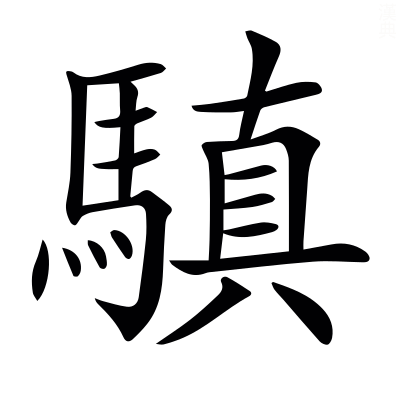

# 文選卷第四十

> 梁昭明太子撰
> 
> 文林郎守太子右內率府錄事參軍事崇賢館直學士臣李善注上

彈事

## 奏彈曹景宗

> 任彥昇梁典曰：高祖即位，昉為吏部郎，遷中丞。

御史中丞臣任昉稽首言：臣聞將軍死綏，咫步無却；司馬法曰：將軍死綏。*注曰：綏，却也。有前一尺，無却一寸。*杜預左氏傳注曰：古名退軍為綏。

顧望避敵，逗橈`奴教切`有刑。漢書曰：廷尉當王恢逗橈[^40.1.1]當斬。*音義曰：逗，曲行避敵也。橈，顧望也。*

至乃趙母深識，乞不為坐；史記曰：趙王將使趙括為將，其母上書曰「括不可使將。」王曰「母置之，吾已決矣。」母曰「王終遣之，即有不稱，妾得無坐乎？」王許諾。

魏主著令，抵罪已輕。魏志：太祖令曰「自命將征行，但賞功而不罰罪，非國典也。其諸侯將出征，敗軍者抵罪，失利者免官。」

是知敗軍之將，身死家戮，爰自古昔，明罰斯在。魏志：太祖令曰「將者，軍破於外，而家受罪于內也。」漢書：廣武君曰「敗軍之將，不可以語勇。」新序曰：臣侮其主，身死，妻子為戮。呂氏春秋曰：民有逆天之道者，罪死家戮也。

臣昉頓首頓首，死罪死罪。竊尋獯獫侵軼，暫擾疆陲，王師薄伐，所向風靡。獯獫，謂後魏也。魏收後魏書曰：太祖道武諱珪，改稱魏王。左氏傳曰：北戎侵鄭，鄭伯曰「彼徒我車，懼其侵軼我也。」*杜預曰：軼，突也。*毛詩曰：於鑠王師。又曰：薄伐玁狁，至于太原。晉起居注曰：檀道濟所向風靡。

是以淮徐獻捷，河兗凱歸。尙書曰：海岱及淮惟徐州。左氏傳曰：齊侯來獻戎捷。尙書曰：濟河惟兗州。周禮曰：師有功則凱樂。

東關無一戰之勞，塗中罕千金之費。吳曆曰：諸葛恪作東關，魏軍距之，恪令丁奉等兵便亂斫，遂大破北軍。歷陽郡圖經曰：東關，歷陽縣西南一百里。史記：蔡澤曰「白起一戰舉鄢郢。」吳志曰：晉命鎮東大將軍司馬骸向塗中。伏滔北征記曰：金城西~~沂~~泝曰塗澗[^40.1.2]，魏步道所出也。文子曰：起師十萬，日費千金。*張湛曰：日有千金之費。*

而司部懸隔，斜臨寇境，沈約宋書曰：宋世分郢州為司州。

故使狡虜憑陵，淹移歲月。杜預左氏傳注曰：狡，狡猾也。左氏傳：子產曰「今陳介恃楚衆，憑陵弊邑。」

故司州刺史蔡道恭，劉璠梁典曰：天監三年，司州刺史漢壽伯蔡道恭卒於圍。道恭少以勇力聞，及病，猶自力行城，數日，不能起，聞戰鼓聲，憤吒而卒。衆猶拒守，無有二心。攻圍二年，無有叛者。入秋，霖雨洪澍，一夜城頹，壯士猶~~戰~~不降[^40.1.3]。及城陷，捶其餘衆，求恭屍，卒不能得。

率厲義勇，奮不顧命，潘安仁汧馬督誄曰：率厲有方。司馬遷書曰：常思奮不顧身。

全城守死，自冬徂秋，潘安仁汧馬督誄：大將軍疏曰「臨危奮節，保穀全城。」論語：子曰「守死善道。」

猶~~有~~其轉戰無窮[^40.1.4]，亟摧醜虜。史記曰：驃騎將軍轉戰過烏支山。毛詩曰：鋪敦淮濆，仍執醜虜。

方之居延，則陵降而恭守；比之疏勒，則耿存而蔡亡。漢書曰：武帝遣驃騎都尉李陵將兵五千人出居延北，與單于戰，陵兵敗降匈奴。范曄後漢書曰：耿恭，字伯宗，為戊己校尉。恭以疏勒城傍有澗水可固，乃據之。匈奴復來攻，恭於城中穿井，十五丈不得水。恭仰嘆曰「聞昔貳師將軍取佩刀刺山，飛泉涌出。今漢德神明，豈有窮哉！」乃整衣服向井再拜，為吏士禱，有飛泉奔出。衆皆稱萬歲。乃令吏士揚水示虜，虜以為神明，引去也。

若使郢部救兵，微接聲援，鄒陽上書曰：臣恐救兵之不專。英雄記曰：袁術嚴兵為呂布作聲援。

則單于之首，久懸北闕，漢書：宣帝詔曰「傅介子斬樓蘭王安歸首，懸之北闕。」

豈直受降可築，涉安啟土而已哉！漢書曰：武帝遣因杅將軍公孫敖築塞外受降城。杅音盂。又曰：涉安侯於單于以匈奴單于太子降。尙書曰：建邦啟土。

寔由郢州刺史臣景宗，受命致討，不時言邁，晉起居注：詔曰「檀道濟奉命致討，所向風靡。」~~毛詩曰：旋車言邁~~言邁，已見潘岳金谷集詩[^40.1.5]。

故使蝟`音謂`結蟻聚，水草有依，漢書曰：賈誼曰「高帝王功臣，反者蝟毛而起。」吳志曰：錢唐大帥种式等蟻聚為寇。漢書曰：獫狁獯粥，居于邊地，逐水草遷徙。

方復按甲盤桓，緩救資敵，魏志曰：司馬文王征諸葛誕，六軍按甲而誕自困。廣雅曰：盤桓，不進也。李斯上書曰：今逐客以資敵。

遂令孤城窮守，力屈凶威。謝承後漢書：胡爽曰「耿恭以甲兵守孤城於絕域。」史記：李左車謂韓信曰「今足下情見力屈，欲戰不拔。」左氏傳：晉溫季曰「逃威也。」*杜預曰：凶賊為害，故曰威也。*

雖然，猶應固守三關，更謀進取，而退師延頸，自貽虧衄，劉璠梁典曰：宣城王以冠軍將軍曹景宗為郢州刺史。初，司州被圍，詔荊郢發兵往援，曹景宗為都督。及荊州援軍至三關，頓兵不進，聞司州沒，即日退還延頸。敵人縱暴緣邊，景宗不能禦，遂失三關諸戍。有司奏罰罪，景宗聞之輒去州，伏闕泥首待罪。帝一無所問。三關延頸，二戍名也。管子曰：民無恥不可以固守。漢書曰：諸將曰「楚數進取。」*如淳曰：進取，多所攻也。*毛詩曰：自貽伊戚。陳琳檄豫州曰：傷夷折衄。衄，折挫也。

疆埸侵駭，職是之由。左氏傳曰：齊人侵魯疆，疆吏來告，公曰「疆埸之事，慎守其一。」又范宣子數諸戎曰「言語漏渫，則職汝之由。」

不有嚴刑，誅賞安寘，景宗即主。史記曰：繁法嚴刑而天下振。西征賦曰：峻徒御以誅賞。毛萇詩傳曰：寘，置也。主謂為主首也。王隱晉書：庾純自劾曰「醉酒荒迷，昏亂儀度即主，臣謹按[^40.1.6]河南尹庾純」云云。然以主為句，~~則~~臣當下讀也[^40.1.7]。

臣謹案使持節都督郢司二州諸軍事、左將軍、郢州刺史、湘西縣開國侯臣景宗，擢自行間，遘茲多幸，~~漢書：衛青曰「臣幸得待罪行間。」左氏傳：羊舌職曰「民之多幸，國之不幸也。」~~多幸，已見上文[^40.11.2]

指蹤非擬，獲獸何勤。漢書曰：上先封蕭何為酇侯，功臣皆曰「蕭何未有汗馬勞，顧居臣等上，何也？」上曰「諸君知獵乎？」曰「知之。」~~上曰「知獵狗乎？」曰「知之。」~~[^40.1.8]上曰「夫獵，追殺者，狗也；而發蹤指示獸處者，人也。今諸公徒能走得獸者，功狗也；如蕭何發蹤指示，功人也。」群臣莫敢言。

賞茂通侯，榮高列將，漢書：蘇武謂李陵曰「武父子位列將，爵通侯。」*應劭曰：通侯者，言其功德通於王室。張晏曰：後改為列侯。列侯，見序列也。*方言曰：列，班列也。

負檐裁弛，鍾鼎遽列，左傳曰：齊侯使敬仲為卿。辭曰「弛於負檐，君之惠也。」又曰：宋左師每食擊鍾。家語曰：子路南遊楚，列鼎而食。廣雅曰：列，陳也。

和戎莫效，二八已陳。左氏傳曰：鄭人賂晉侯以女樂二八。晉侯以樂之半賜魏絳，曰「子教寡人和諸戎狄也。」

自頂至踵，功歸造化，孟子曰：墨子兼愛，摩頂致於踵。*趙岐曰：致，至也。*淮南子曰：大丈夫恬然無為，與造化逍遙也。

潤草塗原，豈獲自已。喻巴蜀曰：肝腦塗中原，膏液潤野草而不辭也。

且道恭云逝，城守累旬；景宗之存，一朝棄甲。史記曰：沛令閉城守。左氏傳曰：宋華元為植，巡功。城者謳曰「睅其目，皤其腹，棄甲而復。」

生曹死蔡，優劣若是，惟此人斯，有靦面目。毛詩曰：彼何人斯？居河之湄。又曰：有靦面目，視人罔極。*毛萇曰：靦，姡也。鄭玄曰：汝姡然有面目也。*

昔漢光命將，坐知千里；東觀漢記曰：代郡太守劉興將數百騎，攻賈覽，上狀檄至，光武知其必敗，報書曰「欲復進兵，恐失其頭首也。」詔書到，興已為覽所殺。長史得檄，以為國家坐知千里也。

魏武置法，案以從事。魏書曰：太祖自作兵書。諸將征伐，皆以新書從事。從令者克捷，違教者負敗。

故能出必以律，錙銖無爽。周易曰：師出以律。鄭玄禮記注曰：八兩為錙。漢書曰：二十四銖為兩。

伏惟聖武英挺，略不世出，漢書：蒯通說韓信曰「功無二於天下，略不世出。」

料敵制變，萬里無差，趙充國頌曰：料敵制勝，威謀靡伉。

奉而行之，實弘廟筭。西征賦曰：彼雖衆其焉用？故制勝於廟筭。孫子曰：夫未戰而廟筭勝，得筭多也。

惟此庸固，理絕言提。晉起居注：宋公表曰「臣寔庸固。」毛詩曰：匪面命之，言提其耳。

自逆胡縱逸，久患諸夏。劉琨勸進表曰：逆胡劉曜，縱逸西都。漢書匈奴傳贊曰：久矣夷狄之為患。

聖朝乃顧，將一車書。汧馬督誄曰：聖朝西顧，關右震惶。禮記曰：書同文，車同軌。

愍彼司氓，致辱非所。晉起居注曰：大司馬表曰：園陵辱於非所。

早朝永嘆，載懷矜惻。致茲虧喪，何所逃罪？宜正刑書，肅明典憲。左氏傳：仲尼曰「叔向，古之遺直也。邢侯之獄，言其貪也，以正刑書。」

臣謹以劾，請以見事免景宗所居官，下太常削爵土，收付廷尉法獄治罪。其軍佐職僚、偏裨將帥絓胡卦切

諸應及咎者，別攝治書侍御史隨違續奏。臣謹奉白簡以聞~~云云~~臣昉誠惶誠恐，頓首頓首，死罪死罪，臣昉稽首以聞[^40.1.9]。

[^40.1.1]: 考異：注「廷尉王恢逗橈」：陳云「尉」下脫「當」字，是也。各本皆脫。

[^40.1.2]: 考異：注「全城西沂澗」：袁本、茶陵本「沂」作「泝」，下有「曰塗」二字，是也。尤初有，脩誤去。

[^40.1.3]: 考異：注「壯士猶戰不降」：袁本、茶陵本無「戰」字。

[^40.1.4]: 考異：猶有轉戰無窮：案：「有」當作「其」。袁、茶陵二本校語云善有「其」字。尤所見非。

[^40.1.5]: 考異：注「毛詩曰旋車言邁」：袁本作「言邁已見潘岳金谷集詩」，是也。茶陵本複出，非。此初同袁，修改誤依複出。

[^40.1.6]: 考異：注「即主謹按」：袁本、茶陵本「謹」上有「臣」字。案：此尤校刪也。

[^40.1.7]: 考異：注「則臣當下讀也」：袁本、茶陵本無「則」字。

[^40.1.8]: 考異：注「上曰知獵狗乎曰知之」：袁本、茶陵本無此九字。

[^40.1.9]: 考異：云云：袁本、茶陵本無此二字，有「臣昉誠惶誠恐頓首頓首死罪死罪臣昉稽首以聞」二十字。案此似善、五臣之異也。

## 奏彈劉整

沈約齊紀曰：整，宋吳興太守兄子也[^40.2.1]。歷位持節都督交廣越三州也。

> 任彥昇

御史中丞臣任昉稽首言：臣聞馬援奉嫂，不冠不入；氾毓字孤，家無常子。東觀漢記曰：馬援事寡嫂，雖在閨內，必衣冠然後入見。王隱晉書曰：氾毓，字稚春，濟北人也，敦睦九族。青土號其家「兒無常母，衣無常主」也。氾音凡。毓音育。

是以義士節夫，聞之有立，左氏傳：臧哀伯曰「武王克商，遷九鼎於洛邑，義士猶或非之。」東京賦曰：貞夫懷節。班固漢書贊曰：孟子曰「聞伯夷之風，懦夫有立志。」

千載美談，斯為稱首。公羊傳曰：魯人至今以為美談。封禪書曰：永保鴻名，而常為稱首也。

臣昉頓首頓首，死罪死罪。謹案齊故西陽內史劉寅妻范，詣臺訴列，稱出適劉氏，二十許年。劉氏喪亡，撫養孤弱，叔郎整，常欲傷害侵奪。分前奴教子當伯，并已入衆。又以錢婢姊妹弟溫，仍留奴自使伯；又奪寅息逡婢綠草，私貨得錢，并不分逡。寅第二庶息師利，去歲十月往整田上經十二日，整便責范米六~~砀~~斗[^40.2.2]哺食。米未展送，忽至戶前，~~隔箔~~[^40.2.3]攘拳大罵，突進房中，屏風上取車帷準米去。二月九日夜，婢采音偷車欄夾杖龍牽，范問失物之意，整便打息逡。整及母并奴婢等六人來至范屋中，高聲大罵，婢采音舉手查范臂。求攝檢，如訴狀。

輒攝整亡父舊使奴海蛤到臺辯問，列稱：整亡父興道，先為零陵郡，得奴婢四人。分財[^40.2.4]，以奴教子乞大息寅。亡寅後，第二弟整仍奪教子，云應入衆，整便留自使，婢姊及弟各准錢五千文，不分逡。其奴當伯，先是衆奴。整兄弟未分財之前[^40.2.5]，整兄寅以當伯貼錢七千，共衆作田。寅罷西陽郡還，雖未別火食，寅以私錢七千贖當伯，仍使上廣州去。後寅喪亡，整兄弟後分奴婢，唯餘婢綠草入衆。整復云寅未分財贖當伯，又應屬衆。整意貪得當伯，推綠草與逡。整規當伯還，擬欲自取，當伯遂經七年不返。整疑已死亡不迴，更奪取婢綠草，貨得錢七千。整兄弟及姊共分此錢，又不分逡。寅妻范云，當伯是亡夫私贖，應屬息逡。當伯天監二年六月從廣州還至，整復奪取，云應充衆，准雇借上廣州四年夫直，今在整處使。

進責整婢采音，~~劉~~列[^40.2.6]整兄寅第二息師利，去年十月十二日忽往整墅停住十二日，整就兄妻范求米六斗哺食。范未得還，整怒，仍自進范所住，屏風上取車帷為質。范送米六斗，整即納受。范今年二月九日夜，失車欄子夾杖龍牽等，范及息逡道是采音所偷。整聞聲，仍打逡。范喚問何意打我兒[^40.2.7]？整母子爾時便同出中庭，隔箔與范相罵。婢采音及奴教子[^40.2.8]、楚玉、法志等四人，于時在整母子左右。整語采音：其道汝偷車校具，汝何不進裏罵之？既進爭口，舉手誤查范臂。車欄夾杖龍牽，實非采音所偷。

進責寅妻范奴苟奴，列[^40.2.9]孃去二月九日夜，失車欄夾杖龍牽，疑是整婢采音所偷。苟奴與郎逡往津陽門糴米，遇見采音[^40.2.10]在津陽門賣車欄龍牽，苟奴登時欲捉取，逡語苟奴已爾不須復取。苟奴隱僻少時，伺視人買龍牽，售五千錢。苟奴仍隨逡歸宅，不見度錢。

并如采音苟奴等列狀，粗與范訴相應。重覈當伯教子，列孃被奪，今在整處使，悉與海蛤列不異。以事訴法，令史潘僧尚議：整若輒略兄子逡分前婢貨賣，及奴教子等私使，若無官令，輒收付近獄測治。諸所連逮絓應洗之源，委之獄官，悉以法制從事。如法所稱，整即主。昭明刪此文大略，故詳引之，令與彈相應也。

臣謹案：新除中軍參軍臣劉整，閭閻闟茸，名教所絕。史記：太史公曰「李斯自閭閻歷諸侯。」弔屈原曰：闟茸尊顯，讒諛得志。世說曰：王平子胡母彥國諸人皆任放為達，或有裸體。樂廣曰：名教中自有樂地，何為乃爾。

直以前代外戚，仕因紈蔥，漢書曰：班伯出與王許子弟為群，在綺襦紈蔥之間，非其好也。

惡積釁稔，親舊側目。左氏傳：萇弘曰「毛得必亡，是昆吾稔之日也。」*杜預曰：稔，熟也。惡積與桀同誅。*漢書·郅都傳：列侯宗室見都，側目而視[^40.2.11]。

理絕通問，而妄肆醜辭；謂大罵也。禮記曰：嫂叔不通問，諸母不漱裳。包咸論語注曰：肆，極意敢言也。詩曰：好言自口，莠言自口。*毛萇曰：莠，醜也。*

終夕不寐，而謬加大杖。謂打逡也。謝承後漢書曰：或問第五倫曰「公有私乎？」對曰「吾兄子嘗病，一夜十往，退而安寢，吾子有病，雖不省視，而竟夕不眠。若是者豈可謂無私乎？」家語曰：孔子謂曾子曰「汝不聞乎？昔瞽叟有子曰舜。舜事瞽叟也，小捶則待過，大杖則逃走。故瞽叟不犯不父之罪，而舜不失烝烝之孝。」

薛~~包~~苞分財[^40.2.12]，取其老弱；范曄後漢書曰：汝南薛~~包~~苞，字孟嘗，好學篤行。弟子求分異居，包不能止，乃中分其財。奴婢引其老者，曰「與我共事久，若不能使也。」田廬取其荒頹者，曰「吾少時所治，意所戀也。」器物取朽敗者，曰「我素所服食，身口所安。」後徵拜侍中。

高鳳自穢，爭訟寡嫂。東觀漢~~書~~記曰[^40.2.13]：高鳳，字文通，南陽人也。鳳年老，聲名著聞。太守連召請，恐不得免，自言鳳本巫家，不應為吏。又與寡嫂詐訟田，遂不仕。

未見孟嘗之深心，唯~~矅~~傚文通之偽迹[^40.2.14]。顏延年詠向秀曰：深心託毫素。袁彥伯名臣頌曰：迹洿必偽。

昔人睦親，衣無常主；顏延年陶徵士誄曰：睦親之行。衣無常主，已見上文。

整之撫姪，食有故人。謂責米也。西京雜記曰：公孫弘起家徒步為丞相，故人齊高賀從之，弘食以脫粟飯，覆以布被。賀怨曰「何用故人富貴為？脫粟布被，我自有之。」弘大慚。賀乃告人曰「公孫弘內廚五鼎，外饍一肴，豈可以臨天下。」於是朝右疑其矯焉。弘嘆曰「寧逢惡賓，不逢故人。」

何其不能折契鍾庾，而襜`昌占切`帷交質，謂取車帷也。漢書曰：~~高祖從王媼武負貰酒，兩家~~高祖每貰酒，歲更而酒家[^40.2.15]常折券棄責。左氏傳：晏子曰「釜十則鍾。」*杜預曰：六斛四斗也。*包咸論語注曰：十六砀為庾。詩曰：漸車帷裳。*毛萇曰：惟裳，婦人車飾。鄭玄曰：帷裳，童容也。*方言曰：江淮謂襜褕為童容也。左氏傳曰：鄭伯怨王，王曰「無之。」故周鄭交質。

人之無情，一何至此！莊子：惠子謂莊子曰「人故無情乎？」莊子曰「然。」惠子曰「人而無情，何謂之人？」實教義所不容，紳冕所共棄。仲長子昌言曰：引之於教義。嵇康絕交書曰：世教所不容。

臣等參議，請以見事免整所除官，輒勒外收付廷尉法獄治罪。諸所連逮應洗之源，委之獄官，悉以法制從事。婢采音不款偷車龍牽，請付獄測實。其宗長及地界職司，初無糾舉，及諸連逮，請不足申盡。臣昉~~云云，~~誠惶誠恐以聞[^40.2.16]。

[^40.2.1]: 考異：注「宋吳興太守兄子也」：陳云「守」下有脫字。各本皆同，無以補也。

[^40.2.2]: 考異：六砀：袁本、茶陵本「砀」作「斗」。案：下文仍作「斗」，疑「斗」是。

[^40.2.3]: 考異：忽至戶前隔箔：袁本、茶陵本云善無「隔箔」二字。案：二本所見是也。此尤添之，以五臣亂善。

[^40.2.4]: 考異：分財：袁本、茶陵本云「財」善作「賦」。案：此尤改之。

[^40.2.5]: 考異：整兄弟未分財之前：袁本、茶陵本云善無「未」字。案：此尤添之。

[^40.2.6]: 考異：進責整婢采音劉：案：「劉」當作「列」。下文云「並如采音苟奴等列狀，粗與范訴相應」，此即「采音列」也。各本皆誤，今特訂正。

[^40.2.7]: 考異：范喚問何意打我兒：袁本、茶陵本云善無「喚」字。案：此尤添之。

[^40.2.8]: 考異：婢采音及奴教子：袁本、茶陵本云善無「婢」字。案：此尤添之。

[^40.2.9]: 考異：進責寅妻范奴苟奴列：袁本、茶陵本云善無「苟奴」字。案：此尤添之，依下文蓋當有。

[^40.2.10]: 考異：遇見采音：袁本、茶陵本「遇」下校語云善作「過」。案：此尤改之。

[^40.2.11]: 考異：注「漢書郅都傳列侯宗室見都側目而視」：袁本、茶陵本「郅都傳」作「音義曰」，見下有「郅」字而視作也。案：此尤校改之也。

[^40.2.12]: 考異：薛包分財：袁本、茶陵本云「包」善作「苞」。案：此亦以五臣亂善也。注中字二本並作「苞」，尤盡改作「包」，非。

[^40.2.13]: 考異：注「東觀漢書曰」：陳云「書」，「記」誤，是也。各本皆誤。

[^40.2.14]: 考異：唯矅文通之偽迹：袁本、茶陵本「矅」作「傚」。案：二本不著校語，無以考也。

[^40.2.15]: 考異：注「高祖從王媼武負貰酒兩家」：袁本、茶陵本作「高祖每貰酒歲更而酒家」。案：此尤校改之也。

[^40.2.16]: 考異：臣昉云云誠惶誠恐以聞：袁本、茶陵本無「云云」二字，以上有「頓首頓首死罪死罪稽首」十字。案：說已見前。

## 奏彈王源

> 沈休文吳均齊春秋曰：永明八年，沈約為中丞。

給事黃門侍郎兼御史中丞吳興邑中正臣沈約稽首言：臣聞齊大非偶，著乎前誥；辭霍不婚，垂稱往烈。左氏傳曰：齊侯欲以文姜妻鄭太子忽，忽辭。人問其故，太子曰「人各有偶，齊大，非吾偶也。」漢書曰：雋不疑為京兆尹，大將軍霍光欲以女妻之，不疑固辭不肯當。班固不疑述曰：不疑膚敏，應變當理；辭霍不婚，逡巡致仕。

若乃交二族之和，辨伉合之義，升降窳隆，誠非一揆。禮記曰：婚禮者，將合二姓之好，上以事宗廟，下以繼後代也。左氏傳：施氏之婦怒施氏曰「己不能庇其伉儷。」尙書曰：道有升降，政繇俗革。吳都賦曰：窳隆異等。孟子曰：先聖後聖，其揆一也。

固宜本其門素，不相奪倫。尙書曰：八音克諧，無相奪倫。

使秦晉有匹，涇渭無舛。左氏傳曰：晉公子重耳至於秦，秦伯納女五人，懷嬴與焉。奉匜沃盥。既而揮之，怒曰「秦晉匹也，何以卑我？」孫綽子曰：或問雅俗，曰「涇渭分流，雅鄭異調。」

自宋氏失御，禮教~~雕~~彫衰[^40.3.1]，答賓戲曰：周失其御。

衣冠之族，日失其序。范曄後漢書：霍諝奏記曰「宋光衣冠子孫。」袁子正書曰：古者命士已上，皆有冠冕，故謂之冠族。左氏傳：鄭莊公曰「周之子孫，日失其序。」

姻婭淪雜，罔計廝`音斯`庶，毛詩曰：瑣瑣姻婭，則無膴仕。*毛萇曰：兩婿相謂曰婭。*漢書曰：有廝養卒。*如淳曰：廝，賤也。*

販鬻祖曾，以為賈`音古`道，鄭玄周禮注曰：居賣物曰賈。

明目腆顏，曾無愧畏。丁德禮厲志賦曰：苟神祇之我昭，永明目而無怍。孔安國尙書傳曰：腆，厚也。毛詩曰：不愧於人，不畏於天。

若夫盛德之胤，世業可懷，左氏傳：史趙曰「盛德必百世祀。」幽通賦曰：違世業之可懷。

欒郤之家，前徽未遠。左氏傳：叔向曰「欒郤胥原，降在皁隸。」*杜預曰：晉舊臣之族也。*

既壯而室，竊貲莫非皁隸，禮記曰：三十壯有室[^40.3.2]。*鄭玄曰：有室，有妻，妻稱室也。*解嘲曰：司馬長卿竊貲卓氏。左氏傳曰：人有十等，士臣皁。又曰：輿臣隸。

結褵以行，箕帚咸失其所。詩曰：親結其褵，九十其儀。*毛萇曰：褵，婦人之幃也。*母戒女施衿結褵。國語曰：越王勾踐行成於吳，曰「一介適女，執箕帚於王宮者也。」

志士聞而傷心，舊老為之歎息。論語：子曰「志士仁人，無求生以害仁也。」

自宸歷御寓，弘革典憲，雖除舊布新，而斯風未殄。左氏傳曰：有星孛於大辰。申須曰「彗所以除舊布新也。」尙書曰：商俗靡靡，利口惟賢。餘風未殄，公其念哉！

陛下所以負扆`於紀切`興言，思清弊俗者也。禮記曰：天子[^40.3.3]負斧扆南向而立。*鄭玄曰：負之言背也。斧依，為斧文屏風。*扆與依同。詩曰：興言出宿。尙書曰：弊化奢麗，萬世同流。

臣實~~儒~~懦品[^40.3.4]，謬掌天憲，范曄後漢書：劉陶上疏曰「今權臣口含天憲。」

雖埋輪之志，無屈權右；范曄後漢書曰：張綱，字文紀，為侍御史。順帝遣八使詢風俗，餘人受命之部，綱獨埋其車輪於洛陽都亭，曰「豺狼當路，安問狐狸？」遂奏大將軍梁冀。東觀漢記曰：皇甫嵩上言，四姓權右，咸各歛手也。

而狐鼠微物，亦蠹大猷。應璩詩曰：城狐不可掘，社鼠不可熏。晏子春秋：景公問晏子曰「治國亦有常乎？」對曰「讒佞之人，隱在君側，猶社鼠不熏也。去此乃治矣。」范曄後漢書：虞延謂馬成曰「爾民之巨蠹，久依城社，不畏熏燒。」毛詩曰：秩秩大猷也。

風聞東海王源，嫁女與富陽滿氏。漢書曰：尉佗曰「風聞老夫父母墓已壞削。」賈逵國語注曰：風，采也，采聽商旅之言也。

源雖人品庸陋，冑實參華。曾祖雅，位登八命；檀道鸞晉陽秋曰：王雅，字茂德，東海郯人，為右僕射。周禮曰：八命作牧。*鄭司農曰：一州之牧也。王之三公，亦八命也。*

祖少卿，內侍帷幄；父璿，升采儲闈，亦居清顯。尙書曰：亮采惠疇。*孔安國注曰：采，事也。*何法盛陳郡謝錄曰：謝石以有大勳，遂居清顯。

源頻叨諸府戎禁，豫班通徹。應劭漢書注曰：舊曰徹侯，避武帝諱，曰通侯也。

而託姻結~~好~~[^40.3.5]，唯利是求，左氏傳：晉侯使呂相絕秦，曰「秦與晉出入，秦惟利是視。」

玷辱流輩，莫斯為甚。孝經鉤命訣曰：名毀行廢，玷辱先人。

源人身在遠，輒攝媒人劉嗣之到臺辯問。嗣之列稱：吳郡滿璋之，相承云是高平舊族，寵奮胤胄，魏志曰：滿寵[^40.3.6]，字伯寧，景初二年為太尉，薨，子偉嗣。世~~說~~語曰[^40.3.7]：偉弟子奮，元康中至司隸校尉。荀綽冀州記曰：奮，高平人也。

家計溫足，見託為息鸞覓婚。漢書：董仲舒對策曰「家溫而食厚祿。」

王源見告窮盡，即索璋之簿閥，漢書：朱博曰「王卿憂公齎閥閱詣府。」*音義曰：明其等曰閥，積功曰閱也。*

見璋之任王國侍郎，鸞又為王慈吳郡正閤主簿，吳均齊春秋曰：王慈，字伯寶，早有令譽，稍歷侍中，吳郡太守。

源父子因共詳議，判與為婚。璋之下錢五萬，以為聘禮。娶妻及納徵皆曰聘。周禮曰：穀圭以聘女。

源先喪婦，又以所聘餘直納妾。如其所列，則與風聞符同。

竊尋璋之姓族，士庶莫辨。滿奮身殞西朝，胤嗣殄沒，武秋之後，無聞東晉，晉初都洛陽，故曰西朝；後在江東，故曰東晉。臧榮緒晉書：陳晷有譽西朝。干寶晉紀曰：苗願殺司隸校尉滿奮。荀綽冀州記曰：滿奮，字武秋。公羊傳曰：紀子伯者何，~~謂~~無聞焉爾[^40.3.8]。

其為虛託，不言自顯。王滿連姻，寔駭物聽，漢書音義曰：連，親~~郓~~姻也[^40.3.9]。尙書大傳曰：文王施政而物皆聽。

潘楊之睦，有異於此。潘岳楊仲武誄曰：潘楊之睦，有自來矣。曹子建求自試表曰：古之受爵祿者，有異於此。

且買妾納媵，因聘為資，左氏傳：鄭子產曰「故志曰，買妾不知其姓，則卜之。」

施衿之費，化充床笫，儀禮曰：女嫁，母施衿結帨。*鄭玄曰：帨，佩巾也。*左氏傳曰：趙武過鄭，伯有賦鶉之賁賁。趙孟曰「床笫之言不踰閾。」*杜預曰：笫，簀也。*

鄙情贅行，造次以之。蜀志：諸葛亮表李平曰「臣知平鄙情，欲因行止之際，逼臣取利也。」老子曰：自伐無功，自矜不長，其在道曰餘食贅行。*王弼曰：更為疣贅也。*

糾慝繩違，允茲簡裁。源即主。言其違慝，信當此簡之所貶裁。尙書曰：繩愆糾繆，格其非心。

臣謹案：南郡丞王源，忝藉世資，得參纓冕，漢書音義曰：無忌却秦，有地資也。

同人者貌，異人者心，列子曰：夏桀殷紂魯桓~~齊~~楚穆[^40.3.10]，狀貌七竅皆同於人，而有禽獸之心也。

以彼行媒，同之抱布。禮記曰：男女非有行媒，不相知名。詩曰：氓之蚩蚩，抱布貿絲；匪來貿絲，來即我謀。

且非我族類，往哲格言；薰蕕不雜，聞之前典。左氏傳曰：公欲求成于楚而叛晉，季文子曰「史佚之志有之，非我族類，其心必異。」論語考比讖曰：格言成法。家語：顏回曰「回聞薰蕕不同器而藏。」汧馬督誄曰：聞之前典。

豈有六卿之胄，納女於管庫之人；尙書曰：六卿分職。禮記曰：晉~~文~~人[^40.3.11]謂趙文子知人，所舉晉國管庫之士七十有餘家。*鄭玄曰：管，管鍵者也。*

宋子河魴，同穴於輿臺之鬼。毛詩曰：豈其食魚，必河之魴，豈其娶妻，必齊之姜；豈其食魚，必河之鯉；豈其娶妻，必宋之子。又曰：穀則異室，死則同穴。左氏傳曰：皁臣輿。又曰：僕臣臺。

高門降衡，雖自己作；陸雲答兄~~書~~詩曰：高門降衡，脩庭樹蓬[^40.3.12]。

蔑祖辱親，於事為甚。說文：懱，輕易也。蔑與懱古字同。

此風弗剪，其源遂開，點世塵家，將被比屋。尙書大傳曰：周民可比屋而封。

宜寘以明科，黜之流伍。使已污之族，永愧於昔辰；方媾之黨，革心於來日。賈子曰：宋昭公革心易行。

臣等參議，請以見事免源所居官，禁錮終身，輒下禁止視事如故。言禁止其視事之法，當如故事也。

源官品應黃紙，臣輒奉白簡以聞。臣約誠惶誠恐，云云。

[^40.3.1]: 考異：禮教雕衰：袁本、茶陵本「雕」作「彫」。案：此尤本偽字。

[^40.3.2]: 考異：注「禮記曰三十壯有室」：袁本、茶陵本無此八字。案：蓋二本因已見五臣而節去，尤有，是也。

[^40.3.3]: 考異：注「禮曰天子」：袁本、茶陵本「曰」作「記」。案：此當「記」、「曰」兩有。

[^40.3.4]: 考異：臣實儒品：袁本、茶陵本「儒」作「懦」。案：此尤本偽字。

[^40.3.5]: 考異：而託姻結好：袁本無「結」字，云「好」善作「結」。茶陵本無「好」字，云「結」五臣作「好」。案：此蓋尤校改兩存。依文義，善不當無「好」字，而以「而託姻結」為句。二本所見必有誤，校語未足據也。

[^40.3.6]: 考異：注「魏志滿寵」：袁本、茶陵本「志」下有「曰」字，是也。

[^40.3.7]: 考異：注「世說曰」：陳云「說」，「語」誤，是也。各本皆誤。

[^40.3.8]: 考異：注「謂無聞焉爾」：袁本、茶陵本無「謂」字，是也。

[^40.3.9]: 考異：注「連親郓也」：袁本、茶陵本「郓」作「姻」。案：史記集解引作「荡」，漢書南越傳顏注引孟康亦作「荡」，皆與善不同。索隱云：「連者，連姻也。」恐尤延之以彼語校改，復錯誤如此耳。

[^40.3.10]: 考異：注「魯桓齊穆」：何校「齊」改「楚」，陳同，是也。各本皆誤。

[^40.3.11]: 考異：注「禮記曰晉文」：何校「文」改「人」，是也。各本皆誤。

[^40.3.12]: 考異：注「陸雲答兄書曰高門降衡脩庭樹蓬」：何校「書」改「詩」，此十四字，茶陵有，袁無。案：無者疑脫。

牋

## 答臨淄侯牋

> 楊德祖典略曰：楊脩，字德祖，太尉彪子，謙恭材博。自魏太子以下，並爭與交好。又是時臨淄侯以才捷愛幸，秉意投脩，數與脩書，脩答牋。後曹公以脩前後漏泄言教，交關諸侯，乃收殺之。

脩死罪~~死罪~~[^40.4.1]。不侍數日，若彌年載。毛萇詩傳曰：彌，終也。

豈由愛顧之隆，使係仰之情深邪！損辱嘉命，蔚矣其文，易曰：君子豹變，其文蔚也。

誦讀反覆，雖諷雅頌，不復過此。說文曰：諷，誦也。

若仲宣之擅漢表，陳氏之跨冀域，徐劉之顯青豫，應生之發魏國，斯皆然矣。仲宣投劉表，寓流楚壤，故云漢表。孔璋窘身袁氏，故云冀域。偉長淹留高密，故云青也。公幹淪飄許京，故云豫。德璉時居汝潁，汝潁，太祖食邑，故云魏也。

至於脩者，聽采風聲，仰德不暇，尙書曰：樹之風聲。

~~自~~目周章於省覽[^40.4.2]，何遑高視哉？家語曰：孔子出乎四門，周章遠望。曹植書曰：足下高視於上京也。

伏惟君侯，少長貴盛，體發旦之資，有聖善之教。發，武王名也；旦，周公名也。毛詩曰：凱風自南，吹彼棘心。母氏聖善，我無令人。

遠近觀者，徒謂能宣昭懿德，光贊大業而已；毛詩曰：宣昭義問。又曰：人之秉彝，好是懿德。周易曰：富有之謂大業。

不復謂能兼覽傳記，留思文章。今乃含王超陳，度越數子矣。漢書：桓譚曰「楊子之書，文義至深，必度越諸子矣。」

觀者駭視而拭目，聽者傾首而竦耳。非夫體通性達，受之自然，其孰能至於此乎？老子曰：天法道，道法自然。鍾會曰：莫知所出，故曰自然。

又嘗親見執事，握牘持筆，有所造作，若成誦在心，借`即`書於手，曾不斯須少留思慮。仲尼日月，無得踰焉，論語：子貢曰「仲尼不可毀也。仲尼日月也，無得而踰焉。」

脩之仰望，殆如此矣。是以對鶡而辭，作暑賦彌日而不獻，植為鶡鳥賦，亦命脩為之，而脩辭讓。植又作大暑賦，而脩亦作之，竟日不敢獻。

見西施之容，歸~~增~~憎其貌者也[^40.4.3]。越絕書曰：越王乃飾美女西施鄭巴，使大夫種獻之於吳王。

伏想執事，不知其然，猥受顧錫，教使刊定。鄭玄禮記注曰：刊，削也。

春秋之成，莫能損益；呂氏淮南，字直千金。然而弟子箝口，市人拱手者，聖賢卓犖，固所以殊絕凡庸也。史記曰：孔子在位，聽訟文辭，有可與共者，弗獨有也。至於為春秋，筆則筆，削則削，子夏之徒，不能贊一辭。桓子新論曰：秦呂不韋請迎高妙，作呂氏春秋；漢之淮南王聘天下辯通，以著篇章。書成，皆布之都市，懸置千金，以延示衆士，而莫能有變易者。乃其事約豔，體具而言微也。

今之賦頌，古詩之流，不更孔公，風雅無別耳。兩都賦序曰：賦者，古詩之流也。文雖出此，而意微殊。

脩家子雲，老不曉事，強著一書，悔其少作。曹植書曰：楊雄猶稱壯夫不為。楊子法言：或問吾子少好賦，曰「然，童子彫蟲篆刻。」俄而曰「壯夫不為。」少，失照切。

若此仲山周旦之儔，為皆有伥邪！毛詩序曰：七月，周公遭變，陳王業之艱難。然詩無仲山甫作者，而吉父美仲山父之德，未詳德祖何以言之。

君侯忘聖賢之顯迹，述鄙宗之過言，竊以為未之思也。楚辭曰：吾聞作忠以造怨，忽謂之過言。論語曰：未之思也。

若乃不忘經國之大美，流千載之英聲，曹植書曰：采庶官之實錄，成一家之言。東京賦曰：忘經國之長基。封禪書曰：飛英聲。

銘功景鍾，書名竹帛，國語：晉悼公曰「昔克路之役，秦來圖敗晉功，魏顆以其身却退秦師于輔氏，親止杜回，其勳銘于景鍾。」*韋昭曰：景鍾，景公鍾也。*墨子曰：以其所獲書於竹帛，傳遺後世子孫也。

斯自雅量，素所畜也，豈與文章相妨害哉？輒受所惠，竊備矇瞍誦詠而已，詩曰：矇瞍奏工。

敢望惠施以忝莊氏？曹植書曰：其言之不慚，恃惠子之知我也。~~修言己豈敢望比惠施之德，以忝辱於莊周之相知乎？莊周，喻植也。惠施，莊周相知者也，故引之。~~[^40.4.4]

季緒璅璅，何足以云。曹植書曰：劉季緒好詆訶文章。魏志曰：劉季緒，名脩，劉表子，官至樂安太守。

反答造次，不能宣備。脩死罪死罪。

[^40.4.1]: 考異：脩死罪死罪：袁本、茶陵本不重「死罪」。案：此尤添之也。

[^40.4.2]: 考異：自周章於省覽：袁本、茶陵本「自」作「目」，是也。何校云魏志注作「目」。

[^40.4.3]: 考異：歸增其貌者也：袁本、茶陵本「增」作「憎」，是也。

[^40.4.4]: 考異：注「修言己豈敢望」下至「故引之」：袁本無此三十七字。案：無者是也。茶陵本并五臣入善，此同其誤耳。

## 與魏文帝牋

> 繁休伯文章志曰：繁欽，字休伯，潁川人，少以文辯知名。以豫州從事，稍遷至丞相主簿，病卒。文帝集序云：上西征，余守譙，繁欽從。時薛訪車子能喉囀，與笳同音。欽牋還與余，而盛歎之。雖過其實，而其文甚麗。

正月八日壬寅，~~領~~主簿繁欽[^40.5.1]，死罪死罪。近屢奉牋，不足自宣。頃諸鼓吹，廣求異妓，時都尉薛訪車子，年始十四，左氏傳曰：叔孫氏之車子鉏商獲麟。

能喉囀引聲，與笳同音。白上呈見，果如其言。許慎淮南子注曰：果，成也。

即日故共觀試，乃知天壤之所生，誠有自然之妙物也。潛氣內轉，哀音外激，大不抗越，細不幽散，廣雅曰：抗，高也。

聲悲舊笳，曲美常均。樂汁圖徵曰：聖人往承天以立五均。均者，~~亦~~六律調五聲之均也[^40.5.2]。*宋均曰：長八尺，施絃也。*

及與黃門鼓吹溫胡，迭唱迭和，漢書曰：鄭聲尤~~集~~甚黃門名倡丙彊景武之屬[^40.5.3]。黃門，集樂之所[^40.5.4]，~~漢書音義·如淳曰：今樂家五日一習樂，為理樂~~已見長笛賦[^40.5.5]。~~桓譚新論曰：漢之三主，內置黃門工倡。~~[^40.5.6]

喉所發音，無不響應，曲折沈浮，尋變入節。自初呈試，中間二旬，胡欲傲其所不知，尚之以一曲，巧竭意匱，既已不能。左氏傳：韓宣子如楚，叔向為介，王欲傲叔向以其所不知，而不能也。

而此孺子遺聲抑揚，不可勝窮，優遊轉化，餘弄未盡；暨其清激悲吟，雜以怨慕，暨，及也。

詠北狄之遐征，奏胡馬之長思，古詩曰：胡馬依北風。

悽入肝脾，哀感頑豔。是時日在西隅，涼風拂衽，說文曰：衽，衣衿也。

背山臨谿，流泉東逝。同坐仰嘆，觀者俯聽，莫不泫泣殞涕，悲懷慷慨。自左史妠謇姐名倡，魏志：文帝令杜夔與左~~~~㒹等[^40.5.7]於賓客之中吹笙鼓琴。然與㒹音同也。其史妠謇姐，蓋亦當時之樂人。聲類曰：妠，奴紺切。說文曰：㜘字或作姐，古字假借也。姐，子也切。

能識以來，耳目所見，僉曰詭異，未之聞也。李陵與蘇武書曰：陵自有識以來，士之立操，未有如子卿者也。說文曰：詭，變也。

竊惟聖體，兼愛好奇；莊子：仲尼謂老聃曰「兼愛無私也。」

是以因牋，先白委曲。伏想御聞，必含餘懽。冀事速訖，旋侍光塵，寓目階庭，與聽斯調，左氏傳曰：得臣與寓目焉。

宴喜之樂，蓋亦無量。詩曰：吉甫宴嘉。

欽死罪死罪。

[^40.5.1]: 考異：領主簿繁欽：茶陵本無「繁」字，袁本有。案：此疑善無，五臣有，二本失著校語，而尤以五臣亂善。

[^40.5.2]: 考異：注「亦律調五聲之均也」：何校「亦」改「六」，是也。各本皆誤。

[^40.5.3]: 考異：注「漢書曰鄭聲尤集黃門」：案：此有脫誤，所引必禮樂志「鄭聲尤甚，黃門名倡丙彊、景武之屬」云云，以注「黃門」也。今誤「甚」為「集」，「黃門」下失去，全非其舊耳。

[^40.5.4]: 考異：注「集樂之所」：案：「集」上當更有「黃門」二字。

[^40.5.5]: 考異：注「漢書音義」下至「為理樂」：袁本無此十八字，有「已見長笛賦」五字。案：袁本最是，「已見長笛賦」，即指黃門集樂之所也。茶陵本複出，非。

[^40.5.6]: 考異：注「桓譚新論曰漢之三主內置黃門工倡」：案：此十五字亦已見長笛賦，不當有也。各本皆衍。

[^40.5.7]: 考異：注「與左等」：案：「」當作「顛」，觀下注「與㒹同」可見也。「㒹」即「顛」字，今本魏志作「願」，乃誤字耳。

## 答東阿王牋

> 陳孔璋文章志曰：陳琳，字孔璋，廣陵人也。避亂冀州，袁紹辟之，使典密事。紹死，魏太祖辟為軍謀祭酒，典記室，病卒。

琳死罪死罪。昨加恩辱命，并示龜賦，披覽粲然。君侯體高世之才，秉青蓱干將之器，漢書：袁盎諫文帝曰「陛下有高世之行三。」呂氏春秋曰：趙襄子遊於囿中，至於梁，馬却不肯進。青蓱為參乘，青蓱進，視下，豫讓却寢，佯為死人。叱青蓱曰「去，長者且有事。」青蓱曰「少而與子友。子今日為大事，而我言之，失相與之道，子賊吾君，而我不言，失為人臣之道。如我者唯死之可也。」退而自殺。青蓱，豫讓之友也。張~~叔及~~升反論[^40.6.1]曰：青蓱砥礪於鋒鍔，庖丁剖犧於用刀。越絕書曰：楚令歐冶子干將為鐵劍二枚，~~吳越春秋曰：干將者，吳人。造劍二枚，~~[^40.6.2]一曰干將，二曰莫邪。

拂鐘無聲，應機立斷。說苑曰：西閭過東渡河，中流而溺，船人接而出之，問曰「子何之？」過曰「欲說東諸侯。」船人曰「子渡河而溺，安能說東諸侯乎？」過曰「獨不聞干將莫邪，拂鍾不錚，試物不知，然以之綴履，曾不如兩錢之錐。今子持楫乘扁舟，子所能也。若試與子東說諸侯王，見一國之主，子之蒙蒙然無異於未視㺃也。」又曰：淳于髡三稱，鄒忌三知之，髡等辭屈而去。故所以尚干將莫邪者，貴於立斷。

此乃天然異稟，非鑽仰者所庶幾也。言天性自然，受於異氣也。孔安國尙書傳曰：稟，受也。論語：顏淵曰「仰之彌高，鑽之彌堅。」

音義既遠，清辭妙句，焱絕煥炳，說文曰：焱，火華也；鹽念切。

譬猶飛兔流星，超山越海，龍驥所不敢追；況於駑馬，可得齊足？呂氏春秋曰：飛兔騕褭，古之駿馬也。流星，言疾也。李尤七嘆曰：神奔電驅，星流矢騖，則莫若益野騰駒。楚辭曰：驢騾偃蹇而齊足。

夫聽白雪之音，觀綠水之節，然後東野巴人，蚩鄙益著，宋玉諷賦曰：臣援琴而鼓之，為幽蘭白雪之曲。淮南子曰：手會綠水之趍。*高誘曰：綠水，古詩也，東野，下里之音也。*宋玉對問曰：客有歌於郢中者，其始曰下里巴人也。

載懽載笑，欲罷不能。詩曰：既見復關，載笑載言。論語：顏淵曰「夫子博我以文，約我以禮，欲罷不能。」

謹韞櫝玩耽，以為吟頌。論語：子貢曰「有美玉於斯，韞櫝而藏諸。」吟誦，謂謳吟歌誦。

琳死罪死罪。

[^40.6.1]: 考異：注「張叔及論」：案：「叔及」當作「升反」，說已詳前。各本皆誤。

[^40.6.2]: 考異：注「吳越春秋曰干將者吳人造劍二枚」：袁本、茶陵本無此十四字。

## 答魏太子牋

魏略曰：魏郡大疫，故太子與質書，質報之。

> 吳季重魏志：吳質，字季重，濟陰人，以文才為文帝所善，為朝歌長，官至振威將軍。文帝為太子時，重答此牋也。

二月八日庚寅，臣質言：奉讀手命，追亡慮存，恩哀之隆，形於文墨。日月冉冉，歲不~~我~~與我[^40.7.1]。楚辭曰：老冉冉而逾施。論語：陽貨曰「歲不我與。」

昔侍左右，廁坐衆賢，出有微行之遊，入有管絃之懽，漢書曰：武帝微行私出。*張晏曰：騎出入市里，若微賤之所為，故曰微行。*

置酒樂飲，賦詩稱壽。漢書曰：陳平厚具樂飲太尉。史記曰：武安君起為壽。*如淳曰：上酒謂稱壽也。*

自謂可終始相保，並騁材力，效節明主。何意數年之間，死喪略盡。臣獨何德，以堪久長？

陳徐劉應，才學所著，誠如來命，惜其不遂，可為痛切。凡此數字，於雍容侍從，實其人也。兩都賦序曰：雍容揄揚。漢書曰：嚴助侍燕從容。

若乃邊境有虞，群下鼎沸，軍書輻至，羽檄交馳，於彼諸賢，非其任也。漢書：田延年曰「群下鼎沸，社稷將傾。」又息夫躬上疏曰「軍書交馳而輻湊，羽檄重積而狎至。」

往者孝武之世，文章為盛，若東方朔枚皋之徒，不能持論，即阮陳之儔也。漢書：東方朔、枚皋不根持論，上頗俳優畜之。

其唯嚴助壽王。與聞政事，然皆不慎其身，善謀於國，卒以敗亡，臣竊恥之，漢書曰：唯嚴助與吾丘壽王見任用。後淮南王朝，賂遺，助竟坐棄市。壽王後坐事誅。論語曰：冉子退朝，子曰「何晏也？」對曰「有政。」子曰「其事也，如有政，雖不吾以，吾其與聞之。」

至於司馬長卿稱疾避事，以著書為務，則徐生庶幾焉。漢書：司馬相如常稱疾避事。又長卿妻曰「長卿時時著書，人又取去。」~~魏~~文帝書曰[^40.7.2]「偉長著中論二十餘篇。」爾雅曰：尚，庶幾也。

而今各逝，已為異物矣。鵩鳥賦曰：化為異物，又何足患。

後來君子，實可畏也。~~魏~~文帝書曰[^40.7.2]：後生可畏，來者難誣。

伏惟所天[^40.7.3]，左氏傳：箴尹克黃曰「君，天也。」何休墨守曰：君者，臣之天也。

優游典籍之場，休息篇章之囿，班固答賓戲曰：婆娑乎藝術之場，休息乎篇籍之囿。項~~代~~岱曰[^40.7.4]：場囿，講藝之處。

發言抗論，窮理盡微，周易：窮理盡性。孔安國尙書傳曰：微，妙也。

摛藻下筆，鸞龍之文奮矣。鸞龍，鱗羽之有五彩，設以喻焉。答賓戲曰：摛藻如春華。班固與弟超書曰：傅武仲下筆不休。

雖年齊蕭王，才實百之。~~魏~~文帝書曰[^40.7.2]：吾德不及蕭王，年與之齊矣。東觀漢記曰：更始遣使者立光武為蕭王。漢書：劉向上疏曰「陳湯比於貳師，功德百之。」

此衆議所以歸高，遠近所以同聲也[^40.7.5]。周易曰：同聲相應。

然年歲若墜，今質已四十二矣，白髮生鬢，所慮日深，實不復若平日之時也。但欲保身敕行，不蹈有過之地，以為知己之累耳。莊子曰：可以保身。孔安國尙書傳曰：敕，正也。慎子曰：久處無過之地，則世俗聽矣。

遊宴之歡，難可再遇；盛年一過，實不可追。臣幸得下愚之才，值風雲之會，論語：子曰「唯上智與下愚不移。」周易曰：雲從龍，風從虎。

時邁齒臷[^40.7.6]`徒結切`，尙書曰：日月逾邁。左氏傳：宰孔謂齊侯曰「伯舅耋老。」*杜預曰：七十曰耋也。*

猶欲觸匈奮首，展其割裂之用也。不勝慺慺。~~尙~~字書曰：慺慺，謹敬也[^40.7.7]。

以來命備悉，故略陳至情。質死罪死罪。

[^40.7.1]: 考異：歲不我與：袁本、茶陵本「我與」作「與我」。案：「與我」是也。善注引「歲不我與」，而正文自作「與我」，即所謂不拘語倒之例，前已詳論矣。尤依注乙正文，非。

[^40.7.2]: 考異：注「魏文書曰」：袁本、茶陵本「魏文」作「文帝」，是也。下同。

[^40.7.3]: 考異：伏惟所天又注「左氏傳」下至「臣之天也」：袁本、茶陵本云善無「伏惟所天」。案：此不當無，傳寫脫耳。尤校添為是。二本并無注二十二字，此所有未審何出。

[^40.7.4]: 考異：注「項代曰」：陳云「代」，「岱」誤，是也。各本皆誤。

[^40.7.5]: 考異：遠近所以同聲：袁本、茶陵本「聲」下有「也」字。何校添，陳同。是也。

[^40.7.6]: 考異：時邁齒臷：案：疑此「臷」當作「耋」，故注引左傳「耋老」。袁、茶陵二本所載五臣良注「臷，大也」。蓋「臷」。「耋」為善、五臣不同也。又案：漢書孔光傳「犬馬齒臷」，讀作「耋」。或季重用彼成文。然則善當有「臷」、「耋」異同之注，今刪削不全。

[^40.7.7]: 考異：注「尙書曰慺慺謹敬也」：袁本無「尚」字，茶陵有。案：無者疑脫「字」字耳，作「尚」非也。求通親親表注引亦誤。

## 在元城與魏太子牋

> 吳季重魏略曰：質遷元城令，之官，過鄴辭太子，到縣與太子牋。

臣質言：前蒙延納，侍宴終日，鄭玄禮記注曰：延，進也。

燿靈匿景，繼以華燈。楚辭曰：角宿未旦，耀靈焉藏？廣雅曰：耀靈，日也。楚辭曰：蘭膏明燭華燈錯。

雖虞卿適趙，平原入秦，受贈千金，浮觴旬日，無以過也。史記曰：虞卿者，遊說之士也。說趙孝成王，一見賜金百鎰，再見為上卿，故號為虞卿。又曰：秦昭王為書遺平原君曰「寡人聞君之高義，願與君為布衣之交。君幸過寡人，願與為十日之飲。」平原君遂入秦見昭王。

小器易盈，先取沈頓，醒寤之後，不識所言。孔安國尙書傳曰：沈，謂醉冥也。頓猶弊也。

即以五日到官。

初至承前，未知深淺。言每事承前，無所改易也。深淺猶善惡也。

然觀地形，察土宜。左氏傳：賓媚人曰「先王疆理天下，物土之宜。」

西帶~~常~~恆山[^40.8.1]，連岡平代；漢書有~~恆~~常山郡[^40.8.2]。*張晏曰：恆山在西。*漢書：代郡有平邑及代二縣。

北鄰柏人，乃高帝之所忌也。漢書：上東擊韓信，餘寇東垣，還過趙。趙相貫高等恥上不禮其王，陰謀欲殺上。上欲宿，心動，問縣名何？曰「柏人。」上曰「柏人者，迫於人也。」去弗宿。

重以泜水，漸漬疆宇，漢書：~~恆~~常山郡元氏縣有泜水，首受中丘西山，窮泉谷，入黃河。泜音脂。

喟然嘆息：思淮陰之奇譎，亮成安之失策；漢書：成安君陳餘背漢之~~趙~~楚[^40.8.3]。遣張耳與韓信擊破趙井陘，斬陳餘泜水上。奇譎，謂拔趙幟立漢幟。失策，謂不用李左車之言也。

南望邯鄲，想廉藺之風；廉頗、藺相如，~~趙國之賢將也，故想其風。邯鄲，趙所都也~~俱趙將也[^40.8.4]。

東接鉅鹿，存李齊之流。漢書：文帝問馮唐曰「吾居代時，吾尚食監高袪，數為我言趙將李齊之賢，戰於鉅鹿下。吾每飲食，意未嘗不在鉅鹿也。」

都人士女，服習禮教，西都賦曰：都人士女，殊異乎五方。

皆懷慷慨之節，包左車之計。漢書：廣武君李左車說成安君曰「聞漢將韓信議欲以下趙，願假臣奇兵三萬人，絕其輜重。足下深溝高壘，堅壁勿與戰。吾奇兵絕其後，兩將之首，可致戲下。」成安君不聽也。

而質闇弱，無以蒞之。毛萇詩傳曰：蒞，臨也。

若乃邁德種恩，樹之風聲，尙書：咎繇邁種德。風聲，已見上。

使農夫逸豫於疆畔，~~女~~工女吟詠於機杼[^40.8.5]，固非質之所能也。詩曰：爾公爾侯，逸豫無期。漢書：酈食其曰「農夫釋耒，紅女下機。」工與紅同。毛詩序曰：吟詠情性。

至於奉遵科教，班揚明令，~~爾~~廣雅曰：科，條也[^40.8.6]。

下無威福之吏，邑無豪俠之傑，尙書曰：臣無有作福作威。

賦事行刑，資於故實，國語：樊穆仲曰「魯侯賦事行刑，必問於遺訓而咨於故實。」

抑亦懍懍有庶幾之心。孔安國尙書傳曰：懍懍，危懼貌。

往者嚴助釋承明之懽，受會稽之位；壽王去侍從之娛，統東郡之任。其後皆克復舊職，追尋前軌。今獨不然，不亦異乎？漢書曰：嚴助為中大夫，上問所欲，對曰「願為會稽太守。」數年，賜書曰「制詔[^40.8.7]會稽太守，君猒承明之廬，出為郡吏，久不聞問。」助恐，上書謝，願奉三年計最。詔許，因留侍中。又曰：吾丘壽王善格五，召待詔，拜侍中，後為東郡都尉[^40.8.8]。復徵入為光祿大夫侍中。

張敞在外，自謂無奇；陳咸憤積，思入京城。漢書曰：張敞為膠東相，與朱邑書曰「值敞遠守劇郡，馭於繩墨，胸臆約結，固無奇矣。」又曰：陳咸，字子康，為南陽守。咸數賂遺陳湯，與書曰「即蒙子公力，得入帝城，死不恨矣。」後竟入為少府。又曰：陳湯，字子公。

彼豈虛談夸論，誑燿世俗哉？斯實薄郡守之榮，顯左右之勤也。古今一揆，先後不伛，~~爾~~小雅曰：伛，易也[^40.8.9]。

焉知來者之不如今？論語曰：後生可畏，焉知來者之不如今？

聊以當覲，不敢多云。質死罪死罪。

[^40.8.1]: 考異：西帶常山：袁本、茶陵本「常」作「恆」。案：此尤改之也。

[^40.8.2]: 考異：注「漢書有恆山郡」：袁本、茶陵本「恆」作「常」，是也。下漢書恆山郡元氏縣同。

[^40.8.3]: 考異：注「背漢之趙」：陳云「趙」，「楚」誤，是也。各本皆誤。

[^40.8.4]: 考異：注「趙國之賢將也」下至「趙所都也」：袁本此十六字作「俱趙將也」四字，是也。茶陵本并入五臣，非。此同其誤耳。

[^40.8.5]: 考異：女工吟詠於機杼：案：「女工」當作「工女」，以「工女」與「農夫」偶句也。酈食其傳「紅女」與景帝紀「女紅」，迥乎有別。觀善舍紀引傳，較可知矣。各本皆誤倒。

[^40.8.6]: 考異：注「爾雅曰科條也」：案：「爾」當作「廣」。各本皆偽。此所引釋言文也。

[^40.8.7]: 考異：注「賜書制詔」：袁本、茶陵本「書」下有「曰」字，是也。

[^40.8.8]: 考異：注「後為東郡尉」：何校「尉」上添「都」字，陳同，是也。各本皆脫。

[^40.8.9]: 考異：注「爾雅曰伛易也」：案：「爾」當作「小」。各本皆偽。此所引廣詁文也。

## 為鄭沖勸晉王牋

> 阮嗣宗臧榮緒晉書曰：鄭沖，字文和，滎陽人也，位至太傅。又曰：魏帝封晉太祖為晉公，太原等十郡為邑，進位相國，備禮九錫。太祖讓不受。公卿將校皆詣府勸進，阮籍為其辭。魏帝，高貴鄉公也。太祖，晉文帝也[^40.9.1]。

沖等死罪。伏見嘉命顯至，竊聞明公固讓，沖等眷眷，實有愚心，以為聖王作制，百代同風，褒德賞功，有自來矣。漢書：武帝詔曰「古者賞有功，褒有德。」左氏傳：叔孫曰「叔出季處，有自來矣。」

昔伊尹，有莘氏之媵`田證切`臣耳，一佐成湯，遂荷阿衡之號；說苑：鄒子說梁王曰「伊尹，有莘之媵臣，湯立以為三公。」史記曰：伊尹欲干湯，乃為有莘媵臣。毛詩曰：實維阿衡，實左右商王。*毛萇曰：阿衡，伊尹也。*

周公藉已成之勢，據既安之業，光宅曲阜，奄有龜蒙；尙書曰：光宅天下。又曰：魯侯伯禽宅曲阜。毛詩曰：奄有龜蒙，遂荒大東。*毛萇曰：龜山、蒙山也。*

呂尚磻溪之漁者，一朝指麾，乃封營丘。尙書中候曰：王即迴駕水畔，至磻溪之水，呂尚釣於崖。史記曰：西伯以呂尚為太師。武王東伐，師尚父左仗黃鉞，右秉白旄以誓。武王~~以~~已平商[^40.9.2]，封尚父於齊營丘。魏書：荀攸勸進曰「昔周公承文武之迹，受已成之業；呂望暫把旄鉞，一時指麾。皆大啟土宇，跨州兼國。」

自是以來，功薄而賞厚者，不可勝數。東觀漢記：曹節上書曰「功薄賞厚，誠有踧踖也。」

然賢哲之士，猶以為美談。~~公羊傳曰：魯人至今以為美談~~美談，已見上文[^40.9.3]。

況自先相國以來，世有明德，王隱晉書·宣紀曰：天子策命上為相國。又景紀曰：天子策上為相國。毛詩曰：世有哲王。尙書曰：明德惟馨。

翼輔魏室，以綏天下，朝無闕政，民無謗言。南都賦曰：朝無闕政，風烈昭宣。左氏傳曰：晉悼公即位，民無謗言，所以復霸也。

前者，明公西征靈州，北臨沙漠，榆中以西，望風震服，羌戎東馳，迴首內向。王隱晉書·文紀曰：姜維出隴右，上帥輕兵到靈州，大破之，諸虜震服。漢書，北地郡有靈州縣[^40.9.4]，金城郡有榆中縣。李陵書曰：遠聽之臣，望風馳命。爾雅曰：震，懼也。長楊賦曰：靡節西征，羌僰東馳。封禪文曰：昆蟲闓澤，回首面內。劇秦美新曰：回首內嚮，喁喁如也。

東誅叛逆，全軍獨克，禽闔閭之將，斬輕銳之卒，以萬萬計，威加南海，名懾`之涉切`三越。王隱晉書文紀曰：諸葛誕反，上親臨西~~園~~圍[^40.9.5]，四面並攻。須臾陷潰，斬送誕首。魏志曰：誕閉城自守，遣小子靚至吳請救。吳遣唐咨、王祚來應誕。及斬誕，唐咨、王祚皆降。吳兵萬衆，器仗軍實山積。孫子兵法曰：用兵之法，全軍為上，破軍次之。闔閭，吳王也，以比孫權。爾雅曰：慴，懼也。*郭璞曰：即懾字也。*漢書有三越，謂吳越及南越、閩越也。

宇內康寧，苛慝不作。過秦論曰：包舉宇內。尙書：五福，三日康寧。左氏傳：晉叔向曰「有楚國者，其棄疾乎？君居陳蔡，苛慝不作，盜賊伏隱也。」

是以殊俗畏威，東夷獻舞。范曄後漢書曰：東夷自少康以後，世服王化，獻其樂舞。

故聖上覽乃昔以來禮典舊章，開國光宅，顯茲太原。毛詩曰：率由舊章。周易曰：大君有命，開國承家。

明公宜承聖旨，受茲介福，允當天人。易曰：受茲介福，以中正也。左氏傳：楚子曰「軍志云，允當即歸。」

元功盛勳，光光如彼；國土嘉祚，巍巍如此。內外協同，靡伥靡違。由斯征伐，則可朝服濟江，掃除吳會；國語曰：齊教大成，定三革，隱五刃，朝服以濟河，而無怵惕焉，文事勝矣。

西塞江源，望祀岷山。漢書曰：江水祀蜀，塞特牲，亦牛犢。塞，謂報神恩也。禮記曰：東巡狩，望祀山川。漢書曰：秦并天下，令祠官祠瀆山。瀆山，蜀之岷山也。

迴戈弭節，以麾天下，長楊賦曰：迴戈~~聊~~邪指[^40.9.6]，南越相夷；靡節西征，羌僰東馳。今以靡為弭，誤也。

遠無不服，邇無不肅。國語：祭公謀父曰「近無不聽，遠無不服。」

~~今~~令大魏之德[^40.9.7]，光于唐虞；明公盛勳，超於桓文。然後臨滄州而謝支伯，登箕山而揖許由，豈不盛乎！莊子曰：舜讓天下於子州支伯，子州支伯曰「予有幽憂之病，方且治之，未暇治天下。」支或為交。呂氏春秋曰：昔堯朝許由於沛澤之中，請屬天下於夫子，許由遂之箕山之下。

至公至平，誰與為鄰？仲長子昌言曰：人主臨之以至公。莊子：魯侯曰「其道幽遠而無人，吾誰與~~之~~為鄰[^40.9.8]。」

何必勤勤小讓也哉！沖等不通大體，敢以陳聞。

[^40.9.1]: 考異：注「魏帝高貴鄉公也太祖晉文帝也」：袁本、茶陵本無此十三字。案：此不當無，或二本脫。

[^40.9.2]: 考異：注「武王以平商」：袁本、茶陵本「以」作「已」，是也。

[^40.9.3]: 考異：注「公羊傳曰魯人至今以為美談」：袁本此十二字作「美談已見上文」，是也。茶陵本複出，非。

[^40.9.4]: 考異：注「漢北地郡有靈州縣」：袁本、茶陵本「漢」下有「書」字，是也。

[^40.9.5]: 考異：注「上親臨西園」：袁本「園」作「圍」，是也。茶陵本亦誤「園」。

[^40.9.6]: 考異：注「迴戈聊指」：案：「聊」當作「邪」，各本皆誤。

[^40.9.7]: 考異：今大魏之德：袁本、茶陵本無「今」字。陳云「今」晉書作「令」，為是。案：此尤校添而復偽其字耳。

[^40.9.8]: 考異：注「吾誰與之為鄰」：袁本、茶陵本無「之」字，是也。所引山木篇文。

## 拜中軍記室辭隋王牋[^40.10.1]

> 謝玄暉蕭子顯齊書曰：謝朓[^40.10.2]為隋王子隆府文學。世祖敕眺可還都，遷新安王中軍記室，牋辭子隆。世祖，武皇帝。

故吏文學謝朓死罪死罪。即日被尙書召，以眺補中軍新安王記室參軍。眺聞潢汙之水，願朝宗而每竭；左氏傳曰：潢汙行潦之水。尙書曰：江漢朝宗于海。

駑蹇之乘，希沃若而中疲。班固王命論曰：駑蹇之乘，不騁千里之塗。王逸楚辭注曰：蹇，跛也。法言曰：希驥之馬，亦驥之乘也。*李軌曰：希，望也。*詩曰：我馬維駱，六轡沃若。沃若，調柔也。

何則？皋壤搖落，對之惆悵；莊子：仲尼謂顏回曰「山林與，皋壤與，使我欣欣而樂。樂未畢也，哀又繼之。」楚辭曰：草木搖落而變衰。又曰：惆悵予兮私自憐。

歧路西東，或以歍唈`烏合切`。淮南子曰：楊子見歧路而哭之，為其可以南，可以北。又曰：雍門周見於孟嘗，孟嘗君為之嗚唈流涕。歍與嗚同。

況迺服義徒擁，歸志莫從，~~言密服義之情也。~~[^40.10.3]楚辭曰：身服義而未沫。鄭玄儀禮注曰：擁，抱也。孟子曰：予浩然有歸志。曹植應詔詩曰：朝覲莫從。

邈若墜雨，翩似秋蔕。潘岳楊氏七哀詩曰：漼如葉落樹，邈然雨絕天。論衡曰：雲散水墜，成為雨矣。郭璞遊仙詩曰：在世無千月，命如秋葉蔕。

眺實庸流，行能無算。鄭玄論語注曰：算，數也。

屬天地休明，山川受納，天地喻帝，山川喻王。左氏傳：王孫滿曰「德之休明。」又伯宗曰「川澤納污，山藪藏疾。」

褒采一介，抽揚小善，尙書：秦穆公曰「如有一介臣。」周書陰符：太公曰「好用小善，不得真賢也。」蔡邕玄表賦曰：庶小善之有益。

故捨耒場圃，奉筆兔園。詩曰：九月築場圃。西京雜記曰：梁孝王好宮室苑~~圃~~囿之樂[^40.10.4]，築兔園也。

東亂三江，西浮七澤，言常從子隆也。蕭子顯齊書曰：隋王子隆為東中郎將會稽太守，後遷鎮西將軍[^40.10.5]荊州刺史。三江，越境也。七澤，楚境也。孔安國尙書傳曰：正絕流曰亂。尙書曰：三江既入，震澤厎定。楚辭曰：過夏首而西浮。子虛賦曰：臣聞楚有七澤。

契闊戎旃，從容讌語。毛詩曰：死生契闊。周禮：九旗通帛曰旃。劉向七言曰：讌處從容觀詩書。毛詩曰：燕笑語兮，是以有譽處兮。

長裾日曳，後乘載脂；鄒陽上書曰：何王之門不可曳長裾乎？魏文帝與吳質書曰：文學託乘於後車。毛詩曰：載脂載舝，還車言邁。

榮立府庭，恩加顏色。曹植豔歌行曰：長者賜顏色。

沐髮晞陽，未測涯涘；楚辭曰：朝濯髮於湯谷兮，夕晞余身乎九陽。

撫臆論報，早誓肌骨。演連珠曰：撫臆論心。陳思王責躬表曰：抱舋歸蕃，刻肌刻骨。

不悟滄溟未運，波臣自蕩；莊子曰：鯤化而為鳥，其名曰鵬，海運則將徙於南溟。*司馬彪曰：轉，運也。*又曰：莊周謂監河侯曰「周顧視車轍中有鮒魚焉，曰『我東海之波臣也，君豈有升斗之水而活我哉？』」

渤澥方春，旅翮先謝。滄溟渤澥，皆以喻王；波臣旅翮，皆自喻也。解嘲曰：若江湖之魚，渤澥之鳥。

清切藩房，寂寥舊蓽，藩房，王府；舊蓽，眺舍也。劉楨贈徐幹詩曰：拘限清切禁，中情無由宣。左氏傳曰：蓽門圭竇之人，皆陵其上。

輕舟反溯，弔影獨留。言舟反而己留也。洛神賦曰：浮輕舟而上溯。曹子建責躬表曰：形影相弔，五情愧赧。

白雲在天，龍門不見，穆天子傳：西王母為天子謠曰：白雲在天，山陵自出；道路悠遠，山川間之。將子無死，尚能復來？楚辭曰：過夏首而西浮，顧龍門而不見。*王逸曰：龍門，楚東門也。*

去德滋永，思德滋深。莊子：徐無鬼謂女商曰「子不聞夫越之流人乎？去國數日，見其所知而喜；去國旬月，見所常見於國中而喜；及期年也，見似人者而喜矣。不亦去人滋久者，思人滋深乎！」

唯待青江可望，候歸艎於春渚；冀王入朝，而己候於江渚也。杜預左氏傳注曰：艅艎，舟名也。

朱邸方開，效蓬心於秋實。史記曰：諸侯朝天子，於天子之所立舍，曰邸。諸侯朱戶，故曰朱邸。莊子謂惠子曰「夫子拙於用大，則夫子猶蓬之心也夫！」韓詩外傳：簡~~王~~主曰[^40.10.6]「夫春樹桃李，秋得食其實也。」

如其簪履或存，衽席無改，韓詩外傳曰：少原之野，婦人刈蓍薪而~~失~~亡簪[^40.10.7]，哭甚哀。賈子曰：楚昭王亡其踦履，已行三十步，復還取之。~~左右曰「何惜此？」王曰「吾悲與之俱出不俱反。自是楚國無相棄者。」~~衽席而甚切。[^40.10.8]韓子曰：文公至河，命席褥捐之。咎犯聞之。曰「席褥所臥也，而君棄之，臣不勝其哀。」鄭玄周禮注曰：衽，~~席乃~~單席也[^40.10.9]。

雖復身填溝壑，猶望妻子知歸。列女傳：梁高行曰「妾夫不幸早死，先狗馬填溝壑。」東觀漢記：張湛謂朱暉曰「願以妻子託朱生。」

攬涕告辭，悲來橫集，楚辭曰：思美人兮攬涕而嵜眙。又曰：涕橫集而成行。漢書：中山靖王曰「不知涕泣之橫集。」

不任犬馬之誠。史記：丞相青翟曰「臣不勝犬馬心。」

[^40.10.1]: 考異：拜中軍記室辭隋王牋：何校「隋」改「隨」。陳云「隋」，「隨」誤。袁。茶陵二本作「隨」。袁有校語云善作「隋」。茶陵無校語。案：陳、何似但據茶陵改耳。下注盡作「隋」，袁所見是矣。

[^40.10.2]: 考異：注「謝朓」：何校「眺」改「朓」。陳云「眺」並當作「朓」。案：已見前。

[^40.10.3]: 考異：注「言密服義之情也」：袁本、茶陵本無此七字。案：無者最是。尤誤取增多，最非。凡此類，俱顯然可知者也。

[^40.10.4]: 考異：注「好宮室苑圃之樂」：何校「圃」改「囿」，是也。各本皆偽。

[^40.10.5]: 考異：注「後遷西將軍」：陳云「西」上脫「鎮」字，是也。袁本亦脫。茶陵本并入五臣，更非。

[^40.10.6]: 考異：注「韓詩外傳簡王曰」：案：「王」當作「主」。各本皆誤。

[^40.10.7]: 考異：注「而失簪」：袁本「失」作「亡」，是也。茶陵本并入五臣作「失」，非。

[^40.10.8]: 考異：注「左右曰」下至「無相棄者」：袁本無此二十五字，有「衽席而甚切」五字。案：袁本是也。茶陵本并入五臣，與此同，皆非。

[^40.10.9]: 考異：注「衽席乃單席也」：袁本無「乃」字，是也。茶陵本并入五臣，仍未衍。案：「衽」下「席」字，亦不當有。上善音同，蓋皆涉正文而誤添。

## 到大司馬記室牋

> 任彥昇劉璠梁典曰：宣德太后以公為大司馬、錄尙書事。以任昉為記室，用舊也。

記室參軍事任昉死罪死罪。伏承以今月令辰，肅膺典策。劉歆甘泉賦曰：擇吉日之令辰。

德顯功高，光副四海，東觀漢記：明帝冊曰「剖符封侯，或以德顯。」朱浮與彭寵書曰：伯通自伐，以為功高天下。

含生之倫，庇身有地。曹植對酒行曰：含生蒙澤，草木茂延。左氏傳：子反曰「信以守禮，禮以庇身。」

況昉受教君子，將二十年，魏文帝令曰：況吾託士人之末列，曾受教君子哉！

咳`苦改切`唾為恩，眄睞成飾，莊子：孔子謂漁父曰「丘幸聞咳唾之音。」古詩曰：眄睞以適意。

小人懷惠，顧知死所。論語：子曰「小人懷惠。」左氏傳：其友謂狼瞫曰「盍死？」瞫曰「吾未獲死所。」

昔承嘉宴，屬有緒言，提挈`苦結切`之旨，形乎善謔，豈謂多幸，斯言不渝[^40.11.1]。梁史曰：始高祖遇昉於竟陵王西邸，從容謂昉曰「我登三府，當以卿為記室。」昉亦戲高祖曰「我若登三事，當以卿為騎兵。」高祖善騎射也。至是故引昉，符昔言也。莊子：孔子謂漁父曰「曩者先生有緒言而去。」漢書：廝養卒曰「兩人左提右挈，滅燕易矣。」詩曰：善戲謔兮。漢書：衛青曰「臣幸得待罪行間。」左氏傳：羊舌職曰「民之多幸，國之不幸。」詩曰：寔命不渝。*毛萇曰：渝，變也。*

雖情謬先覺，而迹淪驕餌，知梁武之必貴，為謬先覺也；猶仕齊邦，是淪驕餌也。論語：子曰「抑亦先覺者，是賢乎！」漢書：桓生欲借書，班嗣報曰「不絓聖人之網，不泪驕君之餌也。」

湯沐具而非弔，大廈構而相賀。淮南子曰：湯沐具而蟣蝨相弔，大廈成而燕雀相賀。憂樂別也。

明公道冠二儀，勳超遂古，易曰：易有太極，是生兩儀。楚辭曰：遂古之初。誰傳道也？

將使伊周奉轡，桓文扶轂，上林賦曰：孫叔奉轡。羽獵賦曰：齊桓曾不足扶轂。

神功無紀，作物何稱？言聖德幽玄，同夫二者，既無功而可紀，亦何名而可稱。莊子曰：神人無功，聖人無名。*司馬彪曰：神人無功[^40.11.3]，言脩自然不立功也；聖人無名，不立名也。*莊子曰：造物者為人。*司馬彪曰：造物，謂道也。*

府朝初建，俊賢翹首；阮籍奏記曰：群英翹首，俊賢抗足。

惟此魚目，唐突璵璠。魚目似珠。璵璠，魯玉也。雒書曰：秦失金鏡，魚目入珠。韓詩外傳曰：白骨類象，魚目似珠。左氏傳曰：季平子卒，陽虎將以璵璠歛。孔融汝潁優劣論：陳群曰「頗有蕪菁，唐突人參也。」

顧己循涯，寔知塵忝，千載一逢，再造難答；東觀漢記：太史官曰「耿況千載而一遇者也。」易曰：天造草昧。言王者之恩，同於上帝，故云再造也。

雖則殞越，且知非報。左氏傳：齊侯曰「小白恐隕越于下。」毛詩曰：匪報也，永以為好也。

不勝荷戴屏營之情，國語：申胥曰「昔楚靈王獨行屏營。」

謹詣廳奉白牋謝聞，昉死罪死罪。

[^40.11.1]: 考異：斯言不渝：袁本、茶陵本云「言」善作「其」。案：尤改之也。梁書作「言」。

[^40.11.2]: 考異：注「漢書衛青曰」下至「國之不幸」：袁本此二十七字作「多幸已見上文」六字，是也。茶陵本複出，非。

[^40.11.3]: 考異：注「聖人無名司馬彪曰神人無功」：袁本、茶陵本無此十二字。案：此尤校添之也。

## 百辟勸進今上牋

> 任彥昇何之元梁典曰：高祖武皇帝諱衍，字叔達，姓蕭氏，本蘭陵郡縣中都里人也。劉璠梁典曰：帝詔授公梁公，加公九錫，公辭。於是左長史王瑩等勸進，公猶謙讓未之許，瑩等又牋，並任昉之辭也。帝，謂寶融也。史記~~曰：~~司馬遷自序[^40.12.1]作今上本紀。然遷以漢武見在，故云今上也。

近以朝命蘊策，冒奏丹誠，方言曰：蘊，崇也。謂尊崇而加策命也。蘊與韞同。

奉被還命，未蒙虛受，易曰：君子以虛受人。

搢紳顒顒，深所未達。司馬相如封禪書曰：因雜搢紳先生之略術。*李奇曰：搢，插笏於紳。紳，大帶。*薛君韓詩章句曰：萬人顒顒，仰天告愬。論語：子曰「丘未達也。」

蓋聞受金於府，通人之弘致；呂氏春秋曰：魯國之法，魯人為人臣妾於諸侯，有能贖之者，取其金於府。子貢贖魯人於諸侯，來而辭不取其金。孔子曰「賜失之矣，自今以往，魯人不贖人矣。」鄭玄禮記注曰：致之言至也。

高蹈海隅，匹夫之小節。莊子曰：舜以天下讓其友石戶之農，石戶之農以舜之德為未至，於是~~夫~~負妻~~戴~~[^40.12.2]攜子以入于海，終身不反。魏書：荀攸勸進曰「信匹夫細行，攸等所大懼。」

是以履乘石而周公不以為疑，尸子曰：昔者武王崩，成王少，周公旦踐東宮，履乘石，假為天子七年。周禮曰：王行先乘石。*鄭司農曰：乘石，王所登上車之石也。*

增玉璜而太公不以為讓。尙書中候曰：王~~即田雞水畔~~[^40.12.3]至磻溪之水，呂尚釣於崖。王下拜曰「切望公七年，乃今見光景于斯。」尚立變名，答曰「望釣得玉璜，刻曰姬受命，呂佐旌，德合昌，來提撰；爾雒鈐，報在齊。」*宋均曰：旌，理也。*

況世哲繼軌，先德在民；毛詩曰：世有哲王。晉中興書曰：王綏八世，德名繼軌。左氏傳：晉士鞅謂秦伯曰「欒武子之德在人，如周人思召公焉。」

經綸草昧，嘆深微管。易曰：雲雷屯，君子以經綸。又曰：天造草昧。論語：子曰「管仲相桓公，霸諸侯，一匡天下，民到于今受其賜。微管仲，吾其被髮左衽矣。」

加以朱方之役，荊河是依，劉璠梁典曰：蕭順之生高帝及兄懿，懿為豫州刺史，鎮歷陽。護軍將軍崔慧景反，破左興盛衆十萬於鍾山[^40.12.4]，宮城拒守。豫州聞難，投袂而起，戰於越，城破，慧景走，追斬之。除侍中，遷尙書令。左氏傳曰：冬，吳伐楚以報朱方之役。*杜預曰：朱方，吳邑也。*尙書禹貢曰：荊河惟豫州。

班師振旅，大造王室。尙書曰：班師振旅。*孔安國曰：班，還也。兵入曰振旅，言整衆也。*左氏傳：呂相曰「我有大造于西。」

雖累繭救宋，重胝存楚。~~說文曰：䵤，黑皺也；古典切。~~[^40.12.5]戰國策曰：公輸般為楚設機械，將以攻宋。墨子聞之，百舍重繭，往見公輸般。輸般服焉，請見之王。王曰「善哉，請無攻宋。」*高誘曰：公輸般，魯班之~~子~~圓[^40.12.6]。百舍，百里一舍也。重繭，累胝也。*淮南子曰：申包胥累繭重胝，七日七夜至于秦庭，以見秦王，曰「使下臣告急。」秦王乃發軍擊吳，果大破之，以存楚國。胝，竹尼切。

居今觀古，曾何足云？而惑甚盜鍾，功疑不賞，呂氏春秋曰：范氏亡，有得其鍾者，欲負而走，則大鍾不可負，以椎毀之，鍾怳然有音，恐人聞之而奪，己遽掩其耳。惡聞其過，亦由此也。漢書：蒯通謂韓信曰「臣聞勇略震主者身危，功蓋天下者不賞。」

皇天后土，不勝其酷。左氏傳：晉大夫謂秦伯曰「君履后土而戴皇天。」

是以玉馬駿奔，表微子之去；金版出地，告龍逄之怨。劉璠梁典曰：東昏荒赋，歸政閹豎。尙書令懿於中書省飲鴆薨。論語比考讖曰：殷惑~~女~~妲己[^40.12.7]，玉馬走。*宋均曰：女妲己，有美色也。玉馬，喻賢臣奔去也。*論語陰嬉讖曰：庚子之旦，金版克書出地庭中，曰「臣族虐王禽。」*宋均曰：謂殺關龍之後，庚子旦，庭中地有此版異也。龍同姓，稱族，王虐殺我，必見禽也。*

明公據鞍輟哭，厲三軍之志；獨居掩涕，激義士之心。劉璠梁典曰：高祖告難於荊州行事，蕭穎冑建牙~~陳~~東伐[^40.12.8]。吳志曰：孫策亡，權悲感未視事。張昭謂權曰「方今天下鼎沸，何得寢伏哀戚？」乃扶上馬，陳兵而出。范曄後漢書曰：馬援據鞍顧眄。三國名臣頌曰：輟哭止哀。東觀漢記曰：光武兄齊武王以譖遇害。上獨居，不御酒肉，坐臥枕席有涕泣處。晉中興書：劉胤謂邵續曰「莫若亢大順以激義士之心，奉忠正以厲軍民之志。」

故能使海若登祗，罄圖效祉；楚辭曰：使湘靈鼓瑟兮，令海若舞馮夷[^40.12.9]。*王逸曰：海若，海神名也。*管子曰：登山之神有俞兒者，長尺，人物具焉。霸王之君興，登山之神見，且走馬前。走，導也。爾雅曰：罄，盡也。

山戎孤竹，束馬景從。漢書·郊祀志曰：齊桓公曰「寡人北伐山戎，過孤竹，束馬懸車，上辟耳之山。」東都賦曰：天官景從。

伐罪弔民，一匡靖亂，尙書曰：奉辭伐罪。孟子曰：湯始征自葛，誅其君，弔其民。論語：子曰「管仲相桓公，一匡天下。」左氏傳：宰孔謂晉侯曰「君務靖亂，無勤於行。」

匪叨天功，實勤濡足。左氏傳：介之推曰「竊人之財，猶謂之盜；況貪天之功[^40.12.10]以為己力？」韓詩外傳曰：申徒狄非其世，將自投於河。崔嘉聞而止之，曰「聖人仁人，民之父母，今為濡足故不救人，可乎？」

且明公本自諸生，取樂名教，鍾離意別傳曰：嚴遵與光武皇帝俱為諸生。~~樂廣曰：名教中自有樂地，何為乃爾？~~名教，已見上文。[^40.12.11]

道風素論，坐鎮雅俗，王隱晉書：劉琨表曰「李術以素論門望，不可與樵采同日也。」~~孫綽子曰：或問雅俗，曰「涇渭分流，雅鄭異調。」~~雅俗，已見上文[^40.12.12]。

不習孫吳，遘茲神武。曹植上疏曰：不取孫吳，而闇與之會。周易曰：古之聰明睿智，神武而不殺者夫。

驅盡誅之~~氓~~萌[^40.12.13]，濟必封之俗，史記：周公曰「後嗣王紂，其民皆可誅。」尙書大傳曰：周民可比屋而封也。孔安國尙書傳曰：濟，成也。王充論衡曰：堯舜之民，比屋可封；桀紂之民，比屋可誅也。

龜玉不毀，誰之功歟？論語曰：季氏將伐顓臾，冉有季路見於孔子，孔子曰「虎兕出於柙，龜玉毀於櫝中，是誰之過歟？」[^40.12.14]

獨為君子，將使伊周何地？謝承後漢書：~~王暢~~劉表誄~~劉表~~王暢[^40.12.15]曰「蘧伯恥獨為君子。」何地，謂何地自處也。

某等不達通變，實有愚誠，周易曰：通其變，使民不倦。

不任悾款，悉心重謁。論語注曰：控悾，誠愨也。廣雅曰：款，誠也。

伏願時膺典冊，式副民望。左氏傳：師嚝謂晉侯曰「夫君，神之主，而民之望也。」

[^40.12.1]: 考異：注「史記曰司馬遷自序」：何校去「曰」字，陳同，是也。各本皆衍。

[^40.12.2]: 考異：注「於是夫負妻戴」：袁本、茶陵本無「夫」字、「戴」字。

[^40.12.3]: 考異：注「即田雞水畔」：袁本、茶陵本無此五字。

[^40.12.4]: 考異：注「破左興衆十萬於鍾山」：陳云「興」下當有「盛」，是也。各本皆脫。

[^40.12.5]: 考異：註「說文曰䵤黑皺也古典切」：袁本、茶陵本無此十字。

[^40.12.6]: 考異：注「魯班之子」：案：「子」當作「圆」。各本皆偽。今宋策注「號」，「圆即號別體也」。

[^40.12.7]: 考異：注「殷惑女妲己」：袁本、茶陵本無「女」字。

[^40.12.8]: 考異：注「建牙陳伐」：案：「陳」當作「東」。各本皆偽。

[^40.12.9]: 考異：注「楚辭曰」下至「舞馮夷」：袁本、茶陵本無此十五字。案：此蓋因已見五臣而節去。

[^40.12.10]: 考異：注「況貪天功」：茶陵本「天」下有「之」字。袁本并入五臣，仍未脫。

[^40.12.11]: 考異：注「樂廣曰」下至「何為乃爾」：袁本此十四字作「名教已見上文」。茶陵本複出，非。

[^40.12.12]: 考異：注「孫綽子曰」下至「雅鄭異調」：袁本此十七字作「雅俗已見上文」。茶陵本複出，非。

[^40.12.13]: 考異：驅盡誅之氓：袁本、茶陵本云「氓」善作「萌」。案：此以五臣亂善，說詳前。

[^40.12.14]: 考異：注「論語曰」下至「是誰之過歟」：袁本、茶陵本無此三十六字。案：此蓋因已見五臣而節去。

[^40.12.15]: 考異：注「王暢誄劉表」：陳云當作「劉表誄王暢」。魏志劉表傳注引謝書甚詳，是也。各本皆誤。

奏記

## 詣蔣公

> 阮嗣宗臧榮緒晉書曰：太尉蔣濟聞籍有才雋，而俶儻為志高，問掾，王默然，後辟之[^40.13.1]，籍詣都亭奏記。初，濟恐籍不至，得記欣然，遣卒迎之，而籍已去，濟大怒，王默默懼，與籍書勸說之[^40.13.2]。於是鄉親共喻之，籍乃就吏。後謝病歸~~，復為尙書郎。籍本有濟世志，屬魏晉之際，天下多故，遂酣飲為常。文帝初欲為武帝求婚於籍，籍醉六十日，不得言而已~~[^40.13.3]。

籍死罪死罪。伏惟明公，以含一之德，據上台之位，尙書曰：伊尹作咸有一德。泰階六符經曰：中階上星，謂諸侯三公。漢書音義曰：泰階三台。

群英翹首，俊賢抗足，易通卦驗曰：萬人聞雞鳴皆翹首。

開府之日，人人自以為掾屬，辟書始下，下走為首。辟猶召也。司馬遷書曰：太史公牛馬走。應劭漢書注曰：走，僕也。

子夏處西河之上，而文侯擁篲；史記曰：卜商，字子夏。禮記：曾子謂子夏曰「事夫子於洙泗之間，退而老於西河之上。」呂氏春秋：白圭曰「魏文侯師子夏。」李奇漢書注曰：擁篲為恭也。如今卒持帚也。

鄒子居黍谷之陰，而昭王陪乘。劉向別錄曰：鄒衍在燕，有谷寒，不生五穀，鄒子吹律而溫，生黍。七略曰：方士傳言鄒子在燕，其遊，諸侯畏之，皆郊迎而擁篲。鄭玄周禮注曰：陪乘，參乘也。

夫布衣窮居韋帶之士，王公大人所以屈體而下之者，為道存也。鄒陽上書曰：布衣窮居之士，身在貧賤。說苑：唐且謂秦王曰「大王常聞布衣韋帶之士怒乎？」呂氏春秋曰：王公大人從而化之，此得之於學也。莊子曰：若夫人者，目擊而道存焉。

籍無鄒卜之德而有其陋，~~猥見採擢，無以稱當~~猥煩大禮，何以當之[^40.13.4]。方將耕於東皋之陽，輸黍稷之稅，以避當塗者之路。漢書：武帝制曰「守文之君，當塗之士，欲則先王之法，以翼戴其世主者，甚衆也。」

負薪疲病，足力不強。孟子曰：孟子有疾，王使人問疾。孟仲子對曰「昔者有王命，有負薪之憂，不能造朝。」列子曰：非足力之所及也。

補吏之~~召~~日[^40.13.5]，非所克堪。乞迴謬恩，以光清舉。

[^40.13.1]: 考異：注「而辟之」：茶陵本「而」下有「俶儻為志高問掾王默然後」十一字。袁本并入五臣，略同。

[^40.13.2]: 考異：注「濟大怒」：茶陵本「怒」下有「王默默懼與籍書勸說之」十字。袁本并入五臣，略同。

[^40.13.3]: 考異：注「復為尙書郎」下至「不得言而已」：袁本、茶陵本無此四十六字。

[^40.13.4]: 考異：猥見採擢無以稱當：袁本、茶陵本作「猥煩大禮何以當之」。案：此尤依晉書改，但選文未必全同彼耳。

[^40.13.5]: 考異：補吏之召：袁本、茶陵本「召」作「日」。何云晉書作「召」。

文選卷第四十

賜進士出身通奉大夫江南蘇松常鎮太等處承宣布政使司布政使胡克家重校刊
