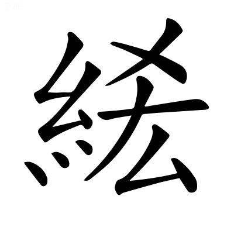

# 文選卷第四十九

> 梁昭明太子撰
> 
> 文林郎守太子右內率府錄事參軍事崇賢館直學士臣李善注上

史論上

## 公孫弘傳贊

> 班孟堅

贊曰：公孫弘卜式倪寬，皆以鴻漸之翼，困於燕雀，李奇漢書注云：漸，進也。鴻一舉而進千里者，羽翼之材也。弘等~~言~~皆以大材[^49.1.1]初困，為俗所薄，若燕雀不知鴻鵠之志。

遠跡羊豕之間，非遇其時，焉能致此位乎？漢書曰：公孫弘少時家貧，牧豕海上。年四十餘，乃學春秋。武帝初即位，召賢良文學士，是時弘年六十，徵賢良文學，對策拜博士，遷丞相。又曰：卜式以田畜為事。式以入山牧羊十餘年，羊致千餘頭。上拜為中郎，遷御史大夫。韋昭漢書注曰：遠跡，謂耕牧在遠方也。

是時漢興六十餘載，海內乂安，府庫充實，而四夷未賓，制度多闕。上方欲用文武，求之如弗及，始以蒲輪迎枚生，見主父而歎息。漢書曰；武帝為太子，聞枚乘名，及即位，乘已年老，迺以安車蒲輪徵乘。又曰：主父偃，齊國臨淄人。武帝時言九事，其八事為律令，上書闕下。朝奏，暮召入見。謂曰：公安在？何相見之晚也！

群士慕響，異人並出，卜式拔於芻牧，弘羊擢於賈`古`豎，漢書曰：桑弘羊，洛陽賈人子。

衛青奮於奴僕，日磾出於降虜，漢書曰：衛青，其父鄭季與陽信長公主家僮衛媼通，生青。青姊子夫入宮，幸[^49.1.2]，上召青為建章監侍中。又曰：金日磾，本匈奴休屠王子，王降漢，後悔，昆邪王殺之，將其衆降。日磾以父不降，沒入宮，輸黃門養馬。馬肥好，上拜為馬監。

斯亦曩時版築飯牛之~~明~~朋已[^49.1.3]。尙書序曰：高宗夢得說，使百工營求諸野，得諸傅巖。孟子曰：傅說舉於版築之間。呂氏春秋曰：寗戚飯牛，居車下，望桓公悲擊牛角而疾歌矣。

漢之得人，於茲為盛，儒雅則公孫弘董仲舒倪寬，漢書曰：倪寬治尙書，為侍御史。上問尙書一篇，擢為中大夫。

篤行則石建石慶，漢書曰：石奮長子建，次子慶，皆以馴行孝謹，官至二千石。

質直則汲黯卜式，汲黯，已見西征賦。漢書曰：卜式言「郡國不便鹽鐵，船有筭，可罷。」

推賢則韓安國鄭當時，漢書曰：韓安國所推舉，皆廉士賢於己者，於梁舉壼遂，臧固，至~~此~~他皆天下名士[^49.1.4]。鄭當時，已見西征賦。

定令則趙禹張湯，漢書曰：張湯遷太中大夫。與趙禹共定諸律令。又曰：趙禹，斄人，至中大夫；斄音邰。

文章則司馬遷相如，滑稽則東方朔枚皋，楚辭曰：突梯滑稽，如脂如韋。*王逸曰：轉免隨俗也。*漢書曰：枚皋，字少孺，不通經術，談笑類俳倡，以故得媟黷。

應對則嚴助朱買臣，漢書曰：嚴助為中大夫，與朱買臣並在左右。

歷數則唐都落下閎，漢書曰：造漢太初歷，方士唐都、巴郡落下閎與焉。益部耆舊傳曰：閎字長公，巴郡閬中人也。明曉天文地理，隱於落亭。武帝時，友人同縣譙隆薦閎，待詔太史，更作太初歷，拜侍中，辭不受。風俗通曰：姓有落下，漢有落下閎。

協律則李延年，漢書曰：李延年，中山人，坐法腐刑，善歌新聲，為協律都尉。

運籌則桑弘羊，漢書曰：桑弘羊以心計為侍中。

奉使則張騫蘇武，張騫，蘇武，已見西征賦。

將帥則衛青霍去病，衛青、霍去病，已見長楊賦。

受遺則霍光金日磾，漢書曰：武帝病篤。霍光曰「如有不諱，誰當嗣者？」上曰「立少子。君行周公之事。」光讓日磾，日磾亦曰「臣不如光。」並受遺詔，輔少主。

其餘不可勝紀。是以興造功業，制度遺文，後世莫及。

孝宣承統，纂修洪業，國語曰：祭公謀父曰「時序其德，纂修其緒。」

亦講論六藝，招選茂異，六藝，六經也。漢書：武帝詔曰「察吏民茂才異等。」

而蕭望之梁丘賀夏侯勝韋玄成嚴彭祖尹更始以儒術進，漢書曰：蕭望之修齊詩，事同縣后倉。又曰：梁丘賀，字長公，從京房受易，賀入說，上善之，以賀為郎，至少府。又曰：夏侯勝從濟南伏生受尙書，至長信少府。又曰：韋賢修詩，傳子玄成，至丞相。又曰：嚴彭祖，字次公，與顏安樂俱事眭孟。公羊春秋有顏嚴之學。為太子太傅。又曰：穀梁學有尹更始，為諫議大夫。

劉向王褒以文章顯，將相則張安世趙充國魏相邴吉于定國杜延年，漢書曰：張安世，字少孺，宣帝即位，為大司馬車騎將軍。又曰：杜延年，字幼公，為太僕給事中，宣帝任信之，即奉駕入給事中。趙充國、于定國，已見西征賦。

治民則黃霸王成龔遂鄭弘召信臣韓延壽尹翁歸趙廣漢嚴延年張敞之屬，漢書曰：黃霸，字次公，為揚州刺史。宣帝以為潁川太守。又曰：王成為膠東相，政甚有聲，宣帝最先褒之。又曰：龔遂，字少卿，宣帝以為渤海太守。人皆富實，獄訟止息。又曰：鄭弘，字稚卿，為淮陽相，以高第入為右扶風。又曰：召信臣，字翁卿，為南陽太守。吏民親愛，號之曰召父。又曰：韓延壽，字長公，為東郡太守，吏民敬畏趨嚮之，斷獄大減，為天下最。又曰：尹翁歸，字子況，拜東海太守，東海大治。又曰：嚴延年，字次卿，為涿郡太守，道不拾遺。趙、張已見西征賦。

皆有功跡見述於後世。參其名臣，亦其次也。

[^49.1.1]: 考異：注「弘等言皆以大材」：茶陵本無「言」字，是也。袁本亦衍。案：漢書注無。

[^49.1.2]: 考異：注「青姊子入宮幸」：案：「子」下當有「夫」字。袁本亦脫。茶陵本并脫「子」字。

[^49.1.3]: 考異：斯亦曩時板築飯牛之明已：何云「明」漢書作「朋」。陳云「明」，「朋」誤，是也。各本皆誤。

[^49.1.4]: 考異：注「至此皆天下名士」：袁本「此」作「他」，是也。茶陵本亦誤。

## 晉紀論晉武帝革命

> 干令升何法盛晉書曰：干寶，字令升，新蔡人。始以尙書郎領國史，遷散騎常侍，卒。撰晉紀，起宣帝迄愍五十三年，評論切中，咸稱善之。

史臣曰：帝王之興，必俟天命，尙書曰：俟天休命。

苟有代謝，非人事也。淮南子曰：二者代謝舛馳。*高誘曰：代，更也。謝，次也。*

文質異時，興建不同，春秋元命苞曰：王者一質一文，據天地之道也。天質而地文。又曰：正朔三而改，文質再而復。

故古之有天下者，柏皇栗陸以前，為而不有，應而不求，執大象也。莊子曰：獨不知至德之時乎？昔者柏皇氏栗陸氏，若此之時則至治也。淮南子曰：天地大矣，成而弗有。老子曰：執大象，天下往。

鴻黃世及，以一民也。父子相承，以一民之心也。左氏傳：史克曰「昔帝鴻氏有不材子。」*杜預曰：帝鴻，黃帝也。*禮記曰：大人世及以為禮。

堯舜內禪，體文德也。漢魏外禪，順大名也。謝靈運晉書禪位表曰：夫唐虞內禪，無兵戈之事，故曰文德。漢晉外禪，有翦伐之事，故曰順名。以名而言，安得不僭稱以為禪代邪？靈運之言，似出于此，文既詳悉，故具引之。

湯武革命，應天人也。周易曰：湯武革命，順乎天而應乎人。

高光爭伐，定功業也。漢高祖及光武也。仲長子昌言曰：高光二祖之神武，遇際會而不能得。管子曰：禹平治天下，及桀而亂之，湯放桀以定禹功也。湯平治天下，及紂而亂之，武王伐紂，以定湯功也。

各因其運而天下隨時，隨時之義大矣哉！周易曰：隨，元亨，隨時之義大矣哉！

古者敬其事則命以始，今帝王受命而用其終，尙書曰：月正元日，舜格于文祖。*孔安國曰：將即政，故至文祖廟告也。*魏志曰：陳留王咸熙二年十二月，禪位于晉嗣王。左氏傳曰：晉侯使太子申生伐東山皋落氏，狐突歎曰「時，事之徵也。故敬其事則命以始，今命以時卒，閟其事也。」

豈人事乎？其天意乎？

## 晉紀總論

> 干令升

史臣曰：昔高祖宣皇帝以雄才碩量，應運而仕，范曄後漢書曰：陶謙奏記於朱俊曰：將軍既文且武，應運而出。

值魏太祖創基之初，籌畫軍國，嘉謀屢中，干寶晉紀曰：魏武帝為丞相，命高祖為文學掾，每與謀，策畫多善。

遂服輿軫，驅馳三世。干寶晉紀曰：魏文帝即王位，為丞相長史，明帝即位，遷驃騎大將軍。

性深阻有如城府，而能寬綽以容納，行任數以御物，而知人善采拔。管子曰：聖君任法不任智，任數不任說。尙書：禹曰「知人則哲，能官人。」

故賢愚咸懷，小大畢力，尙書：穆王曰「小大之臣，咸懷忠良。」東觀漢記：太史官曰「明主勞神，忠臣畢力。」

爾乃取鄧艾於農~~隙~~瑣[^49.3.1]，引州泰於行役，委以文武，各善其事。魏志曰：鄧艾，字士林，義陽人也。典農綱紀，上計吏，因使見太尉司馬宣王。宣王奇之，辟以為掾，遷尙書郎。郭頒世語曰：初，荊州刺史裴潛，以州泰為從事，司馬宣王鎮宛，潛數遣詣宣王，由此為宣王所知，歷兗豫州刺史。

故能西禽孟達，東舉公孫淵，干寶晉紀曰：新城太守孟達反，高祖親征之，屠其城，斬達。魏志曰：公孫淵為遼東太守，景初元年徵淵，遂發兵逆於遼隧，自立為燕王。三年，遣司馬宣王征淵，斬淵，傳首洛陽。

內夷曹爽，外襲王~~陵~~凌[^49.3.2]，干寶晉紀曰：高祖與曹爽俱受遺輔政。爽橫恣日甚，高祖乃奏事永寧宮，廢爽兄弟，以侯歸第。有司奏黃門張當辭道爽反狀，遂夷三族。又曰：高祖東襲太尉王~~陵~~凌于壽春。初，~~陵~~凌以魏主非明帝親生，且不明也，謀更立楚王彪。~~陵~~凌聞軍至，面縛請降。高祖解縛，反服見之，送之京都，飲藥而死。

神略獨斷，征伐四克。楊雄連珠曰：兼聽獨斷，聖王之法也。法言曰：湯武桓桓，征伐四克。

維御群后，大權在己。春秋孔演圖曰：天子執圖，諸侯得之，大權成。

屢拒諸葛亮節制之兵，而東支吳人輔車之勢，漢書曰：齊桓晉文之兵，可謂入其域而有節制矣。左氏傳：宮之奇曰「諺所謂輔車相依，脣亡齒寒。」

~~世宗承基，太祖繼業，干寶晉紀曰：世宗景皇，高祖崩，以撫軍大將軍輔政。又曰：太祖，文皇帝母弟也。世宗崩，進位大將軍，錄尙書事，輔政。~~

軍旅屢動，邊鄙無虧，於是百姓與能，大象始構矣。周易曰：人謀鬼謀，百姓與能。大象，已見上文。

世宗承基，太祖繼業[^49.3.3]，干寶晉紀曰：世宗景皇帝[^49.3.4]，高祖崩，以撫軍大將軍輔政。又曰：太祖文皇帝，景皇帝母弟也[^49.3.5]。世宗崩，進位大將軍，錄尙書事，輔政。

玄豐亂內，欽誕寇外，干寶晉紀曰：中書令李豐推太常夏侯玄謀廢大將軍。世宗聞之，乃遣王羨迎豐至，世宗責之。豐知禍及，遂肆惡言，勇士築殺之，皆夷三族。又曰：楊州刺史文欽，自曹爽死後，陰懷異志，乃矯太后令，罪狀世宗。世宗自帥中軍討之。欽敗，得入吳。又曰：鎮東大將軍諸葛誕貳于我，太祖親率六軍東征，拔之，斬誕首，夷三族也。

潛謀雖密，而在幾必兆。淮浦再擾，而許洛不震，咸黜異圖，用融前烈。左氏傳曰：咸黜不端。尙書：王曰「公劉克篤前烈。」

然後推轂鍾鄧，長驅庸蜀，干寶晉紀曰：景元四年，大舉伐蜀。太祖部分諸軍，指授方略，使征西將軍鄧艾自狄道攻姜維於沓中，使鎮西將軍鍾會自駱谷襲漢中。漢書：馮唐曰「上古王者遣將也，跪而推轂曰『閫以內寡人制之，閫以外將軍制之。』」戰國策曰：樂毅輕卒銳兵，長驅至齊。尙書曰：及庸蜀人。

三關電掃，劉禪入臣，吳志：賀邵曰「劉氏據三關之險，守重山之固。」張瑩漢南記曰：蜀有陽平江關白水關，此為三關。干寶晉紀曰：鄧艾進軍城北，蜀主劉禪面縛輿櫬，詣壘門。范曄後漢書：閻忠說車騎將軍皇甫嵩曰「旬月之間，神兵電掃。」

天符人事[^49.3.6]，於是信矣。東觀漢記：耿純說上曰「天時人事，已可知矣。」

始當非常之禮，終受備物之錫，干寶晉紀曰：天子命太祖為晉公，九錫之禮，又進公爵為王。左氏傳：子魚曰「備物典策。」

名器崇於周公，權制嚴於伊尹。至於世祖，遂享皇極。世祖，武帝也。尙書考靈耀曰：建用皇極。*宋均曰：建，立也。皇極，大中也。*

正位居體，重言慎法，周易曰：君子正位居體也。法言曰：重言重行，言重則有法，行重則有德。

仁以厚下，儉以足用；周易曰：山附於地，剝，上以厚下安宅。毛詩序曰：儉以足用，寬以愛民。

和而不弛，寬而能斷。論語曰：君子和而不同。韋昭國語注曰：弛，廢也。尙書曰：寬而栗。斷猶決也。

故民詠惟新。四海悅勸矣。毛詩曰：周雖舊邦，其命惟新。周易曰：說以先民，民忘其勞；說以犯難，民忘其死。說之大，民勸矣哉！

聿修祖宗之志，思輯戰國之苦，毛詩曰：無念爾祖，聿修厥德。

腹心不同，公卿異議，而獨納羊祜之策，以從善為衆。干寶晉紀曰：征南大將軍羊祜來朝，上疏云「以國家之盛強，臨吳之危弊，軍不踰時，克可必也。」上納之而未宣。左氏傳：欒武子曰「善鈞從衆。夫善，衆之主也。從之，不亦可乎？」

故至於咸寧之末，遂排群議[^49.3.7]而杖王杜之決，干寶晉紀曰：咸寧五年，龍驤將軍王濬上疏曰「吳~~王~~主荒淫[^49.3.8]，且觀時運宜征伐。」上將許之，賈充荀勗等~~陳~~畢諫[^49.3.9]，以為不可。張華固勸之，杜預亦上疏。上先納羊祜之謀，重以濬預之決，乃發詔諸方大舉。

汎舟三峽，介馬桂陽，左氏傳：晉饑，秦輸之粟，命之曰汎舟之役。劉淵林蜀都賦注曰：三峽，巴東永安縣有高山相對，民謂之峽。左氏傳曰：晉郤克與齊侯戰于鞍，齊侯不俟介馬而馳之。漢書曰：有桂陽郡，高帝置之。

役不二時，江湘來同。干寶晉紀曰：咸寧五年十一月，命安東將軍王渾、龍驤將軍王濬帥巴蜀之卒，浮江而下。太康元年四月，王濬鼓譟入于石頭，吳主孫皓面縛輿櫬降于濬。毛詩曰：淮夷來同也。

夷吳蜀之壘垣，通二方之險塞，掩唐虞之舊域，班正朔於八荒。漢書曰：賈捐之曰：堯舜之盛也，地方不過數千里。論語比考讖曰：正朔所加，莫不歸義。甘泉賦曰：八荒協兮萬國諧。

太康之中，天下書同文，車同軌。禮記：子曰「今天下書同文，車同軌。」

牛馬被野，餘糧棲畝，行旅草舍，外閭不閉。東觀漢記曰：建武十七年，商賈重寶，單車露宿，牛馬放牧，道無拾遺。淮南子曰：昔容成之時，置餘糧於畝首。蔡邕胡廣碑曰：餘糧棲乎畎畝。毛詩曰：召伯所茇。*毛萇曰：茇，草舍也。*禮記曰：外戶不閉，謂之大同。

民相遇者如親，其匱乏者，取資於道路，禮記：孔子曰「昔者大道之行也，人不獨親其親，不獨子其子。」

故于時有天下無窮人之諺。莊子：孔子曰「當堯舜而天下無窮人，非知得也；當桀紂而天下無通人，非知失也。」

雖太平未洽，亦足以明吏奉其法，民樂其生，百代之一時矣。東觀漢記：詔曰「吏安其職，民樂其業。」孝經援神契曰：天下歸往，人人樂生。論語曰：百世可知。言喻遠也。

武皇既崩，山陵未乾，漢書：霍禹曰「將軍墳墓未乾。」

楊駿被誅，母后廢黜，干寶晉紀曰：永平元年，誅太傅楊駿，遷太后楊氏于永寧宮，策廢為庶人，居於金墉城。

朝士舊臣，夷滅者數十族。尋以二公楚王之變，干寶晉紀曰：太子太傅孟觀知中宮旨，因譖二公欲行廢立之事。楚王瑋殺太宰汝南王亮、太保衛瓘。張華以二公既亡，楚必專權，使董猛言於后，遣謁者李雲宣詔免瑋付廷尉。瑋以矯詔伏誅。

宗子無維城之助，而閼伯實沈之郤歲構；毛詩曰：懷德維寧，宗子維城。左氏傳：子產曰「昔高辛氏有二子，伯曰閼伯，季曰實沈，居曠~~野~~林，不相能[^49.3.10]，日尋干戈，以相征討。」閼伯、實沈，則參商也。

師尹無具瞻之貴，而顛墜戮辱之禍日有。毛詩曰：赫赫師尹，民具爾瞻。

至乃易天子以太上之號，而有免官之謠，臧榮緒晉書曰：惠帝永~~寧~~康二年[^49.3.11]，禪位于趙王倫，倫以兵留守衛，上號曰太上皇，改金墉曰永昌宮。中書令繆播云「太史案星變事，當有免官天子。」

民不見德，唯亂是聞，左氏傳：卜偃曰「民不見德，唯戮是聞。」

朝為伊周，夕為桀跖，莊子曰：施不及三王，天下大駭矣。下有盜跖，上有曾史。

善惡陷於成敗，毀譽脅於勢利。於是輕薄干紀之士，役姦智以投之，如夜蟲之赴火。范曄後漢書曰：李寶勸劉嘉且觀成敗，光武聞，告鄧禹曰「當是長安輕薄兒誤之耳。」左氏傳：季孫盟臧氏曰「無或如臧孫紇干國之紀。」呂氏春秋曰：人主有能明其德者，天下之士歸之，若蟬之赴明火也。

內外混淆，庶官失才，鄭玄毛詩箋曰：內，謂諸夏也。外，謂夷狄也。尙書曰：推賢讓能，庶官乃和。

名實反錯，天網解紐。管子曰：循名而案實。案：實而定名，名實相為情。

國政迭移於亂人，禁兵外散於四方，方岳無鈞石之鎮，關門無結草之固。漢書：十六兩為斤，三十斤為鈞，四鈞為石。左氏傳曰：晉輔氏之役，魏顆見老人結草以亢杜回，回躓而顛仆。

李辰石冰，傾之於荊揚，干寶晉惠紀曰：蜀賊李流攻益州，發武勇以西赴益州。兵不樂西征，李辰因之誑曜百姓，以山都民丘沈為主。石冰應之。石冰略揚州，揚州刺史蘇峻降。

劉淵王彌，撓之於青冀，干寶晉紀曰：劉淵遷離石，遂謀亂。淵在西河離石，攻破諸郡縣，自稱王。又曰：王彌攻東莞東安二郡，復攻青州。

二十餘年而河洛為墟。戎羯稱制，二帝失尊，山陵無所。干寶晉懷紀曰：賊劉曜入京都，百官失守，天子蒙塵於平陽。又愍紀曰：劉曜寇長安，劉粲寇於城下，天子蒙塵於平陽矣。

何哉？樹立失權，託付非才，四維不張，而苟且之政多也。管子曰：不供祖舊，則孝悌不備，四維不張，國乃滅亡。四維，一曰禮，二曰義，三曰廉，四曰恥。漢書：王嘉上疏曰「上下相望，莫有苟且之意。」

夫作法於治，其弊猶亂；作法於亂，誰能救之？左氏傳曰：渾罕曰「君子作法於涼，其弊猶貪；作法於貪，弊將若之何？」

故于時天下非暫弱也。軍旅非無素也。彼劉淵者，離石之將兵都尉；王彌者，青州之散吏也。干寶晉武紀曰：太康八年，詔淵領北部都尉。

蓋皆弓馬之士，驅走之人，凡庸之才，非有吳先主諸葛孔明之能也。新起之寇，烏合之衆，非吳蜀之敵也。曾子曰：烏合之衆，初雖相歡，後必相咋。

脫耒為兵，裂裳為旗，非戰國之器也。賈誼過秦論曰：斬木為兵，揭竿為旗。

自下逆上，非鄰國之勢也。然而成敗異效，擾天下如驅群羊，舉二都如拾遺。孔安國尙書傳曰：擾，亂也。淮南子曰：兵略者，乘勢以為資，清淨以為常，避實就虛，若驅群羊，此所以言兵者也。漢書：梅福上書曰「高祖舉秦如鴻毛，取楚如拾遺。」

將相侯王，連頭受戮，乞為奴僕而猶不獲。干寶晉紀曰：劉曜入京都，殺大將軍吳王晏、光祿大夫竟陵王，其餘官僚，僵尸塗地，百不遺一。

后嬪妃主，虜辱於戎卒，豈不哀哉！孫盛晉陽秋曰：劉曜入于京都，六宮幽辱，征西將軍南陽王模出降，以模妃劉氏賜胡張平為妻。

夫天下，大器也；群生，重畜也。文子：老子曰「天下，大器也，不可執也，不可為也。為者敗之，執者失之。」漢名臣奏：陳風對問曰「民如六畜，在牧養者耳。」

愛惡相攻，利害相奪，周易曰：愛惡相攻而吉凶生，情偽相感而利害生。六韜曰：利害相臻，猶循環之無端。

其勢常也；若積水于防，燎火於原，未嘗暫靜也。周禮曰：以防止水。*鄭玄曰：偃瀦畜流水之陂。*尙書曰：若火之燎于原。

器大者不可以小道治，勢動者不可以爭競擾，古先哲王，知其然也。是以扞其大患而不有其功，禦其大災而不尸其利。禮記曰：聖王之制祭祀也，能禦大災則祀之，能扞大患則祀之。

百姓皆知上德之生己，而不謂浚己以生也。左氏傳：子產寓書於子西以告宣子曰「毋寧使人謂子『子實生我』，而謂『子浚我以生』乎？」*杜預曰：浚，取也。*

是以感而應之，悅而歸之，如晨風之鬱北林，龍魚之趣淵澤也。毛詩曰：鴪彼晨風。鬱彼北林。孫卿子曰：川淵深而魚鱉歸之，刑政平而百姓歸之。川淵者，龍魚之居也；國家者，士人之居也。

順乎天而享其運，應乎人而和其義，然後設禮文以治之，斷刑罰以威之，孝經曰：安上治民，莫善於禮。毛詩序曰：君臣上下，動無禮文。左氏傳：叔向詒子產書曰「嚴斷刑罰，以威其淫。」

謹好惡以示之，審禍福以喻之，孝經曰：示之以好惡而民知禁。謝承後漢書曰：朱雋宣國威靈，審示禍福。

求明察以官之，篤慈愛以固之，故衆知向方，左氏傳：叔向曰「猶求聖哲之主，明察之官，忠信之長，慈惠之師。」禮記曰：樂行而人向方。

皆樂其生而哀其死，鶡冠子曰[^49.3.12]：所謂人者，惡死樂生。

悅其教而安其俗，孟子曰：萬乘之國行仁政，民悅之，猶解倒懸也。老子曰：安其居，樂其俗。

君子勤禮，小人盡力，趙岐孟子章指曰：治身勤禮，君子所能。家語曰：子路治蒲，孔子曰「此其恭敬以信，故其人盡力。」

廉恥篤於家閭，邪僻銷於胸懷。廉恥，已見上注。禮記曰：惰慢邪僻之氣，不設於身禮。

故其民有見危以授命，而不求生以害義，論語：子張曰「士見危致命。」又，子曰「志士仁人，無求生以害仁。」

又況可奮臂大呼，聚之以干紀作亂之事乎？漢書：淮南王安上疏曰「陳勝吳廣奮臂大呼，天下響應。」

基廣則難傾，根深則難拔，文子曰：人主之有民，猶城之有基，木之有根，根深則本固，基厚則上安。

理節則不亂，膠結則不遷。是以昔之有天下者，所以長久也。夫豈無僻主，賴道德典刑以維持之也。左氏傳：韓厥曰「三代之令王，皆數百年保天之祿。夫豈無辟王，賴前哲以免也。」毛詩曰：雖無老成人，尚有典刑。

故延陵季子聽樂以知諸侯存亡之數，短長之期者，蓋民情風教，國家安危之本也。左氏傳曰：吳公子札來聘，請觀於周樂，使工為之歌鄭，曰「其細已甚，民不堪也，是其先亡乎？」為之歌齊，曰「表東海者，其太公乎？國未可量也。」

昔周之興也，后稷生於姜嫄，而天命昭顯，文武之功，起於后稷。毛詩序曰：后稷生於姜嫄，文武之功，起於后稷。

故其詩曰「思文后稷，克配彼天。」又曰「立我蒸民，莫匪爾極。」毛詩周頌文也。*鄭玄曰：周公思先祖之有文德者，后稷之功能配天。又播殖百穀，蒸民乃粒，天下無不於汝得其中者，言反其性。*

又曰「實穎實栗，即有邰`胎`家室。」毛詩大雅文也。*毛萇曰：穎，垂穎也。鄭玄曰：栗，成熟也。后稷教世種黍稷，堯改封於邰，就其家室，無變更也。*

至于公劉遭狄人之亂，去邰之豳，身服厥勞。故其詩曰「乃裹餱糧，于橐`託`于囊。」毛詩大雅文。*毛萇曰：小曰槖，大曰囊[^49.3.13]。鄭玄曰：為狄人所迫逐，不忍鬥其民，裹糧食囊之中，棄其餘而去。*

「陟則在巘，復降在原，以處其民。」毛詩大雅文也。*毛萇曰：巘，小山，別於大山者也。鄭玄曰：由原而升巘，復下在原，言反覆之重民居。*

以至于太王為戎翟所逼，而不忍百姓之命，杖策而去之。莊子曰：太王亶父居豳，狄人攻之。太王曰「與人之兄居而殺其弟，與人之父居而殺其子，吾不忍也。子皆免居矣。」因杖策而去。

故其詩曰「來朝走馬，帥西水滸，至于岐下。」毛詩大雅文。*鄭玄曰：來朝走馬，言其避惡早且疾也。循西水涯，漆、沮側也。謂亶父避狄循漆、沮之水而至岐下。*

周民從而思之，曰「仁人不可失也」，故從之如歸市。毛萇詩傳曰：古公處豳，狄人侵之，乃屬其耆老而告之曰「吾聞之，君子不以其養人而害人，二三子何患無君。」去之，踰梁山，邑於岐山之下。豳人曰「仁人之君不可失也。」從之如歸市。

居之一年成邑，二年成都，三年五倍其初。新序曰：太王亶父止於岐下，百姓扶老攜幼隨而歸之，一年成邑，二年成都，三年五倍其初。

每勞來而安集之。毛詩序曰：萬民離散，不安其居，而能勞來安集之。

故其詩曰「乃慰乃止，乃左乃右，乃疆乃理，乃宣乃畝。」毛詩大雅文也。*毛萇曰：慰，安也。人心定，乃安隱其居，乃左右而處之，乃疆理其經界，乃時耕其田畝者。鄭玄曰：時耕曰宣。*

以至于王季，能貊其德音。毛詩曰：維此王季，帝度其心，貊其德音。*毛萇曰：心能制義曰度。貊，靜也。鄭玄曰：德政應和曰貊。*

故其詩曰「克明克類，克長克君，載錫之光[^49.3.14]。」毛詩大雅文也。左傳曰：勤施無私曰類，教誨不倦曰長，慶賞刑威曰君。*毛萇曰：光，大也。鄭玄曰：載，始也。始使之顯著也。*

至于文王，備修舊德，而惟新其命。毛詩曰：周雖舊邦，其命惟新。*鄭玄曰：太王國於周，至文王而受命。言新者，美之也。*

故其詩曰「惟此文王，小心翼翼，昭事上帝，聿懷多福。」毛詩大雅文也。*鄭玄曰：小心翼翼，恭順之貌也。昭，明也。聿，述也。懷，思也。謂能明事上天，又能述思多福。*

由此觀之，周家世積忠厚，仁及草木，內睦九族，外尊事黃耇，養老乞言，以成其福祿者也。毛詩行葦序文。

而其妃后躬行四教，禮記曰：古婦人教以婦德、婦言、婦容、婦功。鄭玄毛詩箋曰：法度莫大於四教。

尊敬師傅，服澣濯之衣，脩煩辱之事，化天下以婦道。毛詩葛覃序也。詩曰：葛之覃兮。*毛萇曰：葛所以為絺，女功之事煩辱者也。*

故其詩曰「刑于寡妻，至于兄弟，以御于家邦。」毛詩大雅文也。*毛萇曰：刑，法也。鄭玄曰：御，治也。文王以禮法接其妻，至于宗族，又能為正治於家邦。*

是以漢濱之女，守絜白之志；中林之士，有純一之德。毛詩曰：漢有游女，不可求思。*鄭玄曰：女雖出游漢水之上，人無欲求犯禮者，亦由貞絜使之然也。*毛詩曰：肅肅兔罝，施于中林，赳赳武夫，公侯腹心。*鄭玄曰：亦言賢。*

故曰「文武自天保以上治內，采薇以下治外，始於憂勤，終於逸樂。」毛詩六月序也。*鄭玄曰：內，謂諸夏也。外，謂夷狄也。*

於是天下三分有二，猶以服事殷，諸侯不期而會者八百，猶曰天命未至。論語：孔子曰「三分天下有其二，以服事殷，周之德，其可謂至德已矣。」周書曰：武王將渡河，不期同時一朝會於武王郊祀下者八百諸侯。史記曰：武王至於孟津，諸侯皆曰帝紂可伐。武王曰「天命未至也。」

以三聖之智，伐獨夫之紂，猶正其名教曰「逆取順守，保大定功，安民和衆」。琴操曰：崇侯譖文王於紂曰「西伯昌，聖人也。長子發，中子旦，皆聖。三聖合謀，將不利於君。」尙書：武王曰「獨夫受洪惟作威。」孔安國尙書傳曰：湯順天應人，逆取順守。左氏傳：楚子曰「夫武，禁暴戢兵，保大定功，安民和衆豐財。」

猶著大武之容曰「未盡善也」。論語：孔子曰「謂武盡美矣，未盡善也。」

及周公遭變，陳后稷先公風化之所由，致王業之艱難者，則皆農夫女工衣食之事也。毛詩七月序也。

故自后稷之始基靜民，十五王而文始平之，十六王而武始居之，十八王而康克安之，國語曰：靈王二十二年[^49.3.15]，穀洛鬥，王欲壅之，太子晉諫曰「后稷始基靜民，十五王而文始平之，十八王而康克安之，其難也如是。」*韋昭曰：基，始也。靜，安也。自后稷播百穀，以始安民，凡十五王，世脩其德，至文王乃平民受命也。十五王，謂后稷、不窟、鞠陶、公劉、慶節、皇僕、羌弗、毀俞、公非、高圉、亞圉、公組、太王、王季、文王也。十八者，加武王、成王、康王，并上十五。*

故其積基樹木，經緯禮俗，節理人情，恤隱民事，如此之纏綿也。潘元茂九錫文曰：經緯禮律。王肅家語注曰：經緯猶織以成之也。國語：祭公謀父曰「勤恤民隱。」

爰及上代，雖文質異時，功業不同，文質，已見上文。

及其安民立政者，其揆一也。安民，已見上文。尙書有立政篇。孟子曰：先聖後聖，其揆一也。

今晉之興也，功烈於百王，事捷於三代，蓋有為以為之矣。禮記：孔子曰「昔者魯公伯禽有為為之。」

宣景遭多難之時，務伐英雄，誅庶桀以便事[^49.3.16]，左氏傳：司馬侯曰「或乃多難以固其國。」尸子曰：便事以立官也~~，以固其國~~[^49.3.17]。

不及脩公劉太王之仁也。受遺輔政，屢遇廢置，故齊王不明，不獲思庸於亳；魏志曰：齊王芳，字蘭卿，明帝崩，即皇帝位。大將軍司馬景王廢帝，以太后令遣芳歸藩于齊。尙書曰：太甲既立，弗明，伊尹放諸桐宮，三年，復歸于亳，思庸也。

高貴沖人，不得復子明辟；魏志曰：高貴鄉公諱髦，字士彥，齊王廢，即皇帝位。魏氏春秋曰：帝自出討，文王擊戰鼓，出雲龍門。賈充自外入，帝師潰。騎督成倅弟濟以矛進，帝崩于師。尙書曰：惟予沖人弗及知。又，周公曰「朕復子明辟。」

二祖逼禪代之期，不暇待參分八百之會也。二祖，景文。

是其創基立本，異於先代者也。景福殿賦曰：武創元基。

又加之以朝寡純德之士，鄉乏不二之老。尙書曰：昔君文武，則有不二心之臣。

風俗淫僻，恥尚失所，學者以莊老為宗，而黜六經，干寶晉紀：劉弘教曰「~~太~~元康以來[^49.3.18]，天下共尚無為，貴談莊老，少有說事。」

談者以虛薄為辯，而賤名~~儉~~檢[^49.3.19]，王隱晉書曰：王衍不治經史，唯以莊老虛談惑衆。劉謙晉紀：應瞻表曰「元康以來，以儒術清儉為群俗。」

行身者以放濁為通，而狹節信，劉謙晉紀：應瞻表曰「以~~宏~~容放為夷達[^49.3.20]。」王隱晉書曰：貴遊子弟，多祖述於阮籍，同禽獸為通。又傅玄上疏曰：魏文慕通達，而天下賤守節也。

進仕者以苟得為貴，而鄙居正，鄭玄毛詩箋曰：祿仕者苟得祿而已。公羊傳曰：君子大居正。

當官者以望空為高，而笑勤恪。劉謙晉紀：應瞻表曰「元康以來，望白署空，顯以台衡之量，尋文謹案，目以蘭薰之器。」

是以目三公以蕭杌之稱，標上議以虛談之名，干寶晉紀云：言君上之議虛談也。蕭杌，未詳。

劉頌屢言治道，傅咸每糾邪正，皆謂之俗吏。干寶晉紀曰：劉頌在朝忠正，才經政事。武帝重之，訪以治道，悉心陳奏，多所施行。又曰：尙書郭啟出赴妹葬，疾病不辭，左丞傅咸糾之，尙書弗過。王隱晉書：傅玄曰「論經禮者，謂之俗生，說法理者，名為俗吏。」

其倚杖虛曠，依阿無心者，皆名重海內。若夫文王日昃不暇食，仲山甫夙夜匪懈者，尙書曰：文王自朝至于日中側，弗皇暇食。毛詩曰：肅肅王命，仲山甫將之，夙夜匪懈，以事一人。

蓋共嗤點以為灰塵，而相詬`火候反`病矣。鄭玄毛詩箋曰：言時人骨肉無相詬病也。說文曰：詬，恥也。

由是毀譽亂於善惡之實，情慝奔於貨慾之塗，選者為人擇官，官者為身擇利。謝承後漢書：呂強上疏曰「苟寵所愛，私擢所幸，不復為官擇人，反為人擇官也。」

而秉鈞當軸之士，身兼官以十數。毛詩曰：秉國之鈞，四方是維。桓寬鹽鐵論曰：車丞相當軸處中，括囊不言。

大極其尊，小錄其要，機事之失，十恒八九。漢~~書~~官解故曰[^49.3.21]：機事所摠，號令攸發。胡廣曰：機密之事。

而世族貴戚之子弟，陵邁超越，不拘資次，崇讓論曰：非勢家之子，率多因資次而進之。

悠悠風塵，皆奔競之士，孔安國論語注曰：悠悠，周流之貌。風塵，以喻汙辱也。晉諸公讚曰：人人望品，求者奔競。

列官千百，無讓賢之舉。孫卿子曰：天子千官，諸侯百官。史記曰：司馬季主曰「試官不讓賢。」

子真著崇讓而莫之省，干寶晉紀曰：時禮讓未興，賢者壅滯，少府劉寔著崇讓論。孫盛晉陽秋曰：劉寔，字子真，平原人。

子雅制九班而不得用，王隱晉書曰：劉頌，字子雅，轉吏部尙書，為九班之制，裴頠有所駮。

長虞數直筆而不能糾。孫盛晉陽秋曰：司隸校尉傅咸勁直正厲，果於從政，先後彈奏百寮，王戎多不見從。

其婦女莊櫛織紝`女金反`，皆取成於婢僕，禮記曰：婦事舅姑，如事父母，雞初鳴，咸盥漱櫛縰笄。織紝，見下句。

未嘗知女工絲枲`胥里反`之業，中饋酒食之事也。禮記曰：女子十年不出，執麻枲，治絲繭，織紝組紃。周易曰：在中饋，無攸遂。毛詩曰：乃生女子，無非無儀，酒食是議。

先時而婚，任情而動，故皆不恥淫逸之過，不拘妒忌之惡。有逆于舅姑，有反易剛柔，有殺戮妾媵，有黷亂上下，爾雅曰：婦稱夫之父曰舅，稱夫之母曰姑。禮記曰：婦將有事，大小必請於舅姑。又曰：男子親迎，男先於女，剛柔之義也。公羊傳曰：媵者何，諸侯娶一國，則二國往媵之以姪娣。禮記曰：婚禮者，上以事宗廟，而下以繼後世也。尙書說命曰：黷于祭祀，時謂弗欽。

父兄弗之罪也，天下莫之非也。又況責之聞四教於古，修貞順於今，以輔佐君子者哉！四教，已見上文。列女傳，宋鮑女宗曰「貞順，婦人之至行也。」毛詩序曰：后妃又當輔佐君子，求賢審官。

禮法刑政，於此大壞，如室斯構而去其鑿契，如水斯積而決其隄防，呂氏春秋曰：若積大水，而失其壅隄矣。

如火斯畜而離其薪燎也。國之將亡，本必先顛，其此之謂乎！左氏傳：齊仲孫謂齊侯曰「臣聞國之將亡，本必先顛，而後枝葉從之。」

故觀阮籍之行，而覺禮教崩弛之所由；干寶晉紀曰：阮籍宏逸曠遠，居喪不帥常檢。

察庾純賈充之~~事~~爭[^49.3.22]，而見師尹之多僻。干寶晉紀曰：賈充饗衆官，庾純後至。充曰「君行常居人前，今何以在後？」純曰「有小市井事不了，是以後。」世俗言純乃祖為五伯。又曰：充之先為市魁，故以戲答。

考平吳之功，而知將帥之不讓[^49.3.23]；干寶晉紀曰：王渾愧久造江而王濬先之，乃表濬違詔，不受己節度。濬上書自陳曰「惡直醜正，實繁有徒，欲構南箕，成此貝錦。」

思郭欽之謀，而悟戎狄之有釁。干寶晉紀：御史大夫郭欽上書曰「戎狄強獷，歷古為患，今西北郡皆與戎居，若百年之後，有風塵之警，胡騎自平陽上黨，不三日至盟津。及平吳之盛，出北地西河安定，復上郡，置馮翊平陽。」帝弗聽。

覽傅玄劉毅之言，而得百官之邪；干寶晉紀：傅玄上書曰「昔魏氏虛無放誕之論，盈於朝野，使天下無復清議，而亡秦之病復發於今。」又上顧謂劉毅曰「朕方漢何主？」對曰「桓靈。」帝曰「吾雖不及古賢，猶克己為治，方之桓靈，不亦甚乎？」對曰「桓靈賣官，錢入於官，陛下賣官，錢入私門，以此言，殆不若也。」

核傅咸之奏，錢神之論，而睹寵賂之彰。干寶晉紀：司隸校尉傅咸上書曰「臣以貨賂流行，所宜深絕。」又曰：魯褒，字元道，南陽人，作錢神論。左氏傳曰：取郜大鼎于宋，臧哀伯諫曰「官之失德，寵賂彰也。」

民風國勢如此，雖以中庸之才，守文之主治之，賈誼過秦篇曰：陳涉材能不及中庸。論語曰：中庸之為德也，其至矣乎？民鮮久矣！*何晏曰：庸，常也。中和，可常行之德也。*公羊傳曰：繼文王之體，守文王之法度。*何休曰：引文王者，文王始受命制度也。*

辛有必見之於祭祀，季札必得之於聲樂，左氏傳曰：初，平王之東遷也，辛有適伊川，見被髮而祭於野者，曰「不及百年，此其戎乎！其禮先亡矣。」又曰：季札來聘，請觀樂，使工為之歌陳，曰「國無主，其能久乎？」

范燮必為之請死，賈誼必為之痛哭。左氏傳曰：范燮反自鄢陵之役，使其祝宗祈死，曰「君無禮而克敵，天益其疾矣。愛我者唯祝使我速死，無及於難，范氏之福也。」漢書：賈誼上疏曰「可為痛哭者一也。」

又況我惠帝以蕩蕩之德臨之哉！惠帝，已見西征賦。毛詩曰：蕩蕩上帝，下民之辟。

故賈后肆虐於六宮，韓午助亂於外內，其所由來者漸矣，豈特繫一婦人之惡乎？干寶晉紀曰：賈庶人賜死。初，武帝為太子取后，在宮不恭遜而甚妒忌，有孕者輒殺子，或以手戟擿之，子隨刃墜。又曰：韓壽妻賈午，寔始助亂。

懷帝承亂~~之後~~得位[^49.3.24]，羈於彊臣。干寶晉懷紀曰：太傅東海王越總兵輔政。

愍帝奔播之後，徒廁其虛名。干寶晉紀曰：洛京傾覆，秦王業避難密南，趣許潁，豫州刺史閻鼎，以天下無主，有輔立之計。

天下之政，既已去矣，非命世之雄，不能取之矣。孟子曰：五百年必有王者興，其間必有名世者。廣雅曰：命，名也。

然懷帝初載，嘉禾生于南昌。徐廣晉紀曰：太康五年八月，嘉禾生南昌，九月，懷帝生。毛詩曰：文王初載，天作之合。載猶生也。

望氣者又云豫章有天子氣。干寶晉紀曰：初，望氣者言豫章廣陵有天子氣。

及國家多難，宗室迭興，毛詩曰：維予小子，未堪家多難。史記：太史公曰「遞興遞廢，能者用事。」

以愍懷之正，淮南之壯，成都之功，長沙之權，皆卒於傾覆。王隱晉書曰：愍懷太子遹，立為皇太子。賈后無子，妒害滋甚，廢太子為庶人，送太子于許昌宮之別坊，矯詔使小黃門孫憲害太子。趙王倫酖殺賈后，帝詔謚遹為愍懷皇太子。又曰：武皇帝男允，字欽度，封淮南王，領中護軍。孫秀既害石崇等以懼允，允遂進圍相府，相國趙王倫閉門，允兵四勝，陷破無前。倫息度，偽云有詔助淮南王。王下車受詔，遂害允。又曰：穎字章度，封成都王，拜越屯騎校尉。趙王倫篡位，穎謀舉義兵迎天子。倫死後，廢太子覃，立穎為皇太弟。張方廢穎歸蕃，遣田徽殺之於鄴。又曰：乂字士度，封長沙王，拜步兵校尉。齊王冏相攻，冏敗，縛至上前，乂叱左右斬之。河間王顒欲廢太子，立成都王，欲先誅乂，出征，連戰敗走，遂誅之。

而懷帝以豫章王登天位，干寶晉惠紀曰：詔豫章王熾為皇太弟，皇帝崩，太弟即位。崩，謚曰孝懷皇帝。尙書曰：天位艱哉！

劉向之讖云，滅亡之後，有少如水名者得之，起事者據秦川，西南乃得其朋。案愍帝，蓋秦王之子也，得位於長安，長安，固秦地也，干寶晉懷紀曰：關中建秦王業為皇太子，本吳孝王之子，出為秦獻王後。皇帝崩，太子即位于長安，崩，謚曰愍皇帝。

而西以南陽王為右丞相，東以琅邪王為左丞相。干寶晉紀：愍帝詔琅邪王叡曰「今以王為侍中左丞相，督陝東諸軍事，右丞相南陽王督陝右諸軍事。」臧榮緒晉書曰：南陽王保，字景度，太尉模世子。或以南陽王為秦王，非也。

上諱業，故改鄴為臨漳。漳，水名也。由此推之，亦有徵祥，而皇極不建，禍辱及身。皇極，已見上文。

豈上帝臨我而貳其心，毛詩曰：上帝臨汝，無貳爾心。

將由人能弘道，非道弘人者乎？淳耀之烈未渝，故大命重集于中宗元皇帝。晉中興書曰[^49.3.25]：中宗元皇帝，諱睿，字景文，嗣為琅邪王。愍帝崩于平陽，陟皇帝位。國語：史伯曰「黎為高辛氏火正，以淳耀敦大，光照四海。夫成天地之大功者，其子孫未嘗不章。」*韋昭曰：淳，大也。耀，明也。*

[^49.3.1]: 考異：爾乃取鄧艾於農隙：案：晉書懷愍帝紀所載「隙」作「瑣」。蓋各本以傳寫偽為「隙」，與典引「微何瑣」相類。

[^49.3.2]: 考異：外襲王陵：陳云「陵」，「淩」誤，注並同，是也。各本皆誤。晉書所載作「淩」。

[^49.3.3]: 考異：世宗承基太祖繼業：袁本、茶陵本此二句在「大象始構矣」下。袁有校語云善在「軍旅屢動」上。茶陵失著校語，詳注中次序，所見與袁、尤無異。何校乙轉，陳同。案：依文義是也。各本所見，蓋并注誤倒一節。晉書所載正在下。

[^49.3.4]: 考異：注「世宗景皇」：案：「皇」下當有「帝」字。各本皆脫。

[^49.3.5]: 考異：注「太祖文皇帝母弟也」：案：「母」上當有「景皇帝」三字。各本皆脫。

[^49.3.6]: 考異：天符人事：袁本、茶陵本云「符」，善作「府」。案：此尤延之校改正之也。晉書所載作「符」。

[^49.3.7]: 考異：遂排群議：袁本、茶陵本云「排」善作「非」。案：此尤延之校改正之也。晉書不載此句。

[^49.3.8]: 考異：注「吳王荒淫」：案：「王」當作「主」。各本皆偽。

[^49.3.9]: 考異：注「賈充荀勗等陳諫」：袁本、茶陵本「陳」作「畢」，是也。

[^49.3.10]: 考異：注「居曠野不相能」：陳云「野」，「林」誤，是也。各本皆誤。案：「居」下本有「于」字，「能」下本有「也」字，蓋不備引也。

[^49.3.11]: 考異：注「惠帝永寧二年」：袁本、茶陵本「寧」作「康」。案：二本是也。考晉書惠帝紀，永康以元年正月朔改元，其次年正月趙王倫篡，其四月乘輿反正，於是改元乃始為永寧。然則事在未改永寧以前，正永康二年之正月。故臧榮緒書據當日所稱，校者誤改之耳。

[^49.3.12]: 考異：注「鶡冠子」：案：「子」下當有「曰」字。各本皆脫。

[^49.3.13]: 考異：注「小曰橐大曰囊」：袁本、茶陵本無「曰」字、「大」字。案：此尤校改正之也。

[^49.3.14]: 考異：載錫之光：袁本此下校語云善有「也」字。又「以御于家邦」下校語同。茶陵本皆無校語。案：袁所見非也。

[^49.3.15]: 考異：注「靈王十二年」：袁本、茶陵本「十二」作「二十」。案：各本皆非也，當作「二十二」。韋昭有注可證也。

[^49.3.16]: 考異：誅庶桀以便事：何云晉書「桀」作「孽」。陳云作「孽」為是。案：善注未有明文。五臣作「桀」，濟注「桀，傲也」。今無以考之。

[^49.3.17]: 考異：注「以固其國」：何校此四字改在上文「或乃多難」之下，陳同，是也。各本皆誤。

[^49.3.18]: 考異：注「太康以來」：何校「太」改「元」，是也。各本皆誤。

[^49.3.19]: 考異：而賤名儉：袁本、茶陵本「儉」作「檢」，云善作「儉」。何云晉書「儉」作「檢」。案：「檢」字是也。各本所見「儉」字，傳寫誤耳。注「應瞻表」，「儉」字亦「檢」之偽。其表以「清檢」對「容放」言之，義無取於「儉」，而今晉書應傳作「儉」字，恐非也。又善引劉謙紀，自不必與彼同。

[^49.3.20]: 考異：注「以宏放為夷達」：袁本、茶陵本「宏」作「容」。案「容」字是也。今晉書應傳作「宏」，尤依之改。但善自不必與彼同。

[^49.3.21]: 考異：注「漢書解故曰」：案：「書」當作「官」，各本皆誤。

[^49.3.22]: 考異：察庾純賈充之事：何校「事」改「爭」。茶陵本云五臣作「爭」。袁本云善作「事」。案：晉書所載作「爭」。

[^49.3.23]: 考異：知將帥之不讓：何校「知」上添「而」字。袁本、茶陵本云善無「而」字。案：晉書所載有「而」字。

[^49.3.24]: 考異：懷帝承亂之後得位：茶陵本云五臣無「之後」。袁本云善有「之後」。今案：有者傳寫衍也。晉書所載無。

[^49.3.25]: 考異：注「晉中興曰」：陳云「興」下脫「書」字。是也。各本皆脫。

## 後漢書皇后紀論

> 范蔚宗

夏殷以上，后妃之制，其文略矣。周禮，王者立后，三夫人，九嬪，二十七世婦，八十一女御，以備內職焉。后正位宮闈，同體天王。夫人坐論婦禮，九嬪掌教四德，世婦主知喪祭賓客，女御序于王之燕寢。頒官分務，各有典司。禮記曰：舜葬於蒼梧之野，蓋三妃未之從也。*鄭玄曰：帝嚳立四妃~~以~~矣[^49.4.1]象后妃四星，其一明者為正妃，餘三小者次妃也。帝堯因焉。至舜，不告而娶，不立正妃，但立三妃而已。夏后氏增以三三而九。合十二人。春秋說云：天子娶十二，即夏制也。以虞夏及周制差之，則殷人又增以三九二十七，合三十九人。周人上法帝嚳，立正~~九~~妃，又三~~九~~二十七[^49.4.2]，為八十一以增之，合百二十一人。其位，后也，夫人也，~~婦也，~~嬪也，世婦也[^49.4.3]，女御也，五者相參，以定尊卑。*周禮曰：九嬪掌婦學之法，教九御婦德婦言婦容婦功，各帥其屬，而以時御，敘于王所。世婦掌祭祀賓客喪紀之事。女御，~~書~~掌御敘于王之燕寢[^49.4.4]，以歲時獻功事。女史，掌王后之禮，職掌內治之貳，以詔后治內政也。

女史彤管，記功書過。毛詩曰：靜女其孌，貽我彤管。*毛萇曰：古者，后夫人必有女史彤管之法。女史不記其過，其罪殺之。*

居有保阿之訓，動有環珮之響。列女傳曰：齊孝孟姬者，華氏之長女，齊孝公之夫人也。孝公遊於琅邪，華姬從。後車奔，姬墮車碎，孝公使駟馬載姬以歸。姬曰「妾聞妃后踰閾，必乘安車輜軿，下堂必從傅母保阿，進退則鳴玉珮環。今立車無軿，非敢受命也。」曹大家曰：玉環珮，珮玉有環。

進賢才以輔佐君子，哀窈窕而不淫其色。毛詩序曰：關雎，樂得淑女以配君子，憂在進賢，不淫其色，哀窈窕，思賢才。

所以能述宣陰化，脩成內則，魏文帝典論曰：欲納二女，充備六宮，佐宣陰教，聿脩古義。又禮記有內則篇。

閨房肅雍，險謁不行者也。毛詩序曰：王姬猶執婦道，以成肅雍之德。又曰：后妃內有進賢之志，而無險詖私謁之心。

故康王晚朝，關雎作諷；宣后晏起，姜氏請諐。列女傳曰：曲沃負謂其子如耳曰：周之康王晏出朝，關雎預見。虞貞節曰「其夫人晏出，故作關雎之歌以感誨之。」列女傳曰：姜后者，齊侯之女，宣王之后也。宣王嘗夜臥而晏起，后夫人不出於房。姜后既出，乃脫簪珥，待罪於永巷，曰「妾不才，妾之淫心見矣，至使君王失禮而晏朝。」

及周室東遷，禮序凋缺。諸侯僭縱，軌制無章。史記曰：平王東徙雒邑，周室微，諸侯以強并弱。

齊桓有如夫人者六人，左氏傳曰：齊侯之夫人三，王姬徐嬴蔡姬皆無子。齊侯好內，多內寵[^49.4.5]，內嬖如夫人者六人，長衛姬，生武孟；少衛姬，生惠公；鄭姬生孝公；葛嬴生昭公；密姬生懿公；宋華子生公子雍。公與管仲屬孝公於宋襄公，以為太子。雍巫有寵於衛恭姬，因寺人貂以薦羞於公，亦有寵也，公許之立武孟。管仲卒，五公子皆求立。齊桓公卒，易牙入，與貂因內寵[^49.4.6]以殺群吏，而立公子無虧，孝公奔宋。

晉獻升戎女為元妃，左氏傳曰：初，晉侯欲以驪姬為夫人，卜之不吉，筮之吉。公曰「從筮。」立之，生奚齊。其娣生卓子。及將立奚齊，既與中大夫成謀，姬謂太子曰「君夢齊姜，必速祭之。」太子祭於曲沃，歸胙于公。公田，姬寘諸宮六日，公至，毒而獻之。公祭之地，地墳；與犬，犬斃；與小臣，小臣亦斃。姬泣曰「賊由太子。」太子奔新城，自縊而死。

終於五子作亂，冢嗣遘屯。五子，齊武孟等。冢嗣，晉太子也。

爰逮戰國，風憲愈薄，適情任欲，顛倒衣裳，毛詩曰：綠兮衣兮，綠衣黃裳。*鄭玄曰：今衣黑而黃裳，諭亂嫡妾之禮也。*

以至破國亡身，不可勝數。斯固輕禮弛防，先色後德者也。秦并天下，多自驕大，官備七國，爵列八品。當秦之時，凡有七國，秦并其六國。故內職皆備置之，而爵列八品焉。漢書曰：漢興，因秦之稱號，正嫡稱皇后，妾皆稱夫人，又有美人、良人、八子、七子[^49.4.7]、長使、少使之號焉。

漢興，因循其號，而婦制莫釐。孔安國尙書傳曰：釐，理也；力之切。

高祖帷薄不修，孝文衽席無辨。漢書曰：高祖得戚姬，愛幸，常從。呂后年長，常留守，希見。大戴禮曰：古者大臣坐污穢淫亂、男女亡別者，不曰污穢，曰帷薄不修。漢書：孝文竇皇后，景帝母也。上幸上林，皇后、慎夫人從。其在禁中，常同坐。桓子新論曰：文帝慎夫人與皇后同席，以亂尊卑。鄭玄周禮注曰：衽席，單席。

然而選納尚簡，飾玩~~華~~少華[^49.4.8]。自武元之後，世增淫費，至乃掖庭三千，增級十四。班固漢書贊曰：漢興，因秦之稱號，至武帝制婕妤，元帝加昭儀之號，凡十四等。

妖倖毀政之符，外姻亂邦之跡，前史載之詳矣。及光武中興，斲雕為朴，漢書：班固曰「漢興，破觚為圜，斲雕為朴。」

六宮稱號，惟皇后貴人，貴人金印紫綬[^49.4.9]，俸不過粟數十斛。又置美人宮人采女三等，並無爵秩，歲時賞賜充給而已。漢法常因八月筭民，遣中大夫與掖庭丞及相工，於洛陽鄉中閱視良家童女，年十三以上，二十以下，恣色端麗，合法相者，載還後宮，擇視可否，乃用登御。所以明慎聘納，詳求淑哲。應劭風俗通曰：采女。案：采者，擇也。以歲八月，筭雒陽民[^49.4.10]，遣中大夫與掖庭丞、相工閱視童女，年十三以上，二十以下，長壯~~妖~~姣絜[^49.4.11]有法相者，載入後宮。

明帝聿遵先旨，宮教頗修，登建嬪后，必先令德，內無出閫之言，權無私溺之授，可謂矯其弊矣。禮記曰：外言不入於閫，內言不出於閫。

向使因設外戚之禁，編著甲令，如淳漢書注曰：甲令者，前帝第一令。

改正后妃之制，貽厥方來，豈不休哉！毛詩曰：詒厥孫謀。

雖御己有度，而防閑未篤，毛詩序曰：魯桓公不能防閑文姜。

故孝章以下，漸用色授，范曄後漢書曰：肅宗孝章皇帝諱炟，顯宗第五子也。炟，丁達反。

恩隆好合，遂忘濇蠹。自古雖主幼時艱，王家多釁，委成冢宰，簡求忠貞，未有專任婦人，斷割重器。重器，神器也。

唯秦羋太后始攝政事，故穰侯權重於昭王，家富於嬴國。史記曰：秦武王取魏女為后，無子，立異母弟為昭襄王。襄王母楚人，姓羋氏，號宣太后。又曰：穰侯之富，富於王家。魏人范雎說秦昭王，言穰侯擅權於諸侯。

漢仍其謬，知患莫改。東京皇統屢絕，權歸女主，外立者四帝，臨朝者六后，范曄後漢書曰：孝安皇帝諱祐，父清河孝王慶。殤帝崩，鄧太后與兄騭定策禁中，立之。又曰：安帝崩，閻太后與兄顯立濟北惠王子北鄉侯懿。又曰：桓帝諱志，父蠡吾侯。質帝崩，梁太后與兄冀立之。又曰：靈帝諱宏，父萇解瀆亭侯。桓帝崩，竇太后與父武立之。又曰：章德竇皇后，和帝即位，太后臨朝。和熹鄧皇后立殤帝，太后臨朝。安思閻皇后立少帝，太后臨朝。順烈梁皇后立沖帝，太后臨朝。桓思竇皇后立靈帝，太后臨朝。曹節等遷太后於南宮雲臺，家屬徙~~北~~比景[^49.4.12]。又曰：靈思何皇后，帝崩，皇子辯即位，太后臨朝，董卓遷於永安宮。

莫不定策帷帟，委事父兄，貪孩童以久其政，抑明賢以專其威，任重道悠，利深禍速，身犯霧露於雲臺之上，家纓縲紲於圄犴`岸`之下。范曄後漢書：謝弼上封事曰「竇太后幽隔空宮，如有霧露之疾，陛下何面目以見天下。」論語：子曰「公冶長可妻也，雖在縲紲之中，非其罪也。」毛詩曰：宜犴宜獄。

湮滅連踵，傾輈繼路。運命論曰：前鑒不遠，覆車繼軌。王隱晉書曰：劉胤商貨繼路。

而赴蹈不息，燋爛為期，嵇康與山巨源書曰：禽鹿長而見羈，則赴蹈湯火。袁崧後漢書：朱穆上疏曰「養魚沸鼎之中，棲鳥烈火之上，用之不時，必見燋爛也。」

終於陵夷大運，淪亡神寶。漢書：張釋之曰「秦陵夷至于二世，天下土崩。」史記作陵遲。漢書：哀帝詔曰「尙書曰：考終命，言大運一終也。」

詩書所歎，略同一揆。毛詩曰：赫赫宗周，褒姒烕之。*毛萇曰：烕，滅也。*尙書曰：古人有言，牝雞之晨，惟家之索。

故考列行跡，以為皇后本紀。雖成敗事異，而同居正號者，並列于篇。其以恩私追尊，非當世所奉者，則隨他事附出。親屬別事，各依列傳。其餘無所見，則係之此紀，以纘西京外戚云爾。私恩，謂桓順外立即位，以私恩尊其母后。似此者，則隨他事附出，不同此篇。

[^49.4.1]: 考異：注「帝嚳立四妃以」：袁本、茶陵本「以」作「矣」。案：二本是也。「矣」，句絕。

[^49.4.2]: 考異：注「立正九妃又三九二十七」：案：「正」下、「三」下兩「九」字俱不當有。各本皆衍。讀以「立正妃」為一句，又「三二十七」為一句也。

[^49.4.3]: 考異：注「婦也嬪也」：案：當作「嬪也，世婦也」。各本皆誤。

[^49.4.4]: 考異：注「女御書敘於王之燕寢」：案：「書」當作「掌御」二字。各本皆誤。

[^49.4.5]: 考異：注「齊侯好內多寵」：案：「多」下當有「內」字。各本皆脫。

[^49.4.6]: 考異：注「與貂因寵」：何校「因」下添「內」字，陳同。各本皆脫。

[^49.4.7]: 考異：注「又有美人良人八子」：案：「子」下當有「七子」二字。各本皆脫。此外戚傳文可證，章懷注所引亦可證。

[^49.4.8]: 考異：飾玩華少：何云「華少」後漢書作「少華」。袁本云善作「華少」。茶陵本云五臣作「少華」。案：各本所見蓋皆傳寫倒。

[^49.4.9]: 考異：唯皇后貴人金印紫綬：何云後漢書複出「貴人」二字。陳云複出為是。案：所校是也。各本蓋皆脫。皇后自同乘輿耳。又考輿服志「天子貴人赤綬同諸侯王」，與此不合。或光武時紫綬，以後乃赤綬也。

[^49.4.10]: 考異：注「以歲八月雒陽民」：陳云「月」下脫「筭」字，是也。各本皆脫。

[^49.4.11]: 考異：注「長壯妖絜」：案：「妖」當作「姣」。各本皆偽。

[^49.4.12]: 考異：注「家屬徙北景」：案：「北」當作「比」，各本皆偽。范書皇后紀、續漢書郡國志、前書地理志俱可證。

文選卷第四十九

賜進士出身通奉大夫江南蘇松常鎮太等處承宣布政使司布政使胡克家重校刊
