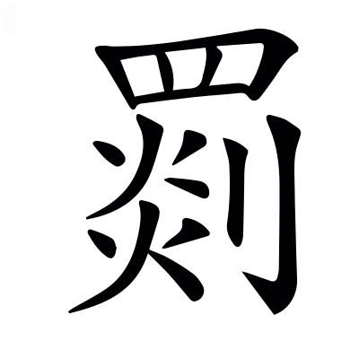

# 文選卷第五十

> 梁昭明太子撰
> 
> 文林郎守太子右內率府錄事參軍事崇賢館直學士臣李善注上

史論下

## 後漢書二十八將傳論

> 范蔚宗

論曰：中興二十八將，前世以為上應二十八宿，未之詳也。中興，謂漢有王莽篡位，後光武復興，為中興也。天有二十八宿，將以輔君洽化者也。

然咸能感會風雲，奮其智勇，周易曰：雲從龍，風從虎。史記：太史公曰「相如其處智勇，可謂兼之。」

稱為佐命，亦各志能之士也。李陵書曰：其餘佐命立功之士。

議者多非光武不以功臣任職，至使英姿茂績，委而勿用。謝承後漢書序曰：申徒蟠英姿磊落。潘岳楊肈誄曰：茂績惟嘉。

然原夫深圖遠筭，固將有以~~為~~焉爾[^50.1.1]。若乃王道既衰，降及霸德，猶能授受惟庸，勳賢~~兼~~皆序[^50.1.2]，如管隰之迭升桓世，先趙之同列文朝，可謂兼通矣。左氏傳：寺人披曰「齊桓公置射鉤而使管仲相。」又曰：齊桓，衛姬之子，有寵於僖公，有鮑叔牙隰朋以為輔佐。又曰：晉蒐于被盧，命趙衰為卿，讓於先軫。*杜預曰：先軫，晉下軍之佐原軫也。*

降自秦漢，世資戰力，至於翼扶王室，皆武人屈起。亦有鬻繒盜狗輕猾之徒，漢書曰：灌嬰，睢陽販繒者也。高祖為沛公，以中涓從，後剖符食潁陰，至丞相。又曰：樊噲，沛人也，以屠狗為事。高祖為沛公，以舍人從，後封舞陽侯。

或崇以連城之賞，或任以阿衡之地，班固漢書贊曰：藩國大者，跨州兼郡，連城數十。毛詩曰：實惟阿衡，左右商王。*毛萇曰：阿衡，伊尹也。*

故勢疑則隙生，力侔則亂起。蕭樊且猶縲紲，信越終見葅戮，不其然乎！李陵書曰：昔蕭樊囚執，韓彭葅醢。

自茲以降，訖于孝武，宰輔五世，莫非公侯。遂使縉紳道塞，賢能蔽壅，司馬相如封禪書曰：因雜縉紳先生之略術。*臣瓚曰：縉，赤白色[^50.1.3]；紳，大帶也。*

朝有世及之私，下多抱關之怨。禮記曰：大人世及以為禮。漢書曰：蕭望之，署小苑東門候，王仲翁謂望之曰「不肯錄錄，反抱關為？」

其懷道無聞，委身草莽者，亦何可勝言。論語：陽貨謂孔子曰「懷其寶而迷其邦。」淮南子曰：今至人生於亂世，含德懷道而死者衆，天下莫知，貴其不言也。

故光武鑒前事之違，存矯枉之志，班固漢書贊曰：漢興，懲強秦之敗，大啟九國，可謂矯枉過其正也。

雖寇鄧之高勳，耿賈之鴻烈，分土不過大縣數四，所加特進朝請而已。范曄後漢書曰：寇恂，字子翼，封雍奴侯。邑萬戶，為執金吾。鄧禹，字仲華，為大司徒，封高密侯，食邑四縣。耿弇，字伯昭，封好畤侯，食二縣，以列侯奉朝請。賈復，字君文，封膠東侯，食六縣，以列侯加位特進。蔡邕獨斷曰：諸侯功德優盛，朝廷所異者，賜位特進，位在三公下。孟康漢書注曰：律，春曰朝，秋曰請。

觀其治平臨政，課職責咎，將所謂導之以法，齊之以刑者乎！論語：子曰「導之以政，齊之以刑，民免而無恥。」

若格之功臣，其傷已甚。何者？直繩則虧喪恩舊，撓情則違廢禁典，范曄後漢書：第五倫上疏曰「臣愚以為貴戚可封侯以富之，不當職事以任之。何者？繩以法則傷恩，私以親則違憲。」

選德則功不必厚，舉勞則人或未賢，參任則群心難塞，並列則其弊未遠。言選德棄功，參差雜用，即怨望必多，故云難塞。若論功棄德，並列於朝，即葅戮相仍，故云未遠。

不得不校其勝否，即以事相權[^50.1.4]。言尊功而不尊德，此功權於德；任德而不任功，此德權於功。漢書曰：量資弊，權輕重，於是有母權子而行，有子權母而行。*韋昭曰：重為母，輕為子。~~衡~~權，平也[^50.1.5]。*

故高秩厚禮，允答元功，峻文深憲，責成吏職。漢書曰：翟方進為相，峻文深，中傷者尤多。

建武之世，建武，光武年號。

侯者百數，若夫數公者，則與參國議，分均休咎，其餘並優以寬科，完其封祿，莫不終以功名，延慶于後。范曄後漢書：郎顗上疏曰「攘災延慶，號令天下。」

昔留侯以為高祖悉用蕭曹故人，郭伋亦議南陽多顯，鄭興又戒功臣專任。漢書曰：上望見諸將往往數人偶語，上曰「此何語？」張良曰「此謀反耳。陛下起布衣，與此屬取天下，已為天子，而所封皆蕭曹故人，所誅者皆平生仇怨，故相聚謀反耳。」范曄後漢書曰：光武以郭伋為并州牧，過京師謝恩，帝即引見。伋因言「選補衆職，當簡天下賢俊，不宜專用南陽人。」帝納之。又曰：鄭興，字少贛，河南人。徵為太中大夫，上疏曰「道路流言，咸曰朝廷欲用功臣，功臣用，則人位謬矣。」

夫崇恩偏授，易啟私溺之失，至公均被，必廣招賢之路，意者不其然乎！班固漢書引曰：崇恩德以撫海內。仲長子昌言曰：人主臨之以至公。

永平中，顯宗追感前世功臣，顯宗，明帝。

乃圖畫二十八將於南宮雲臺，其外又有王常李通竇融卓茂，范曄後漢書曰：王常，字顏卿，潁川人，封山桑侯，拜為橫野大將軍，位次與諸將絕席。又曰：李通，字次元，南陽人，封固始侯，拜大司空。又曰：竇融，字周公，扶風人，封安豐侯，為衛尉。又曰：卓茂，字子康，南陽人，為密令。世祖即位，以茂為太傅。

合三十二人。故依本第，係之篇末，以志功次云爾。

---

[^50.1.1]: 考異：固將有以為爾：茶陵本「為」作「焉」。袁本作「為」，與此同。案：今范書作「焉」，何校改「焉」。

[^50.1.2]: 考異：勳賢兼序：茶陵本「兼」作「皆」。袁本作「兼」，與此同。案：今范書作「皆」，疑善「皆」、五臣「兼」，二本失著校語，而此以五臣亂善也。下文可謂兼通矣。善同范書有「兼」，五臣無「兼」，殆改此為「兼」，而刪之以相避歟？

[^50.1.3]: 考異：注「縉赤色」：案「赤」下當有「白」字。各本及章懷注皆脫。酒德頌注引有者是也。

[^50.1.4]: 考異：即事相權：茶陵本「即」下有「以」字，袁本無。案：今范書有，二本不著校語，無以考之。

[^50.1.5]: 考異：注「衡平也」：案「衡」上當有「權」字。各本皆脫。此韋漢志注以解「權輕重」之「權」，言衡平者，謂衡用權而平也。其注周語云「權，稱也」，義亦同。又韋齊語注云「權，平也」，或此「衡」為「權」字之誤。

## 宦者傳論

宦者，養也，養閹人使其看宮人。此是小臣，後漢用之尊重，故集為傳論。

> 范蔚宗

易曰「天垂象，聖人則之。」宦者四星，在皇位之側，仲長子昌言曰：天文，宦者四星，在帝座傍，而周禮有其官職。

故周禮置官，亦備其數。閽者守中門之禁，周禮曰：閽人掌守王宮中~~之~~門之禁[^50.2.1]。*鄭玄曰：中門，於外，內為中。*

寺`侍`人掌女宮之戒。周禮曰：寺人掌王之內人及女宮之戒令。

又云「王之正內者五人[^50.2.2]。」周禮曰：寺人，王之正內五人。*鄭玄曰：正內，路寢也。*

月令「仲冬，閹尹審門閭，謹房室。」禮記文也。*鄭玄曰：閹尹，主領閹竪之官也。於周則為內宰，掌治王之內政、宮令、誡出入及關閉之屬也。重閉外內門。*

詩之小雅，亦有巷伯剌讒之篇。毛詩小雅曰：巷伯，刺幽王也。寺人傷於讒，而作是詩也。*毛萇曰：巷伯，內小臣也。*

然宦人之在王朝者，其來舊矣。將以其體非全氣，情志專良，通關中人，易以役養乎？老子曰：未知牝牡之合而全作。*王弼曰：作，長也。無物以損其身，故全長也。*漢書曰：元帝以石顯久典事，中人無外黨，精專可信任，遂委以政。應劭漢官儀曰：掖庭，後宮所處。中宮，謂諸中人。

然而後世因之，才任稍廣。其能者，則勃貂管蘇有功於楚晉，左氏傳曰：呂郤畏偪，焚公宮而殺晉侯。寺人披請見，公見之，以難告。又曰：晉侯問原守於寺人勃鞮，對曰「昔趙衰以壺餐從，徑，餧而弗食。」故使處原。*杜預曰：勃鞮，披也。*史記以勃鞮為履貂~~上~~[^50.2.3]。新序曰：楚恭王有疾，告諸大夫曰「管蘇犯我以義，違我以禮，與處不安，不見不思，然而有德焉，吾死之後，爵之於朝。申侯順吾所欲，行吾所樂，與處則安，不見則思，然未嘗有得焉，必速遣之。」

景監繆賢著庸於秦趙。史記曰：商鞅入秦，因孝公寵臣景監以求見。又曰：藺相如為趙宦者令繆賢舍人，趙求人使報秦者，未得，宦者令繆賢曰「臣舍人藺相如可使。」

及其弊也，豎刁亂齊，伊戾禍宋。左氏傳曰：齊桓公卒，易牙入，與寺人貂因內寵以殺群吏，而立公子無虧，孝公奔宋。*杜預曰：寺人，內閹官豎~~刁~~貂也[^50.2.4]。史記~~曰~~以豎貂為豎刁[^50.2.5]；並音凋。*左氏傳曰：楚客聘於晉，過宋，太子知之，請野享之，公使往。伊戾請從。至則為坎用牲，加書徵之，而騁告平公曰「太子將為亂，既與楚客盟矣。」公使視之，則信有焉。太子死，公徐聞其無罪[^50.2.6]，乃烹伊戾。

漢興，仍襲秦制，置中常侍官。然亦引用士人，以參其選，皆銀璫左貂，給事殿省。范曄後漢書：朱穆曰「案漢故事，中常侍或用士人。建武以後，乃悉用宦者，假貂璫之飾，任常伯之職。」

及高后稱制，乃以張卿為大謁者，出入臥內，受宣詔令。漢書·高后紀曰：太后臨朝稱制。*蔡邕曰：天子命令之別，二曰制書，然制非皇后所行，故曰稱也。*漢書·劉澤傳：田生求事呂氏所幸大謁者張釋卿。*如淳曰：奄人也。*呂后紀云張釋，劉澤傳又曰張卿，然則張釋字子卿。今漢書或為釋卿，誤也。仲長子昌言曰：宦豎傅近房臥之內，交錯婦人之間。

文帝時，有趙談北宮伯子，頗見親幸。漢書曰：孝文時宦者，則趙談、北宮伯子。

至於孝武，亦愛李延年。漢書曰：孝武時，宦者李延年。

帝數宴後庭，或潛遊離館，故請奏機事，多以宦人主之。漢書曰：蕭望之以武帝遊燕後庭，故用宦者，非國舊制。仲長子昌言曰：至於武皇遊燕後庭，置中書之官，領受軍事。漢官解故曰：機事所總，號令攸發。*胡廣曰：機密之事。*

元帝之世，史游為黃門令，勤心納忠，有所補益。漢書曰：急就一篇，元帝黃門令史游作。董巴輿服志曰：禁門曰黃闥，中人主之。

其後弘恭石顯以佞險自進，卒有蕭周之禍，損穢帝德焉。漢書曰：前將軍蕭望之及光祿大夫周堪建議，以為宜罷中書宦官，應古不近刑人，由是大與石顯忤，後皆害焉。望之自殺，堪廢錮，不得復進用。

中興之初，宦官悉用閹人，不復雜調他士。如淳漢書注曰：調，選也。

至永平中，始置員數，中常侍四人，小黃門十人。和帝即祚幼弱，而竇憲兄弟專總權威，范曄後漢書曰：孝和皇帝諱肈，肅宗子也，年十歲。竇太后詔曰「竇憲，朕之元兄，當以舊典輔斯職焉。」

內外臣僚，莫由親接，所與居者，惟閹~~官~~宦而已[^50.2.7]。故鄭衆得專謀禁中，終除大憝`徒對反`，史記曰：景帝居禁中。如淳漢書注曰：省中，本為禁中。蔡邕曰：禁中者，門戶有禁，非侍御不得入，故曰禁中。尙書曰：元惡大憝。

遂享分土之封，超登宮卿之位。於是中官始盛焉。范曄後漢書曰：鄭衆，字季產，南陽人。和帝初，竇憲圖作不軌，衆遂首謀誅之，以功遷大長秋。封鄛鄉侯。

自明帝以後，迄乎延平，范曄後漢書曰：~~安~~殤帝年號延平[^50.2.8]。

委用漸大，而其資稍增，中常侍至有十人，小黃門~~亦~~二十人[^50.2.9]，改以金璫右貂，兼領卿署之職。鄧后以女主臨政，而萬機殷遠，和熹鄧后，已見皇后紀論。

朝臣~~圖~~國議[^50.2.10]，無由參斷帷幄，稱制下令，不出房闈之間，不得不委用刑人，寄之國命。范曄後漢書：朱穆曰「自和熹太后以女主稱制，不接公卿，乃以閹人為常侍小黃門通命兩宮。」

手握王爵，口含天憲，范曄後漢書：諫議大夫劉陶上疏訟朱穆曰「今權宦傾擅朝室，手握王爵，口含天憲，非所以崇尊顯之高業，守和平之隆祚。」

非復掖庭永巷之職，閨牖房闈之任也。漢書曰：掖庭八丞。又曰：永巷官皆取其領事之號，或曰永巷，則曰永巷僕射，

其後孫程定立順之功，曹騰參建桓之策，范曄後漢書曰：孫程，字稚卿，涿郡人。安帝時為中黃門。時江京等廢皇太子為濟陰王，明年帝崩，立北鄉侯為天子。十月，北鄉侯疾篤。程謂濟陰王謁者長興渠曰「王以嫡統，遂至廢黜。若北鄉不起，共斬江京，事乃可成。」渠然之。北鄉薨，程與十八人謀於西鍾下，皆截衣為誓，斬江京，迎濟陰王立之，是為順帝，封程浮陽侯。又曰：順帝諱保，安帝之子。又曰：曹騰遷中常侍，桓帝立，騰以定策封費亭侯，大長秋。

續以五侯合謀，梁冀受鉞，范曄後漢書曰：單超，河南人；徐璜，下邳人；具瑗，魏郡人；左悺，河南人；唐衡，潁川人。桓帝呼超悺入室，謂曰「梁將軍兄弟專國，今欲誅之，於常侍意如何？」超等對曰「誠國姦賊，當誅日久。」五人遂定其議。帝囓超臂出血為盟，於是詔收冀，悉誅之。超封新豐侯；璜，武原侯；瑗，東武侯，悺，上蔡侯，衡，汝陽侯。五人同日封，故俗謂之五侯。

跡因公正，恩固主心，故中外服從，上下屏氣。屏氣，言恐懼也。論語曰：屏氣似不息者。范曄後漢書曰：陽球既誅王甫，權門聞之，莫不屏氣。

或稱伊霍之勳，無謝於往載；或謂良平之畫，復興於當今。伊尹、霍光；張良、陳平。

雖時有忠公，而競見排斥。舉動迴山海，呼吸變霜露。阿旨曲求。則寵光三族；直情忤意，則參夷五宗。漢之綱紀大亂矣。陳琳檄曰：所愛光五宗，所惡滅三族。

若夫高冠長劍，紆朱懷金者，布滿宮闥；枚乘兔園賦曰：高冠扁焉，長劍閈焉。法言曰：或問使我紆朱懷金，其樂不可量也。李軌曰：朱，紱也。

苴`子余`茅分虎，南面臣民者，蓋以十數。尙書緯曰：天子社，東方青，南方赤，西方白，北方黑，上冒以黃土，封諸侯各取方土。苴以白茅以為社。漢舊儀曰：郡~~分~~國銅虎符三[^50.2.11]。

府署第館，~~基~~棋列於都鄙[^50.2.12]；子弟支附，過半於州國。南金、和寶、冰紈、霧縠之積，盈~~牣~~仞`刃`珍藏[^50.2.13]；毛詩曰：元龜象齒，大賂南金。韓子曰：楚人和氏得玉璞於楚山之中，奉而獻之王，使玉人理其璞而得寶焉。漢書曰：齊地織作冰紈。*臣瓚曰：紈之細密，如堅冰也。*子虛賦：雜纖羅，垂霧縠。

嬙媛、侍兒、歌童、舞女之玩，充備綺室。左氏傳：子西曰「今聞夫差宿有妃嬙嬪御焉。」*杜預曰：妃嬙，貴者也。*嬙音墻。漢書曰：初，袁盎為吳相時，從史盜私盎侍兒。*文穎曰：婢也。*仲長子昌言曰：為音樂則歌兒舞女，千曹而迭起。左氏傳：晏子謂齊侯曰「高臺深池，撞鍾舞女。」

狗馬飾彫文，土木被緹繡。漢書：東方朔曰「土木衣綺繡，狗馬被繢。」佞倖傳曰：董賢起大第闕下，土木之功，窮極伎巧，柱檻衣以綈錦。

皆剝割萌黎，競恣奢欲。搆害明賢，專樹黨類。其有更相援引，希附權彊者，皆腐身薰子，以自衒達。班固漢書~~曰~~[^50.2.14]司馬遷述曰「嗚呼史遷，薰~~骨~~胥以~~行~~刑[^50.2.15]！」*韋昭曰：古者腐刑必薰合之。*

同弊相濟，故其徒有繁，潘元茂九錫文曰：同惡相濟。尙書曰：簡賢附勢，實繁有徒。

敗國蠹政之事，不可殫書。所以海內嗟毒，志士窮棲，韋昭國語注曰：山居曰棲。

寇劇緣間，搖亂區夏。劉騊駼與李子~~豎~~堅書曰[^50.2.16]：下車負乘，劇賊未禽。韓詩曰：讒言緣間而起。

雖忠良懷憤，時或奮發，而言出禍從，旋見孥戮。尙書曰：予則孥戮汝。

因復大考鉤黨，轉相誣染。東觀漢記曰：靈帝時，故太僕杜密、故長樂少府李膺各為鉤黨。尙書~~曰~~白，下本州考治[^50.2.17]。時上年十三，問諸常侍曰「何鉤黨？」諸常侍對曰「鉤黨人即黨人也。」即可其奏。

凡稱善士。莫不罹被災毒。桓子新論曰：居家循理，鄉里和順，出入恭敬，言語謹遜，謂之善士。

竇武何進，位崇戚近，乘九服之囂怨，協群英之勢力，周書曰：乃辨九服之國。謝承後漢書曰：黃向對策，以為群英之表。

而以疑留不斷，至於殄敗。斯亦運之極乎！范曄後漢書曰：竇武，字游平，扶風人也。女立為皇后，武為大將軍，謀誅中官。曹節等矯詔將兵誅武。又曰：何進，字遂高，南陽人也。女弟立為皇后，為大將軍。靈帝崩，袁紹說進令誅中官，謀泄。張~~驤~~讓趙忠等[^50.2.18]因進入省，共殺進。應劭風俗通曰：秦因愚弱之極運。

雖袁紹龔行，芟夷無餘，范曄後漢書曰：袁紹勒兵斬趙忠，捕宦官，無少長悉斬之。張讓投河而死。尙書曰：今予惟~~恭~~龔行天之罰[^50.2.19]。左氏傳：君子曰「周任有言，為國家者，見惡如農夫之務去草焉。芟夷蘊崇之，絕其本根，勿使能殖。」

然以暴易亂，亦何云及！史記：伯夷歌曰「登彼西山兮，言采其薇。以暴易亂兮，不知其非。」

自曹騰說梁冀，竟立昏弱。曹騰、梁冀，已見上文。昏弱，謂桓帝也。

魏武因之，遂遷龜鼎。魏武，曹操也。龜鼎，國之守器，以喻帝位也。尙書曰：寧王遺我大寶龜，紹天明即命。左氏傳：王孫滿曰「桀有昏德，鼎遷於商。商紂暴虐，鼎遷於周。」

所謂「君以此始，必以此終」，信乎其然矣！左氏傳曰：晉荀林父及楚子戰於邲，楚子見左廣，將從之乘。屈蕩~~尸~~戶之曰[^50.2.20]「君以此始，必以此終。」

---

[^50.2.1]: 考異：注「掌守王宮中之門禁」：茶陵本「之門」作「門之」，章懷注同，是也。袁本亦誤倒。

[^50.2.2]: 考異：王之正內者五人：何校去「者」字。陳云「者」字衍。案：皆據周禮序官校也。今范書亦有，恐此是蔚宗自為文，不全同所引也。

[^50.2.3]: 考異：注「史記以勃鞮為履貂上」：何校「貂上」二字改「鞮」字：陳同。案：所校非也，此當衍「上」字。答任少卿書引史記「履貂曰」可證。又何改正文「貂」為「鞮」，更非。范書亦作「貂」。章懷注「勃貂即寺人披也，一名勃鞮，字伯楚。」是蔚宗自作「貂」。

[^50.2.4]: 考異：注「寺人內閹官豎刁也」：案「刁」當作「貂」。各本皆誤。此所引「僖二年齊寺人貂」之注也。

[^50.2.5]: 考異：注「史記曰豎貂為豎刁」：案「曰」當作「以」，各本皆誤。

[^50.2.6]: 考異：注「公徐聞其罪」：陳云「其」下脫「無」字，是也。各本皆脫。

[^50.2.7]: 考異：惟閹官而已：茶陵本「官」作「宦」。袁本作「官」，與此同。案：今范書作「宦」，似「宦」字是也。

[^50.2.8]: 考異：注「安帝年號延平」：何校「安」改「殤」，是也。各本皆誤。

[^50.2.9]: 考異：小黃門亦二十人：茶陵本無「亦」字，云五臣有。袁本有，用五臣也。案：今范書無，此以五臣亂善。袁不著校語，亦非。

[^50.2.10]: 考異：朝臣圖議：茶陵本「圖」作國。袁本作「圖」，與此同。案：今范書作「國」，疑善「國」、五臣「圖」，二本失著校語，而此以五臣亂善也。

[^50.2.11]: 考異：注「郡分銅虎符三」：袁本、茶陵本「分」作「國」，是也。

[^50.2.12]: 考異：基列於都鄙：袁本云善作「基」。茶陵本云五臣作「棋」。今范書作「棋」，章懷有注。何校依之改。陳云作「棋」為是。案：此各本所見傳寫誤，善亦不作「基」也。

[^50.2.13]: 考異：盈牣珍藏：茶陵本「牣」作「仞」，云五臣作「牣」。袁本作「牣」，用五臣也。案：今范書作「仞」，此以五臣亂善。袁不著校語，亦非。

[^50.2.14]: 考異：注「班固漢書曰」：陳云「曰」字衍，是也。各本皆衍。

[^50.2.15]: 考異：注「薰骨以行刑」：何校「骨」改「胥」，陳同。又云「行」字衍，是也。各本皆誤。

[^50.2.16]: 考異：注「與李子豎書曰」：茶陵本「豎」作「堅」，是也。袁本亦誤「豎」。

[^50.2.17]: 考異：注「尙書曰下本州考治」：陳云「曰」，「白」誤，是也。各本皆偽。

[^50.2.18]: 考異：注「張驤趙忠等」：何校「驤」改「讓」，陳同。又下節注中袁、茶陵二本亦作「驤」，尤改作「讓」。案：今范書作「讓」。「讓」字是也。

[^50.2.19]: 考異：注「今予恭行天之罰」：案「予」下當有「惟」字，「恭」當作「龔」。各本皆誤。檄蜀文引「予惟龔行天之罰」，亦非，當互訂。又案：後述高紀「恭行天罰」注「恭行已見上文」，依今班書，亦當是「龔」之誤也。

[^50.2.20]: 考異：注「屈蕩尸之曰」：袁本「尸」作「戶」，是也。茶陵本亦誤「尸」。案：開成石經是「戶」字。

## 逸民傳論

何晏論語注曰：逸民，言節行超逸。

> 范蔚宗

易稱「遯之時義大矣哉」。易曰：艮下乾上，遯。彖曰：遯之時義大矣哉。孔子曰：遯，逃也。謂去代不求利，是其大也。

又曰「不事王侯，高尚其事。」周易蠱卦上九爻辭。

是以堯稱則天，而不屈潁陽之高；論語：子曰「唯天為大，唯堯則之。」呂氏春秋曰：昔堯朝許由於沛澤之中，請屬天下於夫子。許由遂之潁水之陽。

武盡美矣，終全孤竹之絜。論語曰：子謂武盡美矣。未盡善也。史記：伯夷叔齊、孤竹君之子也。武王已平殷亂，天下宗周，而伯夷叔齊恥之，義不食周粟，隱於首陽山。

自茲以降，風流彌繁，琴賦曰：體制風流，莫不相襲。

長往之軌未殊，而感致之數匪一。西征賦曰：悟山潛之逸士，卓長往而不返。

或隱居以求其志，或迴避以全其道，論語：孔子曰「隱居以求其志，行義以達其道。」又曰：賢者避世，其次避地。

或靜己以鎮其躁，或去危以圖其安，言或靜默隱居，以鎮心之躁競；或去彼危難，以謀己之安全也。

或垢俗以動其概，或疵物以激其清。言或垢穢時俗以動其概，或疵點萬物以發其清。概猶操也。

然觀其甘心畎畝之中，憔悴江海之上，莊子曰：舜以天下讓其友北人無擇。北人無擇曰「異哉，后之為人也，居於畎畝之中，而遊堯~~舜~~之門[^50.3.1]，不若是而已。」又曰：就藪澤，處閑曠，此江海之士，避世之人~~也~~[^50.3.2]，閑暇者之所好也。

豈必親魚鳥樂林草哉，亦云介性所至而已。世說：簡文入華林園，顧謂左右曰「覺鳥獸禽魚，自來親人爾。」

故蒙恥之賓，屢黜不去其國；列女傳曰：柳下惠死，妻誄之曰「蒙恥救民，德彌大兮。雖過三黜，終不獘兮。」

蹈海之節，千乘莫移其情。史記曰：魯仲連謂新垣衍曰「秦即為帝，則連蹈東海死耳。」又曰：魯連下聊城，田單歸而欲爵之，魯連逃隱於海上。

適使矯易去就，則不能相為矣。論語曰：長沮桀溺耦而耕，孔子過之，使子路問津焉。桀溺曰「與從避人之士，豈若從避世之士哉。」子路行以告。夫子曰「天下有道，丘不與易也。」漢書：賈誼上書曰「胡越之人雖死不相為者，教習然也。」

彼雖硜硜有類沽名者，論語曰：子擊磬於衛，有荷蕢而過孔氏之門者，曰「有心哉！擊磬乎？」既而曰「鄙哉！硜硜乎，莫己知也已。」又，子貢曰「有美玉於斯，韞櫝而藏諸？求善價而沽諸？」孔子曰「沽之哉！沽之哉！我待價者也。」

然而蟬蛻`稅`囂埃之中，自致寰區之外，淮南子曰：蟬飲而不食，三十日而蛻。

異夫飾智巧以逐浮利者乎！淮南子曰：古之人同氣于天地，與一世而優遊。及偽之生，飾智以驚愚，設詐以巧上。

荀卿有言曰「志意修則驕富貴，道義重則輕王公」也。荀卿子曰：志意修則驕富貴矣，道義重則輕王公矣，內省則外物輕矣。

漢室中微，王莽篡位，士之蘊藉`慈夜`義憤甚矣。東觀漢記曰：桓榮溫恭有蘊藉，明經義。*文穎曰：謂寬博有餘也。*

是時裂冠毀冕，相攜持而去之者，蓋不可勝數。范曄後漢書曰：胡剛清高有志節，值王莽居攝，解其衣冠，縣府門而去，遂亡命交趾，隱於屠肆之間。左氏傳：王使詹桓伯辭於晉侯曰「伯父若裂冠毀冕，拔本塞源。」毛詩序曰：百姓莫不相攜持而去焉。

揚雄曰「鴻飛冥冥，弋~~人~~者何篡焉[^50.3.3]。」言其違患之遠也。法言曰：鴻飛冥冥，弋~~人~~者何篡焉。*宋衷曰：篡，取也。鴻高飛，冥冥薄天，雖有弋人執矰繳，何所施巧而取焉。喻賢者深居，亦不罹暴亂之害。*今篡或為慕，誤也。

光武側席幽人，求之若不及，國語：越王夫人去笄側席而坐。*韋昭曰：側猶特也。禮，憂者側席而坐。*班固漢書公孫弘贊曰：上方欲用文武，求之如不及。

旌帛蒲車之所徵賁`彼義`，相望於巖中矣。言招士或旌以帛也。漢書曰：武帝以枚乘年老，乃以安車蒲輪徵乘。周易曰：賁于丘園，東帛箋箋。

若薛方逄`步江`萌聘而不肯至，漢書曰：薛方，字子容，王莽以安車迎方，方因使者辭謝曰「堯舜在上，下有巢許。今明主方隆唐虞之德，亦猶小臣欲守箕山之節也。」使者以聞。莽說其言，不強致也。世祖即位，徵方。於道病卒。范曄後漢書曰：逄萌，字子康，北海人也。王莽殺其子宇，萌將家屬入海，客於遼東。光武即位，徵萌，託以老耄，迷路東西，語使者曰「朝廷所以徵我者，以其有益於政，尚不知方面所在，安能濟時乎？」即便駕歸。連徵不起，以壽終。

嚴光周黨王霸至而不能屈。范曄後漢書曰：嚴光，一名遵，會稽人。與光武同遊學。及光武即位，聘之，三反而後至。舍於北軍，車駕即日幸其館。光臥不起，帝即其臥所，撫光腹曰「咄咄子陵，不可相助為政邪？」又眠不應，良久，乃張目熟視曰「昔唐堯著德，巢父洗耳。士故有志，何至相迫乎！」又曰：周黨，字伯況，太原人。建武中，徵為議郎，以病去職，遂將妻子居于澠池。後復徵，不得已，乃著短布單衣，~~縠~~榖皮綃頭~~巾~~[^50.3.4]，待見尙書。及光武引見，黨伏而不謁，自陳願守所志，帝乃許焉。又曰：王霸，字仲儒，太原人。建武中，徵到尙書，拜，稱名不稱臣。有司問其故，霸曰「天子有所不臣，諸侯有所不友。」以病歸。隱居守志。

群方咸遂，志士懷仁，郭象莊子注曰：一方得而群方失。論語：子曰「志士仁人，無求生以害仁。」禮記曰：君子有禮，故物無不懷仁。

斯固所謂舉逸人則天下歸心者乎？論語：子曰「舉逸人，天下之人歸心焉。」

肅宗亦禮鄭均而徵高鳳。以成其節。范曄後漢書曰：肅宗孝章皇帝諱炟，顯宗第五子。又曰：鄭均，字仲虞，東平任城人。建初六年，公車特徵，再遷尙書，數納忠言，肅宗敬重之，以疾乞骸骨。又曰：高鳳，字文通，南陽人。建初中，將作大匠任隗舉鳳直言。到公車，託病逃歸，隱身漁釣，終於家。

自後帝德稍衰，邪孽當朝，處子耿介，羞與卿相等列[^50.3.5]，束廣微補亡詩曰：堂堂處子。楚辭曰：獨耿介而不隨~~俗~~[^50.3.6]。

至乃抗憤而不顧，多失其中行焉。論語：子曰「不得中行而與之，必也狂狷乎！」

蓋錄其絕塵不及，同夫作者，列之此篇。莊子：顏回問於仲尼曰「夫子步亦步，夫子趨亦趨，夫子馳亦馳，奔逸絕塵，而瞠乎若後耳。」*司馬彪曰：言不可及也。*論語：子曰「作者七人。」*包咸曰：七人，謂長沮、桀溺、丈人、石門、荷蕢、儀封人、楚狂接輿。*

---

[^50.3.1]: 考異：注「而遊堯舜之門」：案「舜」字不當有。各本皆衍。章懷注無。

[^50.3.2]: 考異：注「避世之人也」：案「也」字不當有。各本皆衍。章懷注無。

[^50.3.3]: 考異：弋人何篡焉：袁本、茶陵本「人」作「者」。案：今范書亦作「者」，「者」字是也。尤蓋依所見法言改耳。此注引法言，袁、茶陵仍作「者」，其宋衷注乃云「弋人」，「弋人」不出正文，蔚宗及善與尤所見自不同，改之非是。

[^50.3.4]: 考異：注「縠皮綃頭巾」：案「縠」當作「榖」，巾字不當有。各本皆誤。章懷注「以榖樹皮為綃頭」也。

[^50.3.5]: 考異：與卿相等列：袁本「與」上有「羞」字，云善無。茶陵本云五臣有。案：今范書有。依文義，似各本所見皆傳寫誤脫之也。

[^50.3.6]: 考異：注「獨耿介而不隨俗」：案「俗」字不當有。各本皆衍。此所引九辨文也。元文「隨」下有「兮」，善引在句末者多節去。

## 宋書謝靈運傳論

沈休文修宋書百卷，見靈運是文士，遂于傳下作此書，說文之利害，辭之是非。

> 沈休文

史臣曰：民稟天地之靈，含五常之德，剛柔迭用，喜慍分情。漢書曰：夫人肖天地之貌，懷五常之性，聰明精粹[^50.4.1]，有生之最靈者也。*應劭曰：肖，類也。頭圓象天，足方象地[^50.4.2]。*又曰：凡民函五常之性，而剛柔不同。史記曰：況懷五常，含好惡。鄭玄禮記注曰：五常，五行也。孔安國尙書傳曰：五行之德，王者相承以取法。禮記曰：何謂七情？喜怒哀懼愛惡欲。

夫志動於中，則歌詠外發，毛詩序曰：情動於中，而形於言，嗟嘆之不足，故永歌之。又曰：情發於聲，聲成文，謂之音。

六義所因，四始攸繫，升降謳謠，紛披風什。毛詩序曰：詩有六義焉：一曰風，二曰賦，三曰比，四曰興，五曰雅，六曰頌。又曰：是謂四始，詩之至也。毛詩題曰鹿鳴之什，說者云，詩每十篇同卷，故曰什也。

雖虞夏以前，遺文不睹，虞書有帝庸作歌，夏書有五子之歌，已前不見歌文。

稟氣懷靈，理或無異。古猛虎行曰：稟氣有豐約，受形有短長。

然則歌詠所興，宜自生民始也。

周室既衰，風流彌著，幽厲之時，多有諷刺，在下祖習，如風之散，如水之流，故曰彌著。

屈平宋玉導清源於前，賈誼相如振芳塵於後，孫卿子曰：君子養源，源清則流清。陸機大暑賦曰：播芳塵之馥馥。

英辭潤金石，高義薄雲天。仲長子昌言曰：英辭雨下。吳越春秋：樂師謂越王曰「君王德可刻之於金石。」淮南子曰：夫道潤乎草木，浸乎金石。法言曰：或問屈原相如之賦孰愈？曰「原也過以浮，如也過以虛。過浮者蹈雲天，過虛者華無根。然原上援稽古，下引鳥獸，其著意，子雲長卿亮不可及。」

自茲以降，情志愈廣。王褒劉向楊班崔蔡之徒，范曄後漢書曰：崔駰年十三，能通百家言，善屬文，與班固傅毅同時齊名。又曰：蔡邕少博學，好辭章。楊，楊子雲。班，班孟堅。

異軌同奔，遞相師祖。禮記曰：仲尼祖述堯舜。

然清辭麗曲，時發乎篇，而蕪音累氣，固亦多矣。賈逵國語注曰：蕪，穢也。累猶負也。

若夫平子豔發，文以情變，絕唱高蹤，久無嗣響。平子，張衡字也。

至于建安，曹氏基命，三祖陳王，咸蓄盛藻，續晉陽秋曰：及至建安，而詩章大盛。尙書曰：王如不敢及天基命定命。建安，獻帝年號。魏志曰：明帝青龍四年，有司奏武皇帝為魏太祖，文皇帝為魏高祖，明皇帝為魏~~列~~烈祖也[^50.4.3]。

甫乃以情緯文[^50.4.4]，以文被質。鄭玄周禮注曰：甫，始也。言始將情意以緯於文。

自漢至魏，四百餘年，辭人才子，文體三變。相如工為形似之言，二班長於情理之說，二班，叔皮孟堅也。

子建仲宣以氣質為體。並摽能擅美，獨映當時。是以一世之士，各相慕習，~~源~~原其飆流所始[^50.4.5]，莫不同祖風騷。續晉陽秋曰：自司馬相如王褒揚雄諸賢代尚詩賦，皆體則風騷，~~詩摠~~傍綜百家之言[^50.4.6]。飆流即風流，已見上文。廣雅曰：祖，法也。

徒以賞好異情，故意製相詭。說文曰：詭，變也。

降及元康，潘陸特秀，元康，晉惠帝年號也。續晉陽秋曰：逮乎西朝之末，潘陸之徒，雖時有文質[^50.4.7]，而宗師不異。

律異班賈，體變曹王，縟旨星稠，繁文綺合。論衡曰：德彌盛者文彌縟。又曰：或能陳得失，奏便宜，應經傳，文如星月，若谷子雲、唐子高者，並為高第。漢書：宣帝曰「辭賦譬如女工，有綺縠也。」

綴平臺之逸響，采南皮之高韻，漢書曰：梁孝王廣治睢陽城為複道，自宮連屬於平臺三十餘里，招延四方豪傑。逸響，謂司馬相如之文。南皮，魏文帝所遊也。高韻，謂應徐之文也。

遺風餘烈，事極江右。史記曰：宣王法文武遺風。春秋元命苞曰：文王積善所潤之餘烈。江右，西晉也。

在晉中興，玄風獨扇，為學窮於柱下，博物止乎七篇。續晉陽秋曰：正始中，王弼何晏好莊~~子~~老玄勝之談[^50.4.8]，而俗遂貴焉。老子為柱下史。莊子內篇其數有七。

馳騁文辭，義殫乎此。自建武暨于義熙，歷載將百，建武，晉愍帝年號。義熙，晉安帝年號。

雖比響聯辭，波屬雲委，答賓戲曰：馳辨如濤波。仲長統昌言曰：妙句雲布。孝經鉤命決曰：雲委霧散，殊錯沈浮。

莫不寄言上德，託意玄珠，孫綽子曰：莊子多寄言，渾沌得宗，罔象得珠。老子德經曰：上德不德，是以有德。莊子曰：黃帝遊乎赤水之北，登乎崑崙之丘，而南還歸，遺其玄珠。*郭象曰：此明得真之所由。*

遒麗之辭，無聞焉爾。孫綽集序曰：綽文藻遒麗。公羊傳曰：紀子伯者何，無聞焉爾。

仲文始革孫許之風，叔源大變太元之氣。仲文，殷仲文也。續晉陽秋曰：許詢有才藻，善屬文，詢及太原孫綽，轉相祖尚，又加以三世之辭，而風騷之體盡矣。詢綽並為一時文宗，自此作者悉化之。至義熙中，謝混始改~~之~~[^50.4.9]。叔源，混字也。太元，晉孝武帝年號[^50.4.10]。

爰逮宋氏，顏謝騰聲，靈運之興會摽舉，延年之體裁明密，興會，情興所會也。鄭玄周禮注曰：興者，託事於物也。體裁，制也。謝承後漢書曰：魏朗為河內太守，明密法令也。

並方軌前秀，垂範後昆。尙書曰：垂裕後昆。

若夫敷衽論心，商搉前藻，楚辭曰：跪敷衽以陳辭。陸機樂府篇曰：商搉為此歌。

工拙之數，如有可言。夫五色相宣，八音協暢，文賦曰：暨音聲之迭代，若五色之相宣。

由乎玄黃律呂，各適物宜。周易曰：象其物宜，是故謂之象。

欲使宮羽相變，低昂舛節，若前有浮聲，則後須切響。一簡之內，音韻盡殊；兩句之中。輕重悉異。妙達此旨，始可言文。至於先士茂製，諷高歷賞，言諷詠之者，咸以為高，歷載辭人，所共傳賞。

子建函京之作，仲宣~~灞~~霸岸之篇[^50.4.11]，曹子建贈丁儀王粲詩曰：從軍度函谷，驅馬過西京。王仲宣七哀詩云：南登霸陵岸，回首望長安。

子荊零雨之章，正長朔風之句，孫子荊陟陽候詩曰：晨風飄岐路，零雨被秋草。王正長雜詩曰：朔風動秋草。邊馬有歸心。

並直舉胸情，非傍詩史，正以音律調韻，取高前式。自靈均以來，多歷年代，~~靈均，屈原字也。~~[^50.4.12]尙書：周公曰「殷禮陟配天，多歷年所。」

雖文體稍精，而此秘未睹。至於高言妙句，音韻天成，皆暗與理合，匪由思至。張蔡曹王，曾無先覺，論語曰：抑亦先覺者是賢乎？

潘陸顏謝，去之彌遠。世之知音者，有以得之，此言非謬。如曰不然，請待來哲。西征賦曰：如其禮樂，以俟來哲。

---

[^50.4.1]: 考異：注「懷五常之性聰明精粹」：袁本、茶陵本無此九字。

[^50.4.2]: 考異：注「應劭曰肖類也頭圓象天足方象地」：袁本、茶陵本無此十四字。

[^50.4.3]: 考異：注「明皇帝為魏列祖也」：茶陵本「列」作「烈」，是也。袁本亦誤。

[^50.4.4]: 考異：甫乃以情緯文：茶陵本無「文」字，云五臣有「物」字。袁本有「物」字，云善無。案：此尤延之所校添也。今宋書是「文」字。

[^50.4.5]: 考異：源其飆流所始：袁本云善作「源」。茶陵本云五臣作「原」。何云疑作「原」。今宋書是「原」字。

[^50.4.6]: 考異：注「詩總百家之言」：陳云「詩總」當作「傍綜」，見世說注，是也。

[^50.4.7]: 考異：注「潘陸之徒有文質」：陳云「有文質」當作「雖時有質文」，是也。各本皆誤。案：亦據世說文學篇注也。

[^50.4.8]: 考異：注「好莊子玄勝之談」：陳云「子」當從世說注作「老」，是也。各本皆誤。

[^50.4.9]: 考異：注「謝混始改之」：案「之」字不當有。世說注無。各本皆衍。

[^50.4.10]: 考異：注「太元晉武帝年號」：何校「武」上添「孝」字，是也。袁本亦脫。茶陵本并入五臣亦脫。

[^50.4.11]: 考異：仲宣灞岸之篇：案「灞」當作「霸」，詳袁本所載濟注，乃善「霸」、五臣「灞」，各本所見以五臣亂善。前七哀詩及此注俱為「霸」字，不誤。又今宋書亦是「霸」字。

[^50.4.12]: 考異：注「靈均屈原字也」：袁本、茶陵本無此六字，所載五臣濟注有之。案：此尤誤取增多也。

## 恩倖傳論

約言當時遇幸會者，即得好官。又以晉宋之間，皆取門戶，不任才能，故作此論。

> 沈休文

夫君子小人，類物之通稱。蹈道則為君子，違之則為小人。莊子曰：天下盡殉也。彼其所殉仁義也，則俗謂之君子；其所殉貨財也，則俗謂之小人。

屠釣，卑事也；板築，賤役也。太公起為周師，傅說去為殷相。尉繚子曰：太公屠牛朝歌。史記曰：太公望呂尚以漁釣奸周西伯。戰國策：范雎謂秦王曰「呂尚之遇文王，立為太師。」尙書曰：高宗夢得說，乃審厥象，俾以形旁求於天下。說築傅巖之野，惟肖，爰立作相。

非論公侯之世，鼎食之資，家語曰：子路南遊於楚，列鼎而食。

明敭幽仄，唯才是與。尙書曰：明明敭仄陋。

逮于二漢，茲道未革，胡廣累世農夫，伯始致位公相；黃憲牛毉之子，叔度名動京師。范曄後漢書曰：胡廣，字伯始，南陽人。六世祖剛，值王莽居攝，亡命交趾，莽敗乃歸鄉里。廣少孤貧，法雄察廣孝廉，試以章奏為天下第一，旬月拜尙書郎。凡一履司空，再作司徒，三登太尉。又曰：黃憲，字叔度，南陽人。世貧賤，父為牛毉。同郡陳蕃臨朝而歎曰「叔度若在，吾不敢先佩印綬。」漢書曰：鄭子真名震乎京師。

且~~士~~任子居朝[^50.5.1]，咸有職業，雖七葉珥貂，見崇西漢，左太沖詠史詩曰：金張藉舊業，七葉珥漢貂。

而侍中身奉奏事，又分掌御服，應劭漢書注曰：入侍天子，故曰侍中。晉令曰：侍中除書表奏皆掌署之。應劭漢官儀曰：侍中出則佩璽抱劍。

東方朔為黃門侍郎，執戟殿下。漢書曰：東方朔初為常侍郎，後奏泰階之事，拜為太中大夫、給事中。嘗醉，小遺殿上，詔免為庶人。復為中郎。百官表：郎中令屬官~~中~~有中郎，比六百石[^50.5.2]；侍郎，比四百石。又黃門有給事黃門。漢官儀云：給事黃門侍郎，位次侍中、給事中，故曰給事黃門。然侍郎、黃門侍郎二官全別，沈以為同，悞也。答客難曰：官不過侍郎，位不過執戟，非黃門侍郎，明矣。

郡縣掾~~吏~~史[^50.5.3]，並出豪家，負戈宿衛，皆由勢族，掾~~吏~~史，卑位。負戈，賤役。豪家世族，咸亦為之。言無貴賤之異也。子虛賦曰：幸得宿衛，十有餘年。

非若晚代分為二塗者也。二塗，謂士庶也。言仕子不居賤職，庶族不涉清階。

漢末喪亂，魏武始基。國語曰：后稷始基靖民。尙書曰：太王肇基王跡。

軍中倉卒，權立九品，蓋以論人才優劣，非謂世族高卑。列子曰：子華之門徒，皆世族也。

因此相沿，遂為成法。自魏至晉，莫之能改，言魏晉二朝，咸遵魏武之法。

州都郡正，以才品人，傅子曰：魏司空陳群始立九品之制，郡置中正，平人才之高下，各為輩目；州置州都，而摠其義。

而舉世人才，升降蓋寡。徒以憑籍世資，用相陵駕，人才不甚懸殊，故因世資以成貴也。

都正俗士，斟酌時宜，品目少多，隨事俯仰，言法壞之漸也。都正既皆俗士，不能校其材藝，乃隨時斟酌，定其品差。

劉毅所云下品無高門，上品無賤族者也。臧榮緒晉書曰：劉毅為尙書左僕射，上疏陳九品之獘，曰「上品無寒門，下品無勢族。」言勢族之人，不居下品；寒門之子，不居上班。

歲月遷訛，斯風漸篤，凡厥衣冠，莫非二品，言衣冠之族，皆居二品之中。

自此以還，遂成卑庶。衣冠以外，皆同下科。

周漢之道，以智役愚，臺隸參差，用成等級。左氏傳曰：人有十等，輿臣隸，隸臣僚，僚臣僕，僕臣臺。

魏晉以來，以貴役賤，士庶之科，較`古學`然有辨。太玄經曰：君子之道，較然見矣。

夫人君南面，九重奧`烏到`絕，楚辭曰：豈不鬱陶而思君兮，君之門以九重。

陪奉朝夕，義隔卿士，堦闥之任，宜有司存。論語：曾子曰「籩豆之事，則有司存。」

既而恩以狎生，信由恩固，爾雅曰：狎，習也。

無可憚之姿，有易親之色。孝建泰始，主威獨運，沈約宋書曰：孝建，武帝年號；泰始，明帝年號。

空置百司，權不外假，而刑政糾雜，理難遍通，耳目所寄，事歸近習。禮記月令曰：仲冬省婦事，無得淫，雖有貴戚近習，無有不禁。*鄭玄曰：貴戚，姑姊妹也。近習，天子所親幸也。*

賞罰之要，是謂國權，出納王命，由其掌握，於是方塗結軌，輻湊同奔。莊子曰：車軌結乎千里之外。文子曰：群臣輻湊。*張湛曰：如衆輻之集於轂。*

人主謂其身卑位薄，以為權不得重。曾不知鼠憑社貴，狐藉虎威，晏子春秋：景公問晏子曰「理國亦有常乎？」對曰「讒佞之人，隱在君側，猶社鼠不熏也，去此乃治矣。」戰國策：荊宣王問群臣曰「吾聞北方之畏昭奚恤也，何如？」群臣莫對。江乙對曰「虎求百獸而食之，得狐。狐曰『子無敢食我。天帝命我長百獸，今子食我，是逆天命。子以我為不信，吾為子先行，子隨我後，觀百獸之畏我。』虎不知百獸之畏己而走也，以為畏狐也。今王之地，方五千里，帶甲百萬，而專屬之於昭奚恤。故北方之畏昭奚恤，其實畏王之甲兵也，猶百獸之畏虎。」

外無逼主之嫌，內有專用之功，勢傾天下，未之或悟[^50.5.4]，挾朋樹黨，政以賄成，左氏傳曰：襄十年，王朝卿士王叔陳生與伯輿爭政，大夫瑕禽曰「今自王叔之相也，政以賄成。」

鈇鉞瘡痏，搆於床笫`側里`之曲，西京賦曰：所惡成瘡痏。左氏傳：趙孟曰「床笫之言不踰閾。」*杜預曰：笫，簀也。*

服冕乘軒，出於言笑之下，左氏傳：衛太子謂渾良夫曰「服冕乘軒，三死無與。」

南金北毳，來悉方艚`徂刀`，素縑丹魄，至皆兼兩`音亮`，北毳，貂之屬。艚，船也，丹魄，虎魄也。色赤，故曰丹。孔安國尙書傳曰：車稱兩。

西京許史，蓋不足云，晉朝王石，未或能比。漢書：孝宣許皇后，元帝母，元帝封外祖父廣漢為平恩侯。又曰：史良娣，宣帝祖母也。兄恭。宣帝立，恭已死，封恭長子高為樂陵侯。王隱晉書曰：王愷，字君夫，世祖舅，自以外戚，晉氏政寬，又性至豪險。又曰：石崇貪而好利，富擬王者。

及太宗晚運，慮經盛衰，沈約宋書曰：明帝廟號太宗。法言曰：聖人之法，未嘗不關盛衰焉。

權倖之徒，慴憚`丁達`宗戚，欲使幼主孤立，永竊國權。六代論曰：君孤立於上，臣弄權於下。

搆造同異，興樹禍隙，帝弟宗王，相繼屠勦。尙書曰：天用勦絕其命。*孔安國曰：勦，截也。截絕，謂滅之也。*

民忘宋德，雖非一塗，寶祚夙傾，實由於此。寶祚猶寶命也。

嗚呼！漢書有恩澤侯表，又有佞倖傳。今采其名，列以為恩倖篇云。

---

[^50.5.1]: 考異：且士子居朝：袁本「士」作「仕」，云善作「士」。茶陵本云五臣作「仕」。何校「士」改「任」。陳云今宋書作「任」，為是。案：所校是也。「士」、「仕」皆傳寫誤。下注云「言仕子不居賤職」，可見善並非作「士」，蓋初誤作「仕」，後又誤作「士」。

[^50.5.2]: 考異：注「中有郎比六百石」：案「中有」當作「有中」。各本皆倒。

[^50.5.3]: 考異：郡縣掾吏：何校「吏」改「史」。陳云今宋書作「史」。案：所校是也。「吏」，傳寫誤。

[^50.5.4]: 考異：未之或悟：袁本云善作「悟」，茶陵本云五臣作「寤」。案：今宋書是「悟」字。但「寤」即「悟」，不知者每改之，未必善與五臣異。王命論「悟戌卒之言」，「英雄誠知覺寤」，一改一未改，最為可證也。

史述贊

## 史述贊三首

> 班孟堅

~~述高紀第一~~

皇矣漢祖，纂堯之緒。漢書曰：劉向頌高祖云：漢帝本系，出自唐帝，降及于周，在秦作劉。爾雅曰：纂，繼也。

寔天生德，聰明神武。項岱曰：聽於無聞曰聰，照臨四方曰明，以內知外曰神，克定禍亂，闢土斥疆曰武。〔善曰〕論語：子曰[^50.6.2]「天生德於予。」周易曰：古之聰明叡智，神武而不殺者夫。

秦人不綱，網漏于楚。項岱曰：秦重歛殘人，天下叛之，故貶言人耳。綱，以喻網，網無綱，無所成，故漏也。〔善曰〕言秦人不能整其綱維，令網目漏也。于楚，謂陳涉反而不能誅，故高祖因而起。

爰茲發跡，斷蛇奮旅。神母告符，朱旗乃舉。漢書曰：高祖夜經澤中，有大蛇當徑，拔劍斬蛇，蛇分為兩，後人來至蛇所，有一嫗夜哭曰「吾子白帝子，化為蛇，今者赤帝子斬之。」又曰：高祖立為沛公，旗幟皆赤。

粵`于厥`蹈秦郊，嬰來稽首。元年冬十月，沛公至霸上，秦王子嬰素軍白馬，降于軹道。

革命創制，三章是紀。周易曰：湯武革命，順乎天而應乎人。漢書曰：高祖謂秦父老曰「與父老約法三章耳。殺人者死，傷人及盜抵罪。」*應劭曰：抵，至也。除秦酷政，但至於罪。*

應天順民，五星同晷。晷，光景也。應劭曰：東井，秦之分野，五星所在，其下以義取天下之象也。

項氏畔換，黜我巴漢，漢書曰：項羽背約，更立沛公為漢王，王巴蜀漢中。*韋昭曰：畔換，跋扈也。*

西土宅心，戰士憤怨。尙書曰：逷矣西土之人。又曰：惟克厥宅心。郭璞三蒼解詁曰：西土，謂長安也。

乘舋而運，席卷三秦。左氏傳：士會謂晉侯曰「會聞用師，觀舋而動。」春秋握誠圖曰：諸侯冰散席卷，各爭恣~~志~~妄[^50.6.3]。漢書曰：韓信陳三秦易并之計。*應劭曰：章邯為雍王，司馬欣為塞王，董翳為翟王，分王秦地，故曰三秦。*

割據河山，保此懷民。保，安也。懷，歸也。言漢據河山之固，民懷歸者能保乂之。漢書：田肯賀上曰「秦帶河阻山，懸隔千里。」尙書曰：黎民懷之。

股肱蕭曹，社稷是經。蕭何曹參也。禮記：衛獻公曰「有柳莊者，非寡人之臣，社稷之臣。」

爪牙信布，腹心良平，韓信英布張良陳平也。毛詩曰：予王之爪牙。又曰：赳赳武夫，公侯腹心。

恭行天罰，赫赫明明。恭行，已見上文。毛詩曰：赫赫明明，王命卿士。

述高紀第一[^50.6.1]

~~述成紀第十~~

孝成皇皇，臨朝有光。項岱曰：皇皇，華色盛也。

威儀之盛，如珪如璋。項岱曰：珪璋，玉之妙好雕鏤者。〔善曰〕毛詩曰：顒顒昂昂，如珪如璋。

閫闈恣趙，朝政在王。閫闈，闥門之內也。門內恣趙昭儀姊妹，以元舅侍中封陽平侯王鳳為大將軍，領尙書事。

炎炎燎火，~~光~~亦允不陽[^50.6.4]。項岱曰：允，信也。內損於飛鷰，外見壅於王鳳等，信不得陽也。張晏曰：天子之威，盛若燎火之陽，今委政王氏，不~~亦~~炎熾~~乎~~矣[^50.6.5]！

述成紀第十

~~述韓英彭盧吳傳第四~~

信惟餓隸，布實黥徒。漢書曰：韓信家貧，從下鄉南昌亭長寄食，亭長苦之，乃晨炊蓐食，食時往，不為具食。信知之，自絕去。又曰：黥布姓英。少時，客相之，當刑而王。及坐法黥，欣然笑曰「人相我當刑而王，幾是乎？」

越亦狗盜，芮尹江湖。漢書曰：彭越嘗漁鉅野澤中，為盜。沛公攻昌邑，越助之。說苑曰：管仲，故城陰之狗盜。漢書曰：吳芮，秦時鄱陽令也。甚得江湖間心，號曰鄱君。*音義曰：尹，正也。*

雲起龍驤，化為侯王。割有齊楚，跨制淮梁。韓信初為齊王，後楚王。黥布為淮南王。彭越為梁王。

綰自同閈`胡旦`，鎮我北疆。應劭曰：閈音扞。南楚汝沛名里門曰閈。綰為燕王，故曰北疆。

德薄位尊，非祚惟殃。周易曰：德薄而位尊，智小而謀大。左氏傳：舟之僑曰「無德而祿，殃也。」

吳克忠信，胤嗣乃長。漢書曰：芮為長沙王，薨，子忠嗣，自芮後傳位五世，無子，國除。

述韓英彭盧吳傳第四

---

[^50.6.1]: 考異：述高紀第一：袁本、茶陵本校語云善本如此，五臣本列在後。案：各本所見皆非也。此連述贊為文，非用為標題，善亦不得在前，蓋傳寫誤移之，而五臣尚未經移耳。後二首同。

[^50.6.2]: 考異：注「論語子曰」：袁本「論」上有「善曰」二字，是也。後「言秦人不能整其綱維」上，「毛詩曰禺禺昂昂」上同。茶陵本在每節首，非。

[^50.6.3]: 考異：注「各爭恣志」：袁本「志」作「忘」。茶陵本亦作「志」，與此同。案：皆非也，當作「妄」。過秦論注引作「妄」。

[^50.6.4]: 考異：光允不陽：袁本「光」作「亦」，云善作「光」。茶陵本云五臣作「亦」。案：今班書作「亦」，「亦」字是也。「光」傳寫誤。

[^50.6.5]: 考異：注「不亦熾乎」：案：當作「不炎熾矣」。各本皆誤，顏注所引可證。

## 後漢書光武紀贊

> 范蔚宗

贊曰：炎政中微，大盜移國。東觀漢記序曰：漢以炎精布曜。中微，謂平世衰也[^50.7.1]。魯靈光殿賦序曰：遭漢中微，盜賊奔突。

九縣飆迴，三精霧塞。三精，日月星也。孝經援神契曰：天地至貴，精不兩明。*宋均曰：天精為日，地精為月。*河圖曰：巛德布精，上為衆星。

民厭淫詐，神思反德。世祖誕命，靈貺自甄。尙書曰：我文考誕膺天命。春秋元命苞曰：通三靈之貺，交錯同端。鄭玄尙書緯注曰：甄，表也。

沈機先物[^50.7.2]，深略緯~~文~~天[^50.7.3]。說文曰：機，主發之機也。周書曰：經緯天地曰文矣。

尋邑百萬，貔虎為群。長轂雷野，高旗彗`蘇沒`雲。漢書曰：劉聖公為天子，以光武為偏將軍，徇昆陽。光武令王常留守，光武出收兵。王莽遣大司徒王尋、大司空王邑將兵百萬，旌旗輜~~車~~重[^50.7.4]千里不絕，又驅諸猛獸虎豹犀象之屬以助威武，圍城數重。光武遂進。尋邑亦遣兵合戰，光武奔之，斬首數千級，光武乃與敢死士三千人衝中堅，尋邑陣亂，遂殺王尋。鬻子曰：紂虎旅百萬。穀梁傳曰：長轂五百乘。*范寗曰：長轂，兵車也。*東都主人曰：戈鋋彗雲。

英威既振，新都自焚。漢書曰：莽封為新都侯。又曰：更始兵到，城中少年~~子~~朱弟~~自~~燒作室門[^50.7.5]，呼曰「反虜王莽，何不出降？」莽避火宣室，火輒隨之。

虔劉庸代。紛紜梁趙。范曄後漢書曰：梁王劉永擅命睢陽。又曰：公孫述稱王，王巴蜀。又曰：卜者王郎為天子，都邯鄲。又曰：彭寵自立為燕王。代，即燕也。

三河未澄，四關重擾。二河，洛陽也。四關，長安也。范曄後漢書曰：赤眉賊入函谷關，敗更始，光武乃遣鄧禹引兵西，乘更始、赤眉之亂。時更始大司馬朱鮪等屯洛陽，光武令馮異守孟津以拒之。

神旌乃顧，遞行天討。金湯失險，車書共道。鹽鐵論曰：秦金城千里。氾勝之書曰：神農之教，雖石城湯池，無粟者不能守也。禮記：子曰「今天下車同軌，書同文。」

靈慶既啟，人謀咸贊。靈慶，謂天符也。易繫辭曰：人謀鬼謀，百姓與能。*王弼曰：人謀，謂衆議。*西都賓曰：天啟之心，人惎之謀。

明明廟謀，赳赳雄斷。廟謀，廟筭也。楊雄連珠曰：兼~~聰~~聽獨斷[^50.7.6]，聖王之法也。

於`烏`赫有命，系我皇漢。毛詩曰：有命自天。蔡邕獨斷曰：光武以再命復漢之祚。

---

[^50.7.1]: 考異：注「中微謂平世衰也」：袁本、茶陵本無此七字

[^50.7.2]: 考異：沈機先物：茶陵本「先」作「生」，云五臣作「先」。袁本云善作「生」。案：今范書作「先」，「先」字是也，善亦不得作「生」，各本所見皆傳寫誤。

[^50.7.3]: 考異：深略緯文：袁本「文」作「天」。茶陵本作「文」，與此同，何云兩漢刊誤補遺云「文選作天」云云。今案：袁本正與所稱同，下無校語，蓋善、五臣皆是「天」字，茶陵及此作「文」者，後來轉依今范書誤改之耳。茶陵亦無校語也。「天」與「甄」協，最是。

[^50.7.4]: 考異：注「旌旗輜車」：陳云「車」，「重」誤，是也。各本皆誤。

[^50.7.5]: 考異：注「城中少年子弟自燒室門」：案「子」當作「朱」，「自燒」當作「燒作」。各本皆誤。

[^50.7.6]: 考異：注「兼聰獨斷」：案「聰」當作「聽」。各本皆誤。

---

文選卷第五十

賜進士出身通奉大夫江南蘇松常鎮太等處承宣布政使司布政使胡克家重校刊
