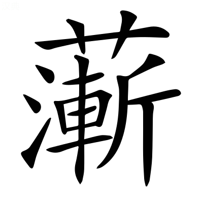

# 文選卷第五十三

> 梁昭明太子撰
> 
> 文林郎守太子右內率府錄事參軍事崇賢館直學士臣李善注上

論三

## 養生論

嵇喜為康傳曰：康性好服食，常采御上藥。以為神仙稟之自然，非積學所致。至於導養得理，以盡性命，若安期彭祖之倫，可以善求而得也。著養生篇。

> 嵇叔夜

世或有謂神仙可以學得，不死可以力致者；王逸楚辭注曰：謂，說也。鄭玄禮記注曰：致之，猶言至也。

或云上壽百二十，古今所同，過此以往，莫非妖妄者。養生經：黃帝問天老曰「人生上壽一百二十年，中壽百年，下壽八十年，而竟不然者，皆夭耳。」

此皆兩失其情，請試粗論之。鄭玄禮記注曰：粗，麤也。說文曰：粗，疏也；徂古切[^53.1.1]。

夫神仙雖不目見，然記籍所載，前史所傳，較`角`而論之，其有必矣。廣雅曰：較，明也。

似特受異氣，稟之自然，非積學所能致也。孔安國尙書傳曰：稟，受也。夫自然者，不知其然而然。老子曰：道法自然。

至於導養得理，以盡性命，上獲千餘歲，下可數百年，可有之耳。天老養生經：老子曰「人生大期，以百二十年為限，節度護之，可至千歲。」

而世皆不精，故莫能得之。何以言之？夫服藥求汗，或有弗獲；而愧情一集，渙然流離。漢書曰：上問右丞相周勃曰「天下一歲決獄幾何？」勃謝不知。問「天下錢穀，一歲出幾何？」勃又謝不知。汗出洽背，媿不能對。*顏師古曰：洽，霑也[^53.1.2]。*周易曰：渙汗其大號。

終朝未餐，則囂然思食；而曾子銜哀，七日不飢。毛詩曰：終朝采綠。終朝，謂從旦至食時。囂然，飢意也。禮記：曾子謂子思曰「伋，吾執親之喪也，水漿不入於口者七日。」

夜分而坐，則低迷思寢；內懷殷憂，則達旦不瞑`古眠字`。韓子曰：衛靈公至濮水之上，夜分而聞有鼓新聲者。韓詩曰：耿耿不寐，如有殷憂。漢書曰：劉向~~曰~~[^53.1.3]夜觀星宿，或不寐達旦。

勁刷理鬢，醇醴發顏，僅乃得之；通俗文曰：所以理髮謂之刷也。何休公羊傳注曰：僅，劣也。

壯士之怒，赫然殊觀，植髮衝冠。淮南子曰：荊軻為燕太子丹刺秦王，高漸離宋如意為擊筑而歌於易水之上，荊軻瞋目裂眥，髮植衝冠。

由此言之，精神之於形骸，猶國之有君也。神躁於中，而形喪於外，猶君昏於上，國亂於下也。夫為稼於湯之世，偏有一溉之功者，雖終歸燋爛，必一溉者後枯。然則一溉之益，固不可誣也。種曰稼，言種穀於湯之世，值七年之旱，終歸是死，而彼一溉之苗，則在後枯。亦猶人處於俗，同皆有死，能攝生者則後終也。孫卿子曰：禹十年水，湯七年旱。說文曰：溉，灌也。

而世常謂一怒不足以侵性，一哀不足以傷身，輕而肆之，淮南子曰：大怒破陰，大喜墜陽。養生要：彭祖曰「憂恚悲哀，傷人；喜樂過差，傷人。」賈逵國語注曰：肆，恣也。

是猶不識一溉之益，而望嘉穀於旱苗者也。國語：子餘謂秦伯曰「使能成嘉穀，君之力也。」

是以君子知形恃神以立，神須形以存，悟生理之易失，知一過之害生。淮南子曰：形者，生之舍也；氣者，生之元也；神者，生之制也。一失位，則二者傷矣。

故脩性以保神，安心以全身，愛憎不棲於情，憂喜不留於意，泊然無感，而體氣和平。老子曰：我獨泊然而未兆。說文曰：泊，無為也。禮記曰：樂行血氣和平。

又呼吸吐納，服食養身，使形神相親，表裏俱濟也。莊子曰：吹呴呼吸，吐故納新，為壽而已矣。古詩曰：服食求神仙。

夫田種者，一畝十斛，謂之良田，此天下之通稱也。不知區種可百餘斛[^53.1.4]。氾勝之田農書曰：上農區田，大區方深各六寸，相去七寸，一畝三千七百區；丁男女治十畝，至秋收區三升粟，畝得百斛也。區音鄔侯切。一曰謂區隴而種，非漫田也。

田種一也，至於樹養不同，則功收相懸。謂商無十倍之價，農無百斛之望，此守常而不變者也。且豆令人重，榆令人瞑，經方小品：倉公對黃帝曰「大豆多食，令人身重。」博物志云：食豆三年，則身重，行止難。又曰：啖榆則瞑不欲覺也。

合歡蠲忿，萱草忘憂，愚智所共知也。神農本草曰：合歡蠲忿，萱草忘憂。崔豹古今注曰：合歡樹似梧桐，枝葉繁，互相交結，每一風來，輒自相離，了不相牽，綴樹之堦庭，使人不忿。毛詩曰：焉得萱草，言樹之背。*毛萇詩傳曰：萱草令人忘憂。*名醫別錄曰：萱草，是今之鹿蔥也。

薰辛害目，豚魚不養，常世所識也。養生要曰：大蒜~~勿~~多食[^53.1.5]，葷辛害目。又，神農曰：豬肉虛人，不可久食。又曰：㹠肉損人。與豬同。說文曰：蒜，葷菜也。薰與葷同。

豚魚無血，食之皆不利人也。蝨`山乙`處頭而黑，麝食柏而香；抱朴子曰：今頭虱著身，皆稍變而白；身虱處頭，皆漸化而黑。則是玄素果無定質，移易存乎所漸。本草名醫云：麝香形似麞，常食柏葉，五月得香，又夏月食蛇多，至寒香滿。入春，患急痛，以腳剔去，著矢溺中，覆之皆有常處。人有遇得，乃勝殺取。

頸處險而癭`於井`，齒居晉而黃。淮南子曰：險阻之氣多癭。謂人居於山險，樹木瘤臨其水上，飲此水則患癭。齒黃，未詳。

推此而言，凡所食之氣，蒸性染身，莫不相應。豈惟蒸之使重而無使輕，害之使闇而無使明，薰之使黃而無使堅，芬之使香而無使延哉？方言曰：延，年長也。

故神農曰「上藥養命，中藥養性」者，本草曰：上藥一百二十種，為君，主養命以應天，無毒，久服不傷人，輕身益氣，不老延年。中藥一百二十種，為臣，主養性以應人。養生經曰：上藥養命，五石練形，六芝延年。中藥養性，合歡蠲忿，萱草忘憂也。

誠知性命之理，因輔養以通也。而世人不察，惟五穀是見，聲色是耽。目惑玄黃，耳務淫哇。法言曰：哇則鄭。*李軌曰：哇，邪也。*周禮鄭玄注曰：五穀，麻黍稷麥豆也。

滋味煎其府藏，醴醪鬻其腸胃。莊子曰：聲色滋味之於人心，不待學而樂之。漢書曰：五藏六腑。周禮曰：凡齊事鬻盬以待戒令。*鄭玄曰：鬻盬，謂練化之。*鬻，今之煮字也。

香芳腐其骨髓，喜怒悖其正氣。廣雅曰：悖，亂也。文子曰：循理而動者正氣。

思慮銷其精神，哀樂殃其平粹。文子曰：人之性欲平。又曰：真人純粹。應劭漢書注曰：粹，淳也。

夫以蕞爾之軀，攻之者非一塗，左氏傳：子產曰「蕞爾小國。」*杜預注曰：蕞爾，小貌也。*

易竭之身，而~~外~~內外受敵[^53.1.6]，身非木石，其能久乎？其自用甚者，飲食不節，以生百病；好色不倦，以致乏絕；素問：黃帝曰「有病心腹滿，此何病？」岐伯曰「此飲食不節，故時病。」七發曰：百病咸生。漢書：杜欽上疏曰「佩玉晏鳴，關雎歎之，知好色之伐性短年也。」

風寒所災，百毒所傷，中道夭於衆難。莊子曰：終天年，不中道夭者，是智之盛。

世皆知笑悼，謂之不善持生也。方言曰：悼，哀也。笑悼，謂笑其不善養生，而又哀其促齡也。

至于措身失理，亡之於微，積微成損，積損成衰，從衰得白，從白得老，從老得終，悶若無端。莊子曰：藏乎無端之紀。

中智以下，謂之自然。穀梁傳：荀息曰「中智以上，乃能慮之。臣料虞君，中智以下也。」

縱少覺悟，咸歎恨於所遇之初，而不知慎衆險於未兆。老子曰：未兆易謀。

是由桓侯抱將死之疾，而怒扁鵲之先見，以覺痛之日，為受病之始也[^53.1.7]。韓子曰：扁鵲謂桓侯曰：君有疾在腠理，猶可湯熨。桓侯不信。後病，迎扁鵲，鵲逃之。桓侯遂死。史記曰：扁鵲療簡子，東過齊，見桓侯。*束皙曰：齊桓在簡子前且二百歲。小白後無齊桓侯。田和子有桓公午，去簡子首末相距二百八年。史記自為舛錯。韋昭曰：魏無桓侯。~~臣瓚曰：魏桓侯。~~[^53.1.8]*新序曰：扁鵲見晉桓侯。然此桓侯，竟不知何國也。

害成於微而救之於著，故有無功之治；馳騁常人之域，故有一切之壽。仰觀俯察，莫不皆然。以多自證，以同自慰，謂天地之理盡此而已矣。縱聞養~~生~~性之事[^53.1.9]，則斷以所見，謂之不然。其次狐疑，雖少庶幾，莫知所由。其次，自力服藥，半年一年，勞而未驗，志以厭衰，中路復廢。或益之以畎`古犬`澮`古外`，而泄之以尾閭。尙書曰：濬畎澮距川。*孔安國曰：一畝之間，廣尺深尺曰畎。廣二尋深二仞曰澮。*畎澮深之，亦入海也。莊子：海若曰「天下之水，莫大於海，萬川歸之，不知何時止而不盈；尾閭泄之，不知何時已而不虛。」*司馬彪曰：尾閭，水之從海水出者也。一名沃燋，在東大海之中。尾者，在百川之下，故稱尾。閭者聚也，水聚族之處，故稱閭也。在扶桑之東，有一石，方圓四萬里，厚四萬里，海水注者，無不燋盡，故名沃燋。*

欲坐望顯報者，或抑情忍欲，割棄榮願，而嗜好常在耳目之前，所希在數十年之後，說文云：希，望也。穀梁傳：荀息曰「夫人玩好在耳目之前，而患在一國之後。」

又恐兩失，內懷猶豫，楚辭曰：心猶豫而狐疑。尸子曰：五尺大犬為豫。說文云：隴西謂犬子為猶。顏師古以為人將犬行，豫在人前，待人不得，又來迎俟，如此往還至于終日，斯乃豫之所以為未定也，故稱猶豫。或以爾雅云：猶如~~麀~~麂[^53.1.10]，善登木。猶，獸名。聞人聲乃猶豫緣木，如此上下，故稱猶豫。

心戰於內，物誘於外，交賒相傾，如此復敗者。夫至物微妙，可以理知，難以目識，譬猶豫章，生七年然後可覺耳。淮南子曰：豫章之生，七年可知。延叔堅曰：豫章與𣏞木相似，須七年乃可別耳。𣏞音尤。今以躁競之心，涉希靜之塗，老子道經曰：聽之不聞，名曰希。王逸楚辭注曰：無聲曰靜。

意速而事遲，望近而應遠，故莫能相終。夫悠悠者既以未效不求，論語：桀溺曰「~~滔滔~~悠悠者[^53.1.11]天下皆是也。」

而求者以不專喪業，偏恃者以不兼無功，追術者以小道自溺，凡若此類，故欲之者萬無一能成也。善養生者則不然矣。清虛靜泰，少私寡欲。莊子曰：廣成子謂黃帝曰「必靜必清，無勞汝形，無搖汝精，乃可以長生。」老子曰：少私寡欲。

知名位之傷德，故忽而不營，非欲而彊禁也。左氏傳曰：名位不同，禮亦異數。

識厚味之害性，故棄而弗顧，非貪而後抑也。國語：單襄公曰「厚味實腊毒也。」

外物以累心不存，神氣以醇白獨著，慎子曰：夫德精微而不見，聰明而不發，是故外物不累其內。莊子曰：外物不可必。*司馬彪曰：物，事也。忠孝，內也。而外事咸不信受也。*淮南子曰：古之人，神氣不蕩乎外。莊子曰：虛室生白。*向秀曰：虛其心，則純白獨著。*

曠然無憂患，寂然無思慮。莊子曰：聖人平易恬淡，則憂患不能入也，邪氣不能襲也，故其德全而神不虧矣。故曰聖人不思慮，不預謀也。

又守之以一，養之以和，和理日濟，同乎大順。老子曰：聖人抱一，為天下式。*河上公曰：抱，守也。守一，乃知萬事，故能為天下法式[^53.1.12]。王弼曰：一，少之極也。式，猶則也。*文子曰：古之為道者，養以和，持以適。莊子曰：古之治道者，以恬養知；知生，而無以知為也，謂之以知養恬。知與恬交相養，而和理出其性。老子曰：玄德深矣，遠矣，與物反矣；乃至大順。*河上公曰：大順者，天理也[^53.1.13]。鍾會曰：反俗以入道，然乃至於大順也。*

然後蒸以靈芝，潤以醴泉，白虎通曰：醴泉者，美泉也，狀如醴酒也。

晞以朝陽，綏以五絃，毛萇詩傳曰：晞，乾也。

無為自得，體妙心玄，莊子曰：天無為以之清，地無為以之寧，故兩無為相合，萬物皆化之也，孰能得無為哉？老子曰：玄之又玄，衆妙之門。

忘歡而後樂足，遺生而後身存。莊子曰：天下有至樂無有哉？曰「至樂無樂。」*郭象曰：忘歡而後樂足，樂足而後身存。*莊子曰：棄事則形不勞，遺生則精不虧，夫形全精復，與天為一。

若此以往，恕可與羨門比壽，王喬爭年，何為其無有哉？聲類曰：恕，人心度物也。史記曰：始皇之碣石，使燕人盧生求羨門。*韋昭曰：羨門，古仙人也。*列仙傳曰：王子喬者，周靈王太子晉也。道人浮兵公接以上嵩高山。

---

[^53.1.1]: 考異：注「說文曰粗疏也徂古切」：袁本、茶陵本無此九字。

[^53.1.2]: 考異：注「顏師古曰洽霑也」：袁本、茶陵本無此七字。

[^53.1.3]: 考異：注「漢書劉向曰」：袁本、茶陵本「書」下有「曰」字。案：二本是也。「向」下不當有「曰」字，二本皆衍。

[^53.1.4]: 考異：可百餘斛：茶陵本此下有「也」字，云五臣無。袁本云善有。案：此所見不同，或尤刪之也。

[^53.1.5]: 考異：注「大蒜勿食」：袁本、茶陵本「勿」作「多」，是也。

[^53.1.6]: 考異：而外內受敵：袁本云善作「內外」。茶陵本云五臣作「外內」。案：此疑尤以五臣改之也。

[^53.1.7]: 考異：為受病之始也：袁本云善無「受」字。茶陵本云五臣有。案：此疑尤以五臣添之也。

[^53.1.8]: 考異：注「臣瓚曰魏桓侯」：袁本、茶陵本無此六字。

[^53.1.9]: 考異：縱聞養生之事：茶陵本「生」作「性」，云五臣作「生」。袁本云善作「性」。案：此尤以五臣改之也。

[^53.1.10]: 考異：注「猶如麀」：陳云「麀」，「麂」誤，是也。各本皆偽。

[^53.1.11]: 考異：注「桀溺曰滔滔者」：袁本「滔滔」作「悠悠」。案「悠悠」是也。茶陵本亦誤與此同。陳云陸氏釋文「滔滔」，鄭本作「悠悠」。注自據鄭康成本，與他本不同也。

[^53.1.12]: 考異：注「河上公曰抱」下至「故能為天下法式」：袁本、茶陵本無此二十字。

[^53.1.13]: 考異：注「河上公曰大順者天理也」：袁本、茶陵本無此十字。

## 運命論

運謂五德更運，帝王所稟以生也。春秋元命苞曰：五德之運，各象其類；興亡之名，應籙以次相代。*宋均曰：運，籙運也。*春秋元命苞曰：命者，天下之命也。

> 李蕭遠集林曰：李康，字蕭遠，中山人也。性介立，不能和俗。著遊山九吟，魏明帝異其文，遂起家為尋陽長。政有美績。病卒。

夫治亂，運也；窮達，命也；貴賤，時也。墨子曰：貧富治亂，固有天命，不可損益。王命論曰：窮達有命，吉凶由人。莊子：北海若曰「貴賤有時，未可以為常也。」

故運之將隆，必生聖明之君。~~春秋河圖揆命篇曰：倉戲農黃，三陽翼天德聖明。~~聖明，已見王命論[^53.2.1]。

聖明之君，必有忠賢之臣。其所以相遇也，不求而自合；其所以相親也，不介而自親。介，紹介也。禮記曰：介紹而傳命。

唱之而必和，謀之而必從，道德玄同，曲折合符，老子曰：知者不言，言者不知，是為玄同。論語比考讖曰：君子上達，與天合符。

得失不能疑其志，讒構不能離其交，然後得成功也。其所以得然者，豈徒人事哉？授之者天也，告之者神也，成之者運也。

夫黃河清而聖人生，里社鳴而聖人出，易乾鑿度曰：聖人受命，瑞應先見於河，河水先清，清變白，白變赤，赤變黑，黑變黃，各三日。春秋潛潭巴曰：里社明，此里有聖人出。其呴，百姓歸，天辟亡。*宋均曰：里社之君鳴，則教令行，教令明，惟聖人能之也。呴，鳴之怒者。聖人怒則天辟亡矣。湯起放桀時，蓋此祥也。*明與鳴古字通。

羣龍見而聖人用。易曰：見羣龍無首，吉。又曰：聖人作而萬物覩。

故伊尹，有莘氏之媵臣也，而阿衡於商。說苑：鄒子說梁王曰「伊尹，有莘氏之媵臣，湯立以為三公。」毛詩曰：實維阿衡，左右商王。*毛萇傳曰：阿衡，伊尹也。*

太公，渭濱之賤老也，而尚父於周。史記曰：太公望以漁釣干周西伯。六韜曰：文王卜田，史扁為卜曰「于渭之陽，將大得焉。非熊非羆，非虎非狼，兆得公侯，天遺汝師。」王乃齋戒三日，田于渭陽，卒見呂尚坐茅以漁。毛詩大雅曰：維師尚父，時維鷹揚。諒彼武王，肆伐大商。

百里奚在虞而虞亡，在秦而秦霸，非不才於虞而才於秦也。呂氏春秋曰：凡亂也者，必始乎近而後及遠，始乎本而後及末，治亦然[^53.2.2]。故百里奚處乎虞而虞亡，處乎秦而秦霸。百里奚之處乎虞，知非~~遇~~愚也[^53.2.3]。其處於秦，知非加益也[^53.2.4]，有其本也。其本也者，定分之謂也。

張良受黃石之符，誦三略之說，黃石公記序曰：黃石者，神人也。有上略、中略，下略。河圖曰：黃石公謂張良曰「讀此，為劉帝師。」

以遊於羣雄，其言也，如以水投石，莫之受也；及其遭漢祖，其言也，如以石投水，莫之逆也[^53.2.5]。漢書曰：張良以兵法說沛公，沛公喜，常用其策。為它人言，皆不省[^53.2.6]。

非張良之拙說於陳項，而巧言於沛公也。漢書：張良乃說項梁立韓成為韓王。而漢書，張良無說陳涉，今此言之，未詳其本也。

然則張良之言一也，不識其所以合離？合離之由，神明之道也。故彼四賢者，名載於籙圖，事應乎天人，其可格之賢愚哉？春秋考異郵曰：稽之籙圖，參於泰古。易坤靈圖曰：湯臣伊尹振鳥陵。春秋命歷序曰：文王受丹書，呂望佐昌發。春秋保乾圖曰：漢之一師為張良，生韓之陂，漢以興。春秋感精記曰：西秦東闚，謀襲鄭伯，晉戎同心，遮之殽谷，反呼老人，百里子哭，語之不知，泣血何益。蒼頡篇曰：格，量度之也。

孔子曰「清明在躬，氣志如神。嗜慾將至，有開必先。天降時雨，山川出雲。」禮記文也。鄭玄曰：清明在躬，氣志如神，謂聖人也。嗜慾將至，謂其王天下之期將至也。神有以開之，必先為之生賢智之輔佐。若天將降時雨，山川為之出雲也。

詩云「惟嶽降神，生甫及申；惟申及甫，惟周之翰。」運命之謂也。詩大雅文也。箋云：申，申伯。甫，甫侯也。毛萇傳曰：翰，幹也。言周道將興，五嶽為之生佐。仲山甫及申伯，為周之幹臣也。

豈惟興主，亂亡者亦如之焉。呂氏春秋曰：世有興主之士也。

幽王之惑褒女也，祅始於夏庭。史記曰：昔夏后氏之衰也，有神龍二，止於夏帝之庭而言曰「余，褒之二君也。」夏帝卜殺之與去之與止之，莫吉。卜請其漦而藏之，乃吉。於是布幣而策告之，龍亡而漦在。~~夏氏乃~~櫝而去之[^53.2.7]。比三代，莫之敢發。至厲王之末，發而觀之。漦流於庭，不可除。厲王使婦人躶而譟之。漦化為玄黿，以入王後宮。後宮童妾，旣齔遭之，旣筓而孕，無夫而生一女子，懼而棄之。宣王之時，童謠「檿弧箕服，寔亡周國。」於是宣王聞之。有夫婦賣是器者，宣王使執而戮之於道。而鄉者後宮妾所棄妖子出於路者，聞其夜啼，哀而收之，夫婦遂奔於褒。褒人有罪，請入棄子以贖罪。棄子出於褒，是為褒姒。幽王廢申后，立褒姒為后。后父申侯怒攻幽王，遂殺幽王酈山下。漦，仕淄切。

曹伯陽之獲公孫彊也，徵發於社宮。左氏傳曰：初，曹人或夢衆君子立於社宮，而謀亡曹。曹叔振鐸請待公孫彊，許之，旦而求之曹，無之，戒其子曰「我死，爾聞公孫彊為政，必去之。」及曹伯陽卽位，好畋弋。曹鄙人公孫彊好弋，且言畋弋之說，悅之。因訪政事，說於曹伯，從之。乃背晉而奸宋，宋人伐之，執曹伯陽以歸，殺之。

叔孫豹之暱豎牛也，禍成於庚宗。左氏傳曰：初，穆子去叔孫氏，及庚宗，~~過~~遇婦人[^53.2.8]，使私為食而宿焉。魯人召之，所宿庚宗之婦人獻以雉。問其姓，對「余子長矣。」召而見之，遂使為豎，有寵，長使為政。田於蒲丘，遂遇疾焉。竪牛曰「夫子疾病，不欲見人。」使寘饋于介而退，弗進，則置虛器命徹，叔孫不食，卒。

吉凶成敗，各以數至。春秋考異郵曰：吉凶有效，存亡出象。王命論曰：驗行事之成敗。數，歷數也。孔安國尙書傳曰：歷數，謂天道也。

咸皆不求而自合，不介而自親矣。昔者，聖人受命河洛曰：以文命者，七九而衰；以武興者，六八而謀。河洛，謂河圖洛書也。文，謂文德，卽文王也。武，謂武功，卽武王也。言以文德受命者，或七世九世而漸衰微；以武功興起者，或六世八世而謀也。

及成王定鼎於郟鄏，卜世三十，卜年七百，天所命也。左氏傳王孫滿之辭也。其世之多少，年之短長，皆天所命也。七九、六八，卽卜世數也。杜預注曰：郟鄏，今河南也。武王遷之，成王定之。

故自幽厲之間，周道大壞，言自成王至于厲王，凡有八世，卽應七而衰也。毛詩序曰：蕩，召穆公傷周室大壞也。

二霸之後，禮樂陵遲。二霸，齊桓晉文也。自厲王至于二霸之卒，凡有九世，卽應九而衰也。毛詩序曰：禮義陵遲，男女淫奔也。

文薄之弊，漸於靈景；自二霸之卒，至于景王，凡有六世，卽應六而謀也。尙書大傳曰：周人之教以文，上教以文君子，其失也小人薄。*鄭玄曰：文，謂尊卑之差制也。習文法，無悃誠也。*靈景，周之王者末者也[^53.2.9]。

辯詐之偽，成於七國。言文薄旣弊，詐偽乃成也。七國，謂韓魏齊趙燕楚秦也。自景王至于七國，凡有八世，卽應八而謀也。

酷烈之極，積於亡秦；言詐偽旣成，故加之以酷烈也。解嘲曰：呂刑靡弊，秦法酷烈也。

文章之貴，棄於漢祖。言周人之教以文，故漢承之以貴也。漢書曰：陸賈為太中大夫，賈時上前說稱詩書，高帝罵之曰「迺公以馬上得之，安事詩書也？」仲長子昌言曰：漢祖輕文學而簡禮義。

雖仲尼至聖，顏冉大賢，家語：冉有曰「孔子者，大聖兼該，文武並通。」又曰：顏回，字子淵，以德行著名，孔子稱其賢。又曰：冉求，字子有，以政事著名，性多謙退。

揖讓於規矩之內，誾誾於洙泗之上，不能遏其端；論語曰：孔子朝與上大夫言，誾誾如也。*孔安國曰：誾誾，中正之貌。*禮記：曾子謂子夏曰「吾與汝事夫子於洙泗之間。」*鄭玄曰：洙泗，魯水名也。*史記曰：甚哉，魯之衰也，洙泗之間，誾誾如也。桓子新論曰：遏絕其端，其命在天。

孟軻、孫卿體二希聖，從容正道，不能維其末，周易：子曰「君子知幾其神乎。顏氏之子其殆庶幾乎。有不善，未嘗不知；知之，未嘗復行。」*韓康伯曰：在理則昧，造形而悟。顏氏子之分也，失之於幾，故有不善，得之於二，不遠而復。故知之，未嘗復行也。*法言曰：~~睎~~希驥之馬[^53.2.10]，亦驥之乘，睎顏之人，亦顏之徒也。顏嘗睎夫子矣。*李軌曰：希，望也。言顏回嘗望孔子也。*禮含文嘉曰：從容中道，陰陽度行也。

天下卒至于溺而不可援。言小人之失在薄。故孔孟所不能援也。孟子曰：天下溺，則援之以道。

夫以仲尼之才也，而器不周於魯衛；以仲尼之辯也，而言不行於定哀；史記曰：魯定公以孔子為司寇，季桓子受齊女樂，不聽政，孔子遂行。適衛，衛靈公置粟六萬，居頃之，或譖孔子於靈公。孔子恐獲罪，去衛也。

以仲尼之謙也，而見忌於子西；史記曰：楚昭王興師迎孔子，將以書社地七百里封孔子。楚令尹子西曰「王之使使諸侯有如子貢者乎？」曰「無有。」「王之將帥有如子路者乎？」曰「無有。」「王之官尹有如宰予者乎？」曰「無有。」「且楚之祖封於周，為子男五十里。今孔丘述三五之法，明周召之業，王若用之，則楚國安得世世土方數千里乎？文王在豐，武王在鎬，卒王天下。今孔丘得據土壤，賢弟子為佐，非楚之福也。」昭王乃止。

以仲尼之仁也，而取讎於桓魋；史記曰：孔子適宋，與弟子習禮大樹下。宋司馬桓魋欲殺孔子，拔其樹。孔子弟子曰「可以速行矣。」孔子曰「天生德於予，桓魋其如予何？」

以仲尼之智也，而屈厄於陳蔡；家語曰：楚昭王聘孔子，孔子往拜禮焉。路出乎陳蔡。陳蔡大夫相與謀曰「孔子賢聖，其刺譏皆中諸侯之病。若用於楚，則陳蔡危矣。」遂使徒兵距孔子。孔子不得行，絕糧七日，外無所通，藜羹不充。

以仲尼之行也，而招毀於叔孫。論語曰：叔孫武叔毀仲尼。子貢曰「無以為也。仲尼不可毀也。他人之賢者，丘陵也，猶可踰也；仲尼，日月也，無得而踰焉。人雖自絕也，其何傷於日月乎？多見其不知量也。」

夫道足以濟天下，而不得貴於人；周易曰：智周萬物，而道濟天下。

言足以經萬世，而不見信於時；文子曰：養生以經世。莊子曰：未嘗聞任氏之風俗，其不可與經於世亦遠矣。

行足以應神明，而不能彌綸於俗；孝經曰：孝悌之至，通於神明。周易曰：故能彌綸天地之道。

應聘七十國，而不一獲其主；說苑：趙襄子謂子路曰「吾嘗問孔子曰『先生事七十君，無明君乎？』孔子不對。何謂賢也？」

驅驟於蠻夏之域，屈辱於公卿之門，蠻，謂蔡楚也。毛詩曰：蠢爾蠻荊。夏，謂宋衛也。公，謂魯侯也，卿，謂季氏也。列子：楊朱曰「孔子屈於季氏，見辱於陽虎也。」

其不遇也如此。及其孫子思，希聖備體，而未之至，史記曰：伯魚生伋，字子思。孟子曰：子夏、子游、子張，皆有聖人之一體。冉伯牛、閔子、顏回則具體而微。*劉熙曰：體者，四支股腳也。具體者，皆微者也，皆具聖人之體，微小耳。體以喻德也。*

封己養高，勢動人主。國語：叔向曰「引黨以封己。」*韋昭曰：封，厚也。*魏志：高柔上疏曰「三事不使知政，遂各偃息養高[^53.2.11]。」

其所遊歷諸侯，莫不結駟而造門；雖造門猶有不得賓者焉[^53.2.12]。其徒子夏，升堂而未入於室者也。退老於家，魏文候師之，西河之人肅然歸德，比之於夫子而莫敢間其言。論語：子曰「由也，升堂矣，未入於室也。」家語曰：卜子夏，孔子卒後，教於西河之上。魏文侯師事之，而咨問國政焉。」禮記：曾子謂子夏曰「吾與汝事夫子於洙泗之間，退而老於西河之上，使西河之人疑汝於夫子。」陳羣論語注曰：不得有非間之言也。

故曰：治亂，運也；窮達，命也；貴賤，時也。而後之君子，區區於一主，歎息於一朝。屈原以之沈湘，賈誼以之發憤，不亦過乎！楚辭曰：臨沅湘之玄淵兮，遂自忍而沈流。漢書曰：天子以賈誼任公卿之位。絳灌之屬盡害之，乃毀誼。於是天子亦疎之，以誼為長沙王太傅。誼旣以謫去，意不自得，及渡湘水，為賦以弔屈原。原，楚賢臣也，被讒，遂投江而死。誼追傷之，因以自諭。楊雄反騷曰：欽弔楚之湘纍。*音義曰：屈原赴湘，故曰湘纍。*

然則聖人所以為聖者，蓋在乎樂天知命矣。周易曰：樂天知命，故不憂。

故遇之而不怨，居之而不疑也。其身可抑，而道不可屈；漢書：孫寶曰「道不可詘，身詘何傷。」

其位可排，而名不可奪。譬如水也，通之斯為川焉，塞之斯為淵焉，管子曰：水有大小，出之溝，流於大水及海者，命之曰川；出於地而不流，命曰淵水。

升之於雲則雨施，沈之於地則土潤。淮南子曰：夫水者，大不可極，深不可測，上天為雨露，下地為潤澤。無公無私，水之德也。周易文言曰：雲行雨施，天下平也。禮記月令曰：季夏之月，土潤，溽暑。*鄭玄云：土潤，謂塗濕也。*

體清以洗物，不亂於濁；受濁以濟物，不傷於清。晏子春秋：景公問晏子曰「廉正而長久，其行何也？」晏子對曰「其行水也。美哉水乎清，其濁無不寀塗，其清無不灑除，是以長久也。」管子曰：夫水淖溺以清，好灑人之惡，仁也。寀，式甚切。

是以聖人處窮達如一也。呂氏春秋曰：古之得道者，窮亦樂，達亦樂，所樂非窮達也。道得於此，則窮達一也。

夫忠直之迕於主，獨立之負於俗，理勢然也。小雅曰：迕，犯也。鄭玄禮記注曰：負，背也。

故木秀於林，風必摧之；堆出於岸，流必湍之；廣雅曰：秀，出也。論衡曰：風衝之物，不得育；水湍之岸，不得峭。

行高於人，衆必非之。史記曰：商君說秦孝公曰「夫有高人之行者，固見非於世。」

前監不遠，覆車繼軌。毛詩曰：殷鑒不遠。晏子春秋：諺曰「前車覆，後車戒。」

~~然~~而志士仁人[^53.2.13]，猶蹈之而弗悔，操之而弗失，何哉？將以遂志而成名也。史記：司馬遷曰「詩書隱約者，欲遂其志~~之思~~也[^53.2.14]。」班固漢書贊曰：雖其陷於刑辟，自與殺身成名也。

求遂其志，而冒風波於險塗；家語曰：不觀巨海，何以知風波之患也。

求成其名，而歷謗議於當時。司馬遷書曰：下流多謗議。

彼所以處之，蓋有筭矣。蒼頡篇曰：筭，計也。

子夏曰「死生有命，富貴在天」論語：子夏曰「商聞之，死生有命，富貴在天。」

故道之將行也，命之將貴也，論語：子曰「道之將行也與？命也。」

則伊尹呂尚之興於商周，百里子房之用於秦漢，不求而自得，不~~徼~~邀而自遇矣[^53.2.15]。論衡曰：命吉，不求自得富貴之命。西京賦曰：不~~徼~~邀自遇。

道之將廢也，命之將賤也，論語：子曰「道之將廢也與？命也。」

豈獨君子恥之而弗為乎？蓋亦知為之而弗得矣。凡希世苟合之士，蘧蒢戚施之人，莊子曰：原憲謂子貢曰「夫希世而行，比周而友，憲不忍為也。」司馬遷報任安書曰：苟合取容。毛詩云：燕婉之求，蘧蒢不鮮。又曰：燕婉之求，得此戚施。

俛仰尊貴之顏，逶迆勢利之間，杜預左氏傳注曰：俛仰，伏也。鄭玄毛詩箋曰：蘧蒢觀人顏色而為辭，故不能俯。又曰：戚施下人以色，故不能仰。史記曰：蘇秦㛐逶迆而謝曰「見季子位高金多也。」

意無是非，讚之如流；言無可否，應之如響。毛詩曰：巧言如流。史記：淳于髡曰「鄒忌其應我，若響之應聲也。」

以闚看為精神，以向背為變通。周易曰：變通者，趣時者也。

勢之所集，從之如歸市；勢之所去，棄之如脫遺。孟子曰：太王居豳，狄人侵之，乃踰梁山，邑于岐山下，從者如歸市焉。廣雅曰：脫，誤也。毛詩曰：棄予如遺。*鄭玄曰：如人遺忘，忽然不省存也。*

其言曰：名與身孰親也？得與失孰賢也？榮與辱孰珍也？老子曰：名與身孰親？得與亡孰病也？家語：子貢曰「與其俱失，二者孰賢？」鄭玄儀禮注曰：賢猶勝也。

故遂絜其衣服，矜其車徒，冒其貨賄，淫其聲色，杜預左氏傳注曰：冒，貪也[^53.2.27]。

脈脈然自以為得矣。爾雅曰：脈，相~~視~~也[^53.2.16]。*郭璞曰：脈脈，謂相視貌也。*

蓋見龍逢比干之亡其身，而不惟飛廉惡來之滅其族也。尸子曰：義必利，雖桀殺關龍逢，紂殺王子比干，猶謂義之必利也。史記曰：中潏生蜚廉，蜚廉生惡來，父子俱以材力事殷紂。說苑：子石曰「費仲、惡來革去鼻決目，崇侯虎順紂之心，欲以合於意。武王伐紂，四子死牧之野。」

蓋知伍子胥之屬`音燭`鏤`力俱`於吳[^53.2.17]，而不戒費無忌之誅夷於楚也。左傳曰：吳~~將~~伐齊[^53.2.18]，越子率其屬以朝焉。王及列士皆饋賂[^53.2.19]，吳人皆喜，惟子胥懼，曰「是豢吳也夫[^53.2.20]。」使於齊，屬其子於鮑氏為王孫氏，反役[^53.2.21]，王聞之，使賜之屬鏤以死。*杜預曰：改姓為王孫，欲以辟吳禍[^53.2.22]。屬鏤，劍名。*又左傳曰：沈尹戍言於子常曰「夫無極，楚之讒人也。去朝吳，出蔡侯朱，喪太子建，殺連尹奢，子而弗圖，將焉用之？」子常曰「是瓦之罪也。」乃殺費無極、鄢將師，盡滅其族，以說其國。

蓋譏汲黯之白首於主爵，而不懲張湯牛車之禍也。漢書曰：汲黯為東海太守，東海大治，召為主爵都尉。又曰：上以張湯為懷詐面欺，使使簿責湯，湯自殺。諸子欲厚葬湯，湯母曰[^53.2.23]「湯為天子大臣，被惡言而死，何厚葬為？」載以牛車，有棺而無槨。

蓋笑蕭望之之跋`蒲末`躓`竹利`於前[^53.2.24]，而不懼石顯之絞縊於後也。漢書曰：前將軍蕭望之及光祿大夫周堪建白，以為宜罷中書宦官，應古不近刑人。由是大與石顯忤。後皆害焉。望之自殺。毛詩曰：狼跋其胡，載躓其尾。漢書曰：成帝立，丞相奏顯舊惡，免官，徙歸故郡，憂懣不食，道病死[^53.2.25]。

故夫達者之筭也，亦各有盡矣。曰：凡人之所以奔競於富貴，何為者哉？若夫立德必須貴乎？則幽厲之為天子，不如仲尼之為陪臣也。左氏傳：王饗管仲，管仲曰「陪臣敢辭。」*杜預注曰：諸侯之臣曰陪臣。*

必須勢乎？則王莽董賢之為三公，不如楊雄仲舒之閴其門也。漢書曰：拜王莽為大司馬。又曰：董賢代丁明為大司馬。楊雄自序曰：雄家代素貧，嗜酒，人希至其門。又曰：董仲舒為博士，下帷講誦，弟子傳以文，次相授業，或莫見其面。

必須富乎？則齊景之千駟，不如顏回原憲之約其身也。論語：子曰「齊景公有馬千駟，死之日，民無得而稱焉。」又曰：顏淵問仁，子曰「克己復禮為仁。」*馬融曰：克己，約身也。*家語曰：原憲，宋人，字子思。清約守節，貧而樂道。

其為實乎？則執杓而飲河者，不過滿腹；棄室而灑雨者，不過濡身；過此以往，弗能受也。桓~~公~~譚新論曰[^53.2.26]：子貢對齊景公曰「臣事仲尼，譬如渴而操杯器，就江海飲，滿腹而去，又焉知江海之深也。」

其為名乎？則善惡書于史冊，毀譽流於千載；淮南子曰：三代之善，千歲之積譽也。桀紂之惡，千載之積毀也。

賞罰懸於天道，吉凶灼乎鬼神，固可畏也。廣雅曰：灼，明也。

將以娛耳目、樂心意乎？南都賦曰：遊觀之好，耳目之娛。

譬命駕而遊五都之市，則天下之貨畢陳矣。孔叢子：孔子歌曰「巾車命駕。」漢書曰：王莽於五都立均官，更名雒陽、邯鄲、臨淄、宛、成都市長，皆為五均司市師也。

褰裳而涉汶`問`陽之丘，則天下之稼如雲矣。毛詩曰：子惠思我，褰裳涉溱。公羊傳曰：莊公會諸侯，盟于柯。曹子曰「願請汶陽之田。」如雲，言多也。

椎`直追`紒而守敖庾海陵之倉，則山坻之積在前矣。漢書曰：尉佗魋結。*服虔曰：魋音椎。今兵士椎頭結。*張揖上林賦注曰：紒，鬢後垂也。紒卽髻字也。于子正文引此而為髻字。漢書曰：築甬道屬河，以取敖倉粟。又枚乘上書曰：夫漢轉粟西向，不如海陵之倉。毛詩曰：曾孫之庾，如坻如京。*毛萇詩傳曰：京，丘也。鄭玄曰：庾，露積穀也。*

扱衽而登鍾山藍田之上，則夜光璵`余`璠`煩`之珍可觀矣。爾雅曰：扱衽曰擷。廣雅曰：扱，插也；並初洽切。淮南子曰：鍾山之玉。范子計然曰：玉英出藍田。許慎淮南子注曰：夜光之珠，有似明月，故曰明月也。左氏傳曰：季平子卒，陽虎將以璵璠斂。*杜預曰：璵璠，美玉也。*

夫如是也，為物甚衆，為己甚寡，不愛其身，而嗇其神。呂氏春秋曰：凡事之本，必理身嗇其大寶。*高誘曰：嗇，愛也。寶，身也。*

風驚塵起，散而不止。風驚塵起，喻惡積而舋生。塵散而不止，喻舋生而不滅。

六疾待其前，五刑隨其後。左氏傳曰：昭元年，晉侯求醫於秦。秦使醫和視之。和曰「是謂近女室。」公曰「女不可近乎？」對曰「天有六氣，淫生六疾。六氣，曰陰陽風雨晦明，過則為災，陰淫寒疾，陽淫熱疾，風淫末疾，雨淫腹疾，晦淫惑疾，明淫心疾。今君不節，能無及此乎？」書曰：惟敬五刑，以成三德。

利害生其左，攻奪出其右，而自以為見身名之親疎，分榮辱之客主哉。言奔競之倫，禍敗若此，而乃尚自以為審見身名親疎之理，妙分榮辱客主之義哉。言惑之甚也。

天地之大德曰生，聖人之大寶曰位，何以守位曰仁，何以正人曰義。周易曰：天地之大德曰生。聖人之大寶曰位。何以守位曰仁。何以聚人曰財。理財正辭、禁人為非曰義。

故古之王者，蓋以一人治天下，不以天下奉一人也。淮南子曰：古之立帝王者，非以奉養其欲也，為天下掩衆暴寡，故立天子以齊一之也。

古之仕者，蓋以官行其義，不以利冒其官也。論語：子曰「君子之仕，行其義也。」杜預左氏傳注曰：冒，貪也。

古之君子，蓋恥得之而弗能治也，不恥能治而弗得也。原乎天人之性，核`胡革`乎邪正之分，呂氏春秋曰：衆正之所積，其福無不及；衆邪之所積，其禍無不違。

權乎禍福之門，終乎榮辱之筭，其昭然矣。爾雅曰：權，輿，始也。尸子曰：聖人權福則取重，權禍則取輕。呂氏春秋曰：少多治亂，不可不察，此禍福之門也。管子曰：為善者有福，為不善者有禍。孟子曰：仁則榮，不仁則辱。孫卿子曰：先義後利者榮，先利後義者辱。

故君子舍彼取此。言舍欲利而取仁義也。老子曰：故去彼取此。

若夫出處不違其時，默語不失其人，周易曰：君子之道，或出或處，或默或語。

天動星迴而辰極猶居其所，言君子之性，語默出處，雖從其時，而中心常不改其操。似天動星迴，而北辰常居其所而不改也。論語：子曰「為政以德，譬如北辰，居其所而衆星拱之。」*鄭玄曰：北極謂之北辰。*

~~璣~~機旋輪轉[^53.2.28]，而衡軸猶執其中，尙書曰：琁璣玉衡，以齊七政。*孔安國曰：璣衡，王者正天文之器，可運轉者。馬融曰：琁璣，渾天儀，可轉旋。鄭玄曰：轉運者為機，持正者為衡。*莊子曰：軸不運而輪致千里。

旣明且哲，以保其身，貽厥孫謀，以燕翼子者，毛詩大雅文也。毛萇傳曰：燕，安也。翼，敬也。箋云：貽猶傳也。孫，順也。言傳其所~~順~~以順天下之謀[^53.2.29]，以安其敬事之子孫，謂使行之也。

昔吾先友，嘗從事於斯矣。論語：曾子曰「以能問於不能，昔者，吾友嘗從事於斯矣。」

---

[^53.2.1]: 考異：注「春秋河圖」下至「聖明」：袁本此十九字作「聖明已見王命論」七字，是也。茶陵本複出與此同，非。

[^53.2.2]: 考異：注「亦然」：案「亦」上當有「治」字，各本皆脫，此所引處方篇文也。

[^53.2.3]: 考異：注「知非遇也」：案「遇」當作「愚」，各本皆誤。

[^53.2.4]: 考異：注「非加益也」：案「非」上當有「知」字，各本皆脫。

[^53.2.5]: 考異：以遊於羣雄下至莫之逆也：袁本、茶陵本校語云善無此一段。說詳下。

[^53.2.6]: 考異：注「漢書曰」下至「皆不省」：袁本、茶陵本無此一節注。案：二本所見傳寫脫去正文及注一節也。後石闕銘「計如投水」引此論「張良及其遭漢祖，其言也，如以石投水，莫之逆也」為注，然則善有可知。尤所見本蓋為未誤。

[^53.2.7]: 考異：注「夏氏乃櫝而去之」：袁本、茶陵本無「夏氏乃」三字，是也。

[^53.2.8]: 考異：注「過婦人」：陳云「過」，「遇」誤，是也。各本皆偽。

[^53.2.9]: 考異：注「靈景周之王末者也」：袁本「末」上有「者」字。案：疑「弊」字之誤，尤刪非也。茶陵本刪去此一句，更非。

[^53.2.10]: 考異：注「睎驥之馬」：袁本「睎」作「希」，下同。茶陵本亦作「睎」，與此同。案：正文作「希」，注「希，望也」，亦仍作「希」，似「睎」字依法言改之也。

[^53.2.11]: 考異：注「三事不使知政遂各偃息養高」：袁本、茶陵本無「不使知政遂各」六字。案：此尤添之也。

[^53.2.12]: 考異：雖造門猶有不得賓者焉：袁本此下有善注：或無「雖造門」三字一句。茶陵本無。案：無者蓋脫。

[^53.2.13]: 考異：然而志士仁人：茶陵本無「然」字，云五臣作「然」。袁本無「而」字，云善作「而」。案：此依五臣改善，又誤兩存其字，非。

[^53.2.14]: 考異：注「欲遂其志之思也」：袁本、茶陵本無「之思」二字。

[^53.2.15]: 考異：不徼而自遇矣：袁本、茶陵本「徼」作「邀」。案：二本無校語，恐非善、五臣之異。善引西京賦「不徼自遇」，彼賦今為「邀」字。此注尤及袁作「徼」，非也。茶陵本作「邀」，是也。尤延之蓋依所見之注改正文而誤。

[^53.2.16]: 考異：注「脈相視也」：案「視」字不當有，各本皆衍，說見古詩十九首內。

[^53.2.17]: 考異：蓋知伍子胥之屬鏤於吳：袁本、茶陵本「屬」作「钃」。案：注引左傳字作「屬」，或五臣作「钃」，二本失著校語耳。尤所見是也。

[^53.2.18]: 考異：注「吳將伐齊」：袁本、茶陵本無「將」字。

[^53.2.19]: 考異：注「王及列士皆饋賂」：袁本、茶陵本無此七字。

[^53.2.20]: 考異：注「是豢吳也」：袁本、茶陵本「也」下有「夫」字。案：有者是也，尤誤刪之。

[^53.2.21]: 考異：注「反役」：袁本、茶陵本無此二字。

[^53.2.22]: 考異：注「改姓為王孫欲以辟吳禍」：袁本、茶陵本無此十字。案：此節注皆尤用左傳增多，其實非也。

[^53.2.23]: 考異：注「諸子欲厚葬湯母曰」：袁本、茶陵本重「湯」字，是也。案：漢書重。

[^53.2.24]: 考異：蓋笑蕭望之跋躓於前：案「之」下當更有「之」字，各本皆脫也。

[^53.2.25]: 考異：注「道病死」：案：此下脫，尚當有善論石顯病死而言絞縊未詳之注。袁、茶陵二本皆并善於五臣，遂致失去，今無以補之。

[^53.2.26]: 考異：注「桓公新論曰」：何校「公」改「譚」，陳同。各本皆誤。

[^53.2.27]: 考異：注「杜預左氏傳注曰冒貪也」：袁本、茶陵本無此十字。

[^53.2.28]: 考異：璣旋輪轉：案「璣」當作「機」，注同。注中所引鄭尙書注「轉運者為機」，未誤，可見善自作「機」，不作「璣」，蓋五臣作「璣」，而各本亂之。宋文元皇后哀策「仰陟天機」，茶陵本作「機」，袁本作「璣」，皆失著校語。彼注文證益明。但各本彼及此注中多改「機」為「璣」，故讀者鮮察其實，必是善、五臣之異。如「旋」，五臣作「琁」，二本仍無校語，亦失著也。

[^53.2.29]: 考異：注「言傳其所順以天下之謀」：案「順以」當作「以順」，各本皆倒。

## 辯亡論上下二首

孫盛曰：陸機著辯亡論，言吳之所以亡也。

> 陸士衡

昔漢氏失御，姦臣竊命，姦臣，謂董卓也。答賓戲曰：王塗蕪穢，周失其御。法言曰：上失其政，姦臣竊國命。

禍基京畿，毒遍宇內，皇綱弛紊，王室遂卑。答賓戲曰：廓帝紘，恢皇綱。劇秦美新曰：皇綱弛而未張。尙書傳曰：紊，亂也。新序曰：及定王，王室遂卑矣。

於是群雄蜂駭，義兵四合。廣雅曰：駭，起也。漢高祖曰：吾以義兵誅殘賊。又魏相曰：救亂誅暴，謂之義兵。

吳武烈皇帝慷慨下國，電發荊南，吳志曰：漢以孫堅為長沙太守。董卓專權，諸州郡並興義兵，欲以討卓，堅亦舉兵荊州。刺史王叡，素遇堅無禮，堅過，殺之。~~北~~比至南陽[^53.3.1]，衆數萬人。楚辭曰：雷動電發。

權略紛紜，忠勇伯世，公羊傳曰：權者，反於經，而後有善者也。

威稜則夷羿震盪`達朗`，兵交則醜虜授馘，漢書曰：武帝報李廣書曰：威稜憺乎鄰國。*李奇曰：神靈之威曰稜。*左氏傳：魏莊子謂晉侯曰「寒浞，伯明氏之讒子弟也。夷羿收之，以為己相。」*杜預曰：夷，氏也，羿善射。*左氏傳曰：兵交，使在其間。毛詩曰：仍執醜虜。*箋云：馘，所格者之左耳也。*

遂掃清宗祊`補肓`，蒸禋皇祖。毛詩曰：祝祭于祊。毛萇傳曰：祊，廟門內之祭也。爾雅曰：冬祭曰蒸。尙書孔氏傳曰：精意以饗謂之禋。皇祖，謂漢祖也。吳書曰：堅入洛，掃除漢宗廟，祠以太牢。

于時雲興之將帶州，飆起之師跨邑；哮`呼交`闞之群風驅，熊羆之衆霧集。毛詩曰：進厥武臣，闞如虓虎。尙書：武王曰「勖哉夫子，尚桓桓，如虎如貔，如熊如羆。」

雖兵以義合，同盟戮力，左氏傳曰：諸侯同盟於亳。國語曰：戮力一心。*賈逵曰：戮力，并力也。*

然皆苞藏禍心，阻兵怙亂。左氏傳曰：楚公子圍聘于鄭，鄭使行人子羽與之言曰「大國無乃苞藏禍心以圖之。」又，衆仲曰「夫州吁，阻兵而安忍。」*杜預曰：阻，恃也。*又，君子曰「史佚所謂無怙亂也。」

或師無謀律，喪威稔寇，言出師之法，必以律齊之。今則不然，各恃兵怙亂，而出師無律也。稔寇，言喪其威權，令資熟於寇也。周易曰：師出以律，否臧凶。左氏傳：萇弘曰「毛得必亡，是昆吾稔之日。」*杜預曰：稔，熟也。*

忠規武節，未有如此其著者也。漢書：武帝詔曰「躬秉武節。」

武烈既沒，長沙桓王逸才命世，弱冠秀發。吳志曰：權稱尊號，追謚策曰長沙王。言桓王挺英逸之才，命世而出也。禮記曰：人生二十曰弱冠。

招攬遺老，與之述業。神兵東驅，奮寡犯衆。范曄後漢書：~~陳~~閻忠曰[^53.3.2]「旬月之間，神兵電掃。」

攻無堅城之將，戰無交鋒之虜。誅叛柔服，而江外厎`旨`定；左氏傳：隨武子曰「君討鄭，怒其貳而哀其卑，叛而伐之，服而赦之。伐叛，刑也；柔服，德也，二者立矣。」尙書曰：震澤厎定。

~~飾~~飭法脩師[^53.3.3]，則威德翕赫。周易曰：先王明罰飭法。趙充國頌曰：諭以威德。

賓禮名賢，而張昭為之雄；吳志曰：策以彭城張昭為謀主。班固漢書曰：班伯諸所賓禮，皆名豪。又述曰：賓禮故老。

交御豪俊，而周瑜為之傑。吳志曰：策徙居舒，與周瑜相友，收合士大夫江淮間，人咸向之。

彼二君子，皆弘敏而多奇，雅達而聰哲。故同方者以類附，等契者以氣集，而江東蓋多士矣。周易曰：方以類聚，物以群分。又曰：同聲相應，同氣相求。

將北伐諸華，誅鉏干紀。左氏傳曰：吳，周之冑裔也。今而始大，比于諸華。又，季孫盟臧氏曰「無或如臧孫紇干國之紀，犯門斬關。」春秋合誠圖曰：誅鉏民害。

旋皇輿於夷庚，反帝座乎紫闥。吳志曰：曹公與袁紹相拒於官渡，策陰謀襲許，迎漢帝。繁欽辨惑曰：吳人者，以船楫為輿馬，以巨海為夷庚。臧榮緒晉書：司徒王謐議曰「夷庚未入，乘輿旅館。」然夷庚者，藏車之所。崔駰達旨曰：攀台階，闚紫闥。

挾天子以令諸侯，清天步而歸舊物。戰國策：張儀謂秦惠王曰「挾天子以令天下，此王業也。」毛詩曰：天步艱難，之子不猶。左氏傳：伍員曰「少康祀夏配天，不失舊物。」

戎車既次，群凶側目，大業未就，中世而殞。漢書曰：列侯宗室，見郅都側目。范曄後漢書：陳蕃上疏曰「群凶側目，禍不旋踵。」周易曰：富有之謂大業。

用集我大皇帝吳志曰：權薨，謚曰大皇帝。

以奇蹤襲於逸軌，叡心因於令圖。從政咨於故實，播憲稽乎遺風。國語：樊穆仲對宣王曰「魯侯賦事行刑，必問於遺訓，而諮於故實。」史記曰：宣王即位，脩政，法文武成康遺風，諸侯復宗周室也。

而加之以篤固，申之以節儉。疇咨俊茂，好謀善斷。尙書：帝曰「疇咨若時登庸。」班~~固~~彪王命論曰[^53.3.4]：信誠好謀。

束帛旅於丘園，旌命交於塗巷。周易曰：賁于丘園，東帛戔戔。孟子曰：夫招士以弓，大夫以旌。謝承後漢書曰：鄧道不應，州郡旌命。

故豪彥尋聲而響臻，志士希光而景騖。異人輻湊，猛士如林。班固公孫弘贊曰：異人並出。文子曰：群臣幅湊。*張湛曰：如衆輻之集轂也。*漢高祖歌曰：安得猛士守四方。毛詩曰：其會如林。

於是張昭為師傅，吳志曰：權待張昭以師傅之禮。

周瑜陸公魯肅呂蒙之儔，入為腹心，出作股肱；吳志曰：呂蒙，字子明，汝南人也。為武威將軍、南郡太守。餘並已見三國名臣頌。毛詩曰：赳赳武夫，公侯腹心。尙書曰：命汝予翼，作股肱心膂。

甘寧凌統程普賀齊朱桓朱然之徒，奮其威；吳志曰：甘寧，字興霸，巴郡臨江人也。少有氣力，好游俠，拜西陵太守。又曰：凌統，字公績，吳郡人也。拜偏將軍。又曰：程普，字德謀，右北平人也。領江夏太守，遷盪寇將軍。又曰：賀齊，字公苗，會稽人也。為蘄春太守。又曰：朱桓，字休穆，吳郡人也。拜前將軍，領青州牧。又曰：朱然，字義封，朱冶姊子也，姓施氏。初，冶未有子，然年十三，乃啟策乞以為嗣。為左大司馬右軍帥。

韓當潘璋黃蓋蔣欽周泰之屬，宣其力。吳志曰：韓當，字義公，遼西人也。遷昭武將軍，又加都督之號。又曰：潘璋，字文珪，東郡人也。拜平北將軍、襄陽太守。又曰：黃蓋，字公覆，零陵人也。拜武鋒中郎將，加偏將軍。又曰：蔣欽，字公弈，九江人也。拜右護軍。又曰：周泰，字幼平，九江人也。拜漢中太守、奮威將軍。尙書曰「予欲宣力四方，汝為。」

風雅則諸葛瑾張承步騭，以名聲光國；諸葛瑾，已見三國名臣頌。吳志曰：張昭長子承，字仲嗣，少以才學知名。為濡須督奮威將軍。又曰：步騭，字子山，臨淮人也。孫權為討虜將軍，召騭為主記。權稱尊號，代陸遜為丞相。誨育門生，手不釋卷。蔡邕陳太丘碑曰：紆佩金紫，光國垂勳。

政事則顧雍潘濬呂範呂岱，以器任幹職；吳志曰：顧雍代孫劭為丞相，平尙書事。其所選用文武將吏，隨能所任，心無適莫。又曰：潘濬，字承明，武陵人也。弱冠宋仲子受學。權稱尊號，拜為少府，遷太常。又曰：呂範，字子衡，汝南人也。權拜裨將軍。亮即位，遷揚州牧，又遷大司馬。又曰：呂岱，字定公，廣陵人也。權拜上將軍。亮即位，拜大司馬。岱清身奉公，所在可述。許慎淮南子注曰：幹，彊也。

奇偉則虞翻陸績張溫張惇，以諷議舉正；虞翻，已見三國名臣頌。吳志曰：虞翻，~~性不協俗~~[^53.3.5]數犯顏諫爭。又曰：陸績，字公紀，吳郡人也。孫權統事，辟為奏曹掾。又曰：張溫，字惠恕，吳郡人也。權拜議郎，徙太子太傅，甚見信重。吳錄曰：張惇，字叔方，吳郡人也。德量淵懿，清虛淡泊，又善文辭。孫權以為車騎將軍主簿[^53.3.6]，出補海昏令。毛詩曰：出入諷議。

奉使則趙咨沈珩`衡`，以敏達延譽；吳志曰：權遣都尉趙咨使魏。魏帝問「吳王何等主也？」咨對曰「聰明仁智雄略之主也。」帝問其狀，對曰「納魯肅於凡品，是其聰也；拔呂蒙於行陣，是其明也；獲于禁而不害，是其仁也；取荊州兵不血刃，是其智也；據三州，虎視於天下，是其雄也；屈身於陛下，是其略也。」吳書曰：咨字德度，南陽人。拜騎都尉。又曰：沈珩，字仲山，吳郡人也。權以珩有智謀，能專對，乃使至魏。魏文帝問曰「吳嫌魏東向乎？」珩曰「不嫌也。」曰「何以知？」曰「信恃舊盟，言歸于好，是以不嫌。若魏渝盟，自有備豫。」文帝善之。以奉使有稱，封永安鄉侯。官至少府。國語曰：使張老延君譽于四方。

術數則吳範趙達，以禨祥協德。韋昭漢書注曰：歷數，占術也。吳志曰：吳範，字文則，會稽人也。以治歷數，知風氣，聞於郡中。權以範為騎都尉，領太史令。又曰：趙達，河南人也。治九宮一筭之術，究其微旨。孫權行師征伐，每令達有所推步，皆如其言。呂忱字林曰：禨，祅祥也；居衣切。天文志曰：臣主共憂患，其察禨祥。*如淳曰：呂氏春秋曰：荊人鬼，而越人禨。今之巫祝禱祀之比也。晉灼曰：禨，音珠璣之璣。*

董襲陳武，殺身以衛主；吳志曰：董襲，字元世，會稽人也。為偏將軍。曹公出濡須口，襲從權赴之。襲督五樓船，~~往~~住濡須口[^53.3.7]。夜卒暴風，樓船傾覆，左右散走，遠舸乞使，襲出怒曰「受將軍任，在此備賊，何等委去也；敢復言此者，斬。」於是莫敢干，其夜船敗，襲死。權改服臨殯。又曰：陳武，字子烈，廬江人也。累有功勞，進位偏將軍。建安二十年，從擊合肥，奮命戰死。權哀之，自臨其喪。

駱統劉基，彊諫以補過。吳志曰：駱統，字公緒，會稽人也。權召為功曹。志在補察，苟所聞見，夕不待旦。又曰：劉繇長子基，字敬輿。權為吳王，基為大司農。權嘗宴飲，騎都尉虞翻醉酒犯忤，權欲殺之，威怒甚盛。由基諫爭，翻以得免。左氏傳：士季謂晉侯曰「詩云『袞職有闕，惟仲山甫補之。』能補過也。」

謀無遺諝，舉不失策。廣雅曰：諝，智也；思與切。東觀漢記：魯恭上疏曰「舉無遺策，動不失其中。」

故遂割據山川，跨制荊吳，而與天下爭衡矣。爭衡，謂角其輕重也。漢書：公孫~~獲~~玃曰[^53.3.8]「吳楚之王，西與天子爭衡。」鄭玄周禮注曰：稱上曰衡。

魏氏嘗藉戰勝之威，率百萬之師，漢書：晁錯曰「戰勝之威，民氣百倍。」

浮鄧塞`去`之舟，下漢陰之衆，孔安國尙書傳曰：順流曰浮。酈元水經注曰：鄧塞者，即鄧城東北小山也，先後因之以為鄧塞。漢陰，漢水之南也。莊子曰：子貢南遊於楚，過漢陰。

羽楫萬計，龍躍順流，羽楫，言疾也。羽獵曰：杖鏌邪而羅者以萬計。周易曰：見龍在田，或躍在淵。

銳騎千旅，虎步原隰，李陵詩曰：幸託不肖軀，且當猛虎步。謨臣盈室，武將連衡，包咸論語注曰：衡，軛也。戎車，武將所駕。故以連衡喻多也。

喟然有吞江滸之志，一宇宙之氣。毛萇詩傳曰：水涯曰滸。

而周瑜驅我偏師，黜之赤壁，吳志曰：曹公入荊州。權遂遣瑜與備并力逆曹公，遇於赤壁。初一交戰，公軍破退。

喪旗亂轍，僅而獲免，收跡遠遁。左氏傳：曹劌曰「吾視其轍亂，望其旗靡。」鄭玄禮記注曰：遁，逃也。

漢王亦憑帝王之號，帥巴漢之民，乘危騁變，結壘千里，志報關羽之敗，圖收湘西之地。而陸公亦挫之西陵，覆師敗績，困而後濟，絕命永安。蜀志曰：孫權襲殺關羽，取荊州。先主忿孫權之襲關羽，遂乃伐吳。吳將陸遜大破先主軍。遂棄船還魚復，改縣曰永安。先主~~徂~~殂于永安宮[^53.3.9]。吳志曰：備升馬鞍山，陸遜促諸軍四面蹙之，土崩瓦解。馬鞍山，在西陵之西。

續以濡須之寇，臨川摧銳；吳歷曰：曹公出濡須，作油船，夜渡洲上。權以水軍圍取，得三千餘人，其沒溺者數千人。

蓬籠之戰，孑輪不反。魏志曰：張遼之討陳蘭，別遣臧霸至皖討吳。吳將韓當遣兵逆霸，與戰于蓬籠。楚辭曰：登蓬籠而下隕兮。*王逸曰：蓬籠，山名也。*公羊傳曰：晉敗秦於殽，匹馬隻輪無反者。

由是二邦之將，喪氣挫鋒，勢衄`奴六`財匱，而吳~~莞~~莧然[^53.3.10]坐乘其弊。論語曰：子之武城，聞絃歌之聲，吳~~莞~~莧爾而笑。*何晏曰：吳~~莞~~莧爾，小笑貌。*

故魏人請好，漢氏乞盟，左氏傳曰：隱公攝位，而欲求好於邾。又曰：鄭伯乞盟請服。

遂躋天號，鼎跱而立。方言曰：躋，登也。漢書：蒯通說韓信曰「今為足下之計，莫若三分天下，鼎足而立，其勢莫敢先動。」

西屠庸益之郊，北裂淮漢之涘，王逸楚辭注曰：屠，裂也。

東包百越之地，南括群蠻之表。賈誼過秦曰：南取百越之地。薛君韓詩章句曰：括，約束也。

於是講八代之禮，蒐三王之樂。八代，三皇五帝也。杜預左氏傳注曰：蒐，閱也。蒐與搜古字通。三王，夏殷周也。

告類上帝，拱揖群后，尙書曰：肆類于上帝。*孔安國曰：類，謂攝位事類，遂以攝告天及五帝也。*尙書曰：班瑞于群后。典引曰：欽若上下，恭揖群后。

虎臣毅卒，循江而守，毛詩曰：進厥虎臣。左氏傳：君子曰「殺敵為果，致果為毅。」漢書：伍被曰「彊弩臨江而守。」

長棘勁鎩，望飆而奮。爾雅曰：棘，戟也。說文曰：鎩，鈹有鐔也，亦曰長刃矛，刀之類也；山列切。

庶尹盡規於上，四民展業于下。尙書曰：庶尹允諧。*孔安國傳曰：尹，正也。衆官之長。*國語：召康公曰「天子聽政，近臣盡規。」又曰，內史過曰「庶人工商，各守其業，以供其上。」

化協殊裔，風衍遐圻。左氏傳曰：天子之地一圻。*杜預曰：一圻，方千里。圻，界也。言風教及遠。*

乃俾一介行人，撫巡外域。左氏傳曰：晉人使子~~貢~~員[^53.3.11]對鄭使曰「君有楚命，亦不使一介行李告于寡君。」*杜預曰：一介，獨使也。*

巨象逸駿，擾於外閑；周禮曰：天子十有二閑，馬六種。*鄭玄曰：每廄為一閑。*

明珠瑋寶，耀於內府。周禮曰：玉府掌王之金玉玩好。

珍瑰重跡而至，奇玩應響而赴。漢書：息夫躬曰「羽檄重~~積~~跡而狎至[^53.3.12]。」

輶`由`軒騁於南荒，衝輣息於朔野。楊雄答劉歆書曰：嘗聞先代輶軒之使。班固漢書述曰：戎車七征，衝輣閑閑。字略作䡴，樓車也[^53.3.13]。*音義曰：輣，兵車名也；薄萌切。*

齊民免干戈之患，戎馬無晨服之虞。而帝業固矣。漢書：難蜀父老曰「今割齊民以附夷狄。」*如淳曰：齊等無有貴賤，故謂之齊民。*老子曰：天下無道，戎馬生郊。爾雅曰：虞，度也。

大皇既歿，幼主蒞朝。幼主，孫亮也。吳志曰：孫亮，字子明，權少子也。立為太子。權薨，即尊號。

姦回肆虐，景皇聿興，尙書曰：崇信姦回。南都賦曰：豺狼肆虐。吳志曰：孫休，字子烈，權第六子也。亮廢，孫綝使宗正孫楷迎休即位。薨，謚曰景帝。毛萇詩傳曰：聿，遂也。

虔修遺憲，政無大闕，守文之良主也。南都賦曰：朝無闕政。公羊傳曰：繼文王之體，守文王之法度也。

降及歸命之初，吳志曰：孫皓降晉，晉賜號歸命侯。

典刑未滅，故老猶存。~~尙書~~毛詩曰：尚有典刑[^53.3.14]。~~毛詩~~又曰：召彼故老。

大司馬陸公以文武熙朝，左丞相陸凱以謇諤盡規，吳志曰：孫皓即位，拜陸抗大司馬、荊州牧。又曰：陸凱，字敬風，吳郡人也。孫皓遷為左丞相。凱上表疏，皆指事不飾，忠懇內發[^53.3.15]。孔安國尙書傳曰：熙，廣也。周易曰：王臣謇謇，匪躬之故。史記：趙簡子曰「諸大夫在朝，徒聞唯唯，~~子~~不聞周舍之諤諤[^53.3.16]。」盡規，已見上文。

而施績范慎以威重顯，吳志曰：施績，字公緒，遷將軍，督領盜賊事，持法不傾，拜左大司馬。吳錄曰：范慎，字孝敬，廣陵人也。竭忠知己之君，纏綿三益之友，時人榮之。孫皓以為太尉。

丁奉離斐以武毅稱，吳志曰：丁奉，字承淵，廬江人也。少以驍勇為小將。亮即位，為冠軍將軍。魏將諸葛誕據壽春降。魏人圍之，使奉與黎斐解圍。奉為先登，黎斐力戰，有功，拜左將軍。黎與離音相近，是一人，但字不同。

孟宗丁固之徒為公卿，吳志曰：孫皓以左右御史大夫丁固、孟仁為司徒、司空。吳錄曰：初，固為尙書，夢松樹生腹上，謂人曰「松字十八公也，後十八歲當為三公乎？」卒如夢焉。又曰：孟仁，字恭武，江夏人也。本名宗，避皓字，易焉。楚國先賢傳曰：累遷光祿勳，遂至三公。

樓玄賀劭之屬掌機事，吳志曰：樓玄，字承先，沛郡人也。孫皓~~遂~~用玄為宮下~~錄事~~鎮[^53.3.17]禁中侯，主殿中事。又曰：賀劭，字興伯，會稽人也。皓時為中書令。漢官解故曰：機事所摠，號令攸發。

元首雖病，股肱猶存。尙書大傳曰：元首，君也。股肱，臣也。

爰及末葉，群公既喪，然後黔首有瓦解之志，皇家有土崩之釁。黔首，已見過秦論。漢書：徐樂上書曰「何謂瓦解？吳楚齊趙之兵是也。當是之時，安土樂俗之民衆，故諸侯無境外助，此之謂瓦解。」又曰「何謂土崩，秦之末葉是也。人困而主不恤，下怨而上不知，此之謂土崩也。」

歷命應化而微，王師躡運而發。歷命，歷數天命也。王師，謂晉師也。言躡其運數而發也。干寶晉紀曰：咸寧五年十一月，命安東將軍王渾向揚州，龍驤將軍王濬帥巴蜀之卒，浮江而下。

卒散於陣，民奔于邑；城池無藩籬之固，山川無溝阜之勢。過秦論曰：楚師深入鴻門，曾無藩籬之難。

非有~~工~~公輸雲梯之械[^53.3.18]，智伯灌激之害，墨子曰：公輸班為雲梯，必取宋。史記曰：晉智伯攻晉陽歲餘，引汾水灌其城，不沒者三版。城中懸釜而炊，易子而食。

楚子築室之圍，燕人濟西之隊，左氏傳曰：楚子圍宋，將去之，申叔時曰「築室反耕者，宋必聽命。」王從之。宋人乃懼，遂及楚平。史記曰：燕昭王使樂毅為上將軍，伐齊，破之濟西。

軍未浹辰，而社稷夷矣。左氏傳：君子曰「莒恃其陋，浹辰之間，而楚剋其三都。」*杜預曰：浹辰，十二日也。*浹，祖牒切。干寶晉紀曰：太康元年四月，王濬鼓譟入于石頭[^53.3.19]，吳主孫皓面縛輿櫬降于濬。

雖忠臣孤憤，烈士死節，將奚救哉？襄陽記曰：張悌，字~~臣~~巨先[^53.3.20]，襄陽人。晉伐吳，悌逆之，吳軍大敗。諸葛靚退走，使過迎悌。悌不肯去，靚自牽之，悌垂泣曰「今日是我死日也。」靚遂放之，為晉軍所殺。韓子有孤憤篇。司馬遷書曰：世又不與能死節者也。

夫曹劉之將，非一世所選；向時之師，無曩日之衆。向時，謂太康之役也。曩日，謂昔日之曹劉也。

戰守之道，抑有前符；符猶法也。

險阻之利，俄然未改。而成敗貿理，古今詭趣，何哉？廣雅曰：貿，易也。說文曰：~~詭~~恑，變也[^53.3.21]。詭與恑同。

彼此之化殊，授任之才異也。

---

[^53.3.1]: 考異：注「北至南陽」：茶陵本「北」作「比」，是也。袁本亦誤「北」。

[^53.3.2]: 考異：注「陳忠曰」：何校「陳」改「閻」，陳同，是也。各本皆誤。

[^53.3.3]: 考異：飾法脩師：案「飾」當作「飭」。注引易作「飭」。各本正文皆傳寫偽也。晉書作「飭」，吳志注作「飾」，群書中二字多錯互。今易作「敕」，則「飾」字非矣。

[^53.3.4]: 考異：注「班固王命論曰」：何校「固」改「彪」，陳同，是也。各本皆誤。

[^53.3.5]: 考異：注「虞翻性不協俗」：袁本無「性不協俗」四字，是也。茶陵本此上下複出者更非。

[^53.3.6]: 考異：注「孫權以為車騎將軍」：陳云「將軍」下脫「主簿」二字，是也。各本皆脫。

[^53.3.7]: 考異：注「往濡須口」：陳云「往」，「住」誤，是也。各本皆偽。

[^53.3.8]: 考異：注「公孫獲曰」：陳云「獲」，「玃」誤，是也。各本皆偽。

[^53.3.9]: 考異：注「先主徂于永安宮」：袁本「徂」作「殂」，是也。茶陵本此注并善於五臣，文句全非。

[^53.3.10]: 考異：而吳莞然：茶陵本「莞」作「莧」，注同。校語云五臣作「莞」。袁本校語云善作「莧」，其注中亦皆作「莧」。考論語釋文「莧爾」字如此，尤因今論語作「莞」，定從校改，遂以五臣亂善，非。晉書作「莞」，吳志注作「藐」，即「莧」之誤也。

[^53.3.11]: 考異：注「晉人使子貢」：何校「貢」改「員」，陳同，是也。各本皆偽。

[^53.3.12]: 考異：注「羽檄重積而狎至」：何校「積」改「跡」，陳同，是也。各本皆誤。

[^53.3.13]: 考異：注「字略作䡴樓也」：案「樓」下當有「車」字，各本皆脫。

[^53.3.14]: 考異：注「尙書曰尚有典刑」：何校改「尙書」作「毛詩」，下文「毛詩」改「又」，陳同，是也。各本皆誤。

[^53.3.15]: 考異：注「皆指事不飾忠懇」：何云案吳志「忠懇」下有「內發」二字，此脫，當增入。案：所校是也。各本皆脫。

[^53.3.16]: 考異：注「子不聞周舍之諤諤」：案「子」字不當有。各本皆衍。

[^53.3.17]: 考異：注「孫皓遂用玄為宮下錄事」：袁本、茶陵本無「遂」字。案：此尤添之也。又陳云「錄事」當作「鎮」，是也。各本皆誤。

[^53.3.18]: 考異：非有工輸雲梯之械：何校「工」改「公」。陳云「工」，「公」誤。今案：晉書、吳志注皆是「工」字，疑士衡謂之「工輸」未當，輒改也。

[^53.3.19]: 考異：注「王濬鼓入于石頭」：陳云「鼓」下脫「譟」字，是也。各本皆脫。

[^53.3.20]: 考異：注「張悌字臣先」：何校「臣」改「巨」，陳同，是也。各本皆誤。

[^53.3.21]: 考異：注「說文曰詭變也」：案「詭」當作「恑」。此所引心部文。又觀下注，可見袁本亦誤「詭」。茶陵本刪此注，更非。

## 辯亡論下

昔三方之王也，魏人據中夏，漢氏有岷益，吳制荊楊而奄交廣。東都賦曰：自中夏以布德。毛萇詩傳曰：奄，覆也。

曹氏雖功濟諸華，虐亦深矣，其民怨矣。~~左氏傳曰：吳，周之冑裔也。今而始大，比于諸華~~諸華，已見上文[^53.4.1]。毛詩序曰：亡國之音哀以思，其民怨。

劉公因險以飾智，功已薄矣，其俗陋矣。淮南子曰：偽之生，飾智以警愚。范曄後漢書：吳祐曰「遠在海濱，其俗誠陋也。」

夫吳，桓王基之以武，太祖成之以德，聰明叡達，懿度弘遠矣。周易曰：古之聰明叡智神武而不殺者夫。莊子：許由曰「齧缺之為人也，聰明叡智[^53.4.2]。」

其求賢如不及，卹民如稚子。論語曰：子曰「見善如不及。」謝承後漢書曰：延篤遷京兆尹，卹民如子。

接士盡盛德之容，親仁罄丹府之愛。拔呂蒙於戎行，識潘濬於係虜。吳志曰：呂蒙年十五六，隨鄧當擊賊，策見而奇之，引置左右。張昭薦蒙，拜別部司馬。又曰：潘濬，字承明，武陵人也。江表傳曰：權剋荊州，將吏悉皆歸附，而濬獨稱疾不見。權遣人以床就家輿致之。濬伏面著席不起，涕泣交橫，哀哽不能自勝。權慰勞與語，呼其字曰「承明，昔觀丁父，鄀俘也，武王以為軍帥。彭仲爽，申俘也，文王以為令尹。此二人，卿荊國之先賢也。初雖見囚，後皆擢用，為楚名臣。卿獨不然，未肯降，意將以孤異古人之量邪？」使親近以巾拭面[^53.4.3]，濬起，下地拜謝，即以為治中，荊州諸軍事一以咨之。毛萇詩傳曰：識，用也。

推誠信士，不恤人之我欺；量能授器，不患權之我逼。執鞭鞠躬，以重陸公之威；悉委武衛，以濟周瑜之師。吳志：陸機為遜銘曰「魏大司馬曹休侵我北鄙，乃假公黃鉞，統御六師及中軍禁衛，而攝行王事。主上執鞭，百司屈膝。」江表傳曰：曹公入荊州，周瑜夜請見權曰「諸人徒見操書言水步八十萬，而各恐懼，不復斷其事實。今以實較之，不過十五六萬，軍已久疲。得精兵五萬，自足制之。」權曰「五萬兵難卒合，已選三萬人，船~~載~~糧戰具俱辦[^53.4.4]。卿與子敬便在前發，孤當增發人衆，多載資糧，為~~軍~~卿後援也[^53.4.5]。」

卑宮菲食[^53.4.6]，~~以~~豐功臣之賞[^53.4.7]；披懷虛己，~~以~~納謨士之筭。論語曰：禹菲飲食，而致孝乎鬼神；卑宮室，而盡力乎溝洫。*馬融曰：菲，薄也。*漢書李尋傳曰：王根輔政，數虛己問尋。

故魯肅一面而自託，士燮蒙險而致命。吳志曰：魯肅，字子敬，臨淮人也。周瑜薦肅才宜佐時，當廣求其比，以成功業，不可令去也。權即召肅與語，甚說之。衆賓罷退，獨引肅還，合榻對飲。又曰：士燮，字威彥，蒼梧人也。漢時，燮為綏南中郎將，董督七郡，領交趾太守。孫權遣步騭為交州刺史，燮率兄弟奉承節度。權加燮為左將軍，燮遣子廞入質。

高張公之德，而省遊田之娛；賢諸葛之言，而割情欲之歡。吳志曰：張昭為軍師。權每田獵，常乘馬射虎，虎嘗突前攀持馬鞍。昭變色而前曰「將軍何有當爾？夫為人君者，謂能駕御英雄，驅使群賢，豈謂馳逐於原野，校勇於猛獸者乎？如有一日之患，奈天下笑何？」權謝昭曰「年少慮事不遠，慚君。」然猶不能已。諸葛瑾事未詳。

感陸公之規，而除刑法之煩；奇劉基之議，而作三爵之誓。吳志曰：陸遜陳便宜，勸以施德緩刑，寬賦息調。權報曰「君以為太重，孤亦何利焉，但不得已而為之爾。」於是令有司盡寫科條，使郎中褚逢齎以就遜，意所不安，令損益之。權既為吳王，歡宴之末，自起行酒。虞翻伏地陽醉，不持。權去，翻起坐。權於是大怒，手劍欲擊之。侍坐者莫不惶遽，惟大司農劉基起抱權，諫曰「大王三爵後殺善士，雖翻有罪，天下孰知之？」翻由是得免。權因敕左右，自今酒後言殺，皆不得殺。

屏氣跼`局`蹐`脊`，以伺子明之疾；分滋損甘，以育凌統之孤。論語曰：屏氣似不息者。毛詩曰：謂天蓋高，不敢不跼；謂地蓋厚，不敢不蹐。吳志曰：呂子明疾發，權時在公安，迎置內殿，所以治護者萬方，募封內有能愈蒙者，賜千金。欲數見其顏色，又恐其勞動，常穿鑿壁瞻之，見其小能下食則喜，顧左右言笑，不然則咄唶，夜不能寐。病小瘳，為下赦令，群臣畢賀。後更增篤，自親臨視。凌統卒，權為之數日減膳，言及流涕。乃列封統二子，年各數歲，權內養於宮，愛待與諸子同，賓客進見，呼示之曰「此吾虎子也。」

登壇慷慨，歸魯子之功；削投惡言，信子瑜之節。吳志曰：權既稱尊號，臨壇顧謂公卿曰「昔魯子敬，嘗道此，可謂明於事勢矣。」時或言諸葛瑾別遣親人與備相聞。權曰「孤與子瑜有死生不易之誓，子瑜之不負孤，猶孤不負子瑜也。」

是以忠臣競盡其謨，志士咸得肆力。孔安國尙書傳曰：謨，謀也。又曰：肆，陳也。

洪規遠略，固不猒夫區區者也。言其規略宏遠，不安茲小國也。左氏傳曰：初，楚靈王卜曰「余尚得天下！」不吉。投龜，詬天而呼曰「是區區者而不余畀。」方言曰：猒，安也；於豔切。

故百官苟合，庶務未遑。論語曰：子謂衛公子荊善居室，始有，曰「苟合矣。」少有，曰「苟完矣。」

初都建業，群臣請備禮秩，天子辭而不許曰「天下其謂朕何？」宮室輿服蓋慊~~`口簟`~~如也。漢書：文帝曰「豫建太子，謂天下何？」賈逵國語注曰：謂，告也。言何以告天下也[^53.4.8]。劉兆穀梁傳注曰：慊，不足也[^53.4.9]；口簟切。

爰及中葉，天人之分既定，百度之缺~~粗~~柤脩[^53.4.10]，~~抯~~柤，古粗字[^53.4.11]。韋昭漢書注曰：粗，略也；才古切。

雖醲化懿綱[^53.4.12]，未齒乎上代，杜預左氏傳注曰：齒，列也。

抑其體國經邦之具[^53.4.13]，亦足以為政矣。周禮曰：惟王建國，體國經野。

地方幾萬里，杜預左氏傳注曰：幾，近也；音~~其~~基~~近也~~[^53.4.14]。

帶甲將百萬，其野沃，其兵練，韋昭國語注曰：沃，肥善也。

其器利，其財豐。東負滄海，西阻險塞，長江制其區宇，峻山帶其封域。國家之利，未巨有弘於茲者矣。借使中才守之以道，善人御之有術，陳琳為曹洪與文帝書曰：謂為中才處之，殆難倉卒。論語：子張問善人之道。子曰「不踐跡，亦不入於室也。」

敦率遺典，勤民謹政，循定策，守常險，則可以長世永年，未有危亡之患也。左氏傳：北宮文子曰「有其國家，令問長世。」尙書曰：降年有永，有不永。

或曰：吳蜀脣齒之國，左氏傳：宮之奇曰「諺所謂『輔車相依，脣亡齒寒』。」

蜀滅則吳亡，理則然矣。夫蜀，蓋藩援之與國，而非吳人之存亡也。漢書：項梁曰「田假，與國之王也。」*如淳曰：相與友善為與國，黨與也。*

何則？其郊境之接，重山積險，陸無長轂之徑；穀梁傳曰：長轂五百乘。*范寗曰：長轂，兵車也。*

川阨流迅，水有驚波之艱。雖有銳師百萬，啟行不過千夫；詩曰：元戎十乘，以先啟行。

舳艫千里，前驅不過百艦`胡減切`。漢書曰：自尋陽浮江，舳艫千里。*李斐曰：舳，船後持柂處也。艫，船前頭刺櫂處也。言其船多，前後相銜，千里不絕。*

故劉氏之伐，陸公喻之長蛇，其勢然也。蛇鬥，以首尾救，故銳師百萬，而無所施也。

昔蜀之初亡，朝臣異謀，或欲積石以險其流，或欲機械以御其變。戰國策曰：公輸班為攻宋機械。

天子總群議[^53.4.15]，而諮之大司馬陸公，公以四瀆天地之所以節宣其氣，固無可遏之理，國語：太子晉曰「夫天地成而聚於高，歸物於下，疏為川谷，以道其氣。」*韋昭曰：聚，聚物也。高，山陵也。下，藪澤也。疏，通也。*

而機械則彼我之所共，彼若棄長技以就所屈，即荊楊而爭舟楫之用，是天贊我也。漢書：晁錯曰「匈奴之長技三，中國之長技五。」左氏傳：子魚曰「勍敵之人，隘而不成列，天贊我也。」

將謹守峽口，以待禽耳。逮步闡之亂，憑~~寶~~保城以延強寇[^53.4.16]，重資幣以誘群蠻。國語：單穆公曰「量資幣。」戰國策曰：荊軻至秦，持千金之幣。厚遺中庶子蒙嘉。

于時大邦之衆，雲翔電發，雲翔，言衆也。戰國策：頓子說秦王曰「今楚魏之兵雲翔而不敢拔。」然此雲翔與戰國微異，不以文害意也。

懸旍江介，築壘遵渚，毛詩曰：鴻飛遵渚。*毛萇傳曰：遵，循也。*

襟帶要害，以止吳人之西。而巴漢舟師沿江東下。陸公以偏師三萬，北據東阬，東阬，在西陵步闡城東北，長十餘里。陸抗所築之城，在東阬上，而當闡城之北，其跡並存。

深溝高壘，案甲養威。反虜踠`於遠`跡待戮，而不敢北窺生路，彊寇敗績宵遁，喪師太半。分命銳師五千，西御水軍，東西同捷，獻俘萬計。吳志曰：西陵督步闡據城以叛，遣使降晉。陸抗聞之，因部分諸軍~~吳~~吾彥等[^53.4.17]徑赴西陵，敕軍營更築嚴圍，自赤谿至故市，內以圍闡，外以禦寇。圍備始合，晉巴東監軍徐胤率水軍詣建平，荊州刺史楊肇至西陵。抗令張咸固守其城。公安督留慮距胤，身率三軍，憑圍對肇。肇攻至月餘，計屈夜遁。抗使輕騎躡之，肇大破敗，胤等引還。抗遂陷西陵城，誅夷闡族。左氏傳曰：僖二十年，晉侯敗楚師于城濮。還師歸國，獻俘授馘。*杜預曰：獻楚俘于廟。俘即囚也。*

信哉，賢人之謀，豈欺我哉！孟子：公明儀曰「文王我師也，周公豈欺我哉！」

自是烽燧罕警，封域寡虞。言少有虞度之事也。

陸公歿而潛謀兆，吳釁深而六師駭。蒼頡篇曰：駭，驚也。

夫太康之役，衆未盛乎曩日之師；廣州之亂，禍有愈乎向時之難。吳志曰：孫皓天紀三年，郭馬反，攻殺廣州都督虞授。馬自號都督交、廣二州諸軍事，安南將軍。曩日、向時，皆謂曹劉之世。

而邦家顛覆，宗廟為墟。嗚呼！人之云亡，邦國殄瘁，不其然與？詩大雅文也。

易曰「湯武革命，順乎天。」周易革卦之辭也。

玄曰「亂不極則治不形。」太玄經曰：陰不極則陽不生，亂不極則德不形。

言帝王之因天時也。古人有言曰「天時不如地利。」孟子曰：天時不如地利，地利不如人和。*趙岐曰：天時，支干五行王相孤虛之屬。*

易曰「王侯設險，以守其國。」言為國之恃險也。周易坎卦之辭也。

又曰「地利不如人和」，「在德不在險」。言守險之由人也。史記：魏武侯曰「山河之固，此魏國之寶也。」吳起對曰「在德不在險。」

吳之興也，參而由焉，孫卿所謂合其參者也。孫卿子曰：天有其時，地有其財，人有其治，夫是之謂能參合。所以參而顛覆，所參則惑矣。

及其亡也，恃險而已，又孫卿所謂舍其參者也。夫四州之萌非無衆也，大江之南非乏俊也，山川之險易守也，勁利之器易用也，先政之策易循也。功不興而禍遘者，何哉？所以用之者失也。是故先王達經國之長規，審存亡之至數；謙己以安百姓，敦惠以致人和；寬沖以誘俊乂之謀[^53.4.18]，慈和以結士民之愛。是以其安也，則黎元與之同慶；孝經鉤命決曰：天有顧眄之義，授圖子黎元也。

及其危也，則兆庶與之共患。安與衆同慶，則其危不可得也；危與下共患，則其難不足恤也。夫然，故能保其社稷，而固其土宇，麥秀無悲殷之思，黍離無愍周之感矣。尙書大傳曰：微子將朝周，過殷之故墟，見麥秀之，曰「此父母之國，宗廟社稷之所立也。」志動心悲，欲哭則朝周，俯泣則婦人，推而廣之，作雅聲。毛詩序曰：黍離，閔宗周也。周大夫行役過故宗廟宮室，盡為禾黍，故為黍離之詩。

---

[^53.4.1]: 考異：注「左氏傳曰」下至「比于諸華」：袁本此十八字作「諸華已見上文」六字，最是。茶陵本複出，非。

[^53.4.2]: 考異：注「莊子許由曰齧缺之為人也聰明叡智」：袁本、茶陵本無此十五字。

[^53.4.3]: 考異：注「使親近以巾拭面」：袁本、茶陵本「使」作「便」，無「近」字，「拭」下有「其」字。案：此尤延之以吳志注所引校改之也。陳云當時左右給使之人謂之親近，屢見國志，或二本偽耳。

[^53.4.4]: 考異：注「船載糧具俱辦」：陳云「載」字衍，「糧」下脫「戰」字，是也。各本皆誤。

[^53.4.5]: 考異：注「為軍後援也」：陳云「軍」，「卿」誤，是也。各本皆誤。

[^53.4.6]: 考異：卑宮菲食：袁本、茶陵本此下校語云善有「貪」字。案：二本所見傳寫衍。

[^53.4.7]: 考異：以豐功臣之賞：袁本、茶陵本無「以」字，下「以納謨士之筭」同。案：晉書無，吳志注有，此尤延之依吳志注添之也。

[^53.4.8]: 考異：注「賈逵國語注曰謂告也言何以告天下也」：袁本、茶陵本無此十六字。

[^53.4.9]: 考異：注「慊不足也」：袁本此下有「口簟切」三字，是也。尤改入正文下，非。茶陵本正文下載五臣「苦簟」音而刪此，更非。

[^53.4.10]: 考異：百度之缺粗脩：袁本云善作「柤」。茶陵本云五臣作「粗」。案：注云「柤，古粗字」，似二本所見是也。但晉書、吳志注皆作「粗」，他書既未見有借「柤」為「粗」者，士衡他文用字亦少此類，無以考之。

[^53.4.11]: 考異：注「抯古粗字」：袁本、茶陵本「抯」作「柤」。案：此未審，說見上。

[^53.4.12]: 考異：雖醲化懿綱：袁本、茶陵本「綱」作「網」。案：此尤校改之也。晉書「綱」，吳志注「網」，尋文義以「綱」為是。二本所載五臣翰注云「以網羅天下」，然則五臣「網」，或失著校語。善無注可證，其實未必同五臣也。

[^53.4.13]: 考異：抑其體國經邦之具：袁本、茶陵本「邦」作「民」。案：晉書「邦」，吳志注「民」，此亦尤校改之也，文義兩通。未知善果何作？

[^53.4.14]: 考異：注「幾音其近也」：袁本、茶陵本「其」作「基」，是也。又案「近也」當在「音基」上。各本皆倒。

[^53.4.15]: 考異：天子總群議：袁本云五臣作「議」，茶陵本云善作「誼」。案：此亦尤校改之也。晉書、吳志注皆作「議」，二本所見未必是。

[^53.4.16]: 考異：憑寶城以延強寇：案「寶」，吳志注作「保」。晉書亦作「寶」，與此同。詳「保城」與「資幣」偶句，蓋「保」即今之「堡」字。「保」是，「寶」非也。袁、茶陵二本所載五臣翰注云「寶猶堅也」，文義殊為不安。善未必同五臣，或失著校語。

[^53.4.17]: 考異：注「因部分諸軍吳彥等」：何校「吳」改「吾」，陳同，是也。各本皆誤。

[^53.4.18]: 考異：寬沖以誘俊乂之謀：茶陵本云五臣作「乂」。袁本云善作「人」。案：晉書、吳志注皆作「乂」，二本所見非。

---

文選卷第五十三

賜進士出身通奉大夫江南蘇松常鎮太等處承宣布政使司布政使胡克家重校刊
