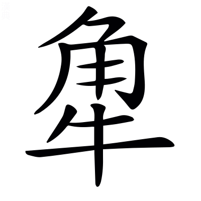
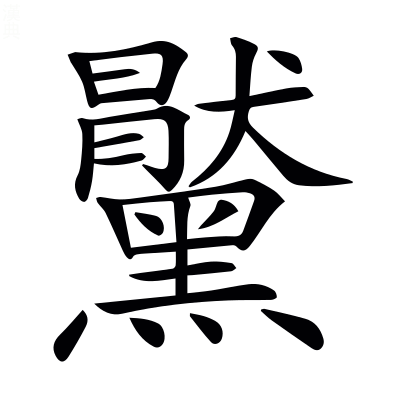

# 文選卷第五十四

> 梁昭明太子撰
> 
> 文林郎守太子右內率府錄事參軍事崇賢館直學士臣李善注上

論四

## 五等論

五等，公侯伯子男也。言古者聖王立五等以治天下，至漢封樹，不依古制，乃作此論。

> 陸士衡

夫體國~~經野~~營治[^54.1.1]，先王所慎；周禮曰：惟王建國，體國經野。*鄭玄曰：體猶分也。*漢書：王嘉曰「王者代天爵人，尤宜慎之。」

創制垂基，思隆後葉。典引曰：順命以創制。論語比考讖曰：以俟後聖垂基也。

然而經略不同，長世異術，左氏傳：楚芋尹無宇曰「天子有經略，古之制也。」又，北宮文子曰「有其國家，令聞長世。」

五等之制，始於黃唐。郡縣之治，創自秦漢。漢書曰：周爵五等，蓋千八百國。而太昊黃帝後，唐虞侯伯猶存。至秦遂并四海，分天下為郡縣，前聖苗裔，靡有孑遺者矣。漢興，因秦制度，以撫海內。班固漢書述曰：自昔黃唐，經略萬國，三代損益。降及秦漢，革滅五等，制立郡縣。

得失成敗，備在典謨，王命論曰：歷古今之得失，驗行事之成敗。書序曰：典謨訓誥。

是以其詳，可得而言。夫先王知帝業至重，天下至曠。楊雄長楊賦曰：恢帝業。孫卿子曰：國者，天下之大器也。重，任也。廣雅曰：曠，遠也。

曠不可以偏制，重不可以獨任；任重必於借`即`力，制曠終乎因人。故設官分職，所以輕其任也；周禮曰：設官分職，以為民極。

並建五長，所以弘其制也。尙書曰：外薄四海，咸建五長。

於是乎立其封疆之典，財其親疏之宜，賈逵國語注曰：裁，制也，裁與財古字通。

使萬國相維，以成盤石之固，周禮曰：凡邦國小大相維。漢書：宋昌曰「漢所謂盤石之宗也。」

宗庶雜居，而定維城之業。毛詩曰：宗子維城，無俾城壞，~~而~~無獨斯畏[^54.1.2]。

又有以見綏世之長御，識人情之大方；大方，法也。呂氏春秋曰：凡耕之大方，力者欲柔。

知其為人不如厚己，利物不如圖身；周易曰：利物足以和義。莊子曰：愛人利物之謂仁。左氏傳：欒武子曰「季孫圖其身，不忘其君。」

安上在於悅下，為己在乎利人。孝經曰：安上治民，莫善於禮。左氏傳：邾子曰「天生民而樹之君，以利之也，民既利矣，孤必與焉。」

故易曰「說以使民，民忘其勞。」周易兌卦之辭也。

孫卿曰「不利而利之，不如利而後利之之利也[^54.1.3]。」孫卿子曰：不利而利之，不如利而後利之之利也。不愛而用之，不如愛而後用之之功也。利而後利，不如利而不利者之利也。愛而後用之，不如愛而弗用者之功也。利而不利，愛而不用者，取天下者也。利而後利之，愛而後用之者，保社稷者也。不利而利之，不愛而用之者，危國家者也。

是以分天下以厚樂，而己得與之同憂；饗天下以豐利，而我得與之共害。孟子謂齊宣王曰「樂以天下，憂以天下，然而不王者，未之有也。」*趙岐曰：古賢君樂則以己之樂與天下同之，憂則以天下之憂與己共之。如是，未有不王者也。*鄭玄儀禮注曰：饗，勸強之也。

利博則恩篤，樂遠則憂深。呂氏春秋曰：衆封建，非以私賢也，所以博利博義也。利博義博，則無敵也。毛詩序曰：憂深思遠。

故諸侯享食土之實，萬國受世及之祚矣。杜預左氏傳注曰：享，受也。禮記曰：大人世及以為禮。*鄭玄曰：大人，諸侯之謂也。*

夫然，則南面之君，各務其治；論語：子曰「雍也，可使南面也。」*包氏曰：可使南面，言~~王~~任諸侯~~治~~之治也[^54.1.4]。*

九服之民，知有定主。周書曰：乃辨九服之國也。

上之子愛於是乎生，周書：文王曰「周視民如子愛也。」禮記曰：子庶民則百姓勸。*鄭玄曰：子猶愛也。*

下之體信於是乎結。禮記曰：先王能脩禮以達義，體信以達順。*鄭玄注曰：體猶親也。*

世治足以敦風，道衰足以御暴。故強毅之國，不能擅一時之勢；孟子曰：彼一時也，此一時也。

雄俊之士，無所寄霸王之志。漢書：宣帝曰「漢家本以霸王道雜之。」

然後國安由萬邦之思治，主尊賴群后之圖身。毛詩序曰：下泉思治也。

譬猶衆目營方，則天網自昶；目，網目也，以喻諸侯。天網，以喻王室也。營，布居也。老子曰：天網恢恢，疏而不失。呂氏春秋曰：一引其網，萬目皆張。廣雅曰：昶，通也。

四體辭難，而心膂獲乂。四體亦喻諸侯，心膂亦喻王室也。論語：丈人曰「四體不勤。」尙書：穆王曰「作股肱心膂。」

三代所以直道，四王所以垂業也。論語：子曰「三代之所以直道而行也。」*包氏曰：三代，夏商周也。*禮記曰：三王四代唯其師。*鄭玄曰：四代，謂虞夏商周也。*漢書：武帝策詔曰「屬統垂業，廢興何如？」

夫盛衰隆弊，理所固有；教之廢興，繫乎其人。漢書：韓安國曰「夫盛之有衰，猶朝之必暮。」禮記：哀公問政，子曰「文武之政，布在方策。其人存，則其政舉；其人亡，則其政息。」

愿法期於必涼，明道有時而闇。言法不可常愿，故期在於必薄；道不可常明，故有時而或闇。以諭盛衰廢興，抑唯常理也。孔安國尙書傳曰：愿，愨也；娛萬切。左氏傳：渾罕曰「君子作法於涼，其弊猶貪。」*杜預曰：涼，薄也。*

故世及之制，弊於彊禦；言諸侯世及而盛彊，其弊在於彊禦而難制也。毛詩曰：曾是彊禦。

厚下之典，漏於末折。言封建踰禮而為害，其漏在於末大而本折也。周易曰：剝，上以厚下安宅。左氏傳：楚子問申無宇曰「國有大城何如？」對曰「鄭京櫟實殺曼伯，宋蕭亳實殺子游，由是觀之，則害於國。末大必折，尾大不掉。」*杜預曰：折，折其本也。*

侵弱之舋，遘自三季；言諸侯秉權而王室侵弱，斯乃遘自三季也。班固異姓諸侯王表序曰：秦患周之敗，以為四夷交侵，以弱見奪，於是削去五等。杜預左氏傳注曰：舋，瑕隙也。國語：郭偃曰「三季王之亡，宜也。」*韋昭曰：季，末也。三季王，桀紂幽王也。*

陵夷之禍，終于七雄。言七雄力政，而王道因之陵夷。漢書：張釋之曰「秦陵夷至于二世，天下土崩。」東京賦曰：七雄並爭。

昔者成湯親照夏后之鑒，公旦目涉商人之戒，夏后之鑒，即殷鑒也。毛詩曰：殷鑒不遠，在夏后之世。尙書曰：爾唯舊人，爾丕克遠，省爾知寧，王若勤哉。*孔安國傳曰：目所親見，法之又明之也。*

文質相濟，損益有物。春秋元命苞曰：王者一質一文，據天地之道，天質而地文。論語：子曰「殷因於夏禮，所損益可知也；周因於殷禮，所損益可知也。」物，禮物也。

故五等之禮，不革于時，封畛之制，有隆焉爾時，呂氏春秋曰：等步畝封畛，所以一之也。小雅曰：封畛，界疆也。

豈玩二王之禍，而闇經世之筭乎？二王，謂夏殷也。經世，已見李蕭遠運命論。

固知百世非可懸御，善制不能無弊，而侵弱之辱，愈於殄祀，土崩之困，痛於陵夷也。家語：孔子曰「文武之祀，無乃殄乎？」漢書：徐樂上書曰「何謂土崩？秦之末葉是也。人困而主不恤，下怨而上不知，此之謂土崩。」[^54.1.5]

是以經始權其多福，慮終取其少禍。毛詩曰：經始靈臺。吳越春秋曰：大夫種善圖始，范蠡善慮終。賈逵國語注曰：權，秉也。尸子曰：聖人權福則取重，權禍則取輕。

非謂侯伯無可亂之符，郡縣非致治之具也。故國憂賴其釋位，主弱憑其翼戴。左氏傳：王子朝告于諸侯曰「王居于彘，諸侯釋位[^54.1.6]，以間王政。」又叔向語宣子曰「文之伯也，翼戴天子，加之以恭。」

及承微積弊，王室遂卑，新序曰：及定王，王室遂卑。

猶保名位，祚垂後嗣，左氏傳曰：名位不同。班固漢書序曰：後嗣承序，以廣親親。

皇統幽而不輟，神器否而必存者，豈非置勢使之然與？東京賦曰：怨皇統之見替。鄭玄論語注曰：輟，止也。老子曰：天下神器，不可為也，為者敗之。

降及亡秦，棄道任術，史記曰：商鞅見秦孝公，謂景監曰「吾說君以帝王之道，君曰『吾不能待』，吾以彊國之術說君，君大悅。」

懲周之失，自矜其得。言懲周以弱見奪，自矜以力滅周也。

尋斧始於所庇，制國昧於弱下，弱下之術，前王所棄，秦以為是，故謂之昧焉。左氏傳：宋昭公將去群公子，樂豫曰「不可，公族，公室之枝葉也，若去之，則本根無所庇蔭矣。葛藟猶能庇其本根，故君子以為比，況國君乎？此所謂庇焉而縱尋斧也。」賈逵國語注曰：尋，用也。

國慶獨饗其利[^54.1.7]，主憂莫與共害。國語曰：晉國有慶，未嘗不怡。史記：范雎曰「主憂臣辱。」

雖速亡趨亂，不必一道，毛萇詩傳曰：速，召也。

顛沛之釁，實由孤立。毛詩曰：人亦有言，顛沛之揭。*毛萇曰：顛，仆也；沛，拔也。揭，見根貌也。*漢書曰：漢興，懲戒亡秦孤立之敗也。

是蓋思五等之小怨，忘萬國之大德，毛詩曰：忘我大德，思我小怨。

知陵夷之可患，闇土崩之為痛也。周之不競，有自來矣。左氏傳：鄭石㚟謂子囊曰「今楚實不競，行人何罪？」又，叔孫曰「叔出季處，有自來矣。」

國乏令主，十有餘世，左氏傳：治區夫曰「為乏令主。」楊雄連珠曰：古之令主，所以統天者不遠焉。爾雅曰：令，善也。

然片言勤王，諸侯必應，論語：子曰「片言可以折獄。」左氏傳：狐偃言於晉侯曰「求諸侯莫如勤王也。」

一朝振矜，遠國先叛。公羊傳：葵丘之會，齊桓公震而矜之，叛者九國。震之者何？猶曰振振然。矜之者何？猶莫若我也。*何休曰：震矜，色自美之貌。*

故彊晉收其請隧之圖，暴楚頓其觀鼎之志，左氏傳：晉侯朝王，王享醴，命之宥，請隧，弗許。曰「王章也，未有代德而有二王，叔父之所惡也。」又曰：楚子伐陸渾之戎，遂至于雒，定王使王孫滿勞楚子，問鼎之大小輕重焉。*杜預曰：示欲逼周取天下也。*

豈劉項之能闚關，勝廣之敢號澤哉？漢書：沛公自武關入秦。又曰：羽至函谷關，使當陽君擊關，羽入至戲。又曰：勝廣為屯長，行至蘄西大澤鄉，勝自立為將軍，廣為都尉。

借使秦人因循周制，雖則無道，有與共弊，覆滅之禍，豈在曩日！曩日，謂土崩之禍也。

漢矯秦枉，大啟侯王。班固漢書表曰[^54.1.8]：藩國大者，夸州兼郡，可謂矯枉過其正矣。毛詩曰：大啟爾宇，為周室輔。

境土踰溢，不遵舊典。東京賦曰：規摹踰溢。尙書曰：舊典時式。

故賈生憂其危，朝錯痛其亂。漢書：賈誼曰「夫樹國固必相疑之勢，下數被其殃，上數爽其憂，甚非所以安上而全下也。」又，朝錯曰「請諸侯之罪過，削其支郡，不如此，宗廟不安也。」

是以諸侯阻其國家之富，憑其士民之力，阻，恃也。

勢足者反疾，土狹者逆遲。六臣犯其弱綱，七子衢其漏網。漢書：賈誼曰「大抵彊者先反。及淮陰王楚最彊，則先反；韓信倚胡，則又反；及貫高因趙資，則又反；陳狶兵精，則又反；彭越用梁，則又反；黥布用淮南，則又反；盧綰最弱，最後反。」然誼言八而機言六者，貫高非五等，盧綰亡入匈奴，故不數之。漢書曰：景帝即位，朝錯說上，令削吳，及書至，吳王起兵誅漢吏二千石以下。膠西膠東淄川濟南楚趙亦皆反也。

皇祖夷於~~黥~~黔徒[^54.1.9]，西京病於東帝。皇祖，高祖也。南都賦曰：皇祖止焉。史記曰：淮南王黥布反，高祖自往擊之，布走。高祖時為流矢所中，行道病。~~史記曰：荊王劉賈者，不知何屬。高祖立賈為荊王。淮南王黥布反，東擊荊。賈與戰，不勝，走富陵，為布軍所殺。漢書曰：賈稱從兄，而機以為皇祖，蓋別有所見。~~[^54.1.10]杜預左氏傳注曰：夷，傷也。楚漢春秋曰：下蔡亭長詈淮南王曰「封汝爵為千乘，東南盡日所出，尚未足~~黔~~黥徒群盜所邪[^54.1.11]！而反，何也？」然~~黥~~黔當為~~黔~~黥[^54.1.12]。漢書曰：吳王濞反，削吳會稽豫章郡，書至，起兵反。以袁盎為太常，使吳，吳王聞盎來，知其欲說，笑而應曰「我已為東帝，尚誰拜？」不肯見盎。

是蓋過正之災，而非建侯之累也。矯枉過其正，已見上文。周易曰：利用建侯行師。

然呂氏之難，朝士外顧；宋昌策漢，必稱諸侯。漢書曰：呂產呂祿自知背高皇帝約，因作亂。朱虛侯使人告兄齊王，令發兵西，太尉勃丞相平為內應，以誅諸呂，齊王遂發兵。又曰：呂后崩，大臣迎立代王。郎中令張武曰「以迎大王為名，實不可往。」宋昌曰「群臣議非也。內有朱虛東牟之親，外畏吳楚淮南琅邪齊代之強，故迎大王，大王勿疑也。」

逮至中葉，忌其失節，割削宗子，有名無實，天下曠然，復襲亡秦之軌矣。漢書曰：諸侯小者淫荒越法，大者睽孤橫逆，以害身喪國。故文帝采賈生之議分齊趙，景帝用朝錯之計削吳楚。

是以五侯作威，不忌萬邦；新都襲漢，易於拾遺也。五侯，已見鮑明遠數詩。尙書曰：臣作福作威，害于而家，凶于而國。漢書曰：封王莽為新都侯。襲猶取也。漢書：梅福上書曰「昔高祖舉秦如鴻毛，取楚如拾遺。」

光武中興，纂隆皇統，而猶遵覆車之遺轍，養喪家之宿疾。言光武猶遵師前漢之失也。晏子春秋：諺曰「前車覆，後車戒也。」尙書曰：卿士有一於身，家必喪。

僅及數世，姦軌充斥，尙書曰：寇賊姦宄。軌與宄古字通。左氏傳：士文伯讓子產曰「以政刑之不修，寇盜充斥。」

卒有彊臣專朝，則天下風靡，彊臣，謂梁冀之屬也。楚辭曰：世從俗而變化，隨風靡而成行。

一夫縱衡，則城池自夷，豈不危哉！一夫，謂董卓也。漢書曰：縱橫恣意[^54.1.13]。衡，古橫字。

在周之衰，難興王室，放命者七臣，干位者三子。左氏傳曰：初，王姚嬖于莊王，生子頹，~~子頹~~有寵[^54.1.14]，蒍國為之師。及惠王即位，取蒍國之圃以為囿。邊伯之宮近於王宮，王取之。王奪子禽祝跪與詹父田，而收膳夫之秩。故蒍國、邊伯、石速、詹父、子禽祝跪作亂，因蘇氏。秋，五大夫奉子頹以伐王，不克，出奔溫。蘇子奉子頹以奔衛。衛師燕師伐周。冬，立子頹。*杜預曰：石速，士也，不在五大夫之數。*又曰：初，甘昭公有寵於惠后，惠后將立之，未及而卒。昭公奔齊，襄王復之。又通於隗氏，王替隗氏。頹叔桃子曰「我實~~能~~使狄[^54.1.15]。」遂奉太叔以狄師伐周，大敗周師。王出適鄭，處于汜。*杜預曰：甘昭公，王子太叔帶也。*又曰：王子朝、賓起有寵於景王，王崩，子朝因舊官百工之喪職秩者，與靈景之族以作亂。單子逆悼王于莊宮以歸。*杜預曰：子朝，景王之長庶子；悼王，子猛也。*班固漢書述曰：孝景蒞政，諸侯方命。*韋昭曰：方，放命，不承天子之制。*七臣，蒍國、邊伯、詹父、子禽祝跪及頹叔、桃子、賓起也。王命論曰：闇干天位。爾雅曰：干，求也。三子，子頹、叔帶、子朝。

嗣王委其九鼎，凶族據其天邑，嗣王，惠襄悼也。凶族，三子也。史記曰：秦取周九鼎寶器。尙書曰：肆予敢求爾于天邑商。

鉦`征`鼙震於閫宇，鋒鏑流乎絳闕。傅玄正都賦曰：巍巍絳闕。

然禍止畿甸，害不覃及，毛詩曰：覃及鬼方。*毛萇曰：覃，延也。*

天下晏然，以治待亂。漢書：難蜀父老曰「及臻厥成，天下晏如也。」淮南子曰：靜以合躁，治以待亂。

是以宣王興於共和，襄惠振於晉鄭。史記曰：周人相與畔襲厲王，王出奔于彘。召公周公二相行政，號曰共和。~~共和~~十四年[^54.1.16]，厲王死於彘，二相乃共立宣王。又曰：惠王即位，衛師燕師伐周，立子頹。鄭伯見虢叔曰「盍納王乎？」虢公曰「寡人之願也。」同伐王城~~，鄭伯將王自圉門入，虢叔自北門入~~[^54.1.17]，殺王子頹及五大夫。又曰：天王出居于鄭，避母弟之難也。晉侯辭秦師而下~~次于陽樊~~[^54.1.18]，右師圍溫，左師逆王。王入於王城。取太叔于溫，殺之。*杜預曰：叔帶，襄王同母弟也。*

豈若二漢。階闥蹔擾，而四海已沸，階闥蹔擾，謂王莽也。

孽臣朝入，而九服夕亂哉！孽臣，董卓也。范曄後漢書曰：何進私呼卓入朝以脅太后。卓至，遂廢少帝為弘農王。

遠惟王莽篡逆之事，近覽董卓擅權之際，億兆悼心，愚智同痛。左氏傳：薳啟彊曰「孤與二三臣悼心失圖。」

然周以之存，漢以之亡，夫何故哉？豈世乏曩時之臣，士無匡合之志歟？聖主得賢臣頌曰：齊侯設庭燎之禮，故有匡合之功。論語：子曰「管仲相桓公，一匡天下。」又曰：桓公九合諸侯。

蓋遠績屈於時異，雄心挫於卑勢耳。左氏傳：劉子謂趙孟曰「子蓋亦遠績禹功，而大庇民乎？」阮瑀與孫權書曰：大丈夫雄心能無憤發。

故烈士扼腕，終委寇讎之手；漢書曰：燕齊之間，方士瞋目扼腕。

中人變節，以助虐國之桀。漢書：張博書曰「公卿變節。」史記：王歜謂燕將曰「今為君將，是助桀為暴也。」

雖復時有鳩合同志，以謀王室，漢書曰：王莽居攝，翟義心惡之，遂與劉宇劉璜結謀舉義兵。范曄後漢書曰：董卓以尙書韓馥為冀州刺史，侍中劉岱為兗州刺史。馥等到官，各舉義兵討卓。

然上非奧主，下皆市人，漢書曰：翟義立劉信為天子。左氏傳曰：蔡公召子干子晢，將納之。子干歸，韓宣子問於叔向曰「子干其濟乎？」對曰「難。恭~~王~~有寵子[^54.1.19]，國有奧主。」呂氏春秋曰：驅市人而戰之，可以勝人之教卒也。

師旅無先定之班，君臣無相保之志。是以義兵雲合，無救劫弒之禍；范曄後漢書曰：卓聞劉馥等兵起，乃鴆殺弘農王。文子曰：用兵有五，誅暴救弱謂之義。漢書：班彪曰「假號雲合。」

民望未改，而已見大漢之滅矣。漢書曰：莽聞翟義起兵，乃拜王邑為虎牙將軍，以擊義，破之。於是莽自謂大得天人之助，遂即真矣。漢書：陳涉詐稱公子扶蘇，從民望也。

或以諸侯世位，不必常全，公羊傳曰：諸侯世位，故國君為一體也。全或為今，非。

昏主暴君，有時比跡，故五等所以多亂。唐子曰：暴主闇君，不可生殺。范曄後漢書：孔融薦謝該曰「該實卓然，比跡前列。」

今之牧守，皆以官方庸能，雖或失之，其得固多，故郡縣易以為治。夫德之休明，黜陟日用，左氏傳：王孫滿曰「德之休明。」尙書曰：三載考績，三考，黜陟幽明。

長率連屬，咸述其職，禮記曰：千里之外，設方伯，五國以為屬，屬有長。十國以為連，連有帥。尙書大傳曰：古者諸侯之於天子，五年一朝，謂之述職。述其職者，述其所職也。

而淫昏之君，無所容過，左氏傳：宋子魚曰「又用諸淫昏之鬼。」

何則其不治哉？故先代有以之興矣。苟或衰陵，百度自悖，尙書曰：不役耳目，百度惟貞。

鬻官之吏，以貨準才，則貪殘之萌，皆如群后也。安在其不亂哉？故後王有以之廢矣。且要而言之，五等之君，為己思治；民安己受其利，故曰為己。

郡縣之長，為利圖物。物能利己，乃始圖之，故云為利。

何以徵之？蓋企及進取，仕子之常志；企及進取，奔競以招譽。禮記曰：不至焉者，企而及之。史記：蘇秦說燕王曰「忠信者，所以自為也。進取者，所以為人也。」

修己安民，良士~~之~~所希及[^54.1.20]。修己安民，積德以厚下。論語：子曰「修己以安百姓。」尙書：咎繇曰「在安民。」孔安國論語注曰：希，少也。

夫進取之情銳，而安民之譽遲。鄭玄禮記注曰：情，實也。銳猶疾也。

是故侵百姓以利己者，在位所不憚；安民譽遲，不若侵之以利己。鄭玄論語注曰：憚，難也。

損實事以養名者，官長所夙夜也。進取名速，故損實事以求之。列子曰：范氏有子曰子華，善養私名。

君無卒歲之圖，臣挾一時之志。五等則不然，知國為己土，衆皆我民，民安己受其利，國傷家嬰其病。說文曰：嬰，繞也。

故前人欲以垂後，後嗣思其堂構，尙書曰：若考作室，子乃弗肯堂，矧肯構。

為上無苟且之心，群下知膠固之義。漢書：王嘉上䟽曰「孝文時，吏居官者或長子孫，然後上下相望，莫有苟且之意。」莊子曰：待膠漆而固者，是侵其德者也。范曄後漢書：鄭泰曰「以膠固之衆，當解合之勢。」

使其並賢居治，則功有厚薄；言八代同建五等，而廢興殊跡者，譬並賢居治，而功有優劣也。

兩愚處亂，則過有深淺。言秦漢同立郡縣而脩短異期者，譬兩愚居亂而過有輕重也。

然則八代之制，幾可以一理貫；八代，謂五帝三王也。然此八代，異於辯亡，各觀文立義也。崔寔政論曰：今既不能純法八代，故宜參以霸政。論語曰：吾道一以貫之。

秦漢之典，殆可以一言蔽矣。論語：子曰「詩三百，一言以蔽之，曰『思無邪』。」孔安國尙書傳曰：蔽，斷也。

---

[^54.1.1]: 考異：夫體國經野：袁本、茶陵本「經野」作「營治」。案：二本是也。晉書作「經野」，尤依之改，非。

[^54.1.2]: 考異：注「而獨斯畏」：何校「而」改「無」，陳同，是也。各本皆誤。

[^54.1.3]: 考異：不如利而後利之之利也：袁本云善無「也」字。茶陵云五臣有。案：此蓋所見不同，或尤校改之也。晉書有。又案：五臣、晉書不重「之」字，非也。今荀子富國篇亦未誤。凡五臣雖同晉書，仍善是彼非者，今不悉出。

[^54.1.4]: 考異：注「言王諸侯治之也」：袁本、茶陵本「王」作「任」，是也。案「治之」當作「之治」，各本皆倒。

[^54.1.5]: 考異：注「漢書徐樂上書曰」下至「此之謂土崩」：袁本、茶陵本此在「家語孔子曰云云」之前。案：依善例當云「土崩已見上文」，蓋後來改為複出而又誤倒之耳。尤順正文乙轉，仍未得善舊也。

[^54.1.6]: 考異：注「告于諸侯曰王居于彘諸侯釋位」：袁本、茶陵本無「曰王居于彘諸侯」七字。

[^54.1.7]: 考異：國慶獨饗其利：袁本「獨」下有校語云善作「猶」。茶陵本無校語。案：二本所載五臣良注云「言秦獨饗天下之利」，是其本作「獨」也。尤及茶陵蓋以五臣亂善。晉書「獨」。又本篇「忘萬國之大德」，袁本「萬」作「經」，云善作「萬」，茶陵作「經」，仍失著校語。又「愿法期於必涼」，袁、茶陵二本「涼」作「諒」，其實善「涼」，五臣「諒」，二本失著校語。彼尤本皆校改正之矣。

[^54.1.8]: 考異：注「班固漢書表曰」：袁本、茶陵本「表」作「贊」。案：此尤校改之也。

[^54.1.9]: 考異：皇祖夷於黥徒：案「黥」當作「黔」，晉書正作「黔」，最為不誤。此注云「然黔當為黥」，唯正文用「黔首」字為「黥布」字，故善云爾也。必五臣因此注改「黔」為「黥」，後來各本以之亂善而失著校語。又此注亦多誤，見下。

[^54.1.10]: 考異：注「史記曰荊王劉賈者」下至「蓋別有所見」：袁本、茶陵本無此五十九字。案：二本最是。此不知何人駮善注之語，必別本有記於旁者，而尤誤取以增多也。

[^54.1.11]: 考異：注「尚未足黔徒群盜所耶」：案「黔」當作「黥」，各本皆誤，說見下。

[^54.1.12]: 考異：注「然黥當為黔」：案「黥」、「黔」二字當互易。此因正文既改作「黥」，與注不相應，復改注以就之也。考史記、漢書「黥布」，不得云「當為黔」甚明。他書不更見有作「黔」者，上條楚漢春秋亦誤改無疑。

[^54.1.13]: 考異：注「縱恣意」：陳云「縱」下脫「橫」字，是也。各本皆脫。

[^54.1.14]: 考異：注「生子頹子頹有寵」：袁本、茶陵本不重「子頹」二字。

[^54.1.15]: 考異：注「我實能使狄」：案「能」字不當有。各本皆衍。

[^54.1.16]: 考異：注「號曰共和共和十四年」：袁本、茶陵本不重「共和」二字。

[^54.1.17]: 考異：注「鄭伯將王自圉門入虢叔自北門入」：袁本、茶陵本無此十四字。

[^54.1.18]: 考異：注「次于陽樊」：袁本、茶陵本無此四字。

[^54.1.19]: 考異：注「恭王有寵子」：袁本、茶陵本無「王」字，是也。

[^54.1.20]: 考異：良士之所希及：案：當依晉書去「之」字。各本皆衍。

## 辯命論

并序　劉璠梁典曰：~~峻字~~孝標[^54.2.1]辯命論，蓋以自喻云。

> 劉孝標孝標植根淄右，流寓魏庭，冒履艱危，僅至江左。負材矜地，自謂坐致雲霄。豈圖逡巡十稔，而榮慚一命。因茲著論，故辭多憤激，雖義越典謨，而足杜浮競也。

主上嘗與諸名賢言及管輅，主上，謂梁武帝也。魏志曰：管輅，字公明，平原人也。舉秀才。弟辰謂輅曰「大將軍待君意厚，冀當富貴乎？」輅長嘆曰「然天與我才，明不與我年壽，恐四十七八間，不見女嫁男娶婦也。」是歲八月，為少府丞。明年二月卒，年四十八。

歎其有奇才而位不達。時有在赤墀之下豫聞斯議，歸以告余。漢書：梅福上書曰「願涉赤墀之塗。」說文曰：墀，塗地也。禮，天子赤墀。

余謂士之窮通，無非命也。莊子：孔子謂子路曰「聖人知窮之有命，知通之有時，臨大難而不懼，聖人之勇也。」

故謹述天旨，因言其致云。鄭玄禮記注曰：致之言至也。

臣觀管輅，天才英偉，珪璋特秀，郭~~璞~~子曰[^54.2.2]：孫子荊上品狀王武子曰「天才英博，亮拔不群。」抱朴子曰：故侍郎周生恭遠，英偉名儒。禮記曰：珪璋特達。抱朴子曰：陸士龍士衡，曠世特秀，超古邈今。

實海內之名傑，豈日者卜祝之流乎？墨子曰：墨子北之齊，過日者，日者曰「帝今日殺黑龍於北方，先生之色黑，不可以北。」墨子不聽。史記有日者列傳。然~~則~~占候時日[^54.2.3]，謂之日者。司馬遷書曰：僕之先人，文史星歷，近乎卜祝之間。

而官止少府丞，年終四十八，天之報施，何其寡與？史記曰：司馬遷曰「天之報施善人何如哉？」

然則高才而無貴仕，饕餮而居大位，自古所歎，焉獨公明而已哉！左氏傳：楚叔伯曰「夫有大功而無貴仕，其人能靖者與有幾？」又曰：縉雲氏有不才子，貪于飲食，冒于貨賄，天下之人以比三凶，謂之饕餮。

故性命之道，窮通之數，夭閼`烏葛`紛綸，莫知其辯。家語：魯哀公問於孔子曰「人之命與性何謂？」孔子對曰「分於道謂之命，形於一謂之性。」*王肅曰：分於道，始得為人也；人各受陰陽剛柔之性，故曰形於一也。*莊子曰：風之積也不厚，則其負大翼也無力，故九萬里則風斯在下矣，而後乃今培風，背負青天而莫之夭閼者。*司馬彪曰：夭，折也；閼，止也。言無有折止使不通者也。*封禪書曰：紛綸葳蕤。鄭玄儀禮注曰：辨，別也。

仲任蔽其源，子長闡其惑。范曄後漢書曰：王充，字仲任。鄭玄論語注曰：蔽，塞也。論衡曰：凡人有生死壽夭之命，亦有貴賤貧富之命。命當貧賤，雖富貴之，猶涉患禍，失其富貴；命當富貴，雖貧賤之，猶逢福善，離其貧賤。今言隨操行而至，此命在末不在本也。司馬遷，字子長。蒼頡篇曰：闡，開也。史記：或曰「天道無親，常與善人。伯夷叔齊可謂善人，而餓死。七十子之徒，仲尼獨薦顏淵為好學，然蚤夭。盜跖日殺不辜，肝人之肉，竟以壽終。此其大較者也[^54.2.4]，余甚惑焉。」

至於鶡冠甕牖，必以懸天有期；鼎貴高門，則曰唯人所召。七略：鶡冠子者，蓋楚人也。常居深山，以鶡為冠，故曰鶡冠。禮記：孔子曰「儒者蓬戶甕牖。」論衡曰：夫命懸於天，吉凶在乎時。吳都賦曰：高門鼎貴。漢書：賈捐之曰「石顯方鼎貴。」又，于公曰「少高大門，令容駟馬高蓋車。」左傳：閔子~~騫~~馬曰[^54.2.5]「禍福無門，惟人所召。」

譊譊讙咋，異端斯起。蜀志曰：孟光好公羊春秋，而譏呵左氏，每與來敏爭此二義，常譊譊讙咋。*裴松之曰：譊音奴交切。讙音詡袁切。咋音祖格切。*論語：子曰「攻乎異端。」

蕭遠論其本而不暢其流，子玄語其流而未詳其本。李蕭遠作運命論，言治亂在天，故曰論其本。郭子玄作致命由己論，言吉凶由己，故曰語其流。

嘗試言之曰：莊子曰：請嘗試言之，天無為以之清，地無為以之寧。杜預左氏傳曰：嘗，試之也。

夫通生萬物[^54.2.6]，則謂之道；生而無主，謂之自然。老子曰：大道汜兮，萬物得之以生而不辭，功成而不有，愛養萬物而不為之主。*王弼曰：萬物皆得道而生。*管子曰：萬物以生，萬物以成，命之曰道。老子曰：天法道，道法自然。

自然者，物見其然，不知所以然，同焉皆得，不知所以得。莊子曰：孔子觀於呂梁，見一丈夫，謂孔子曰「吾長於水，而安於水，性也；不知吾所以然，命也。」*張湛曰：固然之理，不可以智知，知其不可知，故謂之命也。*莊子曰：天下誘然皆生，而不知其所以生；同焉皆得，而不知其所以得也。

鼓動陶鑄而不為功，庶類混成而非其力。周易曰：鼓天下之動者，存乎辭。*韓康伯曰：爻辭也。爻以鼓動，效天下之動也。*莊子：肩吾謂連叔曰「藐姑射之山。有神人居焉……將猶陶鑄堯舜也[^54.2.7]，孰肯以物為事。」典引曰：沈浮交錯，庶類混成。

生之無亭毒之心，死之豈虔劉之志。老子曰：亭之毒之，蓋之覆之。*王弼曰：亭，謂品其形；毒，謂成其質。*左氏傳：呂相曰「芟夷我農功，虔劉我邊陲。」~~言殺也~~[^54.2.8]

墜之淵泉非其怒，升之霄漢非其悅。墜之淵泉，鱗屬也。升之霄漢，羽族也。言稟性不同，非天之有悅怒也。淮南子曰：鳥魚生於陰，屬於陽，故魚遊於水，鳥飛於雲。夫鳥排虛而飛，獸蹠實而走，蛟龍水居，虎豹山處，天地之性也。

蕩乎大乎，萬寶以之化；確乎純乎，一化而不易。莊子曰：形非道不生，生非德不明，蕩蕩乎忽然出，勃然動，萬物從之乎。又曰：夫道，覆載萬物者也，洋洋乎大哉。庚桑楚曰「夫春氣發而百草生，正得秋而萬寶成。」又楚狂接輿謂肩吾曰「夫聖人之治也，治外乎正而後行，確乎能其事者而已矣。」*司馬彪曰：確乎不移易。*又曰：道流而不明，純純常常，乃比於狂。又曰：吾一受其成形，而不化以待盡也。又曰：性不可易，命不可變。

化而不易，則謂之命。命也者，自天之命也。呂氏春秋曰：若命之不可易。春秋元命苞曰：命者，天之命也，所受於帝，行正不過，得壽命也。

定於冥兆，終然不變。祖台之論命曰：存亡壽夭，咸定冥初。魏文帝典論曰：夫生之必死，天地所不能變。

鬼神莫能預，聖哲不能謀，西征賦曰：生有脩短之命，位有通塞之遇，鬼神莫之要，聖哲弗能預。

觸山之力無以抗，倒日之誠弗能感。淮南子曰：昔共工之力，怒不周之山，使地東南傾，與高辛爭為帝。*許慎曰：昔共工，古諸侯之強者也；不周之山，西北之山也。*陸機弔魏武文曰：夫以迴天倒日之力，而不能振形骸之內。

短則不可緩之於寸陰，長則不可急之於箭漏。淮南子曰：聖人不貴尺之璧，而重寸之陰。漢書曰：漏刻以百二十為度。*韋昭曰：舊漏晝夜共百刻，哀帝有短祚之期，故欲增之。*

至德未能踰，上智所不免。孝經曰：先王有至德要道。論語：子曰「唯上智與下愚不移。」魏文帝典論曰：夫生之必死，賢聖所不能免。

是以放勛之世，浩浩襄陵；天乙之時，焦金流石。尙書曰：放勛欽明。又，帝曰「湯湯洪水方割，蕩蕩懷山襄陵，浩浩滔天。」史記：天乙立，是為成湯。呂氏春秋曰：成湯之旱，煎沙爛石。楚辭曰：十日並出，流金鑠石。

文公其尾，宣尼絕其糧。傅子曰：周文王子公旦有聖德，謚曰文。毛詩曰：狼跋，美周公也。狼跋其胡，載~~疐~~其尾。*毛萇曰：~~疐~~[^54.2.9]，跲也。*音致。漢書平紀曰：追謚孔子曰宣尼公。論語曰：子在陳絕糧，從者病，莫能興。

顏回敗其叢蘭，冉耕歌其芣衛。家語曰：顏回年二十九而髮白，三十二而早死。文子曰：日月欲明，浮雲蓋之；叢蘭欲茂，秋風敗之。家語曰：冉耕，魯人，字伯牛，以德行著名，有惡疾。韓詩曰：采衛，傷夫有惡疾也。詩曰：采采芣衛，薄言采之[^54.2.10]。*薛君曰：芣衛，澤寫也。芣衛，臭惡之菜，詩人傷其君子有惡疾，人道不通，求己不得，發憤而作，以事興芣衛，雖臭惡乎，我猶采采而不已者，以興君子雖有惡疾，我猶守而不離去也。*

夷叔斃淑媛之言，子輿困臧倉之訴。崔瑋七蠲曰：三王行化，夷叔隱己。古史考曰：伯夷叔齊者，殷之末世，孤竹君之二子也，隱於首陽山，采薇而食之。野有婦人謂之曰「子義不食周粟，此亦周之草木也。」於是餓死。曹植與楊脩書曰：有南威之容，乃可以論於淑媛。傅子曰：昔仲尼既歿，仲弓之徒追論夫子之言[^54.2.11]，謂之論語。其後，鄒之君子孟子輿擬其體著七篇，謂之孟子。然子輿，孟子之字也。孟子曰：魯平公將出，嬖人臧倉曰「有司未知所之，敢請。」公曰「將見孟子。」曰「何哉？孟子之後喪踰前喪，君無見。」公曰「諾。」樂正子~~春~~見孟子[^54.2.12]，曰「克告於君，君將來見也。嬖人有臧倉者沮君，君是以不果來。」孟子曰「吾之不遇魯侯，天也。臧氏之子，焉能使予不遇哉？」

聖賢且猶若此，而況庸庸者乎？大戴禮：孔子曰「所謂庸人者，口不能道善言，而志不邑邑，此可謂庸人也。」馮衍顯志賦曰：獨慷慨以遠覽兮，非庸庸之所識。

至乃伍員浮尸於江流，三閭沈骸於湘渚。史記曰：子胥自剄死，王乃取子胥尸，盛以鴟夷之革，浮之於江中。楚辭：漁父見屈原曰「子非三閭大夫與？」漢書曰：賈誼渡湘水，為賦以弔屈原。楊雄反騷曰：欽弔楚之湘纍。*音義曰：諸不以罪死曰纍。屈原赴湘死，故曰纍也。*

賈大夫沮志於長沙，馮都尉皓髮於郎署。漢書曰：賈誼為長沙王太傅，誼既以謫去，意不自得。又曰：馮唐以孝著，為郎中署長，事文帝，帝輦過問曰「父老何自為郎？」

君山鴻漸，鎩`殺`羽儀於高雲；敬通鳳起，摧迅翮於風穴。此豈才不足而行有遺哉？東觀漢記曰：桓譚，字君山，少好學，遍治五經。光武即位，拜議郎。詔會議雲臺，上問譚曰「吾以讖決之，何如？」譚不應，良久對曰「臣生不讀讖。」問其故，譚頗有所非是。上怒曰「桓譚非法，將去斬之。」譚叩頭流血，乃貰。由是失旨，遂不復轉遷。出補六安太守丞，之官，意不樂，道病卒。周易曰：鴻漸于陸，其羽可用為儀。許慎淮南子注曰：鎩羽，殘羽也。應璩與從弟書曰：弋下高雲之鳥。東觀漢記曰：馮敬通，少有俶儻之志，明帝以為衍材過其實，抑而不用，遂埳壈失志，以壽終於家。淮南子曰：鳳皇之翔，至德也，濯羽弱水，暮宿風穴。*許慎曰：風穴，風所從出。*韓詩外傳曰：子路謂孔子曰「夫子尚有遺行乎？奚居之隱也。」

近世有沛國劉瓛，瓛`桓`弟璡`津`，並一時之秀士也。蕭子顯齊書曰：劉瓛，字子珪，沛國人。宋大明四年舉秀才，少篤學，博通五經，為安成王撫軍，行參軍公事，免，自此不復仕。永明初，遇疾卒。瓛弟璡，字子璥，方軌正直。文惠太子召璡入侍東宮，每上事，輒削草，尋署射聲校尉，卒官。呂氏春秋曰：舜耕於歷山，秀士從之。璥，君影切。

瓛則關西孔子，通涉六經，循循善誘，服膺儒行。范曄後漢書曰：楊震，字伯起，經明博覽，無不窮究。諸儒為之語曰「關西孔子楊伯起。」論語：顏淵曰「夫子循循然善誘人。」禮記曰：回之為人也，得一善則拳拳服膺而不失之矣。又禮記有儒行篇。

璡則志烈秋霜，心貞崑玉，亭亭高竦，不雜風塵。范曄後漢書孔融論曰：凜凜焉，皜皜焉，其與秋霜崑玉比質可也。西京賦曰：狀亭亭以~~岧岧~~苕苕[^54.2.13]。郭璞遊仙詩曰：高蹈風塵外。

皆毓德於衡門，並馳聲於天地。周易曰：君子以振民毓德。毛詩曰：衡門之下，可以棲遲。

而官有微於侍郎，位不登於執戟，相次殂落，宗祀無饗。答客難曰：官不過侍郎，位不過執戟。尙書曰：帝乃殂落。*孔安國曰：殂落，死也。*

因斯兩賢以言古，則昔之玉質金相，英髦秀達，毛詩曰：追琢其章，金玉其相。*毛萇曰：相，質也。*又曰：髦，俊也。

皆擯斥於當年，韞奇才而莫用，司馬彪莊子注曰：擯，棄也。馬融論語注曰：韞，藏也。

~~徼~~候草木以共彫[^54.2.14]，與麋鹿而同死，楚辭曰：願徼幸而有待兮，宿莽與野草同死。*王逸曰：將與百草俱殂落也。*論衡曰：身與草木俱朽。楚辭曰：死日將至兮，與麋鹿同坑。

膏塗平原，骨填川谷，堙滅而無聞者，豈可勝道哉！檄蜀文曰：肝腦塗中原，膏液潤野草。封禪書曰：堙滅而不稱者，不可勝數。

此則宰衡之與皁隸，容彭之與殤子，尙書曰：冢宰掌邦治。毛詩曰：實維阿衡，左右商王。左氏傳曰：人有十等，士臣皁，皁臣輿，輿臣隸。列仙傳曰：容成公者，自稱黃帝師，見於周穆王，能善補導之事，髮白復黑，齒落復生，事與老子同，亦云老子師。又曰：彭祖，殷賢大夫，歷夏至商末，號年七百。莊子：南郭子綦曰「天下莫大于秋毫之末，而太山為之小；莫壽于殤子，而彭祖為之夭。」

猗頓之與黔婁，陽文之與敦洽。猗頓，已見過秦論。皇甫謐高士傳曰：~~黥~~黔婁先生[^54.2.15]修清節，不求進於諸侯，及終，曾參來弔曰「何以為謚？」妻曰「以康為謚。」曾子曰「先生存時，食不充虛，衣不蓋形，死則手足不歛，傍無酒肉，何樂於此而謚為康哉？」淮南子曰：不待脂粉，西施陽文也。*許慎曰：楚之好人也。*呂氏春秋曰：陳有惡人焉，曰敦洽讎麋，椎顙廣顏，色如漆赭，垂~~髮~~眼臨鼻，長肘而盭股[^54.2.16]，陳侯見而甚悅之。*高誘曰：醜而有德也。*

咸得之於自然，不假道於才智。抱朴子曰：聖人體天，皆得之於自然。莊子曰：古之至人，假道於仁，託宿於義。

故曰「死生有命，富貴在天」，其斯之謂矣。論語：子夏曰「死生有命，富貴在天。」

然命體周流，變化非一，或先號後笑，或始吉終凶，或不召自來，或因人以濟。周易曰：同人先號咷而後笑。老子曰：不召而自來。傅子曰：昔人知下相接之易，故因人以致人。

交錯糾紛，迴還倚伏，非可以一理徵，非可以一途驗。而其道密微，寂寥忽慌，無形可以見，無聲可以聞。子虛賦曰：交錯糾紛。鶡冠子曰：禍兮福之所倚，福兮禍之所伏。思玄賦曰：北叟頗識其倚伏。抱朴子曰：駑銳不可以不塗驗，箏琴不可以膠柱調也。鬼谷子曰：即欲闔之貴密，密之貴微。西征賦曰：寥廓忽恍。文子曰：道以無有為體，視之不見其形，聽之不聞其聲，謂之幽冥。呂氏春秋曰：道也者，視之弗見，聽之弗聞，不可為壯[^54.2.17]。管子曰：視之不見其形，聽之不聞其聲，而序其成，謂之道。

必御物以效靈，亦憑人而成象；譬天王之冕旒，任百官以司職。言性命之道，雖係于天，然其來也，必憑人而御物。譬如天王冕旒而執契，必因百官司職以立政。文子曰：德仁義禮四者，聖人之所以御萬物也。

而或者睹湯武之龍躍，謂龕亂在神功；聞孔墨之挺生，謂英睿擅奇響；成湯武王也。周易曰：見龍在田。又曰：或躍在淵。墨子曰：夏桀時，天乃命湯於鑣宮，有神來告曰「夏德大亂，往攻之，予必使汝大戡之。」商王紂時，周武王見三神曰「予既沈漬殷紂於酒德，往攻之，予必使汝大戡之。」孔，孔子；墨，墨翟。蔡邕陳太丘碑曰：元方季方，皆命世挺生，膺期特授。

視彭韓之豹變，謂鷙猛致人爵；見張桓之朱紱，謂明經拾青紫。彭，彭越，韓，韓信[^54.2.18]。易曰：君子豹變，其文蔚。禮記曰：鷙蟲攫搏，不程其勇者。*鄭玄曰：鷙蟲，猛獸也。*孟子曰：有天爵，有人爵。仁義忠信，樂善不倦，此天爵也。公卿大夫，此人爵也。漢書曰：張禹，字子文，善說論語。令禹授太子，遷光祿大夫，賜關內侯。范曄後漢書曰：桓榮治歐陽尙書，授太子，為太子少傅，封關內侯。禮記曰：諸侯佩山玄玉而朱組綬。蒼頡篇曰：綬，紱也。漢書：夏侯勝曰「士病不明經，經術苟明，取青紫如俛拾地芥。」

豈知有力者運之而趨乎？莊子曰：夫藏舟於壑，藏山於澤，謂之固矣。然而夜半有力者負之而走，昧者不知。

故言而非命，有六蔽焉爾。論語：子曰「由，汝聞六言六蔽矣乎。」然文雖出此，蔽義則殊。

請陳其梗概：東京賦：其梗概如此。

夫靡顏膩理，哆噅`許為`顣`子六`頞`烏割`形之異也。楚辭曰：靡顏膩理，遺視矊些。*王逸曰：靡，緻也；膩，滑也。*淮南子曰：哆噅，蘧蒢戚施，醜也[^54.2.19]。說文曰：哆，張口也；音侈。通俗文曰：噅，口不正也；去皮切。史記：唐舉見蔡澤曰「先生魋顏蹙齃。」

朝秀晨終，龜鵠千歲，年之殊也。淮南子曰：朝秀不知晦朔。*許慎曰：朝生暮死蟲也，生水上，似蠶蛾。*養生要曰：龜鵠壽千百之數，性壽之物也。

聞言如響，智昏菽麥，神之辨也。史記曰：淳于髡說鄒忌畢，趨出，曰「是人者，吾語之微言五，其應我若響之應聲，是人必封不久矣。」左氏傳曰：程滑殺厲公，荀罃士魴逆周子于京師而立之。周子有兄而無惠，不能辨菽麥，故不可立。*杜預曰：菽，大豆也。豆麥殊形，易別，故以之為癡者之候也。*

同知三者定乎造化榮辱之境，獨曰由人，是知二五而未識於十。其蔽一也。淮南子曰：大丈夫恬然無為，與造化逍遙。*高誘曰：造化，天地也。*莊子曰：定乎內外之分，辨乎榮辱之境。左氏傳：叔興曰「吉凶由人。」史記：齊威王使人說越曰「晉楚鬥，越兵不起，知二五而不知十也。」

龍犀日角，帝王之表；朱建平相書曰：頟有龍犀入髮，左角日，右角月，王天下也。

河目龜文，公侯之相。孔叢子曰：夫子適周，見萇弘，萇弘語劉文公曰「孔子仲尼有聖人之表，河目而隆顙，是黃帝之形貌也。」王肅家語注曰：河目，上下匡平而長也。范曄後漢書曰：李固貌狀有奇表，鼎角匿犀，足履龜文。後為太尉。

撫鏡知其將刑，壓紐顯其膺錄。蜀志曰：蜀郡張裕曉相術，每舉鏡視面，自知刑死，未嘗不撲之於地。左氏傳曰：初，楚恭王無冢適，有寵子五人，無適立焉。乃大有事於群望而祈曰「請神擇五人主社稷。」乃遍以璧見於群望曰「當璧而拜者，神所立也。」與巴姬密埋璧於太室之庭，使五人拜。康王跨之，靈王肘加焉，子干子皙皆遠之。平王弱，抱而入，再拜，皆壓紐。

星虹樞電，昭聖德之符；夜哭聚雲，鬱興王之瑞。春秋元命苞曰：大星如虹，下流華渚，女節夢意，感生朱宣。*宋均曰：華渚，渚名也。朱宣，少昊氏。*詩含神務曰：大電繞樞，照郊野，感符寶，生黃帝。漢高祖功臣頌曰：彤雲晝聚，素靈夜哭。國語曰：興王賞諫臣。

皆兆發於前期，渙汗於後葉。周易曰：渙汗其大號。~~渙，散也~~[^54.2.20]

若謂驅貔虎，奮尺劍。入紫微，升帝道，則未達窅冥之情，未測神明之數。其蔽二也。尙書：武王曰「如虎如貔，如熊如羆，于商郊。」*孔安國曰：貔，~~摯~~執夷[^54.2.21]，虎屬也。*史記：高祖曰「吾提三尺劍取天下，此非天命乎？」薛綜西京賦注曰：天有紫微宮，王者象之，曰紫微宮。淮南子曰：源道者，測窅冥之深。呂氏春秋曰：窅乎冥，莫知其情。王命論曰：神明之祚，可得而妄處哉！

空桑之里，變成洪川；歷陽之都，化為魚鱉。呂氏春秋曰：有莘氏女子採桑，得嬰兒于空桑之中；獻之其君。令烰人養之，察其所以然。曰「其母居伊水之上，孕，夢有神告之曰『臼出水而東走，毋顧。』明日，視臼水出，告其鄰，東走十里，而顧其邑，盡為水，身因化為空桑。」故命之曰伊尹。淮南子曰：歷陽，淮南之縣名，今屬九江郡。歷陽中有老嫗，常行仁義，有兩諸生~~告~~過之，謂曰[^54.2.23]「此國當沒為湖，嫗視東城門閫有血，便走上山，勿反顧也。」自此嫗數往視門，門吏問之，嫗對如其言。東門吏殺雞，以血塗門，明日嫗早往視門有血，便走上山，國沒為湖[^54.2.22]。

楚師屠漢卒，睢`息惟`河鯁其流；秦人坑趙士，沸聲若雷震。漢書曰：項羽晨擊漢，大戰彭城靈辟東睢水上，大破漢軍，多殺士卒，睢水為不流。戰國策：蔡澤謂應侯曰「白起率數萬之師，越韓魏而敗彊趙，北坑馬服，屠四十餘衆，流血成川，沸聲如雷。使秦業帝，白起之勢也。」論衡曰：言有命者曰「夫天下之大，人民之衆，一歷陽之都，一長平之坑，同命俱死，未可怪也。命當溺死，故相聚於歷陽。命當壓死，故相積於長平。」

火炎崑嶽，礫石與琬琰俱焚；嚴霜夜零，蕭艾與芝蘭共盡。尙書曰：火炎崑岡，玉石俱焚。又曰：弘璧琬琰在西序。傅玄鷹兔賦曰：秋霜一下，蘭艾俱落。毛萇詩傳曰：蕭，蒿也。

雖游夏之英才伊顏之殆庶，焉能抗之哉？其蔽三也。史記曰：言偃，吳人，字子游。夏，子夏也。伊，伊尹也。顏，顏回也。孟子曰：得天下之英才而教育之。易曰：顏氏之子其殆庶幾乎。*王弼曰：庶幾於知幾者也。*

或曰明月之珠，不能無纇；夏后之璜，不能無考。淮南子曰：夏后氏之璜，不能無考；明月之珠，不能無纇。*高誘曰：考，不平也。纇，瑕也。*

故亭伯死於縣長，相如卒於園令。范曄後漢書曰：崔駰，字亭伯。竇憲為車騎將軍，辟駰為掾，察駰高第，出為長岑長。駰自以遠去，不得意，遂不之官而歸，卒于家。漢書曰：相如拜為孝文園令，既病免，家居茂陵而死。

才非不傑也，主非不明也，而碎結綠之鴻輝，殘懸黎之夜色，抑尺之量有短哉？戰國策：應侯謂秦王曰「梁有懸黎，宋有結綠，而為天下名器。」楚辭：鄭詹尹曰「尺有所短，寸有所長。」

若然者，主父偃公孫弘對策不升第，歷說而不入，牧豕淄原，見棄州部。設令忽如過隙，溘`苦合`死霜露，其為詬恥，豈崔馬之流乎？及至開東閤，列五鼎，電照風行，聲馳海外，寧前愚而後智，先非而終是？漢書：主父偃，齊國臨淄人也，學長短縱橫術。家貧，假貸無所得，北遊燕趙中山，皆莫能厚客。甚困，乃上書闕下，拜為郎，至中大夫。偃曰「大丈夫生不五鼎食，死則五鼎烹耳。」又曰：公孫弘，淄川人也。家貧，牧豕海上。太常上對諸儒。太常奏弘第居下策[^54.2.24]。天子擢弘對為第一，後至丞相。於是起客館，開東閤，以延賢士。莊子曰：賓放於鄉里，逐於州部。又曰：人生天地之間，若白駒之過隙。楚辭曰：寧溘死以流亡兮，余不忍為此態也。漢書：詔曰「公孫弘不幸罹霜露之疾。」說文曰：詬，恥也。范曄後漢書：吳漢謂臧宮曰「將軍嚮者經虜城下，震揚威靈，風行電照。」九州春秋：閻忠說皇甫嵩曰「今將軍威德震本朝，風聲馳海外。」

將榮悴有定數，天命有至極，而謬生妍蚩。其蔽四也。應璩與曹元長書曰：春生者繁華，秋榮者零悴，自然之數，豈有恨哉！孫子荊陟陽侯詩曰：三命皆有極。

夫虎嘯風馳，龍興雲屬，淮南子曰：虎嘯而谷風至，龍舉而景雲屬。四子講德論曰：風馳雨集。

故重華立而元凱升，辛受生而飛廉進。史記曰：虞舜名曰重華。左氏傳：季孫行父曰「昔高陽氏有才子八人，蒼舒、隤敳、檮戭、大臨、尨降、庭堅、仲容、叔達，天下之民謂之八愷。高辛氏有才子八人，伯奮、仲堪、叔獻、季仲、伯虎、仲熊、叔豹、季狸，天下之民謂之八元。舜臣堯，舉八愷使主后土，舉八元使布五教于四方。」史記曰：帝乙崩，子辛立，是為帝辛，天下謂之紂。尙書曰：祖伊恐，奔告于受。*孔安國曰：受，紂也，音相亂。*史記曰：仲矞生蜚廉，蜚廉生惡來，父子俱以材力事殷紂。

然則天下善人少，惡人多，闇主衆，明君寡。莊子曰：天下之善人少，而不善人多。法言曰：聖君少，庸君多。杜篤弔比干文曰：闇主之在上，豈忠諫之是謀。

而薰蕕不同器，梟鸞不接翼，家語：顏回曰「聞薰蕕不同器而藏，堯桀不共國而治，以其類異也。」孫盛晉陽秋：王夷甫論曰「夫芝蘭之不與茨棘俱植，鸞鳳之不與梟鴞同棲，天理固然，易在曉晤。」西都賦曰：接翼側足。

是使渾`胡本`敦`徒本`檮`桃`杌`兀`踵武於雲臺之上，仲容庭堅耕耘於巖石之下。左氏傳：太史克曰「昔帝鴻氏有不才子，掩義隱賊，好行凶德，醜類惡物，頑嚚不友，是與比周，天下之人謂之渾敦。顓頊氏有不才子，不可教訓，不知話言，告之則頑，舍之則嚚，傲狠明德，以亂天常，天下之人謂之檮杌。」楚辭曰：忽奔走以先後，及前王之踵武。東觀漢記曰：詔賈逵入講南宮雲臺，使出左氏大義。仲容、庭堅，八愷之二，已見上注。法言曰：谷口鄭子真，不詘其節，而耕於巖石之下。

橫`去`謂廢興在我，無繫於天。其蔽五也。漢書：董仲舒對策曰「治亂廢興，在於己，非天降命，不可得反。」

彼戎狄者，人面獸心，宴安鴆毒，戎狄，謂魏也。班固漢書贊曰：夷狄之人，被髮左衽，人面獸心。左氏傳：管敬仲曰「宴安鴆毒，不可懷也。」

以誅殺為道德，以蒸報為仁義，漢書曰：匈奴，其俗寬則隨畜田獵禽獸為生業，急則人習戰攻以侵伐，其天性也。父死，妻其後母，兄弟死，皆取其妻妻之。小雅曰：上淫曰蒸，下淫曰報。

雖大風立於青丘，鑿齒奮於華野，比於狼戾，曾何足喻？淮南子曰：堯之時，~~猰貐~~窫窳~~、鑿齒~~、九嬰、大風、封~~狶~~豕、鑿齒、修蛇[^54.2.25]皆為害，堯乃使羿誅鑿齒於疇華之澤，殺九嬰於凶水之上，繳大風於青丘之野，上射十日而下殺窫窳，斷修蛇於洞庭，禽封豕於桑林。*高誘曰：疇華，南方地。九嬰，水火為人害者，北狄之地有凶水。大風，鷙鳥。青丘，東方。封豕，大彘。桑林，湯禱旱地。*戰國策：張儀曰「趙王狼戾無親。」

自金行不競，天地板蕩，左帶沸脣，乘間電發，金行，謂晉也。干寶搜神記曰：程猗說石圖曰「金者晉之行也。」左氏傳：師曠曰「吾驟歌北風，又歌南風，南風不競。」毛詩曰：上帝板板。*毛萇曰：板板，反也；*杯晚切[^54.2.26]。又曰：蕩蕩上帝。*鄭玄曰：蕩蕩，法度廢壞之貌。*左帶，左衽也。尙書曰：四夷左衽，罔弗咸賴。王元長勸給虜書啟曰：息沸脣於桑墟。然齊梁之間，通以虜為沸脣也。魏志：詔曰「劉備孫權乘間作禍。」辨亡論曰：電發荊南。

遂覆瀍洛，傾五都，東京賦曰：泝洛背河，左伊右瀍。干寶晉紀：愍帝詔曰「群邪作逆，傾盪五都。」

居先王之桑梓，竊名號於中縣，毛詩曰：維桑與梓，必恭敬止。漢書高紀：詔曰「秦徙中縣之人南方三郡。」

與三皇競其萌黎，五帝角其區宇，韋昭漢書注曰：萌，民也。孔安國尙書傳曰：黎，衆也。東京賦曰：區宇乂寧。

種落繁熾，充仞神州。范曄後漢書曰：梁商上表曰「匈奴種類繁熾，不可殫盡。」子虛賦曰：充仞其中，不可勝記。河圖曰：崑崙東南，地方千里，名曰神州。

嗚呼！福善禍淫，徒虛言耳！尙書：湯曰「天道福善禍淫，降災于夏，以彰厥罪。」

豈非否泰相傾，盈縮遞運，而汩`骨`之以人？其蔽六也。周易曰：泰者通也，物不可以終通，故受之以否。老子曰：高下相傾。淮南子曰：孟春始嬴，孟秋始縮。*高誘曰：嬴，長也；縮，短也。*孔安國尙書傳曰：汩，亂也。

然所謂命者，死生焉，貴賤焉，貧富焉，治亂焉，禍福焉。此十者，天之所賦也。死生有命，已見上文。論衡曰：凡人有死生夭壽之命，亦有貴賤貧富之命。墨子曰：貧富治亂，固有天命，不可損益。呂氏春秋曰：禍福之所自來，衆人以為命，焉知其所由之也。

愚智善惡，此四者，人之所行也。桓範世要論曰：遇不遇，命也。善不善，人也。

夫神非舜禹，心異朱均，才絓中庸，在於所習。舜禹，二帝也。淮南子曰：性命可說，不待學問而合於道，堯舜文王也；不可教以道，不可喻以德者，丹朱商均也。夫上不及堯舜，下不若商均，此教訓之所喻也。*高誘曰：丹朱，堯子也；商均，舜子也。*廣雅曰：絓，止也，胡卦切。賈誼過秦曰：陳涉……材能不及中庸。論衡曰：中人之性在所習，習善為善，習惡為惡。

是以素絲無恆，玄黃代起，鮑魚芳蘭，入而自變。言在所習也。淮南子曰：墨子見練絲而泣之，為其可以黃，可以黑。*高誘曰：閔其化也。*大戴禮曰：與君子游，苾乎如入蘭芷之室，久而不聞，則與之化矣；與小人游，臭乎如入鮑魚之肆，久而不聞，則與之化矣。是故君子慎其所去就也。

故季路學於仲尼，厲風霜之節；尸子曰：子路，東鄙之野人，孔子教之為賢士。王隱晉書曰：應瞻為太守，人歌之曰：威若風霜，恩如父母。

楚穆謀於潘崇，成殺逆之禍。左氏傳曰：楚子欲立王子職而黜太子商臣，商臣聞之，告其師潘崇，曰「能事諸乎？」曰「不能。」「能行大事乎？」曰「能。」以宮甲圍成王，王縊，穆王立。潘崇，太子師。

而商臣之惡，盛業光於後嗣；仲由之善，不能息其結纓。楚之後業皆商臣之子孫。周易曰：盛德大業，至矣哉！尙書曰：在今後嗣王。左氏傳曰：衛渾良夫與太子入舍於孔氏之外圃，欲劫孔悝而納太子。季子曰「太子無勇，若燔臺半，必舍孔叔。」太子聞之，懼，下召石乞、盂敵子路，以戈擊之，斷纓。子路曰「君子死，冠不免。」結纓而死。*杜預曰：季子，子路是也。*

斯則邪正由於人，吉凶在乎命。或以鬼神害盈，皇天輔德。周易曰：鬼神害盈而福謙。尙書曰：皇天無親，惟德是輔。

故宋公一言，法星三徙，呂氏春秋曰：宋景公有疾，司~~馬~~星子韋曰[^54.2.27]「熒惑守心，心，宋分野也，君當移於相。」公曰「相，股肱也，除心腹之疾而置之股肱，可乎？」曰「可移於民。」公曰「民，所以為國，無民，何以為君？」曰「可移於歲。」公曰「歲所以養民，歲不登，何以畜民？」子韋曰「君善言三，熒惑必退三舍，延君命二十一年。」視之，信。廣雅曰：熒惑謂之罰星，或謂之執法。

殷帝自翦，千里來雲。呂氏春秋曰：湯克夏，四年，天大旱，湯乃以身禱於桑林，於是翦其髮，~~磨~~磿其手[^54.2.28]，自以為犧，用祈福於上帝，雨乃大至。淮南子曰：湯之時，旱，七年，以身禱於桑林之祭，而四海之雲湊，千里之雨至。

若使善惡無徵，未洽斯義。因此而言，則害盈輔德，其由影響，若以善惡~~猶命~~之理無徵[^54.2.29]，故未洽乎斯義。毛萇詩傳曰：洽，合也。

且于公高門以待封[^54.2.30]，嚴母掃墓以望喪，漢書曰：于定國父于公，其閭門壞，父老方共修之，于公謂之曰「少高大閭門，令容駟馬高蓋車。我理獄多陰德，未嘗有所冤，子孫必有興者。」至定國為丞相，封侯傳世。又曰：嚴延年遷河南太守，其母從東海來，欲從延年臘，到雒陽，適見報囚，母大驚。畢正臘已，謂延年曰「天道神明，人不可獨殺。我不自意當老見壯子被刑戮也，行矣！去女東歸掃除墓地耳。」後歲餘果敗。

此君子所以自彊不息也。言善惡有徵，故君子庶幾自彊而不息也。周易·象曰：天行健，君子以自彊不息，

如使仁而無報，奚為修善立名乎？斯徑廷`定`之辭也。若必為仁而無報，何故修善而立名乎？是不由命明矣。或為茲說者，斯乃徑廷之言耳。莊子：肩吾問于連叔曰「大有徑廷，不近人情。」*司馬彪曰：徑廷，激~~遏~~過之辭也[^54.2.31]。*

夫聖人之言顯而晦，微而婉，幽遠而難聞，河漢而不測。此釋聖人之言，顯晦難測也。左氏傳：君子曰「春秋之稱，微而顯，志而晦，婉而成章。」莊子：市南宜僚見魯侯曰「南越有邑焉，名建德之國」，君曰「彼其道幽遠而無人。」又，肩吾問于連叔曰「吾聞言於接輿，大而無當，往而不反。吾驚怖其言，猶河漢而無極。」*司馬彪曰：極，崖也。言廣若河漢，無有崖也。*

或立教以進庸怠，或言命以窮性靈，此釋不同之所由也。

積善餘慶，立教也；鳳鳥不至，言命也。周易曰：積善之家，必有餘慶。徐幹中論曰：北海孫翱云「積善餘慶，誘民於善路耳。」論語：子曰「鳳鳥不至，河不出圖，吾已矣夫！」

今以其片言辯其要趣，何異乎夕死之類而論春秋之變哉。毛萇詩傳曰：蜉蝣，渠略也，朝生夕死。莊子曰：蟪蛄不知春秋也。

且荊昭德音，丹雲不卷；周宣祈雨，珪璧斯罄；左氏傳曰：有雲如衆赤鳥，夾日飛三日，楚子使問周太史，太史曰「其當王身乎？若禜之，可移於令尹司馬。」王曰「除腹心之疾而寘諸股肱，何益？不穀不有大過，天其夭諸？有罪受罰，又焉移之！」遂弗禜。毛詩序曰：雲漢，仍叔美宣王也。毛詩曰：圭璧既卒，寧莫我聽。

于叟種德，不逮勛華之高；延年殘獷，未甚東陵之酷。勛華，已見上文。說文曰：獷，不可附也；古猛切。莊子曰：伯夷叔齊死名於首陽之下，盜跖死利於東陵之上。

為善一，為惡均，而禍福異其流，廢興殊其跡，蕩蕩上帝，豈如是乎？毛詩曰：蕩蕩上帝，下民之辟。

詩云「風雨如晦，雞鳴不已。」此釋君子所以自彊也。毛詩鄭風也。鄭玄箋曰：喻君子雖居亂世，不變改其節度也。

故善人為善。焉有息哉？尙書曰：吉人為善，惟日不足。家語：孔子曰「事君之難也，焉可以息哉？」

夫食稻粱，進芻豢，衣狐貉，襲冰紈，觀窈眇之奇儛，聽雲和之琴瑟，此生人之所急，非有求而為也。論語：子曰「食夫稻。」韓詩外傳：田饒謂魯哀公曰「黃鵠啄君稻~~梁~~粱[^54.2.32]。」國語曰：芻豢幾何。論語：子曰「狐貉之厚以居。」漢書曰：齊地織作冰紈。長楊賦曰：憎聞鄭衛窈眇之聲。阮籍詠懷詩曰：北里多奇儛。周禮曰：孤竹之管，雲和之琴瑟。

修道德，習仁義，敦孝悌，立忠貞，漸禮樂之腴潤，蹈先王之盛則，此君子之所急，非有求而為也。然則君子居正體道，樂天知命，公羊傳曰：君子大居正。莊子：弇堈弔曰「夫體道者，天下之君子也。」*郭象曰：言體道者人之宗主也。*周易曰：樂天知命，故不憂。

明其無可奈何，識其不由智力，莊子曰：知不可奈何而安之若命，唯有德者能之。王命論曰：不知神器有命，不可以智力求。

逝而不召，來而不距，生而不喜，死而不慼。莊子曰：予惡乎知說生之~~或~~非惑邪[^54.2.33]？予惡乎知惡死之非弱喪而不知歸者邪[^54.2.34]？

瑤臺夏屋，不能悅其神；尸子曰：人之言君天下者，瑤臺九累，而堯白屋。楚辭曰：冬有大夏。*王逸曰：夏，大屋也。*毛詩曰：於我乎夏屋渠渠。

土室編蓬，未足憂其慮。土室編蓬，已見非有先生論

不充詘於富貴，不遑遑於所欲。禮記：孔子曰「儒有不隕穫於貧賤，不充詘於富貴。」皇甫謐高士傳：黔婁先生妻謂曾子曰「先生不慼慼於貧賤，不遑遑於富貴。」論語曰：富與貴，是人之所欲也。

豈有史公董相不遇之文乎？司馬遷為太史公，故曰史公。遷集有悲不遇賦。法言曰：災異董相。*李軌曰：董相，江都相董仲舒也。*仲舒集有士不遇賦。

---

[^54.2.1]: 考異：注「峻字孝標辨命論」：袁本、茶陵本無「峻字」二字。案：無者是也。下五字為一句。

[^54.2.2]: 考異：注「郭璞曰孫子荊」：案：此有誤也。「璞」，疑當作「子」。郭子三卷，在隋志小說。

[^54.2.3]: 考異：注「然則占候時日」：案「則」字不當有。各本皆衍。善例無此也。

[^54.2.4]: 考異：注「此其大較者也」：袁本、茶陵本「大」下有「彰」字。

[^54.2.5]: 考異：注「閔子騫曰」：案「騫」當作「馬」。各本皆誤。

[^54.2.6]: 考異：夫通生萬物：茶陵本「通」作「道」。袁本無「夫通」二字。案：二本不著校語，無以知善果何作？梁書作「夫通」。考選文與本傳向不齊一，但可資其借證，難以指為專據，何校於此篇多所更改，皆選文未必非，本傳未必是，今均不採。

[^54.2.7]: 考異：注「猶陶鑄堯舜也」：袁本、茶陵本「猶」上有「將」字。

[^54.2.8]: 考異：注「言殺也」：袁本、茶陵本無此三字。

[^54.2.9]: 考異：注「載疐其尾毛萇曰疐」：袁本二「疐」字作「」。茶陵本作「疐」。案「」字是也。正文善作「」，梁書同，故破「疐」為「」而引之。

[^54.2.10]: 考異：注「家語曰顏回」下至「薄言采之」：袁本、茶陵本此七十六字并於五臣，非也。尤所見未誤。

[^54.2.11]: 考異：注「追論夫子言」：袁本、茶陵本「言」上有「之」字。

[^54.2.12]: 考異：注「樂正子春見孟子曰」：袁本、茶陵本無「春」字。案：有者非。

[^54.2.13]: 考異：注「狀亭亭以岧岧」：案「岧岧」當作「苕苕」。各本皆誤。

[^54.2.14]: 考異：徼草木以共彫：袁本、茶陵本「徼」作「候」，是也。梁書作「候」。

[^54.2.15]: 考異：注「黥婁先生」：袁本、茶陵本「黥」作「黔」，是也。

[^54.2.16]: 考異：注「垂髮臨鼻長肘而盭」：袁本、茶陵本「髮」作「眼」，「盭」下有「股」字。案：今呂氏春秋作「眼」，其「盭」下仍無「股」字，或尤刪之也。

[^54.2.17]: 考異：注「呂氏春秋曰道也者」下至「不可為壯」：袁本、茶陵本無此二十字。

[^54.2.18]: 考異：注「彭彭越韓韓信」：袁本、茶陵本無此六字。案：此因同五臣翰注而刪之。尤所見是也。

[^54.2.19]: 考異：注「淮南子曰哆噅蘧蒢戚施醜也」：案此有誤也。所引脩務訓文，「哆」上有「啳」二字，無「醜也」二字。高誘注云「啳哆噅蘧蒢戚施，皆醜貌也」，或許慎云「醜也」耳。未審善兼引正文及注，或但引注，無以補正。

[^54.2.20]: 考異：注「渙散也」：袁本、茶陵本無此三字。

[^54.2.21]: 考異：注「貔摯夷」：何校「摯」改「執」，陳同，是也。各本皆偽。

[^54.2.22]: 考異：注「淮南子曰歷陽」：案：此有誤也。以下至「國沒為湖」皆注文，不得云「淮南子曰」，未審所脫。

[^54.2.23]: 考異：注「有兩諸生告過之謂曰」：何校去「告」字，是也。各本皆衍。

[^54.2.24]: 考異：注「太常上對諸儒太常奏弘第居下策」：何校「策」下添「奏」字，陳同。案：此有誤也。考漢書云「弘至太常上策詔諸儒」，又云「太常奏弘第居下策奏」，必善連引此二處耳。

[^54.2.25]: 考異：注「猰貐鑿齒九嬰大風封狶修蛇」：袁本、茶陵本「猰貐」作「窫窳」，「狶」作「豕」，「鑿齒」二字在「修蛇」上。案：此尤校改之也。下高注仍作「窫窳」「豕」，所改未是。

[^54.2.26]: 考異：注「毛萇曰杯晚切」：陳云「曰」下脫「板板反也」四字，是也。各本皆脫。

[^54.2.27]: 考異：注「司馬子韋曰」：案「馬」當作「星」，思玄賦注可證。又案：袁、茶陵二本此一節注并入五臣，非也。尤所見未誤。

[^54.2.28]: 考異：注「磨其手」：案「磨」當作「磿」。各本皆偽。與廣川長岑文瑜書引作「」，云「音酈」，可證。考呂氏春秋亦作「」，「」、「磿」同字，「磿」偽而為「磨」，猶顏氏家訓所謂「容成造磿」為碓磨之磨耳，故「」今亦偽而為「」也。皆當訂正。

[^54.2.29]: 考異：注「若以善惡猶命」：袁本、茶陵本「猶命」二字作「之理無徵」四字，是也。

[^54.2.30]: 考異：且于公高門以待封：袁本云善作「門高」。茶陵本云五臣作「高門」。案：二本所見傳寫誤倒，非也。此亦尤校改正之。梁書作「高門」。

[^54.2.31]: 考異：注「激遏之辭也」：袁本「遏」作「過」，是也。茶陵本亦誤「遏」。莊子釋文李云「謂激過也」，可借證。

[^54.2.32]: 考異：注「黃鵠啄君稻梁」：案「梁」當作「粱」，各本皆誤。

[^54.2.33]: 考異：注「予惡乎知說生之或非邪」：案「或非」當作「非惑」。各本皆倒誤。

[^54.2.34]: 考異：注「予惡乎知惡死之非弱喪而不知歸者邪」：袁本、茶陵本「非弱喪而不知歸者邪」九字作「或是邪」三字。案：此尤校改正之者。

---

文選卷第五十四

賜進士出身通奉大夫江南蘇松常鎮太等處承宣布政使司布政使胡克家重校刊
